cola Report for Hierarchical Partitioning - 'XinPancreas'
==================

**Date**: 2021-07-26 11:21:45 CEST, **cola version**: 1.9.4

----------------------------------------------------------------

<style type='text/css'>

body, td, th {
   font-family: Arial,Helvetica,sans-serif;
   background-color: white;
   font-size: 13px;
  max-width: 800px;
  margin: auto;
  margin-left:210px;
  padding: 0px 10px 0px 10px;
  border-left: 1px solid #EEEEEE;
  line-height: 150%;
}

tt, code, pre {
   font-family: 'DejaVu Sans Mono', 'Droid Sans Mono', 'Lucida Console', Consolas, Monaco, 

monospace;
}

h1 {
   font-size:2.2em;
}

h2 {
   font-size:1.8em;
}

h3 {
   font-size:1.4em;
}

h4 {
   font-size:1.0em;
}

h5 {
   font-size:0.9em;
}

h6 {
   font-size:0.8em;
}

a {
  text-decoration: none;
  color: #0366d6;
}

a:hover {
  text-decoration: underline;
}

a:visited {
   color: #0366d6;
}

pre, img {
  max-width: 100%;
}
pre {
  overflow-x: auto;
}
pre code {
   display: block; padding: 0.5em;
}

code {
  font-size: 92%;
  border: 1px solid #ccc;
}

code[class] {
  background-color: #F8F8F8;
}

table, td, th {
  border: 1px solid #ccc;
}

blockquote {
   color:#666666;
   margin:0;
   padding-left: 1em;
   border-left: 0.5em #EEE solid;
}

hr {
   height: 0px;
   border-bottom: none;
   border-top-width: thin;
   border-top-style: dotted;
   border-top-color: #999999;
}

@media print {
   * {
      background: transparent !important;
      color: black !important;
      filter:none !important;
      -ms-filter: none !important;
   }

   body {
      font-size:12pt;
      max-width:100%;
   }

   a, a:visited {
      text-decoration: underline;
   }

   hr {
      visibility: hidden;
      page-break-before: always;
   }

   pre, blockquote {
      padding-right: 1em;
      page-break-inside: avoid;
   }

   tr, img {
      page-break-inside: avoid;
   }

   img {
      max-width: 100% !important;
   }

   @page :left {
      margin: 15mm 20mm 15mm 10mm;
   }

   @page :right {
      margin: 15mm 10mm 15mm 20mm;
   }

   p, h2, h3 {
      orphans: 3; widows: 3;
   }

   h2, h3 {
      page-break-after: avoid;
   }
}
</style>


## Summary


First the variable is renamed to `res_rh`.


```r
res_rh = rh
```


The partition hierarchy and all available functions which can be applied to `res_rh` object.


```r
res_rh
```

```
#> A 'HierarchicalPartition' object with 'ATC:skmeans' method.
#>   On a matrix with 15527 rows and 1600 columns.
#>   Performed in total 7650 partitions.
#>   There are 30 groups under the following parameters:
#>     - min_samples: 16
#>     - mean_silhouette_cutoff: 0.9
#>     - min_n_signatures: 75 (signatures are selected based on:)
#>       - fdr_cutoff: 0.05
#>       - group_diff (scaled values): 0.5
#> 
#> Hierarchy of the partition:
#>   0, 1600 cols
#>   |-- 01, 452 cols, 1273 signatures
#>   |   |-- 011, 238 cols, 155 signatures
#>   |   |   |-- 0111, 126 cols (a)
#>   |   |   `-- 0112, 112 cols, 72 signatures (c)
#>   |   |-- 012, 113 cols, 306 signatures
#>   |   |   |-- 0121, 50 cols, 1 signatures (c)
#>   |   |   `-- 0122, 63 cols (a)
#>   |   `-- 013, 101 cols, 268 signatures
#>   |       |-- 0131, 47 cols, 4 signatures (c)
#>   |       `-- 0132, 54 cols (a)
#>   |-- 02, 582 cols, 2397 signatures
#>   |   |-- 021, 289 cols, 397 signatures
#>   |   |   |-- 0211, 147 cols, 174 signatures
#>   |   |   |   |-- 02111, 82 cols, 49 signatures (c)
#>   |   |   |   `-- 02112, 65 cols, 114 signatures
#>   |   |   |       |-- 021121, 32 cols, 0 signatures (c)
#>   |   |   |       `-- 021122, 33 cols (a)
#>   |   |   `-- 0212, 142 cols, 108 signatures
#>   |   |       |-- 02121, 80 cols (a)
#>   |   |       `-- 02122, 62 cols, 2 signatures (c)
#>   |   |-- 022, 218 cols, 689 signatures
#>   |   |   |-- 0221, 118 cols, 287 signatures
#>   |   |   |   |-- 02211, 72 cols, 7 signatures (c)
#>   |   |   |   `-- 02212, 46 cols, 48 signatures (c)
#>   |   |   `-- 0222, 100 cols, 139 signatures
#>   |   |       |-- 02221, 48 cols, 3 signatures (c)
#>   |   |       `-- 02222, 52 cols, 73 signatures (c)
#>   |   `-- 023, 75 cols, 1289 signatures
#>   |       |-- 0231, 34 cols (a)
#>   |       |-- 0232, 23 cols (b)
#>   |       `-- 0233, 18 cols (b)
#>   `-- 03, 566 cols, 2253 signatures
#>       |-- 031, 268 cols, 996 signatures
#>       |   |-- 0311, 79 cols (a)
#>       |   |-- 0312, 62 cols (a)
#>       |   |-- 0313, 58 cols (a)
#>       |   `-- 0314, 69 cols, 39 signatures (c)
#>       |-- 032, 245 cols, 439 signatures
#>       |   |-- 0321, 150 cols, 248 signatures
#>       |   |   |-- 03211, 69 cols, 87 signatures
#>       |   |   |   |-- 032111, 41 cols, 7 signatures (c)
#>       |   |   |   `-- 032112, 28 cols (b)
#>       |   |   `-- 03212, 81 cols (a)
#>       |   `-- 0322, 95 cols, 277 signatures
#>       |       |-- 03221, 44 cols, 18 signatures (c)
#>       |       `-- 03222, 51 cols, 22 signatures (c)
#>       `-- 033, 53 cols, 446 signatures
#>           |-- 0331, 17 cols (b)
#>           |-- 0332, 19 cols (b)
#>           `-- 0333, 17 cols (b)
#> Stop reason:
#>   a) Mean silhouette score was too small
#>   b) Subgroup had too few columns.
#>   c) There were too few signatures.
#> 
#> Following methods can be applied to this 'HierarchicalPartition' object:
#>  [1] "all_leaves"            "all_nodes"             "cola_report"           "collect_classes"      
#>  [5] "colnames"              "compare_signatures"    "dimension_reduction"   "functional_enrichment"
#>  [9] "get_anno_col"          "get_anno"              "get_children_nodes"    "get_classes"          
#> [13] "get_matrix"            "get_signatures"        "is_leaf_node"          "max_depth"            
#> [17] "merge_node"            "ncol"                  "node_info"             "node_level"           
#> [21] "nrow"                  "rownames"              "show"                  "split_node"           
#> [25] "suggest_best_k"        "test_to_known_factors" "top_rows_heatmap"      "top_rows_overlap"     
#> 
#> You can get result for a single node by e.g. object["01"]
```

The call of `hierarchical_partition()` was:


```
#> hierarchical_partition(data = mat, anno = anno, subset = 500, cores = 4)
```

Dimension of the input matrix:


```r
mat = get_matrix(res_rh)
dim(mat)
```

```
#> [1] 15527  1600
```

All the methods that were tried:


```r
res_rh@param$combination_method
```

```
#> [[1]]
#> [1] "ATC"     "skmeans"
```

### Density distribution

The density distribution for each sample is visualized as one column in the following heatmap.
The clustering is based on the distance which is the Kolmogorov-Smirnov statistic between two distributions.


```r
library(ComplexHeatmap)
densityHeatmap(mat, top_annotation = HeatmapAnnotation(df = get_anno(res_rh), 
    col = get_anno_col(res_rh)), ylab = "value", cluster_columns = TRUE, show_column_names = FALSE,
    mc.cores = 1)
```

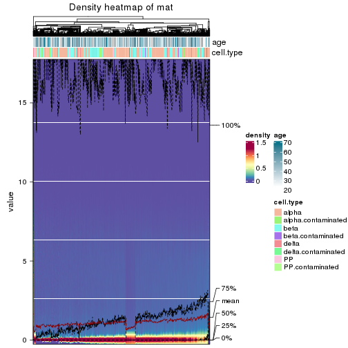


Some values about the hierarchy:


```r
all_nodes(res_rh)
```

```
#>  [1] "0"      "01"     "011"    "0111"   "0112"   "012"    "0121"   "0122"   "013"    "0131"  
#> [11] "0132"   "02"     "021"    "0211"   "02111"  "02112"  "021121" "021122" "0212"   "02121" 
#> [21] "02122"  "022"    "0221"   "02211"  "02212"  "0222"   "02221"  "02222"  "023"    "0231"  
#> [31] "0232"   "0233"   "03"     "031"    "0311"   "0312"   "0313"   "0314"   "032"    "0321"  
#> [41] "03211"  "032111" "032112" "03212"  "0322"   "03221"  "03222"  "033"    "0331"   "0332"  
#> [51] "0333"
```

```r
all_leaves(res_rh)
```

```
#>  [1] "0111"   "0112"   "0121"   "0122"   "0131"   "0132"   "02111"  "021121" "021122" "02121" 
#> [11] "02122"  "02211"  "02212"  "02221"  "02222"  "0231"   "0232"   "0233"   "0311"   "0312"  
#> [21] "0313"   "0314"   "032111" "032112" "03212"  "03221"  "03222"  "0331"   "0332"   "0333"
```

```r
node_info(res_rh)
```

```
#>        id best_method depth best_k n_columns n_signatures p_signatures is_leaf
#> 1       0 ATC:skmeans     1      3      1600         1503     9.68e-02   FALSE
#> 2      01 ATC:skmeans     2      3       452         1273     8.20e-02   FALSE
#> 3     011 ATC:skmeans     3      2       238          155     9.98e-03   FALSE
#> 4    0111 ATC:skmeans     4      3       126           NA           NA    TRUE
#> 5    0112 ATC:skmeans     4      2       112           72     4.64e-03    TRUE
#> 6     012 ATC:skmeans     3      2       113          306     1.97e-02   FALSE
#> 7    0121 ATC:skmeans     4      2        50            1     6.44e-05    TRUE
#> 8    0122 ATC:skmeans     4      2        63           NA           NA    TRUE
#> 9     013 ATC:skmeans     3      2       101          268     1.73e-02   FALSE
#> 10   0131 ATC:skmeans     4      2        47            4     2.58e-04    TRUE
#> 11   0132 ATC:skmeans     4      2        54           NA           NA    TRUE
#> 12     02 ATC:skmeans     2      3       582         2397     1.54e-01   FALSE
#> 13    021 ATC:skmeans     3      2       289          397     2.56e-02   FALSE
#> 14   0211 ATC:skmeans     4      2       147          174     1.12e-02   FALSE
#> 15  02111 ATC:skmeans     5      2        82           49     3.16e-03    TRUE
#> 16  02112 ATC:skmeans     5      2        65          114     7.34e-03   FALSE
#> 17 021121 ATC:skmeans     6      2        32            0     0.00e+00    TRUE
#> 18 021122 ATC:skmeans     6      2        33           NA           NA    TRUE
#> 19   0212 ATC:skmeans     4      2       142          108     6.96e-03   FALSE
#> 20  02121 ATC:skmeans     5      2        80           NA           NA    TRUE
#> 21  02122 ATC:skmeans     5      2        62            2     1.29e-04    TRUE
#> 22    022 ATC:skmeans     3      2       218          689     4.44e-02   FALSE
#> 23   0221 ATC:skmeans     4      2       118          287     1.85e-02   FALSE
#> 24  02211 ATC:skmeans     5      2        72            7     4.51e-04    TRUE
#> 25  02212 ATC:skmeans     5      2        46           48     3.09e-03    TRUE
#> 26   0222 ATC:skmeans     4      2       100          139     8.95e-03   FALSE
#> 27  02221 ATC:skmeans     5      2        48            3     1.93e-04    TRUE
#> 28  02222 ATC:skmeans     5      2        52           73     4.70e-03    TRUE
#> 29    023 ATC:skmeans     3      3        75         1289     8.30e-02   FALSE
#> 30   0231 ATC:skmeans     4      3        34           NA           NA    TRUE
#> 31   0232 not applied     4     NA        23           NA           NA    TRUE
#> 32   0233 not applied     4     NA        18           NA           NA    TRUE
#> 33     03 ATC:skmeans     2      3       566         2253     1.45e-01   FALSE
#> 34    031 ATC:skmeans     3      4       268          996     6.41e-02   FALSE
#> 35   0311 ATC:skmeans     4      2        79           NA           NA    TRUE
#> 36   0312 ATC:skmeans     4      2        62           NA           NA    TRUE
#> 37   0313 ATC:skmeans     4      2        58           NA           NA    TRUE
#> 38   0314 ATC:skmeans     4      2        69           39     2.51e-03    TRUE
#> 39    032 ATC:skmeans     3      2       245          439     2.83e-02   FALSE
#> 40   0321 ATC:skmeans     4      2       150          248     1.60e-02   FALSE
#> 41  03211 ATC:skmeans     5      2        69           87     5.60e-03   FALSE
#> 42 032111 ATC:skmeans     6      2        41            7     4.51e-04    TRUE
#> 43 032112 not applied     6     NA        28           NA           NA    TRUE
#> 44  03212 ATC:skmeans     5      2        81           NA           NA    TRUE
#> 45   0322 ATC:skmeans     4      2        95          277     1.78e-02   FALSE
#> 46  03221 ATC:skmeans     5      2        44           18     1.16e-03    TRUE
#> 47  03222 ATC:skmeans     5      2        51           22     1.42e-03    TRUE
#> 48    033 ATC:skmeans     3      3        53          446     2.87e-02   FALSE
#> 49   0331 not applied     4     NA        17           NA           NA    TRUE
#> 50   0332 not applied     4     NA        19           NA           NA    TRUE
#> 51   0333 not applied     4     NA        17           NA           NA    TRUE
```

In the output from `node_info()`, there are the following columns:

- `id`: The node id.
- `best_method`: The best method selected.
- `depth`: Depth of the node in the hierarchy.
- `best_k`: Best number of groups of the partition on that node.
- `n_columns`: Number of columns in the submatrix.
- `n_signatures`: Number of signatures with the `best_k`.
- `p_signatures`: Proportion of hte signatures in total number of rows in the matrix.
- `is_leaf`: Whether the node is a leaf.

Labels of nodes are encoded in a special way. The number of digits
correspond to the depth of the node in the hierarchy and the value of the
digits correspond to the index of the subgroup in the current node, E.g. a label
of “012” means the node is the second subgroup of the partition which is the
first subgroup of the root node.

### Suggest the best k


Following table shows the best `k` (number of partitions) for each node in the
partition hierarchy. Clicking on the node name in the table goes to the
corresponding section for the partitioning on that node.

[The cola vignette](https://jokergoo.github.io/cola_vignettes/cola.html#toc_13)
explains the definition of the metrics used for determining the best
number of partitions.


```r
suggest_best_k(res_rh)
```


|Node                    |Best method                                         |Is leaf   |Best k |1-PAC |Mean silhouette |Concordance | #samples|   |
|:-----------------------|:---------------------------------------------------|:---------|:------|:-----|:---------------|:-----------|--------:|:--|
|[Node0](#Node0)         |ATC:skmeans                                         |          |4      |0.93  |0.93            |0.96        |     1600|*  |
|[Node01](#Node01)       |ATC:skmeans                                         |          |3      |1.00  |0.97            |0.99        |      452|** |
|[Node011](#Node011)     |ATC:skmeans                                         |          |2      |0.84  |0.92            |0.96        |      238|   |
|Node0111-leaf           |ATC:skmeans                                         |✓ (a)     |3      |0.85  |0.86            |0.94        |      126|   |
|Node0112-leaf           |ATC:skmeans                                         |✓ (&#99;) |2      |0.74  |0.92            |0.95        |      112|   |
|[Node012](#Node012)     |ATC:skmeans                                         |          |2      |1.00  |0.97            |0.99        |      113|** |
|Node0121-leaf           |ATC:skmeans                                         |✓ (&#99;) |2      |1.00  |0.95            |0.98        |       50|** |
|Node0122-leaf           |ATC:skmeans                                         |✓ (a)     |2      |0.73  |0.90            |0.95        |       63|   |
|[Node013](#Node013)     |ATC:skmeans                                         |          |2      |1.00  |1.00            |1.00        |      101|** |
|Node0131-leaf           |ATC:skmeans                                         |✓ (&#99;) |2      |0.95  |0.95            |0.98        |       47|*  |
|Node0132-leaf           |ATC:skmeans                                         |✓ (a)     |2      |0.44  |0.85            |0.91        |       54|   |
|[Node02](#Node02)       |ATC:skmeans                                         |          |3      |1.00  |0.98            |0.99        |      582|** |
|[Node021](#Node021)     |ATC:skmeans                                         |          |2      |0.86  |0.90            |0.96        |      289|   |
|[Node0211](#Node0211)   |ATC:skmeans                                         |          |4      |0.94  |0.93            |0.96        |      147|*  |
|Node02111-leaf          |ATC:skmeans                                         |✓ (&#99;) |2      |1.00  |0.96            |0.98        |       82|** |
|[Node02112](#Node02112) |ATC:skmeans                                         |          |2      |1.00  |0.98            |0.99        |       65|** |
|Node021121-leaf         |ATC:skmeans                                         |✓ (&#99;) |2      |0.87  |0.94            |0.97        |       32|   |
|Node021122-leaf         |ATC:skmeans                                         |✓ (a)     |2      |0.36  |0.66            |0.86        |       33|   |
|[Node0212](#Node0212)   |ATC:skmeans                                         |          |2      |0.98  |0.96            |0.98        |      142|** |
|Node02121-leaf          |ATC:skmeans                                         |✓ (a)     |2      |0.78  |0.89            |0.95        |       80|   |
|Node02122-leaf          |ATC:skmeans                                         |✓ (&#99;) |2      |0.93  |0.92            |0.97        |       62|*  |
|[Node022](#Node022)     |ATC:skmeans                                         |          |2      |0.97  |0.96            |0.98        |      218|** |
|[Node0221](#Node0221)   |ATC:skmeans                                         |          |2      |0.90  |0.94            |0.98        |      118|   |
|Node02211-leaf          |ATC:skmeans                                         |✓ (&#99;) |2      |1.00  |0.98            |0.99        |       72|** |
|Node02212-leaf          |ATC:skmeans                                         |✓ (&#99;) |2      |1.00  |0.98            |0.99        |       46|** |
|[Node0222](#Node0222)   |ATC:skmeans                                         |          |3      |0.91  |0.91            |0.96        |      100|*  |
|Node02221-leaf          |ATC:skmeans                                         |✓ (&#99;) |3      |0.92  |0.88            |0.95        |       48|*  |
|Node02222-leaf          |ATC:skmeans                                         |✓ (&#99;) |2      |1.00  |0.98            |0.99        |       52|** |
|[Node023](#Node023)     |ATC:skmeans                                         |          |3      |1.00  |1.00            |1.00        |       75|** |
|Node0231-leaf           |ATC:skmeans                                         |✓ (a)     |3      |0.69  |0.79            |0.90        |       34|   |
|Node0232-leaf           |<span style='color:grey;'><i>not applied</i></span> |✓ (b)     |       |      |                |            |       23|   |
|Node0233-leaf           |<span style='color:grey;'><i>not applied</i></span> |✓ (b)     |       |      |                |            |       18|   |
|[Node03](#Node03)       |ATC:skmeans                                         |          |4      |0.95  |0.94            |0.97        |      566|** |
|[Node031](#Node031)     |ATC:skmeans                                         |          |4      |0.97  |0.94            |0.97        |      268|** |
|Node0311-leaf           |ATC:skmeans                                         |✓ (a)     |2      |0.84  |0.88            |0.95        |       79|   |
|Node0312-leaf           |ATC:skmeans                                         |✓ (a)     |2      |0.60  |0.81            |0.92        |       62|   |
|Node0313-leaf           |ATC:skmeans                                         |✓ (a)     |2      |0.67  |0.84            |0.93        |       58|   |
|Node0314-leaf           |ATC:skmeans                                         |✓ (&#99;) |3      |0.98  |0.94            |0.97        |       69|** |
|[Node032](#Node032)     |ATC:skmeans                                         |          |2      |0.94  |0.94            |0.97        |      245|*  |
|[Node0321](#Node0321)   |ATC:skmeans                                         |          |2      |0.92  |0.92            |0.97        |      150|*  |
|[Node03211](#Node03211) |ATC:skmeans                                         |          |3      |0.93  |0.89            |0.96        |       69|*  |
|Node032111-leaf         |ATC:skmeans                                         |✓ (&#99;) |2      |1.00  |0.97            |0.99        |       41|** |
|Node032112-leaf         |<span style='color:grey;'><i>not applied</i></span> |✓ (b)     |       |      |                |            |       28|   |
|Node03212-leaf          |ATC:skmeans                                         |✓ (a)     |2      |0.76  |0.89            |0.95        |       81|   |
|[Node0322](#Node0322)   |ATC:skmeans                                         |          |3      |0.94  |0.91            |0.97        |       95|*  |
|Node03221-leaf          |ATC:skmeans                                         |✓ (&#99;) |2      |1.00  |0.96            |0.98        |       44|** |
|Node03222-leaf          |ATC:skmeans                                         |✓ (&#99;) |2      |1.00  |0.96            |0.98        |       51|** |
|[Node033](#Node033)     |ATC:skmeans                                         |          |3      |1.00  |0.98            |0.99        |       53|** |
|Node0331-leaf           |<span style='color:grey;'><i>not applied</i></span> |✓ (b)     |       |      |                |            |       17|   |
|Node0332-leaf           |<span style='color:grey;'><i>not applied</i></span> |✓ (b)     |       |      |                |            |       19|   |
|Node0333-leaf           |<span style='color:grey;'><i>not applied</i></span> |✓ (b)     |       |      |                |            |       17|   |


Stop reason: a) Mean silhouette score was too small b) Subgroup had too few columns. c) There were too few signatures. 

\*\*: 1-PAC > 0.95, \*: 1-PAC > 0.9


### Partition hierarchy

The nodes of the hierarchy can be merged by setting the `merge_node` parameters. Here we 
control the hierarchy with the `min_n_signatures` parameter. The value of `min_n_signatures` is
from `node_info()`.


<style type='text/css'>


.ui-helper-hidden {
	display: none;
}
.ui-helper-hidden-accessible {
	border: 0;
	clip: rect(0 0 0 0);
	height: 1px;
	margin: -1px;
	overflow: hidden;
	padding: 0;
	position: absolute;
	width: 1px;
}
.ui-helper-reset {
	margin: 0;
	padding: 0;
	border: 0;
	outline: 0;
	line-height: 1.3;
	text-decoration: none;
	font-size: 100%;
	list-style: none;
}
.ui-helper-clearfix:before,
.ui-helper-clearfix:after {
	content: "";
	display: table;
	border-collapse: collapse;
}
.ui-helper-clearfix:after {
	clear: both;
}
.ui-helper-zfix {
	width: 100%;
	height: 100%;
	top: 0;
	left: 0;
	position: absolute;
	opacity: 0;
	filter:Alpha(Opacity=0); 
}

.ui-front {
	z-index: 100;
}


.ui-state-disabled {
	cursor: default !important;
	pointer-events: none;
}


.ui-icon {
	display: inline-block;
	vertical-align: middle;
	margin-top: -.25em;
	position: relative;
	text-indent: -99999px;
	overflow: hidden;
	background-repeat: no-repeat;
}

.ui-widget-icon-block {
	left: 50%;
	margin-left: -8px;
	display: block;
}


.ui-widget-overlay {
	position: fixed;
	top: 0;
	left: 0;
	width: 100%;
	height: 100%;
}
.ui-accordion .ui-accordion-header {
	display: block;
	cursor: pointer;
	position: relative;
	margin: 2px 0 0 0;
	padding: .5em .5em .5em .7em;
	font-size: 100%;
}
.ui-accordion .ui-accordion-content {
	padding: 1em 2.2em;
	border-top: 0;
	overflow: auto;
}
.ui-autocomplete {
	position: absolute;
	top: 0;
	left: 0;
	cursor: default;
}
.ui-menu {
	list-style: none;
	padding: 0;
	margin: 0;
	display: block;
	outline: 0;
}
.ui-menu .ui-menu {
	position: absolute;
}
.ui-menu .ui-menu-item {
	margin: 0;
	cursor: pointer;
	
	list-style-image: url("data:image/gif;base64,R0lGODlhAQABAIAAAAAAAP///yH5BAEAAAAALAAAAAABAAEAAAIBRAA7");
}
.ui-menu .ui-menu-item-wrapper {
	position: relative;
	padding: 3px 1em 3px .4em;
}
.ui-menu .ui-menu-divider {
	margin: 5px 0;
	height: 0;
	font-size: 0;
	line-height: 0;
	border-width: 1px 0 0 0;
}
.ui-menu .ui-state-focus,
.ui-menu .ui-state-active {
	margin: -1px;
}


.ui-menu-icons {
	position: relative;
}
.ui-menu-icons .ui-menu-item-wrapper {
	padding-left: 2em;
}


.ui-menu .ui-icon {
	position: absolute;
	top: 0;
	bottom: 0;
	left: .2em;
	margin: auto 0;
}


.ui-menu .ui-menu-icon {
	left: auto;
	right: 0;
}
.ui-button {
	padding: .4em 1em;
	display: inline-block;
	position: relative;
	line-height: normal;
	margin-right: .1em;
	cursor: pointer;
	vertical-align: middle;
	text-align: center;
	-webkit-user-select: none;
	-moz-user-select: none;
	-ms-user-select: none;
	user-select: none;

	
	overflow: visible;
}

.ui-button,
.ui-button:link,
.ui-button:visited,
.ui-button:hover,
.ui-button:active {
	text-decoration: none;
}


.ui-button-icon-only {
	width: 2em;
	box-sizing: border-box;
	text-indent: -9999px;
	white-space: nowrap;
}


input.ui-button.ui-button-icon-only {
	text-indent: 0;
}


.ui-button-icon-only .ui-icon {
	position: absolute;
	top: 50%;
	left: 50%;
	margin-top: -8px;
	margin-left: -8px;
}

.ui-button.ui-icon-notext .ui-icon {
	padding: 0;
	width: 2.1em;
	height: 2.1em;
	text-indent: -9999px;
	white-space: nowrap;

}

input.ui-button.ui-icon-notext .ui-icon {
	width: auto;
	height: auto;
	text-indent: 0;
	white-space: normal;
	padding: .4em 1em;
}


input.ui-button::-moz-focus-inner,
button.ui-button::-moz-focus-inner {
	border: 0;
	padding: 0;
}
.ui-controlgroup {
	vertical-align: middle;
	display: inline-block;
}
.ui-controlgroup > .ui-controlgroup-item {
	float: left;
	margin-left: 0;
	margin-right: 0;
}
.ui-controlgroup > .ui-controlgroup-item:focus,
.ui-controlgroup > .ui-controlgroup-item.ui-visual-focus {
	z-index: 9999;
}
.ui-controlgroup-vertical > .ui-controlgroup-item {
	display: block;
	float: none;
	width: 100%;
	margin-top: 0;
	margin-bottom: 0;
	text-align: left;
}
.ui-controlgroup-vertical .ui-controlgroup-item {
	box-sizing: border-box;
}
.ui-controlgroup .ui-controlgroup-label {
	padding: .4em 1em;
}
.ui-controlgroup .ui-controlgroup-label span {
	font-size: 80%;
}
.ui-controlgroup-horizontal .ui-controlgroup-label + .ui-controlgroup-item {
	border-left: none;
}
.ui-controlgroup-vertical .ui-controlgroup-label + .ui-controlgroup-item {
	border-top: none;
}
.ui-controlgroup-horizontal .ui-controlgroup-label.ui-widget-content {
	border-right: none;
}
.ui-controlgroup-vertical .ui-controlgroup-label.ui-widget-content {
	border-bottom: none;
}


.ui-controlgroup-vertical .ui-spinner-input {

	
	width: 75%;
	width: calc( 100% - 2.4em );
}
.ui-controlgroup-vertical .ui-spinner .ui-spinner-up {
	border-top-style: solid;
}

.ui-checkboxradio-label .ui-icon-background {
	box-shadow: inset 1px 1px 1px #ccc;
	border-radius: .12em;
	border: none;
}
.ui-checkboxradio-radio-label .ui-icon-background {
	width: 16px;
	height: 16px;
	border-radius: 1em;
	overflow: visible;
	border: none;
}
.ui-checkboxradio-radio-label.ui-checkboxradio-checked .ui-icon,
.ui-checkboxradio-radio-label.ui-checkboxradio-checked:hover .ui-icon {
	background-image: none;
	width: 8px;
	height: 8px;
	border-width: 4px;
	border-style: solid;
}
.ui-checkboxradio-disabled {
	pointer-events: none;
}
.ui-datepicker {
	width: 17em;
	padding: .2em .2em 0;
	display: none;
}
.ui-datepicker .ui-datepicker-header {
	position: relative;
	padding: .2em 0;
}
.ui-datepicker .ui-datepicker-prev,
.ui-datepicker .ui-datepicker-next {
	position: absolute;
	top: 2px;
	width: 1.8em;
	height: 1.8em;
}
.ui-datepicker .ui-datepicker-prev-hover,
.ui-datepicker .ui-datepicker-next-hover {
	top: 1px;
}
.ui-datepicker .ui-datepicker-prev {
	left: 2px;
}
.ui-datepicker .ui-datepicker-next {
	right: 2px;
}
.ui-datepicker .ui-datepicker-prev-hover {
	left: 1px;
}
.ui-datepicker .ui-datepicker-next-hover {
	right: 1px;
}
.ui-datepicker .ui-datepicker-prev span,
.ui-datepicker .ui-datepicker-next span {
	display: block;
	position: absolute;
	left: 50%;
	margin-left: -8px;
	top: 50%;
	margin-top: -8px;
}
.ui-datepicker .ui-datepicker-title {
	margin: 0 2.3em;
	line-height: 1.8em;
	text-align: center;
}
.ui-datepicker .ui-datepicker-title select {
	font-size: 1em;
	margin: 1px 0;
}
.ui-datepicker select.ui-datepicker-month,
.ui-datepicker select.ui-datepicker-year {
	width: 45%;
}
.ui-datepicker table {
	width: 100%;
	font-size: .9em;
	border-collapse: collapse;
	margin: 0 0 .4em;
}
.ui-datepicker th {
	padding: .7em .3em;
	text-align: center;
	font-weight: bold;
	border: 0;
}
.ui-datepicker td {
	border: 0;
	padding: 1px;
}
.ui-datepicker td span,
.ui-datepicker td a {
	display: block;
	padding: .2em;
	text-align: right;
	text-decoration: none;
}
.ui-datepicker .ui-datepicker-buttonpane {
	background-image: none;
	margin: .7em 0 0 0;
	padding: 0 .2em;
	border-left: 0;
	border-right: 0;
	border-bottom: 0;
}
.ui-datepicker .ui-datepicker-buttonpane button {
	float: right;
	margin: .5em .2em .4em;
	cursor: pointer;
	padding: .2em .6em .3em .6em;
	width: auto;
	overflow: visible;
}
.ui-datepicker .ui-datepicker-buttonpane button.ui-datepicker-current {
	float: left;
}


.ui-datepicker.ui-datepicker-multi {
	width: auto;
}
.ui-datepicker-multi .ui-datepicker-group {
	float: left;
}
.ui-datepicker-multi .ui-datepicker-group table {
	width: 95%;
	margin: 0 auto .4em;
}
.ui-datepicker-multi-2 .ui-datepicker-group {
	width: 50%;
}
.ui-datepicker-multi-3 .ui-datepicker-group {
	width: 33.3%;
}
.ui-datepicker-multi-4 .ui-datepicker-group {
	width: 25%;
}
.ui-datepicker-multi .ui-datepicker-group-last .ui-datepicker-header,
.ui-datepicker-multi .ui-datepicker-group-middle .ui-datepicker-header {
	border-left-width: 0;
}
.ui-datepicker-multi .ui-datepicker-buttonpane {
	clear: left;
}
.ui-datepicker-row-break {
	clear: both;
	width: 100%;
	font-size: 0;
}


.ui-datepicker-rtl {
	direction: rtl;
}
.ui-datepicker-rtl .ui-datepicker-prev {
	right: 2px;
	left: auto;
}
.ui-datepicker-rtl .ui-datepicker-next {
	left: 2px;
	right: auto;
}
.ui-datepicker-rtl .ui-datepicker-prev:hover {
	right: 1px;
	left: auto;
}
.ui-datepicker-rtl .ui-datepicker-next:hover {
	left: 1px;
	right: auto;
}
.ui-datepicker-rtl .ui-datepicker-buttonpane {
	clear: right;
}
.ui-datepicker-rtl .ui-datepicker-buttonpane button {
	float: left;
}
.ui-datepicker-rtl .ui-datepicker-buttonpane button.ui-datepicker-current,
.ui-datepicker-rtl .ui-datepicker-group {
	float: right;
}
.ui-datepicker-rtl .ui-datepicker-group-last .ui-datepicker-header,
.ui-datepicker-rtl .ui-datepicker-group-middle .ui-datepicker-header {
	border-right-width: 0;
	border-left-width: 1px;
}


.ui-datepicker .ui-icon {
	display: block;
	text-indent: -99999px;
	overflow: hidden;
	background-repeat: no-repeat;
	left: .5em;
	top: .3em;
}
.ui-dialog {
	position: absolute;
	top: 0;
	left: 0;
	padding: .2em;
	outline: 0;
}
.ui-dialog .ui-dialog-titlebar {
	padding: .4em 1em;
	position: relative;
}
.ui-dialog .ui-dialog-title {
	float: left;
	margin: .1em 0;
	white-space: nowrap;
	width: 90%;
	overflow: hidden;
	text-overflow: ellipsis;
}
.ui-dialog .ui-dialog-titlebar-close {
	position: absolute;
	right: .3em;
	top: 50%;
	width: 20px;
	margin: -10px 0 0 0;
	padding: 1px;
	height: 20px;
}
.ui-dialog .ui-dialog-content {
	position: relative;
	border: 0;
	padding: .5em 1em;
	background: none;
	overflow: auto;
}
.ui-dialog .ui-dialog-buttonpane {
	text-align: left;
	border-width: 1px 0 0 0;
	background-image: none;
	margin-top: .5em;
	padding: .3em 1em .5em .4em;
}
.ui-dialog .ui-dialog-buttonpane .ui-dialog-buttonset {
	float: right;
}
.ui-dialog .ui-dialog-buttonpane button {
	margin: .5em .4em .5em 0;
	cursor: pointer;
}
.ui-dialog .ui-resizable-n {
	height: 2px;
	top: 0;
}
.ui-dialog .ui-resizable-e {
	width: 2px;
	right: 0;
}
.ui-dialog .ui-resizable-s {
	height: 2px;
	bottom: 0;
}
.ui-dialog .ui-resizable-w {
	width: 2px;
	left: 0;
}
.ui-dialog .ui-resizable-se,
.ui-dialog .ui-resizable-sw,
.ui-dialog .ui-resizable-ne,
.ui-dialog .ui-resizable-nw {
	width: 7px;
	height: 7px;
}
.ui-dialog .ui-resizable-se {
	right: 0;
	bottom: 0;
}
.ui-dialog .ui-resizable-sw {
	left: 0;
	bottom: 0;
}
.ui-dialog .ui-resizable-ne {
	right: 0;
	top: 0;
}
.ui-dialog .ui-resizable-nw {
	left: 0;
	top: 0;
}
.ui-draggable .ui-dialog-titlebar {
	cursor: move;
}
.ui-draggable-handle {
	-ms-touch-action: none;
	touch-action: none;
}
.ui-resizable {
	position: relative;
}
.ui-resizable-handle {
	position: absolute;
	font-size: 0.1px;
	display: block;
	-ms-touch-action: none;
	touch-action: none;
}
.ui-resizable-disabled .ui-resizable-handle,
.ui-resizable-autohide .ui-resizable-handle {
	display: none;
}
.ui-resizable-n {
	cursor: n-resize;
	height: 7px;
	width: 100%;
	top: -5px;
	left: 0;
}
.ui-resizable-s {
	cursor: s-resize;
	height: 7px;
	width: 100%;
	bottom: -5px;
	left: 0;
}
.ui-resizable-e {
	cursor: e-resize;
	width: 7px;
	right: -5px;
	top: 0;
	height: 100%;
}
.ui-resizable-w {
	cursor: w-resize;
	width: 7px;
	left: -5px;
	top: 0;
	height: 100%;
}
.ui-resizable-se {
	cursor: se-resize;
	width: 12px;
	height: 12px;
	right: 1px;
	bottom: 1px;
}
.ui-resizable-sw {
	cursor: sw-resize;
	width: 9px;
	height: 9px;
	left: -5px;
	bottom: -5px;
}
.ui-resizable-nw {
	cursor: nw-resize;
	width: 9px;
	height: 9px;
	left: -5px;
	top: -5px;
}
.ui-resizable-ne {
	cursor: ne-resize;
	width: 9px;
	height: 9px;
	right: -5px;
	top: -5px;
}
.ui-progressbar {
	height: 2em;
	text-align: left;
	overflow: hidden;
}
.ui-progressbar .ui-progressbar-value {
	margin: -1px;
	height: 100%;
}
.ui-progressbar .ui-progressbar-overlay {
	background: url("data:image/gif;base64,R0lGODlhKAAoAIABAAAAAP///yH/C05FVFNDQVBFMi4wAwEAAAAh+QQJAQABACwAAAAAKAAoAAACkYwNqXrdC52DS06a7MFZI+4FHBCKoDeWKXqymPqGqxvJrXZbMx7Ttc+w9XgU2FB3lOyQRWET2IFGiU9m1frDVpxZZc6bfHwv4c1YXP6k1Vdy292Fb6UkuvFtXpvWSzA+HycXJHUXiGYIiMg2R6W459gnWGfHNdjIqDWVqemH2ekpObkpOlppWUqZiqr6edqqWQAAIfkECQEAAQAsAAAAACgAKAAAApSMgZnGfaqcg1E2uuzDmmHUBR8Qil95hiPKqWn3aqtLsS18y7G1SzNeowWBENtQd+T1JktP05nzPTdJZlR6vUxNWWjV+vUWhWNkWFwxl9VpZRedYcflIOLafaa28XdsH/ynlcc1uPVDZxQIR0K25+cICCmoqCe5mGhZOfeYSUh5yJcJyrkZWWpaR8doJ2o4NYq62lAAACH5BAkBAAEALAAAAAAoACgAAAKVDI4Yy22ZnINRNqosw0Bv7i1gyHUkFj7oSaWlu3ovC8GxNso5fluz3qLVhBVeT/Lz7ZTHyxL5dDalQWPVOsQWtRnuwXaFTj9jVVh8pma9JjZ4zYSj5ZOyma7uuolffh+IR5aW97cHuBUXKGKXlKjn+DiHWMcYJah4N0lYCMlJOXipGRr5qdgoSTrqWSq6WFl2ypoaUAAAIfkECQEAAQAsAAAAACgAKAAAApaEb6HLgd/iO7FNWtcFWe+ufODGjRfoiJ2akShbueb0wtI50zm02pbvwfWEMWBQ1zKGlLIhskiEPm9R6vRXxV4ZzWT2yHOGpWMyorblKlNp8HmHEb/lCXjcW7bmtXP8Xt229OVWR1fod2eWqNfHuMjXCPkIGNileOiImVmCOEmoSfn3yXlJWmoHGhqp6ilYuWYpmTqKUgAAIfkECQEAAQAsAAAAACgAKAAAApiEH6kb58biQ3FNWtMFWW3eNVcojuFGfqnZqSebuS06w5V80/X02pKe8zFwP6EFWOT1lDFk8rGERh1TTNOocQ61Hm4Xm2VexUHpzjymViHrFbiELsefVrn6XKfnt2Q9G/+Xdie499XHd2g4h7ioOGhXGJboGAnXSBnoBwKYyfioubZJ2Hn0RuRZaflZOil56Zp6iioKSXpUAAAh+QQJAQABACwAAAAAKAAoAAACkoQRqRvnxuI7kU1a1UU5bd5tnSeOZXhmn5lWK3qNTWvRdQxP8qvaC+/yaYQzXO7BMvaUEmJRd3TsiMAgswmNYrSgZdYrTX6tSHGZO73ezuAw2uxuQ+BbeZfMxsexY35+/Qe4J1inV0g4x3WHuMhIl2jXOKT2Q+VU5fgoSUI52VfZyfkJGkha6jmY+aaYdirq+lQAACH5BAkBAAEALAAAAAAoACgAAAKWBIKpYe0L3YNKToqswUlvznigd4wiR4KhZrKt9Upqip61i9E3vMvxRdHlbEFiEXfk9YARYxOZZD6VQ2pUunBmtRXo1Lf8hMVVcNl8JafV38aM2/Fu5V16Bn63r6xt97j09+MXSFi4BniGFae3hzbH9+hYBzkpuUh5aZmHuanZOZgIuvbGiNeomCnaxxap2upaCZsq+1kAACH5BAkBAAEALAAAAAAoACgAAAKXjI8By5zf4kOxTVrXNVlv1X0d8IGZGKLnNpYtm8Lr9cqVeuOSvfOW79D9aDHizNhDJidFZhNydEahOaDH6nomtJjp1tutKoNWkvA6JqfRVLHU/QUfau9l2x7G54d1fl995xcIGAdXqMfBNadoYrhH+Mg2KBlpVpbluCiXmMnZ2Sh4GBqJ+ckIOqqJ6LmKSllZmsoq6wpQAAAh+QQJAQABACwAAAAAKAAoAAAClYx/oLvoxuJDkU1a1YUZbJ59nSd2ZXhWqbRa2/gF8Gu2DY3iqs7yrq+xBYEkYvFSM8aSSObE+ZgRl1BHFZNr7pRCavZ5BW2142hY3AN/zWtsmf12p9XxxFl2lpLn1rseztfXZjdIWIf2s5dItwjYKBgo9yg5pHgzJXTEeGlZuenpyPmpGQoKOWkYmSpaSnqKileI2FAAACH5BAkBAAEALAAAAAAoACgAAAKVjB+gu+jG4kORTVrVhRlsnn2dJ3ZleFaptFrb+CXmO9OozeL5VfP99HvAWhpiUdcwkpBH3825AwYdU8xTqlLGhtCosArKMpvfa1mMRae9VvWZfeB2XfPkeLmm18lUcBj+p5dnN8jXZ3YIGEhYuOUn45aoCDkp16hl5IjYJvjWKcnoGQpqyPlpOhr3aElaqrq56Bq7VAAAOw==");
	height: 100%;
	filter: alpha(opacity=25); 
	opacity: 0.25;
}
.ui-progressbar-indeterminate .ui-progressbar-value {
	background-image: none;
}
.ui-selectable {
	-ms-touch-action: none;
	touch-action: none;
}
.ui-selectable-helper {
	position: absolute;
	z-index: 100;
	border: 1px dotted black;
}
.ui-selectmenu-menu {
	padding: 0;
	margin: 0;
	position: absolute;
	top: 0;
	left: 0;
	display: none;
}
.ui-selectmenu-menu .ui-menu {
	overflow: auto;
	overflow-x: hidden;
	padding-bottom: 1px;
}
.ui-selectmenu-menu .ui-menu .ui-selectmenu-optgroup {
	font-size: 1em;
	font-weight: bold;
	line-height: 1.5;
	padding: 2px 0.4em;
	margin: 0.5em 0 0 0;
	height: auto;
	border: 0;
}
.ui-selectmenu-open {
	display: block;
}
.ui-selectmenu-text {
	display: block;
	margin-right: 20px;
	overflow: hidden;
	text-overflow: ellipsis;
}
.ui-selectmenu-button.ui-button {
	text-align: left;
	white-space: nowrap;
	width: 14em;
}
.ui-selectmenu-icon.ui-icon {
	float: right;
	margin-top: 0;
}
.ui-slider {
	position: relative;
	text-align: left;
}
.ui-slider .ui-slider-handle {
	position: absolute;
	z-index: 2;
	width: 1.2em;
	height: 1.2em;
	cursor: default;
	-ms-touch-action: none;
	touch-action: none;
}
.ui-slider .ui-slider-range {
	position: absolute;
	z-index: 1;
	font-size: .7em;
	display: block;
	border: 0;
	background-position: 0 0;
}


.ui-slider.ui-state-disabled .ui-slider-handle,
.ui-slider.ui-state-disabled .ui-slider-range {
	filter: inherit;
}

.ui-slider-horizontal {
	height: .8em;
}
.ui-slider-horizontal .ui-slider-handle {
	top: -.3em;
	margin-left: -.6em;
}
.ui-slider-horizontal .ui-slider-range {
	top: 0;
	height: 100%;
}
.ui-slider-horizontal .ui-slider-range-min {
	left: 0;
}
.ui-slider-horizontal .ui-slider-range-max {
	right: 0;
}

.ui-slider-vertical {
	width: .8em;
	height: 100px;
}
.ui-slider-vertical .ui-slider-handle {
	left: -.3em;
	margin-left: 0;
	margin-bottom: -.6em;
}
.ui-slider-vertical .ui-slider-range {
	left: 0;
	width: 100%;
}
.ui-slider-vertical .ui-slider-range-min {
	bottom: 0;
}
.ui-slider-vertical .ui-slider-range-max {
	top: 0;
}
.ui-sortable-handle {
	-ms-touch-action: none;
	touch-action: none;
}
.ui-spinner {
	position: relative;
	display: inline-block;
	overflow: hidden;
	padding: 0;
	vertical-align: middle;
}
.ui-spinner-input {
	border: none;
	background: none;
	color: inherit;
	padding: .222em 0;
	margin: .2em 0;
	vertical-align: middle;
	margin-left: .4em;
	margin-right: 2em;
}
.ui-spinner-button {
	width: 1.6em;
	height: 50%;
	font-size: .5em;
	padding: 0;
	margin: 0;
	text-align: center;
	position: absolute;
	cursor: default;
	display: block;
	overflow: hidden;
	right: 0;
}

.ui-spinner a.ui-spinner-button {
	border-top-style: none;
	border-bottom-style: none;
	border-right-style: none;
}
.ui-spinner-up {
	top: 0;
}
.ui-spinner-down {
	bottom: 0;
}
.ui-tabs {
	position: relative;
	padding: .2em;
}
.ui-tabs .ui-tabs-nav {
	margin: 0;
	padding: .2em .2em 0;
}
.ui-tabs .ui-tabs-nav li {
	list-style: none;
	float: left;
	position: relative;
	top: 0;
	margin: 1px .2em 0 0;
	border-bottom-width: 0;
	padding: 0;
	white-space: nowrap;
}
.ui-tabs .ui-tabs-nav .ui-tabs-anchor {
	float: left;
	padding: .5em 1em;
	text-decoration: none;
}
.ui-tabs .ui-tabs-nav li.ui-tabs-active {
	margin-bottom: -1px;
	padding-bottom: 1px;
}
.ui-tabs .ui-tabs-nav li.ui-tabs-active .ui-tabs-anchor,
.ui-tabs .ui-tabs-nav li.ui-state-disabled .ui-tabs-anchor,
.ui-tabs .ui-tabs-nav li.ui-tabs-loading .ui-tabs-anchor {
	cursor: text;
}
.ui-tabs-collapsible .ui-tabs-nav li.ui-tabs-active .ui-tabs-anchor {
	cursor: pointer;
}
.ui-tabs .ui-tabs-panel {
	display: block;
	border-width: 0;
	padding: 1em 1.4em;
	background: none;
}
.ui-tooltip {
	padding: 8px;
	position: absolute;
	z-index: 9999;
	max-width: 300px;
}
body .ui-tooltip {
	border-width: 2px;
}

.ui-widget {
	font-family: Arial,Helvetica,sans-serif;
	font-size: 1em;
}
.ui-widget .ui-widget {
	font-size: 1em;
}
.ui-widget input,
.ui-widget select,
.ui-widget textarea,
.ui-widget button {
	font-family: Arial,Helvetica,sans-serif;
	font-size: 1em;
}
.ui-widget.ui-widget-content {
	border: 1px solid #c5c5c5;
}
.ui-widget-content {
	border: 1px solid #dddddd;
	background: #ffffff;
	color: #333333;
}
.ui-widget-content a {
	color: #333333;
}
.ui-widget-header {
	border: 1px solid #dddddd;
	background: #e9e9e9;
	color: #333333;
	font-weight: bold;
}
.ui-widget-header a {
	color: #333333;
}


.ui-state-default,
.ui-widget-content .ui-state-default,
.ui-widget-header .ui-state-default,
.ui-button,


html .ui-button.ui-state-disabled:hover,
html .ui-button.ui-state-disabled:active {
	border: 1px solid #c5c5c5;
	background: #f6f6f6;
	font-weight: normal;
	color: #454545;
}
.ui-state-default a,
.ui-state-default a:link,
.ui-state-default a:visited,
a.ui-button,
a:link.ui-button,
a:visited.ui-button,
.ui-button {
	color: #454545;
	text-decoration: none;
}
.ui-state-hover,
.ui-widget-content .ui-state-hover,
.ui-widget-header .ui-state-hover,
.ui-state-focus,
.ui-widget-content .ui-state-focus,
.ui-widget-header .ui-state-focus,
.ui-button:hover,
.ui-button:focus {
	border: 1px solid #cccccc;
	background: #ededed;
	font-weight: normal;
	color: #2b2b2b;
}
.ui-state-hover a,
.ui-state-hover a:hover,
.ui-state-hover a:link,
.ui-state-hover a:visited,
.ui-state-focus a,
.ui-state-focus a:hover,
.ui-state-focus a:link,
.ui-state-focus a:visited,
a.ui-button:hover,
a.ui-button:focus {
	color: #2b2b2b;
	text-decoration: none;
}

.ui-visual-focus {
	box-shadow: 0 0 3px 1px rgb(94, 158, 214);
}
.ui-state-active,
.ui-widget-content .ui-state-active,
.ui-widget-header .ui-state-active,
a.ui-button:active,
.ui-button:active,
.ui-button.ui-state-active:hover {
	border: 1px solid #003eff;
	background: #007fff;
	font-weight: normal;
	color: #ffffff;
}
.ui-icon-background,
.ui-state-active .ui-icon-background {
	border: #003eff;
	background-color: #ffffff;
}
.ui-state-active a,
.ui-state-active a:link,
.ui-state-active a:visited {
	color: #ffffff;
	text-decoration: none;
}


.ui-state-highlight,
.ui-widget-content .ui-state-highlight,
.ui-widget-header .ui-state-highlight {
	border: 1px solid #dad55e;
	background: #fffa90;
	color: #777620;
}
.ui-state-checked {
	border: 1px solid #dad55e;
	background: #fffa90;
}
.ui-state-highlight a,
.ui-widget-content .ui-state-highlight a,
.ui-widget-header .ui-state-highlight a {
	color: #777620;
}
.ui-state-error,
.ui-widget-content .ui-state-error,
.ui-widget-header .ui-state-error {
	border: 1px solid #f1a899;
	background: #fddfdf;
	color: #5f3f3f;
}
.ui-state-error a,
.ui-widget-content .ui-state-error a,
.ui-widget-header .ui-state-error a {
	color: #5f3f3f;
}
.ui-state-error-text,
.ui-widget-content .ui-state-error-text,
.ui-widget-header .ui-state-error-text {
	color: #5f3f3f;
}
.ui-priority-primary,
.ui-widget-content .ui-priority-primary,
.ui-widget-header .ui-priority-primary {
	font-weight: bold;
}
.ui-priority-secondary,
.ui-widget-content .ui-priority-secondary,
.ui-widget-header .ui-priority-secondary {
	opacity: .7;
	filter:Alpha(Opacity=70); 
	font-weight: normal;
}
.ui-state-disabled,
.ui-widget-content .ui-state-disabled,
.ui-widget-header .ui-state-disabled {
	opacity: .35;
	filter:Alpha(Opacity=35); 
	background-image: none;
}
.ui-state-disabled .ui-icon {
	filter:Alpha(Opacity=35); 
}


.ui-icon {
	width: 16px;
	height: 16px;
}
.ui-icon,
.ui-widget-content .ui-icon {
	background-image: url("images/ui-icons_444444_256x240.png");
}
.ui-widget-header .ui-icon {
	background-image: url("images/ui-icons_444444_256x240.png");
}
.ui-state-hover .ui-icon,
.ui-state-focus .ui-icon,
.ui-button:hover .ui-icon,
.ui-button:focus .ui-icon {
	background-image: url("images/ui-icons_555555_256x240.png");
}
.ui-state-active .ui-icon,
.ui-button:active .ui-icon {
	background-image: url("images/ui-icons_ffffff_256x240.png");
}
.ui-state-highlight .ui-icon,
.ui-button .ui-state-highlight.ui-icon {
	background-image: url("images/ui-icons_777620_256x240.png");
}
.ui-state-error .ui-icon,
.ui-state-error-text .ui-icon {
	background-image: url("images/ui-icons_cc0000_256x240.png");
}
.ui-button .ui-icon {
	background-image: url("images/ui-icons_777777_256x240.png");
}


.ui-icon-blank { background-position: 16px 16px; }
.ui-icon-caret-1-n { background-position: 0 0; }
.ui-icon-caret-1-ne { background-position: -16px 0; }
.ui-icon-caret-1-e { background-position: -32px 0; }
.ui-icon-caret-1-se { background-position: -48px 0; }
.ui-icon-caret-1-s { background-position: -65px 0; }
.ui-icon-caret-1-sw { background-position: -80px 0; }
.ui-icon-caret-1-w { background-position: -96px 0; }
.ui-icon-caret-1-nw { background-position: -112px 0; }
.ui-icon-caret-2-n-s { background-position: -128px 0; }
.ui-icon-caret-2-e-w { background-position: -144px 0; }
.ui-icon-triangle-1-n { background-position: 0 -16px; }
.ui-icon-triangle-1-ne { background-position: -16px -16px; }
.ui-icon-triangle-1-e { background-position: -32px -16px; }
.ui-icon-triangle-1-se { background-position: -48px -16px; }
.ui-icon-triangle-1-s { background-position: -65px -16px; }
.ui-icon-triangle-1-sw { background-position: -80px -16px; }
.ui-icon-triangle-1-w { background-position: -96px -16px; }
.ui-icon-triangle-1-nw { background-position: -112px -16px; }
.ui-icon-triangle-2-n-s { background-position: -128px -16px; }
.ui-icon-triangle-2-e-w { background-position: -144px -16px; }
.ui-icon-arrow-1-n { background-position: 0 -32px; }
.ui-icon-arrow-1-ne { background-position: -16px -32px; }
.ui-icon-arrow-1-e { background-position: -32px -32px; }
.ui-icon-arrow-1-se { background-position: -48px -32px; }
.ui-icon-arrow-1-s { background-position: -65px -32px; }
.ui-icon-arrow-1-sw { background-position: -80px -32px; }
.ui-icon-arrow-1-w { background-position: -96px -32px; }
.ui-icon-arrow-1-nw { background-position: -112px -32px; }
.ui-icon-arrow-2-n-s { background-position: -128px -32px; }
.ui-icon-arrow-2-ne-sw { background-position: -144px -32px; }
.ui-icon-arrow-2-e-w { background-position: -160px -32px; }
.ui-icon-arrow-2-se-nw { background-position: -176px -32px; }
.ui-icon-arrowstop-1-n { background-position: -192px -32px; }
.ui-icon-arrowstop-1-e { background-position: -208px -32px; }
.ui-icon-arrowstop-1-s { background-position: -224px -32px; }
.ui-icon-arrowstop-1-w { background-position: -240px -32px; }
.ui-icon-arrowthick-1-n { background-position: 1px -48px; }
.ui-icon-arrowthick-1-ne { background-position: -16px -48px; }
.ui-icon-arrowthick-1-e { background-position: -32px -48px; }
.ui-icon-arrowthick-1-se { background-position: -48px -48px; }
.ui-icon-arrowthick-1-s { background-position: -64px -48px; }
.ui-icon-arrowthick-1-sw { background-position: -80px -48px; }
.ui-icon-arrowthick-1-w { background-position: -96px -48px; }
.ui-icon-arrowthick-1-nw { background-position: -112px -48px; }
.ui-icon-arrowthick-2-n-s { background-position: -128px -48px; }
.ui-icon-arrowthick-2-ne-sw { background-position: -144px -48px; }
.ui-icon-arrowthick-2-e-w { background-position: -160px -48px; }
.ui-icon-arrowthick-2-se-nw { background-position: -176px -48px; }
.ui-icon-arrowthickstop-1-n { background-position: -192px -48px; }
.ui-icon-arrowthickstop-1-e { background-position: -208px -48px; }
.ui-icon-arrowthickstop-1-s { background-position: -224px -48px; }
.ui-icon-arrowthickstop-1-w { background-position: -240px -48px; }
.ui-icon-arrowreturnthick-1-w { background-position: 0 -64px; }
.ui-icon-arrowreturnthick-1-n { background-position: -16px -64px; }
.ui-icon-arrowreturnthick-1-e { background-position: -32px -64px; }
.ui-icon-arrowreturnthick-1-s { background-position: -48px -64px; }
.ui-icon-arrowreturn-1-w { background-position: -64px -64px; }
.ui-icon-arrowreturn-1-n { background-position: -80px -64px; }
.ui-icon-arrowreturn-1-e { background-position: -96px -64px; }
.ui-icon-arrowreturn-1-s { background-position: -112px -64px; }
.ui-icon-arrowrefresh-1-w { background-position: -128px -64px; }
.ui-icon-arrowrefresh-1-n { background-position: -144px -64px; }
.ui-icon-arrowrefresh-1-e { background-position: -160px -64px; }
.ui-icon-arrowrefresh-1-s { background-position: -176px -64px; }
.ui-icon-arrow-4 { background-position: 0 -80px; }
.ui-icon-arrow-4-diag { background-position: -16px -80px; }
.ui-icon-extlink { background-position: -32px -80px; }
.ui-icon-newwin { background-position: -48px -80px; }
.ui-icon-refresh { background-position: -64px -80px; }
.ui-icon-shuffle { background-position: -80px -80px; }
.ui-icon-transfer-e-w { background-position: -96px -80px; }
.ui-icon-transferthick-e-w { background-position: -112px -80px; }
.ui-icon-folder-collapsed { background-position: 0 -96px; }
.ui-icon-folder-open { background-position: -16px -96px; }
.ui-icon-document { background-position: -32px -96px; }
.ui-icon-document-b { background-position: -48px -96px; }
.ui-icon-note { background-position: -64px -96px; }
.ui-icon-mail-closed { background-position: -80px -96px; }
.ui-icon-mail-open { background-position: -96px -96px; }
.ui-icon-suitcase { background-position: -112px -96px; }
.ui-icon-comment { background-position: -128px -96px; }
.ui-icon-person { background-position: -144px -96px; }
.ui-icon-print { background-position: -160px -96px; }
.ui-icon-trash { background-position: -176px -96px; }
.ui-icon-locked { background-position: -192px -96px; }
.ui-icon-unlocked { background-position: -208px -96px; }
.ui-icon-bookmark { background-position: -224px -96px; }
.ui-icon-tag { background-position: -240px -96px; }
.ui-icon-home { background-position: 0 -112px; }
.ui-icon-flag { background-position: -16px -112px; }
.ui-icon-calendar { background-position: -32px -112px; }
.ui-icon-cart { background-position: -48px -112px; }
.ui-icon-pencil { background-position: -64px -112px; }
.ui-icon-clock { background-position: -80px -112px; }
.ui-icon-disk { background-position: -96px -112px; }
.ui-icon-calculator { background-position: -112px -112px; }
.ui-icon-zoomin { background-position: -128px -112px; }
.ui-icon-zoomout { background-position: -144px -112px; }
.ui-icon-search { background-position: -160px -112px; }
.ui-icon-wrench { background-position: -176px -112px; }
.ui-icon-gear { background-position: -192px -112px; }
.ui-icon-heart { background-position: -208px -112px; }
.ui-icon-star { background-position: -224px -112px; }
.ui-icon-link { background-position: -240px -112px; }
.ui-icon-cancel { background-position: 0 -128px; }
.ui-icon-plus { background-position: -16px -128px; }
.ui-icon-plusthick { background-position: -32px -128px; }
.ui-icon-minus { background-position: -48px -128px; }
.ui-icon-minusthick { background-position: -64px -128px; }
.ui-icon-close { background-position: -80px -128px; }
.ui-icon-closethick { background-position: -96px -128px; }
.ui-icon-key { background-position: -112px -128px; }
.ui-icon-lightbulb { background-position: -128px -128px; }
.ui-icon-scissors { background-position: -144px -128px; }
.ui-icon-clipboard { background-position: -160px -128px; }
.ui-icon-copy { background-position: -176px -128px; }
.ui-icon-contact { background-position: -192px -128px; }
.ui-icon-image { background-position: -208px -128px; }
.ui-icon-video { background-position: -224px -128px; }
.ui-icon-script { background-position: -240px -128px; }
.ui-icon-alert { background-position: 0 -144px; }
.ui-icon-info { background-position: -16px -144px; }
.ui-icon-notice { background-position: -32px -144px; }
.ui-icon-help { background-position: -48px -144px; }
.ui-icon-check { background-position: -64px -144px; }
.ui-icon-bullet { background-position: -80px -144px; }
.ui-icon-radio-on { background-position: -96px -144px; }
.ui-icon-radio-off { background-position: -112px -144px; }
.ui-icon-pin-w { background-position: -128px -144px; }
.ui-icon-pin-s { background-position: -144px -144px; }
.ui-icon-play { background-position: 0 -160px; }
.ui-icon-pause { background-position: -16px -160px; }
.ui-icon-seek-next { background-position: -32px -160px; }
.ui-icon-seek-prev { background-position: -48px -160px; }
.ui-icon-seek-end { background-position: -64px -160px; }
.ui-icon-seek-start { background-position: -80px -160px; }

.ui-icon-seek-first { background-position: -80px -160px; }
.ui-icon-stop { background-position: -96px -160px; }
.ui-icon-eject { background-position: -112px -160px; }
.ui-icon-volume-off { background-position: -128px -160px; }
.ui-icon-volume-on { background-position: -144px -160px; }
.ui-icon-power { background-position: 0 -176px; }
.ui-icon-signal-diag { background-position: -16px -176px; }
.ui-icon-signal { background-position: -32px -176px; }
.ui-icon-battery-0 { background-position: -48px -176px; }
.ui-icon-battery-1 { background-position: -64px -176px; }
.ui-icon-battery-2 { background-position: -80px -176px; }
.ui-icon-battery-3 { background-position: -96px -176px; }
.ui-icon-circle-plus { background-position: 0 -192px; }
.ui-icon-circle-minus { background-position: -16px -192px; }
.ui-icon-circle-close { background-position: -32px -192px; }
.ui-icon-circle-triangle-e { background-position: -48px -192px; }
.ui-icon-circle-triangle-s { background-position: -64px -192px; }
.ui-icon-circle-triangle-w { background-position: -80px -192px; }
.ui-icon-circle-triangle-n { background-position: -96px -192px; }
.ui-icon-circle-arrow-e { background-position: -112px -192px; }
.ui-icon-circle-arrow-s { background-position: -128px -192px; }
.ui-icon-circle-arrow-w { background-position: -144px -192px; }
.ui-icon-circle-arrow-n { background-position: -160px -192px; }
.ui-icon-circle-zoomin { background-position: -176px -192px; }
.ui-icon-circle-zoomout { background-position: -192px -192px; }
.ui-icon-circle-check { background-position: -208px -192px; }
.ui-icon-circlesmall-plus { background-position: 0 -208px; }
.ui-icon-circlesmall-minus { background-position: -16px -208px; }
.ui-icon-circlesmall-close { background-position: -32px -208px; }
.ui-icon-squaresmall-plus { background-position: -48px -208px; }
.ui-icon-squaresmall-minus { background-position: -64px -208px; }
.ui-icon-squaresmall-close { background-position: -80px -208px; }
.ui-icon-grip-dotted-vertical { background-position: 0 -224px; }
.ui-icon-grip-dotted-horizontal { background-position: -16px -224px; }
.ui-icon-grip-solid-vertical { background-position: -32px -224px; }
.ui-icon-grip-solid-horizontal { background-position: -48px -224px; }
.ui-icon-gripsmall-diagonal-se { background-position: -64px -224px; }
.ui-icon-grip-diagonal-se { background-position: -80px -224px; }


.ui-corner-all,
.ui-corner-top,
.ui-corner-left,
.ui-corner-tl {
	border-top-left-radius: 3px;
}
.ui-corner-all,
.ui-corner-top,
.ui-corner-right,
.ui-corner-tr {
	border-top-right-radius: 3px;
}
.ui-corner-all,
.ui-corner-bottom,
.ui-corner-left,
.ui-corner-bl {
	border-bottom-left-radius: 3px;
}
.ui-corner-all,
.ui-corner-bottom,
.ui-corner-right,
.ui-corner-br {
	border-bottom-right-radius: 3px;
}


.ui-widget-overlay {
	background: #aaaaaa;
	opacity: .3;
	filter: Alpha(Opacity=30); 
}
.ui-widget-shadow {
	-webkit-box-shadow: 0px 0px 5px #666666;
	box-shadow: 0px 0px 5px #666666;
} 
</style>
<script src='js/jquery-1.12.4.js'></script>
<script src='js/jquery-ui.js'></script>

<script>
$( function() {
	$( '#tabs-collect-classes-from-hierarchical-partition' ).tabs();
} );
</script>
<div id='tabs-collect-classes-from-hierarchical-partition'>
<ul>
<li><a href='#tab-collect-classes-from-hierarchical-partition-1'>n_signatures ≥ 87</a></li>
<li><a href='#tab-collect-classes-from-hierarchical-partition-2'>n_signatures ≥ 108</a></li>
<li><a href='#tab-collect-classes-from-hierarchical-partition-3'>n_signatures ≥ 114</a></li>
<li><a href='#tab-collect-classes-from-hierarchical-partition-4'>n_signatures ≥ 139</a></li>
<li><a href='#tab-collect-classes-from-hierarchical-partition-5'>n_signatures ≥ 155</a></li>
<li><a href='#tab-collect-classes-from-hierarchical-partition-6'>n_signatures ≥ 174</a></li>
<li><a href='#tab-collect-classes-from-hierarchical-partition-7'>n_signatures ≥ 248</a></li>
<li><a href='#tab-collect-classes-from-hierarchical-partition-8'>n_signatures ≥ 268</a></li>
<li><a href='#tab-collect-classes-from-hierarchical-partition-9'>n_signatures ≥ 277</a></li>
<li><a href='#tab-collect-classes-from-hierarchical-partition-10'>n_signatures ≥ 287</a></li>
<li><a href='#tab-collect-classes-from-hierarchical-partition-11'>n_signatures ≥ 306</a></li>
<li><a href='#tab-collect-classes-from-hierarchical-partition-12'>n_signatures ≥ 397</a></li>
<li><a href='#tab-collect-classes-from-hierarchical-partition-13'>n_signatures ≥ 439</a></li>
<li><a href='#tab-collect-classes-from-hierarchical-partition-14'>n_signatures ≥ 446</a></li>
<li><a href='#tab-collect-classes-from-hierarchical-partition-15'>n_signatures ≥ 689</a></li>
<li><a href='#tab-collect-classes-from-hierarchical-partition-16'>n_signatures ≥ 996</a></li>
<li><a href='#tab-collect-classes-from-hierarchical-partition-17'>n_signatures ≥ 1273</a></li>
<li><a href='#tab-collect-classes-from-hierarchical-partition-18'>n_signatures ≥ 1289</a></li>
<li><a href='#tab-collect-classes-from-hierarchical-partition-19'>n_signatures ≥ 1503</a></li>
<li><a href='#tab-collect-classes-from-hierarchical-partition-20'>n_signatures ≥ 2253</a></li>
<li><a href='#tab-collect-classes-from-hierarchical-partition-21'>n_signatures ≥ 2397</a></li>
</ul>
<div id='tab-collect-classes-from-hierarchical-partition-1'>
<pre><code class="r">collect_classes(res_rh, merge_node = merge_node_param(min_n_signatures = 87))
</code></pre>

<pre><code>#&gt; Error in dimnames(x) &lt;- dn: length of &#39;dimnames&#39; [2] not equal to array extent
</code></pre>

</div>
<div id='tab-collect-classes-from-hierarchical-partition-2'>
<pre><code class="r">collect_classes(res_rh, merge_node = merge_node_param(min_n_signatures = 108))
</code></pre>

<pre><code>#&gt; Error in dimnames(x) &lt;- dn: length of &#39;dimnames&#39; [2] not equal to array extent
</code></pre>

</div>
<div id='tab-collect-classes-from-hierarchical-partition-3'>
<pre><code class="r">collect_classes(res_rh, merge_node = merge_node_param(min_n_signatures = 114))
</code></pre>

<pre><code>#&gt; Error in dimnames(x) &lt;- dn: length of &#39;dimnames&#39; [2] not equal to array extent
</code></pre>

</div>
<div id='tab-collect-classes-from-hierarchical-partition-4'>
<pre><code class="r">collect_classes(res_rh, merge_node = merge_node_param(min_n_signatures = 139))
</code></pre>

<pre><code>#&gt; Error in dimnames(x) &lt;- dn: length of &#39;dimnames&#39; [2] not equal to array extent
</code></pre>

</div>
<div id='tab-collect-classes-from-hierarchical-partition-5'>
<pre><code class="r">collect_classes(res_rh, merge_node = merge_node_param(min_n_signatures = 155))
</code></pre>

<pre><code>#&gt; Error in dimnames(x) &lt;- dn: length of &#39;dimnames&#39; [2] not equal to array extent
</code></pre>

</div>
<div id='tab-collect-classes-from-hierarchical-partition-6'>
<pre><code class="r">collect_classes(res_rh, merge_node = merge_node_param(min_n_signatures = 174))
</code></pre>

<pre><code>#&gt; Error in dimnames(x) &lt;- dn: length of &#39;dimnames&#39; [2] not equal to array extent
</code></pre>

</div>
<div id='tab-collect-classes-from-hierarchical-partition-7'>
<pre><code class="r">collect_classes(res_rh, merge_node = merge_node_param(min_n_signatures = 248))
</code></pre>

<pre><code>#&gt; Error in dimnames(x) &lt;- dn: length of &#39;dimnames&#39; [2] not equal to array extent
</code></pre>

</div>
<div id='tab-collect-classes-from-hierarchical-partition-8'>
<pre><code class="r">collect_classes(res_rh, merge_node = merge_node_param(min_n_signatures = 268))
</code></pre>

<pre><code>#&gt; Error in dimnames(x) &lt;- dn: length of &#39;dimnames&#39; [2] not equal to array extent
</code></pre>

</div>
<div id='tab-collect-classes-from-hierarchical-partition-9'>
<pre><code class="r">collect_classes(res_rh, merge_node = merge_node_param(min_n_signatures = 277))
</code></pre>

<pre><code>#&gt; Error in dimnames(x) &lt;- dn: length of &#39;dimnames&#39; [2] not equal to array extent
</code></pre>

</div>
<div id='tab-collect-classes-from-hierarchical-partition-10'>
<pre><code class="r">collect_classes(res_rh, merge_node = merge_node_param(min_n_signatures = 287))
</code></pre>

<pre><code>#&gt; Error in dimnames(x) &lt;- dn: length of &#39;dimnames&#39; [2] not equal to array extent
</code></pre>

</div>
<div id='tab-collect-classes-from-hierarchical-partition-11'>
<pre><code class="r">collect_classes(res_rh, merge_node = merge_node_param(min_n_signatures = 306))
</code></pre>

<pre><code>#&gt; Error in dimnames(x) &lt;- dn: length of &#39;dimnames&#39; [2] not equal to array extent
</code></pre>

</div>
<div id='tab-collect-classes-from-hierarchical-partition-12'>
<pre><code class="r">collect_classes(res_rh, merge_node = merge_node_param(min_n_signatures = 397))
</code></pre>

<pre><code>#&gt; Error in dimnames(x) &lt;- dn: length of &#39;dimnames&#39; [2] not equal to array extent
</code></pre>

</div>
<div id='tab-collect-classes-from-hierarchical-partition-13'>
<pre><code class="r">collect_classes(res_rh, merge_node = merge_node_param(min_n_signatures = 439))
</code></pre>

<pre><code>#&gt; Error in dimnames(x) &lt;- dn: length of &#39;dimnames&#39; [2] not equal to array extent
</code></pre>

</div>
<div id='tab-collect-classes-from-hierarchical-partition-14'>
<pre><code class="r">collect_classes(res_rh, merge_node = merge_node_param(min_n_signatures = 446))
</code></pre>

<pre><code>#&gt; Error in dimnames(x) &lt;- dn: length of &#39;dimnames&#39; [2] not equal to array extent
</code></pre>

</div>
<div id='tab-collect-classes-from-hierarchical-partition-15'>
<pre><code class="r">collect_classes(res_rh, merge_node = merge_node_param(min_n_signatures = 689))
</code></pre>

<pre><code>#&gt; Error in dimnames(x) &lt;- dn: length of &#39;dimnames&#39; [2] not equal to array extent
</code></pre>

</div>
<div id='tab-collect-classes-from-hierarchical-partition-16'>
<pre><code class="r">collect_classes(res_rh, merge_node = merge_node_param(min_n_signatures = 996))
</code></pre>

<pre><code>#&gt; Error in dimnames(x) &lt;- dn: length of &#39;dimnames&#39; [2] not equal to array extent
</code></pre>

</div>
<div id='tab-collect-classes-from-hierarchical-partition-17'>
<pre><code class="r">collect_classes(res_rh, merge_node = merge_node_param(min_n_signatures = 1273))
</code></pre>

<pre><code>#&gt; Error in dimnames(x) &lt;- dn: length of &#39;dimnames&#39; [2] not equal to array extent
</code></pre>

</div>
<div id='tab-collect-classes-from-hierarchical-partition-18'>
<pre><code class="r">collect_classes(res_rh, merge_node = merge_node_param(min_n_signatures = 1289))
</code></pre>

<pre><code>#&gt; Error in dimnames(x) &lt;- dn: length of &#39;dimnames&#39; [2] not equal to array extent
</code></pre>

</div>
<div id='tab-collect-classes-from-hierarchical-partition-19'>
<pre><code class="r">collect_classes(res_rh, merge_node = merge_node_param(min_n_signatures = 1503))
</code></pre>

<pre><code>#&gt; Error in dimnames(x) &lt;- dn: length of &#39;dimnames&#39; [2] not equal to array extent
</code></pre>

</div>
<div id='tab-collect-classes-from-hierarchical-partition-20'>
<pre><code class="r">collect_classes(res_rh, merge_node = merge_node_param(min_n_signatures = 2253))
</code></pre>

<pre><code>#&gt; Error in dimnames(x) &lt;- dn: length of &#39;dimnames&#39; [2] not equal to array extent
</code></pre>

</div>
<div id='tab-collect-classes-from-hierarchical-partition-21'>
<pre><code class="r">collect_classes(res_rh, merge_node = merge_node_param(min_n_signatures = 2397))
</code></pre>

<pre><code>#&gt; Error in dimnames(x) &lt;- dn: length of &#39;dimnames&#39; [2] not equal to array extent
</code></pre>

</div>
</div>

Following shows the table of the partitions (You need to click the **show/hide
code output** link to see it).


<script>
$( function() {
	$( '#tabs-get-classes-from-hierarchical-partition' ).tabs();
} );
</script>
<div id='tabs-get-classes-from-hierarchical-partition'>
<ul>
<li><a href='#tab-get-classes-from-hierarchical-partition-1'>n_signatures ≥ 87</a></li>
<li><a href='#tab-get-classes-from-hierarchical-partition-2'>n_signatures ≥ 108</a></li>
<li><a href='#tab-get-classes-from-hierarchical-partition-3'>n_signatures ≥ 114</a></li>
<li><a href='#tab-get-classes-from-hierarchical-partition-4'>n_signatures ≥ 139</a></li>
<li><a href='#tab-get-classes-from-hierarchical-partition-5'>n_signatures ≥ 155</a></li>
<li><a href='#tab-get-classes-from-hierarchical-partition-6'>n_signatures ≥ 174</a></li>
<li><a href='#tab-get-classes-from-hierarchical-partition-7'>n_signatures ≥ 248</a></li>
<li><a href='#tab-get-classes-from-hierarchical-partition-8'>n_signatures ≥ 268</a></li>
<li><a href='#tab-get-classes-from-hierarchical-partition-9'>n_signatures ≥ 277</a></li>
<li><a href='#tab-get-classes-from-hierarchical-partition-10'>n_signatures ≥ 287</a></li>
<li><a href='#tab-get-classes-from-hierarchical-partition-11'>n_signatures ≥ 306</a></li>
<li><a href='#tab-get-classes-from-hierarchical-partition-12'>n_signatures ≥ 397</a></li>
<li><a href='#tab-get-classes-from-hierarchical-partition-13'>n_signatures ≥ 439</a></li>
<li><a href='#tab-get-classes-from-hierarchical-partition-14'>n_signatures ≥ 446</a></li>
<li><a href='#tab-get-classes-from-hierarchical-partition-15'>n_signatures ≥ 689</a></li>
<li><a href='#tab-get-classes-from-hierarchical-partition-16'>n_signatures ≥ 996</a></li>
<li><a href='#tab-get-classes-from-hierarchical-partition-17'>n_signatures ≥ 1273</a></li>
<li><a href='#tab-get-classes-from-hierarchical-partition-18'>n_signatures ≥ 1289</a></li>
<li><a href='#tab-get-classes-from-hierarchical-partition-19'>n_signatures ≥ 1503</a></li>
<li><a href='#tab-get-classes-from-hierarchical-partition-20'>n_signatures ≥ 2253</a></li>
<li><a href='#tab-get-classes-from-hierarchical-partition-21'>n_signatures ≥ 2397</a></li>
</ul>

<div id='tab-get-classes-from-hierarchical-partition-1'>
<p><a id='tab-get-classes-from-hierarchical-partition-1-a' style='color:#0366d6' href='#'>show/hide code output</a></p>
<pre><code class="r">get_classes(res_rh, merge_node = merge_node_param(min_n_signatures = 87))
</code></pre>

<pre><code>#&gt;    Sample_1    Sample_2    Sample_3    Sample_4    Sample_5    Sample_6    Sample_7    Sample_8 
#&gt;      &quot;0132&quot;     &quot;02211&quot;     &quot;02212&quot;     &quot;02222&quot;     &quot;02211&quot;     &quot;02211&quot;     &quot;02211&quot;     &quot;02222&quot; 
#&gt;    Sample_9   Sample_10   Sample_11   Sample_12   Sample_13   Sample_14   Sample_15   Sample_16 
#&gt;     &quot;02212&quot;     &quot;02211&quot;     &quot;02212&quot;     &quot;02211&quot;     &quot;02211&quot;     &quot;02211&quot;     &quot;02211&quot;     &quot;02212&quot; 
#&gt;   Sample_17   Sample_18   Sample_19   Sample_20   Sample_21   Sample_22   Sample_23   Sample_24 
#&gt;     &quot;02222&quot;     &quot;02222&quot;     &quot;02222&quot;     &quot;02221&quot;     &quot;02221&quot;     &quot;02222&quot;     &quot;02221&quot;     &quot;02211&quot; 
#&gt;   Sample_25   Sample_26   Sample_27   Sample_28   Sample_29   Sample_30   Sample_31   Sample_32 
#&gt;     &quot;02221&quot;     &quot;02211&quot;     &quot;02222&quot;     &quot;02222&quot;     &quot;02212&quot;     &quot;02222&quot;      &quot;0233&quot;     &quot;02212&quot; 
#&gt;   Sample_33   Sample_34   Sample_35   Sample_36   Sample_37   Sample_38   Sample_39   Sample_40 
#&gt;     &quot;02212&quot;     &quot;02212&quot;     &quot;02212&quot;     &quot;02212&quot;     &quot;02212&quot;     &quot;02212&quot;     &quot;02212&quot;     &quot;02212&quot; 
#&gt;   Sample_41   Sample_42   Sample_43   Sample_44   Sample_45   Sample_46   Sample_47   Sample_48 
#&gt;     &quot;02212&quot;     &quot;02212&quot;      &quot;0233&quot;     &quot;02212&quot;     &quot;02212&quot;     &quot;02212&quot;     &quot;02212&quot;     &quot;02212&quot; 
#&gt;   Sample_49   Sample_50   Sample_51   Sample_52   Sample_53   Sample_54   Sample_55   Sample_56 
#&gt;     &quot;02212&quot;     &quot;02212&quot;     &quot;02212&quot;     &quot;02212&quot;     &quot;02222&quot;     &quot;02221&quot;     &quot;02212&quot;     &quot;02211&quot; 
#&gt;   Sample_57   Sample_58   Sample_59   Sample_60   Sample_61   Sample_62   Sample_63   Sample_64 
#&gt;     &quot;02211&quot;     &quot;02211&quot;     &quot;02212&quot;     &quot;02211&quot;     &quot;02221&quot;     &quot;02211&quot;     &quot;02211&quot;     &quot;02211&quot; 
#&gt;   Sample_65   Sample_66   Sample_67   Sample_68   Sample_69   Sample_70   Sample_71   Sample_72 
#&gt;     &quot;02211&quot;     &quot;02211&quot;     &quot;02222&quot;     &quot;02211&quot;     &quot;02211&quot;     &quot;02222&quot;     &quot;02222&quot;    &quot;021121&quot; 
#&gt;   Sample_73   Sample_74   Sample_75   Sample_76   Sample_77   Sample_78   Sample_79   Sample_80 
#&gt;      &quot;0233&quot;     &quot;02211&quot;     &quot;02221&quot;     &quot;02211&quot;     &quot;02221&quot;     &quot;02211&quot;     &quot;02221&quot;     &quot;02221&quot; 
#&gt;   Sample_81   Sample_82   Sample_83   Sample_84   Sample_85   Sample_86   Sample_87   Sample_88 
#&gt;     &quot;02211&quot;     &quot;02221&quot;     &quot;02211&quot;     &quot;02211&quot;     &quot;02222&quot;     &quot;02212&quot;     &quot;02222&quot;     &quot;02222&quot; 
#&gt;   Sample_89   Sample_90   Sample_91   Sample_92   Sample_93   Sample_94   Sample_95   Sample_96 
#&gt;     &quot;02222&quot;     &quot;02222&quot;     &quot;02222&quot;     &quot;02222&quot;     &quot;02222&quot;      &quot;0232&quot;     &quot;02221&quot;     &quot;02211&quot; 
#&gt;   Sample_97   Sample_98   Sample_99  Sample_100  Sample_101  Sample_102  Sample_103  Sample_104 
#&gt;     &quot;02211&quot;     &quot;02211&quot;     &quot;02211&quot;     &quot;02222&quot;     &quot;02221&quot;     &quot;02212&quot;     &quot;02222&quot;     &quot;02221&quot; 
#&gt;  Sample_105  Sample_106  Sample_107  Sample_108  Sample_109  Sample_110  Sample_111  Sample_112 
#&gt;     &quot;02211&quot;     &quot;02211&quot;     &quot;02221&quot;     &quot;02211&quot;     &quot;02211&quot;     &quot;02221&quot;     &quot;02122&quot;     &quot;02221&quot; 
#&gt;  Sample_113  Sample_114  Sample_115  Sample_116  Sample_117  Sample_118  Sample_119  Sample_120 
#&gt;     &quot;02221&quot;      &quot;0232&quot;     &quot;02221&quot;     &quot;02222&quot;     &quot;02221&quot;      &quot;0232&quot;     &quot;02221&quot;     &quot;02211&quot; 
#&gt;  Sample_121  Sample_122  Sample_123  Sample_124  Sample_125  Sample_126  Sample_127  Sample_128 
#&gt;      &quot;0121&quot;     &quot;02221&quot;      &quot;0232&quot;     &quot;02211&quot;     &quot;02211&quot;     &quot;02222&quot;     &quot;02211&quot;     &quot;02222&quot; 
#&gt;  Sample_129  Sample_130  Sample_131  Sample_132  Sample_133  Sample_134  Sample_135  Sample_136 
#&gt;     &quot;02211&quot;     &quot;02222&quot;     &quot;02222&quot;     &quot;02211&quot;     &quot;02222&quot;     &quot;02211&quot;     &quot;02221&quot;     &quot;02211&quot; 
#&gt;  Sample_137  Sample_138  Sample_139  Sample_140  Sample_141  Sample_142  Sample_143  Sample_144 
#&gt;     &quot;02211&quot;     &quot;02211&quot;     &quot;02221&quot;     &quot;02211&quot;     &quot;02211&quot;     &quot;02221&quot;     &quot;02221&quot;      &quot;0232&quot; 
#&gt;  Sample_145  Sample_146  Sample_147  Sample_148  Sample_149  Sample_150  Sample_151  Sample_152 
#&gt;     &quot;02221&quot;     &quot;02222&quot;    &quot;021121&quot;    &quot;021121&quot;    &quot;021121&quot;    &quot;021121&quot;     &quot;02121&quot;    &quot;021121&quot; 
#&gt;  Sample_153  Sample_154  Sample_155  Sample_156  Sample_157  Sample_158  Sample_159  Sample_160 
#&gt;    &quot;021121&quot;    &quot;021121&quot;    &quot;021121&quot;    &quot;021121&quot;    &quot;021121&quot;    &quot;021121&quot;     &quot;02121&quot;    &quot;021121&quot; 
#&gt;  Sample_161  Sample_162  Sample_163  Sample_164  Sample_165  Sample_166  Sample_167  Sample_168 
#&gt;     &quot;02121&quot;     &quot;02121&quot;     &quot;02122&quot;     &quot;02121&quot;     &quot;02121&quot;     &quot;02121&quot;    &quot;021121&quot;    &quot;021121&quot; 
#&gt;  Sample_169  Sample_170  Sample_171  Sample_172  Sample_173  Sample_174  Sample_175  Sample_176 
#&gt;     &quot;02121&quot;    &quot;021121&quot;      &quot;0232&quot;     &quot;02121&quot;      &quot;0233&quot;     &quot;02121&quot;    &quot;021121&quot;    &quot;021121&quot; 
#&gt;  Sample_177  Sample_178  Sample_179  Sample_180  Sample_181  Sample_182  Sample_183  Sample_184 
#&gt;     &quot;02122&quot;    &quot;021121&quot;     &quot;02122&quot;     &quot;02121&quot;    &quot;021121&quot;    &quot;021121&quot;    &quot;021121&quot;    &quot;021121&quot; 
#&gt;  Sample_185  Sample_186  Sample_187  Sample_188  Sample_189  Sample_190  Sample_191  Sample_192 
#&gt;    &quot;021121&quot;    &quot;021121&quot;    &quot;021121&quot;     &quot;02121&quot;     &quot;02121&quot;    &quot;021121&quot;     &quot;02121&quot;     &quot;02121&quot; 
#&gt;  Sample_193  Sample_194  Sample_195  Sample_196  Sample_197  Sample_198  Sample_199  Sample_200 
#&gt;    &quot;021121&quot;    &quot;021121&quot;    &quot;021121&quot;    &quot;021121&quot;     &quot;02211&quot;     &quot;02211&quot;     &quot;02212&quot;     &quot;02212&quot; 
#&gt;  Sample_201  Sample_202  Sample_203  Sample_204  Sample_205  Sample_206  Sample_207  Sample_208 
#&gt;     &quot;02212&quot;     &quot;02212&quot;     &quot;02212&quot;      &quot;0233&quot;     &quot;02212&quot;     &quot;02212&quot;     &quot;02212&quot;     &quot;03222&quot; 
#&gt;  Sample_209  Sample_210  Sample_211  Sample_212  Sample_213  Sample_214  Sample_215  Sample_216 
#&gt;     &quot;03222&quot;     &quot;03222&quot;     &quot;03222&quot;     &quot;03222&quot;     &quot;03222&quot;      &quot;0132&quot;      &quot;0132&quot;     &quot;03222&quot; 
#&gt;  Sample_217  Sample_218  Sample_219  Sample_220  Sample_221  Sample_222  Sample_223  Sample_224 
#&gt;      &quot;0132&quot;     &quot;03222&quot;     &quot;03222&quot;     &quot;03222&quot;     &quot;03222&quot;     &quot;03222&quot;     &quot;03222&quot;      &quot;0132&quot; 
#&gt;  Sample_225  Sample_226  Sample_227  Sample_228  Sample_229  Sample_230  Sample_231  Sample_232 
#&gt;     &quot;03222&quot;      &quot;0132&quot;     &quot;03222&quot;     &quot;03222&quot;     &quot;03222&quot;     &quot;03222&quot;     &quot;03222&quot;     &quot;03222&quot; 
#&gt;  Sample_233  Sample_234  Sample_235  Sample_236  Sample_237  Sample_238  Sample_239  Sample_240 
#&gt;      &quot;0333&quot;     &quot;03222&quot;     &quot;03222&quot;      &quot;0132&quot;     &quot;03222&quot;     &quot;03222&quot;     &quot;03222&quot;     &quot;03222&quot; 
#&gt;  Sample_241  Sample_242  Sample_243  Sample_244  Sample_245  Sample_246  Sample_247  Sample_248 
#&gt;      &quot;0132&quot;     &quot;03222&quot;     &quot;03212&quot;     &quot;03222&quot;     &quot;03222&quot;     &quot;03222&quot;     &quot;03222&quot;     &quot;03222&quot; 
#&gt;  Sample_249  Sample_250  Sample_251  Sample_252  Sample_253  Sample_254  Sample_255  Sample_256 
#&gt;     &quot;03222&quot;     &quot;03222&quot;     &quot;03222&quot;     &quot;03222&quot;     &quot;03222&quot;      &quot;0333&quot;     &quot;03221&quot;     &quot;03222&quot; 
#&gt;  Sample_257  Sample_258  Sample_259  Sample_260  Sample_261  Sample_262  Sample_263  Sample_264 
#&gt;     &quot;03222&quot;      &quot;0132&quot;     &quot;03222&quot;     &quot;03222&quot;     &quot;03222&quot;     &quot;03222&quot;     &quot;03222&quot;      &quot;0132&quot; 
#&gt;  Sample_265  Sample_266  Sample_267  Sample_268  Sample_269  Sample_270  Sample_271  Sample_272 
#&gt;      &quot;0122&quot;    &quot;032112&quot;    &quot;032112&quot;    &quot;032111&quot;     &quot;03221&quot;    &quot;032111&quot;      &quot;0333&quot;      &quot;0122&quot; 
#&gt;  Sample_273  Sample_274  Sample_275  Sample_276  Sample_277  Sample_278  Sample_279  Sample_280 
#&gt;     &quot;03212&quot;    &quot;032111&quot;      &quot;0122&quot;      &quot;0132&quot;    &quot;032112&quot;      &quot;0333&quot;    &quot;032112&quot;     &quot;03222&quot; 
#&gt;  Sample_281  Sample_282  Sample_283  Sample_284  Sample_285  Sample_286  Sample_287  Sample_288 
#&gt;    &quot;032112&quot;    &quot;032112&quot;     &quot;03221&quot;    &quot;032112&quot;    &quot;032112&quot;    &quot;032112&quot;      &quot;0132&quot;      &quot;0333&quot; 
#&gt;  Sample_289  Sample_290  Sample_291  Sample_292  Sample_293  Sample_294  Sample_295  Sample_296 
#&gt;      &quot;0333&quot;    &quot;032112&quot;    &quot;032112&quot;    &quot;032112&quot;     &quot;03222&quot;    &quot;032112&quot;    &quot;032112&quot;    &quot;032112&quot; 
#&gt;  Sample_297  Sample_298  Sample_299  Sample_300  Sample_301  Sample_302  Sample_303  Sample_304 
#&gt;    &quot;032112&quot;    &quot;032112&quot;    &quot;032112&quot;     &quot;03221&quot;    &quot;032112&quot;      &quot;0122&quot;      &quot;0122&quot;      &quot;0122&quot; 
#&gt;  Sample_305  Sample_306  Sample_307  Sample_308  Sample_309  Sample_310  Sample_311  Sample_312 
#&gt;      &quot;0122&quot;     &quot;03212&quot;     &quot;03212&quot;      &quot;0122&quot;      &quot;0122&quot;      &quot;0122&quot;      &quot;0122&quot;      &quot;0122&quot; 
#&gt;  Sample_313  Sample_314  Sample_315  Sample_316  Sample_317  Sample_318  Sample_319  Sample_320 
#&gt;      &quot;0122&quot;      &quot;0122&quot;     &quot;03212&quot;      &quot;0122&quot;     &quot;03212&quot;      &quot;0122&quot;      &quot;0122&quot;      &quot;0122&quot; 
#&gt;  Sample_321  Sample_322  Sample_323  Sample_324  Sample_325  Sample_326  Sample_327  Sample_328 
#&gt;      &quot;0121&quot;    &quot;032111&quot;      &quot;0122&quot;      &quot;0122&quot;      &quot;0122&quot;      &quot;0121&quot;      &quot;0122&quot;      &quot;0122&quot; 
#&gt;  Sample_329  Sample_330  Sample_331  Sample_332  Sample_333  Sample_334  Sample_335  Sample_336 
#&gt;      &quot;0121&quot;      &quot;0122&quot;      &quot;0333&quot;    &quot;032111&quot;    &quot;032111&quot;    &quot;032111&quot;    &quot;032111&quot;    &quot;032111&quot; 
#&gt;  Sample_337  Sample_338  Sample_339  Sample_340  Sample_341  Sample_342  Sample_343  Sample_344 
#&gt;    &quot;032111&quot;    &quot;032111&quot;      &quot;0333&quot;     &quot;03212&quot;     &quot;03212&quot;    &quot;032111&quot;    &quot;032111&quot;     &quot;03212&quot; 
#&gt;  Sample_345  Sample_346  Sample_347  Sample_348  Sample_349  Sample_350  Sample_351  Sample_352 
#&gt;     &quot;03212&quot;     &quot;03212&quot;    &quot;032111&quot;     &quot;03212&quot;     &quot;03212&quot;      &quot;0132&quot;      &quot;0122&quot;      &quot;0132&quot; 
#&gt;  Sample_353  Sample_354  Sample_355  Sample_356  Sample_357  Sample_358  Sample_359  Sample_360 
#&gt;    &quot;032112&quot;    &quot;032111&quot;      &quot;0122&quot;    &quot;032111&quot;    &quot;032111&quot;      &quot;0122&quot;    &quot;032111&quot;      &quot;0122&quot; 
#&gt;  Sample_361  Sample_362  Sample_363  Sample_364  Sample_365  Sample_366  Sample_367  Sample_368 
#&gt;    &quot;032111&quot;      &quot;0122&quot;    &quot;032111&quot;    &quot;032111&quot;      &quot;0132&quot;    &quot;032111&quot;    &quot;032111&quot;      &quot;0122&quot; 
#&gt;  Sample_369  Sample_370  Sample_371  Sample_372  Sample_373  Sample_374  Sample_375  Sample_376 
#&gt;      &quot;0122&quot;     &quot;03212&quot;      &quot;0333&quot;      &quot;0132&quot;      &quot;0132&quot;    &quot;032111&quot;     &quot;03212&quot;     &quot;03212&quot; 
#&gt;  Sample_377  Sample_378  Sample_379  Sample_380  Sample_381  Sample_382  Sample_383  Sample_384 
#&gt;      &quot;0122&quot;     &quot;03212&quot;     &quot;03212&quot;     &quot;03212&quot;      &quot;0122&quot;     &quot;03212&quot;     &quot;03212&quot;     &quot;03212&quot; 
#&gt;  Sample_385  Sample_386  Sample_387  Sample_388  Sample_389  Sample_390  Sample_391  Sample_392 
#&gt;      &quot;0121&quot;      &quot;0121&quot;     &quot;03212&quot;    &quot;032111&quot;      &quot;0132&quot;      &quot;0132&quot;     &quot;03212&quot;     &quot;03212&quot; 
#&gt;  Sample_393  Sample_394  Sample_395  Sample_396  Sample_397  Sample_398  Sample_399  Sample_400 
#&gt;      &quot;0122&quot;      &quot;0132&quot;      &quot;0122&quot;      &quot;0132&quot;      &quot;0122&quot;      &quot;0122&quot;     &quot;03212&quot;     &quot;03212&quot; 
#&gt;  Sample_401  Sample_402  Sample_403  Sample_404  Sample_405  Sample_406  Sample_407  Sample_408 
#&gt;     &quot;03212&quot;     &quot;03221&quot;      &quot;0132&quot;      &quot;0132&quot;      &quot;0132&quot;     &quot;03212&quot;     &quot;03212&quot;      &quot;0132&quot; 
#&gt;  Sample_409  Sample_410  Sample_411  Sample_412  Sample_413  Sample_414  Sample_415  Sample_416 
#&gt;      &quot;0122&quot;     &quot;03212&quot;     &quot;03212&quot;      &quot;0122&quot;     &quot;03212&quot;     &quot;03212&quot;      &quot;0333&quot;      &quot;0122&quot; 
#&gt;  Sample_417  Sample_418  Sample_419  Sample_420  Sample_421  Sample_422  Sample_423  Sample_424 
#&gt;     &quot;03212&quot;     &quot;03212&quot;     &quot;03212&quot;      &quot;0333&quot;      &quot;0122&quot;      &quot;0333&quot;     &quot;03221&quot;      &quot;0122&quot; 
#&gt;  Sample_425  Sample_426  Sample_427  Sample_428  Sample_429  Sample_430  Sample_431  Sample_432 
#&gt;      &quot;0122&quot;     &quot;03221&quot;      &quot;0122&quot;      &quot;0122&quot;     &quot;03221&quot;      &quot;0132&quot;      &quot;0122&quot;      &quot;0121&quot; 
#&gt;  Sample_433  Sample_434  Sample_435  Sample_436  Sample_437  Sample_438  Sample_439  Sample_440 
#&gt;      &quot;0132&quot;      &quot;0121&quot;     &quot;03221&quot;      &quot;0333&quot;      &quot;0333&quot;      &quot;0132&quot;      &quot;0121&quot;      &quot;0122&quot; 
#&gt;  Sample_441  Sample_442  Sample_443  Sample_444  Sample_445  Sample_446  Sample_447  Sample_448 
#&gt;     &quot;03221&quot;      &quot;0122&quot;      &quot;0132&quot;     &quot;03212&quot;      &quot;0121&quot;      &quot;0122&quot;     &quot;03221&quot;      &quot;0132&quot; 
#&gt;  Sample_449  Sample_450  Sample_451  Sample_452  Sample_453  Sample_454  Sample_455  Sample_456 
#&gt;     &quot;03221&quot;     &quot;03212&quot;      &quot;0122&quot;      &quot;0121&quot;     &quot;03221&quot;     &quot;03212&quot;      &quot;0132&quot;      &quot;0121&quot; 
#&gt;  Sample_457  Sample_458  Sample_459  Sample_460  Sample_461  Sample_462  Sample_463  Sample_464 
#&gt;      &quot;0132&quot;     &quot;03221&quot;      &quot;0122&quot;     &quot;03212&quot;      &quot;0121&quot;     &quot;03212&quot;      &quot;0132&quot;      &quot;0121&quot; 
#&gt;  Sample_465  Sample_466  Sample_467  Sample_468  Sample_469  Sample_470  Sample_471  Sample_472 
#&gt;      &quot;0121&quot;      &quot;0121&quot;     &quot;03221&quot;      &quot;0121&quot;      &quot;0122&quot;     &quot;03212&quot;     &quot;03221&quot;      &quot;0121&quot; 
#&gt;  Sample_473  Sample_474  Sample_475  Sample_476  Sample_477  Sample_478  Sample_479  Sample_480 
#&gt;     &quot;03212&quot;      &quot;0121&quot;      &quot;0121&quot;      &quot;0132&quot;      &quot;0132&quot;      &quot;0314&quot;      &quot;0111&quot;      &quot;0314&quot; 
#&gt;  Sample_481  Sample_482  Sample_483  Sample_484  Sample_485  Sample_486  Sample_487  Sample_488 
#&gt;      &quot;0313&quot;      &quot;0314&quot;      &quot;0314&quot;      &quot;0314&quot;      &quot;0314&quot;      &quot;0112&quot;      &quot;0112&quot;      &quot;0331&quot; 
#&gt;  Sample_489  Sample_490  Sample_491  Sample_492  Sample_493  Sample_494  Sample_495  Sample_496 
#&gt;      &quot;0314&quot;      &quot;0112&quot;      &quot;0314&quot;      &quot;0314&quot;      &quot;0314&quot;      &quot;0314&quot;      &quot;0112&quot;      &quot;0314&quot; 
#&gt;  Sample_497  Sample_498  Sample_499  Sample_500  Sample_501  Sample_502  Sample_503  Sample_504 
#&gt;      &quot;0314&quot;      &quot;0314&quot;      &quot;0111&quot;      &quot;0111&quot;      &quot;0314&quot;      &quot;0314&quot;      &quot;0314&quot;      &quot;0314&quot; 
#&gt;  Sample_505  Sample_506  Sample_507  Sample_508  Sample_509  Sample_510  Sample_511  Sample_512 
#&gt;      &quot;0111&quot;      &quot;0112&quot;      &quot;0111&quot;      &quot;0314&quot;      &quot;0314&quot;      &quot;0314&quot;      &quot;0111&quot;      &quot;0332&quot; 
#&gt;  Sample_513  Sample_514  Sample_515  Sample_516  Sample_517  Sample_518  Sample_519  Sample_520 
#&gt;      &quot;0112&quot;      &quot;0314&quot;      &quot;0112&quot;    &quot;021121&quot;      &quot;0112&quot;      &quot;0314&quot;      &quot;0314&quot;      &quot;0112&quot; 
#&gt;  Sample_521  Sample_522  Sample_523  Sample_524  Sample_525  Sample_526  Sample_527  Sample_528 
#&gt;      &quot;0112&quot;      &quot;0314&quot;      &quot;0314&quot;      &quot;0314&quot;      &quot;0314&quot;      &quot;0314&quot;      &quot;0112&quot;      &quot;0312&quot; 
#&gt;  Sample_529  Sample_530  Sample_531  Sample_532  Sample_533  Sample_534  Sample_535  Sample_536 
#&gt;      &quot;0331&quot;      &quot;0112&quot;      &quot;0332&quot;      &quot;0111&quot;      &quot;0112&quot;      &quot;0314&quot;      &quot;0112&quot;      &quot;0111&quot; 
#&gt;  Sample_537  Sample_538  Sample_539  Sample_540  Sample_541  Sample_542  Sample_543  Sample_544 
#&gt;      &quot;0112&quot;      &quot;0314&quot;      &quot;0112&quot;      &quot;0314&quot;      &quot;0314&quot;      &quot;0112&quot;      &quot;0112&quot;      &quot;0112&quot; 
#&gt;  Sample_545  Sample_546  Sample_547  Sample_548  Sample_549  Sample_550  Sample_551  Sample_552 
#&gt;      &quot;0331&quot;      &quot;0112&quot;      &quot;0112&quot;      &quot;0314&quot;      &quot;0314&quot;      &quot;0314&quot;      &quot;0314&quot;      &quot;0314&quot; 
#&gt;  Sample_553  Sample_554  Sample_555  Sample_556  Sample_557  Sample_558  Sample_559  Sample_560 
#&gt;      &quot;0332&quot;      &quot;0314&quot;      &quot;0314&quot;      &quot;0314&quot;      &quot;0112&quot;      &quot;0112&quot;      &quot;0112&quot;      &quot;0314&quot; 
#&gt;  Sample_561  Sample_562  Sample_563  Sample_564  Sample_565  Sample_566  Sample_567  Sample_568 
#&gt;      &quot;0314&quot;      &quot;0314&quot;      &quot;0314&quot;      &quot;0314&quot;      &quot;0112&quot;      &quot;0112&quot;      &quot;0112&quot;      &quot;0314&quot; 
#&gt;  Sample_569  Sample_570  Sample_571  Sample_572  Sample_573  Sample_574  Sample_575  Sample_576 
#&gt;      &quot;0111&quot;     &quot;03221&quot;     &quot;03221&quot;      &quot;0132&quot;      &quot;0121&quot;      &quot;0333&quot;     &quot;03212&quot;     &quot;03221&quot; 
#&gt;  Sample_577  Sample_578  Sample_579  Sample_580  Sample_581  Sample_582  Sample_583  Sample_584 
#&gt;      &quot;0122&quot;    &quot;032111&quot;    &quot;032111&quot;    &quot;032112&quot;    &quot;032111&quot;    &quot;032111&quot;    &quot;032111&quot;    &quot;032111&quot; 
#&gt;  Sample_585  Sample_586  Sample_587  Sample_588  Sample_589  Sample_590  Sample_591  Sample_592 
#&gt;     &quot;03222&quot;     &quot;02212&quot;     &quot;02211&quot;      &quot;0231&quot;     &quot;03222&quot;      &quot;0131&quot;     &quot;02211&quot;      &quot;0231&quot; 
#&gt;  Sample_593  Sample_594  Sample_595  Sample_596  Sample_597  Sample_598  Sample_599  Sample_600 
#&gt;     &quot;02212&quot;      &quot;0231&quot;      &quot;0231&quot;     &quot;02222&quot;      &quot;0231&quot;     &quot;02222&quot;      &quot;0231&quot;      &quot;0231&quot; 
#&gt;  Sample_601  Sample_602  Sample_603  Sample_604  Sample_605  Sample_606  Sample_607  Sample_608 
#&gt;     &quot;02222&quot;      &quot;0231&quot;     &quot;02222&quot;     &quot;02222&quot;     &quot;02222&quot;     &quot;02222&quot;     &quot;02211&quot;     &quot;02222&quot; 
#&gt;  Sample_609  Sample_610  Sample_611  Sample_612  Sample_613  Sample_614  Sample_615  Sample_616 
#&gt;     &quot;02222&quot;     &quot;02222&quot;     &quot;02121&quot;     &quot;02121&quot;     &quot;03222&quot;      &quot;0131&quot;     &quot;03222&quot;      &quot;0131&quot; 
#&gt;  Sample_617  Sample_618  Sample_619  Sample_620  Sample_621  Sample_622  Sample_623  Sample_624 
#&gt;      &quot;0131&quot;      &quot;0121&quot;      &quot;0131&quot;      &quot;0131&quot;      &quot;0231&quot;      &quot;0131&quot;     &quot;03221&quot;     &quot;03221&quot; 
#&gt;  Sample_625  Sample_626  Sample_627  Sample_628  Sample_629  Sample_630  Sample_631  Sample_632 
#&gt;      &quot;0231&quot;      &quot;0131&quot;      &quot;0231&quot;      &quot;0231&quot;      &quot;0231&quot;      &quot;0131&quot;      &quot;0231&quot;      &quot;0131&quot; 
#&gt;  Sample_633  Sample_634  Sample_635  Sample_636  Sample_637  Sample_638  Sample_639  Sample_640 
#&gt;      &quot;0131&quot;      &quot;0131&quot;      &quot;0131&quot;      &quot;0131&quot;      &quot;0131&quot;      &quot;0231&quot;      &quot;0131&quot;      &quot;0232&quot; 
#&gt;  Sample_641  Sample_642  Sample_643  Sample_644  Sample_645  Sample_646  Sample_647  Sample_648 
#&gt;      &quot;0131&quot;      &quot;0233&quot;      &quot;0131&quot;     &quot;03212&quot;      &quot;0232&quot;      &quot;0131&quot;      &quot;0131&quot;      &quot;0232&quot; 
#&gt;  Sample_649  Sample_650  Sample_651  Sample_652  Sample_653  Sample_654  Sample_655  Sample_656 
#&gt;      &quot;0232&quot;      &quot;0231&quot;     &quot;02212&quot;     &quot;02211&quot;     &quot;02211&quot;     &quot;02212&quot;     &quot;02211&quot;     &quot;02211&quot; 
#&gt;  Sample_657  Sample_658  Sample_659  Sample_660  Sample_661  Sample_662  Sample_663  Sample_664 
#&gt;     &quot;02222&quot;     &quot;02212&quot;     &quot;02211&quot;     &quot;02221&quot;     &quot;02211&quot;     &quot;02221&quot;     &quot;02221&quot;     &quot;02211&quot; 
#&gt;  Sample_665  Sample_666  Sample_667  Sample_668  Sample_669  Sample_670  Sample_671  Sample_672 
#&gt;      &quot;0232&quot;     &quot;02221&quot;      &quot;0232&quot;     &quot;02221&quot;     &quot;02221&quot;     &quot;02221&quot;     &quot;02211&quot;     &quot;02221&quot; 
#&gt;  Sample_673  Sample_674  Sample_675  Sample_676  Sample_677  Sample_678  Sample_679  Sample_680 
#&gt;     &quot;02221&quot;     &quot;02221&quot;     &quot;02221&quot;     &quot;02222&quot;     &quot;02212&quot;     &quot;02212&quot;     &quot;02211&quot;     &quot;02221&quot; 
#&gt;  Sample_681  Sample_682  Sample_683  Sample_684  Sample_685  Sample_686  Sample_687  Sample_688 
#&gt;      &quot;0232&quot;     &quot;02221&quot;     &quot;02221&quot;     &quot;02221&quot;      &quot;0121&quot;     &quot;02121&quot;      &quot;0121&quot;     &quot;02122&quot; 
#&gt;  Sample_689  Sample_690  Sample_691  Sample_692  Sample_693  Sample_694  Sample_695  Sample_696 
#&gt;     &quot;02221&quot;     &quot;02122&quot;     &quot;02221&quot;      &quot;0121&quot;     &quot;02221&quot;     &quot;02221&quot;     &quot;02121&quot;     &quot;02111&quot; 
#&gt;  Sample_697  Sample_698  Sample_699  Sample_700  Sample_701  Sample_702  Sample_703  Sample_704 
#&gt;     &quot;02111&quot;     &quot;02121&quot;     &quot;02121&quot;     &quot;02111&quot;     &quot;02121&quot;     &quot;02111&quot;     &quot;02121&quot;     &quot;02211&quot; 
#&gt;  Sample_705  Sample_706  Sample_707  Sample_708  Sample_709  Sample_710  Sample_711  Sample_712 
#&gt;     &quot;02222&quot;     &quot;02111&quot;     &quot;02111&quot;     &quot;02111&quot;     &quot;02111&quot;      &quot;0232&quot;     &quot;02121&quot;     &quot;02111&quot; 
#&gt;  Sample_713  Sample_714  Sample_715  Sample_716  Sample_717  Sample_718  Sample_719  Sample_720 
#&gt;     &quot;02111&quot;     &quot;02121&quot;     &quot;02121&quot;     &quot;02121&quot;     &quot;02111&quot;     &quot;02111&quot;     &quot;02111&quot;      &quot;0232&quot; 
#&gt;  Sample_721  Sample_722  Sample_723  Sample_724  Sample_725  Sample_726  Sample_727  Sample_728 
#&gt;     &quot;02111&quot;     &quot;02111&quot;     &quot;02121&quot;     &quot;02111&quot;     &quot;02121&quot;     &quot;02111&quot;     &quot;02111&quot;     &quot;02121&quot; 
#&gt;  Sample_729  Sample_730  Sample_731  Sample_732  Sample_733  Sample_734  Sample_735  Sample_736 
#&gt;     &quot;02111&quot;     &quot;02111&quot;      &quot;0233&quot;     &quot;02111&quot;     &quot;02111&quot;     &quot;02111&quot;      &quot;0233&quot;     &quot;02111&quot; 
#&gt;  Sample_737  Sample_738  Sample_739  Sample_740  Sample_741  Sample_742  Sample_743  Sample_744 
#&gt;      &quot;0121&quot;      &quot;0232&quot;     &quot;02111&quot;     &quot;02121&quot;     &quot;02111&quot;     &quot;02121&quot;     &quot;02111&quot;     &quot;02111&quot; 
#&gt;  Sample_745  Sample_746  Sample_747  Sample_748  Sample_749  Sample_750  Sample_751  Sample_752 
#&gt;     &quot;02121&quot;     &quot;02111&quot;     &quot;02111&quot;     &quot;02121&quot;     &quot;02111&quot;     &quot;02111&quot;     &quot;02111&quot;     &quot;02111&quot; 
#&gt;  Sample_753  Sample_754  Sample_755  Sample_756  Sample_757  Sample_758  Sample_759  Sample_760 
#&gt;     &quot;02121&quot;     &quot;02121&quot;     &quot;02111&quot;     &quot;02111&quot;     &quot;02111&quot;     &quot;02111&quot;     &quot;02121&quot;     &quot;02111&quot; 
#&gt;  Sample_761  Sample_762  Sample_763  Sample_764  Sample_765  Sample_766  Sample_767  Sample_768 
#&gt;     &quot;02111&quot;     &quot;02111&quot;     &quot;02111&quot;     &quot;02111&quot;     &quot;02111&quot;     &quot;02121&quot;     &quot;02111&quot;      &quot;0232&quot; 
#&gt;  Sample_769  Sample_770  Sample_771  Sample_772  Sample_773  Sample_774  Sample_775  Sample_776 
#&gt;     &quot;02121&quot;     &quot;02111&quot;     &quot;02111&quot;     &quot;02121&quot;     &quot;02111&quot;     &quot;02111&quot;     &quot;02121&quot;     &quot;02111&quot; 
#&gt;  Sample_777  Sample_778  Sample_779  Sample_780  Sample_781  Sample_782  Sample_783  Sample_784 
#&gt;     &quot;02121&quot;     &quot;02121&quot;     &quot;02121&quot;     &quot;02121&quot;     &quot;02111&quot;     &quot;02121&quot;     &quot;02121&quot;     &quot;02121&quot; 
#&gt;  Sample_785  Sample_786  Sample_787  Sample_788  Sample_789  Sample_790  Sample_791  Sample_792 
#&gt;     &quot;02121&quot;     &quot;02121&quot;     &quot;02111&quot;     &quot;02121&quot;     &quot;02121&quot;     &quot;02111&quot;     &quot;02111&quot;     &quot;02111&quot; 
#&gt;  Sample_793  Sample_794  Sample_795  Sample_796  Sample_797  Sample_798  Sample_799  Sample_800 
#&gt;     &quot;02121&quot;     &quot;02111&quot;     &quot;02111&quot;     &quot;02111&quot;     &quot;02121&quot;     &quot;02121&quot;     &quot;02121&quot;     &quot;02111&quot; 
#&gt;  Sample_801  Sample_802  Sample_803  Sample_804  Sample_805  Sample_806  Sample_807  Sample_808 
#&gt;     &quot;02111&quot;     &quot;02122&quot;     &quot;02111&quot;     &quot;02121&quot;     &quot;02111&quot;     &quot;02111&quot;     &quot;02111&quot;     &quot;02111&quot; 
#&gt;  Sample_809  Sample_810  Sample_811  Sample_812  Sample_813  Sample_814  Sample_815  Sample_816 
#&gt;     &quot;02111&quot;     &quot;02121&quot;     &quot;02111&quot;     &quot;02111&quot;     &quot;02111&quot;     &quot;02111&quot;     &quot;02111&quot;     &quot;02111&quot; 
#&gt;  Sample_817  Sample_818  Sample_819  Sample_820  Sample_821  Sample_822  Sample_823  Sample_824 
#&gt;     &quot;02121&quot;     &quot;02111&quot;     &quot;02121&quot;      &quot;0233&quot;     &quot;02121&quot;     &quot;02111&quot;     &quot;02121&quot;     &quot;02121&quot; 
#&gt;  Sample_825  Sample_826  Sample_827  Sample_828  Sample_829  Sample_830  Sample_831  Sample_832 
#&gt;     &quot;02121&quot;     &quot;02121&quot;     &quot;02121&quot;     &quot;02111&quot;     &quot;02121&quot;     &quot;02121&quot;     &quot;02111&quot;     &quot;02111&quot; 
#&gt;  Sample_833  Sample_834  Sample_835  Sample_836  Sample_837  Sample_838  Sample_839  Sample_840 
#&gt;     &quot;02111&quot;     &quot;02121&quot;     &quot;02121&quot;      &quot;0233&quot;     &quot;02111&quot;     &quot;02111&quot;     &quot;02121&quot;     &quot;02111&quot; 
#&gt;  Sample_841  Sample_842  Sample_843  Sample_844  Sample_845  Sample_846  Sample_847  Sample_848 
#&gt;     &quot;02222&quot;     &quot;02212&quot;     &quot;02212&quot;     &quot;02211&quot;     &quot;02211&quot;     &quot;02211&quot;     &quot;02221&quot;     &quot;02222&quot; 
#&gt;  Sample_849  Sample_850  Sample_851  Sample_852  Sample_853  Sample_854  Sample_855  Sample_856 
#&gt;     &quot;02221&quot;     &quot;02211&quot;     &quot;02211&quot;     &quot;02222&quot;     &quot;02211&quot;     &quot;02211&quot;     &quot;02122&quot;     &quot;02122&quot; 
#&gt;  Sample_857  Sample_858  Sample_859  Sample_860  Sample_861  Sample_862  Sample_863  Sample_864 
#&gt;     &quot;02122&quot;    &quot;021122&quot;      &quot;0232&quot;     &quot;02122&quot;     &quot;02122&quot;     &quot;02122&quot;     &quot;02122&quot;    &quot;021122&quot; 
#&gt;  Sample_865  Sample_866  Sample_867  Sample_868  Sample_869  Sample_870  Sample_871  Sample_872 
#&gt;      &quot;0233&quot;     &quot;02122&quot;     &quot;02122&quot;    &quot;021122&quot;     &quot;02122&quot;     &quot;02122&quot;     &quot;02122&quot;     &quot;02122&quot; 
#&gt;  Sample_873  Sample_874  Sample_875  Sample_876  Sample_877  Sample_878  Sample_879  Sample_880 
#&gt;     &quot;02122&quot;    &quot;021122&quot;    &quot;021122&quot;     &quot;02121&quot;    &quot;021122&quot;    &quot;021122&quot;    &quot;021122&quot;    &quot;021122&quot; 
#&gt;  Sample_881  Sample_882  Sample_883  Sample_884  Sample_885  Sample_886  Sample_887  Sample_888 
#&gt;     &quot;02122&quot;      &quot;0233&quot;    &quot;021122&quot;    &quot;021122&quot;     &quot;02122&quot;    &quot;021122&quot;    &quot;021122&quot;    &quot;021122&quot; 
#&gt;  Sample_889  Sample_890  Sample_891  Sample_892  Sample_893  Sample_894  Sample_895  Sample_896 
#&gt;     &quot;02122&quot;     &quot;02122&quot;     &quot;02122&quot;     &quot;02122&quot;     &quot;02122&quot;      &quot;0232&quot;     &quot;02122&quot;    &quot;021122&quot; 
#&gt;  Sample_897  Sample_898  Sample_899  Sample_900  Sample_901  Sample_902  Sample_903  Sample_904 
#&gt;     &quot;02122&quot;     &quot;02122&quot;    &quot;021122&quot;      &quot;0233&quot;    &quot;021122&quot;     &quot;02122&quot;     &quot;02122&quot;    &quot;021122&quot; 
#&gt;  Sample_905  Sample_906  Sample_907  Sample_908  Sample_909  Sample_910  Sample_911  Sample_912 
#&gt;    &quot;021122&quot;     &quot;02122&quot;     &quot;02122&quot;     &quot;02122&quot;     &quot;02122&quot;    &quot;021122&quot;     &quot;02122&quot;    &quot;021122&quot; 
#&gt;  Sample_913  Sample_914  Sample_915  Sample_916  Sample_917  Sample_918  Sample_919  Sample_920 
#&gt;     &quot;02122&quot;     &quot;02122&quot;     &quot;02122&quot;    &quot;021122&quot;     &quot;02122&quot;     &quot;02122&quot;     &quot;02122&quot;     &quot;02122&quot; 
#&gt;  Sample_921  Sample_922  Sample_923  Sample_924  Sample_925  Sample_926  Sample_927  Sample_928 
#&gt;    &quot;021122&quot;     &quot;02122&quot;    &quot;021122&quot;     &quot;02122&quot;     &quot;02122&quot;    &quot;021122&quot;    &quot;021122&quot;    &quot;021122&quot; 
#&gt;  Sample_929  Sample_930  Sample_931  Sample_932  Sample_933  Sample_934  Sample_935  Sample_936 
#&gt;     &quot;02122&quot;    &quot;021122&quot;    &quot;021122&quot;     &quot;02122&quot;     &quot;02122&quot;     &quot;02122&quot;     &quot;02122&quot;     &quot;02122&quot; 
#&gt;  Sample_937  Sample_938  Sample_939  Sample_940  Sample_941  Sample_942  Sample_943  Sample_944 
#&gt;     &quot;02122&quot;     &quot;02122&quot;     &quot;02122&quot;     &quot;02122&quot;     &quot;02122&quot;     &quot;02122&quot;     &quot;02122&quot;     &quot;02122&quot; 
#&gt;  Sample_945  Sample_946  Sample_947  Sample_948  Sample_949  Sample_950  Sample_951  Sample_952 
#&gt;    &quot;021122&quot;    &quot;021122&quot;    &quot;021122&quot;     &quot;03212&quot;     &quot;03212&quot;      &quot;0132&quot;    &quot;032112&quot;     &quot;03212&quot; 
#&gt;  Sample_953  Sample_954  Sample_955  Sample_956  Sample_957  Sample_958  Sample_959  Sample_960 
#&gt;    &quot;032112&quot;     &quot;03221&quot;    &quot;032111&quot;     &quot;03212&quot;    &quot;032111&quot;     &quot;03212&quot;     &quot;03212&quot;     &quot;03212&quot; 
#&gt;  Sample_961  Sample_962  Sample_963  Sample_964  Sample_965  Sample_966  Sample_967  Sample_968 
#&gt;    &quot;032112&quot;      &quot;0122&quot;     &quot;03212&quot;    &quot;032111&quot;     &quot;03212&quot;     &quot;03212&quot;    &quot;032111&quot;      &quot;0122&quot; 
#&gt;  Sample_969  Sample_970  Sample_971  Sample_972  Sample_973  Sample_974  Sample_975  Sample_976 
#&gt;    &quot;032111&quot;     &quot;03212&quot;    &quot;032111&quot;    &quot;032111&quot;     &quot;03212&quot;    &quot;032111&quot;      &quot;0333&quot;      &quot;0132&quot; 
#&gt;  Sample_977  Sample_978  Sample_979  Sample_980  Sample_981  Sample_982  Sample_983  Sample_984 
#&gt;      &quot;0132&quot;      &quot;0122&quot;     &quot;03212&quot;      &quot;0132&quot;      &quot;0132&quot;      &quot;0121&quot;      &quot;0122&quot;     &quot;03212&quot; 
#&gt;  Sample_985  Sample_986  Sample_987  Sample_988  Sample_989  Sample_990  Sample_991  Sample_992 
#&gt;      &quot;0122&quot;      &quot;0132&quot;      &quot;0122&quot;      &quot;0121&quot;      &quot;0121&quot;      &quot;0121&quot;      &quot;0121&quot;      &quot;0121&quot; 
#&gt;  Sample_993  Sample_994  Sample_995  Sample_996  Sample_997  Sample_998  Sample_999 Sample_1000 
#&gt;      &quot;0121&quot;      &quot;0122&quot;    &quot;032112&quot;      &quot;0132&quot;     &quot;03212&quot;     &quot;03212&quot;      &quot;0132&quot;     &quot;03212&quot; 
#&gt; Sample_1001 Sample_1002 Sample_1003 Sample_1004 Sample_1005 Sample_1006 Sample_1007 Sample_1008 
#&gt;     &quot;03212&quot;     &quot;03212&quot;    &quot;032112&quot;      &quot;0333&quot;     &quot;03212&quot;    &quot;032111&quot;      &quot;0122&quot;      &quot;0132&quot; 
#&gt; Sample_1009 Sample_1010 Sample_1011 Sample_1012 Sample_1013 Sample_1014 Sample_1015 Sample_1016 
#&gt;      &quot;0132&quot;      &quot;0132&quot;     &quot;03212&quot;     &quot;03221&quot;     &quot;03212&quot;      &quot;0121&quot;      &quot;0121&quot;      &quot;0121&quot; 
#&gt; Sample_1017 Sample_1018 Sample_1019 Sample_1020 Sample_1021 Sample_1022 Sample_1023 Sample_1024 
#&gt;      &quot;0121&quot;      &quot;0121&quot;      &quot;0121&quot;      &quot;0121&quot;      &quot;0121&quot;      &quot;0121&quot;      &quot;0121&quot;      &quot;0121&quot; 
#&gt; Sample_1025 Sample_1026 Sample_1027 Sample_1028 Sample_1029 Sample_1030 Sample_1031 Sample_1032 
#&gt;      &quot;0121&quot;      &quot;0121&quot;      &quot;0111&quot;      &quot;0111&quot;      &quot;0312&quot;      &quot;0111&quot;      &quot;0332&quot;      &quot;0312&quot; 
#&gt; Sample_1033 Sample_1034 Sample_1035 Sample_1036 Sample_1037 Sample_1038 Sample_1039 Sample_1040 
#&gt;      &quot;0312&quot;      &quot;0111&quot;      &quot;0312&quot;      &quot;0111&quot;      &quot;0312&quot;      &quot;0312&quot;      &quot;0111&quot;      &quot;0312&quot; 
#&gt; Sample_1041 Sample_1042 Sample_1043 Sample_1044 Sample_1045 Sample_1046 Sample_1047 Sample_1048 
#&gt;      &quot;0112&quot;      &quot;0111&quot;      &quot;0312&quot;      &quot;0312&quot;      &quot;0332&quot;      &quot;0111&quot;      &quot;0312&quot;      &quot;0331&quot; 
#&gt; Sample_1049 Sample_1050 Sample_1051 Sample_1052 Sample_1053 Sample_1054 Sample_1055 Sample_1056 
#&gt;      &quot;0111&quot;      &quot;0111&quot;      &quot;0312&quot;      &quot;0111&quot;     &quot;03221&quot;     &quot;03212&quot;    &quot;032112&quot;      &quot;0132&quot; 
#&gt; Sample_1057 Sample_1058 Sample_1059 Sample_1060 Sample_1061 Sample_1062 Sample_1063 Sample_1064 
#&gt;     &quot;03221&quot;      &quot;0121&quot;      &quot;0132&quot;     &quot;03212&quot;     &quot;03221&quot;      &quot;0132&quot;      &quot;0312&quot;      &quot;0312&quot; 
#&gt; Sample_1065 Sample_1066 Sample_1067 Sample_1068 Sample_1069 Sample_1070 Sample_1071 Sample_1072 
#&gt;      &quot;0312&quot;      &quot;0111&quot;      &quot;0312&quot;      &quot;0312&quot;      &quot;0312&quot;      &quot;0111&quot;      &quot;0312&quot;      &quot;0312&quot; 
#&gt; Sample_1073 Sample_1074 Sample_1075 Sample_1076 Sample_1077 Sample_1078 Sample_1079 Sample_1080 
#&gt;      &quot;0111&quot;      &quot;0312&quot;      &quot;0111&quot;      &quot;0111&quot;      &quot;0312&quot;      &quot;0312&quot;      &quot;0312&quot;      &quot;0112&quot; 
#&gt; Sample_1081 Sample_1082 Sample_1083 Sample_1084 Sample_1085 Sample_1086 Sample_1087 Sample_1088 
#&gt;      &quot;0312&quot;      &quot;0312&quot;      &quot;0111&quot;      &quot;0312&quot;      &quot;0312&quot;      &quot;0331&quot;      &quot;0111&quot;      &quot;0331&quot; 
#&gt; Sample_1089 Sample_1090 Sample_1091 Sample_1092 Sample_1093 Sample_1094 Sample_1095 Sample_1096 
#&gt;      &quot;0332&quot;      &quot;0111&quot;      &quot;0111&quot;      &quot;0312&quot;      &quot;0111&quot;      &quot;0312&quot;      &quot;0312&quot;      &quot;0312&quot; 
#&gt; Sample_1097 Sample_1098 Sample_1099 Sample_1100 Sample_1101 Sample_1102 Sample_1103 Sample_1104 
#&gt;      &quot;0111&quot;      &quot;0312&quot;      &quot;0312&quot;      &quot;0112&quot;      &quot;0312&quot;      &quot;0111&quot;      &quot;0112&quot;      &quot;0111&quot; 
#&gt; Sample_1105 Sample_1106 Sample_1107 Sample_1108 Sample_1109 Sample_1110 Sample_1111 Sample_1112 
#&gt;      &quot;0111&quot;      &quot;0312&quot;      &quot;0312&quot;      &quot;0112&quot;      &quot;0312&quot;      &quot;0111&quot;      &quot;0312&quot;      &quot;0111&quot; 
#&gt; Sample_1113 Sample_1114 Sample_1115 Sample_1116 Sample_1117 Sample_1118 Sample_1119 Sample_1120 
#&gt;      &quot;0111&quot;      &quot;0111&quot;      &quot;0312&quot;      &quot;0111&quot;      &quot;0312&quot;      &quot;0111&quot;      &quot;0112&quot;      &quot;0332&quot; 
#&gt; Sample_1121 Sample_1122 Sample_1123 Sample_1124 Sample_1125 Sample_1126 Sample_1127 Sample_1128 
#&gt;      &quot;0111&quot;      &quot;0331&quot;      &quot;0312&quot;      &quot;0312&quot;      &quot;0312&quot;      &quot;0312&quot;      &quot;0312&quot;      &quot;0312&quot; 
#&gt; Sample_1129 Sample_1130 Sample_1131 Sample_1132 Sample_1133 Sample_1134 Sample_1135 Sample_1136 
#&gt;      &quot;0111&quot;      &quot;0111&quot;      &quot;0111&quot;      &quot;0332&quot;      &quot;0111&quot;      &quot;0331&quot;      &quot;0112&quot;      &quot;0111&quot; 
#&gt; Sample_1137 Sample_1138 Sample_1139 Sample_1140 Sample_1141 Sample_1142 Sample_1143 Sample_1144 
#&gt;      &quot;0111&quot;      &quot;0111&quot;      &quot;0312&quot;      &quot;0331&quot;      &quot;0312&quot;      &quot;0112&quot;      &quot;0111&quot;      &quot;0111&quot; 
#&gt; Sample_1145 Sample_1146 Sample_1147 Sample_1148 Sample_1149 Sample_1150 Sample_1151 Sample_1152 
#&gt;      &quot;0312&quot;      &quot;0112&quot;      &quot;0112&quot;      &quot;0111&quot;      &quot;0111&quot;      &quot;0312&quot;      &quot;0111&quot;      &quot;0312&quot; 
#&gt; Sample_1153 Sample_1154 Sample_1155 Sample_1156 Sample_1157 Sample_1158 Sample_1159 Sample_1160 
#&gt;      &quot;0111&quot;      &quot;0111&quot;      &quot;0111&quot;      &quot;0312&quot;      &quot;0312&quot;      &quot;0111&quot;      &quot;0112&quot;      &quot;0112&quot; 
#&gt; Sample_1161 Sample_1162 Sample_1163 Sample_1164 Sample_1165 Sample_1166 Sample_1167 Sample_1168 
#&gt;      &quot;0312&quot;      &quot;0111&quot;      &quot;0312&quot;      &quot;0312&quot;      &quot;0112&quot;      &quot;0111&quot;      &quot;0112&quot;      &quot;0111&quot; 
#&gt; Sample_1169 Sample_1170 Sample_1171 Sample_1172 Sample_1173 Sample_1174 Sample_1175 Sample_1176 
#&gt;      &quot;0312&quot;      &quot;0312&quot;      &quot;0111&quot;      &quot;0111&quot;      &quot;0111&quot;      &quot;0111&quot;      &quot;0312&quot;      &quot;0111&quot; 
#&gt; Sample_1177 Sample_1178 Sample_1179 Sample_1180 Sample_1181 Sample_1182 Sample_1183 Sample_1184 
#&gt;      &quot;0111&quot;      &quot;0111&quot;      &quot;0112&quot;      &quot;0312&quot;      &quot;0111&quot;      &quot;0111&quot;      &quot;0331&quot;      &quot;0331&quot; 
#&gt; Sample_1185 Sample_1186 Sample_1187 Sample_1188 Sample_1189 Sample_1190 Sample_1191 Sample_1192 
#&gt;      &quot;0111&quot;      &quot;0111&quot;      &quot;0111&quot;      &quot;0111&quot;    &quot;032112&quot;     &quot;03221&quot;     &quot;03222&quot;      &quot;0122&quot; 
#&gt; Sample_1193 Sample_1194 Sample_1195 Sample_1196 Sample_1197 Sample_1198 Sample_1199 Sample_1200 
#&gt;     &quot;03221&quot;     &quot;03221&quot;     &quot;03212&quot;     &quot;03212&quot;     &quot;03221&quot;     &quot;03221&quot;     &quot;03221&quot;     &quot;03212&quot; 
#&gt; Sample_1201 Sample_1202 Sample_1203 Sample_1204 Sample_1205 Sample_1206 Sample_1207 Sample_1208 
#&gt;     &quot;03212&quot;     &quot;03212&quot;     &quot;03221&quot;     &quot;03221&quot;     &quot;03221&quot;     &quot;03212&quot;     &quot;03221&quot;      &quot;0132&quot; 
#&gt; Sample_1209 Sample_1210 Sample_1211 Sample_1212 Sample_1213 Sample_1214 Sample_1215 Sample_1216 
#&gt;    &quot;032111&quot;     &quot;03221&quot;     &quot;03212&quot;     &quot;03212&quot;     &quot;03212&quot;     &quot;03221&quot;     &quot;03221&quot;      &quot;0122&quot; 
#&gt; Sample_1217 Sample_1218 Sample_1219 Sample_1220 Sample_1221 Sample_1222 Sample_1223 Sample_1224 
#&gt;      &quot;0132&quot;      &quot;0132&quot;     &quot;03221&quot;     &quot;03212&quot;     &quot;03221&quot;      &quot;0111&quot;      &quot;0311&quot;      &quot;0311&quot; 
#&gt; Sample_1225 Sample_1226 Sample_1227 Sample_1228 Sample_1229 Sample_1230 Sample_1231 Sample_1232 
#&gt;      &quot;0112&quot;      &quot;0311&quot;      &quot;0112&quot;      &quot;0112&quot;      &quot;0111&quot;      &quot;0311&quot;      &quot;0311&quot;      &quot;0311&quot; 
#&gt; Sample_1233 Sample_1234 Sample_1235 Sample_1236 Sample_1237 Sample_1238 Sample_1239 Sample_1240 
#&gt;      &quot;0311&quot;      &quot;0112&quot;      &quot;0311&quot;      &quot;0112&quot;      &quot;0311&quot;      &quot;0311&quot;      &quot;0112&quot;      &quot;0111&quot; 
#&gt; Sample_1241 Sample_1242 Sample_1243 Sample_1244 Sample_1245 Sample_1246 Sample_1247 Sample_1248 
#&gt;      &quot;0112&quot;      &quot;0112&quot;      &quot;0311&quot;      &quot;0311&quot;      &quot;0311&quot;      &quot;0311&quot;      &quot;0311&quot;      &quot;0311&quot; 
#&gt; Sample_1249 Sample_1250 Sample_1251 Sample_1252 Sample_1253 Sample_1254 Sample_1255 Sample_1256 
#&gt;      &quot;0112&quot;      &quot;0311&quot;      &quot;0311&quot;      &quot;0311&quot;      &quot;0311&quot;      &quot;0111&quot;      &quot;0332&quot;      &quot;0311&quot; 
#&gt; Sample_1257 Sample_1258 Sample_1259 Sample_1260 Sample_1261 Sample_1262 Sample_1263 Sample_1264 
#&gt;      &quot;0311&quot;      &quot;0311&quot;      &quot;0311&quot;      &quot;0311&quot;      &quot;0311&quot;      &quot;0311&quot;      &quot;0311&quot;      &quot;0112&quot; 
#&gt; Sample_1265 Sample_1266 Sample_1267 Sample_1268 Sample_1269 Sample_1270 Sample_1271 Sample_1272 
#&gt;      &quot;0311&quot;      &quot;0111&quot;      &quot;0111&quot;      &quot;0332&quot;      &quot;0311&quot;      &quot;0311&quot;      &quot;0311&quot;      &quot;0112&quot; 
#&gt; Sample_1273 Sample_1274 Sample_1275 Sample_1276 Sample_1277 Sample_1278 Sample_1279 Sample_1280 
#&gt;      &quot;0311&quot;      &quot;0311&quot;      &quot;0311&quot;      &quot;0311&quot;      &quot;0311&quot;      &quot;0311&quot;      &quot;0111&quot;      &quot;0111&quot; 
#&gt; Sample_1281 Sample_1282 Sample_1283 Sample_1284 Sample_1285 Sample_1286 Sample_1287 Sample_1288 
#&gt;      &quot;0311&quot;      &quot;0311&quot;      &quot;0112&quot;      &quot;0311&quot;      &quot;0112&quot;      &quot;0311&quot;      &quot;0311&quot;      &quot;0311&quot; 
#&gt; Sample_1289 Sample_1290 Sample_1291 Sample_1292 Sample_1293 Sample_1294 Sample_1295 Sample_1296 
#&gt;      &quot;0311&quot;      &quot;0311&quot;      &quot;0311&quot;      &quot;0311&quot;      &quot;0311&quot;      &quot;0311&quot;      &quot;0311&quot;      &quot;0331&quot; 
#&gt; Sample_1297 Sample_1298 Sample_1299 Sample_1300 Sample_1301 Sample_1302 Sample_1303 Sample_1304 
#&gt;      &quot;0311&quot;      &quot;0311&quot;      &quot;0111&quot;      &quot;0311&quot;      &quot;0311&quot;      &quot;0311&quot;      &quot;0311&quot;      &quot;0311&quot; 
#&gt; Sample_1305 Sample_1306 Sample_1307 Sample_1308 Sample_1309 Sample_1310 Sample_1311 Sample_1312 
#&gt;      &quot;0311&quot;      &quot;0332&quot;      &quot;0111&quot;      &quot;0111&quot;      &quot;0112&quot;      &quot;0332&quot;      &quot;0311&quot;      &quot;0311&quot; 
#&gt; Sample_1313 Sample_1314 Sample_1315 Sample_1316 Sample_1317 Sample_1318 Sample_1319 Sample_1320 
#&gt;      &quot;0112&quot;      &quot;0313&quot;      &quot;0313&quot;      &quot;0311&quot;      &quot;0112&quot;      &quot;0313&quot;      &quot;0311&quot;      &quot;0112&quot; 
#&gt; Sample_1321 Sample_1322 Sample_1323 Sample_1324 Sample_1325 Sample_1326 Sample_1327 Sample_1328 
#&gt;      &quot;0314&quot;      &quot;0311&quot;      &quot;0311&quot;      &quot;0311&quot;      &quot;0311&quot;      &quot;0314&quot;      &quot;0311&quot;      &quot;0313&quot; 
#&gt; Sample_1329 Sample_1330 Sample_1331 Sample_1332 Sample_1333 Sample_1334 Sample_1335 Sample_1336 
#&gt;      &quot;0314&quot;      &quot;0314&quot;      &quot;0313&quot;      &quot;0314&quot;      &quot;0314&quot;      &quot;0313&quot;      &quot;0111&quot;      &quot;0112&quot; 
#&gt; Sample_1337 Sample_1338 Sample_1339 Sample_1340 Sample_1341 Sample_1342 Sample_1343 Sample_1344 
#&gt;      &quot;0332&quot;      &quot;0112&quot;      &quot;0332&quot;      &quot;0311&quot;      &quot;0314&quot;      &quot;0112&quot;      &quot;0112&quot;      &quot;0314&quot; 
#&gt; Sample_1345 Sample_1346 Sample_1347 Sample_1348 Sample_1349 Sample_1350 Sample_1351 Sample_1352 
#&gt;      &quot;0332&quot;      &quot;0311&quot;      &quot;0311&quot;      &quot;0112&quot;      &quot;0314&quot;      &quot;0112&quot;      &quot;0314&quot;      &quot;0112&quot; 
#&gt; Sample_1353 Sample_1354 Sample_1355 Sample_1356 Sample_1357 Sample_1358 Sample_1359 Sample_1360 
#&gt;      &quot;0311&quot;      &quot;0112&quot;      &quot;0314&quot;      &quot;0314&quot;      &quot;0112&quot;      &quot;0112&quot;      &quot;0314&quot;      &quot;0112&quot; 
#&gt; Sample_1361 Sample_1362 Sample_1363 Sample_1364 Sample_1365 Sample_1366 Sample_1367 Sample_1368 
#&gt;      &quot;0314&quot;      &quot;0314&quot;      &quot;0314&quot;      &quot;0112&quot;      &quot;0311&quot;      &quot;0313&quot;      &quot;0111&quot;      &quot;0313&quot; 
#&gt; Sample_1369 Sample_1370 Sample_1371 Sample_1372 Sample_1373 Sample_1374 Sample_1375 Sample_1376 
#&gt;      &quot;0311&quot;      &quot;0314&quot;      &quot;0112&quot;      &quot;0314&quot;      &quot;0112&quot;      &quot;0112&quot;      &quot;0112&quot;      &quot;0332&quot; 
#&gt; Sample_1377 Sample_1378 Sample_1379 Sample_1380 Sample_1381 Sample_1382 Sample_1383 Sample_1384 
#&gt;      &quot;0311&quot;      &quot;0311&quot;      &quot;0311&quot;      &quot;0311&quot;      &quot;0314&quot;      &quot;0112&quot;      &quot;0313&quot;      &quot;0313&quot; 
#&gt; Sample_1385 Sample_1386 Sample_1387 Sample_1388 Sample_1389 Sample_1390 Sample_1391 Sample_1392 
#&gt;      &quot;0313&quot;      &quot;0111&quot;      &quot;0313&quot;      &quot;0112&quot;      &quot;0313&quot;      &quot;0313&quot;      &quot;0313&quot;      &quot;0313&quot; 
#&gt; Sample_1393 Sample_1394 Sample_1395 Sample_1396 Sample_1397 Sample_1398 Sample_1399 Sample_1400 
#&gt;      &quot;0313&quot;      &quot;0313&quot;      &quot;0313&quot;      &quot;0313&quot;      &quot;0313&quot;      &quot;0111&quot;      &quot;0112&quot;      &quot;0331&quot; 
#&gt; Sample_1401 Sample_1402 Sample_1403 Sample_1404 Sample_1405 Sample_1406 Sample_1407 Sample_1408 
#&gt;      &quot;0313&quot;      &quot;0112&quot;      &quot;0313&quot;      &quot;0313&quot;      &quot;0313&quot;      &quot;0111&quot;      &quot;0313&quot;      &quot;0112&quot; 
#&gt; Sample_1409 Sample_1410 Sample_1411 Sample_1412 Sample_1413 Sample_1414 Sample_1415 Sample_1416 
#&gt;      &quot;0111&quot;      &quot;0313&quot;      &quot;0313&quot;      &quot;0313&quot;      &quot;0331&quot;      &quot;0313&quot;      &quot;0313&quot;      &quot;0332&quot; 
#&gt; Sample_1417 Sample_1418 Sample_1419 Sample_1420 Sample_1421 Sample_1422 Sample_1423 Sample_1424 
#&gt;      &quot;0313&quot;      &quot;0313&quot;      &quot;0112&quot;      &quot;0313&quot;      &quot;0313&quot;      &quot;0313&quot;      &quot;0111&quot;      &quot;0313&quot; 
#&gt; Sample_1425 Sample_1426 Sample_1427 Sample_1428 Sample_1429 Sample_1430 Sample_1431 Sample_1432 
#&gt;      &quot;0111&quot;      &quot;0112&quot;      &quot;0112&quot;      &quot;0313&quot;      &quot;0111&quot;      &quot;0111&quot;      &quot;0111&quot;      &quot;0111&quot; 
#&gt; Sample_1433 Sample_1434 Sample_1435 Sample_1436 Sample_1437 Sample_1438 Sample_1439 Sample_1440 
#&gt;      &quot;0111&quot;      &quot;0111&quot;      &quot;0111&quot;      &quot;0112&quot;      &quot;0111&quot;      &quot;0112&quot;      &quot;0111&quot;      &quot;0112&quot; 
#&gt; Sample_1441 Sample_1442 Sample_1443 Sample_1444 Sample_1445 Sample_1446 Sample_1447 Sample_1448 
#&gt;      &quot;0111&quot;      &quot;0313&quot;      &quot;0313&quot;      &quot;0111&quot;      &quot;0111&quot;      &quot;0313&quot;      &quot;0313&quot;      &quot;0111&quot; 
#&gt; Sample_1449 Sample_1450 Sample_1451 Sample_1452 Sample_1453 Sample_1454 Sample_1455 Sample_1456 
#&gt;      &quot;0111&quot;      &quot;0111&quot;      &quot;0111&quot;      &quot;0111&quot;      &quot;0112&quot;      &quot;0111&quot;      &quot;0111&quot;      &quot;0313&quot; 
#&gt; Sample_1457 Sample_1458 Sample_1459 Sample_1460 Sample_1461 Sample_1462 Sample_1463 Sample_1464 
#&gt;      &quot;0313&quot;      &quot;0112&quot;      &quot;0112&quot;      &quot;0331&quot;      &quot;0313&quot;      &quot;0111&quot;      &quot;0314&quot;      &quot;0314&quot; 
#&gt; Sample_1465 Sample_1466 Sample_1467 Sample_1468 Sample_1469 Sample_1470 Sample_1471 Sample_1472 
#&gt;      &quot;0112&quot;      &quot;0112&quot;      &quot;0111&quot;      &quot;0313&quot;      &quot;0112&quot;      &quot;0112&quot;      &quot;0112&quot;      &quot;0112&quot; 
#&gt; Sample_1473 Sample_1474 Sample_1475 Sample_1476 Sample_1477 Sample_1478 Sample_1479 Sample_1480 
#&gt;      &quot;0112&quot;      &quot;0111&quot;      &quot;0112&quot;      &quot;0112&quot;      &quot;0112&quot;      &quot;0112&quot;      &quot;0111&quot;      &quot;0314&quot; 
#&gt; Sample_1481 Sample_1482 Sample_1483 Sample_1484 Sample_1485 Sample_1486 Sample_1487 Sample_1488 
#&gt;      &quot;0112&quot;      &quot;0111&quot;      &quot;0112&quot;      &quot;0112&quot;      &quot;0313&quot;      &quot;0331&quot;      &quot;0111&quot;      &quot;0313&quot; 
#&gt; Sample_1489 Sample_1490 Sample_1491 Sample_1492 Sample_1493 Sample_1494 Sample_1495 Sample_1496 
#&gt;      &quot;0111&quot;      &quot;0112&quot;      &quot;0112&quot;      &quot;0112&quot;      &quot;0111&quot;      &quot;0332&quot;      &quot;0112&quot;      &quot;0112&quot; 
#&gt; Sample_1497 Sample_1498 Sample_1499 Sample_1500 Sample_1501 Sample_1502 Sample_1503 Sample_1504 
#&gt;      &quot;0112&quot;      &quot;0111&quot;      &quot;0111&quot;      &quot;0112&quot;      &quot;0112&quot;      &quot;0313&quot;      &quot;0313&quot;      &quot;0332&quot; 
#&gt; Sample_1505 Sample_1506 Sample_1507 Sample_1508 Sample_1509 Sample_1510 Sample_1511 Sample_1512 
#&gt;      &quot;0331&quot;      &quot;0313&quot;      &quot;0313&quot;      &quot;0313&quot;      &quot;0111&quot;      &quot;0111&quot;      &quot;0313&quot;      &quot;0313&quot; 
#&gt; Sample_1513 Sample_1514 Sample_1515 Sample_1516 Sample_1517 Sample_1518 Sample_1519 Sample_1520 
#&gt;      &quot;0313&quot;      &quot;0112&quot;      &quot;0313&quot;      &quot;0111&quot;     &quot;02222&quot;     &quot;02222&quot;     &quot;02211&quot;      &quot;0233&quot; 
#&gt; Sample_1521 Sample_1522 Sample_1523 Sample_1524 Sample_1525 Sample_1526 Sample_1527 Sample_1528 
#&gt;      &quot;0232&quot;      &quot;0131&quot;      &quot;0132&quot;      &quot;0233&quot;      &quot;0121&quot;      &quot;0121&quot;     &quot;02121&quot;     &quot;02121&quot; 
#&gt; Sample_1529 Sample_1530 Sample_1531 Sample_1532 Sample_1533 Sample_1534 Sample_1535 Sample_1536 
#&gt;     &quot;02121&quot;      &quot;0233&quot;      &quot;0232&quot;      &quot;0232&quot;     &quot;02111&quot;     &quot;02121&quot;     &quot;02222&quot;     &quot;02222&quot; 
#&gt; Sample_1537 Sample_1538 Sample_1539 Sample_1540 Sample_1541 Sample_1542 Sample_1543 Sample_1544 
#&gt;     &quot;02211&quot;     &quot;02121&quot;     &quot;02121&quot;      &quot;0131&quot;      &quot;0111&quot;     &quot;02121&quot;      &quot;0233&quot;      &quot;0131&quot; 
#&gt; Sample_1545 Sample_1546 Sample_1547 Sample_1548 Sample_1549 Sample_1550 Sample_1551 Sample_1552 
#&gt;      &quot;0111&quot;    &quot;021122&quot;      &quot;0131&quot;      &quot;0231&quot;     &quot;03221&quot;      &quot;0231&quot;      &quot;0231&quot;      &quot;0231&quot; 
#&gt; Sample_1553 Sample_1554 Sample_1555 Sample_1556 Sample_1557 Sample_1558 Sample_1559 Sample_1560 
#&gt;     &quot;03212&quot;     &quot;02222&quot;      &quot;0231&quot;      &quot;0131&quot;      &quot;0131&quot;      &quot;0131&quot;      &quot;0231&quot;      &quot;0131&quot; 
#&gt; Sample_1561 Sample_1562 Sample_1563 Sample_1564 Sample_1565 Sample_1566 Sample_1567 Sample_1568 
#&gt;      &quot;0231&quot;      &quot;0121&quot;      &quot;0131&quot;      &quot;0131&quot;      &quot;0131&quot;      &quot;0131&quot;      &quot;0131&quot;      &quot;0131&quot; 
#&gt; Sample_1569 Sample_1570 Sample_1571 Sample_1572 Sample_1573 Sample_1574 Sample_1575 Sample_1576 
#&gt;      &quot;0312&quot;     &quot;02121&quot;      &quot;0131&quot;      &quot;0131&quot;      &quot;0131&quot;      &quot;0231&quot;      &quot;0231&quot;      &quot;0131&quot; 
#&gt; Sample_1577 Sample_1578 Sample_1579 Sample_1580 Sample_1581 Sample_1582 Sample_1583 Sample_1584 
#&gt;      &quot;0131&quot;      &quot;0131&quot;      &quot;0131&quot;      &quot;0131&quot;     &quot;03221&quot;      &quot;0231&quot;      &quot;0131&quot;      &quot;0131&quot; 
#&gt; Sample_1585 Sample_1586 Sample_1587 Sample_1588 Sample_1589 Sample_1590 Sample_1591 Sample_1592 
#&gt;      &quot;0231&quot;      &quot;0231&quot;      &quot;0231&quot;     &quot;02222&quot;      &quot;0231&quot;      &quot;0131&quot;      &quot;0131&quot;      &quot;0231&quot; 
#&gt; Sample_1593 Sample_1594 Sample_1595 Sample_1596 Sample_1597 Sample_1598 Sample_1599 Sample_1600 
#&gt;      &quot;0231&quot;      &quot;0231&quot;      &quot;0231&quot;      &quot;0232&quot;     &quot;03221&quot;      &quot;0311&quot;      &quot;0233&quot;      &quot;0131&quot;
</code></pre>

<script>
$('#tab-get-classes-from-hierarchical-partition-1-a').parent().next().next().hide();
$('#tab-get-classes-from-hierarchical-partition-1-a').click(function(){
  $('#tab-get-classes-from-hierarchical-partition-1-a').parent().next().next().toggle();
  return(false);
});
</script>
</div>

<div id='tab-get-classes-from-hierarchical-partition-2'>
<p><a id='tab-get-classes-from-hierarchical-partition-2-a' style='color:#0366d6' href='#'>show/hide code output</a></p>
<pre><code class="r">get_classes(res_rh, merge_node = merge_node_param(min_n_signatures = 108))
</code></pre>

<pre><code>#&gt;    Sample_1    Sample_2    Sample_3    Sample_4    Sample_5    Sample_6    Sample_7    Sample_8 
#&gt;      &quot;0132&quot;     &quot;02211&quot;     &quot;02212&quot;     &quot;02222&quot;     &quot;02211&quot;     &quot;02211&quot;     &quot;02211&quot;     &quot;02222&quot; 
#&gt;    Sample_9   Sample_10   Sample_11   Sample_12   Sample_13   Sample_14   Sample_15   Sample_16 
#&gt;     &quot;02212&quot;     &quot;02211&quot;     &quot;02212&quot;     &quot;02211&quot;     &quot;02211&quot;     &quot;02211&quot;     &quot;02211&quot;     &quot;02212&quot; 
#&gt;   Sample_17   Sample_18   Sample_19   Sample_20   Sample_21   Sample_22   Sample_23   Sample_24 
#&gt;     &quot;02222&quot;     &quot;02222&quot;     &quot;02222&quot;     &quot;02221&quot;     &quot;02221&quot;     &quot;02222&quot;     &quot;02221&quot;     &quot;02211&quot; 
#&gt;   Sample_25   Sample_26   Sample_27   Sample_28   Sample_29   Sample_30   Sample_31   Sample_32 
#&gt;     &quot;02221&quot;     &quot;02211&quot;     &quot;02222&quot;     &quot;02222&quot;     &quot;02212&quot;     &quot;02222&quot;      &quot;0233&quot;     &quot;02212&quot; 
#&gt;   Sample_33   Sample_34   Sample_35   Sample_36   Sample_37   Sample_38   Sample_39   Sample_40 
#&gt;     &quot;02212&quot;     &quot;02212&quot;     &quot;02212&quot;     &quot;02212&quot;     &quot;02212&quot;     &quot;02212&quot;     &quot;02212&quot;     &quot;02212&quot; 
#&gt;   Sample_41   Sample_42   Sample_43   Sample_44   Sample_45   Sample_46   Sample_47   Sample_48 
#&gt;     &quot;02212&quot;     &quot;02212&quot;      &quot;0233&quot;     &quot;02212&quot;     &quot;02212&quot;     &quot;02212&quot;     &quot;02212&quot;     &quot;02212&quot; 
#&gt;   Sample_49   Sample_50   Sample_51   Sample_52   Sample_53   Sample_54   Sample_55   Sample_56 
#&gt;     &quot;02212&quot;     &quot;02212&quot;     &quot;02212&quot;     &quot;02212&quot;     &quot;02222&quot;     &quot;02221&quot;     &quot;02212&quot;     &quot;02211&quot; 
#&gt;   Sample_57   Sample_58   Sample_59   Sample_60   Sample_61   Sample_62   Sample_63   Sample_64 
#&gt;     &quot;02211&quot;     &quot;02211&quot;     &quot;02212&quot;     &quot;02211&quot;     &quot;02221&quot;     &quot;02211&quot;     &quot;02211&quot;     &quot;02211&quot; 
#&gt;   Sample_65   Sample_66   Sample_67   Sample_68   Sample_69   Sample_70   Sample_71   Sample_72 
#&gt;     &quot;02211&quot;     &quot;02211&quot;     &quot;02222&quot;     &quot;02211&quot;     &quot;02211&quot;     &quot;02222&quot;     &quot;02222&quot;    &quot;021121&quot; 
#&gt;   Sample_73   Sample_74   Sample_75   Sample_76   Sample_77   Sample_78   Sample_79   Sample_80 
#&gt;      &quot;0233&quot;     &quot;02211&quot;     &quot;02221&quot;     &quot;02211&quot;     &quot;02221&quot;     &quot;02211&quot;     &quot;02221&quot;     &quot;02221&quot; 
#&gt;   Sample_81   Sample_82   Sample_83   Sample_84   Sample_85   Sample_86   Sample_87   Sample_88 
#&gt;     &quot;02211&quot;     &quot;02221&quot;     &quot;02211&quot;     &quot;02211&quot;     &quot;02222&quot;     &quot;02212&quot;     &quot;02222&quot;     &quot;02222&quot; 
#&gt;   Sample_89   Sample_90   Sample_91   Sample_92   Sample_93   Sample_94   Sample_95   Sample_96 
#&gt;     &quot;02222&quot;     &quot;02222&quot;     &quot;02222&quot;     &quot;02222&quot;     &quot;02222&quot;      &quot;0232&quot;     &quot;02221&quot;     &quot;02211&quot; 
#&gt;   Sample_97   Sample_98   Sample_99  Sample_100  Sample_101  Sample_102  Sample_103  Sample_104 
#&gt;     &quot;02211&quot;     &quot;02211&quot;     &quot;02211&quot;     &quot;02222&quot;     &quot;02221&quot;     &quot;02212&quot;     &quot;02222&quot;     &quot;02221&quot; 
#&gt;  Sample_105  Sample_106  Sample_107  Sample_108  Sample_109  Sample_110  Sample_111  Sample_112 
#&gt;     &quot;02211&quot;     &quot;02211&quot;     &quot;02221&quot;     &quot;02211&quot;     &quot;02211&quot;     &quot;02221&quot;     &quot;02122&quot;     &quot;02221&quot; 
#&gt;  Sample_113  Sample_114  Sample_115  Sample_116  Sample_117  Sample_118  Sample_119  Sample_120 
#&gt;     &quot;02221&quot;      &quot;0232&quot;     &quot;02221&quot;     &quot;02222&quot;     &quot;02221&quot;      &quot;0232&quot;     &quot;02221&quot;     &quot;02211&quot; 
#&gt;  Sample_121  Sample_122  Sample_123  Sample_124  Sample_125  Sample_126  Sample_127  Sample_128 
#&gt;      &quot;0121&quot;     &quot;02221&quot;      &quot;0232&quot;     &quot;02211&quot;     &quot;02211&quot;     &quot;02222&quot;     &quot;02211&quot;     &quot;02222&quot; 
#&gt;  Sample_129  Sample_130  Sample_131  Sample_132  Sample_133  Sample_134  Sample_135  Sample_136 
#&gt;     &quot;02211&quot;     &quot;02222&quot;     &quot;02222&quot;     &quot;02211&quot;     &quot;02222&quot;     &quot;02211&quot;     &quot;02221&quot;     &quot;02211&quot; 
#&gt;  Sample_137  Sample_138  Sample_139  Sample_140  Sample_141  Sample_142  Sample_143  Sample_144 
#&gt;     &quot;02211&quot;     &quot;02211&quot;     &quot;02221&quot;     &quot;02211&quot;     &quot;02211&quot;     &quot;02221&quot;     &quot;02221&quot;      &quot;0232&quot; 
#&gt;  Sample_145  Sample_146  Sample_147  Sample_148  Sample_149  Sample_150  Sample_151  Sample_152 
#&gt;     &quot;02221&quot;     &quot;02222&quot;    &quot;021121&quot;    &quot;021121&quot;    &quot;021121&quot;    &quot;021121&quot;     &quot;02121&quot;    &quot;021121&quot; 
#&gt;  Sample_153  Sample_154  Sample_155  Sample_156  Sample_157  Sample_158  Sample_159  Sample_160 
#&gt;    &quot;021121&quot;    &quot;021121&quot;    &quot;021121&quot;    &quot;021121&quot;    &quot;021121&quot;    &quot;021121&quot;     &quot;02121&quot;    &quot;021121&quot; 
#&gt;  Sample_161  Sample_162  Sample_163  Sample_164  Sample_165  Sample_166  Sample_167  Sample_168 
#&gt;     &quot;02121&quot;     &quot;02121&quot;     &quot;02122&quot;     &quot;02121&quot;     &quot;02121&quot;     &quot;02121&quot;    &quot;021121&quot;    &quot;021121&quot; 
#&gt;  Sample_169  Sample_170  Sample_171  Sample_172  Sample_173  Sample_174  Sample_175  Sample_176 
#&gt;     &quot;02121&quot;    &quot;021121&quot;      &quot;0232&quot;     &quot;02121&quot;      &quot;0233&quot;     &quot;02121&quot;    &quot;021121&quot;    &quot;021121&quot; 
#&gt;  Sample_177  Sample_178  Sample_179  Sample_180  Sample_181  Sample_182  Sample_183  Sample_184 
#&gt;     &quot;02122&quot;    &quot;021121&quot;     &quot;02122&quot;     &quot;02121&quot;    &quot;021121&quot;    &quot;021121&quot;    &quot;021121&quot;    &quot;021121&quot; 
#&gt;  Sample_185  Sample_186  Sample_187  Sample_188  Sample_189  Sample_190  Sample_191  Sample_192 
#&gt;    &quot;021121&quot;    &quot;021121&quot;    &quot;021121&quot;     &quot;02121&quot;     &quot;02121&quot;    &quot;021121&quot;     &quot;02121&quot;     &quot;02121&quot; 
#&gt;  Sample_193  Sample_194  Sample_195  Sample_196  Sample_197  Sample_198  Sample_199  Sample_200 
#&gt;    &quot;021121&quot;    &quot;021121&quot;    &quot;021121&quot;    &quot;021121&quot;     &quot;02211&quot;     &quot;02211&quot;     &quot;02212&quot;     &quot;02212&quot; 
#&gt;  Sample_201  Sample_202  Sample_203  Sample_204  Sample_205  Sample_206  Sample_207  Sample_208 
#&gt;     &quot;02212&quot;     &quot;02212&quot;     &quot;02212&quot;      &quot;0233&quot;     &quot;02212&quot;     &quot;02212&quot;     &quot;02212&quot;     &quot;03222&quot; 
#&gt;  Sample_209  Sample_210  Sample_211  Sample_212  Sample_213  Sample_214  Sample_215  Sample_216 
#&gt;     &quot;03222&quot;     &quot;03222&quot;     &quot;03222&quot;     &quot;03222&quot;     &quot;03222&quot;      &quot;0132&quot;      &quot;0132&quot;     &quot;03222&quot; 
#&gt;  Sample_217  Sample_218  Sample_219  Sample_220  Sample_221  Sample_222  Sample_223  Sample_224 
#&gt;      &quot;0132&quot;     &quot;03222&quot;     &quot;03222&quot;     &quot;03222&quot;     &quot;03222&quot;     &quot;03222&quot;     &quot;03222&quot;      &quot;0132&quot; 
#&gt;  Sample_225  Sample_226  Sample_227  Sample_228  Sample_229  Sample_230  Sample_231  Sample_232 
#&gt;     &quot;03222&quot;      &quot;0132&quot;     &quot;03222&quot;     &quot;03222&quot;     &quot;03222&quot;     &quot;03222&quot;     &quot;03222&quot;     &quot;03222&quot; 
#&gt;  Sample_233  Sample_234  Sample_235  Sample_236  Sample_237  Sample_238  Sample_239  Sample_240 
#&gt;      &quot;0333&quot;     &quot;03222&quot;     &quot;03222&quot;      &quot;0132&quot;     &quot;03222&quot;     &quot;03222&quot;     &quot;03222&quot;     &quot;03222&quot; 
#&gt;  Sample_241  Sample_242  Sample_243  Sample_244  Sample_245  Sample_246  Sample_247  Sample_248 
#&gt;      &quot;0132&quot;     &quot;03222&quot;     &quot;03212&quot;     &quot;03222&quot;     &quot;03222&quot;     &quot;03222&quot;     &quot;03222&quot;     &quot;03222&quot; 
#&gt;  Sample_249  Sample_250  Sample_251  Sample_252  Sample_253  Sample_254  Sample_255  Sample_256 
#&gt;     &quot;03222&quot;     &quot;03222&quot;     &quot;03222&quot;     &quot;03222&quot;     &quot;03222&quot;      &quot;0333&quot;     &quot;03221&quot;     &quot;03222&quot; 
#&gt;  Sample_257  Sample_258  Sample_259  Sample_260  Sample_261  Sample_262  Sample_263  Sample_264 
#&gt;     &quot;03222&quot;      &quot;0132&quot;     &quot;03222&quot;     &quot;03222&quot;     &quot;03222&quot;     &quot;03222&quot;     &quot;03222&quot;      &quot;0132&quot; 
#&gt;  Sample_265  Sample_266  Sample_267  Sample_268  Sample_269  Sample_270  Sample_271  Sample_272 
#&gt;      &quot;0122&quot;     &quot;03211&quot;     &quot;03211&quot;     &quot;03211&quot;     &quot;03221&quot;     &quot;03211&quot;      &quot;0333&quot;      &quot;0122&quot; 
#&gt;  Sample_273  Sample_274  Sample_275  Sample_276  Sample_277  Sample_278  Sample_279  Sample_280 
#&gt;     &quot;03212&quot;     &quot;03211&quot;      &quot;0122&quot;      &quot;0132&quot;     &quot;03211&quot;      &quot;0333&quot;     &quot;03211&quot;     &quot;03222&quot; 
#&gt;  Sample_281  Sample_282  Sample_283  Sample_284  Sample_285  Sample_286  Sample_287  Sample_288 
#&gt;     &quot;03211&quot;     &quot;03211&quot;     &quot;03221&quot;     &quot;03211&quot;     &quot;03211&quot;     &quot;03211&quot;      &quot;0132&quot;      &quot;0333&quot; 
#&gt;  Sample_289  Sample_290  Sample_291  Sample_292  Sample_293  Sample_294  Sample_295  Sample_296 
#&gt;      &quot;0333&quot;     &quot;03211&quot;     &quot;03211&quot;     &quot;03211&quot;     &quot;03222&quot;     &quot;03211&quot;     &quot;03211&quot;     &quot;03211&quot; 
#&gt;  Sample_297  Sample_298  Sample_299  Sample_300  Sample_301  Sample_302  Sample_303  Sample_304 
#&gt;     &quot;03211&quot;     &quot;03211&quot;     &quot;03211&quot;     &quot;03221&quot;     &quot;03211&quot;      &quot;0122&quot;      &quot;0122&quot;      &quot;0122&quot; 
#&gt;  Sample_305  Sample_306  Sample_307  Sample_308  Sample_309  Sample_310  Sample_311  Sample_312 
#&gt;      &quot;0122&quot;     &quot;03212&quot;     &quot;03212&quot;      &quot;0122&quot;      &quot;0122&quot;      &quot;0122&quot;      &quot;0122&quot;      &quot;0122&quot; 
#&gt;  Sample_313  Sample_314  Sample_315  Sample_316  Sample_317  Sample_318  Sample_319  Sample_320 
#&gt;      &quot;0122&quot;      &quot;0122&quot;     &quot;03212&quot;      &quot;0122&quot;     &quot;03212&quot;      &quot;0122&quot;      &quot;0122&quot;      &quot;0122&quot; 
#&gt;  Sample_321  Sample_322  Sample_323  Sample_324  Sample_325  Sample_326  Sample_327  Sample_328 
#&gt;      &quot;0121&quot;     &quot;03211&quot;      &quot;0122&quot;      &quot;0122&quot;      &quot;0122&quot;      &quot;0121&quot;      &quot;0122&quot;      &quot;0122&quot; 
#&gt;  Sample_329  Sample_330  Sample_331  Sample_332  Sample_333  Sample_334  Sample_335  Sample_336 
#&gt;      &quot;0121&quot;      &quot;0122&quot;      &quot;0333&quot;     &quot;03211&quot;     &quot;03211&quot;     &quot;03211&quot;     &quot;03211&quot;     &quot;03211&quot; 
#&gt;  Sample_337  Sample_338  Sample_339  Sample_340  Sample_341  Sample_342  Sample_343  Sample_344 
#&gt;     &quot;03211&quot;     &quot;03211&quot;      &quot;0333&quot;     &quot;03212&quot;     &quot;03212&quot;     &quot;03211&quot;     &quot;03211&quot;     &quot;03212&quot; 
#&gt;  Sample_345  Sample_346  Sample_347  Sample_348  Sample_349  Sample_350  Sample_351  Sample_352 
#&gt;     &quot;03212&quot;     &quot;03212&quot;     &quot;03211&quot;     &quot;03212&quot;     &quot;03212&quot;      &quot;0132&quot;      &quot;0122&quot;      &quot;0132&quot; 
#&gt;  Sample_353  Sample_354  Sample_355  Sample_356  Sample_357  Sample_358  Sample_359  Sample_360 
#&gt;     &quot;03211&quot;     &quot;03211&quot;      &quot;0122&quot;     &quot;03211&quot;     &quot;03211&quot;      &quot;0122&quot;     &quot;03211&quot;      &quot;0122&quot; 
#&gt;  Sample_361  Sample_362  Sample_363  Sample_364  Sample_365  Sample_366  Sample_367  Sample_368 
#&gt;     &quot;03211&quot;      &quot;0122&quot;     &quot;03211&quot;     &quot;03211&quot;      &quot;0132&quot;     &quot;03211&quot;     &quot;03211&quot;      &quot;0122&quot; 
#&gt;  Sample_369  Sample_370  Sample_371  Sample_372  Sample_373  Sample_374  Sample_375  Sample_376 
#&gt;      &quot;0122&quot;     &quot;03212&quot;      &quot;0333&quot;      &quot;0132&quot;      &quot;0132&quot;     &quot;03211&quot;     &quot;03212&quot;     &quot;03212&quot; 
#&gt;  Sample_377  Sample_378  Sample_379  Sample_380  Sample_381  Sample_382  Sample_383  Sample_384 
#&gt;      &quot;0122&quot;     &quot;03212&quot;     &quot;03212&quot;     &quot;03212&quot;      &quot;0122&quot;     &quot;03212&quot;     &quot;03212&quot;     &quot;03212&quot; 
#&gt;  Sample_385  Sample_386  Sample_387  Sample_388  Sample_389  Sample_390  Sample_391  Sample_392 
#&gt;      &quot;0121&quot;      &quot;0121&quot;     &quot;03212&quot;     &quot;03211&quot;      &quot;0132&quot;      &quot;0132&quot;     &quot;03212&quot;     &quot;03212&quot; 
#&gt;  Sample_393  Sample_394  Sample_395  Sample_396  Sample_397  Sample_398  Sample_399  Sample_400 
#&gt;      &quot;0122&quot;      &quot;0132&quot;      &quot;0122&quot;      &quot;0132&quot;      &quot;0122&quot;      &quot;0122&quot;     &quot;03212&quot;     &quot;03212&quot; 
#&gt;  Sample_401  Sample_402  Sample_403  Sample_404  Sample_405  Sample_406  Sample_407  Sample_408 
#&gt;     &quot;03212&quot;     &quot;03221&quot;      &quot;0132&quot;      &quot;0132&quot;      &quot;0132&quot;     &quot;03212&quot;     &quot;03212&quot;      &quot;0132&quot; 
#&gt;  Sample_409  Sample_410  Sample_411  Sample_412  Sample_413  Sample_414  Sample_415  Sample_416 
#&gt;      &quot;0122&quot;     &quot;03212&quot;     &quot;03212&quot;      &quot;0122&quot;     &quot;03212&quot;     &quot;03212&quot;      &quot;0333&quot;      &quot;0122&quot; 
#&gt;  Sample_417  Sample_418  Sample_419  Sample_420  Sample_421  Sample_422  Sample_423  Sample_424 
#&gt;     &quot;03212&quot;     &quot;03212&quot;     &quot;03212&quot;      &quot;0333&quot;      &quot;0122&quot;      &quot;0333&quot;     &quot;03221&quot;      &quot;0122&quot; 
#&gt;  Sample_425  Sample_426  Sample_427  Sample_428  Sample_429  Sample_430  Sample_431  Sample_432 
#&gt;      &quot;0122&quot;     &quot;03221&quot;      &quot;0122&quot;      &quot;0122&quot;     &quot;03221&quot;      &quot;0132&quot;      &quot;0122&quot;      &quot;0121&quot; 
#&gt;  Sample_433  Sample_434  Sample_435  Sample_436  Sample_437  Sample_438  Sample_439  Sample_440 
#&gt;      &quot;0132&quot;      &quot;0121&quot;     &quot;03221&quot;      &quot;0333&quot;      &quot;0333&quot;      &quot;0132&quot;      &quot;0121&quot;      &quot;0122&quot; 
#&gt;  Sample_441  Sample_442  Sample_443  Sample_444  Sample_445  Sample_446  Sample_447  Sample_448 
#&gt;     &quot;03221&quot;      &quot;0122&quot;      &quot;0132&quot;     &quot;03212&quot;      &quot;0121&quot;      &quot;0122&quot;     &quot;03221&quot;      &quot;0132&quot; 
#&gt;  Sample_449  Sample_450  Sample_451  Sample_452  Sample_453  Sample_454  Sample_455  Sample_456 
#&gt;     &quot;03221&quot;     &quot;03212&quot;      &quot;0122&quot;      &quot;0121&quot;     &quot;03221&quot;     &quot;03212&quot;      &quot;0132&quot;      &quot;0121&quot; 
#&gt;  Sample_457  Sample_458  Sample_459  Sample_460  Sample_461  Sample_462  Sample_463  Sample_464 
#&gt;      &quot;0132&quot;     &quot;03221&quot;      &quot;0122&quot;     &quot;03212&quot;      &quot;0121&quot;     &quot;03212&quot;      &quot;0132&quot;      &quot;0121&quot; 
#&gt;  Sample_465  Sample_466  Sample_467  Sample_468  Sample_469  Sample_470  Sample_471  Sample_472 
#&gt;      &quot;0121&quot;      &quot;0121&quot;     &quot;03221&quot;      &quot;0121&quot;      &quot;0122&quot;     &quot;03212&quot;     &quot;03221&quot;      &quot;0121&quot; 
#&gt;  Sample_473  Sample_474  Sample_475  Sample_476  Sample_477  Sample_478  Sample_479  Sample_480 
#&gt;     &quot;03212&quot;      &quot;0121&quot;      &quot;0121&quot;      &quot;0132&quot;      &quot;0132&quot;      &quot;0314&quot;      &quot;0111&quot;      &quot;0314&quot; 
#&gt;  Sample_481  Sample_482  Sample_483  Sample_484  Sample_485  Sample_486  Sample_487  Sample_488 
#&gt;      &quot;0313&quot;      &quot;0314&quot;      &quot;0314&quot;      &quot;0314&quot;      &quot;0314&quot;      &quot;0112&quot;      &quot;0112&quot;      &quot;0331&quot; 
#&gt;  Sample_489  Sample_490  Sample_491  Sample_492  Sample_493  Sample_494  Sample_495  Sample_496 
#&gt;      &quot;0314&quot;      &quot;0112&quot;      &quot;0314&quot;      &quot;0314&quot;      &quot;0314&quot;      &quot;0314&quot;      &quot;0112&quot;      &quot;0314&quot; 
#&gt;  Sample_497  Sample_498  Sample_499  Sample_500  Sample_501  Sample_502  Sample_503  Sample_504 
#&gt;      &quot;0314&quot;      &quot;0314&quot;      &quot;0111&quot;      &quot;0111&quot;      &quot;0314&quot;      &quot;0314&quot;      &quot;0314&quot;      &quot;0314&quot; 
#&gt;  Sample_505  Sample_506  Sample_507  Sample_508  Sample_509  Sample_510  Sample_511  Sample_512 
#&gt;      &quot;0111&quot;      &quot;0112&quot;      &quot;0111&quot;      &quot;0314&quot;      &quot;0314&quot;      &quot;0314&quot;      &quot;0111&quot;      &quot;0332&quot; 
#&gt;  Sample_513  Sample_514  Sample_515  Sample_516  Sample_517  Sample_518  Sample_519  Sample_520 
#&gt;      &quot;0112&quot;      &quot;0314&quot;      &quot;0112&quot;    &quot;021121&quot;      &quot;0112&quot;      &quot;0314&quot;      &quot;0314&quot;      &quot;0112&quot; 
#&gt;  Sample_521  Sample_522  Sample_523  Sample_524  Sample_525  Sample_526  Sample_527  Sample_528 
#&gt;      &quot;0112&quot;      &quot;0314&quot;      &quot;0314&quot;      &quot;0314&quot;      &quot;0314&quot;      &quot;0314&quot;      &quot;0112&quot;      &quot;0312&quot; 
#&gt;  Sample_529  Sample_530  Sample_531  Sample_532  Sample_533  Sample_534  Sample_535  Sample_536 
#&gt;      &quot;0331&quot;      &quot;0112&quot;      &quot;0332&quot;      &quot;0111&quot;      &quot;0112&quot;      &quot;0314&quot;      &quot;0112&quot;      &quot;0111&quot; 
#&gt;  Sample_537  Sample_538  Sample_539  Sample_540  Sample_541  Sample_542  Sample_543  Sample_544 
#&gt;      &quot;0112&quot;      &quot;0314&quot;      &quot;0112&quot;      &quot;0314&quot;      &quot;0314&quot;      &quot;0112&quot;      &quot;0112&quot;      &quot;0112&quot; 
#&gt;  Sample_545  Sample_546  Sample_547  Sample_548  Sample_549  Sample_550  Sample_551  Sample_552 
#&gt;      &quot;0331&quot;      &quot;0112&quot;      &quot;0112&quot;      &quot;0314&quot;      &quot;0314&quot;      &quot;0314&quot;      &quot;0314&quot;      &quot;0314&quot; 
#&gt;  Sample_553  Sample_554  Sample_555  Sample_556  Sample_557  Sample_558  Sample_559  Sample_560 
#&gt;      &quot;0332&quot;      &quot;0314&quot;      &quot;0314&quot;      &quot;0314&quot;      &quot;0112&quot;      &quot;0112&quot;      &quot;0112&quot;      &quot;0314&quot; 
#&gt;  Sample_561  Sample_562  Sample_563  Sample_564  Sample_565  Sample_566  Sample_567  Sample_568 
#&gt;      &quot;0314&quot;      &quot;0314&quot;      &quot;0314&quot;      &quot;0314&quot;      &quot;0112&quot;      &quot;0112&quot;      &quot;0112&quot;      &quot;0314&quot; 
#&gt;  Sample_569  Sample_570  Sample_571  Sample_572  Sample_573  Sample_574  Sample_575  Sample_576 
#&gt;      &quot;0111&quot;     &quot;03221&quot;     &quot;03221&quot;      &quot;0132&quot;      &quot;0121&quot;      &quot;0333&quot;     &quot;03212&quot;     &quot;03221&quot; 
#&gt;  Sample_577  Sample_578  Sample_579  Sample_580  Sample_581  Sample_582  Sample_583  Sample_584 
#&gt;      &quot;0122&quot;     &quot;03211&quot;     &quot;03211&quot;     &quot;03211&quot;     &quot;03211&quot;     &quot;03211&quot;     &quot;03211&quot;     &quot;03211&quot; 
#&gt;  Sample_585  Sample_586  Sample_587  Sample_588  Sample_589  Sample_590  Sample_591  Sample_592 
#&gt;     &quot;03222&quot;     &quot;02212&quot;     &quot;02211&quot;      &quot;0231&quot;     &quot;03222&quot;      &quot;0131&quot;     &quot;02211&quot;      &quot;0231&quot; 
#&gt;  Sample_593  Sample_594  Sample_595  Sample_596  Sample_597  Sample_598  Sample_599  Sample_600 
#&gt;     &quot;02212&quot;      &quot;0231&quot;      &quot;0231&quot;     &quot;02222&quot;      &quot;0231&quot;     &quot;02222&quot;      &quot;0231&quot;      &quot;0231&quot; 
#&gt;  Sample_601  Sample_602  Sample_603  Sample_604  Sample_605  Sample_606  Sample_607  Sample_608 
#&gt;     &quot;02222&quot;      &quot;0231&quot;     &quot;02222&quot;     &quot;02222&quot;     &quot;02222&quot;     &quot;02222&quot;     &quot;02211&quot;     &quot;02222&quot; 
#&gt;  Sample_609  Sample_610  Sample_611  Sample_612  Sample_613  Sample_614  Sample_615  Sample_616 
#&gt;     &quot;02222&quot;     &quot;02222&quot;     &quot;02121&quot;     &quot;02121&quot;     &quot;03222&quot;      &quot;0131&quot;     &quot;03222&quot;      &quot;0131&quot; 
#&gt;  Sample_617  Sample_618  Sample_619  Sample_620  Sample_621  Sample_622  Sample_623  Sample_624 
#&gt;      &quot;0131&quot;      &quot;0121&quot;      &quot;0131&quot;      &quot;0131&quot;      &quot;0231&quot;      &quot;0131&quot;     &quot;03221&quot;     &quot;03221&quot; 
#&gt;  Sample_625  Sample_626  Sample_627  Sample_628  Sample_629  Sample_630  Sample_631  Sample_632 
#&gt;      &quot;0231&quot;      &quot;0131&quot;      &quot;0231&quot;      &quot;0231&quot;      &quot;0231&quot;      &quot;0131&quot;      &quot;0231&quot;      &quot;0131&quot; 
#&gt;  Sample_633  Sample_634  Sample_635  Sample_636  Sample_637  Sample_638  Sample_639  Sample_640 
#&gt;      &quot;0131&quot;      &quot;0131&quot;      &quot;0131&quot;      &quot;0131&quot;      &quot;0131&quot;      &quot;0231&quot;      &quot;0131&quot;      &quot;0232&quot; 
#&gt;  Sample_641  Sample_642  Sample_643  Sample_644  Sample_645  Sample_646  Sample_647  Sample_648 
#&gt;      &quot;0131&quot;      &quot;0233&quot;      &quot;0131&quot;     &quot;03212&quot;      &quot;0232&quot;      &quot;0131&quot;      &quot;0131&quot;      &quot;0232&quot; 
#&gt;  Sample_649  Sample_650  Sample_651  Sample_652  Sample_653  Sample_654  Sample_655  Sample_656 
#&gt;      &quot;0232&quot;      &quot;0231&quot;     &quot;02212&quot;     &quot;02211&quot;     &quot;02211&quot;     &quot;02212&quot;     &quot;02211&quot;     &quot;02211&quot; 
#&gt;  Sample_657  Sample_658  Sample_659  Sample_660  Sample_661  Sample_662  Sample_663  Sample_664 
#&gt;     &quot;02222&quot;     &quot;02212&quot;     &quot;02211&quot;     &quot;02221&quot;     &quot;02211&quot;     &quot;02221&quot;     &quot;02221&quot;     &quot;02211&quot; 
#&gt;  Sample_665  Sample_666  Sample_667  Sample_668  Sample_669  Sample_670  Sample_671  Sample_672 
#&gt;      &quot;0232&quot;     &quot;02221&quot;      &quot;0232&quot;     &quot;02221&quot;     &quot;02221&quot;     &quot;02221&quot;     &quot;02211&quot;     &quot;02221&quot; 
#&gt;  Sample_673  Sample_674  Sample_675  Sample_676  Sample_677  Sample_678  Sample_679  Sample_680 
#&gt;     &quot;02221&quot;     &quot;02221&quot;     &quot;02221&quot;     &quot;02222&quot;     &quot;02212&quot;     &quot;02212&quot;     &quot;02211&quot;     &quot;02221&quot; 
#&gt;  Sample_681  Sample_682  Sample_683  Sample_684  Sample_685  Sample_686  Sample_687  Sample_688 
#&gt;      &quot;0232&quot;     &quot;02221&quot;     &quot;02221&quot;     &quot;02221&quot;      &quot;0121&quot;     &quot;02121&quot;      &quot;0121&quot;     &quot;02122&quot; 
#&gt;  Sample_689  Sample_690  Sample_691  Sample_692  Sample_693  Sample_694  Sample_695  Sample_696 
#&gt;     &quot;02221&quot;     &quot;02122&quot;     &quot;02221&quot;      &quot;0121&quot;     &quot;02221&quot;     &quot;02221&quot;     &quot;02121&quot;     &quot;02111&quot; 
#&gt;  Sample_697  Sample_698  Sample_699  Sample_700  Sample_701  Sample_702  Sample_703  Sample_704 
#&gt;     &quot;02111&quot;     &quot;02121&quot;     &quot;02121&quot;     &quot;02111&quot;     &quot;02121&quot;     &quot;02111&quot;     &quot;02121&quot;     &quot;02211&quot; 
#&gt;  Sample_705  Sample_706  Sample_707  Sample_708  Sample_709  Sample_710  Sample_711  Sample_712 
#&gt;     &quot;02222&quot;     &quot;02111&quot;     &quot;02111&quot;     &quot;02111&quot;     &quot;02111&quot;      &quot;0232&quot;     &quot;02121&quot;     &quot;02111&quot; 
#&gt;  Sample_713  Sample_714  Sample_715  Sample_716  Sample_717  Sample_718  Sample_719  Sample_720 
#&gt;     &quot;02111&quot;     &quot;02121&quot;     &quot;02121&quot;     &quot;02121&quot;     &quot;02111&quot;     &quot;02111&quot;     &quot;02111&quot;      &quot;0232&quot; 
#&gt;  Sample_721  Sample_722  Sample_723  Sample_724  Sample_725  Sample_726  Sample_727  Sample_728 
#&gt;     &quot;02111&quot;     &quot;02111&quot;     &quot;02121&quot;     &quot;02111&quot;     &quot;02121&quot;     &quot;02111&quot;     &quot;02111&quot;     &quot;02121&quot; 
#&gt;  Sample_729  Sample_730  Sample_731  Sample_732  Sample_733  Sample_734  Sample_735  Sample_736 
#&gt;     &quot;02111&quot;     &quot;02111&quot;      &quot;0233&quot;     &quot;02111&quot;     &quot;02111&quot;     &quot;02111&quot;      &quot;0233&quot;     &quot;02111&quot; 
#&gt;  Sample_737  Sample_738  Sample_739  Sample_740  Sample_741  Sample_742  Sample_743  Sample_744 
#&gt;      &quot;0121&quot;      &quot;0232&quot;     &quot;02111&quot;     &quot;02121&quot;     &quot;02111&quot;     &quot;02121&quot;     &quot;02111&quot;     &quot;02111&quot; 
#&gt;  Sample_745  Sample_746  Sample_747  Sample_748  Sample_749  Sample_750  Sample_751  Sample_752 
#&gt;     &quot;02121&quot;     &quot;02111&quot;     &quot;02111&quot;     &quot;02121&quot;     &quot;02111&quot;     &quot;02111&quot;     &quot;02111&quot;     &quot;02111&quot; 
#&gt;  Sample_753  Sample_754  Sample_755  Sample_756  Sample_757  Sample_758  Sample_759  Sample_760 
#&gt;     &quot;02121&quot;     &quot;02121&quot;     &quot;02111&quot;     &quot;02111&quot;     &quot;02111&quot;     &quot;02111&quot;     &quot;02121&quot;     &quot;02111&quot; 
#&gt;  Sample_761  Sample_762  Sample_763  Sample_764  Sample_765  Sample_766  Sample_767  Sample_768 
#&gt;     &quot;02111&quot;     &quot;02111&quot;     &quot;02111&quot;     &quot;02111&quot;     &quot;02111&quot;     &quot;02121&quot;     &quot;02111&quot;      &quot;0232&quot; 
#&gt;  Sample_769  Sample_770  Sample_771  Sample_772  Sample_773  Sample_774  Sample_775  Sample_776 
#&gt;     &quot;02121&quot;     &quot;02111&quot;     &quot;02111&quot;     &quot;02121&quot;     &quot;02111&quot;     &quot;02111&quot;     &quot;02121&quot;     &quot;02111&quot; 
#&gt;  Sample_777  Sample_778  Sample_779  Sample_780  Sample_781  Sample_782  Sample_783  Sample_784 
#&gt;     &quot;02121&quot;     &quot;02121&quot;     &quot;02121&quot;     &quot;02121&quot;     &quot;02111&quot;     &quot;02121&quot;     &quot;02121&quot;     &quot;02121&quot; 
#&gt;  Sample_785  Sample_786  Sample_787  Sample_788  Sample_789  Sample_790  Sample_791  Sample_792 
#&gt;     &quot;02121&quot;     &quot;02121&quot;     &quot;02111&quot;     &quot;02121&quot;     &quot;02121&quot;     &quot;02111&quot;     &quot;02111&quot;     &quot;02111&quot; 
#&gt;  Sample_793  Sample_794  Sample_795  Sample_796  Sample_797  Sample_798  Sample_799  Sample_800 
#&gt;     &quot;02121&quot;     &quot;02111&quot;     &quot;02111&quot;     &quot;02111&quot;     &quot;02121&quot;     &quot;02121&quot;     &quot;02121&quot;     &quot;02111&quot; 
#&gt;  Sample_801  Sample_802  Sample_803  Sample_804  Sample_805  Sample_806  Sample_807  Sample_808 
#&gt;     &quot;02111&quot;     &quot;02122&quot;     &quot;02111&quot;     &quot;02121&quot;     &quot;02111&quot;     &quot;02111&quot;     &quot;02111&quot;     &quot;02111&quot; 
#&gt;  Sample_809  Sample_810  Sample_811  Sample_812  Sample_813  Sample_814  Sample_815  Sample_816 
#&gt;     &quot;02111&quot;     &quot;02121&quot;     &quot;02111&quot;     &quot;02111&quot;     &quot;02111&quot;     &quot;02111&quot;     &quot;02111&quot;     &quot;02111&quot; 
#&gt;  Sample_817  Sample_818  Sample_819  Sample_820  Sample_821  Sample_822  Sample_823  Sample_824 
#&gt;     &quot;02121&quot;     &quot;02111&quot;     &quot;02121&quot;      &quot;0233&quot;     &quot;02121&quot;     &quot;02111&quot;     &quot;02121&quot;     &quot;02121&quot; 
#&gt;  Sample_825  Sample_826  Sample_827  Sample_828  Sample_829  Sample_830  Sample_831  Sample_832 
#&gt;     &quot;02121&quot;     &quot;02121&quot;     &quot;02121&quot;     &quot;02111&quot;     &quot;02121&quot;     &quot;02121&quot;     &quot;02111&quot;     &quot;02111&quot; 
#&gt;  Sample_833  Sample_834  Sample_835  Sample_836  Sample_837  Sample_838  Sample_839  Sample_840 
#&gt;     &quot;02111&quot;     &quot;02121&quot;     &quot;02121&quot;      &quot;0233&quot;     &quot;02111&quot;     &quot;02111&quot;     &quot;02121&quot;     &quot;02111&quot; 
#&gt;  Sample_841  Sample_842  Sample_843  Sample_844  Sample_845  Sample_846  Sample_847  Sample_848 
#&gt;     &quot;02222&quot;     &quot;02212&quot;     &quot;02212&quot;     &quot;02211&quot;     &quot;02211&quot;     &quot;02211&quot;     &quot;02221&quot;     &quot;02222&quot; 
#&gt;  Sample_849  Sample_850  Sample_851  Sample_852  Sample_853  Sample_854  Sample_855  Sample_856 
#&gt;     &quot;02221&quot;     &quot;02211&quot;     &quot;02211&quot;     &quot;02222&quot;     &quot;02211&quot;     &quot;02211&quot;     &quot;02122&quot;     &quot;02122&quot; 
#&gt;  Sample_857  Sample_858  Sample_859  Sample_860  Sample_861  Sample_862  Sample_863  Sample_864 
#&gt;     &quot;02122&quot;    &quot;021122&quot;      &quot;0232&quot;     &quot;02122&quot;     &quot;02122&quot;     &quot;02122&quot;     &quot;02122&quot;    &quot;021122&quot; 
#&gt;  Sample_865  Sample_866  Sample_867  Sample_868  Sample_869  Sample_870  Sample_871  Sample_872 
#&gt;      &quot;0233&quot;     &quot;02122&quot;     &quot;02122&quot;    &quot;021122&quot;     &quot;02122&quot;     &quot;02122&quot;     &quot;02122&quot;     &quot;02122&quot; 
#&gt;  Sample_873  Sample_874  Sample_875  Sample_876  Sample_877  Sample_878  Sample_879  Sample_880 
#&gt;     &quot;02122&quot;    &quot;021122&quot;    &quot;021122&quot;     &quot;02121&quot;    &quot;021122&quot;    &quot;021122&quot;    &quot;021122&quot;    &quot;021122&quot; 
#&gt;  Sample_881  Sample_882  Sample_883  Sample_884  Sample_885  Sample_886  Sample_887  Sample_888 
#&gt;     &quot;02122&quot;      &quot;0233&quot;    &quot;021122&quot;    &quot;021122&quot;     &quot;02122&quot;    &quot;021122&quot;    &quot;021122&quot;    &quot;021122&quot; 
#&gt;  Sample_889  Sample_890  Sample_891  Sample_892  Sample_893  Sample_894  Sample_895  Sample_896 
#&gt;     &quot;02122&quot;     &quot;02122&quot;     &quot;02122&quot;     &quot;02122&quot;     &quot;02122&quot;      &quot;0232&quot;     &quot;02122&quot;    &quot;021122&quot; 
#&gt;  Sample_897  Sample_898  Sample_899  Sample_900  Sample_901  Sample_902  Sample_903  Sample_904 
#&gt;     &quot;02122&quot;     &quot;02122&quot;    &quot;021122&quot;      &quot;0233&quot;    &quot;021122&quot;     &quot;02122&quot;     &quot;02122&quot;    &quot;021122&quot; 
#&gt;  Sample_905  Sample_906  Sample_907  Sample_908  Sample_909  Sample_910  Sample_911  Sample_912 
#&gt;    &quot;021122&quot;     &quot;02122&quot;     &quot;02122&quot;     &quot;02122&quot;     &quot;02122&quot;    &quot;021122&quot;     &quot;02122&quot;    &quot;021122&quot; 
#&gt;  Sample_913  Sample_914  Sample_915  Sample_916  Sample_917  Sample_918  Sample_919  Sample_920 
#&gt;     &quot;02122&quot;     &quot;02122&quot;     &quot;02122&quot;    &quot;021122&quot;     &quot;02122&quot;     &quot;02122&quot;     &quot;02122&quot;     &quot;02122&quot; 
#&gt;  Sample_921  Sample_922  Sample_923  Sample_924  Sample_925  Sample_926  Sample_927  Sample_928 
#&gt;    &quot;021122&quot;     &quot;02122&quot;    &quot;021122&quot;     &quot;02122&quot;     &quot;02122&quot;    &quot;021122&quot;    &quot;021122&quot;    &quot;021122&quot; 
#&gt;  Sample_929  Sample_930  Sample_931  Sample_932  Sample_933  Sample_934  Sample_935  Sample_936 
#&gt;     &quot;02122&quot;    &quot;021122&quot;    &quot;021122&quot;     &quot;02122&quot;     &quot;02122&quot;     &quot;02122&quot;     &quot;02122&quot;     &quot;02122&quot; 
#&gt;  Sample_937  Sample_938  Sample_939  Sample_940  Sample_941  Sample_942  Sample_943  Sample_944 
#&gt;     &quot;02122&quot;     &quot;02122&quot;     &quot;02122&quot;     &quot;02122&quot;     &quot;02122&quot;     &quot;02122&quot;     &quot;02122&quot;     &quot;02122&quot; 
#&gt;  Sample_945  Sample_946  Sample_947  Sample_948  Sample_949  Sample_950  Sample_951  Sample_952 
#&gt;    &quot;021122&quot;    &quot;021122&quot;    &quot;021122&quot;     &quot;03212&quot;     &quot;03212&quot;      &quot;0132&quot;     &quot;03211&quot;     &quot;03212&quot; 
#&gt;  Sample_953  Sample_954  Sample_955  Sample_956  Sample_957  Sample_958  Sample_959  Sample_960 
#&gt;     &quot;03211&quot;     &quot;03221&quot;     &quot;03211&quot;     &quot;03212&quot;     &quot;03211&quot;     &quot;03212&quot;     &quot;03212&quot;     &quot;03212&quot; 
#&gt;  Sample_961  Sample_962  Sample_963  Sample_964  Sample_965  Sample_966  Sample_967  Sample_968 
#&gt;     &quot;03211&quot;      &quot;0122&quot;     &quot;03212&quot;     &quot;03211&quot;     &quot;03212&quot;     &quot;03212&quot;     &quot;03211&quot;      &quot;0122&quot; 
#&gt;  Sample_969  Sample_970  Sample_971  Sample_972  Sample_973  Sample_974  Sample_975  Sample_976 
#&gt;     &quot;03211&quot;     &quot;03212&quot;     &quot;03211&quot;     &quot;03211&quot;     &quot;03212&quot;     &quot;03211&quot;      &quot;0333&quot;      &quot;0132&quot; 
#&gt;  Sample_977  Sample_978  Sample_979  Sample_980  Sample_981  Sample_982  Sample_983  Sample_984 
#&gt;      &quot;0132&quot;      &quot;0122&quot;     &quot;03212&quot;      &quot;0132&quot;      &quot;0132&quot;      &quot;0121&quot;      &quot;0122&quot;     &quot;03212&quot; 
#&gt;  Sample_985  Sample_986  Sample_987  Sample_988  Sample_989  Sample_990  Sample_991  Sample_992 
#&gt;      &quot;0122&quot;      &quot;0132&quot;      &quot;0122&quot;      &quot;0121&quot;      &quot;0121&quot;      &quot;0121&quot;      &quot;0121&quot;      &quot;0121&quot; 
#&gt;  Sample_993  Sample_994  Sample_995  Sample_996  Sample_997  Sample_998  Sample_999 Sample_1000 
#&gt;      &quot;0121&quot;      &quot;0122&quot;     &quot;03211&quot;      &quot;0132&quot;     &quot;03212&quot;     &quot;03212&quot;      &quot;0132&quot;     &quot;03212&quot; 
#&gt; Sample_1001 Sample_1002 Sample_1003 Sample_1004 Sample_1005 Sample_1006 Sample_1007 Sample_1008 
#&gt;     &quot;03212&quot;     &quot;03212&quot;     &quot;03211&quot;      &quot;0333&quot;     &quot;03212&quot;     &quot;03211&quot;      &quot;0122&quot;      &quot;0132&quot; 
#&gt; Sample_1009 Sample_1010 Sample_1011 Sample_1012 Sample_1013 Sample_1014 Sample_1015 Sample_1016 
#&gt;      &quot;0132&quot;      &quot;0132&quot;     &quot;03212&quot;     &quot;03221&quot;     &quot;03212&quot;      &quot;0121&quot;      &quot;0121&quot;      &quot;0121&quot; 
#&gt; Sample_1017 Sample_1018 Sample_1019 Sample_1020 Sample_1021 Sample_1022 Sample_1023 Sample_1024 
#&gt;      &quot;0121&quot;      &quot;0121&quot;      &quot;0121&quot;      &quot;0121&quot;      &quot;0121&quot;      &quot;0121&quot;      &quot;0121&quot;      &quot;0121&quot; 
#&gt; Sample_1025 Sample_1026 Sample_1027 Sample_1028 Sample_1029 Sample_1030 Sample_1031 Sample_1032 
#&gt;      &quot;0121&quot;      &quot;0121&quot;      &quot;0111&quot;      &quot;0111&quot;      &quot;0312&quot;      &quot;0111&quot;      &quot;0332&quot;      &quot;0312&quot; 
#&gt; Sample_1033 Sample_1034 Sample_1035 Sample_1036 Sample_1037 Sample_1038 Sample_1039 Sample_1040 
#&gt;      &quot;0312&quot;      &quot;0111&quot;      &quot;0312&quot;      &quot;0111&quot;      &quot;0312&quot;      &quot;0312&quot;      &quot;0111&quot;      &quot;0312&quot; 
#&gt; Sample_1041 Sample_1042 Sample_1043 Sample_1044 Sample_1045 Sample_1046 Sample_1047 Sample_1048 
#&gt;      &quot;0112&quot;      &quot;0111&quot;      &quot;0312&quot;      &quot;0312&quot;      &quot;0332&quot;      &quot;0111&quot;      &quot;0312&quot;      &quot;0331&quot; 
#&gt; Sample_1049 Sample_1050 Sample_1051 Sample_1052 Sample_1053 Sample_1054 Sample_1055 Sample_1056 
#&gt;      &quot;0111&quot;      &quot;0111&quot;      &quot;0312&quot;      &quot;0111&quot;     &quot;03221&quot;     &quot;03212&quot;     &quot;03211&quot;      &quot;0132&quot; 
#&gt; Sample_1057 Sample_1058 Sample_1059 Sample_1060 Sample_1061 Sample_1062 Sample_1063 Sample_1064 
#&gt;     &quot;03221&quot;      &quot;0121&quot;      &quot;0132&quot;     &quot;03212&quot;     &quot;03221&quot;      &quot;0132&quot;      &quot;0312&quot;      &quot;0312&quot; 
#&gt; Sample_1065 Sample_1066 Sample_1067 Sample_1068 Sample_1069 Sample_1070 Sample_1071 Sample_1072 
#&gt;      &quot;0312&quot;      &quot;0111&quot;      &quot;0312&quot;      &quot;0312&quot;      &quot;0312&quot;      &quot;0111&quot;      &quot;0312&quot;      &quot;0312&quot; 
#&gt; Sample_1073 Sample_1074 Sample_1075 Sample_1076 Sample_1077 Sample_1078 Sample_1079 Sample_1080 
#&gt;      &quot;0111&quot;      &quot;0312&quot;      &quot;0111&quot;      &quot;0111&quot;      &quot;0312&quot;      &quot;0312&quot;      &quot;0312&quot;      &quot;0112&quot; 
#&gt; Sample_1081 Sample_1082 Sample_1083 Sample_1084 Sample_1085 Sample_1086 Sample_1087 Sample_1088 
#&gt;      &quot;0312&quot;      &quot;0312&quot;      &quot;0111&quot;      &quot;0312&quot;      &quot;0312&quot;      &quot;0331&quot;      &quot;0111&quot;      &quot;0331&quot; 
#&gt; Sample_1089 Sample_1090 Sample_1091 Sample_1092 Sample_1093 Sample_1094 Sample_1095 Sample_1096 
#&gt;      &quot;0332&quot;      &quot;0111&quot;      &quot;0111&quot;      &quot;0312&quot;      &quot;0111&quot;      &quot;0312&quot;      &quot;0312&quot;      &quot;0312&quot; 
#&gt; Sample_1097 Sample_1098 Sample_1099 Sample_1100 Sample_1101 Sample_1102 Sample_1103 Sample_1104 
#&gt;      &quot;0111&quot;      &quot;0312&quot;      &quot;0312&quot;      &quot;0112&quot;      &quot;0312&quot;      &quot;0111&quot;      &quot;0112&quot;      &quot;0111&quot; 
#&gt; Sample_1105 Sample_1106 Sample_1107 Sample_1108 Sample_1109 Sample_1110 Sample_1111 Sample_1112 
#&gt;      &quot;0111&quot;      &quot;0312&quot;      &quot;0312&quot;      &quot;0112&quot;      &quot;0312&quot;      &quot;0111&quot;      &quot;0312&quot;      &quot;0111&quot; 
#&gt; Sample_1113 Sample_1114 Sample_1115 Sample_1116 Sample_1117 Sample_1118 Sample_1119 Sample_1120 
#&gt;      &quot;0111&quot;      &quot;0111&quot;      &quot;0312&quot;      &quot;0111&quot;      &quot;0312&quot;      &quot;0111&quot;      &quot;0112&quot;      &quot;0332&quot; 
#&gt; Sample_1121 Sample_1122 Sample_1123 Sample_1124 Sample_1125 Sample_1126 Sample_1127 Sample_1128 
#&gt;      &quot;0111&quot;      &quot;0331&quot;      &quot;0312&quot;      &quot;0312&quot;      &quot;0312&quot;      &quot;0312&quot;      &quot;0312&quot;      &quot;0312&quot; 
#&gt; Sample_1129 Sample_1130 Sample_1131 Sample_1132 Sample_1133 Sample_1134 Sample_1135 Sample_1136 
#&gt;      &quot;0111&quot;      &quot;0111&quot;      &quot;0111&quot;      &quot;0332&quot;      &quot;0111&quot;      &quot;0331&quot;      &quot;0112&quot;      &quot;0111&quot; 
#&gt; Sample_1137 Sample_1138 Sample_1139 Sample_1140 Sample_1141 Sample_1142 Sample_1143 Sample_1144 
#&gt;      &quot;0111&quot;      &quot;0111&quot;      &quot;0312&quot;      &quot;0331&quot;      &quot;0312&quot;      &quot;0112&quot;      &quot;0111&quot;      &quot;0111&quot; 
#&gt; Sample_1145 Sample_1146 Sample_1147 Sample_1148 Sample_1149 Sample_1150 Sample_1151 Sample_1152 
#&gt;      &quot;0312&quot;      &quot;0112&quot;      &quot;0112&quot;      &quot;0111&quot;      &quot;0111&quot;      &quot;0312&quot;      &quot;0111&quot;      &quot;0312&quot; 
#&gt; Sample_1153 Sample_1154 Sample_1155 Sample_1156 Sample_1157 Sample_1158 Sample_1159 Sample_1160 
#&gt;      &quot;0111&quot;      &quot;0111&quot;      &quot;0111&quot;      &quot;0312&quot;      &quot;0312&quot;      &quot;0111&quot;      &quot;0112&quot;      &quot;0112&quot; 
#&gt; Sample_1161 Sample_1162 Sample_1163 Sample_1164 Sample_1165 Sample_1166 Sample_1167 Sample_1168 
#&gt;      &quot;0312&quot;      &quot;0111&quot;      &quot;0312&quot;      &quot;0312&quot;      &quot;0112&quot;      &quot;0111&quot;      &quot;0112&quot;      &quot;0111&quot; 
#&gt; Sample_1169 Sample_1170 Sample_1171 Sample_1172 Sample_1173 Sample_1174 Sample_1175 Sample_1176 
#&gt;      &quot;0312&quot;      &quot;0312&quot;      &quot;0111&quot;      &quot;0111&quot;      &quot;0111&quot;      &quot;0111&quot;      &quot;0312&quot;      &quot;0111&quot; 
#&gt; Sample_1177 Sample_1178 Sample_1179 Sample_1180 Sample_1181 Sample_1182 Sample_1183 Sample_1184 
#&gt;      &quot;0111&quot;      &quot;0111&quot;      &quot;0112&quot;      &quot;0312&quot;      &quot;0111&quot;      &quot;0111&quot;      &quot;0331&quot;      &quot;0331&quot; 
#&gt; Sample_1185 Sample_1186 Sample_1187 Sample_1188 Sample_1189 Sample_1190 Sample_1191 Sample_1192 
#&gt;      &quot;0111&quot;      &quot;0111&quot;      &quot;0111&quot;      &quot;0111&quot;     &quot;03211&quot;     &quot;03221&quot;     &quot;03222&quot;      &quot;0122&quot; 
#&gt; Sample_1193 Sample_1194 Sample_1195 Sample_1196 Sample_1197 Sample_1198 Sample_1199 Sample_1200 
#&gt;     &quot;03221&quot;     &quot;03221&quot;     &quot;03212&quot;     &quot;03212&quot;     &quot;03221&quot;     &quot;03221&quot;     &quot;03221&quot;     &quot;03212&quot; 
#&gt; Sample_1201 Sample_1202 Sample_1203 Sample_1204 Sample_1205 Sample_1206 Sample_1207 Sample_1208 
#&gt;     &quot;03212&quot;     &quot;03212&quot;     &quot;03221&quot;     &quot;03221&quot;     &quot;03221&quot;     &quot;03212&quot;     &quot;03221&quot;      &quot;0132&quot; 
#&gt; Sample_1209 Sample_1210 Sample_1211 Sample_1212 Sample_1213 Sample_1214 Sample_1215 Sample_1216 
#&gt;     &quot;03211&quot;     &quot;03221&quot;     &quot;03212&quot;     &quot;03212&quot;     &quot;03212&quot;     &quot;03221&quot;     &quot;03221&quot;      &quot;0122&quot; 
#&gt; Sample_1217 Sample_1218 Sample_1219 Sample_1220 Sample_1221 Sample_1222 Sample_1223 Sample_1224 
#&gt;      &quot;0132&quot;      &quot;0132&quot;     &quot;03221&quot;     &quot;03212&quot;     &quot;03221&quot;      &quot;0111&quot;      &quot;0311&quot;      &quot;0311&quot; 
#&gt; Sample_1225 Sample_1226 Sample_1227 Sample_1228 Sample_1229 Sample_1230 Sample_1231 Sample_1232 
#&gt;      &quot;0112&quot;      &quot;0311&quot;      &quot;0112&quot;      &quot;0112&quot;      &quot;0111&quot;      &quot;0311&quot;      &quot;0311&quot;      &quot;0311&quot; 
#&gt; Sample_1233 Sample_1234 Sample_1235 Sample_1236 Sample_1237 Sample_1238 Sample_1239 Sample_1240 
#&gt;      &quot;0311&quot;      &quot;0112&quot;      &quot;0311&quot;      &quot;0112&quot;      &quot;0311&quot;      &quot;0311&quot;      &quot;0112&quot;      &quot;0111&quot; 
#&gt; Sample_1241 Sample_1242 Sample_1243 Sample_1244 Sample_1245 Sample_1246 Sample_1247 Sample_1248 
#&gt;      &quot;0112&quot;      &quot;0112&quot;      &quot;0311&quot;      &quot;0311&quot;      &quot;0311&quot;      &quot;0311&quot;      &quot;0311&quot;      &quot;0311&quot; 
#&gt; Sample_1249 Sample_1250 Sample_1251 Sample_1252 Sample_1253 Sample_1254 Sample_1255 Sample_1256 
#&gt;      &quot;0112&quot;      &quot;0311&quot;      &quot;0311&quot;      &quot;0311&quot;      &quot;0311&quot;      &quot;0111&quot;      &quot;0332&quot;      &quot;0311&quot; 
#&gt; Sample_1257 Sample_1258 Sample_1259 Sample_1260 Sample_1261 Sample_1262 Sample_1263 Sample_1264 
#&gt;      &quot;0311&quot;      &quot;0311&quot;      &quot;0311&quot;      &quot;0311&quot;      &quot;0311&quot;      &quot;0311&quot;      &quot;0311&quot;      &quot;0112&quot; 
#&gt; Sample_1265 Sample_1266 Sample_1267 Sample_1268 Sample_1269 Sample_1270 Sample_1271 Sample_1272 
#&gt;      &quot;0311&quot;      &quot;0111&quot;      &quot;0111&quot;      &quot;0332&quot;      &quot;0311&quot;      &quot;0311&quot;      &quot;0311&quot;      &quot;0112&quot; 
#&gt; Sample_1273 Sample_1274 Sample_1275 Sample_1276 Sample_1277 Sample_1278 Sample_1279 Sample_1280 
#&gt;      &quot;0311&quot;      &quot;0311&quot;      &quot;0311&quot;      &quot;0311&quot;      &quot;0311&quot;      &quot;0311&quot;      &quot;0111&quot;      &quot;0111&quot; 
#&gt; Sample_1281 Sample_1282 Sample_1283 Sample_1284 Sample_1285 Sample_1286 Sample_1287 Sample_1288 
#&gt;      &quot;0311&quot;      &quot;0311&quot;      &quot;0112&quot;      &quot;0311&quot;      &quot;0112&quot;      &quot;0311&quot;      &quot;0311&quot;      &quot;0311&quot; 
#&gt; Sample_1289 Sample_1290 Sample_1291 Sample_1292 Sample_1293 Sample_1294 Sample_1295 Sample_1296 
#&gt;      &quot;0311&quot;      &quot;0311&quot;      &quot;0311&quot;      &quot;0311&quot;      &quot;0311&quot;      &quot;0311&quot;      &quot;0311&quot;      &quot;0331&quot; 
#&gt; Sample_1297 Sample_1298 Sample_1299 Sample_1300 Sample_1301 Sample_1302 Sample_1303 Sample_1304 
#&gt;      &quot;0311&quot;      &quot;0311&quot;      &quot;0111&quot;      &quot;0311&quot;      &quot;0311&quot;      &quot;0311&quot;      &quot;0311&quot;      &quot;0311&quot; 
#&gt; Sample_1305 Sample_1306 Sample_1307 Sample_1308 Sample_1309 Sample_1310 Sample_1311 Sample_1312 
#&gt;      &quot;0311&quot;      &quot;0332&quot;      &quot;0111&quot;      &quot;0111&quot;      &quot;0112&quot;      &quot;0332&quot;      &quot;0311&quot;      &quot;0311&quot; 
#&gt; Sample_1313 Sample_1314 Sample_1315 Sample_1316 Sample_1317 Sample_1318 Sample_1319 Sample_1320 
#&gt;      &quot;0112&quot;      &quot;0313&quot;      &quot;0313&quot;      &quot;0311&quot;      &quot;0112&quot;      &quot;0313&quot;      &quot;0311&quot;      &quot;0112&quot; 
#&gt; Sample_1321 Sample_1322 Sample_1323 Sample_1324 Sample_1325 Sample_1326 Sample_1327 Sample_1328 
#&gt;      &quot;0314&quot;      &quot;0311&quot;      &quot;0311&quot;      &quot;0311&quot;      &quot;0311&quot;      &quot;0314&quot;      &quot;0311&quot;      &quot;0313&quot; 
#&gt; Sample_1329 Sample_1330 Sample_1331 Sample_1332 Sample_1333 Sample_1334 Sample_1335 Sample_1336 
#&gt;      &quot;0314&quot;      &quot;0314&quot;      &quot;0313&quot;      &quot;0314&quot;      &quot;0314&quot;      &quot;0313&quot;      &quot;0111&quot;      &quot;0112&quot; 
#&gt; Sample_1337 Sample_1338 Sample_1339 Sample_1340 Sample_1341 Sample_1342 Sample_1343 Sample_1344 
#&gt;      &quot;0332&quot;      &quot;0112&quot;      &quot;0332&quot;      &quot;0311&quot;      &quot;0314&quot;      &quot;0112&quot;      &quot;0112&quot;      &quot;0314&quot; 
#&gt; Sample_1345 Sample_1346 Sample_1347 Sample_1348 Sample_1349 Sample_1350 Sample_1351 Sample_1352 
#&gt;      &quot;0332&quot;      &quot;0311&quot;      &quot;0311&quot;      &quot;0112&quot;      &quot;0314&quot;      &quot;0112&quot;      &quot;0314&quot;      &quot;0112&quot; 
#&gt; Sample_1353 Sample_1354 Sample_1355 Sample_1356 Sample_1357 Sample_1358 Sample_1359 Sample_1360 
#&gt;      &quot;0311&quot;      &quot;0112&quot;      &quot;0314&quot;      &quot;0314&quot;      &quot;0112&quot;      &quot;0112&quot;      &quot;0314&quot;      &quot;0112&quot; 
#&gt; Sample_1361 Sample_1362 Sample_1363 Sample_1364 Sample_1365 Sample_1366 Sample_1367 Sample_1368 
#&gt;      &quot;0314&quot;      &quot;0314&quot;      &quot;0314&quot;      &quot;0112&quot;      &quot;0311&quot;      &quot;0313&quot;      &quot;0111&quot;      &quot;0313&quot; 
#&gt; Sample_1369 Sample_1370 Sample_1371 Sample_1372 Sample_1373 Sample_1374 Sample_1375 Sample_1376 
#&gt;      &quot;0311&quot;      &quot;0314&quot;      &quot;0112&quot;      &quot;0314&quot;      &quot;0112&quot;      &quot;0112&quot;      &quot;0112&quot;      &quot;0332&quot; 
#&gt; Sample_1377 Sample_1378 Sample_1379 Sample_1380 Sample_1381 Sample_1382 Sample_1383 Sample_1384 
#&gt;      &quot;0311&quot;      &quot;0311&quot;      &quot;0311&quot;      &quot;0311&quot;      &quot;0314&quot;      &quot;0112&quot;      &quot;0313&quot;      &quot;0313&quot; 
#&gt; Sample_1385 Sample_1386 Sample_1387 Sample_1388 Sample_1389 Sample_1390 Sample_1391 Sample_1392 
#&gt;      &quot;0313&quot;      &quot;0111&quot;      &quot;0313&quot;      &quot;0112&quot;      &quot;0313&quot;      &quot;0313&quot;      &quot;0313&quot;      &quot;0313&quot; 
#&gt; Sample_1393 Sample_1394 Sample_1395 Sample_1396 Sample_1397 Sample_1398 Sample_1399 Sample_1400 
#&gt;      &quot;0313&quot;      &quot;0313&quot;      &quot;0313&quot;      &quot;0313&quot;      &quot;0313&quot;      &quot;0111&quot;      &quot;0112&quot;      &quot;0331&quot; 
#&gt; Sample_1401 Sample_1402 Sample_1403 Sample_1404 Sample_1405 Sample_1406 Sample_1407 Sample_1408 
#&gt;      &quot;0313&quot;      &quot;0112&quot;      &quot;0313&quot;      &quot;0313&quot;      &quot;0313&quot;      &quot;0111&quot;      &quot;0313&quot;      &quot;0112&quot; 
#&gt; Sample_1409 Sample_1410 Sample_1411 Sample_1412 Sample_1413 Sample_1414 Sample_1415 Sample_1416 
#&gt;      &quot;0111&quot;      &quot;0313&quot;      &quot;0313&quot;      &quot;0313&quot;      &quot;0331&quot;      &quot;0313&quot;      &quot;0313&quot;      &quot;0332&quot; 
#&gt; Sample_1417 Sample_1418 Sample_1419 Sample_1420 Sample_1421 Sample_1422 Sample_1423 Sample_1424 
#&gt;      &quot;0313&quot;      &quot;0313&quot;      &quot;0112&quot;      &quot;0313&quot;      &quot;0313&quot;      &quot;0313&quot;      &quot;0111&quot;      &quot;0313&quot; 
#&gt; Sample_1425 Sample_1426 Sample_1427 Sample_1428 Sample_1429 Sample_1430 Sample_1431 Sample_1432 
#&gt;      &quot;0111&quot;      &quot;0112&quot;      &quot;0112&quot;      &quot;0313&quot;      &quot;0111&quot;      &quot;0111&quot;      &quot;0111&quot;      &quot;0111&quot; 
#&gt; Sample_1433 Sample_1434 Sample_1435 Sample_1436 Sample_1437 Sample_1438 Sample_1439 Sample_1440 
#&gt;      &quot;0111&quot;      &quot;0111&quot;      &quot;0111&quot;      &quot;0112&quot;      &quot;0111&quot;      &quot;0112&quot;      &quot;0111&quot;      &quot;0112&quot; 
#&gt; Sample_1441 Sample_1442 Sample_1443 Sample_1444 Sample_1445 Sample_1446 Sample_1447 Sample_1448 
#&gt;      &quot;0111&quot;      &quot;0313&quot;      &quot;0313&quot;      &quot;0111&quot;      &quot;0111&quot;      &quot;0313&quot;      &quot;0313&quot;      &quot;0111&quot; 
#&gt; Sample_1449 Sample_1450 Sample_1451 Sample_1452 Sample_1453 Sample_1454 Sample_1455 Sample_1456 
#&gt;      &quot;0111&quot;      &quot;0111&quot;      &quot;0111&quot;      &quot;0111&quot;      &quot;0112&quot;      &quot;0111&quot;      &quot;0111&quot;      &quot;0313&quot; 
#&gt; Sample_1457 Sample_1458 Sample_1459 Sample_1460 Sample_1461 Sample_1462 Sample_1463 Sample_1464 
#&gt;      &quot;0313&quot;      &quot;0112&quot;      &quot;0112&quot;      &quot;0331&quot;      &quot;0313&quot;      &quot;0111&quot;      &quot;0314&quot;      &quot;0314&quot; 
#&gt; Sample_1465 Sample_1466 Sample_1467 Sample_1468 Sample_1469 Sample_1470 Sample_1471 Sample_1472 
#&gt;      &quot;0112&quot;      &quot;0112&quot;      &quot;0111&quot;      &quot;0313&quot;      &quot;0112&quot;      &quot;0112&quot;      &quot;0112&quot;      &quot;0112&quot; 
#&gt; Sample_1473 Sample_1474 Sample_1475 Sample_1476 Sample_1477 Sample_1478 Sample_1479 Sample_1480 
#&gt;      &quot;0112&quot;      &quot;0111&quot;      &quot;0112&quot;      &quot;0112&quot;      &quot;0112&quot;      &quot;0112&quot;      &quot;0111&quot;      &quot;0314&quot; 
#&gt; Sample_1481 Sample_1482 Sample_1483 Sample_1484 Sample_1485 Sample_1486 Sample_1487 Sample_1488 
#&gt;      &quot;0112&quot;      &quot;0111&quot;      &quot;0112&quot;      &quot;0112&quot;      &quot;0313&quot;      &quot;0331&quot;      &quot;0111&quot;      &quot;0313&quot; 
#&gt; Sample_1489 Sample_1490 Sample_1491 Sample_1492 Sample_1493 Sample_1494 Sample_1495 Sample_1496 
#&gt;      &quot;0111&quot;      &quot;0112&quot;      &quot;0112&quot;      &quot;0112&quot;      &quot;0111&quot;      &quot;0332&quot;      &quot;0112&quot;      &quot;0112&quot; 
#&gt; Sample_1497 Sample_1498 Sample_1499 Sample_1500 Sample_1501 Sample_1502 Sample_1503 Sample_1504 
#&gt;      &quot;0112&quot;      &quot;0111&quot;      &quot;0111&quot;      &quot;0112&quot;      &quot;0112&quot;      &quot;0313&quot;      &quot;0313&quot;      &quot;0332&quot; 
#&gt; Sample_1505 Sample_1506 Sample_1507 Sample_1508 Sample_1509 Sample_1510 Sample_1511 Sample_1512 
#&gt;      &quot;0331&quot;      &quot;0313&quot;      &quot;0313&quot;      &quot;0313&quot;      &quot;0111&quot;      &quot;0111&quot;      &quot;0313&quot;      &quot;0313&quot; 
#&gt; Sample_1513 Sample_1514 Sample_1515 Sample_1516 Sample_1517 Sample_1518 Sample_1519 Sample_1520 
#&gt;      &quot;0313&quot;      &quot;0112&quot;      &quot;0313&quot;      &quot;0111&quot;     &quot;02222&quot;     &quot;02222&quot;     &quot;02211&quot;      &quot;0233&quot; 
#&gt; Sample_1521 Sample_1522 Sample_1523 Sample_1524 Sample_1525 Sample_1526 Sample_1527 Sample_1528 
#&gt;      &quot;0232&quot;      &quot;0131&quot;      &quot;0132&quot;      &quot;0233&quot;      &quot;0121&quot;      &quot;0121&quot;     &quot;02121&quot;     &quot;02121&quot; 
#&gt; Sample_1529 Sample_1530 Sample_1531 Sample_1532 Sample_1533 Sample_1534 Sample_1535 Sample_1536 
#&gt;     &quot;02121&quot;      &quot;0233&quot;      &quot;0232&quot;      &quot;0232&quot;     &quot;02111&quot;     &quot;02121&quot;     &quot;02222&quot;     &quot;02222&quot; 
#&gt; Sample_1537 Sample_1538 Sample_1539 Sample_1540 Sample_1541 Sample_1542 Sample_1543 Sample_1544 
#&gt;     &quot;02211&quot;     &quot;02121&quot;     &quot;02121&quot;      &quot;0131&quot;      &quot;0111&quot;     &quot;02121&quot;      &quot;0233&quot;      &quot;0131&quot; 
#&gt; Sample_1545 Sample_1546 Sample_1547 Sample_1548 Sample_1549 Sample_1550 Sample_1551 Sample_1552 
#&gt;      &quot;0111&quot;    &quot;021122&quot;      &quot;0131&quot;      &quot;0231&quot;     &quot;03221&quot;      &quot;0231&quot;      &quot;0231&quot;      &quot;0231&quot; 
#&gt; Sample_1553 Sample_1554 Sample_1555 Sample_1556 Sample_1557 Sample_1558 Sample_1559 Sample_1560 
#&gt;     &quot;03212&quot;     &quot;02222&quot;      &quot;0231&quot;      &quot;0131&quot;      &quot;0131&quot;      &quot;0131&quot;      &quot;0231&quot;      &quot;0131&quot; 
#&gt; Sample_1561 Sample_1562 Sample_1563 Sample_1564 Sample_1565 Sample_1566 Sample_1567 Sample_1568 
#&gt;      &quot;0231&quot;      &quot;0121&quot;      &quot;0131&quot;      &quot;0131&quot;      &quot;0131&quot;      &quot;0131&quot;      &quot;0131&quot;      &quot;0131&quot; 
#&gt; Sample_1569 Sample_1570 Sample_1571 Sample_1572 Sample_1573 Sample_1574 Sample_1575 Sample_1576 
#&gt;      &quot;0312&quot;     &quot;02121&quot;      &quot;0131&quot;      &quot;0131&quot;      &quot;0131&quot;      &quot;0231&quot;      &quot;0231&quot;      &quot;0131&quot; 
#&gt; Sample_1577 Sample_1578 Sample_1579 Sample_1580 Sample_1581 Sample_1582 Sample_1583 Sample_1584 
#&gt;      &quot;0131&quot;      &quot;0131&quot;      &quot;0131&quot;      &quot;0131&quot;     &quot;03221&quot;      &quot;0231&quot;      &quot;0131&quot;      &quot;0131&quot; 
#&gt; Sample_1585 Sample_1586 Sample_1587 Sample_1588 Sample_1589 Sample_1590 Sample_1591 Sample_1592 
#&gt;      &quot;0231&quot;      &quot;0231&quot;      &quot;0231&quot;     &quot;02222&quot;      &quot;0231&quot;      &quot;0131&quot;      &quot;0131&quot;      &quot;0231&quot; 
#&gt; Sample_1593 Sample_1594 Sample_1595 Sample_1596 Sample_1597 Sample_1598 Sample_1599 Sample_1600 
#&gt;      &quot;0231&quot;      &quot;0231&quot;      &quot;0231&quot;      &quot;0232&quot;     &quot;03221&quot;      &quot;0311&quot;      &quot;0233&quot;      &quot;0131&quot;
</code></pre>

<script>
$('#tab-get-classes-from-hierarchical-partition-2-a').parent().next().next().hide();
$('#tab-get-classes-from-hierarchical-partition-2-a').click(function(){
  $('#tab-get-classes-from-hierarchical-partition-2-a').parent().next().next().toggle();
  return(false);
});
</script>
</div>

<div id='tab-get-classes-from-hierarchical-partition-3'>
<p><a id='tab-get-classes-from-hierarchical-partition-3-a' style='color:#0366d6' href='#'>show/hide code output</a></p>
<pre><code class="r">get_classes(res_rh, merge_node = merge_node_param(min_n_signatures = 114))
</code></pre>

<pre><code>#&gt;    Sample_1    Sample_2    Sample_3    Sample_4    Sample_5    Sample_6    Sample_7    Sample_8 
#&gt;      &quot;0132&quot;     &quot;02211&quot;     &quot;02212&quot;     &quot;02222&quot;     &quot;02211&quot;     &quot;02211&quot;     &quot;02211&quot;     &quot;02222&quot; 
#&gt;    Sample_9   Sample_10   Sample_11   Sample_12   Sample_13   Sample_14   Sample_15   Sample_16 
#&gt;     &quot;02212&quot;     &quot;02211&quot;     &quot;02212&quot;     &quot;02211&quot;     &quot;02211&quot;     &quot;02211&quot;     &quot;02211&quot;     &quot;02212&quot; 
#&gt;   Sample_17   Sample_18   Sample_19   Sample_20   Sample_21   Sample_22   Sample_23   Sample_24 
#&gt;     &quot;02222&quot;     &quot;02222&quot;     &quot;02222&quot;     &quot;02221&quot;     &quot;02221&quot;     &quot;02222&quot;     &quot;02221&quot;     &quot;02211&quot; 
#&gt;   Sample_25   Sample_26   Sample_27   Sample_28   Sample_29   Sample_30   Sample_31   Sample_32 
#&gt;     &quot;02221&quot;     &quot;02211&quot;     &quot;02222&quot;     &quot;02222&quot;     &quot;02212&quot;     &quot;02222&quot;      &quot;0233&quot;     &quot;02212&quot; 
#&gt;   Sample_33   Sample_34   Sample_35   Sample_36   Sample_37   Sample_38   Sample_39   Sample_40 
#&gt;     &quot;02212&quot;     &quot;02212&quot;     &quot;02212&quot;     &quot;02212&quot;     &quot;02212&quot;     &quot;02212&quot;     &quot;02212&quot;     &quot;02212&quot; 
#&gt;   Sample_41   Sample_42   Sample_43   Sample_44   Sample_45   Sample_46   Sample_47   Sample_48 
#&gt;     &quot;02212&quot;     &quot;02212&quot;      &quot;0233&quot;     &quot;02212&quot;     &quot;02212&quot;     &quot;02212&quot;     &quot;02212&quot;     &quot;02212&quot; 
#&gt;   Sample_49   Sample_50   Sample_51   Sample_52   Sample_53   Sample_54   Sample_55   Sample_56 
#&gt;     &quot;02212&quot;     &quot;02212&quot;     &quot;02212&quot;     &quot;02212&quot;     &quot;02222&quot;     &quot;02221&quot;     &quot;02212&quot;     &quot;02211&quot; 
#&gt;   Sample_57   Sample_58   Sample_59   Sample_60   Sample_61   Sample_62   Sample_63   Sample_64 
#&gt;     &quot;02211&quot;     &quot;02211&quot;     &quot;02212&quot;     &quot;02211&quot;     &quot;02221&quot;     &quot;02211&quot;     &quot;02211&quot;     &quot;02211&quot; 
#&gt;   Sample_65   Sample_66   Sample_67   Sample_68   Sample_69   Sample_70   Sample_71   Sample_72 
#&gt;     &quot;02211&quot;     &quot;02211&quot;     &quot;02222&quot;     &quot;02211&quot;     &quot;02211&quot;     &quot;02222&quot;     &quot;02222&quot;    &quot;021121&quot; 
#&gt;   Sample_73   Sample_74   Sample_75   Sample_76   Sample_77   Sample_78   Sample_79   Sample_80 
#&gt;      &quot;0233&quot;     &quot;02211&quot;     &quot;02221&quot;     &quot;02211&quot;     &quot;02221&quot;     &quot;02211&quot;     &quot;02221&quot;     &quot;02221&quot; 
#&gt;   Sample_81   Sample_82   Sample_83   Sample_84   Sample_85   Sample_86   Sample_87   Sample_88 
#&gt;     &quot;02211&quot;     &quot;02221&quot;     &quot;02211&quot;     &quot;02211&quot;     &quot;02222&quot;     &quot;02212&quot;     &quot;02222&quot;     &quot;02222&quot; 
#&gt;   Sample_89   Sample_90   Sample_91   Sample_92   Sample_93   Sample_94   Sample_95   Sample_96 
#&gt;     &quot;02222&quot;     &quot;02222&quot;     &quot;02222&quot;     &quot;02222&quot;     &quot;02222&quot;      &quot;0232&quot;     &quot;02221&quot;     &quot;02211&quot; 
#&gt;   Sample_97   Sample_98   Sample_99  Sample_100  Sample_101  Sample_102  Sample_103  Sample_104 
#&gt;     &quot;02211&quot;     &quot;02211&quot;     &quot;02211&quot;     &quot;02222&quot;     &quot;02221&quot;     &quot;02212&quot;     &quot;02222&quot;     &quot;02221&quot; 
#&gt;  Sample_105  Sample_106  Sample_107  Sample_108  Sample_109  Sample_110  Sample_111  Sample_112 
#&gt;     &quot;02211&quot;     &quot;02211&quot;     &quot;02221&quot;     &quot;02211&quot;     &quot;02211&quot;     &quot;02221&quot;      &quot;0212&quot;     &quot;02221&quot; 
#&gt;  Sample_113  Sample_114  Sample_115  Sample_116  Sample_117  Sample_118  Sample_119  Sample_120 
#&gt;     &quot;02221&quot;      &quot;0232&quot;     &quot;02221&quot;     &quot;02222&quot;     &quot;02221&quot;      &quot;0232&quot;     &quot;02221&quot;     &quot;02211&quot; 
#&gt;  Sample_121  Sample_122  Sample_123  Sample_124  Sample_125  Sample_126  Sample_127  Sample_128 
#&gt;      &quot;0121&quot;     &quot;02221&quot;      &quot;0232&quot;     &quot;02211&quot;     &quot;02211&quot;     &quot;02222&quot;     &quot;02211&quot;     &quot;02222&quot; 
#&gt;  Sample_129  Sample_130  Sample_131  Sample_132  Sample_133  Sample_134  Sample_135  Sample_136 
#&gt;     &quot;02211&quot;     &quot;02222&quot;     &quot;02222&quot;     &quot;02211&quot;     &quot;02222&quot;     &quot;02211&quot;     &quot;02221&quot;     &quot;02211&quot; 
#&gt;  Sample_137  Sample_138  Sample_139  Sample_140  Sample_141  Sample_142  Sample_143  Sample_144 
#&gt;     &quot;02211&quot;     &quot;02211&quot;     &quot;02221&quot;     &quot;02211&quot;     &quot;02211&quot;     &quot;02221&quot;     &quot;02221&quot;      &quot;0232&quot; 
#&gt;  Sample_145  Sample_146  Sample_147  Sample_148  Sample_149  Sample_150  Sample_151  Sample_152 
#&gt;     &quot;02221&quot;     &quot;02222&quot;    &quot;021121&quot;    &quot;021121&quot;    &quot;021121&quot;    &quot;021121&quot;      &quot;0212&quot;    &quot;021121&quot; 
#&gt;  Sample_153  Sample_154  Sample_155  Sample_156  Sample_157  Sample_158  Sample_159  Sample_160 
#&gt;    &quot;021121&quot;    &quot;021121&quot;    &quot;021121&quot;    &quot;021121&quot;    &quot;021121&quot;    &quot;021121&quot;      &quot;0212&quot;    &quot;021121&quot; 
#&gt;  Sample_161  Sample_162  Sample_163  Sample_164  Sample_165  Sample_166  Sample_167  Sample_168 
#&gt;      &quot;0212&quot;      &quot;0212&quot;      &quot;0212&quot;      &quot;0212&quot;      &quot;0212&quot;      &quot;0212&quot;    &quot;021121&quot;    &quot;021121&quot; 
#&gt;  Sample_169  Sample_170  Sample_171  Sample_172  Sample_173  Sample_174  Sample_175  Sample_176 
#&gt;      &quot;0212&quot;    &quot;021121&quot;      &quot;0232&quot;      &quot;0212&quot;      &quot;0233&quot;      &quot;0212&quot;    &quot;021121&quot;    &quot;021121&quot; 
#&gt;  Sample_177  Sample_178  Sample_179  Sample_180  Sample_181  Sample_182  Sample_183  Sample_184 
#&gt;      &quot;0212&quot;    &quot;021121&quot;      &quot;0212&quot;      &quot;0212&quot;    &quot;021121&quot;    &quot;021121&quot;    &quot;021121&quot;    &quot;021121&quot; 
#&gt;  Sample_185  Sample_186  Sample_187  Sample_188  Sample_189  Sample_190  Sample_191  Sample_192 
#&gt;    &quot;021121&quot;    &quot;021121&quot;    &quot;021121&quot;      &quot;0212&quot;      &quot;0212&quot;    &quot;021121&quot;      &quot;0212&quot;      &quot;0212&quot; 
#&gt;  Sample_193  Sample_194  Sample_195  Sample_196  Sample_197  Sample_198  Sample_199  Sample_200 
#&gt;    &quot;021121&quot;    &quot;021121&quot;    &quot;021121&quot;    &quot;021121&quot;     &quot;02211&quot;     &quot;02211&quot;     &quot;02212&quot;     &quot;02212&quot; 
#&gt;  Sample_201  Sample_202  Sample_203  Sample_204  Sample_205  Sample_206  Sample_207  Sample_208 
#&gt;     &quot;02212&quot;     &quot;02212&quot;     &quot;02212&quot;      &quot;0233&quot;     &quot;02212&quot;     &quot;02212&quot;     &quot;02212&quot;     &quot;03222&quot; 
#&gt;  Sample_209  Sample_210  Sample_211  Sample_212  Sample_213  Sample_214  Sample_215  Sample_216 
#&gt;     &quot;03222&quot;     &quot;03222&quot;     &quot;03222&quot;     &quot;03222&quot;     &quot;03222&quot;      &quot;0132&quot;      &quot;0132&quot;     &quot;03222&quot; 
#&gt;  Sample_217  Sample_218  Sample_219  Sample_220  Sample_221  Sample_222  Sample_223  Sample_224 
#&gt;      &quot;0132&quot;     &quot;03222&quot;     &quot;03222&quot;     &quot;03222&quot;     &quot;03222&quot;     &quot;03222&quot;     &quot;03222&quot;      &quot;0132&quot; 
#&gt;  Sample_225  Sample_226  Sample_227  Sample_228  Sample_229  Sample_230  Sample_231  Sample_232 
#&gt;     &quot;03222&quot;      &quot;0132&quot;     &quot;03222&quot;     &quot;03222&quot;     &quot;03222&quot;     &quot;03222&quot;     &quot;03222&quot;     &quot;03222&quot; 
#&gt;  Sample_233  Sample_234  Sample_235  Sample_236  Sample_237  Sample_238  Sample_239  Sample_240 
#&gt;      &quot;0333&quot;     &quot;03222&quot;     &quot;03222&quot;      &quot;0132&quot;     &quot;03222&quot;     &quot;03222&quot;     &quot;03222&quot;     &quot;03222&quot; 
#&gt;  Sample_241  Sample_242  Sample_243  Sample_244  Sample_245  Sample_246  Sample_247  Sample_248 
#&gt;      &quot;0132&quot;     &quot;03222&quot;     &quot;03212&quot;     &quot;03222&quot;     &quot;03222&quot;     &quot;03222&quot;     &quot;03222&quot;     &quot;03222&quot; 
#&gt;  Sample_249  Sample_250  Sample_251  Sample_252  Sample_253  Sample_254  Sample_255  Sample_256 
#&gt;     &quot;03222&quot;     &quot;03222&quot;     &quot;03222&quot;     &quot;03222&quot;     &quot;03222&quot;      &quot;0333&quot;     &quot;03221&quot;     &quot;03222&quot; 
#&gt;  Sample_257  Sample_258  Sample_259  Sample_260  Sample_261  Sample_262  Sample_263  Sample_264 
#&gt;     &quot;03222&quot;      &quot;0132&quot;     &quot;03222&quot;     &quot;03222&quot;     &quot;03222&quot;     &quot;03222&quot;     &quot;03222&quot;      &quot;0132&quot; 
#&gt;  Sample_265  Sample_266  Sample_267  Sample_268  Sample_269  Sample_270  Sample_271  Sample_272 
#&gt;      &quot;0122&quot;     &quot;03211&quot;     &quot;03211&quot;     &quot;03211&quot;     &quot;03221&quot;     &quot;03211&quot;      &quot;0333&quot;      &quot;0122&quot; 
#&gt;  Sample_273  Sample_274  Sample_275  Sample_276  Sample_277  Sample_278  Sample_279  Sample_280 
#&gt;     &quot;03212&quot;     &quot;03211&quot;      &quot;0122&quot;      &quot;0132&quot;     &quot;03211&quot;      &quot;0333&quot;     &quot;03211&quot;     &quot;03222&quot; 
#&gt;  Sample_281  Sample_282  Sample_283  Sample_284  Sample_285  Sample_286  Sample_287  Sample_288 
#&gt;     &quot;03211&quot;     &quot;03211&quot;     &quot;03221&quot;     &quot;03211&quot;     &quot;03211&quot;     &quot;03211&quot;      &quot;0132&quot;      &quot;0333&quot; 
#&gt;  Sample_289  Sample_290  Sample_291  Sample_292  Sample_293  Sample_294  Sample_295  Sample_296 
#&gt;      &quot;0333&quot;     &quot;03211&quot;     &quot;03211&quot;     &quot;03211&quot;     &quot;03222&quot;     &quot;03211&quot;     &quot;03211&quot;     &quot;03211&quot; 
#&gt;  Sample_297  Sample_298  Sample_299  Sample_300  Sample_301  Sample_302  Sample_303  Sample_304 
#&gt;     &quot;03211&quot;     &quot;03211&quot;     &quot;03211&quot;     &quot;03221&quot;     &quot;03211&quot;      &quot;0122&quot;      &quot;0122&quot;      &quot;0122&quot; 
#&gt;  Sample_305  Sample_306  Sample_307  Sample_308  Sample_309  Sample_310  Sample_311  Sample_312 
#&gt;      &quot;0122&quot;     &quot;03212&quot;     &quot;03212&quot;      &quot;0122&quot;      &quot;0122&quot;      &quot;0122&quot;      &quot;0122&quot;      &quot;0122&quot; 
#&gt;  Sample_313  Sample_314  Sample_315  Sample_316  Sample_317  Sample_318  Sample_319  Sample_320 
#&gt;      &quot;0122&quot;      &quot;0122&quot;     &quot;03212&quot;      &quot;0122&quot;     &quot;03212&quot;      &quot;0122&quot;      &quot;0122&quot;      &quot;0122&quot; 
#&gt;  Sample_321  Sample_322  Sample_323  Sample_324  Sample_325  Sample_326  Sample_327  Sample_328 
#&gt;      &quot;0121&quot;     &quot;03211&quot;      &quot;0122&quot;      &quot;0122&quot;      &quot;0122&quot;      &quot;0121&quot;      &quot;0122&quot;      &quot;0122&quot; 
#&gt;  Sample_329  Sample_330  Sample_331  Sample_332  Sample_333  Sample_334  Sample_335  Sample_336 
#&gt;      &quot;0121&quot;      &quot;0122&quot;      &quot;0333&quot;     &quot;03211&quot;     &quot;03211&quot;     &quot;03211&quot;     &quot;03211&quot;     &quot;03211&quot; 
#&gt;  Sample_337  Sample_338  Sample_339  Sample_340  Sample_341  Sample_342  Sample_343  Sample_344 
#&gt;     &quot;03211&quot;     &quot;03211&quot;      &quot;0333&quot;     &quot;03212&quot;     &quot;03212&quot;     &quot;03211&quot;     &quot;03211&quot;     &quot;03212&quot; 
#&gt;  Sample_345  Sample_346  Sample_347  Sample_348  Sample_349  Sample_350  Sample_351  Sample_352 
#&gt;     &quot;03212&quot;     &quot;03212&quot;     &quot;03211&quot;     &quot;03212&quot;     &quot;03212&quot;      &quot;0132&quot;      &quot;0122&quot;      &quot;0132&quot; 
#&gt;  Sample_353  Sample_354  Sample_355  Sample_356  Sample_357  Sample_358  Sample_359  Sample_360 
#&gt;     &quot;03211&quot;     &quot;03211&quot;      &quot;0122&quot;     &quot;03211&quot;     &quot;03211&quot;      &quot;0122&quot;     &quot;03211&quot;      &quot;0122&quot; 
#&gt;  Sample_361  Sample_362  Sample_363  Sample_364  Sample_365  Sample_366  Sample_367  Sample_368 
#&gt;     &quot;03211&quot;      &quot;0122&quot;     &quot;03211&quot;     &quot;03211&quot;      &quot;0132&quot;     &quot;03211&quot;     &quot;03211&quot;      &quot;0122&quot; 
#&gt;  Sample_369  Sample_370  Sample_371  Sample_372  Sample_373  Sample_374  Sample_375  Sample_376 
#&gt;      &quot;0122&quot;     &quot;03212&quot;      &quot;0333&quot;      &quot;0132&quot;      &quot;0132&quot;     &quot;03211&quot;     &quot;03212&quot;     &quot;03212&quot; 
#&gt;  Sample_377  Sample_378  Sample_379  Sample_380  Sample_381  Sample_382  Sample_383  Sample_384 
#&gt;      &quot;0122&quot;     &quot;03212&quot;     &quot;03212&quot;     &quot;03212&quot;      &quot;0122&quot;     &quot;03212&quot;     &quot;03212&quot;     &quot;03212&quot; 
#&gt;  Sample_385  Sample_386  Sample_387  Sample_388  Sample_389  Sample_390  Sample_391  Sample_392 
#&gt;      &quot;0121&quot;      &quot;0121&quot;     &quot;03212&quot;     &quot;03211&quot;      &quot;0132&quot;      &quot;0132&quot;     &quot;03212&quot;     &quot;03212&quot; 
#&gt;  Sample_393  Sample_394  Sample_395  Sample_396  Sample_397  Sample_398  Sample_399  Sample_400 
#&gt;      &quot;0122&quot;      &quot;0132&quot;      &quot;0122&quot;      &quot;0132&quot;      &quot;0122&quot;      &quot;0122&quot;     &quot;03212&quot;     &quot;03212&quot; 
#&gt;  Sample_401  Sample_402  Sample_403  Sample_404  Sample_405  Sample_406  Sample_407  Sample_408 
#&gt;     &quot;03212&quot;     &quot;03221&quot;      &quot;0132&quot;      &quot;0132&quot;      &quot;0132&quot;     &quot;03212&quot;     &quot;03212&quot;      &quot;0132&quot; 
#&gt;  Sample_409  Sample_410  Sample_411  Sample_412  Sample_413  Sample_414  Sample_415  Sample_416 
#&gt;      &quot;0122&quot;     &quot;03212&quot;     &quot;03212&quot;      &quot;0122&quot;     &quot;03212&quot;     &quot;03212&quot;      &quot;0333&quot;      &quot;0122&quot; 
#&gt;  Sample_417  Sample_418  Sample_419  Sample_420  Sample_421  Sample_422  Sample_423  Sample_424 
#&gt;     &quot;03212&quot;     &quot;03212&quot;     &quot;03212&quot;      &quot;0333&quot;      &quot;0122&quot;      &quot;0333&quot;     &quot;03221&quot;      &quot;0122&quot; 
#&gt;  Sample_425  Sample_426  Sample_427  Sample_428  Sample_429  Sample_430  Sample_431  Sample_432 
#&gt;      &quot;0122&quot;     &quot;03221&quot;      &quot;0122&quot;      &quot;0122&quot;     &quot;03221&quot;      &quot;0132&quot;      &quot;0122&quot;      &quot;0121&quot; 
#&gt;  Sample_433  Sample_434  Sample_435  Sample_436  Sample_437  Sample_438  Sample_439  Sample_440 
#&gt;      &quot;0132&quot;      &quot;0121&quot;     &quot;03221&quot;      &quot;0333&quot;      &quot;0333&quot;      &quot;0132&quot;      &quot;0121&quot;      &quot;0122&quot; 
#&gt;  Sample_441  Sample_442  Sample_443  Sample_444  Sample_445  Sample_446  Sample_447  Sample_448 
#&gt;     &quot;03221&quot;      &quot;0122&quot;      &quot;0132&quot;     &quot;03212&quot;      &quot;0121&quot;      &quot;0122&quot;     &quot;03221&quot;      &quot;0132&quot; 
#&gt;  Sample_449  Sample_450  Sample_451  Sample_452  Sample_453  Sample_454  Sample_455  Sample_456 
#&gt;     &quot;03221&quot;     &quot;03212&quot;      &quot;0122&quot;      &quot;0121&quot;     &quot;03221&quot;     &quot;03212&quot;      &quot;0132&quot;      &quot;0121&quot; 
#&gt;  Sample_457  Sample_458  Sample_459  Sample_460  Sample_461  Sample_462  Sample_463  Sample_464 
#&gt;      &quot;0132&quot;     &quot;03221&quot;      &quot;0122&quot;     &quot;03212&quot;      &quot;0121&quot;     &quot;03212&quot;      &quot;0132&quot;      &quot;0121&quot; 
#&gt;  Sample_465  Sample_466  Sample_467  Sample_468  Sample_469  Sample_470  Sample_471  Sample_472 
#&gt;      &quot;0121&quot;      &quot;0121&quot;     &quot;03221&quot;      &quot;0121&quot;      &quot;0122&quot;     &quot;03212&quot;     &quot;03221&quot;      &quot;0121&quot; 
#&gt;  Sample_473  Sample_474  Sample_475  Sample_476  Sample_477  Sample_478  Sample_479  Sample_480 
#&gt;     &quot;03212&quot;      &quot;0121&quot;      &quot;0121&quot;      &quot;0132&quot;      &quot;0132&quot;      &quot;0314&quot;      &quot;0111&quot;      &quot;0314&quot; 
#&gt;  Sample_481  Sample_482  Sample_483  Sample_484  Sample_485  Sample_486  Sample_487  Sample_488 
#&gt;      &quot;0313&quot;      &quot;0314&quot;      &quot;0314&quot;      &quot;0314&quot;      &quot;0314&quot;      &quot;0112&quot;      &quot;0112&quot;      &quot;0331&quot; 
#&gt;  Sample_489  Sample_490  Sample_491  Sample_492  Sample_493  Sample_494  Sample_495  Sample_496 
#&gt;      &quot;0314&quot;      &quot;0112&quot;      &quot;0314&quot;      &quot;0314&quot;      &quot;0314&quot;      &quot;0314&quot;      &quot;0112&quot;      &quot;0314&quot; 
#&gt;  Sample_497  Sample_498  Sample_499  Sample_500  Sample_501  Sample_502  Sample_503  Sample_504 
#&gt;      &quot;0314&quot;      &quot;0314&quot;      &quot;0111&quot;      &quot;0111&quot;      &quot;0314&quot;      &quot;0314&quot;      &quot;0314&quot;      &quot;0314&quot; 
#&gt;  Sample_505  Sample_506  Sample_507  Sample_508  Sample_509  Sample_510  Sample_511  Sample_512 
#&gt;      &quot;0111&quot;      &quot;0112&quot;      &quot;0111&quot;      &quot;0314&quot;      &quot;0314&quot;      &quot;0314&quot;      &quot;0111&quot;      &quot;0332&quot; 
#&gt;  Sample_513  Sample_514  Sample_515  Sample_516  Sample_517  Sample_518  Sample_519  Sample_520 
#&gt;      &quot;0112&quot;      &quot;0314&quot;      &quot;0112&quot;    &quot;021121&quot;      &quot;0112&quot;      &quot;0314&quot;      &quot;0314&quot;      &quot;0112&quot; 
#&gt;  Sample_521  Sample_522  Sample_523  Sample_524  Sample_525  Sample_526  Sample_527  Sample_528 
#&gt;      &quot;0112&quot;      &quot;0314&quot;      &quot;0314&quot;      &quot;0314&quot;      &quot;0314&quot;      &quot;0314&quot;      &quot;0112&quot;      &quot;0312&quot; 
#&gt;  Sample_529  Sample_530  Sample_531  Sample_532  Sample_533  Sample_534  Sample_535  Sample_536 
#&gt;      &quot;0331&quot;      &quot;0112&quot;      &quot;0332&quot;      &quot;0111&quot;      &quot;0112&quot;      &quot;0314&quot;      &quot;0112&quot;      &quot;0111&quot; 
#&gt;  Sample_537  Sample_538  Sample_539  Sample_540  Sample_541  Sample_542  Sample_543  Sample_544 
#&gt;      &quot;0112&quot;      &quot;0314&quot;      &quot;0112&quot;      &quot;0314&quot;      &quot;0314&quot;      &quot;0112&quot;      &quot;0112&quot;      &quot;0112&quot; 
#&gt;  Sample_545  Sample_546  Sample_547  Sample_548  Sample_549  Sample_550  Sample_551  Sample_552 
#&gt;      &quot;0331&quot;      &quot;0112&quot;      &quot;0112&quot;      &quot;0314&quot;      &quot;0314&quot;      &quot;0314&quot;      &quot;0314&quot;      &quot;0314&quot; 
#&gt;  Sample_553  Sample_554  Sample_555  Sample_556  Sample_557  Sample_558  Sample_559  Sample_560 
#&gt;      &quot;0332&quot;      &quot;0314&quot;      &quot;0314&quot;      &quot;0314&quot;      &quot;0112&quot;      &quot;0112&quot;      &quot;0112&quot;      &quot;0314&quot; 
#&gt;  Sample_561  Sample_562  Sample_563  Sample_564  Sample_565  Sample_566  Sample_567  Sample_568 
#&gt;      &quot;0314&quot;      &quot;0314&quot;      &quot;0314&quot;      &quot;0314&quot;      &quot;0112&quot;      &quot;0112&quot;      &quot;0112&quot;      &quot;0314&quot; 
#&gt;  Sample_569  Sample_570  Sample_571  Sample_572  Sample_573  Sample_574  Sample_575  Sample_576 
#&gt;      &quot;0111&quot;     &quot;03221&quot;     &quot;03221&quot;      &quot;0132&quot;      &quot;0121&quot;      &quot;0333&quot;     &quot;03212&quot;     &quot;03221&quot; 
#&gt;  Sample_577  Sample_578  Sample_579  Sample_580  Sample_581  Sample_582  Sample_583  Sample_584 
#&gt;      &quot;0122&quot;     &quot;03211&quot;     &quot;03211&quot;     &quot;03211&quot;     &quot;03211&quot;     &quot;03211&quot;     &quot;03211&quot;     &quot;03211&quot; 
#&gt;  Sample_585  Sample_586  Sample_587  Sample_588  Sample_589  Sample_590  Sample_591  Sample_592 
#&gt;     &quot;03222&quot;     &quot;02212&quot;     &quot;02211&quot;      &quot;0231&quot;     &quot;03222&quot;      &quot;0131&quot;     &quot;02211&quot;      &quot;0231&quot; 
#&gt;  Sample_593  Sample_594  Sample_595  Sample_596  Sample_597  Sample_598  Sample_599  Sample_600 
#&gt;     &quot;02212&quot;      &quot;0231&quot;      &quot;0231&quot;     &quot;02222&quot;      &quot;0231&quot;     &quot;02222&quot;      &quot;0231&quot;      &quot;0231&quot; 
#&gt;  Sample_601  Sample_602  Sample_603  Sample_604  Sample_605  Sample_606  Sample_607  Sample_608 
#&gt;     &quot;02222&quot;      &quot;0231&quot;     &quot;02222&quot;     &quot;02222&quot;     &quot;02222&quot;     &quot;02222&quot;     &quot;02211&quot;     &quot;02222&quot; 
#&gt;  Sample_609  Sample_610  Sample_611  Sample_612  Sample_613  Sample_614  Sample_615  Sample_616 
#&gt;     &quot;02222&quot;     &quot;02222&quot;      &quot;0212&quot;      &quot;0212&quot;     &quot;03222&quot;      &quot;0131&quot;     &quot;03222&quot;      &quot;0131&quot; 
#&gt;  Sample_617  Sample_618  Sample_619  Sample_620  Sample_621  Sample_622  Sample_623  Sample_624 
#&gt;      &quot;0131&quot;      &quot;0121&quot;      &quot;0131&quot;      &quot;0131&quot;      &quot;0231&quot;      &quot;0131&quot;     &quot;03221&quot;     &quot;03221&quot; 
#&gt;  Sample_625  Sample_626  Sample_627  Sample_628  Sample_629  Sample_630  Sample_631  Sample_632 
#&gt;      &quot;0231&quot;      &quot;0131&quot;      &quot;0231&quot;      &quot;0231&quot;      &quot;0231&quot;      &quot;0131&quot;      &quot;0231&quot;      &quot;0131&quot; 
#&gt;  Sample_633  Sample_634  Sample_635  Sample_636  Sample_637  Sample_638  Sample_639  Sample_640 
#&gt;      &quot;0131&quot;      &quot;0131&quot;      &quot;0131&quot;      &quot;0131&quot;      &quot;0131&quot;      &quot;0231&quot;      &quot;0131&quot;      &quot;0232&quot; 
#&gt;  Sample_641  Sample_642  Sample_643  Sample_644  Sample_645  Sample_646  Sample_647  Sample_648 
#&gt;      &quot;0131&quot;      &quot;0233&quot;      &quot;0131&quot;     &quot;03212&quot;      &quot;0232&quot;      &quot;0131&quot;      &quot;0131&quot;      &quot;0232&quot; 
#&gt;  Sample_649  Sample_650  Sample_651  Sample_652  Sample_653  Sample_654  Sample_655  Sample_656 
#&gt;      &quot;0232&quot;      &quot;0231&quot;     &quot;02212&quot;     &quot;02211&quot;     &quot;02211&quot;     &quot;02212&quot;     &quot;02211&quot;     &quot;02211&quot; 
#&gt;  Sample_657  Sample_658  Sample_659  Sample_660  Sample_661  Sample_662  Sample_663  Sample_664 
#&gt;     &quot;02222&quot;     &quot;02212&quot;     &quot;02211&quot;     &quot;02221&quot;     &quot;02211&quot;     &quot;02221&quot;     &quot;02221&quot;     &quot;02211&quot; 
#&gt;  Sample_665  Sample_666  Sample_667  Sample_668  Sample_669  Sample_670  Sample_671  Sample_672 
#&gt;      &quot;0232&quot;     &quot;02221&quot;      &quot;0232&quot;     &quot;02221&quot;     &quot;02221&quot;     &quot;02221&quot;     &quot;02211&quot;     &quot;02221&quot; 
#&gt;  Sample_673  Sample_674  Sample_675  Sample_676  Sample_677  Sample_678  Sample_679  Sample_680 
#&gt;     &quot;02221&quot;     &quot;02221&quot;     &quot;02221&quot;     &quot;02222&quot;     &quot;02212&quot;     &quot;02212&quot;     &quot;02211&quot;     &quot;02221&quot; 
#&gt;  Sample_681  Sample_682  Sample_683  Sample_684  Sample_685  Sample_686  Sample_687  Sample_688 
#&gt;      &quot;0232&quot;     &quot;02221&quot;     &quot;02221&quot;     &quot;02221&quot;      &quot;0121&quot;      &quot;0212&quot;      &quot;0121&quot;      &quot;0212&quot; 
#&gt;  Sample_689  Sample_690  Sample_691  Sample_692  Sample_693  Sample_694  Sample_695  Sample_696 
#&gt;     &quot;02221&quot;      &quot;0212&quot;     &quot;02221&quot;      &quot;0121&quot;     &quot;02221&quot;     &quot;02221&quot;      &quot;0212&quot;     &quot;02111&quot; 
#&gt;  Sample_697  Sample_698  Sample_699  Sample_700  Sample_701  Sample_702  Sample_703  Sample_704 
#&gt;     &quot;02111&quot;      &quot;0212&quot;      &quot;0212&quot;     &quot;02111&quot;      &quot;0212&quot;     &quot;02111&quot;      &quot;0212&quot;     &quot;02211&quot; 
#&gt;  Sample_705  Sample_706  Sample_707  Sample_708  Sample_709  Sample_710  Sample_711  Sample_712 
#&gt;     &quot;02222&quot;     &quot;02111&quot;     &quot;02111&quot;     &quot;02111&quot;     &quot;02111&quot;      &quot;0232&quot;      &quot;0212&quot;     &quot;02111&quot; 
#&gt;  Sample_713  Sample_714  Sample_715  Sample_716  Sample_717  Sample_718  Sample_719  Sample_720 
#&gt;     &quot;02111&quot;      &quot;0212&quot;      &quot;0212&quot;      &quot;0212&quot;     &quot;02111&quot;     &quot;02111&quot;     &quot;02111&quot;      &quot;0232&quot; 
#&gt;  Sample_721  Sample_722  Sample_723  Sample_724  Sample_725  Sample_726  Sample_727  Sample_728 
#&gt;     &quot;02111&quot;     &quot;02111&quot;      &quot;0212&quot;     &quot;02111&quot;      &quot;0212&quot;     &quot;02111&quot;     &quot;02111&quot;      &quot;0212&quot; 
#&gt;  Sample_729  Sample_730  Sample_731  Sample_732  Sample_733  Sample_734  Sample_735  Sample_736 
#&gt;     &quot;02111&quot;     &quot;02111&quot;      &quot;0233&quot;     &quot;02111&quot;     &quot;02111&quot;     &quot;02111&quot;      &quot;0233&quot;     &quot;02111&quot; 
#&gt;  Sample_737  Sample_738  Sample_739  Sample_740  Sample_741  Sample_742  Sample_743  Sample_744 
#&gt;      &quot;0121&quot;      &quot;0232&quot;     &quot;02111&quot;      &quot;0212&quot;     &quot;02111&quot;      &quot;0212&quot;     &quot;02111&quot;     &quot;02111&quot; 
#&gt;  Sample_745  Sample_746  Sample_747  Sample_748  Sample_749  Sample_750  Sample_751  Sample_752 
#&gt;      &quot;0212&quot;     &quot;02111&quot;     &quot;02111&quot;      &quot;0212&quot;     &quot;02111&quot;     &quot;02111&quot;     &quot;02111&quot;     &quot;02111&quot; 
#&gt;  Sample_753  Sample_754  Sample_755  Sample_756  Sample_757  Sample_758  Sample_759  Sample_760 
#&gt;      &quot;0212&quot;      &quot;0212&quot;     &quot;02111&quot;     &quot;02111&quot;     &quot;02111&quot;     &quot;02111&quot;      &quot;0212&quot;     &quot;02111&quot; 
#&gt;  Sample_761  Sample_762  Sample_763  Sample_764  Sample_765  Sample_766  Sample_767  Sample_768 
#&gt;     &quot;02111&quot;     &quot;02111&quot;     &quot;02111&quot;     &quot;02111&quot;     &quot;02111&quot;      &quot;0212&quot;     &quot;02111&quot;      &quot;0232&quot; 
#&gt;  Sample_769  Sample_770  Sample_771  Sample_772  Sample_773  Sample_774  Sample_775  Sample_776 
#&gt;      &quot;0212&quot;     &quot;02111&quot;     &quot;02111&quot;      &quot;0212&quot;     &quot;02111&quot;     &quot;02111&quot;      &quot;0212&quot;     &quot;02111&quot; 
#&gt;  Sample_777  Sample_778  Sample_779  Sample_780  Sample_781  Sample_782  Sample_783  Sample_784 
#&gt;      &quot;0212&quot;      &quot;0212&quot;      &quot;0212&quot;      &quot;0212&quot;     &quot;02111&quot;      &quot;0212&quot;      &quot;0212&quot;      &quot;0212&quot; 
#&gt;  Sample_785  Sample_786  Sample_787  Sample_788  Sample_789  Sample_790  Sample_791  Sample_792 
#&gt;      &quot;0212&quot;      &quot;0212&quot;     &quot;02111&quot;      &quot;0212&quot;      &quot;0212&quot;     &quot;02111&quot;     &quot;02111&quot;     &quot;02111&quot; 
#&gt;  Sample_793  Sample_794  Sample_795  Sample_796  Sample_797  Sample_798  Sample_799  Sample_800 
#&gt;      &quot;0212&quot;     &quot;02111&quot;     &quot;02111&quot;     &quot;02111&quot;      &quot;0212&quot;      &quot;0212&quot;      &quot;0212&quot;     &quot;02111&quot; 
#&gt;  Sample_801  Sample_802  Sample_803  Sample_804  Sample_805  Sample_806  Sample_807  Sample_808 
#&gt;     &quot;02111&quot;      &quot;0212&quot;     &quot;02111&quot;      &quot;0212&quot;     &quot;02111&quot;     &quot;02111&quot;     &quot;02111&quot;     &quot;02111&quot; 
#&gt;  Sample_809  Sample_810  Sample_811  Sample_812  Sample_813  Sample_814  Sample_815  Sample_816 
#&gt;     &quot;02111&quot;      &quot;0212&quot;     &quot;02111&quot;     &quot;02111&quot;     &quot;02111&quot;     &quot;02111&quot;     &quot;02111&quot;     &quot;02111&quot; 
#&gt;  Sample_817  Sample_818  Sample_819  Sample_820  Sample_821  Sample_822  Sample_823  Sample_824 
#&gt;      &quot;0212&quot;     &quot;02111&quot;      &quot;0212&quot;      &quot;0233&quot;      &quot;0212&quot;     &quot;02111&quot;      &quot;0212&quot;      &quot;0212&quot; 
#&gt;  Sample_825  Sample_826  Sample_827  Sample_828  Sample_829  Sample_830  Sample_831  Sample_832 
#&gt;      &quot;0212&quot;      &quot;0212&quot;      &quot;0212&quot;     &quot;02111&quot;      &quot;0212&quot;      &quot;0212&quot;     &quot;02111&quot;     &quot;02111&quot; 
#&gt;  Sample_833  Sample_834  Sample_835  Sample_836  Sample_837  Sample_838  Sample_839  Sample_840 
#&gt;     &quot;02111&quot;      &quot;0212&quot;      &quot;0212&quot;      &quot;0233&quot;     &quot;02111&quot;     &quot;02111&quot;      &quot;0212&quot;     &quot;02111&quot; 
#&gt;  Sample_841  Sample_842  Sample_843  Sample_844  Sample_845  Sample_846  Sample_847  Sample_848 
#&gt;     &quot;02222&quot;     &quot;02212&quot;     &quot;02212&quot;     &quot;02211&quot;     &quot;02211&quot;     &quot;02211&quot;     &quot;02221&quot;     &quot;02222&quot; 
#&gt;  Sample_849  Sample_850  Sample_851  Sample_852  Sample_853  Sample_854  Sample_855  Sample_856 
#&gt;     &quot;02221&quot;     &quot;02211&quot;     &quot;02211&quot;     &quot;02222&quot;     &quot;02211&quot;     &quot;02211&quot;      &quot;0212&quot;      &quot;0212&quot; 
#&gt;  Sample_857  Sample_858  Sample_859  Sample_860  Sample_861  Sample_862  Sample_863  Sample_864 
#&gt;      &quot;0212&quot;    &quot;021122&quot;      &quot;0232&quot;      &quot;0212&quot;      &quot;0212&quot;      &quot;0212&quot;      &quot;0212&quot;    &quot;021122&quot; 
#&gt;  Sample_865  Sample_866  Sample_867  Sample_868  Sample_869  Sample_870  Sample_871  Sample_872 
#&gt;      &quot;0233&quot;      &quot;0212&quot;      &quot;0212&quot;    &quot;021122&quot;      &quot;0212&quot;      &quot;0212&quot;      &quot;0212&quot;      &quot;0212&quot; 
#&gt;  Sample_873  Sample_874  Sample_875  Sample_876  Sample_877  Sample_878  Sample_879  Sample_880 
#&gt;      &quot;0212&quot;    &quot;021122&quot;    &quot;021122&quot;      &quot;0212&quot;    &quot;021122&quot;    &quot;021122&quot;    &quot;021122&quot;    &quot;021122&quot; 
#&gt;  Sample_881  Sample_882  Sample_883  Sample_884  Sample_885  Sample_886  Sample_887  Sample_888 
#&gt;      &quot;0212&quot;      &quot;0233&quot;    &quot;021122&quot;    &quot;021122&quot;      &quot;0212&quot;    &quot;021122&quot;    &quot;021122&quot;    &quot;021122&quot; 
#&gt;  Sample_889  Sample_890  Sample_891  Sample_892  Sample_893  Sample_894  Sample_895  Sample_896 
#&gt;      &quot;0212&quot;      &quot;0212&quot;      &quot;0212&quot;      &quot;0212&quot;      &quot;0212&quot;      &quot;0232&quot;      &quot;0212&quot;    &quot;021122&quot; 
#&gt;  Sample_897  Sample_898  Sample_899  Sample_900  Sample_901  Sample_902  Sample_903  Sample_904 
#&gt;      &quot;0212&quot;      &quot;0212&quot;    &quot;021122&quot;      &quot;0233&quot;    &quot;021122&quot;      &quot;0212&quot;      &quot;0212&quot;    &quot;021122&quot; 
#&gt;  Sample_905  Sample_906  Sample_907  Sample_908  Sample_909  Sample_910  Sample_911  Sample_912 
#&gt;    &quot;021122&quot;      &quot;0212&quot;      &quot;0212&quot;      &quot;0212&quot;      &quot;0212&quot;    &quot;021122&quot;      &quot;0212&quot;    &quot;021122&quot; 
#&gt;  Sample_913  Sample_914  Sample_915  Sample_916  Sample_917  Sample_918  Sample_919  Sample_920 
#&gt;      &quot;0212&quot;      &quot;0212&quot;      &quot;0212&quot;    &quot;021122&quot;      &quot;0212&quot;      &quot;0212&quot;      &quot;0212&quot;      &quot;0212&quot; 
#&gt;  Sample_921  Sample_922  Sample_923  Sample_924  Sample_925  Sample_926  Sample_927  Sample_928 
#&gt;    &quot;021122&quot;      &quot;0212&quot;    &quot;021122&quot;      &quot;0212&quot;      &quot;0212&quot;    &quot;021122&quot;    &quot;021122&quot;    &quot;021122&quot; 
#&gt;  Sample_929  Sample_930  Sample_931  Sample_932  Sample_933  Sample_934  Sample_935  Sample_936 
#&gt;      &quot;0212&quot;    &quot;021122&quot;    &quot;021122&quot;      &quot;0212&quot;      &quot;0212&quot;      &quot;0212&quot;      &quot;0212&quot;      &quot;0212&quot; 
#&gt;  Sample_937  Sample_938  Sample_939  Sample_940  Sample_941  Sample_942  Sample_943  Sample_944 
#&gt;      &quot;0212&quot;      &quot;0212&quot;      &quot;0212&quot;      &quot;0212&quot;      &quot;0212&quot;      &quot;0212&quot;      &quot;0212&quot;      &quot;0212&quot; 
#&gt;  Sample_945  Sample_946  Sample_947  Sample_948  Sample_949  Sample_950  Sample_951  Sample_952 
#&gt;    &quot;021122&quot;    &quot;021122&quot;    &quot;021122&quot;     &quot;03212&quot;     &quot;03212&quot;      &quot;0132&quot;     &quot;03211&quot;     &quot;03212&quot; 
#&gt;  Sample_953  Sample_954  Sample_955  Sample_956  Sample_957  Sample_958  Sample_959  Sample_960 
#&gt;     &quot;03211&quot;     &quot;03221&quot;     &quot;03211&quot;     &quot;03212&quot;     &quot;03211&quot;     &quot;03212&quot;     &quot;03212&quot;     &quot;03212&quot; 
#&gt;  Sample_961  Sample_962  Sample_963  Sample_964  Sample_965  Sample_966  Sample_967  Sample_968 
#&gt;     &quot;03211&quot;      &quot;0122&quot;     &quot;03212&quot;     &quot;03211&quot;     &quot;03212&quot;     &quot;03212&quot;     &quot;03211&quot;      &quot;0122&quot; 
#&gt;  Sample_969  Sample_970  Sample_971  Sample_972  Sample_973  Sample_974  Sample_975  Sample_976 
#&gt;     &quot;03211&quot;     &quot;03212&quot;     &quot;03211&quot;     &quot;03211&quot;     &quot;03212&quot;     &quot;03211&quot;      &quot;0333&quot;      &quot;0132&quot; 
#&gt;  Sample_977  Sample_978  Sample_979  Sample_980  Sample_981  Sample_982  Sample_983  Sample_984 
#&gt;      &quot;0132&quot;      &quot;0122&quot;     &quot;03212&quot;      &quot;0132&quot;      &quot;0132&quot;      &quot;0121&quot;      &quot;0122&quot;     &quot;03212&quot; 
#&gt;  Sample_985  Sample_986  Sample_987  Sample_988  Sample_989  Sample_990  Sample_991  Sample_992 
#&gt;      &quot;0122&quot;      &quot;0132&quot;      &quot;0122&quot;      &quot;0121&quot;      &quot;0121&quot;      &quot;0121&quot;      &quot;0121&quot;      &quot;0121&quot; 
#&gt;  Sample_993  Sample_994  Sample_995  Sample_996  Sample_997  Sample_998  Sample_999 Sample_1000 
#&gt;      &quot;0121&quot;      &quot;0122&quot;     &quot;03211&quot;      &quot;0132&quot;     &quot;03212&quot;     &quot;03212&quot;      &quot;0132&quot;     &quot;03212&quot; 
#&gt; Sample_1001 Sample_1002 Sample_1003 Sample_1004 Sample_1005 Sample_1006 Sample_1007 Sample_1008 
#&gt;     &quot;03212&quot;     &quot;03212&quot;     &quot;03211&quot;      &quot;0333&quot;     &quot;03212&quot;     &quot;03211&quot;      &quot;0122&quot;      &quot;0132&quot; 
#&gt; Sample_1009 Sample_1010 Sample_1011 Sample_1012 Sample_1013 Sample_1014 Sample_1015 Sample_1016 
#&gt;      &quot;0132&quot;      &quot;0132&quot;     &quot;03212&quot;     &quot;03221&quot;     &quot;03212&quot;      &quot;0121&quot;      &quot;0121&quot;      &quot;0121&quot; 
#&gt; Sample_1017 Sample_1018 Sample_1019 Sample_1020 Sample_1021 Sample_1022 Sample_1023 Sample_1024 
#&gt;      &quot;0121&quot;      &quot;0121&quot;      &quot;0121&quot;      &quot;0121&quot;      &quot;0121&quot;      &quot;0121&quot;      &quot;0121&quot;      &quot;0121&quot; 
#&gt; Sample_1025 Sample_1026 Sample_1027 Sample_1028 Sample_1029 Sample_1030 Sample_1031 Sample_1032 
#&gt;      &quot;0121&quot;      &quot;0121&quot;      &quot;0111&quot;      &quot;0111&quot;      &quot;0312&quot;      &quot;0111&quot;      &quot;0332&quot;      &quot;0312&quot; 
#&gt; Sample_1033 Sample_1034 Sample_1035 Sample_1036 Sample_1037 Sample_1038 Sample_1039 Sample_1040 
#&gt;      &quot;0312&quot;      &quot;0111&quot;      &quot;0312&quot;      &quot;0111&quot;      &quot;0312&quot;      &quot;0312&quot;      &quot;0111&quot;      &quot;0312&quot; 
#&gt; Sample_1041 Sample_1042 Sample_1043 Sample_1044 Sample_1045 Sample_1046 Sample_1047 Sample_1048 
#&gt;      &quot;0112&quot;      &quot;0111&quot;      &quot;0312&quot;      &quot;0312&quot;      &quot;0332&quot;      &quot;0111&quot;      &quot;0312&quot;      &quot;0331&quot; 
#&gt; Sample_1049 Sample_1050 Sample_1051 Sample_1052 Sample_1053 Sample_1054 Sample_1055 Sample_1056 
#&gt;      &quot;0111&quot;      &quot;0111&quot;      &quot;0312&quot;      &quot;0111&quot;     &quot;03221&quot;     &quot;03212&quot;     &quot;03211&quot;      &quot;0132&quot; 
#&gt; Sample_1057 Sample_1058 Sample_1059 Sample_1060 Sample_1061 Sample_1062 Sample_1063 Sample_1064 
#&gt;     &quot;03221&quot;      &quot;0121&quot;      &quot;0132&quot;     &quot;03212&quot;     &quot;03221&quot;      &quot;0132&quot;      &quot;0312&quot;      &quot;0312&quot; 
#&gt; Sample_1065 Sample_1066 Sample_1067 Sample_1068 Sample_1069 Sample_1070 Sample_1071 Sample_1072 
#&gt;      &quot;0312&quot;      &quot;0111&quot;      &quot;0312&quot;      &quot;0312&quot;      &quot;0312&quot;      &quot;0111&quot;      &quot;0312&quot;      &quot;0312&quot; 
#&gt; Sample_1073 Sample_1074 Sample_1075 Sample_1076 Sample_1077 Sample_1078 Sample_1079 Sample_1080 
#&gt;      &quot;0111&quot;      &quot;0312&quot;      &quot;0111&quot;      &quot;0111&quot;      &quot;0312&quot;      &quot;0312&quot;      &quot;0312&quot;      &quot;0112&quot; 
#&gt; Sample_1081 Sample_1082 Sample_1083 Sample_1084 Sample_1085 Sample_1086 Sample_1087 Sample_1088 
#&gt;      &quot;0312&quot;      &quot;0312&quot;      &quot;0111&quot;      &quot;0312&quot;      &quot;0312&quot;      &quot;0331&quot;      &quot;0111&quot;      &quot;0331&quot; 
#&gt; Sample_1089 Sample_1090 Sample_1091 Sample_1092 Sample_1093 Sample_1094 Sample_1095 Sample_1096 
#&gt;      &quot;0332&quot;      &quot;0111&quot;      &quot;0111&quot;      &quot;0312&quot;      &quot;0111&quot;      &quot;0312&quot;      &quot;0312&quot;      &quot;0312&quot; 
#&gt; Sample_1097 Sample_1098 Sample_1099 Sample_1100 Sample_1101 Sample_1102 Sample_1103 Sample_1104 
#&gt;      &quot;0111&quot;      &quot;0312&quot;      &quot;0312&quot;      &quot;0112&quot;      &quot;0312&quot;      &quot;0111&quot;      &quot;0112&quot;      &quot;0111&quot; 
#&gt; Sample_1105 Sample_1106 Sample_1107 Sample_1108 Sample_1109 Sample_1110 Sample_1111 Sample_1112 
#&gt;      &quot;0111&quot;      &quot;0312&quot;      &quot;0312&quot;      &quot;0112&quot;      &quot;0312&quot;      &quot;0111&quot;      &quot;0312&quot;      &quot;0111&quot; 
#&gt; Sample_1113 Sample_1114 Sample_1115 Sample_1116 Sample_1117 Sample_1118 Sample_1119 Sample_1120 
#&gt;      &quot;0111&quot;      &quot;0111&quot;      &quot;0312&quot;      &quot;0111&quot;      &quot;0312&quot;      &quot;0111&quot;      &quot;0112&quot;      &quot;0332&quot; 
#&gt; Sample_1121 Sample_1122 Sample_1123 Sample_1124 Sample_1125 Sample_1126 Sample_1127 Sample_1128 
#&gt;      &quot;0111&quot;      &quot;0331&quot;      &quot;0312&quot;      &quot;0312&quot;      &quot;0312&quot;      &quot;0312&quot;      &quot;0312&quot;      &quot;0312&quot; 
#&gt; Sample_1129 Sample_1130 Sample_1131 Sample_1132 Sample_1133 Sample_1134 Sample_1135 Sample_1136 
#&gt;      &quot;0111&quot;      &quot;0111&quot;      &quot;0111&quot;      &quot;0332&quot;      &quot;0111&quot;      &quot;0331&quot;      &quot;0112&quot;      &quot;0111&quot; 
#&gt; Sample_1137 Sample_1138 Sample_1139 Sample_1140 Sample_1141 Sample_1142 Sample_1143 Sample_1144 
#&gt;      &quot;0111&quot;      &quot;0111&quot;      &quot;0312&quot;      &quot;0331&quot;      &quot;0312&quot;      &quot;0112&quot;      &quot;0111&quot;      &quot;0111&quot; 
#&gt; Sample_1145 Sample_1146 Sample_1147 Sample_1148 Sample_1149 Sample_1150 Sample_1151 Sample_1152 
#&gt;      &quot;0312&quot;      &quot;0112&quot;      &quot;0112&quot;      &quot;0111&quot;      &quot;0111&quot;      &quot;0312&quot;      &quot;0111&quot;      &quot;0312&quot; 
#&gt; Sample_1153 Sample_1154 Sample_1155 Sample_1156 Sample_1157 Sample_1158 Sample_1159 Sample_1160 
#&gt;      &quot;0111&quot;      &quot;0111&quot;      &quot;0111&quot;      &quot;0312&quot;      &quot;0312&quot;      &quot;0111&quot;      &quot;0112&quot;      &quot;0112&quot; 
#&gt; Sample_1161 Sample_1162 Sample_1163 Sample_1164 Sample_1165 Sample_1166 Sample_1167 Sample_1168 
#&gt;      &quot;0312&quot;      &quot;0111&quot;      &quot;0312&quot;      &quot;0312&quot;      &quot;0112&quot;      &quot;0111&quot;      &quot;0112&quot;      &quot;0111&quot; 
#&gt; Sample_1169 Sample_1170 Sample_1171 Sample_1172 Sample_1173 Sample_1174 Sample_1175 Sample_1176 
#&gt;      &quot;0312&quot;      &quot;0312&quot;      &quot;0111&quot;      &quot;0111&quot;      &quot;0111&quot;      &quot;0111&quot;      &quot;0312&quot;      &quot;0111&quot; 
#&gt; Sample_1177 Sample_1178 Sample_1179 Sample_1180 Sample_1181 Sample_1182 Sample_1183 Sample_1184 
#&gt;      &quot;0111&quot;      &quot;0111&quot;      &quot;0112&quot;      &quot;0312&quot;      &quot;0111&quot;      &quot;0111&quot;      &quot;0331&quot;      &quot;0331&quot; 
#&gt; Sample_1185 Sample_1186 Sample_1187 Sample_1188 Sample_1189 Sample_1190 Sample_1191 Sample_1192 
#&gt;      &quot;0111&quot;      &quot;0111&quot;      &quot;0111&quot;      &quot;0111&quot;     &quot;03211&quot;     &quot;03221&quot;     &quot;03222&quot;      &quot;0122&quot; 
#&gt; Sample_1193 Sample_1194 Sample_1195 Sample_1196 Sample_1197 Sample_1198 Sample_1199 Sample_1200 
#&gt;     &quot;03221&quot;     &quot;03221&quot;     &quot;03212&quot;     &quot;03212&quot;     &quot;03221&quot;     &quot;03221&quot;     &quot;03221&quot;     &quot;03212&quot; 
#&gt; Sample_1201 Sample_1202 Sample_1203 Sample_1204 Sample_1205 Sample_1206 Sample_1207 Sample_1208 
#&gt;     &quot;03212&quot;     &quot;03212&quot;     &quot;03221&quot;     &quot;03221&quot;     &quot;03221&quot;     &quot;03212&quot;     &quot;03221&quot;      &quot;0132&quot; 
#&gt; Sample_1209 Sample_1210 Sample_1211 Sample_1212 Sample_1213 Sample_1214 Sample_1215 Sample_1216 
#&gt;     &quot;03211&quot;     &quot;03221&quot;     &quot;03212&quot;     &quot;03212&quot;     &quot;03212&quot;     &quot;03221&quot;     &quot;03221&quot;      &quot;0122&quot; 
#&gt; Sample_1217 Sample_1218 Sample_1219 Sample_1220 Sample_1221 Sample_1222 Sample_1223 Sample_1224 
#&gt;      &quot;0132&quot;      &quot;0132&quot;     &quot;03221&quot;     &quot;03212&quot;     &quot;03221&quot;      &quot;0111&quot;      &quot;0311&quot;      &quot;0311&quot; 
#&gt; Sample_1225 Sample_1226 Sample_1227 Sample_1228 Sample_1229 Sample_1230 Sample_1231 Sample_1232 
#&gt;      &quot;0112&quot;      &quot;0311&quot;      &quot;0112&quot;      &quot;0112&quot;      &quot;0111&quot;      &quot;0311&quot;      &quot;0311&quot;      &quot;0311&quot; 
#&gt; Sample_1233 Sample_1234 Sample_1235 Sample_1236 Sample_1237 Sample_1238 Sample_1239 Sample_1240 
#&gt;      &quot;0311&quot;      &quot;0112&quot;      &quot;0311&quot;      &quot;0112&quot;      &quot;0311&quot;      &quot;0311&quot;      &quot;0112&quot;      &quot;0111&quot; 
#&gt; Sample_1241 Sample_1242 Sample_1243 Sample_1244 Sample_1245 Sample_1246 Sample_1247 Sample_1248 
#&gt;      &quot;0112&quot;      &quot;0112&quot;      &quot;0311&quot;      &quot;0311&quot;      &quot;0311&quot;      &quot;0311&quot;      &quot;0311&quot;      &quot;0311&quot; 
#&gt; Sample_1249 Sample_1250 Sample_1251 Sample_1252 Sample_1253 Sample_1254 Sample_1255 Sample_1256 
#&gt;      &quot;0112&quot;      &quot;0311&quot;      &quot;0311&quot;      &quot;0311&quot;      &quot;0311&quot;      &quot;0111&quot;      &quot;0332&quot;      &quot;0311&quot; 
#&gt; Sample_1257 Sample_1258 Sample_1259 Sample_1260 Sample_1261 Sample_1262 Sample_1263 Sample_1264 
#&gt;      &quot;0311&quot;      &quot;0311&quot;      &quot;0311&quot;      &quot;0311&quot;      &quot;0311&quot;      &quot;0311&quot;      &quot;0311&quot;      &quot;0112&quot; 
#&gt; Sample_1265 Sample_1266 Sample_1267 Sample_1268 Sample_1269 Sample_1270 Sample_1271 Sample_1272 
#&gt;      &quot;0311&quot;      &quot;0111&quot;      &quot;0111&quot;      &quot;0332&quot;      &quot;0311&quot;      &quot;0311&quot;      &quot;0311&quot;      &quot;0112&quot; 
#&gt; Sample_1273 Sample_1274 Sample_1275 Sample_1276 Sample_1277 Sample_1278 Sample_1279 Sample_1280 
#&gt;      &quot;0311&quot;      &quot;0311&quot;      &quot;0311&quot;      &quot;0311&quot;      &quot;0311&quot;      &quot;0311&quot;      &quot;0111&quot;      &quot;0111&quot; 
#&gt; Sample_1281 Sample_1282 Sample_1283 Sample_1284 Sample_1285 Sample_1286 Sample_1287 Sample_1288 
#&gt;      &quot;0311&quot;      &quot;0311&quot;      &quot;0112&quot;      &quot;0311&quot;      &quot;0112&quot;      &quot;0311&quot;      &quot;0311&quot;      &quot;0311&quot; 
#&gt; Sample_1289 Sample_1290 Sample_1291 Sample_1292 Sample_1293 Sample_1294 Sample_1295 Sample_1296 
#&gt;      &quot;0311&quot;      &quot;0311&quot;      &quot;0311&quot;      &quot;0311&quot;      &quot;0311&quot;      &quot;0311&quot;      &quot;0311&quot;      &quot;0331&quot; 
#&gt; Sample_1297 Sample_1298 Sample_1299 Sample_1300 Sample_1301 Sample_1302 Sample_1303 Sample_1304 
#&gt;      &quot;0311&quot;      &quot;0311&quot;      &quot;0111&quot;      &quot;0311&quot;      &quot;0311&quot;      &quot;0311&quot;      &quot;0311&quot;      &quot;0311&quot; 
#&gt; Sample_1305 Sample_1306 Sample_1307 Sample_1308 Sample_1309 Sample_1310 Sample_1311 Sample_1312 
#&gt;      &quot;0311&quot;      &quot;0332&quot;      &quot;0111&quot;      &quot;0111&quot;      &quot;0112&quot;      &quot;0332&quot;      &quot;0311&quot;      &quot;0311&quot; 
#&gt; Sample_1313 Sample_1314 Sample_1315 Sample_1316 Sample_1317 Sample_1318 Sample_1319 Sample_1320 
#&gt;      &quot;0112&quot;      &quot;0313&quot;      &quot;0313&quot;      &quot;0311&quot;      &quot;0112&quot;      &quot;0313&quot;      &quot;0311&quot;      &quot;0112&quot; 
#&gt; Sample_1321 Sample_1322 Sample_1323 Sample_1324 Sample_1325 Sample_1326 Sample_1327 Sample_1328 
#&gt;      &quot;0314&quot;      &quot;0311&quot;      &quot;0311&quot;      &quot;0311&quot;      &quot;0311&quot;      &quot;0314&quot;      &quot;0311&quot;      &quot;0313&quot; 
#&gt; Sample_1329 Sample_1330 Sample_1331 Sample_1332 Sample_1333 Sample_1334 Sample_1335 Sample_1336 
#&gt;      &quot;0314&quot;      &quot;0314&quot;      &quot;0313&quot;      &quot;0314&quot;      &quot;0314&quot;      &quot;0313&quot;      &quot;0111&quot;      &quot;0112&quot; 
#&gt; Sample_1337 Sample_1338 Sample_1339 Sample_1340 Sample_1341 Sample_1342 Sample_1343 Sample_1344 
#&gt;      &quot;0332&quot;      &quot;0112&quot;      &quot;0332&quot;      &quot;0311&quot;      &quot;0314&quot;      &quot;0112&quot;      &quot;0112&quot;      &quot;0314&quot; 
#&gt; Sample_1345 Sample_1346 Sample_1347 Sample_1348 Sample_1349 Sample_1350 Sample_1351 Sample_1352 
#&gt;      &quot;0332&quot;      &quot;0311&quot;      &quot;0311&quot;      &quot;0112&quot;      &quot;0314&quot;      &quot;0112&quot;      &quot;0314&quot;      &quot;0112&quot; 
#&gt; Sample_1353 Sample_1354 Sample_1355 Sample_1356 Sample_1357 Sample_1358 Sample_1359 Sample_1360 
#&gt;      &quot;0311&quot;      &quot;0112&quot;      &quot;0314&quot;      &quot;0314&quot;      &quot;0112&quot;      &quot;0112&quot;      &quot;0314&quot;      &quot;0112&quot; 
#&gt; Sample_1361 Sample_1362 Sample_1363 Sample_1364 Sample_1365 Sample_1366 Sample_1367 Sample_1368 
#&gt;      &quot;0314&quot;      &quot;0314&quot;      &quot;0314&quot;      &quot;0112&quot;      &quot;0311&quot;      &quot;0313&quot;      &quot;0111&quot;      &quot;0313&quot; 
#&gt; Sample_1369 Sample_1370 Sample_1371 Sample_1372 Sample_1373 Sample_1374 Sample_1375 Sample_1376 
#&gt;      &quot;0311&quot;      &quot;0314&quot;      &quot;0112&quot;      &quot;0314&quot;      &quot;0112&quot;      &quot;0112&quot;      &quot;0112&quot;      &quot;0332&quot; 
#&gt; Sample_1377 Sample_1378 Sample_1379 Sample_1380 Sample_1381 Sample_1382 Sample_1383 Sample_1384 
#&gt;      &quot;0311&quot;      &quot;0311&quot;      &quot;0311&quot;      &quot;0311&quot;      &quot;0314&quot;      &quot;0112&quot;      &quot;0313&quot;      &quot;0313&quot; 
#&gt; Sample_1385 Sample_1386 Sample_1387 Sample_1388 Sample_1389 Sample_1390 Sample_1391 Sample_1392 
#&gt;      &quot;0313&quot;      &quot;0111&quot;      &quot;0313&quot;      &quot;0112&quot;      &quot;0313&quot;      &quot;0313&quot;      &quot;0313&quot;      &quot;0313&quot; 
#&gt; Sample_1393 Sample_1394 Sample_1395 Sample_1396 Sample_1397 Sample_1398 Sample_1399 Sample_1400 
#&gt;      &quot;0313&quot;      &quot;0313&quot;      &quot;0313&quot;      &quot;0313&quot;      &quot;0313&quot;      &quot;0111&quot;      &quot;0112&quot;      &quot;0331&quot; 
#&gt; Sample_1401 Sample_1402 Sample_1403 Sample_1404 Sample_1405 Sample_1406 Sample_1407 Sample_1408 
#&gt;      &quot;0313&quot;      &quot;0112&quot;      &quot;0313&quot;      &quot;0313&quot;      &quot;0313&quot;      &quot;0111&quot;      &quot;0313&quot;      &quot;0112&quot; 
#&gt; Sample_1409 Sample_1410 Sample_1411 Sample_1412 Sample_1413 Sample_1414 Sample_1415 Sample_1416 
#&gt;      &quot;0111&quot;      &quot;0313&quot;      &quot;0313&quot;      &quot;0313&quot;      &quot;0331&quot;      &quot;0313&quot;      &quot;0313&quot;      &quot;0332&quot; 
#&gt; Sample_1417 Sample_1418 Sample_1419 Sample_1420 Sample_1421 Sample_1422 Sample_1423 Sample_1424 
#&gt;      &quot;0313&quot;      &quot;0313&quot;      &quot;0112&quot;      &quot;0313&quot;      &quot;0313&quot;      &quot;0313&quot;      &quot;0111&quot;      &quot;0313&quot; 
#&gt; Sample_1425 Sample_1426 Sample_1427 Sample_1428 Sample_1429 Sample_1430 Sample_1431 Sample_1432 
#&gt;      &quot;0111&quot;      &quot;0112&quot;      &quot;0112&quot;      &quot;0313&quot;      &quot;0111&quot;      &quot;0111&quot;      &quot;0111&quot;      &quot;0111&quot; 
#&gt; Sample_1433 Sample_1434 Sample_1435 Sample_1436 Sample_1437 Sample_1438 Sample_1439 Sample_1440 
#&gt;      &quot;0111&quot;      &quot;0111&quot;      &quot;0111&quot;      &quot;0112&quot;      &quot;0111&quot;      &quot;0112&quot;      &quot;0111&quot;      &quot;0112&quot; 
#&gt; Sample_1441 Sample_1442 Sample_1443 Sample_1444 Sample_1445 Sample_1446 Sample_1447 Sample_1448 
#&gt;      &quot;0111&quot;      &quot;0313&quot;      &quot;0313&quot;      &quot;0111&quot;      &quot;0111&quot;      &quot;0313&quot;      &quot;0313&quot;      &quot;0111&quot; 
#&gt; Sample_1449 Sample_1450 Sample_1451 Sample_1452 Sample_1453 Sample_1454 Sample_1455 Sample_1456 
#&gt;      &quot;0111&quot;      &quot;0111&quot;      &quot;0111&quot;      &quot;0111&quot;      &quot;0112&quot;      &quot;0111&quot;      &quot;0111&quot;      &quot;0313&quot; 
#&gt; Sample_1457 Sample_1458 Sample_1459 Sample_1460 Sample_1461 Sample_1462 Sample_1463 Sample_1464 
#&gt;      &quot;0313&quot;      &quot;0112&quot;      &quot;0112&quot;      &quot;0331&quot;      &quot;0313&quot;      &quot;0111&quot;      &quot;0314&quot;      &quot;0314&quot; 
#&gt; Sample_1465 Sample_1466 Sample_1467 Sample_1468 Sample_1469 Sample_1470 Sample_1471 Sample_1472 
#&gt;      &quot;0112&quot;      &quot;0112&quot;      &quot;0111&quot;      &quot;0313&quot;      &quot;0112&quot;      &quot;0112&quot;      &quot;0112&quot;      &quot;0112&quot; 
#&gt; Sample_1473 Sample_1474 Sample_1475 Sample_1476 Sample_1477 Sample_1478 Sample_1479 Sample_1480 
#&gt;      &quot;0112&quot;      &quot;0111&quot;      &quot;0112&quot;      &quot;0112&quot;      &quot;0112&quot;      &quot;0112&quot;      &quot;0111&quot;      &quot;0314&quot; 
#&gt; Sample_1481 Sample_1482 Sample_1483 Sample_1484 Sample_1485 Sample_1486 Sample_1487 Sample_1488 
#&gt;      &quot;0112&quot;      &quot;0111&quot;      &quot;0112&quot;      &quot;0112&quot;      &quot;0313&quot;      &quot;0331&quot;      &quot;0111&quot;      &quot;0313&quot; 
#&gt; Sample_1489 Sample_1490 Sample_1491 Sample_1492 Sample_1493 Sample_1494 Sample_1495 Sample_1496 
#&gt;      &quot;0111&quot;      &quot;0112&quot;      &quot;0112&quot;      &quot;0112&quot;      &quot;0111&quot;      &quot;0332&quot;      &quot;0112&quot;      &quot;0112&quot; 
#&gt; Sample_1497 Sample_1498 Sample_1499 Sample_1500 Sample_1501 Sample_1502 Sample_1503 Sample_1504 
#&gt;      &quot;0112&quot;      &quot;0111&quot;      &quot;0111&quot;      &quot;0112&quot;      &quot;0112&quot;      &quot;0313&quot;      &quot;0313&quot;      &quot;0332&quot; 
#&gt; Sample_1505 Sample_1506 Sample_1507 Sample_1508 Sample_1509 Sample_1510 Sample_1511 Sample_1512 
#&gt;      &quot;0331&quot;      &quot;0313&quot;      &quot;0313&quot;      &quot;0313&quot;      &quot;0111&quot;      &quot;0111&quot;      &quot;0313&quot;      &quot;0313&quot; 
#&gt; Sample_1513 Sample_1514 Sample_1515 Sample_1516 Sample_1517 Sample_1518 Sample_1519 Sample_1520 
#&gt;      &quot;0313&quot;      &quot;0112&quot;      &quot;0313&quot;      &quot;0111&quot;     &quot;02222&quot;     &quot;02222&quot;     &quot;02211&quot;      &quot;0233&quot; 
#&gt; Sample_1521 Sample_1522 Sample_1523 Sample_1524 Sample_1525 Sample_1526 Sample_1527 Sample_1528 
#&gt;      &quot;0232&quot;      &quot;0131&quot;      &quot;0132&quot;      &quot;0233&quot;      &quot;0121&quot;      &quot;0121&quot;      &quot;0212&quot;      &quot;0212&quot; 
#&gt; Sample_1529 Sample_1530 Sample_1531 Sample_1532 Sample_1533 Sample_1534 Sample_1535 Sample_1536 
#&gt;      &quot;0212&quot;      &quot;0233&quot;      &quot;0232&quot;      &quot;0232&quot;     &quot;02111&quot;      &quot;0212&quot;     &quot;02222&quot;     &quot;02222&quot; 
#&gt; Sample_1537 Sample_1538 Sample_1539 Sample_1540 Sample_1541 Sample_1542 Sample_1543 Sample_1544 
#&gt;     &quot;02211&quot;      &quot;0212&quot;      &quot;0212&quot;      &quot;0131&quot;      &quot;0111&quot;      &quot;0212&quot;      &quot;0233&quot;      &quot;0131&quot; 
#&gt; Sample_1545 Sample_1546 Sample_1547 Sample_1548 Sample_1549 Sample_1550 Sample_1551 Sample_1552 
#&gt;      &quot;0111&quot;    &quot;021122&quot;      &quot;0131&quot;      &quot;0231&quot;     &quot;03221&quot;      &quot;0231&quot;      &quot;0231&quot;      &quot;0231&quot; 
#&gt; Sample_1553 Sample_1554 Sample_1555 Sample_1556 Sample_1557 Sample_1558 Sample_1559 Sample_1560 
#&gt;     &quot;03212&quot;     &quot;02222&quot;      &quot;0231&quot;      &quot;0131&quot;      &quot;0131&quot;      &quot;0131&quot;      &quot;0231&quot;      &quot;0131&quot; 
#&gt; Sample_1561 Sample_1562 Sample_1563 Sample_1564 Sample_1565 Sample_1566 Sample_1567 Sample_1568 
#&gt;      &quot;0231&quot;      &quot;0121&quot;      &quot;0131&quot;      &quot;0131&quot;      &quot;0131&quot;      &quot;0131&quot;      &quot;0131&quot;      &quot;0131&quot; 
#&gt; Sample_1569 Sample_1570 Sample_1571 Sample_1572 Sample_1573 Sample_1574 Sample_1575 Sample_1576 
#&gt;      &quot;0312&quot;      &quot;0212&quot;      &quot;0131&quot;      &quot;0131&quot;      &quot;0131&quot;      &quot;0231&quot;      &quot;0231&quot;      &quot;0131&quot; 
#&gt; Sample_1577 Sample_1578 Sample_1579 Sample_1580 Sample_1581 Sample_1582 Sample_1583 Sample_1584 
#&gt;      &quot;0131&quot;      &quot;0131&quot;      &quot;0131&quot;      &quot;0131&quot;     &quot;03221&quot;      &quot;0231&quot;      &quot;0131&quot;      &quot;0131&quot; 
#&gt; Sample_1585 Sample_1586 Sample_1587 Sample_1588 Sample_1589 Sample_1590 Sample_1591 Sample_1592 
#&gt;      &quot;0231&quot;      &quot;0231&quot;      &quot;0231&quot;     &quot;02222&quot;      &quot;0231&quot;      &quot;0131&quot;      &quot;0131&quot;      &quot;0231&quot; 
#&gt; Sample_1593 Sample_1594 Sample_1595 Sample_1596 Sample_1597 Sample_1598 Sample_1599 Sample_1600 
#&gt;      &quot;0231&quot;      &quot;0231&quot;      &quot;0231&quot;      &quot;0232&quot;     &quot;03221&quot;      &quot;0311&quot;      &quot;0233&quot;      &quot;0131&quot;
</code></pre>

<script>
$('#tab-get-classes-from-hierarchical-partition-3-a').parent().next().next().hide();
$('#tab-get-classes-from-hierarchical-partition-3-a').click(function(){
  $('#tab-get-classes-from-hierarchical-partition-3-a').parent().next().next().toggle();
  return(false);
});
</script>
</div>

<div id='tab-get-classes-from-hierarchical-partition-4'>
<p><a id='tab-get-classes-from-hierarchical-partition-4-a' style='color:#0366d6' href='#'>show/hide code output</a></p>
<pre><code class="r">get_classes(res_rh, merge_node = merge_node_param(min_n_signatures = 139))
</code></pre>

<pre><code>#&gt;    Sample_1    Sample_2    Sample_3    Sample_4    Sample_5    Sample_6    Sample_7    Sample_8 
#&gt;      &quot;0132&quot;     &quot;02211&quot;     &quot;02212&quot;     &quot;02222&quot;     &quot;02211&quot;     &quot;02211&quot;     &quot;02211&quot;     &quot;02222&quot; 
#&gt;    Sample_9   Sample_10   Sample_11   Sample_12   Sample_13   Sample_14   Sample_15   Sample_16 
#&gt;     &quot;02212&quot;     &quot;02211&quot;     &quot;02212&quot;     &quot;02211&quot;     &quot;02211&quot;     &quot;02211&quot;     &quot;02211&quot;     &quot;02212&quot; 
#&gt;   Sample_17   Sample_18   Sample_19   Sample_20   Sample_21   Sample_22   Sample_23   Sample_24 
#&gt;     &quot;02222&quot;     &quot;02222&quot;     &quot;02222&quot;     &quot;02221&quot;     &quot;02221&quot;     &quot;02222&quot;     &quot;02221&quot;     &quot;02211&quot; 
#&gt;   Sample_25   Sample_26   Sample_27   Sample_28   Sample_29   Sample_30   Sample_31   Sample_32 
#&gt;     &quot;02221&quot;     &quot;02211&quot;     &quot;02222&quot;     &quot;02222&quot;     &quot;02212&quot;     &quot;02222&quot;      &quot;0233&quot;     &quot;02212&quot; 
#&gt;   Sample_33   Sample_34   Sample_35   Sample_36   Sample_37   Sample_38   Sample_39   Sample_40 
#&gt;     &quot;02212&quot;     &quot;02212&quot;     &quot;02212&quot;     &quot;02212&quot;     &quot;02212&quot;     &quot;02212&quot;     &quot;02212&quot;     &quot;02212&quot; 
#&gt;   Sample_41   Sample_42   Sample_43   Sample_44   Sample_45   Sample_46   Sample_47   Sample_48 
#&gt;     &quot;02212&quot;     &quot;02212&quot;      &quot;0233&quot;     &quot;02212&quot;     &quot;02212&quot;     &quot;02212&quot;     &quot;02212&quot;     &quot;02212&quot; 
#&gt;   Sample_49   Sample_50   Sample_51   Sample_52   Sample_53   Sample_54   Sample_55   Sample_56 
#&gt;     &quot;02212&quot;     &quot;02212&quot;     &quot;02212&quot;     &quot;02212&quot;     &quot;02222&quot;     &quot;02221&quot;     &quot;02212&quot;     &quot;02211&quot; 
#&gt;   Sample_57   Sample_58   Sample_59   Sample_60   Sample_61   Sample_62   Sample_63   Sample_64 
#&gt;     &quot;02211&quot;     &quot;02211&quot;     &quot;02212&quot;     &quot;02211&quot;     &quot;02221&quot;     &quot;02211&quot;     &quot;02211&quot;     &quot;02211&quot; 
#&gt;   Sample_65   Sample_66   Sample_67   Sample_68   Sample_69   Sample_70   Sample_71   Sample_72 
#&gt;     &quot;02211&quot;     &quot;02211&quot;     &quot;02222&quot;     &quot;02211&quot;     &quot;02211&quot;     &quot;02222&quot;     &quot;02222&quot;     &quot;02112&quot; 
#&gt;   Sample_73   Sample_74   Sample_75   Sample_76   Sample_77   Sample_78   Sample_79   Sample_80 
#&gt;      &quot;0233&quot;     &quot;02211&quot;     &quot;02221&quot;     &quot;02211&quot;     &quot;02221&quot;     &quot;02211&quot;     &quot;02221&quot;     &quot;02221&quot; 
#&gt;   Sample_81   Sample_82   Sample_83   Sample_84   Sample_85   Sample_86   Sample_87   Sample_88 
#&gt;     &quot;02211&quot;     &quot;02221&quot;     &quot;02211&quot;     &quot;02211&quot;     &quot;02222&quot;     &quot;02212&quot;     &quot;02222&quot;     &quot;02222&quot; 
#&gt;   Sample_89   Sample_90   Sample_91   Sample_92   Sample_93   Sample_94   Sample_95   Sample_96 
#&gt;     &quot;02222&quot;     &quot;02222&quot;     &quot;02222&quot;     &quot;02222&quot;     &quot;02222&quot;      &quot;0232&quot;     &quot;02221&quot;     &quot;02211&quot; 
#&gt;   Sample_97   Sample_98   Sample_99  Sample_100  Sample_101  Sample_102  Sample_103  Sample_104 
#&gt;     &quot;02211&quot;     &quot;02211&quot;     &quot;02211&quot;     &quot;02222&quot;     &quot;02221&quot;     &quot;02212&quot;     &quot;02222&quot;     &quot;02221&quot; 
#&gt;  Sample_105  Sample_106  Sample_107  Sample_108  Sample_109  Sample_110  Sample_111  Sample_112 
#&gt;     &quot;02211&quot;     &quot;02211&quot;     &quot;02221&quot;     &quot;02211&quot;     &quot;02211&quot;     &quot;02221&quot;      &quot;0212&quot;     &quot;02221&quot; 
#&gt;  Sample_113  Sample_114  Sample_115  Sample_116  Sample_117  Sample_118  Sample_119  Sample_120 
#&gt;     &quot;02221&quot;      &quot;0232&quot;     &quot;02221&quot;     &quot;02222&quot;     &quot;02221&quot;      &quot;0232&quot;     &quot;02221&quot;     &quot;02211&quot; 
#&gt;  Sample_121  Sample_122  Sample_123  Sample_124  Sample_125  Sample_126  Sample_127  Sample_128 
#&gt;      &quot;0121&quot;     &quot;02221&quot;      &quot;0232&quot;     &quot;02211&quot;     &quot;02211&quot;     &quot;02222&quot;     &quot;02211&quot;     &quot;02222&quot; 
#&gt;  Sample_129  Sample_130  Sample_131  Sample_132  Sample_133  Sample_134  Sample_135  Sample_136 
#&gt;     &quot;02211&quot;     &quot;02222&quot;     &quot;02222&quot;     &quot;02211&quot;     &quot;02222&quot;     &quot;02211&quot;     &quot;02221&quot;     &quot;02211&quot; 
#&gt;  Sample_137  Sample_138  Sample_139  Sample_140  Sample_141  Sample_142  Sample_143  Sample_144 
#&gt;     &quot;02211&quot;     &quot;02211&quot;     &quot;02221&quot;     &quot;02211&quot;     &quot;02211&quot;     &quot;02221&quot;     &quot;02221&quot;      &quot;0232&quot; 
#&gt;  Sample_145  Sample_146  Sample_147  Sample_148  Sample_149  Sample_150  Sample_151  Sample_152 
#&gt;     &quot;02221&quot;     &quot;02222&quot;     &quot;02112&quot;     &quot;02112&quot;     &quot;02112&quot;     &quot;02112&quot;      &quot;0212&quot;     &quot;02112&quot; 
#&gt;  Sample_153  Sample_154  Sample_155  Sample_156  Sample_157  Sample_158  Sample_159  Sample_160 
#&gt;     &quot;02112&quot;     &quot;02112&quot;     &quot;02112&quot;     &quot;02112&quot;     &quot;02112&quot;     &quot;02112&quot;      &quot;0212&quot;     &quot;02112&quot; 
#&gt;  Sample_161  Sample_162  Sample_163  Sample_164  Sample_165  Sample_166  Sample_167  Sample_168 
#&gt;      &quot;0212&quot;      &quot;0212&quot;      &quot;0212&quot;      &quot;0212&quot;      &quot;0212&quot;      &quot;0212&quot;     &quot;02112&quot;     &quot;02112&quot; 
#&gt;  Sample_169  Sample_170  Sample_171  Sample_172  Sample_173  Sample_174  Sample_175  Sample_176 
#&gt;      &quot;0212&quot;     &quot;02112&quot;      &quot;0232&quot;      &quot;0212&quot;      &quot;0233&quot;      &quot;0212&quot;     &quot;02112&quot;     &quot;02112&quot; 
#&gt;  Sample_177  Sample_178  Sample_179  Sample_180  Sample_181  Sample_182  Sample_183  Sample_184 
#&gt;      &quot;0212&quot;     &quot;02112&quot;      &quot;0212&quot;      &quot;0212&quot;     &quot;02112&quot;     &quot;02112&quot;     &quot;02112&quot;     &quot;02112&quot; 
#&gt;  Sample_185  Sample_186  Sample_187  Sample_188  Sample_189  Sample_190  Sample_191  Sample_192 
#&gt;     &quot;02112&quot;     &quot;02112&quot;     &quot;02112&quot;      &quot;0212&quot;      &quot;0212&quot;     &quot;02112&quot;      &quot;0212&quot;      &quot;0212&quot; 
#&gt;  Sample_193  Sample_194  Sample_195  Sample_196  Sample_197  Sample_198  Sample_199  Sample_200 
#&gt;     &quot;02112&quot;     &quot;02112&quot;     &quot;02112&quot;     &quot;02112&quot;     &quot;02211&quot;     &quot;02211&quot;     &quot;02212&quot;     &quot;02212&quot; 
#&gt;  Sample_201  Sample_202  Sample_203  Sample_204  Sample_205  Sample_206  Sample_207  Sample_208 
#&gt;     &quot;02212&quot;     &quot;02212&quot;     &quot;02212&quot;      &quot;0233&quot;     &quot;02212&quot;     &quot;02212&quot;     &quot;02212&quot;     &quot;03222&quot; 
#&gt;  Sample_209  Sample_210  Sample_211  Sample_212  Sample_213  Sample_214  Sample_215  Sample_216 
#&gt;     &quot;03222&quot;     &quot;03222&quot;     &quot;03222&quot;     &quot;03222&quot;     &quot;03222&quot;      &quot;0132&quot;      &quot;0132&quot;     &quot;03222&quot; 
#&gt;  Sample_217  Sample_218  Sample_219  Sample_220  Sample_221  Sample_222  Sample_223  Sample_224 
#&gt;      &quot;0132&quot;     &quot;03222&quot;     &quot;03222&quot;     &quot;03222&quot;     &quot;03222&quot;     &quot;03222&quot;     &quot;03222&quot;      &quot;0132&quot; 
#&gt;  Sample_225  Sample_226  Sample_227  Sample_228  Sample_229  Sample_230  Sample_231  Sample_232 
#&gt;     &quot;03222&quot;      &quot;0132&quot;     &quot;03222&quot;     &quot;03222&quot;     &quot;03222&quot;     &quot;03222&quot;     &quot;03222&quot;     &quot;03222&quot; 
#&gt;  Sample_233  Sample_234  Sample_235  Sample_236  Sample_237  Sample_238  Sample_239  Sample_240 
#&gt;      &quot;0333&quot;     &quot;03222&quot;     &quot;03222&quot;      &quot;0132&quot;     &quot;03222&quot;     &quot;03222&quot;     &quot;03222&quot;     &quot;03222&quot; 
#&gt;  Sample_241  Sample_242  Sample_243  Sample_244  Sample_245  Sample_246  Sample_247  Sample_248 
#&gt;      &quot;0132&quot;     &quot;03222&quot;     &quot;03212&quot;     &quot;03222&quot;     &quot;03222&quot;     &quot;03222&quot;     &quot;03222&quot;     &quot;03222&quot; 
#&gt;  Sample_249  Sample_250  Sample_251  Sample_252  Sample_253  Sample_254  Sample_255  Sample_256 
#&gt;     &quot;03222&quot;     &quot;03222&quot;     &quot;03222&quot;     &quot;03222&quot;     &quot;03222&quot;      &quot;0333&quot;     &quot;03221&quot;     &quot;03222&quot; 
#&gt;  Sample_257  Sample_258  Sample_259  Sample_260  Sample_261  Sample_262  Sample_263  Sample_264 
#&gt;     &quot;03222&quot;      &quot;0132&quot;     &quot;03222&quot;     &quot;03222&quot;     &quot;03222&quot;     &quot;03222&quot;     &quot;03222&quot;      &quot;0132&quot; 
#&gt;  Sample_265  Sample_266  Sample_267  Sample_268  Sample_269  Sample_270  Sample_271  Sample_272 
#&gt;      &quot;0122&quot;     &quot;03211&quot;     &quot;03211&quot;     &quot;03211&quot;     &quot;03221&quot;     &quot;03211&quot;      &quot;0333&quot;      &quot;0122&quot; 
#&gt;  Sample_273  Sample_274  Sample_275  Sample_276  Sample_277  Sample_278  Sample_279  Sample_280 
#&gt;     &quot;03212&quot;     &quot;03211&quot;      &quot;0122&quot;      &quot;0132&quot;     &quot;03211&quot;      &quot;0333&quot;     &quot;03211&quot;     &quot;03222&quot; 
#&gt;  Sample_281  Sample_282  Sample_283  Sample_284  Sample_285  Sample_286  Sample_287  Sample_288 
#&gt;     &quot;03211&quot;     &quot;03211&quot;     &quot;03221&quot;     &quot;03211&quot;     &quot;03211&quot;     &quot;03211&quot;      &quot;0132&quot;      &quot;0333&quot; 
#&gt;  Sample_289  Sample_290  Sample_291  Sample_292  Sample_293  Sample_294  Sample_295  Sample_296 
#&gt;      &quot;0333&quot;     &quot;03211&quot;     &quot;03211&quot;     &quot;03211&quot;     &quot;03222&quot;     &quot;03211&quot;     &quot;03211&quot;     &quot;03211&quot; 
#&gt;  Sample_297  Sample_298  Sample_299  Sample_300  Sample_301  Sample_302  Sample_303  Sample_304 
#&gt;     &quot;03211&quot;     &quot;03211&quot;     &quot;03211&quot;     &quot;03221&quot;     &quot;03211&quot;      &quot;0122&quot;      &quot;0122&quot;      &quot;0122&quot; 
#&gt;  Sample_305  Sample_306  Sample_307  Sample_308  Sample_309  Sample_310  Sample_311  Sample_312 
#&gt;      &quot;0122&quot;     &quot;03212&quot;     &quot;03212&quot;      &quot;0122&quot;      &quot;0122&quot;      &quot;0122&quot;      &quot;0122&quot;      &quot;0122&quot; 
#&gt;  Sample_313  Sample_314  Sample_315  Sample_316  Sample_317  Sample_318  Sample_319  Sample_320 
#&gt;      &quot;0122&quot;      &quot;0122&quot;     &quot;03212&quot;      &quot;0122&quot;     &quot;03212&quot;      &quot;0122&quot;      &quot;0122&quot;      &quot;0122&quot; 
#&gt;  Sample_321  Sample_322  Sample_323  Sample_324  Sample_325  Sample_326  Sample_327  Sample_328 
#&gt;      &quot;0121&quot;     &quot;03211&quot;      &quot;0122&quot;      &quot;0122&quot;      &quot;0122&quot;      &quot;0121&quot;      &quot;0122&quot;      &quot;0122&quot; 
#&gt;  Sample_329  Sample_330  Sample_331  Sample_332  Sample_333  Sample_334  Sample_335  Sample_336 
#&gt;      &quot;0121&quot;      &quot;0122&quot;      &quot;0333&quot;     &quot;03211&quot;     &quot;03211&quot;     &quot;03211&quot;     &quot;03211&quot;     &quot;03211&quot; 
#&gt;  Sample_337  Sample_338  Sample_339  Sample_340  Sample_341  Sample_342  Sample_343  Sample_344 
#&gt;     &quot;03211&quot;     &quot;03211&quot;      &quot;0333&quot;     &quot;03212&quot;     &quot;03212&quot;     &quot;03211&quot;     &quot;03211&quot;     &quot;03212&quot; 
#&gt;  Sample_345  Sample_346  Sample_347  Sample_348  Sample_349  Sample_350  Sample_351  Sample_352 
#&gt;     &quot;03212&quot;     &quot;03212&quot;     &quot;03211&quot;     &quot;03212&quot;     &quot;03212&quot;      &quot;0132&quot;      &quot;0122&quot;      &quot;0132&quot; 
#&gt;  Sample_353  Sample_354  Sample_355  Sample_356  Sample_357  Sample_358  Sample_359  Sample_360 
#&gt;     &quot;03211&quot;     &quot;03211&quot;      &quot;0122&quot;     &quot;03211&quot;     &quot;03211&quot;      &quot;0122&quot;     &quot;03211&quot;      &quot;0122&quot; 
#&gt;  Sample_361  Sample_362  Sample_363  Sample_364  Sample_365  Sample_366  Sample_367  Sample_368 
#&gt;     &quot;03211&quot;      &quot;0122&quot;     &quot;03211&quot;     &quot;03211&quot;      &quot;0132&quot;     &quot;03211&quot;     &quot;03211&quot;      &quot;0122&quot; 
#&gt;  Sample_369  Sample_370  Sample_371  Sample_372  Sample_373  Sample_374  Sample_375  Sample_376 
#&gt;      &quot;0122&quot;     &quot;03212&quot;      &quot;0333&quot;      &quot;0132&quot;      &quot;0132&quot;     &quot;03211&quot;     &quot;03212&quot;     &quot;03212&quot; 
#&gt;  Sample_377  Sample_378  Sample_379  Sample_380  Sample_381  Sample_382  Sample_383  Sample_384 
#&gt;      &quot;0122&quot;     &quot;03212&quot;     &quot;03212&quot;     &quot;03212&quot;      &quot;0122&quot;     &quot;03212&quot;     &quot;03212&quot;     &quot;03212&quot; 
#&gt;  Sample_385  Sample_386  Sample_387  Sample_388  Sample_389  Sample_390  Sample_391  Sample_392 
#&gt;      &quot;0121&quot;      &quot;0121&quot;     &quot;03212&quot;     &quot;03211&quot;      &quot;0132&quot;      &quot;0132&quot;     &quot;03212&quot;     &quot;03212&quot; 
#&gt;  Sample_393  Sample_394  Sample_395  Sample_396  Sample_397  Sample_398  Sample_399  Sample_400 
#&gt;      &quot;0122&quot;      &quot;0132&quot;      &quot;0122&quot;      &quot;0132&quot;      &quot;0122&quot;      &quot;0122&quot;     &quot;03212&quot;     &quot;03212&quot; 
#&gt;  Sample_401  Sample_402  Sample_403  Sample_404  Sample_405  Sample_406  Sample_407  Sample_408 
#&gt;     &quot;03212&quot;     &quot;03221&quot;      &quot;0132&quot;      &quot;0132&quot;      &quot;0132&quot;     &quot;03212&quot;     &quot;03212&quot;      &quot;0132&quot; 
#&gt;  Sample_409  Sample_410  Sample_411  Sample_412  Sample_413  Sample_414  Sample_415  Sample_416 
#&gt;      &quot;0122&quot;     &quot;03212&quot;     &quot;03212&quot;      &quot;0122&quot;     &quot;03212&quot;     &quot;03212&quot;      &quot;0333&quot;      &quot;0122&quot; 
#&gt;  Sample_417  Sample_418  Sample_419  Sample_420  Sample_421  Sample_422  Sample_423  Sample_424 
#&gt;     &quot;03212&quot;     &quot;03212&quot;     &quot;03212&quot;      &quot;0333&quot;      &quot;0122&quot;      &quot;0333&quot;     &quot;03221&quot;      &quot;0122&quot; 
#&gt;  Sample_425  Sample_426  Sample_427  Sample_428  Sample_429  Sample_430  Sample_431  Sample_432 
#&gt;      &quot;0122&quot;     &quot;03221&quot;      &quot;0122&quot;      &quot;0122&quot;     &quot;03221&quot;      &quot;0132&quot;      &quot;0122&quot;      &quot;0121&quot; 
#&gt;  Sample_433  Sample_434  Sample_435  Sample_436  Sample_437  Sample_438  Sample_439  Sample_440 
#&gt;      &quot;0132&quot;      &quot;0121&quot;     &quot;03221&quot;      &quot;0333&quot;      &quot;0333&quot;      &quot;0132&quot;      &quot;0121&quot;      &quot;0122&quot; 
#&gt;  Sample_441  Sample_442  Sample_443  Sample_444  Sample_445  Sample_446  Sample_447  Sample_448 
#&gt;     &quot;03221&quot;      &quot;0122&quot;      &quot;0132&quot;     &quot;03212&quot;      &quot;0121&quot;      &quot;0122&quot;     &quot;03221&quot;      &quot;0132&quot; 
#&gt;  Sample_449  Sample_450  Sample_451  Sample_452  Sample_453  Sample_454  Sample_455  Sample_456 
#&gt;     &quot;03221&quot;     &quot;03212&quot;      &quot;0122&quot;      &quot;0121&quot;     &quot;03221&quot;     &quot;03212&quot;      &quot;0132&quot;      &quot;0121&quot; 
#&gt;  Sample_457  Sample_458  Sample_459  Sample_460  Sample_461  Sample_462  Sample_463  Sample_464 
#&gt;      &quot;0132&quot;     &quot;03221&quot;      &quot;0122&quot;     &quot;03212&quot;      &quot;0121&quot;     &quot;03212&quot;      &quot;0132&quot;      &quot;0121&quot; 
#&gt;  Sample_465  Sample_466  Sample_467  Sample_468  Sample_469  Sample_470  Sample_471  Sample_472 
#&gt;      &quot;0121&quot;      &quot;0121&quot;     &quot;03221&quot;      &quot;0121&quot;      &quot;0122&quot;     &quot;03212&quot;     &quot;03221&quot;      &quot;0121&quot; 
#&gt;  Sample_473  Sample_474  Sample_475  Sample_476  Sample_477  Sample_478  Sample_479  Sample_480 
#&gt;     &quot;03212&quot;      &quot;0121&quot;      &quot;0121&quot;      &quot;0132&quot;      &quot;0132&quot;      &quot;0314&quot;      &quot;0111&quot;      &quot;0314&quot; 
#&gt;  Sample_481  Sample_482  Sample_483  Sample_484  Sample_485  Sample_486  Sample_487  Sample_488 
#&gt;      &quot;0313&quot;      &quot;0314&quot;      &quot;0314&quot;      &quot;0314&quot;      &quot;0314&quot;      &quot;0112&quot;      &quot;0112&quot;      &quot;0331&quot; 
#&gt;  Sample_489  Sample_490  Sample_491  Sample_492  Sample_493  Sample_494  Sample_495  Sample_496 
#&gt;      &quot;0314&quot;      &quot;0112&quot;      &quot;0314&quot;      &quot;0314&quot;      &quot;0314&quot;      &quot;0314&quot;      &quot;0112&quot;      &quot;0314&quot; 
#&gt;  Sample_497  Sample_498  Sample_499  Sample_500  Sample_501  Sample_502  Sample_503  Sample_504 
#&gt;      &quot;0314&quot;      &quot;0314&quot;      &quot;0111&quot;      &quot;0111&quot;      &quot;0314&quot;      &quot;0314&quot;      &quot;0314&quot;      &quot;0314&quot; 
#&gt;  Sample_505  Sample_506  Sample_507  Sample_508  Sample_509  Sample_510  Sample_511  Sample_512 
#&gt;      &quot;0111&quot;      &quot;0112&quot;      &quot;0111&quot;      &quot;0314&quot;      &quot;0314&quot;      &quot;0314&quot;      &quot;0111&quot;      &quot;0332&quot; 
#&gt;  Sample_513  Sample_514  Sample_515  Sample_516  Sample_517  Sample_518  Sample_519  Sample_520 
#&gt;      &quot;0112&quot;      &quot;0314&quot;      &quot;0112&quot;     &quot;02112&quot;      &quot;0112&quot;      &quot;0314&quot;      &quot;0314&quot;      &quot;0112&quot; 
#&gt;  Sample_521  Sample_522  Sample_523  Sample_524  Sample_525  Sample_526  Sample_527  Sample_528 
#&gt;      &quot;0112&quot;      &quot;0314&quot;      &quot;0314&quot;      &quot;0314&quot;      &quot;0314&quot;      &quot;0314&quot;      &quot;0112&quot;      &quot;0312&quot; 
#&gt;  Sample_529  Sample_530  Sample_531  Sample_532  Sample_533  Sample_534  Sample_535  Sample_536 
#&gt;      &quot;0331&quot;      &quot;0112&quot;      &quot;0332&quot;      &quot;0111&quot;      &quot;0112&quot;      &quot;0314&quot;      &quot;0112&quot;      &quot;0111&quot; 
#&gt;  Sample_537  Sample_538  Sample_539  Sample_540  Sample_541  Sample_542  Sample_543  Sample_544 
#&gt;      &quot;0112&quot;      &quot;0314&quot;      &quot;0112&quot;      &quot;0314&quot;      &quot;0314&quot;      &quot;0112&quot;      &quot;0112&quot;      &quot;0112&quot; 
#&gt;  Sample_545  Sample_546  Sample_547  Sample_548  Sample_549  Sample_550  Sample_551  Sample_552 
#&gt;      &quot;0331&quot;      &quot;0112&quot;      &quot;0112&quot;      &quot;0314&quot;      &quot;0314&quot;      &quot;0314&quot;      &quot;0314&quot;      &quot;0314&quot; 
#&gt;  Sample_553  Sample_554  Sample_555  Sample_556  Sample_557  Sample_558  Sample_559  Sample_560 
#&gt;      &quot;0332&quot;      &quot;0314&quot;      &quot;0314&quot;      &quot;0314&quot;      &quot;0112&quot;      &quot;0112&quot;      &quot;0112&quot;      &quot;0314&quot; 
#&gt;  Sample_561  Sample_562  Sample_563  Sample_564  Sample_565  Sample_566  Sample_567  Sample_568 
#&gt;      &quot;0314&quot;      &quot;0314&quot;      &quot;0314&quot;      &quot;0314&quot;      &quot;0112&quot;      &quot;0112&quot;      &quot;0112&quot;      &quot;0314&quot; 
#&gt;  Sample_569  Sample_570  Sample_571  Sample_572  Sample_573  Sample_574  Sample_575  Sample_576 
#&gt;      &quot;0111&quot;     &quot;03221&quot;     &quot;03221&quot;      &quot;0132&quot;      &quot;0121&quot;      &quot;0333&quot;     &quot;03212&quot;     &quot;03221&quot; 
#&gt;  Sample_577  Sample_578  Sample_579  Sample_580  Sample_581  Sample_582  Sample_583  Sample_584 
#&gt;      &quot;0122&quot;     &quot;03211&quot;     &quot;03211&quot;     &quot;03211&quot;     &quot;03211&quot;     &quot;03211&quot;     &quot;03211&quot;     &quot;03211&quot; 
#&gt;  Sample_585  Sample_586  Sample_587  Sample_588  Sample_589  Sample_590  Sample_591  Sample_592 
#&gt;     &quot;03222&quot;     &quot;02212&quot;     &quot;02211&quot;      &quot;0231&quot;     &quot;03222&quot;      &quot;0131&quot;     &quot;02211&quot;      &quot;0231&quot; 
#&gt;  Sample_593  Sample_594  Sample_595  Sample_596  Sample_597  Sample_598  Sample_599  Sample_600 
#&gt;     &quot;02212&quot;      &quot;0231&quot;      &quot;0231&quot;     &quot;02222&quot;      &quot;0231&quot;     &quot;02222&quot;      &quot;0231&quot;      &quot;0231&quot; 
#&gt;  Sample_601  Sample_602  Sample_603  Sample_604  Sample_605  Sample_606  Sample_607  Sample_608 
#&gt;     &quot;02222&quot;      &quot;0231&quot;     &quot;02222&quot;     &quot;02222&quot;     &quot;02222&quot;     &quot;02222&quot;     &quot;02211&quot;     &quot;02222&quot; 
#&gt;  Sample_609  Sample_610  Sample_611  Sample_612  Sample_613  Sample_614  Sample_615  Sample_616 
#&gt;     &quot;02222&quot;     &quot;02222&quot;      &quot;0212&quot;      &quot;0212&quot;     &quot;03222&quot;      &quot;0131&quot;     &quot;03222&quot;      &quot;0131&quot; 
#&gt;  Sample_617  Sample_618  Sample_619  Sample_620  Sample_621  Sample_622  Sample_623  Sample_624 
#&gt;      &quot;0131&quot;      &quot;0121&quot;      &quot;0131&quot;      &quot;0131&quot;      &quot;0231&quot;      &quot;0131&quot;     &quot;03221&quot;     &quot;03221&quot; 
#&gt;  Sample_625  Sample_626  Sample_627  Sample_628  Sample_629  Sample_630  Sample_631  Sample_632 
#&gt;      &quot;0231&quot;      &quot;0131&quot;      &quot;0231&quot;      &quot;0231&quot;      &quot;0231&quot;      &quot;0131&quot;      &quot;0231&quot;      &quot;0131&quot; 
#&gt;  Sample_633  Sample_634  Sample_635  Sample_636  Sample_637  Sample_638  Sample_639  Sample_640 
#&gt;      &quot;0131&quot;      &quot;0131&quot;      &quot;0131&quot;      &quot;0131&quot;      &quot;0131&quot;      &quot;0231&quot;      &quot;0131&quot;      &quot;0232&quot; 
#&gt;  Sample_641  Sample_642  Sample_643  Sample_644  Sample_645  Sample_646  Sample_647  Sample_648 
#&gt;      &quot;0131&quot;      &quot;0233&quot;      &quot;0131&quot;     &quot;03212&quot;      &quot;0232&quot;      &quot;0131&quot;      &quot;0131&quot;      &quot;0232&quot; 
#&gt;  Sample_649  Sample_650  Sample_651  Sample_652  Sample_653  Sample_654  Sample_655  Sample_656 
#&gt;      &quot;0232&quot;      &quot;0231&quot;     &quot;02212&quot;     &quot;02211&quot;     &quot;02211&quot;     &quot;02212&quot;     &quot;02211&quot;     &quot;02211&quot; 
#&gt;  Sample_657  Sample_658  Sample_659  Sample_660  Sample_661  Sample_662  Sample_663  Sample_664 
#&gt;     &quot;02222&quot;     &quot;02212&quot;     &quot;02211&quot;     &quot;02221&quot;     &quot;02211&quot;     &quot;02221&quot;     &quot;02221&quot;     &quot;02211&quot; 
#&gt;  Sample_665  Sample_666  Sample_667  Sample_668  Sample_669  Sample_670  Sample_671  Sample_672 
#&gt;      &quot;0232&quot;     &quot;02221&quot;      &quot;0232&quot;     &quot;02221&quot;     &quot;02221&quot;     &quot;02221&quot;     &quot;02211&quot;     &quot;02221&quot; 
#&gt;  Sample_673  Sample_674  Sample_675  Sample_676  Sample_677  Sample_678  Sample_679  Sample_680 
#&gt;     &quot;02221&quot;     &quot;02221&quot;     &quot;02221&quot;     &quot;02222&quot;     &quot;02212&quot;     &quot;02212&quot;     &quot;02211&quot;     &quot;02221&quot; 
#&gt;  Sample_681  Sample_682  Sample_683  Sample_684  Sample_685  Sample_686  Sample_687  Sample_688 
#&gt;      &quot;0232&quot;     &quot;02221&quot;     &quot;02221&quot;     &quot;02221&quot;      &quot;0121&quot;      &quot;0212&quot;      &quot;0121&quot;      &quot;0212&quot; 
#&gt;  Sample_689  Sample_690  Sample_691  Sample_692  Sample_693  Sample_694  Sample_695  Sample_696 
#&gt;     &quot;02221&quot;      &quot;0212&quot;     &quot;02221&quot;      &quot;0121&quot;     &quot;02221&quot;     &quot;02221&quot;      &quot;0212&quot;     &quot;02111&quot; 
#&gt;  Sample_697  Sample_698  Sample_699  Sample_700  Sample_701  Sample_702  Sample_703  Sample_704 
#&gt;     &quot;02111&quot;      &quot;0212&quot;      &quot;0212&quot;     &quot;02111&quot;      &quot;0212&quot;     &quot;02111&quot;      &quot;0212&quot;     &quot;02211&quot; 
#&gt;  Sample_705  Sample_706  Sample_707  Sample_708  Sample_709  Sample_710  Sample_711  Sample_712 
#&gt;     &quot;02222&quot;     &quot;02111&quot;     &quot;02111&quot;     &quot;02111&quot;     &quot;02111&quot;      &quot;0232&quot;      &quot;0212&quot;     &quot;02111&quot; 
#&gt;  Sample_713  Sample_714  Sample_715  Sample_716  Sample_717  Sample_718  Sample_719  Sample_720 
#&gt;     &quot;02111&quot;      &quot;0212&quot;      &quot;0212&quot;      &quot;0212&quot;     &quot;02111&quot;     &quot;02111&quot;     &quot;02111&quot;      &quot;0232&quot; 
#&gt;  Sample_721  Sample_722  Sample_723  Sample_724  Sample_725  Sample_726  Sample_727  Sample_728 
#&gt;     &quot;02111&quot;     &quot;02111&quot;      &quot;0212&quot;     &quot;02111&quot;      &quot;0212&quot;     &quot;02111&quot;     &quot;02111&quot;      &quot;0212&quot; 
#&gt;  Sample_729  Sample_730  Sample_731  Sample_732  Sample_733  Sample_734  Sample_735  Sample_736 
#&gt;     &quot;02111&quot;     &quot;02111&quot;      &quot;0233&quot;     &quot;02111&quot;     &quot;02111&quot;     &quot;02111&quot;      &quot;0233&quot;     &quot;02111&quot; 
#&gt;  Sample_737  Sample_738  Sample_739  Sample_740  Sample_741  Sample_742  Sample_743  Sample_744 
#&gt;      &quot;0121&quot;      &quot;0232&quot;     &quot;02111&quot;      &quot;0212&quot;     &quot;02111&quot;      &quot;0212&quot;     &quot;02111&quot;     &quot;02111&quot; 
#&gt;  Sample_745  Sample_746  Sample_747  Sample_748  Sample_749  Sample_750  Sample_751  Sample_752 
#&gt;      &quot;0212&quot;     &quot;02111&quot;     &quot;02111&quot;      &quot;0212&quot;     &quot;02111&quot;     &quot;02111&quot;     &quot;02111&quot;     &quot;02111&quot; 
#&gt;  Sample_753  Sample_754  Sample_755  Sample_756  Sample_757  Sample_758  Sample_759  Sample_760 
#&gt;      &quot;0212&quot;      &quot;0212&quot;     &quot;02111&quot;     &quot;02111&quot;     &quot;02111&quot;     &quot;02111&quot;      &quot;0212&quot;     &quot;02111&quot; 
#&gt;  Sample_761  Sample_762  Sample_763  Sample_764  Sample_765  Sample_766  Sample_767  Sample_768 
#&gt;     &quot;02111&quot;     &quot;02111&quot;     &quot;02111&quot;     &quot;02111&quot;     &quot;02111&quot;      &quot;0212&quot;     &quot;02111&quot;      &quot;0232&quot; 
#&gt;  Sample_769  Sample_770  Sample_771  Sample_772  Sample_773  Sample_774  Sample_775  Sample_776 
#&gt;      &quot;0212&quot;     &quot;02111&quot;     &quot;02111&quot;      &quot;0212&quot;     &quot;02111&quot;     &quot;02111&quot;      &quot;0212&quot;     &quot;02111&quot; 
#&gt;  Sample_777  Sample_778  Sample_779  Sample_780  Sample_781  Sample_782  Sample_783  Sample_784 
#&gt;      &quot;0212&quot;      &quot;0212&quot;      &quot;0212&quot;      &quot;0212&quot;     &quot;02111&quot;      &quot;0212&quot;      &quot;0212&quot;      &quot;0212&quot; 
#&gt;  Sample_785  Sample_786  Sample_787  Sample_788  Sample_789  Sample_790  Sample_791  Sample_792 
#&gt;      &quot;0212&quot;      &quot;0212&quot;     &quot;02111&quot;      &quot;0212&quot;      &quot;0212&quot;     &quot;02111&quot;     &quot;02111&quot;     &quot;02111&quot; 
#&gt;  Sample_793  Sample_794  Sample_795  Sample_796  Sample_797  Sample_798  Sample_799  Sample_800 
#&gt;      &quot;0212&quot;     &quot;02111&quot;     &quot;02111&quot;     &quot;02111&quot;      &quot;0212&quot;      &quot;0212&quot;      &quot;0212&quot;     &quot;02111&quot; 
#&gt;  Sample_801  Sample_802  Sample_803  Sample_804  Sample_805  Sample_806  Sample_807  Sample_808 
#&gt;     &quot;02111&quot;      &quot;0212&quot;     &quot;02111&quot;      &quot;0212&quot;     &quot;02111&quot;     &quot;02111&quot;     &quot;02111&quot;     &quot;02111&quot; 
#&gt;  Sample_809  Sample_810  Sample_811  Sample_812  Sample_813  Sample_814  Sample_815  Sample_816 
#&gt;     &quot;02111&quot;      &quot;0212&quot;     &quot;02111&quot;     &quot;02111&quot;     &quot;02111&quot;     &quot;02111&quot;     &quot;02111&quot;     &quot;02111&quot; 
#&gt;  Sample_817  Sample_818  Sample_819  Sample_820  Sample_821  Sample_822  Sample_823  Sample_824 
#&gt;      &quot;0212&quot;     &quot;02111&quot;      &quot;0212&quot;      &quot;0233&quot;      &quot;0212&quot;     &quot;02111&quot;      &quot;0212&quot;      &quot;0212&quot; 
#&gt;  Sample_825  Sample_826  Sample_827  Sample_828  Sample_829  Sample_830  Sample_831  Sample_832 
#&gt;      &quot;0212&quot;      &quot;0212&quot;      &quot;0212&quot;     &quot;02111&quot;      &quot;0212&quot;      &quot;0212&quot;     &quot;02111&quot;     &quot;02111&quot; 
#&gt;  Sample_833  Sample_834  Sample_835  Sample_836  Sample_837  Sample_838  Sample_839  Sample_840 
#&gt;     &quot;02111&quot;      &quot;0212&quot;      &quot;0212&quot;      &quot;0233&quot;     &quot;02111&quot;     &quot;02111&quot;      &quot;0212&quot;     &quot;02111&quot; 
#&gt;  Sample_841  Sample_842  Sample_843  Sample_844  Sample_845  Sample_846  Sample_847  Sample_848 
#&gt;     &quot;02222&quot;     &quot;02212&quot;     &quot;02212&quot;     &quot;02211&quot;     &quot;02211&quot;     &quot;02211&quot;     &quot;02221&quot;     &quot;02222&quot; 
#&gt;  Sample_849  Sample_850  Sample_851  Sample_852  Sample_853  Sample_854  Sample_855  Sample_856 
#&gt;     &quot;02221&quot;     &quot;02211&quot;     &quot;02211&quot;     &quot;02222&quot;     &quot;02211&quot;     &quot;02211&quot;      &quot;0212&quot;      &quot;0212&quot; 
#&gt;  Sample_857  Sample_858  Sample_859  Sample_860  Sample_861  Sample_862  Sample_863  Sample_864 
#&gt;      &quot;0212&quot;     &quot;02112&quot;      &quot;0232&quot;      &quot;0212&quot;      &quot;0212&quot;      &quot;0212&quot;      &quot;0212&quot;     &quot;02112&quot; 
#&gt;  Sample_865  Sample_866  Sample_867  Sample_868  Sample_869  Sample_870  Sample_871  Sample_872 
#&gt;      &quot;0233&quot;      &quot;0212&quot;      &quot;0212&quot;     &quot;02112&quot;      &quot;0212&quot;      &quot;0212&quot;      &quot;0212&quot;      &quot;0212&quot; 
#&gt;  Sample_873  Sample_874  Sample_875  Sample_876  Sample_877  Sample_878  Sample_879  Sample_880 
#&gt;      &quot;0212&quot;     &quot;02112&quot;     &quot;02112&quot;      &quot;0212&quot;     &quot;02112&quot;     &quot;02112&quot;     &quot;02112&quot;     &quot;02112&quot; 
#&gt;  Sample_881  Sample_882  Sample_883  Sample_884  Sample_885  Sample_886  Sample_887  Sample_888 
#&gt;      &quot;0212&quot;      &quot;0233&quot;     &quot;02112&quot;     &quot;02112&quot;      &quot;0212&quot;     &quot;02112&quot;     &quot;02112&quot;     &quot;02112&quot; 
#&gt;  Sample_889  Sample_890  Sample_891  Sample_892  Sample_893  Sample_894  Sample_895  Sample_896 
#&gt;      &quot;0212&quot;      &quot;0212&quot;      &quot;0212&quot;      &quot;0212&quot;      &quot;0212&quot;      &quot;0232&quot;      &quot;0212&quot;     &quot;02112&quot; 
#&gt;  Sample_897  Sample_898  Sample_899  Sample_900  Sample_901  Sample_902  Sample_903  Sample_904 
#&gt;      &quot;0212&quot;      &quot;0212&quot;     &quot;02112&quot;      &quot;0233&quot;     &quot;02112&quot;      &quot;0212&quot;      &quot;0212&quot;     &quot;02112&quot; 
#&gt;  Sample_905  Sample_906  Sample_907  Sample_908  Sample_909  Sample_910  Sample_911  Sample_912 
#&gt;     &quot;02112&quot;      &quot;0212&quot;      &quot;0212&quot;      &quot;0212&quot;      &quot;0212&quot;     &quot;02112&quot;      &quot;0212&quot;     &quot;02112&quot; 
#&gt;  Sample_913  Sample_914  Sample_915  Sample_916  Sample_917  Sample_918  Sample_919  Sample_920 
#&gt;      &quot;0212&quot;      &quot;0212&quot;      &quot;0212&quot;     &quot;02112&quot;      &quot;0212&quot;      &quot;0212&quot;      &quot;0212&quot;      &quot;0212&quot; 
#&gt;  Sample_921  Sample_922  Sample_923  Sample_924  Sample_925  Sample_926  Sample_927  Sample_928 
#&gt;     &quot;02112&quot;      &quot;0212&quot;     &quot;02112&quot;      &quot;0212&quot;      &quot;0212&quot;     &quot;02112&quot;     &quot;02112&quot;     &quot;02112&quot; 
#&gt;  Sample_929  Sample_930  Sample_931  Sample_932  Sample_933  Sample_934  Sample_935  Sample_936 
#&gt;      &quot;0212&quot;     &quot;02112&quot;     &quot;02112&quot;      &quot;0212&quot;      &quot;0212&quot;      &quot;0212&quot;      &quot;0212&quot;      &quot;0212&quot; 
#&gt;  Sample_937  Sample_938  Sample_939  Sample_940  Sample_941  Sample_942  Sample_943  Sample_944 
#&gt;      &quot;0212&quot;      &quot;0212&quot;      &quot;0212&quot;      &quot;0212&quot;      &quot;0212&quot;      &quot;0212&quot;      &quot;0212&quot;      &quot;0212&quot; 
#&gt;  Sample_945  Sample_946  Sample_947  Sample_948  Sample_949  Sample_950  Sample_951  Sample_952 
#&gt;     &quot;02112&quot;     &quot;02112&quot;     &quot;02112&quot;     &quot;03212&quot;     &quot;03212&quot;      &quot;0132&quot;     &quot;03211&quot;     &quot;03212&quot; 
#&gt;  Sample_953  Sample_954  Sample_955  Sample_956  Sample_957  Sample_958  Sample_959  Sample_960 
#&gt;     &quot;03211&quot;     &quot;03221&quot;     &quot;03211&quot;     &quot;03212&quot;     &quot;03211&quot;     &quot;03212&quot;     &quot;03212&quot;     &quot;03212&quot; 
#&gt;  Sample_961  Sample_962  Sample_963  Sample_964  Sample_965  Sample_966  Sample_967  Sample_968 
#&gt;     &quot;03211&quot;      &quot;0122&quot;     &quot;03212&quot;     &quot;03211&quot;     &quot;03212&quot;     &quot;03212&quot;     &quot;03211&quot;      &quot;0122&quot; 
#&gt;  Sample_969  Sample_970  Sample_971  Sample_972  Sample_973  Sample_974  Sample_975  Sample_976 
#&gt;     &quot;03211&quot;     &quot;03212&quot;     &quot;03211&quot;     &quot;03211&quot;     &quot;03212&quot;     &quot;03211&quot;      &quot;0333&quot;      &quot;0132&quot; 
#&gt;  Sample_977  Sample_978  Sample_979  Sample_980  Sample_981  Sample_982  Sample_983  Sample_984 
#&gt;      &quot;0132&quot;      &quot;0122&quot;     &quot;03212&quot;      &quot;0132&quot;      &quot;0132&quot;      &quot;0121&quot;      &quot;0122&quot;     &quot;03212&quot; 
#&gt;  Sample_985  Sample_986  Sample_987  Sample_988  Sample_989  Sample_990  Sample_991  Sample_992 
#&gt;      &quot;0122&quot;      &quot;0132&quot;      &quot;0122&quot;      &quot;0121&quot;      &quot;0121&quot;      &quot;0121&quot;      &quot;0121&quot;      &quot;0121&quot; 
#&gt;  Sample_993  Sample_994  Sample_995  Sample_996  Sample_997  Sample_998  Sample_999 Sample_1000 
#&gt;      &quot;0121&quot;      &quot;0122&quot;     &quot;03211&quot;      &quot;0132&quot;     &quot;03212&quot;     &quot;03212&quot;      &quot;0132&quot;     &quot;03212&quot; 
#&gt; Sample_1001 Sample_1002 Sample_1003 Sample_1004 Sample_1005 Sample_1006 Sample_1007 Sample_1008 
#&gt;     &quot;03212&quot;     &quot;03212&quot;     &quot;03211&quot;      &quot;0333&quot;     &quot;03212&quot;     &quot;03211&quot;      &quot;0122&quot;      &quot;0132&quot; 
#&gt; Sample_1009 Sample_1010 Sample_1011 Sample_1012 Sample_1013 Sample_1014 Sample_1015 Sample_1016 
#&gt;      &quot;0132&quot;      &quot;0132&quot;     &quot;03212&quot;     &quot;03221&quot;     &quot;03212&quot;      &quot;0121&quot;      &quot;0121&quot;      &quot;0121&quot; 
#&gt; Sample_1017 Sample_1018 Sample_1019 Sample_1020 Sample_1021 Sample_1022 Sample_1023 Sample_1024 
#&gt;      &quot;0121&quot;      &quot;0121&quot;      &quot;0121&quot;      &quot;0121&quot;      &quot;0121&quot;      &quot;0121&quot;      &quot;0121&quot;      &quot;0121&quot; 
#&gt; Sample_1025 Sample_1026 Sample_1027 Sample_1028 Sample_1029 Sample_1030 Sample_1031 Sample_1032 
#&gt;      &quot;0121&quot;      &quot;0121&quot;      &quot;0111&quot;      &quot;0111&quot;      &quot;0312&quot;      &quot;0111&quot;      &quot;0332&quot;      &quot;0312&quot; 
#&gt; Sample_1033 Sample_1034 Sample_1035 Sample_1036 Sample_1037 Sample_1038 Sample_1039 Sample_1040 
#&gt;      &quot;0312&quot;      &quot;0111&quot;      &quot;0312&quot;      &quot;0111&quot;      &quot;0312&quot;      &quot;0312&quot;      &quot;0111&quot;      &quot;0312&quot; 
#&gt; Sample_1041 Sample_1042 Sample_1043 Sample_1044 Sample_1045 Sample_1046 Sample_1047 Sample_1048 
#&gt;      &quot;0112&quot;      &quot;0111&quot;      &quot;0312&quot;      &quot;0312&quot;      &quot;0332&quot;      &quot;0111&quot;      &quot;0312&quot;      &quot;0331&quot; 
#&gt; Sample_1049 Sample_1050 Sample_1051 Sample_1052 Sample_1053 Sample_1054 Sample_1055 Sample_1056 
#&gt;      &quot;0111&quot;      &quot;0111&quot;      &quot;0312&quot;      &quot;0111&quot;     &quot;03221&quot;     &quot;03212&quot;     &quot;03211&quot;      &quot;0132&quot; 
#&gt; Sample_1057 Sample_1058 Sample_1059 Sample_1060 Sample_1061 Sample_1062 Sample_1063 Sample_1064 
#&gt;     &quot;03221&quot;      &quot;0121&quot;      &quot;0132&quot;     &quot;03212&quot;     &quot;03221&quot;      &quot;0132&quot;      &quot;0312&quot;      &quot;0312&quot; 
#&gt; Sample_1065 Sample_1066 Sample_1067 Sample_1068 Sample_1069 Sample_1070 Sample_1071 Sample_1072 
#&gt;      &quot;0312&quot;      &quot;0111&quot;      &quot;0312&quot;      &quot;0312&quot;      &quot;0312&quot;      &quot;0111&quot;      &quot;0312&quot;      &quot;0312&quot; 
#&gt; Sample_1073 Sample_1074 Sample_1075 Sample_1076 Sample_1077 Sample_1078 Sample_1079 Sample_1080 
#&gt;      &quot;0111&quot;      &quot;0312&quot;      &quot;0111&quot;      &quot;0111&quot;      &quot;0312&quot;      &quot;0312&quot;      &quot;0312&quot;      &quot;0112&quot; 
#&gt; Sample_1081 Sample_1082 Sample_1083 Sample_1084 Sample_1085 Sample_1086 Sample_1087 Sample_1088 
#&gt;      &quot;0312&quot;      &quot;0312&quot;      &quot;0111&quot;      &quot;0312&quot;      &quot;0312&quot;      &quot;0331&quot;      &quot;0111&quot;      &quot;0331&quot; 
#&gt; Sample_1089 Sample_1090 Sample_1091 Sample_1092 Sample_1093 Sample_1094 Sample_1095 Sample_1096 
#&gt;      &quot;0332&quot;      &quot;0111&quot;      &quot;0111&quot;      &quot;0312&quot;      &quot;0111&quot;      &quot;0312&quot;      &quot;0312&quot;      &quot;0312&quot; 
#&gt; Sample_1097 Sample_1098 Sample_1099 Sample_1100 Sample_1101 Sample_1102 Sample_1103 Sample_1104 
#&gt;      &quot;0111&quot;      &quot;0312&quot;      &quot;0312&quot;      &quot;0112&quot;      &quot;0312&quot;      &quot;0111&quot;      &quot;0112&quot;      &quot;0111&quot; 
#&gt; Sample_1105 Sample_1106 Sample_1107 Sample_1108 Sample_1109 Sample_1110 Sample_1111 Sample_1112 
#&gt;      &quot;0111&quot;      &quot;0312&quot;      &quot;0312&quot;      &quot;0112&quot;      &quot;0312&quot;      &quot;0111&quot;      &quot;0312&quot;      &quot;0111&quot; 
#&gt; Sample_1113 Sample_1114 Sample_1115 Sample_1116 Sample_1117 Sample_1118 Sample_1119 Sample_1120 
#&gt;      &quot;0111&quot;      &quot;0111&quot;      &quot;0312&quot;      &quot;0111&quot;      &quot;0312&quot;      &quot;0111&quot;      &quot;0112&quot;      &quot;0332&quot; 
#&gt; Sample_1121 Sample_1122 Sample_1123 Sample_1124 Sample_1125 Sample_1126 Sample_1127 Sample_1128 
#&gt;      &quot;0111&quot;      &quot;0331&quot;      &quot;0312&quot;      &quot;0312&quot;      &quot;0312&quot;      &quot;0312&quot;      &quot;0312&quot;      &quot;0312&quot; 
#&gt; Sample_1129 Sample_1130 Sample_1131 Sample_1132 Sample_1133 Sample_1134 Sample_1135 Sample_1136 
#&gt;      &quot;0111&quot;      &quot;0111&quot;      &quot;0111&quot;      &quot;0332&quot;      &quot;0111&quot;      &quot;0331&quot;      &quot;0112&quot;      &quot;0111&quot; 
#&gt; Sample_1137 Sample_1138 Sample_1139 Sample_1140 Sample_1141 Sample_1142 Sample_1143 Sample_1144 
#&gt;      &quot;0111&quot;      &quot;0111&quot;      &quot;0312&quot;      &quot;0331&quot;      &quot;0312&quot;      &quot;0112&quot;      &quot;0111&quot;      &quot;0111&quot; 
#&gt; Sample_1145 Sample_1146 Sample_1147 Sample_1148 Sample_1149 Sample_1150 Sample_1151 Sample_1152 
#&gt;      &quot;0312&quot;      &quot;0112&quot;      &quot;0112&quot;      &quot;0111&quot;      &quot;0111&quot;      &quot;0312&quot;      &quot;0111&quot;      &quot;0312&quot; 
#&gt; Sample_1153 Sample_1154 Sample_1155 Sample_1156 Sample_1157 Sample_1158 Sample_1159 Sample_1160 
#&gt;      &quot;0111&quot;      &quot;0111&quot;      &quot;0111&quot;      &quot;0312&quot;      &quot;0312&quot;      &quot;0111&quot;      &quot;0112&quot;      &quot;0112&quot; 
#&gt; Sample_1161 Sample_1162 Sample_1163 Sample_1164 Sample_1165 Sample_1166 Sample_1167 Sample_1168 
#&gt;      &quot;0312&quot;      &quot;0111&quot;      &quot;0312&quot;      &quot;0312&quot;      &quot;0112&quot;      &quot;0111&quot;      &quot;0112&quot;      &quot;0111&quot; 
#&gt; Sample_1169 Sample_1170 Sample_1171 Sample_1172 Sample_1173 Sample_1174 Sample_1175 Sample_1176 
#&gt;      &quot;0312&quot;      &quot;0312&quot;      &quot;0111&quot;      &quot;0111&quot;      &quot;0111&quot;      &quot;0111&quot;      &quot;0312&quot;      &quot;0111&quot; 
#&gt; Sample_1177 Sample_1178 Sample_1179 Sample_1180 Sample_1181 Sample_1182 Sample_1183 Sample_1184 
#&gt;      &quot;0111&quot;      &quot;0111&quot;      &quot;0112&quot;      &quot;0312&quot;      &quot;0111&quot;      &quot;0111&quot;      &quot;0331&quot;      &quot;0331&quot; 
#&gt; Sample_1185 Sample_1186 Sample_1187 Sample_1188 Sample_1189 Sample_1190 Sample_1191 Sample_1192 
#&gt;      &quot;0111&quot;      &quot;0111&quot;      &quot;0111&quot;      &quot;0111&quot;     &quot;03211&quot;     &quot;03221&quot;     &quot;03222&quot;      &quot;0122&quot; 
#&gt; Sample_1193 Sample_1194 Sample_1195 Sample_1196 Sample_1197 Sample_1198 Sample_1199 Sample_1200 
#&gt;     &quot;03221&quot;     &quot;03221&quot;     &quot;03212&quot;     &quot;03212&quot;     &quot;03221&quot;     &quot;03221&quot;     &quot;03221&quot;     &quot;03212&quot; 
#&gt; Sample_1201 Sample_1202 Sample_1203 Sample_1204 Sample_1205 Sample_1206 Sample_1207 Sample_1208 
#&gt;     &quot;03212&quot;     &quot;03212&quot;     &quot;03221&quot;     &quot;03221&quot;     &quot;03221&quot;     &quot;03212&quot;     &quot;03221&quot;      &quot;0132&quot; 
#&gt; Sample_1209 Sample_1210 Sample_1211 Sample_1212 Sample_1213 Sample_1214 Sample_1215 Sample_1216 
#&gt;     &quot;03211&quot;     &quot;03221&quot;     &quot;03212&quot;     &quot;03212&quot;     &quot;03212&quot;     &quot;03221&quot;     &quot;03221&quot;      &quot;0122&quot; 
#&gt; Sample_1217 Sample_1218 Sample_1219 Sample_1220 Sample_1221 Sample_1222 Sample_1223 Sample_1224 
#&gt;      &quot;0132&quot;      &quot;0132&quot;     &quot;03221&quot;     &quot;03212&quot;     &quot;03221&quot;      &quot;0111&quot;      &quot;0311&quot;      &quot;0311&quot; 
#&gt; Sample_1225 Sample_1226 Sample_1227 Sample_1228 Sample_1229 Sample_1230 Sample_1231 Sample_1232 
#&gt;      &quot;0112&quot;      &quot;0311&quot;      &quot;0112&quot;      &quot;0112&quot;      &quot;0111&quot;      &quot;0311&quot;      &quot;0311&quot;      &quot;0311&quot; 
#&gt; Sample_1233 Sample_1234 Sample_1235 Sample_1236 Sample_1237 Sample_1238 Sample_1239 Sample_1240 
#&gt;      &quot;0311&quot;      &quot;0112&quot;      &quot;0311&quot;      &quot;0112&quot;      &quot;0311&quot;      &quot;0311&quot;      &quot;0112&quot;      &quot;0111&quot; 
#&gt; Sample_1241 Sample_1242 Sample_1243 Sample_1244 Sample_1245 Sample_1246 Sample_1247 Sample_1248 
#&gt;      &quot;0112&quot;      &quot;0112&quot;      &quot;0311&quot;      &quot;0311&quot;      &quot;0311&quot;      &quot;0311&quot;      &quot;0311&quot;      &quot;0311&quot; 
#&gt; Sample_1249 Sample_1250 Sample_1251 Sample_1252 Sample_1253 Sample_1254 Sample_1255 Sample_1256 
#&gt;      &quot;0112&quot;      &quot;0311&quot;      &quot;0311&quot;      &quot;0311&quot;      &quot;0311&quot;      &quot;0111&quot;      &quot;0332&quot;      &quot;0311&quot; 
#&gt; Sample_1257 Sample_1258 Sample_1259 Sample_1260 Sample_1261 Sample_1262 Sample_1263 Sample_1264 
#&gt;      &quot;0311&quot;      &quot;0311&quot;      &quot;0311&quot;      &quot;0311&quot;      &quot;0311&quot;      &quot;0311&quot;      &quot;0311&quot;      &quot;0112&quot; 
#&gt; Sample_1265 Sample_1266 Sample_1267 Sample_1268 Sample_1269 Sample_1270 Sample_1271 Sample_1272 
#&gt;      &quot;0311&quot;      &quot;0111&quot;      &quot;0111&quot;      &quot;0332&quot;      &quot;0311&quot;      &quot;0311&quot;      &quot;0311&quot;      &quot;0112&quot; 
#&gt; Sample_1273 Sample_1274 Sample_1275 Sample_1276 Sample_1277 Sample_1278 Sample_1279 Sample_1280 
#&gt;      &quot;0311&quot;      &quot;0311&quot;      &quot;0311&quot;      &quot;0311&quot;      &quot;0311&quot;      &quot;0311&quot;      &quot;0111&quot;      &quot;0111&quot; 
#&gt; Sample_1281 Sample_1282 Sample_1283 Sample_1284 Sample_1285 Sample_1286 Sample_1287 Sample_1288 
#&gt;      &quot;0311&quot;      &quot;0311&quot;      &quot;0112&quot;      &quot;0311&quot;      &quot;0112&quot;      &quot;0311&quot;      &quot;0311&quot;      &quot;0311&quot; 
#&gt; Sample_1289 Sample_1290 Sample_1291 Sample_1292 Sample_1293 Sample_1294 Sample_1295 Sample_1296 
#&gt;      &quot;0311&quot;      &quot;0311&quot;      &quot;0311&quot;      &quot;0311&quot;      &quot;0311&quot;      &quot;0311&quot;      &quot;0311&quot;      &quot;0331&quot; 
#&gt; Sample_1297 Sample_1298 Sample_1299 Sample_1300 Sample_1301 Sample_1302 Sample_1303 Sample_1304 
#&gt;      &quot;0311&quot;      &quot;0311&quot;      &quot;0111&quot;      &quot;0311&quot;      &quot;0311&quot;      &quot;0311&quot;      &quot;0311&quot;      &quot;0311&quot; 
#&gt; Sample_1305 Sample_1306 Sample_1307 Sample_1308 Sample_1309 Sample_1310 Sample_1311 Sample_1312 
#&gt;      &quot;0311&quot;      &quot;0332&quot;      &quot;0111&quot;      &quot;0111&quot;      &quot;0112&quot;      &quot;0332&quot;      &quot;0311&quot;      &quot;0311&quot; 
#&gt; Sample_1313 Sample_1314 Sample_1315 Sample_1316 Sample_1317 Sample_1318 Sample_1319 Sample_1320 
#&gt;      &quot;0112&quot;      &quot;0313&quot;      &quot;0313&quot;      &quot;0311&quot;      &quot;0112&quot;      &quot;0313&quot;      &quot;0311&quot;      &quot;0112&quot; 
#&gt; Sample_1321 Sample_1322 Sample_1323 Sample_1324 Sample_1325 Sample_1326 Sample_1327 Sample_1328 
#&gt;      &quot;0314&quot;      &quot;0311&quot;      &quot;0311&quot;      &quot;0311&quot;      &quot;0311&quot;      &quot;0314&quot;      &quot;0311&quot;      &quot;0313&quot; 
#&gt; Sample_1329 Sample_1330 Sample_1331 Sample_1332 Sample_1333 Sample_1334 Sample_1335 Sample_1336 
#&gt;      &quot;0314&quot;      &quot;0314&quot;      &quot;0313&quot;      &quot;0314&quot;      &quot;0314&quot;      &quot;0313&quot;      &quot;0111&quot;      &quot;0112&quot; 
#&gt; Sample_1337 Sample_1338 Sample_1339 Sample_1340 Sample_1341 Sample_1342 Sample_1343 Sample_1344 
#&gt;      &quot;0332&quot;      &quot;0112&quot;      &quot;0332&quot;      &quot;0311&quot;      &quot;0314&quot;      &quot;0112&quot;      &quot;0112&quot;      &quot;0314&quot; 
#&gt; Sample_1345 Sample_1346 Sample_1347 Sample_1348 Sample_1349 Sample_1350 Sample_1351 Sample_1352 
#&gt;      &quot;0332&quot;      &quot;0311&quot;      &quot;0311&quot;      &quot;0112&quot;      &quot;0314&quot;      &quot;0112&quot;      &quot;0314&quot;      &quot;0112&quot; 
#&gt; Sample_1353 Sample_1354 Sample_1355 Sample_1356 Sample_1357 Sample_1358 Sample_1359 Sample_1360 
#&gt;      &quot;0311&quot;      &quot;0112&quot;      &quot;0314&quot;      &quot;0314&quot;      &quot;0112&quot;      &quot;0112&quot;      &quot;0314&quot;      &quot;0112&quot; 
#&gt; Sample_1361 Sample_1362 Sample_1363 Sample_1364 Sample_1365 Sample_1366 Sample_1367 Sample_1368 
#&gt;      &quot;0314&quot;      &quot;0314&quot;      &quot;0314&quot;      &quot;0112&quot;      &quot;0311&quot;      &quot;0313&quot;      &quot;0111&quot;      &quot;0313&quot; 
#&gt; Sample_1369 Sample_1370 Sample_1371 Sample_1372 Sample_1373 Sample_1374 Sample_1375 Sample_1376 
#&gt;      &quot;0311&quot;      &quot;0314&quot;      &quot;0112&quot;      &quot;0314&quot;      &quot;0112&quot;      &quot;0112&quot;      &quot;0112&quot;      &quot;0332&quot; 
#&gt; Sample_1377 Sample_1378 Sample_1379 Sample_1380 Sample_1381 Sample_1382 Sample_1383 Sample_1384 
#&gt;      &quot;0311&quot;      &quot;0311&quot;      &quot;0311&quot;      &quot;0311&quot;      &quot;0314&quot;      &quot;0112&quot;      &quot;0313&quot;      &quot;0313&quot; 
#&gt; Sample_1385 Sample_1386 Sample_1387 Sample_1388 Sample_1389 Sample_1390 Sample_1391 Sample_1392 
#&gt;      &quot;0313&quot;      &quot;0111&quot;      &quot;0313&quot;      &quot;0112&quot;      &quot;0313&quot;      &quot;0313&quot;      &quot;0313&quot;      &quot;0313&quot; 
#&gt; Sample_1393 Sample_1394 Sample_1395 Sample_1396 Sample_1397 Sample_1398 Sample_1399 Sample_1400 
#&gt;      &quot;0313&quot;      &quot;0313&quot;      &quot;0313&quot;      &quot;0313&quot;      &quot;0313&quot;      &quot;0111&quot;      &quot;0112&quot;      &quot;0331&quot; 
#&gt; Sample_1401 Sample_1402 Sample_1403 Sample_1404 Sample_1405 Sample_1406 Sample_1407 Sample_1408 
#&gt;      &quot;0313&quot;      &quot;0112&quot;      &quot;0313&quot;      &quot;0313&quot;      &quot;0313&quot;      &quot;0111&quot;      &quot;0313&quot;      &quot;0112&quot; 
#&gt; Sample_1409 Sample_1410 Sample_1411 Sample_1412 Sample_1413 Sample_1414 Sample_1415 Sample_1416 
#&gt;      &quot;0111&quot;      &quot;0313&quot;      &quot;0313&quot;      &quot;0313&quot;      &quot;0331&quot;      &quot;0313&quot;      &quot;0313&quot;      &quot;0332&quot; 
#&gt; Sample_1417 Sample_1418 Sample_1419 Sample_1420 Sample_1421 Sample_1422 Sample_1423 Sample_1424 
#&gt;      &quot;0313&quot;      &quot;0313&quot;      &quot;0112&quot;      &quot;0313&quot;      &quot;0313&quot;      &quot;0313&quot;      &quot;0111&quot;      &quot;0313&quot; 
#&gt; Sample_1425 Sample_1426 Sample_1427 Sample_1428 Sample_1429 Sample_1430 Sample_1431 Sample_1432 
#&gt;      &quot;0111&quot;      &quot;0112&quot;      &quot;0112&quot;      &quot;0313&quot;      &quot;0111&quot;      &quot;0111&quot;      &quot;0111&quot;      &quot;0111&quot; 
#&gt; Sample_1433 Sample_1434 Sample_1435 Sample_1436 Sample_1437 Sample_1438 Sample_1439 Sample_1440 
#&gt;      &quot;0111&quot;      &quot;0111&quot;      &quot;0111&quot;      &quot;0112&quot;      &quot;0111&quot;      &quot;0112&quot;      &quot;0111&quot;      &quot;0112&quot; 
#&gt; Sample_1441 Sample_1442 Sample_1443 Sample_1444 Sample_1445 Sample_1446 Sample_1447 Sample_1448 
#&gt;      &quot;0111&quot;      &quot;0313&quot;      &quot;0313&quot;      &quot;0111&quot;      &quot;0111&quot;      &quot;0313&quot;      &quot;0313&quot;      &quot;0111&quot; 
#&gt; Sample_1449 Sample_1450 Sample_1451 Sample_1452 Sample_1453 Sample_1454 Sample_1455 Sample_1456 
#&gt;      &quot;0111&quot;      &quot;0111&quot;      &quot;0111&quot;      &quot;0111&quot;      &quot;0112&quot;      &quot;0111&quot;      &quot;0111&quot;      &quot;0313&quot; 
#&gt; Sample_1457 Sample_1458 Sample_1459 Sample_1460 Sample_1461 Sample_1462 Sample_1463 Sample_1464 
#&gt;      &quot;0313&quot;      &quot;0112&quot;      &quot;0112&quot;      &quot;0331&quot;      &quot;0313&quot;      &quot;0111&quot;      &quot;0314&quot;      &quot;0314&quot; 
#&gt; Sample_1465 Sample_1466 Sample_1467 Sample_1468 Sample_1469 Sample_1470 Sample_1471 Sample_1472 
#&gt;      &quot;0112&quot;      &quot;0112&quot;      &quot;0111&quot;      &quot;0313&quot;      &quot;0112&quot;      &quot;0112&quot;      &quot;0112&quot;      &quot;0112&quot; 
#&gt; Sample_1473 Sample_1474 Sample_1475 Sample_1476 Sample_1477 Sample_1478 Sample_1479 Sample_1480 
#&gt;      &quot;0112&quot;      &quot;0111&quot;      &quot;0112&quot;      &quot;0112&quot;      &quot;0112&quot;      &quot;0112&quot;      &quot;0111&quot;      &quot;0314&quot; 
#&gt; Sample_1481 Sample_1482 Sample_1483 Sample_1484 Sample_1485 Sample_1486 Sample_1487 Sample_1488 
#&gt;      &quot;0112&quot;      &quot;0111&quot;      &quot;0112&quot;      &quot;0112&quot;      &quot;0313&quot;      &quot;0331&quot;      &quot;0111&quot;      &quot;0313&quot; 
#&gt; Sample_1489 Sample_1490 Sample_1491 Sample_1492 Sample_1493 Sample_1494 Sample_1495 Sample_1496 
#&gt;      &quot;0111&quot;      &quot;0112&quot;      &quot;0112&quot;      &quot;0112&quot;      &quot;0111&quot;      &quot;0332&quot;      &quot;0112&quot;      &quot;0112&quot; 
#&gt; Sample_1497 Sample_1498 Sample_1499 Sample_1500 Sample_1501 Sample_1502 Sample_1503 Sample_1504 
#&gt;      &quot;0112&quot;      &quot;0111&quot;      &quot;0111&quot;      &quot;0112&quot;      &quot;0112&quot;      &quot;0313&quot;      &quot;0313&quot;      &quot;0332&quot; 
#&gt; Sample_1505 Sample_1506 Sample_1507 Sample_1508 Sample_1509 Sample_1510 Sample_1511 Sample_1512 
#&gt;      &quot;0331&quot;      &quot;0313&quot;      &quot;0313&quot;      &quot;0313&quot;      &quot;0111&quot;      &quot;0111&quot;      &quot;0313&quot;      &quot;0313&quot; 
#&gt; Sample_1513 Sample_1514 Sample_1515 Sample_1516 Sample_1517 Sample_1518 Sample_1519 Sample_1520 
#&gt;      &quot;0313&quot;      &quot;0112&quot;      &quot;0313&quot;      &quot;0111&quot;     &quot;02222&quot;     &quot;02222&quot;     &quot;02211&quot;      &quot;0233&quot; 
#&gt; Sample_1521 Sample_1522 Sample_1523 Sample_1524 Sample_1525 Sample_1526 Sample_1527 Sample_1528 
#&gt;      &quot;0232&quot;      &quot;0131&quot;      &quot;0132&quot;      &quot;0233&quot;      &quot;0121&quot;      &quot;0121&quot;      &quot;0212&quot;      &quot;0212&quot; 
#&gt; Sample_1529 Sample_1530 Sample_1531 Sample_1532 Sample_1533 Sample_1534 Sample_1535 Sample_1536 
#&gt;      &quot;0212&quot;      &quot;0233&quot;      &quot;0232&quot;      &quot;0232&quot;     &quot;02111&quot;      &quot;0212&quot;     &quot;02222&quot;     &quot;02222&quot; 
#&gt; Sample_1537 Sample_1538 Sample_1539 Sample_1540 Sample_1541 Sample_1542 Sample_1543 Sample_1544 
#&gt;     &quot;02211&quot;      &quot;0212&quot;      &quot;0212&quot;      &quot;0131&quot;      &quot;0111&quot;      &quot;0212&quot;      &quot;0233&quot;      &quot;0131&quot; 
#&gt; Sample_1545 Sample_1546 Sample_1547 Sample_1548 Sample_1549 Sample_1550 Sample_1551 Sample_1552 
#&gt;      &quot;0111&quot;     &quot;02112&quot;      &quot;0131&quot;      &quot;0231&quot;     &quot;03221&quot;      &quot;0231&quot;      &quot;0231&quot;      &quot;0231&quot; 
#&gt; Sample_1553 Sample_1554 Sample_1555 Sample_1556 Sample_1557 Sample_1558 Sample_1559 Sample_1560 
#&gt;     &quot;03212&quot;     &quot;02222&quot;      &quot;0231&quot;      &quot;0131&quot;      &quot;0131&quot;      &quot;0131&quot;      &quot;0231&quot;      &quot;0131&quot; 
#&gt; Sample_1561 Sample_1562 Sample_1563 Sample_1564 Sample_1565 Sample_1566 Sample_1567 Sample_1568 
#&gt;      &quot;0231&quot;      &quot;0121&quot;      &quot;0131&quot;      &quot;0131&quot;      &quot;0131&quot;      &quot;0131&quot;      &quot;0131&quot;      &quot;0131&quot; 
#&gt; Sample_1569 Sample_1570 Sample_1571 Sample_1572 Sample_1573 Sample_1574 Sample_1575 Sample_1576 
#&gt;      &quot;0312&quot;      &quot;0212&quot;      &quot;0131&quot;      &quot;0131&quot;      &quot;0131&quot;      &quot;0231&quot;      &quot;0231&quot;      &quot;0131&quot; 
#&gt; Sample_1577 Sample_1578 Sample_1579 Sample_1580 Sample_1581 Sample_1582 Sample_1583 Sample_1584 
#&gt;      &quot;0131&quot;      &quot;0131&quot;      &quot;0131&quot;      &quot;0131&quot;     &quot;03221&quot;      &quot;0231&quot;      &quot;0131&quot;      &quot;0131&quot; 
#&gt; Sample_1585 Sample_1586 Sample_1587 Sample_1588 Sample_1589 Sample_1590 Sample_1591 Sample_1592 
#&gt;      &quot;0231&quot;      &quot;0231&quot;      &quot;0231&quot;     &quot;02222&quot;      &quot;0231&quot;      &quot;0131&quot;      &quot;0131&quot;      &quot;0231&quot; 
#&gt; Sample_1593 Sample_1594 Sample_1595 Sample_1596 Sample_1597 Sample_1598 Sample_1599 Sample_1600 
#&gt;      &quot;0231&quot;      &quot;0231&quot;      &quot;0231&quot;      &quot;0232&quot;     &quot;03221&quot;      &quot;0311&quot;      &quot;0233&quot;      &quot;0131&quot;
</code></pre>

<script>
$('#tab-get-classes-from-hierarchical-partition-4-a').parent().next().next().hide();
$('#tab-get-classes-from-hierarchical-partition-4-a').click(function(){
  $('#tab-get-classes-from-hierarchical-partition-4-a').parent().next().next().toggle();
  return(false);
});
</script>
</div>

<div id='tab-get-classes-from-hierarchical-partition-5'>
<p><a id='tab-get-classes-from-hierarchical-partition-5-a' style='color:#0366d6' href='#'>show/hide code output</a></p>
<pre><code class="r">get_classes(res_rh, merge_node = merge_node_param(min_n_signatures = 155))
</code></pre>

<pre><code>#&gt;    Sample_1    Sample_2    Sample_3    Sample_4    Sample_5    Sample_6    Sample_7    Sample_8 
#&gt;      &quot;0132&quot;     &quot;02211&quot;     &quot;02212&quot;      &quot;0222&quot;     &quot;02211&quot;     &quot;02211&quot;     &quot;02211&quot;      &quot;0222&quot; 
#&gt;    Sample_9   Sample_10   Sample_11   Sample_12   Sample_13   Sample_14   Sample_15   Sample_16 
#&gt;     &quot;02212&quot;     &quot;02211&quot;     &quot;02212&quot;     &quot;02211&quot;     &quot;02211&quot;     &quot;02211&quot;     &quot;02211&quot;     &quot;02212&quot; 
#&gt;   Sample_17   Sample_18   Sample_19   Sample_20   Sample_21   Sample_22   Sample_23   Sample_24 
#&gt;      &quot;0222&quot;      &quot;0222&quot;      &quot;0222&quot;      &quot;0222&quot;      &quot;0222&quot;      &quot;0222&quot;      &quot;0222&quot;     &quot;02211&quot; 
#&gt;   Sample_25   Sample_26   Sample_27   Sample_28   Sample_29   Sample_30   Sample_31   Sample_32 
#&gt;      &quot;0222&quot;     &quot;02211&quot;      &quot;0222&quot;      &quot;0222&quot;     &quot;02212&quot;      &quot;0222&quot;      &quot;0233&quot;     &quot;02212&quot; 
#&gt;   Sample_33   Sample_34   Sample_35   Sample_36   Sample_37   Sample_38   Sample_39   Sample_40 
#&gt;     &quot;02212&quot;     &quot;02212&quot;     &quot;02212&quot;     &quot;02212&quot;     &quot;02212&quot;     &quot;02212&quot;     &quot;02212&quot;     &quot;02212&quot; 
#&gt;   Sample_41   Sample_42   Sample_43   Sample_44   Sample_45   Sample_46   Sample_47   Sample_48 
#&gt;     &quot;02212&quot;     &quot;02212&quot;      &quot;0233&quot;     &quot;02212&quot;     &quot;02212&quot;     &quot;02212&quot;     &quot;02212&quot;     &quot;02212&quot; 
#&gt;   Sample_49   Sample_50   Sample_51   Sample_52   Sample_53   Sample_54   Sample_55   Sample_56 
#&gt;     &quot;02212&quot;     &quot;02212&quot;     &quot;02212&quot;     &quot;02212&quot;      &quot;0222&quot;      &quot;0222&quot;     &quot;02212&quot;     &quot;02211&quot; 
#&gt;   Sample_57   Sample_58   Sample_59   Sample_60   Sample_61   Sample_62   Sample_63   Sample_64 
#&gt;     &quot;02211&quot;     &quot;02211&quot;     &quot;02212&quot;     &quot;02211&quot;      &quot;0222&quot;     &quot;02211&quot;     &quot;02211&quot;     &quot;02211&quot; 
#&gt;   Sample_65   Sample_66   Sample_67   Sample_68   Sample_69   Sample_70   Sample_71   Sample_72 
#&gt;     &quot;02211&quot;     &quot;02211&quot;      &quot;0222&quot;     &quot;02211&quot;     &quot;02211&quot;      &quot;0222&quot;      &quot;0222&quot;     &quot;02112&quot; 
#&gt;   Sample_73   Sample_74   Sample_75   Sample_76   Sample_77   Sample_78   Sample_79   Sample_80 
#&gt;      &quot;0233&quot;     &quot;02211&quot;      &quot;0222&quot;     &quot;02211&quot;      &quot;0222&quot;     &quot;02211&quot;      &quot;0222&quot;      &quot;0222&quot; 
#&gt;   Sample_81   Sample_82   Sample_83   Sample_84   Sample_85   Sample_86   Sample_87   Sample_88 
#&gt;     &quot;02211&quot;      &quot;0222&quot;     &quot;02211&quot;     &quot;02211&quot;      &quot;0222&quot;     &quot;02212&quot;      &quot;0222&quot;      &quot;0222&quot; 
#&gt;   Sample_89   Sample_90   Sample_91   Sample_92   Sample_93   Sample_94   Sample_95   Sample_96 
#&gt;      &quot;0222&quot;      &quot;0222&quot;      &quot;0222&quot;      &quot;0222&quot;      &quot;0222&quot;      &quot;0232&quot;      &quot;0222&quot;     &quot;02211&quot; 
#&gt;   Sample_97   Sample_98   Sample_99  Sample_100  Sample_101  Sample_102  Sample_103  Sample_104 
#&gt;     &quot;02211&quot;     &quot;02211&quot;     &quot;02211&quot;      &quot;0222&quot;      &quot;0222&quot;     &quot;02212&quot;      &quot;0222&quot;      &quot;0222&quot; 
#&gt;  Sample_105  Sample_106  Sample_107  Sample_108  Sample_109  Sample_110  Sample_111  Sample_112 
#&gt;     &quot;02211&quot;     &quot;02211&quot;      &quot;0222&quot;     &quot;02211&quot;     &quot;02211&quot;      &quot;0222&quot;      &quot;0212&quot;      &quot;0222&quot; 
#&gt;  Sample_113  Sample_114  Sample_115  Sample_116  Sample_117  Sample_118  Sample_119  Sample_120 
#&gt;      &quot;0222&quot;      &quot;0232&quot;      &quot;0222&quot;      &quot;0222&quot;      &quot;0222&quot;      &quot;0232&quot;      &quot;0222&quot;     &quot;02211&quot; 
#&gt;  Sample_121  Sample_122  Sample_123  Sample_124  Sample_125  Sample_126  Sample_127  Sample_128 
#&gt;      &quot;0121&quot;      &quot;0222&quot;      &quot;0232&quot;     &quot;02211&quot;     &quot;02211&quot;      &quot;0222&quot;     &quot;02211&quot;      &quot;0222&quot; 
#&gt;  Sample_129  Sample_130  Sample_131  Sample_132  Sample_133  Sample_134  Sample_135  Sample_136 
#&gt;     &quot;02211&quot;      &quot;0222&quot;      &quot;0222&quot;     &quot;02211&quot;      &quot;0222&quot;     &quot;02211&quot;      &quot;0222&quot;     &quot;02211&quot; 
#&gt;  Sample_137  Sample_138  Sample_139  Sample_140  Sample_141  Sample_142  Sample_143  Sample_144 
#&gt;     &quot;02211&quot;     &quot;02211&quot;      &quot;0222&quot;     &quot;02211&quot;     &quot;02211&quot;      &quot;0222&quot;      &quot;0222&quot;      &quot;0232&quot; 
#&gt;  Sample_145  Sample_146  Sample_147  Sample_148  Sample_149  Sample_150  Sample_151  Sample_152 
#&gt;      &quot;0222&quot;      &quot;0222&quot;     &quot;02112&quot;     &quot;02112&quot;     &quot;02112&quot;     &quot;02112&quot;      &quot;0212&quot;     &quot;02112&quot; 
#&gt;  Sample_153  Sample_154  Sample_155  Sample_156  Sample_157  Sample_158  Sample_159  Sample_160 
#&gt;     &quot;02112&quot;     &quot;02112&quot;     &quot;02112&quot;     &quot;02112&quot;     &quot;02112&quot;     &quot;02112&quot;      &quot;0212&quot;     &quot;02112&quot; 
#&gt;  Sample_161  Sample_162  Sample_163  Sample_164  Sample_165  Sample_166  Sample_167  Sample_168 
#&gt;      &quot;0212&quot;      &quot;0212&quot;      &quot;0212&quot;      &quot;0212&quot;      &quot;0212&quot;      &quot;0212&quot;     &quot;02112&quot;     &quot;02112&quot; 
#&gt;  Sample_169  Sample_170  Sample_171  Sample_172  Sample_173  Sample_174  Sample_175  Sample_176 
#&gt;      &quot;0212&quot;     &quot;02112&quot;      &quot;0232&quot;      &quot;0212&quot;      &quot;0233&quot;      &quot;0212&quot;     &quot;02112&quot;     &quot;02112&quot; 
#&gt;  Sample_177  Sample_178  Sample_179  Sample_180  Sample_181  Sample_182  Sample_183  Sample_184 
#&gt;      &quot;0212&quot;     &quot;02112&quot;      &quot;0212&quot;      &quot;0212&quot;     &quot;02112&quot;     &quot;02112&quot;     &quot;02112&quot;     &quot;02112&quot; 
#&gt;  Sample_185  Sample_186  Sample_187  Sample_188  Sample_189  Sample_190  Sample_191  Sample_192 
#&gt;     &quot;02112&quot;     &quot;02112&quot;     &quot;02112&quot;      &quot;0212&quot;      &quot;0212&quot;     &quot;02112&quot;      &quot;0212&quot;      &quot;0212&quot; 
#&gt;  Sample_193  Sample_194  Sample_195  Sample_196  Sample_197  Sample_198  Sample_199  Sample_200 
#&gt;     &quot;02112&quot;     &quot;02112&quot;     &quot;02112&quot;     &quot;02112&quot;     &quot;02211&quot;     &quot;02211&quot;     &quot;02212&quot;     &quot;02212&quot; 
#&gt;  Sample_201  Sample_202  Sample_203  Sample_204  Sample_205  Sample_206  Sample_207  Sample_208 
#&gt;     &quot;02212&quot;     &quot;02212&quot;     &quot;02212&quot;      &quot;0233&quot;     &quot;02212&quot;     &quot;02212&quot;     &quot;02212&quot;     &quot;03222&quot; 
#&gt;  Sample_209  Sample_210  Sample_211  Sample_212  Sample_213  Sample_214  Sample_215  Sample_216 
#&gt;     &quot;03222&quot;     &quot;03222&quot;     &quot;03222&quot;     &quot;03222&quot;     &quot;03222&quot;      &quot;0132&quot;      &quot;0132&quot;     &quot;03222&quot; 
#&gt;  Sample_217  Sample_218  Sample_219  Sample_220  Sample_221  Sample_222  Sample_223  Sample_224 
#&gt;      &quot;0132&quot;     &quot;03222&quot;     &quot;03222&quot;     &quot;03222&quot;     &quot;03222&quot;     &quot;03222&quot;     &quot;03222&quot;      &quot;0132&quot; 
#&gt;  Sample_225  Sample_226  Sample_227  Sample_228  Sample_229  Sample_230  Sample_231  Sample_232 
#&gt;     &quot;03222&quot;      &quot;0132&quot;     &quot;03222&quot;     &quot;03222&quot;     &quot;03222&quot;     &quot;03222&quot;     &quot;03222&quot;     &quot;03222&quot; 
#&gt;  Sample_233  Sample_234  Sample_235  Sample_236  Sample_237  Sample_238  Sample_239  Sample_240 
#&gt;      &quot;0333&quot;     &quot;03222&quot;     &quot;03222&quot;      &quot;0132&quot;     &quot;03222&quot;     &quot;03222&quot;     &quot;03222&quot;     &quot;03222&quot; 
#&gt;  Sample_241  Sample_242  Sample_243  Sample_244  Sample_245  Sample_246  Sample_247  Sample_248 
#&gt;      &quot;0132&quot;     &quot;03222&quot;     &quot;03212&quot;     &quot;03222&quot;     &quot;03222&quot;     &quot;03222&quot;     &quot;03222&quot;     &quot;03222&quot; 
#&gt;  Sample_249  Sample_250  Sample_251  Sample_252  Sample_253  Sample_254  Sample_255  Sample_256 
#&gt;     &quot;03222&quot;     &quot;03222&quot;     &quot;03222&quot;     &quot;03222&quot;     &quot;03222&quot;      &quot;0333&quot;     &quot;03221&quot;     &quot;03222&quot; 
#&gt;  Sample_257  Sample_258  Sample_259  Sample_260  Sample_261  Sample_262  Sample_263  Sample_264 
#&gt;     &quot;03222&quot;      &quot;0132&quot;     &quot;03222&quot;     &quot;03222&quot;     &quot;03222&quot;     &quot;03222&quot;     &quot;03222&quot;      &quot;0132&quot; 
#&gt;  Sample_265  Sample_266  Sample_267  Sample_268  Sample_269  Sample_270  Sample_271  Sample_272 
#&gt;      &quot;0122&quot;     &quot;03211&quot;     &quot;03211&quot;     &quot;03211&quot;     &quot;03221&quot;     &quot;03211&quot;      &quot;0333&quot;      &quot;0122&quot; 
#&gt;  Sample_273  Sample_274  Sample_275  Sample_276  Sample_277  Sample_278  Sample_279  Sample_280 
#&gt;     &quot;03212&quot;     &quot;03211&quot;      &quot;0122&quot;      &quot;0132&quot;     &quot;03211&quot;      &quot;0333&quot;     &quot;03211&quot;     &quot;03222&quot; 
#&gt;  Sample_281  Sample_282  Sample_283  Sample_284  Sample_285  Sample_286  Sample_287  Sample_288 
#&gt;     &quot;03211&quot;     &quot;03211&quot;     &quot;03221&quot;     &quot;03211&quot;     &quot;03211&quot;     &quot;03211&quot;      &quot;0132&quot;      &quot;0333&quot; 
#&gt;  Sample_289  Sample_290  Sample_291  Sample_292  Sample_293  Sample_294  Sample_295  Sample_296 
#&gt;      &quot;0333&quot;     &quot;03211&quot;     &quot;03211&quot;     &quot;03211&quot;     &quot;03222&quot;     &quot;03211&quot;     &quot;03211&quot;     &quot;03211&quot; 
#&gt;  Sample_297  Sample_298  Sample_299  Sample_300  Sample_301  Sample_302  Sample_303  Sample_304 
#&gt;     &quot;03211&quot;     &quot;03211&quot;     &quot;03211&quot;     &quot;03221&quot;     &quot;03211&quot;      &quot;0122&quot;      &quot;0122&quot;      &quot;0122&quot; 
#&gt;  Sample_305  Sample_306  Sample_307  Sample_308  Sample_309  Sample_310  Sample_311  Sample_312 
#&gt;      &quot;0122&quot;     &quot;03212&quot;     &quot;03212&quot;      &quot;0122&quot;      &quot;0122&quot;      &quot;0122&quot;      &quot;0122&quot;      &quot;0122&quot; 
#&gt;  Sample_313  Sample_314  Sample_315  Sample_316  Sample_317  Sample_318  Sample_319  Sample_320 
#&gt;      &quot;0122&quot;      &quot;0122&quot;     &quot;03212&quot;      &quot;0122&quot;     &quot;03212&quot;      &quot;0122&quot;      &quot;0122&quot;      &quot;0122&quot; 
#&gt;  Sample_321  Sample_322  Sample_323  Sample_324  Sample_325  Sample_326  Sample_327  Sample_328 
#&gt;      &quot;0121&quot;     &quot;03211&quot;      &quot;0122&quot;      &quot;0122&quot;      &quot;0122&quot;      &quot;0121&quot;      &quot;0122&quot;      &quot;0122&quot; 
#&gt;  Sample_329  Sample_330  Sample_331  Sample_332  Sample_333  Sample_334  Sample_335  Sample_336 
#&gt;      &quot;0121&quot;      &quot;0122&quot;      &quot;0333&quot;     &quot;03211&quot;     &quot;03211&quot;     &quot;03211&quot;     &quot;03211&quot;     &quot;03211&quot; 
#&gt;  Sample_337  Sample_338  Sample_339  Sample_340  Sample_341  Sample_342  Sample_343  Sample_344 
#&gt;     &quot;03211&quot;     &quot;03211&quot;      &quot;0333&quot;     &quot;03212&quot;     &quot;03212&quot;     &quot;03211&quot;     &quot;03211&quot;     &quot;03212&quot; 
#&gt;  Sample_345  Sample_346  Sample_347  Sample_348  Sample_349  Sample_350  Sample_351  Sample_352 
#&gt;     &quot;03212&quot;     &quot;03212&quot;     &quot;03211&quot;     &quot;03212&quot;     &quot;03212&quot;      &quot;0132&quot;      &quot;0122&quot;      &quot;0132&quot; 
#&gt;  Sample_353  Sample_354  Sample_355  Sample_356  Sample_357  Sample_358  Sample_359  Sample_360 
#&gt;     &quot;03211&quot;     &quot;03211&quot;      &quot;0122&quot;     &quot;03211&quot;     &quot;03211&quot;      &quot;0122&quot;     &quot;03211&quot;      &quot;0122&quot; 
#&gt;  Sample_361  Sample_362  Sample_363  Sample_364  Sample_365  Sample_366  Sample_367  Sample_368 
#&gt;     &quot;03211&quot;      &quot;0122&quot;     &quot;03211&quot;     &quot;03211&quot;      &quot;0132&quot;     &quot;03211&quot;     &quot;03211&quot;      &quot;0122&quot; 
#&gt;  Sample_369  Sample_370  Sample_371  Sample_372  Sample_373  Sample_374  Sample_375  Sample_376 
#&gt;      &quot;0122&quot;     &quot;03212&quot;      &quot;0333&quot;      &quot;0132&quot;      &quot;0132&quot;     &quot;03211&quot;     &quot;03212&quot;     &quot;03212&quot; 
#&gt;  Sample_377  Sample_378  Sample_379  Sample_380  Sample_381  Sample_382  Sample_383  Sample_384 
#&gt;      &quot;0122&quot;     &quot;03212&quot;     &quot;03212&quot;     &quot;03212&quot;      &quot;0122&quot;     &quot;03212&quot;     &quot;03212&quot;     &quot;03212&quot; 
#&gt;  Sample_385  Sample_386  Sample_387  Sample_388  Sample_389  Sample_390  Sample_391  Sample_392 
#&gt;      &quot;0121&quot;      &quot;0121&quot;     &quot;03212&quot;     &quot;03211&quot;      &quot;0132&quot;      &quot;0132&quot;     &quot;03212&quot;     &quot;03212&quot; 
#&gt;  Sample_393  Sample_394  Sample_395  Sample_396  Sample_397  Sample_398  Sample_399  Sample_400 
#&gt;      &quot;0122&quot;      &quot;0132&quot;      &quot;0122&quot;      &quot;0132&quot;      &quot;0122&quot;      &quot;0122&quot;     &quot;03212&quot;     &quot;03212&quot; 
#&gt;  Sample_401  Sample_402  Sample_403  Sample_404  Sample_405  Sample_406  Sample_407  Sample_408 
#&gt;     &quot;03212&quot;     &quot;03221&quot;      &quot;0132&quot;      &quot;0132&quot;      &quot;0132&quot;     &quot;03212&quot;     &quot;03212&quot;      &quot;0132&quot; 
#&gt;  Sample_409  Sample_410  Sample_411  Sample_412  Sample_413  Sample_414  Sample_415  Sample_416 
#&gt;      &quot;0122&quot;     &quot;03212&quot;     &quot;03212&quot;      &quot;0122&quot;     &quot;03212&quot;     &quot;03212&quot;      &quot;0333&quot;      &quot;0122&quot; 
#&gt;  Sample_417  Sample_418  Sample_419  Sample_420  Sample_421  Sample_422  Sample_423  Sample_424 
#&gt;     &quot;03212&quot;     &quot;03212&quot;     &quot;03212&quot;      &quot;0333&quot;      &quot;0122&quot;      &quot;0333&quot;     &quot;03221&quot;      &quot;0122&quot; 
#&gt;  Sample_425  Sample_426  Sample_427  Sample_428  Sample_429  Sample_430  Sample_431  Sample_432 
#&gt;      &quot;0122&quot;     &quot;03221&quot;      &quot;0122&quot;      &quot;0122&quot;     &quot;03221&quot;      &quot;0132&quot;      &quot;0122&quot;      &quot;0121&quot; 
#&gt;  Sample_433  Sample_434  Sample_435  Sample_436  Sample_437  Sample_438  Sample_439  Sample_440 
#&gt;      &quot;0132&quot;      &quot;0121&quot;     &quot;03221&quot;      &quot;0333&quot;      &quot;0333&quot;      &quot;0132&quot;      &quot;0121&quot;      &quot;0122&quot; 
#&gt;  Sample_441  Sample_442  Sample_443  Sample_444  Sample_445  Sample_446  Sample_447  Sample_448 
#&gt;     &quot;03221&quot;      &quot;0122&quot;      &quot;0132&quot;     &quot;03212&quot;      &quot;0121&quot;      &quot;0122&quot;     &quot;03221&quot;      &quot;0132&quot; 
#&gt;  Sample_449  Sample_450  Sample_451  Sample_452  Sample_453  Sample_454  Sample_455  Sample_456 
#&gt;     &quot;03221&quot;     &quot;03212&quot;      &quot;0122&quot;      &quot;0121&quot;     &quot;03221&quot;     &quot;03212&quot;      &quot;0132&quot;      &quot;0121&quot; 
#&gt;  Sample_457  Sample_458  Sample_459  Sample_460  Sample_461  Sample_462  Sample_463  Sample_464 
#&gt;      &quot;0132&quot;     &quot;03221&quot;      &quot;0122&quot;     &quot;03212&quot;      &quot;0121&quot;     &quot;03212&quot;      &quot;0132&quot;      &quot;0121&quot; 
#&gt;  Sample_465  Sample_466  Sample_467  Sample_468  Sample_469  Sample_470  Sample_471  Sample_472 
#&gt;      &quot;0121&quot;      &quot;0121&quot;     &quot;03221&quot;      &quot;0121&quot;      &quot;0122&quot;     &quot;03212&quot;     &quot;03221&quot;      &quot;0121&quot; 
#&gt;  Sample_473  Sample_474  Sample_475  Sample_476  Sample_477  Sample_478  Sample_479  Sample_480 
#&gt;     &quot;03212&quot;      &quot;0121&quot;      &quot;0121&quot;      &quot;0132&quot;      &quot;0132&quot;      &quot;0314&quot;      &quot;0111&quot;      &quot;0314&quot; 
#&gt;  Sample_481  Sample_482  Sample_483  Sample_484  Sample_485  Sample_486  Sample_487  Sample_488 
#&gt;      &quot;0313&quot;      &quot;0314&quot;      &quot;0314&quot;      &quot;0314&quot;      &quot;0314&quot;      &quot;0112&quot;      &quot;0112&quot;      &quot;0331&quot; 
#&gt;  Sample_489  Sample_490  Sample_491  Sample_492  Sample_493  Sample_494  Sample_495  Sample_496 
#&gt;      &quot;0314&quot;      &quot;0112&quot;      &quot;0314&quot;      &quot;0314&quot;      &quot;0314&quot;      &quot;0314&quot;      &quot;0112&quot;      &quot;0314&quot; 
#&gt;  Sample_497  Sample_498  Sample_499  Sample_500  Sample_501  Sample_502  Sample_503  Sample_504 
#&gt;      &quot;0314&quot;      &quot;0314&quot;      &quot;0111&quot;      &quot;0111&quot;      &quot;0314&quot;      &quot;0314&quot;      &quot;0314&quot;      &quot;0314&quot; 
#&gt;  Sample_505  Sample_506  Sample_507  Sample_508  Sample_509  Sample_510  Sample_511  Sample_512 
#&gt;      &quot;0111&quot;      &quot;0112&quot;      &quot;0111&quot;      &quot;0314&quot;      &quot;0314&quot;      &quot;0314&quot;      &quot;0111&quot;      &quot;0332&quot; 
#&gt;  Sample_513  Sample_514  Sample_515  Sample_516  Sample_517  Sample_518  Sample_519  Sample_520 
#&gt;      &quot;0112&quot;      &quot;0314&quot;      &quot;0112&quot;     &quot;02112&quot;      &quot;0112&quot;      &quot;0314&quot;      &quot;0314&quot;      &quot;0112&quot; 
#&gt;  Sample_521  Sample_522  Sample_523  Sample_524  Sample_525  Sample_526  Sample_527  Sample_528 
#&gt;      &quot;0112&quot;      &quot;0314&quot;      &quot;0314&quot;      &quot;0314&quot;      &quot;0314&quot;      &quot;0314&quot;      &quot;0112&quot;      &quot;0312&quot; 
#&gt;  Sample_529  Sample_530  Sample_531  Sample_532  Sample_533  Sample_534  Sample_535  Sample_536 
#&gt;      &quot;0331&quot;      &quot;0112&quot;      &quot;0332&quot;      &quot;0111&quot;      &quot;0112&quot;      &quot;0314&quot;      &quot;0112&quot;      &quot;0111&quot; 
#&gt;  Sample_537  Sample_538  Sample_539  Sample_540  Sample_541  Sample_542  Sample_543  Sample_544 
#&gt;      &quot;0112&quot;      &quot;0314&quot;      &quot;0112&quot;      &quot;0314&quot;      &quot;0314&quot;      &quot;0112&quot;      &quot;0112&quot;      &quot;0112&quot; 
#&gt;  Sample_545  Sample_546  Sample_547  Sample_548  Sample_549  Sample_550  Sample_551  Sample_552 
#&gt;      &quot;0331&quot;      &quot;0112&quot;      &quot;0112&quot;      &quot;0314&quot;      &quot;0314&quot;      &quot;0314&quot;      &quot;0314&quot;      &quot;0314&quot; 
#&gt;  Sample_553  Sample_554  Sample_555  Sample_556  Sample_557  Sample_558  Sample_559  Sample_560 
#&gt;      &quot;0332&quot;      &quot;0314&quot;      &quot;0314&quot;      &quot;0314&quot;      &quot;0112&quot;      &quot;0112&quot;      &quot;0112&quot;      &quot;0314&quot; 
#&gt;  Sample_561  Sample_562  Sample_563  Sample_564  Sample_565  Sample_566  Sample_567  Sample_568 
#&gt;      &quot;0314&quot;      &quot;0314&quot;      &quot;0314&quot;      &quot;0314&quot;      &quot;0112&quot;      &quot;0112&quot;      &quot;0112&quot;      &quot;0314&quot; 
#&gt;  Sample_569  Sample_570  Sample_571  Sample_572  Sample_573  Sample_574  Sample_575  Sample_576 
#&gt;      &quot;0111&quot;     &quot;03221&quot;     &quot;03221&quot;      &quot;0132&quot;      &quot;0121&quot;      &quot;0333&quot;     &quot;03212&quot;     &quot;03221&quot; 
#&gt;  Sample_577  Sample_578  Sample_579  Sample_580  Sample_581  Sample_582  Sample_583  Sample_584 
#&gt;      &quot;0122&quot;     &quot;03211&quot;     &quot;03211&quot;     &quot;03211&quot;     &quot;03211&quot;     &quot;03211&quot;     &quot;03211&quot;     &quot;03211&quot; 
#&gt;  Sample_585  Sample_586  Sample_587  Sample_588  Sample_589  Sample_590  Sample_591  Sample_592 
#&gt;     &quot;03222&quot;     &quot;02212&quot;     &quot;02211&quot;      &quot;0231&quot;     &quot;03222&quot;      &quot;0131&quot;     &quot;02211&quot;      &quot;0231&quot; 
#&gt;  Sample_593  Sample_594  Sample_595  Sample_596  Sample_597  Sample_598  Sample_599  Sample_600 
#&gt;     &quot;02212&quot;      &quot;0231&quot;      &quot;0231&quot;      &quot;0222&quot;      &quot;0231&quot;      &quot;0222&quot;      &quot;0231&quot;      &quot;0231&quot; 
#&gt;  Sample_601  Sample_602  Sample_603  Sample_604  Sample_605  Sample_606  Sample_607  Sample_608 
#&gt;      &quot;0222&quot;      &quot;0231&quot;      &quot;0222&quot;      &quot;0222&quot;      &quot;0222&quot;      &quot;0222&quot;     &quot;02211&quot;      &quot;0222&quot; 
#&gt;  Sample_609  Sample_610  Sample_611  Sample_612  Sample_613  Sample_614  Sample_615  Sample_616 
#&gt;      &quot;0222&quot;      &quot;0222&quot;      &quot;0212&quot;      &quot;0212&quot;     &quot;03222&quot;      &quot;0131&quot;     &quot;03222&quot;      &quot;0131&quot; 
#&gt;  Sample_617  Sample_618  Sample_619  Sample_620  Sample_621  Sample_622  Sample_623  Sample_624 
#&gt;      &quot;0131&quot;      &quot;0121&quot;      &quot;0131&quot;      &quot;0131&quot;      &quot;0231&quot;      &quot;0131&quot;     &quot;03221&quot;     &quot;03221&quot; 
#&gt;  Sample_625  Sample_626  Sample_627  Sample_628  Sample_629  Sample_630  Sample_631  Sample_632 
#&gt;      &quot;0231&quot;      &quot;0131&quot;      &quot;0231&quot;      &quot;0231&quot;      &quot;0231&quot;      &quot;0131&quot;      &quot;0231&quot;      &quot;0131&quot; 
#&gt;  Sample_633  Sample_634  Sample_635  Sample_636  Sample_637  Sample_638  Sample_639  Sample_640 
#&gt;      &quot;0131&quot;      &quot;0131&quot;      &quot;0131&quot;      &quot;0131&quot;      &quot;0131&quot;      &quot;0231&quot;      &quot;0131&quot;      &quot;0232&quot; 
#&gt;  Sample_641  Sample_642  Sample_643  Sample_644  Sample_645  Sample_646  Sample_647  Sample_648 
#&gt;      &quot;0131&quot;      &quot;0233&quot;      &quot;0131&quot;     &quot;03212&quot;      &quot;0232&quot;      &quot;0131&quot;      &quot;0131&quot;      &quot;0232&quot; 
#&gt;  Sample_649  Sample_650  Sample_651  Sample_652  Sample_653  Sample_654  Sample_655  Sample_656 
#&gt;      &quot;0232&quot;      &quot;0231&quot;     &quot;02212&quot;     &quot;02211&quot;     &quot;02211&quot;     &quot;02212&quot;     &quot;02211&quot;     &quot;02211&quot; 
#&gt;  Sample_657  Sample_658  Sample_659  Sample_660  Sample_661  Sample_662  Sample_663  Sample_664 
#&gt;      &quot;0222&quot;     &quot;02212&quot;     &quot;02211&quot;      &quot;0222&quot;     &quot;02211&quot;      &quot;0222&quot;      &quot;0222&quot;     &quot;02211&quot; 
#&gt;  Sample_665  Sample_666  Sample_667  Sample_668  Sample_669  Sample_670  Sample_671  Sample_672 
#&gt;      &quot;0232&quot;      &quot;0222&quot;      &quot;0232&quot;      &quot;0222&quot;      &quot;0222&quot;      &quot;0222&quot;     &quot;02211&quot;      &quot;0222&quot; 
#&gt;  Sample_673  Sample_674  Sample_675  Sample_676  Sample_677  Sample_678  Sample_679  Sample_680 
#&gt;      &quot;0222&quot;      &quot;0222&quot;      &quot;0222&quot;      &quot;0222&quot;     &quot;02212&quot;     &quot;02212&quot;     &quot;02211&quot;      &quot;0222&quot; 
#&gt;  Sample_681  Sample_682  Sample_683  Sample_684  Sample_685  Sample_686  Sample_687  Sample_688 
#&gt;      &quot;0232&quot;      &quot;0222&quot;      &quot;0222&quot;      &quot;0222&quot;      &quot;0121&quot;      &quot;0212&quot;      &quot;0121&quot;      &quot;0212&quot; 
#&gt;  Sample_689  Sample_690  Sample_691  Sample_692  Sample_693  Sample_694  Sample_695  Sample_696 
#&gt;      &quot;0222&quot;      &quot;0212&quot;      &quot;0222&quot;      &quot;0121&quot;      &quot;0222&quot;      &quot;0222&quot;      &quot;0212&quot;     &quot;02111&quot; 
#&gt;  Sample_697  Sample_698  Sample_699  Sample_700  Sample_701  Sample_702  Sample_703  Sample_704 
#&gt;     &quot;02111&quot;      &quot;0212&quot;      &quot;0212&quot;     &quot;02111&quot;      &quot;0212&quot;     &quot;02111&quot;      &quot;0212&quot;     &quot;02211&quot; 
#&gt;  Sample_705  Sample_706  Sample_707  Sample_708  Sample_709  Sample_710  Sample_711  Sample_712 
#&gt;      &quot;0222&quot;     &quot;02111&quot;     &quot;02111&quot;     &quot;02111&quot;     &quot;02111&quot;      &quot;0232&quot;      &quot;0212&quot;     &quot;02111&quot; 
#&gt;  Sample_713  Sample_714  Sample_715  Sample_716  Sample_717  Sample_718  Sample_719  Sample_720 
#&gt;     &quot;02111&quot;      &quot;0212&quot;      &quot;0212&quot;      &quot;0212&quot;     &quot;02111&quot;     &quot;02111&quot;     &quot;02111&quot;      &quot;0232&quot; 
#&gt;  Sample_721  Sample_722  Sample_723  Sample_724  Sample_725  Sample_726  Sample_727  Sample_728 
#&gt;     &quot;02111&quot;     &quot;02111&quot;      &quot;0212&quot;     &quot;02111&quot;      &quot;0212&quot;     &quot;02111&quot;     &quot;02111&quot;      &quot;0212&quot; 
#&gt;  Sample_729  Sample_730  Sample_731  Sample_732  Sample_733  Sample_734  Sample_735  Sample_736 
#&gt;     &quot;02111&quot;     &quot;02111&quot;      &quot;0233&quot;     &quot;02111&quot;     &quot;02111&quot;     &quot;02111&quot;      &quot;0233&quot;     &quot;02111&quot; 
#&gt;  Sample_737  Sample_738  Sample_739  Sample_740  Sample_741  Sample_742  Sample_743  Sample_744 
#&gt;      &quot;0121&quot;      &quot;0232&quot;     &quot;02111&quot;      &quot;0212&quot;     &quot;02111&quot;      &quot;0212&quot;     &quot;02111&quot;     &quot;02111&quot; 
#&gt;  Sample_745  Sample_746  Sample_747  Sample_748  Sample_749  Sample_750  Sample_751  Sample_752 
#&gt;      &quot;0212&quot;     &quot;02111&quot;     &quot;02111&quot;      &quot;0212&quot;     &quot;02111&quot;     &quot;02111&quot;     &quot;02111&quot;     &quot;02111&quot; 
#&gt;  Sample_753  Sample_754  Sample_755  Sample_756  Sample_757  Sample_758  Sample_759  Sample_760 
#&gt;      &quot;0212&quot;      &quot;0212&quot;     &quot;02111&quot;     &quot;02111&quot;     &quot;02111&quot;     &quot;02111&quot;      &quot;0212&quot;     &quot;02111&quot; 
#&gt;  Sample_761  Sample_762  Sample_763  Sample_764  Sample_765  Sample_766  Sample_767  Sample_768 
#&gt;     &quot;02111&quot;     &quot;02111&quot;     &quot;02111&quot;     &quot;02111&quot;     &quot;02111&quot;      &quot;0212&quot;     &quot;02111&quot;      &quot;0232&quot; 
#&gt;  Sample_769  Sample_770  Sample_771  Sample_772  Sample_773  Sample_774  Sample_775  Sample_776 
#&gt;      &quot;0212&quot;     &quot;02111&quot;     &quot;02111&quot;      &quot;0212&quot;     &quot;02111&quot;     &quot;02111&quot;      &quot;0212&quot;     &quot;02111&quot; 
#&gt;  Sample_777  Sample_778  Sample_779  Sample_780  Sample_781  Sample_782  Sample_783  Sample_784 
#&gt;      &quot;0212&quot;      &quot;0212&quot;      &quot;0212&quot;      &quot;0212&quot;     &quot;02111&quot;      &quot;0212&quot;      &quot;0212&quot;      &quot;0212&quot; 
#&gt;  Sample_785  Sample_786  Sample_787  Sample_788  Sample_789  Sample_790  Sample_791  Sample_792 
#&gt;      &quot;0212&quot;      &quot;0212&quot;     &quot;02111&quot;      &quot;0212&quot;      &quot;0212&quot;     &quot;02111&quot;     &quot;02111&quot;     &quot;02111&quot; 
#&gt;  Sample_793  Sample_794  Sample_795  Sample_796  Sample_797  Sample_798  Sample_799  Sample_800 
#&gt;      &quot;0212&quot;     &quot;02111&quot;     &quot;02111&quot;     &quot;02111&quot;      &quot;0212&quot;      &quot;0212&quot;      &quot;0212&quot;     &quot;02111&quot; 
#&gt;  Sample_801  Sample_802  Sample_803  Sample_804  Sample_805  Sample_806  Sample_807  Sample_808 
#&gt;     &quot;02111&quot;      &quot;0212&quot;     &quot;02111&quot;      &quot;0212&quot;     &quot;02111&quot;     &quot;02111&quot;     &quot;02111&quot;     &quot;02111&quot; 
#&gt;  Sample_809  Sample_810  Sample_811  Sample_812  Sample_813  Sample_814  Sample_815  Sample_816 
#&gt;     &quot;02111&quot;      &quot;0212&quot;     &quot;02111&quot;     &quot;02111&quot;     &quot;02111&quot;     &quot;02111&quot;     &quot;02111&quot;     &quot;02111&quot; 
#&gt;  Sample_817  Sample_818  Sample_819  Sample_820  Sample_821  Sample_822  Sample_823  Sample_824 
#&gt;      &quot;0212&quot;     &quot;02111&quot;      &quot;0212&quot;      &quot;0233&quot;      &quot;0212&quot;     &quot;02111&quot;      &quot;0212&quot;      &quot;0212&quot; 
#&gt;  Sample_825  Sample_826  Sample_827  Sample_828  Sample_829  Sample_830  Sample_831  Sample_832 
#&gt;      &quot;0212&quot;      &quot;0212&quot;      &quot;0212&quot;     &quot;02111&quot;      &quot;0212&quot;      &quot;0212&quot;     &quot;02111&quot;     &quot;02111&quot; 
#&gt;  Sample_833  Sample_834  Sample_835  Sample_836  Sample_837  Sample_838  Sample_839  Sample_840 
#&gt;     &quot;02111&quot;      &quot;0212&quot;      &quot;0212&quot;      &quot;0233&quot;     &quot;02111&quot;     &quot;02111&quot;      &quot;0212&quot;     &quot;02111&quot; 
#&gt;  Sample_841  Sample_842  Sample_843  Sample_844  Sample_845  Sample_846  Sample_847  Sample_848 
#&gt;      &quot;0222&quot;     &quot;02212&quot;     &quot;02212&quot;     &quot;02211&quot;     &quot;02211&quot;     &quot;02211&quot;      &quot;0222&quot;      &quot;0222&quot; 
#&gt;  Sample_849  Sample_850  Sample_851  Sample_852  Sample_853  Sample_854  Sample_855  Sample_856 
#&gt;      &quot;0222&quot;     &quot;02211&quot;     &quot;02211&quot;      &quot;0222&quot;     &quot;02211&quot;     &quot;02211&quot;      &quot;0212&quot;      &quot;0212&quot; 
#&gt;  Sample_857  Sample_858  Sample_859  Sample_860  Sample_861  Sample_862  Sample_863  Sample_864 
#&gt;      &quot;0212&quot;     &quot;02112&quot;      &quot;0232&quot;      &quot;0212&quot;      &quot;0212&quot;      &quot;0212&quot;      &quot;0212&quot;     &quot;02112&quot; 
#&gt;  Sample_865  Sample_866  Sample_867  Sample_868  Sample_869  Sample_870  Sample_871  Sample_872 
#&gt;      &quot;0233&quot;      &quot;0212&quot;      &quot;0212&quot;     &quot;02112&quot;      &quot;0212&quot;      &quot;0212&quot;      &quot;0212&quot;      &quot;0212&quot; 
#&gt;  Sample_873  Sample_874  Sample_875  Sample_876  Sample_877  Sample_878  Sample_879  Sample_880 
#&gt;      &quot;0212&quot;     &quot;02112&quot;     &quot;02112&quot;      &quot;0212&quot;     &quot;02112&quot;     &quot;02112&quot;     &quot;02112&quot;     &quot;02112&quot; 
#&gt;  Sample_881  Sample_882  Sample_883  Sample_884  Sample_885  Sample_886  Sample_887  Sample_888 
#&gt;      &quot;0212&quot;      &quot;0233&quot;     &quot;02112&quot;     &quot;02112&quot;      &quot;0212&quot;     &quot;02112&quot;     &quot;02112&quot;     &quot;02112&quot; 
#&gt;  Sample_889  Sample_890  Sample_891  Sample_892  Sample_893  Sample_894  Sample_895  Sample_896 
#&gt;      &quot;0212&quot;      &quot;0212&quot;      &quot;0212&quot;      &quot;0212&quot;      &quot;0212&quot;      &quot;0232&quot;      &quot;0212&quot;     &quot;02112&quot; 
#&gt;  Sample_897  Sample_898  Sample_899  Sample_900  Sample_901  Sample_902  Sample_903  Sample_904 
#&gt;      &quot;0212&quot;      &quot;0212&quot;     &quot;02112&quot;      &quot;0233&quot;     &quot;02112&quot;      &quot;0212&quot;      &quot;0212&quot;     &quot;02112&quot; 
#&gt;  Sample_905  Sample_906  Sample_907  Sample_908  Sample_909  Sample_910  Sample_911  Sample_912 
#&gt;     &quot;02112&quot;      &quot;0212&quot;      &quot;0212&quot;      &quot;0212&quot;      &quot;0212&quot;     &quot;02112&quot;      &quot;0212&quot;     &quot;02112&quot; 
#&gt;  Sample_913  Sample_914  Sample_915  Sample_916  Sample_917  Sample_918  Sample_919  Sample_920 
#&gt;      &quot;0212&quot;      &quot;0212&quot;      &quot;0212&quot;     &quot;02112&quot;      &quot;0212&quot;      &quot;0212&quot;      &quot;0212&quot;      &quot;0212&quot; 
#&gt;  Sample_921  Sample_922  Sample_923  Sample_924  Sample_925  Sample_926  Sample_927  Sample_928 
#&gt;     &quot;02112&quot;      &quot;0212&quot;     &quot;02112&quot;      &quot;0212&quot;      &quot;0212&quot;     &quot;02112&quot;     &quot;02112&quot;     &quot;02112&quot; 
#&gt;  Sample_929  Sample_930  Sample_931  Sample_932  Sample_933  Sample_934  Sample_935  Sample_936 
#&gt;      &quot;0212&quot;     &quot;02112&quot;     &quot;02112&quot;      &quot;0212&quot;      &quot;0212&quot;      &quot;0212&quot;      &quot;0212&quot;      &quot;0212&quot; 
#&gt;  Sample_937  Sample_938  Sample_939  Sample_940  Sample_941  Sample_942  Sample_943  Sample_944 
#&gt;      &quot;0212&quot;      &quot;0212&quot;      &quot;0212&quot;      &quot;0212&quot;      &quot;0212&quot;      &quot;0212&quot;      &quot;0212&quot;      &quot;0212&quot; 
#&gt;  Sample_945  Sample_946  Sample_947  Sample_948  Sample_949  Sample_950  Sample_951  Sample_952 
#&gt;     &quot;02112&quot;     &quot;02112&quot;     &quot;02112&quot;     &quot;03212&quot;     &quot;03212&quot;      &quot;0132&quot;     &quot;03211&quot;     &quot;03212&quot; 
#&gt;  Sample_953  Sample_954  Sample_955  Sample_956  Sample_957  Sample_958  Sample_959  Sample_960 
#&gt;     &quot;03211&quot;     &quot;03221&quot;     &quot;03211&quot;     &quot;03212&quot;     &quot;03211&quot;     &quot;03212&quot;     &quot;03212&quot;     &quot;03212&quot; 
#&gt;  Sample_961  Sample_962  Sample_963  Sample_964  Sample_965  Sample_966  Sample_967  Sample_968 
#&gt;     &quot;03211&quot;      &quot;0122&quot;     &quot;03212&quot;     &quot;03211&quot;     &quot;03212&quot;     &quot;03212&quot;     &quot;03211&quot;      &quot;0122&quot; 
#&gt;  Sample_969  Sample_970  Sample_971  Sample_972  Sample_973  Sample_974  Sample_975  Sample_976 
#&gt;     &quot;03211&quot;     &quot;03212&quot;     &quot;03211&quot;     &quot;03211&quot;     &quot;03212&quot;     &quot;03211&quot;      &quot;0333&quot;      &quot;0132&quot; 
#&gt;  Sample_977  Sample_978  Sample_979  Sample_980  Sample_981  Sample_982  Sample_983  Sample_984 
#&gt;      &quot;0132&quot;      &quot;0122&quot;     &quot;03212&quot;      &quot;0132&quot;      &quot;0132&quot;      &quot;0121&quot;      &quot;0122&quot;     &quot;03212&quot; 
#&gt;  Sample_985  Sample_986  Sample_987  Sample_988  Sample_989  Sample_990  Sample_991  Sample_992 
#&gt;      &quot;0122&quot;      &quot;0132&quot;      &quot;0122&quot;      &quot;0121&quot;      &quot;0121&quot;      &quot;0121&quot;      &quot;0121&quot;      &quot;0121&quot; 
#&gt;  Sample_993  Sample_994  Sample_995  Sample_996  Sample_997  Sample_998  Sample_999 Sample_1000 
#&gt;      &quot;0121&quot;      &quot;0122&quot;     &quot;03211&quot;      &quot;0132&quot;     &quot;03212&quot;     &quot;03212&quot;      &quot;0132&quot;     &quot;03212&quot; 
#&gt; Sample_1001 Sample_1002 Sample_1003 Sample_1004 Sample_1005 Sample_1006 Sample_1007 Sample_1008 
#&gt;     &quot;03212&quot;     &quot;03212&quot;     &quot;03211&quot;      &quot;0333&quot;     &quot;03212&quot;     &quot;03211&quot;      &quot;0122&quot;      &quot;0132&quot; 
#&gt; Sample_1009 Sample_1010 Sample_1011 Sample_1012 Sample_1013 Sample_1014 Sample_1015 Sample_1016 
#&gt;      &quot;0132&quot;      &quot;0132&quot;     &quot;03212&quot;     &quot;03221&quot;     &quot;03212&quot;      &quot;0121&quot;      &quot;0121&quot;      &quot;0121&quot; 
#&gt; Sample_1017 Sample_1018 Sample_1019 Sample_1020 Sample_1021 Sample_1022 Sample_1023 Sample_1024 
#&gt;      &quot;0121&quot;      &quot;0121&quot;      &quot;0121&quot;      &quot;0121&quot;      &quot;0121&quot;      &quot;0121&quot;      &quot;0121&quot;      &quot;0121&quot; 
#&gt; Sample_1025 Sample_1026 Sample_1027 Sample_1028 Sample_1029 Sample_1030 Sample_1031 Sample_1032 
#&gt;      &quot;0121&quot;      &quot;0121&quot;      &quot;0111&quot;      &quot;0111&quot;      &quot;0312&quot;      &quot;0111&quot;      &quot;0332&quot;      &quot;0312&quot; 
#&gt; Sample_1033 Sample_1034 Sample_1035 Sample_1036 Sample_1037 Sample_1038 Sample_1039 Sample_1040 
#&gt;      &quot;0312&quot;      &quot;0111&quot;      &quot;0312&quot;      &quot;0111&quot;      &quot;0312&quot;      &quot;0312&quot;      &quot;0111&quot;      &quot;0312&quot; 
#&gt; Sample_1041 Sample_1042 Sample_1043 Sample_1044 Sample_1045 Sample_1046 Sample_1047 Sample_1048 
#&gt;      &quot;0112&quot;      &quot;0111&quot;      &quot;0312&quot;      &quot;0312&quot;      &quot;0332&quot;      &quot;0111&quot;      &quot;0312&quot;      &quot;0331&quot; 
#&gt; Sample_1049 Sample_1050 Sample_1051 Sample_1052 Sample_1053 Sample_1054 Sample_1055 Sample_1056 
#&gt;      &quot;0111&quot;      &quot;0111&quot;      &quot;0312&quot;      &quot;0111&quot;     &quot;03221&quot;     &quot;03212&quot;     &quot;03211&quot;      &quot;0132&quot; 
#&gt; Sample_1057 Sample_1058 Sample_1059 Sample_1060 Sample_1061 Sample_1062 Sample_1063 Sample_1064 
#&gt;     &quot;03221&quot;      &quot;0121&quot;      &quot;0132&quot;     &quot;03212&quot;     &quot;03221&quot;      &quot;0132&quot;      &quot;0312&quot;      &quot;0312&quot; 
#&gt; Sample_1065 Sample_1066 Sample_1067 Sample_1068 Sample_1069 Sample_1070 Sample_1071 Sample_1072 
#&gt;      &quot;0312&quot;      &quot;0111&quot;      &quot;0312&quot;      &quot;0312&quot;      &quot;0312&quot;      &quot;0111&quot;      &quot;0312&quot;      &quot;0312&quot; 
#&gt; Sample_1073 Sample_1074 Sample_1075 Sample_1076 Sample_1077 Sample_1078 Sample_1079 Sample_1080 
#&gt;      &quot;0111&quot;      &quot;0312&quot;      &quot;0111&quot;      &quot;0111&quot;      &quot;0312&quot;      &quot;0312&quot;      &quot;0312&quot;      &quot;0112&quot; 
#&gt; Sample_1081 Sample_1082 Sample_1083 Sample_1084 Sample_1085 Sample_1086 Sample_1087 Sample_1088 
#&gt;      &quot;0312&quot;      &quot;0312&quot;      &quot;0111&quot;      &quot;0312&quot;      &quot;0312&quot;      &quot;0331&quot;      &quot;0111&quot;      &quot;0331&quot; 
#&gt; Sample_1089 Sample_1090 Sample_1091 Sample_1092 Sample_1093 Sample_1094 Sample_1095 Sample_1096 
#&gt;      &quot;0332&quot;      &quot;0111&quot;      &quot;0111&quot;      &quot;0312&quot;      &quot;0111&quot;      &quot;0312&quot;      &quot;0312&quot;      &quot;0312&quot; 
#&gt; Sample_1097 Sample_1098 Sample_1099 Sample_1100 Sample_1101 Sample_1102 Sample_1103 Sample_1104 
#&gt;      &quot;0111&quot;      &quot;0312&quot;      &quot;0312&quot;      &quot;0112&quot;      &quot;0312&quot;      &quot;0111&quot;      &quot;0112&quot;      &quot;0111&quot; 
#&gt; Sample_1105 Sample_1106 Sample_1107 Sample_1108 Sample_1109 Sample_1110 Sample_1111 Sample_1112 
#&gt;      &quot;0111&quot;      &quot;0312&quot;      &quot;0312&quot;      &quot;0112&quot;      &quot;0312&quot;      &quot;0111&quot;      &quot;0312&quot;      &quot;0111&quot; 
#&gt; Sample_1113 Sample_1114 Sample_1115 Sample_1116 Sample_1117 Sample_1118 Sample_1119 Sample_1120 
#&gt;      &quot;0111&quot;      &quot;0111&quot;      &quot;0312&quot;      &quot;0111&quot;      &quot;0312&quot;      &quot;0111&quot;      &quot;0112&quot;      &quot;0332&quot; 
#&gt; Sample_1121 Sample_1122 Sample_1123 Sample_1124 Sample_1125 Sample_1126 Sample_1127 Sample_1128 
#&gt;      &quot;0111&quot;      &quot;0331&quot;      &quot;0312&quot;      &quot;0312&quot;      &quot;0312&quot;      &quot;0312&quot;      &quot;0312&quot;      &quot;0312&quot; 
#&gt; Sample_1129 Sample_1130 Sample_1131 Sample_1132 Sample_1133 Sample_1134 Sample_1135 Sample_1136 
#&gt;      &quot;0111&quot;      &quot;0111&quot;      &quot;0111&quot;      &quot;0332&quot;      &quot;0111&quot;      &quot;0331&quot;      &quot;0112&quot;      &quot;0111&quot; 
#&gt; Sample_1137 Sample_1138 Sample_1139 Sample_1140 Sample_1141 Sample_1142 Sample_1143 Sample_1144 
#&gt;      &quot;0111&quot;      &quot;0111&quot;      &quot;0312&quot;      &quot;0331&quot;      &quot;0312&quot;      &quot;0112&quot;      &quot;0111&quot;      &quot;0111&quot; 
#&gt; Sample_1145 Sample_1146 Sample_1147 Sample_1148 Sample_1149 Sample_1150 Sample_1151 Sample_1152 
#&gt;      &quot;0312&quot;      &quot;0112&quot;      &quot;0112&quot;      &quot;0111&quot;      &quot;0111&quot;      &quot;0312&quot;      &quot;0111&quot;      &quot;0312&quot; 
#&gt; Sample_1153 Sample_1154 Sample_1155 Sample_1156 Sample_1157 Sample_1158 Sample_1159 Sample_1160 
#&gt;      &quot;0111&quot;      &quot;0111&quot;      &quot;0111&quot;      &quot;0312&quot;      &quot;0312&quot;      &quot;0111&quot;      &quot;0112&quot;      &quot;0112&quot; 
#&gt; Sample_1161 Sample_1162 Sample_1163 Sample_1164 Sample_1165 Sample_1166 Sample_1167 Sample_1168 
#&gt;      &quot;0312&quot;      &quot;0111&quot;      &quot;0312&quot;      &quot;0312&quot;      &quot;0112&quot;      &quot;0111&quot;      &quot;0112&quot;      &quot;0111&quot; 
#&gt; Sample_1169 Sample_1170 Sample_1171 Sample_1172 Sample_1173 Sample_1174 Sample_1175 Sample_1176 
#&gt;      &quot;0312&quot;      &quot;0312&quot;      &quot;0111&quot;      &quot;0111&quot;      &quot;0111&quot;      &quot;0111&quot;      &quot;0312&quot;      &quot;0111&quot; 
#&gt; Sample_1177 Sample_1178 Sample_1179 Sample_1180 Sample_1181 Sample_1182 Sample_1183 Sample_1184 
#&gt;      &quot;0111&quot;      &quot;0111&quot;      &quot;0112&quot;      &quot;0312&quot;      &quot;0111&quot;      &quot;0111&quot;      &quot;0331&quot;      &quot;0331&quot; 
#&gt; Sample_1185 Sample_1186 Sample_1187 Sample_1188 Sample_1189 Sample_1190 Sample_1191 Sample_1192 
#&gt;      &quot;0111&quot;      &quot;0111&quot;      &quot;0111&quot;      &quot;0111&quot;     &quot;03211&quot;     &quot;03221&quot;     &quot;03222&quot;      &quot;0122&quot; 
#&gt; Sample_1193 Sample_1194 Sample_1195 Sample_1196 Sample_1197 Sample_1198 Sample_1199 Sample_1200 
#&gt;     &quot;03221&quot;     &quot;03221&quot;     &quot;03212&quot;     &quot;03212&quot;     &quot;03221&quot;     &quot;03221&quot;     &quot;03221&quot;     &quot;03212&quot; 
#&gt; Sample_1201 Sample_1202 Sample_1203 Sample_1204 Sample_1205 Sample_1206 Sample_1207 Sample_1208 
#&gt;     &quot;03212&quot;     &quot;03212&quot;     &quot;03221&quot;     &quot;03221&quot;     &quot;03221&quot;     &quot;03212&quot;     &quot;03221&quot;      &quot;0132&quot; 
#&gt; Sample_1209 Sample_1210 Sample_1211 Sample_1212 Sample_1213 Sample_1214 Sample_1215 Sample_1216 
#&gt;     &quot;03211&quot;     &quot;03221&quot;     &quot;03212&quot;     &quot;03212&quot;     &quot;03212&quot;     &quot;03221&quot;     &quot;03221&quot;      &quot;0122&quot; 
#&gt; Sample_1217 Sample_1218 Sample_1219 Sample_1220 Sample_1221 Sample_1222 Sample_1223 Sample_1224 
#&gt;      &quot;0132&quot;      &quot;0132&quot;     &quot;03221&quot;     &quot;03212&quot;     &quot;03221&quot;      &quot;0111&quot;      &quot;0311&quot;      &quot;0311&quot; 
#&gt; Sample_1225 Sample_1226 Sample_1227 Sample_1228 Sample_1229 Sample_1230 Sample_1231 Sample_1232 
#&gt;      &quot;0112&quot;      &quot;0311&quot;      &quot;0112&quot;      &quot;0112&quot;      &quot;0111&quot;      &quot;0311&quot;      &quot;0311&quot;      &quot;0311&quot; 
#&gt; Sample_1233 Sample_1234 Sample_1235 Sample_1236 Sample_1237 Sample_1238 Sample_1239 Sample_1240 
#&gt;      &quot;0311&quot;      &quot;0112&quot;      &quot;0311&quot;      &quot;0112&quot;      &quot;0311&quot;      &quot;0311&quot;      &quot;0112&quot;      &quot;0111&quot; 
#&gt; Sample_1241 Sample_1242 Sample_1243 Sample_1244 Sample_1245 Sample_1246 Sample_1247 Sample_1248 
#&gt;      &quot;0112&quot;      &quot;0112&quot;      &quot;0311&quot;      &quot;0311&quot;      &quot;0311&quot;      &quot;0311&quot;      &quot;0311&quot;      &quot;0311&quot; 
#&gt; Sample_1249 Sample_1250 Sample_1251 Sample_1252 Sample_1253 Sample_1254 Sample_1255 Sample_1256 
#&gt;      &quot;0112&quot;      &quot;0311&quot;      &quot;0311&quot;      &quot;0311&quot;      &quot;0311&quot;      &quot;0111&quot;      &quot;0332&quot;      &quot;0311&quot; 
#&gt; Sample_1257 Sample_1258 Sample_1259 Sample_1260 Sample_1261 Sample_1262 Sample_1263 Sample_1264 
#&gt;      &quot;0311&quot;      &quot;0311&quot;      &quot;0311&quot;      &quot;0311&quot;      &quot;0311&quot;      &quot;0311&quot;      &quot;0311&quot;      &quot;0112&quot; 
#&gt; Sample_1265 Sample_1266 Sample_1267 Sample_1268 Sample_1269 Sample_1270 Sample_1271 Sample_1272 
#&gt;      &quot;0311&quot;      &quot;0111&quot;      &quot;0111&quot;      &quot;0332&quot;      &quot;0311&quot;      &quot;0311&quot;      &quot;0311&quot;      &quot;0112&quot; 
#&gt; Sample_1273 Sample_1274 Sample_1275 Sample_1276 Sample_1277 Sample_1278 Sample_1279 Sample_1280 
#&gt;      &quot;0311&quot;      &quot;0311&quot;      &quot;0311&quot;      &quot;0311&quot;      &quot;0311&quot;      &quot;0311&quot;      &quot;0111&quot;      &quot;0111&quot; 
#&gt; Sample_1281 Sample_1282 Sample_1283 Sample_1284 Sample_1285 Sample_1286 Sample_1287 Sample_1288 
#&gt;      &quot;0311&quot;      &quot;0311&quot;      &quot;0112&quot;      &quot;0311&quot;      &quot;0112&quot;      &quot;0311&quot;      &quot;0311&quot;      &quot;0311&quot; 
#&gt; Sample_1289 Sample_1290 Sample_1291 Sample_1292 Sample_1293 Sample_1294 Sample_1295 Sample_1296 
#&gt;      &quot;0311&quot;      &quot;0311&quot;      &quot;0311&quot;      &quot;0311&quot;      &quot;0311&quot;      &quot;0311&quot;      &quot;0311&quot;      &quot;0331&quot; 
#&gt; Sample_1297 Sample_1298 Sample_1299 Sample_1300 Sample_1301 Sample_1302 Sample_1303 Sample_1304 
#&gt;      &quot;0311&quot;      &quot;0311&quot;      &quot;0111&quot;      &quot;0311&quot;      &quot;0311&quot;      &quot;0311&quot;      &quot;0311&quot;      &quot;0311&quot; 
#&gt; Sample_1305 Sample_1306 Sample_1307 Sample_1308 Sample_1309 Sample_1310 Sample_1311 Sample_1312 
#&gt;      &quot;0311&quot;      &quot;0332&quot;      &quot;0111&quot;      &quot;0111&quot;      &quot;0112&quot;      &quot;0332&quot;      &quot;0311&quot;      &quot;0311&quot; 
#&gt; Sample_1313 Sample_1314 Sample_1315 Sample_1316 Sample_1317 Sample_1318 Sample_1319 Sample_1320 
#&gt;      &quot;0112&quot;      &quot;0313&quot;      &quot;0313&quot;      &quot;0311&quot;      &quot;0112&quot;      &quot;0313&quot;      &quot;0311&quot;      &quot;0112&quot; 
#&gt; Sample_1321 Sample_1322 Sample_1323 Sample_1324 Sample_1325 Sample_1326 Sample_1327 Sample_1328 
#&gt;      &quot;0314&quot;      &quot;0311&quot;      &quot;0311&quot;      &quot;0311&quot;      &quot;0311&quot;      &quot;0314&quot;      &quot;0311&quot;      &quot;0313&quot; 
#&gt; Sample_1329 Sample_1330 Sample_1331 Sample_1332 Sample_1333 Sample_1334 Sample_1335 Sample_1336 
#&gt;      &quot;0314&quot;      &quot;0314&quot;      &quot;0313&quot;      &quot;0314&quot;      &quot;0314&quot;      &quot;0313&quot;      &quot;0111&quot;      &quot;0112&quot; 
#&gt; Sample_1337 Sample_1338 Sample_1339 Sample_1340 Sample_1341 Sample_1342 Sample_1343 Sample_1344 
#&gt;      &quot;0332&quot;      &quot;0112&quot;      &quot;0332&quot;      &quot;0311&quot;      &quot;0314&quot;      &quot;0112&quot;      &quot;0112&quot;      &quot;0314&quot; 
#&gt; Sample_1345 Sample_1346 Sample_1347 Sample_1348 Sample_1349 Sample_1350 Sample_1351 Sample_1352 
#&gt;      &quot;0332&quot;      &quot;0311&quot;      &quot;0311&quot;      &quot;0112&quot;      &quot;0314&quot;      &quot;0112&quot;      &quot;0314&quot;      &quot;0112&quot; 
#&gt; Sample_1353 Sample_1354 Sample_1355 Sample_1356 Sample_1357 Sample_1358 Sample_1359 Sample_1360 
#&gt;      &quot;0311&quot;      &quot;0112&quot;      &quot;0314&quot;      &quot;0314&quot;      &quot;0112&quot;      &quot;0112&quot;      &quot;0314&quot;      &quot;0112&quot; 
#&gt; Sample_1361 Sample_1362 Sample_1363 Sample_1364 Sample_1365 Sample_1366 Sample_1367 Sample_1368 
#&gt;      &quot;0314&quot;      &quot;0314&quot;      &quot;0314&quot;      &quot;0112&quot;      &quot;0311&quot;      &quot;0313&quot;      &quot;0111&quot;      &quot;0313&quot; 
#&gt; Sample_1369 Sample_1370 Sample_1371 Sample_1372 Sample_1373 Sample_1374 Sample_1375 Sample_1376 
#&gt;      &quot;0311&quot;      &quot;0314&quot;      &quot;0112&quot;      &quot;0314&quot;      &quot;0112&quot;      &quot;0112&quot;      &quot;0112&quot;      &quot;0332&quot; 
#&gt; Sample_1377 Sample_1378 Sample_1379 Sample_1380 Sample_1381 Sample_1382 Sample_1383 Sample_1384 
#&gt;      &quot;0311&quot;      &quot;0311&quot;      &quot;0311&quot;      &quot;0311&quot;      &quot;0314&quot;      &quot;0112&quot;      &quot;0313&quot;      &quot;0313&quot; 
#&gt; Sample_1385 Sample_1386 Sample_1387 Sample_1388 Sample_1389 Sample_1390 Sample_1391 Sample_1392 
#&gt;      &quot;0313&quot;      &quot;0111&quot;      &quot;0313&quot;      &quot;0112&quot;      &quot;0313&quot;      &quot;0313&quot;      &quot;0313&quot;      &quot;0313&quot; 
#&gt; Sample_1393 Sample_1394 Sample_1395 Sample_1396 Sample_1397 Sample_1398 Sample_1399 Sample_1400 
#&gt;      &quot;0313&quot;      &quot;0313&quot;      &quot;0313&quot;      &quot;0313&quot;      &quot;0313&quot;      &quot;0111&quot;      &quot;0112&quot;      &quot;0331&quot; 
#&gt; Sample_1401 Sample_1402 Sample_1403 Sample_1404 Sample_1405 Sample_1406 Sample_1407 Sample_1408 
#&gt;      &quot;0313&quot;      &quot;0112&quot;      &quot;0313&quot;      &quot;0313&quot;      &quot;0313&quot;      &quot;0111&quot;      &quot;0313&quot;      &quot;0112&quot; 
#&gt; Sample_1409 Sample_1410 Sample_1411 Sample_1412 Sample_1413 Sample_1414 Sample_1415 Sample_1416 
#&gt;      &quot;0111&quot;      &quot;0313&quot;      &quot;0313&quot;      &quot;0313&quot;      &quot;0331&quot;      &quot;0313&quot;      &quot;0313&quot;      &quot;0332&quot; 
#&gt; Sample_1417 Sample_1418 Sample_1419 Sample_1420 Sample_1421 Sample_1422 Sample_1423 Sample_1424 
#&gt;      &quot;0313&quot;      &quot;0313&quot;      &quot;0112&quot;      &quot;0313&quot;      &quot;0313&quot;      &quot;0313&quot;      &quot;0111&quot;      &quot;0313&quot; 
#&gt; Sample_1425 Sample_1426 Sample_1427 Sample_1428 Sample_1429 Sample_1430 Sample_1431 Sample_1432 
#&gt;      &quot;0111&quot;      &quot;0112&quot;      &quot;0112&quot;      &quot;0313&quot;      &quot;0111&quot;      &quot;0111&quot;      &quot;0111&quot;      &quot;0111&quot; 
#&gt; Sample_1433 Sample_1434 Sample_1435 Sample_1436 Sample_1437 Sample_1438 Sample_1439 Sample_1440 
#&gt;      &quot;0111&quot;      &quot;0111&quot;      &quot;0111&quot;      &quot;0112&quot;      &quot;0111&quot;      &quot;0112&quot;      &quot;0111&quot;      &quot;0112&quot; 
#&gt; Sample_1441 Sample_1442 Sample_1443 Sample_1444 Sample_1445 Sample_1446 Sample_1447 Sample_1448 
#&gt;      &quot;0111&quot;      &quot;0313&quot;      &quot;0313&quot;      &quot;0111&quot;      &quot;0111&quot;      &quot;0313&quot;      &quot;0313&quot;      &quot;0111&quot; 
#&gt; Sample_1449 Sample_1450 Sample_1451 Sample_1452 Sample_1453 Sample_1454 Sample_1455 Sample_1456 
#&gt;      &quot;0111&quot;      &quot;0111&quot;      &quot;0111&quot;      &quot;0111&quot;      &quot;0112&quot;      &quot;0111&quot;      &quot;0111&quot;      &quot;0313&quot; 
#&gt; Sample_1457 Sample_1458 Sample_1459 Sample_1460 Sample_1461 Sample_1462 Sample_1463 Sample_1464 
#&gt;      &quot;0313&quot;      &quot;0112&quot;      &quot;0112&quot;      &quot;0331&quot;      &quot;0313&quot;      &quot;0111&quot;      &quot;0314&quot;      &quot;0314&quot; 
#&gt; Sample_1465 Sample_1466 Sample_1467 Sample_1468 Sample_1469 Sample_1470 Sample_1471 Sample_1472 
#&gt;      &quot;0112&quot;      &quot;0112&quot;      &quot;0111&quot;      &quot;0313&quot;      &quot;0112&quot;      &quot;0112&quot;      &quot;0112&quot;      &quot;0112&quot; 
#&gt; Sample_1473 Sample_1474 Sample_1475 Sample_1476 Sample_1477 Sample_1478 Sample_1479 Sample_1480 
#&gt;      &quot;0112&quot;      &quot;0111&quot;      &quot;0112&quot;      &quot;0112&quot;      &quot;0112&quot;      &quot;0112&quot;      &quot;0111&quot;      &quot;0314&quot; 
#&gt; Sample_1481 Sample_1482 Sample_1483 Sample_1484 Sample_1485 Sample_1486 Sample_1487 Sample_1488 
#&gt;      &quot;0112&quot;      &quot;0111&quot;      &quot;0112&quot;      &quot;0112&quot;      &quot;0313&quot;      &quot;0331&quot;      &quot;0111&quot;      &quot;0313&quot; 
#&gt; Sample_1489 Sample_1490 Sample_1491 Sample_1492 Sample_1493 Sample_1494 Sample_1495 Sample_1496 
#&gt;      &quot;0111&quot;      &quot;0112&quot;      &quot;0112&quot;      &quot;0112&quot;      &quot;0111&quot;      &quot;0332&quot;      &quot;0112&quot;      &quot;0112&quot; 
#&gt; Sample_1497 Sample_1498 Sample_1499 Sample_1500 Sample_1501 Sample_1502 Sample_1503 Sample_1504 
#&gt;      &quot;0112&quot;      &quot;0111&quot;      &quot;0111&quot;      &quot;0112&quot;      &quot;0112&quot;      &quot;0313&quot;      &quot;0313&quot;      &quot;0332&quot; 
#&gt; Sample_1505 Sample_1506 Sample_1507 Sample_1508 Sample_1509 Sample_1510 Sample_1511 Sample_1512 
#&gt;      &quot;0331&quot;      &quot;0313&quot;      &quot;0313&quot;      &quot;0313&quot;      &quot;0111&quot;      &quot;0111&quot;      &quot;0313&quot;      &quot;0313&quot; 
#&gt; Sample_1513 Sample_1514 Sample_1515 Sample_1516 Sample_1517 Sample_1518 Sample_1519 Sample_1520 
#&gt;      &quot;0313&quot;      &quot;0112&quot;      &quot;0313&quot;      &quot;0111&quot;      &quot;0222&quot;      &quot;0222&quot;     &quot;02211&quot;      &quot;0233&quot; 
#&gt; Sample_1521 Sample_1522 Sample_1523 Sample_1524 Sample_1525 Sample_1526 Sample_1527 Sample_1528 
#&gt;      &quot;0232&quot;      &quot;0131&quot;      &quot;0132&quot;      &quot;0233&quot;      &quot;0121&quot;      &quot;0121&quot;      &quot;0212&quot;      &quot;0212&quot; 
#&gt; Sample_1529 Sample_1530 Sample_1531 Sample_1532 Sample_1533 Sample_1534 Sample_1535 Sample_1536 
#&gt;      &quot;0212&quot;      &quot;0233&quot;      &quot;0232&quot;      &quot;0232&quot;     &quot;02111&quot;      &quot;0212&quot;      &quot;0222&quot;      &quot;0222&quot; 
#&gt; Sample_1537 Sample_1538 Sample_1539 Sample_1540 Sample_1541 Sample_1542 Sample_1543 Sample_1544 
#&gt;     &quot;02211&quot;      &quot;0212&quot;      &quot;0212&quot;      &quot;0131&quot;      &quot;0111&quot;      &quot;0212&quot;      &quot;0233&quot;      &quot;0131&quot; 
#&gt; Sample_1545 Sample_1546 Sample_1547 Sample_1548 Sample_1549 Sample_1550 Sample_1551 Sample_1552 
#&gt;      &quot;0111&quot;     &quot;02112&quot;      &quot;0131&quot;      &quot;0231&quot;     &quot;03221&quot;      &quot;0231&quot;      &quot;0231&quot;      &quot;0231&quot; 
#&gt; Sample_1553 Sample_1554 Sample_1555 Sample_1556 Sample_1557 Sample_1558 Sample_1559 Sample_1560 
#&gt;     &quot;03212&quot;      &quot;0222&quot;      &quot;0231&quot;      &quot;0131&quot;      &quot;0131&quot;      &quot;0131&quot;      &quot;0231&quot;      &quot;0131&quot; 
#&gt; Sample_1561 Sample_1562 Sample_1563 Sample_1564 Sample_1565 Sample_1566 Sample_1567 Sample_1568 
#&gt;      &quot;0231&quot;      &quot;0121&quot;      &quot;0131&quot;      &quot;0131&quot;      &quot;0131&quot;      &quot;0131&quot;      &quot;0131&quot;      &quot;0131&quot; 
#&gt; Sample_1569 Sample_1570 Sample_1571 Sample_1572 Sample_1573 Sample_1574 Sample_1575 Sample_1576 
#&gt;      &quot;0312&quot;      &quot;0212&quot;      &quot;0131&quot;      &quot;0131&quot;      &quot;0131&quot;      &quot;0231&quot;      &quot;0231&quot;      &quot;0131&quot; 
#&gt; Sample_1577 Sample_1578 Sample_1579 Sample_1580 Sample_1581 Sample_1582 Sample_1583 Sample_1584 
#&gt;      &quot;0131&quot;      &quot;0131&quot;      &quot;0131&quot;      &quot;0131&quot;     &quot;03221&quot;      &quot;0231&quot;      &quot;0131&quot;      &quot;0131&quot; 
#&gt; Sample_1585 Sample_1586 Sample_1587 Sample_1588 Sample_1589 Sample_1590 Sample_1591 Sample_1592 
#&gt;      &quot;0231&quot;      &quot;0231&quot;      &quot;0231&quot;      &quot;0222&quot;      &quot;0231&quot;      &quot;0131&quot;      &quot;0131&quot;      &quot;0231&quot; 
#&gt; Sample_1593 Sample_1594 Sample_1595 Sample_1596 Sample_1597 Sample_1598 Sample_1599 Sample_1600 
#&gt;      &quot;0231&quot;      &quot;0231&quot;      &quot;0231&quot;      &quot;0232&quot;     &quot;03221&quot;      &quot;0311&quot;      &quot;0233&quot;      &quot;0131&quot;
</code></pre>

<script>
$('#tab-get-classes-from-hierarchical-partition-5-a').parent().next().next().hide();
$('#tab-get-classes-from-hierarchical-partition-5-a').click(function(){
  $('#tab-get-classes-from-hierarchical-partition-5-a').parent().next().next().toggle();
  return(false);
});
</script>
</div>

<div id='tab-get-classes-from-hierarchical-partition-6'>
<p><a id='tab-get-classes-from-hierarchical-partition-6-a' style='color:#0366d6' href='#'>show/hide code output</a></p>
<pre><code class="r">get_classes(res_rh, merge_node = merge_node_param(min_n_signatures = 174))
</code></pre>

<pre><code>#&gt;    Sample_1    Sample_2    Sample_3    Sample_4    Sample_5    Sample_6    Sample_7    Sample_8 
#&gt;      &quot;0132&quot;     &quot;02211&quot;     &quot;02212&quot;      &quot;0222&quot;     &quot;02211&quot;     &quot;02211&quot;     &quot;02211&quot;      &quot;0222&quot; 
#&gt;    Sample_9   Sample_10   Sample_11   Sample_12   Sample_13   Sample_14   Sample_15   Sample_16 
#&gt;     &quot;02212&quot;     &quot;02211&quot;     &quot;02212&quot;     &quot;02211&quot;     &quot;02211&quot;     &quot;02211&quot;     &quot;02211&quot;     &quot;02212&quot; 
#&gt;   Sample_17   Sample_18   Sample_19   Sample_20   Sample_21   Sample_22   Sample_23   Sample_24 
#&gt;      &quot;0222&quot;      &quot;0222&quot;      &quot;0222&quot;      &quot;0222&quot;      &quot;0222&quot;      &quot;0222&quot;      &quot;0222&quot;     &quot;02211&quot; 
#&gt;   Sample_25   Sample_26   Sample_27   Sample_28   Sample_29   Sample_30   Sample_31   Sample_32 
#&gt;      &quot;0222&quot;     &quot;02211&quot;      &quot;0222&quot;      &quot;0222&quot;     &quot;02212&quot;      &quot;0222&quot;      &quot;0233&quot;     &quot;02212&quot; 
#&gt;   Sample_33   Sample_34   Sample_35   Sample_36   Sample_37   Sample_38   Sample_39   Sample_40 
#&gt;     &quot;02212&quot;     &quot;02212&quot;     &quot;02212&quot;     &quot;02212&quot;     &quot;02212&quot;     &quot;02212&quot;     &quot;02212&quot;     &quot;02212&quot; 
#&gt;   Sample_41   Sample_42   Sample_43   Sample_44   Sample_45   Sample_46   Sample_47   Sample_48 
#&gt;     &quot;02212&quot;     &quot;02212&quot;      &quot;0233&quot;     &quot;02212&quot;     &quot;02212&quot;     &quot;02212&quot;     &quot;02212&quot;     &quot;02212&quot; 
#&gt;   Sample_49   Sample_50   Sample_51   Sample_52   Sample_53   Sample_54   Sample_55   Sample_56 
#&gt;     &quot;02212&quot;     &quot;02212&quot;     &quot;02212&quot;     &quot;02212&quot;      &quot;0222&quot;      &quot;0222&quot;     &quot;02212&quot;     &quot;02211&quot; 
#&gt;   Sample_57   Sample_58   Sample_59   Sample_60   Sample_61   Sample_62   Sample_63   Sample_64 
#&gt;     &quot;02211&quot;     &quot;02211&quot;     &quot;02212&quot;     &quot;02211&quot;      &quot;0222&quot;     &quot;02211&quot;     &quot;02211&quot;     &quot;02211&quot; 
#&gt;   Sample_65   Sample_66   Sample_67   Sample_68   Sample_69   Sample_70   Sample_71   Sample_72 
#&gt;     &quot;02211&quot;     &quot;02211&quot;      &quot;0222&quot;     &quot;02211&quot;     &quot;02211&quot;      &quot;0222&quot;      &quot;0222&quot;     &quot;02112&quot; 
#&gt;   Sample_73   Sample_74   Sample_75   Sample_76   Sample_77   Sample_78   Sample_79   Sample_80 
#&gt;      &quot;0233&quot;     &quot;02211&quot;      &quot;0222&quot;     &quot;02211&quot;      &quot;0222&quot;     &quot;02211&quot;      &quot;0222&quot;      &quot;0222&quot; 
#&gt;   Sample_81   Sample_82   Sample_83   Sample_84   Sample_85   Sample_86   Sample_87   Sample_88 
#&gt;     &quot;02211&quot;      &quot;0222&quot;     &quot;02211&quot;     &quot;02211&quot;      &quot;0222&quot;     &quot;02212&quot;      &quot;0222&quot;      &quot;0222&quot; 
#&gt;   Sample_89   Sample_90   Sample_91   Sample_92   Sample_93   Sample_94   Sample_95   Sample_96 
#&gt;      &quot;0222&quot;      &quot;0222&quot;      &quot;0222&quot;      &quot;0222&quot;      &quot;0222&quot;      &quot;0232&quot;      &quot;0222&quot;     &quot;02211&quot; 
#&gt;   Sample_97   Sample_98   Sample_99  Sample_100  Sample_101  Sample_102  Sample_103  Sample_104 
#&gt;     &quot;02211&quot;     &quot;02211&quot;     &quot;02211&quot;      &quot;0222&quot;      &quot;0222&quot;     &quot;02212&quot;      &quot;0222&quot;      &quot;0222&quot; 
#&gt;  Sample_105  Sample_106  Sample_107  Sample_108  Sample_109  Sample_110  Sample_111  Sample_112 
#&gt;     &quot;02211&quot;     &quot;02211&quot;      &quot;0222&quot;     &quot;02211&quot;     &quot;02211&quot;      &quot;0222&quot;      &quot;0212&quot;      &quot;0222&quot; 
#&gt;  Sample_113  Sample_114  Sample_115  Sample_116  Sample_117  Sample_118  Sample_119  Sample_120 
#&gt;      &quot;0222&quot;      &quot;0232&quot;      &quot;0222&quot;      &quot;0222&quot;      &quot;0222&quot;      &quot;0232&quot;      &quot;0222&quot;     &quot;02211&quot; 
#&gt;  Sample_121  Sample_122  Sample_123  Sample_124  Sample_125  Sample_126  Sample_127  Sample_128 
#&gt;      &quot;0121&quot;      &quot;0222&quot;      &quot;0232&quot;     &quot;02211&quot;     &quot;02211&quot;      &quot;0222&quot;     &quot;02211&quot;      &quot;0222&quot; 
#&gt;  Sample_129  Sample_130  Sample_131  Sample_132  Sample_133  Sample_134  Sample_135  Sample_136 
#&gt;     &quot;02211&quot;      &quot;0222&quot;      &quot;0222&quot;     &quot;02211&quot;      &quot;0222&quot;     &quot;02211&quot;      &quot;0222&quot;     &quot;02211&quot; 
#&gt;  Sample_137  Sample_138  Sample_139  Sample_140  Sample_141  Sample_142  Sample_143  Sample_144 
#&gt;     &quot;02211&quot;     &quot;02211&quot;      &quot;0222&quot;     &quot;02211&quot;     &quot;02211&quot;      &quot;0222&quot;      &quot;0222&quot;      &quot;0232&quot; 
#&gt;  Sample_145  Sample_146  Sample_147  Sample_148  Sample_149  Sample_150  Sample_151  Sample_152 
#&gt;      &quot;0222&quot;      &quot;0222&quot;     &quot;02112&quot;     &quot;02112&quot;     &quot;02112&quot;     &quot;02112&quot;      &quot;0212&quot;     &quot;02112&quot; 
#&gt;  Sample_153  Sample_154  Sample_155  Sample_156  Sample_157  Sample_158  Sample_159  Sample_160 
#&gt;     &quot;02112&quot;     &quot;02112&quot;     &quot;02112&quot;     &quot;02112&quot;     &quot;02112&quot;     &quot;02112&quot;      &quot;0212&quot;     &quot;02112&quot; 
#&gt;  Sample_161  Sample_162  Sample_163  Sample_164  Sample_165  Sample_166  Sample_167  Sample_168 
#&gt;      &quot;0212&quot;      &quot;0212&quot;      &quot;0212&quot;      &quot;0212&quot;      &quot;0212&quot;      &quot;0212&quot;     &quot;02112&quot;     &quot;02112&quot; 
#&gt;  Sample_169  Sample_170  Sample_171  Sample_172  Sample_173  Sample_174  Sample_175  Sample_176 
#&gt;      &quot;0212&quot;     &quot;02112&quot;      &quot;0232&quot;      &quot;0212&quot;      &quot;0233&quot;      &quot;0212&quot;     &quot;02112&quot;     &quot;02112&quot; 
#&gt;  Sample_177  Sample_178  Sample_179  Sample_180  Sample_181  Sample_182  Sample_183  Sample_184 
#&gt;      &quot;0212&quot;     &quot;02112&quot;      &quot;0212&quot;      &quot;0212&quot;     &quot;02112&quot;     &quot;02112&quot;     &quot;02112&quot;     &quot;02112&quot; 
#&gt;  Sample_185  Sample_186  Sample_187  Sample_188  Sample_189  Sample_190  Sample_191  Sample_192 
#&gt;     &quot;02112&quot;     &quot;02112&quot;     &quot;02112&quot;      &quot;0212&quot;      &quot;0212&quot;     &quot;02112&quot;      &quot;0212&quot;      &quot;0212&quot; 
#&gt;  Sample_193  Sample_194  Sample_195  Sample_196  Sample_197  Sample_198  Sample_199  Sample_200 
#&gt;     &quot;02112&quot;     &quot;02112&quot;     &quot;02112&quot;     &quot;02112&quot;     &quot;02211&quot;     &quot;02211&quot;     &quot;02212&quot;     &quot;02212&quot; 
#&gt;  Sample_201  Sample_202  Sample_203  Sample_204  Sample_205  Sample_206  Sample_207  Sample_208 
#&gt;     &quot;02212&quot;     &quot;02212&quot;     &quot;02212&quot;      &quot;0233&quot;     &quot;02212&quot;     &quot;02212&quot;     &quot;02212&quot;     &quot;03222&quot; 
#&gt;  Sample_209  Sample_210  Sample_211  Sample_212  Sample_213  Sample_214  Sample_215  Sample_216 
#&gt;     &quot;03222&quot;     &quot;03222&quot;     &quot;03222&quot;     &quot;03222&quot;     &quot;03222&quot;      &quot;0132&quot;      &quot;0132&quot;     &quot;03222&quot; 
#&gt;  Sample_217  Sample_218  Sample_219  Sample_220  Sample_221  Sample_222  Sample_223  Sample_224 
#&gt;      &quot;0132&quot;     &quot;03222&quot;     &quot;03222&quot;     &quot;03222&quot;     &quot;03222&quot;     &quot;03222&quot;     &quot;03222&quot;      &quot;0132&quot; 
#&gt;  Sample_225  Sample_226  Sample_227  Sample_228  Sample_229  Sample_230  Sample_231  Sample_232 
#&gt;     &quot;03222&quot;      &quot;0132&quot;     &quot;03222&quot;     &quot;03222&quot;     &quot;03222&quot;     &quot;03222&quot;     &quot;03222&quot;     &quot;03222&quot; 
#&gt;  Sample_233  Sample_234  Sample_235  Sample_236  Sample_237  Sample_238  Sample_239  Sample_240 
#&gt;      &quot;0333&quot;     &quot;03222&quot;     &quot;03222&quot;      &quot;0132&quot;     &quot;03222&quot;     &quot;03222&quot;     &quot;03222&quot;     &quot;03222&quot; 
#&gt;  Sample_241  Sample_242  Sample_243  Sample_244  Sample_245  Sample_246  Sample_247  Sample_248 
#&gt;      &quot;0132&quot;     &quot;03222&quot;     &quot;03212&quot;     &quot;03222&quot;     &quot;03222&quot;     &quot;03222&quot;     &quot;03222&quot;     &quot;03222&quot; 
#&gt;  Sample_249  Sample_250  Sample_251  Sample_252  Sample_253  Sample_254  Sample_255  Sample_256 
#&gt;     &quot;03222&quot;     &quot;03222&quot;     &quot;03222&quot;     &quot;03222&quot;     &quot;03222&quot;      &quot;0333&quot;     &quot;03221&quot;     &quot;03222&quot; 
#&gt;  Sample_257  Sample_258  Sample_259  Sample_260  Sample_261  Sample_262  Sample_263  Sample_264 
#&gt;     &quot;03222&quot;      &quot;0132&quot;     &quot;03222&quot;     &quot;03222&quot;     &quot;03222&quot;     &quot;03222&quot;     &quot;03222&quot;      &quot;0132&quot; 
#&gt;  Sample_265  Sample_266  Sample_267  Sample_268  Sample_269  Sample_270  Sample_271  Sample_272 
#&gt;      &quot;0122&quot;     &quot;03211&quot;     &quot;03211&quot;     &quot;03211&quot;     &quot;03221&quot;     &quot;03211&quot;      &quot;0333&quot;      &quot;0122&quot; 
#&gt;  Sample_273  Sample_274  Sample_275  Sample_276  Sample_277  Sample_278  Sample_279  Sample_280 
#&gt;     &quot;03212&quot;     &quot;03211&quot;      &quot;0122&quot;      &quot;0132&quot;     &quot;03211&quot;      &quot;0333&quot;     &quot;03211&quot;     &quot;03222&quot; 
#&gt;  Sample_281  Sample_282  Sample_283  Sample_284  Sample_285  Sample_286  Sample_287  Sample_288 
#&gt;     &quot;03211&quot;     &quot;03211&quot;     &quot;03221&quot;     &quot;03211&quot;     &quot;03211&quot;     &quot;03211&quot;      &quot;0132&quot;      &quot;0333&quot; 
#&gt;  Sample_289  Sample_290  Sample_291  Sample_292  Sample_293  Sample_294  Sample_295  Sample_296 
#&gt;      &quot;0333&quot;     &quot;03211&quot;     &quot;03211&quot;     &quot;03211&quot;     &quot;03222&quot;     &quot;03211&quot;     &quot;03211&quot;     &quot;03211&quot; 
#&gt;  Sample_297  Sample_298  Sample_299  Sample_300  Sample_301  Sample_302  Sample_303  Sample_304 
#&gt;     &quot;03211&quot;     &quot;03211&quot;     &quot;03211&quot;     &quot;03221&quot;     &quot;03211&quot;      &quot;0122&quot;      &quot;0122&quot;      &quot;0122&quot; 
#&gt;  Sample_305  Sample_306  Sample_307  Sample_308  Sample_309  Sample_310  Sample_311  Sample_312 
#&gt;      &quot;0122&quot;     &quot;03212&quot;     &quot;03212&quot;      &quot;0122&quot;      &quot;0122&quot;      &quot;0122&quot;      &quot;0122&quot;      &quot;0122&quot; 
#&gt;  Sample_313  Sample_314  Sample_315  Sample_316  Sample_317  Sample_318  Sample_319  Sample_320 
#&gt;      &quot;0122&quot;      &quot;0122&quot;     &quot;03212&quot;      &quot;0122&quot;     &quot;03212&quot;      &quot;0122&quot;      &quot;0122&quot;      &quot;0122&quot; 
#&gt;  Sample_321  Sample_322  Sample_323  Sample_324  Sample_325  Sample_326  Sample_327  Sample_328 
#&gt;      &quot;0121&quot;     &quot;03211&quot;      &quot;0122&quot;      &quot;0122&quot;      &quot;0122&quot;      &quot;0121&quot;      &quot;0122&quot;      &quot;0122&quot; 
#&gt;  Sample_329  Sample_330  Sample_331  Sample_332  Sample_333  Sample_334  Sample_335  Sample_336 
#&gt;      &quot;0121&quot;      &quot;0122&quot;      &quot;0333&quot;     &quot;03211&quot;     &quot;03211&quot;     &quot;03211&quot;     &quot;03211&quot;     &quot;03211&quot; 
#&gt;  Sample_337  Sample_338  Sample_339  Sample_340  Sample_341  Sample_342  Sample_343  Sample_344 
#&gt;     &quot;03211&quot;     &quot;03211&quot;      &quot;0333&quot;     &quot;03212&quot;     &quot;03212&quot;     &quot;03211&quot;     &quot;03211&quot;     &quot;03212&quot; 
#&gt;  Sample_345  Sample_346  Sample_347  Sample_348  Sample_349  Sample_350  Sample_351  Sample_352 
#&gt;     &quot;03212&quot;     &quot;03212&quot;     &quot;03211&quot;     &quot;03212&quot;     &quot;03212&quot;      &quot;0132&quot;      &quot;0122&quot;      &quot;0132&quot; 
#&gt;  Sample_353  Sample_354  Sample_355  Sample_356  Sample_357  Sample_358  Sample_359  Sample_360 
#&gt;     &quot;03211&quot;     &quot;03211&quot;      &quot;0122&quot;     &quot;03211&quot;     &quot;03211&quot;      &quot;0122&quot;     &quot;03211&quot;      &quot;0122&quot; 
#&gt;  Sample_361  Sample_362  Sample_363  Sample_364  Sample_365  Sample_366  Sample_367  Sample_368 
#&gt;     &quot;03211&quot;      &quot;0122&quot;     &quot;03211&quot;     &quot;03211&quot;      &quot;0132&quot;     &quot;03211&quot;     &quot;03211&quot;      &quot;0122&quot; 
#&gt;  Sample_369  Sample_370  Sample_371  Sample_372  Sample_373  Sample_374  Sample_375  Sample_376 
#&gt;      &quot;0122&quot;     &quot;03212&quot;      &quot;0333&quot;      &quot;0132&quot;      &quot;0132&quot;     &quot;03211&quot;     &quot;03212&quot;     &quot;03212&quot; 
#&gt;  Sample_377  Sample_378  Sample_379  Sample_380  Sample_381  Sample_382  Sample_383  Sample_384 
#&gt;      &quot;0122&quot;     &quot;03212&quot;     &quot;03212&quot;     &quot;03212&quot;      &quot;0122&quot;     &quot;03212&quot;     &quot;03212&quot;     &quot;03212&quot; 
#&gt;  Sample_385  Sample_386  Sample_387  Sample_388  Sample_389  Sample_390  Sample_391  Sample_392 
#&gt;      &quot;0121&quot;      &quot;0121&quot;     &quot;03212&quot;     &quot;03211&quot;      &quot;0132&quot;      &quot;0132&quot;     &quot;03212&quot;     &quot;03212&quot; 
#&gt;  Sample_393  Sample_394  Sample_395  Sample_396  Sample_397  Sample_398  Sample_399  Sample_400 
#&gt;      &quot;0122&quot;      &quot;0132&quot;      &quot;0122&quot;      &quot;0132&quot;      &quot;0122&quot;      &quot;0122&quot;     &quot;03212&quot;     &quot;03212&quot; 
#&gt;  Sample_401  Sample_402  Sample_403  Sample_404  Sample_405  Sample_406  Sample_407  Sample_408 
#&gt;     &quot;03212&quot;     &quot;03221&quot;      &quot;0132&quot;      &quot;0132&quot;      &quot;0132&quot;     &quot;03212&quot;     &quot;03212&quot;      &quot;0132&quot; 
#&gt;  Sample_409  Sample_410  Sample_411  Sample_412  Sample_413  Sample_414  Sample_415  Sample_416 
#&gt;      &quot;0122&quot;     &quot;03212&quot;     &quot;03212&quot;      &quot;0122&quot;     &quot;03212&quot;     &quot;03212&quot;      &quot;0333&quot;      &quot;0122&quot; 
#&gt;  Sample_417  Sample_418  Sample_419  Sample_420  Sample_421  Sample_422  Sample_423  Sample_424 
#&gt;     &quot;03212&quot;     &quot;03212&quot;     &quot;03212&quot;      &quot;0333&quot;      &quot;0122&quot;      &quot;0333&quot;     &quot;03221&quot;      &quot;0122&quot; 
#&gt;  Sample_425  Sample_426  Sample_427  Sample_428  Sample_429  Sample_430  Sample_431  Sample_432 
#&gt;      &quot;0122&quot;     &quot;03221&quot;      &quot;0122&quot;      &quot;0122&quot;     &quot;03221&quot;      &quot;0132&quot;      &quot;0122&quot;      &quot;0121&quot; 
#&gt;  Sample_433  Sample_434  Sample_435  Sample_436  Sample_437  Sample_438  Sample_439  Sample_440 
#&gt;      &quot;0132&quot;      &quot;0121&quot;     &quot;03221&quot;      &quot;0333&quot;      &quot;0333&quot;      &quot;0132&quot;      &quot;0121&quot;      &quot;0122&quot; 
#&gt;  Sample_441  Sample_442  Sample_443  Sample_444  Sample_445  Sample_446  Sample_447  Sample_448 
#&gt;     &quot;03221&quot;      &quot;0122&quot;      &quot;0132&quot;     &quot;03212&quot;      &quot;0121&quot;      &quot;0122&quot;     &quot;03221&quot;      &quot;0132&quot; 
#&gt;  Sample_449  Sample_450  Sample_451  Sample_452  Sample_453  Sample_454  Sample_455  Sample_456 
#&gt;     &quot;03221&quot;     &quot;03212&quot;      &quot;0122&quot;      &quot;0121&quot;     &quot;03221&quot;     &quot;03212&quot;      &quot;0132&quot;      &quot;0121&quot; 
#&gt;  Sample_457  Sample_458  Sample_459  Sample_460  Sample_461  Sample_462  Sample_463  Sample_464 
#&gt;      &quot;0132&quot;     &quot;03221&quot;      &quot;0122&quot;     &quot;03212&quot;      &quot;0121&quot;     &quot;03212&quot;      &quot;0132&quot;      &quot;0121&quot; 
#&gt;  Sample_465  Sample_466  Sample_467  Sample_468  Sample_469  Sample_470  Sample_471  Sample_472 
#&gt;      &quot;0121&quot;      &quot;0121&quot;     &quot;03221&quot;      &quot;0121&quot;      &quot;0122&quot;     &quot;03212&quot;     &quot;03221&quot;      &quot;0121&quot; 
#&gt;  Sample_473  Sample_474  Sample_475  Sample_476  Sample_477  Sample_478  Sample_479  Sample_480 
#&gt;     &quot;03212&quot;      &quot;0121&quot;      &quot;0121&quot;      &quot;0132&quot;      &quot;0132&quot;      &quot;0314&quot;       &quot;011&quot;      &quot;0314&quot; 
#&gt;  Sample_481  Sample_482  Sample_483  Sample_484  Sample_485  Sample_486  Sample_487  Sample_488 
#&gt;      &quot;0313&quot;      &quot;0314&quot;      &quot;0314&quot;      &quot;0314&quot;      &quot;0314&quot;       &quot;011&quot;       &quot;011&quot;      &quot;0331&quot; 
#&gt;  Sample_489  Sample_490  Sample_491  Sample_492  Sample_493  Sample_494  Sample_495  Sample_496 
#&gt;      &quot;0314&quot;       &quot;011&quot;      &quot;0314&quot;      &quot;0314&quot;      &quot;0314&quot;      &quot;0314&quot;       &quot;011&quot;      &quot;0314&quot; 
#&gt;  Sample_497  Sample_498  Sample_499  Sample_500  Sample_501  Sample_502  Sample_503  Sample_504 
#&gt;      &quot;0314&quot;      &quot;0314&quot;       &quot;011&quot;       &quot;011&quot;      &quot;0314&quot;      &quot;0314&quot;      &quot;0314&quot;      &quot;0314&quot; 
#&gt;  Sample_505  Sample_506  Sample_507  Sample_508  Sample_509  Sample_510  Sample_511  Sample_512 
#&gt;       &quot;011&quot;       &quot;011&quot;       &quot;011&quot;      &quot;0314&quot;      &quot;0314&quot;      &quot;0314&quot;       &quot;011&quot;      &quot;0332&quot; 
#&gt;  Sample_513  Sample_514  Sample_515  Sample_516  Sample_517  Sample_518  Sample_519  Sample_520 
#&gt;       &quot;011&quot;      &quot;0314&quot;       &quot;011&quot;     &quot;02112&quot;       &quot;011&quot;      &quot;0314&quot;      &quot;0314&quot;       &quot;011&quot; 
#&gt;  Sample_521  Sample_522  Sample_523  Sample_524  Sample_525  Sample_526  Sample_527  Sample_528 
#&gt;       &quot;011&quot;      &quot;0314&quot;      &quot;0314&quot;      &quot;0314&quot;      &quot;0314&quot;      &quot;0314&quot;       &quot;011&quot;      &quot;0312&quot; 
#&gt;  Sample_529  Sample_530  Sample_531  Sample_532  Sample_533  Sample_534  Sample_535  Sample_536 
#&gt;      &quot;0331&quot;       &quot;011&quot;      &quot;0332&quot;       &quot;011&quot;       &quot;011&quot;      &quot;0314&quot;       &quot;011&quot;       &quot;011&quot; 
#&gt;  Sample_537  Sample_538  Sample_539  Sample_540  Sample_541  Sample_542  Sample_543  Sample_544 
#&gt;       &quot;011&quot;      &quot;0314&quot;       &quot;011&quot;      &quot;0314&quot;      &quot;0314&quot;       &quot;011&quot;       &quot;011&quot;       &quot;011&quot; 
#&gt;  Sample_545  Sample_546  Sample_547  Sample_548  Sample_549  Sample_550  Sample_551  Sample_552 
#&gt;      &quot;0331&quot;       &quot;011&quot;       &quot;011&quot;      &quot;0314&quot;      &quot;0314&quot;      &quot;0314&quot;      &quot;0314&quot;      &quot;0314&quot; 
#&gt;  Sample_553  Sample_554  Sample_555  Sample_556  Sample_557  Sample_558  Sample_559  Sample_560 
#&gt;      &quot;0332&quot;      &quot;0314&quot;      &quot;0314&quot;      &quot;0314&quot;       &quot;011&quot;       &quot;011&quot;       &quot;011&quot;      &quot;0314&quot; 
#&gt;  Sample_561  Sample_562  Sample_563  Sample_564  Sample_565  Sample_566  Sample_567  Sample_568 
#&gt;      &quot;0314&quot;      &quot;0314&quot;      &quot;0314&quot;      &quot;0314&quot;       &quot;011&quot;       &quot;011&quot;       &quot;011&quot;      &quot;0314&quot; 
#&gt;  Sample_569  Sample_570  Sample_571  Sample_572  Sample_573  Sample_574  Sample_575  Sample_576 
#&gt;       &quot;011&quot;     &quot;03221&quot;     &quot;03221&quot;      &quot;0132&quot;      &quot;0121&quot;      &quot;0333&quot;     &quot;03212&quot;     &quot;03221&quot; 
#&gt;  Sample_577  Sample_578  Sample_579  Sample_580  Sample_581  Sample_582  Sample_583  Sample_584 
#&gt;      &quot;0122&quot;     &quot;03211&quot;     &quot;03211&quot;     &quot;03211&quot;     &quot;03211&quot;     &quot;03211&quot;     &quot;03211&quot;     &quot;03211&quot; 
#&gt;  Sample_585  Sample_586  Sample_587  Sample_588  Sample_589  Sample_590  Sample_591  Sample_592 
#&gt;     &quot;03222&quot;     &quot;02212&quot;     &quot;02211&quot;      &quot;0231&quot;     &quot;03222&quot;      &quot;0131&quot;     &quot;02211&quot;      &quot;0231&quot; 
#&gt;  Sample_593  Sample_594  Sample_595  Sample_596  Sample_597  Sample_598  Sample_599  Sample_600 
#&gt;     &quot;02212&quot;      &quot;0231&quot;      &quot;0231&quot;      &quot;0222&quot;      &quot;0231&quot;      &quot;0222&quot;      &quot;0231&quot;      &quot;0231&quot; 
#&gt;  Sample_601  Sample_602  Sample_603  Sample_604  Sample_605  Sample_606  Sample_607  Sample_608 
#&gt;      &quot;0222&quot;      &quot;0231&quot;      &quot;0222&quot;      &quot;0222&quot;      &quot;0222&quot;      &quot;0222&quot;     &quot;02211&quot;      &quot;0222&quot; 
#&gt;  Sample_609  Sample_610  Sample_611  Sample_612  Sample_613  Sample_614  Sample_615  Sample_616 
#&gt;      &quot;0222&quot;      &quot;0222&quot;      &quot;0212&quot;      &quot;0212&quot;     &quot;03222&quot;      &quot;0131&quot;     &quot;03222&quot;      &quot;0131&quot; 
#&gt;  Sample_617  Sample_618  Sample_619  Sample_620  Sample_621  Sample_622  Sample_623  Sample_624 
#&gt;      &quot;0131&quot;      &quot;0121&quot;      &quot;0131&quot;      &quot;0131&quot;      &quot;0231&quot;      &quot;0131&quot;     &quot;03221&quot;     &quot;03221&quot; 
#&gt;  Sample_625  Sample_626  Sample_627  Sample_628  Sample_629  Sample_630  Sample_631  Sample_632 
#&gt;      &quot;0231&quot;      &quot;0131&quot;      &quot;0231&quot;      &quot;0231&quot;      &quot;0231&quot;      &quot;0131&quot;      &quot;0231&quot;      &quot;0131&quot; 
#&gt;  Sample_633  Sample_634  Sample_635  Sample_636  Sample_637  Sample_638  Sample_639  Sample_640 
#&gt;      &quot;0131&quot;      &quot;0131&quot;      &quot;0131&quot;      &quot;0131&quot;      &quot;0131&quot;      &quot;0231&quot;      &quot;0131&quot;      &quot;0232&quot; 
#&gt;  Sample_641  Sample_642  Sample_643  Sample_644  Sample_645  Sample_646  Sample_647  Sample_648 
#&gt;      &quot;0131&quot;      &quot;0233&quot;      &quot;0131&quot;     &quot;03212&quot;      &quot;0232&quot;      &quot;0131&quot;      &quot;0131&quot;      &quot;0232&quot; 
#&gt;  Sample_649  Sample_650  Sample_651  Sample_652  Sample_653  Sample_654  Sample_655  Sample_656 
#&gt;      &quot;0232&quot;      &quot;0231&quot;     &quot;02212&quot;     &quot;02211&quot;     &quot;02211&quot;     &quot;02212&quot;     &quot;02211&quot;     &quot;02211&quot; 
#&gt;  Sample_657  Sample_658  Sample_659  Sample_660  Sample_661  Sample_662  Sample_663  Sample_664 
#&gt;      &quot;0222&quot;     &quot;02212&quot;     &quot;02211&quot;      &quot;0222&quot;     &quot;02211&quot;      &quot;0222&quot;      &quot;0222&quot;     &quot;02211&quot; 
#&gt;  Sample_665  Sample_666  Sample_667  Sample_668  Sample_669  Sample_670  Sample_671  Sample_672 
#&gt;      &quot;0232&quot;      &quot;0222&quot;      &quot;0232&quot;      &quot;0222&quot;      &quot;0222&quot;      &quot;0222&quot;     &quot;02211&quot;      &quot;0222&quot; 
#&gt;  Sample_673  Sample_674  Sample_675  Sample_676  Sample_677  Sample_678  Sample_679  Sample_680 
#&gt;      &quot;0222&quot;      &quot;0222&quot;      &quot;0222&quot;      &quot;0222&quot;     &quot;02212&quot;     &quot;02212&quot;     &quot;02211&quot;      &quot;0222&quot; 
#&gt;  Sample_681  Sample_682  Sample_683  Sample_684  Sample_685  Sample_686  Sample_687  Sample_688 
#&gt;      &quot;0232&quot;      &quot;0222&quot;      &quot;0222&quot;      &quot;0222&quot;      &quot;0121&quot;      &quot;0212&quot;      &quot;0121&quot;      &quot;0212&quot; 
#&gt;  Sample_689  Sample_690  Sample_691  Sample_692  Sample_693  Sample_694  Sample_695  Sample_696 
#&gt;      &quot;0222&quot;      &quot;0212&quot;      &quot;0222&quot;      &quot;0121&quot;      &quot;0222&quot;      &quot;0222&quot;      &quot;0212&quot;     &quot;02111&quot; 
#&gt;  Sample_697  Sample_698  Sample_699  Sample_700  Sample_701  Sample_702  Sample_703  Sample_704 
#&gt;     &quot;02111&quot;      &quot;0212&quot;      &quot;0212&quot;     &quot;02111&quot;      &quot;0212&quot;     &quot;02111&quot;      &quot;0212&quot;     &quot;02211&quot; 
#&gt;  Sample_705  Sample_706  Sample_707  Sample_708  Sample_709  Sample_710  Sample_711  Sample_712 
#&gt;      &quot;0222&quot;     &quot;02111&quot;     &quot;02111&quot;     &quot;02111&quot;     &quot;02111&quot;      &quot;0232&quot;      &quot;0212&quot;     &quot;02111&quot; 
#&gt;  Sample_713  Sample_714  Sample_715  Sample_716  Sample_717  Sample_718  Sample_719  Sample_720 
#&gt;     &quot;02111&quot;      &quot;0212&quot;      &quot;0212&quot;      &quot;0212&quot;     &quot;02111&quot;     &quot;02111&quot;     &quot;02111&quot;      &quot;0232&quot; 
#&gt;  Sample_721  Sample_722  Sample_723  Sample_724  Sample_725  Sample_726  Sample_727  Sample_728 
#&gt;     &quot;02111&quot;     &quot;02111&quot;      &quot;0212&quot;     &quot;02111&quot;      &quot;0212&quot;     &quot;02111&quot;     &quot;02111&quot;      &quot;0212&quot; 
#&gt;  Sample_729  Sample_730  Sample_731  Sample_732  Sample_733  Sample_734  Sample_735  Sample_736 
#&gt;     &quot;02111&quot;     &quot;02111&quot;      &quot;0233&quot;     &quot;02111&quot;     &quot;02111&quot;     &quot;02111&quot;      &quot;0233&quot;     &quot;02111&quot; 
#&gt;  Sample_737  Sample_738  Sample_739  Sample_740  Sample_741  Sample_742  Sample_743  Sample_744 
#&gt;      &quot;0121&quot;      &quot;0232&quot;     &quot;02111&quot;      &quot;0212&quot;     &quot;02111&quot;      &quot;0212&quot;     &quot;02111&quot;     &quot;02111&quot; 
#&gt;  Sample_745  Sample_746  Sample_747  Sample_748  Sample_749  Sample_750  Sample_751  Sample_752 
#&gt;      &quot;0212&quot;     &quot;02111&quot;     &quot;02111&quot;      &quot;0212&quot;     &quot;02111&quot;     &quot;02111&quot;     &quot;02111&quot;     &quot;02111&quot; 
#&gt;  Sample_753  Sample_754  Sample_755  Sample_756  Sample_757  Sample_758  Sample_759  Sample_760 
#&gt;      &quot;0212&quot;      &quot;0212&quot;     &quot;02111&quot;     &quot;02111&quot;     &quot;02111&quot;     &quot;02111&quot;      &quot;0212&quot;     &quot;02111&quot; 
#&gt;  Sample_761  Sample_762  Sample_763  Sample_764  Sample_765  Sample_766  Sample_767  Sample_768 
#&gt;     &quot;02111&quot;     &quot;02111&quot;     &quot;02111&quot;     &quot;02111&quot;     &quot;02111&quot;      &quot;0212&quot;     &quot;02111&quot;      &quot;0232&quot; 
#&gt;  Sample_769  Sample_770  Sample_771  Sample_772  Sample_773  Sample_774  Sample_775  Sample_776 
#&gt;      &quot;0212&quot;     &quot;02111&quot;     &quot;02111&quot;      &quot;0212&quot;     &quot;02111&quot;     &quot;02111&quot;      &quot;0212&quot;     &quot;02111&quot; 
#&gt;  Sample_777  Sample_778  Sample_779  Sample_780  Sample_781  Sample_782  Sample_783  Sample_784 
#&gt;      &quot;0212&quot;      &quot;0212&quot;      &quot;0212&quot;      &quot;0212&quot;     &quot;02111&quot;      &quot;0212&quot;      &quot;0212&quot;      &quot;0212&quot; 
#&gt;  Sample_785  Sample_786  Sample_787  Sample_788  Sample_789  Sample_790  Sample_791  Sample_792 
#&gt;      &quot;0212&quot;      &quot;0212&quot;     &quot;02111&quot;      &quot;0212&quot;      &quot;0212&quot;     &quot;02111&quot;     &quot;02111&quot;     &quot;02111&quot; 
#&gt;  Sample_793  Sample_794  Sample_795  Sample_796  Sample_797  Sample_798  Sample_799  Sample_800 
#&gt;      &quot;0212&quot;     &quot;02111&quot;     &quot;02111&quot;     &quot;02111&quot;      &quot;0212&quot;      &quot;0212&quot;      &quot;0212&quot;     &quot;02111&quot; 
#&gt;  Sample_801  Sample_802  Sample_803  Sample_804  Sample_805  Sample_806  Sample_807  Sample_808 
#&gt;     &quot;02111&quot;      &quot;0212&quot;     &quot;02111&quot;      &quot;0212&quot;     &quot;02111&quot;     &quot;02111&quot;     &quot;02111&quot;     &quot;02111&quot; 
#&gt;  Sample_809  Sample_810  Sample_811  Sample_812  Sample_813  Sample_814  Sample_815  Sample_816 
#&gt;     &quot;02111&quot;      &quot;0212&quot;     &quot;02111&quot;     &quot;02111&quot;     &quot;02111&quot;     &quot;02111&quot;     &quot;02111&quot;     &quot;02111&quot; 
#&gt;  Sample_817  Sample_818  Sample_819  Sample_820  Sample_821  Sample_822  Sample_823  Sample_824 
#&gt;      &quot;0212&quot;     &quot;02111&quot;      &quot;0212&quot;      &quot;0233&quot;      &quot;0212&quot;     &quot;02111&quot;      &quot;0212&quot;      &quot;0212&quot; 
#&gt;  Sample_825  Sample_826  Sample_827  Sample_828  Sample_829  Sample_830  Sample_831  Sample_832 
#&gt;      &quot;0212&quot;      &quot;0212&quot;      &quot;0212&quot;     &quot;02111&quot;      &quot;0212&quot;      &quot;0212&quot;     &quot;02111&quot;     &quot;02111&quot; 
#&gt;  Sample_833  Sample_834  Sample_835  Sample_836  Sample_837  Sample_838  Sample_839  Sample_840 
#&gt;     &quot;02111&quot;      &quot;0212&quot;      &quot;0212&quot;      &quot;0233&quot;     &quot;02111&quot;     &quot;02111&quot;      &quot;0212&quot;     &quot;02111&quot; 
#&gt;  Sample_841  Sample_842  Sample_843  Sample_844  Sample_845  Sample_846  Sample_847  Sample_848 
#&gt;      &quot;0222&quot;     &quot;02212&quot;     &quot;02212&quot;     &quot;02211&quot;     &quot;02211&quot;     &quot;02211&quot;      &quot;0222&quot;      &quot;0222&quot; 
#&gt;  Sample_849  Sample_850  Sample_851  Sample_852  Sample_853  Sample_854  Sample_855  Sample_856 
#&gt;      &quot;0222&quot;     &quot;02211&quot;     &quot;02211&quot;      &quot;0222&quot;     &quot;02211&quot;     &quot;02211&quot;      &quot;0212&quot;      &quot;0212&quot; 
#&gt;  Sample_857  Sample_858  Sample_859  Sample_860  Sample_861  Sample_862  Sample_863  Sample_864 
#&gt;      &quot;0212&quot;     &quot;02112&quot;      &quot;0232&quot;      &quot;0212&quot;      &quot;0212&quot;      &quot;0212&quot;      &quot;0212&quot;     &quot;02112&quot; 
#&gt;  Sample_865  Sample_866  Sample_867  Sample_868  Sample_869  Sample_870  Sample_871  Sample_872 
#&gt;      &quot;0233&quot;      &quot;0212&quot;      &quot;0212&quot;     &quot;02112&quot;      &quot;0212&quot;      &quot;0212&quot;      &quot;0212&quot;      &quot;0212&quot; 
#&gt;  Sample_873  Sample_874  Sample_875  Sample_876  Sample_877  Sample_878  Sample_879  Sample_880 
#&gt;      &quot;0212&quot;     &quot;02112&quot;     &quot;02112&quot;      &quot;0212&quot;     &quot;02112&quot;     &quot;02112&quot;     &quot;02112&quot;     &quot;02112&quot; 
#&gt;  Sample_881  Sample_882  Sample_883  Sample_884  Sample_885  Sample_886  Sample_887  Sample_888 
#&gt;      &quot;0212&quot;      &quot;0233&quot;     &quot;02112&quot;     &quot;02112&quot;      &quot;0212&quot;     &quot;02112&quot;     &quot;02112&quot;     &quot;02112&quot; 
#&gt;  Sample_889  Sample_890  Sample_891  Sample_892  Sample_893  Sample_894  Sample_895  Sample_896 
#&gt;      &quot;0212&quot;      &quot;0212&quot;      &quot;0212&quot;      &quot;0212&quot;      &quot;0212&quot;      &quot;0232&quot;      &quot;0212&quot;     &quot;02112&quot; 
#&gt;  Sample_897  Sample_898  Sample_899  Sample_900  Sample_901  Sample_902  Sample_903  Sample_904 
#&gt;      &quot;0212&quot;      &quot;0212&quot;     &quot;02112&quot;      &quot;0233&quot;     &quot;02112&quot;      &quot;0212&quot;      &quot;0212&quot;     &quot;02112&quot; 
#&gt;  Sample_905  Sample_906  Sample_907  Sample_908  Sample_909  Sample_910  Sample_911  Sample_912 
#&gt;     &quot;02112&quot;      &quot;0212&quot;      &quot;0212&quot;      &quot;0212&quot;      &quot;0212&quot;     &quot;02112&quot;      &quot;0212&quot;     &quot;02112&quot; 
#&gt;  Sample_913  Sample_914  Sample_915  Sample_916  Sample_917  Sample_918  Sample_919  Sample_920 
#&gt;      &quot;0212&quot;      &quot;0212&quot;      &quot;0212&quot;     &quot;02112&quot;      &quot;0212&quot;      &quot;0212&quot;      &quot;0212&quot;      &quot;0212&quot; 
#&gt;  Sample_921  Sample_922  Sample_923  Sample_924  Sample_925  Sample_926  Sample_927  Sample_928 
#&gt;     &quot;02112&quot;      &quot;0212&quot;     &quot;02112&quot;      &quot;0212&quot;      &quot;0212&quot;     &quot;02112&quot;     &quot;02112&quot;     &quot;02112&quot; 
#&gt;  Sample_929  Sample_930  Sample_931  Sample_932  Sample_933  Sample_934  Sample_935  Sample_936 
#&gt;      &quot;0212&quot;     &quot;02112&quot;     &quot;02112&quot;      &quot;0212&quot;      &quot;0212&quot;      &quot;0212&quot;      &quot;0212&quot;      &quot;0212&quot; 
#&gt;  Sample_937  Sample_938  Sample_939  Sample_940  Sample_941  Sample_942  Sample_943  Sample_944 
#&gt;      &quot;0212&quot;      &quot;0212&quot;      &quot;0212&quot;      &quot;0212&quot;      &quot;0212&quot;      &quot;0212&quot;      &quot;0212&quot;      &quot;0212&quot; 
#&gt;  Sample_945  Sample_946  Sample_947  Sample_948  Sample_949  Sample_950  Sample_951  Sample_952 
#&gt;     &quot;02112&quot;     &quot;02112&quot;     &quot;02112&quot;     &quot;03212&quot;     &quot;03212&quot;      &quot;0132&quot;     &quot;03211&quot;     &quot;03212&quot; 
#&gt;  Sample_953  Sample_954  Sample_955  Sample_956  Sample_957  Sample_958  Sample_959  Sample_960 
#&gt;     &quot;03211&quot;     &quot;03221&quot;     &quot;03211&quot;     &quot;03212&quot;     &quot;03211&quot;     &quot;03212&quot;     &quot;03212&quot;     &quot;03212&quot; 
#&gt;  Sample_961  Sample_962  Sample_963  Sample_964  Sample_965  Sample_966  Sample_967  Sample_968 
#&gt;     &quot;03211&quot;      &quot;0122&quot;     &quot;03212&quot;     &quot;03211&quot;     &quot;03212&quot;     &quot;03212&quot;     &quot;03211&quot;      &quot;0122&quot; 
#&gt;  Sample_969  Sample_970  Sample_971  Sample_972  Sample_973  Sample_974  Sample_975  Sample_976 
#&gt;     &quot;03211&quot;     &quot;03212&quot;     &quot;03211&quot;     &quot;03211&quot;     &quot;03212&quot;     &quot;03211&quot;      &quot;0333&quot;      &quot;0132&quot; 
#&gt;  Sample_977  Sample_978  Sample_979  Sample_980  Sample_981  Sample_982  Sample_983  Sample_984 
#&gt;      &quot;0132&quot;      &quot;0122&quot;     &quot;03212&quot;      &quot;0132&quot;      &quot;0132&quot;      &quot;0121&quot;      &quot;0122&quot;     &quot;03212&quot; 
#&gt;  Sample_985  Sample_986  Sample_987  Sample_988  Sample_989  Sample_990  Sample_991  Sample_992 
#&gt;      &quot;0122&quot;      &quot;0132&quot;      &quot;0122&quot;      &quot;0121&quot;      &quot;0121&quot;      &quot;0121&quot;      &quot;0121&quot;      &quot;0121&quot; 
#&gt;  Sample_993  Sample_994  Sample_995  Sample_996  Sample_997  Sample_998  Sample_999 Sample_1000 
#&gt;      &quot;0121&quot;      &quot;0122&quot;     &quot;03211&quot;      &quot;0132&quot;     &quot;03212&quot;     &quot;03212&quot;      &quot;0132&quot;     &quot;03212&quot; 
#&gt; Sample_1001 Sample_1002 Sample_1003 Sample_1004 Sample_1005 Sample_1006 Sample_1007 Sample_1008 
#&gt;     &quot;03212&quot;     &quot;03212&quot;     &quot;03211&quot;      &quot;0333&quot;     &quot;03212&quot;     &quot;03211&quot;      &quot;0122&quot;      &quot;0132&quot; 
#&gt; Sample_1009 Sample_1010 Sample_1011 Sample_1012 Sample_1013 Sample_1014 Sample_1015 Sample_1016 
#&gt;      &quot;0132&quot;      &quot;0132&quot;     &quot;03212&quot;     &quot;03221&quot;     &quot;03212&quot;      &quot;0121&quot;      &quot;0121&quot;      &quot;0121&quot; 
#&gt; Sample_1017 Sample_1018 Sample_1019 Sample_1020 Sample_1021 Sample_1022 Sample_1023 Sample_1024 
#&gt;      &quot;0121&quot;      &quot;0121&quot;      &quot;0121&quot;      &quot;0121&quot;      &quot;0121&quot;      &quot;0121&quot;      &quot;0121&quot;      &quot;0121&quot; 
#&gt; Sample_1025 Sample_1026 Sample_1027 Sample_1028 Sample_1029 Sample_1030 Sample_1031 Sample_1032 
#&gt;      &quot;0121&quot;      &quot;0121&quot;       &quot;011&quot;       &quot;011&quot;      &quot;0312&quot;       &quot;011&quot;      &quot;0332&quot;      &quot;0312&quot; 
#&gt; Sample_1033 Sample_1034 Sample_1035 Sample_1036 Sample_1037 Sample_1038 Sample_1039 Sample_1040 
#&gt;      &quot;0312&quot;       &quot;011&quot;      &quot;0312&quot;       &quot;011&quot;      &quot;0312&quot;      &quot;0312&quot;       &quot;011&quot;      &quot;0312&quot; 
#&gt; Sample_1041 Sample_1042 Sample_1043 Sample_1044 Sample_1045 Sample_1046 Sample_1047 Sample_1048 
#&gt;       &quot;011&quot;       &quot;011&quot;      &quot;0312&quot;      &quot;0312&quot;      &quot;0332&quot;       &quot;011&quot;      &quot;0312&quot;      &quot;0331&quot; 
#&gt; Sample_1049 Sample_1050 Sample_1051 Sample_1052 Sample_1053 Sample_1054 Sample_1055 Sample_1056 
#&gt;       &quot;011&quot;       &quot;011&quot;      &quot;0312&quot;       &quot;011&quot;     &quot;03221&quot;     &quot;03212&quot;     &quot;03211&quot;      &quot;0132&quot; 
#&gt; Sample_1057 Sample_1058 Sample_1059 Sample_1060 Sample_1061 Sample_1062 Sample_1063 Sample_1064 
#&gt;     &quot;03221&quot;      &quot;0121&quot;      &quot;0132&quot;     &quot;03212&quot;     &quot;03221&quot;      &quot;0132&quot;      &quot;0312&quot;      &quot;0312&quot; 
#&gt; Sample_1065 Sample_1066 Sample_1067 Sample_1068 Sample_1069 Sample_1070 Sample_1071 Sample_1072 
#&gt;      &quot;0312&quot;       &quot;011&quot;      &quot;0312&quot;      &quot;0312&quot;      &quot;0312&quot;       &quot;011&quot;      &quot;0312&quot;      &quot;0312&quot; 
#&gt; Sample_1073 Sample_1074 Sample_1075 Sample_1076 Sample_1077 Sample_1078 Sample_1079 Sample_1080 
#&gt;       &quot;011&quot;      &quot;0312&quot;       &quot;011&quot;       &quot;011&quot;      &quot;0312&quot;      &quot;0312&quot;      &quot;0312&quot;       &quot;011&quot; 
#&gt; Sample_1081 Sample_1082 Sample_1083 Sample_1084 Sample_1085 Sample_1086 Sample_1087 Sample_1088 
#&gt;      &quot;0312&quot;      &quot;0312&quot;       &quot;011&quot;      &quot;0312&quot;      &quot;0312&quot;      &quot;0331&quot;       &quot;011&quot;      &quot;0331&quot; 
#&gt; Sample_1089 Sample_1090 Sample_1091 Sample_1092 Sample_1093 Sample_1094 Sample_1095 Sample_1096 
#&gt;      &quot;0332&quot;       &quot;011&quot;       &quot;011&quot;      &quot;0312&quot;       &quot;011&quot;      &quot;0312&quot;      &quot;0312&quot;      &quot;0312&quot; 
#&gt; Sample_1097 Sample_1098 Sample_1099 Sample_1100 Sample_1101 Sample_1102 Sample_1103 Sample_1104 
#&gt;       &quot;011&quot;      &quot;0312&quot;      &quot;0312&quot;       &quot;011&quot;      &quot;0312&quot;       &quot;011&quot;       &quot;011&quot;       &quot;011&quot; 
#&gt; Sample_1105 Sample_1106 Sample_1107 Sample_1108 Sample_1109 Sample_1110 Sample_1111 Sample_1112 
#&gt;       &quot;011&quot;      &quot;0312&quot;      &quot;0312&quot;       &quot;011&quot;      &quot;0312&quot;       &quot;011&quot;      &quot;0312&quot;       &quot;011&quot; 
#&gt; Sample_1113 Sample_1114 Sample_1115 Sample_1116 Sample_1117 Sample_1118 Sample_1119 Sample_1120 
#&gt;       &quot;011&quot;       &quot;011&quot;      &quot;0312&quot;       &quot;011&quot;      &quot;0312&quot;       &quot;011&quot;       &quot;011&quot;      &quot;0332&quot; 
#&gt; Sample_1121 Sample_1122 Sample_1123 Sample_1124 Sample_1125 Sample_1126 Sample_1127 Sample_1128 
#&gt;       &quot;011&quot;      &quot;0331&quot;      &quot;0312&quot;      &quot;0312&quot;      &quot;0312&quot;      &quot;0312&quot;      &quot;0312&quot;      &quot;0312&quot; 
#&gt; Sample_1129 Sample_1130 Sample_1131 Sample_1132 Sample_1133 Sample_1134 Sample_1135 Sample_1136 
#&gt;       &quot;011&quot;       &quot;011&quot;       &quot;011&quot;      &quot;0332&quot;       &quot;011&quot;      &quot;0331&quot;       &quot;011&quot;       &quot;011&quot; 
#&gt; Sample_1137 Sample_1138 Sample_1139 Sample_1140 Sample_1141 Sample_1142 Sample_1143 Sample_1144 
#&gt;       &quot;011&quot;       &quot;011&quot;      &quot;0312&quot;      &quot;0331&quot;      &quot;0312&quot;       &quot;011&quot;       &quot;011&quot;       &quot;011&quot; 
#&gt; Sample_1145 Sample_1146 Sample_1147 Sample_1148 Sample_1149 Sample_1150 Sample_1151 Sample_1152 
#&gt;      &quot;0312&quot;       &quot;011&quot;       &quot;011&quot;       &quot;011&quot;       &quot;011&quot;      &quot;0312&quot;       &quot;011&quot;      &quot;0312&quot; 
#&gt; Sample_1153 Sample_1154 Sample_1155 Sample_1156 Sample_1157 Sample_1158 Sample_1159 Sample_1160 
#&gt;       &quot;011&quot;       &quot;011&quot;       &quot;011&quot;      &quot;0312&quot;      &quot;0312&quot;       &quot;011&quot;       &quot;011&quot;       &quot;011&quot; 
#&gt; Sample_1161 Sample_1162 Sample_1163 Sample_1164 Sample_1165 Sample_1166 Sample_1167 Sample_1168 
#&gt;      &quot;0312&quot;       &quot;011&quot;      &quot;0312&quot;      &quot;0312&quot;       &quot;011&quot;       &quot;011&quot;       &quot;011&quot;       &quot;011&quot; 
#&gt; Sample_1169 Sample_1170 Sample_1171 Sample_1172 Sample_1173 Sample_1174 Sample_1175 Sample_1176 
#&gt;      &quot;0312&quot;      &quot;0312&quot;       &quot;011&quot;       &quot;011&quot;       &quot;011&quot;       &quot;011&quot;      &quot;0312&quot;       &quot;011&quot; 
#&gt; Sample_1177 Sample_1178 Sample_1179 Sample_1180 Sample_1181 Sample_1182 Sample_1183 Sample_1184 
#&gt;       &quot;011&quot;       &quot;011&quot;       &quot;011&quot;      &quot;0312&quot;       &quot;011&quot;       &quot;011&quot;      &quot;0331&quot;      &quot;0331&quot; 
#&gt; Sample_1185 Sample_1186 Sample_1187 Sample_1188 Sample_1189 Sample_1190 Sample_1191 Sample_1192 
#&gt;       &quot;011&quot;       &quot;011&quot;       &quot;011&quot;       &quot;011&quot;     &quot;03211&quot;     &quot;03221&quot;     &quot;03222&quot;      &quot;0122&quot; 
#&gt; Sample_1193 Sample_1194 Sample_1195 Sample_1196 Sample_1197 Sample_1198 Sample_1199 Sample_1200 
#&gt;     &quot;03221&quot;     &quot;03221&quot;     &quot;03212&quot;     &quot;03212&quot;     &quot;03221&quot;     &quot;03221&quot;     &quot;03221&quot;     &quot;03212&quot; 
#&gt; Sample_1201 Sample_1202 Sample_1203 Sample_1204 Sample_1205 Sample_1206 Sample_1207 Sample_1208 
#&gt;     &quot;03212&quot;     &quot;03212&quot;     &quot;03221&quot;     &quot;03221&quot;     &quot;03221&quot;     &quot;03212&quot;     &quot;03221&quot;      &quot;0132&quot; 
#&gt; Sample_1209 Sample_1210 Sample_1211 Sample_1212 Sample_1213 Sample_1214 Sample_1215 Sample_1216 
#&gt;     &quot;03211&quot;     &quot;03221&quot;     &quot;03212&quot;     &quot;03212&quot;     &quot;03212&quot;     &quot;03221&quot;     &quot;03221&quot;      &quot;0122&quot; 
#&gt; Sample_1217 Sample_1218 Sample_1219 Sample_1220 Sample_1221 Sample_1222 Sample_1223 Sample_1224 
#&gt;      &quot;0132&quot;      &quot;0132&quot;     &quot;03221&quot;     &quot;03212&quot;     &quot;03221&quot;       &quot;011&quot;      &quot;0311&quot;      &quot;0311&quot; 
#&gt; Sample_1225 Sample_1226 Sample_1227 Sample_1228 Sample_1229 Sample_1230 Sample_1231 Sample_1232 
#&gt;       &quot;011&quot;      &quot;0311&quot;       &quot;011&quot;       &quot;011&quot;       &quot;011&quot;      &quot;0311&quot;      &quot;0311&quot;      &quot;0311&quot; 
#&gt; Sample_1233 Sample_1234 Sample_1235 Sample_1236 Sample_1237 Sample_1238 Sample_1239 Sample_1240 
#&gt;      &quot;0311&quot;       &quot;011&quot;      &quot;0311&quot;       &quot;011&quot;      &quot;0311&quot;      &quot;0311&quot;       &quot;011&quot;       &quot;011&quot; 
#&gt; Sample_1241 Sample_1242 Sample_1243 Sample_1244 Sample_1245 Sample_1246 Sample_1247 Sample_1248 
#&gt;       &quot;011&quot;       &quot;011&quot;      &quot;0311&quot;      &quot;0311&quot;      &quot;0311&quot;      &quot;0311&quot;      &quot;0311&quot;      &quot;0311&quot; 
#&gt; Sample_1249 Sample_1250 Sample_1251 Sample_1252 Sample_1253 Sample_1254 Sample_1255 Sample_1256 
#&gt;       &quot;011&quot;      &quot;0311&quot;      &quot;0311&quot;      &quot;0311&quot;      &quot;0311&quot;       &quot;011&quot;      &quot;0332&quot;      &quot;0311&quot; 
#&gt; Sample_1257 Sample_1258 Sample_1259 Sample_1260 Sample_1261 Sample_1262 Sample_1263 Sample_1264 
#&gt;      &quot;0311&quot;      &quot;0311&quot;      &quot;0311&quot;      &quot;0311&quot;      &quot;0311&quot;      &quot;0311&quot;      &quot;0311&quot;       &quot;011&quot; 
#&gt; Sample_1265 Sample_1266 Sample_1267 Sample_1268 Sample_1269 Sample_1270 Sample_1271 Sample_1272 
#&gt;      &quot;0311&quot;       &quot;011&quot;       &quot;011&quot;      &quot;0332&quot;      &quot;0311&quot;      &quot;0311&quot;      &quot;0311&quot;       &quot;011&quot; 
#&gt; Sample_1273 Sample_1274 Sample_1275 Sample_1276 Sample_1277 Sample_1278 Sample_1279 Sample_1280 
#&gt;      &quot;0311&quot;      &quot;0311&quot;      &quot;0311&quot;      &quot;0311&quot;      &quot;0311&quot;      &quot;0311&quot;       &quot;011&quot;       &quot;011&quot; 
#&gt; Sample_1281 Sample_1282 Sample_1283 Sample_1284 Sample_1285 Sample_1286 Sample_1287 Sample_1288 
#&gt;      &quot;0311&quot;      &quot;0311&quot;       &quot;011&quot;      &quot;0311&quot;       &quot;011&quot;      &quot;0311&quot;      &quot;0311&quot;      &quot;0311&quot; 
#&gt; Sample_1289 Sample_1290 Sample_1291 Sample_1292 Sample_1293 Sample_1294 Sample_1295 Sample_1296 
#&gt;      &quot;0311&quot;      &quot;0311&quot;      &quot;0311&quot;      &quot;0311&quot;      &quot;0311&quot;      &quot;0311&quot;      &quot;0311&quot;      &quot;0331&quot; 
#&gt; Sample_1297 Sample_1298 Sample_1299 Sample_1300 Sample_1301 Sample_1302 Sample_1303 Sample_1304 
#&gt;      &quot;0311&quot;      &quot;0311&quot;       &quot;011&quot;      &quot;0311&quot;      &quot;0311&quot;      &quot;0311&quot;      &quot;0311&quot;      &quot;0311&quot; 
#&gt; Sample_1305 Sample_1306 Sample_1307 Sample_1308 Sample_1309 Sample_1310 Sample_1311 Sample_1312 
#&gt;      &quot;0311&quot;      &quot;0332&quot;       &quot;011&quot;       &quot;011&quot;       &quot;011&quot;      &quot;0332&quot;      &quot;0311&quot;      &quot;0311&quot; 
#&gt; Sample_1313 Sample_1314 Sample_1315 Sample_1316 Sample_1317 Sample_1318 Sample_1319 Sample_1320 
#&gt;       &quot;011&quot;      &quot;0313&quot;      &quot;0313&quot;      &quot;0311&quot;       &quot;011&quot;      &quot;0313&quot;      &quot;0311&quot;       &quot;011&quot; 
#&gt; Sample_1321 Sample_1322 Sample_1323 Sample_1324 Sample_1325 Sample_1326 Sample_1327 Sample_1328 
#&gt;      &quot;0314&quot;      &quot;0311&quot;      &quot;0311&quot;      &quot;0311&quot;      &quot;0311&quot;      &quot;0314&quot;      &quot;0311&quot;      &quot;0313&quot; 
#&gt; Sample_1329 Sample_1330 Sample_1331 Sample_1332 Sample_1333 Sample_1334 Sample_1335 Sample_1336 
#&gt;      &quot;0314&quot;      &quot;0314&quot;      &quot;0313&quot;      &quot;0314&quot;      &quot;0314&quot;      &quot;0313&quot;       &quot;011&quot;       &quot;011&quot; 
#&gt; Sample_1337 Sample_1338 Sample_1339 Sample_1340 Sample_1341 Sample_1342 Sample_1343 Sample_1344 
#&gt;      &quot;0332&quot;       &quot;011&quot;      &quot;0332&quot;      &quot;0311&quot;      &quot;0314&quot;       &quot;011&quot;       &quot;011&quot;      &quot;0314&quot; 
#&gt; Sample_1345 Sample_1346 Sample_1347 Sample_1348 Sample_1349 Sample_1350 Sample_1351 Sample_1352 
#&gt;      &quot;0332&quot;      &quot;0311&quot;      &quot;0311&quot;       &quot;011&quot;      &quot;0314&quot;       &quot;011&quot;      &quot;0314&quot;       &quot;011&quot; 
#&gt; Sample_1353 Sample_1354 Sample_1355 Sample_1356 Sample_1357 Sample_1358 Sample_1359 Sample_1360 
#&gt;      &quot;0311&quot;       &quot;011&quot;      &quot;0314&quot;      &quot;0314&quot;       &quot;011&quot;       &quot;011&quot;      &quot;0314&quot;       &quot;011&quot; 
#&gt; Sample_1361 Sample_1362 Sample_1363 Sample_1364 Sample_1365 Sample_1366 Sample_1367 Sample_1368 
#&gt;      &quot;0314&quot;      &quot;0314&quot;      &quot;0314&quot;       &quot;011&quot;      &quot;0311&quot;      &quot;0313&quot;       &quot;011&quot;      &quot;0313&quot; 
#&gt; Sample_1369 Sample_1370 Sample_1371 Sample_1372 Sample_1373 Sample_1374 Sample_1375 Sample_1376 
#&gt;      &quot;0311&quot;      &quot;0314&quot;       &quot;011&quot;      &quot;0314&quot;       &quot;011&quot;       &quot;011&quot;       &quot;011&quot;      &quot;0332&quot; 
#&gt; Sample_1377 Sample_1378 Sample_1379 Sample_1380 Sample_1381 Sample_1382 Sample_1383 Sample_1384 
#&gt;      &quot;0311&quot;      &quot;0311&quot;      &quot;0311&quot;      &quot;0311&quot;      &quot;0314&quot;       &quot;011&quot;      &quot;0313&quot;      &quot;0313&quot; 
#&gt; Sample_1385 Sample_1386 Sample_1387 Sample_1388 Sample_1389 Sample_1390 Sample_1391 Sample_1392 
#&gt;      &quot;0313&quot;       &quot;011&quot;      &quot;0313&quot;       &quot;011&quot;      &quot;0313&quot;      &quot;0313&quot;      &quot;0313&quot;      &quot;0313&quot; 
#&gt; Sample_1393 Sample_1394 Sample_1395 Sample_1396 Sample_1397 Sample_1398 Sample_1399 Sample_1400 
#&gt;      &quot;0313&quot;      &quot;0313&quot;      &quot;0313&quot;      &quot;0313&quot;      &quot;0313&quot;       &quot;011&quot;       &quot;011&quot;      &quot;0331&quot; 
#&gt; Sample_1401 Sample_1402 Sample_1403 Sample_1404 Sample_1405 Sample_1406 Sample_1407 Sample_1408 
#&gt;      &quot;0313&quot;       &quot;011&quot;      &quot;0313&quot;      &quot;0313&quot;      &quot;0313&quot;       &quot;011&quot;      &quot;0313&quot;       &quot;011&quot; 
#&gt; Sample_1409 Sample_1410 Sample_1411 Sample_1412 Sample_1413 Sample_1414 Sample_1415 Sample_1416 
#&gt;       &quot;011&quot;      &quot;0313&quot;      &quot;0313&quot;      &quot;0313&quot;      &quot;0331&quot;      &quot;0313&quot;      &quot;0313&quot;      &quot;0332&quot; 
#&gt; Sample_1417 Sample_1418 Sample_1419 Sample_1420 Sample_1421 Sample_1422 Sample_1423 Sample_1424 
#&gt;      &quot;0313&quot;      &quot;0313&quot;       &quot;011&quot;      &quot;0313&quot;      &quot;0313&quot;      &quot;0313&quot;       &quot;011&quot;      &quot;0313&quot; 
#&gt; Sample_1425 Sample_1426 Sample_1427 Sample_1428 Sample_1429 Sample_1430 Sample_1431 Sample_1432 
#&gt;       &quot;011&quot;       &quot;011&quot;       &quot;011&quot;      &quot;0313&quot;       &quot;011&quot;       &quot;011&quot;       &quot;011&quot;       &quot;011&quot; 
#&gt; Sample_1433 Sample_1434 Sample_1435 Sample_1436 Sample_1437 Sample_1438 Sample_1439 Sample_1440 
#&gt;       &quot;011&quot;       &quot;011&quot;       &quot;011&quot;       &quot;011&quot;       &quot;011&quot;       &quot;011&quot;       &quot;011&quot;       &quot;011&quot; 
#&gt; Sample_1441 Sample_1442 Sample_1443 Sample_1444 Sample_1445 Sample_1446 Sample_1447 Sample_1448 
#&gt;       &quot;011&quot;      &quot;0313&quot;      &quot;0313&quot;       &quot;011&quot;       &quot;011&quot;      &quot;0313&quot;      &quot;0313&quot;       &quot;011&quot; 
#&gt; Sample_1449 Sample_1450 Sample_1451 Sample_1452 Sample_1453 Sample_1454 Sample_1455 Sample_1456 
#&gt;       &quot;011&quot;       &quot;011&quot;       &quot;011&quot;       &quot;011&quot;       &quot;011&quot;       &quot;011&quot;       &quot;011&quot;      &quot;0313&quot; 
#&gt; Sample_1457 Sample_1458 Sample_1459 Sample_1460 Sample_1461 Sample_1462 Sample_1463 Sample_1464 
#&gt;      &quot;0313&quot;       &quot;011&quot;       &quot;011&quot;      &quot;0331&quot;      &quot;0313&quot;       &quot;011&quot;      &quot;0314&quot;      &quot;0314&quot; 
#&gt; Sample_1465 Sample_1466 Sample_1467 Sample_1468 Sample_1469 Sample_1470 Sample_1471 Sample_1472 
#&gt;       &quot;011&quot;       &quot;011&quot;       &quot;011&quot;      &quot;0313&quot;       &quot;011&quot;       &quot;011&quot;       &quot;011&quot;       &quot;011&quot; 
#&gt; Sample_1473 Sample_1474 Sample_1475 Sample_1476 Sample_1477 Sample_1478 Sample_1479 Sample_1480 
#&gt;       &quot;011&quot;       &quot;011&quot;       &quot;011&quot;       &quot;011&quot;       &quot;011&quot;       &quot;011&quot;       &quot;011&quot;      &quot;0314&quot; 
#&gt; Sample_1481 Sample_1482 Sample_1483 Sample_1484 Sample_1485 Sample_1486 Sample_1487 Sample_1488 
#&gt;       &quot;011&quot;       &quot;011&quot;       &quot;011&quot;       &quot;011&quot;      &quot;0313&quot;      &quot;0331&quot;       &quot;011&quot;      &quot;0313&quot; 
#&gt; Sample_1489 Sample_1490 Sample_1491 Sample_1492 Sample_1493 Sample_1494 Sample_1495 Sample_1496 
#&gt;       &quot;011&quot;       &quot;011&quot;       &quot;011&quot;       &quot;011&quot;       &quot;011&quot;      &quot;0332&quot;       &quot;011&quot;       &quot;011&quot; 
#&gt; Sample_1497 Sample_1498 Sample_1499 Sample_1500 Sample_1501 Sample_1502 Sample_1503 Sample_1504 
#&gt;       &quot;011&quot;       &quot;011&quot;       &quot;011&quot;       &quot;011&quot;       &quot;011&quot;      &quot;0313&quot;      &quot;0313&quot;      &quot;0332&quot; 
#&gt; Sample_1505 Sample_1506 Sample_1507 Sample_1508 Sample_1509 Sample_1510 Sample_1511 Sample_1512 
#&gt;      &quot;0331&quot;      &quot;0313&quot;      &quot;0313&quot;      &quot;0313&quot;       &quot;011&quot;       &quot;011&quot;      &quot;0313&quot;      &quot;0313&quot; 
#&gt; Sample_1513 Sample_1514 Sample_1515 Sample_1516 Sample_1517 Sample_1518 Sample_1519 Sample_1520 
#&gt;      &quot;0313&quot;       &quot;011&quot;      &quot;0313&quot;       &quot;011&quot;      &quot;0222&quot;      &quot;0222&quot;     &quot;02211&quot;      &quot;0233&quot; 
#&gt; Sample_1521 Sample_1522 Sample_1523 Sample_1524 Sample_1525 Sample_1526 Sample_1527 Sample_1528 
#&gt;      &quot;0232&quot;      &quot;0131&quot;      &quot;0132&quot;      &quot;0233&quot;      &quot;0121&quot;      &quot;0121&quot;      &quot;0212&quot;      &quot;0212&quot; 
#&gt; Sample_1529 Sample_1530 Sample_1531 Sample_1532 Sample_1533 Sample_1534 Sample_1535 Sample_1536 
#&gt;      &quot;0212&quot;      &quot;0233&quot;      &quot;0232&quot;      &quot;0232&quot;     &quot;02111&quot;      &quot;0212&quot;      &quot;0222&quot;      &quot;0222&quot; 
#&gt; Sample_1537 Sample_1538 Sample_1539 Sample_1540 Sample_1541 Sample_1542 Sample_1543 Sample_1544 
#&gt;     &quot;02211&quot;      &quot;0212&quot;      &quot;0212&quot;      &quot;0131&quot;       &quot;011&quot;      &quot;0212&quot;      &quot;0233&quot;      &quot;0131&quot; 
#&gt; Sample_1545 Sample_1546 Sample_1547 Sample_1548 Sample_1549 Sample_1550 Sample_1551 Sample_1552 
#&gt;       &quot;011&quot;     &quot;02112&quot;      &quot;0131&quot;      &quot;0231&quot;     &quot;03221&quot;      &quot;0231&quot;      &quot;0231&quot;      &quot;0231&quot; 
#&gt; Sample_1553 Sample_1554 Sample_1555 Sample_1556 Sample_1557 Sample_1558 Sample_1559 Sample_1560 
#&gt;     &quot;03212&quot;      &quot;0222&quot;      &quot;0231&quot;      &quot;0131&quot;      &quot;0131&quot;      &quot;0131&quot;      &quot;0231&quot;      &quot;0131&quot; 
#&gt; Sample_1561 Sample_1562 Sample_1563 Sample_1564 Sample_1565 Sample_1566 Sample_1567 Sample_1568 
#&gt;      &quot;0231&quot;      &quot;0121&quot;      &quot;0131&quot;      &quot;0131&quot;      &quot;0131&quot;      &quot;0131&quot;      &quot;0131&quot;      &quot;0131&quot; 
#&gt; Sample_1569 Sample_1570 Sample_1571 Sample_1572 Sample_1573 Sample_1574 Sample_1575 Sample_1576 
#&gt;      &quot;0312&quot;      &quot;0212&quot;      &quot;0131&quot;      &quot;0131&quot;      &quot;0131&quot;      &quot;0231&quot;      &quot;0231&quot;      &quot;0131&quot; 
#&gt; Sample_1577 Sample_1578 Sample_1579 Sample_1580 Sample_1581 Sample_1582 Sample_1583 Sample_1584 
#&gt;      &quot;0131&quot;      &quot;0131&quot;      &quot;0131&quot;      &quot;0131&quot;     &quot;03221&quot;      &quot;0231&quot;      &quot;0131&quot;      &quot;0131&quot; 
#&gt; Sample_1585 Sample_1586 Sample_1587 Sample_1588 Sample_1589 Sample_1590 Sample_1591 Sample_1592 
#&gt;      &quot;0231&quot;      &quot;0231&quot;      &quot;0231&quot;      &quot;0222&quot;      &quot;0231&quot;      &quot;0131&quot;      &quot;0131&quot;      &quot;0231&quot; 
#&gt; Sample_1593 Sample_1594 Sample_1595 Sample_1596 Sample_1597 Sample_1598 Sample_1599 Sample_1600 
#&gt;      &quot;0231&quot;      &quot;0231&quot;      &quot;0231&quot;      &quot;0232&quot;     &quot;03221&quot;      &quot;0311&quot;      &quot;0233&quot;      &quot;0131&quot;
</code></pre>

<script>
$('#tab-get-classes-from-hierarchical-partition-6-a').parent().next().next().hide();
$('#tab-get-classes-from-hierarchical-partition-6-a').click(function(){
  $('#tab-get-classes-from-hierarchical-partition-6-a').parent().next().next().toggle();
  return(false);
});
</script>
</div>

<div id='tab-get-classes-from-hierarchical-partition-7'>
<p><a id='tab-get-classes-from-hierarchical-partition-7-a' style='color:#0366d6' href='#'>show/hide code output</a></p>
<pre><code class="r">get_classes(res_rh, merge_node = merge_node_param(min_n_signatures = 248))
</code></pre>

<pre><code>#&gt;    Sample_1    Sample_2    Sample_3    Sample_4    Sample_5    Sample_6    Sample_7    Sample_8 
#&gt;      &quot;0132&quot;     &quot;02211&quot;     &quot;02212&quot;      &quot;0222&quot;     &quot;02211&quot;     &quot;02211&quot;     &quot;02211&quot;      &quot;0222&quot; 
#&gt;    Sample_9   Sample_10   Sample_11   Sample_12   Sample_13   Sample_14   Sample_15   Sample_16 
#&gt;     &quot;02212&quot;     &quot;02211&quot;     &quot;02212&quot;     &quot;02211&quot;     &quot;02211&quot;     &quot;02211&quot;     &quot;02211&quot;     &quot;02212&quot; 
#&gt;   Sample_17   Sample_18   Sample_19   Sample_20   Sample_21   Sample_22   Sample_23   Sample_24 
#&gt;      &quot;0222&quot;      &quot;0222&quot;      &quot;0222&quot;      &quot;0222&quot;      &quot;0222&quot;      &quot;0222&quot;      &quot;0222&quot;     &quot;02211&quot; 
#&gt;   Sample_25   Sample_26   Sample_27   Sample_28   Sample_29   Sample_30   Sample_31   Sample_32 
#&gt;      &quot;0222&quot;     &quot;02211&quot;      &quot;0222&quot;      &quot;0222&quot;     &quot;02212&quot;      &quot;0222&quot;      &quot;0233&quot;     &quot;02212&quot; 
#&gt;   Sample_33   Sample_34   Sample_35   Sample_36   Sample_37   Sample_38   Sample_39   Sample_40 
#&gt;     &quot;02212&quot;     &quot;02212&quot;     &quot;02212&quot;     &quot;02212&quot;     &quot;02212&quot;     &quot;02212&quot;     &quot;02212&quot;     &quot;02212&quot; 
#&gt;   Sample_41   Sample_42   Sample_43   Sample_44   Sample_45   Sample_46   Sample_47   Sample_48 
#&gt;     &quot;02212&quot;     &quot;02212&quot;      &quot;0233&quot;     &quot;02212&quot;     &quot;02212&quot;     &quot;02212&quot;     &quot;02212&quot;     &quot;02212&quot; 
#&gt;   Sample_49   Sample_50   Sample_51   Sample_52   Sample_53   Sample_54   Sample_55   Sample_56 
#&gt;     &quot;02212&quot;     &quot;02212&quot;     &quot;02212&quot;     &quot;02212&quot;      &quot;0222&quot;      &quot;0222&quot;     &quot;02212&quot;     &quot;02211&quot; 
#&gt;   Sample_57   Sample_58   Sample_59   Sample_60   Sample_61   Sample_62   Sample_63   Sample_64 
#&gt;     &quot;02211&quot;     &quot;02211&quot;     &quot;02212&quot;     &quot;02211&quot;      &quot;0222&quot;     &quot;02211&quot;     &quot;02211&quot;     &quot;02211&quot; 
#&gt;   Sample_65   Sample_66   Sample_67   Sample_68   Sample_69   Sample_70   Sample_71   Sample_72 
#&gt;     &quot;02211&quot;     &quot;02211&quot;      &quot;0222&quot;     &quot;02211&quot;     &quot;02211&quot;      &quot;0222&quot;      &quot;0222&quot;      &quot;0211&quot; 
#&gt;   Sample_73   Sample_74   Sample_75   Sample_76   Sample_77   Sample_78   Sample_79   Sample_80 
#&gt;      &quot;0233&quot;     &quot;02211&quot;      &quot;0222&quot;     &quot;02211&quot;      &quot;0222&quot;     &quot;02211&quot;      &quot;0222&quot;      &quot;0222&quot; 
#&gt;   Sample_81   Sample_82   Sample_83   Sample_84   Sample_85   Sample_86   Sample_87   Sample_88 
#&gt;     &quot;02211&quot;      &quot;0222&quot;     &quot;02211&quot;     &quot;02211&quot;      &quot;0222&quot;     &quot;02212&quot;      &quot;0222&quot;      &quot;0222&quot; 
#&gt;   Sample_89   Sample_90   Sample_91   Sample_92   Sample_93   Sample_94   Sample_95   Sample_96 
#&gt;      &quot;0222&quot;      &quot;0222&quot;      &quot;0222&quot;      &quot;0222&quot;      &quot;0222&quot;      &quot;0232&quot;      &quot;0222&quot;     &quot;02211&quot; 
#&gt;   Sample_97   Sample_98   Sample_99  Sample_100  Sample_101  Sample_102  Sample_103  Sample_104 
#&gt;     &quot;02211&quot;     &quot;02211&quot;     &quot;02211&quot;      &quot;0222&quot;      &quot;0222&quot;     &quot;02212&quot;      &quot;0222&quot;      &quot;0222&quot; 
#&gt;  Sample_105  Sample_106  Sample_107  Sample_108  Sample_109  Sample_110  Sample_111  Sample_112 
#&gt;     &quot;02211&quot;     &quot;02211&quot;      &quot;0222&quot;     &quot;02211&quot;     &quot;02211&quot;      &quot;0222&quot;      &quot;0212&quot;      &quot;0222&quot; 
#&gt;  Sample_113  Sample_114  Sample_115  Sample_116  Sample_117  Sample_118  Sample_119  Sample_120 
#&gt;      &quot;0222&quot;      &quot;0232&quot;      &quot;0222&quot;      &quot;0222&quot;      &quot;0222&quot;      &quot;0232&quot;      &quot;0222&quot;     &quot;02211&quot; 
#&gt;  Sample_121  Sample_122  Sample_123  Sample_124  Sample_125  Sample_126  Sample_127  Sample_128 
#&gt;      &quot;0121&quot;      &quot;0222&quot;      &quot;0232&quot;     &quot;02211&quot;     &quot;02211&quot;      &quot;0222&quot;     &quot;02211&quot;      &quot;0222&quot; 
#&gt;  Sample_129  Sample_130  Sample_131  Sample_132  Sample_133  Sample_134  Sample_135  Sample_136 
#&gt;     &quot;02211&quot;      &quot;0222&quot;      &quot;0222&quot;     &quot;02211&quot;      &quot;0222&quot;     &quot;02211&quot;      &quot;0222&quot;     &quot;02211&quot; 
#&gt;  Sample_137  Sample_138  Sample_139  Sample_140  Sample_141  Sample_142  Sample_143  Sample_144 
#&gt;     &quot;02211&quot;     &quot;02211&quot;      &quot;0222&quot;     &quot;02211&quot;     &quot;02211&quot;      &quot;0222&quot;      &quot;0222&quot;      &quot;0232&quot; 
#&gt;  Sample_145  Sample_146  Sample_147  Sample_148  Sample_149  Sample_150  Sample_151  Sample_152 
#&gt;      &quot;0222&quot;      &quot;0222&quot;      &quot;0211&quot;      &quot;0211&quot;      &quot;0211&quot;      &quot;0211&quot;      &quot;0212&quot;      &quot;0211&quot; 
#&gt;  Sample_153  Sample_154  Sample_155  Sample_156  Sample_157  Sample_158  Sample_159  Sample_160 
#&gt;      &quot;0211&quot;      &quot;0211&quot;      &quot;0211&quot;      &quot;0211&quot;      &quot;0211&quot;      &quot;0211&quot;      &quot;0212&quot;      &quot;0211&quot; 
#&gt;  Sample_161  Sample_162  Sample_163  Sample_164  Sample_165  Sample_166  Sample_167  Sample_168 
#&gt;      &quot;0212&quot;      &quot;0212&quot;      &quot;0212&quot;      &quot;0212&quot;      &quot;0212&quot;      &quot;0212&quot;      &quot;0211&quot;      &quot;0211&quot; 
#&gt;  Sample_169  Sample_170  Sample_171  Sample_172  Sample_173  Sample_174  Sample_175  Sample_176 
#&gt;      &quot;0212&quot;      &quot;0211&quot;      &quot;0232&quot;      &quot;0212&quot;      &quot;0233&quot;      &quot;0212&quot;      &quot;0211&quot;      &quot;0211&quot; 
#&gt;  Sample_177  Sample_178  Sample_179  Sample_180  Sample_181  Sample_182  Sample_183  Sample_184 
#&gt;      &quot;0212&quot;      &quot;0211&quot;      &quot;0212&quot;      &quot;0212&quot;      &quot;0211&quot;      &quot;0211&quot;      &quot;0211&quot;      &quot;0211&quot; 
#&gt;  Sample_185  Sample_186  Sample_187  Sample_188  Sample_189  Sample_190  Sample_191  Sample_192 
#&gt;      &quot;0211&quot;      &quot;0211&quot;      &quot;0211&quot;      &quot;0212&quot;      &quot;0212&quot;      &quot;0211&quot;      &quot;0212&quot;      &quot;0212&quot; 
#&gt;  Sample_193  Sample_194  Sample_195  Sample_196  Sample_197  Sample_198  Sample_199  Sample_200 
#&gt;      &quot;0211&quot;      &quot;0211&quot;      &quot;0211&quot;      &quot;0211&quot;     &quot;02211&quot;     &quot;02211&quot;     &quot;02212&quot;     &quot;02212&quot; 
#&gt;  Sample_201  Sample_202  Sample_203  Sample_204  Sample_205  Sample_206  Sample_207  Sample_208 
#&gt;     &quot;02212&quot;     &quot;02212&quot;     &quot;02212&quot;      &quot;0233&quot;     &quot;02212&quot;     &quot;02212&quot;     &quot;02212&quot;     &quot;03222&quot; 
#&gt;  Sample_209  Sample_210  Sample_211  Sample_212  Sample_213  Sample_214  Sample_215  Sample_216 
#&gt;     &quot;03222&quot;     &quot;03222&quot;     &quot;03222&quot;     &quot;03222&quot;     &quot;03222&quot;      &quot;0132&quot;      &quot;0132&quot;     &quot;03222&quot; 
#&gt;  Sample_217  Sample_218  Sample_219  Sample_220  Sample_221  Sample_222  Sample_223  Sample_224 
#&gt;      &quot;0132&quot;     &quot;03222&quot;     &quot;03222&quot;     &quot;03222&quot;     &quot;03222&quot;     &quot;03222&quot;     &quot;03222&quot;      &quot;0132&quot; 
#&gt;  Sample_225  Sample_226  Sample_227  Sample_228  Sample_229  Sample_230  Sample_231  Sample_232 
#&gt;     &quot;03222&quot;      &quot;0132&quot;     &quot;03222&quot;     &quot;03222&quot;     &quot;03222&quot;     &quot;03222&quot;     &quot;03222&quot;     &quot;03222&quot; 
#&gt;  Sample_233  Sample_234  Sample_235  Sample_236  Sample_237  Sample_238  Sample_239  Sample_240 
#&gt;      &quot;0333&quot;     &quot;03222&quot;     &quot;03222&quot;      &quot;0132&quot;     &quot;03222&quot;     &quot;03222&quot;     &quot;03222&quot;     &quot;03222&quot; 
#&gt;  Sample_241  Sample_242  Sample_243  Sample_244  Sample_245  Sample_246  Sample_247  Sample_248 
#&gt;      &quot;0132&quot;     &quot;03222&quot;     &quot;03212&quot;     &quot;03222&quot;     &quot;03222&quot;     &quot;03222&quot;     &quot;03222&quot;     &quot;03222&quot; 
#&gt;  Sample_249  Sample_250  Sample_251  Sample_252  Sample_253  Sample_254  Sample_255  Sample_256 
#&gt;     &quot;03222&quot;     &quot;03222&quot;     &quot;03222&quot;     &quot;03222&quot;     &quot;03222&quot;      &quot;0333&quot;     &quot;03221&quot;     &quot;03222&quot; 
#&gt;  Sample_257  Sample_258  Sample_259  Sample_260  Sample_261  Sample_262  Sample_263  Sample_264 
#&gt;     &quot;03222&quot;      &quot;0132&quot;     &quot;03222&quot;     &quot;03222&quot;     &quot;03222&quot;     &quot;03222&quot;     &quot;03222&quot;      &quot;0132&quot; 
#&gt;  Sample_265  Sample_266  Sample_267  Sample_268  Sample_269  Sample_270  Sample_271  Sample_272 
#&gt;      &quot;0122&quot;     &quot;03211&quot;     &quot;03211&quot;     &quot;03211&quot;     &quot;03221&quot;     &quot;03211&quot;      &quot;0333&quot;      &quot;0122&quot; 
#&gt;  Sample_273  Sample_274  Sample_275  Sample_276  Sample_277  Sample_278  Sample_279  Sample_280 
#&gt;     &quot;03212&quot;     &quot;03211&quot;      &quot;0122&quot;      &quot;0132&quot;     &quot;03211&quot;      &quot;0333&quot;     &quot;03211&quot;     &quot;03222&quot; 
#&gt;  Sample_281  Sample_282  Sample_283  Sample_284  Sample_285  Sample_286  Sample_287  Sample_288 
#&gt;     &quot;03211&quot;     &quot;03211&quot;     &quot;03221&quot;     &quot;03211&quot;     &quot;03211&quot;     &quot;03211&quot;      &quot;0132&quot;      &quot;0333&quot; 
#&gt;  Sample_289  Sample_290  Sample_291  Sample_292  Sample_293  Sample_294  Sample_295  Sample_296 
#&gt;      &quot;0333&quot;     &quot;03211&quot;     &quot;03211&quot;     &quot;03211&quot;     &quot;03222&quot;     &quot;03211&quot;     &quot;03211&quot;     &quot;03211&quot; 
#&gt;  Sample_297  Sample_298  Sample_299  Sample_300  Sample_301  Sample_302  Sample_303  Sample_304 
#&gt;     &quot;03211&quot;     &quot;03211&quot;     &quot;03211&quot;     &quot;03221&quot;     &quot;03211&quot;      &quot;0122&quot;      &quot;0122&quot;      &quot;0122&quot; 
#&gt;  Sample_305  Sample_306  Sample_307  Sample_308  Sample_309  Sample_310  Sample_311  Sample_312 
#&gt;      &quot;0122&quot;     &quot;03212&quot;     &quot;03212&quot;      &quot;0122&quot;      &quot;0122&quot;      &quot;0122&quot;      &quot;0122&quot;      &quot;0122&quot; 
#&gt;  Sample_313  Sample_314  Sample_315  Sample_316  Sample_317  Sample_318  Sample_319  Sample_320 
#&gt;      &quot;0122&quot;      &quot;0122&quot;     &quot;03212&quot;      &quot;0122&quot;     &quot;03212&quot;      &quot;0122&quot;      &quot;0122&quot;      &quot;0122&quot; 
#&gt;  Sample_321  Sample_322  Sample_323  Sample_324  Sample_325  Sample_326  Sample_327  Sample_328 
#&gt;      &quot;0121&quot;     &quot;03211&quot;      &quot;0122&quot;      &quot;0122&quot;      &quot;0122&quot;      &quot;0121&quot;      &quot;0122&quot;      &quot;0122&quot; 
#&gt;  Sample_329  Sample_330  Sample_331  Sample_332  Sample_333  Sample_334  Sample_335  Sample_336 
#&gt;      &quot;0121&quot;      &quot;0122&quot;      &quot;0333&quot;     &quot;03211&quot;     &quot;03211&quot;     &quot;03211&quot;     &quot;03211&quot;     &quot;03211&quot; 
#&gt;  Sample_337  Sample_338  Sample_339  Sample_340  Sample_341  Sample_342  Sample_343  Sample_344 
#&gt;     &quot;03211&quot;     &quot;03211&quot;      &quot;0333&quot;     &quot;03212&quot;     &quot;03212&quot;     &quot;03211&quot;     &quot;03211&quot;     &quot;03212&quot; 
#&gt;  Sample_345  Sample_346  Sample_347  Sample_348  Sample_349  Sample_350  Sample_351  Sample_352 
#&gt;     &quot;03212&quot;     &quot;03212&quot;     &quot;03211&quot;     &quot;03212&quot;     &quot;03212&quot;      &quot;0132&quot;      &quot;0122&quot;      &quot;0132&quot; 
#&gt;  Sample_353  Sample_354  Sample_355  Sample_356  Sample_357  Sample_358  Sample_359  Sample_360 
#&gt;     &quot;03211&quot;     &quot;03211&quot;      &quot;0122&quot;     &quot;03211&quot;     &quot;03211&quot;      &quot;0122&quot;     &quot;03211&quot;      &quot;0122&quot; 
#&gt;  Sample_361  Sample_362  Sample_363  Sample_364  Sample_365  Sample_366  Sample_367  Sample_368 
#&gt;     &quot;03211&quot;      &quot;0122&quot;     &quot;03211&quot;     &quot;03211&quot;      &quot;0132&quot;     &quot;03211&quot;     &quot;03211&quot;      &quot;0122&quot; 
#&gt;  Sample_369  Sample_370  Sample_371  Sample_372  Sample_373  Sample_374  Sample_375  Sample_376 
#&gt;      &quot;0122&quot;     &quot;03212&quot;      &quot;0333&quot;      &quot;0132&quot;      &quot;0132&quot;     &quot;03211&quot;     &quot;03212&quot;     &quot;03212&quot; 
#&gt;  Sample_377  Sample_378  Sample_379  Sample_380  Sample_381  Sample_382  Sample_383  Sample_384 
#&gt;      &quot;0122&quot;     &quot;03212&quot;     &quot;03212&quot;     &quot;03212&quot;      &quot;0122&quot;     &quot;03212&quot;     &quot;03212&quot;     &quot;03212&quot; 
#&gt;  Sample_385  Sample_386  Sample_387  Sample_388  Sample_389  Sample_390  Sample_391  Sample_392 
#&gt;      &quot;0121&quot;      &quot;0121&quot;     &quot;03212&quot;     &quot;03211&quot;      &quot;0132&quot;      &quot;0132&quot;     &quot;03212&quot;     &quot;03212&quot; 
#&gt;  Sample_393  Sample_394  Sample_395  Sample_396  Sample_397  Sample_398  Sample_399  Sample_400 
#&gt;      &quot;0122&quot;      &quot;0132&quot;      &quot;0122&quot;      &quot;0132&quot;      &quot;0122&quot;      &quot;0122&quot;     &quot;03212&quot;     &quot;03212&quot; 
#&gt;  Sample_401  Sample_402  Sample_403  Sample_404  Sample_405  Sample_406  Sample_407  Sample_408 
#&gt;     &quot;03212&quot;     &quot;03221&quot;      &quot;0132&quot;      &quot;0132&quot;      &quot;0132&quot;     &quot;03212&quot;     &quot;03212&quot;      &quot;0132&quot; 
#&gt;  Sample_409  Sample_410  Sample_411  Sample_412  Sample_413  Sample_414  Sample_415  Sample_416 
#&gt;      &quot;0122&quot;     &quot;03212&quot;     &quot;03212&quot;      &quot;0122&quot;     &quot;03212&quot;     &quot;03212&quot;      &quot;0333&quot;      &quot;0122&quot; 
#&gt;  Sample_417  Sample_418  Sample_419  Sample_420  Sample_421  Sample_422  Sample_423  Sample_424 
#&gt;     &quot;03212&quot;     &quot;03212&quot;     &quot;03212&quot;      &quot;0333&quot;      &quot;0122&quot;      &quot;0333&quot;     &quot;03221&quot;      &quot;0122&quot; 
#&gt;  Sample_425  Sample_426  Sample_427  Sample_428  Sample_429  Sample_430  Sample_431  Sample_432 
#&gt;      &quot;0122&quot;     &quot;03221&quot;      &quot;0122&quot;      &quot;0122&quot;     &quot;03221&quot;      &quot;0132&quot;      &quot;0122&quot;      &quot;0121&quot; 
#&gt;  Sample_433  Sample_434  Sample_435  Sample_436  Sample_437  Sample_438  Sample_439  Sample_440 
#&gt;      &quot;0132&quot;      &quot;0121&quot;     &quot;03221&quot;      &quot;0333&quot;      &quot;0333&quot;      &quot;0132&quot;      &quot;0121&quot;      &quot;0122&quot; 
#&gt;  Sample_441  Sample_442  Sample_443  Sample_444  Sample_445  Sample_446  Sample_447  Sample_448 
#&gt;     &quot;03221&quot;      &quot;0122&quot;      &quot;0132&quot;     &quot;03212&quot;      &quot;0121&quot;      &quot;0122&quot;     &quot;03221&quot;      &quot;0132&quot; 
#&gt;  Sample_449  Sample_450  Sample_451  Sample_452  Sample_453  Sample_454  Sample_455  Sample_456 
#&gt;     &quot;03221&quot;     &quot;03212&quot;      &quot;0122&quot;      &quot;0121&quot;     &quot;03221&quot;     &quot;03212&quot;      &quot;0132&quot;      &quot;0121&quot; 
#&gt;  Sample_457  Sample_458  Sample_459  Sample_460  Sample_461  Sample_462  Sample_463  Sample_464 
#&gt;      &quot;0132&quot;     &quot;03221&quot;      &quot;0122&quot;     &quot;03212&quot;      &quot;0121&quot;     &quot;03212&quot;      &quot;0132&quot;      &quot;0121&quot; 
#&gt;  Sample_465  Sample_466  Sample_467  Sample_468  Sample_469  Sample_470  Sample_471  Sample_472 
#&gt;      &quot;0121&quot;      &quot;0121&quot;     &quot;03221&quot;      &quot;0121&quot;      &quot;0122&quot;     &quot;03212&quot;     &quot;03221&quot;      &quot;0121&quot; 
#&gt;  Sample_473  Sample_474  Sample_475  Sample_476  Sample_477  Sample_478  Sample_479  Sample_480 
#&gt;     &quot;03212&quot;      &quot;0121&quot;      &quot;0121&quot;      &quot;0132&quot;      &quot;0132&quot;      &quot;0314&quot;       &quot;011&quot;      &quot;0314&quot; 
#&gt;  Sample_481  Sample_482  Sample_483  Sample_484  Sample_485  Sample_486  Sample_487  Sample_488 
#&gt;      &quot;0313&quot;      &quot;0314&quot;      &quot;0314&quot;      &quot;0314&quot;      &quot;0314&quot;       &quot;011&quot;       &quot;011&quot;      &quot;0331&quot; 
#&gt;  Sample_489  Sample_490  Sample_491  Sample_492  Sample_493  Sample_494  Sample_495  Sample_496 
#&gt;      &quot;0314&quot;       &quot;011&quot;      &quot;0314&quot;      &quot;0314&quot;      &quot;0314&quot;      &quot;0314&quot;       &quot;011&quot;      &quot;0314&quot; 
#&gt;  Sample_497  Sample_498  Sample_499  Sample_500  Sample_501  Sample_502  Sample_503  Sample_504 
#&gt;      &quot;0314&quot;      &quot;0314&quot;       &quot;011&quot;       &quot;011&quot;      &quot;0314&quot;      &quot;0314&quot;      &quot;0314&quot;      &quot;0314&quot; 
#&gt;  Sample_505  Sample_506  Sample_507  Sample_508  Sample_509  Sample_510  Sample_511  Sample_512 
#&gt;       &quot;011&quot;       &quot;011&quot;       &quot;011&quot;      &quot;0314&quot;      &quot;0314&quot;      &quot;0314&quot;       &quot;011&quot;      &quot;0332&quot; 
#&gt;  Sample_513  Sample_514  Sample_515  Sample_516  Sample_517  Sample_518  Sample_519  Sample_520 
#&gt;       &quot;011&quot;      &quot;0314&quot;       &quot;011&quot;      &quot;0211&quot;       &quot;011&quot;      &quot;0314&quot;      &quot;0314&quot;       &quot;011&quot; 
#&gt;  Sample_521  Sample_522  Sample_523  Sample_524  Sample_525  Sample_526  Sample_527  Sample_528 
#&gt;       &quot;011&quot;      &quot;0314&quot;      &quot;0314&quot;      &quot;0314&quot;      &quot;0314&quot;      &quot;0314&quot;       &quot;011&quot;      &quot;0312&quot; 
#&gt;  Sample_529  Sample_530  Sample_531  Sample_532  Sample_533  Sample_534  Sample_535  Sample_536 
#&gt;      &quot;0331&quot;       &quot;011&quot;      &quot;0332&quot;       &quot;011&quot;       &quot;011&quot;      &quot;0314&quot;       &quot;011&quot;       &quot;011&quot; 
#&gt;  Sample_537  Sample_538  Sample_539  Sample_540  Sample_541  Sample_542  Sample_543  Sample_544 
#&gt;       &quot;011&quot;      &quot;0314&quot;       &quot;011&quot;      &quot;0314&quot;      &quot;0314&quot;       &quot;011&quot;       &quot;011&quot;       &quot;011&quot; 
#&gt;  Sample_545  Sample_546  Sample_547  Sample_548  Sample_549  Sample_550  Sample_551  Sample_552 
#&gt;      &quot;0331&quot;       &quot;011&quot;       &quot;011&quot;      &quot;0314&quot;      &quot;0314&quot;      &quot;0314&quot;      &quot;0314&quot;      &quot;0314&quot; 
#&gt;  Sample_553  Sample_554  Sample_555  Sample_556  Sample_557  Sample_558  Sample_559  Sample_560 
#&gt;      &quot;0332&quot;      &quot;0314&quot;      &quot;0314&quot;      &quot;0314&quot;       &quot;011&quot;       &quot;011&quot;       &quot;011&quot;      &quot;0314&quot; 
#&gt;  Sample_561  Sample_562  Sample_563  Sample_564  Sample_565  Sample_566  Sample_567  Sample_568 
#&gt;      &quot;0314&quot;      &quot;0314&quot;      &quot;0314&quot;      &quot;0314&quot;       &quot;011&quot;       &quot;011&quot;       &quot;011&quot;      &quot;0314&quot; 
#&gt;  Sample_569  Sample_570  Sample_571  Sample_572  Sample_573  Sample_574  Sample_575  Sample_576 
#&gt;       &quot;011&quot;     &quot;03221&quot;     &quot;03221&quot;      &quot;0132&quot;      &quot;0121&quot;      &quot;0333&quot;     &quot;03212&quot;     &quot;03221&quot; 
#&gt;  Sample_577  Sample_578  Sample_579  Sample_580  Sample_581  Sample_582  Sample_583  Sample_584 
#&gt;      &quot;0122&quot;     &quot;03211&quot;     &quot;03211&quot;     &quot;03211&quot;     &quot;03211&quot;     &quot;03211&quot;     &quot;03211&quot;     &quot;03211&quot; 
#&gt;  Sample_585  Sample_586  Sample_587  Sample_588  Sample_589  Sample_590  Sample_591  Sample_592 
#&gt;     &quot;03222&quot;     &quot;02212&quot;     &quot;02211&quot;      &quot;0231&quot;     &quot;03222&quot;      &quot;0131&quot;     &quot;02211&quot;      &quot;0231&quot; 
#&gt;  Sample_593  Sample_594  Sample_595  Sample_596  Sample_597  Sample_598  Sample_599  Sample_600 
#&gt;     &quot;02212&quot;      &quot;0231&quot;      &quot;0231&quot;      &quot;0222&quot;      &quot;0231&quot;      &quot;0222&quot;      &quot;0231&quot;      &quot;0231&quot; 
#&gt;  Sample_601  Sample_602  Sample_603  Sample_604  Sample_605  Sample_606  Sample_607  Sample_608 
#&gt;      &quot;0222&quot;      &quot;0231&quot;      &quot;0222&quot;      &quot;0222&quot;      &quot;0222&quot;      &quot;0222&quot;     &quot;02211&quot;      &quot;0222&quot; 
#&gt;  Sample_609  Sample_610  Sample_611  Sample_612  Sample_613  Sample_614  Sample_615  Sample_616 
#&gt;      &quot;0222&quot;      &quot;0222&quot;      &quot;0212&quot;      &quot;0212&quot;     &quot;03222&quot;      &quot;0131&quot;     &quot;03222&quot;      &quot;0131&quot; 
#&gt;  Sample_617  Sample_618  Sample_619  Sample_620  Sample_621  Sample_622  Sample_623  Sample_624 
#&gt;      &quot;0131&quot;      &quot;0121&quot;      &quot;0131&quot;      &quot;0131&quot;      &quot;0231&quot;      &quot;0131&quot;     &quot;03221&quot;     &quot;03221&quot; 
#&gt;  Sample_625  Sample_626  Sample_627  Sample_628  Sample_629  Sample_630  Sample_631  Sample_632 
#&gt;      &quot;0231&quot;      &quot;0131&quot;      &quot;0231&quot;      &quot;0231&quot;      &quot;0231&quot;      &quot;0131&quot;      &quot;0231&quot;      &quot;0131&quot; 
#&gt;  Sample_633  Sample_634  Sample_635  Sample_636  Sample_637  Sample_638  Sample_639  Sample_640 
#&gt;      &quot;0131&quot;      &quot;0131&quot;      &quot;0131&quot;      &quot;0131&quot;      &quot;0131&quot;      &quot;0231&quot;      &quot;0131&quot;      &quot;0232&quot; 
#&gt;  Sample_641  Sample_642  Sample_643  Sample_644  Sample_645  Sample_646  Sample_647  Sample_648 
#&gt;      &quot;0131&quot;      &quot;0233&quot;      &quot;0131&quot;     &quot;03212&quot;      &quot;0232&quot;      &quot;0131&quot;      &quot;0131&quot;      &quot;0232&quot; 
#&gt;  Sample_649  Sample_650  Sample_651  Sample_652  Sample_653  Sample_654  Sample_655  Sample_656 
#&gt;      &quot;0232&quot;      &quot;0231&quot;     &quot;02212&quot;     &quot;02211&quot;     &quot;02211&quot;     &quot;02212&quot;     &quot;02211&quot;     &quot;02211&quot; 
#&gt;  Sample_657  Sample_658  Sample_659  Sample_660  Sample_661  Sample_662  Sample_663  Sample_664 
#&gt;      &quot;0222&quot;     &quot;02212&quot;     &quot;02211&quot;      &quot;0222&quot;     &quot;02211&quot;      &quot;0222&quot;      &quot;0222&quot;     &quot;02211&quot; 
#&gt;  Sample_665  Sample_666  Sample_667  Sample_668  Sample_669  Sample_670  Sample_671  Sample_672 
#&gt;      &quot;0232&quot;      &quot;0222&quot;      &quot;0232&quot;      &quot;0222&quot;      &quot;0222&quot;      &quot;0222&quot;     &quot;02211&quot;      &quot;0222&quot; 
#&gt;  Sample_673  Sample_674  Sample_675  Sample_676  Sample_677  Sample_678  Sample_679  Sample_680 
#&gt;      &quot;0222&quot;      &quot;0222&quot;      &quot;0222&quot;      &quot;0222&quot;     &quot;02212&quot;     &quot;02212&quot;     &quot;02211&quot;      &quot;0222&quot; 
#&gt;  Sample_681  Sample_682  Sample_683  Sample_684  Sample_685  Sample_686  Sample_687  Sample_688 
#&gt;      &quot;0232&quot;      &quot;0222&quot;      &quot;0222&quot;      &quot;0222&quot;      &quot;0121&quot;      &quot;0212&quot;      &quot;0121&quot;      &quot;0212&quot; 
#&gt;  Sample_689  Sample_690  Sample_691  Sample_692  Sample_693  Sample_694  Sample_695  Sample_696 
#&gt;      &quot;0222&quot;      &quot;0212&quot;      &quot;0222&quot;      &quot;0121&quot;      &quot;0222&quot;      &quot;0222&quot;      &quot;0212&quot;      &quot;0211&quot; 
#&gt;  Sample_697  Sample_698  Sample_699  Sample_700  Sample_701  Sample_702  Sample_703  Sample_704 
#&gt;      &quot;0211&quot;      &quot;0212&quot;      &quot;0212&quot;      &quot;0211&quot;      &quot;0212&quot;      &quot;0211&quot;      &quot;0212&quot;     &quot;02211&quot; 
#&gt;  Sample_705  Sample_706  Sample_707  Sample_708  Sample_709  Sample_710  Sample_711  Sample_712 
#&gt;      &quot;0222&quot;      &quot;0211&quot;      &quot;0211&quot;      &quot;0211&quot;      &quot;0211&quot;      &quot;0232&quot;      &quot;0212&quot;      &quot;0211&quot; 
#&gt;  Sample_713  Sample_714  Sample_715  Sample_716  Sample_717  Sample_718  Sample_719  Sample_720 
#&gt;      &quot;0211&quot;      &quot;0212&quot;      &quot;0212&quot;      &quot;0212&quot;      &quot;0211&quot;      &quot;0211&quot;      &quot;0211&quot;      &quot;0232&quot; 
#&gt;  Sample_721  Sample_722  Sample_723  Sample_724  Sample_725  Sample_726  Sample_727  Sample_728 
#&gt;      &quot;0211&quot;      &quot;0211&quot;      &quot;0212&quot;      &quot;0211&quot;      &quot;0212&quot;      &quot;0211&quot;      &quot;0211&quot;      &quot;0212&quot; 
#&gt;  Sample_729  Sample_730  Sample_731  Sample_732  Sample_733  Sample_734  Sample_735  Sample_736 
#&gt;      &quot;0211&quot;      &quot;0211&quot;      &quot;0233&quot;      &quot;0211&quot;      &quot;0211&quot;      &quot;0211&quot;      &quot;0233&quot;      &quot;0211&quot; 
#&gt;  Sample_737  Sample_738  Sample_739  Sample_740  Sample_741  Sample_742  Sample_743  Sample_744 
#&gt;      &quot;0121&quot;      &quot;0232&quot;      &quot;0211&quot;      &quot;0212&quot;      &quot;0211&quot;      &quot;0212&quot;      &quot;0211&quot;      &quot;0211&quot; 
#&gt;  Sample_745  Sample_746  Sample_747  Sample_748  Sample_749  Sample_750  Sample_751  Sample_752 
#&gt;      &quot;0212&quot;      &quot;0211&quot;      &quot;0211&quot;      &quot;0212&quot;      &quot;0211&quot;      &quot;0211&quot;      &quot;0211&quot;      &quot;0211&quot; 
#&gt;  Sample_753  Sample_754  Sample_755  Sample_756  Sample_757  Sample_758  Sample_759  Sample_760 
#&gt;      &quot;0212&quot;      &quot;0212&quot;      &quot;0211&quot;      &quot;0211&quot;      &quot;0211&quot;      &quot;0211&quot;      &quot;0212&quot;      &quot;0211&quot; 
#&gt;  Sample_761  Sample_762  Sample_763  Sample_764  Sample_765  Sample_766  Sample_767  Sample_768 
#&gt;      &quot;0211&quot;      &quot;0211&quot;      &quot;0211&quot;      &quot;0211&quot;      &quot;0211&quot;      &quot;0212&quot;      &quot;0211&quot;      &quot;0232&quot; 
#&gt;  Sample_769  Sample_770  Sample_771  Sample_772  Sample_773  Sample_774  Sample_775  Sample_776 
#&gt;      &quot;0212&quot;      &quot;0211&quot;      &quot;0211&quot;      &quot;0212&quot;      &quot;0211&quot;      &quot;0211&quot;      &quot;0212&quot;      &quot;0211&quot; 
#&gt;  Sample_777  Sample_778  Sample_779  Sample_780  Sample_781  Sample_782  Sample_783  Sample_784 
#&gt;      &quot;0212&quot;      &quot;0212&quot;      &quot;0212&quot;      &quot;0212&quot;      &quot;0211&quot;      &quot;0212&quot;      &quot;0212&quot;      &quot;0212&quot; 
#&gt;  Sample_785  Sample_786  Sample_787  Sample_788  Sample_789  Sample_790  Sample_791  Sample_792 
#&gt;      &quot;0212&quot;      &quot;0212&quot;      &quot;0211&quot;      &quot;0212&quot;      &quot;0212&quot;      &quot;0211&quot;      &quot;0211&quot;      &quot;0211&quot; 
#&gt;  Sample_793  Sample_794  Sample_795  Sample_796  Sample_797  Sample_798  Sample_799  Sample_800 
#&gt;      &quot;0212&quot;      &quot;0211&quot;      &quot;0211&quot;      &quot;0211&quot;      &quot;0212&quot;      &quot;0212&quot;      &quot;0212&quot;      &quot;0211&quot; 
#&gt;  Sample_801  Sample_802  Sample_803  Sample_804  Sample_805  Sample_806  Sample_807  Sample_808 
#&gt;      &quot;0211&quot;      &quot;0212&quot;      &quot;0211&quot;      &quot;0212&quot;      &quot;0211&quot;      &quot;0211&quot;      &quot;0211&quot;      &quot;0211&quot; 
#&gt;  Sample_809  Sample_810  Sample_811  Sample_812  Sample_813  Sample_814  Sample_815  Sample_816 
#&gt;      &quot;0211&quot;      &quot;0212&quot;      &quot;0211&quot;      &quot;0211&quot;      &quot;0211&quot;      &quot;0211&quot;      &quot;0211&quot;      &quot;0211&quot; 
#&gt;  Sample_817  Sample_818  Sample_819  Sample_820  Sample_821  Sample_822  Sample_823  Sample_824 
#&gt;      &quot;0212&quot;      &quot;0211&quot;      &quot;0212&quot;      &quot;0233&quot;      &quot;0212&quot;      &quot;0211&quot;      &quot;0212&quot;      &quot;0212&quot; 
#&gt;  Sample_825  Sample_826  Sample_827  Sample_828  Sample_829  Sample_830  Sample_831  Sample_832 
#&gt;      &quot;0212&quot;      &quot;0212&quot;      &quot;0212&quot;      &quot;0211&quot;      &quot;0212&quot;      &quot;0212&quot;      &quot;0211&quot;      &quot;0211&quot; 
#&gt;  Sample_833  Sample_834  Sample_835  Sample_836  Sample_837  Sample_838  Sample_839  Sample_840 
#&gt;      &quot;0211&quot;      &quot;0212&quot;      &quot;0212&quot;      &quot;0233&quot;      &quot;0211&quot;      &quot;0211&quot;      &quot;0212&quot;      &quot;0211&quot; 
#&gt;  Sample_841  Sample_842  Sample_843  Sample_844  Sample_845  Sample_846  Sample_847  Sample_848 
#&gt;      &quot;0222&quot;     &quot;02212&quot;     &quot;02212&quot;     &quot;02211&quot;     &quot;02211&quot;     &quot;02211&quot;      &quot;0222&quot;      &quot;0222&quot; 
#&gt;  Sample_849  Sample_850  Sample_851  Sample_852  Sample_853  Sample_854  Sample_855  Sample_856 
#&gt;      &quot;0222&quot;     &quot;02211&quot;     &quot;02211&quot;      &quot;0222&quot;     &quot;02211&quot;     &quot;02211&quot;      &quot;0212&quot;      &quot;0212&quot; 
#&gt;  Sample_857  Sample_858  Sample_859  Sample_860  Sample_861  Sample_862  Sample_863  Sample_864 
#&gt;      &quot;0212&quot;      &quot;0211&quot;      &quot;0232&quot;      &quot;0212&quot;      &quot;0212&quot;      &quot;0212&quot;      &quot;0212&quot;      &quot;0211&quot; 
#&gt;  Sample_865  Sample_866  Sample_867  Sample_868  Sample_869  Sample_870  Sample_871  Sample_872 
#&gt;      &quot;0233&quot;      &quot;0212&quot;      &quot;0212&quot;      &quot;0211&quot;      &quot;0212&quot;      &quot;0212&quot;      &quot;0212&quot;      &quot;0212&quot; 
#&gt;  Sample_873  Sample_874  Sample_875  Sample_876  Sample_877  Sample_878  Sample_879  Sample_880 
#&gt;      &quot;0212&quot;      &quot;0211&quot;      &quot;0211&quot;      &quot;0212&quot;      &quot;0211&quot;      &quot;0211&quot;      &quot;0211&quot;      &quot;0211&quot; 
#&gt;  Sample_881  Sample_882  Sample_883  Sample_884  Sample_885  Sample_886  Sample_887  Sample_888 
#&gt;      &quot;0212&quot;      &quot;0233&quot;      &quot;0211&quot;      &quot;0211&quot;      &quot;0212&quot;      &quot;0211&quot;      &quot;0211&quot;      &quot;0211&quot; 
#&gt;  Sample_889  Sample_890  Sample_891  Sample_892  Sample_893  Sample_894  Sample_895  Sample_896 
#&gt;      &quot;0212&quot;      &quot;0212&quot;      &quot;0212&quot;      &quot;0212&quot;      &quot;0212&quot;      &quot;0232&quot;      &quot;0212&quot;      &quot;0211&quot; 
#&gt;  Sample_897  Sample_898  Sample_899  Sample_900  Sample_901  Sample_902  Sample_903  Sample_904 
#&gt;      &quot;0212&quot;      &quot;0212&quot;      &quot;0211&quot;      &quot;0233&quot;      &quot;0211&quot;      &quot;0212&quot;      &quot;0212&quot;      &quot;0211&quot; 
#&gt;  Sample_905  Sample_906  Sample_907  Sample_908  Sample_909  Sample_910  Sample_911  Sample_912 
#&gt;      &quot;0211&quot;      &quot;0212&quot;      &quot;0212&quot;      &quot;0212&quot;      &quot;0212&quot;      &quot;0211&quot;      &quot;0212&quot;      &quot;0211&quot; 
#&gt;  Sample_913  Sample_914  Sample_915  Sample_916  Sample_917  Sample_918  Sample_919  Sample_920 
#&gt;      &quot;0212&quot;      &quot;0212&quot;      &quot;0212&quot;      &quot;0211&quot;      &quot;0212&quot;      &quot;0212&quot;      &quot;0212&quot;      &quot;0212&quot; 
#&gt;  Sample_921  Sample_922  Sample_923  Sample_924  Sample_925  Sample_926  Sample_927  Sample_928 
#&gt;      &quot;0211&quot;      &quot;0212&quot;      &quot;0211&quot;      &quot;0212&quot;      &quot;0212&quot;      &quot;0211&quot;      &quot;0211&quot;      &quot;0211&quot; 
#&gt;  Sample_929  Sample_930  Sample_931  Sample_932  Sample_933  Sample_934  Sample_935  Sample_936 
#&gt;      &quot;0212&quot;      &quot;0211&quot;      &quot;0211&quot;      &quot;0212&quot;      &quot;0212&quot;      &quot;0212&quot;      &quot;0212&quot;      &quot;0212&quot; 
#&gt;  Sample_937  Sample_938  Sample_939  Sample_940  Sample_941  Sample_942  Sample_943  Sample_944 
#&gt;      &quot;0212&quot;      &quot;0212&quot;      &quot;0212&quot;      &quot;0212&quot;      &quot;0212&quot;      &quot;0212&quot;      &quot;0212&quot;      &quot;0212&quot; 
#&gt;  Sample_945  Sample_946  Sample_947  Sample_948  Sample_949  Sample_950  Sample_951  Sample_952 
#&gt;      &quot;0211&quot;      &quot;0211&quot;      &quot;0211&quot;     &quot;03212&quot;     &quot;03212&quot;      &quot;0132&quot;     &quot;03211&quot;     &quot;03212&quot; 
#&gt;  Sample_953  Sample_954  Sample_955  Sample_956  Sample_957  Sample_958  Sample_959  Sample_960 
#&gt;     &quot;03211&quot;     &quot;03221&quot;     &quot;03211&quot;     &quot;03212&quot;     &quot;03211&quot;     &quot;03212&quot;     &quot;03212&quot;     &quot;03212&quot; 
#&gt;  Sample_961  Sample_962  Sample_963  Sample_964  Sample_965  Sample_966  Sample_967  Sample_968 
#&gt;     &quot;03211&quot;      &quot;0122&quot;     &quot;03212&quot;     &quot;03211&quot;     &quot;03212&quot;     &quot;03212&quot;     &quot;03211&quot;      &quot;0122&quot; 
#&gt;  Sample_969  Sample_970  Sample_971  Sample_972  Sample_973  Sample_974  Sample_975  Sample_976 
#&gt;     &quot;03211&quot;     &quot;03212&quot;     &quot;03211&quot;     &quot;03211&quot;     &quot;03212&quot;     &quot;03211&quot;      &quot;0333&quot;      &quot;0132&quot; 
#&gt;  Sample_977  Sample_978  Sample_979  Sample_980  Sample_981  Sample_982  Sample_983  Sample_984 
#&gt;      &quot;0132&quot;      &quot;0122&quot;     &quot;03212&quot;      &quot;0132&quot;      &quot;0132&quot;      &quot;0121&quot;      &quot;0122&quot;     &quot;03212&quot; 
#&gt;  Sample_985  Sample_986  Sample_987  Sample_988  Sample_989  Sample_990  Sample_991  Sample_992 
#&gt;      &quot;0122&quot;      &quot;0132&quot;      &quot;0122&quot;      &quot;0121&quot;      &quot;0121&quot;      &quot;0121&quot;      &quot;0121&quot;      &quot;0121&quot; 
#&gt;  Sample_993  Sample_994  Sample_995  Sample_996  Sample_997  Sample_998  Sample_999 Sample_1000 
#&gt;      &quot;0121&quot;      &quot;0122&quot;     &quot;03211&quot;      &quot;0132&quot;     &quot;03212&quot;     &quot;03212&quot;      &quot;0132&quot;     &quot;03212&quot; 
#&gt; Sample_1001 Sample_1002 Sample_1003 Sample_1004 Sample_1005 Sample_1006 Sample_1007 Sample_1008 
#&gt;     &quot;03212&quot;     &quot;03212&quot;     &quot;03211&quot;      &quot;0333&quot;     &quot;03212&quot;     &quot;03211&quot;      &quot;0122&quot;      &quot;0132&quot; 
#&gt; Sample_1009 Sample_1010 Sample_1011 Sample_1012 Sample_1013 Sample_1014 Sample_1015 Sample_1016 
#&gt;      &quot;0132&quot;      &quot;0132&quot;     &quot;03212&quot;     &quot;03221&quot;     &quot;03212&quot;      &quot;0121&quot;      &quot;0121&quot;      &quot;0121&quot; 
#&gt; Sample_1017 Sample_1018 Sample_1019 Sample_1020 Sample_1021 Sample_1022 Sample_1023 Sample_1024 
#&gt;      &quot;0121&quot;      &quot;0121&quot;      &quot;0121&quot;      &quot;0121&quot;      &quot;0121&quot;      &quot;0121&quot;      &quot;0121&quot;      &quot;0121&quot; 
#&gt; Sample_1025 Sample_1026 Sample_1027 Sample_1028 Sample_1029 Sample_1030 Sample_1031 Sample_1032 
#&gt;      &quot;0121&quot;      &quot;0121&quot;       &quot;011&quot;       &quot;011&quot;      &quot;0312&quot;       &quot;011&quot;      &quot;0332&quot;      &quot;0312&quot; 
#&gt; Sample_1033 Sample_1034 Sample_1035 Sample_1036 Sample_1037 Sample_1038 Sample_1039 Sample_1040 
#&gt;      &quot;0312&quot;       &quot;011&quot;      &quot;0312&quot;       &quot;011&quot;      &quot;0312&quot;      &quot;0312&quot;       &quot;011&quot;      &quot;0312&quot; 
#&gt; Sample_1041 Sample_1042 Sample_1043 Sample_1044 Sample_1045 Sample_1046 Sample_1047 Sample_1048 
#&gt;       &quot;011&quot;       &quot;011&quot;      &quot;0312&quot;      &quot;0312&quot;      &quot;0332&quot;       &quot;011&quot;      &quot;0312&quot;      &quot;0331&quot; 
#&gt; Sample_1049 Sample_1050 Sample_1051 Sample_1052 Sample_1053 Sample_1054 Sample_1055 Sample_1056 
#&gt;       &quot;011&quot;       &quot;011&quot;      &quot;0312&quot;       &quot;011&quot;     &quot;03221&quot;     &quot;03212&quot;     &quot;03211&quot;      &quot;0132&quot; 
#&gt; Sample_1057 Sample_1058 Sample_1059 Sample_1060 Sample_1061 Sample_1062 Sample_1063 Sample_1064 
#&gt;     &quot;03221&quot;      &quot;0121&quot;      &quot;0132&quot;     &quot;03212&quot;     &quot;03221&quot;      &quot;0132&quot;      &quot;0312&quot;      &quot;0312&quot; 
#&gt; Sample_1065 Sample_1066 Sample_1067 Sample_1068 Sample_1069 Sample_1070 Sample_1071 Sample_1072 
#&gt;      &quot;0312&quot;       &quot;011&quot;      &quot;0312&quot;      &quot;0312&quot;      &quot;0312&quot;       &quot;011&quot;      &quot;0312&quot;      &quot;0312&quot; 
#&gt; Sample_1073 Sample_1074 Sample_1075 Sample_1076 Sample_1077 Sample_1078 Sample_1079 Sample_1080 
#&gt;       &quot;011&quot;      &quot;0312&quot;       &quot;011&quot;       &quot;011&quot;      &quot;0312&quot;      &quot;0312&quot;      &quot;0312&quot;       &quot;011&quot; 
#&gt; Sample_1081 Sample_1082 Sample_1083 Sample_1084 Sample_1085 Sample_1086 Sample_1087 Sample_1088 
#&gt;      &quot;0312&quot;      &quot;0312&quot;       &quot;011&quot;      &quot;0312&quot;      &quot;0312&quot;      &quot;0331&quot;       &quot;011&quot;      &quot;0331&quot; 
#&gt; Sample_1089 Sample_1090 Sample_1091 Sample_1092 Sample_1093 Sample_1094 Sample_1095 Sample_1096 
#&gt;      &quot;0332&quot;       &quot;011&quot;       &quot;011&quot;      &quot;0312&quot;       &quot;011&quot;      &quot;0312&quot;      &quot;0312&quot;      &quot;0312&quot; 
#&gt; Sample_1097 Sample_1098 Sample_1099 Sample_1100 Sample_1101 Sample_1102 Sample_1103 Sample_1104 
#&gt;       &quot;011&quot;      &quot;0312&quot;      &quot;0312&quot;       &quot;011&quot;      &quot;0312&quot;       &quot;011&quot;       &quot;011&quot;       &quot;011&quot; 
#&gt; Sample_1105 Sample_1106 Sample_1107 Sample_1108 Sample_1109 Sample_1110 Sample_1111 Sample_1112 
#&gt;       &quot;011&quot;      &quot;0312&quot;      &quot;0312&quot;       &quot;011&quot;      &quot;0312&quot;       &quot;011&quot;      &quot;0312&quot;       &quot;011&quot; 
#&gt; Sample_1113 Sample_1114 Sample_1115 Sample_1116 Sample_1117 Sample_1118 Sample_1119 Sample_1120 
#&gt;       &quot;011&quot;       &quot;011&quot;      &quot;0312&quot;       &quot;011&quot;      &quot;0312&quot;       &quot;011&quot;       &quot;011&quot;      &quot;0332&quot; 
#&gt; Sample_1121 Sample_1122 Sample_1123 Sample_1124 Sample_1125 Sample_1126 Sample_1127 Sample_1128 
#&gt;       &quot;011&quot;      &quot;0331&quot;      &quot;0312&quot;      &quot;0312&quot;      &quot;0312&quot;      &quot;0312&quot;      &quot;0312&quot;      &quot;0312&quot; 
#&gt; Sample_1129 Sample_1130 Sample_1131 Sample_1132 Sample_1133 Sample_1134 Sample_1135 Sample_1136 
#&gt;       &quot;011&quot;       &quot;011&quot;       &quot;011&quot;      &quot;0332&quot;       &quot;011&quot;      &quot;0331&quot;       &quot;011&quot;       &quot;011&quot; 
#&gt; Sample_1137 Sample_1138 Sample_1139 Sample_1140 Sample_1141 Sample_1142 Sample_1143 Sample_1144 
#&gt;       &quot;011&quot;       &quot;011&quot;      &quot;0312&quot;      &quot;0331&quot;      &quot;0312&quot;       &quot;011&quot;       &quot;011&quot;       &quot;011&quot; 
#&gt; Sample_1145 Sample_1146 Sample_1147 Sample_1148 Sample_1149 Sample_1150 Sample_1151 Sample_1152 
#&gt;      &quot;0312&quot;       &quot;011&quot;       &quot;011&quot;       &quot;011&quot;       &quot;011&quot;      &quot;0312&quot;       &quot;011&quot;      &quot;0312&quot; 
#&gt; Sample_1153 Sample_1154 Sample_1155 Sample_1156 Sample_1157 Sample_1158 Sample_1159 Sample_1160 
#&gt;       &quot;011&quot;       &quot;011&quot;       &quot;011&quot;      &quot;0312&quot;      &quot;0312&quot;       &quot;011&quot;       &quot;011&quot;       &quot;011&quot; 
#&gt; Sample_1161 Sample_1162 Sample_1163 Sample_1164 Sample_1165 Sample_1166 Sample_1167 Sample_1168 
#&gt;      &quot;0312&quot;       &quot;011&quot;      &quot;0312&quot;      &quot;0312&quot;       &quot;011&quot;       &quot;011&quot;       &quot;011&quot;       &quot;011&quot; 
#&gt; Sample_1169 Sample_1170 Sample_1171 Sample_1172 Sample_1173 Sample_1174 Sample_1175 Sample_1176 
#&gt;      &quot;0312&quot;      &quot;0312&quot;       &quot;011&quot;       &quot;011&quot;       &quot;011&quot;       &quot;011&quot;      &quot;0312&quot;       &quot;011&quot; 
#&gt; Sample_1177 Sample_1178 Sample_1179 Sample_1180 Sample_1181 Sample_1182 Sample_1183 Sample_1184 
#&gt;       &quot;011&quot;       &quot;011&quot;       &quot;011&quot;      &quot;0312&quot;       &quot;011&quot;       &quot;011&quot;      &quot;0331&quot;      &quot;0331&quot; 
#&gt; Sample_1185 Sample_1186 Sample_1187 Sample_1188 Sample_1189 Sample_1190 Sample_1191 Sample_1192 
#&gt;       &quot;011&quot;       &quot;011&quot;       &quot;011&quot;       &quot;011&quot;     &quot;03211&quot;     &quot;03221&quot;     &quot;03222&quot;      &quot;0122&quot; 
#&gt; Sample_1193 Sample_1194 Sample_1195 Sample_1196 Sample_1197 Sample_1198 Sample_1199 Sample_1200 
#&gt;     &quot;03221&quot;     &quot;03221&quot;     &quot;03212&quot;     &quot;03212&quot;     &quot;03221&quot;     &quot;03221&quot;     &quot;03221&quot;     &quot;03212&quot; 
#&gt; Sample_1201 Sample_1202 Sample_1203 Sample_1204 Sample_1205 Sample_1206 Sample_1207 Sample_1208 
#&gt;     &quot;03212&quot;     &quot;03212&quot;     &quot;03221&quot;     &quot;03221&quot;     &quot;03221&quot;     &quot;03212&quot;     &quot;03221&quot;      &quot;0132&quot; 
#&gt; Sample_1209 Sample_1210 Sample_1211 Sample_1212 Sample_1213 Sample_1214 Sample_1215 Sample_1216 
#&gt;     &quot;03211&quot;     &quot;03221&quot;     &quot;03212&quot;     &quot;03212&quot;     &quot;03212&quot;     &quot;03221&quot;     &quot;03221&quot;      &quot;0122&quot; 
#&gt; Sample_1217 Sample_1218 Sample_1219 Sample_1220 Sample_1221 Sample_1222 Sample_1223 Sample_1224 
#&gt;      &quot;0132&quot;      &quot;0132&quot;     &quot;03221&quot;     &quot;03212&quot;     &quot;03221&quot;       &quot;011&quot;      &quot;0311&quot;      &quot;0311&quot; 
#&gt; Sample_1225 Sample_1226 Sample_1227 Sample_1228 Sample_1229 Sample_1230 Sample_1231 Sample_1232 
#&gt;       &quot;011&quot;      &quot;0311&quot;       &quot;011&quot;       &quot;011&quot;       &quot;011&quot;      &quot;0311&quot;      &quot;0311&quot;      &quot;0311&quot; 
#&gt; Sample_1233 Sample_1234 Sample_1235 Sample_1236 Sample_1237 Sample_1238 Sample_1239 Sample_1240 
#&gt;      &quot;0311&quot;       &quot;011&quot;      &quot;0311&quot;       &quot;011&quot;      &quot;0311&quot;      &quot;0311&quot;       &quot;011&quot;       &quot;011&quot; 
#&gt; Sample_1241 Sample_1242 Sample_1243 Sample_1244 Sample_1245 Sample_1246 Sample_1247 Sample_1248 
#&gt;       &quot;011&quot;       &quot;011&quot;      &quot;0311&quot;      &quot;0311&quot;      &quot;0311&quot;      &quot;0311&quot;      &quot;0311&quot;      &quot;0311&quot; 
#&gt; Sample_1249 Sample_1250 Sample_1251 Sample_1252 Sample_1253 Sample_1254 Sample_1255 Sample_1256 
#&gt;       &quot;011&quot;      &quot;0311&quot;      &quot;0311&quot;      &quot;0311&quot;      &quot;0311&quot;       &quot;011&quot;      &quot;0332&quot;      &quot;0311&quot; 
#&gt; Sample_1257 Sample_1258 Sample_1259 Sample_1260 Sample_1261 Sample_1262 Sample_1263 Sample_1264 
#&gt;      &quot;0311&quot;      &quot;0311&quot;      &quot;0311&quot;      &quot;0311&quot;      &quot;0311&quot;      &quot;0311&quot;      &quot;0311&quot;       &quot;011&quot; 
#&gt; Sample_1265 Sample_1266 Sample_1267 Sample_1268 Sample_1269 Sample_1270 Sample_1271 Sample_1272 
#&gt;      &quot;0311&quot;       &quot;011&quot;       &quot;011&quot;      &quot;0332&quot;      &quot;0311&quot;      &quot;0311&quot;      &quot;0311&quot;       &quot;011&quot; 
#&gt; Sample_1273 Sample_1274 Sample_1275 Sample_1276 Sample_1277 Sample_1278 Sample_1279 Sample_1280 
#&gt;      &quot;0311&quot;      &quot;0311&quot;      &quot;0311&quot;      &quot;0311&quot;      &quot;0311&quot;      &quot;0311&quot;       &quot;011&quot;       &quot;011&quot; 
#&gt; Sample_1281 Sample_1282 Sample_1283 Sample_1284 Sample_1285 Sample_1286 Sample_1287 Sample_1288 
#&gt;      &quot;0311&quot;      &quot;0311&quot;       &quot;011&quot;      &quot;0311&quot;       &quot;011&quot;      &quot;0311&quot;      &quot;0311&quot;      &quot;0311&quot; 
#&gt; Sample_1289 Sample_1290 Sample_1291 Sample_1292 Sample_1293 Sample_1294 Sample_1295 Sample_1296 
#&gt;      &quot;0311&quot;      &quot;0311&quot;      &quot;0311&quot;      &quot;0311&quot;      &quot;0311&quot;      &quot;0311&quot;      &quot;0311&quot;      &quot;0331&quot; 
#&gt; Sample_1297 Sample_1298 Sample_1299 Sample_1300 Sample_1301 Sample_1302 Sample_1303 Sample_1304 
#&gt;      &quot;0311&quot;      &quot;0311&quot;       &quot;011&quot;      &quot;0311&quot;      &quot;0311&quot;      &quot;0311&quot;      &quot;0311&quot;      &quot;0311&quot; 
#&gt; Sample_1305 Sample_1306 Sample_1307 Sample_1308 Sample_1309 Sample_1310 Sample_1311 Sample_1312 
#&gt;      &quot;0311&quot;      &quot;0332&quot;       &quot;011&quot;       &quot;011&quot;       &quot;011&quot;      &quot;0332&quot;      &quot;0311&quot;      &quot;0311&quot; 
#&gt; Sample_1313 Sample_1314 Sample_1315 Sample_1316 Sample_1317 Sample_1318 Sample_1319 Sample_1320 
#&gt;       &quot;011&quot;      &quot;0313&quot;      &quot;0313&quot;      &quot;0311&quot;       &quot;011&quot;      &quot;0313&quot;      &quot;0311&quot;       &quot;011&quot; 
#&gt; Sample_1321 Sample_1322 Sample_1323 Sample_1324 Sample_1325 Sample_1326 Sample_1327 Sample_1328 
#&gt;      &quot;0314&quot;      &quot;0311&quot;      &quot;0311&quot;      &quot;0311&quot;      &quot;0311&quot;      &quot;0314&quot;      &quot;0311&quot;      &quot;0313&quot; 
#&gt; Sample_1329 Sample_1330 Sample_1331 Sample_1332 Sample_1333 Sample_1334 Sample_1335 Sample_1336 
#&gt;      &quot;0314&quot;      &quot;0314&quot;      &quot;0313&quot;      &quot;0314&quot;      &quot;0314&quot;      &quot;0313&quot;       &quot;011&quot;       &quot;011&quot; 
#&gt; Sample_1337 Sample_1338 Sample_1339 Sample_1340 Sample_1341 Sample_1342 Sample_1343 Sample_1344 
#&gt;      &quot;0332&quot;       &quot;011&quot;      &quot;0332&quot;      &quot;0311&quot;      &quot;0314&quot;       &quot;011&quot;       &quot;011&quot;      &quot;0314&quot; 
#&gt; Sample_1345 Sample_1346 Sample_1347 Sample_1348 Sample_1349 Sample_1350 Sample_1351 Sample_1352 
#&gt;      &quot;0332&quot;      &quot;0311&quot;      &quot;0311&quot;       &quot;011&quot;      &quot;0314&quot;       &quot;011&quot;      &quot;0314&quot;       &quot;011&quot; 
#&gt; Sample_1353 Sample_1354 Sample_1355 Sample_1356 Sample_1357 Sample_1358 Sample_1359 Sample_1360 
#&gt;      &quot;0311&quot;       &quot;011&quot;      &quot;0314&quot;      &quot;0314&quot;       &quot;011&quot;       &quot;011&quot;      &quot;0314&quot;       &quot;011&quot; 
#&gt; Sample_1361 Sample_1362 Sample_1363 Sample_1364 Sample_1365 Sample_1366 Sample_1367 Sample_1368 
#&gt;      &quot;0314&quot;      &quot;0314&quot;      &quot;0314&quot;       &quot;011&quot;      &quot;0311&quot;      &quot;0313&quot;       &quot;011&quot;      &quot;0313&quot; 
#&gt; Sample_1369 Sample_1370 Sample_1371 Sample_1372 Sample_1373 Sample_1374 Sample_1375 Sample_1376 
#&gt;      &quot;0311&quot;      &quot;0314&quot;       &quot;011&quot;      &quot;0314&quot;       &quot;011&quot;       &quot;011&quot;       &quot;011&quot;      &quot;0332&quot; 
#&gt; Sample_1377 Sample_1378 Sample_1379 Sample_1380 Sample_1381 Sample_1382 Sample_1383 Sample_1384 
#&gt;      &quot;0311&quot;      &quot;0311&quot;      &quot;0311&quot;      &quot;0311&quot;      &quot;0314&quot;       &quot;011&quot;      &quot;0313&quot;      &quot;0313&quot; 
#&gt; Sample_1385 Sample_1386 Sample_1387 Sample_1388 Sample_1389 Sample_1390 Sample_1391 Sample_1392 
#&gt;      &quot;0313&quot;       &quot;011&quot;      &quot;0313&quot;       &quot;011&quot;      &quot;0313&quot;      &quot;0313&quot;      &quot;0313&quot;      &quot;0313&quot; 
#&gt; Sample_1393 Sample_1394 Sample_1395 Sample_1396 Sample_1397 Sample_1398 Sample_1399 Sample_1400 
#&gt;      &quot;0313&quot;      &quot;0313&quot;      &quot;0313&quot;      &quot;0313&quot;      &quot;0313&quot;       &quot;011&quot;       &quot;011&quot;      &quot;0331&quot; 
#&gt; Sample_1401 Sample_1402 Sample_1403 Sample_1404 Sample_1405 Sample_1406 Sample_1407 Sample_1408 
#&gt;      &quot;0313&quot;       &quot;011&quot;      &quot;0313&quot;      &quot;0313&quot;      &quot;0313&quot;       &quot;011&quot;      &quot;0313&quot;       &quot;011&quot; 
#&gt; Sample_1409 Sample_1410 Sample_1411 Sample_1412 Sample_1413 Sample_1414 Sample_1415 Sample_1416 
#&gt;       &quot;011&quot;      &quot;0313&quot;      &quot;0313&quot;      &quot;0313&quot;      &quot;0331&quot;      &quot;0313&quot;      &quot;0313&quot;      &quot;0332&quot; 
#&gt; Sample_1417 Sample_1418 Sample_1419 Sample_1420 Sample_1421 Sample_1422 Sample_1423 Sample_1424 
#&gt;      &quot;0313&quot;      &quot;0313&quot;       &quot;011&quot;      &quot;0313&quot;      &quot;0313&quot;      &quot;0313&quot;       &quot;011&quot;      &quot;0313&quot; 
#&gt; Sample_1425 Sample_1426 Sample_1427 Sample_1428 Sample_1429 Sample_1430 Sample_1431 Sample_1432 
#&gt;       &quot;011&quot;       &quot;011&quot;       &quot;011&quot;      &quot;0313&quot;       &quot;011&quot;       &quot;011&quot;       &quot;011&quot;       &quot;011&quot; 
#&gt; Sample_1433 Sample_1434 Sample_1435 Sample_1436 Sample_1437 Sample_1438 Sample_1439 Sample_1440 
#&gt;       &quot;011&quot;       &quot;011&quot;       &quot;011&quot;       &quot;011&quot;       &quot;011&quot;       &quot;011&quot;       &quot;011&quot;       &quot;011&quot; 
#&gt; Sample_1441 Sample_1442 Sample_1443 Sample_1444 Sample_1445 Sample_1446 Sample_1447 Sample_1448 
#&gt;       &quot;011&quot;      &quot;0313&quot;      &quot;0313&quot;       &quot;011&quot;       &quot;011&quot;      &quot;0313&quot;      &quot;0313&quot;       &quot;011&quot; 
#&gt; Sample_1449 Sample_1450 Sample_1451 Sample_1452 Sample_1453 Sample_1454 Sample_1455 Sample_1456 
#&gt;       &quot;011&quot;       &quot;011&quot;       &quot;011&quot;       &quot;011&quot;       &quot;011&quot;       &quot;011&quot;       &quot;011&quot;      &quot;0313&quot; 
#&gt; Sample_1457 Sample_1458 Sample_1459 Sample_1460 Sample_1461 Sample_1462 Sample_1463 Sample_1464 
#&gt;      &quot;0313&quot;       &quot;011&quot;       &quot;011&quot;      &quot;0331&quot;      &quot;0313&quot;       &quot;011&quot;      &quot;0314&quot;      &quot;0314&quot; 
#&gt; Sample_1465 Sample_1466 Sample_1467 Sample_1468 Sample_1469 Sample_1470 Sample_1471 Sample_1472 
#&gt;       &quot;011&quot;       &quot;011&quot;       &quot;011&quot;      &quot;0313&quot;       &quot;011&quot;       &quot;011&quot;       &quot;011&quot;       &quot;011&quot; 
#&gt; Sample_1473 Sample_1474 Sample_1475 Sample_1476 Sample_1477 Sample_1478 Sample_1479 Sample_1480 
#&gt;       &quot;011&quot;       &quot;011&quot;       &quot;011&quot;       &quot;011&quot;       &quot;011&quot;       &quot;011&quot;       &quot;011&quot;      &quot;0314&quot; 
#&gt; Sample_1481 Sample_1482 Sample_1483 Sample_1484 Sample_1485 Sample_1486 Sample_1487 Sample_1488 
#&gt;       &quot;011&quot;       &quot;011&quot;       &quot;011&quot;       &quot;011&quot;      &quot;0313&quot;      &quot;0331&quot;       &quot;011&quot;      &quot;0313&quot; 
#&gt; Sample_1489 Sample_1490 Sample_1491 Sample_1492 Sample_1493 Sample_1494 Sample_1495 Sample_1496 
#&gt;       &quot;011&quot;       &quot;011&quot;       &quot;011&quot;       &quot;011&quot;       &quot;011&quot;      &quot;0332&quot;       &quot;011&quot;       &quot;011&quot; 
#&gt; Sample_1497 Sample_1498 Sample_1499 Sample_1500 Sample_1501 Sample_1502 Sample_1503 Sample_1504 
#&gt;       &quot;011&quot;       &quot;011&quot;       &quot;011&quot;       &quot;011&quot;       &quot;011&quot;      &quot;0313&quot;      &quot;0313&quot;      &quot;0332&quot; 
#&gt; Sample_1505 Sample_1506 Sample_1507 Sample_1508 Sample_1509 Sample_1510 Sample_1511 Sample_1512 
#&gt;      &quot;0331&quot;      &quot;0313&quot;      &quot;0313&quot;      &quot;0313&quot;       &quot;011&quot;       &quot;011&quot;      &quot;0313&quot;      &quot;0313&quot; 
#&gt; Sample_1513 Sample_1514 Sample_1515 Sample_1516 Sample_1517 Sample_1518 Sample_1519 Sample_1520 
#&gt;      &quot;0313&quot;       &quot;011&quot;      &quot;0313&quot;       &quot;011&quot;      &quot;0222&quot;      &quot;0222&quot;     &quot;02211&quot;      &quot;0233&quot; 
#&gt; Sample_1521 Sample_1522 Sample_1523 Sample_1524 Sample_1525 Sample_1526 Sample_1527 Sample_1528 
#&gt;      &quot;0232&quot;      &quot;0131&quot;      &quot;0132&quot;      &quot;0233&quot;      &quot;0121&quot;      &quot;0121&quot;      &quot;0212&quot;      &quot;0212&quot; 
#&gt; Sample_1529 Sample_1530 Sample_1531 Sample_1532 Sample_1533 Sample_1534 Sample_1535 Sample_1536 
#&gt;      &quot;0212&quot;      &quot;0233&quot;      &quot;0232&quot;      &quot;0232&quot;      &quot;0211&quot;      &quot;0212&quot;      &quot;0222&quot;      &quot;0222&quot; 
#&gt; Sample_1537 Sample_1538 Sample_1539 Sample_1540 Sample_1541 Sample_1542 Sample_1543 Sample_1544 
#&gt;     &quot;02211&quot;      &quot;0212&quot;      &quot;0212&quot;      &quot;0131&quot;       &quot;011&quot;      &quot;0212&quot;      &quot;0233&quot;      &quot;0131&quot; 
#&gt; Sample_1545 Sample_1546 Sample_1547 Sample_1548 Sample_1549 Sample_1550 Sample_1551 Sample_1552 
#&gt;       &quot;011&quot;      &quot;0211&quot;      &quot;0131&quot;      &quot;0231&quot;     &quot;03221&quot;      &quot;0231&quot;      &quot;0231&quot;      &quot;0231&quot; 
#&gt; Sample_1553 Sample_1554 Sample_1555 Sample_1556 Sample_1557 Sample_1558 Sample_1559 Sample_1560 
#&gt;     &quot;03212&quot;      &quot;0222&quot;      &quot;0231&quot;      &quot;0131&quot;      &quot;0131&quot;      &quot;0131&quot;      &quot;0231&quot;      &quot;0131&quot; 
#&gt; Sample_1561 Sample_1562 Sample_1563 Sample_1564 Sample_1565 Sample_1566 Sample_1567 Sample_1568 
#&gt;      &quot;0231&quot;      &quot;0121&quot;      &quot;0131&quot;      &quot;0131&quot;      &quot;0131&quot;      &quot;0131&quot;      &quot;0131&quot;      &quot;0131&quot; 
#&gt; Sample_1569 Sample_1570 Sample_1571 Sample_1572 Sample_1573 Sample_1574 Sample_1575 Sample_1576 
#&gt;      &quot;0312&quot;      &quot;0212&quot;      &quot;0131&quot;      &quot;0131&quot;      &quot;0131&quot;      &quot;0231&quot;      &quot;0231&quot;      &quot;0131&quot; 
#&gt; Sample_1577 Sample_1578 Sample_1579 Sample_1580 Sample_1581 Sample_1582 Sample_1583 Sample_1584 
#&gt;      &quot;0131&quot;      &quot;0131&quot;      &quot;0131&quot;      &quot;0131&quot;     &quot;03221&quot;      &quot;0231&quot;      &quot;0131&quot;      &quot;0131&quot; 
#&gt; Sample_1585 Sample_1586 Sample_1587 Sample_1588 Sample_1589 Sample_1590 Sample_1591 Sample_1592 
#&gt;      &quot;0231&quot;      &quot;0231&quot;      &quot;0231&quot;      &quot;0222&quot;      &quot;0231&quot;      &quot;0131&quot;      &quot;0131&quot;      &quot;0231&quot; 
#&gt; Sample_1593 Sample_1594 Sample_1595 Sample_1596 Sample_1597 Sample_1598 Sample_1599 Sample_1600 
#&gt;      &quot;0231&quot;      &quot;0231&quot;      &quot;0231&quot;      &quot;0232&quot;     &quot;03221&quot;      &quot;0311&quot;      &quot;0233&quot;      &quot;0131&quot;
</code></pre>

<script>
$('#tab-get-classes-from-hierarchical-partition-7-a').parent().next().next().hide();
$('#tab-get-classes-from-hierarchical-partition-7-a').click(function(){
  $('#tab-get-classes-from-hierarchical-partition-7-a').parent().next().next().toggle();
  return(false);
});
</script>
</div>

<div id='tab-get-classes-from-hierarchical-partition-8'>
<p><a id='tab-get-classes-from-hierarchical-partition-8-a' style='color:#0366d6' href='#'>show/hide code output</a></p>
<pre><code class="r">get_classes(res_rh, merge_node = merge_node_param(min_n_signatures = 268))
</code></pre>

<pre><code>#&gt;    Sample_1    Sample_2    Sample_3    Sample_4    Sample_5    Sample_6    Sample_7    Sample_8 
#&gt;      &quot;0132&quot;     &quot;02211&quot;     &quot;02212&quot;      &quot;0222&quot;     &quot;02211&quot;     &quot;02211&quot;     &quot;02211&quot;      &quot;0222&quot; 
#&gt;    Sample_9   Sample_10   Sample_11   Sample_12   Sample_13   Sample_14   Sample_15   Sample_16 
#&gt;     &quot;02212&quot;     &quot;02211&quot;     &quot;02212&quot;     &quot;02211&quot;     &quot;02211&quot;     &quot;02211&quot;     &quot;02211&quot;     &quot;02212&quot; 
#&gt;   Sample_17   Sample_18   Sample_19   Sample_20   Sample_21   Sample_22   Sample_23   Sample_24 
#&gt;      &quot;0222&quot;      &quot;0222&quot;      &quot;0222&quot;      &quot;0222&quot;      &quot;0222&quot;      &quot;0222&quot;      &quot;0222&quot;     &quot;02211&quot; 
#&gt;   Sample_25   Sample_26   Sample_27   Sample_28   Sample_29   Sample_30   Sample_31   Sample_32 
#&gt;      &quot;0222&quot;     &quot;02211&quot;      &quot;0222&quot;      &quot;0222&quot;     &quot;02212&quot;      &quot;0222&quot;      &quot;0233&quot;     &quot;02212&quot; 
#&gt;   Sample_33   Sample_34   Sample_35   Sample_36   Sample_37   Sample_38   Sample_39   Sample_40 
#&gt;     &quot;02212&quot;     &quot;02212&quot;     &quot;02212&quot;     &quot;02212&quot;     &quot;02212&quot;     &quot;02212&quot;     &quot;02212&quot;     &quot;02212&quot; 
#&gt;   Sample_41   Sample_42   Sample_43   Sample_44   Sample_45   Sample_46   Sample_47   Sample_48 
#&gt;     &quot;02212&quot;     &quot;02212&quot;      &quot;0233&quot;     &quot;02212&quot;     &quot;02212&quot;     &quot;02212&quot;     &quot;02212&quot;     &quot;02212&quot; 
#&gt;   Sample_49   Sample_50   Sample_51   Sample_52   Sample_53   Sample_54   Sample_55   Sample_56 
#&gt;     &quot;02212&quot;     &quot;02212&quot;     &quot;02212&quot;     &quot;02212&quot;      &quot;0222&quot;      &quot;0222&quot;     &quot;02212&quot;     &quot;02211&quot; 
#&gt;   Sample_57   Sample_58   Sample_59   Sample_60   Sample_61   Sample_62   Sample_63   Sample_64 
#&gt;     &quot;02211&quot;     &quot;02211&quot;     &quot;02212&quot;     &quot;02211&quot;      &quot;0222&quot;     &quot;02211&quot;     &quot;02211&quot;     &quot;02211&quot; 
#&gt;   Sample_65   Sample_66   Sample_67   Sample_68   Sample_69   Sample_70   Sample_71   Sample_72 
#&gt;     &quot;02211&quot;     &quot;02211&quot;      &quot;0222&quot;     &quot;02211&quot;     &quot;02211&quot;      &quot;0222&quot;      &quot;0222&quot;      &quot;0211&quot; 
#&gt;   Sample_73   Sample_74   Sample_75   Sample_76   Sample_77   Sample_78   Sample_79   Sample_80 
#&gt;      &quot;0233&quot;     &quot;02211&quot;      &quot;0222&quot;     &quot;02211&quot;      &quot;0222&quot;     &quot;02211&quot;      &quot;0222&quot;      &quot;0222&quot; 
#&gt;   Sample_81   Sample_82   Sample_83   Sample_84   Sample_85   Sample_86   Sample_87   Sample_88 
#&gt;     &quot;02211&quot;      &quot;0222&quot;     &quot;02211&quot;     &quot;02211&quot;      &quot;0222&quot;     &quot;02212&quot;      &quot;0222&quot;      &quot;0222&quot; 
#&gt;   Sample_89   Sample_90   Sample_91   Sample_92   Sample_93   Sample_94   Sample_95   Sample_96 
#&gt;      &quot;0222&quot;      &quot;0222&quot;      &quot;0222&quot;      &quot;0222&quot;      &quot;0222&quot;      &quot;0232&quot;      &quot;0222&quot;     &quot;02211&quot; 
#&gt;   Sample_97   Sample_98   Sample_99  Sample_100  Sample_101  Sample_102  Sample_103  Sample_104 
#&gt;     &quot;02211&quot;     &quot;02211&quot;     &quot;02211&quot;      &quot;0222&quot;      &quot;0222&quot;     &quot;02212&quot;      &quot;0222&quot;      &quot;0222&quot; 
#&gt;  Sample_105  Sample_106  Sample_107  Sample_108  Sample_109  Sample_110  Sample_111  Sample_112 
#&gt;     &quot;02211&quot;     &quot;02211&quot;      &quot;0222&quot;     &quot;02211&quot;     &quot;02211&quot;      &quot;0222&quot;      &quot;0212&quot;      &quot;0222&quot; 
#&gt;  Sample_113  Sample_114  Sample_115  Sample_116  Sample_117  Sample_118  Sample_119  Sample_120 
#&gt;      &quot;0222&quot;      &quot;0232&quot;      &quot;0222&quot;      &quot;0222&quot;      &quot;0222&quot;      &quot;0232&quot;      &quot;0222&quot;     &quot;02211&quot; 
#&gt;  Sample_121  Sample_122  Sample_123  Sample_124  Sample_125  Sample_126  Sample_127  Sample_128 
#&gt;      &quot;0121&quot;      &quot;0222&quot;      &quot;0232&quot;     &quot;02211&quot;     &quot;02211&quot;      &quot;0222&quot;     &quot;02211&quot;      &quot;0222&quot; 
#&gt;  Sample_129  Sample_130  Sample_131  Sample_132  Sample_133  Sample_134  Sample_135  Sample_136 
#&gt;     &quot;02211&quot;      &quot;0222&quot;      &quot;0222&quot;     &quot;02211&quot;      &quot;0222&quot;     &quot;02211&quot;      &quot;0222&quot;     &quot;02211&quot; 
#&gt;  Sample_137  Sample_138  Sample_139  Sample_140  Sample_141  Sample_142  Sample_143  Sample_144 
#&gt;     &quot;02211&quot;     &quot;02211&quot;      &quot;0222&quot;     &quot;02211&quot;     &quot;02211&quot;      &quot;0222&quot;      &quot;0222&quot;      &quot;0232&quot; 
#&gt;  Sample_145  Sample_146  Sample_147  Sample_148  Sample_149  Sample_150  Sample_151  Sample_152 
#&gt;      &quot;0222&quot;      &quot;0222&quot;      &quot;0211&quot;      &quot;0211&quot;      &quot;0211&quot;      &quot;0211&quot;      &quot;0212&quot;      &quot;0211&quot; 
#&gt;  Sample_153  Sample_154  Sample_155  Sample_156  Sample_157  Sample_158  Sample_159  Sample_160 
#&gt;      &quot;0211&quot;      &quot;0211&quot;      &quot;0211&quot;      &quot;0211&quot;      &quot;0211&quot;      &quot;0211&quot;      &quot;0212&quot;      &quot;0211&quot; 
#&gt;  Sample_161  Sample_162  Sample_163  Sample_164  Sample_165  Sample_166  Sample_167  Sample_168 
#&gt;      &quot;0212&quot;      &quot;0212&quot;      &quot;0212&quot;      &quot;0212&quot;      &quot;0212&quot;      &quot;0212&quot;      &quot;0211&quot;      &quot;0211&quot; 
#&gt;  Sample_169  Sample_170  Sample_171  Sample_172  Sample_173  Sample_174  Sample_175  Sample_176 
#&gt;      &quot;0212&quot;      &quot;0211&quot;      &quot;0232&quot;      &quot;0212&quot;      &quot;0233&quot;      &quot;0212&quot;      &quot;0211&quot;      &quot;0211&quot; 
#&gt;  Sample_177  Sample_178  Sample_179  Sample_180  Sample_181  Sample_182  Sample_183  Sample_184 
#&gt;      &quot;0212&quot;      &quot;0211&quot;      &quot;0212&quot;      &quot;0212&quot;      &quot;0211&quot;      &quot;0211&quot;      &quot;0211&quot;      &quot;0211&quot; 
#&gt;  Sample_185  Sample_186  Sample_187  Sample_188  Sample_189  Sample_190  Sample_191  Sample_192 
#&gt;      &quot;0211&quot;      &quot;0211&quot;      &quot;0211&quot;      &quot;0212&quot;      &quot;0212&quot;      &quot;0211&quot;      &quot;0212&quot;      &quot;0212&quot; 
#&gt;  Sample_193  Sample_194  Sample_195  Sample_196  Sample_197  Sample_198  Sample_199  Sample_200 
#&gt;      &quot;0211&quot;      &quot;0211&quot;      &quot;0211&quot;      &quot;0211&quot;     &quot;02211&quot;     &quot;02211&quot;     &quot;02212&quot;     &quot;02212&quot; 
#&gt;  Sample_201  Sample_202  Sample_203  Sample_204  Sample_205  Sample_206  Sample_207  Sample_208 
#&gt;     &quot;02212&quot;     &quot;02212&quot;     &quot;02212&quot;      &quot;0233&quot;     &quot;02212&quot;     &quot;02212&quot;     &quot;02212&quot;     &quot;03222&quot; 
#&gt;  Sample_209  Sample_210  Sample_211  Sample_212  Sample_213  Sample_214  Sample_215  Sample_216 
#&gt;     &quot;03222&quot;     &quot;03222&quot;     &quot;03222&quot;     &quot;03222&quot;     &quot;03222&quot;      &quot;0132&quot;      &quot;0132&quot;     &quot;03222&quot; 
#&gt;  Sample_217  Sample_218  Sample_219  Sample_220  Sample_221  Sample_222  Sample_223  Sample_224 
#&gt;      &quot;0132&quot;     &quot;03222&quot;     &quot;03222&quot;     &quot;03222&quot;     &quot;03222&quot;     &quot;03222&quot;     &quot;03222&quot;      &quot;0132&quot; 
#&gt;  Sample_225  Sample_226  Sample_227  Sample_228  Sample_229  Sample_230  Sample_231  Sample_232 
#&gt;     &quot;03222&quot;      &quot;0132&quot;     &quot;03222&quot;     &quot;03222&quot;     &quot;03222&quot;     &quot;03222&quot;     &quot;03222&quot;     &quot;03222&quot; 
#&gt;  Sample_233  Sample_234  Sample_235  Sample_236  Sample_237  Sample_238  Sample_239  Sample_240 
#&gt;      &quot;0333&quot;     &quot;03222&quot;     &quot;03222&quot;      &quot;0132&quot;     &quot;03222&quot;     &quot;03222&quot;     &quot;03222&quot;     &quot;03222&quot; 
#&gt;  Sample_241  Sample_242  Sample_243  Sample_244  Sample_245  Sample_246  Sample_247  Sample_248 
#&gt;      &quot;0132&quot;     &quot;03222&quot;      &quot;0321&quot;     &quot;03222&quot;     &quot;03222&quot;     &quot;03222&quot;     &quot;03222&quot;     &quot;03222&quot; 
#&gt;  Sample_249  Sample_250  Sample_251  Sample_252  Sample_253  Sample_254  Sample_255  Sample_256 
#&gt;     &quot;03222&quot;     &quot;03222&quot;     &quot;03222&quot;     &quot;03222&quot;     &quot;03222&quot;      &quot;0333&quot;     &quot;03221&quot;     &quot;03222&quot; 
#&gt;  Sample_257  Sample_258  Sample_259  Sample_260  Sample_261  Sample_262  Sample_263  Sample_264 
#&gt;     &quot;03222&quot;      &quot;0132&quot;     &quot;03222&quot;     &quot;03222&quot;     &quot;03222&quot;     &quot;03222&quot;     &quot;03222&quot;      &quot;0132&quot; 
#&gt;  Sample_265  Sample_266  Sample_267  Sample_268  Sample_269  Sample_270  Sample_271  Sample_272 
#&gt;      &quot;0122&quot;      &quot;0321&quot;      &quot;0321&quot;      &quot;0321&quot;     &quot;03221&quot;      &quot;0321&quot;      &quot;0333&quot;      &quot;0122&quot; 
#&gt;  Sample_273  Sample_274  Sample_275  Sample_276  Sample_277  Sample_278  Sample_279  Sample_280 
#&gt;      &quot;0321&quot;      &quot;0321&quot;      &quot;0122&quot;      &quot;0132&quot;      &quot;0321&quot;      &quot;0333&quot;      &quot;0321&quot;     &quot;03222&quot; 
#&gt;  Sample_281  Sample_282  Sample_283  Sample_284  Sample_285  Sample_286  Sample_287  Sample_288 
#&gt;      &quot;0321&quot;      &quot;0321&quot;     &quot;03221&quot;      &quot;0321&quot;      &quot;0321&quot;      &quot;0321&quot;      &quot;0132&quot;      &quot;0333&quot; 
#&gt;  Sample_289  Sample_290  Sample_291  Sample_292  Sample_293  Sample_294  Sample_295  Sample_296 
#&gt;      &quot;0333&quot;      &quot;0321&quot;      &quot;0321&quot;      &quot;0321&quot;     &quot;03222&quot;      &quot;0321&quot;      &quot;0321&quot;      &quot;0321&quot; 
#&gt;  Sample_297  Sample_298  Sample_299  Sample_300  Sample_301  Sample_302  Sample_303  Sample_304 
#&gt;      &quot;0321&quot;      &quot;0321&quot;      &quot;0321&quot;     &quot;03221&quot;      &quot;0321&quot;      &quot;0122&quot;      &quot;0122&quot;      &quot;0122&quot; 
#&gt;  Sample_305  Sample_306  Sample_307  Sample_308  Sample_309  Sample_310  Sample_311  Sample_312 
#&gt;      &quot;0122&quot;      &quot;0321&quot;      &quot;0321&quot;      &quot;0122&quot;      &quot;0122&quot;      &quot;0122&quot;      &quot;0122&quot;      &quot;0122&quot; 
#&gt;  Sample_313  Sample_314  Sample_315  Sample_316  Sample_317  Sample_318  Sample_319  Sample_320 
#&gt;      &quot;0122&quot;      &quot;0122&quot;      &quot;0321&quot;      &quot;0122&quot;      &quot;0321&quot;      &quot;0122&quot;      &quot;0122&quot;      &quot;0122&quot; 
#&gt;  Sample_321  Sample_322  Sample_323  Sample_324  Sample_325  Sample_326  Sample_327  Sample_328 
#&gt;      &quot;0121&quot;      &quot;0321&quot;      &quot;0122&quot;      &quot;0122&quot;      &quot;0122&quot;      &quot;0121&quot;      &quot;0122&quot;      &quot;0122&quot; 
#&gt;  Sample_329  Sample_330  Sample_331  Sample_332  Sample_333  Sample_334  Sample_335  Sample_336 
#&gt;      &quot;0121&quot;      &quot;0122&quot;      &quot;0333&quot;      &quot;0321&quot;      &quot;0321&quot;      &quot;0321&quot;      &quot;0321&quot;      &quot;0321&quot; 
#&gt;  Sample_337  Sample_338  Sample_339  Sample_340  Sample_341  Sample_342  Sample_343  Sample_344 
#&gt;      &quot;0321&quot;      &quot;0321&quot;      &quot;0333&quot;      &quot;0321&quot;      &quot;0321&quot;      &quot;0321&quot;      &quot;0321&quot;      &quot;0321&quot; 
#&gt;  Sample_345  Sample_346  Sample_347  Sample_348  Sample_349  Sample_350  Sample_351  Sample_352 
#&gt;      &quot;0321&quot;      &quot;0321&quot;      &quot;0321&quot;      &quot;0321&quot;      &quot;0321&quot;      &quot;0132&quot;      &quot;0122&quot;      &quot;0132&quot; 
#&gt;  Sample_353  Sample_354  Sample_355  Sample_356  Sample_357  Sample_358  Sample_359  Sample_360 
#&gt;      &quot;0321&quot;      &quot;0321&quot;      &quot;0122&quot;      &quot;0321&quot;      &quot;0321&quot;      &quot;0122&quot;      &quot;0321&quot;      &quot;0122&quot; 
#&gt;  Sample_361  Sample_362  Sample_363  Sample_364  Sample_365  Sample_366  Sample_367  Sample_368 
#&gt;      &quot;0321&quot;      &quot;0122&quot;      &quot;0321&quot;      &quot;0321&quot;      &quot;0132&quot;      &quot;0321&quot;      &quot;0321&quot;      &quot;0122&quot; 
#&gt;  Sample_369  Sample_370  Sample_371  Sample_372  Sample_373  Sample_374  Sample_375  Sample_376 
#&gt;      &quot;0122&quot;      &quot;0321&quot;      &quot;0333&quot;      &quot;0132&quot;      &quot;0132&quot;      &quot;0321&quot;      &quot;0321&quot;      &quot;0321&quot; 
#&gt;  Sample_377  Sample_378  Sample_379  Sample_380  Sample_381  Sample_382  Sample_383  Sample_384 
#&gt;      &quot;0122&quot;      &quot;0321&quot;      &quot;0321&quot;      &quot;0321&quot;      &quot;0122&quot;      &quot;0321&quot;      &quot;0321&quot;      &quot;0321&quot; 
#&gt;  Sample_385  Sample_386  Sample_387  Sample_388  Sample_389  Sample_390  Sample_391  Sample_392 
#&gt;      &quot;0121&quot;      &quot;0121&quot;      &quot;0321&quot;      &quot;0321&quot;      &quot;0132&quot;      &quot;0132&quot;      &quot;0321&quot;      &quot;0321&quot; 
#&gt;  Sample_393  Sample_394  Sample_395  Sample_396  Sample_397  Sample_398  Sample_399  Sample_400 
#&gt;      &quot;0122&quot;      &quot;0132&quot;      &quot;0122&quot;      &quot;0132&quot;      &quot;0122&quot;      &quot;0122&quot;      &quot;0321&quot;      &quot;0321&quot; 
#&gt;  Sample_401  Sample_402  Sample_403  Sample_404  Sample_405  Sample_406  Sample_407  Sample_408 
#&gt;      &quot;0321&quot;     &quot;03221&quot;      &quot;0132&quot;      &quot;0132&quot;      &quot;0132&quot;      &quot;0321&quot;      &quot;0321&quot;      &quot;0132&quot; 
#&gt;  Sample_409  Sample_410  Sample_411  Sample_412  Sample_413  Sample_414  Sample_415  Sample_416 
#&gt;      &quot;0122&quot;      &quot;0321&quot;      &quot;0321&quot;      &quot;0122&quot;      &quot;0321&quot;      &quot;0321&quot;      &quot;0333&quot;      &quot;0122&quot; 
#&gt;  Sample_417  Sample_418  Sample_419  Sample_420  Sample_421  Sample_422  Sample_423  Sample_424 
#&gt;      &quot;0321&quot;      &quot;0321&quot;      &quot;0321&quot;      &quot;0333&quot;      &quot;0122&quot;      &quot;0333&quot;     &quot;03221&quot;      &quot;0122&quot; 
#&gt;  Sample_425  Sample_426  Sample_427  Sample_428  Sample_429  Sample_430  Sample_431  Sample_432 
#&gt;      &quot;0122&quot;     &quot;03221&quot;      &quot;0122&quot;      &quot;0122&quot;     &quot;03221&quot;      &quot;0132&quot;      &quot;0122&quot;      &quot;0121&quot; 
#&gt;  Sample_433  Sample_434  Sample_435  Sample_436  Sample_437  Sample_438  Sample_439  Sample_440 
#&gt;      &quot;0132&quot;      &quot;0121&quot;     &quot;03221&quot;      &quot;0333&quot;      &quot;0333&quot;      &quot;0132&quot;      &quot;0121&quot;      &quot;0122&quot; 
#&gt;  Sample_441  Sample_442  Sample_443  Sample_444  Sample_445  Sample_446  Sample_447  Sample_448 
#&gt;     &quot;03221&quot;      &quot;0122&quot;      &quot;0132&quot;      &quot;0321&quot;      &quot;0121&quot;      &quot;0122&quot;     &quot;03221&quot;      &quot;0132&quot; 
#&gt;  Sample_449  Sample_450  Sample_451  Sample_452  Sample_453  Sample_454  Sample_455  Sample_456 
#&gt;     &quot;03221&quot;      &quot;0321&quot;      &quot;0122&quot;      &quot;0121&quot;     &quot;03221&quot;      &quot;0321&quot;      &quot;0132&quot;      &quot;0121&quot; 
#&gt;  Sample_457  Sample_458  Sample_459  Sample_460  Sample_461  Sample_462  Sample_463  Sample_464 
#&gt;      &quot;0132&quot;     &quot;03221&quot;      &quot;0122&quot;      &quot;0321&quot;      &quot;0121&quot;      &quot;0321&quot;      &quot;0132&quot;      &quot;0121&quot; 
#&gt;  Sample_465  Sample_466  Sample_467  Sample_468  Sample_469  Sample_470  Sample_471  Sample_472 
#&gt;      &quot;0121&quot;      &quot;0121&quot;     &quot;03221&quot;      &quot;0121&quot;      &quot;0122&quot;      &quot;0321&quot;     &quot;03221&quot;      &quot;0121&quot; 
#&gt;  Sample_473  Sample_474  Sample_475  Sample_476  Sample_477  Sample_478  Sample_479  Sample_480 
#&gt;      &quot;0321&quot;      &quot;0121&quot;      &quot;0121&quot;      &quot;0132&quot;      &quot;0132&quot;      &quot;0314&quot;       &quot;011&quot;      &quot;0314&quot; 
#&gt;  Sample_481  Sample_482  Sample_483  Sample_484  Sample_485  Sample_486  Sample_487  Sample_488 
#&gt;      &quot;0313&quot;      &quot;0314&quot;      &quot;0314&quot;      &quot;0314&quot;      &quot;0314&quot;       &quot;011&quot;       &quot;011&quot;      &quot;0331&quot; 
#&gt;  Sample_489  Sample_490  Sample_491  Sample_492  Sample_493  Sample_494  Sample_495  Sample_496 
#&gt;      &quot;0314&quot;       &quot;011&quot;      &quot;0314&quot;      &quot;0314&quot;      &quot;0314&quot;      &quot;0314&quot;       &quot;011&quot;      &quot;0314&quot; 
#&gt;  Sample_497  Sample_498  Sample_499  Sample_500  Sample_501  Sample_502  Sample_503  Sample_504 
#&gt;      &quot;0314&quot;      &quot;0314&quot;       &quot;011&quot;       &quot;011&quot;      &quot;0314&quot;      &quot;0314&quot;      &quot;0314&quot;      &quot;0314&quot; 
#&gt;  Sample_505  Sample_506  Sample_507  Sample_508  Sample_509  Sample_510  Sample_511  Sample_512 
#&gt;       &quot;011&quot;       &quot;011&quot;       &quot;011&quot;      &quot;0314&quot;      &quot;0314&quot;      &quot;0314&quot;       &quot;011&quot;      &quot;0332&quot; 
#&gt;  Sample_513  Sample_514  Sample_515  Sample_516  Sample_517  Sample_518  Sample_519  Sample_520 
#&gt;       &quot;011&quot;      &quot;0314&quot;       &quot;011&quot;      &quot;0211&quot;       &quot;011&quot;      &quot;0314&quot;      &quot;0314&quot;       &quot;011&quot; 
#&gt;  Sample_521  Sample_522  Sample_523  Sample_524  Sample_525  Sample_526  Sample_527  Sample_528 
#&gt;       &quot;011&quot;      &quot;0314&quot;      &quot;0314&quot;      &quot;0314&quot;      &quot;0314&quot;      &quot;0314&quot;       &quot;011&quot;      &quot;0312&quot; 
#&gt;  Sample_529  Sample_530  Sample_531  Sample_532  Sample_533  Sample_534  Sample_535  Sample_536 
#&gt;      &quot;0331&quot;       &quot;011&quot;      &quot;0332&quot;       &quot;011&quot;       &quot;011&quot;      &quot;0314&quot;       &quot;011&quot;       &quot;011&quot; 
#&gt;  Sample_537  Sample_538  Sample_539  Sample_540  Sample_541  Sample_542  Sample_543  Sample_544 
#&gt;       &quot;011&quot;      &quot;0314&quot;       &quot;011&quot;      &quot;0314&quot;      &quot;0314&quot;       &quot;011&quot;       &quot;011&quot;       &quot;011&quot; 
#&gt;  Sample_545  Sample_546  Sample_547  Sample_548  Sample_549  Sample_550  Sample_551  Sample_552 
#&gt;      &quot;0331&quot;       &quot;011&quot;       &quot;011&quot;      &quot;0314&quot;      &quot;0314&quot;      &quot;0314&quot;      &quot;0314&quot;      &quot;0314&quot; 
#&gt;  Sample_553  Sample_554  Sample_555  Sample_556  Sample_557  Sample_558  Sample_559  Sample_560 
#&gt;      &quot;0332&quot;      &quot;0314&quot;      &quot;0314&quot;      &quot;0314&quot;       &quot;011&quot;       &quot;011&quot;       &quot;011&quot;      &quot;0314&quot; 
#&gt;  Sample_561  Sample_562  Sample_563  Sample_564  Sample_565  Sample_566  Sample_567  Sample_568 
#&gt;      &quot;0314&quot;      &quot;0314&quot;      &quot;0314&quot;      &quot;0314&quot;       &quot;011&quot;       &quot;011&quot;       &quot;011&quot;      &quot;0314&quot; 
#&gt;  Sample_569  Sample_570  Sample_571  Sample_572  Sample_573  Sample_574  Sample_575  Sample_576 
#&gt;       &quot;011&quot;     &quot;03221&quot;     &quot;03221&quot;      &quot;0132&quot;      &quot;0121&quot;      &quot;0333&quot;      &quot;0321&quot;     &quot;03221&quot; 
#&gt;  Sample_577  Sample_578  Sample_579  Sample_580  Sample_581  Sample_582  Sample_583  Sample_584 
#&gt;      &quot;0122&quot;      &quot;0321&quot;      &quot;0321&quot;      &quot;0321&quot;      &quot;0321&quot;      &quot;0321&quot;      &quot;0321&quot;      &quot;0321&quot; 
#&gt;  Sample_585  Sample_586  Sample_587  Sample_588  Sample_589  Sample_590  Sample_591  Sample_592 
#&gt;     &quot;03222&quot;     &quot;02212&quot;     &quot;02211&quot;      &quot;0231&quot;     &quot;03222&quot;      &quot;0131&quot;     &quot;02211&quot;      &quot;0231&quot; 
#&gt;  Sample_593  Sample_594  Sample_595  Sample_596  Sample_597  Sample_598  Sample_599  Sample_600 
#&gt;     &quot;02212&quot;      &quot;0231&quot;      &quot;0231&quot;      &quot;0222&quot;      &quot;0231&quot;      &quot;0222&quot;      &quot;0231&quot;      &quot;0231&quot; 
#&gt;  Sample_601  Sample_602  Sample_603  Sample_604  Sample_605  Sample_606  Sample_607  Sample_608 
#&gt;      &quot;0222&quot;      &quot;0231&quot;      &quot;0222&quot;      &quot;0222&quot;      &quot;0222&quot;      &quot;0222&quot;     &quot;02211&quot;      &quot;0222&quot; 
#&gt;  Sample_609  Sample_610  Sample_611  Sample_612  Sample_613  Sample_614  Sample_615  Sample_616 
#&gt;      &quot;0222&quot;      &quot;0222&quot;      &quot;0212&quot;      &quot;0212&quot;     &quot;03222&quot;      &quot;0131&quot;     &quot;03222&quot;      &quot;0131&quot; 
#&gt;  Sample_617  Sample_618  Sample_619  Sample_620  Sample_621  Sample_622  Sample_623  Sample_624 
#&gt;      &quot;0131&quot;      &quot;0121&quot;      &quot;0131&quot;      &quot;0131&quot;      &quot;0231&quot;      &quot;0131&quot;     &quot;03221&quot;     &quot;03221&quot; 
#&gt;  Sample_625  Sample_626  Sample_627  Sample_628  Sample_629  Sample_630  Sample_631  Sample_632 
#&gt;      &quot;0231&quot;      &quot;0131&quot;      &quot;0231&quot;      &quot;0231&quot;      &quot;0231&quot;      &quot;0131&quot;      &quot;0231&quot;      &quot;0131&quot; 
#&gt;  Sample_633  Sample_634  Sample_635  Sample_636  Sample_637  Sample_638  Sample_639  Sample_640 
#&gt;      &quot;0131&quot;      &quot;0131&quot;      &quot;0131&quot;      &quot;0131&quot;      &quot;0131&quot;      &quot;0231&quot;      &quot;0131&quot;      &quot;0232&quot; 
#&gt;  Sample_641  Sample_642  Sample_643  Sample_644  Sample_645  Sample_646  Sample_647  Sample_648 
#&gt;      &quot;0131&quot;      &quot;0233&quot;      &quot;0131&quot;      &quot;0321&quot;      &quot;0232&quot;      &quot;0131&quot;      &quot;0131&quot;      &quot;0232&quot; 
#&gt;  Sample_649  Sample_650  Sample_651  Sample_652  Sample_653  Sample_654  Sample_655  Sample_656 
#&gt;      &quot;0232&quot;      &quot;0231&quot;     &quot;02212&quot;     &quot;02211&quot;     &quot;02211&quot;     &quot;02212&quot;     &quot;02211&quot;     &quot;02211&quot; 
#&gt;  Sample_657  Sample_658  Sample_659  Sample_660  Sample_661  Sample_662  Sample_663  Sample_664 
#&gt;      &quot;0222&quot;     &quot;02212&quot;     &quot;02211&quot;      &quot;0222&quot;     &quot;02211&quot;      &quot;0222&quot;      &quot;0222&quot;     &quot;02211&quot; 
#&gt;  Sample_665  Sample_666  Sample_667  Sample_668  Sample_669  Sample_670  Sample_671  Sample_672 
#&gt;      &quot;0232&quot;      &quot;0222&quot;      &quot;0232&quot;      &quot;0222&quot;      &quot;0222&quot;      &quot;0222&quot;     &quot;02211&quot;      &quot;0222&quot; 
#&gt;  Sample_673  Sample_674  Sample_675  Sample_676  Sample_677  Sample_678  Sample_679  Sample_680 
#&gt;      &quot;0222&quot;      &quot;0222&quot;      &quot;0222&quot;      &quot;0222&quot;     &quot;02212&quot;     &quot;02212&quot;     &quot;02211&quot;      &quot;0222&quot; 
#&gt;  Sample_681  Sample_682  Sample_683  Sample_684  Sample_685  Sample_686  Sample_687  Sample_688 
#&gt;      &quot;0232&quot;      &quot;0222&quot;      &quot;0222&quot;      &quot;0222&quot;      &quot;0121&quot;      &quot;0212&quot;      &quot;0121&quot;      &quot;0212&quot; 
#&gt;  Sample_689  Sample_690  Sample_691  Sample_692  Sample_693  Sample_694  Sample_695  Sample_696 
#&gt;      &quot;0222&quot;      &quot;0212&quot;      &quot;0222&quot;      &quot;0121&quot;      &quot;0222&quot;      &quot;0222&quot;      &quot;0212&quot;      &quot;0211&quot; 
#&gt;  Sample_697  Sample_698  Sample_699  Sample_700  Sample_701  Sample_702  Sample_703  Sample_704 
#&gt;      &quot;0211&quot;      &quot;0212&quot;      &quot;0212&quot;      &quot;0211&quot;      &quot;0212&quot;      &quot;0211&quot;      &quot;0212&quot;     &quot;02211&quot; 
#&gt;  Sample_705  Sample_706  Sample_707  Sample_708  Sample_709  Sample_710  Sample_711  Sample_712 
#&gt;      &quot;0222&quot;      &quot;0211&quot;      &quot;0211&quot;      &quot;0211&quot;      &quot;0211&quot;      &quot;0232&quot;      &quot;0212&quot;      &quot;0211&quot; 
#&gt;  Sample_713  Sample_714  Sample_715  Sample_716  Sample_717  Sample_718  Sample_719  Sample_720 
#&gt;      &quot;0211&quot;      &quot;0212&quot;      &quot;0212&quot;      &quot;0212&quot;      &quot;0211&quot;      &quot;0211&quot;      &quot;0211&quot;      &quot;0232&quot; 
#&gt;  Sample_721  Sample_722  Sample_723  Sample_724  Sample_725  Sample_726  Sample_727  Sample_728 
#&gt;      &quot;0211&quot;      &quot;0211&quot;      &quot;0212&quot;      &quot;0211&quot;      &quot;0212&quot;      &quot;0211&quot;      &quot;0211&quot;      &quot;0212&quot; 
#&gt;  Sample_729  Sample_730  Sample_731  Sample_732  Sample_733  Sample_734  Sample_735  Sample_736 
#&gt;      &quot;0211&quot;      &quot;0211&quot;      &quot;0233&quot;      &quot;0211&quot;      &quot;0211&quot;      &quot;0211&quot;      &quot;0233&quot;      &quot;0211&quot; 
#&gt;  Sample_737  Sample_738  Sample_739  Sample_740  Sample_741  Sample_742  Sample_743  Sample_744 
#&gt;      &quot;0121&quot;      &quot;0232&quot;      &quot;0211&quot;      &quot;0212&quot;      &quot;0211&quot;      &quot;0212&quot;      &quot;0211&quot;      &quot;0211&quot; 
#&gt;  Sample_745  Sample_746  Sample_747  Sample_748  Sample_749  Sample_750  Sample_751  Sample_752 
#&gt;      &quot;0212&quot;      &quot;0211&quot;      &quot;0211&quot;      &quot;0212&quot;      &quot;0211&quot;      &quot;0211&quot;      &quot;0211&quot;      &quot;0211&quot; 
#&gt;  Sample_753  Sample_754  Sample_755  Sample_756  Sample_757  Sample_758  Sample_759  Sample_760 
#&gt;      &quot;0212&quot;      &quot;0212&quot;      &quot;0211&quot;      &quot;0211&quot;      &quot;0211&quot;      &quot;0211&quot;      &quot;0212&quot;      &quot;0211&quot; 
#&gt;  Sample_761  Sample_762  Sample_763  Sample_764  Sample_765  Sample_766  Sample_767  Sample_768 
#&gt;      &quot;0211&quot;      &quot;0211&quot;      &quot;0211&quot;      &quot;0211&quot;      &quot;0211&quot;      &quot;0212&quot;      &quot;0211&quot;      &quot;0232&quot; 
#&gt;  Sample_769  Sample_770  Sample_771  Sample_772  Sample_773  Sample_774  Sample_775  Sample_776 
#&gt;      &quot;0212&quot;      &quot;0211&quot;      &quot;0211&quot;      &quot;0212&quot;      &quot;0211&quot;      &quot;0211&quot;      &quot;0212&quot;      &quot;0211&quot; 
#&gt;  Sample_777  Sample_778  Sample_779  Sample_780  Sample_781  Sample_782  Sample_783  Sample_784 
#&gt;      &quot;0212&quot;      &quot;0212&quot;      &quot;0212&quot;      &quot;0212&quot;      &quot;0211&quot;      &quot;0212&quot;      &quot;0212&quot;      &quot;0212&quot; 
#&gt;  Sample_785  Sample_786  Sample_787  Sample_788  Sample_789  Sample_790  Sample_791  Sample_792 
#&gt;      &quot;0212&quot;      &quot;0212&quot;      &quot;0211&quot;      &quot;0212&quot;      &quot;0212&quot;      &quot;0211&quot;      &quot;0211&quot;      &quot;0211&quot; 
#&gt;  Sample_793  Sample_794  Sample_795  Sample_796  Sample_797  Sample_798  Sample_799  Sample_800 
#&gt;      &quot;0212&quot;      &quot;0211&quot;      &quot;0211&quot;      &quot;0211&quot;      &quot;0212&quot;      &quot;0212&quot;      &quot;0212&quot;      &quot;0211&quot; 
#&gt;  Sample_801  Sample_802  Sample_803  Sample_804  Sample_805  Sample_806  Sample_807  Sample_808 
#&gt;      &quot;0211&quot;      &quot;0212&quot;      &quot;0211&quot;      &quot;0212&quot;      &quot;0211&quot;      &quot;0211&quot;      &quot;0211&quot;      &quot;0211&quot; 
#&gt;  Sample_809  Sample_810  Sample_811  Sample_812  Sample_813  Sample_814  Sample_815  Sample_816 
#&gt;      &quot;0211&quot;      &quot;0212&quot;      &quot;0211&quot;      &quot;0211&quot;      &quot;0211&quot;      &quot;0211&quot;      &quot;0211&quot;      &quot;0211&quot; 
#&gt;  Sample_817  Sample_818  Sample_819  Sample_820  Sample_821  Sample_822  Sample_823  Sample_824 
#&gt;      &quot;0212&quot;      &quot;0211&quot;      &quot;0212&quot;      &quot;0233&quot;      &quot;0212&quot;      &quot;0211&quot;      &quot;0212&quot;      &quot;0212&quot; 
#&gt;  Sample_825  Sample_826  Sample_827  Sample_828  Sample_829  Sample_830  Sample_831  Sample_832 
#&gt;      &quot;0212&quot;      &quot;0212&quot;      &quot;0212&quot;      &quot;0211&quot;      &quot;0212&quot;      &quot;0212&quot;      &quot;0211&quot;      &quot;0211&quot; 
#&gt;  Sample_833  Sample_834  Sample_835  Sample_836  Sample_837  Sample_838  Sample_839  Sample_840 
#&gt;      &quot;0211&quot;      &quot;0212&quot;      &quot;0212&quot;      &quot;0233&quot;      &quot;0211&quot;      &quot;0211&quot;      &quot;0212&quot;      &quot;0211&quot; 
#&gt;  Sample_841  Sample_842  Sample_843  Sample_844  Sample_845  Sample_846  Sample_847  Sample_848 
#&gt;      &quot;0222&quot;     &quot;02212&quot;     &quot;02212&quot;     &quot;02211&quot;     &quot;02211&quot;     &quot;02211&quot;      &quot;0222&quot;      &quot;0222&quot; 
#&gt;  Sample_849  Sample_850  Sample_851  Sample_852  Sample_853  Sample_854  Sample_855  Sample_856 
#&gt;      &quot;0222&quot;     &quot;02211&quot;     &quot;02211&quot;      &quot;0222&quot;     &quot;02211&quot;     &quot;02211&quot;      &quot;0212&quot;      &quot;0212&quot; 
#&gt;  Sample_857  Sample_858  Sample_859  Sample_860  Sample_861  Sample_862  Sample_863  Sample_864 
#&gt;      &quot;0212&quot;      &quot;0211&quot;      &quot;0232&quot;      &quot;0212&quot;      &quot;0212&quot;      &quot;0212&quot;      &quot;0212&quot;      &quot;0211&quot; 
#&gt;  Sample_865  Sample_866  Sample_867  Sample_868  Sample_869  Sample_870  Sample_871  Sample_872 
#&gt;      &quot;0233&quot;      &quot;0212&quot;      &quot;0212&quot;      &quot;0211&quot;      &quot;0212&quot;      &quot;0212&quot;      &quot;0212&quot;      &quot;0212&quot; 
#&gt;  Sample_873  Sample_874  Sample_875  Sample_876  Sample_877  Sample_878  Sample_879  Sample_880 
#&gt;      &quot;0212&quot;      &quot;0211&quot;      &quot;0211&quot;      &quot;0212&quot;      &quot;0211&quot;      &quot;0211&quot;      &quot;0211&quot;      &quot;0211&quot; 
#&gt;  Sample_881  Sample_882  Sample_883  Sample_884  Sample_885  Sample_886  Sample_887  Sample_888 
#&gt;      &quot;0212&quot;      &quot;0233&quot;      &quot;0211&quot;      &quot;0211&quot;      &quot;0212&quot;      &quot;0211&quot;      &quot;0211&quot;      &quot;0211&quot; 
#&gt;  Sample_889  Sample_890  Sample_891  Sample_892  Sample_893  Sample_894  Sample_895  Sample_896 
#&gt;      &quot;0212&quot;      &quot;0212&quot;      &quot;0212&quot;      &quot;0212&quot;      &quot;0212&quot;      &quot;0232&quot;      &quot;0212&quot;      &quot;0211&quot; 
#&gt;  Sample_897  Sample_898  Sample_899  Sample_900  Sample_901  Sample_902  Sample_903  Sample_904 
#&gt;      &quot;0212&quot;      &quot;0212&quot;      &quot;0211&quot;      &quot;0233&quot;      &quot;0211&quot;      &quot;0212&quot;      &quot;0212&quot;      &quot;0211&quot; 
#&gt;  Sample_905  Sample_906  Sample_907  Sample_908  Sample_909  Sample_910  Sample_911  Sample_912 
#&gt;      &quot;0211&quot;      &quot;0212&quot;      &quot;0212&quot;      &quot;0212&quot;      &quot;0212&quot;      &quot;0211&quot;      &quot;0212&quot;      &quot;0211&quot; 
#&gt;  Sample_913  Sample_914  Sample_915  Sample_916  Sample_917  Sample_918  Sample_919  Sample_920 
#&gt;      &quot;0212&quot;      &quot;0212&quot;      &quot;0212&quot;      &quot;0211&quot;      &quot;0212&quot;      &quot;0212&quot;      &quot;0212&quot;      &quot;0212&quot; 
#&gt;  Sample_921  Sample_922  Sample_923  Sample_924  Sample_925  Sample_926  Sample_927  Sample_928 
#&gt;      &quot;0211&quot;      &quot;0212&quot;      &quot;0211&quot;      &quot;0212&quot;      &quot;0212&quot;      &quot;0211&quot;      &quot;0211&quot;      &quot;0211&quot; 
#&gt;  Sample_929  Sample_930  Sample_931  Sample_932  Sample_933  Sample_934  Sample_935  Sample_936 
#&gt;      &quot;0212&quot;      &quot;0211&quot;      &quot;0211&quot;      &quot;0212&quot;      &quot;0212&quot;      &quot;0212&quot;      &quot;0212&quot;      &quot;0212&quot; 
#&gt;  Sample_937  Sample_938  Sample_939  Sample_940  Sample_941  Sample_942  Sample_943  Sample_944 
#&gt;      &quot;0212&quot;      &quot;0212&quot;      &quot;0212&quot;      &quot;0212&quot;      &quot;0212&quot;      &quot;0212&quot;      &quot;0212&quot;      &quot;0212&quot; 
#&gt;  Sample_945  Sample_946  Sample_947  Sample_948  Sample_949  Sample_950  Sample_951  Sample_952 
#&gt;      &quot;0211&quot;      &quot;0211&quot;      &quot;0211&quot;      &quot;0321&quot;      &quot;0321&quot;      &quot;0132&quot;      &quot;0321&quot;      &quot;0321&quot; 
#&gt;  Sample_953  Sample_954  Sample_955  Sample_956  Sample_957  Sample_958  Sample_959  Sample_960 
#&gt;      &quot;0321&quot;     &quot;03221&quot;      &quot;0321&quot;      &quot;0321&quot;      &quot;0321&quot;      &quot;0321&quot;      &quot;0321&quot;      &quot;0321&quot; 
#&gt;  Sample_961  Sample_962  Sample_963  Sample_964  Sample_965  Sample_966  Sample_967  Sample_968 
#&gt;      &quot;0321&quot;      &quot;0122&quot;      &quot;0321&quot;      &quot;0321&quot;      &quot;0321&quot;      &quot;0321&quot;      &quot;0321&quot;      &quot;0122&quot; 
#&gt;  Sample_969  Sample_970  Sample_971  Sample_972  Sample_973  Sample_974  Sample_975  Sample_976 
#&gt;      &quot;0321&quot;      &quot;0321&quot;      &quot;0321&quot;      &quot;0321&quot;      &quot;0321&quot;      &quot;0321&quot;      &quot;0333&quot;      &quot;0132&quot; 
#&gt;  Sample_977  Sample_978  Sample_979  Sample_980  Sample_981  Sample_982  Sample_983  Sample_984 
#&gt;      &quot;0132&quot;      &quot;0122&quot;      &quot;0321&quot;      &quot;0132&quot;      &quot;0132&quot;      &quot;0121&quot;      &quot;0122&quot;      &quot;0321&quot; 
#&gt;  Sample_985  Sample_986  Sample_987  Sample_988  Sample_989  Sample_990  Sample_991  Sample_992 
#&gt;      &quot;0122&quot;      &quot;0132&quot;      &quot;0122&quot;      &quot;0121&quot;      &quot;0121&quot;      &quot;0121&quot;      &quot;0121&quot;      &quot;0121&quot; 
#&gt;  Sample_993  Sample_994  Sample_995  Sample_996  Sample_997  Sample_998  Sample_999 Sample_1000 
#&gt;      &quot;0121&quot;      &quot;0122&quot;      &quot;0321&quot;      &quot;0132&quot;      &quot;0321&quot;      &quot;0321&quot;      &quot;0132&quot;      &quot;0321&quot; 
#&gt; Sample_1001 Sample_1002 Sample_1003 Sample_1004 Sample_1005 Sample_1006 Sample_1007 Sample_1008 
#&gt;      &quot;0321&quot;      &quot;0321&quot;      &quot;0321&quot;      &quot;0333&quot;      &quot;0321&quot;      &quot;0321&quot;      &quot;0122&quot;      &quot;0132&quot; 
#&gt; Sample_1009 Sample_1010 Sample_1011 Sample_1012 Sample_1013 Sample_1014 Sample_1015 Sample_1016 
#&gt;      &quot;0132&quot;      &quot;0132&quot;      &quot;0321&quot;     &quot;03221&quot;      &quot;0321&quot;      &quot;0121&quot;      &quot;0121&quot;      &quot;0121&quot; 
#&gt; Sample_1017 Sample_1018 Sample_1019 Sample_1020 Sample_1021 Sample_1022 Sample_1023 Sample_1024 
#&gt;      &quot;0121&quot;      &quot;0121&quot;      &quot;0121&quot;      &quot;0121&quot;      &quot;0121&quot;      &quot;0121&quot;      &quot;0121&quot;      &quot;0121&quot; 
#&gt; Sample_1025 Sample_1026 Sample_1027 Sample_1028 Sample_1029 Sample_1030 Sample_1031 Sample_1032 
#&gt;      &quot;0121&quot;      &quot;0121&quot;       &quot;011&quot;       &quot;011&quot;      &quot;0312&quot;       &quot;011&quot;      &quot;0332&quot;      &quot;0312&quot; 
#&gt; Sample_1033 Sample_1034 Sample_1035 Sample_1036 Sample_1037 Sample_1038 Sample_1039 Sample_1040 
#&gt;      &quot;0312&quot;       &quot;011&quot;      &quot;0312&quot;       &quot;011&quot;      &quot;0312&quot;      &quot;0312&quot;       &quot;011&quot;      &quot;0312&quot; 
#&gt; Sample_1041 Sample_1042 Sample_1043 Sample_1044 Sample_1045 Sample_1046 Sample_1047 Sample_1048 
#&gt;       &quot;011&quot;       &quot;011&quot;      &quot;0312&quot;      &quot;0312&quot;      &quot;0332&quot;       &quot;011&quot;      &quot;0312&quot;      &quot;0331&quot; 
#&gt; Sample_1049 Sample_1050 Sample_1051 Sample_1052 Sample_1053 Sample_1054 Sample_1055 Sample_1056 
#&gt;       &quot;011&quot;       &quot;011&quot;      &quot;0312&quot;       &quot;011&quot;     &quot;03221&quot;      &quot;0321&quot;      &quot;0321&quot;      &quot;0132&quot; 
#&gt; Sample_1057 Sample_1058 Sample_1059 Sample_1060 Sample_1061 Sample_1062 Sample_1063 Sample_1064 
#&gt;     &quot;03221&quot;      &quot;0121&quot;      &quot;0132&quot;      &quot;0321&quot;     &quot;03221&quot;      &quot;0132&quot;      &quot;0312&quot;      &quot;0312&quot; 
#&gt; Sample_1065 Sample_1066 Sample_1067 Sample_1068 Sample_1069 Sample_1070 Sample_1071 Sample_1072 
#&gt;      &quot;0312&quot;       &quot;011&quot;      &quot;0312&quot;      &quot;0312&quot;      &quot;0312&quot;       &quot;011&quot;      &quot;0312&quot;      &quot;0312&quot; 
#&gt; Sample_1073 Sample_1074 Sample_1075 Sample_1076 Sample_1077 Sample_1078 Sample_1079 Sample_1080 
#&gt;       &quot;011&quot;      &quot;0312&quot;       &quot;011&quot;       &quot;011&quot;      &quot;0312&quot;      &quot;0312&quot;      &quot;0312&quot;       &quot;011&quot; 
#&gt; Sample_1081 Sample_1082 Sample_1083 Sample_1084 Sample_1085 Sample_1086 Sample_1087 Sample_1088 
#&gt;      &quot;0312&quot;      &quot;0312&quot;       &quot;011&quot;      &quot;0312&quot;      &quot;0312&quot;      &quot;0331&quot;       &quot;011&quot;      &quot;0331&quot; 
#&gt; Sample_1089 Sample_1090 Sample_1091 Sample_1092 Sample_1093 Sample_1094 Sample_1095 Sample_1096 
#&gt;      &quot;0332&quot;       &quot;011&quot;       &quot;011&quot;      &quot;0312&quot;       &quot;011&quot;      &quot;0312&quot;      &quot;0312&quot;      &quot;0312&quot; 
#&gt; Sample_1097 Sample_1098 Sample_1099 Sample_1100 Sample_1101 Sample_1102 Sample_1103 Sample_1104 
#&gt;       &quot;011&quot;      &quot;0312&quot;      &quot;0312&quot;       &quot;011&quot;      &quot;0312&quot;       &quot;011&quot;       &quot;011&quot;       &quot;011&quot; 
#&gt; Sample_1105 Sample_1106 Sample_1107 Sample_1108 Sample_1109 Sample_1110 Sample_1111 Sample_1112 
#&gt;       &quot;011&quot;      &quot;0312&quot;      &quot;0312&quot;       &quot;011&quot;      &quot;0312&quot;       &quot;011&quot;      &quot;0312&quot;       &quot;011&quot; 
#&gt; Sample_1113 Sample_1114 Sample_1115 Sample_1116 Sample_1117 Sample_1118 Sample_1119 Sample_1120 
#&gt;       &quot;011&quot;       &quot;011&quot;      &quot;0312&quot;       &quot;011&quot;      &quot;0312&quot;       &quot;011&quot;       &quot;011&quot;      &quot;0332&quot; 
#&gt; Sample_1121 Sample_1122 Sample_1123 Sample_1124 Sample_1125 Sample_1126 Sample_1127 Sample_1128 
#&gt;       &quot;011&quot;      &quot;0331&quot;      &quot;0312&quot;      &quot;0312&quot;      &quot;0312&quot;      &quot;0312&quot;      &quot;0312&quot;      &quot;0312&quot; 
#&gt; Sample_1129 Sample_1130 Sample_1131 Sample_1132 Sample_1133 Sample_1134 Sample_1135 Sample_1136 
#&gt;       &quot;011&quot;       &quot;011&quot;       &quot;011&quot;      &quot;0332&quot;       &quot;011&quot;      &quot;0331&quot;       &quot;011&quot;       &quot;011&quot; 
#&gt; Sample_1137 Sample_1138 Sample_1139 Sample_1140 Sample_1141 Sample_1142 Sample_1143 Sample_1144 
#&gt;       &quot;011&quot;       &quot;011&quot;      &quot;0312&quot;      &quot;0331&quot;      &quot;0312&quot;       &quot;011&quot;       &quot;011&quot;       &quot;011&quot; 
#&gt; Sample_1145 Sample_1146 Sample_1147 Sample_1148 Sample_1149 Sample_1150 Sample_1151 Sample_1152 
#&gt;      &quot;0312&quot;       &quot;011&quot;       &quot;011&quot;       &quot;011&quot;       &quot;011&quot;      &quot;0312&quot;       &quot;011&quot;      &quot;0312&quot; 
#&gt; Sample_1153 Sample_1154 Sample_1155 Sample_1156 Sample_1157 Sample_1158 Sample_1159 Sample_1160 
#&gt;       &quot;011&quot;       &quot;011&quot;       &quot;011&quot;      &quot;0312&quot;      &quot;0312&quot;       &quot;011&quot;       &quot;011&quot;       &quot;011&quot; 
#&gt; Sample_1161 Sample_1162 Sample_1163 Sample_1164 Sample_1165 Sample_1166 Sample_1167 Sample_1168 
#&gt;      &quot;0312&quot;       &quot;011&quot;      &quot;0312&quot;      &quot;0312&quot;       &quot;011&quot;       &quot;011&quot;       &quot;011&quot;       &quot;011&quot; 
#&gt; Sample_1169 Sample_1170 Sample_1171 Sample_1172 Sample_1173 Sample_1174 Sample_1175 Sample_1176 
#&gt;      &quot;0312&quot;      &quot;0312&quot;       &quot;011&quot;       &quot;011&quot;       &quot;011&quot;       &quot;011&quot;      &quot;0312&quot;       &quot;011&quot; 
#&gt; Sample_1177 Sample_1178 Sample_1179 Sample_1180 Sample_1181 Sample_1182 Sample_1183 Sample_1184 
#&gt;       &quot;011&quot;       &quot;011&quot;       &quot;011&quot;      &quot;0312&quot;       &quot;011&quot;       &quot;011&quot;      &quot;0331&quot;      &quot;0331&quot; 
#&gt; Sample_1185 Sample_1186 Sample_1187 Sample_1188 Sample_1189 Sample_1190 Sample_1191 Sample_1192 
#&gt;       &quot;011&quot;       &quot;011&quot;       &quot;011&quot;       &quot;011&quot;      &quot;0321&quot;     &quot;03221&quot;     &quot;03222&quot;      &quot;0122&quot; 
#&gt; Sample_1193 Sample_1194 Sample_1195 Sample_1196 Sample_1197 Sample_1198 Sample_1199 Sample_1200 
#&gt;     &quot;03221&quot;     &quot;03221&quot;      &quot;0321&quot;      &quot;0321&quot;     &quot;03221&quot;     &quot;03221&quot;     &quot;03221&quot;      &quot;0321&quot; 
#&gt; Sample_1201 Sample_1202 Sample_1203 Sample_1204 Sample_1205 Sample_1206 Sample_1207 Sample_1208 
#&gt;      &quot;0321&quot;      &quot;0321&quot;     &quot;03221&quot;     &quot;03221&quot;     &quot;03221&quot;      &quot;0321&quot;     &quot;03221&quot;      &quot;0132&quot; 
#&gt; Sample_1209 Sample_1210 Sample_1211 Sample_1212 Sample_1213 Sample_1214 Sample_1215 Sample_1216 
#&gt;      &quot;0321&quot;     &quot;03221&quot;      &quot;0321&quot;      &quot;0321&quot;      &quot;0321&quot;     &quot;03221&quot;     &quot;03221&quot;      &quot;0122&quot; 
#&gt; Sample_1217 Sample_1218 Sample_1219 Sample_1220 Sample_1221 Sample_1222 Sample_1223 Sample_1224 
#&gt;      &quot;0132&quot;      &quot;0132&quot;     &quot;03221&quot;      &quot;0321&quot;     &quot;03221&quot;       &quot;011&quot;      &quot;0311&quot;      &quot;0311&quot; 
#&gt; Sample_1225 Sample_1226 Sample_1227 Sample_1228 Sample_1229 Sample_1230 Sample_1231 Sample_1232 
#&gt;       &quot;011&quot;      &quot;0311&quot;       &quot;011&quot;       &quot;011&quot;       &quot;011&quot;      &quot;0311&quot;      &quot;0311&quot;      &quot;0311&quot; 
#&gt; Sample_1233 Sample_1234 Sample_1235 Sample_1236 Sample_1237 Sample_1238 Sample_1239 Sample_1240 
#&gt;      &quot;0311&quot;       &quot;011&quot;      &quot;0311&quot;       &quot;011&quot;      &quot;0311&quot;      &quot;0311&quot;       &quot;011&quot;       &quot;011&quot; 
#&gt; Sample_1241 Sample_1242 Sample_1243 Sample_1244 Sample_1245 Sample_1246 Sample_1247 Sample_1248 
#&gt;       &quot;011&quot;       &quot;011&quot;      &quot;0311&quot;      &quot;0311&quot;      &quot;0311&quot;      &quot;0311&quot;      &quot;0311&quot;      &quot;0311&quot; 
#&gt; Sample_1249 Sample_1250 Sample_1251 Sample_1252 Sample_1253 Sample_1254 Sample_1255 Sample_1256 
#&gt;       &quot;011&quot;      &quot;0311&quot;      &quot;0311&quot;      &quot;0311&quot;      &quot;0311&quot;       &quot;011&quot;      &quot;0332&quot;      &quot;0311&quot; 
#&gt; Sample_1257 Sample_1258 Sample_1259 Sample_1260 Sample_1261 Sample_1262 Sample_1263 Sample_1264 
#&gt;      &quot;0311&quot;      &quot;0311&quot;      &quot;0311&quot;      &quot;0311&quot;      &quot;0311&quot;      &quot;0311&quot;      &quot;0311&quot;       &quot;011&quot; 
#&gt; Sample_1265 Sample_1266 Sample_1267 Sample_1268 Sample_1269 Sample_1270 Sample_1271 Sample_1272 
#&gt;      &quot;0311&quot;       &quot;011&quot;       &quot;011&quot;      &quot;0332&quot;      &quot;0311&quot;      &quot;0311&quot;      &quot;0311&quot;       &quot;011&quot; 
#&gt; Sample_1273 Sample_1274 Sample_1275 Sample_1276 Sample_1277 Sample_1278 Sample_1279 Sample_1280 
#&gt;      &quot;0311&quot;      &quot;0311&quot;      &quot;0311&quot;      &quot;0311&quot;      &quot;0311&quot;      &quot;0311&quot;       &quot;011&quot;       &quot;011&quot; 
#&gt; Sample_1281 Sample_1282 Sample_1283 Sample_1284 Sample_1285 Sample_1286 Sample_1287 Sample_1288 
#&gt;      &quot;0311&quot;      &quot;0311&quot;       &quot;011&quot;      &quot;0311&quot;       &quot;011&quot;      &quot;0311&quot;      &quot;0311&quot;      &quot;0311&quot; 
#&gt; Sample_1289 Sample_1290 Sample_1291 Sample_1292 Sample_1293 Sample_1294 Sample_1295 Sample_1296 
#&gt;      &quot;0311&quot;      &quot;0311&quot;      &quot;0311&quot;      &quot;0311&quot;      &quot;0311&quot;      &quot;0311&quot;      &quot;0311&quot;      &quot;0331&quot; 
#&gt; Sample_1297 Sample_1298 Sample_1299 Sample_1300 Sample_1301 Sample_1302 Sample_1303 Sample_1304 
#&gt;      &quot;0311&quot;      &quot;0311&quot;       &quot;011&quot;      &quot;0311&quot;      &quot;0311&quot;      &quot;0311&quot;      &quot;0311&quot;      &quot;0311&quot; 
#&gt; Sample_1305 Sample_1306 Sample_1307 Sample_1308 Sample_1309 Sample_1310 Sample_1311 Sample_1312 
#&gt;      &quot;0311&quot;      &quot;0332&quot;       &quot;011&quot;       &quot;011&quot;       &quot;011&quot;      &quot;0332&quot;      &quot;0311&quot;      &quot;0311&quot; 
#&gt; Sample_1313 Sample_1314 Sample_1315 Sample_1316 Sample_1317 Sample_1318 Sample_1319 Sample_1320 
#&gt;       &quot;011&quot;      &quot;0313&quot;      &quot;0313&quot;      &quot;0311&quot;       &quot;011&quot;      &quot;0313&quot;      &quot;0311&quot;       &quot;011&quot; 
#&gt; Sample_1321 Sample_1322 Sample_1323 Sample_1324 Sample_1325 Sample_1326 Sample_1327 Sample_1328 
#&gt;      &quot;0314&quot;      &quot;0311&quot;      &quot;0311&quot;      &quot;0311&quot;      &quot;0311&quot;      &quot;0314&quot;      &quot;0311&quot;      &quot;0313&quot; 
#&gt; Sample_1329 Sample_1330 Sample_1331 Sample_1332 Sample_1333 Sample_1334 Sample_1335 Sample_1336 
#&gt;      &quot;0314&quot;      &quot;0314&quot;      &quot;0313&quot;      &quot;0314&quot;      &quot;0314&quot;      &quot;0313&quot;       &quot;011&quot;       &quot;011&quot; 
#&gt; Sample_1337 Sample_1338 Sample_1339 Sample_1340 Sample_1341 Sample_1342 Sample_1343 Sample_1344 
#&gt;      &quot;0332&quot;       &quot;011&quot;      &quot;0332&quot;      &quot;0311&quot;      &quot;0314&quot;       &quot;011&quot;       &quot;011&quot;      &quot;0314&quot; 
#&gt; Sample_1345 Sample_1346 Sample_1347 Sample_1348 Sample_1349 Sample_1350 Sample_1351 Sample_1352 
#&gt;      &quot;0332&quot;      &quot;0311&quot;      &quot;0311&quot;       &quot;011&quot;      &quot;0314&quot;       &quot;011&quot;      &quot;0314&quot;       &quot;011&quot; 
#&gt; Sample_1353 Sample_1354 Sample_1355 Sample_1356 Sample_1357 Sample_1358 Sample_1359 Sample_1360 
#&gt;      &quot;0311&quot;       &quot;011&quot;      &quot;0314&quot;      &quot;0314&quot;       &quot;011&quot;       &quot;011&quot;      &quot;0314&quot;       &quot;011&quot; 
#&gt; Sample_1361 Sample_1362 Sample_1363 Sample_1364 Sample_1365 Sample_1366 Sample_1367 Sample_1368 
#&gt;      &quot;0314&quot;      &quot;0314&quot;      &quot;0314&quot;       &quot;011&quot;      &quot;0311&quot;      &quot;0313&quot;       &quot;011&quot;      &quot;0313&quot; 
#&gt; Sample_1369 Sample_1370 Sample_1371 Sample_1372 Sample_1373 Sample_1374 Sample_1375 Sample_1376 
#&gt;      &quot;0311&quot;      &quot;0314&quot;       &quot;011&quot;      &quot;0314&quot;       &quot;011&quot;       &quot;011&quot;       &quot;011&quot;      &quot;0332&quot; 
#&gt; Sample_1377 Sample_1378 Sample_1379 Sample_1380 Sample_1381 Sample_1382 Sample_1383 Sample_1384 
#&gt;      &quot;0311&quot;      &quot;0311&quot;      &quot;0311&quot;      &quot;0311&quot;      &quot;0314&quot;       &quot;011&quot;      &quot;0313&quot;      &quot;0313&quot; 
#&gt; Sample_1385 Sample_1386 Sample_1387 Sample_1388 Sample_1389 Sample_1390 Sample_1391 Sample_1392 
#&gt;      &quot;0313&quot;       &quot;011&quot;      &quot;0313&quot;       &quot;011&quot;      &quot;0313&quot;      &quot;0313&quot;      &quot;0313&quot;      &quot;0313&quot; 
#&gt; Sample_1393 Sample_1394 Sample_1395 Sample_1396 Sample_1397 Sample_1398 Sample_1399 Sample_1400 
#&gt;      &quot;0313&quot;      &quot;0313&quot;      &quot;0313&quot;      &quot;0313&quot;      &quot;0313&quot;       &quot;011&quot;       &quot;011&quot;      &quot;0331&quot; 
#&gt; Sample_1401 Sample_1402 Sample_1403 Sample_1404 Sample_1405 Sample_1406 Sample_1407 Sample_1408 
#&gt;      &quot;0313&quot;       &quot;011&quot;      &quot;0313&quot;      &quot;0313&quot;      &quot;0313&quot;       &quot;011&quot;      &quot;0313&quot;       &quot;011&quot; 
#&gt; Sample_1409 Sample_1410 Sample_1411 Sample_1412 Sample_1413 Sample_1414 Sample_1415 Sample_1416 
#&gt;       &quot;011&quot;      &quot;0313&quot;      &quot;0313&quot;      &quot;0313&quot;      &quot;0331&quot;      &quot;0313&quot;      &quot;0313&quot;      &quot;0332&quot; 
#&gt; Sample_1417 Sample_1418 Sample_1419 Sample_1420 Sample_1421 Sample_1422 Sample_1423 Sample_1424 
#&gt;      &quot;0313&quot;      &quot;0313&quot;       &quot;011&quot;      &quot;0313&quot;      &quot;0313&quot;      &quot;0313&quot;       &quot;011&quot;      &quot;0313&quot; 
#&gt; Sample_1425 Sample_1426 Sample_1427 Sample_1428 Sample_1429 Sample_1430 Sample_1431 Sample_1432 
#&gt;       &quot;011&quot;       &quot;011&quot;       &quot;011&quot;      &quot;0313&quot;       &quot;011&quot;       &quot;011&quot;       &quot;011&quot;       &quot;011&quot; 
#&gt; Sample_1433 Sample_1434 Sample_1435 Sample_1436 Sample_1437 Sample_1438 Sample_1439 Sample_1440 
#&gt;       &quot;011&quot;       &quot;011&quot;       &quot;011&quot;       &quot;011&quot;       &quot;011&quot;       &quot;011&quot;       &quot;011&quot;       &quot;011&quot; 
#&gt; Sample_1441 Sample_1442 Sample_1443 Sample_1444 Sample_1445 Sample_1446 Sample_1447 Sample_1448 
#&gt;       &quot;011&quot;      &quot;0313&quot;      &quot;0313&quot;       &quot;011&quot;       &quot;011&quot;      &quot;0313&quot;      &quot;0313&quot;       &quot;011&quot; 
#&gt; Sample_1449 Sample_1450 Sample_1451 Sample_1452 Sample_1453 Sample_1454 Sample_1455 Sample_1456 
#&gt;       &quot;011&quot;       &quot;011&quot;       &quot;011&quot;       &quot;011&quot;       &quot;011&quot;       &quot;011&quot;       &quot;011&quot;      &quot;0313&quot; 
#&gt; Sample_1457 Sample_1458 Sample_1459 Sample_1460 Sample_1461 Sample_1462 Sample_1463 Sample_1464 
#&gt;      &quot;0313&quot;       &quot;011&quot;       &quot;011&quot;      &quot;0331&quot;      &quot;0313&quot;       &quot;011&quot;      &quot;0314&quot;      &quot;0314&quot; 
#&gt; Sample_1465 Sample_1466 Sample_1467 Sample_1468 Sample_1469 Sample_1470 Sample_1471 Sample_1472 
#&gt;       &quot;011&quot;       &quot;011&quot;       &quot;011&quot;      &quot;0313&quot;       &quot;011&quot;       &quot;011&quot;       &quot;011&quot;       &quot;011&quot; 
#&gt; Sample_1473 Sample_1474 Sample_1475 Sample_1476 Sample_1477 Sample_1478 Sample_1479 Sample_1480 
#&gt;       &quot;011&quot;       &quot;011&quot;       &quot;011&quot;       &quot;011&quot;       &quot;011&quot;       &quot;011&quot;       &quot;011&quot;      &quot;0314&quot; 
#&gt; Sample_1481 Sample_1482 Sample_1483 Sample_1484 Sample_1485 Sample_1486 Sample_1487 Sample_1488 
#&gt;       &quot;011&quot;       &quot;011&quot;       &quot;011&quot;       &quot;011&quot;      &quot;0313&quot;      &quot;0331&quot;       &quot;011&quot;      &quot;0313&quot; 
#&gt; Sample_1489 Sample_1490 Sample_1491 Sample_1492 Sample_1493 Sample_1494 Sample_1495 Sample_1496 
#&gt;       &quot;011&quot;       &quot;011&quot;       &quot;011&quot;       &quot;011&quot;       &quot;011&quot;      &quot;0332&quot;       &quot;011&quot;       &quot;011&quot; 
#&gt; Sample_1497 Sample_1498 Sample_1499 Sample_1500 Sample_1501 Sample_1502 Sample_1503 Sample_1504 
#&gt;       &quot;011&quot;       &quot;011&quot;       &quot;011&quot;       &quot;011&quot;       &quot;011&quot;      &quot;0313&quot;      &quot;0313&quot;      &quot;0332&quot; 
#&gt; Sample_1505 Sample_1506 Sample_1507 Sample_1508 Sample_1509 Sample_1510 Sample_1511 Sample_1512 
#&gt;      &quot;0331&quot;      &quot;0313&quot;      &quot;0313&quot;      &quot;0313&quot;       &quot;011&quot;       &quot;011&quot;      &quot;0313&quot;      &quot;0313&quot; 
#&gt; Sample_1513 Sample_1514 Sample_1515 Sample_1516 Sample_1517 Sample_1518 Sample_1519 Sample_1520 
#&gt;      &quot;0313&quot;       &quot;011&quot;      &quot;0313&quot;       &quot;011&quot;      &quot;0222&quot;      &quot;0222&quot;     &quot;02211&quot;      &quot;0233&quot; 
#&gt; Sample_1521 Sample_1522 Sample_1523 Sample_1524 Sample_1525 Sample_1526 Sample_1527 Sample_1528 
#&gt;      &quot;0232&quot;      &quot;0131&quot;      &quot;0132&quot;      &quot;0233&quot;      &quot;0121&quot;      &quot;0121&quot;      &quot;0212&quot;      &quot;0212&quot; 
#&gt; Sample_1529 Sample_1530 Sample_1531 Sample_1532 Sample_1533 Sample_1534 Sample_1535 Sample_1536 
#&gt;      &quot;0212&quot;      &quot;0233&quot;      &quot;0232&quot;      &quot;0232&quot;      &quot;0211&quot;      &quot;0212&quot;      &quot;0222&quot;      &quot;0222&quot; 
#&gt; Sample_1537 Sample_1538 Sample_1539 Sample_1540 Sample_1541 Sample_1542 Sample_1543 Sample_1544 
#&gt;     &quot;02211&quot;      &quot;0212&quot;      &quot;0212&quot;      &quot;0131&quot;       &quot;011&quot;      &quot;0212&quot;      &quot;0233&quot;      &quot;0131&quot; 
#&gt; Sample_1545 Sample_1546 Sample_1547 Sample_1548 Sample_1549 Sample_1550 Sample_1551 Sample_1552 
#&gt;       &quot;011&quot;      &quot;0211&quot;      &quot;0131&quot;      &quot;0231&quot;     &quot;03221&quot;      &quot;0231&quot;      &quot;0231&quot;      &quot;0231&quot; 
#&gt; Sample_1553 Sample_1554 Sample_1555 Sample_1556 Sample_1557 Sample_1558 Sample_1559 Sample_1560 
#&gt;      &quot;0321&quot;      &quot;0222&quot;      &quot;0231&quot;      &quot;0131&quot;      &quot;0131&quot;      &quot;0131&quot;      &quot;0231&quot;      &quot;0131&quot; 
#&gt; Sample_1561 Sample_1562 Sample_1563 Sample_1564 Sample_1565 Sample_1566 Sample_1567 Sample_1568 
#&gt;      &quot;0231&quot;      &quot;0121&quot;      &quot;0131&quot;      &quot;0131&quot;      &quot;0131&quot;      &quot;0131&quot;      &quot;0131&quot;      &quot;0131&quot; 
#&gt; Sample_1569 Sample_1570 Sample_1571 Sample_1572 Sample_1573 Sample_1574 Sample_1575 Sample_1576 
#&gt;      &quot;0312&quot;      &quot;0212&quot;      &quot;0131&quot;      &quot;0131&quot;      &quot;0131&quot;      &quot;0231&quot;      &quot;0231&quot;      &quot;0131&quot; 
#&gt; Sample_1577 Sample_1578 Sample_1579 Sample_1580 Sample_1581 Sample_1582 Sample_1583 Sample_1584 
#&gt;      &quot;0131&quot;      &quot;0131&quot;      &quot;0131&quot;      &quot;0131&quot;     &quot;03221&quot;      &quot;0231&quot;      &quot;0131&quot;      &quot;0131&quot; 
#&gt; Sample_1585 Sample_1586 Sample_1587 Sample_1588 Sample_1589 Sample_1590 Sample_1591 Sample_1592 
#&gt;      &quot;0231&quot;      &quot;0231&quot;      &quot;0231&quot;      &quot;0222&quot;      &quot;0231&quot;      &quot;0131&quot;      &quot;0131&quot;      &quot;0231&quot; 
#&gt; Sample_1593 Sample_1594 Sample_1595 Sample_1596 Sample_1597 Sample_1598 Sample_1599 Sample_1600 
#&gt;      &quot;0231&quot;      &quot;0231&quot;      &quot;0231&quot;      &quot;0232&quot;     &quot;03221&quot;      &quot;0311&quot;      &quot;0233&quot;      &quot;0131&quot;
</code></pre>

<script>
$('#tab-get-classes-from-hierarchical-partition-8-a').parent().next().next().hide();
$('#tab-get-classes-from-hierarchical-partition-8-a').click(function(){
  $('#tab-get-classes-from-hierarchical-partition-8-a').parent().next().next().toggle();
  return(false);
});
</script>
</div>

<div id='tab-get-classes-from-hierarchical-partition-9'>
<p><a id='tab-get-classes-from-hierarchical-partition-9-a' style='color:#0366d6' href='#'>show/hide code output</a></p>
<pre><code class="r">get_classes(res_rh, merge_node = merge_node_param(min_n_signatures = 277))
</code></pre>

<pre><code>#&gt;    Sample_1    Sample_2    Sample_3    Sample_4    Sample_5    Sample_6    Sample_7    Sample_8 
#&gt;       &quot;013&quot;     &quot;02211&quot;     &quot;02212&quot;      &quot;0222&quot;     &quot;02211&quot;     &quot;02211&quot;     &quot;02211&quot;      &quot;0222&quot; 
#&gt;    Sample_9   Sample_10   Sample_11   Sample_12   Sample_13   Sample_14   Sample_15   Sample_16 
#&gt;     &quot;02212&quot;     &quot;02211&quot;     &quot;02212&quot;     &quot;02211&quot;     &quot;02211&quot;     &quot;02211&quot;     &quot;02211&quot;     &quot;02212&quot; 
#&gt;   Sample_17   Sample_18   Sample_19   Sample_20   Sample_21   Sample_22   Sample_23   Sample_24 
#&gt;      &quot;0222&quot;      &quot;0222&quot;      &quot;0222&quot;      &quot;0222&quot;      &quot;0222&quot;      &quot;0222&quot;      &quot;0222&quot;     &quot;02211&quot; 
#&gt;   Sample_25   Sample_26   Sample_27   Sample_28   Sample_29   Sample_30   Sample_31   Sample_32 
#&gt;      &quot;0222&quot;     &quot;02211&quot;      &quot;0222&quot;      &quot;0222&quot;     &quot;02212&quot;      &quot;0222&quot;      &quot;0233&quot;     &quot;02212&quot; 
#&gt;   Sample_33   Sample_34   Sample_35   Sample_36   Sample_37   Sample_38   Sample_39   Sample_40 
#&gt;     &quot;02212&quot;     &quot;02212&quot;     &quot;02212&quot;     &quot;02212&quot;     &quot;02212&quot;     &quot;02212&quot;     &quot;02212&quot;     &quot;02212&quot; 
#&gt;   Sample_41   Sample_42   Sample_43   Sample_44   Sample_45   Sample_46   Sample_47   Sample_48 
#&gt;     &quot;02212&quot;     &quot;02212&quot;      &quot;0233&quot;     &quot;02212&quot;     &quot;02212&quot;     &quot;02212&quot;     &quot;02212&quot;     &quot;02212&quot; 
#&gt;   Sample_49   Sample_50   Sample_51   Sample_52   Sample_53   Sample_54   Sample_55   Sample_56 
#&gt;     &quot;02212&quot;     &quot;02212&quot;     &quot;02212&quot;     &quot;02212&quot;      &quot;0222&quot;      &quot;0222&quot;     &quot;02212&quot;     &quot;02211&quot; 
#&gt;   Sample_57   Sample_58   Sample_59   Sample_60   Sample_61   Sample_62   Sample_63   Sample_64 
#&gt;     &quot;02211&quot;     &quot;02211&quot;     &quot;02212&quot;     &quot;02211&quot;      &quot;0222&quot;     &quot;02211&quot;     &quot;02211&quot;     &quot;02211&quot; 
#&gt;   Sample_65   Sample_66   Sample_67   Sample_68   Sample_69   Sample_70   Sample_71   Sample_72 
#&gt;     &quot;02211&quot;     &quot;02211&quot;      &quot;0222&quot;     &quot;02211&quot;     &quot;02211&quot;      &quot;0222&quot;      &quot;0222&quot;      &quot;0211&quot; 
#&gt;   Sample_73   Sample_74   Sample_75   Sample_76   Sample_77   Sample_78   Sample_79   Sample_80 
#&gt;      &quot;0233&quot;     &quot;02211&quot;      &quot;0222&quot;     &quot;02211&quot;      &quot;0222&quot;     &quot;02211&quot;      &quot;0222&quot;      &quot;0222&quot; 
#&gt;   Sample_81   Sample_82   Sample_83   Sample_84   Sample_85   Sample_86   Sample_87   Sample_88 
#&gt;     &quot;02211&quot;      &quot;0222&quot;     &quot;02211&quot;     &quot;02211&quot;      &quot;0222&quot;     &quot;02212&quot;      &quot;0222&quot;      &quot;0222&quot; 
#&gt;   Sample_89   Sample_90   Sample_91   Sample_92   Sample_93   Sample_94   Sample_95   Sample_96 
#&gt;      &quot;0222&quot;      &quot;0222&quot;      &quot;0222&quot;      &quot;0222&quot;      &quot;0222&quot;      &quot;0232&quot;      &quot;0222&quot;     &quot;02211&quot; 
#&gt;   Sample_97   Sample_98   Sample_99  Sample_100  Sample_101  Sample_102  Sample_103  Sample_104 
#&gt;     &quot;02211&quot;     &quot;02211&quot;     &quot;02211&quot;      &quot;0222&quot;      &quot;0222&quot;     &quot;02212&quot;      &quot;0222&quot;      &quot;0222&quot; 
#&gt;  Sample_105  Sample_106  Sample_107  Sample_108  Sample_109  Sample_110  Sample_111  Sample_112 
#&gt;     &quot;02211&quot;     &quot;02211&quot;      &quot;0222&quot;     &quot;02211&quot;     &quot;02211&quot;      &quot;0222&quot;      &quot;0212&quot;      &quot;0222&quot; 
#&gt;  Sample_113  Sample_114  Sample_115  Sample_116  Sample_117  Sample_118  Sample_119  Sample_120 
#&gt;      &quot;0222&quot;      &quot;0232&quot;      &quot;0222&quot;      &quot;0222&quot;      &quot;0222&quot;      &quot;0232&quot;      &quot;0222&quot;     &quot;02211&quot; 
#&gt;  Sample_121  Sample_122  Sample_123  Sample_124  Sample_125  Sample_126  Sample_127  Sample_128 
#&gt;      &quot;0121&quot;      &quot;0222&quot;      &quot;0232&quot;     &quot;02211&quot;     &quot;02211&quot;      &quot;0222&quot;     &quot;02211&quot;      &quot;0222&quot; 
#&gt;  Sample_129  Sample_130  Sample_131  Sample_132  Sample_133  Sample_134  Sample_135  Sample_136 
#&gt;     &quot;02211&quot;      &quot;0222&quot;      &quot;0222&quot;     &quot;02211&quot;      &quot;0222&quot;     &quot;02211&quot;      &quot;0222&quot;     &quot;02211&quot; 
#&gt;  Sample_137  Sample_138  Sample_139  Sample_140  Sample_141  Sample_142  Sample_143  Sample_144 
#&gt;     &quot;02211&quot;     &quot;02211&quot;      &quot;0222&quot;     &quot;02211&quot;     &quot;02211&quot;      &quot;0222&quot;      &quot;0222&quot;      &quot;0232&quot; 
#&gt;  Sample_145  Sample_146  Sample_147  Sample_148  Sample_149  Sample_150  Sample_151  Sample_152 
#&gt;      &quot;0222&quot;      &quot;0222&quot;      &quot;0211&quot;      &quot;0211&quot;      &quot;0211&quot;      &quot;0211&quot;      &quot;0212&quot;      &quot;0211&quot; 
#&gt;  Sample_153  Sample_154  Sample_155  Sample_156  Sample_157  Sample_158  Sample_159  Sample_160 
#&gt;      &quot;0211&quot;      &quot;0211&quot;      &quot;0211&quot;      &quot;0211&quot;      &quot;0211&quot;      &quot;0211&quot;      &quot;0212&quot;      &quot;0211&quot; 
#&gt;  Sample_161  Sample_162  Sample_163  Sample_164  Sample_165  Sample_166  Sample_167  Sample_168 
#&gt;      &quot;0212&quot;      &quot;0212&quot;      &quot;0212&quot;      &quot;0212&quot;      &quot;0212&quot;      &quot;0212&quot;      &quot;0211&quot;      &quot;0211&quot; 
#&gt;  Sample_169  Sample_170  Sample_171  Sample_172  Sample_173  Sample_174  Sample_175  Sample_176 
#&gt;      &quot;0212&quot;      &quot;0211&quot;      &quot;0232&quot;      &quot;0212&quot;      &quot;0233&quot;      &quot;0212&quot;      &quot;0211&quot;      &quot;0211&quot; 
#&gt;  Sample_177  Sample_178  Sample_179  Sample_180  Sample_181  Sample_182  Sample_183  Sample_184 
#&gt;      &quot;0212&quot;      &quot;0211&quot;      &quot;0212&quot;      &quot;0212&quot;      &quot;0211&quot;      &quot;0211&quot;      &quot;0211&quot;      &quot;0211&quot; 
#&gt;  Sample_185  Sample_186  Sample_187  Sample_188  Sample_189  Sample_190  Sample_191  Sample_192 
#&gt;      &quot;0211&quot;      &quot;0211&quot;      &quot;0211&quot;      &quot;0212&quot;      &quot;0212&quot;      &quot;0211&quot;      &quot;0212&quot;      &quot;0212&quot; 
#&gt;  Sample_193  Sample_194  Sample_195  Sample_196  Sample_197  Sample_198  Sample_199  Sample_200 
#&gt;      &quot;0211&quot;      &quot;0211&quot;      &quot;0211&quot;      &quot;0211&quot;     &quot;02211&quot;     &quot;02211&quot;     &quot;02212&quot;     &quot;02212&quot; 
#&gt;  Sample_201  Sample_202  Sample_203  Sample_204  Sample_205  Sample_206  Sample_207  Sample_208 
#&gt;     &quot;02212&quot;     &quot;02212&quot;     &quot;02212&quot;      &quot;0233&quot;     &quot;02212&quot;     &quot;02212&quot;     &quot;02212&quot;     &quot;03222&quot; 
#&gt;  Sample_209  Sample_210  Sample_211  Sample_212  Sample_213  Sample_214  Sample_215  Sample_216 
#&gt;     &quot;03222&quot;     &quot;03222&quot;     &quot;03222&quot;     &quot;03222&quot;     &quot;03222&quot;       &quot;013&quot;       &quot;013&quot;     &quot;03222&quot; 
#&gt;  Sample_217  Sample_218  Sample_219  Sample_220  Sample_221  Sample_222  Sample_223  Sample_224 
#&gt;       &quot;013&quot;     &quot;03222&quot;     &quot;03222&quot;     &quot;03222&quot;     &quot;03222&quot;     &quot;03222&quot;     &quot;03222&quot;       &quot;013&quot; 
#&gt;  Sample_225  Sample_226  Sample_227  Sample_228  Sample_229  Sample_230  Sample_231  Sample_232 
#&gt;     &quot;03222&quot;       &quot;013&quot;     &quot;03222&quot;     &quot;03222&quot;     &quot;03222&quot;     &quot;03222&quot;     &quot;03222&quot;     &quot;03222&quot; 
#&gt;  Sample_233  Sample_234  Sample_235  Sample_236  Sample_237  Sample_238  Sample_239  Sample_240 
#&gt;      &quot;0333&quot;     &quot;03222&quot;     &quot;03222&quot;       &quot;013&quot;     &quot;03222&quot;     &quot;03222&quot;     &quot;03222&quot;     &quot;03222&quot; 
#&gt;  Sample_241  Sample_242  Sample_243  Sample_244  Sample_245  Sample_246  Sample_247  Sample_248 
#&gt;       &quot;013&quot;     &quot;03222&quot;      &quot;0321&quot;     &quot;03222&quot;     &quot;03222&quot;     &quot;03222&quot;     &quot;03222&quot;     &quot;03222&quot; 
#&gt;  Sample_249  Sample_250  Sample_251  Sample_252  Sample_253  Sample_254  Sample_255  Sample_256 
#&gt;     &quot;03222&quot;     &quot;03222&quot;     &quot;03222&quot;     &quot;03222&quot;     &quot;03222&quot;      &quot;0333&quot;     &quot;03221&quot;     &quot;03222&quot; 
#&gt;  Sample_257  Sample_258  Sample_259  Sample_260  Sample_261  Sample_262  Sample_263  Sample_264 
#&gt;     &quot;03222&quot;       &quot;013&quot;     &quot;03222&quot;     &quot;03222&quot;     &quot;03222&quot;     &quot;03222&quot;     &quot;03222&quot;       &quot;013&quot; 
#&gt;  Sample_265  Sample_266  Sample_267  Sample_268  Sample_269  Sample_270  Sample_271  Sample_272 
#&gt;      &quot;0122&quot;      &quot;0321&quot;      &quot;0321&quot;      &quot;0321&quot;     &quot;03221&quot;      &quot;0321&quot;      &quot;0333&quot;      &quot;0122&quot; 
#&gt;  Sample_273  Sample_274  Sample_275  Sample_276  Sample_277  Sample_278  Sample_279  Sample_280 
#&gt;      &quot;0321&quot;      &quot;0321&quot;      &quot;0122&quot;       &quot;013&quot;      &quot;0321&quot;      &quot;0333&quot;      &quot;0321&quot;     &quot;03222&quot; 
#&gt;  Sample_281  Sample_282  Sample_283  Sample_284  Sample_285  Sample_286  Sample_287  Sample_288 
#&gt;      &quot;0321&quot;      &quot;0321&quot;     &quot;03221&quot;      &quot;0321&quot;      &quot;0321&quot;      &quot;0321&quot;       &quot;013&quot;      &quot;0333&quot; 
#&gt;  Sample_289  Sample_290  Sample_291  Sample_292  Sample_293  Sample_294  Sample_295  Sample_296 
#&gt;      &quot;0333&quot;      &quot;0321&quot;      &quot;0321&quot;      &quot;0321&quot;     &quot;03222&quot;      &quot;0321&quot;      &quot;0321&quot;      &quot;0321&quot; 
#&gt;  Sample_297  Sample_298  Sample_299  Sample_300  Sample_301  Sample_302  Sample_303  Sample_304 
#&gt;      &quot;0321&quot;      &quot;0321&quot;      &quot;0321&quot;     &quot;03221&quot;      &quot;0321&quot;      &quot;0122&quot;      &quot;0122&quot;      &quot;0122&quot; 
#&gt;  Sample_305  Sample_306  Sample_307  Sample_308  Sample_309  Sample_310  Sample_311  Sample_312 
#&gt;      &quot;0122&quot;      &quot;0321&quot;      &quot;0321&quot;      &quot;0122&quot;      &quot;0122&quot;      &quot;0122&quot;      &quot;0122&quot;      &quot;0122&quot; 
#&gt;  Sample_313  Sample_314  Sample_315  Sample_316  Sample_317  Sample_318  Sample_319  Sample_320 
#&gt;      &quot;0122&quot;      &quot;0122&quot;      &quot;0321&quot;      &quot;0122&quot;      &quot;0321&quot;      &quot;0122&quot;      &quot;0122&quot;      &quot;0122&quot; 
#&gt;  Sample_321  Sample_322  Sample_323  Sample_324  Sample_325  Sample_326  Sample_327  Sample_328 
#&gt;      &quot;0121&quot;      &quot;0321&quot;      &quot;0122&quot;      &quot;0122&quot;      &quot;0122&quot;      &quot;0121&quot;      &quot;0122&quot;      &quot;0122&quot; 
#&gt;  Sample_329  Sample_330  Sample_331  Sample_332  Sample_333  Sample_334  Sample_335  Sample_336 
#&gt;      &quot;0121&quot;      &quot;0122&quot;      &quot;0333&quot;      &quot;0321&quot;      &quot;0321&quot;      &quot;0321&quot;      &quot;0321&quot;      &quot;0321&quot; 
#&gt;  Sample_337  Sample_338  Sample_339  Sample_340  Sample_341  Sample_342  Sample_343  Sample_344 
#&gt;      &quot;0321&quot;      &quot;0321&quot;      &quot;0333&quot;      &quot;0321&quot;      &quot;0321&quot;      &quot;0321&quot;      &quot;0321&quot;      &quot;0321&quot; 
#&gt;  Sample_345  Sample_346  Sample_347  Sample_348  Sample_349  Sample_350  Sample_351  Sample_352 
#&gt;      &quot;0321&quot;      &quot;0321&quot;      &quot;0321&quot;      &quot;0321&quot;      &quot;0321&quot;       &quot;013&quot;      &quot;0122&quot;       &quot;013&quot; 
#&gt;  Sample_353  Sample_354  Sample_355  Sample_356  Sample_357  Sample_358  Sample_359  Sample_360 
#&gt;      &quot;0321&quot;      &quot;0321&quot;      &quot;0122&quot;      &quot;0321&quot;      &quot;0321&quot;      &quot;0122&quot;      &quot;0321&quot;      &quot;0122&quot; 
#&gt;  Sample_361  Sample_362  Sample_363  Sample_364  Sample_365  Sample_366  Sample_367  Sample_368 
#&gt;      &quot;0321&quot;      &quot;0122&quot;      &quot;0321&quot;      &quot;0321&quot;       &quot;013&quot;      &quot;0321&quot;      &quot;0321&quot;      &quot;0122&quot; 
#&gt;  Sample_369  Sample_370  Sample_371  Sample_372  Sample_373  Sample_374  Sample_375  Sample_376 
#&gt;      &quot;0122&quot;      &quot;0321&quot;      &quot;0333&quot;       &quot;013&quot;       &quot;013&quot;      &quot;0321&quot;      &quot;0321&quot;      &quot;0321&quot; 
#&gt;  Sample_377  Sample_378  Sample_379  Sample_380  Sample_381  Sample_382  Sample_383  Sample_384 
#&gt;      &quot;0122&quot;      &quot;0321&quot;      &quot;0321&quot;      &quot;0321&quot;      &quot;0122&quot;      &quot;0321&quot;      &quot;0321&quot;      &quot;0321&quot; 
#&gt;  Sample_385  Sample_386  Sample_387  Sample_388  Sample_389  Sample_390  Sample_391  Sample_392 
#&gt;      &quot;0121&quot;      &quot;0121&quot;      &quot;0321&quot;      &quot;0321&quot;       &quot;013&quot;       &quot;013&quot;      &quot;0321&quot;      &quot;0321&quot; 
#&gt;  Sample_393  Sample_394  Sample_395  Sample_396  Sample_397  Sample_398  Sample_399  Sample_400 
#&gt;      &quot;0122&quot;       &quot;013&quot;      &quot;0122&quot;       &quot;013&quot;      &quot;0122&quot;      &quot;0122&quot;      &quot;0321&quot;      &quot;0321&quot; 
#&gt;  Sample_401  Sample_402  Sample_403  Sample_404  Sample_405  Sample_406  Sample_407  Sample_408 
#&gt;      &quot;0321&quot;     &quot;03221&quot;       &quot;013&quot;       &quot;013&quot;       &quot;013&quot;      &quot;0321&quot;      &quot;0321&quot;       &quot;013&quot; 
#&gt;  Sample_409  Sample_410  Sample_411  Sample_412  Sample_413  Sample_414  Sample_415  Sample_416 
#&gt;      &quot;0122&quot;      &quot;0321&quot;      &quot;0321&quot;      &quot;0122&quot;      &quot;0321&quot;      &quot;0321&quot;      &quot;0333&quot;      &quot;0122&quot; 
#&gt;  Sample_417  Sample_418  Sample_419  Sample_420  Sample_421  Sample_422  Sample_423  Sample_424 
#&gt;      &quot;0321&quot;      &quot;0321&quot;      &quot;0321&quot;      &quot;0333&quot;      &quot;0122&quot;      &quot;0333&quot;     &quot;03221&quot;      &quot;0122&quot; 
#&gt;  Sample_425  Sample_426  Sample_427  Sample_428  Sample_429  Sample_430  Sample_431  Sample_432 
#&gt;      &quot;0122&quot;     &quot;03221&quot;      &quot;0122&quot;      &quot;0122&quot;     &quot;03221&quot;       &quot;013&quot;      &quot;0122&quot;      &quot;0121&quot; 
#&gt;  Sample_433  Sample_434  Sample_435  Sample_436  Sample_437  Sample_438  Sample_439  Sample_440 
#&gt;       &quot;013&quot;      &quot;0121&quot;     &quot;03221&quot;      &quot;0333&quot;      &quot;0333&quot;       &quot;013&quot;      &quot;0121&quot;      &quot;0122&quot; 
#&gt;  Sample_441  Sample_442  Sample_443  Sample_444  Sample_445  Sample_446  Sample_447  Sample_448 
#&gt;     &quot;03221&quot;      &quot;0122&quot;       &quot;013&quot;      &quot;0321&quot;      &quot;0121&quot;      &quot;0122&quot;     &quot;03221&quot;       &quot;013&quot; 
#&gt;  Sample_449  Sample_450  Sample_451  Sample_452  Sample_453  Sample_454  Sample_455  Sample_456 
#&gt;     &quot;03221&quot;      &quot;0321&quot;      &quot;0122&quot;      &quot;0121&quot;     &quot;03221&quot;      &quot;0321&quot;       &quot;013&quot;      &quot;0121&quot; 
#&gt;  Sample_457  Sample_458  Sample_459  Sample_460  Sample_461  Sample_462  Sample_463  Sample_464 
#&gt;       &quot;013&quot;     &quot;03221&quot;      &quot;0122&quot;      &quot;0321&quot;      &quot;0121&quot;      &quot;0321&quot;       &quot;013&quot;      &quot;0121&quot; 
#&gt;  Sample_465  Sample_466  Sample_467  Sample_468  Sample_469  Sample_470  Sample_471  Sample_472 
#&gt;      &quot;0121&quot;      &quot;0121&quot;     &quot;03221&quot;      &quot;0121&quot;      &quot;0122&quot;      &quot;0321&quot;     &quot;03221&quot;      &quot;0121&quot; 
#&gt;  Sample_473  Sample_474  Sample_475  Sample_476  Sample_477  Sample_478  Sample_479  Sample_480 
#&gt;      &quot;0321&quot;      &quot;0121&quot;      &quot;0121&quot;       &quot;013&quot;       &quot;013&quot;      &quot;0314&quot;       &quot;011&quot;      &quot;0314&quot; 
#&gt;  Sample_481  Sample_482  Sample_483  Sample_484  Sample_485  Sample_486  Sample_487  Sample_488 
#&gt;      &quot;0313&quot;      &quot;0314&quot;      &quot;0314&quot;      &quot;0314&quot;      &quot;0314&quot;       &quot;011&quot;       &quot;011&quot;      &quot;0331&quot; 
#&gt;  Sample_489  Sample_490  Sample_491  Sample_492  Sample_493  Sample_494  Sample_495  Sample_496 
#&gt;      &quot;0314&quot;       &quot;011&quot;      &quot;0314&quot;      &quot;0314&quot;      &quot;0314&quot;      &quot;0314&quot;       &quot;011&quot;      &quot;0314&quot; 
#&gt;  Sample_497  Sample_498  Sample_499  Sample_500  Sample_501  Sample_502  Sample_503  Sample_504 
#&gt;      &quot;0314&quot;      &quot;0314&quot;       &quot;011&quot;       &quot;011&quot;      &quot;0314&quot;      &quot;0314&quot;      &quot;0314&quot;      &quot;0314&quot; 
#&gt;  Sample_505  Sample_506  Sample_507  Sample_508  Sample_509  Sample_510  Sample_511  Sample_512 
#&gt;       &quot;011&quot;       &quot;011&quot;       &quot;011&quot;      &quot;0314&quot;      &quot;0314&quot;      &quot;0314&quot;       &quot;011&quot;      &quot;0332&quot; 
#&gt;  Sample_513  Sample_514  Sample_515  Sample_516  Sample_517  Sample_518  Sample_519  Sample_520 
#&gt;       &quot;011&quot;      &quot;0314&quot;       &quot;011&quot;      &quot;0211&quot;       &quot;011&quot;      &quot;0314&quot;      &quot;0314&quot;       &quot;011&quot; 
#&gt;  Sample_521  Sample_522  Sample_523  Sample_524  Sample_525  Sample_526  Sample_527  Sample_528 
#&gt;       &quot;011&quot;      &quot;0314&quot;      &quot;0314&quot;      &quot;0314&quot;      &quot;0314&quot;      &quot;0314&quot;       &quot;011&quot;      &quot;0312&quot; 
#&gt;  Sample_529  Sample_530  Sample_531  Sample_532  Sample_533  Sample_534  Sample_535  Sample_536 
#&gt;      &quot;0331&quot;       &quot;011&quot;      &quot;0332&quot;       &quot;011&quot;       &quot;011&quot;      &quot;0314&quot;       &quot;011&quot;       &quot;011&quot; 
#&gt;  Sample_537  Sample_538  Sample_539  Sample_540  Sample_541  Sample_542  Sample_543  Sample_544 
#&gt;       &quot;011&quot;      &quot;0314&quot;       &quot;011&quot;      &quot;0314&quot;      &quot;0314&quot;       &quot;011&quot;       &quot;011&quot;       &quot;011&quot; 
#&gt;  Sample_545  Sample_546  Sample_547  Sample_548  Sample_549  Sample_550  Sample_551  Sample_552 
#&gt;      &quot;0331&quot;       &quot;011&quot;       &quot;011&quot;      &quot;0314&quot;      &quot;0314&quot;      &quot;0314&quot;      &quot;0314&quot;      &quot;0314&quot; 
#&gt;  Sample_553  Sample_554  Sample_555  Sample_556  Sample_557  Sample_558  Sample_559  Sample_560 
#&gt;      &quot;0332&quot;      &quot;0314&quot;      &quot;0314&quot;      &quot;0314&quot;       &quot;011&quot;       &quot;011&quot;       &quot;011&quot;      &quot;0314&quot; 
#&gt;  Sample_561  Sample_562  Sample_563  Sample_564  Sample_565  Sample_566  Sample_567  Sample_568 
#&gt;      &quot;0314&quot;      &quot;0314&quot;      &quot;0314&quot;      &quot;0314&quot;       &quot;011&quot;       &quot;011&quot;       &quot;011&quot;      &quot;0314&quot; 
#&gt;  Sample_569  Sample_570  Sample_571  Sample_572  Sample_573  Sample_574  Sample_575  Sample_576 
#&gt;       &quot;011&quot;     &quot;03221&quot;     &quot;03221&quot;       &quot;013&quot;      &quot;0121&quot;      &quot;0333&quot;      &quot;0321&quot;     &quot;03221&quot; 
#&gt;  Sample_577  Sample_578  Sample_579  Sample_580  Sample_581  Sample_582  Sample_583  Sample_584 
#&gt;      &quot;0122&quot;      &quot;0321&quot;      &quot;0321&quot;      &quot;0321&quot;      &quot;0321&quot;      &quot;0321&quot;      &quot;0321&quot;      &quot;0321&quot; 
#&gt;  Sample_585  Sample_586  Sample_587  Sample_588  Sample_589  Sample_590  Sample_591  Sample_592 
#&gt;     &quot;03222&quot;     &quot;02212&quot;     &quot;02211&quot;      &quot;0231&quot;     &quot;03222&quot;       &quot;013&quot;     &quot;02211&quot;      &quot;0231&quot; 
#&gt;  Sample_593  Sample_594  Sample_595  Sample_596  Sample_597  Sample_598  Sample_599  Sample_600 
#&gt;     &quot;02212&quot;      &quot;0231&quot;      &quot;0231&quot;      &quot;0222&quot;      &quot;0231&quot;      &quot;0222&quot;      &quot;0231&quot;      &quot;0231&quot; 
#&gt;  Sample_601  Sample_602  Sample_603  Sample_604  Sample_605  Sample_606  Sample_607  Sample_608 
#&gt;      &quot;0222&quot;      &quot;0231&quot;      &quot;0222&quot;      &quot;0222&quot;      &quot;0222&quot;      &quot;0222&quot;     &quot;02211&quot;      &quot;0222&quot; 
#&gt;  Sample_609  Sample_610  Sample_611  Sample_612  Sample_613  Sample_614  Sample_615  Sample_616 
#&gt;      &quot;0222&quot;      &quot;0222&quot;      &quot;0212&quot;      &quot;0212&quot;     &quot;03222&quot;       &quot;013&quot;     &quot;03222&quot;       &quot;013&quot; 
#&gt;  Sample_617  Sample_618  Sample_619  Sample_620  Sample_621  Sample_622  Sample_623  Sample_624 
#&gt;       &quot;013&quot;      &quot;0121&quot;       &quot;013&quot;       &quot;013&quot;      &quot;0231&quot;       &quot;013&quot;     &quot;03221&quot;     &quot;03221&quot; 
#&gt;  Sample_625  Sample_626  Sample_627  Sample_628  Sample_629  Sample_630  Sample_631  Sample_632 
#&gt;      &quot;0231&quot;       &quot;013&quot;      &quot;0231&quot;      &quot;0231&quot;      &quot;0231&quot;       &quot;013&quot;      &quot;0231&quot;       &quot;013&quot; 
#&gt;  Sample_633  Sample_634  Sample_635  Sample_636  Sample_637  Sample_638  Sample_639  Sample_640 
#&gt;       &quot;013&quot;       &quot;013&quot;       &quot;013&quot;       &quot;013&quot;       &quot;013&quot;      &quot;0231&quot;       &quot;013&quot;      &quot;0232&quot; 
#&gt;  Sample_641  Sample_642  Sample_643  Sample_644  Sample_645  Sample_646  Sample_647  Sample_648 
#&gt;       &quot;013&quot;      &quot;0233&quot;       &quot;013&quot;      &quot;0321&quot;      &quot;0232&quot;       &quot;013&quot;       &quot;013&quot;      &quot;0232&quot; 
#&gt;  Sample_649  Sample_650  Sample_651  Sample_652  Sample_653  Sample_654  Sample_655  Sample_656 
#&gt;      &quot;0232&quot;      &quot;0231&quot;     &quot;02212&quot;     &quot;02211&quot;     &quot;02211&quot;     &quot;02212&quot;     &quot;02211&quot;     &quot;02211&quot; 
#&gt;  Sample_657  Sample_658  Sample_659  Sample_660  Sample_661  Sample_662  Sample_663  Sample_664 
#&gt;      &quot;0222&quot;     &quot;02212&quot;     &quot;02211&quot;      &quot;0222&quot;     &quot;02211&quot;      &quot;0222&quot;      &quot;0222&quot;     &quot;02211&quot; 
#&gt;  Sample_665  Sample_666  Sample_667  Sample_668  Sample_669  Sample_670  Sample_671  Sample_672 
#&gt;      &quot;0232&quot;      &quot;0222&quot;      &quot;0232&quot;      &quot;0222&quot;      &quot;0222&quot;      &quot;0222&quot;     &quot;02211&quot;      &quot;0222&quot; 
#&gt;  Sample_673  Sample_674  Sample_675  Sample_676  Sample_677  Sample_678  Sample_679  Sample_680 
#&gt;      &quot;0222&quot;      &quot;0222&quot;      &quot;0222&quot;      &quot;0222&quot;     &quot;02212&quot;     &quot;02212&quot;     &quot;02211&quot;      &quot;0222&quot; 
#&gt;  Sample_681  Sample_682  Sample_683  Sample_684  Sample_685  Sample_686  Sample_687  Sample_688 
#&gt;      &quot;0232&quot;      &quot;0222&quot;      &quot;0222&quot;      &quot;0222&quot;      &quot;0121&quot;      &quot;0212&quot;      &quot;0121&quot;      &quot;0212&quot; 
#&gt;  Sample_689  Sample_690  Sample_691  Sample_692  Sample_693  Sample_694  Sample_695  Sample_696 
#&gt;      &quot;0222&quot;      &quot;0212&quot;      &quot;0222&quot;      &quot;0121&quot;      &quot;0222&quot;      &quot;0222&quot;      &quot;0212&quot;      &quot;0211&quot; 
#&gt;  Sample_697  Sample_698  Sample_699  Sample_700  Sample_701  Sample_702  Sample_703  Sample_704 
#&gt;      &quot;0211&quot;      &quot;0212&quot;      &quot;0212&quot;      &quot;0211&quot;      &quot;0212&quot;      &quot;0211&quot;      &quot;0212&quot;     &quot;02211&quot; 
#&gt;  Sample_705  Sample_706  Sample_707  Sample_708  Sample_709  Sample_710  Sample_711  Sample_712 
#&gt;      &quot;0222&quot;      &quot;0211&quot;      &quot;0211&quot;      &quot;0211&quot;      &quot;0211&quot;      &quot;0232&quot;      &quot;0212&quot;      &quot;0211&quot; 
#&gt;  Sample_713  Sample_714  Sample_715  Sample_716  Sample_717  Sample_718  Sample_719  Sample_720 
#&gt;      &quot;0211&quot;      &quot;0212&quot;      &quot;0212&quot;      &quot;0212&quot;      &quot;0211&quot;      &quot;0211&quot;      &quot;0211&quot;      &quot;0232&quot; 
#&gt;  Sample_721  Sample_722  Sample_723  Sample_724  Sample_725  Sample_726  Sample_727  Sample_728 
#&gt;      &quot;0211&quot;      &quot;0211&quot;      &quot;0212&quot;      &quot;0211&quot;      &quot;0212&quot;      &quot;0211&quot;      &quot;0211&quot;      &quot;0212&quot; 
#&gt;  Sample_729  Sample_730  Sample_731  Sample_732  Sample_733  Sample_734  Sample_735  Sample_736 
#&gt;      &quot;0211&quot;      &quot;0211&quot;      &quot;0233&quot;      &quot;0211&quot;      &quot;0211&quot;      &quot;0211&quot;      &quot;0233&quot;      &quot;0211&quot; 
#&gt;  Sample_737  Sample_738  Sample_739  Sample_740  Sample_741  Sample_742  Sample_743  Sample_744 
#&gt;      &quot;0121&quot;      &quot;0232&quot;      &quot;0211&quot;      &quot;0212&quot;      &quot;0211&quot;      &quot;0212&quot;      &quot;0211&quot;      &quot;0211&quot; 
#&gt;  Sample_745  Sample_746  Sample_747  Sample_748  Sample_749  Sample_750  Sample_751  Sample_752 
#&gt;      &quot;0212&quot;      &quot;0211&quot;      &quot;0211&quot;      &quot;0212&quot;      &quot;0211&quot;      &quot;0211&quot;      &quot;0211&quot;      &quot;0211&quot; 
#&gt;  Sample_753  Sample_754  Sample_755  Sample_756  Sample_757  Sample_758  Sample_759  Sample_760 
#&gt;      &quot;0212&quot;      &quot;0212&quot;      &quot;0211&quot;      &quot;0211&quot;      &quot;0211&quot;      &quot;0211&quot;      &quot;0212&quot;      &quot;0211&quot; 
#&gt;  Sample_761  Sample_762  Sample_763  Sample_764  Sample_765  Sample_766  Sample_767  Sample_768 
#&gt;      &quot;0211&quot;      &quot;0211&quot;      &quot;0211&quot;      &quot;0211&quot;      &quot;0211&quot;      &quot;0212&quot;      &quot;0211&quot;      &quot;0232&quot; 
#&gt;  Sample_769  Sample_770  Sample_771  Sample_772  Sample_773  Sample_774  Sample_775  Sample_776 
#&gt;      &quot;0212&quot;      &quot;0211&quot;      &quot;0211&quot;      &quot;0212&quot;      &quot;0211&quot;      &quot;0211&quot;      &quot;0212&quot;      &quot;0211&quot; 
#&gt;  Sample_777  Sample_778  Sample_779  Sample_780  Sample_781  Sample_782  Sample_783  Sample_784 
#&gt;      &quot;0212&quot;      &quot;0212&quot;      &quot;0212&quot;      &quot;0212&quot;      &quot;0211&quot;      &quot;0212&quot;      &quot;0212&quot;      &quot;0212&quot; 
#&gt;  Sample_785  Sample_786  Sample_787  Sample_788  Sample_789  Sample_790  Sample_791  Sample_792 
#&gt;      &quot;0212&quot;      &quot;0212&quot;      &quot;0211&quot;      &quot;0212&quot;      &quot;0212&quot;      &quot;0211&quot;      &quot;0211&quot;      &quot;0211&quot; 
#&gt;  Sample_793  Sample_794  Sample_795  Sample_796  Sample_797  Sample_798  Sample_799  Sample_800 
#&gt;      &quot;0212&quot;      &quot;0211&quot;      &quot;0211&quot;      &quot;0211&quot;      &quot;0212&quot;      &quot;0212&quot;      &quot;0212&quot;      &quot;0211&quot; 
#&gt;  Sample_801  Sample_802  Sample_803  Sample_804  Sample_805  Sample_806  Sample_807  Sample_808 
#&gt;      &quot;0211&quot;      &quot;0212&quot;      &quot;0211&quot;      &quot;0212&quot;      &quot;0211&quot;      &quot;0211&quot;      &quot;0211&quot;      &quot;0211&quot; 
#&gt;  Sample_809  Sample_810  Sample_811  Sample_812  Sample_813  Sample_814  Sample_815  Sample_816 
#&gt;      &quot;0211&quot;      &quot;0212&quot;      &quot;0211&quot;      &quot;0211&quot;      &quot;0211&quot;      &quot;0211&quot;      &quot;0211&quot;      &quot;0211&quot; 
#&gt;  Sample_817  Sample_818  Sample_819  Sample_820  Sample_821  Sample_822  Sample_823  Sample_824 
#&gt;      &quot;0212&quot;      &quot;0211&quot;      &quot;0212&quot;      &quot;0233&quot;      &quot;0212&quot;      &quot;0211&quot;      &quot;0212&quot;      &quot;0212&quot; 
#&gt;  Sample_825  Sample_826  Sample_827  Sample_828  Sample_829  Sample_830  Sample_831  Sample_832 
#&gt;      &quot;0212&quot;      &quot;0212&quot;      &quot;0212&quot;      &quot;0211&quot;      &quot;0212&quot;      &quot;0212&quot;      &quot;0211&quot;      &quot;0211&quot; 
#&gt;  Sample_833  Sample_834  Sample_835  Sample_836  Sample_837  Sample_838  Sample_839  Sample_840 
#&gt;      &quot;0211&quot;      &quot;0212&quot;      &quot;0212&quot;      &quot;0233&quot;      &quot;0211&quot;      &quot;0211&quot;      &quot;0212&quot;      &quot;0211&quot; 
#&gt;  Sample_841  Sample_842  Sample_843  Sample_844  Sample_845  Sample_846  Sample_847  Sample_848 
#&gt;      &quot;0222&quot;     &quot;02212&quot;     &quot;02212&quot;     &quot;02211&quot;     &quot;02211&quot;     &quot;02211&quot;      &quot;0222&quot;      &quot;0222&quot; 
#&gt;  Sample_849  Sample_850  Sample_851  Sample_852  Sample_853  Sample_854  Sample_855  Sample_856 
#&gt;      &quot;0222&quot;     &quot;02211&quot;     &quot;02211&quot;      &quot;0222&quot;     &quot;02211&quot;     &quot;02211&quot;      &quot;0212&quot;      &quot;0212&quot; 
#&gt;  Sample_857  Sample_858  Sample_859  Sample_860  Sample_861  Sample_862  Sample_863  Sample_864 
#&gt;      &quot;0212&quot;      &quot;0211&quot;      &quot;0232&quot;      &quot;0212&quot;      &quot;0212&quot;      &quot;0212&quot;      &quot;0212&quot;      &quot;0211&quot; 
#&gt;  Sample_865  Sample_866  Sample_867  Sample_868  Sample_869  Sample_870  Sample_871  Sample_872 
#&gt;      &quot;0233&quot;      &quot;0212&quot;      &quot;0212&quot;      &quot;0211&quot;      &quot;0212&quot;      &quot;0212&quot;      &quot;0212&quot;      &quot;0212&quot; 
#&gt;  Sample_873  Sample_874  Sample_875  Sample_876  Sample_877  Sample_878  Sample_879  Sample_880 
#&gt;      &quot;0212&quot;      &quot;0211&quot;      &quot;0211&quot;      &quot;0212&quot;      &quot;0211&quot;      &quot;0211&quot;      &quot;0211&quot;      &quot;0211&quot; 
#&gt;  Sample_881  Sample_882  Sample_883  Sample_884  Sample_885  Sample_886  Sample_887  Sample_888 
#&gt;      &quot;0212&quot;      &quot;0233&quot;      &quot;0211&quot;      &quot;0211&quot;      &quot;0212&quot;      &quot;0211&quot;      &quot;0211&quot;      &quot;0211&quot; 
#&gt;  Sample_889  Sample_890  Sample_891  Sample_892  Sample_893  Sample_894  Sample_895  Sample_896 
#&gt;      &quot;0212&quot;      &quot;0212&quot;      &quot;0212&quot;      &quot;0212&quot;      &quot;0212&quot;      &quot;0232&quot;      &quot;0212&quot;      &quot;0211&quot; 
#&gt;  Sample_897  Sample_898  Sample_899  Sample_900  Sample_901  Sample_902  Sample_903  Sample_904 
#&gt;      &quot;0212&quot;      &quot;0212&quot;      &quot;0211&quot;      &quot;0233&quot;      &quot;0211&quot;      &quot;0212&quot;      &quot;0212&quot;      &quot;0211&quot; 
#&gt;  Sample_905  Sample_906  Sample_907  Sample_908  Sample_909  Sample_910  Sample_911  Sample_912 
#&gt;      &quot;0211&quot;      &quot;0212&quot;      &quot;0212&quot;      &quot;0212&quot;      &quot;0212&quot;      &quot;0211&quot;      &quot;0212&quot;      &quot;0211&quot; 
#&gt;  Sample_913  Sample_914  Sample_915  Sample_916  Sample_917  Sample_918  Sample_919  Sample_920 
#&gt;      &quot;0212&quot;      &quot;0212&quot;      &quot;0212&quot;      &quot;0211&quot;      &quot;0212&quot;      &quot;0212&quot;      &quot;0212&quot;      &quot;0212&quot; 
#&gt;  Sample_921  Sample_922  Sample_923  Sample_924  Sample_925  Sample_926  Sample_927  Sample_928 
#&gt;      &quot;0211&quot;      &quot;0212&quot;      &quot;0211&quot;      &quot;0212&quot;      &quot;0212&quot;      &quot;0211&quot;      &quot;0211&quot;      &quot;0211&quot; 
#&gt;  Sample_929  Sample_930  Sample_931  Sample_932  Sample_933  Sample_934  Sample_935  Sample_936 
#&gt;      &quot;0212&quot;      &quot;0211&quot;      &quot;0211&quot;      &quot;0212&quot;      &quot;0212&quot;      &quot;0212&quot;      &quot;0212&quot;      &quot;0212&quot; 
#&gt;  Sample_937  Sample_938  Sample_939  Sample_940  Sample_941  Sample_942  Sample_943  Sample_944 
#&gt;      &quot;0212&quot;      &quot;0212&quot;      &quot;0212&quot;      &quot;0212&quot;      &quot;0212&quot;      &quot;0212&quot;      &quot;0212&quot;      &quot;0212&quot; 
#&gt;  Sample_945  Sample_946  Sample_947  Sample_948  Sample_949  Sample_950  Sample_951  Sample_952 
#&gt;      &quot;0211&quot;      &quot;0211&quot;      &quot;0211&quot;      &quot;0321&quot;      &quot;0321&quot;       &quot;013&quot;      &quot;0321&quot;      &quot;0321&quot; 
#&gt;  Sample_953  Sample_954  Sample_955  Sample_956  Sample_957  Sample_958  Sample_959  Sample_960 
#&gt;      &quot;0321&quot;     &quot;03221&quot;      &quot;0321&quot;      &quot;0321&quot;      &quot;0321&quot;      &quot;0321&quot;      &quot;0321&quot;      &quot;0321&quot; 
#&gt;  Sample_961  Sample_962  Sample_963  Sample_964  Sample_965  Sample_966  Sample_967  Sample_968 
#&gt;      &quot;0321&quot;      &quot;0122&quot;      &quot;0321&quot;      &quot;0321&quot;      &quot;0321&quot;      &quot;0321&quot;      &quot;0321&quot;      &quot;0122&quot; 
#&gt;  Sample_969  Sample_970  Sample_971  Sample_972  Sample_973  Sample_974  Sample_975  Sample_976 
#&gt;      &quot;0321&quot;      &quot;0321&quot;      &quot;0321&quot;      &quot;0321&quot;      &quot;0321&quot;      &quot;0321&quot;      &quot;0333&quot;       &quot;013&quot; 
#&gt;  Sample_977  Sample_978  Sample_979  Sample_980  Sample_981  Sample_982  Sample_983  Sample_984 
#&gt;       &quot;013&quot;      &quot;0122&quot;      &quot;0321&quot;       &quot;013&quot;       &quot;013&quot;      &quot;0121&quot;      &quot;0122&quot;      &quot;0321&quot; 
#&gt;  Sample_985  Sample_986  Sample_987  Sample_988  Sample_989  Sample_990  Sample_991  Sample_992 
#&gt;      &quot;0122&quot;       &quot;013&quot;      &quot;0122&quot;      &quot;0121&quot;      &quot;0121&quot;      &quot;0121&quot;      &quot;0121&quot;      &quot;0121&quot; 
#&gt;  Sample_993  Sample_994  Sample_995  Sample_996  Sample_997  Sample_998  Sample_999 Sample_1000 
#&gt;      &quot;0121&quot;      &quot;0122&quot;      &quot;0321&quot;       &quot;013&quot;      &quot;0321&quot;      &quot;0321&quot;       &quot;013&quot;      &quot;0321&quot; 
#&gt; Sample_1001 Sample_1002 Sample_1003 Sample_1004 Sample_1005 Sample_1006 Sample_1007 Sample_1008 
#&gt;      &quot;0321&quot;      &quot;0321&quot;      &quot;0321&quot;      &quot;0333&quot;      &quot;0321&quot;      &quot;0321&quot;      &quot;0122&quot;       &quot;013&quot; 
#&gt; Sample_1009 Sample_1010 Sample_1011 Sample_1012 Sample_1013 Sample_1014 Sample_1015 Sample_1016 
#&gt;       &quot;013&quot;       &quot;013&quot;      &quot;0321&quot;     &quot;03221&quot;      &quot;0321&quot;      &quot;0121&quot;      &quot;0121&quot;      &quot;0121&quot; 
#&gt; Sample_1017 Sample_1018 Sample_1019 Sample_1020 Sample_1021 Sample_1022 Sample_1023 Sample_1024 
#&gt;      &quot;0121&quot;      &quot;0121&quot;      &quot;0121&quot;      &quot;0121&quot;      &quot;0121&quot;      &quot;0121&quot;      &quot;0121&quot;      &quot;0121&quot; 
#&gt; Sample_1025 Sample_1026 Sample_1027 Sample_1028 Sample_1029 Sample_1030 Sample_1031 Sample_1032 
#&gt;      &quot;0121&quot;      &quot;0121&quot;       &quot;011&quot;       &quot;011&quot;      &quot;0312&quot;       &quot;011&quot;      &quot;0332&quot;      &quot;0312&quot; 
#&gt; Sample_1033 Sample_1034 Sample_1035 Sample_1036 Sample_1037 Sample_1038 Sample_1039 Sample_1040 
#&gt;      &quot;0312&quot;       &quot;011&quot;      &quot;0312&quot;       &quot;011&quot;      &quot;0312&quot;      &quot;0312&quot;       &quot;011&quot;      &quot;0312&quot; 
#&gt; Sample_1041 Sample_1042 Sample_1043 Sample_1044 Sample_1045 Sample_1046 Sample_1047 Sample_1048 
#&gt;       &quot;011&quot;       &quot;011&quot;      &quot;0312&quot;      &quot;0312&quot;      &quot;0332&quot;       &quot;011&quot;      &quot;0312&quot;      &quot;0331&quot; 
#&gt; Sample_1049 Sample_1050 Sample_1051 Sample_1052 Sample_1053 Sample_1054 Sample_1055 Sample_1056 
#&gt;       &quot;011&quot;       &quot;011&quot;      &quot;0312&quot;       &quot;011&quot;     &quot;03221&quot;      &quot;0321&quot;      &quot;0321&quot;       &quot;013&quot; 
#&gt; Sample_1057 Sample_1058 Sample_1059 Sample_1060 Sample_1061 Sample_1062 Sample_1063 Sample_1064 
#&gt;     &quot;03221&quot;      &quot;0121&quot;       &quot;013&quot;      &quot;0321&quot;     &quot;03221&quot;       &quot;013&quot;      &quot;0312&quot;      &quot;0312&quot; 
#&gt; Sample_1065 Sample_1066 Sample_1067 Sample_1068 Sample_1069 Sample_1070 Sample_1071 Sample_1072 
#&gt;      &quot;0312&quot;       &quot;011&quot;      &quot;0312&quot;      &quot;0312&quot;      &quot;0312&quot;       &quot;011&quot;      &quot;0312&quot;      &quot;0312&quot; 
#&gt; Sample_1073 Sample_1074 Sample_1075 Sample_1076 Sample_1077 Sample_1078 Sample_1079 Sample_1080 
#&gt;       &quot;011&quot;      &quot;0312&quot;       &quot;011&quot;       &quot;011&quot;      &quot;0312&quot;      &quot;0312&quot;      &quot;0312&quot;       &quot;011&quot; 
#&gt; Sample_1081 Sample_1082 Sample_1083 Sample_1084 Sample_1085 Sample_1086 Sample_1087 Sample_1088 
#&gt;      &quot;0312&quot;      &quot;0312&quot;       &quot;011&quot;      &quot;0312&quot;      &quot;0312&quot;      &quot;0331&quot;       &quot;011&quot;      &quot;0331&quot; 
#&gt; Sample_1089 Sample_1090 Sample_1091 Sample_1092 Sample_1093 Sample_1094 Sample_1095 Sample_1096 
#&gt;      &quot;0332&quot;       &quot;011&quot;       &quot;011&quot;      &quot;0312&quot;       &quot;011&quot;      &quot;0312&quot;      &quot;0312&quot;      &quot;0312&quot; 
#&gt; Sample_1097 Sample_1098 Sample_1099 Sample_1100 Sample_1101 Sample_1102 Sample_1103 Sample_1104 
#&gt;       &quot;011&quot;      &quot;0312&quot;      &quot;0312&quot;       &quot;011&quot;      &quot;0312&quot;       &quot;011&quot;       &quot;011&quot;       &quot;011&quot; 
#&gt; Sample_1105 Sample_1106 Sample_1107 Sample_1108 Sample_1109 Sample_1110 Sample_1111 Sample_1112 
#&gt;       &quot;011&quot;      &quot;0312&quot;      &quot;0312&quot;       &quot;011&quot;      &quot;0312&quot;       &quot;011&quot;      &quot;0312&quot;       &quot;011&quot; 
#&gt; Sample_1113 Sample_1114 Sample_1115 Sample_1116 Sample_1117 Sample_1118 Sample_1119 Sample_1120 
#&gt;       &quot;011&quot;       &quot;011&quot;      &quot;0312&quot;       &quot;011&quot;      &quot;0312&quot;       &quot;011&quot;       &quot;011&quot;      &quot;0332&quot; 
#&gt; Sample_1121 Sample_1122 Sample_1123 Sample_1124 Sample_1125 Sample_1126 Sample_1127 Sample_1128 
#&gt;       &quot;011&quot;      &quot;0331&quot;      &quot;0312&quot;      &quot;0312&quot;      &quot;0312&quot;      &quot;0312&quot;      &quot;0312&quot;      &quot;0312&quot; 
#&gt; Sample_1129 Sample_1130 Sample_1131 Sample_1132 Sample_1133 Sample_1134 Sample_1135 Sample_1136 
#&gt;       &quot;011&quot;       &quot;011&quot;       &quot;011&quot;      &quot;0332&quot;       &quot;011&quot;      &quot;0331&quot;       &quot;011&quot;       &quot;011&quot; 
#&gt; Sample_1137 Sample_1138 Sample_1139 Sample_1140 Sample_1141 Sample_1142 Sample_1143 Sample_1144 
#&gt;       &quot;011&quot;       &quot;011&quot;      &quot;0312&quot;      &quot;0331&quot;      &quot;0312&quot;       &quot;011&quot;       &quot;011&quot;       &quot;011&quot; 
#&gt; Sample_1145 Sample_1146 Sample_1147 Sample_1148 Sample_1149 Sample_1150 Sample_1151 Sample_1152 
#&gt;      &quot;0312&quot;       &quot;011&quot;       &quot;011&quot;       &quot;011&quot;       &quot;011&quot;      &quot;0312&quot;       &quot;011&quot;      &quot;0312&quot; 
#&gt; Sample_1153 Sample_1154 Sample_1155 Sample_1156 Sample_1157 Sample_1158 Sample_1159 Sample_1160 
#&gt;       &quot;011&quot;       &quot;011&quot;       &quot;011&quot;      &quot;0312&quot;      &quot;0312&quot;       &quot;011&quot;       &quot;011&quot;       &quot;011&quot; 
#&gt; Sample_1161 Sample_1162 Sample_1163 Sample_1164 Sample_1165 Sample_1166 Sample_1167 Sample_1168 
#&gt;      &quot;0312&quot;       &quot;011&quot;      &quot;0312&quot;      &quot;0312&quot;       &quot;011&quot;       &quot;011&quot;       &quot;011&quot;       &quot;011&quot; 
#&gt; Sample_1169 Sample_1170 Sample_1171 Sample_1172 Sample_1173 Sample_1174 Sample_1175 Sample_1176 
#&gt;      &quot;0312&quot;      &quot;0312&quot;       &quot;011&quot;       &quot;011&quot;       &quot;011&quot;       &quot;011&quot;      &quot;0312&quot;       &quot;011&quot; 
#&gt; Sample_1177 Sample_1178 Sample_1179 Sample_1180 Sample_1181 Sample_1182 Sample_1183 Sample_1184 
#&gt;       &quot;011&quot;       &quot;011&quot;       &quot;011&quot;      &quot;0312&quot;       &quot;011&quot;       &quot;011&quot;      &quot;0331&quot;      &quot;0331&quot; 
#&gt; Sample_1185 Sample_1186 Sample_1187 Sample_1188 Sample_1189 Sample_1190 Sample_1191 Sample_1192 
#&gt;       &quot;011&quot;       &quot;011&quot;       &quot;011&quot;       &quot;011&quot;      &quot;0321&quot;     &quot;03221&quot;     &quot;03222&quot;      &quot;0122&quot; 
#&gt; Sample_1193 Sample_1194 Sample_1195 Sample_1196 Sample_1197 Sample_1198 Sample_1199 Sample_1200 
#&gt;     &quot;03221&quot;     &quot;03221&quot;      &quot;0321&quot;      &quot;0321&quot;     &quot;03221&quot;     &quot;03221&quot;     &quot;03221&quot;      &quot;0321&quot; 
#&gt; Sample_1201 Sample_1202 Sample_1203 Sample_1204 Sample_1205 Sample_1206 Sample_1207 Sample_1208 
#&gt;      &quot;0321&quot;      &quot;0321&quot;     &quot;03221&quot;     &quot;03221&quot;     &quot;03221&quot;      &quot;0321&quot;     &quot;03221&quot;       &quot;013&quot; 
#&gt; Sample_1209 Sample_1210 Sample_1211 Sample_1212 Sample_1213 Sample_1214 Sample_1215 Sample_1216 
#&gt;      &quot;0321&quot;     &quot;03221&quot;      &quot;0321&quot;      &quot;0321&quot;      &quot;0321&quot;     &quot;03221&quot;     &quot;03221&quot;      &quot;0122&quot; 
#&gt; Sample_1217 Sample_1218 Sample_1219 Sample_1220 Sample_1221 Sample_1222 Sample_1223 Sample_1224 
#&gt;       &quot;013&quot;       &quot;013&quot;     &quot;03221&quot;      &quot;0321&quot;     &quot;03221&quot;       &quot;011&quot;      &quot;0311&quot;      &quot;0311&quot; 
#&gt; Sample_1225 Sample_1226 Sample_1227 Sample_1228 Sample_1229 Sample_1230 Sample_1231 Sample_1232 
#&gt;       &quot;011&quot;      &quot;0311&quot;       &quot;011&quot;       &quot;011&quot;       &quot;011&quot;      &quot;0311&quot;      &quot;0311&quot;      &quot;0311&quot; 
#&gt; Sample_1233 Sample_1234 Sample_1235 Sample_1236 Sample_1237 Sample_1238 Sample_1239 Sample_1240 
#&gt;      &quot;0311&quot;       &quot;011&quot;      &quot;0311&quot;       &quot;011&quot;      &quot;0311&quot;      &quot;0311&quot;       &quot;011&quot;       &quot;011&quot; 
#&gt; Sample_1241 Sample_1242 Sample_1243 Sample_1244 Sample_1245 Sample_1246 Sample_1247 Sample_1248 
#&gt;       &quot;011&quot;       &quot;011&quot;      &quot;0311&quot;      &quot;0311&quot;      &quot;0311&quot;      &quot;0311&quot;      &quot;0311&quot;      &quot;0311&quot; 
#&gt; Sample_1249 Sample_1250 Sample_1251 Sample_1252 Sample_1253 Sample_1254 Sample_1255 Sample_1256 
#&gt;       &quot;011&quot;      &quot;0311&quot;      &quot;0311&quot;      &quot;0311&quot;      &quot;0311&quot;       &quot;011&quot;      &quot;0332&quot;      &quot;0311&quot; 
#&gt; Sample_1257 Sample_1258 Sample_1259 Sample_1260 Sample_1261 Sample_1262 Sample_1263 Sample_1264 
#&gt;      &quot;0311&quot;      &quot;0311&quot;      &quot;0311&quot;      &quot;0311&quot;      &quot;0311&quot;      &quot;0311&quot;      &quot;0311&quot;       &quot;011&quot; 
#&gt; Sample_1265 Sample_1266 Sample_1267 Sample_1268 Sample_1269 Sample_1270 Sample_1271 Sample_1272 
#&gt;      &quot;0311&quot;       &quot;011&quot;       &quot;011&quot;      &quot;0332&quot;      &quot;0311&quot;      &quot;0311&quot;      &quot;0311&quot;       &quot;011&quot; 
#&gt; Sample_1273 Sample_1274 Sample_1275 Sample_1276 Sample_1277 Sample_1278 Sample_1279 Sample_1280 
#&gt;      &quot;0311&quot;      &quot;0311&quot;      &quot;0311&quot;      &quot;0311&quot;      &quot;0311&quot;      &quot;0311&quot;       &quot;011&quot;       &quot;011&quot; 
#&gt; Sample_1281 Sample_1282 Sample_1283 Sample_1284 Sample_1285 Sample_1286 Sample_1287 Sample_1288 
#&gt;      &quot;0311&quot;      &quot;0311&quot;       &quot;011&quot;      &quot;0311&quot;       &quot;011&quot;      &quot;0311&quot;      &quot;0311&quot;      &quot;0311&quot; 
#&gt; Sample_1289 Sample_1290 Sample_1291 Sample_1292 Sample_1293 Sample_1294 Sample_1295 Sample_1296 
#&gt;      &quot;0311&quot;      &quot;0311&quot;      &quot;0311&quot;      &quot;0311&quot;      &quot;0311&quot;      &quot;0311&quot;      &quot;0311&quot;      &quot;0331&quot; 
#&gt; Sample_1297 Sample_1298 Sample_1299 Sample_1300 Sample_1301 Sample_1302 Sample_1303 Sample_1304 
#&gt;      &quot;0311&quot;      &quot;0311&quot;       &quot;011&quot;      &quot;0311&quot;      &quot;0311&quot;      &quot;0311&quot;      &quot;0311&quot;      &quot;0311&quot; 
#&gt; Sample_1305 Sample_1306 Sample_1307 Sample_1308 Sample_1309 Sample_1310 Sample_1311 Sample_1312 
#&gt;      &quot;0311&quot;      &quot;0332&quot;       &quot;011&quot;       &quot;011&quot;       &quot;011&quot;      &quot;0332&quot;      &quot;0311&quot;      &quot;0311&quot; 
#&gt; Sample_1313 Sample_1314 Sample_1315 Sample_1316 Sample_1317 Sample_1318 Sample_1319 Sample_1320 
#&gt;       &quot;011&quot;      &quot;0313&quot;      &quot;0313&quot;      &quot;0311&quot;       &quot;011&quot;      &quot;0313&quot;      &quot;0311&quot;       &quot;011&quot; 
#&gt; Sample_1321 Sample_1322 Sample_1323 Sample_1324 Sample_1325 Sample_1326 Sample_1327 Sample_1328 
#&gt;      &quot;0314&quot;      &quot;0311&quot;      &quot;0311&quot;      &quot;0311&quot;      &quot;0311&quot;      &quot;0314&quot;      &quot;0311&quot;      &quot;0313&quot; 
#&gt; Sample_1329 Sample_1330 Sample_1331 Sample_1332 Sample_1333 Sample_1334 Sample_1335 Sample_1336 
#&gt;      &quot;0314&quot;      &quot;0314&quot;      &quot;0313&quot;      &quot;0314&quot;      &quot;0314&quot;      &quot;0313&quot;       &quot;011&quot;       &quot;011&quot; 
#&gt; Sample_1337 Sample_1338 Sample_1339 Sample_1340 Sample_1341 Sample_1342 Sample_1343 Sample_1344 
#&gt;      &quot;0332&quot;       &quot;011&quot;      &quot;0332&quot;      &quot;0311&quot;      &quot;0314&quot;       &quot;011&quot;       &quot;011&quot;      &quot;0314&quot; 
#&gt; Sample_1345 Sample_1346 Sample_1347 Sample_1348 Sample_1349 Sample_1350 Sample_1351 Sample_1352 
#&gt;      &quot;0332&quot;      &quot;0311&quot;      &quot;0311&quot;       &quot;011&quot;      &quot;0314&quot;       &quot;011&quot;      &quot;0314&quot;       &quot;011&quot; 
#&gt; Sample_1353 Sample_1354 Sample_1355 Sample_1356 Sample_1357 Sample_1358 Sample_1359 Sample_1360 
#&gt;      &quot;0311&quot;       &quot;011&quot;      &quot;0314&quot;      &quot;0314&quot;       &quot;011&quot;       &quot;011&quot;      &quot;0314&quot;       &quot;011&quot; 
#&gt; Sample_1361 Sample_1362 Sample_1363 Sample_1364 Sample_1365 Sample_1366 Sample_1367 Sample_1368 
#&gt;      &quot;0314&quot;      &quot;0314&quot;      &quot;0314&quot;       &quot;011&quot;      &quot;0311&quot;      &quot;0313&quot;       &quot;011&quot;      &quot;0313&quot; 
#&gt; Sample_1369 Sample_1370 Sample_1371 Sample_1372 Sample_1373 Sample_1374 Sample_1375 Sample_1376 
#&gt;      &quot;0311&quot;      &quot;0314&quot;       &quot;011&quot;      &quot;0314&quot;       &quot;011&quot;       &quot;011&quot;       &quot;011&quot;      &quot;0332&quot; 
#&gt; Sample_1377 Sample_1378 Sample_1379 Sample_1380 Sample_1381 Sample_1382 Sample_1383 Sample_1384 
#&gt;      &quot;0311&quot;      &quot;0311&quot;      &quot;0311&quot;      &quot;0311&quot;      &quot;0314&quot;       &quot;011&quot;      &quot;0313&quot;      &quot;0313&quot; 
#&gt; Sample_1385 Sample_1386 Sample_1387 Sample_1388 Sample_1389 Sample_1390 Sample_1391 Sample_1392 
#&gt;      &quot;0313&quot;       &quot;011&quot;      &quot;0313&quot;       &quot;011&quot;      &quot;0313&quot;      &quot;0313&quot;      &quot;0313&quot;      &quot;0313&quot; 
#&gt; Sample_1393 Sample_1394 Sample_1395 Sample_1396 Sample_1397 Sample_1398 Sample_1399 Sample_1400 
#&gt;      &quot;0313&quot;      &quot;0313&quot;      &quot;0313&quot;      &quot;0313&quot;      &quot;0313&quot;       &quot;011&quot;       &quot;011&quot;      &quot;0331&quot; 
#&gt; Sample_1401 Sample_1402 Sample_1403 Sample_1404 Sample_1405 Sample_1406 Sample_1407 Sample_1408 
#&gt;      &quot;0313&quot;       &quot;011&quot;      &quot;0313&quot;      &quot;0313&quot;      &quot;0313&quot;       &quot;011&quot;      &quot;0313&quot;       &quot;011&quot; 
#&gt; Sample_1409 Sample_1410 Sample_1411 Sample_1412 Sample_1413 Sample_1414 Sample_1415 Sample_1416 
#&gt;       &quot;011&quot;      &quot;0313&quot;      &quot;0313&quot;      &quot;0313&quot;      &quot;0331&quot;      &quot;0313&quot;      &quot;0313&quot;      &quot;0332&quot; 
#&gt; Sample_1417 Sample_1418 Sample_1419 Sample_1420 Sample_1421 Sample_1422 Sample_1423 Sample_1424 
#&gt;      &quot;0313&quot;      &quot;0313&quot;       &quot;011&quot;      &quot;0313&quot;      &quot;0313&quot;      &quot;0313&quot;       &quot;011&quot;      &quot;0313&quot; 
#&gt; Sample_1425 Sample_1426 Sample_1427 Sample_1428 Sample_1429 Sample_1430 Sample_1431 Sample_1432 
#&gt;       &quot;011&quot;       &quot;011&quot;       &quot;011&quot;      &quot;0313&quot;       &quot;011&quot;       &quot;011&quot;       &quot;011&quot;       &quot;011&quot; 
#&gt; Sample_1433 Sample_1434 Sample_1435 Sample_1436 Sample_1437 Sample_1438 Sample_1439 Sample_1440 
#&gt;       &quot;011&quot;       &quot;011&quot;       &quot;011&quot;       &quot;011&quot;       &quot;011&quot;       &quot;011&quot;       &quot;011&quot;       &quot;011&quot; 
#&gt; Sample_1441 Sample_1442 Sample_1443 Sample_1444 Sample_1445 Sample_1446 Sample_1447 Sample_1448 
#&gt;       &quot;011&quot;      &quot;0313&quot;      &quot;0313&quot;       &quot;011&quot;       &quot;011&quot;      &quot;0313&quot;      &quot;0313&quot;       &quot;011&quot; 
#&gt; Sample_1449 Sample_1450 Sample_1451 Sample_1452 Sample_1453 Sample_1454 Sample_1455 Sample_1456 
#&gt;       &quot;011&quot;       &quot;011&quot;       &quot;011&quot;       &quot;011&quot;       &quot;011&quot;       &quot;011&quot;       &quot;011&quot;      &quot;0313&quot; 
#&gt; Sample_1457 Sample_1458 Sample_1459 Sample_1460 Sample_1461 Sample_1462 Sample_1463 Sample_1464 
#&gt;      &quot;0313&quot;       &quot;011&quot;       &quot;011&quot;      &quot;0331&quot;      &quot;0313&quot;       &quot;011&quot;      &quot;0314&quot;      &quot;0314&quot; 
#&gt; Sample_1465 Sample_1466 Sample_1467 Sample_1468 Sample_1469 Sample_1470 Sample_1471 Sample_1472 
#&gt;       &quot;011&quot;       &quot;011&quot;       &quot;011&quot;      &quot;0313&quot;       &quot;011&quot;       &quot;011&quot;       &quot;011&quot;       &quot;011&quot; 
#&gt; Sample_1473 Sample_1474 Sample_1475 Sample_1476 Sample_1477 Sample_1478 Sample_1479 Sample_1480 
#&gt;       &quot;011&quot;       &quot;011&quot;       &quot;011&quot;       &quot;011&quot;       &quot;011&quot;       &quot;011&quot;       &quot;011&quot;      &quot;0314&quot; 
#&gt; Sample_1481 Sample_1482 Sample_1483 Sample_1484 Sample_1485 Sample_1486 Sample_1487 Sample_1488 
#&gt;       &quot;011&quot;       &quot;011&quot;       &quot;011&quot;       &quot;011&quot;      &quot;0313&quot;      &quot;0331&quot;       &quot;011&quot;      &quot;0313&quot; 
#&gt; Sample_1489 Sample_1490 Sample_1491 Sample_1492 Sample_1493 Sample_1494 Sample_1495 Sample_1496 
#&gt;       &quot;011&quot;       &quot;011&quot;       &quot;011&quot;       &quot;011&quot;       &quot;011&quot;      &quot;0332&quot;       &quot;011&quot;       &quot;011&quot; 
#&gt; Sample_1497 Sample_1498 Sample_1499 Sample_1500 Sample_1501 Sample_1502 Sample_1503 Sample_1504 
#&gt;       &quot;011&quot;       &quot;011&quot;       &quot;011&quot;       &quot;011&quot;       &quot;011&quot;      &quot;0313&quot;      &quot;0313&quot;      &quot;0332&quot; 
#&gt; Sample_1505 Sample_1506 Sample_1507 Sample_1508 Sample_1509 Sample_1510 Sample_1511 Sample_1512 
#&gt;      &quot;0331&quot;      &quot;0313&quot;      &quot;0313&quot;      &quot;0313&quot;       &quot;011&quot;       &quot;011&quot;      &quot;0313&quot;      &quot;0313&quot; 
#&gt; Sample_1513 Sample_1514 Sample_1515 Sample_1516 Sample_1517 Sample_1518 Sample_1519 Sample_1520 
#&gt;      &quot;0313&quot;       &quot;011&quot;      &quot;0313&quot;       &quot;011&quot;      &quot;0222&quot;      &quot;0222&quot;     &quot;02211&quot;      &quot;0233&quot; 
#&gt; Sample_1521 Sample_1522 Sample_1523 Sample_1524 Sample_1525 Sample_1526 Sample_1527 Sample_1528 
#&gt;      &quot;0232&quot;       &quot;013&quot;       &quot;013&quot;      &quot;0233&quot;      &quot;0121&quot;      &quot;0121&quot;      &quot;0212&quot;      &quot;0212&quot; 
#&gt; Sample_1529 Sample_1530 Sample_1531 Sample_1532 Sample_1533 Sample_1534 Sample_1535 Sample_1536 
#&gt;      &quot;0212&quot;      &quot;0233&quot;      &quot;0232&quot;      &quot;0232&quot;      &quot;0211&quot;      &quot;0212&quot;      &quot;0222&quot;      &quot;0222&quot; 
#&gt; Sample_1537 Sample_1538 Sample_1539 Sample_1540 Sample_1541 Sample_1542 Sample_1543 Sample_1544 
#&gt;     &quot;02211&quot;      &quot;0212&quot;      &quot;0212&quot;       &quot;013&quot;       &quot;011&quot;      &quot;0212&quot;      &quot;0233&quot;       &quot;013&quot; 
#&gt; Sample_1545 Sample_1546 Sample_1547 Sample_1548 Sample_1549 Sample_1550 Sample_1551 Sample_1552 
#&gt;       &quot;011&quot;      &quot;0211&quot;       &quot;013&quot;      &quot;0231&quot;     &quot;03221&quot;      &quot;0231&quot;      &quot;0231&quot;      &quot;0231&quot; 
#&gt; Sample_1553 Sample_1554 Sample_1555 Sample_1556 Sample_1557 Sample_1558 Sample_1559 Sample_1560 
#&gt;      &quot;0321&quot;      &quot;0222&quot;      &quot;0231&quot;       &quot;013&quot;       &quot;013&quot;       &quot;013&quot;      &quot;0231&quot;       &quot;013&quot; 
#&gt; Sample_1561 Sample_1562 Sample_1563 Sample_1564 Sample_1565 Sample_1566 Sample_1567 Sample_1568 
#&gt;      &quot;0231&quot;      &quot;0121&quot;       &quot;013&quot;       &quot;013&quot;       &quot;013&quot;       &quot;013&quot;       &quot;013&quot;       &quot;013&quot; 
#&gt; Sample_1569 Sample_1570 Sample_1571 Sample_1572 Sample_1573 Sample_1574 Sample_1575 Sample_1576 
#&gt;      &quot;0312&quot;      &quot;0212&quot;       &quot;013&quot;       &quot;013&quot;       &quot;013&quot;      &quot;0231&quot;      &quot;0231&quot;       &quot;013&quot; 
#&gt; Sample_1577 Sample_1578 Sample_1579 Sample_1580 Sample_1581 Sample_1582 Sample_1583 Sample_1584 
#&gt;       &quot;013&quot;       &quot;013&quot;       &quot;013&quot;       &quot;013&quot;     &quot;03221&quot;      &quot;0231&quot;       &quot;013&quot;       &quot;013&quot; 
#&gt; Sample_1585 Sample_1586 Sample_1587 Sample_1588 Sample_1589 Sample_1590 Sample_1591 Sample_1592 
#&gt;      &quot;0231&quot;      &quot;0231&quot;      &quot;0231&quot;      &quot;0222&quot;      &quot;0231&quot;       &quot;013&quot;       &quot;013&quot;      &quot;0231&quot; 
#&gt; Sample_1593 Sample_1594 Sample_1595 Sample_1596 Sample_1597 Sample_1598 Sample_1599 Sample_1600 
#&gt;      &quot;0231&quot;      &quot;0231&quot;      &quot;0231&quot;      &quot;0232&quot;     &quot;03221&quot;      &quot;0311&quot;      &quot;0233&quot;       &quot;013&quot;
</code></pre>

<script>
$('#tab-get-classes-from-hierarchical-partition-9-a').parent().next().next().hide();
$('#tab-get-classes-from-hierarchical-partition-9-a').click(function(){
  $('#tab-get-classes-from-hierarchical-partition-9-a').parent().next().next().toggle();
  return(false);
});
</script>
</div>

<div id='tab-get-classes-from-hierarchical-partition-10'>
<p><a id='tab-get-classes-from-hierarchical-partition-10-a' style='color:#0366d6' href='#'>show/hide code output</a></p>
<pre><code class="r">get_classes(res_rh, merge_node = merge_node_param(min_n_signatures = 287))
</code></pre>

<pre><code>#&gt;    Sample_1    Sample_2    Sample_3    Sample_4    Sample_5    Sample_6    Sample_7    Sample_8 
#&gt;       &quot;013&quot;     &quot;02211&quot;     &quot;02212&quot;      &quot;0222&quot;     &quot;02211&quot;     &quot;02211&quot;     &quot;02211&quot;      &quot;0222&quot; 
#&gt;    Sample_9   Sample_10   Sample_11   Sample_12   Sample_13   Sample_14   Sample_15   Sample_16 
#&gt;     &quot;02212&quot;     &quot;02211&quot;     &quot;02212&quot;     &quot;02211&quot;     &quot;02211&quot;     &quot;02211&quot;     &quot;02211&quot;     &quot;02212&quot; 
#&gt;   Sample_17   Sample_18   Sample_19   Sample_20   Sample_21   Sample_22   Sample_23   Sample_24 
#&gt;      &quot;0222&quot;      &quot;0222&quot;      &quot;0222&quot;      &quot;0222&quot;      &quot;0222&quot;      &quot;0222&quot;      &quot;0222&quot;     &quot;02211&quot; 
#&gt;   Sample_25   Sample_26   Sample_27   Sample_28   Sample_29   Sample_30   Sample_31   Sample_32 
#&gt;      &quot;0222&quot;     &quot;02211&quot;      &quot;0222&quot;      &quot;0222&quot;     &quot;02212&quot;      &quot;0222&quot;      &quot;0233&quot;     &quot;02212&quot; 
#&gt;   Sample_33   Sample_34   Sample_35   Sample_36   Sample_37   Sample_38   Sample_39   Sample_40 
#&gt;     &quot;02212&quot;     &quot;02212&quot;     &quot;02212&quot;     &quot;02212&quot;     &quot;02212&quot;     &quot;02212&quot;     &quot;02212&quot;     &quot;02212&quot; 
#&gt;   Sample_41   Sample_42   Sample_43   Sample_44   Sample_45   Sample_46   Sample_47   Sample_48 
#&gt;     &quot;02212&quot;     &quot;02212&quot;      &quot;0233&quot;     &quot;02212&quot;     &quot;02212&quot;     &quot;02212&quot;     &quot;02212&quot;     &quot;02212&quot; 
#&gt;   Sample_49   Sample_50   Sample_51   Sample_52   Sample_53   Sample_54   Sample_55   Sample_56 
#&gt;     &quot;02212&quot;     &quot;02212&quot;     &quot;02212&quot;     &quot;02212&quot;      &quot;0222&quot;      &quot;0222&quot;     &quot;02212&quot;     &quot;02211&quot; 
#&gt;   Sample_57   Sample_58   Sample_59   Sample_60   Sample_61   Sample_62   Sample_63   Sample_64 
#&gt;     &quot;02211&quot;     &quot;02211&quot;     &quot;02212&quot;     &quot;02211&quot;      &quot;0222&quot;     &quot;02211&quot;     &quot;02211&quot;     &quot;02211&quot; 
#&gt;   Sample_65   Sample_66   Sample_67   Sample_68   Sample_69   Sample_70   Sample_71   Sample_72 
#&gt;     &quot;02211&quot;     &quot;02211&quot;      &quot;0222&quot;     &quot;02211&quot;     &quot;02211&quot;      &quot;0222&quot;      &quot;0222&quot;      &quot;0211&quot; 
#&gt;   Sample_73   Sample_74   Sample_75   Sample_76   Sample_77   Sample_78   Sample_79   Sample_80 
#&gt;      &quot;0233&quot;     &quot;02211&quot;      &quot;0222&quot;     &quot;02211&quot;      &quot;0222&quot;     &quot;02211&quot;      &quot;0222&quot;      &quot;0222&quot; 
#&gt;   Sample_81   Sample_82   Sample_83   Sample_84   Sample_85   Sample_86   Sample_87   Sample_88 
#&gt;     &quot;02211&quot;      &quot;0222&quot;     &quot;02211&quot;     &quot;02211&quot;      &quot;0222&quot;     &quot;02212&quot;      &quot;0222&quot;      &quot;0222&quot; 
#&gt;   Sample_89   Sample_90   Sample_91   Sample_92   Sample_93   Sample_94   Sample_95   Sample_96 
#&gt;      &quot;0222&quot;      &quot;0222&quot;      &quot;0222&quot;      &quot;0222&quot;      &quot;0222&quot;      &quot;0232&quot;      &quot;0222&quot;     &quot;02211&quot; 
#&gt;   Sample_97   Sample_98   Sample_99  Sample_100  Sample_101  Sample_102  Sample_103  Sample_104 
#&gt;     &quot;02211&quot;     &quot;02211&quot;     &quot;02211&quot;      &quot;0222&quot;      &quot;0222&quot;     &quot;02212&quot;      &quot;0222&quot;      &quot;0222&quot; 
#&gt;  Sample_105  Sample_106  Sample_107  Sample_108  Sample_109  Sample_110  Sample_111  Sample_112 
#&gt;     &quot;02211&quot;     &quot;02211&quot;      &quot;0222&quot;     &quot;02211&quot;     &quot;02211&quot;      &quot;0222&quot;      &quot;0212&quot;      &quot;0222&quot; 
#&gt;  Sample_113  Sample_114  Sample_115  Sample_116  Sample_117  Sample_118  Sample_119  Sample_120 
#&gt;      &quot;0222&quot;      &quot;0232&quot;      &quot;0222&quot;      &quot;0222&quot;      &quot;0222&quot;      &quot;0232&quot;      &quot;0222&quot;     &quot;02211&quot; 
#&gt;  Sample_121  Sample_122  Sample_123  Sample_124  Sample_125  Sample_126  Sample_127  Sample_128 
#&gt;      &quot;0121&quot;      &quot;0222&quot;      &quot;0232&quot;     &quot;02211&quot;     &quot;02211&quot;      &quot;0222&quot;     &quot;02211&quot;      &quot;0222&quot; 
#&gt;  Sample_129  Sample_130  Sample_131  Sample_132  Sample_133  Sample_134  Sample_135  Sample_136 
#&gt;     &quot;02211&quot;      &quot;0222&quot;      &quot;0222&quot;     &quot;02211&quot;      &quot;0222&quot;     &quot;02211&quot;      &quot;0222&quot;     &quot;02211&quot; 
#&gt;  Sample_137  Sample_138  Sample_139  Sample_140  Sample_141  Sample_142  Sample_143  Sample_144 
#&gt;     &quot;02211&quot;     &quot;02211&quot;      &quot;0222&quot;     &quot;02211&quot;     &quot;02211&quot;      &quot;0222&quot;      &quot;0222&quot;      &quot;0232&quot; 
#&gt;  Sample_145  Sample_146  Sample_147  Sample_148  Sample_149  Sample_150  Sample_151  Sample_152 
#&gt;      &quot;0222&quot;      &quot;0222&quot;      &quot;0211&quot;      &quot;0211&quot;      &quot;0211&quot;      &quot;0211&quot;      &quot;0212&quot;      &quot;0211&quot; 
#&gt;  Sample_153  Sample_154  Sample_155  Sample_156  Sample_157  Sample_158  Sample_159  Sample_160 
#&gt;      &quot;0211&quot;      &quot;0211&quot;      &quot;0211&quot;      &quot;0211&quot;      &quot;0211&quot;      &quot;0211&quot;      &quot;0212&quot;      &quot;0211&quot; 
#&gt;  Sample_161  Sample_162  Sample_163  Sample_164  Sample_165  Sample_166  Sample_167  Sample_168 
#&gt;      &quot;0212&quot;      &quot;0212&quot;      &quot;0212&quot;      &quot;0212&quot;      &quot;0212&quot;      &quot;0212&quot;      &quot;0211&quot;      &quot;0211&quot; 
#&gt;  Sample_169  Sample_170  Sample_171  Sample_172  Sample_173  Sample_174  Sample_175  Sample_176 
#&gt;      &quot;0212&quot;      &quot;0211&quot;      &quot;0232&quot;      &quot;0212&quot;      &quot;0233&quot;      &quot;0212&quot;      &quot;0211&quot;      &quot;0211&quot; 
#&gt;  Sample_177  Sample_178  Sample_179  Sample_180  Sample_181  Sample_182  Sample_183  Sample_184 
#&gt;      &quot;0212&quot;      &quot;0211&quot;      &quot;0212&quot;      &quot;0212&quot;      &quot;0211&quot;      &quot;0211&quot;      &quot;0211&quot;      &quot;0211&quot; 
#&gt;  Sample_185  Sample_186  Sample_187  Sample_188  Sample_189  Sample_190  Sample_191  Sample_192 
#&gt;      &quot;0211&quot;      &quot;0211&quot;      &quot;0211&quot;      &quot;0212&quot;      &quot;0212&quot;      &quot;0211&quot;      &quot;0212&quot;      &quot;0212&quot; 
#&gt;  Sample_193  Sample_194  Sample_195  Sample_196  Sample_197  Sample_198  Sample_199  Sample_200 
#&gt;      &quot;0211&quot;      &quot;0211&quot;      &quot;0211&quot;      &quot;0211&quot;     &quot;02211&quot;     &quot;02211&quot;     &quot;02212&quot;     &quot;02212&quot; 
#&gt;  Sample_201  Sample_202  Sample_203  Sample_204  Sample_205  Sample_206  Sample_207  Sample_208 
#&gt;     &quot;02212&quot;     &quot;02212&quot;     &quot;02212&quot;      &quot;0233&quot;     &quot;02212&quot;     &quot;02212&quot;     &quot;02212&quot;      &quot;0322&quot; 
#&gt;  Sample_209  Sample_210  Sample_211  Sample_212  Sample_213  Sample_214  Sample_215  Sample_216 
#&gt;      &quot;0322&quot;      &quot;0322&quot;      &quot;0322&quot;      &quot;0322&quot;      &quot;0322&quot;       &quot;013&quot;       &quot;013&quot;      &quot;0322&quot; 
#&gt;  Sample_217  Sample_218  Sample_219  Sample_220  Sample_221  Sample_222  Sample_223  Sample_224 
#&gt;       &quot;013&quot;      &quot;0322&quot;      &quot;0322&quot;      &quot;0322&quot;      &quot;0322&quot;      &quot;0322&quot;      &quot;0322&quot;       &quot;013&quot; 
#&gt;  Sample_225  Sample_226  Sample_227  Sample_228  Sample_229  Sample_230  Sample_231  Sample_232 
#&gt;      &quot;0322&quot;       &quot;013&quot;      &quot;0322&quot;      &quot;0322&quot;      &quot;0322&quot;      &quot;0322&quot;      &quot;0322&quot;      &quot;0322&quot; 
#&gt;  Sample_233  Sample_234  Sample_235  Sample_236  Sample_237  Sample_238  Sample_239  Sample_240 
#&gt;      &quot;0333&quot;      &quot;0322&quot;      &quot;0322&quot;       &quot;013&quot;      &quot;0322&quot;      &quot;0322&quot;      &quot;0322&quot;      &quot;0322&quot; 
#&gt;  Sample_241  Sample_242  Sample_243  Sample_244  Sample_245  Sample_246  Sample_247  Sample_248 
#&gt;       &quot;013&quot;      &quot;0322&quot;      &quot;0321&quot;      &quot;0322&quot;      &quot;0322&quot;      &quot;0322&quot;      &quot;0322&quot;      &quot;0322&quot; 
#&gt;  Sample_249  Sample_250  Sample_251  Sample_252  Sample_253  Sample_254  Sample_255  Sample_256 
#&gt;      &quot;0322&quot;      &quot;0322&quot;      &quot;0322&quot;      &quot;0322&quot;      &quot;0322&quot;      &quot;0333&quot;      &quot;0322&quot;      &quot;0322&quot; 
#&gt;  Sample_257  Sample_258  Sample_259  Sample_260  Sample_261  Sample_262  Sample_263  Sample_264 
#&gt;      &quot;0322&quot;       &quot;013&quot;      &quot;0322&quot;      &quot;0322&quot;      &quot;0322&quot;      &quot;0322&quot;      &quot;0322&quot;       &quot;013&quot; 
#&gt;  Sample_265  Sample_266  Sample_267  Sample_268  Sample_269  Sample_270  Sample_271  Sample_272 
#&gt;      &quot;0122&quot;      &quot;0321&quot;      &quot;0321&quot;      &quot;0321&quot;      &quot;0322&quot;      &quot;0321&quot;      &quot;0333&quot;      &quot;0122&quot; 
#&gt;  Sample_273  Sample_274  Sample_275  Sample_276  Sample_277  Sample_278  Sample_279  Sample_280 
#&gt;      &quot;0321&quot;      &quot;0321&quot;      &quot;0122&quot;       &quot;013&quot;      &quot;0321&quot;      &quot;0333&quot;      &quot;0321&quot;      &quot;0322&quot; 
#&gt;  Sample_281  Sample_282  Sample_283  Sample_284  Sample_285  Sample_286  Sample_287  Sample_288 
#&gt;      &quot;0321&quot;      &quot;0321&quot;      &quot;0322&quot;      &quot;0321&quot;      &quot;0321&quot;      &quot;0321&quot;       &quot;013&quot;      &quot;0333&quot; 
#&gt;  Sample_289  Sample_290  Sample_291  Sample_292  Sample_293  Sample_294  Sample_295  Sample_296 
#&gt;      &quot;0333&quot;      &quot;0321&quot;      &quot;0321&quot;      &quot;0321&quot;      &quot;0322&quot;      &quot;0321&quot;      &quot;0321&quot;      &quot;0321&quot; 
#&gt;  Sample_297  Sample_298  Sample_299  Sample_300  Sample_301  Sample_302  Sample_303  Sample_304 
#&gt;      &quot;0321&quot;      &quot;0321&quot;      &quot;0321&quot;      &quot;0322&quot;      &quot;0321&quot;      &quot;0122&quot;      &quot;0122&quot;      &quot;0122&quot; 
#&gt;  Sample_305  Sample_306  Sample_307  Sample_308  Sample_309  Sample_310  Sample_311  Sample_312 
#&gt;      &quot;0122&quot;      &quot;0321&quot;      &quot;0321&quot;      &quot;0122&quot;      &quot;0122&quot;      &quot;0122&quot;      &quot;0122&quot;      &quot;0122&quot; 
#&gt;  Sample_313  Sample_314  Sample_315  Sample_316  Sample_317  Sample_318  Sample_319  Sample_320 
#&gt;      &quot;0122&quot;      &quot;0122&quot;      &quot;0321&quot;      &quot;0122&quot;      &quot;0321&quot;      &quot;0122&quot;      &quot;0122&quot;      &quot;0122&quot; 
#&gt;  Sample_321  Sample_322  Sample_323  Sample_324  Sample_325  Sample_326  Sample_327  Sample_328 
#&gt;      &quot;0121&quot;      &quot;0321&quot;      &quot;0122&quot;      &quot;0122&quot;      &quot;0122&quot;      &quot;0121&quot;      &quot;0122&quot;      &quot;0122&quot; 
#&gt;  Sample_329  Sample_330  Sample_331  Sample_332  Sample_333  Sample_334  Sample_335  Sample_336 
#&gt;      &quot;0121&quot;      &quot;0122&quot;      &quot;0333&quot;      &quot;0321&quot;      &quot;0321&quot;      &quot;0321&quot;      &quot;0321&quot;      &quot;0321&quot; 
#&gt;  Sample_337  Sample_338  Sample_339  Sample_340  Sample_341  Sample_342  Sample_343  Sample_344 
#&gt;      &quot;0321&quot;      &quot;0321&quot;      &quot;0333&quot;      &quot;0321&quot;      &quot;0321&quot;      &quot;0321&quot;      &quot;0321&quot;      &quot;0321&quot; 
#&gt;  Sample_345  Sample_346  Sample_347  Sample_348  Sample_349  Sample_350  Sample_351  Sample_352 
#&gt;      &quot;0321&quot;      &quot;0321&quot;      &quot;0321&quot;      &quot;0321&quot;      &quot;0321&quot;       &quot;013&quot;      &quot;0122&quot;       &quot;013&quot; 
#&gt;  Sample_353  Sample_354  Sample_355  Sample_356  Sample_357  Sample_358  Sample_359  Sample_360 
#&gt;      &quot;0321&quot;      &quot;0321&quot;      &quot;0122&quot;      &quot;0321&quot;      &quot;0321&quot;      &quot;0122&quot;      &quot;0321&quot;      &quot;0122&quot; 
#&gt;  Sample_361  Sample_362  Sample_363  Sample_364  Sample_365  Sample_366  Sample_367  Sample_368 
#&gt;      &quot;0321&quot;      &quot;0122&quot;      &quot;0321&quot;      &quot;0321&quot;       &quot;013&quot;      &quot;0321&quot;      &quot;0321&quot;      &quot;0122&quot; 
#&gt;  Sample_369  Sample_370  Sample_371  Sample_372  Sample_373  Sample_374  Sample_375  Sample_376 
#&gt;      &quot;0122&quot;      &quot;0321&quot;      &quot;0333&quot;       &quot;013&quot;       &quot;013&quot;      &quot;0321&quot;      &quot;0321&quot;      &quot;0321&quot; 
#&gt;  Sample_377  Sample_378  Sample_379  Sample_380  Sample_381  Sample_382  Sample_383  Sample_384 
#&gt;      &quot;0122&quot;      &quot;0321&quot;      &quot;0321&quot;      &quot;0321&quot;      &quot;0122&quot;      &quot;0321&quot;      &quot;0321&quot;      &quot;0321&quot; 
#&gt;  Sample_385  Sample_386  Sample_387  Sample_388  Sample_389  Sample_390  Sample_391  Sample_392 
#&gt;      &quot;0121&quot;      &quot;0121&quot;      &quot;0321&quot;      &quot;0321&quot;       &quot;013&quot;       &quot;013&quot;      &quot;0321&quot;      &quot;0321&quot; 
#&gt;  Sample_393  Sample_394  Sample_395  Sample_396  Sample_397  Sample_398  Sample_399  Sample_400 
#&gt;      &quot;0122&quot;       &quot;013&quot;      &quot;0122&quot;       &quot;013&quot;      &quot;0122&quot;      &quot;0122&quot;      &quot;0321&quot;      &quot;0321&quot; 
#&gt;  Sample_401  Sample_402  Sample_403  Sample_404  Sample_405  Sample_406  Sample_407  Sample_408 
#&gt;      &quot;0321&quot;      &quot;0322&quot;       &quot;013&quot;       &quot;013&quot;       &quot;013&quot;      &quot;0321&quot;      &quot;0321&quot;       &quot;013&quot; 
#&gt;  Sample_409  Sample_410  Sample_411  Sample_412  Sample_413  Sample_414  Sample_415  Sample_416 
#&gt;      &quot;0122&quot;      &quot;0321&quot;      &quot;0321&quot;      &quot;0122&quot;      &quot;0321&quot;      &quot;0321&quot;      &quot;0333&quot;      &quot;0122&quot; 
#&gt;  Sample_417  Sample_418  Sample_419  Sample_420  Sample_421  Sample_422  Sample_423  Sample_424 
#&gt;      &quot;0321&quot;      &quot;0321&quot;      &quot;0321&quot;      &quot;0333&quot;      &quot;0122&quot;      &quot;0333&quot;      &quot;0322&quot;      &quot;0122&quot; 
#&gt;  Sample_425  Sample_426  Sample_427  Sample_428  Sample_429  Sample_430  Sample_431  Sample_432 
#&gt;      &quot;0122&quot;      &quot;0322&quot;      &quot;0122&quot;      &quot;0122&quot;      &quot;0322&quot;       &quot;013&quot;      &quot;0122&quot;      &quot;0121&quot; 
#&gt;  Sample_433  Sample_434  Sample_435  Sample_436  Sample_437  Sample_438  Sample_439  Sample_440 
#&gt;       &quot;013&quot;      &quot;0121&quot;      &quot;0322&quot;      &quot;0333&quot;      &quot;0333&quot;       &quot;013&quot;      &quot;0121&quot;      &quot;0122&quot; 
#&gt;  Sample_441  Sample_442  Sample_443  Sample_444  Sample_445  Sample_446  Sample_447  Sample_448 
#&gt;      &quot;0322&quot;      &quot;0122&quot;       &quot;013&quot;      &quot;0321&quot;      &quot;0121&quot;      &quot;0122&quot;      &quot;0322&quot;       &quot;013&quot; 
#&gt;  Sample_449  Sample_450  Sample_451  Sample_452  Sample_453  Sample_454  Sample_455  Sample_456 
#&gt;      &quot;0322&quot;      &quot;0321&quot;      &quot;0122&quot;      &quot;0121&quot;      &quot;0322&quot;      &quot;0321&quot;       &quot;013&quot;      &quot;0121&quot; 
#&gt;  Sample_457  Sample_458  Sample_459  Sample_460  Sample_461  Sample_462  Sample_463  Sample_464 
#&gt;       &quot;013&quot;      &quot;0322&quot;      &quot;0122&quot;      &quot;0321&quot;      &quot;0121&quot;      &quot;0321&quot;       &quot;013&quot;      &quot;0121&quot; 
#&gt;  Sample_465  Sample_466  Sample_467  Sample_468  Sample_469  Sample_470  Sample_471  Sample_472 
#&gt;      &quot;0121&quot;      &quot;0121&quot;      &quot;0322&quot;      &quot;0121&quot;      &quot;0122&quot;      &quot;0321&quot;      &quot;0322&quot;      &quot;0121&quot; 
#&gt;  Sample_473  Sample_474  Sample_475  Sample_476  Sample_477  Sample_478  Sample_479  Sample_480 
#&gt;      &quot;0321&quot;      &quot;0121&quot;      &quot;0121&quot;       &quot;013&quot;       &quot;013&quot;      &quot;0314&quot;       &quot;011&quot;      &quot;0314&quot; 
#&gt;  Sample_481  Sample_482  Sample_483  Sample_484  Sample_485  Sample_486  Sample_487  Sample_488 
#&gt;      &quot;0313&quot;      &quot;0314&quot;      &quot;0314&quot;      &quot;0314&quot;      &quot;0314&quot;       &quot;011&quot;       &quot;011&quot;      &quot;0331&quot; 
#&gt;  Sample_489  Sample_490  Sample_491  Sample_492  Sample_493  Sample_494  Sample_495  Sample_496 
#&gt;      &quot;0314&quot;       &quot;011&quot;      &quot;0314&quot;      &quot;0314&quot;      &quot;0314&quot;      &quot;0314&quot;       &quot;011&quot;      &quot;0314&quot; 
#&gt;  Sample_497  Sample_498  Sample_499  Sample_500  Sample_501  Sample_502  Sample_503  Sample_504 
#&gt;      &quot;0314&quot;      &quot;0314&quot;       &quot;011&quot;       &quot;011&quot;      &quot;0314&quot;      &quot;0314&quot;      &quot;0314&quot;      &quot;0314&quot; 
#&gt;  Sample_505  Sample_506  Sample_507  Sample_508  Sample_509  Sample_510  Sample_511  Sample_512 
#&gt;       &quot;011&quot;       &quot;011&quot;       &quot;011&quot;      &quot;0314&quot;      &quot;0314&quot;      &quot;0314&quot;       &quot;011&quot;      &quot;0332&quot; 
#&gt;  Sample_513  Sample_514  Sample_515  Sample_516  Sample_517  Sample_518  Sample_519  Sample_520 
#&gt;       &quot;011&quot;      &quot;0314&quot;       &quot;011&quot;      &quot;0211&quot;       &quot;011&quot;      &quot;0314&quot;      &quot;0314&quot;       &quot;011&quot; 
#&gt;  Sample_521  Sample_522  Sample_523  Sample_524  Sample_525  Sample_526  Sample_527  Sample_528 
#&gt;       &quot;011&quot;      &quot;0314&quot;      &quot;0314&quot;      &quot;0314&quot;      &quot;0314&quot;      &quot;0314&quot;       &quot;011&quot;      &quot;0312&quot; 
#&gt;  Sample_529  Sample_530  Sample_531  Sample_532  Sample_533  Sample_534  Sample_535  Sample_536 
#&gt;      &quot;0331&quot;       &quot;011&quot;      &quot;0332&quot;       &quot;011&quot;       &quot;011&quot;      &quot;0314&quot;       &quot;011&quot;       &quot;011&quot; 
#&gt;  Sample_537  Sample_538  Sample_539  Sample_540  Sample_541  Sample_542  Sample_543  Sample_544 
#&gt;       &quot;011&quot;      &quot;0314&quot;       &quot;011&quot;      &quot;0314&quot;      &quot;0314&quot;       &quot;011&quot;       &quot;011&quot;       &quot;011&quot; 
#&gt;  Sample_545  Sample_546  Sample_547  Sample_548  Sample_549  Sample_550  Sample_551  Sample_552 
#&gt;      &quot;0331&quot;       &quot;011&quot;       &quot;011&quot;      &quot;0314&quot;      &quot;0314&quot;      &quot;0314&quot;      &quot;0314&quot;      &quot;0314&quot; 
#&gt;  Sample_553  Sample_554  Sample_555  Sample_556  Sample_557  Sample_558  Sample_559  Sample_560 
#&gt;      &quot;0332&quot;      &quot;0314&quot;      &quot;0314&quot;      &quot;0314&quot;       &quot;011&quot;       &quot;011&quot;       &quot;011&quot;      &quot;0314&quot; 
#&gt;  Sample_561  Sample_562  Sample_563  Sample_564  Sample_565  Sample_566  Sample_567  Sample_568 
#&gt;      &quot;0314&quot;      &quot;0314&quot;      &quot;0314&quot;      &quot;0314&quot;       &quot;011&quot;       &quot;011&quot;       &quot;011&quot;      &quot;0314&quot; 
#&gt;  Sample_569  Sample_570  Sample_571  Sample_572  Sample_573  Sample_574  Sample_575  Sample_576 
#&gt;       &quot;011&quot;      &quot;0322&quot;      &quot;0322&quot;       &quot;013&quot;      &quot;0121&quot;      &quot;0333&quot;      &quot;0321&quot;      &quot;0322&quot; 
#&gt;  Sample_577  Sample_578  Sample_579  Sample_580  Sample_581  Sample_582  Sample_583  Sample_584 
#&gt;      &quot;0122&quot;      &quot;0321&quot;      &quot;0321&quot;      &quot;0321&quot;      &quot;0321&quot;      &quot;0321&quot;      &quot;0321&quot;      &quot;0321&quot; 
#&gt;  Sample_585  Sample_586  Sample_587  Sample_588  Sample_589  Sample_590  Sample_591  Sample_592 
#&gt;      &quot;0322&quot;     &quot;02212&quot;     &quot;02211&quot;      &quot;0231&quot;      &quot;0322&quot;       &quot;013&quot;     &quot;02211&quot;      &quot;0231&quot; 
#&gt;  Sample_593  Sample_594  Sample_595  Sample_596  Sample_597  Sample_598  Sample_599  Sample_600 
#&gt;     &quot;02212&quot;      &quot;0231&quot;      &quot;0231&quot;      &quot;0222&quot;      &quot;0231&quot;      &quot;0222&quot;      &quot;0231&quot;      &quot;0231&quot; 
#&gt;  Sample_601  Sample_602  Sample_603  Sample_604  Sample_605  Sample_606  Sample_607  Sample_608 
#&gt;      &quot;0222&quot;      &quot;0231&quot;      &quot;0222&quot;      &quot;0222&quot;      &quot;0222&quot;      &quot;0222&quot;     &quot;02211&quot;      &quot;0222&quot; 
#&gt;  Sample_609  Sample_610  Sample_611  Sample_612  Sample_613  Sample_614  Sample_615  Sample_616 
#&gt;      &quot;0222&quot;      &quot;0222&quot;      &quot;0212&quot;      &quot;0212&quot;      &quot;0322&quot;       &quot;013&quot;      &quot;0322&quot;       &quot;013&quot; 
#&gt;  Sample_617  Sample_618  Sample_619  Sample_620  Sample_621  Sample_622  Sample_623  Sample_624 
#&gt;       &quot;013&quot;      &quot;0121&quot;       &quot;013&quot;       &quot;013&quot;      &quot;0231&quot;       &quot;013&quot;      &quot;0322&quot;      &quot;0322&quot; 
#&gt;  Sample_625  Sample_626  Sample_627  Sample_628  Sample_629  Sample_630  Sample_631  Sample_632 
#&gt;      &quot;0231&quot;       &quot;013&quot;      &quot;0231&quot;      &quot;0231&quot;      &quot;0231&quot;       &quot;013&quot;      &quot;0231&quot;       &quot;013&quot; 
#&gt;  Sample_633  Sample_634  Sample_635  Sample_636  Sample_637  Sample_638  Sample_639  Sample_640 
#&gt;       &quot;013&quot;       &quot;013&quot;       &quot;013&quot;       &quot;013&quot;       &quot;013&quot;      &quot;0231&quot;       &quot;013&quot;      &quot;0232&quot; 
#&gt;  Sample_641  Sample_642  Sample_643  Sample_644  Sample_645  Sample_646  Sample_647  Sample_648 
#&gt;       &quot;013&quot;      &quot;0233&quot;       &quot;013&quot;      &quot;0321&quot;      &quot;0232&quot;       &quot;013&quot;       &quot;013&quot;      &quot;0232&quot; 
#&gt;  Sample_649  Sample_650  Sample_651  Sample_652  Sample_653  Sample_654  Sample_655  Sample_656 
#&gt;      &quot;0232&quot;      &quot;0231&quot;     &quot;02212&quot;     &quot;02211&quot;     &quot;02211&quot;     &quot;02212&quot;     &quot;02211&quot;     &quot;02211&quot; 
#&gt;  Sample_657  Sample_658  Sample_659  Sample_660  Sample_661  Sample_662  Sample_663  Sample_664 
#&gt;      &quot;0222&quot;     &quot;02212&quot;     &quot;02211&quot;      &quot;0222&quot;     &quot;02211&quot;      &quot;0222&quot;      &quot;0222&quot;     &quot;02211&quot; 
#&gt;  Sample_665  Sample_666  Sample_667  Sample_668  Sample_669  Sample_670  Sample_671  Sample_672 
#&gt;      &quot;0232&quot;      &quot;0222&quot;      &quot;0232&quot;      &quot;0222&quot;      &quot;0222&quot;      &quot;0222&quot;     &quot;02211&quot;      &quot;0222&quot; 
#&gt;  Sample_673  Sample_674  Sample_675  Sample_676  Sample_677  Sample_678  Sample_679  Sample_680 
#&gt;      &quot;0222&quot;      &quot;0222&quot;      &quot;0222&quot;      &quot;0222&quot;     &quot;02212&quot;     &quot;02212&quot;     &quot;02211&quot;      &quot;0222&quot; 
#&gt;  Sample_681  Sample_682  Sample_683  Sample_684  Sample_685  Sample_686  Sample_687  Sample_688 
#&gt;      &quot;0232&quot;      &quot;0222&quot;      &quot;0222&quot;      &quot;0222&quot;      &quot;0121&quot;      &quot;0212&quot;      &quot;0121&quot;      &quot;0212&quot; 
#&gt;  Sample_689  Sample_690  Sample_691  Sample_692  Sample_693  Sample_694  Sample_695  Sample_696 
#&gt;      &quot;0222&quot;      &quot;0212&quot;      &quot;0222&quot;      &quot;0121&quot;      &quot;0222&quot;      &quot;0222&quot;      &quot;0212&quot;      &quot;0211&quot; 
#&gt;  Sample_697  Sample_698  Sample_699  Sample_700  Sample_701  Sample_702  Sample_703  Sample_704 
#&gt;      &quot;0211&quot;      &quot;0212&quot;      &quot;0212&quot;      &quot;0211&quot;      &quot;0212&quot;      &quot;0211&quot;      &quot;0212&quot;     &quot;02211&quot; 
#&gt;  Sample_705  Sample_706  Sample_707  Sample_708  Sample_709  Sample_710  Sample_711  Sample_712 
#&gt;      &quot;0222&quot;      &quot;0211&quot;      &quot;0211&quot;      &quot;0211&quot;      &quot;0211&quot;      &quot;0232&quot;      &quot;0212&quot;      &quot;0211&quot; 
#&gt;  Sample_713  Sample_714  Sample_715  Sample_716  Sample_717  Sample_718  Sample_719  Sample_720 
#&gt;      &quot;0211&quot;      &quot;0212&quot;      &quot;0212&quot;      &quot;0212&quot;      &quot;0211&quot;      &quot;0211&quot;      &quot;0211&quot;      &quot;0232&quot; 
#&gt;  Sample_721  Sample_722  Sample_723  Sample_724  Sample_725  Sample_726  Sample_727  Sample_728 
#&gt;      &quot;0211&quot;      &quot;0211&quot;      &quot;0212&quot;      &quot;0211&quot;      &quot;0212&quot;      &quot;0211&quot;      &quot;0211&quot;      &quot;0212&quot; 
#&gt;  Sample_729  Sample_730  Sample_731  Sample_732  Sample_733  Sample_734  Sample_735  Sample_736 
#&gt;      &quot;0211&quot;      &quot;0211&quot;      &quot;0233&quot;      &quot;0211&quot;      &quot;0211&quot;      &quot;0211&quot;      &quot;0233&quot;      &quot;0211&quot; 
#&gt;  Sample_737  Sample_738  Sample_739  Sample_740  Sample_741  Sample_742  Sample_743  Sample_744 
#&gt;      &quot;0121&quot;      &quot;0232&quot;      &quot;0211&quot;      &quot;0212&quot;      &quot;0211&quot;      &quot;0212&quot;      &quot;0211&quot;      &quot;0211&quot; 
#&gt;  Sample_745  Sample_746  Sample_747  Sample_748  Sample_749  Sample_750  Sample_751  Sample_752 
#&gt;      &quot;0212&quot;      &quot;0211&quot;      &quot;0211&quot;      &quot;0212&quot;      &quot;0211&quot;      &quot;0211&quot;      &quot;0211&quot;      &quot;0211&quot; 
#&gt;  Sample_753  Sample_754  Sample_755  Sample_756  Sample_757  Sample_758  Sample_759  Sample_760 
#&gt;      &quot;0212&quot;      &quot;0212&quot;      &quot;0211&quot;      &quot;0211&quot;      &quot;0211&quot;      &quot;0211&quot;      &quot;0212&quot;      &quot;0211&quot; 
#&gt;  Sample_761  Sample_762  Sample_763  Sample_764  Sample_765  Sample_766  Sample_767  Sample_768 
#&gt;      &quot;0211&quot;      &quot;0211&quot;      &quot;0211&quot;      &quot;0211&quot;      &quot;0211&quot;      &quot;0212&quot;      &quot;0211&quot;      &quot;0232&quot; 
#&gt;  Sample_769  Sample_770  Sample_771  Sample_772  Sample_773  Sample_774  Sample_775  Sample_776 
#&gt;      &quot;0212&quot;      &quot;0211&quot;      &quot;0211&quot;      &quot;0212&quot;      &quot;0211&quot;      &quot;0211&quot;      &quot;0212&quot;      &quot;0211&quot; 
#&gt;  Sample_777  Sample_778  Sample_779  Sample_780  Sample_781  Sample_782  Sample_783  Sample_784 
#&gt;      &quot;0212&quot;      &quot;0212&quot;      &quot;0212&quot;      &quot;0212&quot;      &quot;0211&quot;      &quot;0212&quot;      &quot;0212&quot;      &quot;0212&quot; 
#&gt;  Sample_785  Sample_786  Sample_787  Sample_788  Sample_789  Sample_790  Sample_791  Sample_792 
#&gt;      &quot;0212&quot;      &quot;0212&quot;      &quot;0211&quot;      &quot;0212&quot;      &quot;0212&quot;      &quot;0211&quot;      &quot;0211&quot;      &quot;0211&quot; 
#&gt;  Sample_793  Sample_794  Sample_795  Sample_796  Sample_797  Sample_798  Sample_799  Sample_800 
#&gt;      &quot;0212&quot;      &quot;0211&quot;      &quot;0211&quot;      &quot;0211&quot;      &quot;0212&quot;      &quot;0212&quot;      &quot;0212&quot;      &quot;0211&quot; 
#&gt;  Sample_801  Sample_802  Sample_803  Sample_804  Sample_805  Sample_806  Sample_807  Sample_808 
#&gt;      &quot;0211&quot;      &quot;0212&quot;      &quot;0211&quot;      &quot;0212&quot;      &quot;0211&quot;      &quot;0211&quot;      &quot;0211&quot;      &quot;0211&quot; 
#&gt;  Sample_809  Sample_810  Sample_811  Sample_812  Sample_813  Sample_814  Sample_815  Sample_816 
#&gt;      &quot;0211&quot;      &quot;0212&quot;      &quot;0211&quot;      &quot;0211&quot;      &quot;0211&quot;      &quot;0211&quot;      &quot;0211&quot;      &quot;0211&quot; 
#&gt;  Sample_817  Sample_818  Sample_819  Sample_820  Sample_821  Sample_822  Sample_823  Sample_824 
#&gt;      &quot;0212&quot;      &quot;0211&quot;      &quot;0212&quot;      &quot;0233&quot;      &quot;0212&quot;      &quot;0211&quot;      &quot;0212&quot;      &quot;0212&quot; 
#&gt;  Sample_825  Sample_826  Sample_827  Sample_828  Sample_829  Sample_830  Sample_831  Sample_832 
#&gt;      &quot;0212&quot;      &quot;0212&quot;      &quot;0212&quot;      &quot;0211&quot;      &quot;0212&quot;      &quot;0212&quot;      &quot;0211&quot;      &quot;0211&quot; 
#&gt;  Sample_833  Sample_834  Sample_835  Sample_836  Sample_837  Sample_838  Sample_839  Sample_840 
#&gt;      &quot;0211&quot;      &quot;0212&quot;      &quot;0212&quot;      &quot;0233&quot;      &quot;0211&quot;      &quot;0211&quot;      &quot;0212&quot;      &quot;0211&quot; 
#&gt;  Sample_841  Sample_842  Sample_843  Sample_844  Sample_845  Sample_846  Sample_847  Sample_848 
#&gt;      &quot;0222&quot;     &quot;02212&quot;     &quot;02212&quot;     &quot;02211&quot;     &quot;02211&quot;     &quot;02211&quot;      &quot;0222&quot;      &quot;0222&quot; 
#&gt;  Sample_849  Sample_850  Sample_851  Sample_852  Sample_853  Sample_854  Sample_855  Sample_856 
#&gt;      &quot;0222&quot;     &quot;02211&quot;     &quot;02211&quot;      &quot;0222&quot;     &quot;02211&quot;     &quot;02211&quot;      &quot;0212&quot;      &quot;0212&quot; 
#&gt;  Sample_857  Sample_858  Sample_859  Sample_860  Sample_861  Sample_862  Sample_863  Sample_864 
#&gt;      &quot;0212&quot;      &quot;0211&quot;      &quot;0232&quot;      &quot;0212&quot;      &quot;0212&quot;      &quot;0212&quot;      &quot;0212&quot;      &quot;0211&quot; 
#&gt;  Sample_865  Sample_866  Sample_867  Sample_868  Sample_869  Sample_870  Sample_871  Sample_872 
#&gt;      &quot;0233&quot;      &quot;0212&quot;      &quot;0212&quot;      &quot;0211&quot;      &quot;0212&quot;      &quot;0212&quot;      &quot;0212&quot;      &quot;0212&quot; 
#&gt;  Sample_873  Sample_874  Sample_875  Sample_876  Sample_877  Sample_878  Sample_879  Sample_880 
#&gt;      &quot;0212&quot;      &quot;0211&quot;      &quot;0211&quot;      &quot;0212&quot;      &quot;0211&quot;      &quot;0211&quot;      &quot;0211&quot;      &quot;0211&quot; 
#&gt;  Sample_881  Sample_882  Sample_883  Sample_884  Sample_885  Sample_886  Sample_887  Sample_888 
#&gt;      &quot;0212&quot;      &quot;0233&quot;      &quot;0211&quot;      &quot;0211&quot;      &quot;0212&quot;      &quot;0211&quot;      &quot;0211&quot;      &quot;0211&quot; 
#&gt;  Sample_889  Sample_890  Sample_891  Sample_892  Sample_893  Sample_894  Sample_895  Sample_896 
#&gt;      &quot;0212&quot;      &quot;0212&quot;      &quot;0212&quot;      &quot;0212&quot;      &quot;0212&quot;      &quot;0232&quot;      &quot;0212&quot;      &quot;0211&quot; 
#&gt;  Sample_897  Sample_898  Sample_899  Sample_900  Sample_901  Sample_902  Sample_903  Sample_904 
#&gt;      &quot;0212&quot;      &quot;0212&quot;      &quot;0211&quot;      &quot;0233&quot;      &quot;0211&quot;      &quot;0212&quot;      &quot;0212&quot;      &quot;0211&quot; 
#&gt;  Sample_905  Sample_906  Sample_907  Sample_908  Sample_909  Sample_910  Sample_911  Sample_912 
#&gt;      &quot;0211&quot;      &quot;0212&quot;      &quot;0212&quot;      &quot;0212&quot;      &quot;0212&quot;      &quot;0211&quot;      &quot;0212&quot;      &quot;0211&quot; 
#&gt;  Sample_913  Sample_914  Sample_915  Sample_916  Sample_917  Sample_918  Sample_919  Sample_920 
#&gt;      &quot;0212&quot;      &quot;0212&quot;      &quot;0212&quot;      &quot;0211&quot;      &quot;0212&quot;      &quot;0212&quot;      &quot;0212&quot;      &quot;0212&quot; 
#&gt;  Sample_921  Sample_922  Sample_923  Sample_924  Sample_925  Sample_926  Sample_927  Sample_928 
#&gt;      &quot;0211&quot;      &quot;0212&quot;      &quot;0211&quot;      &quot;0212&quot;      &quot;0212&quot;      &quot;0211&quot;      &quot;0211&quot;      &quot;0211&quot; 
#&gt;  Sample_929  Sample_930  Sample_931  Sample_932  Sample_933  Sample_934  Sample_935  Sample_936 
#&gt;      &quot;0212&quot;      &quot;0211&quot;      &quot;0211&quot;      &quot;0212&quot;      &quot;0212&quot;      &quot;0212&quot;      &quot;0212&quot;      &quot;0212&quot; 
#&gt;  Sample_937  Sample_938  Sample_939  Sample_940  Sample_941  Sample_942  Sample_943  Sample_944 
#&gt;      &quot;0212&quot;      &quot;0212&quot;      &quot;0212&quot;      &quot;0212&quot;      &quot;0212&quot;      &quot;0212&quot;      &quot;0212&quot;      &quot;0212&quot; 
#&gt;  Sample_945  Sample_946  Sample_947  Sample_948  Sample_949  Sample_950  Sample_951  Sample_952 
#&gt;      &quot;0211&quot;      &quot;0211&quot;      &quot;0211&quot;      &quot;0321&quot;      &quot;0321&quot;       &quot;013&quot;      &quot;0321&quot;      &quot;0321&quot; 
#&gt;  Sample_953  Sample_954  Sample_955  Sample_956  Sample_957  Sample_958  Sample_959  Sample_960 
#&gt;      &quot;0321&quot;      &quot;0322&quot;      &quot;0321&quot;      &quot;0321&quot;      &quot;0321&quot;      &quot;0321&quot;      &quot;0321&quot;      &quot;0321&quot; 
#&gt;  Sample_961  Sample_962  Sample_963  Sample_964  Sample_965  Sample_966  Sample_967  Sample_968 
#&gt;      &quot;0321&quot;      &quot;0122&quot;      &quot;0321&quot;      &quot;0321&quot;      &quot;0321&quot;      &quot;0321&quot;      &quot;0321&quot;      &quot;0122&quot; 
#&gt;  Sample_969  Sample_970  Sample_971  Sample_972  Sample_973  Sample_974  Sample_975  Sample_976 
#&gt;      &quot;0321&quot;      &quot;0321&quot;      &quot;0321&quot;      &quot;0321&quot;      &quot;0321&quot;      &quot;0321&quot;      &quot;0333&quot;       &quot;013&quot; 
#&gt;  Sample_977  Sample_978  Sample_979  Sample_980  Sample_981  Sample_982  Sample_983  Sample_984 
#&gt;       &quot;013&quot;      &quot;0122&quot;      &quot;0321&quot;       &quot;013&quot;       &quot;013&quot;      &quot;0121&quot;      &quot;0122&quot;      &quot;0321&quot; 
#&gt;  Sample_985  Sample_986  Sample_987  Sample_988  Sample_989  Sample_990  Sample_991  Sample_992 
#&gt;      &quot;0122&quot;       &quot;013&quot;      &quot;0122&quot;      &quot;0121&quot;      &quot;0121&quot;      &quot;0121&quot;      &quot;0121&quot;      &quot;0121&quot; 
#&gt;  Sample_993  Sample_994  Sample_995  Sample_996  Sample_997  Sample_998  Sample_999 Sample_1000 
#&gt;      &quot;0121&quot;      &quot;0122&quot;      &quot;0321&quot;       &quot;013&quot;      &quot;0321&quot;      &quot;0321&quot;       &quot;013&quot;      &quot;0321&quot; 
#&gt; Sample_1001 Sample_1002 Sample_1003 Sample_1004 Sample_1005 Sample_1006 Sample_1007 Sample_1008 
#&gt;      &quot;0321&quot;      &quot;0321&quot;      &quot;0321&quot;      &quot;0333&quot;      &quot;0321&quot;      &quot;0321&quot;      &quot;0122&quot;       &quot;013&quot; 
#&gt; Sample_1009 Sample_1010 Sample_1011 Sample_1012 Sample_1013 Sample_1014 Sample_1015 Sample_1016 
#&gt;       &quot;013&quot;       &quot;013&quot;      &quot;0321&quot;      &quot;0322&quot;      &quot;0321&quot;      &quot;0121&quot;      &quot;0121&quot;      &quot;0121&quot; 
#&gt; Sample_1017 Sample_1018 Sample_1019 Sample_1020 Sample_1021 Sample_1022 Sample_1023 Sample_1024 
#&gt;      &quot;0121&quot;      &quot;0121&quot;      &quot;0121&quot;      &quot;0121&quot;      &quot;0121&quot;      &quot;0121&quot;      &quot;0121&quot;      &quot;0121&quot; 
#&gt; Sample_1025 Sample_1026 Sample_1027 Sample_1028 Sample_1029 Sample_1030 Sample_1031 Sample_1032 
#&gt;      &quot;0121&quot;      &quot;0121&quot;       &quot;011&quot;       &quot;011&quot;      &quot;0312&quot;       &quot;011&quot;      &quot;0332&quot;      &quot;0312&quot; 
#&gt; Sample_1033 Sample_1034 Sample_1035 Sample_1036 Sample_1037 Sample_1038 Sample_1039 Sample_1040 
#&gt;      &quot;0312&quot;       &quot;011&quot;      &quot;0312&quot;       &quot;011&quot;      &quot;0312&quot;      &quot;0312&quot;       &quot;011&quot;      &quot;0312&quot; 
#&gt; Sample_1041 Sample_1042 Sample_1043 Sample_1044 Sample_1045 Sample_1046 Sample_1047 Sample_1048 
#&gt;       &quot;011&quot;       &quot;011&quot;      &quot;0312&quot;      &quot;0312&quot;      &quot;0332&quot;       &quot;011&quot;      &quot;0312&quot;      &quot;0331&quot; 
#&gt; Sample_1049 Sample_1050 Sample_1051 Sample_1052 Sample_1053 Sample_1054 Sample_1055 Sample_1056 
#&gt;       &quot;011&quot;       &quot;011&quot;      &quot;0312&quot;       &quot;011&quot;      &quot;0322&quot;      &quot;0321&quot;      &quot;0321&quot;       &quot;013&quot; 
#&gt; Sample_1057 Sample_1058 Sample_1059 Sample_1060 Sample_1061 Sample_1062 Sample_1063 Sample_1064 
#&gt;      &quot;0322&quot;      &quot;0121&quot;       &quot;013&quot;      &quot;0321&quot;      &quot;0322&quot;       &quot;013&quot;      &quot;0312&quot;      &quot;0312&quot; 
#&gt; Sample_1065 Sample_1066 Sample_1067 Sample_1068 Sample_1069 Sample_1070 Sample_1071 Sample_1072 
#&gt;      &quot;0312&quot;       &quot;011&quot;      &quot;0312&quot;      &quot;0312&quot;      &quot;0312&quot;       &quot;011&quot;      &quot;0312&quot;      &quot;0312&quot; 
#&gt; Sample_1073 Sample_1074 Sample_1075 Sample_1076 Sample_1077 Sample_1078 Sample_1079 Sample_1080 
#&gt;       &quot;011&quot;      &quot;0312&quot;       &quot;011&quot;       &quot;011&quot;      &quot;0312&quot;      &quot;0312&quot;      &quot;0312&quot;       &quot;011&quot; 
#&gt; Sample_1081 Sample_1082 Sample_1083 Sample_1084 Sample_1085 Sample_1086 Sample_1087 Sample_1088 
#&gt;      &quot;0312&quot;      &quot;0312&quot;       &quot;011&quot;      &quot;0312&quot;      &quot;0312&quot;      &quot;0331&quot;       &quot;011&quot;      &quot;0331&quot; 
#&gt; Sample_1089 Sample_1090 Sample_1091 Sample_1092 Sample_1093 Sample_1094 Sample_1095 Sample_1096 
#&gt;      &quot;0332&quot;       &quot;011&quot;       &quot;011&quot;      &quot;0312&quot;       &quot;011&quot;      &quot;0312&quot;      &quot;0312&quot;      &quot;0312&quot; 
#&gt; Sample_1097 Sample_1098 Sample_1099 Sample_1100 Sample_1101 Sample_1102 Sample_1103 Sample_1104 
#&gt;       &quot;011&quot;      &quot;0312&quot;      &quot;0312&quot;       &quot;011&quot;      &quot;0312&quot;       &quot;011&quot;       &quot;011&quot;       &quot;011&quot; 
#&gt; Sample_1105 Sample_1106 Sample_1107 Sample_1108 Sample_1109 Sample_1110 Sample_1111 Sample_1112 
#&gt;       &quot;011&quot;      &quot;0312&quot;      &quot;0312&quot;       &quot;011&quot;      &quot;0312&quot;       &quot;011&quot;      &quot;0312&quot;       &quot;011&quot; 
#&gt; Sample_1113 Sample_1114 Sample_1115 Sample_1116 Sample_1117 Sample_1118 Sample_1119 Sample_1120 
#&gt;       &quot;011&quot;       &quot;011&quot;      &quot;0312&quot;       &quot;011&quot;      &quot;0312&quot;       &quot;011&quot;       &quot;011&quot;      &quot;0332&quot; 
#&gt; Sample_1121 Sample_1122 Sample_1123 Sample_1124 Sample_1125 Sample_1126 Sample_1127 Sample_1128 
#&gt;       &quot;011&quot;      &quot;0331&quot;      &quot;0312&quot;      &quot;0312&quot;      &quot;0312&quot;      &quot;0312&quot;      &quot;0312&quot;      &quot;0312&quot; 
#&gt; Sample_1129 Sample_1130 Sample_1131 Sample_1132 Sample_1133 Sample_1134 Sample_1135 Sample_1136 
#&gt;       &quot;011&quot;       &quot;011&quot;       &quot;011&quot;      &quot;0332&quot;       &quot;011&quot;      &quot;0331&quot;       &quot;011&quot;       &quot;011&quot; 
#&gt; Sample_1137 Sample_1138 Sample_1139 Sample_1140 Sample_1141 Sample_1142 Sample_1143 Sample_1144 
#&gt;       &quot;011&quot;       &quot;011&quot;      &quot;0312&quot;      &quot;0331&quot;      &quot;0312&quot;       &quot;011&quot;       &quot;011&quot;       &quot;011&quot; 
#&gt; Sample_1145 Sample_1146 Sample_1147 Sample_1148 Sample_1149 Sample_1150 Sample_1151 Sample_1152 
#&gt;      &quot;0312&quot;       &quot;011&quot;       &quot;011&quot;       &quot;011&quot;       &quot;011&quot;      &quot;0312&quot;       &quot;011&quot;      &quot;0312&quot; 
#&gt; Sample_1153 Sample_1154 Sample_1155 Sample_1156 Sample_1157 Sample_1158 Sample_1159 Sample_1160 
#&gt;       &quot;011&quot;       &quot;011&quot;       &quot;011&quot;      &quot;0312&quot;      &quot;0312&quot;       &quot;011&quot;       &quot;011&quot;       &quot;011&quot; 
#&gt; Sample_1161 Sample_1162 Sample_1163 Sample_1164 Sample_1165 Sample_1166 Sample_1167 Sample_1168 
#&gt;      &quot;0312&quot;       &quot;011&quot;      &quot;0312&quot;      &quot;0312&quot;       &quot;011&quot;       &quot;011&quot;       &quot;011&quot;       &quot;011&quot; 
#&gt; Sample_1169 Sample_1170 Sample_1171 Sample_1172 Sample_1173 Sample_1174 Sample_1175 Sample_1176 
#&gt;      &quot;0312&quot;      &quot;0312&quot;       &quot;011&quot;       &quot;011&quot;       &quot;011&quot;       &quot;011&quot;      &quot;0312&quot;       &quot;011&quot; 
#&gt; Sample_1177 Sample_1178 Sample_1179 Sample_1180 Sample_1181 Sample_1182 Sample_1183 Sample_1184 
#&gt;       &quot;011&quot;       &quot;011&quot;       &quot;011&quot;      &quot;0312&quot;       &quot;011&quot;       &quot;011&quot;      &quot;0331&quot;      &quot;0331&quot; 
#&gt; Sample_1185 Sample_1186 Sample_1187 Sample_1188 Sample_1189 Sample_1190 Sample_1191 Sample_1192 
#&gt;       &quot;011&quot;       &quot;011&quot;       &quot;011&quot;       &quot;011&quot;      &quot;0321&quot;      &quot;0322&quot;      &quot;0322&quot;      &quot;0122&quot; 
#&gt; Sample_1193 Sample_1194 Sample_1195 Sample_1196 Sample_1197 Sample_1198 Sample_1199 Sample_1200 
#&gt;      &quot;0322&quot;      &quot;0322&quot;      &quot;0321&quot;      &quot;0321&quot;      &quot;0322&quot;      &quot;0322&quot;      &quot;0322&quot;      &quot;0321&quot; 
#&gt; Sample_1201 Sample_1202 Sample_1203 Sample_1204 Sample_1205 Sample_1206 Sample_1207 Sample_1208 
#&gt;      &quot;0321&quot;      &quot;0321&quot;      &quot;0322&quot;      &quot;0322&quot;      &quot;0322&quot;      &quot;0321&quot;      &quot;0322&quot;       &quot;013&quot; 
#&gt; Sample_1209 Sample_1210 Sample_1211 Sample_1212 Sample_1213 Sample_1214 Sample_1215 Sample_1216 
#&gt;      &quot;0321&quot;      &quot;0322&quot;      &quot;0321&quot;      &quot;0321&quot;      &quot;0321&quot;      &quot;0322&quot;      &quot;0322&quot;      &quot;0122&quot; 
#&gt; Sample_1217 Sample_1218 Sample_1219 Sample_1220 Sample_1221 Sample_1222 Sample_1223 Sample_1224 
#&gt;       &quot;013&quot;       &quot;013&quot;      &quot;0322&quot;      &quot;0321&quot;      &quot;0322&quot;       &quot;011&quot;      &quot;0311&quot;      &quot;0311&quot; 
#&gt; Sample_1225 Sample_1226 Sample_1227 Sample_1228 Sample_1229 Sample_1230 Sample_1231 Sample_1232 
#&gt;       &quot;011&quot;      &quot;0311&quot;       &quot;011&quot;       &quot;011&quot;       &quot;011&quot;      &quot;0311&quot;      &quot;0311&quot;      &quot;0311&quot; 
#&gt; Sample_1233 Sample_1234 Sample_1235 Sample_1236 Sample_1237 Sample_1238 Sample_1239 Sample_1240 
#&gt;      &quot;0311&quot;       &quot;011&quot;      &quot;0311&quot;       &quot;011&quot;      &quot;0311&quot;      &quot;0311&quot;       &quot;011&quot;       &quot;011&quot; 
#&gt; Sample_1241 Sample_1242 Sample_1243 Sample_1244 Sample_1245 Sample_1246 Sample_1247 Sample_1248 
#&gt;       &quot;011&quot;       &quot;011&quot;      &quot;0311&quot;      &quot;0311&quot;      &quot;0311&quot;      &quot;0311&quot;      &quot;0311&quot;      &quot;0311&quot; 
#&gt; Sample_1249 Sample_1250 Sample_1251 Sample_1252 Sample_1253 Sample_1254 Sample_1255 Sample_1256 
#&gt;       &quot;011&quot;      &quot;0311&quot;      &quot;0311&quot;      &quot;0311&quot;      &quot;0311&quot;       &quot;011&quot;      &quot;0332&quot;      &quot;0311&quot; 
#&gt; Sample_1257 Sample_1258 Sample_1259 Sample_1260 Sample_1261 Sample_1262 Sample_1263 Sample_1264 
#&gt;      &quot;0311&quot;      &quot;0311&quot;      &quot;0311&quot;      &quot;0311&quot;      &quot;0311&quot;      &quot;0311&quot;      &quot;0311&quot;       &quot;011&quot; 
#&gt; Sample_1265 Sample_1266 Sample_1267 Sample_1268 Sample_1269 Sample_1270 Sample_1271 Sample_1272 
#&gt;      &quot;0311&quot;       &quot;011&quot;       &quot;011&quot;      &quot;0332&quot;      &quot;0311&quot;      &quot;0311&quot;      &quot;0311&quot;       &quot;011&quot; 
#&gt; Sample_1273 Sample_1274 Sample_1275 Sample_1276 Sample_1277 Sample_1278 Sample_1279 Sample_1280 
#&gt;      &quot;0311&quot;      &quot;0311&quot;      &quot;0311&quot;      &quot;0311&quot;      &quot;0311&quot;      &quot;0311&quot;       &quot;011&quot;       &quot;011&quot; 
#&gt; Sample_1281 Sample_1282 Sample_1283 Sample_1284 Sample_1285 Sample_1286 Sample_1287 Sample_1288 
#&gt;      &quot;0311&quot;      &quot;0311&quot;       &quot;011&quot;      &quot;0311&quot;       &quot;011&quot;      &quot;0311&quot;      &quot;0311&quot;      &quot;0311&quot; 
#&gt; Sample_1289 Sample_1290 Sample_1291 Sample_1292 Sample_1293 Sample_1294 Sample_1295 Sample_1296 
#&gt;      &quot;0311&quot;      &quot;0311&quot;      &quot;0311&quot;      &quot;0311&quot;      &quot;0311&quot;      &quot;0311&quot;      &quot;0311&quot;      &quot;0331&quot; 
#&gt; Sample_1297 Sample_1298 Sample_1299 Sample_1300 Sample_1301 Sample_1302 Sample_1303 Sample_1304 
#&gt;      &quot;0311&quot;      &quot;0311&quot;       &quot;011&quot;      &quot;0311&quot;      &quot;0311&quot;      &quot;0311&quot;      &quot;0311&quot;      &quot;0311&quot; 
#&gt; Sample_1305 Sample_1306 Sample_1307 Sample_1308 Sample_1309 Sample_1310 Sample_1311 Sample_1312 
#&gt;      &quot;0311&quot;      &quot;0332&quot;       &quot;011&quot;       &quot;011&quot;       &quot;011&quot;      &quot;0332&quot;      &quot;0311&quot;      &quot;0311&quot; 
#&gt; Sample_1313 Sample_1314 Sample_1315 Sample_1316 Sample_1317 Sample_1318 Sample_1319 Sample_1320 
#&gt;       &quot;011&quot;      &quot;0313&quot;      &quot;0313&quot;      &quot;0311&quot;       &quot;011&quot;      &quot;0313&quot;      &quot;0311&quot;       &quot;011&quot; 
#&gt; Sample_1321 Sample_1322 Sample_1323 Sample_1324 Sample_1325 Sample_1326 Sample_1327 Sample_1328 
#&gt;      &quot;0314&quot;      &quot;0311&quot;      &quot;0311&quot;      &quot;0311&quot;      &quot;0311&quot;      &quot;0314&quot;      &quot;0311&quot;      &quot;0313&quot; 
#&gt; Sample_1329 Sample_1330 Sample_1331 Sample_1332 Sample_1333 Sample_1334 Sample_1335 Sample_1336 
#&gt;      &quot;0314&quot;      &quot;0314&quot;      &quot;0313&quot;      &quot;0314&quot;      &quot;0314&quot;      &quot;0313&quot;       &quot;011&quot;       &quot;011&quot; 
#&gt; Sample_1337 Sample_1338 Sample_1339 Sample_1340 Sample_1341 Sample_1342 Sample_1343 Sample_1344 
#&gt;      &quot;0332&quot;       &quot;011&quot;      &quot;0332&quot;      &quot;0311&quot;      &quot;0314&quot;       &quot;011&quot;       &quot;011&quot;      &quot;0314&quot; 
#&gt; Sample_1345 Sample_1346 Sample_1347 Sample_1348 Sample_1349 Sample_1350 Sample_1351 Sample_1352 
#&gt;      &quot;0332&quot;      &quot;0311&quot;      &quot;0311&quot;       &quot;011&quot;      &quot;0314&quot;       &quot;011&quot;      &quot;0314&quot;       &quot;011&quot; 
#&gt; Sample_1353 Sample_1354 Sample_1355 Sample_1356 Sample_1357 Sample_1358 Sample_1359 Sample_1360 
#&gt;      &quot;0311&quot;       &quot;011&quot;      &quot;0314&quot;      &quot;0314&quot;       &quot;011&quot;       &quot;011&quot;      &quot;0314&quot;       &quot;011&quot; 
#&gt; Sample_1361 Sample_1362 Sample_1363 Sample_1364 Sample_1365 Sample_1366 Sample_1367 Sample_1368 
#&gt;      &quot;0314&quot;      &quot;0314&quot;      &quot;0314&quot;       &quot;011&quot;      &quot;0311&quot;      &quot;0313&quot;       &quot;011&quot;      &quot;0313&quot; 
#&gt; Sample_1369 Sample_1370 Sample_1371 Sample_1372 Sample_1373 Sample_1374 Sample_1375 Sample_1376 
#&gt;      &quot;0311&quot;      &quot;0314&quot;       &quot;011&quot;      &quot;0314&quot;       &quot;011&quot;       &quot;011&quot;       &quot;011&quot;      &quot;0332&quot; 
#&gt; Sample_1377 Sample_1378 Sample_1379 Sample_1380 Sample_1381 Sample_1382 Sample_1383 Sample_1384 
#&gt;      &quot;0311&quot;      &quot;0311&quot;      &quot;0311&quot;      &quot;0311&quot;      &quot;0314&quot;       &quot;011&quot;      &quot;0313&quot;      &quot;0313&quot; 
#&gt; Sample_1385 Sample_1386 Sample_1387 Sample_1388 Sample_1389 Sample_1390 Sample_1391 Sample_1392 
#&gt;      &quot;0313&quot;       &quot;011&quot;      &quot;0313&quot;       &quot;011&quot;      &quot;0313&quot;      &quot;0313&quot;      &quot;0313&quot;      &quot;0313&quot; 
#&gt; Sample_1393 Sample_1394 Sample_1395 Sample_1396 Sample_1397 Sample_1398 Sample_1399 Sample_1400 
#&gt;      &quot;0313&quot;      &quot;0313&quot;      &quot;0313&quot;      &quot;0313&quot;      &quot;0313&quot;       &quot;011&quot;       &quot;011&quot;      &quot;0331&quot; 
#&gt; Sample_1401 Sample_1402 Sample_1403 Sample_1404 Sample_1405 Sample_1406 Sample_1407 Sample_1408 
#&gt;      &quot;0313&quot;       &quot;011&quot;      &quot;0313&quot;      &quot;0313&quot;      &quot;0313&quot;       &quot;011&quot;      &quot;0313&quot;       &quot;011&quot; 
#&gt; Sample_1409 Sample_1410 Sample_1411 Sample_1412 Sample_1413 Sample_1414 Sample_1415 Sample_1416 
#&gt;       &quot;011&quot;      &quot;0313&quot;      &quot;0313&quot;      &quot;0313&quot;      &quot;0331&quot;      &quot;0313&quot;      &quot;0313&quot;      &quot;0332&quot; 
#&gt; Sample_1417 Sample_1418 Sample_1419 Sample_1420 Sample_1421 Sample_1422 Sample_1423 Sample_1424 
#&gt;      &quot;0313&quot;      &quot;0313&quot;       &quot;011&quot;      &quot;0313&quot;      &quot;0313&quot;      &quot;0313&quot;       &quot;011&quot;      &quot;0313&quot; 
#&gt; Sample_1425 Sample_1426 Sample_1427 Sample_1428 Sample_1429 Sample_1430 Sample_1431 Sample_1432 
#&gt;       &quot;011&quot;       &quot;011&quot;       &quot;011&quot;      &quot;0313&quot;       &quot;011&quot;       &quot;011&quot;       &quot;011&quot;       &quot;011&quot; 
#&gt; Sample_1433 Sample_1434 Sample_1435 Sample_1436 Sample_1437 Sample_1438 Sample_1439 Sample_1440 
#&gt;       &quot;011&quot;       &quot;011&quot;       &quot;011&quot;       &quot;011&quot;       &quot;011&quot;       &quot;011&quot;       &quot;011&quot;       &quot;011&quot; 
#&gt; Sample_1441 Sample_1442 Sample_1443 Sample_1444 Sample_1445 Sample_1446 Sample_1447 Sample_1448 
#&gt;       &quot;011&quot;      &quot;0313&quot;      &quot;0313&quot;       &quot;011&quot;       &quot;011&quot;      &quot;0313&quot;      &quot;0313&quot;       &quot;011&quot; 
#&gt; Sample_1449 Sample_1450 Sample_1451 Sample_1452 Sample_1453 Sample_1454 Sample_1455 Sample_1456 
#&gt;       &quot;011&quot;       &quot;011&quot;       &quot;011&quot;       &quot;011&quot;       &quot;011&quot;       &quot;011&quot;       &quot;011&quot;      &quot;0313&quot; 
#&gt; Sample_1457 Sample_1458 Sample_1459 Sample_1460 Sample_1461 Sample_1462 Sample_1463 Sample_1464 
#&gt;      &quot;0313&quot;       &quot;011&quot;       &quot;011&quot;      &quot;0331&quot;      &quot;0313&quot;       &quot;011&quot;      &quot;0314&quot;      &quot;0314&quot; 
#&gt; Sample_1465 Sample_1466 Sample_1467 Sample_1468 Sample_1469 Sample_1470 Sample_1471 Sample_1472 
#&gt;       &quot;011&quot;       &quot;011&quot;       &quot;011&quot;      &quot;0313&quot;       &quot;011&quot;       &quot;011&quot;       &quot;011&quot;       &quot;011&quot; 
#&gt; Sample_1473 Sample_1474 Sample_1475 Sample_1476 Sample_1477 Sample_1478 Sample_1479 Sample_1480 
#&gt;       &quot;011&quot;       &quot;011&quot;       &quot;011&quot;       &quot;011&quot;       &quot;011&quot;       &quot;011&quot;       &quot;011&quot;      &quot;0314&quot; 
#&gt; Sample_1481 Sample_1482 Sample_1483 Sample_1484 Sample_1485 Sample_1486 Sample_1487 Sample_1488 
#&gt;       &quot;011&quot;       &quot;011&quot;       &quot;011&quot;       &quot;011&quot;      &quot;0313&quot;      &quot;0331&quot;       &quot;011&quot;      &quot;0313&quot; 
#&gt; Sample_1489 Sample_1490 Sample_1491 Sample_1492 Sample_1493 Sample_1494 Sample_1495 Sample_1496 
#&gt;       &quot;011&quot;       &quot;011&quot;       &quot;011&quot;       &quot;011&quot;       &quot;011&quot;      &quot;0332&quot;       &quot;011&quot;       &quot;011&quot; 
#&gt; Sample_1497 Sample_1498 Sample_1499 Sample_1500 Sample_1501 Sample_1502 Sample_1503 Sample_1504 
#&gt;       &quot;011&quot;       &quot;011&quot;       &quot;011&quot;       &quot;011&quot;       &quot;011&quot;      &quot;0313&quot;      &quot;0313&quot;      &quot;0332&quot; 
#&gt; Sample_1505 Sample_1506 Sample_1507 Sample_1508 Sample_1509 Sample_1510 Sample_1511 Sample_1512 
#&gt;      &quot;0331&quot;      &quot;0313&quot;      &quot;0313&quot;      &quot;0313&quot;       &quot;011&quot;       &quot;011&quot;      &quot;0313&quot;      &quot;0313&quot; 
#&gt; Sample_1513 Sample_1514 Sample_1515 Sample_1516 Sample_1517 Sample_1518 Sample_1519 Sample_1520 
#&gt;      &quot;0313&quot;       &quot;011&quot;      &quot;0313&quot;       &quot;011&quot;      &quot;0222&quot;      &quot;0222&quot;     &quot;02211&quot;      &quot;0233&quot; 
#&gt; Sample_1521 Sample_1522 Sample_1523 Sample_1524 Sample_1525 Sample_1526 Sample_1527 Sample_1528 
#&gt;      &quot;0232&quot;       &quot;013&quot;       &quot;013&quot;      &quot;0233&quot;      &quot;0121&quot;      &quot;0121&quot;      &quot;0212&quot;      &quot;0212&quot; 
#&gt; Sample_1529 Sample_1530 Sample_1531 Sample_1532 Sample_1533 Sample_1534 Sample_1535 Sample_1536 
#&gt;      &quot;0212&quot;      &quot;0233&quot;      &quot;0232&quot;      &quot;0232&quot;      &quot;0211&quot;      &quot;0212&quot;      &quot;0222&quot;      &quot;0222&quot; 
#&gt; Sample_1537 Sample_1538 Sample_1539 Sample_1540 Sample_1541 Sample_1542 Sample_1543 Sample_1544 
#&gt;     &quot;02211&quot;      &quot;0212&quot;      &quot;0212&quot;       &quot;013&quot;       &quot;011&quot;      &quot;0212&quot;      &quot;0233&quot;       &quot;013&quot; 
#&gt; Sample_1545 Sample_1546 Sample_1547 Sample_1548 Sample_1549 Sample_1550 Sample_1551 Sample_1552 
#&gt;       &quot;011&quot;      &quot;0211&quot;       &quot;013&quot;      &quot;0231&quot;      &quot;0322&quot;      &quot;0231&quot;      &quot;0231&quot;      &quot;0231&quot; 
#&gt; Sample_1553 Sample_1554 Sample_1555 Sample_1556 Sample_1557 Sample_1558 Sample_1559 Sample_1560 
#&gt;      &quot;0321&quot;      &quot;0222&quot;      &quot;0231&quot;       &quot;013&quot;       &quot;013&quot;       &quot;013&quot;      &quot;0231&quot;       &quot;013&quot; 
#&gt; Sample_1561 Sample_1562 Sample_1563 Sample_1564 Sample_1565 Sample_1566 Sample_1567 Sample_1568 
#&gt;      &quot;0231&quot;      &quot;0121&quot;       &quot;013&quot;       &quot;013&quot;       &quot;013&quot;       &quot;013&quot;       &quot;013&quot;       &quot;013&quot; 
#&gt; Sample_1569 Sample_1570 Sample_1571 Sample_1572 Sample_1573 Sample_1574 Sample_1575 Sample_1576 
#&gt;      &quot;0312&quot;      &quot;0212&quot;       &quot;013&quot;       &quot;013&quot;       &quot;013&quot;      &quot;0231&quot;      &quot;0231&quot;       &quot;013&quot; 
#&gt; Sample_1577 Sample_1578 Sample_1579 Sample_1580 Sample_1581 Sample_1582 Sample_1583 Sample_1584 
#&gt;       &quot;013&quot;       &quot;013&quot;       &quot;013&quot;       &quot;013&quot;      &quot;0322&quot;      &quot;0231&quot;       &quot;013&quot;       &quot;013&quot; 
#&gt; Sample_1585 Sample_1586 Sample_1587 Sample_1588 Sample_1589 Sample_1590 Sample_1591 Sample_1592 
#&gt;      &quot;0231&quot;      &quot;0231&quot;      &quot;0231&quot;      &quot;0222&quot;      &quot;0231&quot;       &quot;013&quot;       &quot;013&quot;      &quot;0231&quot; 
#&gt; Sample_1593 Sample_1594 Sample_1595 Sample_1596 Sample_1597 Sample_1598 Sample_1599 Sample_1600 
#&gt;      &quot;0231&quot;      &quot;0231&quot;      &quot;0231&quot;      &quot;0232&quot;      &quot;0322&quot;      &quot;0311&quot;      &quot;0233&quot;       &quot;013&quot;
</code></pre>

<script>
$('#tab-get-classes-from-hierarchical-partition-10-a').parent().next().next().hide();
$('#tab-get-classes-from-hierarchical-partition-10-a').click(function(){
  $('#tab-get-classes-from-hierarchical-partition-10-a').parent().next().next().toggle();
  return(false);
});
</script>
</div>

<div id='tab-get-classes-from-hierarchical-partition-11'>
<p><a id='tab-get-classes-from-hierarchical-partition-11-a' style='color:#0366d6' href='#'>show/hide code output</a></p>
<pre><code class="r">get_classes(res_rh, merge_node = merge_node_param(min_n_signatures = 306))
</code></pre>

<pre><code>#&gt;    Sample_1    Sample_2    Sample_3    Sample_4    Sample_5    Sample_6    Sample_7    Sample_8 
#&gt;       &quot;013&quot;      &quot;0221&quot;      &quot;0221&quot;      &quot;0222&quot;      &quot;0221&quot;      &quot;0221&quot;      &quot;0221&quot;      &quot;0222&quot; 
#&gt;    Sample_9   Sample_10   Sample_11   Sample_12   Sample_13   Sample_14   Sample_15   Sample_16 
#&gt;      &quot;0221&quot;      &quot;0221&quot;      &quot;0221&quot;      &quot;0221&quot;      &quot;0221&quot;      &quot;0221&quot;      &quot;0221&quot;      &quot;0221&quot; 
#&gt;   Sample_17   Sample_18   Sample_19   Sample_20   Sample_21   Sample_22   Sample_23   Sample_24 
#&gt;      &quot;0222&quot;      &quot;0222&quot;      &quot;0222&quot;      &quot;0222&quot;      &quot;0222&quot;      &quot;0222&quot;      &quot;0222&quot;      &quot;0221&quot; 
#&gt;   Sample_25   Sample_26   Sample_27   Sample_28   Sample_29   Sample_30   Sample_31   Sample_32 
#&gt;      &quot;0222&quot;      &quot;0221&quot;      &quot;0222&quot;      &quot;0222&quot;      &quot;0221&quot;      &quot;0222&quot;      &quot;0233&quot;      &quot;0221&quot; 
#&gt;   Sample_33   Sample_34   Sample_35   Sample_36   Sample_37   Sample_38   Sample_39   Sample_40 
#&gt;      &quot;0221&quot;      &quot;0221&quot;      &quot;0221&quot;      &quot;0221&quot;      &quot;0221&quot;      &quot;0221&quot;      &quot;0221&quot;      &quot;0221&quot; 
#&gt;   Sample_41   Sample_42   Sample_43   Sample_44   Sample_45   Sample_46   Sample_47   Sample_48 
#&gt;      &quot;0221&quot;      &quot;0221&quot;      &quot;0233&quot;      &quot;0221&quot;      &quot;0221&quot;      &quot;0221&quot;      &quot;0221&quot;      &quot;0221&quot; 
#&gt;   Sample_49   Sample_50   Sample_51   Sample_52   Sample_53   Sample_54   Sample_55   Sample_56 
#&gt;      &quot;0221&quot;      &quot;0221&quot;      &quot;0221&quot;      &quot;0221&quot;      &quot;0222&quot;      &quot;0222&quot;      &quot;0221&quot;      &quot;0221&quot; 
#&gt;   Sample_57   Sample_58   Sample_59   Sample_60   Sample_61   Sample_62   Sample_63   Sample_64 
#&gt;      &quot;0221&quot;      &quot;0221&quot;      &quot;0221&quot;      &quot;0221&quot;      &quot;0222&quot;      &quot;0221&quot;      &quot;0221&quot;      &quot;0221&quot; 
#&gt;   Sample_65   Sample_66   Sample_67   Sample_68   Sample_69   Sample_70   Sample_71   Sample_72 
#&gt;      &quot;0221&quot;      &quot;0221&quot;      &quot;0222&quot;      &quot;0221&quot;      &quot;0221&quot;      &quot;0222&quot;      &quot;0222&quot;      &quot;0211&quot; 
#&gt;   Sample_73   Sample_74   Sample_75   Sample_76   Sample_77   Sample_78   Sample_79   Sample_80 
#&gt;      &quot;0233&quot;      &quot;0221&quot;      &quot;0222&quot;      &quot;0221&quot;      &quot;0222&quot;      &quot;0221&quot;      &quot;0222&quot;      &quot;0222&quot; 
#&gt;   Sample_81   Sample_82   Sample_83   Sample_84   Sample_85   Sample_86   Sample_87   Sample_88 
#&gt;      &quot;0221&quot;      &quot;0222&quot;      &quot;0221&quot;      &quot;0221&quot;      &quot;0222&quot;      &quot;0221&quot;      &quot;0222&quot;      &quot;0222&quot; 
#&gt;   Sample_89   Sample_90   Sample_91   Sample_92   Sample_93   Sample_94   Sample_95   Sample_96 
#&gt;      &quot;0222&quot;      &quot;0222&quot;      &quot;0222&quot;      &quot;0222&quot;      &quot;0222&quot;      &quot;0232&quot;      &quot;0222&quot;      &quot;0221&quot; 
#&gt;   Sample_97   Sample_98   Sample_99  Sample_100  Sample_101  Sample_102  Sample_103  Sample_104 
#&gt;      &quot;0221&quot;      &quot;0221&quot;      &quot;0221&quot;      &quot;0222&quot;      &quot;0222&quot;      &quot;0221&quot;      &quot;0222&quot;      &quot;0222&quot; 
#&gt;  Sample_105  Sample_106  Sample_107  Sample_108  Sample_109  Sample_110  Sample_111  Sample_112 
#&gt;      &quot;0221&quot;      &quot;0221&quot;      &quot;0222&quot;      &quot;0221&quot;      &quot;0221&quot;      &quot;0222&quot;      &quot;0212&quot;      &quot;0222&quot; 
#&gt;  Sample_113  Sample_114  Sample_115  Sample_116  Sample_117  Sample_118  Sample_119  Sample_120 
#&gt;      &quot;0222&quot;      &quot;0232&quot;      &quot;0222&quot;      &quot;0222&quot;      &quot;0222&quot;      &quot;0232&quot;      &quot;0222&quot;      &quot;0221&quot; 
#&gt;  Sample_121  Sample_122  Sample_123  Sample_124  Sample_125  Sample_126  Sample_127  Sample_128 
#&gt;      &quot;0121&quot;      &quot;0222&quot;      &quot;0232&quot;      &quot;0221&quot;      &quot;0221&quot;      &quot;0222&quot;      &quot;0221&quot;      &quot;0222&quot; 
#&gt;  Sample_129  Sample_130  Sample_131  Sample_132  Sample_133  Sample_134  Sample_135  Sample_136 
#&gt;      &quot;0221&quot;      &quot;0222&quot;      &quot;0222&quot;      &quot;0221&quot;      &quot;0222&quot;      &quot;0221&quot;      &quot;0222&quot;      &quot;0221&quot; 
#&gt;  Sample_137  Sample_138  Sample_139  Sample_140  Sample_141  Sample_142  Sample_143  Sample_144 
#&gt;      &quot;0221&quot;      &quot;0221&quot;      &quot;0222&quot;      &quot;0221&quot;      &quot;0221&quot;      &quot;0222&quot;      &quot;0222&quot;      &quot;0232&quot; 
#&gt;  Sample_145  Sample_146  Sample_147  Sample_148  Sample_149  Sample_150  Sample_151  Sample_152 
#&gt;      &quot;0222&quot;      &quot;0222&quot;      &quot;0211&quot;      &quot;0211&quot;      &quot;0211&quot;      &quot;0211&quot;      &quot;0212&quot;      &quot;0211&quot; 
#&gt;  Sample_153  Sample_154  Sample_155  Sample_156  Sample_157  Sample_158  Sample_159  Sample_160 
#&gt;      &quot;0211&quot;      &quot;0211&quot;      &quot;0211&quot;      &quot;0211&quot;      &quot;0211&quot;      &quot;0211&quot;      &quot;0212&quot;      &quot;0211&quot; 
#&gt;  Sample_161  Sample_162  Sample_163  Sample_164  Sample_165  Sample_166  Sample_167  Sample_168 
#&gt;      &quot;0212&quot;      &quot;0212&quot;      &quot;0212&quot;      &quot;0212&quot;      &quot;0212&quot;      &quot;0212&quot;      &quot;0211&quot;      &quot;0211&quot; 
#&gt;  Sample_169  Sample_170  Sample_171  Sample_172  Sample_173  Sample_174  Sample_175  Sample_176 
#&gt;      &quot;0212&quot;      &quot;0211&quot;      &quot;0232&quot;      &quot;0212&quot;      &quot;0233&quot;      &quot;0212&quot;      &quot;0211&quot;      &quot;0211&quot; 
#&gt;  Sample_177  Sample_178  Sample_179  Sample_180  Sample_181  Sample_182  Sample_183  Sample_184 
#&gt;      &quot;0212&quot;      &quot;0211&quot;      &quot;0212&quot;      &quot;0212&quot;      &quot;0211&quot;      &quot;0211&quot;      &quot;0211&quot;      &quot;0211&quot; 
#&gt;  Sample_185  Sample_186  Sample_187  Sample_188  Sample_189  Sample_190  Sample_191  Sample_192 
#&gt;      &quot;0211&quot;      &quot;0211&quot;      &quot;0211&quot;      &quot;0212&quot;      &quot;0212&quot;      &quot;0211&quot;      &quot;0212&quot;      &quot;0212&quot; 
#&gt;  Sample_193  Sample_194  Sample_195  Sample_196  Sample_197  Sample_198  Sample_199  Sample_200 
#&gt;      &quot;0211&quot;      &quot;0211&quot;      &quot;0211&quot;      &quot;0211&quot;      &quot;0221&quot;      &quot;0221&quot;      &quot;0221&quot;      &quot;0221&quot; 
#&gt;  Sample_201  Sample_202  Sample_203  Sample_204  Sample_205  Sample_206  Sample_207  Sample_208 
#&gt;      &quot;0221&quot;      &quot;0221&quot;      &quot;0221&quot;      &quot;0233&quot;      &quot;0221&quot;      &quot;0221&quot;      &quot;0221&quot;      &quot;0322&quot; 
#&gt;  Sample_209  Sample_210  Sample_211  Sample_212  Sample_213  Sample_214  Sample_215  Sample_216 
#&gt;      &quot;0322&quot;      &quot;0322&quot;      &quot;0322&quot;      &quot;0322&quot;      &quot;0322&quot;       &quot;013&quot;       &quot;013&quot;      &quot;0322&quot; 
#&gt;  Sample_217  Sample_218  Sample_219  Sample_220  Sample_221  Sample_222  Sample_223  Sample_224 
#&gt;       &quot;013&quot;      &quot;0322&quot;      &quot;0322&quot;      &quot;0322&quot;      &quot;0322&quot;      &quot;0322&quot;      &quot;0322&quot;       &quot;013&quot; 
#&gt;  Sample_225  Sample_226  Sample_227  Sample_228  Sample_229  Sample_230  Sample_231  Sample_232 
#&gt;      &quot;0322&quot;       &quot;013&quot;      &quot;0322&quot;      &quot;0322&quot;      &quot;0322&quot;      &quot;0322&quot;      &quot;0322&quot;      &quot;0322&quot; 
#&gt;  Sample_233  Sample_234  Sample_235  Sample_236  Sample_237  Sample_238  Sample_239  Sample_240 
#&gt;      &quot;0333&quot;      &quot;0322&quot;      &quot;0322&quot;       &quot;013&quot;      &quot;0322&quot;      &quot;0322&quot;      &quot;0322&quot;      &quot;0322&quot; 
#&gt;  Sample_241  Sample_242  Sample_243  Sample_244  Sample_245  Sample_246  Sample_247  Sample_248 
#&gt;       &quot;013&quot;      &quot;0322&quot;      &quot;0321&quot;      &quot;0322&quot;      &quot;0322&quot;      &quot;0322&quot;      &quot;0322&quot;      &quot;0322&quot; 
#&gt;  Sample_249  Sample_250  Sample_251  Sample_252  Sample_253  Sample_254  Sample_255  Sample_256 
#&gt;      &quot;0322&quot;      &quot;0322&quot;      &quot;0322&quot;      &quot;0322&quot;      &quot;0322&quot;      &quot;0333&quot;      &quot;0322&quot;      &quot;0322&quot; 
#&gt;  Sample_257  Sample_258  Sample_259  Sample_260  Sample_261  Sample_262  Sample_263  Sample_264 
#&gt;      &quot;0322&quot;       &quot;013&quot;      &quot;0322&quot;      &quot;0322&quot;      &quot;0322&quot;      &quot;0322&quot;      &quot;0322&quot;       &quot;013&quot; 
#&gt;  Sample_265  Sample_266  Sample_267  Sample_268  Sample_269  Sample_270  Sample_271  Sample_272 
#&gt;      &quot;0122&quot;      &quot;0321&quot;      &quot;0321&quot;      &quot;0321&quot;      &quot;0322&quot;      &quot;0321&quot;      &quot;0333&quot;      &quot;0122&quot; 
#&gt;  Sample_273  Sample_274  Sample_275  Sample_276  Sample_277  Sample_278  Sample_279  Sample_280 
#&gt;      &quot;0321&quot;      &quot;0321&quot;      &quot;0122&quot;       &quot;013&quot;      &quot;0321&quot;      &quot;0333&quot;      &quot;0321&quot;      &quot;0322&quot; 
#&gt;  Sample_281  Sample_282  Sample_283  Sample_284  Sample_285  Sample_286  Sample_287  Sample_288 
#&gt;      &quot;0321&quot;      &quot;0321&quot;      &quot;0322&quot;      &quot;0321&quot;      &quot;0321&quot;      &quot;0321&quot;       &quot;013&quot;      &quot;0333&quot; 
#&gt;  Sample_289  Sample_290  Sample_291  Sample_292  Sample_293  Sample_294  Sample_295  Sample_296 
#&gt;      &quot;0333&quot;      &quot;0321&quot;      &quot;0321&quot;      &quot;0321&quot;      &quot;0322&quot;      &quot;0321&quot;      &quot;0321&quot;      &quot;0321&quot; 
#&gt;  Sample_297  Sample_298  Sample_299  Sample_300  Sample_301  Sample_302  Sample_303  Sample_304 
#&gt;      &quot;0321&quot;      &quot;0321&quot;      &quot;0321&quot;      &quot;0322&quot;      &quot;0321&quot;      &quot;0122&quot;      &quot;0122&quot;      &quot;0122&quot; 
#&gt;  Sample_305  Sample_306  Sample_307  Sample_308  Sample_309  Sample_310  Sample_311  Sample_312 
#&gt;      &quot;0122&quot;      &quot;0321&quot;      &quot;0321&quot;      &quot;0122&quot;      &quot;0122&quot;      &quot;0122&quot;      &quot;0122&quot;      &quot;0122&quot; 
#&gt;  Sample_313  Sample_314  Sample_315  Sample_316  Sample_317  Sample_318  Sample_319  Sample_320 
#&gt;      &quot;0122&quot;      &quot;0122&quot;      &quot;0321&quot;      &quot;0122&quot;      &quot;0321&quot;      &quot;0122&quot;      &quot;0122&quot;      &quot;0122&quot; 
#&gt;  Sample_321  Sample_322  Sample_323  Sample_324  Sample_325  Sample_326  Sample_327  Sample_328 
#&gt;      &quot;0121&quot;      &quot;0321&quot;      &quot;0122&quot;      &quot;0122&quot;      &quot;0122&quot;      &quot;0121&quot;      &quot;0122&quot;      &quot;0122&quot; 
#&gt;  Sample_329  Sample_330  Sample_331  Sample_332  Sample_333  Sample_334  Sample_335  Sample_336 
#&gt;      &quot;0121&quot;      &quot;0122&quot;      &quot;0333&quot;      &quot;0321&quot;      &quot;0321&quot;      &quot;0321&quot;      &quot;0321&quot;      &quot;0321&quot; 
#&gt;  Sample_337  Sample_338  Sample_339  Sample_340  Sample_341  Sample_342  Sample_343  Sample_344 
#&gt;      &quot;0321&quot;      &quot;0321&quot;      &quot;0333&quot;      &quot;0321&quot;      &quot;0321&quot;      &quot;0321&quot;      &quot;0321&quot;      &quot;0321&quot; 
#&gt;  Sample_345  Sample_346  Sample_347  Sample_348  Sample_349  Sample_350  Sample_351  Sample_352 
#&gt;      &quot;0321&quot;      &quot;0321&quot;      &quot;0321&quot;      &quot;0321&quot;      &quot;0321&quot;       &quot;013&quot;      &quot;0122&quot;       &quot;013&quot; 
#&gt;  Sample_353  Sample_354  Sample_355  Sample_356  Sample_357  Sample_358  Sample_359  Sample_360 
#&gt;      &quot;0321&quot;      &quot;0321&quot;      &quot;0122&quot;      &quot;0321&quot;      &quot;0321&quot;      &quot;0122&quot;      &quot;0321&quot;      &quot;0122&quot; 
#&gt;  Sample_361  Sample_362  Sample_363  Sample_364  Sample_365  Sample_366  Sample_367  Sample_368 
#&gt;      &quot;0321&quot;      &quot;0122&quot;      &quot;0321&quot;      &quot;0321&quot;       &quot;013&quot;      &quot;0321&quot;      &quot;0321&quot;      &quot;0122&quot; 
#&gt;  Sample_369  Sample_370  Sample_371  Sample_372  Sample_373  Sample_374  Sample_375  Sample_376 
#&gt;      &quot;0122&quot;      &quot;0321&quot;      &quot;0333&quot;       &quot;013&quot;       &quot;013&quot;      &quot;0321&quot;      &quot;0321&quot;      &quot;0321&quot; 
#&gt;  Sample_377  Sample_378  Sample_379  Sample_380  Sample_381  Sample_382  Sample_383  Sample_384 
#&gt;      &quot;0122&quot;      &quot;0321&quot;      &quot;0321&quot;      &quot;0321&quot;      &quot;0122&quot;      &quot;0321&quot;      &quot;0321&quot;      &quot;0321&quot; 
#&gt;  Sample_385  Sample_386  Sample_387  Sample_388  Sample_389  Sample_390  Sample_391  Sample_392 
#&gt;      &quot;0121&quot;      &quot;0121&quot;      &quot;0321&quot;      &quot;0321&quot;       &quot;013&quot;       &quot;013&quot;      &quot;0321&quot;      &quot;0321&quot; 
#&gt;  Sample_393  Sample_394  Sample_395  Sample_396  Sample_397  Sample_398  Sample_399  Sample_400 
#&gt;      &quot;0122&quot;       &quot;013&quot;      &quot;0122&quot;       &quot;013&quot;      &quot;0122&quot;      &quot;0122&quot;      &quot;0321&quot;      &quot;0321&quot; 
#&gt;  Sample_401  Sample_402  Sample_403  Sample_404  Sample_405  Sample_406  Sample_407  Sample_408 
#&gt;      &quot;0321&quot;      &quot;0322&quot;       &quot;013&quot;       &quot;013&quot;       &quot;013&quot;      &quot;0321&quot;      &quot;0321&quot;       &quot;013&quot; 
#&gt;  Sample_409  Sample_410  Sample_411  Sample_412  Sample_413  Sample_414  Sample_415  Sample_416 
#&gt;      &quot;0122&quot;      &quot;0321&quot;      &quot;0321&quot;      &quot;0122&quot;      &quot;0321&quot;      &quot;0321&quot;      &quot;0333&quot;      &quot;0122&quot; 
#&gt;  Sample_417  Sample_418  Sample_419  Sample_420  Sample_421  Sample_422  Sample_423  Sample_424 
#&gt;      &quot;0321&quot;      &quot;0321&quot;      &quot;0321&quot;      &quot;0333&quot;      &quot;0122&quot;      &quot;0333&quot;      &quot;0322&quot;      &quot;0122&quot; 
#&gt;  Sample_425  Sample_426  Sample_427  Sample_428  Sample_429  Sample_430  Sample_431  Sample_432 
#&gt;      &quot;0122&quot;      &quot;0322&quot;      &quot;0122&quot;      &quot;0122&quot;      &quot;0322&quot;       &quot;013&quot;      &quot;0122&quot;      &quot;0121&quot; 
#&gt;  Sample_433  Sample_434  Sample_435  Sample_436  Sample_437  Sample_438  Sample_439  Sample_440 
#&gt;       &quot;013&quot;      &quot;0121&quot;      &quot;0322&quot;      &quot;0333&quot;      &quot;0333&quot;       &quot;013&quot;      &quot;0121&quot;      &quot;0122&quot; 
#&gt;  Sample_441  Sample_442  Sample_443  Sample_444  Sample_445  Sample_446  Sample_447  Sample_448 
#&gt;      &quot;0322&quot;      &quot;0122&quot;       &quot;013&quot;      &quot;0321&quot;      &quot;0121&quot;      &quot;0122&quot;      &quot;0322&quot;       &quot;013&quot; 
#&gt;  Sample_449  Sample_450  Sample_451  Sample_452  Sample_453  Sample_454  Sample_455  Sample_456 
#&gt;      &quot;0322&quot;      &quot;0321&quot;      &quot;0122&quot;      &quot;0121&quot;      &quot;0322&quot;      &quot;0321&quot;       &quot;013&quot;      &quot;0121&quot; 
#&gt;  Sample_457  Sample_458  Sample_459  Sample_460  Sample_461  Sample_462  Sample_463  Sample_464 
#&gt;       &quot;013&quot;      &quot;0322&quot;      &quot;0122&quot;      &quot;0321&quot;      &quot;0121&quot;      &quot;0321&quot;       &quot;013&quot;      &quot;0121&quot; 
#&gt;  Sample_465  Sample_466  Sample_467  Sample_468  Sample_469  Sample_470  Sample_471  Sample_472 
#&gt;      &quot;0121&quot;      &quot;0121&quot;      &quot;0322&quot;      &quot;0121&quot;      &quot;0122&quot;      &quot;0321&quot;      &quot;0322&quot;      &quot;0121&quot; 
#&gt;  Sample_473  Sample_474  Sample_475  Sample_476  Sample_477  Sample_478  Sample_479  Sample_480 
#&gt;      &quot;0321&quot;      &quot;0121&quot;      &quot;0121&quot;       &quot;013&quot;       &quot;013&quot;      &quot;0314&quot;       &quot;011&quot;      &quot;0314&quot; 
#&gt;  Sample_481  Sample_482  Sample_483  Sample_484  Sample_485  Sample_486  Sample_487  Sample_488 
#&gt;      &quot;0313&quot;      &quot;0314&quot;      &quot;0314&quot;      &quot;0314&quot;      &quot;0314&quot;       &quot;011&quot;       &quot;011&quot;      &quot;0331&quot; 
#&gt;  Sample_489  Sample_490  Sample_491  Sample_492  Sample_493  Sample_494  Sample_495  Sample_496 
#&gt;      &quot;0314&quot;       &quot;011&quot;      &quot;0314&quot;      &quot;0314&quot;      &quot;0314&quot;      &quot;0314&quot;       &quot;011&quot;      &quot;0314&quot; 
#&gt;  Sample_497  Sample_498  Sample_499  Sample_500  Sample_501  Sample_502  Sample_503  Sample_504 
#&gt;      &quot;0314&quot;      &quot;0314&quot;       &quot;011&quot;       &quot;011&quot;      &quot;0314&quot;      &quot;0314&quot;      &quot;0314&quot;      &quot;0314&quot; 
#&gt;  Sample_505  Sample_506  Sample_507  Sample_508  Sample_509  Sample_510  Sample_511  Sample_512 
#&gt;       &quot;011&quot;       &quot;011&quot;       &quot;011&quot;      &quot;0314&quot;      &quot;0314&quot;      &quot;0314&quot;       &quot;011&quot;      &quot;0332&quot; 
#&gt;  Sample_513  Sample_514  Sample_515  Sample_516  Sample_517  Sample_518  Sample_519  Sample_520 
#&gt;       &quot;011&quot;      &quot;0314&quot;       &quot;011&quot;      &quot;0211&quot;       &quot;011&quot;      &quot;0314&quot;      &quot;0314&quot;       &quot;011&quot; 
#&gt;  Sample_521  Sample_522  Sample_523  Sample_524  Sample_525  Sample_526  Sample_527  Sample_528 
#&gt;       &quot;011&quot;      &quot;0314&quot;      &quot;0314&quot;      &quot;0314&quot;      &quot;0314&quot;      &quot;0314&quot;       &quot;011&quot;      &quot;0312&quot; 
#&gt;  Sample_529  Sample_530  Sample_531  Sample_532  Sample_533  Sample_534  Sample_535  Sample_536 
#&gt;      &quot;0331&quot;       &quot;011&quot;      &quot;0332&quot;       &quot;011&quot;       &quot;011&quot;      &quot;0314&quot;       &quot;011&quot;       &quot;011&quot; 
#&gt;  Sample_537  Sample_538  Sample_539  Sample_540  Sample_541  Sample_542  Sample_543  Sample_544 
#&gt;       &quot;011&quot;      &quot;0314&quot;       &quot;011&quot;      &quot;0314&quot;      &quot;0314&quot;       &quot;011&quot;       &quot;011&quot;       &quot;011&quot; 
#&gt;  Sample_545  Sample_546  Sample_547  Sample_548  Sample_549  Sample_550  Sample_551  Sample_552 
#&gt;      &quot;0331&quot;       &quot;011&quot;       &quot;011&quot;      &quot;0314&quot;      &quot;0314&quot;      &quot;0314&quot;      &quot;0314&quot;      &quot;0314&quot; 
#&gt;  Sample_553  Sample_554  Sample_555  Sample_556  Sample_557  Sample_558  Sample_559  Sample_560 
#&gt;      &quot;0332&quot;      &quot;0314&quot;      &quot;0314&quot;      &quot;0314&quot;       &quot;011&quot;       &quot;011&quot;       &quot;011&quot;      &quot;0314&quot; 
#&gt;  Sample_561  Sample_562  Sample_563  Sample_564  Sample_565  Sample_566  Sample_567  Sample_568 
#&gt;      &quot;0314&quot;      &quot;0314&quot;      &quot;0314&quot;      &quot;0314&quot;       &quot;011&quot;       &quot;011&quot;       &quot;011&quot;      &quot;0314&quot; 
#&gt;  Sample_569  Sample_570  Sample_571  Sample_572  Sample_573  Sample_574  Sample_575  Sample_576 
#&gt;       &quot;011&quot;      &quot;0322&quot;      &quot;0322&quot;       &quot;013&quot;      &quot;0121&quot;      &quot;0333&quot;      &quot;0321&quot;      &quot;0322&quot; 
#&gt;  Sample_577  Sample_578  Sample_579  Sample_580  Sample_581  Sample_582  Sample_583  Sample_584 
#&gt;      &quot;0122&quot;      &quot;0321&quot;      &quot;0321&quot;      &quot;0321&quot;      &quot;0321&quot;      &quot;0321&quot;      &quot;0321&quot;      &quot;0321&quot; 
#&gt;  Sample_585  Sample_586  Sample_587  Sample_588  Sample_589  Sample_590  Sample_591  Sample_592 
#&gt;      &quot;0322&quot;      &quot;0221&quot;      &quot;0221&quot;      &quot;0231&quot;      &quot;0322&quot;       &quot;013&quot;      &quot;0221&quot;      &quot;0231&quot; 
#&gt;  Sample_593  Sample_594  Sample_595  Sample_596  Sample_597  Sample_598  Sample_599  Sample_600 
#&gt;      &quot;0221&quot;      &quot;0231&quot;      &quot;0231&quot;      &quot;0222&quot;      &quot;0231&quot;      &quot;0222&quot;      &quot;0231&quot;      &quot;0231&quot; 
#&gt;  Sample_601  Sample_602  Sample_603  Sample_604  Sample_605  Sample_606  Sample_607  Sample_608 
#&gt;      &quot;0222&quot;      &quot;0231&quot;      &quot;0222&quot;      &quot;0222&quot;      &quot;0222&quot;      &quot;0222&quot;      &quot;0221&quot;      &quot;0222&quot; 
#&gt;  Sample_609  Sample_610  Sample_611  Sample_612  Sample_613  Sample_614  Sample_615  Sample_616 
#&gt;      &quot;0222&quot;      &quot;0222&quot;      &quot;0212&quot;      &quot;0212&quot;      &quot;0322&quot;       &quot;013&quot;      &quot;0322&quot;       &quot;013&quot; 
#&gt;  Sample_617  Sample_618  Sample_619  Sample_620  Sample_621  Sample_622  Sample_623  Sample_624 
#&gt;       &quot;013&quot;      &quot;0121&quot;       &quot;013&quot;       &quot;013&quot;      &quot;0231&quot;       &quot;013&quot;      &quot;0322&quot;      &quot;0322&quot; 
#&gt;  Sample_625  Sample_626  Sample_627  Sample_628  Sample_629  Sample_630  Sample_631  Sample_632 
#&gt;      &quot;0231&quot;       &quot;013&quot;      &quot;0231&quot;      &quot;0231&quot;      &quot;0231&quot;       &quot;013&quot;      &quot;0231&quot;       &quot;013&quot; 
#&gt;  Sample_633  Sample_634  Sample_635  Sample_636  Sample_637  Sample_638  Sample_639  Sample_640 
#&gt;       &quot;013&quot;       &quot;013&quot;       &quot;013&quot;       &quot;013&quot;       &quot;013&quot;      &quot;0231&quot;       &quot;013&quot;      &quot;0232&quot; 
#&gt;  Sample_641  Sample_642  Sample_643  Sample_644  Sample_645  Sample_646  Sample_647  Sample_648 
#&gt;       &quot;013&quot;      &quot;0233&quot;       &quot;013&quot;      &quot;0321&quot;      &quot;0232&quot;       &quot;013&quot;       &quot;013&quot;      &quot;0232&quot; 
#&gt;  Sample_649  Sample_650  Sample_651  Sample_652  Sample_653  Sample_654  Sample_655  Sample_656 
#&gt;      &quot;0232&quot;      &quot;0231&quot;      &quot;0221&quot;      &quot;0221&quot;      &quot;0221&quot;      &quot;0221&quot;      &quot;0221&quot;      &quot;0221&quot; 
#&gt;  Sample_657  Sample_658  Sample_659  Sample_660  Sample_661  Sample_662  Sample_663  Sample_664 
#&gt;      &quot;0222&quot;      &quot;0221&quot;      &quot;0221&quot;      &quot;0222&quot;      &quot;0221&quot;      &quot;0222&quot;      &quot;0222&quot;      &quot;0221&quot; 
#&gt;  Sample_665  Sample_666  Sample_667  Sample_668  Sample_669  Sample_670  Sample_671  Sample_672 
#&gt;      &quot;0232&quot;      &quot;0222&quot;      &quot;0232&quot;      &quot;0222&quot;      &quot;0222&quot;      &quot;0222&quot;      &quot;0221&quot;      &quot;0222&quot; 
#&gt;  Sample_673  Sample_674  Sample_675  Sample_676  Sample_677  Sample_678  Sample_679  Sample_680 
#&gt;      &quot;0222&quot;      &quot;0222&quot;      &quot;0222&quot;      &quot;0222&quot;      &quot;0221&quot;      &quot;0221&quot;      &quot;0221&quot;      &quot;0222&quot; 
#&gt;  Sample_681  Sample_682  Sample_683  Sample_684  Sample_685  Sample_686  Sample_687  Sample_688 
#&gt;      &quot;0232&quot;      &quot;0222&quot;      &quot;0222&quot;      &quot;0222&quot;      &quot;0121&quot;      &quot;0212&quot;      &quot;0121&quot;      &quot;0212&quot; 
#&gt;  Sample_689  Sample_690  Sample_691  Sample_692  Sample_693  Sample_694  Sample_695  Sample_696 
#&gt;      &quot;0222&quot;      &quot;0212&quot;      &quot;0222&quot;      &quot;0121&quot;      &quot;0222&quot;      &quot;0222&quot;      &quot;0212&quot;      &quot;0211&quot; 
#&gt;  Sample_697  Sample_698  Sample_699  Sample_700  Sample_701  Sample_702  Sample_703  Sample_704 
#&gt;      &quot;0211&quot;      &quot;0212&quot;      &quot;0212&quot;      &quot;0211&quot;      &quot;0212&quot;      &quot;0211&quot;      &quot;0212&quot;      &quot;0221&quot; 
#&gt;  Sample_705  Sample_706  Sample_707  Sample_708  Sample_709  Sample_710  Sample_711  Sample_712 
#&gt;      &quot;0222&quot;      &quot;0211&quot;      &quot;0211&quot;      &quot;0211&quot;      &quot;0211&quot;      &quot;0232&quot;      &quot;0212&quot;      &quot;0211&quot; 
#&gt;  Sample_713  Sample_714  Sample_715  Sample_716  Sample_717  Sample_718  Sample_719  Sample_720 
#&gt;      &quot;0211&quot;      &quot;0212&quot;      &quot;0212&quot;      &quot;0212&quot;      &quot;0211&quot;      &quot;0211&quot;      &quot;0211&quot;      &quot;0232&quot; 
#&gt;  Sample_721  Sample_722  Sample_723  Sample_724  Sample_725  Sample_726  Sample_727  Sample_728 
#&gt;      &quot;0211&quot;      &quot;0211&quot;      &quot;0212&quot;      &quot;0211&quot;      &quot;0212&quot;      &quot;0211&quot;      &quot;0211&quot;      &quot;0212&quot; 
#&gt;  Sample_729  Sample_730  Sample_731  Sample_732  Sample_733  Sample_734  Sample_735  Sample_736 
#&gt;      &quot;0211&quot;      &quot;0211&quot;      &quot;0233&quot;      &quot;0211&quot;      &quot;0211&quot;      &quot;0211&quot;      &quot;0233&quot;      &quot;0211&quot; 
#&gt;  Sample_737  Sample_738  Sample_739  Sample_740  Sample_741  Sample_742  Sample_743  Sample_744 
#&gt;      &quot;0121&quot;      &quot;0232&quot;      &quot;0211&quot;      &quot;0212&quot;      &quot;0211&quot;      &quot;0212&quot;      &quot;0211&quot;      &quot;0211&quot; 
#&gt;  Sample_745  Sample_746  Sample_747  Sample_748  Sample_749  Sample_750  Sample_751  Sample_752 
#&gt;      &quot;0212&quot;      &quot;0211&quot;      &quot;0211&quot;      &quot;0212&quot;      &quot;0211&quot;      &quot;0211&quot;      &quot;0211&quot;      &quot;0211&quot; 
#&gt;  Sample_753  Sample_754  Sample_755  Sample_756  Sample_757  Sample_758  Sample_759  Sample_760 
#&gt;      &quot;0212&quot;      &quot;0212&quot;      &quot;0211&quot;      &quot;0211&quot;      &quot;0211&quot;      &quot;0211&quot;      &quot;0212&quot;      &quot;0211&quot; 
#&gt;  Sample_761  Sample_762  Sample_763  Sample_764  Sample_765  Sample_766  Sample_767  Sample_768 
#&gt;      &quot;0211&quot;      &quot;0211&quot;      &quot;0211&quot;      &quot;0211&quot;      &quot;0211&quot;      &quot;0212&quot;      &quot;0211&quot;      &quot;0232&quot; 
#&gt;  Sample_769  Sample_770  Sample_771  Sample_772  Sample_773  Sample_774  Sample_775  Sample_776 
#&gt;      &quot;0212&quot;      &quot;0211&quot;      &quot;0211&quot;      &quot;0212&quot;      &quot;0211&quot;      &quot;0211&quot;      &quot;0212&quot;      &quot;0211&quot; 
#&gt;  Sample_777  Sample_778  Sample_779  Sample_780  Sample_781  Sample_782  Sample_783  Sample_784 
#&gt;      &quot;0212&quot;      &quot;0212&quot;      &quot;0212&quot;      &quot;0212&quot;      &quot;0211&quot;      &quot;0212&quot;      &quot;0212&quot;      &quot;0212&quot; 
#&gt;  Sample_785  Sample_786  Sample_787  Sample_788  Sample_789  Sample_790  Sample_791  Sample_792 
#&gt;      &quot;0212&quot;      &quot;0212&quot;      &quot;0211&quot;      &quot;0212&quot;      &quot;0212&quot;      &quot;0211&quot;      &quot;0211&quot;      &quot;0211&quot; 
#&gt;  Sample_793  Sample_794  Sample_795  Sample_796  Sample_797  Sample_798  Sample_799  Sample_800 
#&gt;      &quot;0212&quot;      &quot;0211&quot;      &quot;0211&quot;      &quot;0211&quot;      &quot;0212&quot;      &quot;0212&quot;      &quot;0212&quot;      &quot;0211&quot; 
#&gt;  Sample_801  Sample_802  Sample_803  Sample_804  Sample_805  Sample_806  Sample_807  Sample_808 
#&gt;      &quot;0211&quot;      &quot;0212&quot;      &quot;0211&quot;      &quot;0212&quot;      &quot;0211&quot;      &quot;0211&quot;      &quot;0211&quot;      &quot;0211&quot; 
#&gt;  Sample_809  Sample_810  Sample_811  Sample_812  Sample_813  Sample_814  Sample_815  Sample_816 
#&gt;      &quot;0211&quot;      &quot;0212&quot;      &quot;0211&quot;      &quot;0211&quot;      &quot;0211&quot;      &quot;0211&quot;      &quot;0211&quot;      &quot;0211&quot; 
#&gt;  Sample_817  Sample_818  Sample_819  Sample_820  Sample_821  Sample_822  Sample_823  Sample_824 
#&gt;      &quot;0212&quot;      &quot;0211&quot;      &quot;0212&quot;      &quot;0233&quot;      &quot;0212&quot;      &quot;0211&quot;      &quot;0212&quot;      &quot;0212&quot; 
#&gt;  Sample_825  Sample_826  Sample_827  Sample_828  Sample_829  Sample_830  Sample_831  Sample_832 
#&gt;      &quot;0212&quot;      &quot;0212&quot;      &quot;0212&quot;      &quot;0211&quot;      &quot;0212&quot;      &quot;0212&quot;      &quot;0211&quot;      &quot;0211&quot; 
#&gt;  Sample_833  Sample_834  Sample_835  Sample_836  Sample_837  Sample_838  Sample_839  Sample_840 
#&gt;      &quot;0211&quot;      &quot;0212&quot;      &quot;0212&quot;      &quot;0233&quot;      &quot;0211&quot;      &quot;0211&quot;      &quot;0212&quot;      &quot;0211&quot; 
#&gt;  Sample_841  Sample_842  Sample_843  Sample_844  Sample_845  Sample_846  Sample_847  Sample_848 
#&gt;      &quot;0222&quot;      &quot;0221&quot;      &quot;0221&quot;      &quot;0221&quot;      &quot;0221&quot;      &quot;0221&quot;      &quot;0222&quot;      &quot;0222&quot; 
#&gt;  Sample_849  Sample_850  Sample_851  Sample_852  Sample_853  Sample_854  Sample_855  Sample_856 
#&gt;      &quot;0222&quot;      &quot;0221&quot;      &quot;0221&quot;      &quot;0222&quot;      &quot;0221&quot;      &quot;0221&quot;      &quot;0212&quot;      &quot;0212&quot; 
#&gt;  Sample_857  Sample_858  Sample_859  Sample_860  Sample_861  Sample_862  Sample_863  Sample_864 
#&gt;      &quot;0212&quot;      &quot;0211&quot;      &quot;0232&quot;      &quot;0212&quot;      &quot;0212&quot;      &quot;0212&quot;      &quot;0212&quot;      &quot;0211&quot; 
#&gt;  Sample_865  Sample_866  Sample_867  Sample_868  Sample_869  Sample_870  Sample_871  Sample_872 
#&gt;      &quot;0233&quot;      &quot;0212&quot;      &quot;0212&quot;      &quot;0211&quot;      &quot;0212&quot;      &quot;0212&quot;      &quot;0212&quot;      &quot;0212&quot; 
#&gt;  Sample_873  Sample_874  Sample_875  Sample_876  Sample_877  Sample_878  Sample_879  Sample_880 
#&gt;      &quot;0212&quot;      &quot;0211&quot;      &quot;0211&quot;      &quot;0212&quot;      &quot;0211&quot;      &quot;0211&quot;      &quot;0211&quot;      &quot;0211&quot; 
#&gt;  Sample_881  Sample_882  Sample_883  Sample_884  Sample_885  Sample_886  Sample_887  Sample_888 
#&gt;      &quot;0212&quot;      &quot;0233&quot;      &quot;0211&quot;      &quot;0211&quot;      &quot;0212&quot;      &quot;0211&quot;      &quot;0211&quot;      &quot;0211&quot; 
#&gt;  Sample_889  Sample_890  Sample_891  Sample_892  Sample_893  Sample_894  Sample_895  Sample_896 
#&gt;      &quot;0212&quot;      &quot;0212&quot;      &quot;0212&quot;      &quot;0212&quot;      &quot;0212&quot;      &quot;0232&quot;      &quot;0212&quot;      &quot;0211&quot; 
#&gt;  Sample_897  Sample_898  Sample_899  Sample_900  Sample_901  Sample_902  Sample_903  Sample_904 
#&gt;      &quot;0212&quot;      &quot;0212&quot;      &quot;0211&quot;      &quot;0233&quot;      &quot;0211&quot;      &quot;0212&quot;      &quot;0212&quot;      &quot;0211&quot; 
#&gt;  Sample_905  Sample_906  Sample_907  Sample_908  Sample_909  Sample_910  Sample_911  Sample_912 
#&gt;      &quot;0211&quot;      &quot;0212&quot;      &quot;0212&quot;      &quot;0212&quot;      &quot;0212&quot;      &quot;0211&quot;      &quot;0212&quot;      &quot;0211&quot; 
#&gt;  Sample_913  Sample_914  Sample_915  Sample_916  Sample_917  Sample_918  Sample_919  Sample_920 
#&gt;      &quot;0212&quot;      &quot;0212&quot;      &quot;0212&quot;      &quot;0211&quot;      &quot;0212&quot;      &quot;0212&quot;      &quot;0212&quot;      &quot;0212&quot; 
#&gt;  Sample_921  Sample_922  Sample_923  Sample_924  Sample_925  Sample_926  Sample_927  Sample_928 
#&gt;      &quot;0211&quot;      &quot;0212&quot;      &quot;0211&quot;      &quot;0212&quot;      &quot;0212&quot;      &quot;0211&quot;      &quot;0211&quot;      &quot;0211&quot; 
#&gt;  Sample_929  Sample_930  Sample_931  Sample_932  Sample_933  Sample_934  Sample_935  Sample_936 
#&gt;      &quot;0212&quot;      &quot;0211&quot;      &quot;0211&quot;      &quot;0212&quot;      &quot;0212&quot;      &quot;0212&quot;      &quot;0212&quot;      &quot;0212&quot; 
#&gt;  Sample_937  Sample_938  Sample_939  Sample_940  Sample_941  Sample_942  Sample_943  Sample_944 
#&gt;      &quot;0212&quot;      &quot;0212&quot;      &quot;0212&quot;      &quot;0212&quot;      &quot;0212&quot;      &quot;0212&quot;      &quot;0212&quot;      &quot;0212&quot; 
#&gt;  Sample_945  Sample_946  Sample_947  Sample_948  Sample_949  Sample_950  Sample_951  Sample_952 
#&gt;      &quot;0211&quot;      &quot;0211&quot;      &quot;0211&quot;      &quot;0321&quot;      &quot;0321&quot;       &quot;013&quot;      &quot;0321&quot;      &quot;0321&quot; 
#&gt;  Sample_953  Sample_954  Sample_955  Sample_956  Sample_957  Sample_958  Sample_959  Sample_960 
#&gt;      &quot;0321&quot;      &quot;0322&quot;      &quot;0321&quot;      &quot;0321&quot;      &quot;0321&quot;      &quot;0321&quot;      &quot;0321&quot;      &quot;0321&quot; 
#&gt;  Sample_961  Sample_962  Sample_963  Sample_964  Sample_965  Sample_966  Sample_967  Sample_968 
#&gt;      &quot;0321&quot;      &quot;0122&quot;      &quot;0321&quot;      &quot;0321&quot;      &quot;0321&quot;      &quot;0321&quot;      &quot;0321&quot;      &quot;0122&quot; 
#&gt;  Sample_969  Sample_970  Sample_971  Sample_972  Sample_973  Sample_974  Sample_975  Sample_976 
#&gt;      &quot;0321&quot;      &quot;0321&quot;      &quot;0321&quot;      &quot;0321&quot;      &quot;0321&quot;      &quot;0321&quot;      &quot;0333&quot;       &quot;013&quot; 
#&gt;  Sample_977  Sample_978  Sample_979  Sample_980  Sample_981  Sample_982  Sample_983  Sample_984 
#&gt;       &quot;013&quot;      &quot;0122&quot;      &quot;0321&quot;       &quot;013&quot;       &quot;013&quot;      &quot;0121&quot;      &quot;0122&quot;      &quot;0321&quot; 
#&gt;  Sample_985  Sample_986  Sample_987  Sample_988  Sample_989  Sample_990  Sample_991  Sample_992 
#&gt;      &quot;0122&quot;       &quot;013&quot;      &quot;0122&quot;      &quot;0121&quot;      &quot;0121&quot;      &quot;0121&quot;      &quot;0121&quot;      &quot;0121&quot; 
#&gt;  Sample_993  Sample_994  Sample_995  Sample_996  Sample_997  Sample_998  Sample_999 Sample_1000 
#&gt;      &quot;0121&quot;      &quot;0122&quot;      &quot;0321&quot;       &quot;013&quot;      &quot;0321&quot;      &quot;0321&quot;       &quot;013&quot;      &quot;0321&quot; 
#&gt; Sample_1001 Sample_1002 Sample_1003 Sample_1004 Sample_1005 Sample_1006 Sample_1007 Sample_1008 
#&gt;      &quot;0321&quot;      &quot;0321&quot;      &quot;0321&quot;      &quot;0333&quot;      &quot;0321&quot;      &quot;0321&quot;      &quot;0122&quot;       &quot;013&quot; 
#&gt; Sample_1009 Sample_1010 Sample_1011 Sample_1012 Sample_1013 Sample_1014 Sample_1015 Sample_1016 
#&gt;       &quot;013&quot;       &quot;013&quot;      &quot;0321&quot;      &quot;0322&quot;      &quot;0321&quot;      &quot;0121&quot;      &quot;0121&quot;      &quot;0121&quot; 
#&gt; Sample_1017 Sample_1018 Sample_1019 Sample_1020 Sample_1021 Sample_1022 Sample_1023 Sample_1024 
#&gt;      &quot;0121&quot;      &quot;0121&quot;      &quot;0121&quot;      &quot;0121&quot;      &quot;0121&quot;      &quot;0121&quot;      &quot;0121&quot;      &quot;0121&quot; 
#&gt; Sample_1025 Sample_1026 Sample_1027 Sample_1028 Sample_1029 Sample_1030 Sample_1031 Sample_1032 
#&gt;      &quot;0121&quot;      &quot;0121&quot;       &quot;011&quot;       &quot;011&quot;      &quot;0312&quot;       &quot;011&quot;      &quot;0332&quot;      &quot;0312&quot; 
#&gt; Sample_1033 Sample_1034 Sample_1035 Sample_1036 Sample_1037 Sample_1038 Sample_1039 Sample_1040 
#&gt;      &quot;0312&quot;       &quot;011&quot;      &quot;0312&quot;       &quot;011&quot;      &quot;0312&quot;      &quot;0312&quot;       &quot;011&quot;      &quot;0312&quot; 
#&gt; Sample_1041 Sample_1042 Sample_1043 Sample_1044 Sample_1045 Sample_1046 Sample_1047 Sample_1048 
#&gt;       &quot;011&quot;       &quot;011&quot;      &quot;0312&quot;      &quot;0312&quot;      &quot;0332&quot;       &quot;011&quot;      &quot;0312&quot;      &quot;0331&quot; 
#&gt; Sample_1049 Sample_1050 Sample_1051 Sample_1052 Sample_1053 Sample_1054 Sample_1055 Sample_1056 
#&gt;       &quot;011&quot;       &quot;011&quot;      &quot;0312&quot;       &quot;011&quot;      &quot;0322&quot;      &quot;0321&quot;      &quot;0321&quot;       &quot;013&quot; 
#&gt; Sample_1057 Sample_1058 Sample_1059 Sample_1060 Sample_1061 Sample_1062 Sample_1063 Sample_1064 
#&gt;      &quot;0322&quot;      &quot;0121&quot;       &quot;013&quot;      &quot;0321&quot;      &quot;0322&quot;       &quot;013&quot;      &quot;0312&quot;      &quot;0312&quot; 
#&gt; Sample_1065 Sample_1066 Sample_1067 Sample_1068 Sample_1069 Sample_1070 Sample_1071 Sample_1072 
#&gt;      &quot;0312&quot;       &quot;011&quot;      &quot;0312&quot;      &quot;0312&quot;      &quot;0312&quot;       &quot;011&quot;      &quot;0312&quot;      &quot;0312&quot; 
#&gt; Sample_1073 Sample_1074 Sample_1075 Sample_1076 Sample_1077 Sample_1078 Sample_1079 Sample_1080 
#&gt;       &quot;011&quot;      &quot;0312&quot;       &quot;011&quot;       &quot;011&quot;      &quot;0312&quot;      &quot;0312&quot;      &quot;0312&quot;       &quot;011&quot; 
#&gt; Sample_1081 Sample_1082 Sample_1083 Sample_1084 Sample_1085 Sample_1086 Sample_1087 Sample_1088 
#&gt;      &quot;0312&quot;      &quot;0312&quot;       &quot;011&quot;      &quot;0312&quot;      &quot;0312&quot;      &quot;0331&quot;       &quot;011&quot;      &quot;0331&quot; 
#&gt; Sample_1089 Sample_1090 Sample_1091 Sample_1092 Sample_1093 Sample_1094 Sample_1095 Sample_1096 
#&gt;      &quot;0332&quot;       &quot;011&quot;       &quot;011&quot;      &quot;0312&quot;       &quot;011&quot;      &quot;0312&quot;      &quot;0312&quot;      &quot;0312&quot; 
#&gt; Sample_1097 Sample_1098 Sample_1099 Sample_1100 Sample_1101 Sample_1102 Sample_1103 Sample_1104 
#&gt;       &quot;011&quot;      &quot;0312&quot;      &quot;0312&quot;       &quot;011&quot;      &quot;0312&quot;       &quot;011&quot;       &quot;011&quot;       &quot;011&quot; 
#&gt; Sample_1105 Sample_1106 Sample_1107 Sample_1108 Sample_1109 Sample_1110 Sample_1111 Sample_1112 
#&gt;       &quot;011&quot;      &quot;0312&quot;      &quot;0312&quot;       &quot;011&quot;      &quot;0312&quot;       &quot;011&quot;      &quot;0312&quot;       &quot;011&quot; 
#&gt; Sample_1113 Sample_1114 Sample_1115 Sample_1116 Sample_1117 Sample_1118 Sample_1119 Sample_1120 
#&gt;       &quot;011&quot;       &quot;011&quot;      &quot;0312&quot;       &quot;011&quot;      &quot;0312&quot;       &quot;011&quot;       &quot;011&quot;      &quot;0332&quot; 
#&gt; Sample_1121 Sample_1122 Sample_1123 Sample_1124 Sample_1125 Sample_1126 Sample_1127 Sample_1128 
#&gt;       &quot;011&quot;      &quot;0331&quot;      &quot;0312&quot;      &quot;0312&quot;      &quot;0312&quot;      &quot;0312&quot;      &quot;0312&quot;      &quot;0312&quot; 
#&gt; Sample_1129 Sample_1130 Sample_1131 Sample_1132 Sample_1133 Sample_1134 Sample_1135 Sample_1136 
#&gt;       &quot;011&quot;       &quot;011&quot;       &quot;011&quot;      &quot;0332&quot;       &quot;011&quot;      &quot;0331&quot;       &quot;011&quot;       &quot;011&quot; 
#&gt; Sample_1137 Sample_1138 Sample_1139 Sample_1140 Sample_1141 Sample_1142 Sample_1143 Sample_1144 
#&gt;       &quot;011&quot;       &quot;011&quot;      &quot;0312&quot;      &quot;0331&quot;      &quot;0312&quot;       &quot;011&quot;       &quot;011&quot;       &quot;011&quot; 
#&gt; Sample_1145 Sample_1146 Sample_1147 Sample_1148 Sample_1149 Sample_1150 Sample_1151 Sample_1152 
#&gt;      &quot;0312&quot;       &quot;011&quot;       &quot;011&quot;       &quot;011&quot;       &quot;011&quot;      &quot;0312&quot;       &quot;011&quot;      &quot;0312&quot; 
#&gt; Sample_1153 Sample_1154 Sample_1155 Sample_1156 Sample_1157 Sample_1158 Sample_1159 Sample_1160 
#&gt;       &quot;011&quot;       &quot;011&quot;       &quot;011&quot;      &quot;0312&quot;      &quot;0312&quot;       &quot;011&quot;       &quot;011&quot;       &quot;011&quot; 
#&gt; Sample_1161 Sample_1162 Sample_1163 Sample_1164 Sample_1165 Sample_1166 Sample_1167 Sample_1168 
#&gt;      &quot;0312&quot;       &quot;011&quot;      &quot;0312&quot;      &quot;0312&quot;       &quot;011&quot;       &quot;011&quot;       &quot;011&quot;       &quot;011&quot; 
#&gt; Sample_1169 Sample_1170 Sample_1171 Sample_1172 Sample_1173 Sample_1174 Sample_1175 Sample_1176 
#&gt;      &quot;0312&quot;      &quot;0312&quot;       &quot;011&quot;       &quot;011&quot;       &quot;011&quot;       &quot;011&quot;      &quot;0312&quot;       &quot;011&quot; 
#&gt; Sample_1177 Sample_1178 Sample_1179 Sample_1180 Sample_1181 Sample_1182 Sample_1183 Sample_1184 
#&gt;       &quot;011&quot;       &quot;011&quot;       &quot;011&quot;      &quot;0312&quot;       &quot;011&quot;       &quot;011&quot;      &quot;0331&quot;      &quot;0331&quot; 
#&gt; Sample_1185 Sample_1186 Sample_1187 Sample_1188 Sample_1189 Sample_1190 Sample_1191 Sample_1192 
#&gt;       &quot;011&quot;       &quot;011&quot;       &quot;011&quot;       &quot;011&quot;      &quot;0321&quot;      &quot;0322&quot;      &quot;0322&quot;      &quot;0122&quot; 
#&gt; Sample_1193 Sample_1194 Sample_1195 Sample_1196 Sample_1197 Sample_1198 Sample_1199 Sample_1200 
#&gt;      &quot;0322&quot;      &quot;0322&quot;      &quot;0321&quot;      &quot;0321&quot;      &quot;0322&quot;      &quot;0322&quot;      &quot;0322&quot;      &quot;0321&quot; 
#&gt; Sample_1201 Sample_1202 Sample_1203 Sample_1204 Sample_1205 Sample_1206 Sample_1207 Sample_1208 
#&gt;      &quot;0321&quot;      &quot;0321&quot;      &quot;0322&quot;      &quot;0322&quot;      &quot;0322&quot;      &quot;0321&quot;      &quot;0322&quot;       &quot;013&quot; 
#&gt; Sample_1209 Sample_1210 Sample_1211 Sample_1212 Sample_1213 Sample_1214 Sample_1215 Sample_1216 
#&gt;      &quot;0321&quot;      &quot;0322&quot;      &quot;0321&quot;      &quot;0321&quot;      &quot;0321&quot;      &quot;0322&quot;      &quot;0322&quot;      &quot;0122&quot; 
#&gt; Sample_1217 Sample_1218 Sample_1219 Sample_1220 Sample_1221 Sample_1222 Sample_1223 Sample_1224 
#&gt;       &quot;013&quot;       &quot;013&quot;      &quot;0322&quot;      &quot;0321&quot;      &quot;0322&quot;       &quot;011&quot;      &quot;0311&quot;      &quot;0311&quot; 
#&gt; Sample_1225 Sample_1226 Sample_1227 Sample_1228 Sample_1229 Sample_1230 Sample_1231 Sample_1232 
#&gt;       &quot;011&quot;      &quot;0311&quot;       &quot;011&quot;       &quot;011&quot;       &quot;011&quot;      &quot;0311&quot;      &quot;0311&quot;      &quot;0311&quot; 
#&gt; Sample_1233 Sample_1234 Sample_1235 Sample_1236 Sample_1237 Sample_1238 Sample_1239 Sample_1240 
#&gt;      &quot;0311&quot;       &quot;011&quot;      &quot;0311&quot;       &quot;011&quot;      &quot;0311&quot;      &quot;0311&quot;       &quot;011&quot;       &quot;011&quot; 
#&gt; Sample_1241 Sample_1242 Sample_1243 Sample_1244 Sample_1245 Sample_1246 Sample_1247 Sample_1248 
#&gt;       &quot;011&quot;       &quot;011&quot;      &quot;0311&quot;      &quot;0311&quot;      &quot;0311&quot;      &quot;0311&quot;      &quot;0311&quot;      &quot;0311&quot; 
#&gt; Sample_1249 Sample_1250 Sample_1251 Sample_1252 Sample_1253 Sample_1254 Sample_1255 Sample_1256 
#&gt;       &quot;011&quot;      &quot;0311&quot;      &quot;0311&quot;      &quot;0311&quot;      &quot;0311&quot;       &quot;011&quot;      &quot;0332&quot;      &quot;0311&quot; 
#&gt; Sample_1257 Sample_1258 Sample_1259 Sample_1260 Sample_1261 Sample_1262 Sample_1263 Sample_1264 
#&gt;      &quot;0311&quot;      &quot;0311&quot;      &quot;0311&quot;      &quot;0311&quot;      &quot;0311&quot;      &quot;0311&quot;      &quot;0311&quot;       &quot;011&quot; 
#&gt; Sample_1265 Sample_1266 Sample_1267 Sample_1268 Sample_1269 Sample_1270 Sample_1271 Sample_1272 
#&gt;      &quot;0311&quot;       &quot;011&quot;       &quot;011&quot;      &quot;0332&quot;      &quot;0311&quot;      &quot;0311&quot;      &quot;0311&quot;       &quot;011&quot; 
#&gt; Sample_1273 Sample_1274 Sample_1275 Sample_1276 Sample_1277 Sample_1278 Sample_1279 Sample_1280 
#&gt;      &quot;0311&quot;      &quot;0311&quot;      &quot;0311&quot;      &quot;0311&quot;      &quot;0311&quot;      &quot;0311&quot;       &quot;011&quot;       &quot;011&quot; 
#&gt; Sample_1281 Sample_1282 Sample_1283 Sample_1284 Sample_1285 Sample_1286 Sample_1287 Sample_1288 
#&gt;      &quot;0311&quot;      &quot;0311&quot;       &quot;011&quot;      &quot;0311&quot;       &quot;011&quot;      &quot;0311&quot;      &quot;0311&quot;      &quot;0311&quot; 
#&gt; Sample_1289 Sample_1290 Sample_1291 Sample_1292 Sample_1293 Sample_1294 Sample_1295 Sample_1296 
#&gt;      &quot;0311&quot;      &quot;0311&quot;      &quot;0311&quot;      &quot;0311&quot;      &quot;0311&quot;      &quot;0311&quot;      &quot;0311&quot;      &quot;0331&quot; 
#&gt; Sample_1297 Sample_1298 Sample_1299 Sample_1300 Sample_1301 Sample_1302 Sample_1303 Sample_1304 
#&gt;      &quot;0311&quot;      &quot;0311&quot;       &quot;011&quot;      &quot;0311&quot;      &quot;0311&quot;      &quot;0311&quot;      &quot;0311&quot;      &quot;0311&quot; 
#&gt; Sample_1305 Sample_1306 Sample_1307 Sample_1308 Sample_1309 Sample_1310 Sample_1311 Sample_1312 
#&gt;      &quot;0311&quot;      &quot;0332&quot;       &quot;011&quot;       &quot;011&quot;       &quot;011&quot;      &quot;0332&quot;      &quot;0311&quot;      &quot;0311&quot; 
#&gt; Sample_1313 Sample_1314 Sample_1315 Sample_1316 Sample_1317 Sample_1318 Sample_1319 Sample_1320 
#&gt;       &quot;011&quot;      &quot;0313&quot;      &quot;0313&quot;      &quot;0311&quot;       &quot;011&quot;      &quot;0313&quot;      &quot;0311&quot;       &quot;011&quot; 
#&gt; Sample_1321 Sample_1322 Sample_1323 Sample_1324 Sample_1325 Sample_1326 Sample_1327 Sample_1328 
#&gt;      &quot;0314&quot;      &quot;0311&quot;      &quot;0311&quot;      &quot;0311&quot;      &quot;0311&quot;      &quot;0314&quot;      &quot;0311&quot;      &quot;0313&quot; 
#&gt; Sample_1329 Sample_1330 Sample_1331 Sample_1332 Sample_1333 Sample_1334 Sample_1335 Sample_1336 
#&gt;      &quot;0314&quot;      &quot;0314&quot;      &quot;0313&quot;      &quot;0314&quot;      &quot;0314&quot;      &quot;0313&quot;       &quot;011&quot;       &quot;011&quot; 
#&gt; Sample_1337 Sample_1338 Sample_1339 Sample_1340 Sample_1341 Sample_1342 Sample_1343 Sample_1344 
#&gt;      &quot;0332&quot;       &quot;011&quot;      &quot;0332&quot;      &quot;0311&quot;      &quot;0314&quot;       &quot;011&quot;       &quot;011&quot;      &quot;0314&quot; 
#&gt; Sample_1345 Sample_1346 Sample_1347 Sample_1348 Sample_1349 Sample_1350 Sample_1351 Sample_1352 
#&gt;      &quot;0332&quot;      &quot;0311&quot;      &quot;0311&quot;       &quot;011&quot;      &quot;0314&quot;       &quot;011&quot;      &quot;0314&quot;       &quot;011&quot; 
#&gt; Sample_1353 Sample_1354 Sample_1355 Sample_1356 Sample_1357 Sample_1358 Sample_1359 Sample_1360 
#&gt;      &quot;0311&quot;       &quot;011&quot;      &quot;0314&quot;      &quot;0314&quot;       &quot;011&quot;       &quot;011&quot;      &quot;0314&quot;       &quot;011&quot; 
#&gt; Sample_1361 Sample_1362 Sample_1363 Sample_1364 Sample_1365 Sample_1366 Sample_1367 Sample_1368 
#&gt;      &quot;0314&quot;      &quot;0314&quot;      &quot;0314&quot;       &quot;011&quot;      &quot;0311&quot;      &quot;0313&quot;       &quot;011&quot;      &quot;0313&quot; 
#&gt; Sample_1369 Sample_1370 Sample_1371 Sample_1372 Sample_1373 Sample_1374 Sample_1375 Sample_1376 
#&gt;      &quot;0311&quot;      &quot;0314&quot;       &quot;011&quot;      &quot;0314&quot;       &quot;011&quot;       &quot;011&quot;       &quot;011&quot;      &quot;0332&quot; 
#&gt; Sample_1377 Sample_1378 Sample_1379 Sample_1380 Sample_1381 Sample_1382 Sample_1383 Sample_1384 
#&gt;      &quot;0311&quot;      &quot;0311&quot;      &quot;0311&quot;      &quot;0311&quot;      &quot;0314&quot;       &quot;011&quot;      &quot;0313&quot;      &quot;0313&quot; 
#&gt; Sample_1385 Sample_1386 Sample_1387 Sample_1388 Sample_1389 Sample_1390 Sample_1391 Sample_1392 
#&gt;      &quot;0313&quot;       &quot;011&quot;      &quot;0313&quot;       &quot;011&quot;      &quot;0313&quot;      &quot;0313&quot;      &quot;0313&quot;      &quot;0313&quot; 
#&gt; Sample_1393 Sample_1394 Sample_1395 Sample_1396 Sample_1397 Sample_1398 Sample_1399 Sample_1400 
#&gt;      &quot;0313&quot;      &quot;0313&quot;      &quot;0313&quot;      &quot;0313&quot;      &quot;0313&quot;       &quot;011&quot;       &quot;011&quot;      &quot;0331&quot; 
#&gt; Sample_1401 Sample_1402 Sample_1403 Sample_1404 Sample_1405 Sample_1406 Sample_1407 Sample_1408 
#&gt;      &quot;0313&quot;       &quot;011&quot;      &quot;0313&quot;      &quot;0313&quot;      &quot;0313&quot;       &quot;011&quot;      &quot;0313&quot;       &quot;011&quot; 
#&gt; Sample_1409 Sample_1410 Sample_1411 Sample_1412 Sample_1413 Sample_1414 Sample_1415 Sample_1416 
#&gt;       &quot;011&quot;      &quot;0313&quot;      &quot;0313&quot;      &quot;0313&quot;      &quot;0331&quot;      &quot;0313&quot;      &quot;0313&quot;      &quot;0332&quot; 
#&gt; Sample_1417 Sample_1418 Sample_1419 Sample_1420 Sample_1421 Sample_1422 Sample_1423 Sample_1424 
#&gt;      &quot;0313&quot;      &quot;0313&quot;       &quot;011&quot;      &quot;0313&quot;      &quot;0313&quot;      &quot;0313&quot;       &quot;011&quot;      &quot;0313&quot; 
#&gt; Sample_1425 Sample_1426 Sample_1427 Sample_1428 Sample_1429 Sample_1430 Sample_1431 Sample_1432 
#&gt;       &quot;011&quot;       &quot;011&quot;       &quot;011&quot;      &quot;0313&quot;       &quot;011&quot;       &quot;011&quot;       &quot;011&quot;       &quot;011&quot; 
#&gt; Sample_1433 Sample_1434 Sample_1435 Sample_1436 Sample_1437 Sample_1438 Sample_1439 Sample_1440 
#&gt;       &quot;011&quot;       &quot;011&quot;       &quot;011&quot;       &quot;011&quot;       &quot;011&quot;       &quot;011&quot;       &quot;011&quot;       &quot;011&quot; 
#&gt; Sample_1441 Sample_1442 Sample_1443 Sample_1444 Sample_1445 Sample_1446 Sample_1447 Sample_1448 
#&gt;       &quot;011&quot;      &quot;0313&quot;      &quot;0313&quot;       &quot;011&quot;       &quot;011&quot;      &quot;0313&quot;      &quot;0313&quot;       &quot;011&quot; 
#&gt; Sample_1449 Sample_1450 Sample_1451 Sample_1452 Sample_1453 Sample_1454 Sample_1455 Sample_1456 
#&gt;       &quot;011&quot;       &quot;011&quot;       &quot;011&quot;       &quot;011&quot;       &quot;011&quot;       &quot;011&quot;       &quot;011&quot;      &quot;0313&quot; 
#&gt; Sample_1457 Sample_1458 Sample_1459 Sample_1460 Sample_1461 Sample_1462 Sample_1463 Sample_1464 
#&gt;      &quot;0313&quot;       &quot;011&quot;       &quot;011&quot;      &quot;0331&quot;      &quot;0313&quot;       &quot;011&quot;      &quot;0314&quot;      &quot;0314&quot; 
#&gt; Sample_1465 Sample_1466 Sample_1467 Sample_1468 Sample_1469 Sample_1470 Sample_1471 Sample_1472 
#&gt;       &quot;011&quot;       &quot;011&quot;       &quot;011&quot;      &quot;0313&quot;       &quot;011&quot;       &quot;011&quot;       &quot;011&quot;       &quot;011&quot; 
#&gt; Sample_1473 Sample_1474 Sample_1475 Sample_1476 Sample_1477 Sample_1478 Sample_1479 Sample_1480 
#&gt;       &quot;011&quot;       &quot;011&quot;       &quot;011&quot;       &quot;011&quot;       &quot;011&quot;       &quot;011&quot;       &quot;011&quot;      &quot;0314&quot; 
#&gt; Sample_1481 Sample_1482 Sample_1483 Sample_1484 Sample_1485 Sample_1486 Sample_1487 Sample_1488 
#&gt;       &quot;011&quot;       &quot;011&quot;       &quot;011&quot;       &quot;011&quot;      &quot;0313&quot;      &quot;0331&quot;       &quot;011&quot;      &quot;0313&quot; 
#&gt; Sample_1489 Sample_1490 Sample_1491 Sample_1492 Sample_1493 Sample_1494 Sample_1495 Sample_1496 
#&gt;       &quot;011&quot;       &quot;011&quot;       &quot;011&quot;       &quot;011&quot;       &quot;011&quot;      &quot;0332&quot;       &quot;011&quot;       &quot;011&quot; 
#&gt; Sample_1497 Sample_1498 Sample_1499 Sample_1500 Sample_1501 Sample_1502 Sample_1503 Sample_1504 
#&gt;       &quot;011&quot;       &quot;011&quot;       &quot;011&quot;       &quot;011&quot;       &quot;011&quot;      &quot;0313&quot;      &quot;0313&quot;      &quot;0332&quot; 
#&gt; Sample_1505 Sample_1506 Sample_1507 Sample_1508 Sample_1509 Sample_1510 Sample_1511 Sample_1512 
#&gt;      &quot;0331&quot;      &quot;0313&quot;      &quot;0313&quot;      &quot;0313&quot;       &quot;011&quot;       &quot;011&quot;      &quot;0313&quot;      &quot;0313&quot; 
#&gt; Sample_1513 Sample_1514 Sample_1515 Sample_1516 Sample_1517 Sample_1518 Sample_1519 Sample_1520 
#&gt;      &quot;0313&quot;       &quot;011&quot;      &quot;0313&quot;       &quot;011&quot;      &quot;0222&quot;      &quot;0222&quot;      &quot;0221&quot;      &quot;0233&quot; 
#&gt; Sample_1521 Sample_1522 Sample_1523 Sample_1524 Sample_1525 Sample_1526 Sample_1527 Sample_1528 
#&gt;      &quot;0232&quot;       &quot;013&quot;       &quot;013&quot;      &quot;0233&quot;      &quot;0121&quot;      &quot;0121&quot;      &quot;0212&quot;      &quot;0212&quot; 
#&gt; Sample_1529 Sample_1530 Sample_1531 Sample_1532 Sample_1533 Sample_1534 Sample_1535 Sample_1536 
#&gt;      &quot;0212&quot;      &quot;0233&quot;      &quot;0232&quot;      &quot;0232&quot;      &quot;0211&quot;      &quot;0212&quot;      &quot;0222&quot;      &quot;0222&quot; 
#&gt; Sample_1537 Sample_1538 Sample_1539 Sample_1540 Sample_1541 Sample_1542 Sample_1543 Sample_1544 
#&gt;      &quot;0221&quot;      &quot;0212&quot;      &quot;0212&quot;       &quot;013&quot;       &quot;011&quot;      &quot;0212&quot;      &quot;0233&quot;       &quot;013&quot; 
#&gt; Sample_1545 Sample_1546 Sample_1547 Sample_1548 Sample_1549 Sample_1550 Sample_1551 Sample_1552 
#&gt;       &quot;011&quot;      &quot;0211&quot;       &quot;013&quot;      &quot;0231&quot;      &quot;0322&quot;      &quot;0231&quot;      &quot;0231&quot;      &quot;0231&quot; 
#&gt; Sample_1553 Sample_1554 Sample_1555 Sample_1556 Sample_1557 Sample_1558 Sample_1559 Sample_1560 
#&gt;      &quot;0321&quot;      &quot;0222&quot;      &quot;0231&quot;       &quot;013&quot;       &quot;013&quot;       &quot;013&quot;      &quot;0231&quot;       &quot;013&quot; 
#&gt; Sample_1561 Sample_1562 Sample_1563 Sample_1564 Sample_1565 Sample_1566 Sample_1567 Sample_1568 
#&gt;      &quot;0231&quot;      &quot;0121&quot;       &quot;013&quot;       &quot;013&quot;       &quot;013&quot;       &quot;013&quot;       &quot;013&quot;       &quot;013&quot; 
#&gt; Sample_1569 Sample_1570 Sample_1571 Sample_1572 Sample_1573 Sample_1574 Sample_1575 Sample_1576 
#&gt;      &quot;0312&quot;      &quot;0212&quot;       &quot;013&quot;       &quot;013&quot;       &quot;013&quot;      &quot;0231&quot;      &quot;0231&quot;       &quot;013&quot; 
#&gt; Sample_1577 Sample_1578 Sample_1579 Sample_1580 Sample_1581 Sample_1582 Sample_1583 Sample_1584 
#&gt;       &quot;013&quot;       &quot;013&quot;       &quot;013&quot;       &quot;013&quot;      &quot;0322&quot;      &quot;0231&quot;       &quot;013&quot;       &quot;013&quot; 
#&gt; Sample_1585 Sample_1586 Sample_1587 Sample_1588 Sample_1589 Sample_1590 Sample_1591 Sample_1592 
#&gt;      &quot;0231&quot;      &quot;0231&quot;      &quot;0231&quot;      &quot;0222&quot;      &quot;0231&quot;       &quot;013&quot;       &quot;013&quot;      &quot;0231&quot; 
#&gt; Sample_1593 Sample_1594 Sample_1595 Sample_1596 Sample_1597 Sample_1598 Sample_1599 Sample_1600 
#&gt;      &quot;0231&quot;      &quot;0231&quot;      &quot;0231&quot;      &quot;0232&quot;      &quot;0322&quot;      &quot;0311&quot;      &quot;0233&quot;       &quot;013&quot;
</code></pre>

<script>
$('#tab-get-classes-from-hierarchical-partition-11-a').parent().next().next().hide();
$('#tab-get-classes-from-hierarchical-partition-11-a').click(function(){
  $('#tab-get-classes-from-hierarchical-partition-11-a').parent().next().next().toggle();
  return(false);
});
</script>
</div>

<div id='tab-get-classes-from-hierarchical-partition-12'>
<p><a id='tab-get-classes-from-hierarchical-partition-12-a' style='color:#0366d6' href='#'>show/hide code output</a></p>
<pre><code class="r">get_classes(res_rh, merge_node = merge_node_param(min_n_signatures = 397))
</code></pre>

<pre><code>#&gt;    Sample_1    Sample_2    Sample_3    Sample_4    Sample_5    Sample_6    Sample_7    Sample_8 
#&gt;       &quot;013&quot;      &quot;0221&quot;      &quot;0221&quot;      &quot;0222&quot;      &quot;0221&quot;      &quot;0221&quot;      &quot;0221&quot;      &quot;0222&quot; 
#&gt;    Sample_9   Sample_10   Sample_11   Sample_12   Sample_13   Sample_14   Sample_15   Sample_16 
#&gt;      &quot;0221&quot;      &quot;0221&quot;      &quot;0221&quot;      &quot;0221&quot;      &quot;0221&quot;      &quot;0221&quot;      &quot;0221&quot;      &quot;0221&quot; 
#&gt;   Sample_17   Sample_18   Sample_19   Sample_20   Sample_21   Sample_22   Sample_23   Sample_24 
#&gt;      &quot;0222&quot;      &quot;0222&quot;      &quot;0222&quot;      &quot;0222&quot;      &quot;0222&quot;      &quot;0222&quot;      &quot;0222&quot;      &quot;0221&quot; 
#&gt;   Sample_25   Sample_26   Sample_27   Sample_28   Sample_29   Sample_30   Sample_31   Sample_32 
#&gt;      &quot;0222&quot;      &quot;0221&quot;      &quot;0222&quot;      &quot;0222&quot;      &quot;0221&quot;      &quot;0222&quot;      &quot;0233&quot;      &quot;0221&quot; 
#&gt;   Sample_33   Sample_34   Sample_35   Sample_36   Sample_37   Sample_38   Sample_39   Sample_40 
#&gt;      &quot;0221&quot;      &quot;0221&quot;      &quot;0221&quot;      &quot;0221&quot;      &quot;0221&quot;      &quot;0221&quot;      &quot;0221&quot;      &quot;0221&quot; 
#&gt;   Sample_41   Sample_42   Sample_43   Sample_44   Sample_45   Sample_46   Sample_47   Sample_48 
#&gt;      &quot;0221&quot;      &quot;0221&quot;      &quot;0233&quot;      &quot;0221&quot;      &quot;0221&quot;      &quot;0221&quot;      &quot;0221&quot;      &quot;0221&quot; 
#&gt;   Sample_49   Sample_50   Sample_51   Sample_52   Sample_53   Sample_54   Sample_55   Sample_56 
#&gt;      &quot;0221&quot;      &quot;0221&quot;      &quot;0221&quot;      &quot;0221&quot;      &quot;0222&quot;      &quot;0222&quot;      &quot;0221&quot;      &quot;0221&quot; 
#&gt;   Sample_57   Sample_58   Sample_59   Sample_60   Sample_61   Sample_62   Sample_63   Sample_64 
#&gt;      &quot;0221&quot;      &quot;0221&quot;      &quot;0221&quot;      &quot;0221&quot;      &quot;0222&quot;      &quot;0221&quot;      &quot;0221&quot;      &quot;0221&quot; 
#&gt;   Sample_65   Sample_66   Sample_67   Sample_68   Sample_69   Sample_70   Sample_71   Sample_72 
#&gt;      &quot;0221&quot;      &quot;0221&quot;      &quot;0222&quot;      &quot;0221&quot;      &quot;0221&quot;      &quot;0222&quot;      &quot;0222&quot;      &quot;0211&quot; 
#&gt;   Sample_73   Sample_74   Sample_75   Sample_76   Sample_77   Sample_78   Sample_79   Sample_80 
#&gt;      &quot;0233&quot;      &quot;0221&quot;      &quot;0222&quot;      &quot;0221&quot;      &quot;0222&quot;      &quot;0221&quot;      &quot;0222&quot;      &quot;0222&quot; 
#&gt;   Sample_81   Sample_82   Sample_83   Sample_84   Sample_85   Sample_86   Sample_87   Sample_88 
#&gt;      &quot;0221&quot;      &quot;0222&quot;      &quot;0221&quot;      &quot;0221&quot;      &quot;0222&quot;      &quot;0221&quot;      &quot;0222&quot;      &quot;0222&quot; 
#&gt;   Sample_89   Sample_90   Sample_91   Sample_92   Sample_93   Sample_94   Sample_95   Sample_96 
#&gt;      &quot;0222&quot;      &quot;0222&quot;      &quot;0222&quot;      &quot;0222&quot;      &quot;0222&quot;      &quot;0232&quot;      &quot;0222&quot;      &quot;0221&quot; 
#&gt;   Sample_97   Sample_98   Sample_99  Sample_100  Sample_101  Sample_102  Sample_103  Sample_104 
#&gt;      &quot;0221&quot;      &quot;0221&quot;      &quot;0221&quot;      &quot;0222&quot;      &quot;0222&quot;      &quot;0221&quot;      &quot;0222&quot;      &quot;0222&quot; 
#&gt;  Sample_105  Sample_106  Sample_107  Sample_108  Sample_109  Sample_110  Sample_111  Sample_112 
#&gt;      &quot;0221&quot;      &quot;0221&quot;      &quot;0222&quot;      &quot;0221&quot;      &quot;0221&quot;      &quot;0222&quot;      &quot;0212&quot;      &quot;0222&quot; 
#&gt;  Sample_113  Sample_114  Sample_115  Sample_116  Sample_117  Sample_118  Sample_119  Sample_120 
#&gt;      &quot;0222&quot;      &quot;0232&quot;      &quot;0222&quot;      &quot;0222&quot;      &quot;0222&quot;      &quot;0232&quot;      &quot;0222&quot;      &quot;0221&quot; 
#&gt;  Sample_121  Sample_122  Sample_123  Sample_124  Sample_125  Sample_126  Sample_127  Sample_128 
#&gt;       &quot;012&quot;      &quot;0222&quot;      &quot;0232&quot;      &quot;0221&quot;      &quot;0221&quot;      &quot;0222&quot;      &quot;0221&quot;      &quot;0222&quot; 
#&gt;  Sample_129  Sample_130  Sample_131  Sample_132  Sample_133  Sample_134  Sample_135  Sample_136 
#&gt;      &quot;0221&quot;      &quot;0222&quot;      &quot;0222&quot;      &quot;0221&quot;      &quot;0222&quot;      &quot;0221&quot;      &quot;0222&quot;      &quot;0221&quot; 
#&gt;  Sample_137  Sample_138  Sample_139  Sample_140  Sample_141  Sample_142  Sample_143  Sample_144 
#&gt;      &quot;0221&quot;      &quot;0221&quot;      &quot;0222&quot;      &quot;0221&quot;      &quot;0221&quot;      &quot;0222&quot;      &quot;0222&quot;      &quot;0232&quot; 
#&gt;  Sample_145  Sample_146  Sample_147  Sample_148  Sample_149  Sample_150  Sample_151  Sample_152 
#&gt;      &quot;0222&quot;      &quot;0222&quot;      &quot;0211&quot;      &quot;0211&quot;      &quot;0211&quot;      &quot;0211&quot;      &quot;0212&quot;      &quot;0211&quot; 
#&gt;  Sample_153  Sample_154  Sample_155  Sample_156  Sample_157  Sample_158  Sample_159  Sample_160 
#&gt;      &quot;0211&quot;      &quot;0211&quot;      &quot;0211&quot;      &quot;0211&quot;      &quot;0211&quot;      &quot;0211&quot;      &quot;0212&quot;      &quot;0211&quot; 
#&gt;  Sample_161  Sample_162  Sample_163  Sample_164  Sample_165  Sample_166  Sample_167  Sample_168 
#&gt;      &quot;0212&quot;      &quot;0212&quot;      &quot;0212&quot;      &quot;0212&quot;      &quot;0212&quot;      &quot;0212&quot;      &quot;0211&quot;      &quot;0211&quot; 
#&gt;  Sample_169  Sample_170  Sample_171  Sample_172  Sample_173  Sample_174  Sample_175  Sample_176 
#&gt;      &quot;0212&quot;      &quot;0211&quot;      &quot;0232&quot;      &quot;0212&quot;      &quot;0233&quot;      &quot;0212&quot;      &quot;0211&quot;      &quot;0211&quot; 
#&gt;  Sample_177  Sample_178  Sample_179  Sample_180  Sample_181  Sample_182  Sample_183  Sample_184 
#&gt;      &quot;0212&quot;      &quot;0211&quot;      &quot;0212&quot;      &quot;0212&quot;      &quot;0211&quot;      &quot;0211&quot;      &quot;0211&quot;      &quot;0211&quot; 
#&gt;  Sample_185  Sample_186  Sample_187  Sample_188  Sample_189  Sample_190  Sample_191  Sample_192 
#&gt;      &quot;0211&quot;      &quot;0211&quot;      &quot;0211&quot;      &quot;0212&quot;      &quot;0212&quot;      &quot;0211&quot;      &quot;0212&quot;      &quot;0212&quot; 
#&gt;  Sample_193  Sample_194  Sample_195  Sample_196  Sample_197  Sample_198  Sample_199  Sample_200 
#&gt;      &quot;0211&quot;      &quot;0211&quot;      &quot;0211&quot;      &quot;0211&quot;      &quot;0221&quot;      &quot;0221&quot;      &quot;0221&quot;      &quot;0221&quot; 
#&gt;  Sample_201  Sample_202  Sample_203  Sample_204  Sample_205  Sample_206  Sample_207  Sample_208 
#&gt;      &quot;0221&quot;      &quot;0221&quot;      &quot;0221&quot;      &quot;0233&quot;      &quot;0221&quot;      &quot;0221&quot;      &quot;0221&quot;      &quot;0322&quot; 
#&gt;  Sample_209  Sample_210  Sample_211  Sample_212  Sample_213  Sample_214  Sample_215  Sample_216 
#&gt;      &quot;0322&quot;      &quot;0322&quot;      &quot;0322&quot;      &quot;0322&quot;      &quot;0322&quot;       &quot;013&quot;       &quot;013&quot;      &quot;0322&quot; 
#&gt;  Sample_217  Sample_218  Sample_219  Sample_220  Sample_221  Sample_222  Sample_223  Sample_224 
#&gt;       &quot;013&quot;      &quot;0322&quot;      &quot;0322&quot;      &quot;0322&quot;      &quot;0322&quot;      &quot;0322&quot;      &quot;0322&quot;       &quot;013&quot; 
#&gt;  Sample_225  Sample_226  Sample_227  Sample_228  Sample_229  Sample_230  Sample_231  Sample_232 
#&gt;      &quot;0322&quot;       &quot;013&quot;      &quot;0322&quot;      &quot;0322&quot;      &quot;0322&quot;      &quot;0322&quot;      &quot;0322&quot;      &quot;0322&quot; 
#&gt;  Sample_233  Sample_234  Sample_235  Sample_236  Sample_237  Sample_238  Sample_239  Sample_240 
#&gt;      &quot;0333&quot;      &quot;0322&quot;      &quot;0322&quot;       &quot;013&quot;      &quot;0322&quot;      &quot;0322&quot;      &quot;0322&quot;      &quot;0322&quot; 
#&gt;  Sample_241  Sample_242  Sample_243  Sample_244  Sample_245  Sample_246  Sample_247  Sample_248 
#&gt;       &quot;013&quot;      &quot;0322&quot;      &quot;0321&quot;      &quot;0322&quot;      &quot;0322&quot;      &quot;0322&quot;      &quot;0322&quot;      &quot;0322&quot; 
#&gt;  Sample_249  Sample_250  Sample_251  Sample_252  Sample_253  Sample_254  Sample_255  Sample_256 
#&gt;      &quot;0322&quot;      &quot;0322&quot;      &quot;0322&quot;      &quot;0322&quot;      &quot;0322&quot;      &quot;0333&quot;      &quot;0322&quot;      &quot;0322&quot; 
#&gt;  Sample_257  Sample_258  Sample_259  Sample_260  Sample_261  Sample_262  Sample_263  Sample_264 
#&gt;      &quot;0322&quot;       &quot;013&quot;      &quot;0322&quot;      &quot;0322&quot;      &quot;0322&quot;      &quot;0322&quot;      &quot;0322&quot;       &quot;013&quot; 
#&gt;  Sample_265  Sample_266  Sample_267  Sample_268  Sample_269  Sample_270  Sample_271  Sample_272 
#&gt;       &quot;012&quot;      &quot;0321&quot;      &quot;0321&quot;      &quot;0321&quot;      &quot;0322&quot;      &quot;0321&quot;      &quot;0333&quot;       &quot;012&quot; 
#&gt;  Sample_273  Sample_274  Sample_275  Sample_276  Sample_277  Sample_278  Sample_279  Sample_280 
#&gt;      &quot;0321&quot;      &quot;0321&quot;       &quot;012&quot;       &quot;013&quot;      &quot;0321&quot;      &quot;0333&quot;      &quot;0321&quot;      &quot;0322&quot; 
#&gt;  Sample_281  Sample_282  Sample_283  Sample_284  Sample_285  Sample_286  Sample_287  Sample_288 
#&gt;      &quot;0321&quot;      &quot;0321&quot;      &quot;0322&quot;      &quot;0321&quot;      &quot;0321&quot;      &quot;0321&quot;       &quot;013&quot;      &quot;0333&quot; 
#&gt;  Sample_289  Sample_290  Sample_291  Sample_292  Sample_293  Sample_294  Sample_295  Sample_296 
#&gt;      &quot;0333&quot;      &quot;0321&quot;      &quot;0321&quot;      &quot;0321&quot;      &quot;0322&quot;      &quot;0321&quot;      &quot;0321&quot;      &quot;0321&quot; 
#&gt;  Sample_297  Sample_298  Sample_299  Sample_300  Sample_301  Sample_302  Sample_303  Sample_304 
#&gt;      &quot;0321&quot;      &quot;0321&quot;      &quot;0321&quot;      &quot;0322&quot;      &quot;0321&quot;       &quot;012&quot;       &quot;012&quot;       &quot;012&quot; 
#&gt;  Sample_305  Sample_306  Sample_307  Sample_308  Sample_309  Sample_310  Sample_311  Sample_312 
#&gt;       &quot;012&quot;      &quot;0321&quot;      &quot;0321&quot;       &quot;012&quot;       &quot;012&quot;       &quot;012&quot;       &quot;012&quot;       &quot;012&quot; 
#&gt;  Sample_313  Sample_314  Sample_315  Sample_316  Sample_317  Sample_318  Sample_319  Sample_320 
#&gt;       &quot;012&quot;       &quot;012&quot;      &quot;0321&quot;       &quot;012&quot;      &quot;0321&quot;       &quot;012&quot;       &quot;012&quot;       &quot;012&quot; 
#&gt;  Sample_321  Sample_322  Sample_323  Sample_324  Sample_325  Sample_326  Sample_327  Sample_328 
#&gt;       &quot;012&quot;      &quot;0321&quot;       &quot;012&quot;       &quot;012&quot;       &quot;012&quot;       &quot;012&quot;       &quot;012&quot;       &quot;012&quot; 
#&gt;  Sample_329  Sample_330  Sample_331  Sample_332  Sample_333  Sample_334  Sample_335  Sample_336 
#&gt;       &quot;012&quot;       &quot;012&quot;      &quot;0333&quot;      &quot;0321&quot;      &quot;0321&quot;      &quot;0321&quot;      &quot;0321&quot;      &quot;0321&quot; 
#&gt;  Sample_337  Sample_338  Sample_339  Sample_340  Sample_341  Sample_342  Sample_343  Sample_344 
#&gt;      &quot;0321&quot;      &quot;0321&quot;      &quot;0333&quot;      &quot;0321&quot;      &quot;0321&quot;      &quot;0321&quot;      &quot;0321&quot;      &quot;0321&quot; 
#&gt;  Sample_345  Sample_346  Sample_347  Sample_348  Sample_349  Sample_350  Sample_351  Sample_352 
#&gt;      &quot;0321&quot;      &quot;0321&quot;      &quot;0321&quot;      &quot;0321&quot;      &quot;0321&quot;       &quot;013&quot;       &quot;012&quot;       &quot;013&quot; 
#&gt;  Sample_353  Sample_354  Sample_355  Sample_356  Sample_357  Sample_358  Sample_359  Sample_360 
#&gt;      &quot;0321&quot;      &quot;0321&quot;       &quot;012&quot;      &quot;0321&quot;      &quot;0321&quot;       &quot;012&quot;      &quot;0321&quot;       &quot;012&quot; 
#&gt;  Sample_361  Sample_362  Sample_363  Sample_364  Sample_365  Sample_366  Sample_367  Sample_368 
#&gt;      &quot;0321&quot;       &quot;012&quot;      &quot;0321&quot;      &quot;0321&quot;       &quot;013&quot;      &quot;0321&quot;      &quot;0321&quot;       &quot;012&quot; 
#&gt;  Sample_369  Sample_370  Sample_371  Sample_372  Sample_373  Sample_374  Sample_375  Sample_376 
#&gt;       &quot;012&quot;      &quot;0321&quot;      &quot;0333&quot;       &quot;013&quot;       &quot;013&quot;      &quot;0321&quot;      &quot;0321&quot;      &quot;0321&quot; 
#&gt;  Sample_377  Sample_378  Sample_379  Sample_380  Sample_381  Sample_382  Sample_383  Sample_384 
#&gt;       &quot;012&quot;      &quot;0321&quot;      &quot;0321&quot;      &quot;0321&quot;       &quot;012&quot;      &quot;0321&quot;      &quot;0321&quot;      &quot;0321&quot; 
#&gt;  Sample_385  Sample_386  Sample_387  Sample_388  Sample_389  Sample_390  Sample_391  Sample_392 
#&gt;       &quot;012&quot;       &quot;012&quot;      &quot;0321&quot;      &quot;0321&quot;       &quot;013&quot;       &quot;013&quot;      &quot;0321&quot;      &quot;0321&quot; 
#&gt;  Sample_393  Sample_394  Sample_395  Sample_396  Sample_397  Sample_398  Sample_399  Sample_400 
#&gt;       &quot;012&quot;       &quot;013&quot;       &quot;012&quot;       &quot;013&quot;       &quot;012&quot;       &quot;012&quot;      &quot;0321&quot;      &quot;0321&quot; 
#&gt;  Sample_401  Sample_402  Sample_403  Sample_404  Sample_405  Sample_406  Sample_407  Sample_408 
#&gt;      &quot;0321&quot;      &quot;0322&quot;       &quot;013&quot;       &quot;013&quot;       &quot;013&quot;      &quot;0321&quot;      &quot;0321&quot;       &quot;013&quot; 
#&gt;  Sample_409  Sample_410  Sample_411  Sample_412  Sample_413  Sample_414  Sample_415  Sample_416 
#&gt;       &quot;012&quot;      &quot;0321&quot;      &quot;0321&quot;       &quot;012&quot;      &quot;0321&quot;      &quot;0321&quot;      &quot;0333&quot;       &quot;012&quot; 
#&gt;  Sample_417  Sample_418  Sample_419  Sample_420  Sample_421  Sample_422  Sample_423  Sample_424 
#&gt;      &quot;0321&quot;      &quot;0321&quot;      &quot;0321&quot;      &quot;0333&quot;       &quot;012&quot;      &quot;0333&quot;      &quot;0322&quot;       &quot;012&quot; 
#&gt;  Sample_425  Sample_426  Sample_427  Sample_428  Sample_429  Sample_430  Sample_431  Sample_432 
#&gt;       &quot;012&quot;      &quot;0322&quot;       &quot;012&quot;       &quot;012&quot;      &quot;0322&quot;       &quot;013&quot;       &quot;012&quot;       &quot;012&quot; 
#&gt;  Sample_433  Sample_434  Sample_435  Sample_436  Sample_437  Sample_438  Sample_439  Sample_440 
#&gt;       &quot;013&quot;       &quot;012&quot;      &quot;0322&quot;      &quot;0333&quot;      &quot;0333&quot;       &quot;013&quot;       &quot;012&quot;       &quot;012&quot; 
#&gt;  Sample_441  Sample_442  Sample_443  Sample_444  Sample_445  Sample_446  Sample_447  Sample_448 
#&gt;      &quot;0322&quot;       &quot;012&quot;       &quot;013&quot;      &quot;0321&quot;       &quot;012&quot;       &quot;012&quot;      &quot;0322&quot;       &quot;013&quot; 
#&gt;  Sample_449  Sample_450  Sample_451  Sample_452  Sample_453  Sample_454  Sample_455  Sample_456 
#&gt;      &quot;0322&quot;      &quot;0321&quot;       &quot;012&quot;       &quot;012&quot;      &quot;0322&quot;      &quot;0321&quot;       &quot;013&quot;       &quot;012&quot; 
#&gt;  Sample_457  Sample_458  Sample_459  Sample_460  Sample_461  Sample_462  Sample_463  Sample_464 
#&gt;       &quot;013&quot;      &quot;0322&quot;       &quot;012&quot;      &quot;0321&quot;       &quot;012&quot;      &quot;0321&quot;       &quot;013&quot;       &quot;012&quot; 
#&gt;  Sample_465  Sample_466  Sample_467  Sample_468  Sample_469  Sample_470  Sample_471  Sample_472 
#&gt;       &quot;012&quot;       &quot;012&quot;      &quot;0322&quot;       &quot;012&quot;       &quot;012&quot;      &quot;0321&quot;      &quot;0322&quot;       &quot;012&quot; 
#&gt;  Sample_473  Sample_474  Sample_475  Sample_476  Sample_477  Sample_478  Sample_479  Sample_480 
#&gt;      &quot;0321&quot;       &quot;012&quot;       &quot;012&quot;       &quot;013&quot;       &quot;013&quot;      &quot;0314&quot;       &quot;011&quot;      &quot;0314&quot; 
#&gt;  Sample_481  Sample_482  Sample_483  Sample_484  Sample_485  Sample_486  Sample_487  Sample_488 
#&gt;      &quot;0313&quot;      &quot;0314&quot;      &quot;0314&quot;      &quot;0314&quot;      &quot;0314&quot;       &quot;011&quot;       &quot;011&quot;      &quot;0331&quot; 
#&gt;  Sample_489  Sample_490  Sample_491  Sample_492  Sample_493  Sample_494  Sample_495  Sample_496 
#&gt;      &quot;0314&quot;       &quot;011&quot;      &quot;0314&quot;      &quot;0314&quot;      &quot;0314&quot;      &quot;0314&quot;       &quot;011&quot;      &quot;0314&quot; 
#&gt;  Sample_497  Sample_498  Sample_499  Sample_500  Sample_501  Sample_502  Sample_503  Sample_504 
#&gt;      &quot;0314&quot;      &quot;0314&quot;       &quot;011&quot;       &quot;011&quot;      &quot;0314&quot;      &quot;0314&quot;      &quot;0314&quot;      &quot;0314&quot; 
#&gt;  Sample_505  Sample_506  Sample_507  Sample_508  Sample_509  Sample_510  Sample_511  Sample_512 
#&gt;       &quot;011&quot;       &quot;011&quot;       &quot;011&quot;      &quot;0314&quot;      &quot;0314&quot;      &quot;0314&quot;       &quot;011&quot;      &quot;0332&quot; 
#&gt;  Sample_513  Sample_514  Sample_515  Sample_516  Sample_517  Sample_518  Sample_519  Sample_520 
#&gt;       &quot;011&quot;      &quot;0314&quot;       &quot;011&quot;      &quot;0211&quot;       &quot;011&quot;      &quot;0314&quot;      &quot;0314&quot;       &quot;011&quot; 
#&gt;  Sample_521  Sample_522  Sample_523  Sample_524  Sample_525  Sample_526  Sample_527  Sample_528 
#&gt;       &quot;011&quot;      &quot;0314&quot;      &quot;0314&quot;      &quot;0314&quot;      &quot;0314&quot;      &quot;0314&quot;       &quot;011&quot;      &quot;0312&quot; 
#&gt;  Sample_529  Sample_530  Sample_531  Sample_532  Sample_533  Sample_534  Sample_535  Sample_536 
#&gt;      &quot;0331&quot;       &quot;011&quot;      &quot;0332&quot;       &quot;011&quot;       &quot;011&quot;      &quot;0314&quot;       &quot;011&quot;       &quot;011&quot; 
#&gt;  Sample_537  Sample_538  Sample_539  Sample_540  Sample_541  Sample_542  Sample_543  Sample_544 
#&gt;       &quot;011&quot;      &quot;0314&quot;       &quot;011&quot;      &quot;0314&quot;      &quot;0314&quot;       &quot;011&quot;       &quot;011&quot;       &quot;011&quot; 
#&gt;  Sample_545  Sample_546  Sample_547  Sample_548  Sample_549  Sample_550  Sample_551  Sample_552 
#&gt;      &quot;0331&quot;       &quot;011&quot;       &quot;011&quot;      &quot;0314&quot;      &quot;0314&quot;      &quot;0314&quot;      &quot;0314&quot;      &quot;0314&quot; 
#&gt;  Sample_553  Sample_554  Sample_555  Sample_556  Sample_557  Sample_558  Sample_559  Sample_560 
#&gt;      &quot;0332&quot;      &quot;0314&quot;      &quot;0314&quot;      &quot;0314&quot;       &quot;011&quot;       &quot;011&quot;       &quot;011&quot;      &quot;0314&quot; 
#&gt;  Sample_561  Sample_562  Sample_563  Sample_564  Sample_565  Sample_566  Sample_567  Sample_568 
#&gt;      &quot;0314&quot;      &quot;0314&quot;      &quot;0314&quot;      &quot;0314&quot;       &quot;011&quot;       &quot;011&quot;       &quot;011&quot;      &quot;0314&quot; 
#&gt;  Sample_569  Sample_570  Sample_571  Sample_572  Sample_573  Sample_574  Sample_575  Sample_576 
#&gt;       &quot;011&quot;      &quot;0322&quot;      &quot;0322&quot;       &quot;013&quot;       &quot;012&quot;      &quot;0333&quot;      &quot;0321&quot;      &quot;0322&quot; 
#&gt;  Sample_577  Sample_578  Sample_579  Sample_580  Sample_581  Sample_582  Sample_583  Sample_584 
#&gt;       &quot;012&quot;      &quot;0321&quot;      &quot;0321&quot;      &quot;0321&quot;      &quot;0321&quot;      &quot;0321&quot;      &quot;0321&quot;      &quot;0321&quot; 
#&gt;  Sample_585  Sample_586  Sample_587  Sample_588  Sample_589  Sample_590  Sample_591  Sample_592 
#&gt;      &quot;0322&quot;      &quot;0221&quot;      &quot;0221&quot;      &quot;0231&quot;      &quot;0322&quot;       &quot;013&quot;      &quot;0221&quot;      &quot;0231&quot; 
#&gt;  Sample_593  Sample_594  Sample_595  Sample_596  Sample_597  Sample_598  Sample_599  Sample_600 
#&gt;      &quot;0221&quot;      &quot;0231&quot;      &quot;0231&quot;      &quot;0222&quot;      &quot;0231&quot;      &quot;0222&quot;      &quot;0231&quot;      &quot;0231&quot; 
#&gt;  Sample_601  Sample_602  Sample_603  Sample_604  Sample_605  Sample_606  Sample_607  Sample_608 
#&gt;      &quot;0222&quot;      &quot;0231&quot;      &quot;0222&quot;      &quot;0222&quot;      &quot;0222&quot;      &quot;0222&quot;      &quot;0221&quot;      &quot;0222&quot; 
#&gt;  Sample_609  Sample_610  Sample_611  Sample_612  Sample_613  Sample_614  Sample_615  Sample_616 
#&gt;      &quot;0222&quot;      &quot;0222&quot;      &quot;0212&quot;      &quot;0212&quot;      &quot;0322&quot;       &quot;013&quot;      &quot;0322&quot;       &quot;013&quot; 
#&gt;  Sample_617  Sample_618  Sample_619  Sample_620  Sample_621  Sample_622  Sample_623  Sample_624 
#&gt;       &quot;013&quot;       &quot;012&quot;       &quot;013&quot;       &quot;013&quot;      &quot;0231&quot;       &quot;013&quot;      &quot;0322&quot;      &quot;0322&quot; 
#&gt;  Sample_625  Sample_626  Sample_627  Sample_628  Sample_629  Sample_630  Sample_631  Sample_632 
#&gt;      &quot;0231&quot;       &quot;013&quot;      &quot;0231&quot;      &quot;0231&quot;      &quot;0231&quot;       &quot;013&quot;      &quot;0231&quot;       &quot;013&quot; 
#&gt;  Sample_633  Sample_634  Sample_635  Sample_636  Sample_637  Sample_638  Sample_639  Sample_640 
#&gt;       &quot;013&quot;       &quot;013&quot;       &quot;013&quot;       &quot;013&quot;       &quot;013&quot;      &quot;0231&quot;       &quot;013&quot;      &quot;0232&quot; 
#&gt;  Sample_641  Sample_642  Sample_643  Sample_644  Sample_645  Sample_646  Sample_647  Sample_648 
#&gt;       &quot;013&quot;      &quot;0233&quot;       &quot;013&quot;      &quot;0321&quot;      &quot;0232&quot;       &quot;013&quot;       &quot;013&quot;      &quot;0232&quot; 
#&gt;  Sample_649  Sample_650  Sample_651  Sample_652  Sample_653  Sample_654  Sample_655  Sample_656 
#&gt;      &quot;0232&quot;      &quot;0231&quot;      &quot;0221&quot;      &quot;0221&quot;      &quot;0221&quot;      &quot;0221&quot;      &quot;0221&quot;      &quot;0221&quot; 
#&gt;  Sample_657  Sample_658  Sample_659  Sample_660  Sample_661  Sample_662  Sample_663  Sample_664 
#&gt;      &quot;0222&quot;      &quot;0221&quot;      &quot;0221&quot;      &quot;0222&quot;      &quot;0221&quot;      &quot;0222&quot;      &quot;0222&quot;      &quot;0221&quot; 
#&gt;  Sample_665  Sample_666  Sample_667  Sample_668  Sample_669  Sample_670  Sample_671  Sample_672 
#&gt;      &quot;0232&quot;      &quot;0222&quot;      &quot;0232&quot;      &quot;0222&quot;      &quot;0222&quot;      &quot;0222&quot;      &quot;0221&quot;      &quot;0222&quot; 
#&gt;  Sample_673  Sample_674  Sample_675  Sample_676  Sample_677  Sample_678  Sample_679  Sample_680 
#&gt;      &quot;0222&quot;      &quot;0222&quot;      &quot;0222&quot;      &quot;0222&quot;      &quot;0221&quot;      &quot;0221&quot;      &quot;0221&quot;      &quot;0222&quot; 
#&gt;  Sample_681  Sample_682  Sample_683  Sample_684  Sample_685  Sample_686  Sample_687  Sample_688 
#&gt;      &quot;0232&quot;      &quot;0222&quot;      &quot;0222&quot;      &quot;0222&quot;       &quot;012&quot;      &quot;0212&quot;       &quot;012&quot;      &quot;0212&quot; 
#&gt;  Sample_689  Sample_690  Sample_691  Sample_692  Sample_693  Sample_694  Sample_695  Sample_696 
#&gt;      &quot;0222&quot;      &quot;0212&quot;      &quot;0222&quot;       &quot;012&quot;      &quot;0222&quot;      &quot;0222&quot;      &quot;0212&quot;      &quot;0211&quot; 
#&gt;  Sample_697  Sample_698  Sample_699  Sample_700  Sample_701  Sample_702  Sample_703  Sample_704 
#&gt;      &quot;0211&quot;      &quot;0212&quot;      &quot;0212&quot;      &quot;0211&quot;      &quot;0212&quot;      &quot;0211&quot;      &quot;0212&quot;      &quot;0221&quot; 
#&gt;  Sample_705  Sample_706  Sample_707  Sample_708  Sample_709  Sample_710  Sample_711  Sample_712 
#&gt;      &quot;0222&quot;      &quot;0211&quot;      &quot;0211&quot;      &quot;0211&quot;      &quot;0211&quot;      &quot;0232&quot;      &quot;0212&quot;      &quot;0211&quot; 
#&gt;  Sample_713  Sample_714  Sample_715  Sample_716  Sample_717  Sample_718  Sample_719  Sample_720 
#&gt;      &quot;0211&quot;      &quot;0212&quot;      &quot;0212&quot;      &quot;0212&quot;      &quot;0211&quot;      &quot;0211&quot;      &quot;0211&quot;      &quot;0232&quot; 
#&gt;  Sample_721  Sample_722  Sample_723  Sample_724  Sample_725  Sample_726  Sample_727  Sample_728 
#&gt;      &quot;0211&quot;      &quot;0211&quot;      &quot;0212&quot;      &quot;0211&quot;      &quot;0212&quot;      &quot;0211&quot;      &quot;0211&quot;      &quot;0212&quot; 
#&gt;  Sample_729  Sample_730  Sample_731  Sample_732  Sample_733  Sample_734  Sample_735  Sample_736 
#&gt;      &quot;0211&quot;      &quot;0211&quot;      &quot;0233&quot;      &quot;0211&quot;      &quot;0211&quot;      &quot;0211&quot;      &quot;0233&quot;      &quot;0211&quot; 
#&gt;  Sample_737  Sample_738  Sample_739  Sample_740  Sample_741  Sample_742  Sample_743  Sample_744 
#&gt;       &quot;012&quot;      &quot;0232&quot;      &quot;0211&quot;      &quot;0212&quot;      &quot;0211&quot;      &quot;0212&quot;      &quot;0211&quot;      &quot;0211&quot; 
#&gt;  Sample_745  Sample_746  Sample_747  Sample_748  Sample_749  Sample_750  Sample_751  Sample_752 
#&gt;      &quot;0212&quot;      &quot;0211&quot;      &quot;0211&quot;      &quot;0212&quot;      &quot;0211&quot;      &quot;0211&quot;      &quot;0211&quot;      &quot;0211&quot; 
#&gt;  Sample_753  Sample_754  Sample_755  Sample_756  Sample_757  Sample_758  Sample_759  Sample_760 
#&gt;      &quot;0212&quot;      &quot;0212&quot;      &quot;0211&quot;      &quot;0211&quot;      &quot;0211&quot;      &quot;0211&quot;      &quot;0212&quot;      &quot;0211&quot; 
#&gt;  Sample_761  Sample_762  Sample_763  Sample_764  Sample_765  Sample_766  Sample_767  Sample_768 
#&gt;      &quot;0211&quot;      &quot;0211&quot;      &quot;0211&quot;      &quot;0211&quot;      &quot;0211&quot;      &quot;0212&quot;      &quot;0211&quot;      &quot;0232&quot; 
#&gt;  Sample_769  Sample_770  Sample_771  Sample_772  Sample_773  Sample_774  Sample_775  Sample_776 
#&gt;      &quot;0212&quot;      &quot;0211&quot;      &quot;0211&quot;      &quot;0212&quot;      &quot;0211&quot;      &quot;0211&quot;      &quot;0212&quot;      &quot;0211&quot; 
#&gt;  Sample_777  Sample_778  Sample_779  Sample_780  Sample_781  Sample_782  Sample_783  Sample_784 
#&gt;      &quot;0212&quot;      &quot;0212&quot;      &quot;0212&quot;      &quot;0212&quot;      &quot;0211&quot;      &quot;0212&quot;      &quot;0212&quot;      &quot;0212&quot; 
#&gt;  Sample_785  Sample_786  Sample_787  Sample_788  Sample_789  Sample_790  Sample_791  Sample_792 
#&gt;      &quot;0212&quot;      &quot;0212&quot;      &quot;0211&quot;      &quot;0212&quot;      &quot;0212&quot;      &quot;0211&quot;      &quot;0211&quot;      &quot;0211&quot; 
#&gt;  Sample_793  Sample_794  Sample_795  Sample_796  Sample_797  Sample_798  Sample_799  Sample_800 
#&gt;      &quot;0212&quot;      &quot;0211&quot;      &quot;0211&quot;      &quot;0211&quot;      &quot;0212&quot;      &quot;0212&quot;      &quot;0212&quot;      &quot;0211&quot; 
#&gt;  Sample_801  Sample_802  Sample_803  Sample_804  Sample_805  Sample_806  Sample_807  Sample_808 
#&gt;      &quot;0211&quot;      &quot;0212&quot;      &quot;0211&quot;      &quot;0212&quot;      &quot;0211&quot;      &quot;0211&quot;      &quot;0211&quot;      &quot;0211&quot; 
#&gt;  Sample_809  Sample_810  Sample_811  Sample_812  Sample_813  Sample_814  Sample_815  Sample_816 
#&gt;      &quot;0211&quot;      &quot;0212&quot;      &quot;0211&quot;      &quot;0211&quot;      &quot;0211&quot;      &quot;0211&quot;      &quot;0211&quot;      &quot;0211&quot; 
#&gt;  Sample_817  Sample_818  Sample_819  Sample_820  Sample_821  Sample_822  Sample_823  Sample_824 
#&gt;      &quot;0212&quot;      &quot;0211&quot;      &quot;0212&quot;      &quot;0233&quot;      &quot;0212&quot;      &quot;0211&quot;      &quot;0212&quot;      &quot;0212&quot; 
#&gt;  Sample_825  Sample_826  Sample_827  Sample_828  Sample_829  Sample_830  Sample_831  Sample_832 
#&gt;      &quot;0212&quot;      &quot;0212&quot;      &quot;0212&quot;      &quot;0211&quot;      &quot;0212&quot;      &quot;0212&quot;      &quot;0211&quot;      &quot;0211&quot; 
#&gt;  Sample_833  Sample_834  Sample_835  Sample_836  Sample_837  Sample_838  Sample_839  Sample_840 
#&gt;      &quot;0211&quot;      &quot;0212&quot;      &quot;0212&quot;      &quot;0233&quot;      &quot;0211&quot;      &quot;0211&quot;      &quot;0212&quot;      &quot;0211&quot; 
#&gt;  Sample_841  Sample_842  Sample_843  Sample_844  Sample_845  Sample_846  Sample_847  Sample_848 
#&gt;      &quot;0222&quot;      &quot;0221&quot;      &quot;0221&quot;      &quot;0221&quot;      &quot;0221&quot;      &quot;0221&quot;      &quot;0222&quot;      &quot;0222&quot; 
#&gt;  Sample_849  Sample_850  Sample_851  Sample_852  Sample_853  Sample_854  Sample_855  Sample_856 
#&gt;      &quot;0222&quot;      &quot;0221&quot;      &quot;0221&quot;      &quot;0222&quot;      &quot;0221&quot;      &quot;0221&quot;      &quot;0212&quot;      &quot;0212&quot; 
#&gt;  Sample_857  Sample_858  Sample_859  Sample_860  Sample_861  Sample_862  Sample_863  Sample_864 
#&gt;      &quot;0212&quot;      &quot;0211&quot;      &quot;0232&quot;      &quot;0212&quot;      &quot;0212&quot;      &quot;0212&quot;      &quot;0212&quot;      &quot;0211&quot; 
#&gt;  Sample_865  Sample_866  Sample_867  Sample_868  Sample_869  Sample_870  Sample_871  Sample_872 
#&gt;      &quot;0233&quot;      &quot;0212&quot;      &quot;0212&quot;      &quot;0211&quot;      &quot;0212&quot;      &quot;0212&quot;      &quot;0212&quot;      &quot;0212&quot; 
#&gt;  Sample_873  Sample_874  Sample_875  Sample_876  Sample_877  Sample_878  Sample_879  Sample_880 
#&gt;      &quot;0212&quot;      &quot;0211&quot;      &quot;0211&quot;      &quot;0212&quot;      &quot;0211&quot;      &quot;0211&quot;      &quot;0211&quot;      &quot;0211&quot; 
#&gt;  Sample_881  Sample_882  Sample_883  Sample_884  Sample_885  Sample_886  Sample_887  Sample_888 
#&gt;      &quot;0212&quot;      &quot;0233&quot;      &quot;0211&quot;      &quot;0211&quot;      &quot;0212&quot;      &quot;0211&quot;      &quot;0211&quot;      &quot;0211&quot; 
#&gt;  Sample_889  Sample_890  Sample_891  Sample_892  Sample_893  Sample_894  Sample_895  Sample_896 
#&gt;      &quot;0212&quot;      &quot;0212&quot;      &quot;0212&quot;      &quot;0212&quot;      &quot;0212&quot;      &quot;0232&quot;      &quot;0212&quot;      &quot;0211&quot; 
#&gt;  Sample_897  Sample_898  Sample_899  Sample_900  Sample_901  Sample_902  Sample_903  Sample_904 
#&gt;      &quot;0212&quot;      &quot;0212&quot;      &quot;0211&quot;      &quot;0233&quot;      &quot;0211&quot;      &quot;0212&quot;      &quot;0212&quot;      &quot;0211&quot; 
#&gt;  Sample_905  Sample_906  Sample_907  Sample_908  Sample_909  Sample_910  Sample_911  Sample_912 
#&gt;      &quot;0211&quot;      &quot;0212&quot;      &quot;0212&quot;      &quot;0212&quot;      &quot;0212&quot;      &quot;0211&quot;      &quot;0212&quot;      &quot;0211&quot; 
#&gt;  Sample_913  Sample_914  Sample_915  Sample_916  Sample_917  Sample_918  Sample_919  Sample_920 
#&gt;      &quot;0212&quot;      &quot;0212&quot;      &quot;0212&quot;      &quot;0211&quot;      &quot;0212&quot;      &quot;0212&quot;      &quot;0212&quot;      &quot;0212&quot; 
#&gt;  Sample_921  Sample_922  Sample_923  Sample_924  Sample_925  Sample_926  Sample_927  Sample_928 
#&gt;      &quot;0211&quot;      &quot;0212&quot;      &quot;0211&quot;      &quot;0212&quot;      &quot;0212&quot;      &quot;0211&quot;      &quot;0211&quot;      &quot;0211&quot; 
#&gt;  Sample_929  Sample_930  Sample_931  Sample_932  Sample_933  Sample_934  Sample_935  Sample_936 
#&gt;      &quot;0212&quot;      &quot;0211&quot;      &quot;0211&quot;      &quot;0212&quot;      &quot;0212&quot;      &quot;0212&quot;      &quot;0212&quot;      &quot;0212&quot; 
#&gt;  Sample_937  Sample_938  Sample_939  Sample_940  Sample_941  Sample_942  Sample_943  Sample_944 
#&gt;      &quot;0212&quot;      &quot;0212&quot;      &quot;0212&quot;      &quot;0212&quot;      &quot;0212&quot;      &quot;0212&quot;      &quot;0212&quot;      &quot;0212&quot; 
#&gt;  Sample_945  Sample_946  Sample_947  Sample_948  Sample_949  Sample_950  Sample_951  Sample_952 
#&gt;      &quot;0211&quot;      &quot;0211&quot;      &quot;0211&quot;      &quot;0321&quot;      &quot;0321&quot;       &quot;013&quot;      &quot;0321&quot;      &quot;0321&quot; 
#&gt;  Sample_953  Sample_954  Sample_955  Sample_956  Sample_957  Sample_958  Sample_959  Sample_960 
#&gt;      &quot;0321&quot;      &quot;0322&quot;      &quot;0321&quot;      &quot;0321&quot;      &quot;0321&quot;      &quot;0321&quot;      &quot;0321&quot;      &quot;0321&quot; 
#&gt;  Sample_961  Sample_962  Sample_963  Sample_964  Sample_965  Sample_966  Sample_967  Sample_968 
#&gt;      &quot;0321&quot;       &quot;012&quot;      &quot;0321&quot;      &quot;0321&quot;      &quot;0321&quot;      &quot;0321&quot;      &quot;0321&quot;       &quot;012&quot; 
#&gt;  Sample_969  Sample_970  Sample_971  Sample_972  Sample_973  Sample_974  Sample_975  Sample_976 
#&gt;      &quot;0321&quot;      &quot;0321&quot;      &quot;0321&quot;      &quot;0321&quot;      &quot;0321&quot;      &quot;0321&quot;      &quot;0333&quot;       &quot;013&quot; 
#&gt;  Sample_977  Sample_978  Sample_979  Sample_980  Sample_981  Sample_982  Sample_983  Sample_984 
#&gt;       &quot;013&quot;       &quot;012&quot;      &quot;0321&quot;       &quot;013&quot;       &quot;013&quot;       &quot;012&quot;       &quot;012&quot;      &quot;0321&quot; 
#&gt;  Sample_985  Sample_986  Sample_987  Sample_988  Sample_989  Sample_990  Sample_991  Sample_992 
#&gt;       &quot;012&quot;       &quot;013&quot;       &quot;012&quot;       &quot;012&quot;       &quot;012&quot;       &quot;012&quot;       &quot;012&quot;       &quot;012&quot; 
#&gt;  Sample_993  Sample_994  Sample_995  Sample_996  Sample_997  Sample_998  Sample_999 Sample_1000 
#&gt;       &quot;012&quot;       &quot;012&quot;      &quot;0321&quot;       &quot;013&quot;      &quot;0321&quot;      &quot;0321&quot;       &quot;013&quot;      &quot;0321&quot; 
#&gt; Sample_1001 Sample_1002 Sample_1003 Sample_1004 Sample_1005 Sample_1006 Sample_1007 Sample_1008 
#&gt;      &quot;0321&quot;      &quot;0321&quot;      &quot;0321&quot;      &quot;0333&quot;      &quot;0321&quot;      &quot;0321&quot;       &quot;012&quot;       &quot;013&quot; 
#&gt; Sample_1009 Sample_1010 Sample_1011 Sample_1012 Sample_1013 Sample_1014 Sample_1015 Sample_1016 
#&gt;       &quot;013&quot;       &quot;013&quot;      &quot;0321&quot;      &quot;0322&quot;      &quot;0321&quot;       &quot;012&quot;       &quot;012&quot;       &quot;012&quot; 
#&gt; Sample_1017 Sample_1018 Sample_1019 Sample_1020 Sample_1021 Sample_1022 Sample_1023 Sample_1024 
#&gt;       &quot;012&quot;       &quot;012&quot;       &quot;012&quot;       &quot;012&quot;       &quot;012&quot;       &quot;012&quot;       &quot;012&quot;       &quot;012&quot; 
#&gt; Sample_1025 Sample_1026 Sample_1027 Sample_1028 Sample_1029 Sample_1030 Sample_1031 Sample_1032 
#&gt;       &quot;012&quot;       &quot;012&quot;       &quot;011&quot;       &quot;011&quot;      &quot;0312&quot;       &quot;011&quot;      &quot;0332&quot;      &quot;0312&quot; 
#&gt; Sample_1033 Sample_1034 Sample_1035 Sample_1036 Sample_1037 Sample_1038 Sample_1039 Sample_1040 
#&gt;      &quot;0312&quot;       &quot;011&quot;      &quot;0312&quot;       &quot;011&quot;      &quot;0312&quot;      &quot;0312&quot;       &quot;011&quot;      &quot;0312&quot; 
#&gt; Sample_1041 Sample_1042 Sample_1043 Sample_1044 Sample_1045 Sample_1046 Sample_1047 Sample_1048 
#&gt;       &quot;011&quot;       &quot;011&quot;      &quot;0312&quot;      &quot;0312&quot;      &quot;0332&quot;       &quot;011&quot;      &quot;0312&quot;      &quot;0331&quot; 
#&gt; Sample_1049 Sample_1050 Sample_1051 Sample_1052 Sample_1053 Sample_1054 Sample_1055 Sample_1056 
#&gt;       &quot;011&quot;       &quot;011&quot;      &quot;0312&quot;       &quot;011&quot;      &quot;0322&quot;      &quot;0321&quot;      &quot;0321&quot;       &quot;013&quot; 
#&gt; Sample_1057 Sample_1058 Sample_1059 Sample_1060 Sample_1061 Sample_1062 Sample_1063 Sample_1064 
#&gt;      &quot;0322&quot;       &quot;012&quot;       &quot;013&quot;      &quot;0321&quot;      &quot;0322&quot;       &quot;013&quot;      &quot;0312&quot;      &quot;0312&quot; 
#&gt; Sample_1065 Sample_1066 Sample_1067 Sample_1068 Sample_1069 Sample_1070 Sample_1071 Sample_1072 
#&gt;      &quot;0312&quot;       &quot;011&quot;      &quot;0312&quot;      &quot;0312&quot;      &quot;0312&quot;       &quot;011&quot;      &quot;0312&quot;      &quot;0312&quot; 
#&gt; Sample_1073 Sample_1074 Sample_1075 Sample_1076 Sample_1077 Sample_1078 Sample_1079 Sample_1080 
#&gt;       &quot;011&quot;      &quot;0312&quot;       &quot;011&quot;       &quot;011&quot;      &quot;0312&quot;      &quot;0312&quot;      &quot;0312&quot;       &quot;011&quot; 
#&gt; Sample_1081 Sample_1082 Sample_1083 Sample_1084 Sample_1085 Sample_1086 Sample_1087 Sample_1088 
#&gt;      &quot;0312&quot;      &quot;0312&quot;       &quot;011&quot;      &quot;0312&quot;      &quot;0312&quot;      &quot;0331&quot;       &quot;011&quot;      &quot;0331&quot; 
#&gt; Sample_1089 Sample_1090 Sample_1091 Sample_1092 Sample_1093 Sample_1094 Sample_1095 Sample_1096 
#&gt;      &quot;0332&quot;       &quot;011&quot;       &quot;011&quot;      &quot;0312&quot;       &quot;011&quot;      &quot;0312&quot;      &quot;0312&quot;      &quot;0312&quot; 
#&gt; Sample_1097 Sample_1098 Sample_1099 Sample_1100 Sample_1101 Sample_1102 Sample_1103 Sample_1104 
#&gt;       &quot;011&quot;      &quot;0312&quot;      &quot;0312&quot;       &quot;011&quot;      &quot;0312&quot;       &quot;011&quot;       &quot;011&quot;       &quot;011&quot; 
#&gt; Sample_1105 Sample_1106 Sample_1107 Sample_1108 Sample_1109 Sample_1110 Sample_1111 Sample_1112 
#&gt;       &quot;011&quot;      &quot;0312&quot;      &quot;0312&quot;       &quot;011&quot;      &quot;0312&quot;       &quot;011&quot;      &quot;0312&quot;       &quot;011&quot; 
#&gt; Sample_1113 Sample_1114 Sample_1115 Sample_1116 Sample_1117 Sample_1118 Sample_1119 Sample_1120 
#&gt;       &quot;011&quot;       &quot;011&quot;      &quot;0312&quot;       &quot;011&quot;      &quot;0312&quot;       &quot;011&quot;       &quot;011&quot;      &quot;0332&quot; 
#&gt; Sample_1121 Sample_1122 Sample_1123 Sample_1124 Sample_1125 Sample_1126 Sample_1127 Sample_1128 
#&gt;       &quot;011&quot;      &quot;0331&quot;      &quot;0312&quot;      &quot;0312&quot;      &quot;0312&quot;      &quot;0312&quot;      &quot;0312&quot;      &quot;0312&quot; 
#&gt; Sample_1129 Sample_1130 Sample_1131 Sample_1132 Sample_1133 Sample_1134 Sample_1135 Sample_1136 
#&gt;       &quot;011&quot;       &quot;011&quot;       &quot;011&quot;      &quot;0332&quot;       &quot;011&quot;      &quot;0331&quot;       &quot;011&quot;       &quot;011&quot; 
#&gt; Sample_1137 Sample_1138 Sample_1139 Sample_1140 Sample_1141 Sample_1142 Sample_1143 Sample_1144 
#&gt;       &quot;011&quot;       &quot;011&quot;      &quot;0312&quot;      &quot;0331&quot;      &quot;0312&quot;       &quot;011&quot;       &quot;011&quot;       &quot;011&quot; 
#&gt; Sample_1145 Sample_1146 Sample_1147 Sample_1148 Sample_1149 Sample_1150 Sample_1151 Sample_1152 
#&gt;      &quot;0312&quot;       &quot;011&quot;       &quot;011&quot;       &quot;011&quot;       &quot;011&quot;      &quot;0312&quot;       &quot;011&quot;      &quot;0312&quot; 
#&gt; Sample_1153 Sample_1154 Sample_1155 Sample_1156 Sample_1157 Sample_1158 Sample_1159 Sample_1160 
#&gt;       &quot;011&quot;       &quot;011&quot;       &quot;011&quot;      &quot;0312&quot;      &quot;0312&quot;       &quot;011&quot;       &quot;011&quot;       &quot;011&quot; 
#&gt; Sample_1161 Sample_1162 Sample_1163 Sample_1164 Sample_1165 Sample_1166 Sample_1167 Sample_1168 
#&gt;      &quot;0312&quot;       &quot;011&quot;      &quot;0312&quot;      &quot;0312&quot;       &quot;011&quot;       &quot;011&quot;       &quot;011&quot;       &quot;011&quot; 
#&gt; Sample_1169 Sample_1170 Sample_1171 Sample_1172 Sample_1173 Sample_1174 Sample_1175 Sample_1176 
#&gt;      &quot;0312&quot;      &quot;0312&quot;       &quot;011&quot;       &quot;011&quot;       &quot;011&quot;       &quot;011&quot;      &quot;0312&quot;       &quot;011&quot; 
#&gt; Sample_1177 Sample_1178 Sample_1179 Sample_1180 Sample_1181 Sample_1182 Sample_1183 Sample_1184 
#&gt;       &quot;011&quot;       &quot;011&quot;       &quot;011&quot;      &quot;0312&quot;       &quot;011&quot;       &quot;011&quot;      &quot;0331&quot;      &quot;0331&quot; 
#&gt; Sample_1185 Sample_1186 Sample_1187 Sample_1188 Sample_1189 Sample_1190 Sample_1191 Sample_1192 
#&gt;       &quot;011&quot;       &quot;011&quot;       &quot;011&quot;       &quot;011&quot;      &quot;0321&quot;      &quot;0322&quot;      &quot;0322&quot;       &quot;012&quot; 
#&gt; Sample_1193 Sample_1194 Sample_1195 Sample_1196 Sample_1197 Sample_1198 Sample_1199 Sample_1200 
#&gt;      &quot;0322&quot;      &quot;0322&quot;      &quot;0321&quot;      &quot;0321&quot;      &quot;0322&quot;      &quot;0322&quot;      &quot;0322&quot;      &quot;0321&quot; 
#&gt; Sample_1201 Sample_1202 Sample_1203 Sample_1204 Sample_1205 Sample_1206 Sample_1207 Sample_1208 
#&gt;      &quot;0321&quot;      &quot;0321&quot;      &quot;0322&quot;      &quot;0322&quot;      &quot;0322&quot;      &quot;0321&quot;      &quot;0322&quot;       &quot;013&quot; 
#&gt; Sample_1209 Sample_1210 Sample_1211 Sample_1212 Sample_1213 Sample_1214 Sample_1215 Sample_1216 
#&gt;      &quot;0321&quot;      &quot;0322&quot;      &quot;0321&quot;      &quot;0321&quot;      &quot;0321&quot;      &quot;0322&quot;      &quot;0322&quot;       &quot;012&quot; 
#&gt; Sample_1217 Sample_1218 Sample_1219 Sample_1220 Sample_1221 Sample_1222 Sample_1223 Sample_1224 
#&gt;       &quot;013&quot;       &quot;013&quot;      &quot;0322&quot;      &quot;0321&quot;      &quot;0322&quot;       &quot;011&quot;      &quot;0311&quot;      &quot;0311&quot; 
#&gt; Sample_1225 Sample_1226 Sample_1227 Sample_1228 Sample_1229 Sample_1230 Sample_1231 Sample_1232 
#&gt;       &quot;011&quot;      &quot;0311&quot;       &quot;011&quot;       &quot;011&quot;       &quot;011&quot;      &quot;0311&quot;      &quot;0311&quot;      &quot;0311&quot; 
#&gt; Sample_1233 Sample_1234 Sample_1235 Sample_1236 Sample_1237 Sample_1238 Sample_1239 Sample_1240 
#&gt;      &quot;0311&quot;       &quot;011&quot;      &quot;0311&quot;       &quot;011&quot;      &quot;0311&quot;      &quot;0311&quot;       &quot;011&quot;       &quot;011&quot; 
#&gt; Sample_1241 Sample_1242 Sample_1243 Sample_1244 Sample_1245 Sample_1246 Sample_1247 Sample_1248 
#&gt;       &quot;011&quot;       &quot;011&quot;      &quot;0311&quot;      &quot;0311&quot;      &quot;0311&quot;      &quot;0311&quot;      &quot;0311&quot;      &quot;0311&quot; 
#&gt; Sample_1249 Sample_1250 Sample_1251 Sample_1252 Sample_1253 Sample_1254 Sample_1255 Sample_1256 
#&gt;       &quot;011&quot;      &quot;0311&quot;      &quot;0311&quot;      &quot;0311&quot;      &quot;0311&quot;       &quot;011&quot;      &quot;0332&quot;      &quot;0311&quot; 
#&gt; Sample_1257 Sample_1258 Sample_1259 Sample_1260 Sample_1261 Sample_1262 Sample_1263 Sample_1264 
#&gt;      &quot;0311&quot;      &quot;0311&quot;      &quot;0311&quot;      &quot;0311&quot;      &quot;0311&quot;      &quot;0311&quot;      &quot;0311&quot;       &quot;011&quot; 
#&gt; Sample_1265 Sample_1266 Sample_1267 Sample_1268 Sample_1269 Sample_1270 Sample_1271 Sample_1272 
#&gt;      &quot;0311&quot;       &quot;011&quot;       &quot;011&quot;      &quot;0332&quot;      &quot;0311&quot;      &quot;0311&quot;      &quot;0311&quot;       &quot;011&quot; 
#&gt; Sample_1273 Sample_1274 Sample_1275 Sample_1276 Sample_1277 Sample_1278 Sample_1279 Sample_1280 
#&gt;      &quot;0311&quot;      &quot;0311&quot;      &quot;0311&quot;      &quot;0311&quot;      &quot;0311&quot;      &quot;0311&quot;       &quot;011&quot;       &quot;011&quot; 
#&gt; Sample_1281 Sample_1282 Sample_1283 Sample_1284 Sample_1285 Sample_1286 Sample_1287 Sample_1288 
#&gt;      &quot;0311&quot;      &quot;0311&quot;       &quot;011&quot;      &quot;0311&quot;       &quot;011&quot;      &quot;0311&quot;      &quot;0311&quot;      &quot;0311&quot; 
#&gt; Sample_1289 Sample_1290 Sample_1291 Sample_1292 Sample_1293 Sample_1294 Sample_1295 Sample_1296 
#&gt;      &quot;0311&quot;      &quot;0311&quot;      &quot;0311&quot;      &quot;0311&quot;      &quot;0311&quot;      &quot;0311&quot;      &quot;0311&quot;      &quot;0331&quot; 
#&gt; Sample_1297 Sample_1298 Sample_1299 Sample_1300 Sample_1301 Sample_1302 Sample_1303 Sample_1304 
#&gt;      &quot;0311&quot;      &quot;0311&quot;       &quot;011&quot;      &quot;0311&quot;      &quot;0311&quot;      &quot;0311&quot;      &quot;0311&quot;      &quot;0311&quot; 
#&gt; Sample_1305 Sample_1306 Sample_1307 Sample_1308 Sample_1309 Sample_1310 Sample_1311 Sample_1312 
#&gt;      &quot;0311&quot;      &quot;0332&quot;       &quot;011&quot;       &quot;011&quot;       &quot;011&quot;      &quot;0332&quot;      &quot;0311&quot;      &quot;0311&quot; 
#&gt; Sample_1313 Sample_1314 Sample_1315 Sample_1316 Sample_1317 Sample_1318 Sample_1319 Sample_1320 
#&gt;       &quot;011&quot;      &quot;0313&quot;      &quot;0313&quot;      &quot;0311&quot;       &quot;011&quot;      &quot;0313&quot;      &quot;0311&quot;       &quot;011&quot; 
#&gt; Sample_1321 Sample_1322 Sample_1323 Sample_1324 Sample_1325 Sample_1326 Sample_1327 Sample_1328 
#&gt;      &quot;0314&quot;      &quot;0311&quot;      &quot;0311&quot;      &quot;0311&quot;      &quot;0311&quot;      &quot;0314&quot;      &quot;0311&quot;      &quot;0313&quot; 
#&gt; Sample_1329 Sample_1330 Sample_1331 Sample_1332 Sample_1333 Sample_1334 Sample_1335 Sample_1336 
#&gt;      &quot;0314&quot;      &quot;0314&quot;      &quot;0313&quot;      &quot;0314&quot;      &quot;0314&quot;      &quot;0313&quot;       &quot;011&quot;       &quot;011&quot; 
#&gt; Sample_1337 Sample_1338 Sample_1339 Sample_1340 Sample_1341 Sample_1342 Sample_1343 Sample_1344 
#&gt;      &quot;0332&quot;       &quot;011&quot;      &quot;0332&quot;      &quot;0311&quot;      &quot;0314&quot;       &quot;011&quot;       &quot;011&quot;      &quot;0314&quot; 
#&gt; Sample_1345 Sample_1346 Sample_1347 Sample_1348 Sample_1349 Sample_1350 Sample_1351 Sample_1352 
#&gt;      &quot;0332&quot;      &quot;0311&quot;      &quot;0311&quot;       &quot;011&quot;      &quot;0314&quot;       &quot;011&quot;      &quot;0314&quot;       &quot;011&quot; 
#&gt; Sample_1353 Sample_1354 Sample_1355 Sample_1356 Sample_1357 Sample_1358 Sample_1359 Sample_1360 
#&gt;      &quot;0311&quot;       &quot;011&quot;      &quot;0314&quot;      &quot;0314&quot;       &quot;011&quot;       &quot;011&quot;      &quot;0314&quot;       &quot;011&quot; 
#&gt; Sample_1361 Sample_1362 Sample_1363 Sample_1364 Sample_1365 Sample_1366 Sample_1367 Sample_1368 
#&gt;      &quot;0314&quot;      &quot;0314&quot;      &quot;0314&quot;       &quot;011&quot;      &quot;0311&quot;      &quot;0313&quot;       &quot;011&quot;      &quot;0313&quot; 
#&gt; Sample_1369 Sample_1370 Sample_1371 Sample_1372 Sample_1373 Sample_1374 Sample_1375 Sample_1376 
#&gt;      &quot;0311&quot;      &quot;0314&quot;       &quot;011&quot;      &quot;0314&quot;       &quot;011&quot;       &quot;011&quot;       &quot;011&quot;      &quot;0332&quot; 
#&gt; Sample_1377 Sample_1378 Sample_1379 Sample_1380 Sample_1381 Sample_1382 Sample_1383 Sample_1384 
#&gt;      &quot;0311&quot;      &quot;0311&quot;      &quot;0311&quot;      &quot;0311&quot;      &quot;0314&quot;       &quot;011&quot;      &quot;0313&quot;      &quot;0313&quot; 
#&gt; Sample_1385 Sample_1386 Sample_1387 Sample_1388 Sample_1389 Sample_1390 Sample_1391 Sample_1392 
#&gt;      &quot;0313&quot;       &quot;011&quot;      &quot;0313&quot;       &quot;011&quot;      &quot;0313&quot;      &quot;0313&quot;      &quot;0313&quot;      &quot;0313&quot; 
#&gt; Sample_1393 Sample_1394 Sample_1395 Sample_1396 Sample_1397 Sample_1398 Sample_1399 Sample_1400 
#&gt;      &quot;0313&quot;      &quot;0313&quot;      &quot;0313&quot;      &quot;0313&quot;      &quot;0313&quot;       &quot;011&quot;       &quot;011&quot;      &quot;0331&quot; 
#&gt; Sample_1401 Sample_1402 Sample_1403 Sample_1404 Sample_1405 Sample_1406 Sample_1407 Sample_1408 
#&gt;      &quot;0313&quot;       &quot;011&quot;      &quot;0313&quot;      &quot;0313&quot;      &quot;0313&quot;       &quot;011&quot;      &quot;0313&quot;       &quot;011&quot; 
#&gt; Sample_1409 Sample_1410 Sample_1411 Sample_1412 Sample_1413 Sample_1414 Sample_1415 Sample_1416 
#&gt;       &quot;011&quot;      &quot;0313&quot;      &quot;0313&quot;      &quot;0313&quot;      &quot;0331&quot;      &quot;0313&quot;      &quot;0313&quot;      &quot;0332&quot; 
#&gt; Sample_1417 Sample_1418 Sample_1419 Sample_1420 Sample_1421 Sample_1422 Sample_1423 Sample_1424 
#&gt;      &quot;0313&quot;      &quot;0313&quot;       &quot;011&quot;      &quot;0313&quot;      &quot;0313&quot;      &quot;0313&quot;       &quot;011&quot;      &quot;0313&quot; 
#&gt; Sample_1425 Sample_1426 Sample_1427 Sample_1428 Sample_1429 Sample_1430 Sample_1431 Sample_1432 
#&gt;       &quot;011&quot;       &quot;011&quot;       &quot;011&quot;      &quot;0313&quot;       &quot;011&quot;       &quot;011&quot;       &quot;011&quot;       &quot;011&quot; 
#&gt; Sample_1433 Sample_1434 Sample_1435 Sample_1436 Sample_1437 Sample_1438 Sample_1439 Sample_1440 
#&gt;       &quot;011&quot;       &quot;011&quot;       &quot;011&quot;       &quot;011&quot;       &quot;011&quot;       &quot;011&quot;       &quot;011&quot;       &quot;011&quot; 
#&gt; Sample_1441 Sample_1442 Sample_1443 Sample_1444 Sample_1445 Sample_1446 Sample_1447 Sample_1448 
#&gt;       &quot;011&quot;      &quot;0313&quot;      &quot;0313&quot;       &quot;011&quot;       &quot;011&quot;      &quot;0313&quot;      &quot;0313&quot;       &quot;011&quot; 
#&gt; Sample_1449 Sample_1450 Sample_1451 Sample_1452 Sample_1453 Sample_1454 Sample_1455 Sample_1456 
#&gt;       &quot;011&quot;       &quot;011&quot;       &quot;011&quot;       &quot;011&quot;       &quot;011&quot;       &quot;011&quot;       &quot;011&quot;      &quot;0313&quot; 
#&gt; Sample_1457 Sample_1458 Sample_1459 Sample_1460 Sample_1461 Sample_1462 Sample_1463 Sample_1464 
#&gt;      &quot;0313&quot;       &quot;011&quot;       &quot;011&quot;      &quot;0331&quot;      &quot;0313&quot;       &quot;011&quot;      &quot;0314&quot;      &quot;0314&quot; 
#&gt; Sample_1465 Sample_1466 Sample_1467 Sample_1468 Sample_1469 Sample_1470 Sample_1471 Sample_1472 
#&gt;       &quot;011&quot;       &quot;011&quot;       &quot;011&quot;      &quot;0313&quot;       &quot;011&quot;       &quot;011&quot;       &quot;011&quot;       &quot;011&quot; 
#&gt; Sample_1473 Sample_1474 Sample_1475 Sample_1476 Sample_1477 Sample_1478 Sample_1479 Sample_1480 
#&gt;       &quot;011&quot;       &quot;011&quot;       &quot;011&quot;       &quot;011&quot;       &quot;011&quot;       &quot;011&quot;       &quot;011&quot;      &quot;0314&quot; 
#&gt; Sample_1481 Sample_1482 Sample_1483 Sample_1484 Sample_1485 Sample_1486 Sample_1487 Sample_1488 
#&gt;       &quot;011&quot;       &quot;011&quot;       &quot;011&quot;       &quot;011&quot;      &quot;0313&quot;      &quot;0331&quot;       &quot;011&quot;      &quot;0313&quot; 
#&gt; Sample_1489 Sample_1490 Sample_1491 Sample_1492 Sample_1493 Sample_1494 Sample_1495 Sample_1496 
#&gt;       &quot;011&quot;       &quot;011&quot;       &quot;011&quot;       &quot;011&quot;       &quot;011&quot;      &quot;0332&quot;       &quot;011&quot;       &quot;011&quot; 
#&gt; Sample_1497 Sample_1498 Sample_1499 Sample_1500 Sample_1501 Sample_1502 Sample_1503 Sample_1504 
#&gt;       &quot;011&quot;       &quot;011&quot;       &quot;011&quot;       &quot;011&quot;       &quot;011&quot;      &quot;0313&quot;      &quot;0313&quot;      &quot;0332&quot; 
#&gt; Sample_1505 Sample_1506 Sample_1507 Sample_1508 Sample_1509 Sample_1510 Sample_1511 Sample_1512 
#&gt;      &quot;0331&quot;      &quot;0313&quot;      &quot;0313&quot;      &quot;0313&quot;       &quot;011&quot;       &quot;011&quot;      &quot;0313&quot;      &quot;0313&quot; 
#&gt; Sample_1513 Sample_1514 Sample_1515 Sample_1516 Sample_1517 Sample_1518 Sample_1519 Sample_1520 
#&gt;      &quot;0313&quot;       &quot;011&quot;      &quot;0313&quot;       &quot;011&quot;      &quot;0222&quot;      &quot;0222&quot;      &quot;0221&quot;      &quot;0233&quot; 
#&gt; Sample_1521 Sample_1522 Sample_1523 Sample_1524 Sample_1525 Sample_1526 Sample_1527 Sample_1528 
#&gt;      &quot;0232&quot;       &quot;013&quot;       &quot;013&quot;      &quot;0233&quot;       &quot;012&quot;       &quot;012&quot;      &quot;0212&quot;      &quot;0212&quot; 
#&gt; Sample_1529 Sample_1530 Sample_1531 Sample_1532 Sample_1533 Sample_1534 Sample_1535 Sample_1536 
#&gt;      &quot;0212&quot;      &quot;0233&quot;      &quot;0232&quot;      &quot;0232&quot;      &quot;0211&quot;      &quot;0212&quot;      &quot;0222&quot;      &quot;0222&quot; 
#&gt; Sample_1537 Sample_1538 Sample_1539 Sample_1540 Sample_1541 Sample_1542 Sample_1543 Sample_1544 
#&gt;      &quot;0221&quot;      &quot;0212&quot;      &quot;0212&quot;       &quot;013&quot;       &quot;011&quot;      &quot;0212&quot;      &quot;0233&quot;       &quot;013&quot; 
#&gt; Sample_1545 Sample_1546 Sample_1547 Sample_1548 Sample_1549 Sample_1550 Sample_1551 Sample_1552 
#&gt;       &quot;011&quot;      &quot;0211&quot;       &quot;013&quot;      &quot;0231&quot;      &quot;0322&quot;      &quot;0231&quot;      &quot;0231&quot;      &quot;0231&quot; 
#&gt; Sample_1553 Sample_1554 Sample_1555 Sample_1556 Sample_1557 Sample_1558 Sample_1559 Sample_1560 
#&gt;      &quot;0321&quot;      &quot;0222&quot;      &quot;0231&quot;       &quot;013&quot;       &quot;013&quot;       &quot;013&quot;      &quot;0231&quot;       &quot;013&quot; 
#&gt; Sample_1561 Sample_1562 Sample_1563 Sample_1564 Sample_1565 Sample_1566 Sample_1567 Sample_1568 
#&gt;      &quot;0231&quot;       &quot;012&quot;       &quot;013&quot;       &quot;013&quot;       &quot;013&quot;       &quot;013&quot;       &quot;013&quot;       &quot;013&quot; 
#&gt; Sample_1569 Sample_1570 Sample_1571 Sample_1572 Sample_1573 Sample_1574 Sample_1575 Sample_1576 
#&gt;      &quot;0312&quot;      &quot;0212&quot;       &quot;013&quot;       &quot;013&quot;       &quot;013&quot;      &quot;0231&quot;      &quot;0231&quot;       &quot;013&quot; 
#&gt; Sample_1577 Sample_1578 Sample_1579 Sample_1580 Sample_1581 Sample_1582 Sample_1583 Sample_1584 
#&gt;       &quot;013&quot;       &quot;013&quot;       &quot;013&quot;       &quot;013&quot;      &quot;0322&quot;      &quot;0231&quot;       &quot;013&quot;       &quot;013&quot; 
#&gt; Sample_1585 Sample_1586 Sample_1587 Sample_1588 Sample_1589 Sample_1590 Sample_1591 Sample_1592 
#&gt;      &quot;0231&quot;      &quot;0231&quot;      &quot;0231&quot;      &quot;0222&quot;      &quot;0231&quot;       &quot;013&quot;       &quot;013&quot;      &quot;0231&quot; 
#&gt; Sample_1593 Sample_1594 Sample_1595 Sample_1596 Sample_1597 Sample_1598 Sample_1599 Sample_1600 
#&gt;      &quot;0231&quot;      &quot;0231&quot;      &quot;0231&quot;      &quot;0232&quot;      &quot;0322&quot;      &quot;0311&quot;      &quot;0233&quot;       &quot;013&quot;
</code></pre>

<script>
$('#tab-get-classes-from-hierarchical-partition-12-a').parent().next().next().hide();
$('#tab-get-classes-from-hierarchical-partition-12-a').click(function(){
  $('#tab-get-classes-from-hierarchical-partition-12-a').parent().next().next().toggle();
  return(false);
});
</script>
</div>

<div id='tab-get-classes-from-hierarchical-partition-13'>
<p><a id='tab-get-classes-from-hierarchical-partition-13-a' style='color:#0366d6' href='#'>show/hide code output</a></p>
<pre><code class="r">get_classes(res_rh, merge_node = merge_node_param(min_n_signatures = 439))
</code></pre>

<pre><code>#&gt;    Sample_1    Sample_2    Sample_3    Sample_4    Sample_5    Sample_6    Sample_7    Sample_8 
#&gt;       &quot;013&quot;      &quot;0221&quot;      &quot;0221&quot;      &quot;0222&quot;      &quot;0221&quot;      &quot;0221&quot;      &quot;0221&quot;      &quot;0222&quot; 
#&gt;    Sample_9   Sample_10   Sample_11   Sample_12   Sample_13   Sample_14   Sample_15   Sample_16 
#&gt;      &quot;0221&quot;      &quot;0221&quot;      &quot;0221&quot;      &quot;0221&quot;      &quot;0221&quot;      &quot;0221&quot;      &quot;0221&quot;      &quot;0221&quot; 
#&gt;   Sample_17   Sample_18   Sample_19   Sample_20   Sample_21   Sample_22   Sample_23   Sample_24 
#&gt;      &quot;0222&quot;      &quot;0222&quot;      &quot;0222&quot;      &quot;0222&quot;      &quot;0222&quot;      &quot;0222&quot;      &quot;0222&quot;      &quot;0221&quot; 
#&gt;   Sample_25   Sample_26   Sample_27   Sample_28   Sample_29   Sample_30   Sample_31   Sample_32 
#&gt;      &quot;0222&quot;      &quot;0221&quot;      &quot;0222&quot;      &quot;0222&quot;      &quot;0221&quot;      &quot;0222&quot;      &quot;0233&quot;      &quot;0221&quot; 
#&gt;   Sample_33   Sample_34   Sample_35   Sample_36   Sample_37   Sample_38   Sample_39   Sample_40 
#&gt;      &quot;0221&quot;      &quot;0221&quot;      &quot;0221&quot;      &quot;0221&quot;      &quot;0221&quot;      &quot;0221&quot;      &quot;0221&quot;      &quot;0221&quot; 
#&gt;   Sample_41   Sample_42   Sample_43   Sample_44   Sample_45   Sample_46   Sample_47   Sample_48 
#&gt;      &quot;0221&quot;      &quot;0221&quot;      &quot;0233&quot;      &quot;0221&quot;      &quot;0221&quot;      &quot;0221&quot;      &quot;0221&quot;      &quot;0221&quot; 
#&gt;   Sample_49   Sample_50   Sample_51   Sample_52   Sample_53   Sample_54   Sample_55   Sample_56 
#&gt;      &quot;0221&quot;      &quot;0221&quot;      &quot;0221&quot;      &quot;0221&quot;      &quot;0222&quot;      &quot;0222&quot;      &quot;0221&quot;      &quot;0221&quot; 
#&gt;   Sample_57   Sample_58   Sample_59   Sample_60   Sample_61   Sample_62   Sample_63   Sample_64 
#&gt;      &quot;0221&quot;      &quot;0221&quot;      &quot;0221&quot;      &quot;0221&quot;      &quot;0222&quot;      &quot;0221&quot;      &quot;0221&quot;      &quot;0221&quot; 
#&gt;   Sample_65   Sample_66   Sample_67   Sample_68   Sample_69   Sample_70   Sample_71   Sample_72 
#&gt;      &quot;0221&quot;      &quot;0221&quot;      &quot;0222&quot;      &quot;0221&quot;      &quot;0221&quot;      &quot;0222&quot;      &quot;0222&quot;       &quot;021&quot; 
#&gt;   Sample_73   Sample_74   Sample_75   Sample_76   Sample_77   Sample_78   Sample_79   Sample_80 
#&gt;      &quot;0233&quot;      &quot;0221&quot;      &quot;0222&quot;      &quot;0221&quot;      &quot;0222&quot;      &quot;0221&quot;      &quot;0222&quot;      &quot;0222&quot; 
#&gt;   Sample_81   Sample_82   Sample_83   Sample_84   Sample_85   Sample_86   Sample_87   Sample_88 
#&gt;      &quot;0221&quot;      &quot;0222&quot;      &quot;0221&quot;      &quot;0221&quot;      &quot;0222&quot;      &quot;0221&quot;      &quot;0222&quot;      &quot;0222&quot; 
#&gt;   Sample_89   Sample_90   Sample_91   Sample_92   Sample_93   Sample_94   Sample_95   Sample_96 
#&gt;      &quot;0222&quot;      &quot;0222&quot;      &quot;0222&quot;      &quot;0222&quot;      &quot;0222&quot;      &quot;0232&quot;      &quot;0222&quot;      &quot;0221&quot; 
#&gt;   Sample_97   Sample_98   Sample_99  Sample_100  Sample_101  Sample_102  Sample_103  Sample_104 
#&gt;      &quot;0221&quot;      &quot;0221&quot;      &quot;0221&quot;      &quot;0222&quot;      &quot;0222&quot;      &quot;0221&quot;      &quot;0222&quot;      &quot;0222&quot; 
#&gt;  Sample_105  Sample_106  Sample_107  Sample_108  Sample_109  Sample_110  Sample_111  Sample_112 
#&gt;      &quot;0221&quot;      &quot;0221&quot;      &quot;0222&quot;      &quot;0221&quot;      &quot;0221&quot;      &quot;0222&quot;       &quot;021&quot;      &quot;0222&quot; 
#&gt;  Sample_113  Sample_114  Sample_115  Sample_116  Sample_117  Sample_118  Sample_119  Sample_120 
#&gt;      &quot;0222&quot;      &quot;0232&quot;      &quot;0222&quot;      &quot;0222&quot;      &quot;0222&quot;      &quot;0232&quot;      &quot;0222&quot;      &quot;0221&quot; 
#&gt;  Sample_121  Sample_122  Sample_123  Sample_124  Sample_125  Sample_126  Sample_127  Sample_128 
#&gt;       &quot;012&quot;      &quot;0222&quot;      &quot;0232&quot;      &quot;0221&quot;      &quot;0221&quot;      &quot;0222&quot;      &quot;0221&quot;      &quot;0222&quot; 
#&gt;  Sample_129  Sample_130  Sample_131  Sample_132  Sample_133  Sample_134  Sample_135  Sample_136 
#&gt;      &quot;0221&quot;      &quot;0222&quot;      &quot;0222&quot;      &quot;0221&quot;      &quot;0222&quot;      &quot;0221&quot;      &quot;0222&quot;      &quot;0221&quot; 
#&gt;  Sample_137  Sample_138  Sample_139  Sample_140  Sample_141  Sample_142  Sample_143  Sample_144 
#&gt;      &quot;0221&quot;      &quot;0221&quot;      &quot;0222&quot;      &quot;0221&quot;      &quot;0221&quot;      &quot;0222&quot;      &quot;0222&quot;      &quot;0232&quot; 
#&gt;  Sample_145  Sample_146  Sample_147  Sample_148  Sample_149  Sample_150  Sample_151  Sample_152 
#&gt;      &quot;0222&quot;      &quot;0222&quot;       &quot;021&quot;       &quot;021&quot;       &quot;021&quot;       &quot;021&quot;       &quot;021&quot;       &quot;021&quot; 
#&gt;  Sample_153  Sample_154  Sample_155  Sample_156  Sample_157  Sample_158  Sample_159  Sample_160 
#&gt;       &quot;021&quot;       &quot;021&quot;       &quot;021&quot;       &quot;021&quot;       &quot;021&quot;       &quot;021&quot;       &quot;021&quot;       &quot;021&quot; 
#&gt;  Sample_161  Sample_162  Sample_163  Sample_164  Sample_165  Sample_166  Sample_167  Sample_168 
#&gt;       &quot;021&quot;       &quot;021&quot;       &quot;021&quot;       &quot;021&quot;       &quot;021&quot;       &quot;021&quot;       &quot;021&quot;       &quot;021&quot; 
#&gt;  Sample_169  Sample_170  Sample_171  Sample_172  Sample_173  Sample_174  Sample_175  Sample_176 
#&gt;       &quot;021&quot;       &quot;021&quot;      &quot;0232&quot;       &quot;021&quot;      &quot;0233&quot;       &quot;021&quot;       &quot;021&quot;       &quot;021&quot; 
#&gt;  Sample_177  Sample_178  Sample_179  Sample_180  Sample_181  Sample_182  Sample_183  Sample_184 
#&gt;       &quot;021&quot;       &quot;021&quot;       &quot;021&quot;       &quot;021&quot;       &quot;021&quot;       &quot;021&quot;       &quot;021&quot;       &quot;021&quot; 
#&gt;  Sample_185  Sample_186  Sample_187  Sample_188  Sample_189  Sample_190  Sample_191  Sample_192 
#&gt;       &quot;021&quot;       &quot;021&quot;       &quot;021&quot;       &quot;021&quot;       &quot;021&quot;       &quot;021&quot;       &quot;021&quot;       &quot;021&quot; 
#&gt;  Sample_193  Sample_194  Sample_195  Sample_196  Sample_197  Sample_198  Sample_199  Sample_200 
#&gt;       &quot;021&quot;       &quot;021&quot;       &quot;021&quot;       &quot;021&quot;      &quot;0221&quot;      &quot;0221&quot;      &quot;0221&quot;      &quot;0221&quot; 
#&gt;  Sample_201  Sample_202  Sample_203  Sample_204  Sample_205  Sample_206  Sample_207  Sample_208 
#&gt;      &quot;0221&quot;      &quot;0221&quot;      &quot;0221&quot;      &quot;0233&quot;      &quot;0221&quot;      &quot;0221&quot;      &quot;0221&quot;      &quot;0322&quot; 
#&gt;  Sample_209  Sample_210  Sample_211  Sample_212  Sample_213  Sample_214  Sample_215  Sample_216 
#&gt;      &quot;0322&quot;      &quot;0322&quot;      &quot;0322&quot;      &quot;0322&quot;      &quot;0322&quot;       &quot;013&quot;       &quot;013&quot;      &quot;0322&quot; 
#&gt;  Sample_217  Sample_218  Sample_219  Sample_220  Sample_221  Sample_222  Sample_223  Sample_224 
#&gt;       &quot;013&quot;      &quot;0322&quot;      &quot;0322&quot;      &quot;0322&quot;      &quot;0322&quot;      &quot;0322&quot;      &quot;0322&quot;       &quot;013&quot; 
#&gt;  Sample_225  Sample_226  Sample_227  Sample_228  Sample_229  Sample_230  Sample_231  Sample_232 
#&gt;      &quot;0322&quot;       &quot;013&quot;      &quot;0322&quot;      &quot;0322&quot;      &quot;0322&quot;      &quot;0322&quot;      &quot;0322&quot;      &quot;0322&quot; 
#&gt;  Sample_233  Sample_234  Sample_235  Sample_236  Sample_237  Sample_238  Sample_239  Sample_240 
#&gt;      &quot;0333&quot;      &quot;0322&quot;      &quot;0322&quot;       &quot;013&quot;      &quot;0322&quot;      &quot;0322&quot;      &quot;0322&quot;      &quot;0322&quot; 
#&gt;  Sample_241  Sample_242  Sample_243  Sample_244  Sample_245  Sample_246  Sample_247  Sample_248 
#&gt;       &quot;013&quot;      &quot;0322&quot;      &quot;0321&quot;      &quot;0322&quot;      &quot;0322&quot;      &quot;0322&quot;      &quot;0322&quot;      &quot;0322&quot; 
#&gt;  Sample_249  Sample_250  Sample_251  Sample_252  Sample_253  Sample_254  Sample_255  Sample_256 
#&gt;      &quot;0322&quot;      &quot;0322&quot;      &quot;0322&quot;      &quot;0322&quot;      &quot;0322&quot;      &quot;0333&quot;      &quot;0322&quot;      &quot;0322&quot; 
#&gt;  Sample_257  Sample_258  Sample_259  Sample_260  Sample_261  Sample_262  Sample_263  Sample_264 
#&gt;      &quot;0322&quot;       &quot;013&quot;      &quot;0322&quot;      &quot;0322&quot;      &quot;0322&quot;      &quot;0322&quot;      &quot;0322&quot;       &quot;013&quot; 
#&gt;  Sample_265  Sample_266  Sample_267  Sample_268  Sample_269  Sample_270  Sample_271  Sample_272 
#&gt;       &quot;012&quot;      &quot;0321&quot;      &quot;0321&quot;      &quot;0321&quot;      &quot;0322&quot;      &quot;0321&quot;      &quot;0333&quot;       &quot;012&quot; 
#&gt;  Sample_273  Sample_274  Sample_275  Sample_276  Sample_277  Sample_278  Sample_279  Sample_280 
#&gt;      &quot;0321&quot;      &quot;0321&quot;       &quot;012&quot;       &quot;013&quot;      &quot;0321&quot;      &quot;0333&quot;      &quot;0321&quot;      &quot;0322&quot; 
#&gt;  Sample_281  Sample_282  Sample_283  Sample_284  Sample_285  Sample_286  Sample_287  Sample_288 
#&gt;      &quot;0321&quot;      &quot;0321&quot;      &quot;0322&quot;      &quot;0321&quot;      &quot;0321&quot;      &quot;0321&quot;       &quot;013&quot;      &quot;0333&quot; 
#&gt;  Sample_289  Sample_290  Sample_291  Sample_292  Sample_293  Sample_294  Sample_295  Sample_296 
#&gt;      &quot;0333&quot;      &quot;0321&quot;      &quot;0321&quot;      &quot;0321&quot;      &quot;0322&quot;      &quot;0321&quot;      &quot;0321&quot;      &quot;0321&quot; 
#&gt;  Sample_297  Sample_298  Sample_299  Sample_300  Sample_301  Sample_302  Sample_303  Sample_304 
#&gt;      &quot;0321&quot;      &quot;0321&quot;      &quot;0321&quot;      &quot;0322&quot;      &quot;0321&quot;       &quot;012&quot;       &quot;012&quot;       &quot;012&quot; 
#&gt;  Sample_305  Sample_306  Sample_307  Sample_308  Sample_309  Sample_310  Sample_311  Sample_312 
#&gt;       &quot;012&quot;      &quot;0321&quot;      &quot;0321&quot;       &quot;012&quot;       &quot;012&quot;       &quot;012&quot;       &quot;012&quot;       &quot;012&quot; 
#&gt;  Sample_313  Sample_314  Sample_315  Sample_316  Sample_317  Sample_318  Sample_319  Sample_320 
#&gt;       &quot;012&quot;       &quot;012&quot;      &quot;0321&quot;       &quot;012&quot;      &quot;0321&quot;       &quot;012&quot;       &quot;012&quot;       &quot;012&quot; 
#&gt;  Sample_321  Sample_322  Sample_323  Sample_324  Sample_325  Sample_326  Sample_327  Sample_328 
#&gt;       &quot;012&quot;      &quot;0321&quot;       &quot;012&quot;       &quot;012&quot;       &quot;012&quot;       &quot;012&quot;       &quot;012&quot;       &quot;012&quot; 
#&gt;  Sample_329  Sample_330  Sample_331  Sample_332  Sample_333  Sample_334  Sample_335  Sample_336 
#&gt;       &quot;012&quot;       &quot;012&quot;      &quot;0333&quot;      &quot;0321&quot;      &quot;0321&quot;      &quot;0321&quot;      &quot;0321&quot;      &quot;0321&quot; 
#&gt;  Sample_337  Sample_338  Sample_339  Sample_340  Sample_341  Sample_342  Sample_343  Sample_344 
#&gt;      &quot;0321&quot;      &quot;0321&quot;      &quot;0333&quot;      &quot;0321&quot;      &quot;0321&quot;      &quot;0321&quot;      &quot;0321&quot;      &quot;0321&quot; 
#&gt;  Sample_345  Sample_346  Sample_347  Sample_348  Sample_349  Sample_350  Sample_351  Sample_352 
#&gt;      &quot;0321&quot;      &quot;0321&quot;      &quot;0321&quot;      &quot;0321&quot;      &quot;0321&quot;       &quot;013&quot;       &quot;012&quot;       &quot;013&quot; 
#&gt;  Sample_353  Sample_354  Sample_355  Sample_356  Sample_357  Sample_358  Sample_359  Sample_360 
#&gt;      &quot;0321&quot;      &quot;0321&quot;       &quot;012&quot;      &quot;0321&quot;      &quot;0321&quot;       &quot;012&quot;      &quot;0321&quot;       &quot;012&quot; 
#&gt;  Sample_361  Sample_362  Sample_363  Sample_364  Sample_365  Sample_366  Sample_367  Sample_368 
#&gt;      &quot;0321&quot;       &quot;012&quot;      &quot;0321&quot;      &quot;0321&quot;       &quot;013&quot;      &quot;0321&quot;      &quot;0321&quot;       &quot;012&quot; 
#&gt;  Sample_369  Sample_370  Sample_371  Sample_372  Sample_373  Sample_374  Sample_375  Sample_376 
#&gt;       &quot;012&quot;      &quot;0321&quot;      &quot;0333&quot;       &quot;013&quot;       &quot;013&quot;      &quot;0321&quot;      &quot;0321&quot;      &quot;0321&quot; 
#&gt;  Sample_377  Sample_378  Sample_379  Sample_380  Sample_381  Sample_382  Sample_383  Sample_384 
#&gt;       &quot;012&quot;      &quot;0321&quot;      &quot;0321&quot;      &quot;0321&quot;       &quot;012&quot;      &quot;0321&quot;      &quot;0321&quot;      &quot;0321&quot; 
#&gt;  Sample_385  Sample_386  Sample_387  Sample_388  Sample_389  Sample_390  Sample_391  Sample_392 
#&gt;       &quot;012&quot;       &quot;012&quot;      &quot;0321&quot;      &quot;0321&quot;       &quot;013&quot;       &quot;013&quot;      &quot;0321&quot;      &quot;0321&quot; 
#&gt;  Sample_393  Sample_394  Sample_395  Sample_396  Sample_397  Sample_398  Sample_399  Sample_400 
#&gt;       &quot;012&quot;       &quot;013&quot;       &quot;012&quot;       &quot;013&quot;       &quot;012&quot;       &quot;012&quot;      &quot;0321&quot;      &quot;0321&quot; 
#&gt;  Sample_401  Sample_402  Sample_403  Sample_404  Sample_405  Sample_406  Sample_407  Sample_408 
#&gt;      &quot;0321&quot;      &quot;0322&quot;       &quot;013&quot;       &quot;013&quot;       &quot;013&quot;      &quot;0321&quot;      &quot;0321&quot;       &quot;013&quot; 
#&gt;  Sample_409  Sample_410  Sample_411  Sample_412  Sample_413  Sample_414  Sample_415  Sample_416 
#&gt;       &quot;012&quot;      &quot;0321&quot;      &quot;0321&quot;       &quot;012&quot;      &quot;0321&quot;      &quot;0321&quot;      &quot;0333&quot;       &quot;012&quot; 
#&gt;  Sample_417  Sample_418  Sample_419  Sample_420  Sample_421  Sample_422  Sample_423  Sample_424 
#&gt;      &quot;0321&quot;      &quot;0321&quot;      &quot;0321&quot;      &quot;0333&quot;       &quot;012&quot;      &quot;0333&quot;      &quot;0322&quot;       &quot;012&quot; 
#&gt;  Sample_425  Sample_426  Sample_427  Sample_428  Sample_429  Sample_430  Sample_431  Sample_432 
#&gt;       &quot;012&quot;      &quot;0322&quot;       &quot;012&quot;       &quot;012&quot;      &quot;0322&quot;       &quot;013&quot;       &quot;012&quot;       &quot;012&quot; 
#&gt;  Sample_433  Sample_434  Sample_435  Sample_436  Sample_437  Sample_438  Sample_439  Sample_440 
#&gt;       &quot;013&quot;       &quot;012&quot;      &quot;0322&quot;      &quot;0333&quot;      &quot;0333&quot;       &quot;013&quot;       &quot;012&quot;       &quot;012&quot; 
#&gt;  Sample_441  Sample_442  Sample_443  Sample_444  Sample_445  Sample_446  Sample_447  Sample_448 
#&gt;      &quot;0322&quot;       &quot;012&quot;       &quot;013&quot;      &quot;0321&quot;       &quot;012&quot;       &quot;012&quot;      &quot;0322&quot;       &quot;013&quot; 
#&gt;  Sample_449  Sample_450  Sample_451  Sample_452  Sample_453  Sample_454  Sample_455  Sample_456 
#&gt;      &quot;0322&quot;      &quot;0321&quot;       &quot;012&quot;       &quot;012&quot;      &quot;0322&quot;      &quot;0321&quot;       &quot;013&quot;       &quot;012&quot; 
#&gt;  Sample_457  Sample_458  Sample_459  Sample_460  Sample_461  Sample_462  Sample_463  Sample_464 
#&gt;       &quot;013&quot;      &quot;0322&quot;       &quot;012&quot;      &quot;0321&quot;       &quot;012&quot;      &quot;0321&quot;       &quot;013&quot;       &quot;012&quot; 
#&gt;  Sample_465  Sample_466  Sample_467  Sample_468  Sample_469  Sample_470  Sample_471  Sample_472 
#&gt;       &quot;012&quot;       &quot;012&quot;      &quot;0322&quot;       &quot;012&quot;       &quot;012&quot;      &quot;0321&quot;      &quot;0322&quot;       &quot;012&quot; 
#&gt;  Sample_473  Sample_474  Sample_475  Sample_476  Sample_477  Sample_478  Sample_479  Sample_480 
#&gt;      &quot;0321&quot;       &quot;012&quot;       &quot;012&quot;       &quot;013&quot;       &quot;013&quot;      &quot;0314&quot;       &quot;011&quot;      &quot;0314&quot; 
#&gt;  Sample_481  Sample_482  Sample_483  Sample_484  Sample_485  Sample_486  Sample_487  Sample_488 
#&gt;      &quot;0313&quot;      &quot;0314&quot;      &quot;0314&quot;      &quot;0314&quot;      &quot;0314&quot;       &quot;011&quot;       &quot;011&quot;      &quot;0331&quot; 
#&gt;  Sample_489  Sample_490  Sample_491  Sample_492  Sample_493  Sample_494  Sample_495  Sample_496 
#&gt;      &quot;0314&quot;       &quot;011&quot;      &quot;0314&quot;      &quot;0314&quot;      &quot;0314&quot;      &quot;0314&quot;       &quot;011&quot;      &quot;0314&quot; 
#&gt;  Sample_497  Sample_498  Sample_499  Sample_500  Sample_501  Sample_502  Sample_503  Sample_504 
#&gt;      &quot;0314&quot;      &quot;0314&quot;       &quot;011&quot;       &quot;011&quot;      &quot;0314&quot;      &quot;0314&quot;      &quot;0314&quot;      &quot;0314&quot; 
#&gt;  Sample_505  Sample_506  Sample_507  Sample_508  Sample_509  Sample_510  Sample_511  Sample_512 
#&gt;       &quot;011&quot;       &quot;011&quot;       &quot;011&quot;      &quot;0314&quot;      &quot;0314&quot;      &quot;0314&quot;       &quot;011&quot;      &quot;0332&quot; 
#&gt;  Sample_513  Sample_514  Sample_515  Sample_516  Sample_517  Sample_518  Sample_519  Sample_520 
#&gt;       &quot;011&quot;      &quot;0314&quot;       &quot;011&quot;       &quot;021&quot;       &quot;011&quot;      &quot;0314&quot;      &quot;0314&quot;       &quot;011&quot; 
#&gt;  Sample_521  Sample_522  Sample_523  Sample_524  Sample_525  Sample_526  Sample_527  Sample_528 
#&gt;       &quot;011&quot;      &quot;0314&quot;      &quot;0314&quot;      &quot;0314&quot;      &quot;0314&quot;      &quot;0314&quot;       &quot;011&quot;      &quot;0312&quot; 
#&gt;  Sample_529  Sample_530  Sample_531  Sample_532  Sample_533  Sample_534  Sample_535  Sample_536 
#&gt;      &quot;0331&quot;       &quot;011&quot;      &quot;0332&quot;       &quot;011&quot;       &quot;011&quot;      &quot;0314&quot;       &quot;011&quot;       &quot;011&quot; 
#&gt;  Sample_537  Sample_538  Sample_539  Sample_540  Sample_541  Sample_542  Sample_543  Sample_544 
#&gt;       &quot;011&quot;      &quot;0314&quot;       &quot;011&quot;      &quot;0314&quot;      &quot;0314&quot;       &quot;011&quot;       &quot;011&quot;       &quot;011&quot; 
#&gt;  Sample_545  Sample_546  Sample_547  Sample_548  Sample_549  Sample_550  Sample_551  Sample_552 
#&gt;      &quot;0331&quot;       &quot;011&quot;       &quot;011&quot;      &quot;0314&quot;      &quot;0314&quot;      &quot;0314&quot;      &quot;0314&quot;      &quot;0314&quot; 
#&gt;  Sample_553  Sample_554  Sample_555  Sample_556  Sample_557  Sample_558  Sample_559  Sample_560 
#&gt;      &quot;0332&quot;      &quot;0314&quot;      &quot;0314&quot;      &quot;0314&quot;       &quot;011&quot;       &quot;011&quot;       &quot;011&quot;      &quot;0314&quot; 
#&gt;  Sample_561  Sample_562  Sample_563  Sample_564  Sample_565  Sample_566  Sample_567  Sample_568 
#&gt;      &quot;0314&quot;      &quot;0314&quot;      &quot;0314&quot;      &quot;0314&quot;       &quot;011&quot;       &quot;011&quot;       &quot;011&quot;      &quot;0314&quot; 
#&gt;  Sample_569  Sample_570  Sample_571  Sample_572  Sample_573  Sample_574  Sample_575  Sample_576 
#&gt;       &quot;011&quot;      &quot;0322&quot;      &quot;0322&quot;       &quot;013&quot;       &quot;012&quot;      &quot;0333&quot;      &quot;0321&quot;      &quot;0322&quot; 
#&gt;  Sample_577  Sample_578  Sample_579  Sample_580  Sample_581  Sample_582  Sample_583  Sample_584 
#&gt;       &quot;012&quot;      &quot;0321&quot;      &quot;0321&quot;      &quot;0321&quot;      &quot;0321&quot;      &quot;0321&quot;      &quot;0321&quot;      &quot;0321&quot; 
#&gt;  Sample_585  Sample_586  Sample_587  Sample_588  Sample_589  Sample_590  Sample_591  Sample_592 
#&gt;      &quot;0322&quot;      &quot;0221&quot;      &quot;0221&quot;      &quot;0231&quot;      &quot;0322&quot;       &quot;013&quot;      &quot;0221&quot;      &quot;0231&quot; 
#&gt;  Sample_593  Sample_594  Sample_595  Sample_596  Sample_597  Sample_598  Sample_599  Sample_600 
#&gt;      &quot;0221&quot;      &quot;0231&quot;      &quot;0231&quot;      &quot;0222&quot;      &quot;0231&quot;      &quot;0222&quot;      &quot;0231&quot;      &quot;0231&quot; 
#&gt;  Sample_601  Sample_602  Sample_603  Sample_604  Sample_605  Sample_606  Sample_607  Sample_608 
#&gt;      &quot;0222&quot;      &quot;0231&quot;      &quot;0222&quot;      &quot;0222&quot;      &quot;0222&quot;      &quot;0222&quot;      &quot;0221&quot;      &quot;0222&quot; 
#&gt;  Sample_609  Sample_610  Sample_611  Sample_612  Sample_613  Sample_614  Sample_615  Sample_616 
#&gt;      &quot;0222&quot;      &quot;0222&quot;       &quot;021&quot;       &quot;021&quot;      &quot;0322&quot;       &quot;013&quot;      &quot;0322&quot;       &quot;013&quot; 
#&gt;  Sample_617  Sample_618  Sample_619  Sample_620  Sample_621  Sample_622  Sample_623  Sample_624 
#&gt;       &quot;013&quot;       &quot;012&quot;       &quot;013&quot;       &quot;013&quot;      &quot;0231&quot;       &quot;013&quot;      &quot;0322&quot;      &quot;0322&quot; 
#&gt;  Sample_625  Sample_626  Sample_627  Sample_628  Sample_629  Sample_630  Sample_631  Sample_632 
#&gt;      &quot;0231&quot;       &quot;013&quot;      &quot;0231&quot;      &quot;0231&quot;      &quot;0231&quot;       &quot;013&quot;      &quot;0231&quot;       &quot;013&quot; 
#&gt;  Sample_633  Sample_634  Sample_635  Sample_636  Sample_637  Sample_638  Sample_639  Sample_640 
#&gt;       &quot;013&quot;       &quot;013&quot;       &quot;013&quot;       &quot;013&quot;       &quot;013&quot;      &quot;0231&quot;       &quot;013&quot;      &quot;0232&quot; 
#&gt;  Sample_641  Sample_642  Sample_643  Sample_644  Sample_645  Sample_646  Sample_647  Sample_648 
#&gt;       &quot;013&quot;      &quot;0233&quot;       &quot;013&quot;      &quot;0321&quot;      &quot;0232&quot;       &quot;013&quot;       &quot;013&quot;      &quot;0232&quot; 
#&gt;  Sample_649  Sample_650  Sample_651  Sample_652  Sample_653  Sample_654  Sample_655  Sample_656 
#&gt;      &quot;0232&quot;      &quot;0231&quot;      &quot;0221&quot;      &quot;0221&quot;      &quot;0221&quot;      &quot;0221&quot;      &quot;0221&quot;      &quot;0221&quot; 
#&gt;  Sample_657  Sample_658  Sample_659  Sample_660  Sample_661  Sample_662  Sample_663  Sample_664 
#&gt;      &quot;0222&quot;      &quot;0221&quot;      &quot;0221&quot;      &quot;0222&quot;      &quot;0221&quot;      &quot;0222&quot;      &quot;0222&quot;      &quot;0221&quot; 
#&gt;  Sample_665  Sample_666  Sample_667  Sample_668  Sample_669  Sample_670  Sample_671  Sample_672 
#&gt;      &quot;0232&quot;      &quot;0222&quot;      &quot;0232&quot;      &quot;0222&quot;      &quot;0222&quot;      &quot;0222&quot;      &quot;0221&quot;      &quot;0222&quot; 
#&gt;  Sample_673  Sample_674  Sample_675  Sample_676  Sample_677  Sample_678  Sample_679  Sample_680 
#&gt;      &quot;0222&quot;      &quot;0222&quot;      &quot;0222&quot;      &quot;0222&quot;      &quot;0221&quot;      &quot;0221&quot;      &quot;0221&quot;      &quot;0222&quot; 
#&gt;  Sample_681  Sample_682  Sample_683  Sample_684  Sample_685  Sample_686  Sample_687  Sample_688 
#&gt;      &quot;0232&quot;      &quot;0222&quot;      &quot;0222&quot;      &quot;0222&quot;       &quot;012&quot;       &quot;021&quot;       &quot;012&quot;       &quot;021&quot; 
#&gt;  Sample_689  Sample_690  Sample_691  Sample_692  Sample_693  Sample_694  Sample_695  Sample_696 
#&gt;      &quot;0222&quot;       &quot;021&quot;      &quot;0222&quot;       &quot;012&quot;      &quot;0222&quot;      &quot;0222&quot;       &quot;021&quot;       &quot;021&quot; 
#&gt;  Sample_697  Sample_698  Sample_699  Sample_700  Sample_701  Sample_702  Sample_703  Sample_704 
#&gt;       &quot;021&quot;       &quot;021&quot;       &quot;021&quot;       &quot;021&quot;       &quot;021&quot;       &quot;021&quot;       &quot;021&quot;      &quot;0221&quot; 
#&gt;  Sample_705  Sample_706  Sample_707  Sample_708  Sample_709  Sample_710  Sample_711  Sample_712 
#&gt;      &quot;0222&quot;       &quot;021&quot;       &quot;021&quot;       &quot;021&quot;       &quot;021&quot;      &quot;0232&quot;       &quot;021&quot;       &quot;021&quot; 
#&gt;  Sample_713  Sample_714  Sample_715  Sample_716  Sample_717  Sample_718  Sample_719  Sample_720 
#&gt;       &quot;021&quot;       &quot;021&quot;       &quot;021&quot;       &quot;021&quot;       &quot;021&quot;       &quot;021&quot;       &quot;021&quot;      &quot;0232&quot; 
#&gt;  Sample_721  Sample_722  Sample_723  Sample_724  Sample_725  Sample_726  Sample_727  Sample_728 
#&gt;       &quot;021&quot;       &quot;021&quot;       &quot;021&quot;       &quot;021&quot;       &quot;021&quot;       &quot;021&quot;       &quot;021&quot;       &quot;021&quot; 
#&gt;  Sample_729  Sample_730  Sample_731  Sample_732  Sample_733  Sample_734  Sample_735  Sample_736 
#&gt;       &quot;021&quot;       &quot;021&quot;      &quot;0233&quot;       &quot;021&quot;       &quot;021&quot;       &quot;021&quot;      &quot;0233&quot;       &quot;021&quot; 
#&gt;  Sample_737  Sample_738  Sample_739  Sample_740  Sample_741  Sample_742  Sample_743  Sample_744 
#&gt;       &quot;012&quot;      &quot;0232&quot;       &quot;021&quot;       &quot;021&quot;       &quot;021&quot;       &quot;021&quot;       &quot;021&quot;       &quot;021&quot; 
#&gt;  Sample_745  Sample_746  Sample_747  Sample_748  Sample_749  Sample_750  Sample_751  Sample_752 
#&gt;       &quot;021&quot;       &quot;021&quot;       &quot;021&quot;       &quot;021&quot;       &quot;021&quot;       &quot;021&quot;       &quot;021&quot;       &quot;021&quot; 
#&gt;  Sample_753  Sample_754  Sample_755  Sample_756  Sample_757  Sample_758  Sample_759  Sample_760 
#&gt;       &quot;021&quot;       &quot;021&quot;       &quot;021&quot;       &quot;021&quot;       &quot;021&quot;       &quot;021&quot;       &quot;021&quot;       &quot;021&quot; 
#&gt;  Sample_761  Sample_762  Sample_763  Sample_764  Sample_765  Sample_766  Sample_767  Sample_768 
#&gt;       &quot;021&quot;       &quot;021&quot;       &quot;021&quot;       &quot;021&quot;       &quot;021&quot;       &quot;021&quot;       &quot;021&quot;      &quot;0232&quot; 
#&gt;  Sample_769  Sample_770  Sample_771  Sample_772  Sample_773  Sample_774  Sample_775  Sample_776 
#&gt;       &quot;021&quot;       &quot;021&quot;       &quot;021&quot;       &quot;021&quot;       &quot;021&quot;       &quot;021&quot;       &quot;021&quot;       &quot;021&quot; 
#&gt;  Sample_777  Sample_778  Sample_779  Sample_780  Sample_781  Sample_782  Sample_783  Sample_784 
#&gt;       &quot;021&quot;       &quot;021&quot;       &quot;021&quot;       &quot;021&quot;       &quot;021&quot;       &quot;021&quot;       &quot;021&quot;       &quot;021&quot; 
#&gt;  Sample_785  Sample_786  Sample_787  Sample_788  Sample_789  Sample_790  Sample_791  Sample_792 
#&gt;       &quot;021&quot;       &quot;021&quot;       &quot;021&quot;       &quot;021&quot;       &quot;021&quot;       &quot;021&quot;       &quot;021&quot;       &quot;021&quot; 
#&gt;  Sample_793  Sample_794  Sample_795  Sample_796  Sample_797  Sample_798  Sample_799  Sample_800 
#&gt;       &quot;021&quot;       &quot;021&quot;       &quot;021&quot;       &quot;021&quot;       &quot;021&quot;       &quot;021&quot;       &quot;021&quot;       &quot;021&quot; 
#&gt;  Sample_801  Sample_802  Sample_803  Sample_804  Sample_805  Sample_806  Sample_807  Sample_808 
#&gt;       &quot;021&quot;       &quot;021&quot;       &quot;021&quot;       &quot;021&quot;       &quot;021&quot;       &quot;021&quot;       &quot;021&quot;       &quot;021&quot; 
#&gt;  Sample_809  Sample_810  Sample_811  Sample_812  Sample_813  Sample_814  Sample_815  Sample_816 
#&gt;       &quot;021&quot;       &quot;021&quot;       &quot;021&quot;       &quot;021&quot;       &quot;021&quot;       &quot;021&quot;       &quot;021&quot;       &quot;021&quot; 
#&gt;  Sample_817  Sample_818  Sample_819  Sample_820  Sample_821  Sample_822  Sample_823  Sample_824 
#&gt;       &quot;021&quot;       &quot;021&quot;       &quot;021&quot;      &quot;0233&quot;       &quot;021&quot;       &quot;021&quot;       &quot;021&quot;       &quot;021&quot; 
#&gt;  Sample_825  Sample_826  Sample_827  Sample_828  Sample_829  Sample_830  Sample_831  Sample_832 
#&gt;       &quot;021&quot;       &quot;021&quot;       &quot;021&quot;       &quot;021&quot;       &quot;021&quot;       &quot;021&quot;       &quot;021&quot;       &quot;021&quot; 
#&gt;  Sample_833  Sample_834  Sample_835  Sample_836  Sample_837  Sample_838  Sample_839  Sample_840 
#&gt;       &quot;021&quot;       &quot;021&quot;       &quot;021&quot;      &quot;0233&quot;       &quot;021&quot;       &quot;021&quot;       &quot;021&quot;       &quot;021&quot; 
#&gt;  Sample_841  Sample_842  Sample_843  Sample_844  Sample_845  Sample_846  Sample_847  Sample_848 
#&gt;      &quot;0222&quot;      &quot;0221&quot;      &quot;0221&quot;      &quot;0221&quot;      &quot;0221&quot;      &quot;0221&quot;      &quot;0222&quot;      &quot;0222&quot; 
#&gt;  Sample_849  Sample_850  Sample_851  Sample_852  Sample_853  Sample_854  Sample_855  Sample_856 
#&gt;      &quot;0222&quot;      &quot;0221&quot;      &quot;0221&quot;      &quot;0222&quot;      &quot;0221&quot;      &quot;0221&quot;       &quot;021&quot;       &quot;021&quot; 
#&gt;  Sample_857  Sample_858  Sample_859  Sample_860  Sample_861  Sample_862  Sample_863  Sample_864 
#&gt;       &quot;021&quot;       &quot;021&quot;      &quot;0232&quot;       &quot;021&quot;       &quot;021&quot;       &quot;021&quot;       &quot;021&quot;       &quot;021&quot; 
#&gt;  Sample_865  Sample_866  Sample_867  Sample_868  Sample_869  Sample_870  Sample_871  Sample_872 
#&gt;      &quot;0233&quot;       &quot;021&quot;       &quot;021&quot;       &quot;021&quot;       &quot;021&quot;       &quot;021&quot;       &quot;021&quot;       &quot;021&quot; 
#&gt;  Sample_873  Sample_874  Sample_875  Sample_876  Sample_877  Sample_878  Sample_879  Sample_880 
#&gt;       &quot;021&quot;       &quot;021&quot;       &quot;021&quot;       &quot;021&quot;       &quot;021&quot;       &quot;021&quot;       &quot;021&quot;       &quot;021&quot; 
#&gt;  Sample_881  Sample_882  Sample_883  Sample_884  Sample_885  Sample_886  Sample_887  Sample_888 
#&gt;       &quot;021&quot;      &quot;0233&quot;       &quot;021&quot;       &quot;021&quot;       &quot;021&quot;       &quot;021&quot;       &quot;021&quot;       &quot;021&quot; 
#&gt;  Sample_889  Sample_890  Sample_891  Sample_892  Sample_893  Sample_894  Sample_895  Sample_896 
#&gt;       &quot;021&quot;       &quot;021&quot;       &quot;021&quot;       &quot;021&quot;       &quot;021&quot;      &quot;0232&quot;       &quot;021&quot;       &quot;021&quot; 
#&gt;  Sample_897  Sample_898  Sample_899  Sample_900  Sample_901  Sample_902  Sample_903  Sample_904 
#&gt;       &quot;021&quot;       &quot;021&quot;       &quot;021&quot;      &quot;0233&quot;       &quot;021&quot;       &quot;021&quot;       &quot;021&quot;       &quot;021&quot; 
#&gt;  Sample_905  Sample_906  Sample_907  Sample_908  Sample_909  Sample_910  Sample_911  Sample_912 
#&gt;       &quot;021&quot;       &quot;021&quot;       &quot;021&quot;       &quot;021&quot;       &quot;021&quot;       &quot;021&quot;       &quot;021&quot;       &quot;021&quot; 
#&gt;  Sample_913  Sample_914  Sample_915  Sample_916  Sample_917  Sample_918  Sample_919  Sample_920 
#&gt;       &quot;021&quot;       &quot;021&quot;       &quot;021&quot;       &quot;021&quot;       &quot;021&quot;       &quot;021&quot;       &quot;021&quot;       &quot;021&quot; 
#&gt;  Sample_921  Sample_922  Sample_923  Sample_924  Sample_925  Sample_926  Sample_927  Sample_928 
#&gt;       &quot;021&quot;       &quot;021&quot;       &quot;021&quot;       &quot;021&quot;       &quot;021&quot;       &quot;021&quot;       &quot;021&quot;       &quot;021&quot; 
#&gt;  Sample_929  Sample_930  Sample_931  Sample_932  Sample_933  Sample_934  Sample_935  Sample_936 
#&gt;       &quot;021&quot;       &quot;021&quot;       &quot;021&quot;       &quot;021&quot;       &quot;021&quot;       &quot;021&quot;       &quot;021&quot;       &quot;021&quot; 
#&gt;  Sample_937  Sample_938  Sample_939  Sample_940  Sample_941  Sample_942  Sample_943  Sample_944 
#&gt;       &quot;021&quot;       &quot;021&quot;       &quot;021&quot;       &quot;021&quot;       &quot;021&quot;       &quot;021&quot;       &quot;021&quot;       &quot;021&quot; 
#&gt;  Sample_945  Sample_946  Sample_947  Sample_948  Sample_949  Sample_950  Sample_951  Sample_952 
#&gt;       &quot;021&quot;       &quot;021&quot;       &quot;021&quot;      &quot;0321&quot;      &quot;0321&quot;       &quot;013&quot;      &quot;0321&quot;      &quot;0321&quot; 
#&gt;  Sample_953  Sample_954  Sample_955  Sample_956  Sample_957  Sample_958  Sample_959  Sample_960 
#&gt;      &quot;0321&quot;      &quot;0322&quot;      &quot;0321&quot;      &quot;0321&quot;      &quot;0321&quot;      &quot;0321&quot;      &quot;0321&quot;      &quot;0321&quot; 
#&gt;  Sample_961  Sample_962  Sample_963  Sample_964  Sample_965  Sample_966  Sample_967  Sample_968 
#&gt;      &quot;0321&quot;       &quot;012&quot;      &quot;0321&quot;      &quot;0321&quot;      &quot;0321&quot;      &quot;0321&quot;      &quot;0321&quot;       &quot;012&quot; 
#&gt;  Sample_969  Sample_970  Sample_971  Sample_972  Sample_973  Sample_974  Sample_975  Sample_976 
#&gt;      &quot;0321&quot;      &quot;0321&quot;      &quot;0321&quot;      &quot;0321&quot;      &quot;0321&quot;      &quot;0321&quot;      &quot;0333&quot;       &quot;013&quot; 
#&gt;  Sample_977  Sample_978  Sample_979  Sample_980  Sample_981  Sample_982  Sample_983  Sample_984 
#&gt;       &quot;013&quot;       &quot;012&quot;      &quot;0321&quot;       &quot;013&quot;       &quot;013&quot;       &quot;012&quot;       &quot;012&quot;      &quot;0321&quot; 
#&gt;  Sample_985  Sample_986  Sample_987  Sample_988  Sample_989  Sample_990  Sample_991  Sample_992 
#&gt;       &quot;012&quot;       &quot;013&quot;       &quot;012&quot;       &quot;012&quot;       &quot;012&quot;       &quot;012&quot;       &quot;012&quot;       &quot;012&quot; 
#&gt;  Sample_993  Sample_994  Sample_995  Sample_996  Sample_997  Sample_998  Sample_999 Sample_1000 
#&gt;       &quot;012&quot;       &quot;012&quot;      &quot;0321&quot;       &quot;013&quot;      &quot;0321&quot;      &quot;0321&quot;       &quot;013&quot;      &quot;0321&quot; 
#&gt; Sample_1001 Sample_1002 Sample_1003 Sample_1004 Sample_1005 Sample_1006 Sample_1007 Sample_1008 
#&gt;      &quot;0321&quot;      &quot;0321&quot;      &quot;0321&quot;      &quot;0333&quot;      &quot;0321&quot;      &quot;0321&quot;       &quot;012&quot;       &quot;013&quot; 
#&gt; Sample_1009 Sample_1010 Sample_1011 Sample_1012 Sample_1013 Sample_1014 Sample_1015 Sample_1016 
#&gt;       &quot;013&quot;       &quot;013&quot;      &quot;0321&quot;      &quot;0322&quot;      &quot;0321&quot;       &quot;012&quot;       &quot;012&quot;       &quot;012&quot; 
#&gt; Sample_1017 Sample_1018 Sample_1019 Sample_1020 Sample_1021 Sample_1022 Sample_1023 Sample_1024 
#&gt;       &quot;012&quot;       &quot;012&quot;       &quot;012&quot;       &quot;012&quot;       &quot;012&quot;       &quot;012&quot;       &quot;012&quot;       &quot;012&quot; 
#&gt; Sample_1025 Sample_1026 Sample_1027 Sample_1028 Sample_1029 Sample_1030 Sample_1031 Sample_1032 
#&gt;       &quot;012&quot;       &quot;012&quot;       &quot;011&quot;       &quot;011&quot;      &quot;0312&quot;       &quot;011&quot;      &quot;0332&quot;      &quot;0312&quot; 
#&gt; Sample_1033 Sample_1034 Sample_1035 Sample_1036 Sample_1037 Sample_1038 Sample_1039 Sample_1040 
#&gt;      &quot;0312&quot;       &quot;011&quot;      &quot;0312&quot;       &quot;011&quot;      &quot;0312&quot;      &quot;0312&quot;       &quot;011&quot;      &quot;0312&quot; 
#&gt; Sample_1041 Sample_1042 Sample_1043 Sample_1044 Sample_1045 Sample_1046 Sample_1047 Sample_1048 
#&gt;       &quot;011&quot;       &quot;011&quot;      &quot;0312&quot;      &quot;0312&quot;      &quot;0332&quot;       &quot;011&quot;      &quot;0312&quot;      &quot;0331&quot; 
#&gt; Sample_1049 Sample_1050 Sample_1051 Sample_1052 Sample_1053 Sample_1054 Sample_1055 Sample_1056 
#&gt;       &quot;011&quot;       &quot;011&quot;      &quot;0312&quot;       &quot;011&quot;      &quot;0322&quot;      &quot;0321&quot;      &quot;0321&quot;       &quot;013&quot; 
#&gt; Sample_1057 Sample_1058 Sample_1059 Sample_1060 Sample_1061 Sample_1062 Sample_1063 Sample_1064 
#&gt;      &quot;0322&quot;       &quot;012&quot;       &quot;013&quot;      &quot;0321&quot;      &quot;0322&quot;       &quot;013&quot;      &quot;0312&quot;      &quot;0312&quot; 
#&gt; Sample_1065 Sample_1066 Sample_1067 Sample_1068 Sample_1069 Sample_1070 Sample_1071 Sample_1072 
#&gt;      &quot;0312&quot;       &quot;011&quot;      &quot;0312&quot;      &quot;0312&quot;      &quot;0312&quot;       &quot;011&quot;      &quot;0312&quot;      &quot;0312&quot; 
#&gt; Sample_1073 Sample_1074 Sample_1075 Sample_1076 Sample_1077 Sample_1078 Sample_1079 Sample_1080 
#&gt;       &quot;011&quot;      &quot;0312&quot;       &quot;011&quot;       &quot;011&quot;      &quot;0312&quot;      &quot;0312&quot;      &quot;0312&quot;       &quot;011&quot; 
#&gt; Sample_1081 Sample_1082 Sample_1083 Sample_1084 Sample_1085 Sample_1086 Sample_1087 Sample_1088 
#&gt;      &quot;0312&quot;      &quot;0312&quot;       &quot;011&quot;      &quot;0312&quot;      &quot;0312&quot;      &quot;0331&quot;       &quot;011&quot;      &quot;0331&quot; 
#&gt; Sample_1089 Sample_1090 Sample_1091 Sample_1092 Sample_1093 Sample_1094 Sample_1095 Sample_1096 
#&gt;      &quot;0332&quot;       &quot;011&quot;       &quot;011&quot;      &quot;0312&quot;       &quot;011&quot;      &quot;0312&quot;      &quot;0312&quot;      &quot;0312&quot; 
#&gt; Sample_1097 Sample_1098 Sample_1099 Sample_1100 Sample_1101 Sample_1102 Sample_1103 Sample_1104 
#&gt;       &quot;011&quot;      &quot;0312&quot;      &quot;0312&quot;       &quot;011&quot;      &quot;0312&quot;       &quot;011&quot;       &quot;011&quot;       &quot;011&quot; 
#&gt; Sample_1105 Sample_1106 Sample_1107 Sample_1108 Sample_1109 Sample_1110 Sample_1111 Sample_1112 
#&gt;       &quot;011&quot;      &quot;0312&quot;      &quot;0312&quot;       &quot;011&quot;      &quot;0312&quot;       &quot;011&quot;      &quot;0312&quot;       &quot;011&quot; 
#&gt; Sample_1113 Sample_1114 Sample_1115 Sample_1116 Sample_1117 Sample_1118 Sample_1119 Sample_1120 
#&gt;       &quot;011&quot;       &quot;011&quot;      &quot;0312&quot;       &quot;011&quot;      &quot;0312&quot;       &quot;011&quot;       &quot;011&quot;      &quot;0332&quot; 
#&gt; Sample_1121 Sample_1122 Sample_1123 Sample_1124 Sample_1125 Sample_1126 Sample_1127 Sample_1128 
#&gt;       &quot;011&quot;      &quot;0331&quot;      &quot;0312&quot;      &quot;0312&quot;      &quot;0312&quot;      &quot;0312&quot;      &quot;0312&quot;      &quot;0312&quot; 
#&gt; Sample_1129 Sample_1130 Sample_1131 Sample_1132 Sample_1133 Sample_1134 Sample_1135 Sample_1136 
#&gt;       &quot;011&quot;       &quot;011&quot;       &quot;011&quot;      &quot;0332&quot;       &quot;011&quot;      &quot;0331&quot;       &quot;011&quot;       &quot;011&quot; 
#&gt; Sample_1137 Sample_1138 Sample_1139 Sample_1140 Sample_1141 Sample_1142 Sample_1143 Sample_1144 
#&gt;       &quot;011&quot;       &quot;011&quot;      &quot;0312&quot;      &quot;0331&quot;      &quot;0312&quot;       &quot;011&quot;       &quot;011&quot;       &quot;011&quot; 
#&gt; Sample_1145 Sample_1146 Sample_1147 Sample_1148 Sample_1149 Sample_1150 Sample_1151 Sample_1152 
#&gt;      &quot;0312&quot;       &quot;011&quot;       &quot;011&quot;       &quot;011&quot;       &quot;011&quot;      &quot;0312&quot;       &quot;011&quot;      &quot;0312&quot; 
#&gt; Sample_1153 Sample_1154 Sample_1155 Sample_1156 Sample_1157 Sample_1158 Sample_1159 Sample_1160 
#&gt;       &quot;011&quot;       &quot;011&quot;       &quot;011&quot;      &quot;0312&quot;      &quot;0312&quot;       &quot;011&quot;       &quot;011&quot;       &quot;011&quot; 
#&gt; Sample_1161 Sample_1162 Sample_1163 Sample_1164 Sample_1165 Sample_1166 Sample_1167 Sample_1168 
#&gt;      &quot;0312&quot;       &quot;011&quot;      &quot;0312&quot;      &quot;0312&quot;       &quot;011&quot;       &quot;011&quot;       &quot;011&quot;       &quot;011&quot; 
#&gt; Sample_1169 Sample_1170 Sample_1171 Sample_1172 Sample_1173 Sample_1174 Sample_1175 Sample_1176 
#&gt;      &quot;0312&quot;      &quot;0312&quot;       &quot;011&quot;       &quot;011&quot;       &quot;011&quot;       &quot;011&quot;      &quot;0312&quot;       &quot;011&quot; 
#&gt; Sample_1177 Sample_1178 Sample_1179 Sample_1180 Sample_1181 Sample_1182 Sample_1183 Sample_1184 
#&gt;       &quot;011&quot;       &quot;011&quot;       &quot;011&quot;      &quot;0312&quot;       &quot;011&quot;       &quot;011&quot;      &quot;0331&quot;      &quot;0331&quot; 
#&gt; Sample_1185 Sample_1186 Sample_1187 Sample_1188 Sample_1189 Sample_1190 Sample_1191 Sample_1192 
#&gt;       &quot;011&quot;       &quot;011&quot;       &quot;011&quot;       &quot;011&quot;      &quot;0321&quot;      &quot;0322&quot;      &quot;0322&quot;       &quot;012&quot; 
#&gt; Sample_1193 Sample_1194 Sample_1195 Sample_1196 Sample_1197 Sample_1198 Sample_1199 Sample_1200 
#&gt;      &quot;0322&quot;      &quot;0322&quot;      &quot;0321&quot;      &quot;0321&quot;      &quot;0322&quot;      &quot;0322&quot;      &quot;0322&quot;      &quot;0321&quot; 
#&gt; Sample_1201 Sample_1202 Sample_1203 Sample_1204 Sample_1205 Sample_1206 Sample_1207 Sample_1208 
#&gt;      &quot;0321&quot;      &quot;0321&quot;      &quot;0322&quot;      &quot;0322&quot;      &quot;0322&quot;      &quot;0321&quot;      &quot;0322&quot;       &quot;013&quot; 
#&gt; Sample_1209 Sample_1210 Sample_1211 Sample_1212 Sample_1213 Sample_1214 Sample_1215 Sample_1216 
#&gt;      &quot;0321&quot;      &quot;0322&quot;      &quot;0321&quot;      &quot;0321&quot;      &quot;0321&quot;      &quot;0322&quot;      &quot;0322&quot;       &quot;012&quot; 
#&gt; Sample_1217 Sample_1218 Sample_1219 Sample_1220 Sample_1221 Sample_1222 Sample_1223 Sample_1224 
#&gt;       &quot;013&quot;       &quot;013&quot;      &quot;0322&quot;      &quot;0321&quot;      &quot;0322&quot;       &quot;011&quot;      &quot;0311&quot;      &quot;0311&quot; 
#&gt; Sample_1225 Sample_1226 Sample_1227 Sample_1228 Sample_1229 Sample_1230 Sample_1231 Sample_1232 
#&gt;       &quot;011&quot;      &quot;0311&quot;       &quot;011&quot;       &quot;011&quot;       &quot;011&quot;      &quot;0311&quot;      &quot;0311&quot;      &quot;0311&quot; 
#&gt; Sample_1233 Sample_1234 Sample_1235 Sample_1236 Sample_1237 Sample_1238 Sample_1239 Sample_1240 
#&gt;      &quot;0311&quot;       &quot;011&quot;      &quot;0311&quot;       &quot;011&quot;      &quot;0311&quot;      &quot;0311&quot;       &quot;011&quot;       &quot;011&quot; 
#&gt; Sample_1241 Sample_1242 Sample_1243 Sample_1244 Sample_1245 Sample_1246 Sample_1247 Sample_1248 
#&gt;       &quot;011&quot;       &quot;011&quot;      &quot;0311&quot;      &quot;0311&quot;      &quot;0311&quot;      &quot;0311&quot;      &quot;0311&quot;      &quot;0311&quot; 
#&gt; Sample_1249 Sample_1250 Sample_1251 Sample_1252 Sample_1253 Sample_1254 Sample_1255 Sample_1256 
#&gt;       &quot;011&quot;      &quot;0311&quot;      &quot;0311&quot;      &quot;0311&quot;      &quot;0311&quot;       &quot;011&quot;      &quot;0332&quot;      &quot;0311&quot; 
#&gt; Sample_1257 Sample_1258 Sample_1259 Sample_1260 Sample_1261 Sample_1262 Sample_1263 Sample_1264 
#&gt;      &quot;0311&quot;      &quot;0311&quot;      &quot;0311&quot;      &quot;0311&quot;      &quot;0311&quot;      &quot;0311&quot;      &quot;0311&quot;       &quot;011&quot; 
#&gt; Sample_1265 Sample_1266 Sample_1267 Sample_1268 Sample_1269 Sample_1270 Sample_1271 Sample_1272 
#&gt;      &quot;0311&quot;       &quot;011&quot;       &quot;011&quot;      &quot;0332&quot;      &quot;0311&quot;      &quot;0311&quot;      &quot;0311&quot;       &quot;011&quot; 
#&gt; Sample_1273 Sample_1274 Sample_1275 Sample_1276 Sample_1277 Sample_1278 Sample_1279 Sample_1280 
#&gt;      &quot;0311&quot;      &quot;0311&quot;      &quot;0311&quot;      &quot;0311&quot;      &quot;0311&quot;      &quot;0311&quot;       &quot;011&quot;       &quot;011&quot; 
#&gt; Sample_1281 Sample_1282 Sample_1283 Sample_1284 Sample_1285 Sample_1286 Sample_1287 Sample_1288 
#&gt;      &quot;0311&quot;      &quot;0311&quot;       &quot;011&quot;      &quot;0311&quot;       &quot;011&quot;      &quot;0311&quot;      &quot;0311&quot;      &quot;0311&quot; 
#&gt; Sample_1289 Sample_1290 Sample_1291 Sample_1292 Sample_1293 Sample_1294 Sample_1295 Sample_1296 
#&gt;      &quot;0311&quot;      &quot;0311&quot;      &quot;0311&quot;      &quot;0311&quot;      &quot;0311&quot;      &quot;0311&quot;      &quot;0311&quot;      &quot;0331&quot; 
#&gt; Sample_1297 Sample_1298 Sample_1299 Sample_1300 Sample_1301 Sample_1302 Sample_1303 Sample_1304 
#&gt;      &quot;0311&quot;      &quot;0311&quot;       &quot;011&quot;      &quot;0311&quot;      &quot;0311&quot;      &quot;0311&quot;      &quot;0311&quot;      &quot;0311&quot; 
#&gt; Sample_1305 Sample_1306 Sample_1307 Sample_1308 Sample_1309 Sample_1310 Sample_1311 Sample_1312 
#&gt;      &quot;0311&quot;      &quot;0332&quot;       &quot;011&quot;       &quot;011&quot;       &quot;011&quot;      &quot;0332&quot;      &quot;0311&quot;      &quot;0311&quot; 
#&gt; Sample_1313 Sample_1314 Sample_1315 Sample_1316 Sample_1317 Sample_1318 Sample_1319 Sample_1320 
#&gt;       &quot;011&quot;      &quot;0313&quot;      &quot;0313&quot;      &quot;0311&quot;       &quot;011&quot;      &quot;0313&quot;      &quot;0311&quot;       &quot;011&quot; 
#&gt; Sample_1321 Sample_1322 Sample_1323 Sample_1324 Sample_1325 Sample_1326 Sample_1327 Sample_1328 
#&gt;      &quot;0314&quot;      &quot;0311&quot;      &quot;0311&quot;      &quot;0311&quot;      &quot;0311&quot;      &quot;0314&quot;      &quot;0311&quot;      &quot;0313&quot; 
#&gt; Sample_1329 Sample_1330 Sample_1331 Sample_1332 Sample_1333 Sample_1334 Sample_1335 Sample_1336 
#&gt;      &quot;0314&quot;      &quot;0314&quot;      &quot;0313&quot;      &quot;0314&quot;      &quot;0314&quot;      &quot;0313&quot;       &quot;011&quot;       &quot;011&quot; 
#&gt; Sample_1337 Sample_1338 Sample_1339 Sample_1340 Sample_1341 Sample_1342 Sample_1343 Sample_1344 
#&gt;      &quot;0332&quot;       &quot;011&quot;      &quot;0332&quot;      &quot;0311&quot;      &quot;0314&quot;       &quot;011&quot;       &quot;011&quot;      &quot;0314&quot; 
#&gt; Sample_1345 Sample_1346 Sample_1347 Sample_1348 Sample_1349 Sample_1350 Sample_1351 Sample_1352 
#&gt;      &quot;0332&quot;      &quot;0311&quot;      &quot;0311&quot;       &quot;011&quot;      &quot;0314&quot;       &quot;011&quot;      &quot;0314&quot;       &quot;011&quot; 
#&gt; Sample_1353 Sample_1354 Sample_1355 Sample_1356 Sample_1357 Sample_1358 Sample_1359 Sample_1360 
#&gt;      &quot;0311&quot;       &quot;011&quot;      &quot;0314&quot;      &quot;0314&quot;       &quot;011&quot;       &quot;011&quot;      &quot;0314&quot;       &quot;011&quot; 
#&gt; Sample_1361 Sample_1362 Sample_1363 Sample_1364 Sample_1365 Sample_1366 Sample_1367 Sample_1368 
#&gt;      &quot;0314&quot;      &quot;0314&quot;      &quot;0314&quot;       &quot;011&quot;      &quot;0311&quot;      &quot;0313&quot;       &quot;011&quot;      &quot;0313&quot; 
#&gt; Sample_1369 Sample_1370 Sample_1371 Sample_1372 Sample_1373 Sample_1374 Sample_1375 Sample_1376 
#&gt;      &quot;0311&quot;      &quot;0314&quot;       &quot;011&quot;      &quot;0314&quot;       &quot;011&quot;       &quot;011&quot;       &quot;011&quot;      &quot;0332&quot; 
#&gt; Sample_1377 Sample_1378 Sample_1379 Sample_1380 Sample_1381 Sample_1382 Sample_1383 Sample_1384 
#&gt;      &quot;0311&quot;      &quot;0311&quot;      &quot;0311&quot;      &quot;0311&quot;      &quot;0314&quot;       &quot;011&quot;      &quot;0313&quot;      &quot;0313&quot; 
#&gt; Sample_1385 Sample_1386 Sample_1387 Sample_1388 Sample_1389 Sample_1390 Sample_1391 Sample_1392 
#&gt;      &quot;0313&quot;       &quot;011&quot;      &quot;0313&quot;       &quot;011&quot;      &quot;0313&quot;      &quot;0313&quot;      &quot;0313&quot;      &quot;0313&quot; 
#&gt; Sample_1393 Sample_1394 Sample_1395 Sample_1396 Sample_1397 Sample_1398 Sample_1399 Sample_1400 
#&gt;      &quot;0313&quot;      &quot;0313&quot;      &quot;0313&quot;      &quot;0313&quot;      &quot;0313&quot;       &quot;011&quot;       &quot;011&quot;      &quot;0331&quot; 
#&gt; Sample_1401 Sample_1402 Sample_1403 Sample_1404 Sample_1405 Sample_1406 Sample_1407 Sample_1408 
#&gt;      &quot;0313&quot;       &quot;011&quot;      &quot;0313&quot;      &quot;0313&quot;      &quot;0313&quot;       &quot;011&quot;      &quot;0313&quot;       &quot;011&quot; 
#&gt; Sample_1409 Sample_1410 Sample_1411 Sample_1412 Sample_1413 Sample_1414 Sample_1415 Sample_1416 
#&gt;       &quot;011&quot;      &quot;0313&quot;      &quot;0313&quot;      &quot;0313&quot;      &quot;0331&quot;      &quot;0313&quot;      &quot;0313&quot;      &quot;0332&quot; 
#&gt; Sample_1417 Sample_1418 Sample_1419 Sample_1420 Sample_1421 Sample_1422 Sample_1423 Sample_1424 
#&gt;      &quot;0313&quot;      &quot;0313&quot;       &quot;011&quot;      &quot;0313&quot;      &quot;0313&quot;      &quot;0313&quot;       &quot;011&quot;      &quot;0313&quot; 
#&gt; Sample_1425 Sample_1426 Sample_1427 Sample_1428 Sample_1429 Sample_1430 Sample_1431 Sample_1432 
#&gt;       &quot;011&quot;       &quot;011&quot;       &quot;011&quot;      &quot;0313&quot;       &quot;011&quot;       &quot;011&quot;       &quot;011&quot;       &quot;011&quot; 
#&gt; Sample_1433 Sample_1434 Sample_1435 Sample_1436 Sample_1437 Sample_1438 Sample_1439 Sample_1440 
#&gt;       &quot;011&quot;       &quot;011&quot;       &quot;011&quot;       &quot;011&quot;       &quot;011&quot;       &quot;011&quot;       &quot;011&quot;       &quot;011&quot; 
#&gt; Sample_1441 Sample_1442 Sample_1443 Sample_1444 Sample_1445 Sample_1446 Sample_1447 Sample_1448 
#&gt;       &quot;011&quot;      &quot;0313&quot;      &quot;0313&quot;       &quot;011&quot;       &quot;011&quot;      &quot;0313&quot;      &quot;0313&quot;       &quot;011&quot; 
#&gt; Sample_1449 Sample_1450 Sample_1451 Sample_1452 Sample_1453 Sample_1454 Sample_1455 Sample_1456 
#&gt;       &quot;011&quot;       &quot;011&quot;       &quot;011&quot;       &quot;011&quot;       &quot;011&quot;       &quot;011&quot;       &quot;011&quot;      &quot;0313&quot; 
#&gt; Sample_1457 Sample_1458 Sample_1459 Sample_1460 Sample_1461 Sample_1462 Sample_1463 Sample_1464 
#&gt;      &quot;0313&quot;       &quot;011&quot;       &quot;011&quot;      &quot;0331&quot;      &quot;0313&quot;       &quot;011&quot;      &quot;0314&quot;      &quot;0314&quot; 
#&gt; Sample_1465 Sample_1466 Sample_1467 Sample_1468 Sample_1469 Sample_1470 Sample_1471 Sample_1472 
#&gt;       &quot;011&quot;       &quot;011&quot;       &quot;011&quot;      &quot;0313&quot;       &quot;011&quot;       &quot;011&quot;       &quot;011&quot;       &quot;011&quot; 
#&gt; Sample_1473 Sample_1474 Sample_1475 Sample_1476 Sample_1477 Sample_1478 Sample_1479 Sample_1480 
#&gt;       &quot;011&quot;       &quot;011&quot;       &quot;011&quot;       &quot;011&quot;       &quot;011&quot;       &quot;011&quot;       &quot;011&quot;      &quot;0314&quot; 
#&gt; Sample_1481 Sample_1482 Sample_1483 Sample_1484 Sample_1485 Sample_1486 Sample_1487 Sample_1488 
#&gt;       &quot;011&quot;       &quot;011&quot;       &quot;011&quot;       &quot;011&quot;      &quot;0313&quot;      &quot;0331&quot;       &quot;011&quot;      &quot;0313&quot; 
#&gt; Sample_1489 Sample_1490 Sample_1491 Sample_1492 Sample_1493 Sample_1494 Sample_1495 Sample_1496 
#&gt;       &quot;011&quot;       &quot;011&quot;       &quot;011&quot;       &quot;011&quot;       &quot;011&quot;      &quot;0332&quot;       &quot;011&quot;       &quot;011&quot; 
#&gt; Sample_1497 Sample_1498 Sample_1499 Sample_1500 Sample_1501 Sample_1502 Sample_1503 Sample_1504 
#&gt;       &quot;011&quot;       &quot;011&quot;       &quot;011&quot;       &quot;011&quot;       &quot;011&quot;      &quot;0313&quot;      &quot;0313&quot;      &quot;0332&quot; 
#&gt; Sample_1505 Sample_1506 Sample_1507 Sample_1508 Sample_1509 Sample_1510 Sample_1511 Sample_1512 
#&gt;      &quot;0331&quot;      &quot;0313&quot;      &quot;0313&quot;      &quot;0313&quot;       &quot;011&quot;       &quot;011&quot;      &quot;0313&quot;      &quot;0313&quot; 
#&gt; Sample_1513 Sample_1514 Sample_1515 Sample_1516 Sample_1517 Sample_1518 Sample_1519 Sample_1520 
#&gt;      &quot;0313&quot;       &quot;011&quot;      &quot;0313&quot;       &quot;011&quot;      &quot;0222&quot;      &quot;0222&quot;      &quot;0221&quot;      &quot;0233&quot; 
#&gt; Sample_1521 Sample_1522 Sample_1523 Sample_1524 Sample_1525 Sample_1526 Sample_1527 Sample_1528 
#&gt;      &quot;0232&quot;       &quot;013&quot;       &quot;013&quot;      &quot;0233&quot;       &quot;012&quot;       &quot;012&quot;       &quot;021&quot;       &quot;021&quot; 
#&gt; Sample_1529 Sample_1530 Sample_1531 Sample_1532 Sample_1533 Sample_1534 Sample_1535 Sample_1536 
#&gt;       &quot;021&quot;      &quot;0233&quot;      &quot;0232&quot;      &quot;0232&quot;       &quot;021&quot;       &quot;021&quot;      &quot;0222&quot;      &quot;0222&quot; 
#&gt; Sample_1537 Sample_1538 Sample_1539 Sample_1540 Sample_1541 Sample_1542 Sample_1543 Sample_1544 
#&gt;      &quot;0221&quot;       &quot;021&quot;       &quot;021&quot;       &quot;013&quot;       &quot;011&quot;       &quot;021&quot;      &quot;0233&quot;       &quot;013&quot; 
#&gt; Sample_1545 Sample_1546 Sample_1547 Sample_1548 Sample_1549 Sample_1550 Sample_1551 Sample_1552 
#&gt;       &quot;011&quot;       &quot;021&quot;       &quot;013&quot;      &quot;0231&quot;      &quot;0322&quot;      &quot;0231&quot;      &quot;0231&quot;      &quot;0231&quot; 
#&gt; Sample_1553 Sample_1554 Sample_1555 Sample_1556 Sample_1557 Sample_1558 Sample_1559 Sample_1560 
#&gt;      &quot;0321&quot;      &quot;0222&quot;      &quot;0231&quot;       &quot;013&quot;       &quot;013&quot;       &quot;013&quot;      &quot;0231&quot;       &quot;013&quot; 
#&gt; Sample_1561 Sample_1562 Sample_1563 Sample_1564 Sample_1565 Sample_1566 Sample_1567 Sample_1568 
#&gt;      &quot;0231&quot;       &quot;012&quot;       &quot;013&quot;       &quot;013&quot;       &quot;013&quot;       &quot;013&quot;       &quot;013&quot;       &quot;013&quot; 
#&gt; Sample_1569 Sample_1570 Sample_1571 Sample_1572 Sample_1573 Sample_1574 Sample_1575 Sample_1576 
#&gt;      &quot;0312&quot;       &quot;021&quot;       &quot;013&quot;       &quot;013&quot;       &quot;013&quot;      &quot;0231&quot;      &quot;0231&quot;       &quot;013&quot; 
#&gt; Sample_1577 Sample_1578 Sample_1579 Sample_1580 Sample_1581 Sample_1582 Sample_1583 Sample_1584 
#&gt;       &quot;013&quot;       &quot;013&quot;       &quot;013&quot;       &quot;013&quot;      &quot;0322&quot;      &quot;0231&quot;       &quot;013&quot;       &quot;013&quot; 
#&gt; Sample_1585 Sample_1586 Sample_1587 Sample_1588 Sample_1589 Sample_1590 Sample_1591 Sample_1592 
#&gt;      &quot;0231&quot;      &quot;0231&quot;      &quot;0231&quot;      &quot;0222&quot;      &quot;0231&quot;       &quot;013&quot;       &quot;013&quot;      &quot;0231&quot; 
#&gt; Sample_1593 Sample_1594 Sample_1595 Sample_1596 Sample_1597 Sample_1598 Sample_1599 Sample_1600 
#&gt;      &quot;0231&quot;      &quot;0231&quot;      &quot;0231&quot;      &quot;0232&quot;      &quot;0322&quot;      &quot;0311&quot;      &quot;0233&quot;       &quot;013&quot;
</code></pre>

<script>
$('#tab-get-classes-from-hierarchical-partition-13-a').parent().next().next().hide();
$('#tab-get-classes-from-hierarchical-partition-13-a').click(function(){
  $('#tab-get-classes-from-hierarchical-partition-13-a').parent().next().next().toggle();
  return(false);
});
</script>
</div>

<div id='tab-get-classes-from-hierarchical-partition-14'>
<p><a id='tab-get-classes-from-hierarchical-partition-14-a' style='color:#0366d6' href='#'>show/hide code output</a></p>
<pre><code class="r">get_classes(res_rh, merge_node = merge_node_param(min_n_signatures = 446))
</code></pre>

<pre><code>#&gt;    Sample_1    Sample_2    Sample_3    Sample_4    Sample_5    Sample_6    Sample_7    Sample_8 
#&gt;       &quot;013&quot;      &quot;0221&quot;      &quot;0221&quot;      &quot;0222&quot;      &quot;0221&quot;      &quot;0221&quot;      &quot;0221&quot;      &quot;0222&quot; 
#&gt;    Sample_9   Sample_10   Sample_11   Sample_12   Sample_13   Sample_14   Sample_15   Sample_16 
#&gt;      &quot;0221&quot;      &quot;0221&quot;      &quot;0221&quot;      &quot;0221&quot;      &quot;0221&quot;      &quot;0221&quot;      &quot;0221&quot;      &quot;0221&quot; 
#&gt;   Sample_17   Sample_18   Sample_19   Sample_20   Sample_21   Sample_22   Sample_23   Sample_24 
#&gt;      &quot;0222&quot;      &quot;0222&quot;      &quot;0222&quot;      &quot;0222&quot;      &quot;0222&quot;      &quot;0222&quot;      &quot;0222&quot;      &quot;0221&quot; 
#&gt;   Sample_25   Sample_26   Sample_27   Sample_28   Sample_29   Sample_30   Sample_31   Sample_32 
#&gt;      &quot;0222&quot;      &quot;0221&quot;      &quot;0222&quot;      &quot;0222&quot;      &quot;0221&quot;      &quot;0222&quot;      &quot;0233&quot;      &quot;0221&quot; 
#&gt;   Sample_33   Sample_34   Sample_35   Sample_36   Sample_37   Sample_38   Sample_39   Sample_40 
#&gt;      &quot;0221&quot;      &quot;0221&quot;      &quot;0221&quot;      &quot;0221&quot;      &quot;0221&quot;      &quot;0221&quot;      &quot;0221&quot;      &quot;0221&quot; 
#&gt;   Sample_41   Sample_42   Sample_43   Sample_44   Sample_45   Sample_46   Sample_47   Sample_48 
#&gt;      &quot;0221&quot;      &quot;0221&quot;      &quot;0233&quot;      &quot;0221&quot;      &quot;0221&quot;      &quot;0221&quot;      &quot;0221&quot;      &quot;0221&quot; 
#&gt;   Sample_49   Sample_50   Sample_51   Sample_52   Sample_53   Sample_54   Sample_55   Sample_56 
#&gt;      &quot;0221&quot;      &quot;0221&quot;      &quot;0221&quot;      &quot;0221&quot;      &quot;0222&quot;      &quot;0222&quot;      &quot;0221&quot;      &quot;0221&quot; 
#&gt;   Sample_57   Sample_58   Sample_59   Sample_60   Sample_61   Sample_62   Sample_63   Sample_64 
#&gt;      &quot;0221&quot;      &quot;0221&quot;      &quot;0221&quot;      &quot;0221&quot;      &quot;0222&quot;      &quot;0221&quot;      &quot;0221&quot;      &quot;0221&quot; 
#&gt;   Sample_65   Sample_66   Sample_67   Sample_68   Sample_69   Sample_70   Sample_71   Sample_72 
#&gt;      &quot;0221&quot;      &quot;0221&quot;      &quot;0222&quot;      &quot;0221&quot;      &quot;0221&quot;      &quot;0222&quot;      &quot;0222&quot;       &quot;021&quot; 
#&gt;   Sample_73   Sample_74   Sample_75   Sample_76   Sample_77   Sample_78   Sample_79   Sample_80 
#&gt;      &quot;0233&quot;      &quot;0221&quot;      &quot;0222&quot;      &quot;0221&quot;      &quot;0222&quot;      &quot;0221&quot;      &quot;0222&quot;      &quot;0222&quot; 
#&gt;   Sample_81   Sample_82   Sample_83   Sample_84   Sample_85   Sample_86   Sample_87   Sample_88 
#&gt;      &quot;0221&quot;      &quot;0222&quot;      &quot;0221&quot;      &quot;0221&quot;      &quot;0222&quot;      &quot;0221&quot;      &quot;0222&quot;      &quot;0222&quot; 
#&gt;   Sample_89   Sample_90   Sample_91   Sample_92   Sample_93   Sample_94   Sample_95   Sample_96 
#&gt;      &quot;0222&quot;      &quot;0222&quot;      &quot;0222&quot;      &quot;0222&quot;      &quot;0222&quot;      &quot;0232&quot;      &quot;0222&quot;      &quot;0221&quot; 
#&gt;   Sample_97   Sample_98   Sample_99  Sample_100  Sample_101  Sample_102  Sample_103  Sample_104 
#&gt;      &quot;0221&quot;      &quot;0221&quot;      &quot;0221&quot;      &quot;0222&quot;      &quot;0222&quot;      &quot;0221&quot;      &quot;0222&quot;      &quot;0222&quot; 
#&gt;  Sample_105  Sample_106  Sample_107  Sample_108  Sample_109  Sample_110  Sample_111  Sample_112 
#&gt;      &quot;0221&quot;      &quot;0221&quot;      &quot;0222&quot;      &quot;0221&quot;      &quot;0221&quot;      &quot;0222&quot;       &quot;021&quot;      &quot;0222&quot; 
#&gt;  Sample_113  Sample_114  Sample_115  Sample_116  Sample_117  Sample_118  Sample_119  Sample_120 
#&gt;      &quot;0222&quot;      &quot;0232&quot;      &quot;0222&quot;      &quot;0222&quot;      &quot;0222&quot;      &quot;0232&quot;      &quot;0222&quot;      &quot;0221&quot; 
#&gt;  Sample_121  Sample_122  Sample_123  Sample_124  Sample_125  Sample_126  Sample_127  Sample_128 
#&gt;       &quot;012&quot;      &quot;0222&quot;      &quot;0232&quot;      &quot;0221&quot;      &quot;0221&quot;      &quot;0222&quot;      &quot;0221&quot;      &quot;0222&quot; 
#&gt;  Sample_129  Sample_130  Sample_131  Sample_132  Sample_133  Sample_134  Sample_135  Sample_136 
#&gt;      &quot;0221&quot;      &quot;0222&quot;      &quot;0222&quot;      &quot;0221&quot;      &quot;0222&quot;      &quot;0221&quot;      &quot;0222&quot;      &quot;0221&quot; 
#&gt;  Sample_137  Sample_138  Sample_139  Sample_140  Sample_141  Sample_142  Sample_143  Sample_144 
#&gt;      &quot;0221&quot;      &quot;0221&quot;      &quot;0222&quot;      &quot;0221&quot;      &quot;0221&quot;      &quot;0222&quot;      &quot;0222&quot;      &quot;0232&quot; 
#&gt;  Sample_145  Sample_146  Sample_147  Sample_148  Sample_149  Sample_150  Sample_151  Sample_152 
#&gt;      &quot;0222&quot;      &quot;0222&quot;       &quot;021&quot;       &quot;021&quot;       &quot;021&quot;       &quot;021&quot;       &quot;021&quot;       &quot;021&quot; 
#&gt;  Sample_153  Sample_154  Sample_155  Sample_156  Sample_157  Sample_158  Sample_159  Sample_160 
#&gt;       &quot;021&quot;       &quot;021&quot;       &quot;021&quot;       &quot;021&quot;       &quot;021&quot;       &quot;021&quot;       &quot;021&quot;       &quot;021&quot; 
#&gt;  Sample_161  Sample_162  Sample_163  Sample_164  Sample_165  Sample_166  Sample_167  Sample_168 
#&gt;       &quot;021&quot;       &quot;021&quot;       &quot;021&quot;       &quot;021&quot;       &quot;021&quot;       &quot;021&quot;       &quot;021&quot;       &quot;021&quot; 
#&gt;  Sample_169  Sample_170  Sample_171  Sample_172  Sample_173  Sample_174  Sample_175  Sample_176 
#&gt;       &quot;021&quot;       &quot;021&quot;      &quot;0232&quot;       &quot;021&quot;      &quot;0233&quot;       &quot;021&quot;       &quot;021&quot;       &quot;021&quot; 
#&gt;  Sample_177  Sample_178  Sample_179  Sample_180  Sample_181  Sample_182  Sample_183  Sample_184 
#&gt;       &quot;021&quot;       &quot;021&quot;       &quot;021&quot;       &quot;021&quot;       &quot;021&quot;       &quot;021&quot;       &quot;021&quot;       &quot;021&quot; 
#&gt;  Sample_185  Sample_186  Sample_187  Sample_188  Sample_189  Sample_190  Sample_191  Sample_192 
#&gt;       &quot;021&quot;       &quot;021&quot;       &quot;021&quot;       &quot;021&quot;       &quot;021&quot;       &quot;021&quot;       &quot;021&quot;       &quot;021&quot; 
#&gt;  Sample_193  Sample_194  Sample_195  Sample_196  Sample_197  Sample_198  Sample_199  Sample_200 
#&gt;       &quot;021&quot;       &quot;021&quot;       &quot;021&quot;       &quot;021&quot;      &quot;0221&quot;      &quot;0221&quot;      &quot;0221&quot;      &quot;0221&quot; 
#&gt;  Sample_201  Sample_202  Sample_203  Sample_204  Sample_205  Sample_206  Sample_207  Sample_208 
#&gt;      &quot;0221&quot;      &quot;0221&quot;      &quot;0221&quot;      &quot;0233&quot;      &quot;0221&quot;      &quot;0221&quot;      &quot;0221&quot;       &quot;032&quot; 
#&gt;  Sample_209  Sample_210  Sample_211  Sample_212  Sample_213  Sample_214  Sample_215  Sample_216 
#&gt;       &quot;032&quot;       &quot;032&quot;       &quot;032&quot;       &quot;032&quot;       &quot;032&quot;       &quot;013&quot;       &quot;013&quot;       &quot;032&quot; 
#&gt;  Sample_217  Sample_218  Sample_219  Sample_220  Sample_221  Sample_222  Sample_223  Sample_224 
#&gt;       &quot;013&quot;       &quot;032&quot;       &quot;032&quot;       &quot;032&quot;       &quot;032&quot;       &quot;032&quot;       &quot;032&quot;       &quot;013&quot; 
#&gt;  Sample_225  Sample_226  Sample_227  Sample_228  Sample_229  Sample_230  Sample_231  Sample_232 
#&gt;       &quot;032&quot;       &quot;013&quot;       &quot;032&quot;       &quot;032&quot;       &quot;032&quot;       &quot;032&quot;       &quot;032&quot;       &quot;032&quot; 
#&gt;  Sample_233  Sample_234  Sample_235  Sample_236  Sample_237  Sample_238  Sample_239  Sample_240 
#&gt;      &quot;0333&quot;       &quot;032&quot;       &quot;032&quot;       &quot;013&quot;       &quot;032&quot;       &quot;032&quot;       &quot;032&quot;       &quot;032&quot; 
#&gt;  Sample_241  Sample_242  Sample_243  Sample_244  Sample_245  Sample_246  Sample_247  Sample_248 
#&gt;       &quot;013&quot;       &quot;032&quot;       &quot;032&quot;       &quot;032&quot;       &quot;032&quot;       &quot;032&quot;       &quot;032&quot;       &quot;032&quot; 
#&gt;  Sample_249  Sample_250  Sample_251  Sample_252  Sample_253  Sample_254  Sample_255  Sample_256 
#&gt;       &quot;032&quot;       &quot;032&quot;       &quot;032&quot;       &quot;032&quot;       &quot;032&quot;      &quot;0333&quot;       &quot;032&quot;       &quot;032&quot; 
#&gt;  Sample_257  Sample_258  Sample_259  Sample_260  Sample_261  Sample_262  Sample_263  Sample_264 
#&gt;       &quot;032&quot;       &quot;013&quot;       &quot;032&quot;       &quot;032&quot;       &quot;032&quot;       &quot;032&quot;       &quot;032&quot;       &quot;013&quot; 
#&gt;  Sample_265  Sample_266  Sample_267  Sample_268  Sample_269  Sample_270  Sample_271  Sample_272 
#&gt;       &quot;012&quot;       &quot;032&quot;       &quot;032&quot;       &quot;032&quot;       &quot;032&quot;       &quot;032&quot;      &quot;0333&quot;       &quot;012&quot; 
#&gt;  Sample_273  Sample_274  Sample_275  Sample_276  Sample_277  Sample_278  Sample_279  Sample_280 
#&gt;       &quot;032&quot;       &quot;032&quot;       &quot;012&quot;       &quot;013&quot;       &quot;032&quot;      &quot;0333&quot;       &quot;032&quot;       &quot;032&quot; 
#&gt;  Sample_281  Sample_282  Sample_283  Sample_284  Sample_285  Sample_286  Sample_287  Sample_288 
#&gt;       &quot;032&quot;       &quot;032&quot;       &quot;032&quot;       &quot;032&quot;       &quot;032&quot;       &quot;032&quot;       &quot;013&quot;      &quot;0333&quot; 
#&gt;  Sample_289  Sample_290  Sample_291  Sample_292  Sample_293  Sample_294  Sample_295  Sample_296 
#&gt;      &quot;0333&quot;       &quot;032&quot;       &quot;032&quot;       &quot;032&quot;       &quot;032&quot;       &quot;032&quot;       &quot;032&quot;       &quot;032&quot; 
#&gt;  Sample_297  Sample_298  Sample_299  Sample_300  Sample_301  Sample_302  Sample_303  Sample_304 
#&gt;       &quot;032&quot;       &quot;032&quot;       &quot;032&quot;       &quot;032&quot;       &quot;032&quot;       &quot;012&quot;       &quot;012&quot;       &quot;012&quot; 
#&gt;  Sample_305  Sample_306  Sample_307  Sample_308  Sample_309  Sample_310  Sample_311  Sample_312 
#&gt;       &quot;012&quot;       &quot;032&quot;       &quot;032&quot;       &quot;012&quot;       &quot;012&quot;       &quot;012&quot;       &quot;012&quot;       &quot;012&quot; 
#&gt;  Sample_313  Sample_314  Sample_315  Sample_316  Sample_317  Sample_318  Sample_319  Sample_320 
#&gt;       &quot;012&quot;       &quot;012&quot;       &quot;032&quot;       &quot;012&quot;       &quot;032&quot;       &quot;012&quot;       &quot;012&quot;       &quot;012&quot; 
#&gt;  Sample_321  Sample_322  Sample_323  Sample_324  Sample_325  Sample_326  Sample_327  Sample_328 
#&gt;       &quot;012&quot;       &quot;032&quot;       &quot;012&quot;       &quot;012&quot;       &quot;012&quot;       &quot;012&quot;       &quot;012&quot;       &quot;012&quot; 
#&gt;  Sample_329  Sample_330  Sample_331  Sample_332  Sample_333  Sample_334  Sample_335  Sample_336 
#&gt;       &quot;012&quot;       &quot;012&quot;      &quot;0333&quot;       &quot;032&quot;       &quot;032&quot;       &quot;032&quot;       &quot;032&quot;       &quot;032&quot; 
#&gt;  Sample_337  Sample_338  Sample_339  Sample_340  Sample_341  Sample_342  Sample_343  Sample_344 
#&gt;       &quot;032&quot;       &quot;032&quot;      &quot;0333&quot;       &quot;032&quot;       &quot;032&quot;       &quot;032&quot;       &quot;032&quot;       &quot;032&quot; 
#&gt;  Sample_345  Sample_346  Sample_347  Sample_348  Sample_349  Sample_350  Sample_351  Sample_352 
#&gt;       &quot;032&quot;       &quot;032&quot;       &quot;032&quot;       &quot;032&quot;       &quot;032&quot;       &quot;013&quot;       &quot;012&quot;       &quot;013&quot; 
#&gt;  Sample_353  Sample_354  Sample_355  Sample_356  Sample_357  Sample_358  Sample_359  Sample_360 
#&gt;       &quot;032&quot;       &quot;032&quot;       &quot;012&quot;       &quot;032&quot;       &quot;032&quot;       &quot;012&quot;       &quot;032&quot;       &quot;012&quot; 
#&gt;  Sample_361  Sample_362  Sample_363  Sample_364  Sample_365  Sample_366  Sample_367  Sample_368 
#&gt;       &quot;032&quot;       &quot;012&quot;       &quot;032&quot;       &quot;032&quot;       &quot;013&quot;       &quot;032&quot;       &quot;032&quot;       &quot;012&quot; 
#&gt;  Sample_369  Sample_370  Sample_371  Sample_372  Sample_373  Sample_374  Sample_375  Sample_376 
#&gt;       &quot;012&quot;       &quot;032&quot;      &quot;0333&quot;       &quot;013&quot;       &quot;013&quot;       &quot;032&quot;       &quot;032&quot;       &quot;032&quot; 
#&gt;  Sample_377  Sample_378  Sample_379  Sample_380  Sample_381  Sample_382  Sample_383  Sample_384 
#&gt;       &quot;012&quot;       &quot;032&quot;       &quot;032&quot;       &quot;032&quot;       &quot;012&quot;       &quot;032&quot;       &quot;032&quot;       &quot;032&quot; 
#&gt;  Sample_385  Sample_386  Sample_387  Sample_388  Sample_389  Sample_390  Sample_391  Sample_392 
#&gt;       &quot;012&quot;       &quot;012&quot;       &quot;032&quot;       &quot;032&quot;       &quot;013&quot;       &quot;013&quot;       &quot;032&quot;       &quot;032&quot; 
#&gt;  Sample_393  Sample_394  Sample_395  Sample_396  Sample_397  Sample_398  Sample_399  Sample_400 
#&gt;       &quot;012&quot;       &quot;013&quot;       &quot;012&quot;       &quot;013&quot;       &quot;012&quot;       &quot;012&quot;       &quot;032&quot;       &quot;032&quot; 
#&gt;  Sample_401  Sample_402  Sample_403  Sample_404  Sample_405  Sample_406  Sample_407  Sample_408 
#&gt;       &quot;032&quot;       &quot;032&quot;       &quot;013&quot;       &quot;013&quot;       &quot;013&quot;       &quot;032&quot;       &quot;032&quot;       &quot;013&quot; 
#&gt;  Sample_409  Sample_410  Sample_411  Sample_412  Sample_413  Sample_414  Sample_415  Sample_416 
#&gt;       &quot;012&quot;       &quot;032&quot;       &quot;032&quot;       &quot;012&quot;       &quot;032&quot;       &quot;032&quot;      &quot;0333&quot;       &quot;012&quot; 
#&gt;  Sample_417  Sample_418  Sample_419  Sample_420  Sample_421  Sample_422  Sample_423  Sample_424 
#&gt;       &quot;032&quot;       &quot;032&quot;       &quot;032&quot;      &quot;0333&quot;       &quot;012&quot;      &quot;0333&quot;       &quot;032&quot;       &quot;012&quot; 
#&gt;  Sample_425  Sample_426  Sample_427  Sample_428  Sample_429  Sample_430  Sample_431  Sample_432 
#&gt;       &quot;012&quot;       &quot;032&quot;       &quot;012&quot;       &quot;012&quot;       &quot;032&quot;       &quot;013&quot;       &quot;012&quot;       &quot;012&quot; 
#&gt;  Sample_433  Sample_434  Sample_435  Sample_436  Sample_437  Sample_438  Sample_439  Sample_440 
#&gt;       &quot;013&quot;       &quot;012&quot;       &quot;032&quot;      &quot;0333&quot;      &quot;0333&quot;       &quot;013&quot;       &quot;012&quot;       &quot;012&quot; 
#&gt;  Sample_441  Sample_442  Sample_443  Sample_444  Sample_445  Sample_446  Sample_447  Sample_448 
#&gt;       &quot;032&quot;       &quot;012&quot;       &quot;013&quot;       &quot;032&quot;       &quot;012&quot;       &quot;012&quot;       &quot;032&quot;       &quot;013&quot; 
#&gt;  Sample_449  Sample_450  Sample_451  Sample_452  Sample_453  Sample_454  Sample_455  Sample_456 
#&gt;       &quot;032&quot;       &quot;032&quot;       &quot;012&quot;       &quot;012&quot;       &quot;032&quot;       &quot;032&quot;       &quot;013&quot;       &quot;012&quot; 
#&gt;  Sample_457  Sample_458  Sample_459  Sample_460  Sample_461  Sample_462  Sample_463  Sample_464 
#&gt;       &quot;013&quot;       &quot;032&quot;       &quot;012&quot;       &quot;032&quot;       &quot;012&quot;       &quot;032&quot;       &quot;013&quot;       &quot;012&quot; 
#&gt;  Sample_465  Sample_466  Sample_467  Sample_468  Sample_469  Sample_470  Sample_471  Sample_472 
#&gt;       &quot;012&quot;       &quot;012&quot;       &quot;032&quot;       &quot;012&quot;       &quot;012&quot;       &quot;032&quot;       &quot;032&quot;       &quot;012&quot; 
#&gt;  Sample_473  Sample_474  Sample_475  Sample_476  Sample_477  Sample_478  Sample_479  Sample_480 
#&gt;       &quot;032&quot;       &quot;012&quot;       &quot;012&quot;       &quot;013&quot;       &quot;013&quot;      &quot;0314&quot;       &quot;011&quot;      &quot;0314&quot; 
#&gt;  Sample_481  Sample_482  Sample_483  Sample_484  Sample_485  Sample_486  Sample_487  Sample_488 
#&gt;      &quot;0313&quot;      &quot;0314&quot;      &quot;0314&quot;      &quot;0314&quot;      &quot;0314&quot;       &quot;011&quot;       &quot;011&quot;      &quot;0331&quot; 
#&gt;  Sample_489  Sample_490  Sample_491  Sample_492  Sample_493  Sample_494  Sample_495  Sample_496 
#&gt;      &quot;0314&quot;       &quot;011&quot;      &quot;0314&quot;      &quot;0314&quot;      &quot;0314&quot;      &quot;0314&quot;       &quot;011&quot;      &quot;0314&quot; 
#&gt;  Sample_497  Sample_498  Sample_499  Sample_500  Sample_501  Sample_502  Sample_503  Sample_504 
#&gt;      &quot;0314&quot;      &quot;0314&quot;       &quot;011&quot;       &quot;011&quot;      &quot;0314&quot;      &quot;0314&quot;      &quot;0314&quot;      &quot;0314&quot; 
#&gt;  Sample_505  Sample_506  Sample_507  Sample_508  Sample_509  Sample_510  Sample_511  Sample_512 
#&gt;       &quot;011&quot;       &quot;011&quot;       &quot;011&quot;      &quot;0314&quot;      &quot;0314&quot;      &quot;0314&quot;       &quot;011&quot;      &quot;0332&quot; 
#&gt;  Sample_513  Sample_514  Sample_515  Sample_516  Sample_517  Sample_518  Sample_519  Sample_520 
#&gt;       &quot;011&quot;      &quot;0314&quot;       &quot;011&quot;       &quot;021&quot;       &quot;011&quot;      &quot;0314&quot;      &quot;0314&quot;       &quot;011&quot; 
#&gt;  Sample_521  Sample_522  Sample_523  Sample_524  Sample_525  Sample_526  Sample_527  Sample_528 
#&gt;       &quot;011&quot;      &quot;0314&quot;      &quot;0314&quot;      &quot;0314&quot;      &quot;0314&quot;      &quot;0314&quot;       &quot;011&quot;      &quot;0312&quot; 
#&gt;  Sample_529  Sample_530  Sample_531  Sample_532  Sample_533  Sample_534  Sample_535  Sample_536 
#&gt;      &quot;0331&quot;       &quot;011&quot;      &quot;0332&quot;       &quot;011&quot;       &quot;011&quot;      &quot;0314&quot;       &quot;011&quot;       &quot;011&quot; 
#&gt;  Sample_537  Sample_538  Sample_539  Sample_540  Sample_541  Sample_542  Sample_543  Sample_544 
#&gt;       &quot;011&quot;      &quot;0314&quot;       &quot;011&quot;      &quot;0314&quot;      &quot;0314&quot;       &quot;011&quot;       &quot;011&quot;       &quot;011&quot; 
#&gt;  Sample_545  Sample_546  Sample_547  Sample_548  Sample_549  Sample_550  Sample_551  Sample_552 
#&gt;      &quot;0331&quot;       &quot;011&quot;       &quot;011&quot;      &quot;0314&quot;      &quot;0314&quot;      &quot;0314&quot;      &quot;0314&quot;      &quot;0314&quot; 
#&gt;  Sample_553  Sample_554  Sample_555  Sample_556  Sample_557  Sample_558  Sample_559  Sample_560 
#&gt;      &quot;0332&quot;      &quot;0314&quot;      &quot;0314&quot;      &quot;0314&quot;       &quot;011&quot;       &quot;011&quot;       &quot;011&quot;      &quot;0314&quot; 
#&gt;  Sample_561  Sample_562  Sample_563  Sample_564  Sample_565  Sample_566  Sample_567  Sample_568 
#&gt;      &quot;0314&quot;      &quot;0314&quot;      &quot;0314&quot;      &quot;0314&quot;       &quot;011&quot;       &quot;011&quot;       &quot;011&quot;      &quot;0314&quot; 
#&gt;  Sample_569  Sample_570  Sample_571  Sample_572  Sample_573  Sample_574  Sample_575  Sample_576 
#&gt;       &quot;011&quot;       &quot;032&quot;       &quot;032&quot;       &quot;013&quot;       &quot;012&quot;      &quot;0333&quot;       &quot;032&quot;       &quot;032&quot; 
#&gt;  Sample_577  Sample_578  Sample_579  Sample_580  Sample_581  Sample_582  Sample_583  Sample_584 
#&gt;       &quot;012&quot;       &quot;032&quot;       &quot;032&quot;       &quot;032&quot;       &quot;032&quot;       &quot;032&quot;       &quot;032&quot;       &quot;032&quot; 
#&gt;  Sample_585  Sample_586  Sample_587  Sample_588  Sample_589  Sample_590  Sample_591  Sample_592 
#&gt;       &quot;032&quot;      &quot;0221&quot;      &quot;0221&quot;      &quot;0231&quot;       &quot;032&quot;       &quot;013&quot;      &quot;0221&quot;      &quot;0231&quot; 
#&gt;  Sample_593  Sample_594  Sample_595  Sample_596  Sample_597  Sample_598  Sample_599  Sample_600 
#&gt;      &quot;0221&quot;      &quot;0231&quot;      &quot;0231&quot;      &quot;0222&quot;      &quot;0231&quot;      &quot;0222&quot;      &quot;0231&quot;      &quot;0231&quot; 
#&gt;  Sample_601  Sample_602  Sample_603  Sample_604  Sample_605  Sample_606  Sample_607  Sample_608 
#&gt;      &quot;0222&quot;      &quot;0231&quot;      &quot;0222&quot;      &quot;0222&quot;      &quot;0222&quot;      &quot;0222&quot;      &quot;0221&quot;      &quot;0222&quot; 
#&gt;  Sample_609  Sample_610  Sample_611  Sample_612  Sample_613  Sample_614  Sample_615  Sample_616 
#&gt;      &quot;0222&quot;      &quot;0222&quot;       &quot;021&quot;       &quot;021&quot;       &quot;032&quot;       &quot;013&quot;       &quot;032&quot;       &quot;013&quot; 
#&gt;  Sample_617  Sample_618  Sample_619  Sample_620  Sample_621  Sample_622  Sample_623  Sample_624 
#&gt;       &quot;013&quot;       &quot;012&quot;       &quot;013&quot;       &quot;013&quot;      &quot;0231&quot;       &quot;013&quot;       &quot;032&quot;       &quot;032&quot; 
#&gt;  Sample_625  Sample_626  Sample_627  Sample_628  Sample_629  Sample_630  Sample_631  Sample_632 
#&gt;      &quot;0231&quot;       &quot;013&quot;      &quot;0231&quot;      &quot;0231&quot;      &quot;0231&quot;       &quot;013&quot;      &quot;0231&quot;       &quot;013&quot; 
#&gt;  Sample_633  Sample_634  Sample_635  Sample_636  Sample_637  Sample_638  Sample_639  Sample_640 
#&gt;       &quot;013&quot;       &quot;013&quot;       &quot;013&quot;       &quot;013&quot;       &quot;013&quot;      &quot;0231&quot;       &quot;013&quot;      &quot;0232&quot; 
#&gt;  Sample_641  Sample_642  Sample_643  Sample_644  Sample_645  Sample_646  Sample_647  Sample_648 
#&gt;       &quot;013&quot;      &quot;0233&quot;       &quot;013&quot;       &quot;032&quot;      &quot;0232&quot;       &quot;013&quot;       &quot;013&quot;      &quot;0232&quot; 
#&gt;  Sample_649  Sample_650  Sample_651  Sample_652  Sample_653  Sample_654  Sample_655  Sample_656 
#&gt;      &quot;0232&quot;      &quot;0231&quot;      &quot;0221&quot;      &quot;0221&quot;      &quot;0221&quot;      &quot;0221&quot;      &quot;0221&quot;      &quot;0221&quot; 
#&gt;  Sample_657  Sample_658  Sample_659  Sample_660  Sample_661  Sample_662  Sample_663  Sample_664 
#&gt;      &quot;0222&quot;      &quot;0221&quot;      &quot;0221&quot;      &quot;0222&quot;      &quot;0221&quot;      &quot;0222&quot;      &quot;0222&quot;      &quot;0221&quot; 
#&gt;  Sample_665  Sample_666  Sample_667  Sample_668  Sample_669  Sample_670  Sample_671  Sample_672 
#&gt;      &quot;0232&quot;      &quot;0222&quot;      &quot;0232&quot;      &quot;0222&quot;      &quot;0222&quot;      &quot;0222&quot;      &quot;0221&quot;      &quot;0222&quot; 
#&gt;  Sample_673  Sample_674  Sample_675  Sample_676  Sample_677  Sample_678  Sample_679  Sample_680 
#&gt;      &quot;0222&quot;      &quot;0222&quot;      &quot;0222&quot;      &quot;0222&quot;      &quot;0221&quot;      &quot;0221&quot;      &quot;0221&quot;      &quot;0222&quot; 
#&gt;  Sample_681  Sample_682  Sample_683  Sample_684  Sample_685  Sample_686  Sample_687  Sample_688 
#&gt;      &quot;0232&quot;      &quot;0222&quot;      &quot;0222&quot;      &quot;0222&quot;       &quot;012&quot;       &quot;021&quot;       &quot;012&quot;       &quot;021&quot; 
#&gt;  Sample_689  Sample_690  Sample_691  Sample_692  Sample_693  Sample_694  Sample_695  Sample_696 
#&gt;      &quot;0222&quot;       &quot;021&quot;      &quot;0222&quot;       &quot;012&quot;      &quot;0222&quot;      &quot;0222&quot;       &quot;021&quot;       &quot;021&quot; 
#&gt;  Sample_697  Sample_698  Sample_699  Sample_700  Sample_701  Sample_702  Sample_703  Sample_704 
#&gt;       &quot;021&quot;       &quot;021&quot;       &quot;021&quot;       &quot;021&quot;       &quot;021&quot;       &quot;021&quot;       &quot;021&quot;      &quot;0221&quot; 
#&gt;  Sample_705  Sample_706  Sample_707  Sample_708  Sample_709  Sample_710  Sample_711  Sample_712 
#&gt;      &quot;0222&quot;       &quot;021&quot;       &quot;021&quot;       &quot;021&quot;       &quot;021&quot;      &quot;0232&quot;       &quot;021&quot;       &quot;021&quot; 
#&gt;  Sample_713  Sample_714  Sample_715  Sample_716  Sample_717  Sample_718  Sample_719  Sample_720 
#&gt;       &quot;021&quot;       &quot;021&quot;       &quot;021&quot;       &quot;021&quot;       &quot;021&quot;       &quot;021&quot;       &quot;021&quot;      &quot;0232&quot; 
#&gt;  Sample_721  Sample_722  Sample_723  Sample_724  Sample_725  Sample_726  Sample_727  Sample_728 
#&gt;       &quot;021&quot;       &quot;021&quot;       &quot;021&quot;       &quot;021&quot;       &quot;021&quot;       &quot;021&quot;       &quot;021&quot;       &quot;021&quot; 
#&gt;  Sample_729  Sample_730  Sample_731  Sample_732  Sample_733  Sample_734  Sample_735  Sample_736 
#&gt;       &quot;021&quot;       &quot;021&quot;      &quot;0233&quot;       &quot;021&quot;       &quot;021&quot;       &quot;021&quot;      &quot;0233&quot;       &quot;021&quot; 
#&gt;  Sample_737  Sample_738  Sample_739  Sample_740  Sample_741  Sample_742  Sample_743  Sample_744 
#&gt;       &quot;012&quot;      &quot;0232&quot;       &quot;021&quot;       &quot;021&quot;       &quot;021&quot;       &quot;021&quot;       &quot;021&quot;       &quot;021&quot; 
#&gt;  Sample_745  Sample_746  Sample_747  Sample_748  Sample_749  Sample_750  Sample_751  Sample_752 
#&gt;       &quot;021&quot;       &quot;021&quot;       &quot;021&quot;       &quot;021&quot;       &quot;021&quot;       &quot;021&quot;       &quot;021&quot;       &quot;021&quot; 
#&gt;  Sample_753  Sample_754  Sample_755  Sample_756  Sample_757  Sample_758  Sample_759  Sample_760 
#&gt;       &quot;021&quot;       &quot;021&quot;       &quot;021&quot;       &quot;021&quot;       &quot;021&quot;       &quot;021&quot;       &quot;021&quot;       &quot;021&quot; 
#&gt;  Sample_761  Sample_762  Sample_763  Sample_764  Sample_765  Sample_766  Sample_767  Sample_768 
#&gt;       &quot;021&quot;       &quot;021&quot;       &quot;021&quot;       &quot;021&quot;       &quot;021&quot;       &quot;021&quot;       &quot;021&quot;      &quot;0232&quot; 
#&gt;  Sample_769  Sample_770  Sample_771  Sample_772  Sample_773  Sample_774  Sample_775  Sample_776 
#&gt;       &quot;021&quot;       &quot;021&quot;       &quot;021&quot;       &quot;021&quot;       &quot;021&quot;       &quot;021&quot;       &quot;021&quot;       &quot;021&quot; 
#&gt;  Sample_777  Sample_778  Sample_779  Sample_780  Sample_781  Sample_782  Sample_783  Sample_784 
#&gt;       &quot;021&quot;       &quot;021&quot;       &quot;021&quot;       &quot;021&quot;       &quot;021&quot;       &quot;021&quot;       &quot;021&quot;       &quot;021&quot; 
#&gt;  Sample_785  Sample_786  Sample_787  Sample_788  Sample_789  Sample_790  Sample_791  Sample_792 
#&gt;       &quot;021&quot;       &quot;021&quot;       &quot;021&quot;       &quot;021&quot;       &quot;021&quot;       &quot;021&quot;       &quot;021&quot;       &quot;021&quot; 
#&gt;  Sample_793  Sample_794  Sample_795  Sample_796  Sample_797  Sample_798  Sample_799  Sample_800 
#&gt;       &quot;021&quot;       &quot;021&quot;       &quot;021&quot;       &quot;021&quot;       &quot;021&quot;       &quot;021&quot;       &quot;021&quot;       &quot;021&quot; 
#&gt;  Sample_801  Sample_802  Sample_803  Sample_804  Sample_805  Sample_806  Sample_807  Sample_808 
#&gt;       &quot;021&quot;       &quot;021&quot;       &quot;021&quot;       &quot;021&quot;       &quot;021&quot;       &quot;021&quot;       &quot;021&quot;       &quot;021&quot; 
#&gt;  Sample_809  Sample_810  Sample_811  Sample_812  Sample_813  Sample_814  Sample_815  Sample_816 
#&gt;       &quot;021&quot;       &quot;021&quot;       &quot;021&quot;       &quot;021&quot;       &quot;021&quot;       &quot;021&quot;       &quot;021&quot;       &quot;021&quot; 
#&gt;  Sample_817  Sample_818  Sample_819  Sample_820  Sample_821  Sample_822  Sample_823  Sample_824 
#&gt;       &quot;021&quot;       &quot;021&quot;       &quot;021&quot;      &quot;0233&quot;       &quot;021&quot;       &quot;021&quot;       &quot;021&quot;       &quot;021&quot; 
#&gt;  Sample_825  Sample_826  Sample_827  Sample_828  Sample_829  Sample_830  Sample_831  Sample_832 
#&gt;       &quot;021&quot;       &quot;021&quot;       &quot;021&quot;       &quot;021&quot;       &quot;021&quot;       &quot;021&quot;       &quot;021&quot;       &quot;021&quot; 
#&gt;  Sample_833  Sample_834  Sample_835  Sample_836  Sample_837  Sample_838  Sample_839  Sample_840 
#&gt;       &quot;021&quot;       &quot;021&quot;       &quot;021&quot;      &quot;0233&quot;       &quot;021&quot;       &quot;021&quot;       &quot;021&quot;       &quot;021&quot; 
#&gt;  Sample_841  Sample_842  Sample_843  Sample_844  Sample_845  Sample_846  Sample_847  Sample_848 
#&gt;      &quot;0222&quot;      &quot;0221&quot;      &quot;0221&quot;      &quot;0221&quot;      &quot;0221&quot;      &quot;0221&quot;      &quot;0222&quot;      &quot;0222&quot; 
#&gt;  Sample_849  Sample_850  Sample_851  Sample_852  Sample_853  Sample_854  Sample_855  Sample_856 
#&gt;      &quot;0222&quot;      &quot;0221&quot;      &quot;0221&quot;      &quot;0222&quot;      &quot;0221&quot;      &quot;0221&quot;       &quot;021&quot;       &quot;021&quot; 
#&gt;  Sample_857  Sample_858  Sample_859  Sample_860  Sample_861  Sample_862  Sample_863  Sample_864 
#&gt;       &quot;021&quot;       &quot;021&quot;      &quot;0232&quot;       &quot;021&quot;       &quot;021&quot;       &quot;021&quot;       &quot;021&quot;       &quot;021&quot; 
#&gt;  Sample_865  Sample_866  Sample_867  Sample_868  Sample_869  Sample_870  Sample_871  Sample_872 
#&gt;      &quot;0233&quot;       &quot;021&quot;       &quot;021&quot;       &quot;021&quot;       &quot;021&quot;       &quot;021&quot;       &quot;021&quot;       &quot;021&quot; 
#&gt;  Sample_873  Sample_874  Sample_875  Sample_876  Sample_877  Sample_878  Sample_879  Sample_880 
#&gt;       &quot;021&quot;       &quot;021&quot;       &quot;021&quot;       &quot;021&quot;       &quot;021&quot;       &quot;021&quot;       &quot;021&quot;       &quot;021&quot; 
#&gt;  Sample_881  Sample_882  Sample_883  Sample_884  Sample_885  Sample_886  Sample_887  Sample_888 
#&gt;       &quot;021&quot;      &quot;0233&quot;       &quot;021&quot;       &quot;021&quot;       &quot;021&quot;       &quot;021&quot;       &quot;021&quot;       &quot;021&quot; 
#&gt;  Sample_889  Sample_890  Sample_891  Sample_892  Sample_893  Sample_894  Sample_895  Sample_896 
#&gt;       &quot;021&quot;       &quot;021&quot;       &quot;021&quot;       &quot;021&quot;       &quot;021&quot;      &quot;0232&quot;       &quot;021&quot;       &quot;021&quot; 
#&gt;  Sample_897  Sample_898  Sample_899  Sample_900  Sample_901  Sample_902  Sample_903  Sample_904 
#&gt;       &quot;021&quot;       &quot;021&quot;       &quot;021&quot;      &quot;0233&quot;       &quot;021&quot;       &quot;021&quot;       &quot;021&quot;       &quot;021&quot; 
#&gt;  Sample_905  Sample_906  Sample_907  Sample_908  Sample_909  Sample_910  Sample_911  Sample_912 
#&gt;       &quot;021&quot;       &quot;021&quot;       &quot;021&quot;       &quot;021&quot;       &quot;021&quot;       &quot;021&quot;       &quot;021&quot;       &quot;021&quot; 
#&gt;  Sample_913  Sample_914  Sample_915  Sample_916  Sample_917  Sample_918  Sample_919  Sample_920 
#&gt;       &quot;021&quot;       &quot;021&quot;       &quot;021&quot;       &quot;021&quot;       &quot;021&quot;       &quot;021&quot;       &quot;021&quot;       &quot;021&quot; 
#&gt;  Sample_921  Sample_922  Sample_923  Sample_924  Sample_925  Sample_926  Sample_927  Sample_928 
#&gt;       &quot;021&quot;       &quot;021&quot;       &quot;021&quot;       &quot;021&quot;       &quot;021&quot;       &quot;021&quot;       &quot;021&quot;       &quot;021&quot; 
#&gt;  Sample_929  Sample_930  Sample_931  Sample_932  Sample_933  Sample_934  Sample_935  Sample_936 
#&gt;       &quot;021&quot;       &quot;021&quot;       &quot;021&quot;       &quot;021&quot;       &quot;021&quot;       &quot;021&quot;       &quot;021&quot;       &quot;021&quot; 
#&gt;  Sample_937  Sample_938  Sample_939  Sample_940  Sample_941  Sample_942  Sample_943  Sample_944 
#&gt;       &quot;021&quot;       &quot;021&quot;       &quot;021&quot;       &quot;021&quot;       &quot;021&quot;       &quot;021&quot;       &quot;021&quot;       &quot;021&quot; 
#&gt;  Sample_945  Sample_946  Sample_947  Sample_948  Sample_949  Sample_950  Sample_951  Sample_952 
#&gt;       &quot;021&quot;       &quot;021&quot;       &quot;021&quot;       &quot;032&quot;       &quot;032&quot;       &quot;013&quot;       &quot;032&quot;       &quot;032&quot; 
#&gt;  Sample_953  Sample_954  Sample_955  Sample_956  Sample_957  Sample_958  Sample_959  Sample_960 
#&gt;       &quot;032&quot;       &quot;032&quot;       &quot;032&quot;       &quot;032&quot;       &quot;032&quot;       &quot;032&quot;       &quot;032&quot;       &quot;032&quot; 
#&gt;  Sample_961  Sample_962  Sample_963  Sample_964  Sample_965  Sample_966  Sample_967  Sample_968 
#&gt;       &quot;032&quot;       &quot;012&quot;       &quot;032&quot;       &quot;032&quot;       &quot;032&quot;       &quot;032&quot;       &quot;032&quot;       &quot;012&quot; 
#&gt;  Sample_969  Sample_970  Sample_971  Sample_972  Sample_973  Sample_974  Sample_975  Sample_976 
#&gt;       &quot;032&quot;       &quot;032&quot;       &quot;032&quot;       &quot;032&quot;       &quot;032&quot;       &quot;032&quot;      &quot;0333&quot;       &quot;013&quot; 
#&gt;  Sample_977  Sample_978  Sample_979  Sample_980  Sample_981  Sample_982  Sample_983  Sample_984 
#&gt;       &quot;013&quot;       &quot;012&quot;       &quot;032&quot;       &quot;013&quot;       &quot;013&quot;       &quot;012&quot;       &quot;012&quot;       &quot;032&quot; 
#&gt;  Sample_985  Sample_986  Sample_987  Sample_988  Sample_989  Sample_990  Sample_991  Sample_992 
#&gt;       &quot;012&quot;       &quot;013&quot;       &quot;012&quot;       &quot;012&quot;       &quot;012&quot;       &quot;012&quot;       &quot;012&quot;       &quot;012&quot; 
#&gt;  Sample_993  Sample_994  Sample_995  Sample_996  Sample_997  Sample_998  Sample_999 Sample_1000 
#&gt;       &quot;012&quot;       &quot;012&quot;       &quot;032&quot;       &quot;013&quot;       &quot;032&quot;       &quot;032&quot;       &quot;013&quot;       &quot;032&quot; 
#&gt; Sample_1001 Sample_1002 Sample_1003 Sample_1004 Sample_1005 Sample_1006 Sample_1007 Sample_1008 
#&gt;       &quot;032&quot;       &quot;032&quot;       &quot;032&quot;      &quot;0333&quot;       &quot;032&quot;       &quot;032&quot;       &quot;012&quot;       &quot;013&quot; 
#&gt; Sample_1009 Sample_1010 Sample_1011 Sample_1012 Sample_1013 Sample_1014 Sample_1015 Sample_1016 
#&gt;       &quot;013&quot;       &quot;013&quot;       &quot;032&quot;       &quot;032&quot;       &quot;032&quot;       &quot;012&quot;       &quot;012&quot;       &quot;012&quot; 
#&gt; Sample_1017 Sample_1018 Sample_1019 Sample_1020 Sample_1021 Sample_1022 Sample_1023 Sample_1024 
#&gt;       &quot;012&quot;       &quot;012&quot;       &quot;012&quot;       &quot;012&quot;       &quot;012&quot;       &quot;012&quot;       &quot;012&quot;       &quot;012&quot; 
#&gt; Sample_1025 Sample_1026 Sample_1027 Sample_1028 Sample_1029 Sample_1030 Sample_1031 Sample_1032 
#&gt;       &quot;012&quot;       &quot;012&quot;       &quot;011&quot;       &quot;011&quot;      &quot;0312&quot;       &quot;011&quot;      &quot;0332&quot;      &quot;0312&quot; 
#&gt; Sample_1033 Sample_1034 Sample_1035 Sample_1036 Sample_1037 Sample_1038 Sample_1039 Sample_1040 
#&gt;      &quot;0312&quot;       &quot;011&quot;      &quot;0312&quot;       &quot;011&quot;      &quot;0312&quot;      &quot;0312&quot;       &quot;011&quot;      &quot;0312&quot; 
#&gt; Sample_1041 Sample_1042 Sample_1043 Sample_1044 Sample_1045 Sample_1046 Sample_1047 Sample_1048 
#&gt;       &quot;011&quot;       &quot;011&quot;      &quot;0312&quot;      &quot;0312&quot;      &quot;0332&quot;       &quot;011&quot;      &quot;0312&quot;      &quot;0331&quot; 
#&gt; Sample_1049 Sample_1050 Sample_1051 Sample_1052 Sample_1053 Sample_1054 Sample_1055 Sample_1056 
#&gt;       &quot;011&quot;       &quot;011&quot;      &quot;0312&quot;       &quot;011&quot;       &quot;032&quot;       &quot;032&quot;       &quot;032&quot;       &quot;013&quot; 
#&gt; Sample_1057 Sample_1058 Sample_1059 Sample_1060 Sample_1061 Sample_1062 Sample_1063 Sample_1064 
#&gt;       &quot;032&quot;       &quot;012&quot;       &quot;013&quot;       &quot;032&quot;       &quot;032&quot;       &quot;013&quot;      &quot;0312&quot;      &quot;0312&quot; 
#&gt; Sample_1065 Sample_1066 Sample_1067 Sample_1068 Sample_1069 Sample_1070 Sample_1071 Sample_1072 
#&gt;      &quot;0312&quot;       &quot;011&quot;      &quot;0312&quot;      &quot;0312&quot;      &quot;0312&quot;       &quot;011&quot;      &quot;0312&quot;      &quot;0312&quot; 
#&gt; Sample_1073 Sample_1074 Sample_1075 Sample_1076 Sample_1077 Sample_1078 Sample_1079 Sample_1080 
#&gt;       &quot;011&quot;      &quot;0312&quot;       &quot;011&quot;       &quot;011&quot;      &quot;0312&quot;      &quot;0312&quot;      &quot;0312&quot;       &quot;011&quot; 
#&gt; Sample_1081 Sample_1082 Sample_1083 Sample_1084 Sample_1085 Sample_1086 Sample_1087 Sample_1088 
#&gt;      &quot;0312&quot;      &quot;0312&quot;       &quot;011&quot;      &quot;0312&quot;      &quot;0312&quot;      &quot;0331&quot;       &quot;011&quot;      &quot;0331&quot; 
#&gt; Sample_1089 Sample_1090 Sample_1091 Sample_1092 Sample_1093 Sample_1094 Sample_1095 Sample_1096 
#&gt;      &quot;0332&quot;       &quot;011&quot;       &quot;011&quot;      &quot;0312&quot;       &quot;011&quot;      &quot;0312&quot;      &quot;0312&quot;      &quot;0312&quot; 
#&gt; Sample_1097 Sample_1098 Sample_1099 Sample_1100 Sample_1101 Sample_1102 Sample_1103 Sample_1104 
#&gt;       &quot;011&quot;      &quot;0312&quot;      &quot;0312&quot;       &quot;011&quot;      &quot;0312&quot;       &quot;011&quot;       &quot;011&quot;       &quot;011&quot; 
#&gt; Sample_1105 Sample_1106 Sample_1107 Sample_1108 Sample_1109 Sample_1110 Sample_1111 Sample_1112 
#&gt;       &quot;011&quot;      &quot;0312&quot;      &quot;0312&quot;       &quot;011&quot;      &quot;0312&quot;       &quot;011&quot;      &quot;0312&quot;       &quot;011&quot; 
#&gt; Sample_1113 Sample_1114 Sample_1115 Sample_1116 Sample_1117 Sample_1118 Sample_1119 Sample_1120 
#&gt;       &quot;011&quot;       &quot;011&quot;      &quot;0312&quot;       &quot;011&quot;      &quot;0312&quot;       &quot;011&quot;       &quot;011&quot;      &quot;0332&quot; 
#&gt; Sample_1121 Sample_1122 Sample_1123 Sample_1124 Sample_1125 Sample_1126 Sample_1127 Sample_1128 
#&gt;       &quot;011&quot;      &quot;0331&quot;      &quot;0312&quot;      &quot;0312&quot;      &quot;0312&quot;      &quot;0312&quot;      &quot;0312&quot;      &quot;0312&quot; 
#&gt; Sample_1129 Sample_1130 Sample_1131 Sample_1132 Sample_1133 Sample_1134 Sample_1135 Sample_1136 
#&gt;       &quot;011&quot;       &quot;011&quot;       &quot;011&quot;      &quot;0332&quot;       &quot;011&quot;      &quot;0331&quot;       &quot;011&quot;       &quot;011&quot; 
#&gt; Sample_1137 Sample_1138 Sample_1139 Sample_1140 Sample_1141 Sample_1142 Sample_1143 Sample_1144 
#&gt;       &quot;011&quot;       &quot;011&quot;      &quot;0312&quot;      &quot;0331&quot;      &quot;0312&quot;       &quot;011&quot;       &quot;011&quot;       &quot;011&quot; 
#&gt; Sample_1145 Sample_1146 Sample_1147 Sample_1148 Sample_1149 Sample_1150 Sample_1151 Sample_1152 
#&gt;      &quot;0312&quot;       &quot;011&quot;       &quot;011&quot;       &quot;011&quot;       &quot;011&quot;      &quot;0312&quot;       &quot;011&quot;      &quot;0312&quot; 
#&gt; Sample_1153 Sample_1154 Sample_1155 Sample_1156 Sample_1157 Sample_1158 Sample_1159 Sample_1160 
#&gt;       &quot;011&quot;       &quot;011&quot;       &quot;011&quot;      &quot;0312&quot;      &quot;0312&quot;       &quot;011&quot;       &quot;011&quot;       &quot;011&quot; 
#&gt; Sample_1161 Sample_1162 Sample_1163 Sample_1164 Sample_1165 Sample_1166 Sample_1167 Sample_1168 
#&gt;      &quot;0312&quot;       &quot;011&quot;      &quot;0312&quot;      &quot;0312&quot;       &quot;011&quot;       &quot;011&quot;       &quot;011&quot;       &quot;011&quot; 
#&gt; Sample_1169 Sample_1170 Sample_1171 Sample_1172 Sample_1173 Sample_1174 Sample_1175 Sample_1176 
#&gt;      &quot;0312&quot;      &quot;0312&quot;       &quot;011&quot;       &quot;011&quot;       &quot;011&quot;       &quot;011&quot;      &quot;0312&quot;       &quot;011&quot; 
#&gt; Sample_1177 Sample_1178 Sample_1179 Sample_1180 Sample_1181 Sample_1182 Sample_1183 Sample_1184 
#&gt;       &quot;011&quot;       &quot;011&quot;       &quot;011&quot;      &quot;0312&quot;       &quot;011&quot;       &quot;011&quot;      &quot;0331&quot;      &quot;0331&quot; 
#&gt; Sample_1185 Sample_1186 Sample_1187 Sample_1188 Sample_1189 Sample_1190 Sample_1191 Sample_1192 
#&gt;       &quot;011&quot;       &quot;011&quot;       &quot;011&quot;       &quot;011&quot;       &quot;032&quot;       &quot;032&quot;       &quot;032&quot;       &quot;012&quot; 
#&gt; Sample_1193 Sample_1194 Sample_1195 Sample_1196 Sample_1197 Sample_1198 Sample_1199 Sample_1200 
#&gt;       &quot;032&quot;       &quot;032&quot;       &quot;032&quot;       &quot;032&quot;       &quot;032&quot;       &quot;032&quot;       &quot;032&quot;       &quot;032&quot; 
#&gt; Sample_1201 Sample_1202 Sample_1203 Sample_1204 Sample_1205 Sample_1206 Sample_1207 Sample_1208 
#&gt;       &quot;032&quot;       &quot;032&quot;       &quot;032&quot;       &quot;032&quot;       &quot;032&quot;       &quot;032&quot;       &quot;032&quot;       &quot;013&quot; 
#&gt; Sample_1209 Sample_1210 Sample_1211 Sample_1212 Sample_1213 Sample_1214 Sample_1215 Sample_1216 
#&gt;       &quot;032&quot;       &quot;032&quot;       &quot;032&quot;       &quot;032&quot;       &quot;032&quot;       &quot;032&quot;       &quot;032&quot;       &quot;012&quot; 
#&gt; Sample_1217 Sample_1218 Sample_1219 Sample_1220 Sample_1221 Sample_1222 Sample_1223 Sample_1224 
#&gt;       &quot;013&quot;       &quot;013&quot;       &quot;032&quot;       &quot;032&quot;       &quot;032&quot;       &quot;011&quot;      &quot;0311&quot;      &quot;0311&quot; 
#&gt; Sample_1225 Sample_1226 Sample_1227 Sample_1228 Sample_1229 Sample_1230 Sample_1231 Sample_1232 
#&gt;       &quot;011&quot;      &quot;0311&quot;       &quot;011&quot;       &quot;011&quot;       &quot;011&quot;      &quot;0311&quot;      &quot;0311&quot;      &quot;0311&quot; 
#&gt; Sample_1233 Sample_1234 Sample_1235 Sample_1236 Sample_1237 Sample_1238 Sample_1239 Sample_1240 
#&gt;      &quot;0311&quot;       &quot;011&quot;      &quot;0311&quot;       &quot;011&quot;      &quot;0311&quot;      &quot;0311&quot;       &quot;011&quot;       &quot;011&quot; 
#&gt; Sample_1241 Sample_1242 Sample_1243 Sample_1244 Sample_1245 Sample_1246 Sample_1247 Sample_1248 
#&gt;       &quot;011&quot;       &quot;011&quot;      &quot;0311&quot;      &quot;0311&quot;      &quot;0311&quot;      &quot;0311&quot;      &quot;0311&quot;      &quot;0311&quot; 
#&gt; Sample_1249 Sample_1250 Sample_1251 Sample_1252 Sample_1253 Sample_1254 Sample_1255 Sample_1256 
#&gt;       &quot;011&quot;      &quot;0311&quot;      &quot;0311&quot;      &quot;0311&quot;      &quot;0311&quot;       &quot;011&quot;      &quot;0332&quot;      &quot;0311&quot; 
#&gt; Sample_1257 Sample_1258 Sample_1259 Sample_1260 Sample_1261 Sample_1262 Sample_1263 Sample_1264 
#&gt;      &quot;0311&quot;      &quot;0311&quot;      &quot;0311&quot;      &quot;0311&quot;      &quot;0311&quot;      &quot;0311&quot;      &quot;0311&quot;       &quot;011&quot; 
#&gt; Sample_1265 Sample_1266 Sample_1267 Sample_1268 Sample_1269 Sample_1270 Sample_1271 Sample_1272 
#&gt;      &quot;0311&quot;       &quot;011&quot;       &quot;011&quot;      &quot;0332&quot;      &quot;0311&quot;      &quot;0311&quot;      &quot;0311&quot;       &quot;011&quot; 
#&gt; Sample_1273 Sample_1274 Sample_1275 Sample_1276 Sample_1277 Sample_1278 Sample_1279 Sample_1280 
#&gt;      &quot;0311&quot;      &quot;0311&quot;      &quot;0311&quot;      &quot;0311&quot;      &quot;0311&quot;      &quot;0311&quot;       &quot;011&quot;       &quot;011&quot; 
#&gt; Sample_1281 Sample_1282 Sample_1283 Sample_1284 Sample_1285 Sample_1286 Sample_1287 Sample_1288 
#&gt;      &quot;0311&quot;      &quot;0311&quot;       &quot;011&quot;      &quot;0311&quot;       &quot;011&quot;      &quot;0311&quot;      &quot;0311&quot;      &quot;0311&quot; 
#&gt; Sample_1289 Sample_1290 Sample_1291 Sample_1292 Sample_1293 Sample_1294 Sample_1295 Sample_1296 
#&gt;      &quot;0311&quot;      &quot;0311&quot;      &quot;0311&quot;      &quot;0311&quot;      &quot;0311&quot;      &quot;0311&quot;      &quot;0311&quot;      &quot;0331&quot; 
#&gt; Sample_1297 Sample_1298 Sample_1299 Sample_1300 Sample_1301 Sample_1302 Sample_1303 Sample_1304 
#&gt;      &quot;0311&quot;      &quot;0311&quot;       &quot;011&quot;      &quot;0311&quot;      &quot;0311&quot;      &quot;0311&quot;      &quot;0311&quot;      &quot;0311&quot; 
#&gt; Sample_1305 Sample_1306 Sample_1307 Sample_1308 Sample_1309 Sample_1310 Sample_1311 Sample_1312 
#&gt;      &quot;0311&quot;      &quot;0332&quot;       &quot;011&quot;       &quot;011&quot;       &quot;011&quot;      &quot;0332&quot;      &quot;0311&quot;      &quot;0311&quot; 
#&gt; Sample_1313 Sample_1314 Sample_1315 Sample_1316 Sample_1317 Sample_1318 Sample_1319 Sample_1320 
#&gt;       &quot;011&quot;      &quot;0313&quot;      &quot;0313&quot;      &quot;0311&quot;       &quot;011&quot;      &quot;0313&quot;      &quot;0311&quot;       &quot;011&quot; 
#&gt; Sample_1321 Sample_1322 Sample_1323 Sample_1324 Sample_1325 Sample_1326 Sample_1327 Sample_1328 
#&gt;      &quot;0314&quot;      &quot;0311&quot;      &quot;0311&quot;      &quot;0311&quot;      &quot;0311&quot;      &quot;0314&quot;      &quot;0311&quot;      &quot;0313&quot; 
#&gt; Sample_1329 Sample_1330 Sample_1331 Sample_1332 Sample_1333 Sample_1334 Sample_1335 Sample_1336 
#&gt;      &quot;0314&quot;      &quot;0314&quot;      &quot;0313&quot;      &quot;0314&quot;      &quot;0314&quot;      &quot;0313&quot;       &quot;011&quot;       &quot;011&quot; 
#&gt; Sample_1337 Sample_1338 Sample_1339 Sample_1340 Sample_1341 Sample_1342 Sample_1343 Sample_1344 
#&gt;      &quot;0332&quot;       &quot;011&quot;      &quot;0332&quot;      &quot;0311&quot;      &quot;0314&quot;       &quot;011&quot;       &quot;011&quot;      &quot;0314&quot; 
#&gt; Sample_1345 Sample_1346 Sample_1347 Sample_1348 Sample_1349 Sample_1350 Sample_1351 Sample_1352 
#&gt;      &quot;0332&quot;      &quot;0311&quot;      &quot;0311&quot;       &quot;011&quot;      &quot;0314&quot;       &quot;011&quot;      &quot;0314&quot;       &quot;011&quot; 
#&gt; Sample_1353 Sample_1354 Sample_1355 Sample_1356 Sample_1357 Sample_1358 Sample_1359 Sample_1360 
#&gt;      &quot;0311&quot;       &quot;011&quot;      &quot;0314&quot;      &quot;0314&quot;       &quot;011&quot;       &quot;011&quot;      &quot;0314&quot;       &quot;011&quot; 
#&gt; Sample_1361 Sample_1362 Sample_1363 Sample_1364 Sample_1365 Sample_1366 Sample_1367 Sample_1368 
#&gt;      &quot;0314&quot;      &quot;0314&quot;      &quot;0314&quot;       &quot;011&quot;      &quot;0311&quot;      &quot;0313&quot;       &quot;011&quot;      &quot;0313&quot; 
#&gt; Sample_1369 Sample_1370 Sample_1371 Sample_1372 Sample_1373 Sample_1374 Sample_1375 Sample_1376 
#&gt;      &quot;0311&quot;      &quot;0314&quot;       &quot;011&quot;      &quot;0314&quot;       &quot;011&quot;       &quot;011&quot;       &quot;011&quot;      &quot;0332&quot; 
#&gt; Sample_1377 Sample_1378 Sample_1379 Sample_1380 Sample_1381 Sample_1382 Sample_1383 Sample_1384 
#&gt;      &quot;0311&quot;      &quot;0311&quot;      &quot;0311&quot;      &quot;0311&quot;      &quot;0314&quot;       &quot;011&quot;      &quot;0313&quot;      &quot;0313&quot; 
#&gt; Sample_1385 Sample_1386 Sample_1387 Sample_1388 Sample_1389 Sample_1390 Sample_1391 Sample_1392 
#&gt;      &quot;0313&quot;       &quot;011&quot;      &quot;0313&quot;       &quot;011&quot;      &quot;0313&quot;      &quot;0313&quot;      &quot;0313&quot;      &quot;0313&quot; 
#&gt; Sample_1393 Sample_1394 Sample_1395 Sample_1396 Sample_1397 Sample_1398 Sample_1399 Sample_1400 
#&gt;      &quot;0313&quot;      &quot;0313&quot;      &quot;0313&quot;      &quot;0313&quot;      &quot;0313&quot;       &quot;011&quot;       &quot;011&quot;      &quot;0331&quot; 
#&gt; Sample_1401 Sample_1402 Sample_1403 Sample_1404 Sample_1405 Sample_1406 Sample_1407 Sample_1408 
#&gt;      &quot;0313&quot;       &quot;011&quot;      &quot;0313&quot;      &quot;0313&quot;      &quot;0313&quot;       &quot;011&quot;      &quot;0313&quot;       &quot;011&quot; 
#&gt; Sample_1409 Sample_1410 Sample_1411 Sample_1412 Sample_1413 Sample_1414 Sample_1415 Sample_1416 
#&gt;       &quot;011&quot;      &quot;0313&quot;      &quot;0313&quot;      &quot;0313&quot;      &quot;0331&quot;      &quot;0313&quot;      &quot;0313&quot;      &quot;0332&quot; 
#&gt; Sample_1417 Sample_1418 Sample_1419 Sample_1420 Sample_1421 Sample_1422 Sample_1423 Sample_1424 
#&gt;      &quot;0313&quot;      &quot;0313&quot;       &quot;011&quot;      &quot;0313&quot;      &quot;0313&quot;      &quot;0313&quot;       &quot;011&quot;      &quot;0313&quot; 
#&gt; Sample_1425 Sample_1426 Sample_1427 Sample_1428 Sample_1429 Sample_1430 Sample_1431 Sample_1432 
#&gt;       &quot;011&quot;       &quot;011&quot;       &quot;011&quot;      &quot;0313&quot;       &quot;011&quot;       &quot;011&quot;       &quot;011&quot;       &quot;011&quot; 
#&gt; Sample_1433 Sample_1434 Sample_1435 Sample_1436 Sample_1437 Sample_1438 Sample_1439 Sample_1440 
#&gt;       &quot;011&quot;       &quot;011&quot;       &quot;011&quot;       &quot;011&quot;       &quot;011&quot;       &quot;011&quot;       &quot;011&quot;       &quot;011&quot; 
#&gt; Sample_1441 Sample_1442 Sample_1443 Sample_1444 Sample_1445 Sample_1446 Sample_1447 Sample_1448 
#&gt;       &quot;011&quot;      &quot;0313&quot;      &quot;0313&quot;       &quot;011&quot;       &quot;011&quot;      &quot;0313&quot;      &quot;0313&quot;       &quot;011&quot; 
#&gt; Sample_1449 Sample_1450 Sample_1451 Sample_1452 Sample_1453 Sample_1454 Sample_1455 Sample_1456 
#&gt;       &quot;011&quot;       &quot;011&quot;       &quot;011&quot;       &quot;011&quot;       &quot;011&quot;       &quot;011&quot;       &quot;011&quot;      &quot;0313&quot; 
#&gt; Sample_1457 Sample_1458 Sample_1459 Sample_1460 Sample_1461 Sample_1462 Sample_1463 Sample_1464 
#&gt;      &quot;0313&quot;       &quot;011&quot;       &quot;011&quot;      &quot;0331&quot;      &quot;0313&quot;       &quot;011&quot;      &quot;0314&quot;      &quot;0314&quot; 
#&gt; Sample_1465 Sample_1466 Sample_1467 Sample_1468 Sample_1469 Sample_1470 Sample_1471 Sample_1472 
#&gt;       &quot;011&quot;       &quot;011&quot;       &quot;011&quot;      &quot;0313&quot;       &quot;011&quot;       &quot;011&quot;       &quot;011&quot;       &quot;011&quot; 
#&gt; Sample_1473 Sample_1474 Sample_1475 Sample_1476 Sample_1477 Sample_1478 Sample_1479 Sample_1480 
#&gt;       &quot;011&quot;       &quot;011&quot;       &quot;011&quot;       &quot;011&quot;       &quot;011&quot;       &quot;011&quot;       &quot;011&quot;      &quot;0314&quot; 
#&gt; Sample_1481 Sample_1482 Sample_1483 Sample_1484 Sample_1485 Sample_1486 Sample_1487 Sample_1488 
#&gt;       &quot;011&quot;       &quot;011&quot;       &quot;011&quot;       &quot;011&quot;      &quot;0313&quot;      &quot;0331&quot;       &quot;011&quot;      &quot;0313&quot; 
#&gt; Sample_1489 Sample_1490 Sample_1491 Sample_1492 Sample_1493 Sample_1494 Sample_1495 Sample_1496 
#&gt;       &quot;011&quot;       &quot;011&quot;       &quot;011&quot;       &quot;011&quot;       &quot;011&quot;      &quot;0332&quot;       &quot;011&quot;       &quot;011&quot; 
#&gt; Sample_1497 Sample_1498 Sample_1499 Sample_1500 Sample_1501 Sample_1502 Sample_1503 Sample_1504 
#&gt;       &quot;011&quot;       &quot;011&quot;       &quot;011&quot;       &quot;011&quot;       &quot;011&quot;      &quot;0313&quot;      &quot;0313&quot;      &quot;0332&quot; 
#&gt; Sample_1505 Sample_1506 Sample_1507 Sample_1508 Sample_1509 Sample_1510 Sample_1511 Sample_1512 
#&gt;      &quot;0331&quot;      &quot;0313&quot;      &quot;0313&quot;      &quot;0313&quot;       &quot;011&quot;       &quot;011&quot;      &quot;0313&quot;      &quot;0313&quot; 
#&gt; Sample_1513 Sample_1514 Sample_1515 Sample_1516 Sample_1517 Sample_1518 Sample_1519 Sample_1520 
#&gt;      &quot;0313&quot;       &quot;011&quot;      &quot;0313&quot;       &quot;011&quot;      &quot;0222&quot;      &quot;0222&quot;      &quot;0221&quot;      &quot;0233&quot; 
#&gt; Sample_1521 Sample_1522 Sample_1523 Sample_1524 Sample_1525 Sample_1526 Sample_1527 Sample_1528 
#&gt;      &quot;0232&quot;       &quot;013&quot;       &quot;013&quot;      &quot;0233&quot;       &quot;012&quot;       &quot;012&quot;       &quot;021&quot;       &quot;021&quot; 
#&gt; Sample_1529 Sample_1530 Sample_1531 Sample_1532 Sample_1533 Sample_1534 Sample_1535 Sample_1536 
#&gt;       &quot;021&quot;      &quot;0233&quot;      &quot;0232&quot;      &quot;0232&quot;       &quot;021&quot;       &quot;021&quot;      &quot;0222&quot;      &quot;0222&quot; 
#&gt; Sample_1537 Sample_1538 Sample_1539 Sample_1540 Sample_1541 Sample_1542 Sample_1543 Sample_1544 
#&gt;      &quot;0221&quot;       &quot;021&quot;       &quot;021&quot;       &quot;013&quot;       &quot;011&quot;       &quot;021&quot;      &quot;0233&quot;       &quot;013&quot; 
#&gt; Sample_1545 Sample_1546 Sample_1547 Sample_1548 Sample_1549 Sample_1550 Sample_1551 Sample_1552 
#&gt;       &quot;011&quot;       &quot;021&quot;       &quot;013&quot;      &quot;0231&quot;       &quot;032&quot;      &quot;0231&quot;      &quot;0231&quot;      &quot;0231&quot; 
#&gt; Sample_1553 Sample_1554 Sample_1555 Sample_1556 Sample_1557 Sample_1558 Sample_1559 Sample_1560 
#&gt;       &quot;032&quot;      &quot;0222&quot;      &quot;0231&quot;       &quot;013&quot;       &quot;013&quot;       &quot;013&quot;      &quot;0231&quot;       &quot;013&quot; 
#&gt; Sample_1561 Sample_1562 Sample_1563 Sample_1564 Sample_1565 Sample_1566 Sample_1567 Sample_1568 
#&gt;      &quot;0231&quot;       &quot;012&quot;       &quot;013&quot;       &quot;013&quot;       &quot;013&quot;       &quot;013&quot;       &quot;013&quot;       &quot;013&quot; 
#&gt; Sample_1569 Sample_1570 Sample_1571 Sample_1572 Sample_1573 Sample_1574 Sample_1575 Sample_1576 
#&gt;      &quot;0312&quot;       &quot;021&quot;       &quot;013&quot;       &quot;013&quot;       &quot;013&quot;      &quot;0231&quot;      &quot;0231&quot;       &quot;013&quot; 
#&gt; Sample_1577 Sample_1578 Sample_1579 Sample_1580 Sample_1581 Sample_1582 Sample_1583 Sample_1584 
#&gt;       &quot;013&quot;       &quot;013&quot;       &quot;013&quot;       &quot;013&quot;       &quot;032&quot;      &quot;0231&quot;       &quot;013&quot;       &quot;013&quot; 
#&gt; Sample_1585 Sample_1586 Sample_1587 Sample_1588 Sample_1589 Sample_1590 Sample_1591 Sample_1592 
#&gt;      &quot;0231&quot;      &quot;0231&quot;      &quot;0231&quot;      &quot;0222&quot;      &quot;0231&quot;       &quot;013&quot;       &quot;013&quot;      &quot;0231&quot; 
#&gt; Sample_1593 Sample_1594 Sample_1595 Sample_1596 Sample_1597 Sample_1598 Sample_1599 Sample_1600 
#&gt;      &quot;0231&quot;      &quot;0231&quot;      &quot;0231&quot;      &quot;0232&quot;       &quot;032&quot;      &quot;0311&quot;      &quot;0233&quot;       &quot;013&quot;
</code></pre>

<script>
$('#tab-get-classes-from-hierarchical-partition-14-a').parent().next().next().hide();
$('#tab-get-classes-from-hierarchical-partition-14-a').click(function(){
  $('#tab-get-classes-from-hierarchical-partition-14-a').parent().next().next().toggle();
  return(false);
});
</script>
</div>

<div id='tab-get-classes-from-hierarchical-partition-15'>
<p><a id='tab-get-classes-from-hierarchical-partition-15-a' style='color:#0366d6' href='#'>show/hide code output</a></p>
<pre><code class="r">get_classes(res_rh, merge_node = merge_node_param(min_n_signatures = 689))
</code></pre>

<pre><code>#&gt;    Sample_1    Sample_2    Sample_3    Sample_4    Sample_5    Sample_6    Sample_7    Sample_8 
#&gt;       &quot;013&quot;      &quot;0221&quot;      &quot;0221&quot;      &quot;0222&quot;      &quot;0221&quot;      &quot;0221&quot;      &quot;0221&quot;      &quot;0222&quot; 
#&gt;    Sample_9   Sample_10   Sample_11   Sample_12   Sample_13   Sample_14   Sample_15   Sample_16 
#&gt;      &quot;0221&quot;      &quot;0221&quot;      &quot;0221&quot;      &quot;0221&quot;      &quot;0221&quot;      &quot;0221&quot;      &quot;0221&quot;      &quot;0221&quot; 
#&gt;   Sample_17   Sample_18   Sample_19   Sample_20   Sample_21   Sample_22   Sample_23   Sample_24 
#&gt;      &quot;0222&quot;      &quot;0222&quot;      &quot;0222&quot;      &quot;0222&quot;      &quot;0222&quot;      &quot;0222&quot;      &quot;0222&quot;      &quot;0221&quot; 
#&gt;   Sample_25   Sample_26   Sample_27   Sample_28   Sample_29   Sample_30   Sample_31   Sample_32 
#&gt;      &quot;0222&quot;      &quot;0221&quot;      &quot;0222&quot;      &quot;0222&quot;      &quot;0221&quot;      &quot;0222&quot;      &quot;0233&quot;      &quot;0221&quot; 
#&gt;   Sample_33   Sample_34   Sample_35   Sample_36   Sample_37   Sample_38   Sample_39   Sample_40 
#&gt;      &quot;0221&quot;      &quot;0221&quot;      &quot;0221&quot;      &quot;0221&quot;      &quot;0221&quot;      &quot;0221&quot;      &quot;0221&quot;      &quot;0221&quot; 
#&gt;   Sample_41   Sample_42   Sample_43   Sample_44   Sample_45   Sample_46   Sample_47   Sample_48 
#&gt;      &quot;0221&quot;      &quot;0221&quot;      &quot;0233&quot;      &quot;0221&quot;      &quot;0221&quot;      &quot;0221&quot;      &quot;0221&quot;      &quot;0221&quot; 
#&gt;   Sample_49   Sample_50   Sample_51   Sample_52   Sample_53   Sample_54   Sample_55   Sample_56 
#&gt;      &quot;0221&quot;      &quot;0221&quot;      &quot;0221&quot;      &quot;0221&quot;      &quot;0222&quot;      &quot;0222&quot;      &quot;0221&quot;      &quot;0221&quot; 
#&gt;   Sample_57   Sample_58   Sample_59   Sample_60   Sample_61   Sample_62   Sample_63   Sample_64 
#&gt;      &quot;0221&quot;      &quot;0221&quot;      &quot;0221&quot;      &quot;0221&quot;      &quot;0222&quot;      &quot;0221&quot;      &quot;0221&quot;      &quot;0221&quot; 
#&gt;   Sample_65   Sample_66   Sample_67   Sample_68   Sample_69   Sample_70   Sample_71   Sample_72 
#&gt;      &quot;0221&quot;      &quot;0221&quot;      &quot;0222&quot;      &quot;0221&quot;      &quot;0221&quot;      &quot;0222&quot;      &quot;0222&quot;       &quot;021&quot; 
#&gt;   Sample_73   Sample_74   Sample_75   Sample_76   Sample_77   Sample_78   Sample_79   Sample_80 
#&gt;      &quot;0233&quot;      &quot;0221&quot;      &quot;0222&quot;      &quot;0221&quot;      &quot;0222&quot;      &quot;0221&quot;      &quot;0222&quot;      &quot;0222&quot; 
#&gt;   Sample_81   Sample_82   Sample_83   Sample_84   Sample_85   Sample_86   Sample_87   Sample_88 
#&gt;      &quot;0221&quot;      &quot;0222&quot;      &quot;0221&quot;      &quot;0221&quot;      &quot;0222&quot;      &quot;0221&quot;      &quot;0222&quot;      &quot;0222&quot; 
#&gt;   Sample_89   Sample_90   Sample_91   Sample_92   Sample_93   Sample_94   Sample_95   Sample_96 
#&gt;      &quot;0222&quot;      &quot;0222&quot;      &quot;0222&quot;      &quot;0222&quot;      &quot;0222&quot;      &quot;0232&quot;      &quot;0222&quot;      &quot;0221&quot; 
#&gt;   Sample_97   Sample_98   Sample_99  Sample_100  Sample_101  Sample_102  Sample_103  Sample_104 
#&gt;      &quot;0221&quot;      &quot;0221&quot;      &quot;0221&quot;      &quot;0222&quot;      &quot;0222&quot;      &quot;0221&quot;      &quot;0222&quot;      &quot;0222&quot; 
#&gt;  Sample_105  Sample_106  Sample_107  Sample_108  Sample_109  Sample_110  Sample_111  Sample_112 
#&gt;      &quot;0221&quot;      &quot;0221&quot;      &quot;0222&quot;      &quot;0221&quot;      &quot;0221&quot;      &quot;0222&quot;       &quot;021&quot;      &quot;0222&quot; 
#&gt;  Sample_113  Sample_114  Sample_115  Sample_116  Sample_117  Sample_118  Sample_119  Sample_120 
#&gt;      &quot;0222&quot;      &quot;0232&quot;      &quot;0222&quot;      &quot;0222&quot;      &quot;0222&quot;      &quot;0232&quot;      &quot;0222&quot;      &quot;0221&quot; 
#&gt;  Sample_121  Sample_122  Sample_123  Sample_124  Sample_125  Sample_126  Sample_127  Sample_128 
#&gt;       &quot;012&quot;      &quot;0222&quot;      &quot;0232&quot;      &quot;0221&quot;      &quot;0221&quot;      &quot;0222&quot;      &quot;0221&quot;      &quot;0222&quot; 
#&gt;  Sample_129  Sample_130  Sample_131  Sample_132  Sample_133  Sample_134  Sample_135  Sample_136 
#&gt;      &quot;0221&quot;      &quot;0222&quot;      &quot;0222&quot;      &quot;0221&quot;      &quot;0222&quot;      &quot;0221&quot;      &quot;0222&quot;      &quot;0221&quot; 
#&gt;  Sample_137  Sample_138  Sample_139  Sample_140  Sample_141  Sample_142  Sample_143  Sample_144 
#&gt;      &quot;0221&quot;      &quot;0221&quot;      &quot;0222&quot;      &quot;0221&quot;      &quot;0221&quot;      &quot;0222&quot;      &quot;0222&quot;      &quot;0232&quot; 
#&gt;  Sample_145  Sample_146  Sample_147  Sample_148  Sample_149  Sample_150  Sample_151  Sample_152 
#&gt;      &quot;0222&quot;      &quot;0222&quot;       &quot;021&quot;       &quot;021&quot;       &quot;021&quot;       &quot;021&quot;       &quot;021&quot;       &quot;021&quot; 
#&gt;  Sample_153  Sample_154  Sample_155  Sample_156  Sample_157  Sample_158  Sample_159  Sample_160 
#&gt;       &quot;021&quot;       &quot;021&quot;       &quot;021&quot;       &quot;021&quot;       &quot;021&quot;       &quot;021&quot;       &quot;021&quot;       &quot;021&quot; 
#&gt;  Sample_161  Sample_162  Sample_163  Sample_164  Sample_165  Sample_166  Sample_167  Sample_168 
#&gt;       &quot;021&quot;       &quot;021&quot;       &quot;021&quot;       &quot;021&quot;       &quot;021&quot;       &quot;021&quot;       &quot;021&quot;       &quot;021&quot; 
#&gt;  Sample_169  Sample_170  Sample_171  Sample_172  Sample_173  Sample_174  Sample_175  Sample_176 
#&gt;       &quot;021&quot;       &quot;021&quot;      &quot;0232&quot;       &quot;021&quot;      &quot;0233&quot;       &quot;021&quot;       &quot;021&quot;       &quot;021&quot; 
#&gt;  Sample_177  Sample_178  Sample_179  Sample_180  Sample_181  Sample_182  Sample_183  Sample_184 
#&gt;       &quot;021&quot;       &quot;021&quot;       &quot;021&quot;       &quot;021&quot;       &quot;021&quot;       &quot;021&quot;       &quot;021&quot;       &quot;021&quot; 
#&gt;  Sample_185  Sample_186  Sample_187  Sample_188  Sample_189  Sample_190  Sample_191  Sample_192 
#&gt;       &quot;021&quot;       &quot;021&quot;       &quot;021&quot;       &quot;021&quot;       &quot;021&quot;       &quot;021&quot;       &quot;021&quot;       &quot;021&quot; 
#&gt;  Sample_193  Sample_194  Sample_195  Sample_196  Sample_197  Sample_198  Sample_199  Sample_200 
#&gt;       &quot;021&quot;       &quot;021&quot;       &quot;021&quot;       &quot;021&quot;      &quot;0221&quot;      &quot;0221&quot;      &quot;0221&quot;      &quot;0221&quot; 
#&gt;  Sample_201  Sample_202  Sample_203  Sample_204  Sample_205  Sample_206  Sample_207  Sample_208 
#&gt;      &quot;0221&quot;      &quot;0221&quot;      &quot;0221&quot;      &quot;0233&quot;      &quot;0221&quot;      &quot;0221&quot;      &quot;0221&quot;       &quot;032&quot; 
#&gt;  Sample_209  Sample_210  Sample_211  Sample_212  Sample_213  Sample_214  Sample_215  Sample_216 
#&gt;       &quot;032&quot;       &quot;032&quot;       &quot;032&quot;       &quot;032&quot;       &quot;032&quot;       &quot;013&quot;       &quot;013&quot;       &quot;032&quot; 
#&gt;  Sample_217  Sample_218  Sample_219  Sample_220  Sample_221  Sample_222  Sample_223  Sample_224 
#&gt;       &quot;013&quot;       &quot;032&quot;       &quot;032&quot;       &quot;032&quot;       &quot;032&quot;       &quot;032&quot;       &quot;032&quot;       &quot;013&quot; 
#&gt;  Sample_225  Sample_226  Sample_227  Sample_228  Sample_229  Sample_230  Sample_231  Sample_232 
#&gt;       &quot;032&quot;       &quot;013&quot;       &quot;032&quot;       &quot;032&quot;       &quot;032&quot;       &quot;032&quot;       &quot;032&quot;       &quot;032&quot; 
#&gt;  Sample_233  Sample_234  Sample_235  Sample_236  Sample_237  Sample_238  Sample_239  Sample_240 
#&gt;       &quot;033&quot;       &quot;032&quot;       &quot;032&quot;       &quot;013&quot;       &quot;032&quot;       &quot;032&quot;       &quot;032&quot;       &quot;032&quot; 
#&gt;  Sample_241  Sample_242  Sample_243  Sample_244  Sample_245  Sample_246  Sample_247  Sample_248 
#&gt;       &quot;013&quot;       &quot;032&quot;       &quot;032&quot;       &quot;032&quot;       &quot;032&quot;       &quot;032&quot;       &quot;032&quot;       &quot;032&quot; 
#&gt;  Sample_249  Sample_250  Sample_251  Sample_252  Sample_253  Sample_254  Sample_255  Sample_256 
#&gt;       &quot;032&quot;       &quot;032&quot;       &quot;032&quot;       &quot;032&quot;       &quot;032&quot;       &quot;033&quot;       &quot;032&quot;       &quot;032&quot; 
#&gt;  Sample_257  Sample_258  Sample_259  Sample_260  Sample_261  Sample_262  Sample_263  Sample_264 
#&gt;       &quot;032&quot;       &quot;013&quot;       &quot;032&quot;       &quot;032&quot;       &quot;032&quot;       &quot;032&quot;       &quot;032&quot;       &quot;013&quot; 
#&gt;  Sample_265  Sample_266  Sample_267  Sample_268  Sample_269  Sample_270  Sample_271  Sample_272 
#&gt;       &quot;012&quot;       &quot;032&quot;       &quot;032&quot;       &quot;032&quot;       &quot;032&quot;       &quot;032&quot;       &quot;033&quot;       &quot;012&quot; 
#&gt;  Sample_273  Sample_274  Sample_275  Sample_276  Sample_277  Sample_278  Sample_279  Sample_280 
#&gt;       &quot;032&quot;       &quot;032&quot;       &quot;012&quot;       &quot;013&quot;       &quot;032&quot;       &quot;033&quot;       &quot;032&quot;       &quot;032&quot; 
#&gt;  Sample_281  Sample_282  Sample_283  Sample_284  Sample_285  Sample_286  Sample_287  Sample_288 
#&gt;       &quot;032&quot;       &quot;032&quot;       &quot;032&quot;       &quot;032&quot;       &quot;032&quot;       &quot;032&quot;       &quot;013&quot;       &quot;033&quot; 
#&gt;  Sample_289  Sample_290  Sample_291  Sample_292  Sample_293  Sample_294  Sample_295  Sample_296 
#&gt;       &quot;033&quot;       &quot;032&quot;       &quot;032&quot;       &quot;032&quot;       &quot;032&quot;       &quot;032&quot;       &quot;032&quot;       &quot;032&quot; 
#&gt;  Sample_297  Sample_298  Sample_299  Sample_300  Sample_301  Sample_302  Sample_303  Sample_304 
#&gt;       &quot;032&quot;       &quot;032&quot;       &quot;032&quot;       &quot;032&quot;       &quot;032&quot;       &quot;012&quot;       &quot;012&quot;       &quot;012&quot; 
#&gt;  Sample_305  Sample_306  Sample_307  Sample_308  Sample_309  Sample_310  Sample_311  Sample_312 
#&gt;       &quot;012&quot;       &quot;032&quot;       &quot;032&quot;       &quot;012&quot;       &quot;012&quot;       &quot;012&quot;       &quot;012&quot;       &quot;012&quot; 
#&gt;  Sample_313  Sample_314  Sample_315  Sample_316  Sample_317  Sample_318  Sample_319  Sample_320 
#&gt;       &quot;012&quot;       &quot;012&quot;       &quot;032&quot;       &quot;012&quot;       &quot;032&quot;       &quot;012&quot;       &quot;012&quot;       &quot;012&quot; 
#&gt;  Sample_321  Sample_322  Sample_323  Sample_324  Sample_325  Sample_326  Sample_327  Sample_328 
#&gt;       &quot;012&quot;       &quot;032&quot;       &quot;012&quot;       &quot;012&quot;       &quot;012&quot;       &quot;012&quot;       &quot;012&quot;       &quot;012&quot; 
#&gt;  Sample_329  Sample_330  Sample_331  Sample_332  Sample_333  Sample_334  Sample_335  Sample_336 
#&gt;       &quot;012&quot;       &quot;012&quot;       &quot;033&quot;       &quot;032&quot;       &quot;032&quot;       &quot;032&quot;       &quot;032&quot;       &quot;032&quot; 
#&gt;  Sample_337  Sample_338  Sample_339  Sample_340  Sample_341  Sample_342  Sample_343  Sample_344 
#&gt;       &quot;032&quot;       &quot;032&quot;       &quot;033&quot;       &quot;032&quot;       &quot;032&quot;       &quot;032&quot;       &quot;032&quot;       &quot;032&quot; 
#&gt;  Sample_345  Sample_346  Sample_347  Sample_348  Sample_349  Sample_350  Sample_351  Sample_352 
#&gt;       &quot;032&quot;       &quot;032&quot;       &quot;032&quot;       &quot;032&quot;       &quot;032&quot;       &quot;013&quot;       &quot;012&quot;       &quot;013&quot; 
#&gt;  Sample_353  Sample_354  Sample_355  Sample_356  Sample_357  Sample_358  Sample_359  Sample_360 
#&gt;       &quot;032&quot;       &quot;032&quot;       &quot;012&quot;       &quot;032&quot;       &quot;032&quot;       &quot;012&quot;       &quot;032&quot;       &quot;012&quot; 
#&gt;  Sample_361  Sample_362  Sample_363  Sample_364  Sample_365  Sample_366  Sample_367  Sample_368 
#&gt;       &quot;032&quot;       &quot;012&quot;       &quot;032&quot;       &quot;032&quot;       &quot;013&quot;       &quot;032&quot;       &quot;032&quot;       &quot;012&quot; 
#&gt;  Sample_369  Sample_370  Sample_371  Sample_372  Sample_373  Sample_374  Sample_375  Sample_376 
#&gt;       &quot;012&quot;       &quot;032&quot;       &quot;033&quot;       &quot;013&quot;       &quot;013&quot;       &quot;032&quot;       &quot;032&quot;       &quot;032&quot; 
#&gt;  Sample_377  Sample_378  Sample_379  Sample_380  Sample_381  Sample_382  Sample_383  Sample_384 
#&gt;       &quot;012&quot;       &quot;032&quot;       &quot;032&quot;       &quot;032&quot;       &quot;012&quot;       &quot;032&quot;       &quot;032&quot;       &quot;032&quot; 
#&gt;  Sample_385  Sample_386  Sample_387  Sample_388  Sample_389  Sample_390  Sample_391  Sample_392 
#&gt;       &quot;012&quot;       &quot;012&quot;       &quot;032&quot;       &quot;032&quot;       &quot;013&quot;       &quot;013&quot;       &quot;032&quot;       &quot;032&quot; 
#&gt;  Sample_393  Sample_394  Sample_395  Sample_396  Sample_397  Sample_398  Sample_399  Sample_400 
#&gt;       &quot;012&quot;       &quot;013&quot;       &quot;012&quot;       &quot;013&quot;       &quot;012&quot;       &quot;012&quot;       &quot;032&quot;       &quot;032&quot; 
#&gt;  Sample_401  Sample_402  Sample_403  Sample_404  Sample_405  Sample_406  Sample_407  Sample_408 
#&gt;       &quot;032&quot;       &quot;032&quot;       &quot;013&quot;       &quot;013&quot;       &quot;013&quot;       &quot;032&quot;       &quot;032&quot;       &quot;013&quot; 
#&gt;  Sample_409  Sample_410  Sample_411  Sample_412  Sample_413  Sample_414  Sample_415  Sample_416 
#&gt;       &quot;012&quot;       &quot;032&quot;       &quot;032&quot;       &quot;012&quot;       &quot;032&quot;       &quot;032&quot;       &quot;033&quot;       &quot;012&quot; 
#&gt;  Sample_417  Sample_418  Sample_419  Sample_420  Sample_421  Sample_422  Sample_423  Sample_424 
#&gt;       &quot;032&quot;       &quot;032&quot;       &quot;032&quot;       &quot;033&quot;       &quot;012&quot;       &quot;033&quot;       &quot;032&quot;       &quot;012&quot; 
#&gt;  Sample_425  Sample_426  Sample_427  Sample_428  Sample_429  Sample_430  Sample_431  Sample_432 
#&gt;       &quot;012&quot;       &quot;032&quot;       &quot;012&quot;       &quot;012&quot;       &quot;032&quot;       &quot;013&quot;       &quot;012&quot;       &quot;012&quot; 
#&gt;  Sample_433  Sample_434  Sample_435  Sample_436  Sample_437  Sample_438  Sample_439  Sample_440 
#&gt;       &quot;013&quot;       &quot;012&quot;       &quot;032&quot;       &quot;033&quot;       &quot;033&quot;       &quot;013&quot;       &quot;012&quot;       &quot;012&quot; 
#&gt;  Sample_441  Sample_442  Sample_443  Sample_444  Sample_445  Sample_446  Sample_447  Sample_448 
#&gt;       &quot;032&quot;       &quot;012&quot;       &quot;013&quot;       &quot;032&quot;       &quot;012&quot;       &quot;012&quot;       &quot;032&quot;       &quot;013&quot; 
#&gt;  Sample_449  Sample_450  Sample_451  Sample_452  Sample_453  Sample_454  Sample_455  Sample_456 
#&gt;       &quot;032&quot;       &quot;032&quot;       &quot;012&quot;       &quot;012&quot;       &quot;032&quot;       &quot;032&quot;       &quot;013&quot;       &quot;012&quot; 
#&gt;  Sample_457  Sample_458  Sample_459  Sample_460  Sample_461  Sample_462  Sample_463  Sample_464 
#&gt;       &quot;013&quot;       &quot;032&quot;       &quot;012&quot;       &quot;032&quot;       &quot;012&quot;       &quot;032&quot;       &quot;013&quot;       &quot;012&quot; 
#&gt;  Sample_465  Sample_466  Sample_467  Sample_468  Sample_469  Sample_470  Sample_471  Sample_472 
#&gt;       &quot;012&quot;       &quot;012&quot;       &quot;032&quot;       &quot;012&quot;       &quot;012&quot;       &quot;032&quot;       &quot;032&quot;       &quot;012&quot; 
#&gt;  Sample_473  Sample_474  Sample_475  Sample_476  Sample_477  Sample_478  Sample_479  Sample_480 
#&gt;       &quot;032&quot;       &quot;012&quot;       &quot;012&quot;       &quot;013&quot;       &quot;013&quot;      &quot;0314&quot;       &quot;011&quot;      &quot;0314&quot; 
#&gt;  Sample_481  Sample_482  Sample_483  Sample_484  Sample_485  Sample_486  Sample_487  Sample_488 
#&gt;      &quot;0313&quot;      &quot;0314&quot;      &quot;0314&quot;      &quot;0314&quot;      &quot;0314&quot;       &quot;011&quot;       &quot;011&quot;       &quot;033&quot; 
#&gt;  Sample_489  Sample_490  Sample_491  Sample_492  Sample_493  Sample_494  Sample_495  Sample_496 
#&gt;      &quot;0314&quot;       &quot;011&quot;      &quot;0314&quot;      &quot;0314&quot;      &quot;0314&quot;      &quot;0314&quot;       &quot;011&quot;      &quot;0314&quot; 
#&gt;  Sample_497  Sample_498  Sample_499  Sample_500  Sample_501  Sample_502  Sample_503  Sample_504 
#&gt;      &quot;0314&quot;      &quot;0314&quot;       &quot;011&quot;       &quot;011&quot;      &quot;0314&quot;      &quot;0314&quot;      &quot;0314&quot;      &quot;0314&quot; 
#&gt;  Sample_505  Sample_506  Sample_507  Sample_508  Sample_509  Sample_510  Sample_511  Sample_512 
#&gt;       &quot;011&quot;       &quot;011&quot;       &quot;011&quot;      &quot;0314&quot;      &quot;0314&quot;      &quot;0314&quot;       &quot;011&quot;       &quot;033&quot; 
#&gt;  Sample_513  Sample_514  Sample_515  Sample_516  Sample_517  Sample_518  Sample_519  Sample_520 
#&gt;       &quot;011&quot;      &quot;0314&quot;       &quot;011&quot;       &quot;021&quot;       &quot;011&quot;      &quot;0314&quot;      &quot;0314&quot;       &quot;011&quot; 
#&gt;  Sample_521  Sample_522  Sample_523  Sample_524  Sample_525  Sample_526  Sample_527  Sample_528 
#&gt;       &quot;011&quot;      &quot;0314&quot;      &quot;0314&quot;      &quot;0314&quot;      &quot;0314&quot;      &quot;0314&quot;       &quot;011&quot;      &quot;0312&quot; 
#&gt;  Sample_529  Sample_530  Sample_531  Sample_532  Sample_533  Sample_534  Sample_535  Sample_536 
#&gt;       &quot;033&quot;       &quot;011&quot;       &quot;033&quot;       &quot;011&quot;       &quot;011&quot;      &quot;0314&quot;       &quot;011&quot;       &quot;011&quot; 
#&gt;  Sample_537  Sample_538  Sample_539  Sample_540  Sample_541  Sample_542  Sample_543  Sample_544 
#&gt;       &quot;011&quot;      &quot;0314&quot;       &quot;011&quot;      &quot;0314&quot;      &quot;0314&quot;       &quot;011&quot;       &quot;011&quot;       &quot;011&quot; 
#&gt;  Sample_545  Sample_546  Sample_547  Sample_548  Sample_549  Sample_550  Sample_551  Sample_552 
#&gt;       &quot;033&quot;       &quot;011&quot;       &quot;011&quot;      &quot;0314&quot;      &quot;0314&quot;      &quot;0314&quot;      &quot;0314&quot;      &quot;0314&quot; 
#&gt;  Sample_553  Sample_554  Sample_555  Sample_556  Sample_557  Sample_558  Sample_559  Sample_560 
#&gt;       &quot;033&quot;      &quot;0314&quot;      &quot;0314&quot;      &quot;0314&quot;       &quot;011&quot;       &quot;011&quot;       &quot;011&quot;      &quot;0314&quot; 
#&gt;  Sample_561  Sample_562  Sample_563  Sample_564  Sample_565  Sample_566  Sample_567  Sample_568 
#&gt;      &quot;0314&quot;      &quot;0314&quot;      &quot;0314&quot;      &quot;0314&quot;       &quot;011&quot;       &quot;011&quot;       &quot;011&quot;      &quot;0314&quot; 
#&gt;  Sample_569  Sample_570  Sample_571  Sample_572  Sample_573  Sample_574  Sample_575  Sample_576 
#&gt;       &quot;011&quot;       &quot;032&quot;       &quot;032&quot;       &quot;013&quot;       &quot;012&quot;       &quot;033&quot;       &quot;032&quot;       &quot;032&quot; 
#&gt;  Sample_577  Sample_578  Sample_579  Sample_580  Sample_581  Sample_582  Sample_583  Sample_584 
#&gt;       &quot;012&quot;       &quot;032&quot;       &quot;032&quot;       &quot;032&quot;       &quot;032&quot;       &quot;032&quot;       &quot;032&quot;       &quot;032&quot; 
#&gt;  Sample_585  Sample_586  Sample_587  Sample_588  Sample_589  Sample_590  Sample_591  Sample_592 
#&gt;       &quot;032&quot;      &quot;0221&quot;      &quot;0221&quot;      &quot;0231&quot;       &quot;032&quot;       &quot;013&quot;      &quot;0221&quot;      &quot;0231&quot; 
#&gt;  Sample_593  Sample_594  Sample_595  Sample_596  Sample_597  Sample_598  Sample_599  Sample_600 
#&gt;      &quot;0221&quot;      &quot;0231&quot;      &quot;0231&quot;      &quot;0222&quot;      &quot;0231&quot;      &quot;0222&quot;      &quot;0231&quot;      &quot;0231&quot; 
#&gt;  Sample_601  Sample_602  Sample_603  Sample_604  Sample_605  Sample_606  Sample_607  Sample_608 
#&gt;      &quot;0222&quot;      &quot;0231&quot;      &quot;0222&quot;      &quot;0222&quot;      &quot;0222&quot;      &quot;0222&quot;      &quot;0221&quot;      &quot;0222&quot; 
#&gt;  Sample_609  Sample_610  Sample_611  Sample_612  Sample_613  Sample_614  Sample_615  Sample_616 
#&gt;      &quot;0222&quot;      &quot;0222&quot;       &quot;021&quot;       &quot;021&quot;       &quot;032&quot;       &quot;013&quot;       &quot;032&quot;       &quot;013&quot; 
#&gt;  Sample_617  Sample_618  Sample_619  Sample_620  Sample_621  Sample_622  Sample_623  Sample_624 
#&gt;       &quot;013&quot;       &quot;012&quot;       &quot;013&quot;       &quot;013&quot;      &quot;0231&quot;       &quot;013&quot;       &quot;032&quot;       &quot;032&quot; 
#&gt;  Sample_625  Sample_626  Sample_627  Sample_628  Sample_629  Sample_630  Sample_631  Sample_632 
#&gt;      &quot;0231&quot;       &quot;013&quot;      &quot;0231&quot;      &quot;0231&quot;      &quot;0231&quot;       &quot;013&quot;      &quot;0231&quot;       &quot;013&quot; 
#&gt;  Sample_633  Sample_634  Sample_635  Sample_636  Sample_637  Sample_638  Sample_639  Sample_640 
#&gt;       &quot;013&quot;       &quot;013&quot;       &quot;013&quot;       &quot;013&quot;       &quot;013&quot;      &quot;0231&quot;       &quot;013&quot;      &quot;0232&quot; 
#&gt;  Sample_641  Sample_642  Sample_643  Sample_644  Sample_645  Sample_646  Sample_647  Sample_648 
#&gt;       &quot;013&quot;      &quot;0233&quot;       &quot;013&quot;       &quot;032&quot;      &quot;0232&quot;       &quot;013&quot;       &quot;013&quot;      &quot;0232&quot; 
#&gt;  Sample_649  Sample_650  Sample_651  Sample_652  Sample_653  Sample_654  Sample_655  Sample_656 
#&gt;      &quot;0232&quot;      &quot;0231&quot;      &quot;0221&quot;      &quot;0221&quot;      &quot;0221&quot;      &quot;0221&quot;      &quot;0221&quot;      &quot;0221&quot; 
#&gt;  Sample_657  Sample_658  Sample_659  Sample_660  Sample_661  Sample_662  Sample_663  Sample_664 
#&gt;      &quot;0222&quot;      &quot;0221&quot;      &quot;0221&quot;      &quot;0222&quot;      &quot;0221&quot;      &quot;0222&quot;      &quot;0222&quot;      &quot;0221&quot; 
#&gt;  Sample_665  Sample_666  Sample_667  Sample_668  Sample_669  Sample_670  Sample_671  Sample_672 
#&gt;      &quot;0232&quot;      &quot;0222&quot;      &quot;0232&quot;      &quot;0222&quot;      &quot;0222&quot;      &quot;0222&quot;      &quot;0221&quot;      &quot;0222&quot; 
#&gt;  Sample_673  Sample_674  Sample_675  Sample_676  Sample_677  Sample_678  Sample_679  Sample_680 
#&gt;      &quot;0222&quot;      &quot;0222&quot;      &quot;0222&quot;      &quot;0222&quot;      &quot;0221&quot;      &quot;0221&quot;      &quot;0221&quot;      &quot;0222&quot; 
#&gt;  Sample_681  Sample_682  Sample_683  Sample_684  Sample_685  Sample_686  Sample_687  Sample_688 
#&gt;      &quot;0232&quot;      &quot;0222&quot;      &quot;0222&quot;      &quot;0222&quot;       &quot;012&quot;       &quot;021&quot;       &quot;012&quot;       &quot;021&quot; 
#&gt;  Sample_689  Sample_690  Sample_691  Sample_692  Sample_693  Sample_694  Sample_695  Sample_696 
#&gt;      &quot;0222&quot;       &quot;021&quot;      &quot;0222&quot;       &quot;012&quot;      &quot;0222&quot;      &quot;0222&quot;       &quot;021&quot;       &quot;021&quot; 
#&gt;  Sample_697  Sample_698  Sample_699  Sample_700  Sample_701  Sample_702  Sample_703  Sample_704 
#&gt;       &quot;021&quot;       &quot;021&quot;       &quot;021&quot;       &quot;021&quot;       &quot;021&quot;       &quot;021&quot;       &quot;021&quot;      &quot;0221&quot; 
#&gt;  Sample_705  Sample_706  Sample_707  Sample_708  Sample_709  Sample_710  Sample_711  Sample_712 
#&gt;      &quot;0222&quot;       &quot;021&quot;       &quot;021&quot;       &quot;021&quot;       &quot;021&quot;      &quot;0232&quot;       &quot;021&quot;       &quot;021&quot; 
#&gt;  Sample_713  Sample_714  Sample_715  Sample_716  Sample_717  Sample_718  Sample_719  Sample_720 
#&gt;       &quot;021&quot;       &quot;021&quot;       &quot;021&quot;       &quot;021&quot;       &quot;021&quot;       &quot;021&quot;       &quot;021&quot;      &quot;0232&quot; 
#&gt;  Sample_721  Sample_722  Sample_723  Sample_724  Sample_725  Sample_726  Sample_727  Sample_728 
#&gt;       &quot;021&quot;       &quot;021&quot;       &quot;021&quot;       &quot;021&quot;       &quot;021&quot;       &quot;021&quot;       &quot;021&quot;       &quot;021&quot; 
#&gt;  Sample_729  Sample_730  Sample_731  Sample_732  Sample_733  Sample_734  Sample_735  Sample_736 
#&gt;       &quot;021&quot;       &quot;021&quot;      &quot;0233&quot;       &quot;021&quot;       &quot;021&quot;       &quot;021&quot;      &quot;0233&quot;       &quot;021&quot; 
#&gt;  Sample_737  Sample_738  Sample_739  Sample_740  Sample_741  Sample_742  Sample_743  Sample_744 
#&gt;       &quot;012&quot;      &quot;0232&quot;       &quot;021&quot;       &quot;021&quot;       &quot;021&quot;       &quot;021&quot;       &quot;021&quot;       &quot;021&quot; 
#&gt;  Sample_745  Sample_746  Sample_747  Sample_748  Sample_749  Sample_750  Sample_751  Sample_752 
#&gt;       &quot;021&quot;       &quot;021&quot;       &quot;021&quot;       &quot;021&quot;       &quot;021&quot;       &quot;021&quot;       &quot;021&quot;       &quot;021&quot; 
#&gt;  Sample_753  Sample_754  Sample_755  Sample_756  Sample_757  Sample_758  Sample_759  Sample_760 
#&gt;       &quot;021&quot;       &quot;021&quot;       &quot;021&quot;       &quot;021&quot;       &quot;021&quot;       &quot;021&quot;       &quot;021&quot;       &quot;021&quot; 
#&gt;  Sample_761  Sample_762  Sample_763  Sample_764  Sample_765  Sample_766  Sample_767  Sample_768 
#&gt;       &quot;021&quot;       &quot;021&quot;       &quot;021&quot;       &quot;021&quot;       &quot;021&quot;       &quot;021&quot;       &quot;021&quot;      &quot;0232&quot; 
#&gt;  Sample_769  Sample_770  Sample_771  Sample_772  Sample_773  Sample_774  Sample_775  Sample_776 
#&gt;       &quot;021&quot;       &quot;021&quot;       &quot;021&quot;       &quot;021&quot;       &quot;021&quot;       &quot;021&quot;       &quot;021&quot;       &quot;021&quot; 
#&gt;  Sample_777  Sample_778  Sample_779  Sample_780  Sample_781  Sample_782  Sample_783  Sample_784 
#&gt;       &quot;021&quot;       &quot;021&quot;       &quot;021&quot;       &quot;021&quot;       &quot;021&quot;       &quot;021&quot;       &quot;021&quot;       &quot;021&quot; 
#&gt;  Sample_785  Sample_786  Sample_787  Sample_788  Sample_789  Sample_790  Sample_791  Sample_792 
#&gt;       &quot;021&quot;       &quot;021&quot;       &quot;021&quot;       &quot;021&quot;       &quot;021&quot;       &quot;021&quot;       &quot;021&quot;       &quot;021&quot; 
#&gt;  Sample_793  Sample_794  Sample_795  Sample_796  Sample_797  Sample_798  Sample_799  Sample_800 
#&gt;       &quot;021&quot;       &quot;021&quot;       &quot;021&quot;       &quot;021&quot;       &quot;021&quot;       &quot;021&quot;       &quot;021&quot;       &quot;021&quot; 
#&gt;  Sample_801  Sample_802  Sample_803  Sample_804  Sample_805  Sample_806  Sample_807  Sample_808 
#&gt;       &quot;021&quot;       &quot;021&quot;       &quot;021&quot;       &quot;021&quot;       &quot;021&quot;       &quot;021&quot;       &quot;021&quot;       &quot;021&quot; 
#&gt;  Sample_809  Sample_810  Sample_811  Sample_812  Sample_813  Sample_814  Sample_815  Sample_816 
#&gt;       &quot;021&quot;       &quot;021&quot;       &quot;021&quot;       &quot;021&quot;       &quot;021&quot;       &quot;021&quot;       &quot;021&quot;       &quot;021&quot; 
#&gt;  Sample_817  Sample_818  Sample_819  Sample_820  Sample_821  Sample_822  Sample_823  Sample_824 
#&gt;       &quot;021&quot;       &quot;021&quot;       &quot;021&quot;      &quot;0233&quot;       &quot;021&quot;       &quot;021&quot;       &quot;021&quot;       &quot;021&quot; 
#&gt;  Sample_825  Sample_826  Sample_827  Sample_828  Sample_829  Sample_830  Sample_831  Sample_832 
#&gt;       &quot;021&quot;       &quot;021&quot;       &quot;021&quot;       &quot;021&quot;       &quot;021&quot;       &quot;021&quot;       &quot;021&quot;       &quot;021&quot; 
#&gt;  Sample_833  Sample_834  Sample_835  Sample_836  Sample_837  Sample_838  Sample_839  Sample_840 
#&gt;       &quot;021&quot;       &quot;021&quot;       &quot;021&quot;      &quot;0233&quot;       &quot;021&quot;       &quot;021&quot;       &quot;021&quot;       &quot;021&quot; 
#&gt;  Sample_841  Sample_842  Sample_843  Sample_844  Sample_845  Sample_846  Sample_847  Sample_848 
#&gt;      &quot;0222&quot;      &quot;0221&quot;      &quot;0221&quot;      &quot;0221&quot;      &quot;0221&quot;      &quot;0221&quot;      &quot;0222&quot;      &quot;0222&quot; 
#&gt;  Sample_849  Sample_850  Sample_851  Sample_852  Sample_853  Sample_854  Sample_855  Sample_856 
#&gt;      &quot;0222&quot;      &quot;0221&quot;      &quot;0221&quot;      &quot;0222&quot;      &quot;0221&quot;      &quot;0221&quot;       &quot;021&quot;       &quot;021&quot; 
#&gt;  Sample_857  Sample_858  Sample_859  Sample_860  Sample_861  Sample_862  Sample_863  Sample_864 
#&gt;       &quot;021&quot;       &quot;021&quot;      &quot;0232&quot;       &quot;021&quot;       &quot;021&quot;       &quot;021&quot;       &quot;021&quot;       &quot;021&quot; 
#&gt;  Sample_865  Sample_866  Sample_867  Sample_868  Sample_869  Sample_870  Sample_871  Sample_872 
#&gt;      &quot;0233&quot;       &quot;021&quot;       &quot;021&quot;       &quot;021&quot;       &quot;021&quot;       &quot;021&quot;       &quot;021&quot;       &quot;021&quot; 
#&gt;  Sample_873  Sample_874  Sample_875  Sample_876  Sample_877  Sample_878  Sample_879  Sample_880 
#&gt;       &quot;021&quot;       &quot;021&quot;       &quot;021&quot;       &quot;021&quot;       &quot;021&quot;       &quot;021&quot;       &quot;021&quot;       &quot;021&quot; 
#&gt;  Sample_881  Sample_882  Sample_883  Sample_884  Sample_885  Sample_886  Sample_887  Sample_888 
#&gt;       &quot;021&quot;      &quot;0233&quot;       &quot;021&quot;       &quot;021&quot;       &quot;021&quot;       &quot;021&quot;       &quot;021&quot;       &quot;021&quot; 
#&gt;  Sample_889  Sample_890  Sample_891  Sample_892  Sample_893  Sample_894  Sample_895  Sample_896 
#&gt;       &quot;021&quot;       &quot;021&quot;       &quot;021&quot;       &quot;021&quot;       &quot;021&quot;      &quot;0232&quot;       &quot;021&quot;       &quot;021&quot; 
#&gt;  Sample_897  Sample_898  Sample_899  Sample_900  Sample_901  Sample_902  Sample_903  Sample_904 
#&gt;       &quot;021&quot;       &quot;021&quot;       &quot;021&quot;      &quot;0233&quot;       &quot;021&quot;       &quot;021&quot;       &quot;021&quot;       &quot;021&quot; 
#&gt;  Sample_905  Sample_906  Sample_907  Sample_908  Sample_909  Sample_910  Sample_911  Sample_912 
#&gt;       &quot;021&quot;       &quot;021&quot;       &quot;021&quot;       &quot;021&quot;       &quot;021&quot;       &quot;021&quot;       &quot;021&quot;       &quot;021&quot; 
#&gt;  Sample_913  Sample_914  Sample_915  Sample_916  Sample_917  Sample_918  Sample_919  Sample_920 
#&gt;       &quot;021&quot;       &quot;021&quot;       &quot;021&quot;       &quot;021&quot;       &quot;021&quot;       &quot;021&quot;       &quot;021&quot;       &quot;021&quot; 
#&gt;  Sample_921  Sample_922  Sample_923  Sample_924  Sample_925  Sample_926  Sample_927  Sample_928 
#&gt;       &quot;021&quot;       &quot;021&quot;       &quot;021&quot;       &quot;021&quot;       &quot;021&quot;       &quot;021&quot;       &quot;021&quot;       &quot;021&quot; 
#&gt;  Sample_929  Sample_930  Sample_931  Sample_932  Sample_933  Sample_934  Sample_935  Sample_936 
#&gt;       &quot;021&quot;       &quot;021&quot;       &quot;021&quot;       &quot;021&quot;       &quot;021&quot;       &quot;021&quot;       &quot;021&quot;       &quot;021&quot; 
#&gt;  Sample_937  Sample_938  Sample_939  Sample_940  Sample_941  Sample_942  Sample_943  Sample_944 
#&gt;       &quot;021&quot;       &quot;021&quot;       &quot;021&quot;       &quot;021&quot;       &quot;021&quot;       &quot;021&quot;       &quot;021&quot;       &quot;021&quot; 
#&gt;  Sample_945  Sample_946  Sample_947  Sample_948  Sample_949  Sample_950  Sample_951  Sample_952 
#&gt;       &quot;021&quot;       &quot;021&quot;       &quot;021&quot;       &quot;032&quot;       &quot;032&quot;       &quot;013&quot;       &quot;032&quot;       &quot;032&quot; 
#&gt;  Sample_953  Sample_954  Sample_955  Sample_956  Sample_957  Sample_958  Sample_959  Sample_960 
#&gt;       &quot;032&quot;       &quot;032&quot;       &quot;032&quot;       &quot;032&quot;       &quot;032&quot;       &quot;032&quot;       &quot;032&quot;       &quot;032&quot; 
#&gt;  Sample_961  Sample_962  Sample_963  Sample_964  Sample_965  Sample_966  Sample_967  Sample_968 
#&gt;       &quot;032&quot;       &quot;012&quot;       &quot;032&quot;       &quot;032&quot;       &quot;032&quot;       &quot;032&quot;       &quot;032&quot;       &quot;012&quot; 
#&gt;  Sample_969  Sample_970  Sample_971  Sample_972  Sample_973  Sample_974  Sample_975  Sample_976 
#&gt;       &quot;032&quot;       &quot;032&quot;       &quot;032&quot;       &quot;032&quot;       &quot;032&quot;       &quot;032&quot;       &quot;033&quot;       &quot;013&quot; 
#&gt;  Sample_977  Sample_978  Sample_979  Sample_980  Sample_981  Sample_982  Sample_983  Sample_984 
#&gt;       &quot;013&quot;       &quot;012&quot;       &quot;032&quot;       &quot;013&quot;       &quot;013&quot;       &quot;012&quot;       &quot;012&quot;       &quot;032&quot; 
#&gt;  Sample_985  Sample_986  Sample_987  Sample_988  Sample_989  Sample_990  Sample_991  Sample_992 
#&gt;       &quot;012&quot;       &quot;013&quot;       &quot;012&quot;       &quot;012&quot;       &quot;012&quot;       &quot;012&quot;       &quot;012&quot;       &quot;012&quot; 
#&gt;  Sample_993  Sample_994  Sample_995  Sample_996  Sample_997  Sample_998  Sample_999 Sample_1000 
#&gt;       &quot;012&quot;       &quot;012&quot;       &quot;032&quot;       &quot;013&quot;       &quot;032&quot;       &quot;032&quot;       &quot;013&quot;       &quot;032&quot; 
#&gt; Sample_1001 Sample_1002 Sample_1003 Sample_1004 Sample_1005 Sample_1006 Sample_1007 Sample_1008 
#&gt;       &quot;032&quot;       &quot;032&quot;       &quot;032&quot;       &quot;033&quot;       &quot;032&quot;       &quot;032&quot;       &quot;012&quot;       &quot;013&quot; 
#&gt; Sample_1009 Sample_1010 Sample_1011 Sample_1012 Sample_1013 Sample_1014 Sample_1015 Sample_1016 
#&gt;       &quot;013&quot;       &quot;013&quot;       &quot;032&quot;       &quot;032&quot;       &quot;032&quot;       &quot;012&quot;       &quot;012&quot;       &quot;012&quot; 
#&gt; Sample_1017 Sample_1018 Sample_1019 Sample_1020 Sample_1021 Sample_1022 Sample_1023 Sample_1024 
#&gt;       &quot;012&quot;       &quot;012&quot;       &quot;012&quot;       &quot;012&quot;       &quot;012&quot;       &quot;012&quot;       &quot;012&quot;       &quot;012&quot; 
#&gt; Sample_1025 Sample_1026 Sample_1027 Sample_1028 Sample_1029 Sample_1030 Sample_1031 Sample_1032 
#&gt;       &quot;012&quot;       &quot;012&quot;       &quot;011&quot;       &quot;011&quot;      &quot;0312&quot;       &quot;011&quot;       &quot;033&quot;      &quot;0312&quot; 
#&gt; Sample_1033 Sample_1034 Sample_1035 Sample_1036 Sample_1037 Sample_1038 Sample_1039 Sample_1040 
#&gt;      &quot;0312&quot;       &quot;011&quot;      &quot;0312&quot;       &quot;011&quot;      &quot;0312&quot;      &quot;0312&quot;       &quot;011&quot;      &quot;0312&quot; 
#&gt; Sample_1041 Sample_1042 Sample_1043 Sample_1044 Sample_1045 Sample_1046 Sample_1047 Sample_1048 
#&gt;       &quot;011&quot;       &quot;011&quot;      &quot;0312&quot;      &quot;0312&quot;       &quot;033&quot;       &quot;011&quot;      &quot;0312&quot;       &quot;033&quot; 
#&gt; Sample_1049 Sample_1050 Sample_1051 Sample_1052 Sample_1053 Sample_1054 Sample_1055 Sample_1056 
#&gt;       &quot;011&quot;       &quot;011&quot;      &quot;0312&quot;       &quot;011&quot;       &quot;032&quot;       &quot;032&quot;       &quot;032&quot;       &quot;013&quot; 
#&gt; Sample_1057 Sample_1058 Sample_1059 Sample_1060 Sample_1061 Sample_1062 Sample_1063 Sample_1064 
#&gt;       &quot;032&quot;       &quot;012&quot;       &quot;013&quot;       &quot;032&quot;       &quot;032&quot;       &quot;013&quot;      &quot;0312&quot;      &quot;0312&quot; 
#&gt; Sample_1065 Sample_1066 Sample_1067 Sample_1068 Sample_1069 Sample_1070 Sample_1071 Sample_1072 
#&gt;      &quot;0312&quot;       &quot;011&quot;      &quot;0312&quot;      &quot;0312&quot;      &quot;0312&quot;       &quot;011&quot;      &quot;0312&quot;      &quot;0312&quot; 
#&gt; Sample_1073 Sample_1074 Sample_1075 Sample_1076 Sample_1077 Sample_1078 Sample_1079 Sample_1080 
#&gt;       &quot;011&quot;      &quot;0312&quot;       &quot;011&quot;       &quot;011&quot;      &quot;0312&quot;      &quot;0312&quot;      &quot;0312&quot;       &quot;011&quot; 
#&gt; Sample_1081 Sample_1082 Sample_1083 Sample_1084 Sample_1085 Sample_1086 Sample_1087 Sample_1088 
#&gt;      &quot;0312&quot;      &quot;0312&quot;       &quot;011&quot;      &quot;0312&quot;      &quot;0312&quot;       &quot;033&quot;       &quot;011&quot;       &quot;033&quot; 
#&gt; Sample_1089 Sample_1090 Sample_1091 Sample_1092 Sample_1093 Sample_1094 Sample_1095 Sample_1096 
#&gt;       &quot;033&quot;       &quot;011&quot;       &quot;011&quot;      &quot;0312&quot;       &quot;011&quot;      &quot;0312&quot;      &quot;0312&quot;      &quot;0312&quot; 
#&gt; Sample_1097 Sample_1098 Sample_1099 Sample_1100 Sample_1101 Sample_1102 Sample_1103 Sample_1104 
#&gt;       &quot;011&quot;      &quot;0312&quot;      &quot;0312&quot;       &quot;011&quot;      &quot;0312&quot;       &quot;011&quot;       &quot;011&quot;       &quot;011&quot; 
#&gt; Sample_1105 Sample_1106 Sample_1107 Sample_1108 Sample_1109 Sample_1110 Sample_1111 Sample_1112 
#&gt;       &quot;011&quot;      &quot;0312&quot;      &quot;0312&quot;       &quot;011&quot;      &quot;0312&quot;       &quot;011&quot;      &quot;0312&quot;       &quot;011&quot; 
#&gt; Sample_1113 Sample_1114 Sample_1115 Sample_1116 Sample_1117 Sample_1118 Sample_1119 Sample_1120 
#&gt;       &quot;011&quot;       &quot;011&quot;      &quot;0312&quot;       &quot;011&quot;      &quot;0312&quot;       &quot;011&quot;       &quot;011&quot;       &quot;033&quot; 
#&gt; Sample_1121 Sample_1122 Sample_1123 Sample_1124 Sample_1125 Sample_1126 Sample_1127 Sample_1128 
#&gt;       &quot;011&quot;       &quot;033&quot;      &quot;0312&quot;      &quot;0312&quot;      &quot;0312&quot;      &quot;0312&quot;      &quot;0312&quot;      &quot;0312&quot; 
#&gt; Sample_1129 Sample_1130 Sample_1131 Sample_1132 Sample_1133 Sample_1134 Sample_1135 Sample_1136 
#&gt;       &quot;011&quot;       &quot;011&quot;       &quot;011&quot;       &quot;033&quot;       &quot;011&quot;       &quot;033&quot;       &quot;011&quot;       &quot;011&quot; 
#&gt; Sample_1137 Sample_1138 Sample_1139 Sample_1140 Sample_1141 Sample_1142 Sample_1143 Sample_1144 
#&gt;       &quot;011&quot;       &quot;011&quot;      &quot;0312&quot;       &quot;033&quot;      &quot;0312&quot;       &quot;011&quot;       &quot;011&quot;       &quot;011&quot; 
#&gt; Sample_1145 Sample_1146 Sample_1147 Sample_1148 Sample_1149 Sample_1150 Sample_1151 Sample_1152 
#&gt;      &quot;0312&quot;       &quot;011&quot;       &quot;011&quot;       &quot;011&quot;       &quot;011&quot;      &quot;0312&quot;       &quot;011&quot;      &quot;0312&quot; 
#&gt; Sample_1153 Sample_1154 Sample_1155 Sample_1156 Sample_1157 Sample_1158 Sample_1159 Sample_1160 
#&gt;       &quot;011&quot;       &quot;011&quot;       &quot;011&quot;      &quot;0312&quot;      &quot;0312&quot;       &quot;011&quot;       &quot;011&quot;       &quot;011&quot; 
#&gt; Sample_1161 Sample_1162 Sample_1163 Sample_1164 Sample_1165 Sample_1166 Sample_1167 Sample_1168 
#&gt;      &quot;0312&quot;       &quot;011&quot;      &quot;0312&quot;      &quot;0312&quot;       &quot;011&quot;       &quot;011&quot;       &quot;011&quot;       &quot;011&quot; 
#&gt; Sample_1169 Sample_1170 Sample_1171 Sample_1172 Sample_1173 Sample_1174 Sample_1175 Sample_1176 
#&gt;      &quot;0312&quot;      &quot;0312&quot;       &quot;011&quot;       &quot;011&quot;       &quot;011&quot;       &quot;011&quot;      &quot;0312&quot;       &quot;011&quot; 
#&gt; Sample_1177 Sample_1178 Sample_1179 Sample_1180 Sample_1181 Sample_1182 Sample_1183 Sample_1184 
#&gt;       &quot;011&quot;       &quot;011&quot;       &quot;011&quot;      &quot;0312&quot;       &quot;011&quot;       &quot;011&quot;       &quot;033&quot;       &quot;033&quot; 
#&gt; Sample_1185 Sample_1186 Sample_1187 Sample_1188 Sample_1189 Sample_1190 Sample_1191 Sample_1192 
#&gt;       &quot;011&quot;       &quot;011&quot;       &quot;011&quot;       &quot;011&quot;       &quot;032&quot;       &quot;032&quot;       &quot;032&quot;       &quot;012&quot; 
#&gt; Sample_1193 Sample_1194 Sample_1195 Sample_1196 Sample_1197 Sample_1198 Sample_1199 Sample_1200 
#&gt;       &quot;032&quot;       &quot;032&quot;       &quot;032&quot;       &quot;032&quot;       &quot;032&quot;       &quot;032&quot;       &quot;032&quot;       &quot;032&quot; 
#&gt; Sample_1201 Sample_1202 Sample_1203 Sample_1204 Sample_1205 Sample_1206 Sample_1207 Sample_1208 
#&gt;       &quot;032&quot;       &quot;032&quot;       &quot;032&quot;       &quot;032&quot;       &quot;032&quot;       &quot;032&quot;       &quot;032&quot;       &quot;013&quot; 
#&gt; Sample_1209 Sample_1210 Sample_1211 Sample_1212 Sample_1213 Sample_1214 Sample_1215 Sample_1216 
#&gt;       &quot;032&quot;       &quot;032&quot;       &quot;032&quot;       &quot;032&quot;       &quot;032&quot;       &quot;032&quot;       &quot;032&quot;       &quot;012&quot; 
#&gt; Sample_1217 Sample_1218 Sample_1219 Sample_1220 Sample_1221 Sample_1222 Sample_1223 Sample_1224 
#&gt;       &quot;013&quot;       &quot;013&quot;       &quot;032&quot;       &quot;032&quot;       &quot;032&quot;       &quot;011&quot;      &quot;0311&quot;      &quot;0311&quot; 
#&gt; Sample_1225 Sample_1226 Sample_1227 Sample_1228 Sample_1229 Sample_1230 Sample_1231 Sample_1232 
#&gt;       &quot;011&quot;      &quot;0311&quot;       &quot;011&quot;       &quot;011&quot;       &quot;011&quot;      &quot;0311&quot;      &quot;0311&quot;      &quot;0311&quot; 
#&gt; Sample_1233 Sample_1234 Sample_1235 Sample_1236 Sample_1237 Sample_1238 Sample_1239 Sample_1240 
#&gt;      &quot;0311&quot;       &quot;011&quot;      &quot;0311&quot;       &quot;011&quot;      &quot;0311&quot;      &quot;0311&quot;       &quot;011&quot;       &quot;011&quot; 
#&gt; Sample_1241 Sample_1242 Sample_1243 Sample_1244 Sample_1245 Sample_1246 Sample_1247 Sample_1248 
#&gt;       &quot;011&quot;       &quot;011&quot;      &quot;0311&quot;      &quot;0311&quot;      &quot;0311&quot;      &quot;0311&quot;      &quot;0311&quot;      &quot;0311&quot; 
#&gt; Sample_1249 Sample_1250 Sample_1251 Sample_1252 Sample_1253 Sample_1254 Sample_1255 Sample_1256 
#&gt;       &quot;011&quot;      &quot;0311&quot;      &quot;0311&quot;      &quot;0311&quot;      &quot;0311&quot;       &quot;011&quot;       &quot;033&quot;      &quot;0311&quot; 
#&gt; Sample_1257 Sample_1258 Sample_1259 Sample_1260 Sample_1261 Sample_1262 Sample_1263 Sample_1264 
#&gt;      &quot;0311&quot;      &quot;0311&quot;      &quot;0311&quot;      &quot;0311&quot;      &quot;0311&quot;      &quot;0311&quot;      &quot;0311&quot;       &quot;011&quot; 
#&gt; Sample_1265 Sample_1266 Sample_1267 Sample_1268 Sample_1269 Sample_1270 Sample_1271 Sample_1272 
#&gt;      &quot;0311&quot;       &quot;011&quot;       &quot;011&quot;       &quot;033&quot;      &quot;0311&quot;      &quot;0311&quot;      &quot;0311&quot;       &quot;011&quot; 
#&gt; Sample_1273 Sample_1274 Sample_1275 Sample_1276 Sample_1277 Sample_1278 Sample_1279 Sample_1280 
#&gt;      &quot;0311&quot;      &quot;0311&quot;      &quot;0311&quot;      &quot;0311&quot;      &quot;0311&quot;      &quot;0311&quot;       &quot;011&quot;       &quot;011&quot; 
#&gt; Sample_1281 Sample_1282 Sample_1283 Sample_1284 Sample_1285 Sample_1286 Sample_1287 Sample_1288 
#&gt;      &quot;0311&quot;      &quot;0311&quot;       &quot;011&quot;      &quot;0311&quot;       &quot;011&quot;      &quot;0311&quot;      &quot;0311&quot;      &quot;0311&quot; 
#&gt; Sample_1289 Sample_1290 Sample_1291 Sample_1292 Sample_1293 Sample_1294 Sample_1295 Sample_1296 
#&gt;      &quot;0311&quot;      &quot;0311&quot;      &quot;0311&quot;      &quot;0311&quot;      &quot;0311&quot;      &quot;0311&quot;      &quot;0311&quot;       &quot;033&quot; 
#&gt; Sample_1297 Sample_1298 Sample_1299 Sample_1300 Sample_1301 Sample_1302 Sample_1303 Sample_1304 
#&gt;      &quot;0311&quot;      &quot;0311&quot;       &quot;011&quot;      &quot;0311&quot;      &quot;0311&quot;      &quot;0311&quot;      &quot;0311&quot;      &quot;0311&quot; 
#&gt; Sample_1305 Sample_1306 Sample_1307 Sample_1308 Sample_1309 Sample_1310 Sample_1311 Sample_1312 
#&gt;      &quot;0311&quot;       &quot;033&quot;       &quot;011&quot;       &quot;011&quot;       &quot;011&quot;       &quot;033&quot;      &quot;0311&quot;      &quot;0311&quot; 
#&gt; Sample_1313 Sample_1314 Sample_1315 Sample_1316 Sample_1317 Sample_1318 Sample_1319 Sample_1320 
#&gt;       &quot;011&quot;      &quot;0313&quot;      &quot;0313&quot;      &quot;0311&quot;       &quot;011&quot;      &quot;0313&quot;      &quot;0311&quot;       &quot;011&quot; 
#&gt; Sample_1321 Sample_1322 Sample_1323 Sample_1324 Sample_1325 Sample_1326 Sample_1327 Sample_1328 
#&gt;      &quot;0314&quot;      &quot;0311&quot;      &quot;0311&quot;      &quot;0311&quot;      &quot;0311&quot;      &quot;0314&quot;      &quot;0311&quot;      &quot;0313&quot; 
#&gt; Sample_1329 Sample_1330 Sample_1331 Sample_1332 Sample_1333 Sample_1334 Sample_1335 Sample_1336 
#&gt;      &quot;0314&quot;      &quot;0314&quot;      &quot;0313&quot;      &quot;0314&quot;      &quot;0314&quot;      &quot;0313&quot;       &quot;011&quot;       &quot;011&quot; 
#&gt; Sample_1337 Sample_1338 Sample_1339 Sample_1340 Sample_1341 Sample_1342 Sample_1343 Sample_1344 
#&gt;       &quot;033&quot;       &quot;011&quot;       &quot;033&quot;      &quot;0311&quot;      &quot;0314&quot;       &quot;011&quot;       &quot;011&quot;      &quot;0314&quot; 
#&gt; Sample_1345 Sample_1346 Sample_1347 Sample_1348 Sample_1349 Sample_1350 Sample_1351 Sample_1352 
#&gt;       &quot;033&quot;      &quot;0311&quot;      &quot;0311&quot;       &quot;011&quot;      &quot;0314&quot;       &quot;011&quot;      &quot;0314&quot;       &quot;011&quot; 
#&gt; Sample_1353 Sample_1354 Sample_1355 Sample_1356 Sample_1357 Sample_1358 Sample_1359 Sample_1360 
#&gt;      &quot;0311&quot;       &quot;011&quot;      &quot;0314&quot;      &quot;0314&quot;       &quot;011&quot;       &quot;011&quot;      &quot;0314&quot;       &quot;011&quot; 
#&gt; Sample_1361 Sample_1362 Sample_1363 Sample_1364 Sample_1365 Sample_1366 Sample_1367 Sample_1368 
#&gt;      &quot;0314&quot;      &quot;0314&quot;      &quot;0314&quot;       &quot;011&quot;      &quot;0311&quot;      &quot;0313&quot;       &quot;011&quot;      &quot;0313&quot; 
#&gt; Sample_1369 Sample_1370 Sample_1371 Sample_1372 Sample_1373 Sample_1374 Sample_1375 Sample_1376 
#&gt;      &quot;0311&quot;      &quot;0314&quot;       &quot;011&quot;      &quot;0314&quot;       &quot;011&quot;       &quot;011&quot;       &quot;011&quot;       &quot;033&quot; 
#&gt; Sample_1377 Sample_1378 Sample_1379 Sample_1380 Sample_1381 Sample_1382 Sample_1383 Sample_1384 
#&gt;      &quot;0311&quot;      &quot;0311&quot;      &quot;0311&quot;      &quot;0311&quot;      &quot;0314&quot;       &quot;011&quot;      &quot;0313&quot;      &quot;0313&quot; 
#&gt; Sample_1385 Sample_1386 Sample_1387 Sample_1388 Sample_1389 Sample_1390 Sample_1391 Sample_1392 
#&gt;      &quot;0313&quot;       &quot;011&quot;      &quot;0313&quot;       &quot;011&quot;      &quot;0313&quot;      &quot;0313&quot;      &quot;0313&quot;      &quot;0313&quot; 
#&gt; Sample_1393 Sample_1394 Sample_1395 Sample_1396 Sample_1397 Sample_1398 Sample_1399 Sample_1400 
#&gt;      &quot;0313&quot;      &quot;0313&quot;      &quot;0313&quot;      &quot;0313&quot;      &quot;0313&quot;       &quot;011&quot;       &quot;011&quot;       &quot;033&quot; 
#&gt; Sample_1401 Sample_1402 Sample_1403 Sample_1404 Sample_1405 Sample_1406 Sample_1407 Sample_1408 
#&gt;      &quot;0313&quot;       &quot;011&quot;      &quot;0313&quot;      &quot;0313&quot;      &quot;0313&quot;       &quot;011&quot;      &quot;0313&quot;       &quot;011&quot; 
#&gt; Sample_1409 Sample_1410 Sample_1411 Sample_1412 Sample_1413 Sample_1414 Sample_1415 Sample_1416 
#&gt;       &quot;011&quot;      &quot;0313&quot;      &quot;0313&quot;      &quot;0313&quot;       &quot;033&quot;      &quot;0313&quot;      &quot;0313&quot;       &quot;033&quot; 
#&gt; Sample_1417 Sample_1418 Sample_1419 Sample_1420 Sample_1421 Sample_1422 Sample_1423 Sample_1424 
#&gt;      &quot;0313&quot;      &quot;0313&quot;       &quot;011&quot;      &quot;0313&quot;      &quot;0313&quot;      &quot;0313&quot;       &quot;011&quot;      &quot;0313&quot; 
#&gt; Sample_1425 Sample_1426 Sample_1427 Sample_1428 Sample_1429 Sample_1430 Sample_1431 Sample_1432 
#&gt;       &quot;011&quot;       &quot;011&quot;       &quot;011&quot;      &quot;0313&quot;       &quot;011&quot;       &quot;011&quot;       &quot;011&quot;       &quot;011&quot; 
#&gt; Sample_1433 Sample_1434 Sample_1435 Sample_1436 Sample_1437 Sample_1438 Sample_1439 Sample_1440 
#&gt;       &quot;011&quot;       &quot;011&quot;       &quot;011&quot;       &quot;011&quot;       &quot;011&quot;       &quot;011&quot;       &quot;011&quot;       &quot;011&quot; 
#&gt; Sample_1441 Sample_1442 Sample_1443 Sample_1444 Sample_1445 Sample_1446 Sample_1447 Sample_1448 
#&gt;       &quot;011&quot;      &quot;0313&quot;      &quot;0313&quot;       &quot;011&quot;       &quot;011&quot;      &quot;0313&quot;      &quot;0313&quot;       &quot;011&quot; 
#&gt; Sample_1449 Sample_1450 Sample_1451 Sample_1452 Sample_1453 Sample_1454 Sample_1455 Sample_1456 
#&gt;       &quot;011&quot;       &quot;011&quot;       &quot;011&quot;       &quot;011&quot;       &quot;011&quot;       &quot;011&quot;       &quot;011&quot;      &quot;0313&quot; 
#&gt; Sample_1457 Sample_1458 Sample_1459 Sample_1460 Sample_1461 Sample_1462 Sample_1463 Sample_1464 
#&gt;      &quot;0313&quot;       &quot;011&quot;       &quot;011&quot;       &quot;033&quot;      &quot;0313&quot;       &quot;011&quot;      &quot;0314&quot;      &quot;0314&quot; 
#&gt; Sample_1465 Sample_1466 Sample_1467 Sample_1468 Sample_1469 Sample_1470 Sample_1471 Sample_1472 
#&gt;       &quot;011&quot;       &quot;011&quot;       &quot;011&quot;      &quot;0313&quot;       &quot;011&quot;       &quot;011&quot;       &quot;011&quot;       &quot;011&quot; 
#&gt; Sample_1473 Sample_1474 Sample_1475 Sample_1476 Sample_1477 Sample_1478 Sample_1479 Sample_1480 
#&gt;       &quot;011&quot;       &quot;011&quot;       &quot;011&quot;       &quot;011&quot;       &quot;011&quot;       &quot;011&quot;       &quot;011&quot;      &quot;0314&quot; 
#&gt; Sample_1481 Sample_1482 Sample_1483 Sample_1484 Sample_1485 Sample_1486 Sample_1487 Sample_1488 
#&gt;       &quot;011&quot;       &quot;011&quot;       &quot;011&quot;       &quot;011&quot;      &quot;0313&quot;       &quot;033&quot;       &quot;011&quot;      &quot;0313&quot; 
#&gt; Sample_1489 Sample_1490 Sample_1491 Sample_1492 Sample_1493 Sample_1494 Sample_1495 Sample_1496 
#&gt;       &quot;011&quot;       &quot;011&quot;       &quot;011&quot;       &quot;011&quot;       &quot;011&quot;       &quot;033&quot;       &quot;011&quot;       &quot;011&quot; 
#&gt; Sample_1497 Sample_1498 Sample_1499 Sample_1500 Sample_1501 Sample_1502 Sample_1503 Sample_1504 
#&gt;       &quot;011&quot;       &quot;011&quot;       &quot;011&quot;       &quot;011&quot;       &quot;011&quot;      &quot;0313&quot;      &quot;0313&quot;       &quot;033&quot; 
#&gt; Sample_1505 Sample_1506 Sample_1507 Sample_1508 Sample_1509 Sample_1510 Sample_1511 Sample_1512 
#&gt;       &quot;033&quot;      &quot;0313&quot;      &quot;0313&quot;      &quot;0313&quot;       &quot;011&quot;       &quot;011&quot;      &quot;0313&quot;      &quot;0313&quot; 
#&gt; Sample_1513 Sample_1514 Sample_1515 Sample_1516 Sample_1517 Sample_1518 Sample_1519 Sample_1520 
#&gt;      &quot;0313&quot;       &quot;011&quot;      &quot;0313&quot;       &quot;011&quot;      &quot;0222&quot;      &quot;0222&quot;      &quot;0221&quot;      &quot;0233&quot; 
#&gt; Sample_1521 Sample_1522 Sample_1523 Sample_1524 Sample_1525 Sample_1526 Sample_1527 Sample_1528 
#&gt;      &quot;0232&quot;       &quot;013&quot;       &quot;013&quot;      &quot;0233&quot;       &quot;012&quot;       &quot;012&quot;       &quot;021&quot;       &quot;021&quot; 
#&gt; Sample_1529 Sample_1530 Sample_1531 Sample_1532 Sample_1533 Sample_1534 Sample_1535 Sample_1536 
#&gt;       &quot;021&quot;      &quot;0233&quot;      &quot;0232&quot;      &quot;0232&quot;       &quot;021&quot;       &quot;021&quot;      &quot;0222&quot;      &quot;0222&quot; 
#&gt; Sample_1537 Sample_1538 Sample_1539 Sample_1540 Sample_1541 Sample_1542 Sample_1543 Sample_1544 
#&gt;      &quot;0221&quot;       &quot;021&quot;       &quot;021&quot;       &quot;013&quot;       &quot;011&quot;       &quot;021&quot;      &quot;0233&quot;       &quot;013&quot; 
#&gt; Sample_1545 Sample_1546 Sample_1547 Sample_1548 Sample_1549 Sample_1550 Sample_1551 Sample_1552 
#&gt;       &quot;011&quot;       &quot;021&quot;       &quot;013&quot;      &quot;0231&quot;       &quot;032&quot;      &quot;0231&quot;      &quot;0231&quot;      &quot;0231&quot; 
#&gt; Sample_1553 Sample_1554 Sample_1555 Sample_1556 Sample_1557 Sample_1558 Sample_1559 Sample_1560 
#&gt;       &quot;032&quot;      &quot;0222&quot;      &quot;0231&quot;       &quot;013&quot;       &quot;013&quot;       &quot;013&quot;      &quot;0231&quot;       &quot;013&quot; 
#&gt; Sample_1561 Sample_1562 Sample_1563 Sample_1564 Sample_1565 Sample_1566 Sample_1567 Sample_1568 
#&gt;      &quot;0231&quot;       &quot;012&quot;       &quot;013&quot;       &quot;013&quot;       &quot;013&quot;       &quot;013&quot;       &quot;013&quot;       &quot;013&quot; 
#&gt; Sample_1569 Sample_1570 Sample_1571 Sample_1572 Sample_1573 Sample_1574 Sample_1575 Sample_1576 
#&gt;      &quot;0312&quot;       &quot;021&quot;       &quot;013&quot;       &quot;013&quot;       &quot;013&quot;      &quot;0231&quot;      &quot;0231&quot;       &quot;013&quot; 
#&gt; Sample_1577 Sample_1578 Sample_1579 Sample_1580 Sample_1581 Sample_1582 Sample_1583 Sample_1584 
#&gt;       &quot;013&quot;       &quot;013&quot;       &quot;013&quot;       &quot;013&quot;       &quot;032&quot;      &quot;0231&quot;       &quot;013&quot;       &quot;013&quot; 
#&gt; Sample_1585 Sample_1586 Sample_1587 Sample_1588 Sample_1589 Sample_1590 Sample_1591 Sample_1592 
#&gt;      &quot;0231&quot;      &quot;0231&quot;      &quot;0231&quot;      &quot;0222&quot;      &quot;0231&quot;       &quot;013&quot;       &quot;013&quot;      &quot;0231&quot; 
#&gt; Sample_1593 Sample_1594 Sample_1595 Sample_1596 Sample_1597 Sample_1598 Sample_1599 Sample_1600 
#&gt;      &quot;0231&quot;      &quot;0231&quot;      &quot;0231&quot;      &quot;0232&quot;       &quot;032&quot;      &quot;0311&quot;      &quot;0233&quot;       &quot;013&quot;
</code></pre>

<script>
$('#tab-get-classes-from-hierarchical-partition-15-a').parent().next().next().hide();
$('#tab-get-classes-from-hierarchical-partition-15-a').click(function(){
  $('#tab-get-classes-from-hierarchical-partition-15-a').parent().next().next().toggle();
  return(false);
});
</script>
</div>

<div id='tab-get-classes-from-hierarchical-partition-16'>
<p><a id='tab-get-classes-from-hierarchical-partition-16-a' style='color:#0366d6' href='#'>show/hide code output</a></p>
<pre><code class="r">get_classes(res_rh, merge_node = merge_node_param(min_n_signatures = 996))
</code></pre>

<pre><code>#&gt;    Sample_1    Sample_2    Sample_3    Sample_4    Sample_5    Sample_6    Sample_7    Sample_8 
#&gt;       &quot;013&quot;       &quot;022&quot;       &quot;022&quot;       &quot;022&quot;       &quot;022&quot;       &quot;022&quot;       &quot;022&quot;       &quot;022&quot; 
#&gt;    Sample_9   Sample_10   Sample_11   Sample_12   Sample_13   Sample_14   Sample_15   Sample_16 
#&gt;       &quot;022&quot;       &quot;022&quot;       &quot;022&quot;       &quot;022&quot;       &quot;022&quot;       &quot;022&quot;       &quot;022&quot;       &quot;022&quot; 
#&gt;   Sample_17   Sample_18   Sample_19   Sample_20   Sample_21   Sample_22   Sample_23   Sample_24 
#&gt;       &quot;022&quot;       &quot;022&quot;       &quot;022&quot;       &quot;022&quot;       &quot;022&quot;       &quot;022&quot;       &quot;022&quot;       &quot;022&quot; 
#&gt;   Sample_25   Sample_26   Sample_27   Sample_28   Sample_29   Sample_30   Sample_31   Sample_32 
#&gt;       &quot;022&quot;       &quot;022&quot;       &quot;022&quot;       &quot;022&quot;       &quot;022&quot;       &quot;022&quot;      &quot;0233&quot;       &quot;022&quot; 
#&gt;   Sample_33   Sample_34   Sample_35   Sample_36   Sample_37   Sample_38   Sample_39   Sample_40 
#&gt;       &quot;022&quot;       &quot;022&quot;       &quot;022&quot;       &quot;022&quot;       &quot;022&quot;       &quot;022&quot;       &quot;022&quot;       &quot;022&quot; 
#&gt;   Sample_41   Sample_42   Sample_43   Sample_44   Sample_45   Sample_46   Sample_47   Sample_48 
#&gt;       &quot;022&quot;       &quot;022&quot;      &quot;0233&quot;       &quot;022&quot;       &quot;022&quot;       &quot;022&quot;       &quot;022&quot;       &quot;022&quot; 
#&gt;   Sample_49   Sample_50   Sample_51   Sample_52   Sample_53   Sample_54   Sample_55   Sample_56 
#&gt;       &quot;022&quot;       &quot;022&quot;       &quot;022&quot;       &quot;022&quot;       &quot;022&quot;       &quot;022&quot;       &quot;022&quot;       &quot;022&quot; 
#&gt;   Sample_57   Sample_58   Sample_59   Sample_60   Sample_61   Sample_62   Sample_63   Sample_64 
#&gt;       &quot;022&quot;       &quot;022&quot;       &quot;022&quot;       &quot;022&quot;       &quot;022&quot;       &quot;022&quot;       &quot;022&quot;       &quot;022&quot; 
#&gt;   Sample_65   Sample_66   Sample_67   Sample_68   Sample_69   Sample_70   Sample_71   Sample_72 
#&gt;       &quot;022&quot;       &quot;022&quot;       &quot;022&quot;       &quot;022&quot;       &quot;022&quot;       &quot;022&quot;       &quot;022&quot;       &quot;021&quot; 
#&gt;   Sample_73   Sample_74   Sample_75   Sample_76   Sample_77   Sample_78   Sample_79   Sample_80 
#&gt;      &quot;0233&quot;       &quot;022&quot;       &quot;022&quot;       &quot;022&quot;       &quot;022&quot;       &quot;022&quot;       &quot;022&quot;       &quot;022&quot; 
#&gt;   Sample_81   Sample_82   Sample_83   Sample_84   Sample_85   Sample_86   Sample_87   Sample_88 
#&gt;       &quot;022&quot;       &quot;022&quot;       &quot;022&quot;       &quot;022&quot;       &quot;022&quot;       &quot;022&quot;       &quot;022&quot;       &quot;022&quot; 
#&gt;   Sample_89   Sample_90   Sample_91   Sample_92   Sample_93   Sample_94   Sample_95   Sample_96 
#&gt;       &quot;022&quot;       &quot;022&quot;       &quot;022&quot;       &quot;022&quot;       &quot;022&quot;      &quot;0232&quot;       &quot;022&quot;       &quot;022&quot; 
#&gt;   Sample_97   Sample_98   Sample_99  Sample_100  Sample_101  Sample_102  Sample_103  Sample_104 
#&gt;       &quot;022&quot;       &quot;022&quot;       &quot;022&quot;       &quot;022&quot;       &quot;022&quot;       &quot;022&quot;       &quot;022&quot;       &quot;022&quot; 
#&gt;  Sample_105  Sample_106  Sample_107  Sample_108  Sample_109  Sample_110  Sample_111  Sample_112 
#&gt;       &quot;022&quot;       &quot;022&quot;       &quot;022&quot;       &quot;022&quot;       &quot;022&quot;       &quot;022&quot;       &quot;021&quot;       &quot;022&quot; 
#&gt;  Sample_113  Sample_114  Sample_115  Sample_116  Sample_117  Sample_118  Sample_119  Sample_120 
#&gt;       &quot;022&quot;      &quot;0232&quot;       &quot;022&quot;       &quot;022&quot;       &quot;022&quot;      &quot;0232&quot;       &quot;022&quot;       &quot;022&quot; 
#&gt;  Sample_121  Sample_122  Sample_123  Sample_124  Sample_125  Sample_126  Sample_127  Sample_128 
#&gt;       &quot;012&quot;       &quot;022&quot;      &quot;0232&quot;       &quot;022&quot;       &quot;022&quot;       &quot;022&quot;       &quot;022&quot;       &quot;022&quot; 
#&gt;  Sample_129  Sample_130  Sample_131  Sample_132  Sample_133  Sample_134  Sample_135  Sample_136 
#&gt;       &quot;022&quot;       &quot;022&quot;       &quot;022&quot;       &quot;022&quot;       &quot;022&quot;       &quot;022&quot;       &quot;022&quot;       &quot;022&quot; 
#&gt;  Sample_137  Sample_138  Sample_139  Sample_140  Sample_141  Sample_142  Sample_143  Sample_144 
#&gt;       &quot;022&quot;       &quot;022&quot;       &quot;022&quot;       &quot;022&quot;       &quot;022&quot;       &quot;022&quot;       &quot;022&quot;      &quot;0232&quot; 
#&gt;  Sample_145  Sample_146  Sample_147  Sample_148  Sample_149  Sample_150  Sample_151  Sample_152 
#&gt;       &quot;022&quot;       &quot;022&quot;       &quot;021&quot;       &quot;021&quot;       &quot;021&quot;       &quot;021&quot;       &quot;021&quot;       &quot;021&quot; 
#&gt;  Sample_153  Sample_154  Sample_155  Sample_156  Sample_157  Sample_158  Sample_159  Sample_160 
#&gt;       &quot;021&quot;       &quot;021&quot;       &quot;021&quot;       &quot;021&quot;       &quot;021&quot;       &quot;021&quot;       &quot;021&quot;       &quot;021&quot; 
#&gt;  Sample_161  Sample_162  Sample_163  Sample_164  Sample_165  Sample_166  Sample_167  Sample_168 
#&gt;       &quot;021&quot;       &quot;021&quot;       &quot;021&quot;       &quot;021&quot;       &quot;021&quot;       &quot;021&quot;       &quot;021&quot;       &quot;021&quot; 
#&gt;  Sample_169  Sample_170  Sample_171  Sample_172  Sample_173  Sample_174  Sample_175  Sample_176 
#&gt;       &quot;021&quot;       &quot;021&quot;      &quot;0232&quot;       &quot;021&quot;      &quot;0233&quot;       &quot;021&quot;       &quot;021&quot;       &quot;021&quot; 
#&gt;  Sample_177  Sample_178  Sample_179  Sample_180  Sample_181  Sample_182  Sample_183  Sample_184 
#&gt;       &quot;021&quot;       &quot;021&quot;       &quot;021&quot;       &quot;021&quot;       &quot;021&quot;       &quot;021&quot;       &quot;021&quot;       &quot;021&quot; 
#&gt;  Sample_185  Sample_186  Sample_187  Sample_188  Sample_189  Sample_190  Sample_191  Sample_192 
#&gt;       &quot;021&quot;       &quot;021&quot;       &quot;021&quot;       &quot;021&quot;       &quot;021&quot;       &quot;021&quot;       &quot;021&quot;       &quot;021&quot; 
#&gt;  Sample_193  Sample_194  Sample_195  Sample_196  Sample_197  Sample_198  Sample_199  Sample_200 
#&gt;       &quot;021&quot;       &quot;021&quot;       &quot;021&quot;       &quot;021&quot;       &quot;022&quot;       &quot;022&quot;       &quot;022&quot;       &quot;022&quot; 
#&gt;  Sample_201  Sample_202  Sample_203  Sample_204  Sample_205  Sample_206  Sample_207  Sample_208 
#&gt;       &quot;022&quot;       &quot;022&quot;       &quot;022&quot;      &quot;0233&quot;       &quot;022&quot;       &quot;022&quot;       &quot;022&quot;       &quot;032&quot; 
#&gt;  Sample_209  Sample_210  Sample_211  Sample_212  Sample_213  Sample_214  Sample_215  Sample_216 
#&gt;       &quot;032&quot;       &quot;032&quot;       &quot;032&quot;       &quot;032&quot;       &quot;032&quot;       &quot;013&quot;       &quot;013&quot;       &quot;032&quot; 
#&gt;  Sample_217  Sample_218  Sample_219  Sample_220  Sample_221  Sample_222  Sample_223  Sample_224 
#&gt;       &quot;013&quot;       &quot;032&quot;       &quot;032&quot;       &quot;032&quot;       &quot;032&quot;       &quot;032&quot;       &quot;032&quot;       &quot;013&quot; 
#&gt;  Sample_225  Sample_226  Sample_227  Sample_228  Sample_229  Sample_230  Sample_231  Sample_232 
#&gt;       &quot;032&quot;       &quot;013&quot;       &quot;032&quot;       &quot;032&quot;       &quot;032&quot;       &quot;032&quot;       &quot;032&quot;       &quot;032&quot; 
#&gt;  Sample_233  Sample_234  Sample_235  Sample_236  Sample_237  Sample_238  Sample_239  Sample_240 
#&gt;       &quot;033&quot;       &quot;032&quot;       &quot;032&quot;       &quot;013&quot;       &quot;032&quot;       &quot;032&quot;       &quot;032&quot;       &quot;032&quot; 
#&gt;  Sample_241  Sample_242  Sample_243  Sample_244  Sample_245  Sample_246  Sample_247  Sample_248 
#&gt;       &quot;013&quot;       &quot;032&quot;       &quot;032&quot;       &quot;032&quot;       &quot;032&quot;       &quot;032&quot;       &quot;032&quot;       &quot;032&quot; 
#&gt;  Sample_249  Sample_250  Sample_251  Sample_252  Sample_253  Sample_254  Sample_255  Sample_256 
#&gt;       &quot;032&quot;       &quot;032&quot;       &quot;032&quot;       &quot;032&quot;       &quot;032&quot;       &quot;033&quot;       &quot;032&quot;       &quot;032&quot; 
#&gt;  Sample_257  Sample_258  Sample_259  Sample_260  Sample_261  Sample_262  Sample_263  Sample_264 
#&gt;       &quot;032&quot;       &quot;013&quot;       &quot;032&quot;       &quot;032&quot;       &quot;032&quot;       &quot;032&quot;       &quot;032&quot;       &quot;013&quot; 
#&gt;  Sample_265  Sample_266  Sample_267  Sample_268  Sample_269  Sample_270  Sample_271  Sample_272 
#&gt;       &quot;012&quot;       &quot;032&quot;       &quot;032&quot;       &quot;032&quot;       &quot;032&quot;       &quot;032&quot;       &quot;033&quot;       &quot;012&quot; 
#&gt;  Sample_273  Sample_274  Sample_275  Sample_276  Sample_277  Sample_278  Sample_279  Sample_280 
#&gt;       &quot;032&quot;       &quot;032&quot;       &quot;012&quot;       &quot;013&quot;       &quot;032&quot;       &quot;033&quot;       &quot;032&quot;       &quot;032&quot; 
#&gt;  Sample_281  Sample_282  Sample_283  Sample_284  Sample_285  Sample_286  Sample_287  Sample_288 
#&gt;       &quot;032&quot;       &quot;032&quot;       &quot;032&quot;       &quot;032&quot;       &quot;032&quot;       &quot;032&quot;       &quot;013&quot;       &quot;033&quot; 
#&gt;  Sample_289  Sample_290  Sample_291  Sample_292  Sample_293  Sample_294  Sample_295  Sample_296 
#&gt;       &quot;033&quot;       &quot;032&quot;       &quot;032&quot;       &quot;032&quot;       &quot;032&quot;       &quot;032&quot;       &quot;032&quot;       &quot;032&quot; 
#&gt;  Sample_297  Sample_298  Sample_299  Sample_300  Sample_301  Sample_302  Sample_303  Sample_304 
#&gt;       &quot;032&quot;       &quot;032&quot;       &quot;032&quot;       &quot;032&quot;       &quot;032&quot;       &quot;012&quot;       &quot;012&quot;       &quot;012&quot; 
#&gt;  Sample_305  Sample_306  Sample_307  Sample_308  Sample_309  Sample_310  Sample_311  Sample_312 
#&gt;       &quot;012&quot;       &quot;032&quot;       &quot;032&quot;       &quot;012&quot;       &quot;012&quot;       &quot;012&quot;       &quot;012&quot;       &quot;012&quot; 
#&gt;  Sample_313  Sample_314  Sample_315  Sample_316  Sample_317  Sample_318  Sample_319  Sample_320 
#&gt;       &quot;012&quot;       &quot;012&quot;       &quot;032&quot;       &quot;012&quot;       &quot;032&quot;       &quot;012&quot;       &quot;012&quot;       &quot;012&quot; 
#&gt;  Sample_321  Sample_322  Sample_323  Sample_324  Sample_325  Sample_326  Sample_327  Sample_328 
#&gt;       &quot;012&quot;       &quot;032&quot;       &quot;012&quot;       &quot;012&quot;       &quot;012&quot;       &quot;012&quot;       &quot;012&quot;       &quot;012&quot; 
#&gt;  Sample_329  Sample_330  Sample_331  Sample_332  Sample_333  Sample_334  Sample_335  Sample_336 
#&gt;       &quot;012&quot;       &quot;012&quot;       &quot;033&quot;       &quot;032&quot;       &quot;032&quot;       &quot;032&quot;       &quot;032&quot;       &quot;032&quot; 
#&gt;  Sample_337  Sample_338  Sample_339  Sample_340  Sample_341  Sample_342  Sample_343  Sample_344 
#&gt;       &quot;032&quot;       &quot;032&quot;       &quot;033&quot;       &quot;032&quot;       &quot;032&quot;       &quot;032&quot;       &quot;032&quot;       &quot;032&quot; 
#&gt;  Sample_345  Sample_346  Sample_347  Sample_348  Sample_349  Sample_350  Sample_351  Sample_352 
#&gt;       &quot;032&quot;       &quot;032&quot;       &quot;032&quot;       &quot;032&quot;       &quot;032&quot;       &quot;013&quot;       &quot;012&quot;       &quot;013&quot; 
#&gt;  Sample_353  Sample_354  Sample_355  Sample_356  Sample_357  Sample_358  Sample_359  Sample_360 
#&gt;       &quot;032&quot;       &quot;032&quot;       &quot;012&quot;       &quot;032&quot;       &quot;032&quot;       &quot;012&quot;       &quot;032&quot;       &quot;012&quot; 
#&gt;  Sample_361  Sample_362  Sample_363  Sample_364  Sample_365  Sample_366  Sample_367  Sample_368 
#&gt;       &quot;032&quot;       &quot;012&quot;       &quot;032&quot;       &quot;032&quot;       &quot;013&quot;       &quot;032&quot;       &quot;032&quot;       &quot;012&quot; 
#&gt;  Sample_369  Sample_370  Sample_371  Sample_372  Sample_373  Sample_374  Sample_375  Sample_376 
#&gt;       &quot;012&quot;       &quot;032&quot;       &quot;033&quot;       &quot;013&quot;       &quot;013&quot;       &quot;032&quot;       &quot;032&quot;       &quot;032&quot; 
#&gt;  Sample_377  Sample_378  Sample_379  Sample_380  Sample_381  Sample_382  Sample_383  Sample_384 
#&gt;       &quot;012&quot;       &quot;032&quot;       &quot;032&quot;       &quot;032&quot;       &quot;012&quot;       &quot;032&quot;       &quot;032&quot;       &quot;032&quot; 
#&gt;  Sample_385  Sample_386  Sample_387  Sample_388  Sample_389  Sample_390  Sample_391  Sample_392 
#&gt;       &quot;012&quot;       &quot;012&quot;       &quot;032&quot;       &quot;032&quot;       &quot;013&quot;       &quot;013&quot;       &quot;032&quot;       &quot;032&quot; 
#&gt;  Sample_393  Sample_394  Sample_395  Sample_396  Sample_397  Sample_398  Sample_399  Sample_400 
#&gt;       &quot;012&quot;       &quot;013&quot;       &quot;012&quot;       &quot;013&quot;       &quot;012&quot;       &quot;012&quot;       &quot;032&quot;       &quot;032&quot; 
#&gt;  Sample_401  Sample_402  Sample_403  Sample_404  Sample_405  Sample_406  Sample_407  Sample_408 
#&gt;       &quot;032&quot;       &quot;032&quot;       &quot;013&quot;       &quot;013&quot;       &quot;013&quot;       &quot;032&quot;       &quot;032&quot;       &quot;013&quot; 
#&gt;  Sample_409  Sample_410  Sample_411  Sample_412  Sample_413  Sample_414  Sample_415  Sample_416 
#&gt;       &quot;012&quot;       &quot;032&quot;       &quot;032&quot;       &quot;012&quot;       &quot;032&quot;       &quot;032&quot;       &quot;033&quot;       &quot;012&quot; 
#&gt;  Sample_417  Sample_418  Sample_419  Sample_420  Sample_421  Sample_422  Sample_423  Sample_424 
#&gt;       &quot;032&quot;       &quot;032&quot;       &quot;032&quot;       &quot;033&quot;       &quot;012&quot;       &quot;033&quot;       &quot;032&quot;       &quot;012&quot; 
#&gt;  Sample_425  Sample_426  Sample_427  Sample_428  Sample_429  Sample_430  Sample_431  Sample_432 
#&gt;       &quot;012&quot;       &quot;032&quot;       &quot;012&quot;       &quot;012&quot;       &quot;032&quot;       &quot;013&quot;       &quot;012&quot;       &quot;012&quot; 
#&gt;  Sample_433  Sample_434  Sample_435  Sample_436  Sample_437  Sample_438  Sample_439  Sample_440 
#&gt;       &quot;013&quot;       &quot;012&quot;       &quot;032&quot;       &quot;033&quot;       &quot;033&quot;       &quot;013&quot;       &quot;012&quot;       &quot;012&quot; 
#&gt;  Sample_441  Sample_442  Sample_443  Sample_444  Sample_445  Sample_446  Sample_447  Sample_448 
#&gt;       &quot;032&quot;       &quot;012&quot;       &quot;013&quot;       &quot;032&quot;       &quot;012&quot;       &quot;012&quot;       &quot;032&quot;       &quot;013&quot; 
#&gt;  Sample_449  Sample_450  Sample_451  Sample_452  Sample_453  Sample_454  Sample_455  Sample_456 
#&gt;       &quot;032&quot;       &quot;032&quot;       &quot;012&quot;       &quot;012&quot;       &quot;032&quot;       &quot;032&quot;       &quot;013&quot;       &quot;012&quot; 
#&gt;  Sample_457  Sample_458  Sample_459  Sample_460  Sample_461  Sample_462  Sample_463  Sample_464 
#&gt;       &quot;013&quot;       &quot;032&quot;       &quot;012&quot;       &quot;032&quot;       &quot;012&quot;       &quot;032&quot;       &quot;013&quot;       &quot;012&quot; 
#&gt;  Sample_465  Sample_466  Sample_467  Sample_468  Sample_469  Sample_470  Sample_471  Sample_472 
#&gt;       &quot;012&quot;       &quot;012&quot;       &quot;032&quot;       &quot;012&quot;       &quot;012&quot;       &quot;032&quot;       &quot;032&quot;       &quot;012&quot; 
#&gt;  Sample_473  Sample_474  Sample_475  Sample_476  Sample_477  Sample_478  Sample_479  Sample_480 
#&gt;       &quot;032&quot;       &quot;012&quot;       &quot;012&quot;       &quot;013&quot;       &quot;013&quot;      &quot;0314&quot;       &quot;011&quot;      &quot;0314&quot; 
#&gt;  Sample_481  Sample_482  Sample_483  Sample_484  Sample_485  Sample_486  Sample_487  Sample_488 
#&gt;      &quot;0313&quot;      &quot;0314&quot;      &quot;0314&quot;      &quot;0314&quot;      &quot;0314&quot;       &quot;011&quot;       &quot;011&quot;       &quot;033&quot; 
#&gt;  Sample_489  Sample_490  Sample_491  Sample_492  Sample_493  Sample_494  Sample_495  Sample_496 
#&gt;      &quot;0314&quot;       &quot;011&quot;      &quot;0314&quot;      &quot;0314&quot;      &quot;0314&quot;      &quot;0314&quot;       &quot;011&quot;      &quot;0314&quot; 
#&gt;  Sample_497  Sample_498  Sample_499  Sample_500  Sample_501  Sample_502  Sample_503  Sample_504 
#&gt;      &quot;0314&quot;      &quot;0314&quot;       &quot;011&quot;       &quot;011&quot;      &quot;0314&quot;      &quot;0314&quot;      &quot;0314&quot;      &quot;0314&quot; 
#&gt;  Sample_505  Sample_506  Sample_507  Sample_508  Sample_509  Sample_510  Sample_511  Sample_512 
#&gt;       &quot;011&quot;       &quot;011&quot;       &quot;011&quot;      &quot;0314&quot;      &quot;0314&quot;      &quot;0314&quot;       &quot;011&quot;       &quot;033&quot; 
#&gt;  Sample_513  Sample_514  Sample_515  Sample_516  Sample_517  Sample_518  Sample_519  Sample_520 
#&gt;       &quot;011&quot;      &quot;0314&quot;       &quot;011&quot;       &quot;021&quot;       &quot;011&quot;      &quot;0314&quot;      &quot;0314&quot;       &quot;011&quot; 
#&gt;  Sample_521  Sample_522  Sample_523  Sample_524  Sample_525  Sample_526  Sample_527  Sample_528 
#&gt;       &quot;011&quot;      &quot;0314&quot;      &quot;0314&quot;      &quot;0314&quot;      &quot;0314&quot;      &quot;0314&quot;       &quot;011&quot;      &quot;0312&quot; 
#&gt;  Sample_529  Sample_530  Sample_531  Sample_532  Sample_533  Sample_534  Sample_535  Sample_536 
#&gt;       &quot;033&quot;       &quot;011&quot;       &quot;033&quot;       &quot;011&quot;       &quot;011&quot;      &quot;0314&quot;       &quot;011&quot;       &quot;011&quot; 
#&gt;  Sample_537  Sample_538  Sample_539  Sample_540  Sample_541  Sample_542  Sample_543  Sample_544 
#&gt;       &quot;011&quot;      &quot;0314&quot;       &quot;011&quot;      &quot;0314&quot;      &quot;0314&quot;       &quot;011&quot;       &quot;011&quot;       &quot;011&quot; 
#&gt;  Sample_545  Sample_546  Sample_547  Sample_548  Sample_549  Sample_550  Sample_551  Sample_552 
#&gt;       &quot;033&quot;       &quot;011&quot;       &quot;011&quot;      &quot;0314&quot;      &quot;0314&quot;      &quot;0314&quot;      &quot;0314&quot;      &quot;0314&quot; 
#&gt;  Sample_553  Sample_554  Sample_555  Sample_556  Sample_557  Sample_558  Sample_559  Sample_560 
#&gt;       &quot;033&quot;      &quot;0314&quot;      &quot;0314&quot;      &quot;0314&quot;       &quot;011&quot;       &quot;011&quot;       &quot;011&quot;      &quot;0314&quot; 
#&gt;  Sample_561  Sample_562  Sample_563  Sample_564  Sample_565  Sample_566  Sample_567  Sample_568 
#&gt;      &quot;0314&quot;      &quot;0314&quot;      &quot;0314&quot;      &quot;0314&quot;       &quot;011&quot;       &quot;011&quot;       &quot;011&quot;      &quot;0314&quot; 
#&gt;  Sample_569  Sample_570  Sample_571  Sample_572  Sample_573  Sample_574  Sample_575  Sample_576 
#&gt;       &quot;011&quot;       &quot;032&quot;       &quot;032&quot;       &quot;013&quot;       &quot;012&quot;       &quot;033&quot;       &quot;032&quot;       &quot;032&quot; 
#&gt;  Sample_577  Sample_578  Sample_579  Sample_580  Sample_581  Sample_582  Sample_583  Sample_584 
#&gt;       &quot;012&quot;       &quot;032&quot;       &quot;032&quot;       &quot;032&quot;       &quot;032&quot;       &quot;032&quot;       &quot;032&quot;       &quot;032&quot; 
#&gt;  Sample_585  Sample_586  Sample_587  Sample_588  Sample_589  Sample_590  Sample_591  Sample_592 
#&gt;       &quot;032&quot;       &quot;022&quot;       &quot;022&quot;      &quot;0231&quot;       &quot;032&quot;       &quot;013&quot;       &quot;022&quot;      &quot;0231&quot; 
#&gt;  Sample_593  Sample_594  Sample_595  Sample_596  Sample_597  Sample_598  Sample_599  Sample_600 
#&gt;       &quot;022&quot;      &quot;0231&quot;      &quot;0231&quot;       &quot;022&quot;      &quot;0231&quot;       &quot;022&quot;      &quot;0231&quot;      &quot;0231&quot; 
#&gt;  Sample_601  Sample_602  Sample_603  Sample_604  Sample_605  Sample_606  Sample_607  Sample_608 
#&gt;       &quot;022&quot;      &quot;0231&quot;       &quot;022&quot;       &quot;022&quot;       &quot;022&quot;       &quot;022&quot;       &quot;022&quot;       &quot;022&quot; 
#&gt;  Sample_609  Sample_610  Sample_611  Sample_612  Sample_613  Sample_614  Sample_615  Sample_616 
#&gt;       &quot;022&quot;       &quot;022&quot;       &quot;021&quot;       &quot;021&quot;       &quot;032&quot;       &quot;013&quot;       &quot;032&quot;       &quot;013&quot; 
#&gt;  Sample_617  Sample_618  Sample_619  Sample_620  Sample_621  Sample_622  Sample_623  Sample_624 
#&gt;       &quot;013&quot;       &quot;012&quot;       &quot;013&quot;       &quot;013&quot;      &quot;0231&quot;       &quot;013&quot;       &quot;032&quot;       &quot;032&quot; 
#&gt;  Sample_625  Sample_626  Sample_627  Sample_628  Sample_629  Sample_630  Sample_631  Sample_632 
#&gt;      &quot;0231&quot;       &quot;013&quot;      &quot;0231&quot;      &quot;0231&quot;      &quot;0231&quot;       &quot;013&quot;      &quot;0231&quot;       &quot;013&quot; 
#&gt;  Sample_633  Sample_634  Sample_635  Sample_636  Sample_637  Sample_638  Sample_639  Sample_640 
#&gt;       &quot;013&quot;       &quot;013&quot;       &quot;013&quot;       &quot;013&quot;       &quot;013&quot;      &quot;0231&quot;       &quot;013&quot;      &quot;0232&quot; 
#&gt;  Sample_641  Sample_642  Sample_643  Sample_644  Sample_645  Sample_646  Sample_647  Sample_648 
#&gt;       &quot;013&quot;      &quot;0233&quot;       &quot;013&quot;       &quot;032&quot;      &quot;0232&quot;       &quot;013&quot;       &quot;013&quot;      &quot;0232&quot; 
#&gt;  Sample_649  Sample_650  Sample_651  Sample_652  Sample_653  Sample_654  Sample_655  Sample_656 
#&gt;      &quot;0232&quot;      &quot;0231&quot;       &quot;022&quot;       &quot;022&quot;       &quot;022&quot;       &quot;022&quot;       &quot;022&quot;       &quot;022&quot; 
#&gt;  Sample_657  Sample_658  Sample_659  Sample_660  Sample_661  Sample_662  Sample_663  Sample_664 
#&gt;       &quot;022&quot;       &quot;022&quot;       &quot;022&quot;       &quot;022&quot;       &quot;022&quot;       &quot;022&quot;       &quot;022&quot;       &quot;022&quot; 
#&gt;  Sample_665  Sample_666  Sample_667  Sample_668  Sample_669  Sample_670  Sample_671  Sample_672 
#&gt;      &quot;0232&quot;       &quot;022&quot;      &quot;0232&quot;       &quot;022&quot;       &quot;022&quot;       &quot;022&quot;       &quot;022&quot;       &quot;022&quot; 
#&gt;  Sample_673  Sample_674  Sample_675  Sample_676  Sample_677  Sample_678  Sample_679  Sample_680 
#&gt;       &quot;022&quot;       &quot;022&quot;       &quot;022&quot;       &quot;022&quot;       &quot;022&quot;       &quot;022&quot;       &quot;022&quot;       &quot;022&quot; 
#&gt;  Sample_681  Sample_682  Sample_683  Sample_684  Sample_685  Sample_686  Sample_687  Sample_688 
#&gt;      &quot;0232&quot;       &quot;022&quot;       &quot;022&quot;       &quot;022&quot;       &quot;012&quot;       &quot;021&quot;       &quot;012&quot;       &quot;021&quot; 
#&gt;  Sample_689  Sample_690  Sample_691  Sample_692  Sample_693  Sample_694  Sample_695  Sample_696 
#&gt;       &quot;022&quot;       &quot;021&quot;       &quot;022&quot;       &quot;012&quot;       &quot;022&quot;       &quot;022&quot;       &quot;021&quot;       &quot;021&quot; 
#&gt;  Sample_697  Sample_698  Sample_699  Sample_700  Sample_701  Sample_702  Sample_703  Sample_704 
#&gt;       &quot;021&quot;       &quot;021&quot;       &quot;021&quot;       &quot;021&quot;       &quot;021&quot;       &quot;021&quot;       &quot;021&quot;       &quot;022&quot; 
#&gt;  Sample_705  Sample_706  Sample_707  Sample_708  Sample_709  Sample_710  Sample_711  Sample_712 
#&gt;       &quot;022&quot;       &quot;021&quot;       &quot;021&quot;       &quot;021&quot;       &quot;021&quot;      &quot;0232&quot;       &quot;021&quot;       &quot;021&quot; 
#&gt;  Sample_713  Sample_714  Sample_715  Sample_716  Sample_717  Sample_718  Sample_719  Sample_720 
#&gt;       &quot;021&quot;       &quot;021&quot;       &quot;021&quot;       &quot;021&quot;       &quot;021&quot;       &quot;021&quot;       &quot;021&quot;      &quot;0232&quot; 
#&gt;  Sample_721  Sample_722  Sample_723  Sample_724  Sample_725  Sample_726  Sample_727  Sample_728 
#&gt;       &quot;021&quot;       &quot;021&quot;       &quot;021&quot;       &quot;021&quot;       &quot;021&quot;       &quot;021&quot;       &quot;021&quot;       &quot;021&quot; 
#&gt;  Sample_729  Sample_730  Sample_731  Sample_732  Sample_733  Sample_734  Sample_735  Sample_736 
#&gt;       &quot;021&quot;       &quot;021&quot;      &quot;0233&quot;       &quot;021&quot;       &quot;021&quot;       &quot;021&quot;      &quot;0233&quot;       &quot;021&quot; 
#&gt;  Sample_737  Sample_738  Sample_739  Sample_740  Sample_741  Sample_742  Sample_743  Sample_744 
#&gt;       &quot;012&quot;      &quot;0232&quot;       &quot;021&quot;       &quot;021&quot;       &quot;021&quot;       &quot;021&quot;       &quot;021&quot;       &quot;021&quot; 
#&gt;  Sample_745  Sample_746  Sample_747  Sample_748  Sample_749  Sample_750  Sample_751  Sample_752 
#&gt;       &quot;021&quot;       &quot;021&quot;       &quot;021&quot;       &quot;021&quot;       &quot;021&quot;       &quot;021&quot;       &quot;021&quot;       &quot;021&quot; 
#&gt;  Sample_753  Sample_754  Sample_755  Sample_756  Sample_757  Sample_758  Sample_759  Sample_760 
#&gt;       &quot;021&quot;       &quot;021&quot;       &quot;021&quot;       &quot;021&quot;       &quot;021&quot;       &quot;021&quot;       &quot;021&quot;       &quot;021&quot; 
#&gt;  Sample_761  Sample_762  Sample_763  Sample_764  Sample_765  Sample_766  Sample_767  Sample_768 
#&gt;       &quot;021&quot;       &quot;021&quot;       &quot;021&quot;       &quot;021&quot;       &quot;021&quot;       &quot;021&quot;       &quot;021&quot;      &quot;0232&quot; 
#&gt;  Sample_769  Sample_770  Sample_771  Sample_772  Sample_773  Sample_774  Sample_775  Sample_776 
#&gt;       &quot;021&quot;       &quot;021&quot;       &quot;021&quot;       &quot;021&quot;       &quot;021&quot;       &quot;021&quot;       &quot;021&quot;       &quot;021&quot; 
#&gt;  Sample_777  Sample_778  Sample_779  Sample_780  Sample_781  Sample_782  Sample_783  Sample_784 
#&gt;       &quot;021&quot;       &quot;021&quot;       &quot;021&quot;       &quot;021&quot;       &quot;021&quot;       &quot;021&quot;       &quot;021&quot;       &quot;021&quot; 
#&gt;  Sample_785  Sample_786  Sample_787  Sample_788  Sample_789  Sample_790  Sample_791  Sample_792 
#&gt;       &quot;021&quot;       &quot;021&quot;       &quot;021&quot;       &quot;021&quot;       &quot;021&quot;       &quot;021&quot;       &quot;021&quot;       &quot;021&quot; 
#&gt;  Sample_793  Sample_794  Sample_795  Sample_796  Sample_797  Sample_798  Sample_799  Sample_800 
#&gt;       &quot;021&quot;       &quot;021&quot;       &quot;021&quot;       &quot;021&quot;       &quot;021&quot;       &quot;021&quot;       &quot;021&quot;       &quot;021&quot; 
#&gt;  Sample_801  Sample_802  Sample_803  Sample_804  Sample_805  Sample_806  Sample_807  Sample_808 
#&gt;       &quot;021&quot;       &quot;021&quot;       &quot;021&quot;       &quot;021&quot;       &quot;021&quot;       &quot;021&quot;       &quot;021&quot;       &quot;021&quot; 
#&gt;  Sample_809  Sample_810  Sample_811  Sample_812  Sample_813  Sample_814  Sample_815  Sample_816 
#&gt;       &quot;021&quot;       &quot;021&quot;       &quot;021&quot;       &quot;021&quot;       &quot;021&quot;       &quot;021&quot;       &quot;021&quot;       &quot;021&quot; 
#&gt;  Sample_817  Sample_818  Sample_819  Sample_820  Sample_821  Sample_822  Sample_823  Sample_824 
#&gt;       &quot;021&quot;       &quot;021&quot;       &quot;021&quot;      &quot;0233&quot;       &quot;021&quot;       &quot;021&quot;       &quot;021&quot;       &quot;021&quot; 
#&gt;  Sample_825  Sample_826  Sample_827  Sample_828  Sample_829  Sample_830  Sample_831  Sample_832 
#&gt;       &quot;021&quot;       &quot;021&quot;       &quot;021&quot;       &quot;021&quot;       &quot;021&quot;       &quot;021&quot;       &quot;021&quot;       &quot;021&quot; 
#&gt;  Sample_833  Sample_834  Sample_835  Sample_836  Sample_837  Sample_838  Sample_839  Sample_840 
#&gt;       &quot;021&quot;       &quot;021&quot;       &quot;021&quot;      &quot;0233&quot;       &quot;021&quot;       &quot;021&quot;       &quot;021&quot;       &quot;021&quot; 
#&gt;  Sample_841  Sample_842  Sample_843  Sample_844  Sample_845  Sample_846  Sample_847  Sample_848 
#&gt;       &quot;022&quot;       &quot;022&quot;       &quot;022&quot;       &quot;022&quot;       &quot;022&quot;       &quot;022&quot;       &quot;022&quot;       &quot;022&quot; 
#&gt;  Sample_849  Sample_850  Sample_851  Sample_852  Sample_853  Sample_854  Sample_855  Sample_856 
#&gt;       &quot;022&quot;       &quot;022&quot;       &quot;022&quot;       &quot;022&quot;       &quot;022&quot;       &quot;022&quot;       &quot;021&quot;       &quot;021&quot; 
#&gt;  Sample_857  Sample_858  Sample_859  Sample_860  Sample_861  Sample_862  Sample_863  Sample_864 
#&gt;       &quot;021&quot;       &quot;021&quot;      &quot;0232&quot;       &quot;021&quot;       &quot;021&quot;       &quot;021&quot;       &quot;021&quot;       &quot;021&quot; 
#&gt;  Sample_865  Sample_866  Sample_867  Sample_868  Sample_869  Sample_870  Sample_871  Sample_872 
#&gt;      &quot;0233&quot;       &quot;021&quot;       &quot;021&quot;       &quot;021&quot;       &quot;021&quot;       &quot;021&quot;       &quot;021&quot;       &quot;021&quot; 
#&gt;  Sample_873  Sample_874  Sample_875  Sample_876  Sample_877  Sample_878  Sample_879  Sample_880 
#&gt;       &quot;021&quot;       &quot;021&quot;       &quot;021&quot;       &quot;021&quot;       &quot;021&quot;       &quot;021&quot;       &quot;021&quot;       &quot;021&quot; 
#&gt;  Sample_881  Sample_882  Sample_883  Sample_884  Sample_885  Sample_886  Sample_887  Sample_888 
#&gt;       &quot;021&quot;      &quot;0233&quot;       &quot;021&quot;       &quot;021&quot;       &quot;021&quot;       &quot;021&quot;       &quot;021&quot;       &quot;021&quot; 
#&gt;  Sample_889  Sample_890  Sample_891  Sample_892  Sample_893  Sample_894  Sample_895  Sample_896 
#&gt;       &quot;021&quot;       &quot;021&quot;       &quot;021&quot;       &quot;021&quot;       &quot;021&quot;      &quot;0232&quot;       &quot;021&quot;       &quot;021&quot; 
#&gt;  Sample_897  Sample_898  Sample_899  Sample_900  Sample_901  Sample_902  Sample_903  Sample_904 
#&gt;       &quot;021&quot;       &quot;021&quot;       &quot;021&quot;      &quot;0233&quot;       &quot;021&quot;       &quot;021&quot;       &quot;021&quot;       &quot;021&quot; 
#&gt;  Sample_905  Sample_906  Sample_907  Sample_908  Sample_909  Sample_910  Sample_911  Sample_912 
#&gt;       &quot;021&quot;       &quot;021&quot;       &quot;021&quot;       &quot;021&quot;       &quot;021&quot;       &quot;021&quot;       &quot;021&quot;       &quot;021&quot; 
#&gt;  Sample_913  Sample_914  Sample_915  Sample_916  Sample_917  Sample_918  Sample_919  Sample_920 
#&gt;       &quot;021&quot;       &quot;021&quot;       &quot;021&quot;       &quot;021&quot;       &quot;021&quot;       &quot;021&quot;       &quot;021&quot;       &quot;021&quot; 
#&gt;  Sample_921  Sample_922  Sample_923  Sample_924  Sample_925  Sample_926  Sample_927  Sample_928 
#&gt;       &quot;021&quot;       &quot;021&quot;       &quot;021&quot;       &quot;021&quot;       &quot;021&quot;       &quot;021&quot;       &quot;021&quot;       &quot;021&quot; 
#&gt;  Sample_929  Sample_930  Sample_931  Sample_932  Sample_933  Sample_934  Sample_935  Sample_936 
#&gt;       &quot;021&quot;       &quot;021&quot;       &quot;021&quot;       &quot;021&quot;       &quot;021&quot;       &quot;021&quot;       &quot;021&quot;       &quot;021&quot; 
#&gt;  Sample_937  Sample_938  Sample_939  Sample_940  Sample_941  Sample_942  Sample_943  Sample_944 
#&gt;       &quot;021&quot;       &quot;021&quot;       &quot;021&quot;       &quot;021&quot;       &quot;021&quot;       &quot;021&quot;       &quot;021&quot;       &quot;021&quot; 
#&gt;  Sample_945  Sample_946  Sample_947  Sample_948  Sample_949  Sample_950  Sample_951  Sample_952 
#&gt;       &quot;021&quot;       &quot;021&quot;       &quot;021&quot;       &quot;032&quot;       &quot;032&quot;       &quot;013&quot;       &quot;032&quot;       &quot;032&quot; 
#&gt;  Sample_953  Sample_954  Sample_955  Sample_956  Sample_957  Sample_958  Sample_959  Sample_960 
#&gt;       &quot;032&quot;       &quot;032&quot;       &quot;032&quot;       &quot;032&quot;       &quot;032&quot;       &quot;032&quot;       &quot;032&quot;       &quot;032&quot; 
#&gt;  Sample_961  Sample_962  Sample_963  Sample_964  Sample_965  Sample_966  Sample_967  Sample_968 
#&gt;       &quot;032&quot;       &quot;012&quot;       &quot;032&quot;       &quot;032&quot;       &quot;032&quot;       &quot;032&quot;       &quot;032&quot;       &quot;012&quot; 
#&gt;  Sample_969  Sample_970  Sample_971  Sample_972  Sample_973  Sample_974  Sample_975  Sample_976 
#&gt;       &quot;032&quot;       &quot;032&quot;       &quot;032&quot;       &quot;032&quot;       &quot;032&quot;       &quot;032&quot;       &quot;033&quot;       &quot;013&quot; 
#&gt;  Sample_977  Sample_978  Sample_979  Sample_980  Sample_981  Sample_982  Sample_983  Sample_984 
#&gt;       &quot;013&quot;       &quot;012&quot;       &quot;032&quot;       &quot;013&quot;       &quot;013&quot;       &quot;012&quot;       &quot;012&quot;       &quot;032&quot; 
#&gt;  Sample_985  Sample_986  Sample_987  Sample_988  Sample_989  Sample_990  Sample_991  Sample_992 
#&gt;       &quot;012&quot;       &quot;013&quot;       &quot;012&quot;       &quot;012&quot;       &quot;012&quot;       &quot;012&quot;       &quot;012&quot;       &quot;012&quot; 
#&gt;  Sample_993  Sample_994  Sample_995  Sample_996  Sample_997  Sample_998  Sample_999 Sample_1000 
#&gt;       &quot;012&quot;       &quot;012&quot;       &quot;032&quot;       &quot;013&quot;       &quot;032&quot;       &quot;032&quot;       &quot;013&quot;       &quot;032&quot; 
#&gt; Sample_1001 Sample_1002 Sample_1003 Sample_1004 Sample_1005 Sample_1006 Sample_1007 Sample_1008 
#&gt;       &quot;032&quot;       &quot;032&quot;       &quot;032&quot;       &quot;033&quot;       &quot;032&quot;       &quot;032&quot;       &quot;012&quot;       &quot;013&quot; 
#&gt; Sample_1009 Sample_1010 Sample_1011 Sample_1012 Sample_1013 Sample_1014 Sample_1015 Sample_1016 
#&gt;       &quot;013&quot;       &quot;013&quot;       &quot;032&quot;       &quot;032&quot;       &quot;032&quot;       &quot;012&quot;       &quot;012&quot;       &quot;012&quot; 
#&gt; Sample_1017 Sample_1018 Sample_1019 Sample_1020 Sample_1021 Sample_1022 Sample_1023 Sample_1024 
#&gt;       &quot;012&quot;       &quot;012&quot;       &quot;012&quot;       &quot;012&quot;       &quot;012&quot;       &quot;012&quot;       &quot;012&quot;       &quot;012&quot; 
#&gt; Sample_1025 Sample_1026 Sample_1027 Sample_1028 Sample_1029 Sample_1030 Sample_1031 Sample_1032 
#&gt;       &quot;012&quot;       &quot;012&quot;       &quot;011&quot;       &quot;011&quot;      &quot;0312&quot;       &quot;011&quot;       &quot;033&quot;      &quot;0312&quot; 
#&gt; Sample_1033 Sample_1034 Sample_1035 Sample_1036 Sample_1037 Sample_1038 Sample_1039 Sample_1040 
#&gt;      &quot;0312&quot;       &quot;011&quot;      &quot;0312&quot;       &quot;011&quot;      &quot;0312&quot;      &quot;0312&quot;       &quot;011&quot;      &quot;0312&quot; 
#&gt; Sample_1041 Sample_1042 Sample_1043 Sample_1044 Sample_1045 Sample_1046 Sample_1047 Sample_1048 
#&gt;       &quot;011&quot;       &quot;011&quot;      &quot;0312&quot;      &quot;0312&quot;       &quot;033&quot;       &quot;011&quot;      &quot;0312&quot;       &quot;033&quot; 
#&gt; Sample_1049 Sample_1050 Sample_1051 Sample_1052 Sample_1053 Sample_1054 Sample_1055 Sample_1056 
#&gt;       &quot;011&quot;       &quot;011&quot;      &quot;0312&quot;       &quot;011&quot;       &quot;032&quot;       &quot;032&quot;       &quot;032&quot;       &quot;013&quot; 
#&gt; Sample_1057 Sample_1058 Sample_1059 Sample_1060 Sample_1061 Sample_1062 Sample_1063 Sample_1064 
#&gt;       &quot;032&quot;       &quot;012&quot;       &quot;013&quot;       &quot;032&quot;       &quot;032&quot;       &quot;013&quot;      &quot;0312&quot;      &quot;0312&quot; 
#&gt; Sample_1065 Sample_1066 Sample_1067 Sample_1068 Sample_1069 Sample_1070 Sample_1071 Sample_1072 
#&gt;      &quot;0312&quot;       &quot;011&quot;      &quot;0312&quot;      &quot;0312&quot;      &quot;0312&quot;       &quot;011&quot;      &quot;0312&quot;      &quot;0312&quot; 
#&gt; Sample_1073 Sample_1074 Sample_1075 Sample_1076 Sample_1077 Sample_1078 Sample_1079 Sample_1080 
#&gt;       &quot;011&quot;      &quot;0312&quot;       &quot;011&quot;       &quot;011&quot;      &quot;0312&quot;      &quot;0312&quot;      &quot;0312&quot;       &quot;011&quot; 
#&gt; Sample_1081 Sample_1082 Sample_1083 Sample_1084 Sample_1085 Sample_1086 Sample_1087 Sample_1088 
#&gt;      &quot;0312&quot;      &quot;0312&quot;       &quot;011&quot;      &quot;0312&quot;      &quot;0312&quot;       &quot;033&quot;       &quot;011&quot;       &quot;033&quot; 
#&gt; Sample_1089 Sample_1090 Sample_1091 Sample_1092 Sample_1093 Sample_1094 Sample_1095 Sample_1096 
#&gt;       &quot;033&quot;       &quot;011&quot;       &quot;011&quot;      &quot;0312&quot;       &quot;011&quot;      &quot;0312&quot;      &quot;0312&quot;      &quot;0312&quot; 
#&gt; Sample_1097 Sample_1098 Sample_1099 Sample_1100 Sample_1101 Sample_1102 Sample_1103 Sample_1104 
#&gt;       &quot;011&quot;      &quot;0312&quot;      &quot;0312&quot;       &quot;011&quot;      &quot;0312&quot;       &quot;011&quot;       &quot;011&quot;       &quot;011&quot; 
#&gt; Sample_1105 Sample_1106 Sample_1107 Sample_1108 Sample_1109 Sample_1110 Sample_1111 Sample_1112 
#&gt;       &quot;011&quot;      &quot;0312&quot;      &quot;0312&quot;       &quot;011&quot;      &quot;0312&quot;       &quot;011&quot;      &quot;0312&quot;       &quot;011&quot; 
#&gt; Sample_1113 Sample_1114 Sample_1115 Sample_1116 Sample_1117 Sample_1118 Sample_1119 Sample_1120 
#&gt;       &quot;011&quot;       &quot;011&quot;      &quot;0312&quot;       &quot;011&quot;      &quot;0312&quot;       &quot;011&quot;       &quot;011&quot;       &quot;033&quot; 
#&gt; Sample_1121 Sample_1122 Sample_1123 Sample_1124 Sample_1125 Sample_1126 Sample_1127 Sample_1128 
#&gt;       &quot;011&quot;       &quot;033&quot;      &quot;0312&quot;      &quot;0312&quot;      &quot;0312&quot;      &quot;0312&quot;      &quot;0312&quot;      &quot;0312&quot; 
#&gt; Sample_1129 Sample_1130 Sample_1131 Sample_1132 Sample_1133 Sample_1134 Sample_1135 Sample_1136 
#&gt;       &quot;011&quot;       &quot;011&quot;       &quot;011&quot;       &quot;033&quot;       &quot;011&quot;       &quot;033&quot;       &quot;011&quot;       &quot;011&quot; 
#&gt; Sample_1137 Sample_1138 Sample_1139 Sample_1140 Sample_1141 Sample_1142 Sample_1143 Sample_1144 
#&gt;       &quot;011&quot;       &quot;011&quot;      &quot;0312&quot;       &quot;033&quot;      &quot;0312&quot;       &quot;011&quot;       &quot;011&quot;       &quot;011&quot; 
#&gt; Sample_1145 Sample_1146 Sample_1147 Sample_1148 Sample_1149 Sample_1150 Sample_1151 Sample_1152 
#&gt;      &quot;0312&quot;       &quot;011&quot;       &quot;011&quot;       &quot;011&quot;       &quot;011&quot;      &quot;0312&quot;       &quot;011&quot;      &quot;0312&quot; 
#&gt; Sample_1153 Sample_1154 Sample_1155 Sample_1156 Sample_1157 Sample_1158 Sample_1159 Sample_1160 
#&gt;       &quot;011&quot;       &quot;011&quot;       &quot;011&quot;      &quot;0312&quot;      &quot;0312&quot;       &quot;011&quot;       &quot;011&quot;       &quot;011&quot; 
#&gt; Sample_1161 Sample_1162 Sample_1163 Sample_1164 Sample_1165 Sample_1166 Sample_1167 Sample_1168 
#&gt;      &quot;0312&quot;       &quot;011&quot;      &quot;0312&quot;      &quot;0312&quot;       &quot;011&quot;       &quot;011&quot;       &quot;011&quot;       &quot;011&quot; 
#&gt; Sample_1169 Sample_1170 Sample_1171 Sample_1172 Sample_1173 Sample_1174 Sample_1175 Sample_1176 
#&gt;      &quot;0312&quot;      &quot;0312&quot;       &quot;011&quot;       &quot;011&quot;       &quot;011&quot;       &quot;011&quot;      &quot;0312&quot;       &quot;011&quot; 
#&gt; Sample_1177 Sample_1178 Sample_1179 Sample_1180 Sample_1181 Sample_1182 Sample_1183 Sample_1184 
#&gt;       &quot;011&quot;       &quot;011&quot;       &quot;011&quot;      &quot;0312&quot;       &quot;011&quot;       &quot;011&quot;       &quot;033&quot;       &quot;033&quot; 
#&gt; Sample_1185 Sample_1186 Sample_1187 Sample_1188 Sample_1189 Sample_1190 Sample_1191 Sample_1192 
#&gt;       &quot;011&quot;       &quot;011&quot;       &quot;011&quot;       &quot;011&quot;       &quot;032&quot;       &quot;032&quot;       &quot;032&quot;       &quot;012&quot; 
#&gt; Sample_1193 Sample_1194 Sample_1195 Sample_1196 Sample_1197 Sample_1198 Sample_1199 Sample_1200 
#&gt;       &quot;032&quot;       &quot;032&quot;       &quot;032&quot;       &quot;032&quot;       &quot;032&quot;       &quot;032&quot;       &quot;032&quot;       &quot;032&quot; 
#&gt; Sample_1201 Sample_1202 Sample_1203 Sample_1204 Sample_1205 Sample_1206 Sample_1207 Sample_1208 
#&gt;       &quot;032&quot;       &quot;032&quot;       &quot;032&quot;       &quot;032&quot;       &quot;032&quot;       &quot;032&quot;       &quot;032&quot;       &quot;013&quot; 
#&gt; Sample_1209 Sample_1210 Sample_1211 Sample_1212 Sample_1213 Sample_1214 Sample_1215 Sample_1216 
#&gt;       &quot;032&quot;       &quot;032&quot;       &quot;032&quot;       &quot;032&quot;       &quot;032&quot;       &quot;032&quot;       &quot;032&quot;       &quot;012&quot; 
#&gt; Sample_1217 Sample_1218 Sample_1219 Sample_1220 Sample_1221 Sample_1222 Sample_1223 Sample_1224 
#&gt;       &quot;013&quot;       &quot;013&quot;       &quot;032&quot;       &quot;032&quot;       &quot;032&quot;       &quot;011&quot;      &quot;0311&quot;      &quot;0311&quot; 
#&gt; Sample_1225 Sample_1226 Sample_1227 Sample_1228 Sample_1229 Sample_1230 Sample_1231 Sample_1232 
#&gt;       &quot;011&quot;      &quot;0311&quot;       &quot;011&quot;       &quot;011&quot;       &quot;011&quot;      &quot;0311&quot;      &quot;0311&quot;      &quot;0311&quot; 
#&gt; Sample_1233 Sample_1234 Sample_1235 Sample_1236 Sample_1237 Sample_1238 Sample_1239 Sample_1240 
#&gt;      &quot;0311&quot;       &quot;011&quot;      &quot;0311&quot;       &quot;011&quot;      &quot;0311&quot;      &quot;0311&quot;       &quot;011&quot;       &quot;011&quot; 
#&gt; Sample_1241 Sample_1242 Sample_1243 Sample_1244 Sample_1245 Sample_1246 Sample_1247 Sample_1248 
#&gt;       &quot;011&quot;       &quot;011&quot;      &quot;0311&quot;      &quot;0311&quot;      &quot;0311&quot;      &quot;0311&quot;      &quot;0311&quot;      &quot;0311&quot; 
#&gt; Sample_1249 Sample_1250 Sample_1251 Sample_1252 Sample_1253 Sample_1254 Sample_1255 Sample_1256 
#&gt;       &quot;011&quot;      &quot;0311&quot;      &quot;0311&quot;      &quot;0311&quot;      &quot;0311&quot;       &quot;011&quot;       &quot;033&quot;      &quot;0311&quot; 
#&gt; Sample_1257 Sample_1258 Sample_1259 Sample_1260 Sample_1261 Sample_1262 Sample_1263 Sample_1264 
#&gt;      &quot;0311&quot;      &quot;0311&quot;      &quot;0311&quot;      &quot;0311&quot;      &quot;0311&quot;      &quot;0311&quot;      &quot;0311&quot;       &quot;011&quot; 
#&gt; Sample_1265 Sample_1266 Sample_1267 Sample_1268 Sample_1269 Sample_1270 Sample_1271 Sample_1272 
#&gt;      &quot;0311&quot;       &quot;011&quot;       &quot;011&quot;       &quot;033&quot;      &quot;0311&quot;      &quot;0311&quot;      &quot;0311&quot;       &quot;011&quot; 
#&gt; Sample_1273 Sample_1274 Sample_1275 Sample_1276 Sample_1277 Sample_1278 Sample_1279 Sample_1280 
#&gt;      &quot;0311&quot;      &quot;0311&quot;      &quot;0311&quot;      &quot;0311&quot;      &quot;0311&quot;      &quot;0311&quot;       &quot;011&quot;       &quot;011&quot; 
#&gt; Sample_1281 Sample_1282 Sample_1283 Sample_1284 Sample_1285 Sample_1286 Sample_1287 Sample_1288 
#&gt;      &quot;0311&quot;      &quot;0311&quot;       &quot;011&quot;      &quot;0311&quot;       &quot;011&quot;      &quot;0311&quot;      &quot;0311&quot;      &quot;0311&quot; 
#&gt; Sample_1289 Sample_1290 Sample_1291 Sample_1292 Sample_1293 Sample_1294 Sample_1295 Sample_1296 
#&gt;      &quot;0311&quot;      &quot;0311&quot;      &quot;0311&quot;      &quot;0311&quot;      &quot;0311&quot;      &quot;0311&quot;      &quot;0311&quot;       &quot;033&quot; 
#&gt; Sample_1297 Sample_1298 Sample_1299 Sample_1300 Sample_1301 Sample_1302 Sample_1303 Sample_1304 
#&gt;      &quot;0311&quot;      &quot;0311&quot;       &quot;011&quot;      &quot;0311&quot;      &quot;0311&quot;      &quot;0311&quot;      &quot;0311&quot;      &quot;0311&quot; 
#&gt; Sample_1305 Sample_1306 Sample_1307 Sample_1308 Sample_1309 Sample_1310 Sample_1311 Sample_1312 
#&gt;      &quot;0311&quot;       &quot;033&quot;       &quot;011&quot;       &quot;011&quot;       &quot;011&quot;       &quot;033&quot;      &quot;0311&quot;      &quot;0311&quot; 
#&gt; Sample_1313 Sample_1314 Sample_1315 Sample_1316 Sample_1317 Sample_1318 Sample_1319 Sample_1320 
#&gt;       &quot;011&quot;      &quot;0313&quot;      &quot;0313&quot;      &quot;0311&quot;       &quot;011&quot;      &quot;0313&quot;      &quot;0311&quot;       &quot;011&quot; 
#&gt; Sample_1321 Sample_1322 Sample_1323 Sample_1324 Sample_1325 Sample_1326 Sample_1327 Sample_1328 
#&gt;      &quot;0314&quot;      &quot;0311&quot;      &quot;0311&quot;      &quot;0311&quot;      &quot;0311&quot;      &quot;0314&quot;      &quot;0311&quot;      &quot;0313&quot; 
#&gt; Sample_1329 Sample_1330 Sample_1331 Sample_1332 Sample_1333 Sample_1334 Sample_1335 Sample_1336 
#&gt;      &quot;0314&quot;      &quot;0314&quot;      &quot;0313&quot;      &quot;0314&quot;      &quot;0314&quot;      &quot;0313&quot;       &quot;011&quot;       &quot;011&quot; 
#&gt; Sample_1337 Sample_1338 Sample_1339 Sample_1340 Sample_1341 Sample_1342 Sample_1343 Sample_1344 
#&gt;       &quot;033&quot;       &quot;011&quot;       &quot;033&quot;      &quot;0311&quot;      &quot;0314&quot;       &quot;011&quot;       &quot;011&quot;      &quot;0314&quot; 
#&gt; Sample_1345 Sample_1346 Sample_1347 Sample_1348 Sample_1349 Sample_1350 Sample_1351 Sample_1352 
#&gt;       &quot;033&quot;      &quot;0311&quot;      &quot;0311&quot;       &quot;011&quot;      &quot;0314&quot;       &quot;011&quot;      &quot;0314&quot;       &quot;011&quot; 
#&gt; Sample_1353 Sample_1354 Sample_1355 Sample_1356 Sample_1357 Sample_1358 Sample_1359 Sample_1360 
#&gt;      &quot;0311&quot;       &quot;011&quot;      &quot;0314&quot;      &quot;0314&quot;       &quot;011&quot;       &quot;011&quot;      &quot;0314&quot;       &quot;011&quot; 
#&gt; Sample_1361 Sample_1362 Sample_1363 Sample_1364 Sample_1365 Sample_1366 Sample_1367 Sample_1368 
#&gt;      &quot;0314&quot;      &quot;0314&quot;      &quot;0314&quot;       &quot;011&quot;      &quot;0311&quot;      &quot;0313&quot;       &quot;011&quot;      &quot;0313&quot; 
#&gt; Sample_1369 Sample_1370 Sample_1371 Sample_1372 Sample_1373 Sample_1374 Sample_1375 Sample_1376 
#&gt;      &quot;0311&quot;      &quot;0314&quot;       &quot;011&quot;      &quot;0314&quot;       &quot;011&quot;       &quot;011&quot;       &quot;011&quot;       &quot;033&quot; 
#&gt; Sample_1377 Sample_1378 Sample_1379 Sample_1380 Sample_1381 Sample_1382 Sample_1383 Sample_1384 
#&gt;      &quot;0311&quot;      &quot;0311&quot;      &quot;0311&quot;      &quot;0311&quot;      &quot;0314&quot;       &quot;011&quot;      &quot;0313&quot;      &quot;0313&quot; 
#&gt; Sample_1385 Sample_1386 Sample_1387 Sample_1388 Sample_1389 Sample_1390 Sample_1391 Sample_1392 
#&gt;      &quot;0313&quot;       &quot;011&quot;      &quot;0313&quot;       &quot;011&quot;      &quot;0313&quot;      &quot;0313&quot;      &quot;0313&quot;      &quot;0313&quot; 
#&gt; Sample_1393 Sample_1394 Sample_1395 Sample_1396 Sample_1397 Sample_1398 Sample_1399 Sample_1400 
#&gt;      &quot;0313&quot;      &quot;0313&quot;      &quot;0313&quot;      &quot;0313&quot;      &quot;0313&quot;       &quot;011&quot;       &quot;011&quot;       &quot;033&quot; 
#&gt; Sample_1401 Sample_1402 Sample_1403 Sample_1404 Sample_1405 Sample_1406 Sample_1407 Sample_1408 
#&gt;      &quot;0313&quot;       &quot;011&quot;      &quot;0313&quot;      &quot;0313&quot;      &quot;0313&quot;       &quot;011&quot;      &quot;0313&quot;       &quot;011&quot; 
#&gt; Sample_1409 Sample_1410 Sample_1411 Sample_1412 Sample_1413 Sample_1414 Sample_1415 Sample_1416 
#&gt;       &quot;011&quot;      &quot;0313&quot;      &quot;0313&quot;      &quot;0313&quot;       &quot;033&quot;      &quot;0313&quot;      &quot;0313&quot;       &quot;033&quot; 
#&gt; Sample_1417 Sample_1418 Sample_1419 Sample_1420 Sample_1421 Sample_1422 Sample_1423 Sample_1424 
#&gt;      &quot;0313&quot;      &quot;0313&quot;       &quot;011&quot;      &quot;0313&quot;      &quot;0313&quot;      &quot;0313&quot;       &quot;011&quot;      &quot;0313&quot; 
#&gt; Sample_1425 Sample_1426 Sample_1427 Sample_1428 Sample_1429 Sample_1430 Sample_1431 Sample_1432 
#&gt;       &quot;011&quot;       &quot;011&quot;       &quot;011&quot;      &quot;0313&quot;       &quot;011&quot;       &quot;011&quot;       &quot;011&quot;       &quot;011&quot; 
#&gt; Sample_1433 Sample_1434 Sample_1435 Sample_1436 Sample_1437 Sample_1438 Sample_1439 Sample_1440 
#&gt;       &quot;011&quot;       &quot;011&quot;       &quot;011&quot;       &quot;011&quot;       &quot;011&quot;       &quot;011&quot;       &quot;011&quot;       &quot;011&quot; 
#&gt; Sample_1441 Sample_1442 Sample_1443 Sample_1444 Sample_1445 Sample_1446 Sample_1447 Sample_1448 
#&gt;       &quot;011&quot;      &quot;0313&quot;      &quot;0313&quot;       &quot;011&quot;       &quot;011&quot;      &quot;0313&quot;      &quot;0313&quot;       &quot;011&quot; 
#&gt; Sample_1449 Sample_1450 Sample_1451 Sample_1452 Sample_1453 Sample_1454 Sample_1455 Sample_1456 
#&gt;       &quot;011&quot;       &quot;011&quot;       &quot;011&quot;       &quot;011&quot;       &quot;011&quot;       &quot;011&quot;       &quot;011&quot;      &quot;0313&quot; 
#&gt; Sample_1457 Sample_1458 Sample_1459 Sample_1460 Sample_1461 Sample_1462 Sample_1463 Sample_1464 
#&gt;      &quot;0313&quot;       &quot;011&quot;       &quot;011&quot;       &quot;033&quot;      &quot;0313&quot;       &quot;011&quot;      &quot;0314&quot;      &quot;0314&quot; 
#&gt; Sample_1465 Sample_1466 Sample_1467 Sample_1468 Sample_1469 Sample_1470 Sample_1471 Sample_1472 
#&gt;       &quot;011&quot;       &quot;011&quot;       &quot;011&quot;      &quot;0313&quot;       &quot;011&quot;       &quot;011&quot;       &quot;011&quot;       &quot;011&quot; 
#&gt; Sample_1473 Sample_1474 Sample_1475 Sample_1476 Sample_1477 Sample_1478 Sample_1479 Sample_1480 
#&gt;       &quot;011&quot;       &quot;011&quot;       &quot;011&quot;       &quot;011&quot;       &quot;011&quot;       &quot;011&quot;       &quot;011&quot;      &quot;0314&quot; 
#&gt; Sample_1481 Sample_1482 Sample_1483 Sample_1484 Sample_1485 Sample_1486 Sample_1487 Sample_1488 
#&gt;       &quot;011&quot;       &quot;011&quot;       &quot;011&quot;       &quot;011&quot;      &quot;0313&quot;       &quot;033&quot;       &quot;011&quot;      &quot;0313&quot; 
#&gt; Sample_1489 Sample_1490 Sample_1491 Sample_1492 Sample_1493 Sample_1494 Sample_1495 Sample_1496 
#&gt;       &quot;011&quot;       &quot;011&quot;       &quot;011&quot;       &quot;011&quot;       &quot;011&quot;       &quot;033&quot;       &quot;011&quot;       &quot;011&quot; 
#&gt; Sample_1497 Sample_1498 Sample_1499 Sample_1500 Sample_1501 Sample_1502 Sample_1503 Sample_1504 
#&gt;       &quot;011&quot;       &quot;011&quot;       &quot;011&quot;       &quot;011&quot;       &quot;011&quot;      &quot;0313&quot;      &quot;0313&quot;       &quot;033&quot; 
#&gt; Sample_1505 Sample_1506 Sample_1507 Sample_1508 Sample_1509 Sample_1510 Sample_1511 Sample_1512 
#&gt;       &quot;033&quot;      &quot;0313&quot;      &quot;0313&quot;      &quot;0313&quot;       &quot;011&quot;       &quot;011&quot;      &quot;0313&quot;      &quot;0313&quot; 
#&gt; Sample_1513 Sample_1514 Sample_1515 Sample_1516 Sample_1517 Sample_1518 Sample_1519 Sample_1520 
#&gt;      &quot;0313&quot;       &quot;011&quot;      &quot;0313&quot;       &quot;011&quot;       &quot;022&quot;       &quot;022&quot;       &quot;022&quot;      &quot;0233&quot; 
#&gt; Sample_1521 Sample_1522 Sample_1523 Sample_1524 Sample_1525 Sample_1526 Sample_1527 Sample_1528 
#&gt;      &quot;0232&quot;       &quot;013&quot;       &quot;013&quot;      &quot;0233&quot;       &quot;012&quot;       &quot;012&quot;       &quot;021&quot;       &quot;021&quot; 
#&gt; Sample_1529 Sample_1530 Sample_1531 Sample_1532 Sample_1533 Sample_1534 Sample_1535 Sample_1536 
#&gt;       &quot;021&quot;      &quot;0233&quot;      &quot;0232&quot;      &quot;0232&quot;       &quot;021&quot;       &quot;021&quot;       &quot;022&quot;       &quot;022&quot; 
#&gt; Sample_1537 Sample_1538 Sample_1539 Sample_1540 Sample_1541 Sample_1542 Sample_1543 Sample_1544 
#&gt;       &quot;022&quot;       &quot;021&quot;       &quot;021&quot;       &quot;013&quot;       &quot;011&quot;       &quot;021&quot;      &quot;0233&quot;       &quot;013&quot; 
#&gt; Sample_1545 Sample_1546 Sample_1547 Sample_1548 Sample_1549 Sample_1550 Sample_1551 Sample_1552 
#&gt;       &quot;011&quot;       &quot;021&quot;       &quot;013&quot;      &quot;0231&quot;       &quot;032&quot;      &quot;0231&quot;      &quot;0231&quot;      &quot;0231&quot; 
#&gt; Sample_1553 Sample_1554 Sample_1555 Sample_1556 Sample_1557 Sample_1558 Sample_1559 Sample_1560 
#&gt;       &quot;032&quot;       &quot;022&quot;      &quot;0231&quot;       &quot;013&quot;       &quot;013&quot;       &quot;013&quot;      &quot;0231&quot;       &quot;013&quot; 
#&gt; Sample_1561 Sample_1562 Sample_1563 Sample_1564 Sample_1565 Sample_1566 Sample_1567 Sample_1568 
#&gt;      &quot;0231&quot;       &quot;012&quot;       &quot;013&quot;       &quot;013&quot;       &quot;013&quot;       &quot;013&quot;       &quot;013&quot;       &quot;013&quot; 
#&gt; Sample_1569 Sample_1570 Sample_1571 Sample_1572 Sample_1573 Sample_1574 Sample_1575 Sample_1576 
#&gt;      &quot;0312&quot;       &quot;021&quot;       &quot;013&quot;       &quot;013&quot;       &quot;013&quot;      &quot;0231&quot;      &quot;0231&quot;       &quot;013&quot; 
#&gt; Sample_1577 Sample_1578 Sample_1579 Sample_1580 Sample_1581 Sample_1582 Sample_1583 Sample_1584 
#&gt;       &quot;013&quot;       &quot;013&quot;       &quot;013&quot;       &quot;013&quot;       &quot;032&quot;      &quot;0231&quot;       &quot;013&quot;       &quot;013&quot; 
#&gt; Sample_1585 Sample_1586 Sample_1587 Sample_1588 Sample_1589 Sample_1590 Sample_1591 Sample_1592 
#&gt;      &quot;0231&quot;      &quot;0231&quot;      &quot;0231&quot;       &quot;022&quot;      &quot;0231&quot;       &quot;013&quot;       &quot;013&quot;      &quot;0231&quot; 
#&gt; Sample_1593 Sample_1594 Sample_1595 Sample_1596 Sample_1597 Sample_1598 Sample_1599 Sample_1600 
#&gt;      &quot;0231&quot;      &quot;0231&quot;      &quot;0231&quot;      &quot;0232&quot;       &quot;032&quot;      &quot;0311&quot;      &quot;0233&quot;       &quot;013&quot;
</code></pre>

<script>
$('#tab-get-classes-from-hierarchical-partition-16-a').parent().next().next().hide();
$('#tab-get-classes-from-hierarchical-partition-16-a').click(function(){
  $('#tab-get-classes-from-hierarchical-partition-16-a').parent().next().next().toggle();
  return(false);
});
</script>
</div>

<div id='tab-get-classes-from-hierarchical-partition-17'>
<p><a id='tab-get-classes-from-hierarchical-partition-17-a' style='color:#0366d6' href='#'>show/hide code output</a></p>
<pre><code class="r">get_classes(res_rh, merge_node = merge_node_param(min_n_signatures = 1273))
</code></pre>

<pre><code>#&gt;    Sample_1    Sample_2    Sample_3    Sample_4    Sample_5    Sample_6    Sample_7    Sample_8 
#&gt;       &quot;013&quot;       &quot;022&quot;       &quot;022&quot;       &quot;022&quot;       &quot;022&quot;       &quot;022&quot;       &quot;022&quot;       &quot;022&quot; 
#&gt;    Sample_9   Sample_10   Sample_11   Sample_12   Sample_13   Sample_14   Sample_15   Sample_16 
#&gt;       &quot;022&quot;       &quot;022&quot;       &quot;022&quot;       &quot;022&quot;       &quot;022&quot;       &quot;022&quot;       &quot;022&quot;       &quot;022&quot; 
#&gt;   Sample_17   Sample_18   Sample_19   Sample_20   Sample_21   Sample_22   Sample_23   Sample_24 
#&gt;       &quot;022&quot;       &quot;022&quot;       &quot;022&quot;       &quot;022&quot;       &quot;022&quot;       &quot;022&quot;       &quot;022&quot;       &quot;022&quot; 
#&gt;   Sample_25   Sample_26   Sample_27   Sample_28   Sample_29   Sample_30   Sample_31   Sample_32 
#&gt;       &quot;022&quot;       &quot;022&quot;       &quot;022&quot;       &quot;022&quot;       &quot;022&quot;       &quot;022&quot;      &quot;0233&quot;       &quot;022&quot; 
#&gt;   Sample_33   Sample_34   Sample_35   Sample_36   Sample_37   Sample_38   Sample_39   Sample_40 
#&gt;       &quot;022&quot;       &quot;022&quot;       &quot;022&quot;       &quot;022&quot;       &quot;022&quot;       &quot;022&quot;       &quot;022&quot;       &quot;022&quot; 
#&gt;   Sample_41   Sample_42   Sample_43   Sample_44   Sample_45   Sample_46   Sample_47   Sample_48 
#&gt;       &quot;022&quot;       &quot;022&quot;      &quot;0233&quot;       &quot;022&quot;       &quot;022&quot;       &quot;022&quot;       &quot;022&quot;       &quot;022&quot; 
#&gt;   Sample_49   Sample_50   Sample_51   Sample_52   Sample_53   Sample_54   Sample_55   Sample_56 
#&gt;       &quot;022&quot;       &quot;022&quot;       &quot;022&quot;       &quot;022&quot;       &quot;022&quot;       &quot;022&quot;       &quot;022&quot;       &quot;022&quot; 
#&gt;   Sample_57   Sample_58   Sample_59   Sample_60   Sample_61   Sample_62   Sample_63   Sample_64 
#&gt;       &quot;022&quot;       &quot;022&quot;       &quot;022&quot;       &quot;022&quot;       &quot;022&quot;       &quot;022&quot;       &quot;022&quot;       &quot;022&quot; 
#&gt;   Sample_65   Sample_66   Sample_67   Sample_68   Sample_69   Sample_70   Sample_71   Sample_72 
#&gt;       &quot;022&quot;       &quot;022&quot;       &quot;022&quot;       &quot;022&quot;       &quot;022&quot;       &quot;022&quot;       &quot;022&quot;       &quot;021&quot; 
#&gt;   Sample_73   Sample_74   Sample_75   Sample_76   Sample_77   Sample_78   Sample_79   Sample_80 
#&gt;      &quot;0233&quot;       &quot;022&quot;       &quot;022&quot;       &quot;022&quot;       &quot;022&quot;       &quot;022&quot;       &quot;022&quot;       &quot;022&quot; 
#&gt;   Sample_81   Sample_82   Sample_83   Sample_84   Sample_85   Sample_86   Sample_87   Sample_88 
#&gt;       &quot;022&quot;       &quot;022&quot;       &quot;022&quot;       &quot;022&quot;       &quot;022&quot;       &quot;022&quot;       &quot;022&quot;       &quot;022&quot; 
#&gt;   Sample_89   Sample_90   Sample_91   Sample_92   Sample_93   Sample_94   Sample_95   Sample_96 
#&gt;       &quot;022&quot;       &quot;022&quot;       &quot;022&quot;       &quot;022&quot;       &quot;022&quot;      &quot;0232&quot;       &quot;022&quot;       &quot;022&quot; 
#&gt;   Sample_97   Sample_98   Sample_99  Sample_100  Sample_101  Sample_102  Sample_103  Sample_104 
#&gt;       &quot;022&quot;       &quot;022&quot;       &quot;022&quot;       &quot;022&quot;       &quot;022&quot;       &quot;022&quot;       &quot;022&quot;       &quot;022&quot; 
#&gt;  Sample_105  Sample_106  Sample_107  Sample_108  Sample_109  Sample_110  Sample_111  Sample_112 
#&gt;       &quot;022&quot;       &quot;022&quot;       &quot;022&quot;       &quot;022&quot;       &quot;022&quot;       &quot;022&quot;       &quot;021&quot;       &quot;022&quot; 
#&gt;  Sample_113  Sample_114  Sample_115  Sample_116  Sample_117  Sample_118  Sample_119  Sample_120 
#&gt;       &quot;022&quot;      &quot;0232&quot;       &quot;022&quot;       &quot;022&quot;       &quot;022&quot;      &quot;0232&quot;       &quot;022&quot;       &quot;022&quot; 
#&gt;  Sample_121  Sample_122  Sample_123  Sample_124  Sample_125  Sample_126  Sample_127  Sample_128 
#&gt;       &quot;012&quot;       &quot;022&quot;      &quot;0232&quot;       &quot;022&quot;       &quot;022&quot;       &quot;022&quot;       &quot;022&quot;       &quot;022&quot; 
#&gt;  Sample_129  Sample_130  Sample_131  Sample_132  Sample_133  Sample_134  Sample_135  Sample_136 
#&gt;       &quot;022&quot;       &quot;022&quot;       &quot;022&quot;       &quot;022&quot;       &quot;022&quot;       &quot;022&quot;       &quot;022&quot;       &quot;022&quot; 
#&gt;  Sample_137  Sample_138  Sample_139  Sample_140  Sample_141  Sample_142  Sample_143  Sample_144 
#&gt;       &quot;022&quot;       &quot;022&quot;       &quot;022&quot;       &quot;022&quot;       &quot;022&quot;       &quot;022&quot;       &quot;022&quot;      &quot;0232&quot; 
#&gt;  Sample_145  Sample_146  Sample_147  Sample_148  Sample_149  Sample_150  Sample_151  Sample_152 
#&gt;       &quot;022&quot;       &quot;022&quot;       &quot;021&quot;       &quot;021&quot;       &quot;021&quot;       &quot;021&quot;       &quot;021&quot;       &quot;021&quot; 
#&gt;  Sample_153  Sample_154  Sample_155  Sample_156  Sample_157  Sample_158  Sample_159  Sample_160 
#&gt;       &quot;021&quot;       &quot;021&quot;       &quot;021&quot;       &quot;021&quot;       &quot;021&quot;       &quot;021&quot;       &quot;021&quot;       &quot;021&quot; 
#&gt;  Sample_161  Sample_162  Sample_163  Sample_164  Sample_165  Sample_166  Sample_167  Sample_168 
#&gt;       &quot;021&quot;       &quot;021&quot;       &quot;021&quot;       &quot;021&quot;       &quot;021&quot;       &quot;021&quot;       &quot;021&quot;       &quot;021&quot; 
#&gt;  Sample_169  Sample_170  Sample_171  Sample_172  Sample_173  Sample_174  Sample_175  Sample_176 
#&gt;       &quot;021&quot;       &quot;021&quot;      &quot;0232&quot;       &quot;021&quot;      &quot;0233&quot;       &quot;021&quot;       &quot;021&quot;       &quot;021&quot; 
#&gt;  Sample_177  Sample_178  Sample_179  Sample_180  Sample_181  Sample_182  Sample_183  Sample_184 
#&gt;       &quot;021&quot;       &quot;021&quot;       &quot;021&quot;       &quot;021&quot;       &quot;021&quot;       &quot;021&quot;       &quot;021&quot;       &quot;021&quot; 
#&gt;  Sample_185  Sample_186  Sample_187  Sample_188  Sample_189  Sample_190  Sample_191  Sample_192 
#&gt;       &quot;021&quot;       &quot;021&quot;       &quot;021&quot;       &quot;021&quot;       &quot;021&quot;       &quot;021&quot;       &quot;021&quot;       &quot;021&quot; 
#&gt;  Sample_193  Sample_194  Sample_195  Sample_196  Sample_197  Sample_198  Sample_199  Sample_200 
#&gt;       &quot;021&quot;       &quot;021&quot;       &quot;021&quot;       &quot;021&quot;       &quot;022&quot;       &quot;022&quot;       &quot;022&quot;       &quot;022&quot; 
#&gt;  Sample_201  Sample_202  Sample_203  Sample_204  Sample_205  Sample_206  Sample_207  Sample_208 
#&gt;       &quot;022&quot;       &quot;022&quot;       &quot;022&quot;      &quot;0233&quot;       &quot;022&quot;       &quot;022&quot;       &quot;022&quot;       &quot;032&quot; 
#&gt;  Sample_209  Sample_210  Sample_211  Sample_212  Sample_213  Sample_214  Sample_215  Sample_216 
#&gt;       &quot;032&quot;       &quot;032&quot;       &quot;032&quot;       &quot;032&quot;       &quot;032&quot;       &quot;013&quot;       &quot;013&quot;       &quot;032&quot; 
#&gt;  Sample_217  Sample_218  Sample_219  Sample_220  Sample_221  Sample_222  Sample_223  Sample_224 
#&gt;       &quot;013&quot;       &quot;032&quot;       &quot;032&quot;       &quot;032&quot;       &quot;032&quot;       &quot;032&quot;       &quot;032&quot;       &quot;013&quot; 
#&gt;  Sample_225  Sample_226  Sample_227  Sample_228  Sample_229  Sample_230  Sample_231  Sample_232 
#&gt;       &quot;032&quot;       &quot;013&quot;       &quot;032&quot;       &quot;032&quot;       &quot;032&quot;       &quot;032&quot;       &quot;032&quot;       &quot;032&quot; 
#&gt;  Sample_233  Sample_234  Sample_235  Sample_236  Sample_237  Sample_238  Sample_239  Sample_240 
#&gt;       &quot;033&quot;       &quot;032&quot;       &quot;032&quot;       &quot;013&quot;       &quot;032&quot;       &quot;032&quot;       &quot;032&quot;       &quot;032&quot; 
#&gt;  Sample_241  Sample_242  Sample_243  Sample_244  Sample_245  Sample_246  Sample_247  Sample_248 
#&gt;       &quot;013&quot;       &quot;032&quot;       &quot;032&quot;       &quot;032&quot;       &quot;032&quot;       &quot;032&quot;       &quot;032&quot;       &quot;032&quot; 
#&gt;  Sample_249  Sample_250  Sample_251  Sample_252  Sample_253  Sample_254  Sample_255  Sample_256 
#&gt;       &quot;032&quot;       &quot;032&quot;       &quot;032&quot;       &quot;032&quot;       &quot;032&quot;       &quot;033&quot;       &quot;032&quot;       &quot;032&quot; 
#&gt;  Sample_257  Sample_258  Sample_259  Sample_260  Sample_261  Sample_262  Sample_263  Sample_264 
#&gt;       &quot;032&quot;       &quot;013&quot;       &quot;032&quot;       &quot;032&quot;       &quot;032&quot;       &quot;032&quot;       &quot;032&quot;       &quot;013&quot; 
#&gt;  Sample_265  Sample_266  Sample_267  Sample_268  Sample_269  Sample_270  Sample_271  Sample_272 
#&gt;       &quot;012&quot;       &quot;032&quot;       &quot;032&quot;       &quot;032&quot;       &quot;032&quot;       &quot;032&quot;       &quot;033&quot;       &quot;012&quot; 
#&gt;  Sample_273  Sample_274  Sample_275  Sample_276  Sample_277  Sample_278  Sample_279  Sample_280 
#&gt;       &quot;032&quot;       &quot;032&quot;       &quot;012&quot;       &quot;013&quot;       &quot;032&quot;       &quot;033&quot;       &quot;032&quot;       &quot;032&quot; 
#&gt;  Sample_281  Sample_282  Sample_283  Sample_284  Sample_285  Sample_286  Sample_287  Sample_288 
#&gt;       &quot;032&quot;       &quot;032&quot;       &quot;032&quot;       &quot;032&quot;       &quot;032&quot;       &quot;032&quot;       &quot;013&quot;       &quot;033&quot; 
#&gt;  Sample_289  Sample_290  Sample_291  Sample_292  Sample_293  Sample_294  Sample_295  Sample_296 
#&gt;       &quot;033&quot;       &quot;032&quot;       &quot;032&quot;       &quot;032&quot;       &quot;032&quot;       &quot;032&quot;       &quot;032&quot;       &quot;032&quot; 
#&gt;  Sample_297  Sample_298  Sample_299  Sample_300  Sample_301  Sample_302  Sample_303  Sample_304 
#&gt;       &quot;032&quot;       &quot;032&quot;       &quot;032&quot;       &quot;032&quot;       &quot;032&quot;       &quot;012&quot;       &quot;012&quot;       &quot;012&quot; 
#&gt;  Sample_305  Sample_306  Sample_307  Sample_308  Sample_309  Sample_310  Sample_311  Sample_312 
#&gt;       &quot;012&quot;       &quot;032&quot;       &quot;032&quot;       &quot;012&quot;       &quot;012&quot;       &quot;012&quot;       &quot;012&quot;       &quot;012&quot; 
#&gt;  Sample_313  Sample_314  Sample_315  Sample_316  Sample_317  Sample_318  Sample_319  Sample_320 
#&gt;       &quot;012&quot;       &quot;012&quot;       &quot;032&quot;       &quot;012&quot;       &quot;032&quot;       &quot;012&quot;       &quot;012&quot;       &quot;012&quot; 
#&gt;  Sample_321  Sample_322  Sample_323  Sample_324  Sample_325  Sample_326  Sample_327  Sample_328 
#&gt;       &quot;012&quot;       &quot;032&quot;       &quot;012&quot;       &quot;012&quot;       &quot;012&quot;       &quot;012&quot;       &quot;012&quot;       &quot;012&quot; 
#&gt;  Sample_329  Sample_330  Sample_331  Sample_332  Sample_333  Sample_334  Sample_335  Sample_336 
#&gt;       &quot;012&quot;       &quot;012&quot;       &quot;033&quot;       &quot;032&quot;       &quot;032&quot;       &quot;032&quot;       &quot;032&quot;       &quot;032&quot; 
#&gt;  Sample_337  Sample_338  Sample_339  Sample_340  Sample_341  Sample_342  Sample_343  Sample_344 
#&gt;       &quot;032&quot;       &quot;032&quot;       &quot;033&quot;       &quot;032&quot;       &quot;032&quot;       &quot;032&quot;       &quot;032&quot;       &quot;032&quot; 
#&gt;  Sample_345  Sample_346  Sample_347  Sample_348  Sample_349  Sample_350  Sample_351  Sample_352 
#&gt;       &quot;032&quot;       &quot;032&quot;       &quot;032&quot;       &quot;032&quot;       &quot;032&quot;       &quot;013&quot;       &quot;012&quot;       &quot;013&quot; 
#&gt;  Sample_353  Sample_354  Sample_355  Sample_356  Sample_357  Sample_358  Sample_359  Sample_360 
#&gt;       &quot;032&quot;       &quot;032&quot;       &quot;012&quot;       &quot;032&quot;       &quot;032&quot;       &quot;012&quot;       &quot;032&quot;       &quot;012&quot; 
#&gt;  Sample_361  Sample_362  Sample_363  Sample_364  Sample_365  Sample_366  Sample_367  Sample_368 
#&gt;       &quot;032&quot;       &quot;012&quot;       &quot;032&quot;       &quot;032&quot;       &quot;013&quot;       &quot;032&quot;       &quot;032&quot;       &quot;012&quot; 
#&gt;  Sample_369  Sample_370  Sample_371  Sample_372  Sample_373  Sample_374  Sample_375  Sample_376 
#&gt;       &quot;012&quot;       &quot;032&quot;       &quot;033&quot;       &quot;013&quot;       &quot;013&quot;       &quot;032&quot;       &quot;032&quot;       &quot;032&quot; 
#&gt;  Sample_377  Sample_378  Sample_379  Sample_380  Sample_381  Sample_382  Sample_383  Sample_384 
#&gt;       &quot;012&quot;       &quot;032&quot;       &quot;032&quot;       &quot;032&quot;       &quot;012&quot;       &quot;032&quot;       &quot;032&quot;       &quot;032&quot; 
#&gt;  Sample_385  Sample_386  Sample_387  Sample_388  Sample_389  Sample_390  Sample_391  Sample_392 
#&gt;       &quot;012&quot;       &quot;012&quot;       &quot;032&quot;       &quot;032&quot;       &quot;013&quot;       &quot;013&quot;       &quot;032&quot;       &quot;032&quot; 
#&gt;  Sample_393  Sample_394  Sample_395  Sample_396  Sample_397  Sample_398  Sample_399  Sample_400 
#&gt;       &quot;012&quot;       &quot;013&quot;       &quot;012&quot;       &quot;013&quot;       &quot;012&quot;       &quot;012&quot;       &quot;032&quot;       &quot;032&quot; 
#&gt;  Sample_401  Sample_402  Sample_403  Sample_404  Sample_405  Sample_406  Sample_407  Sample_408 
#&gt;       &quot;032&quot;       &quot;032&quot;       &quot;013&quot;       &quot;013&quot;       &quot;013&quot;       &quot;032&quot;       &quot;032&quot;       &quot;013&quot; 
#&gt;  Sample_409  Sample_410  Sample_411  Sample_412  Sample_413  Sample_414  Sample_415  Sample_416 
#&gt;       &quot;012&quot;       &quot;032&quot;       &quot;032&quot;       &quot;012&quot;       &quot;032&quot;       &quot;032&quot;       &quot;033&quot;       &quot;012&quot; 
#&gt;  Sample_417  Sample_418  Sample_419  Sample_420  Sample_421  Sample_422  Sample_423  Sample_424 
#&gt;       &quot;032&quot;       &quot;032&quot;       &quot;032&quot;       &quot;033&quot;       &quot;012&quot;       &quot;033&quot;       &quot;032&quot;       &quot;012&quot; 
#&gt;  Sample_425  Sample_426  Sample_427  Sample_428  Sample_429  Sample_430  Sample_431  Sample_432 
#&gt;       &quot;012&quot;       &quot;032&quot;       &quot;012&quot;       &quot;012&quot;       &quot;032&quot;       &quot;013&quot;       &quot;012&quot;       &quot;012&quot; 
#&gt;  Sample_433  Sample_434  Sample_435  Sample_436  Sample_437  Sample_438  Sample_439  Sample_440 
#&gt;       &quot;013&quot;       &quot;012&quot;       &quot;032&quot;       &quot;033&quot;       &quot;033&quot;       &quot;013&quot;       &quot;012&quot;       &quot;012&quot; 
#&gt;  Sample_441  Sample_442  Sample_443  Sample_444  Sample_445  Sample_446  Sample_447  Sample_448 
#&gt;       &quot;032&quot;       &quot;012&quot;       &quot;013&quot;       &quot;032&quot;       &quot;012&quot;       &quot;012&quot;       &quot;032&quot;       &quot;013&quot; 
#&gt;  Sample_449  Sample_450  Sample_451  Sample_452  Sample_453  Sample_454  Sample_455  Sample_456 
#&gt;       &quot;032&quot;       &quot;032&quot;       &quot;012&quot;       &quot;012&quot;       &quot;032&quot;       &quot;032&quot;       &quot;013&quot;       &quot;012&quot; 
#&gt;  Sample_457  Sample_458  Sample_459  Sample_460  Sample_461  Sample_462  Sample_463  Sample_464 
#&gt;       &quot;013&quot;       &quot;032&quot;       &quot;012&quot;       &quot;032&quot;       &quot;012&quot;       &quot;032&quot;       &quot;013&quot;       &quot;012&quot; 
#&gt;  Sample_465  Sample_466  Sample_467  Sample_468  Sample_469  Sample_470  Sample_471  Sample_472 
#&gt;       &quot;012&quot;       &quot;012&quot;       &quot;032&quot;       &quot;012&quot;       &quot;012&quot;       &quot;032&quot;       &quot;032&quot;       &quot;012&quot; 
#&gt;  Sample_473  Sample_474  Sample_475  Sample_476  Sample_477  Sample_478  Sample_479  Sample_480 
#&gt;       &quot;032&quot;       &quot;012&quot;       &quot;012&quot;       &quot;013&quot;       &quot;013&quot;       &quot;031&quot;       &quot;011&quot;       &quot;031&quot; 
#&gt;  Sample_481  Sample_482  Sample_483  Sample_484  Sample_485  Sample_486  Sample_487  Sample_488 
#&gt;       &quot;031&quot;       &quot;031&quot;       &quot;031&quot;       &quot;031&quot;       &quot;031&quot;       &quot;011&quot;       &quot;011&quot;       &quot;033&quot; 
#&gt;  Sample_489  Sample_490  Sample_491  Sample_492  Sample_493  Sample_494  Sample_495  Sample_496 
#&gt;       &quot;031&quot;       &quot;011&quot;       &quot;031&quot;       &quot;031&quot;       &quot;031&quot;       &quot;031&quot;       &quot;011&quot;       &quot;031&quot; 
#&gt;  Sample_497  Sample_498  Sample_499  Sample_500  Sample_501  Sample_502  Sample_503  Sample_504 
#&gt;       &quot;031&quot;       &quot;031&quot;       &quot;011&quot;       &quot;011&quot;       &quot;031&quot;       &quot;031&quot;       &quot;031&quot;       &quot;031&quot; 
#&gt;  Sample_505  Sample_506  Sample_507  Sample_508  Sample_509  Sample_510  Sample_511  Sample_512 
#&gt;       &quot;011&quot;       &quot;011&quot;       &quot;011&quot;       &quot;031&quot;       &quot;031&quot;       &quot;031&quot;       &quot;011&quot;       &quot;033&quot; 
#&gt;  Sample_513  Sample_514  Sample_515  Sample_516  Sample_517  Sample_518  Sample_519  Sample_520 
#&gt;       &quot;011&quot;       &quot;031&quot;       &quot;011&quot;       &quot;021&quot;       &quot;011&quot;       &quot;031&quot;       &quot;031&quot;       &quot;011&quot; 
#&gt;  Sample_521  Sample_522  Sample_523  Sample_524  Sample_525  Sample_526  Sample_527  Sample_528 
#&gt;       &quot;011&quot;       &quot;031&quot;       &quot;031&quot;       &quot;031&quot;       &quot;031&quot;       &quot;031&quot;       &quot;011&quot;       &quot;031&quot; 
#&gt;  Sample_529  Sample_530  Sample_531  Sample_532  Sample_533  Sample_534  Sample_535  Sample_536 
#&gt;       &quot;033&quot;       &quot;011&quot;       &quot;033&quot;       &quot;011&quot;       &quot;011&quot;       &quot;031&quot;       &quot;011&quot;       &quot;011&quot; 
#&gt;  Sample_537  Sample_538  Sample_539  Sample_540  Sample_541  Sample_542  Sample_543  Sample_544 
#&gt;       &quot;011&quot;       &quot;031&quot;       &quot;011&quot;       &quot;031&quot;       &quot;031&quot;       &quot;011&quot;       &quot;011&quot;       &quot;011&quot; 
#&gt;  Sample_545  Sample_546  Sample_547  Sample_548  Sample_549  Sample_550  Sample_551  Sample_552 
#&gt;       &quot;033&quot;       &quot;011&quot;       &quot;011&quot;       &quot;031&quot;       &quot;031&quot;       &quot;031&quot;       &quot;031&quot;       &quot;031&quot; 
#&gt;  Sample_553  Sample_554  Sample_555  Sample_556  Sample_557  Sample_558  Sample_559  Sample_560 
#&gt;       &quot;033&quot;       &quot;031&quot;       &quot;031&quot;       &quot;031&quot;       &quot;011&quot;       &quot;011&quot;       &quot;011&quot;       &quot;031&quot; 
#&gt;  Sample_561  Sample_562  Sample_563  Sample_564  Sample_565  Sample_566  Sample_567  Sample_568 
#&gt;       &quot;031&quot;       &quot;031&quot;       &quot;031&quot;       &quot;031&quot;       &quot;011&quot;       &quot;011&quot;       &quot;011&quot;       &quot;031&quot; 
#&gt;  Sample_569  Sample_570  Sample_571  Sample_572  Sample_573  Sample_574  Sample_575  Sample_576 
#&gt;       &quot;011&quot;       &quot;032&quot;       &quot;032&quot;       &quot;013&quot;       &quot;012&quot;       &quot;033&quot;       &quot;032&quot;       &quot;032&quot; 
#&gt;  Sample_577  Sample_578  Sample_579  Sample_580  Sample_581  Sample_582  Sample_583  Sample_584 
#&gt;       &quot;012&quot;       &quot;032&quot;       &quot;032&quot;       &quot;032&quot;       &quot;032&quot;       &quot;032&quot;       &quot;032&quot;       &quot;032&quot; 
#&gt;  Sample_585  Sample_586  Sample_587  Sample_588  Sample_589  Sample_590  Sample_591  Sample_592 
#&gt;       &quot;032&quot;       &quot;022&quot;       &quot;022&quot;      &quot;0231&quot;       &quot;032&quot;       &quot;013&quot;       &quot;022&quot;      &quot;0231&quot; 
#&gt;  Sample_593  Sample_594  Sample_595  Sample_596  Sample_597  Sample_598  Sample_599  Sample_600 
#&gt;       &quot;022&quot;      &quot;0231&quot;      &quot;0231&quot;       &quot;022&quot;      &quot;0231&quot;       &quot;022&quot;      &quot;0231&quot;      &quot;0231&quot; 
#&gt;  Sample_601  Sample_602  Sample_603  Sample_604  Sample_605  Sample_606  Sample_607  Sample_608 
#&gt;       &quot;022&quot;      &quot;0231&quot;       &quot;022&quot;       &quot;022&quot;       &quot;022&quot;       &quot;022&quot;       &quot;022&quot;       &quot;022&quot; 
#&gt;  Sample_609  Sample_610  Sample_611  Sample_612  Sample_613  Sample_614  Sample_615  Sample_616 
#&gt;       &quot;022&quot;       &quot;022&quot;       &quot;021&quot;       &quot;021&quot;       &quot;032&quot;       &quot;013&quot;       &quot;032&quot;       &quot;013&quot; 
#&gt;  Sample_617  Sample_618  Sample_619  Sample_620  Sample_621  Sample_622  Sample_623  Sample_624 
#&gt;       &quot;013&quot;       &quot;012&quot;       &quot;013&quot;       &quot;013&quot;      &quot;0231&quot;       &quot;013&quot;       &quot;032&quot;       &quot;032&quot; 
#&gt;  Sample_625  Sample_626  Sample_627  Sample_628  Sample_629  Sample_630  Sample_631  Sample_632 
#&gt;      &quot;0231&quot;       &quot;013&quot;      &quot;0231&quot;      &quot;0231&quot;      &quot;0231&quot;       &quot;013&quot;      &quot;0231&quot;       &quot;013&quot; 
#&gt;  Sample_633  Sample_634  Sample_635  Sample_636  Sample_637  Sample_638  Sample_639  Sample_640 
#&gt;       &quot;013&quot;       &quot;013&quot;       &quot;013&quot;       &quot;013&quot;       &quot;013&quot;      &quot;0231&quot;       &quot;013&quot;      &quot;0232&quot; 
#&gt;  Sample_641  Sample_642  Sample_643  Sample_644  Sample_645  Sample_646  Sample_647  Sample_648 
#&gt;       &quot;013&quot;      &quot;0233&quot;       &quot;013&quot;       &quot;032&quot;      &quot;0232&quot;       &quot;013&quot;       &quot;013&quot;      &quot;0232&quot; 
#&gt;  Sample_649  Sample_650  Sample_651  Sample_652  Sample_653  Sample_654  Sample_655  Sample_656 
#&gt;      &quot;0232&quot;      &quot;0231&quot;       &quot;022&quot;       &quot;022&quot;       &quot;022&quot;       &quot;022&quot;       &quot;022&quot;       &quot;022&quot; 
#&gt;  Sample_657  Sample_658  Sample_659  Sample_660  Sample_661  Sample_662  Sample_663  Sample_664 
#&gt;       &quot;022&quot;       &quot;022&quot;       &quot;022&quot;       &quot;022&quot;       &quot;022&quot;       &quot;022&quot;       &quot;022&quot;       &quot;022&quot; 
#&gt;  Sample_665  Sample_666  Sample_667  Sample_668  Sample_669  Sample_670  Sample_671  Sample_672 
#&gt;      &quot;0232&quot;       &quot;022&quot;      &quot;0232&quot;       &quot;022&quot;       &quot;022&quot;       &quot;022&quot;       &quot;022&quot;       &quot;022&quot; 
#&gt;  Sample_673  Sample_674  Sample_675  Sample_676  Sample_677  Sample_678  Sample_679  Sample_680 
#&gt;       &quot;022&quot;       &quot;022&quot;       &quot;022&quot;       &quot;022&quot;       &quot;022&quot;       &quot;022&quot;       &quot;022&quot;       &quot;022&quot; 
#&gt;  Sample_681  Sample_682  Sample_683  Sample_684  Sample_685  Sample_686  Sample_687  Sample_688 
#&gt;      &quot;0232&quot;       &quot;022&quot;       &quot;022&quot;       &quot;022&quot;       &quot;012&quot;       &quot;021&quot;       &quot;012&quot;       &quot;021&quot; 
#&gt;  Sample_689  Sample_690  Sample_691  Sample_692  Sample_693  Sample_694  Sample_695  Sample_696 
#&gt;       &quot;022&quot;       &quot;021&quot;       &quot;022&quot;       &quot;012&quot;       &quot;022&quot;       &quot;022&quot;       &quot;021&quot;       &quot;021&quot; 
#&gt;  Sample_697  Sample_698  Sample_699  Sample_700  Sample_701  Sample_702  Sample_703  Sample_704 
#&gt;       &quot;021&quot;       &quot;021&quot;       &quot;021&quot;       &quot;021&quot;       &quot;021&quot;       &quot;021&quot;       &quot;021&quot;       &quot;022&quot; 
#&gt;  Sample_705  Sample_706  Sample_707  Sample_708  Sample_709  Sample_710  Sample_711  Sample_712 
#&gt;       &quot;022&quot;       &quot;021&quot;       &quot;021&quot;       &quot;021&quot;       &quot;021&quot;      &quot;0232&quot;       &quot;021&quot;       &quot;021&quot; 
#&gt;  Sample_713  Sample_714  Sample_715  Sample_716  Sample_717  Sample_718  Sample_719  Sample_720 
#&gt;       &quot;021&quot;       &quot;021&quot;       &quot;021&quot;       &quot;021&quot;       &quot;021&quot;       &quot;021&quot;       &quot;021&quot;      &quot;0232&quot; 
#&gt;  Sample_721  Sample_722  Sample_723  Sample_724  Sample_725  Sample_726  Sample_727  Sample_728 
#&gt;       &quot;021&quot;       &quot;021&quot;       &quot;021&quot;       &quot;021&quot;       &quot;021&quot;       &quot;021&quot;       &quot;021&quot;       &quot;021&quot; 
#&gt;  Sample_729  Sample_730  Sample_731  Sample_732  Sample_733  Sample_734  Sample_735  Sample_736 
#&gt;       &quot;021&quot;       &quot;021&quot;      &quot;0233&quot;       &quot;021&quot;       &quot;021&quot;       &quot;021&quot;      &quot;0233&quot;       &quot;021&quot; 
#&gt;  Sample_737  Sample_738  Sample_739  Sample_740  Sample_741  Sample_742  Sample_743  Sample_744 
#&gt;       &quot;012&quot;      &quot;0232&quot;       &quot;021&quot;       &quot;021&quot;       &quot;021&quot;       &quot;021&quot;       &quot;021&quot;       &quot;021&quot; 
#&gt;  Sample_745  Sample_746  Sample_747  Sample_748  Sample_749  Sample_750  Sample_751  Sample_752 
#&gt;       &quot;021&quot;       &quot;021&quot;       &quot;021&quot;       &quot;021&quot;       &quot;021&quot;       &quot;021&quot;       &quot;021&quot;       &quot;021&quot; 
#&gt;  Sample_753  Sample_754  Sample_755  Sample_756  Sample_757  Sample_758  Sample_759  Sample_760 
#&gt;       &quot;021&quot;       &quot;021&quot;       &quot;021&quot;       &quot;021&quot;       &quot;021&quot;       &quot;021&quot;       &quot;021&quot;       &quot;021&quot; 
#&gt;  Sample_761  Sample_762  Sample_763  Sample_764  Sample_765  Sample_766  Sample_767  Sample_768 
#&gt;       &quot;021&quot;       &quot;021&quot;       &quot;021&quot;       &quot;021&quot;       &quot;021&quot;       &quot;021&quot;       &quot;021&quot;      &quot;0232&quot; 
#&gt;  Sample_769  Sample_770  Sample_771  Sample_772  Sample_773  Sample_774  Sample_775  Sample_776 
#&gt;       &quot;021&quot;       &quot;021&quot;       &quot;021&quot;       &quot;021&quot;       &quot;021&quot;       &quot;021&quot;       &quot;021&quot;       &quot;021&quot; 
#&gt;  Sample_777  Sample_778  Sample_779  Sample_780  Sample_781  Sample_782  Sample_783  Sample_784 
#&gt;       &quot;021&quot;       &quot;021&quot;       &quot;021&quot;       &quot;021&quot;       &quot;021&quot;       &quot;021&quot;       &quot;021&quot;       &quot;021&quot; 
#&gt;  Sample_785  Sample_786  Sample_787  Sample_788  Sample_789  Sample_790  Sample_791  Sample_792 
#&gt;       &quot;021&quot;       &quot;021&quot;       &quot;021&quot;       &quot;021&quot;       &quot;021&quot;       &quot;021&quot;       &quot;021&quot;       &quot;021&quot; 
#&gt;  Sample_793  Sample_794  Sample_795  Sample_796  Sample_797  Sample_798  Sample_799  Sample_800 
#&gt;       &quot;021&quot;       &quot;021&quot;       &quot;021&quot;       &quot;021&quot;       &quot;021&quot;       &quot;021&quot;       &quot;021&quot;       &quot;021&quot; 
#&gt;  Sample_801  Sample_802  Sample_803  Sample_804  Sample_805  Sample_806  Sample_807  Sample_808 
#&gt;       &quot;021&quot;       &quot;021&quot;       &quot;021&quot;       &quot;021&quot;       &quot;021&quot;       &quot;021&quot;       &quot;021&quot;       &quot;021&quot; 
#&gt;  Sample_809  Sample_810  Sample_811  Sample_812  Sample_813  Sample_814  Sample_815  Sample_816 
#&gt;       &quot;021&quot;       &quot;021&quot;       &quot;021&quot;       &quot;021&quot;       &quot;021&quot;       &quot;021&quot;       &quot;021&quot;       &quot;021&quot; 
#&gt;  Sample_817  Sample_818  Sample_819  Sample_820  Sample_821  Sample_822  Sample_823  Sample_824 
#&gt;       &quot;021&quot;       &quot;021&quot;       &quot;021&quot;      &quot;0233&quot;       &quot;021&quot;       &quot;021&quot;       &quot;021&quot;       &quot;021&quot; 
#&gt;  Sample_825  Sample_826  Sample_827  Sample_828  Sample_829  Sample_830  Sample_831  Sample_832 
#&gt;       &quot;021&quot;       &quot;021&quot;       &quot;021&quot;       &quot;021&quot;       &quot;021&quot;       &quot;021&quot;       &quot;021&quot;       &quot;021&quot; 
#&gt;  Sample_833  Sample_834  Sample_835  Sample_836  Sample_837  Sample_838  Sample_839  Sample_840 
#&gt;       &quot;021&quot;       &quot;021&quot;       &quot;021&quot;      &quot;0233&quot;       &quot;021&quot;       &quot;021&quot;       &quot;021&quot;       &quot;021&quot; 
#&gt;  Sample_841  Sample_842  Sample_843  Sample_844  Sample_845  Sample_846  Sample_847  Sample_848 
#&gt;       &quot;022&quot;       &quot;022&quot;       &quot;022&quot;       &quot;022&quot;       &quot;022&quot;       &quot;022&quot;       &quot;022&quot;       &quot;022&quot; 
#&gt;  Sample_849  Sample_850  Sample_851  Sample_852  Sample_853  Sample_854  Sample_855  Sample_856 
#&gt;       &quot;022&quot;       &quot;022&quot;       &quot;022&quot;       &quot;022&quot;       &quot;022&quot;       &quot;022&quot;       &quot;021&quot;       &quot;021&quot; 
#&gt;  Sample_857  Sample_858  Sample_859  Sample_860  Sample_861  Sample_862  Sample_863  Sample_864 
#&gt;       &quot;021&quot;       &quot;021&quot;      &quot;0232&quot;       &quot;021&quot;       &quot;021&quot;       &quot;021&quot;       &quot;021&quot;       &quot;021&quot; 
#&gt;  Sample_865  Sample_866  Sample_867  Sample_868  Sample_869  Sample_870  Sample_871  Sample_872 
#&gt;      &quot;0233&quot;       &quot;021&quot;       &quot;021&quot;       &quot;021&quot;       &quot;021&quot;       &quot;021&quot;       &quot;021&quot;       &quot;021&quot; 
#&gt;  Sample_873  Sample_874  Sample_875  Sample_876  Sample_877  Sample_878  Sample_879  Sample_880 
#&gt;       &quot;021&quot;       &quot;021&quot;       &quot;021&quot;       &quot;021&quot;       &quot;021&quot;       &quot;021&quot;       &quot;021&quot;       &quot;021&quot; 
#&gt;  Sample_881  Sample_882  Sample_883  Sample_884  Sample_885  Sample_886  Sample_887  Sample_888 
#&gt;       &quot;021&quot;      &quot;0233&quot;       &quot;021&quot;       &quot;021&quot;       &quot;021&quot;       &quot;021&quot;       &quot;021&quot;       &quot;021&quot; 
#&gt;  Sample_889  Sample_890  Sample_891  Sample_892  Sample_893  Sample_894  Sample_895  Sample_896 
#&gt;       &quot;021&quot;       &quot;021&quot;       &quot;021&quot;       &quot;021&quot;       &quot;021&quot;      &quot;0232&quot;       &quot;021&quot;       &quot;021&quot; 
#&gt;  Sample_897  Sample_898  Sample_899  Sample_900  Sample_901  Sample_902  Sample_903  Sample_904 
#&gt;       &quot;021&quot;       &quot;021&quot;       &quot;021&quot;      &quot;0233&quot;       &quot;021&quot;       &quot;021&quot;       &quot;021&quot;       &quot;021&quot; 
#&gt;  Sample_905  Sample_906  Sample_907  Sample_908  Sample_909  Sample_910  Sample_911  Sample_912 
#&gt;       &quot;021&quot;       &quot;021&quot;       &quot;021&quot;       &quot;021&quot;       &quot;021&quot;       &quot;021&quot;       &quot;021&quot;       &quot;021&quot; 
#&gt;  Sample_913  Sample_914  Sample_915  Sample_916  Sample_917  Sample_918  Sample_919  Sample_920 
#&gt;       &quot;021&quot;       &quot;021&quot;       &quot;021&quot;       &quot;021&quot;       &quot;021&quot;       &quot;021&quot;       &quot;021&quot;       &quot;021&quot; 
#&gt;  Sample_921  Sample_922  Sample_923  Sample_924  Sample_925  Sample_926  Sample_927  Sample_928 
#&gt;       &quot;021&quot;       &quot;021&quot;       &quot;021&quot;       &quot;021&quot;       &quot;021&quot;       &quot;021&quot;       &quot;021&quot;       &quot;021&quot; 
#&gt;  Sample_929  Sample_930  Sample_931  Sample_932  Sample_933  Sample_934  Sample_935  Sample_936 
#&gt;       &quot;021&quot;       &quot;021&quot;       &quot;021&quot;       &quot;021&quot;       &quot;021&quot;       &quot;021&quot;       &quot;021&quot;       &quot;021&quot; 
#&gt;  Sample_937  Sample_938  Sample_939  Sample_940  Sample_941  Sample_942  Sample_943  Sample_944 
#&gt;       &quot;021&quot;       &quot;021&quot;       &quot;021&quot;       &quot;021&quot;       &quot;021&quot;       &quot;021&quot;       &quot;021&quot;       &quot;021&quot; 
#&gt;  Sample_945  Sample_946  Sample_947  Sample_948  Sample_949  Sample_950  Sample_951  Sample_952 
#&gt;       &quot;021&quot;       &quot;021&quot;       &quot;021&quot;       &quot;032&quot;       &quot;032&quot;       &quot;013&quot;       &quot;032&quot;       &quot;032&quot; 
#&gt;  Sample_953  Sample_954  Sample_955  Sample_956  Sample_957  Sample_958  Sample_959  Sample_960 
#&gt;       &quot;032&quot;       &quot;032&quot;       &quot;032&quot;       &quot;032&quot;       &quot;032&quot;       &quot;032&quot;       &quot;032&quot;       &quot;032&quot; 
#&gt;  Sample_961  Sample_962  Sample_963  Sample_964  Sample_965  Sample_966  Sample_967  Sample_968 
#&gt;       &quot;032&quot;       &quot;012&quot;       &quot;032&quot;       &quot;032&quot;       &quot;032&quot;       &quot;032&quot;       &quot;032&quot;       &quot;012&quot; 
#&gt;  Sample_969  Sample_970  Sample_971  Sample_972  Sample_973  Sample_974  Sample_975  Sample_976 
#&gt;       &quot;032&quot;       &quot;032&quot;       &quot;032&quot;       &quot;032&quot;       &quot;032&quot;       &quot;032&quot;       &quot;033&quot;       &quot;013&quot; 
#&gt;  Sample_977  Sample_978  Sample_979  Sample_980  Sample_981  Sample_982  Sample_983  Sample_984 
#&gt;       &quot;013&quot;       &quot;012&quot;       &quot;032&quot;       &quot;013&quot;       &quot;013&quot;       &quot;012&quot;       &quot;012&quot;       &quot;032&quot; 
#&gt;  Sample_985  Sample_986  Sample_987  Sample_988  Sample_989  Sample_990  Sample_991  Sample_992 
#&gt;       &quot;012&quot;       &quot;013&quot;       &quot;012&quot;       &quot;012&quot;       &quot;012&quot;       &quot;012&quot;       &quot;012&quot;       &quot;012&quot; 
#&gt;  Sample_993  Sample_994  Sample_995  Sample_996  Sample_997  Sample_998  Sample_999 Sample_1000 
#&gt;       &quot;012&quot;       &quot;012&quot;       &quot;032&quot;       &quot;013&quot;       &quot;032&quot;       &quot;032&quot;       &quot;013&quot;       &quot;032&quot; 
#&gt; Sample_1001 Sample_1002 Sample_1003 Sample_1004 Sample_1005 Sample_1006 Sample_1007 Sample_1008 
#&gt;       &quot;032&quot;       &quot;032&quot;       &quot;032&quot;       &quot;033&quot;       &quot;032&quot;       &quot;032&quot;       &quot;012&quot;       &quot;013&quot; 
#&gt; Sample_1009 Sample_1010 Sample_1011 Sample_1012 Sample_1013 Sample_1014 Sample_1015 Sample_1016 
#&gt;       &quot;013&quot;       &quot;013&quot;       &quot;032&quot;       &quot;032&quot;       &quot;032&quot;       &quot;012&quot;       &quot;012&quot;       &quot;012&quot; 
#&gt; Sample_1017 Sample_1018 Sample_1019 Sample_1020 Sample_1021 Sample_1022 Sample_1023 Sample_1024 
#&gt;       &quot;012&quot;       &quot;012&quot;       &quot;012&quot;       &quot;012&quot;       &quot;012&quot;       &quot;012&quot;       &quot;012&quot;       &quot;012&quot; 
#&gt; Sample_1025 Sample_1026 Sample_1027 Sample_1028 Sample_1029 Sample_1030 Sample_1031 Sample_1032 
#&gt;       &quot;012&quot;       &quot;012&quot;       &quot;011&quot;       &quot;011&quot;       &quot;031&quot;       &quot;011&quot;       &quot;033&quot;       &quot;031&quot; 
#&gt; Sample_1033 Sample_1034 Sample_1035 Sample_1036 Sample_1037 Sample_1038 Sample_1039 Sample_1040 
#&gt;       &quot;031&quot;       &quot;011&quot;       &quot;031&quot;       &quot;011&quot;       &quot;031&quot;       &quot;031&quot;       &quot;011&quot;       &quot;031&quot; 
#&gt; Sample_1041 Sample_1042 Sample_1043 Sample_1044 Sample_1045 Sample_1046 Sample_1047 Sample_1048 
#&gt;       &quot;011&quot;       &quot;011&quot;       &quot;031&quot;       &quot;031&quot;       &quot;033&quot;       &quot;011&quot;       &quot;031&quot;       &quot;033&quot; 
#&gt; Sample_1049 Sample_1050 Sample_1051 Sample_1052 Sample_1053 Sample_1054 Sample_1055 Sample_1056 
#&gt;       &quot;011&quot;       &quot;011&quot;       &quot;031&quot;       &quot;011&quot;       &quot;032&quot;       &quot;032&quot;       &quot;032&quot;       &quot;013&quot; 
#&gt; Sample_1057 Sample_1058 Sample_1059 Sample_1060 Sample_1061 Sample_1062 Sample_1063 Sample_1064 
#&gt;       &quot;032&quot;       &quot;012&quot;       &quot;013&quot;       &quot;032&quot;       &quot;032&quot;       &quot;013&quot;       &quot;031&quot;       &quot;031&quot; 
#&gt; Sample_1065 Sample_1066 Sample_1067 Sample_1068 Sample_1069 Sample_1070 Sample_1071 Sample_1072 
#&gt;       &quot;031&quot;       &quot;011&quot;       &quot;031&quot;       &quot;031&quot;       &quot;031&quot;       &quot;011&quot;       &quot;031&quot;       &quot;031&quot; 
#&gt; Sample_1073 Sample_1074 Sample_1075 Sample_1076 Sample_1077 Sample_1078 Sample_1079 Sample_1080 
#&gt;       &quot;011&quot;       &quot;031&quot;       &quot;011&quot;       &quot;011&quot;       &quot;031&quot;       &quot;031&quot;       &quot;031&quot;       &quot;011&quot; 
#&gt; Sample_1081 Sample_1082 Sample_1083 Sample_1084 Sample_1085 Sample_1086 Sample_1087 Sample_1088 
#&gt;       &quot;031&quot;       &quot;031&quot;       &quot;011&quot;       &quot;031&quot;       &quot;031&quot;       &quot;033&quot;       &quot;011&quot;       &quot;033&quot; 
#&gt; Sample_1089 Sample_1090 Sample_1091 Sample_1092 Sample_1093 Sample_1094 Sample_1095 Sample_1096 
#&gt;       &quot;033&quot;       &quot;011&quot;       &quot;011&quot;       &quot;031&quot;       &quot;011&quot;       &quot;031&quot;       &quot;031&quot;       &quot;031&quot; 
#&gt; Sample_1097 Sample_1098 Sample_1099 Sample_1100 Sample_1101 Sample_1102 Sample_1103 Sample_1104 
#&gt;       &quot;011&quot;       &quot;031&quot;       &quot;031&quot;       &quot;011&quot;       &quot;031&quot;       &quot;011&quot;       &quot;011&quot;       &quot;011&quot; 
#&gt; Sample_1105 Sample_1106 Sample_1107 Sample_1108 Sample_1109 Sample_1110 Sample_1111 Sample_1112 
#&gt;       &quot;011&quot;       &quot;031&quot;       &quot;031&quot;       &quot;011&quot;       &quot;031&quot;       &quot;011&quot;       &quot;031&quot;       &quot;011&quot; 
#&gt; Sample_1113 Sample_1114 Sample_1115 Sample_1116 Sample_1117 Sample_1118 Sample_1119 Sample_1120 
#&gt;       &quot;011&quot;       &quot;011&quot;       &quot;031&quot;       &quot;011&quot;       &quot;031&quot;       &quot;011&quot;       &quot;011&quot;       &quot;033&quot; 
#&gt; Sample_1121 Sample_1122 Sample_1123 Sample_1124 Sample_1125 Sample_1126 Sample_1127 Sample_1128 
#&gt;       &quot;011&quot;       &quot;033&quot;       &quot;031&quot;       &quot;031&quot;       &quot;031&quot;       &quot;031&quot;       &quot;031&quot;       &quot;031&quot; 
#&gt; Sample_1129 Sample_1130 Sample_1131 Sample_1132 Sample_1133 Sample_1134 Sample_1135 Sample_1136 
#&gt;       &quot;011&quot;       &quot;011&quot;       &quot;011&quot;       &quot;033&quot;       &quot;011&quot;       &quot;033&quot;       &quot;011&quot;       &quot;011&quot; 
#&gt; Sample_1137 Sample_1138 Sample_1139 Sample_1140 Sample_1141 Sample_1142 Sample_1143 Sample_1144 
#&gt;       &quot;011&quot;       &quot;011&quot;       &quot;031&quot;       &quot;033&quot;       &quot;031&quot;       &quot;011&quot;       &quot;011&quot;       &quot;011&quot; 
#&gt; Sample_1145 Sample_1146 Sample_1147 Sample_1148 Sample_1149 Sample_1150 Sample_1151 Sample_1152 
#&gt;       &quot;031&quot;       &quot;011&quot;       &quot;011&quot;       &quot;011&quot;       &quot;011&quot;       &quot;031&quot;       &quot;011&quot;       &quot;031&quot; 
#&gt; Sample_1153 Sample_1154 Sample_1155 Sample_1156 Sample_1157 Sample_1158 Sample_1159 Sample_1160 
#&gt;       &quot;011&quot;       &quot;011&quot;       &quot;011&quot;       &quot;031&quot;       &quot;031&quot;       &quot;011&quot;       &quot;011&quot;       &quot;011&quot; 
#&gt; Sample_1161 Sample_1162 Sample_1163 Sample_1164 Sample_1165 Sample_1166 Sample_1167 Sample_1168 
#&gt;       &quot;031&quot;       &quot;011&quot;       &quot;031&quot;       &quot;031&quot;       &quot;011&quot;       &quot;011&quot;       &quot;011&quot;       &quot;011&quot; 
#&gt; Sample_1169 Sample_1170 Sample_1171 Sample_1172 Sample_1173 Sample_1174 Sample_1175 Sample_1176 
#&gt;       &quot;031&quot;       &quot;031&quot;       &quot;011&quot;       &quot;011&quot;       &quot;011&quot;       &quot;011&quot;       &quot;031&quot;       &quot;011&quot; 
#&gt; Sample_1177 Sample_1178 Sample_1179 Sample_1180 Sample_1181 Sample_1182 Sample_1183 Sample_1184 
#&gt;       &quot;011&quot;       &quot;011&quot;       &quot;011&quot;       &quot;031&quot;       &quot;011&quot;       &quot;011&quot;       &quot;033&quot;       &quot;033&quot; 
#&gt; Sample_1185 Sample_1186 Sample_1187 Sample_1188 Sample_1189 Sample_1190 Sample_1191 Sample_1192 
#&gt;       &quot;011&quot;       &quot;011&quot;       &quot;011&quot;       &quot;011&quot;       &quot;032&quot;       &quot;032&quot;       &quot;032&quot;       &quot;012&quot; 
#&gt; Sample_1193 Sample_1194 Sample_1195 Sample_1196 Sample_1197 Sample_1198 Sample_1199 Sample_1200 
#&gt;       &quot;032&quot;       &quot;032&quot;       &quot;032&quot;       &quot;032&quot;       &quot;032&quot;       &quot;032&quot;       &quot;032&quot;       &quot;032&quot; 
#&gt; Sample_1201 Sample_1202 Sample_1203 Sample_1204 Sample_1205 Sample_1206 Sample_1207 Sample_1208 
#&gt;       &quot;032&quot;       &quot;032&quot;       &quot;032&quot;       &quot;032&quot;       &quot;032&quot;       &quot;032&quot;       &quot;032&quot;       &quot;013&quot; 
#&gt; Sample_1209 Sample_1210 Sample_1211 Sample_1212 Sample_1213 Sample_1214 Sample_1215 Sample_1216 
#&gt;       &quot;032&quot;       &quot;032&quot;       &quot;032&quot;       &quot;032&quot;       &quot;032&quot;       &quot;032&quot;       &quot;032&quot;       &quot;012&quot; 
#&gt; Sample_1217 Sample_1218 Sample_1219 Sample_1220 Sample_1221 Sample_1222 Sample_1223 Sample_1224 
#&gt;       &quot;013&quot;       &quot;013&quot;       &quot;032&quot;       &quot;032&quot;       &quot;032&quot;       &quot;011&quot;       &quot;031&quot;       &quot;031&quot; 
#&gt; Sample_1225 Sample_1226 Sample_1227 Sample_1228 Sample_1229 Sample_1230 Sample_1231 Sample_1232 
#&gt;       &quot;011&quot;       &quot;031&quot;       &quot;011&quot;       &quot;011&quot;       &quot;011&quot;       &quot;031&quot;       &quot;031&quot;       &quot;031&quot; 
#&gt; Sample_1233 Sample_1234 Sample_1235 Sample_1236 Sample_1237 Sample_1238 Sample_1239 Sample_1240 
#&gt;       &quot;031&quot;       &quot;011&quot;       &quot;031&quot;       &quot;011&quot;       &quot;031&quot;       &quot;031&quot;       &quot;011&quot;       &quot;011&quot; 
#&gt; Sample_1241 Sample_1242 Sample_1243 Sample_1244 Sample_1245 Sample_1246 Sample_1247 Sample_1248 
#&gt;       &quot;011&quot;       &quot;011&quot;       &quot;031&quot;       &quot;031&quot;       &quot;031&quot;       &quot;031&quot;       &quot;031&quot;       &quot;031&quot; 
#&gt; Sample_1249 Sample_1250 Sample_1251 Sample_1252 Sample_1253 Sample_1254 Sample_1255 Sample_1256 
#&gt;       &quot;011&quot;       &quot;031&quot;       &quot;031&quot;       &quot;031&quot;       &quot;031&quot;       &quot;011&quot;       &quot;033&quot;       &quot;031&quot; 
#&gt; Sample_1257 Sample_1258 Sample_1259 Sample_1260 Sample_1261 Sample_1262 Sample_1263 Sample_1264 
#&gt;       &quot;031&quot;       &quot;031&quot;       &quot;031&quot;       &quot;031&quot;       &quot;031&quot;       &quot;031&quot;       &quot;031&quot;       &quot;011&quot; 
#&gt; Sample_1265 Sample_1266 Sample_1267 Sample_1268 Sample_1269 Sample_1270 Sample_1271 Sample_1272 
#&gt;       &quot;031&quot;       &quot;011&quot;       &quot;011&quot;       &quot;033&quot;       &quot;031&quot;       &quot;031&quot;       &quot;031&quot;       &quot;011&quot; 
#&gt; Sample_1273 Sample_1274 Sample_1275 Sample_1276 Sample_1277 Sample_1278 Sample_1279 Sample_1280 
#&gt;       &quot;031&quot;       &quot;031&quot;       &quot;031&quot;       &quot;031&quot;       &quot;031&quot;       &quot;031&quot;       &quot;011&quot;       &quot;011&quot; 
#&gt; Sample_1281 Sample_1282 Sample_1283 Sample_1284 Sample_1285 Sample_1286 Sample_1287 Sample_1288 
#&gt;       &quot;031&quot;       &quot;031&quot;       &quot;011&quot;       &quot;031&quot;       &quot;011&quot;       &quot;031&quot;       &quot;031&quot;       &quot;031&quot; 
#&gt; Sample_1289 Sample_1290 Sample_1291 Sample_1292 Sample_1293 Sample_1294 Sample_1295 Sample_1296 
#&gt;       &quot;031&quot;       &quot;031&quot;       &quot;031&quot;       &quot;031&quot;       &quot;031&quot;       &quot;031&quot;       &quot;031&quot;       &quot;033&quot; 
#&gt; Sample_1297 Sample_1298 Sample_1299 Sample_1300 Sample_1301 Sample_1302 Sample_1303 Sample_1304 
#&gt;       &quot;031&quot;       &quot;031&quot;       &quot;011&quot;       &quot;031&quot;       &quot;031&quot;       &quot;031&quot;       &quot;031&quot;       &quot;031&quot; 
#&gt; Sample_1305 Sample_1306 Sample_1307 Sample_1308 Sample_1309 Sample_1310 Sample_1311 Sample_1312 
#&gt;       &quot;031&quot;       &quot;033&quot;       &quot;011&quot;       &quot;011&quot;       &quot;011&quot;       &quot;033&quot;       &quot;031&quot;       &quot;031&quot; 
#&gt; Sample_1313 Sample_1314 Sample_1315 Sample_1316 Sample_1317 Sample_1318 Sample_1319 Sample_1320 
#&gt;       &quot;011&quot;       &quot;031&quot;       &quot;031&quot;       &quot;031&quot;       &quot;011&quot;       &quot;031&quot;       &quot;031&quot;       &quot;011&quot; 
#&gt; Sample_1321 Sample_1322 Sample_1323 Sample_1324 Sample_1325 Sample_1326 Sample_1327 Sample_1328 
#&gt;       &quot;031&quot;       &quot;031&quot;       &quot;031&quot;       &quot;031&quot;       &quot;031&quot;       &quot;031&quot;       &quot;031&quot;       &quot;031&quot; 
#&gt; Sample_1329 Sample_1330 Sample_1331 Sample_1332 Sample_1333 Sample_1334 Sample_1335 Sample_1336 
#&gt;       &quot;031&quot;       &quot;031&quot;       &quot;031&quot;       &quot;031&quot;       &quot;031&quot;       &quot;031&quot;       &quot;011&quot;       &quot;011&quot; 
#&gt; Sample_1337 Sample_1338 Sample_1339 Sample_1340 Sample_1341 Sample_1342 Sample_1343 Sample_1344 
#&gt;       &quot;033&quot;       &quot;011&quot;       &quot;033&quot;       &quot;031&quot;       &quot;031&quot;       &quot;011&quot;       &quot;011&quot;       &quot;031&quot; 
#&gt; Sample_1345 Sample_1346 Sample_1347 Sample_1348 Sample_1349 Sample_1350 Sample_1351 Sample_1352 
#&gt;       &quot;033&quot;       &quot;031&quot;       &quot;031&quot;       &quot;011&quot;       &quot;031&quot;       &quot;011&quot;       &quot;031&quot;       &quot;011&quot; 
#&gt; Sample_1353 Sample_1354 Sample_1355 Sample_1356 Sample_1357 Sample_1358 Sample_1359 Sample_1360 
#&gt;       &quot;031&quot;       &quot;011&quot;       &quot;031&quot;       &quot;031&quot;       &quot;011&quot;       &quot;011&quot;       &quot;031&quot;       &quot;011&quot; 
#&gt; Sample_1361 Sample_1362 Sample_1363 Sample_1364 Sample_1365 Sample_1366 Sample_1367 Sample_1368 
#&gt;       &quot;031&quot;       &quot;031&quot;       &quot;031&quot;       &quot;011&quot;       &quot;031&quot;       &quot;031&quot;       &quot;011&quot;       &quot;031&quot; 
#&gt; Sample_1369 Sample_1370 Sample_1371 Sample_1372 Sample_1373 Sample_1374 Sample_1375 Sample_1376 
#&gt;       &quot;031&quot;       &quot;031&quot;       &quot;011&quot;       &quot;031&quot;       &quot;011&quot;       &quot;011&quot;       &quot;011&quot;       &quot;033&quot; 
#&gt; Sample_1377 Sample_1378 Sample_1379 Sample_1380 Sample_1381 Sample_1382 Sample_1383 Sample_1384 
#&gt;       &quot;031&quot;       &quot;031&quot;       &quot;031&quot;       &quot;031&quot;       &quot;031&quot;       &quot;011&quot;       &quot;031&quot;       &quot;031&quot; 
#&gt; Sample_1385 Sample_1386 Sample_1387 Sample_1388 Sample_1389 Sample_1390 Sample_1391 Sample_1392 
#&gt;       &quot;031&quot;       &quot;011&quot;       &quot;031&quot;       &quot;011&quot;       &quot;031&quot;       &quot;031&quot;       &quot;031&quot;       &quot;031&quot; 
#&gt; Sample_1393 Sample_1394 Sample_1395 Sample_1396 Sample_1397 Sample_1398 Sample_1399 Sample_1400 
#&gt;       &quot;031&quot;       &quot;031&quot;       &quot;031&quot;       &quot;031&quot;       &quot;031&quot;       &quot;011&quot;       &quot;011&quot;       &quot;033&quot; 
#&gt; Sample_1401 Sample_1402 Sample_1403 Sample_1404 Sample_1405 Sample_1406 Sample_1407 Sample_1408 
#&gt;       &quot;031&quot;       &quot;011&quot;       &quot;031&quot;       &quot;031&quot;       &quot;031&quot;       &quot;011&quot;       &quot;031&quot;       &quot;011&quot; 
#&gt; Sample_1409 Sample_1410 Sample_1411 Sample_1412 Sample_1413 Sample_1414 Sample_1415 Sample_1416 
#&gt;       &quot;011&quot;       &quot;031&quot;       &quot;031&quot;       &quot;031&quot;       &quot;033&quot;       &quot;031&quot;       &quot;031&quot;       &quot;033&quot; 
#&gt; Sample_1417 Sample_1418 Sample_1419 Sample_1420 Sample_1421 Sample_1422 Sample_1423 Sample_1424 
#&gt;       &quot;031&quot;       &quot;031&quot;       &quot;011&quot;       &quot;031&quot;       &quot;031&quot;       &quot;031&quot;       &quot;011&quot;       &quot;031&quot; 
#&gt; Sample_1425 Sample_1426 Sample_1427 Sample_1428 Sample_1429 Sample_1430 Sample_1431 Sample_1432 
#&gt;       &quot;011&quot;       &quot;011&quot;       &quot;011&quot;       &quot;031&quot;       &quot;011&quot;       &quot;011&quot;       &quot;011&quot;       &quot;011&quot; 
#&gt; Sample_1433 Sample_1434 Sample_1435 Sample_1436 Sample_1437 Sample_1438 Sample_1439 Sample_1440 
#&gt;       &quot;011&quot;       &quot;011&quot;       &quot;011&quot;       &quot;011&quot;       &quot;011&quot;       &quot;011&quot;       &quot;011&quot;       &quot;011&quot; 
#&gt; Sample_1441 Sample_1442 Sample_1443 Sample_1444 Sample_1445 Sample_1446 Sample_1447 Sample_1448 
#&gt;       &quot;011&quot;       &quot;031&quot;       &quot;031&quot;       &quot;011&quot;       &quot;011&quot;       &quot;031&quot;       &quot;031&quot;       &quot;011&quot; 
#&gt; Sample_1449 Sample_1450 Sample_1451 Sample_1452 Sample_1453 Sample_1454 Sample_1455 Sample_1456 
#&gt;       &quot;011&quot;       &quot;011&quot;       &quot;011&quot;       &quot;011&quot;       &quot;011&quot;       &quot;011&quot;       &quot;011&quot;       &quot;031&quot; 
#&gt; Sample_1457 Sample_1458 Sample_1459 Sample_1460 Sample_1461 Sample_1462 Sample_1463 Sample_1464 
#&gt;       &quot;031&quot;       &quot;011&quot;       &quot;011&quot;       &quot;033&quot;       &quot;031&quot;       &quot;011&quot;       &quot;031&quot;       &quot;031&quot; 
#&gt; Sample_1465 Sample_1466 Sample_1467 Sample_1468 Sample_1469 Sample_1470 Sample_1471 Sample_1472 
#&gt;       &quot;011&quot;       &quot;011&quot;       &quot;011&quot;       &quot;031&quot;       &quot;011&quot;       &quot;011&quot;       &quot;011&quot;       &quot;011&quot; 
#&gt; Sample_1473 Sample_1474 Sample_1475 Sample_1476 Sample_1477 Sample_1478 Sample_1479 Sample_1480 
#&gt;       &quot;011&quot;       &quot;011&quot;       &quot;011&quot;       &quot;011&quot;       &quot;011&quot;       &quot;011&quot;       &quot;011&quot;       &quot;031&quot; 
#&gt; Sample_1481 Sample_1482 Sample_1483 Sample_1484 Sample_1485 Sample_1486 Sample_1487 Sample_1488 
#&gt;       &quot;011&quot;       &quot;011&quot;       &quot;011&quot;       &quot;011&quot;       &quot;031&quot;       &quot;033&quot;       &quot;011&quot;       &quot;031&quot; 
#&gt; Sample_1489 Sample_1490 Sample_1491 Sample_1492 Sample_1493 Sample_1494 Sample_1495 Sample_1496 
#&gt;       &quot;011&quot;       &quot;011&quot;       &quot;011&quot;       &quot;011&quot;       &quot;011&quot;       &quot;033&quot;       &quot;011&quot;       &quot;011&quot; 
#&gt; Sample_1497 Sample_1498 Sample_1499 Sample_1500 Sample_1501 Sample_1502 Sample_1503 Sample_1504 
#&gt;       &quot;011&quot;       &quot;011&quot;       &quot;011&quot;       &quot;011&quot;       &quot;011&quot;       &quot;031&quot;       &quot;031&quot;       &quot;033&quot; 
#&gt; Sample_1505 Sample_1506 Sample_1507 Sample_1508 Sample_1509 Sample_1510 Sample_1511 Sample_1512 
#&gt;       &quot;033&quot;       &quot;031&quot;       &quot;031&quot;       &quot;031&quot;       &quot;011&quot;       &quot;011&quot;       &quot;031&quot;       &quot;031&quot; 
#&gt; Sample_1513 Sample_1514 Sample_1515 Sample_1516 Sample_1517 Sample_1518 Sample_1519 Sample_1520 
#&gt;       &quot;031&quot;       &quot;011&quot;       &quot;031&quot;       &quot;011&quot;       &quot;022&quot;       &quot;022&quot;       &quot;022&quot;      &quot;0233&quot; 
#&gt; Sample_1521 Sample_1522 Sample_1523 Sample_1524 Sample_1525 Sample_1526 Sample_1527 Sample_1528 
#&gt;      &quot;0232&quot;       &quot;013&quot;       &quot;013&quot;      &quot;0233&quot;       &quot;012&quot;       &quot;012&quot;       &quot;021&quot;       &quot;021&quot; 
#&gt; Sample_1529 Sample_1530 Sample_1531 Sample_1532 Sample_1533 Sample_1534 Sample_1535 Sample_1536 
#&gt;       &quot;021&quot;      &quot;0233&quot;      &quot;0232&quot;      &quot;0232&quot;       &quot;021&quot;       &quot;021&quot;       &quot;022&quot;       &quot;022&quot; 
#&gt; Sample_1537 Sample_1538 Sample_1539 Sample_1540 Sample_1541 Sample_1542 Sample_1543 Sample_1544 
#&gt;       &quot;022&quot;       &quot;021&quot;       &quot;021&quot;       &quot;013&quot;       &quot;011&quot;       &quot;021&quot;      &quot;0233&quot;       &quot;013&quot; 
#&gt; Sample_1545 Sample_1546 Sample_1547 Sample_1548 Sample_1549 Sample_1550 Sample_1551 Sample_1552 
#&gt;       &quot;011&quot;       &quot;021&quot;       &quot;013&quot;      &quot;0231&quot;       &quot;032&quot;      &quot;0231&quot;      &quot;0231&quot;      &quot;0231&quot; 
#&gt; Sample_1553 Sample_1554 Sample_1555 Sample_1556 Sample_1557 Sample_1558 Sample_1559 Sample_1560 
#&gt;       &quot;032&quot;       &quot;022&quot;      &quot;0231&quot;       &quot;013&quot;       &quot;013&quot;       &quot;013&quot;      &quot;0231&quot;       &quot;013&quot; 
#&gt; Sample_1561 Sample_1562 Sample_1563 Sample_1564 Sample_1565 Sample_1566 Sample_1567 Sample_1568 
#&gt;      &quot;0231&quot;       &quot;012&quot;       &quot;013&quot;       &quot;013&quot;       &quot;013&quot;       &quot;013&quot;       &quot;013&quot;       &quot;013&quot; 
#&gt; Sample_1569 Sample_1570 Sample_1571 Sample_1572 Sample_1573 Sample_1574 Sample_1575 Sample_1576 
#&gt;       &quot;031&quot;       &quot;021&quot;       &quot;013&quot;       &quot;013&quot;       &quot;013&quot;      &quot;0231&quot;      &quot;0231&quot;       &quot;013&quot; 
#&gt; Sample_1577 Sample_1578 Sample_1579 Sample_1580 Sample_1581 Sample_1582 Sample_1583 Sample_1584 
#&gt;       &quot;013&quot;       &quot;013&quot;       &quot;013&quot;       &quot;013&quot;       &quot;032&quot;      &quot;0231&quot;       &quot;013&quot;       &quot;013&quot; 
#&gt; Sample_1585 Sample_1586 Sample_1587 Sample_1588 Sample_1589 Sample_1590 Sample_1591 Sample_1592 
#&gt;      &quot;0231&quot;      &quot;0231&quot;      &quot;0231&quot;       &quot;022&quot;      &quot;0231&quot;       &quot;013&quot;       &quot;013&quot;      &quot;0231&quot; 
#&gt; Sample_1593 Sample_1594 Sample_1595 Sample_1596 Sample_1597 Sample_1598 Sample_1599 Sample_1600 
#&gt;      &quot;0231&quot;      &quot;0231&quot;      &quot;0231&quot;      &quot;0232&quot;       &quot;032&quot;       &quot;031&quot;      &quot;0233&quot;       &quot;013&quot;
</code></pre>

<script>
$('#tab-get-classes-from-hierarchical-partition-17-a').parent().next().next().hide();
$('#tab-get-classes-from-hierarchical-partition-17-a').click(function(){
  $('#tab-get-classes-from-hierarchical-partition-17-a').parent().next().next().toggle();
  return(false);
});
</script>
</div>

<div id='tab-get-classes-from-hierarchical-partition-18'>
<p><a id='tab-get-classes-from-hierarchical-partition-18-a' style='color:#0366d6' href='#'>show/hide code output</a></p>
<pre><code class="r">get_classes(res_rh, merge_node = merge_node_param(min_n_signatures = 1289))
</code></pre>

<pre><code>#&gt;    Sample_1    Sample_2    Sample_3    Sample_4    Sample_5    Sample_6    Sample_7    Sample_8 
#&gt;        &quot;01&quot;       &quot;022&quot;       &quot;022&quot;       &quot;022&quot;       &quot;022&quot;       &quot;022&quot;       &quot;022&quot;       &quot;022&quot; 
#&gt;    Sample_9   Sample_10   Sample_11   Sample_12   Sample_13   Sample_14   Sample_15   Sample_16 
#&gt;       &quot;022&quot;       &quot;022&quot;       &quot;022&quot;       &quot;022&quot;       &quot;022&quot;       &quot;022&quot;       &quot;022&quot;       &quot;022&quot; 
#&gt;   Sample_17   Sample_18   Sample_19   Sample_20   Sample_21   Sample_22   Sample_23   Sample_24 
#&gt;       &quot;022&quot;       &quot;022&quot;       &quot;022&quot;       &quot;022&quot;       &quot;022&quot;       &quot;022&quot;       &quot;022&quot;       &quot;022&quot; 
#&gt;   Sample_25   Sample_26   Sample_27   Sample_28   Sample_29   Sample_30   Sample_31   Sample_32 
#&gt;       &quot;022&quot;       &quot;022&quot;       &quot;022&quot;       &quot;022&quot;       &quot;022&quot;       &quot;022&quot;      &quot;0233&quot;       &quot;022&quot; 
#&gt;   Sample_33   Sample_34   Sample_35   Sample_36   Sample_37   Sample_38   Sample_39   Sample_40 
#&gt;       &quot;022&quot;       &quot;022&quot;       &quot;022&quot;       &quot;022&quot;       &quot;022&quot;       &quot;022&quot;       &quot;022&quot;       &quot;022&quot; 
#&gt;   Sample_41   Sample_42   Sample_43   Sample_44   Sample_45   Sample_46   Sample_47   Sample_48 
#&gt;       &quot;022&quot;       &quot;022&quot;      &quot;0233&quot;       &quot;022&quot;       &quot;022&quot;       &quot;022&quot;       &quot;022&quot;       &quot;022&quot; 
#&gt;   Sample_49   Sample_50   Sample_51   Sample_52   Sample_53   Sample_54   Sample_55   Sample_56 
#&gt;       &quot;022&quot;       &quot;022&quot;       &quot;022&quot;       &quot;022&quot;       &quot;022&quot;       &quot;022&quot;       &quot;022&quot;       &quot;022&quot; 
#&gt;   Sample_57   Sample_58   Sample_59   Sample_60   Sample_61   Sample_62   Sample_63   Sample_64 
#&gt;       &quot;022&quot;       &quot;022&quot;       &quot;022&quot;       &quot;022&quot;       &quot;022&quot;       &quot;022&quot;       &quot;022&quot;       &quot;022&quot; 
#&gt;   Sample_65   Sample_66   Sample_67   Sample_68   Sample_69   Sample_70   Sample_71   Sample_72 
#&gt;       &quot;022&quot;       &quot;022&quot;       &quot;022&quot;       &quot;022&quot;       &quot;022&quot;       &quot;022&quot;       &quot;022&quot;       &quot;021&quot; 
#&gt;   Sample_73   Sample_74   Sample_75   Sample_76   Sample_77   Sample_78   Sample_79   Sample_80 
#&gt;      &quot;0233&quot;       &quot;022&quot;       &quot;022&quot;       &quot;022&quot;       &quot;022&quot;       &quot;022&quot;       &quot;022&quot;       &quot;022&quot; 
#&gt;   Sample_81   Sample_82   Sample_83   Sample_84   Sample_85   Sample_86   Sample_87   Sample_88 
#&gt;       &quot;022&quot;       &quot;022&quot;       &quot;022&quot;       &quot;022&quot;       &quot;022&quot;       &quot;022&quot;       &quot;022&quot;       &quot;022&quot; 
#&gt;   Sample_89   Sample_90   Sample_91   Sample_92   Sample_93   Sample_94   Sample_95   Sample_96 
#&gt;       &quot;022&quot;       &quot;022&quot;       &quot;022&quot;       &quot;022&quot;       &quot;022&quot;      &quot;0232&quot;       &quot;022&quot;       &quot;022&quot; 
#&gt;   Sample_97   Sample_98   Sample_99  Sample_100  Sample_101  Sample_102  Sample_103  Sample_104 
#&gt;       &quot;022&quot;       &quot;022&quot;       &quot;022&quot;       &quot;022&quot;       &quot;022&quot;       &quot;022&quot;       &quot;022&quot;       &quot;022&quot; 
#&gt;  Sample_105  Sample_106  Sample_107  Sample_108  Sample_109  Sample_110  Sample_111  Sample_112 
#&gt;       &quot;022&quot;       &quot;022&quot;       &quot;022&quot;       &quot;022&quot;       &quot;022&quot;       &quot;022&quot;       &quot;021&quot;       &quot;022&quot; 
#&gt;  Sample_113  Sample_114  Sample_115  Sample_116  Sample_117  Sample_118  Sample_119  Sample_120 
#&gt;       &quot;022&quot;      &quot;0232&quot;       &quot;022&quot;       &quot;022&quot;       &quot;022&quot;      &quot;0232&quot;       &quot;022&quot;       &quot;022&quot; 
#&gt;  Sample_121  Sample_122  Sample_123  Sample_124  Sample_125  Sample_126  Sample_127  Sample_128 
#&gt;        &quot;01&quot;       &quot;022&quot;      &quot;0232&quot;       &quot;022&quot;       &quot;022&quot;       &quot;022&quot;       &quot;022&quot;       &quot;022&quot; 
#&gt;  Sample_129  Sample_130  Sample_131  Sample_132  Sample_133  Sample_134  Sample_135  Sample_136 
#&gt;       &quot;022&quot;       &quot;022&quot;       &quot;022&quot;       &quot;022&quot;       &quot;022&quot;       &quot;022&quot;       &quot;022&quot;       &quot;022&quot; 
#&gt;  Sample_137  Sample_138  Sample_139  Sample_140  Sample_141  Sample_142  Sample_143  Sample_144 
#&gt;       &quot;022&quot;       &quot;022&quot;       &quot;022&quot;       &quot;022&quot;       &quot;022&quot;       &quot;022&quot;       &quot;022&quot;      &quot;0232&quot; 
#&gt;  Sample_145  Sample_146  Sample_147  Sample_148  Sample_149  Sample_150  Sample_151  Sample_152 
#&gt;       &quot;022&quot;       &quot;022&quot;       &quot;021&quot;       &quot;021&quot;       &quot;021&quot;       &quot;021&quot;       &quot;021&quot;       &quot;021&quot; 
#&gt;  Sample_153  Sample_154  Sample_155  Sample_156  Sample_157  Sample_158  Sample_159  Sample_160 
#&gt;       &quot;021&quot;       &quot;021&quot;       &quot;021&quot;       &quot;021&quot;       &quot;021&quot;       &quot;021&quot;       &quot;021&quot;       &quot;021&quot; 
#&gt;  Sample_161  Sample_162  Sample_163  Sample_164  Sample_165  Sample_166  Sample_167  Sample_168 
#&gt;       &quot;021&quot;       &quot;021&quot;       &quot;021&quot;       &quot;021&quot;       &quot;021&quot;       &quot;021&quot;       &quot;021&quot;       &quot;021&quot; 
#&gt;  Sample_169  Sample_170  Sample_171  Sample_172  Sample_173  Sample_174  Sample_175  Sample_176 
#&gt;       &quot;021&quot;       &quot;021&quot;      &quot;0232&quot;       &quot;021&quot;      &quot;0233&quot;       &quot;021&quot;       &quot;021&quot;       &quot;021&quot; 
#&gt;  Sample_177  Sample_178  Sample_179  Sample_180  Sample_181  Sample_182  Sample_183  Sample_184 
#&gt;       &quot;021&quot;       &quot;021&quot;       &quot;021&quot;       &quot;021&quot;       &quot;021&quot;       &quot;021&quot;       &quot;021&quot;       &quot;021&quot; 
#&gt;  Sample_185  Sample_186  Sample_187  Sample_188  Sample_189  Sample_190  Sample_191  Sample_192 
#&gt;       &quot;021&quot;       &quot;021&quot;       &quot;021&quot;       &quot;021&quot;       &quot;021&quot;       &quot;021&quot;       &quot;021&quot;       &quot;021&quot; 
#&gt;  Sample_193  Sample_194  Sample_195  Sample_196  Sample_197  Sample_198  Sample_199  Sample_200 
#&gt;       &quot;021&quot;       &quot;021&quot;       &quot;021&quot;       &quot;021&quot;       &quot;022&quot;       &quot;022&quot;       &quot;022&quot;       &quot;022&quot; 
#&gt;  Sample_201  Sample_202  Sample_203  Sample_204  Sample_205  Sample_206  Sample_207  Sample_208 
#&gt;       &quot;022&quot;       &quot;022&quot;       &quot;022&quot;      &quot;0233&quot;       &quot;022&quot;       &quot;022&quot;       &quot;022&quot;       &quot;032&quot; 
#&gt;  Sample_209  Sample_210  Sample_211  Sample_212  Sample_213  Sample_214  Sample_215  Sample_216 
#&gt;       &quot;032&quot;       &quot;032&quot;       &quot;032&quot;       &quot;032&quot;       &quot;032&quot;        &quot;01&quot;        &quot;01&quot;       &quot;032&quot; 
#&gt;  Sample_217  Sample_218  Sample_219  Sample_220  Sample_221  Sample_222  Sample_223  Sample_224 
#&gt;        &quot;01&quot;       &quot;032&quot;       &quot;032&quot;       &quot;032&quot;       &quot;032&quot;       &quot;032&quot;       &quot;032&quot;        &quot;01&quot; 
#&gt;  Sample_225  Sample_226  Sample_227  Sample_228  Sample_229  Sample_230  Sample_231  Sample_232 
#&gt;       &quot;032&quot;        &quot;01&quot;       &quot;032&quot;       &quot;032&quot;       &quot;032&quot;       &quot;032&quot;       &quot;032&quot;       &quot;032&quot; 
#&gt;  Sample_233  Sample_234  Sample_235  Sample_236  Sample_237  Sample_238  Sample_239  Sample_240 
#&gt;       &quot;033&quot;       &quot;032&quot;       &quot;032&quot;        &quot;01&quot;       &quot;032&quot;       &quot;032&quot;       &quot;032&quot;       &quot;032&quot; 
#&gt;  Sample_241  Sample_242  Sample_243  Sample_244  Sample_245  Sample_246  Sample_247  Sample_248 
#&gt;        &quot;01&quot;       &quot;032&quot;       &quot;032&quot;       &quot;032&quot;       &quot;032&quot;       &quot;032&quot;       &quot;032&quot;       &quot;032&quot; 
#&gt;  Sample_249  Sample_250  Sample_251  Sample_252  Sample_253  Sample_254  Sample_255  Sample_256 
#&gt;       &quot;032&quot;       &quot;032&quot;       &quot;032&quot;       &quot;032&quot;       &quot;032&quot;       &quot;033&quot;       &quot;032&quot;       &quot;032&quot; 
#&gt;  Sample_257  Sample_258  Sample_259  Sample_260  Sample_261  Sample_262  Sample_263  Sample_264 
#&gt;       &quot;032&quot;        &quot;01&quot;       &quot;032&quot;       &quot;032&quot;       &quot;032&quot;       &quot;032&quot;       &quot;032&quot;        &quot;01&quot; 
#&gt;  Sample_265  Sample_266  Sample_267  Sample_268  Sample_269  Sample_270  Sample_271  Sample_272 
#&gt;        &quot;01&quot;       &quot;032&quot;       &quot;032&quot;       &quot;032&quot;       &quot;032&quot;       &quot;032&quot;       &quot;033&quot;        &quot;01&quot; 
#&gt;  Sample_273  Sample_274  Sample_275  Sample_276  Sample_277  Sample_278  Sample_279  Sample_280 
#&gt;       &quot;032&quot;       &quot;032&quot;        &quot;01&quot;        &quot;01&quot;       &quot;032&quot;       &quot;033&quot;       &quot;032&quot;       &quot;032&quot; 
#&gt;  Sample_281  Sample_282  Sample_283  Sample_284  Sample_285  Sample_286  Sample_287  Sample_288 
#&gt;       &quot;032&quot;       &quot;032&quot;       &quot;032&quot;       &quot;032&quot;       &quot;032&quot;       &quot;032&quot;        &quot;01&quot;       &quot;033&quot; 
#&gt;  Sample_289  Sample_290  Sample_291  Sample_292  Sample_293  Sample_294  Sample_295  Sample_296 
#&gt;       &quot;033&quot;       &quot;032&quot;       &quot;032&quot;       &quot;032&quot;       &quot;032&quot;       &quot;032&quot;       &quot;032&quot;       &quot;032&quot; 
#&gt;  Sample_297  Sample_298  Sample_299  Sample_300  Sample_301  Sample_302  Sample_303  Sample_304 
#&gt;       &quot;032&quot;       &quot;032&quot;       &quot;032&quot;       &quot;032&quot;       &quot;032&quot;        &quot;01&quot;        &quot;01&quot;        &quot;01&quot; 
#&gt;  Sample_305  Sample_306  Sample_307  Sample_308  Sample_309  Sample_310  Sample_311  Sample_312 
#&gt;        &quot;01&quot;       &quot;032&quot;       &quot;032&quot;        &quot;01&quot;        &quot;01&quot;        &quot;01&quot;        &quot;01&quot;        &quot;01&quot; 
#&gt;  Sample_313  Sample_314  Sample_315  Sample_316  Sample_317  Sample_318  Sample_319  Sample_320 
#&gt;        &quot;01&quot;        &quot;01&quot;       &quot;032&quot;        &quot;01&quot;       &quot;032&quot;        &quot;01&quot;        &quot;01&quot;        &quot;01&quot; 
#&gt;  Sample_321  Sample_322  Sample_323  Sample_324  Sample_325  Sample_326  Sample_327  Sample_328 
#&gt;        &quot;01&quot;       &quot;032&quot;        &quot;01&quot;        &quot;01&quot;        &quot;01&quot;        &quot;01&quot;        &quot;01&quot;        &quot;01&quot; 
#&gt;  Sample_329  Sample_330  Sample_331  Sample_332  Sample_333  Sample_334  Sample_335  Sample_336 
#&gt;        &quot;01&quot;        &quot;01&quot;       &quot;033&quot;       &quot;032&quot;       &quot;032&quot;       &quot;032&quot;       &quot;032&quot;       &quot;032&quot; 
#&gt;  Sample_337  Sample_338  Sample_339  Sample_340  Sample_341  Sample_342  Sample_343  Sample_344 
#&gt;       &quot;032&quot;       &quot;032&quot;       &quot;033&quot;       &quot;032&quot;       &quot;032&quot;       &quot;032&quot;       &quot;032&quot;       &quot;032&quot; 
#&gt;  Sample_345  Sample_346  Sample_347  Sample_348  Sample_349  Sample_350  Sample_351  Sample_352 
#&gt;       &quot;032&quot;       &quot;032&quot;       &quot;032&quot;       &quot;032&quot;       &quot;032&quot;        &quot;01&quot;        &quot;01&quot;        &quot;01&quot; 
#&gt;  Sample_353  Sample_354  Sample_355  Sample_356  Sample_357  Sample_358  Sample_359  Sample_360 
#&gt;       &quot;032&quot;       &quot;032&quot;        &quot;01&quot;       &quot;032&quot;       &quot;032&quot;        &quot;01&quot;       &quot;032&quot;        &quot;01&quot; 
#&gt;  Sample_361  Sample_362  Sample_363  Sample_364  Sample_365  Sample_366  Sample_367  Sample_368 
#&gt;       &quot;032&quot;        &quot;01&quot;       &quot;032&quot;       &quot;032&quot;        &quot;01&quot;       &quot;032&quot;       &quot;032&quot;        &quot;01&quot; 
#&gt;  Sample_369  Sample_370  Sample_371  Sample_372  Sample_373  Sample_374  Sample_375  Sample_376 
#&gt;        &quot;01&quot;       &quot;032&quot;       &quot;033&quot;        &quot;01&quot;        &quot;01&quot;       &quot;032&quot;       &quot;032&quot;       &quot;032&quot; 
#&gt;  Sample_377  Sample_378  Sample_379  Sample_380  Sample_381  Sample_382  Sample_383  Sample_384 
#&gt;        &quot;01&quot;       &quot;032&quot;       &quot;032&quot;       &quot;032&quot;        &quot;01&quot;       &quot;032&quot;       &quot;032&quot;       &quot;032&quot; 
#&gt;  Sample_385  Sample_386  Sample_387  Sample_388  Sample_389  Sample_390  Sample_391  Sample_392 
#&gt;        &quot;01&quot;        &quot;01&quot;       &quot;032&quot;       &quot;032&quot;        &quot;01&quot;        &quot;01&quot;       &quot;032&quot;       &quot;032&quot; 
#&gt;  Sample_393  Sample_394  Sample_395  Sample_396  Sample_397  Sample_398  Sample_399  Sample_400 
#&gt;        &quot;01&quot;        &quot;01&quot;        &quot;01&quot;        &quot;01&quot;        &quot;01&quot;        &quot;01&quot;       &quot;032&quot;       &quot;032&quot; 
#&gt;  Sample_401  Sample_402  Sample_403  Sample_404  Sample_405  Sample_406  Sample_407  Sample_408 
#&gt;       &quot;032&quot;       &quot;032&quot;        &quot;01&quot;        &quot;01&quot;        &quot;01&quot;       &quot;032&quot;       &quot;032&quot;        &quot;01&quot; 
#&gt;  Sample_409  Sample_410  Sample_411  Sample_412  Sample_413  Sample_414  Sample_415  Sample_416 
#&gt;        &quot;01&quot;       &quot;032&quot;       &quot;032&quot;        &quot;01&quot;       &quot;032&quot;       &quot;032&quot;       &quot;033&quot;        &quot;01&quot; 
#&gt;  Sample_417  Sample_418  Sample_419  Sample_420  Sample_421  Sample_422  Sample_423  Sample_424 
#&gt;       &quot;032&quot;       &quot;032&quot;       &quot;032&quot;       &quot;033&quot;        &quot;01&quot;       &quot;033&quot;       &quot;032&quot;        &quot;01&quot; 
#&gt;  Sample_425  Sample_426  Sample_427  Sample_428  Sample_429  Sample_430  Sample_431  Sample_432 
#&gt;        &quot;01&quot;       &quot;032&quot;        &quot;01&quot;        &quot;01&quot;       &quot;032&quot;        &quot;01&quot;        &quot;01&quot;        &quot;01&quot; 
#&gt;  Sample_433  Sample_434  Sample_435  Sample_436  Sample_437  Sample_438  Sample_439  Sample_440 
#&gt;        &quot;01&quot;        &quot;01&quot;       &quot;032&quot;       &quot;033&quot;       &quot;033&quot;        &quot;01&quot;        &quot;01&quot;        &quot;01&quot; 
#&gt;  Sample_441  Sample_442  Sample_443  Sample_444  Sample_445  Sample_446  Sample_447  Sample_448 
#&gt;       &quot;032&quot;        &quot;01&quot;        &quot;01&quot;       &quot;032&quot;        &quot;01&quot;        &quot;01&quot;       &quot;032&quot;        &quot;01&quot; 
#&gt;  Sample_449  Sample_450  Sample_451  Sample_452  Sample_453  Sample_454  Sample_455  Sample_456 
#&gt;       &quot;032&quot;       &quot;032&quot;        &quot;01&quot;        &quot;01&quot;       &quot;032&quot;       &quot;032&quot;        &quot;01&quot;        &quot;01&quot; 
#&gt;  Sample_457  Sample_458  Sample_459  Sample_460  Sample_461  Sample_462  Sample_463  Sample_464 
#&gt;        &quot;01&quot;       &quot;032&quot;        &quot;01&quot;       &quot;032&quot;        &quot;01&quot;       &quot;032&quot;        &quot;01&quot;        &quot;01&quot; 
#&gt;  Sample_465  Sample_466  Sample_467  Sample_468  Sample_469  Sample_470  Sample_471  Sample_472 
#&gt;        &quot;01&quot;        &quot;01&quot;       &quot;032&quot;        &quot;01&quot;        &quot;01&quot;       &quot;032&quot;       &quot;032&quot;        &quot;01&quot; 
#&gt;  Sample_473  Sample_474  Sample_475  Sample_476  Sample_477  Sample_478  Sample_479  Sample_480 
#&gt;       &quot;032&quot;        &quot;01&quot;        &quot;01&quot;        &quot;01&quot;        &quot;01&quot;       &quot;031&quot;        &quot;01&quot;       &quot;031&quot; 
#&gt;  Sample_481  Sample_482  Sample_483  Sample_484  Sample_485  Sample_486  Sample_487  Sample_488 
#&gt;       &quot;031&quot;       &quot;031&quot;       &quot;031&quot;       &quot;031&quot;       &quot;031&quot;        &quot;01&quot;        &quot;01&quot;       &quot;033&quot; 
#&gt;  Sample_489  Sample_490  Sample_491  Sample_492  Sample_493  Sample_494  Sample_495  Sample_496 
#&gt;       &quot;031&quot;        &quot;01&quot;       &quot;031&quot;       &quot;031&quot;       &quot;031&quot;       &quot;031&quot;        &quot;01&quot;       &quot;031&quot; 
#&gt;  Sample_497  Sample_498  Sample_499  Sample_500  Sample_501  Sample_502  Sample_503  Sample_504 
#&gt;       &quot;031&quot;       &quot;031&quot;        &quot;01&quot;        &quot;01&quot;       &quot;031&quot;       &quot;031&quot;       &quot;031&quot;       &quot;031&quot; 
#&gt;  Sample_505  Sample_506  Sample_507  Sample_508  Sample_509  Sample_510  Sample_511  Sample_512 
#&gt;        &quot;01&quot;        &quot;01&quot;        &quot;01&quot;       &quot;031&quot;       &quot;031&quot;       &quot;031&quot;        &quot;01&quot;       &quot;033&quot; 
#&gt;  Sample_513  Sample_514  Sample_515  Sample_516  Sample_517  Sample_518  Sample_519  Sample_520 
#&gt;        &quot;01&quot;       &quot;031&quot;        &quot;01&quot;       &quot;021&quot;        &quot;01&quot;       &quot;031&quot;       &quot;031&quot;        &quot;01&quot; 
#&gt;  Sample_521  Sample_522  Sample_523  Sample_524  Sample_525  Sample_526  Sample_527  Sample_528 
#&gt;        &quot;01&quot;       &quot;031&quot;       &quot;031&quot;       &quot;031&quot;       &quot;031&quot;       &quot;031&quot;        &quot;01&quot;       &quot;031&quot; 
#&gt;  Sample_529  Sample_530  Sample_531  Sample_532  Sample_533  Sample_534  Sample_535  Sample_536 
#&gt;       &quot;033&quot;        &quot;01&quot;       &quot;033&quot;        &quot;01&quot;        &quot;01&quot;       &quot;031&quot;        &quot;01&quot;        &quot;01&quot; 
#&gt;  Sample_537  Sample_538  Sample_539  Sample_540  Sample_541  Sample_542  Sample_543  Sample_544 
#&gt;        &quot;01&quot;       &quot;031&quot;        &quot;01&quot;       &quot;031&quot;       &quot;031&quot;        &quot;01&quot;        &quot;01&quot;        &quot;01&quot; 
#&gt;  Sample_545  Sample_546  Sample_547  Sample_548  Sample_549  Sample_550  Sample_551  Sample_552 
#&gt;       &quot;033&quot;        &quot;01&quot;        &quot;01&quot;       &quot;031&quot;       &quot;031&quot;       &quot;031&quot;       &quot;031&quot;       &quot;031&quot; 
#&gt;  Sample_553  Sample_554  Sample_555  Sample_556  Sample_557  Sample_558  Sample_559  Sample_560 
#&gt;       &quot;033&quot;       &quot;031&quot;       &quot;031&quot;       &quot;031&quot;        &quot;01&quot;        &quot;01&quot;        &quot;01&quot;       &quot;031&quot; 
#&gt;  Sample_561  Sample_562  Sample_563  Sample_564  Sample_565  Sample_566  Sample_567  Sample_568 
#&gt;       &quot;031&quot;       &quot;031&quot;       &quot;031&quot;       &quot;031&quot;        &quot;01&quot;        &quot;01&quot;        &quot;01&quot;       &quot;031&quot; 
#&gt;  Sample_569  Sample_570  Sample_571  Sample_572  Sample_573  Sample_574  Sample_575  Sample_576 
#&gt;        &quot;01&quot;       &quot;032&quot;       &quot;032&quot;        &quot;01&quot;        &quot;01&quot;       &quot;033&quot;       &quot;032&quot;       &quot;032&quot; 
#&gt;  Sample_577  Sample_578  Sample_579  Sample_580  Sample_581  Sample_582  Sample_583  Sample_584 
#&gt;        &quot;01&quot;       &quot;032&quot;       &quot;032&quot;       &quot;032&quot;       &quot;032&quot;       &quot;032&quot;       &quot;032&quot;       &quot;032&quot; 
#&gt;  Sample_585  Sample_586  Sample_587  Sample_588  Sample_589  Sample_590  Sample_591  Sample_592 
#&gt;       &quot;032&quot;       &quot;022&quot;       &quot;022&quot;      &quot;0231&quot;       &quot;032&quot;        &quot;01&quot;       &quot;022&quot;      &quot;0231&quot; 
#&gt;  Sample_593  Sample_594  Sample_595  Sample_596  Sample_597  Sample_598  Sample_599  Sample_600 
#&gt;       &quot;022&quot;      &quot;0231&quot;      &quot;0231&quot;       &quot;022&quot;      &quot;0231&quot;       &quot;022&quot;      &quot;0231&quot;      &quot;0231&quot; 
#&gt;  Sample_601  Sample_602  Sample_603  Sample_604  Sample_605  Sample_606  Sample_607  Sample_608 
#&gt;       &quot;022&quot;      &quot;0231&quot;       &quot;022&quot;       &quot;022&quot;       &quot;022&quot;       &quot;022&quot;       &quot;022&quot;       &quot;022&quot; 
#&gt;  Sample_609  Sample_610  Sample_611  Sample_612  Sample_613  Sample_614  Sample_615  Sample_616 
#&gt;       &quot;022&quot;       &quot;022&quot;       &quot;021&quot;       &quot;021&quot;       &quot;032&quot;        &quot;01&quot;       &quot;032&quot;        &quot;01&quot; 
#&gt;  Sample_617  Sample_618  Sample_619  Sample_620  Sample_621  Sample_622  Sample_623  Sample_624 
#&gt;        &quot;01&quot;        &quot;01&quot;        &quot;01&quot;        &quot;01&quot;      &quot;0231&quot;        &quot;01&quot;       &quot;032&quot;       &quot;032&quot; 
#&gt;  Sample_625  Sample_626  Sample_627  Sample_628  Sample_629  Sample_630  Sample_631  Sample_632 
#&gt;      &quot;0231&quot;        &quot;01&quot;      &quot;0231&quot;      &quot;0231&quot;      &quot;0231&quot;        &quot;01&quot;      &quot;0231&quot;        &quot;01&quot; 
#&gt;  Sample_633  Sample_634  Sample_635  Sample_636  Sample_637  Sample_638  Sample_639  Sample_640 
#&gt;        &quot;01&quot;        &quot;01&quot;        &quot;01&quot;        &quot;01&quot;        &quot;01&quot;      &quot;0231&quot;        &quot;01&quot;      &quot;0232&quot; 
#&gt;  Sample_641  Sample_642  Sample_643  Sample_644  Sample_645  Sample_646  Sample_647  Sample_648 
#&gt;        &quot;01&quot;      &quot;0233&quot;        &quot;01&quot;       &quot;032&quot;      &quot;0232&quot;        &quot;01&quot;        &quot;01&quot;      &quot;0232&quot; 
#&gt;  Sample_649  Sample_650  Sample_651  Sample_652  Sample_653  Sample_654  Sample_655  Sample_656 
#&gt;      &quot;0232&quot;      &quot;0231&quot;       &quot;022&quot;       &quot;022&quot;       &quot;022&quot;       &quot;022&quot;       &quot;022&quot;       &quot;022&quot; 
#&gt;  Sample_657  Sample_658  Sample_659  Sample_660  Sample_661  Sample_662  Sample_663  Sample_664 
#&gt;       &quot;022&quot;       &quot;022&quot;       &quot;022&quot;       &quot;022&quot;       &quot;022&quot;       &quot;022&quot;       &quot;022&quot;       &quot;022&quot; 
#&gt;  Sample_665  Sample_666  Sample_667  Sample_668  Sample_669  Sample_670  Sample_671  Sample_672 
#&gt;      &quot;0232&quot;       &quot;022&quot;      &quot;0232&quot;       &quot;022&quot;       &quot;022&quot;       &quot;022&quot;       &quot;022&quot;       &quot;022&quot; 
#&gt;  Sample_673  Sample_674  Sample_675  Sample_676  Sample_677  Sample_678  Sample_679  Sample_680 
#&gt;       &quot;022&quot;       &quot;022&quot;       &quot;022&quot;       &quot;022&quot;       &quot;022&quot;       &quot;022&quot;       &quot;022&quot;       &quot;022&quot; 
#&gt;  Sample_681  Sample_682  Sample_683  Sample_684  Sample_685  Sample_686  Sample_687  Sample_688 
#&gt;      &quot;0232&quot;       &quot;022&quot;       &quot;022&quot;       &quot;022&quot;        &quot;01&quot;       &quot;021&quot;        &quot;01&quot;       &quot;021&quot; 
#&gt;  Sample_689  Sample_690  Sample_691  Sample_692  Sample_693  Sample_694  Sample_695  Sample_696 
#&gt;       &quot;022&quot;       &quot;021&quot;       &quot;022&quot;        &quot;01&quot;       &quot;022&quot;       &quot;022&quot;       &quot;021&quot;       &quot;021&quot; 
#&gt;  Sample_697  Sample_698  Sample_699  Sample_700  Sample_701  Sample_702  Sample_703  Sample_704 
#&gt;       &quot;021&quot;       &quot;021&quot;       &quot;021&quot;       &quot;021&quot;       &quot;021&quot;       &quot;021&quot;       &quot;021&quot;       &quot;022&quot; 
#&gt;  Sample_705  Sample_706  Sample_707  Sample_708  Sample_709  Sample_710  Sample_711  Sample_712 
#&gt;       &quot;022&quot;       &quot;021&quot;       &quot;021&quot;       &quot;021&quot;       &quot;021&quot;      &quot;0232&quot;       &quot;021&quot;       &quot;021&quot; 
#&gt;  Sample_713  Sample_714  Sample_715  Sample_716  Sample_717  Sample_718  Sample_719  Sample_720 
#&gt;       &quot;021&quot;       &quot;021&quot;       &quot;021&quot;       &quot;021&quot;       &quot;021&quot;       &quot;021&quot;       &quot;021&quot;      &quot;0232&quot; 
#&gt;  Sample_721  Sample_722  Sample_723  Sample_724  Sample_725  Sample_726  Sample_727  Sample_728 
#&gt;       &quot;021&quot;       &quot;021&quot;       &quot;021&quot;       &quot;021&quot;       &quot;021&quot;       &quot;021&quot;       &quot;021&quot;       &quot;021&quot; 
#&gt;  Sample_729  Sample_730  Sample_731  Sample_732  Sample_733  Sample_734  Sample_735  Sample_736 
#&gt;       &quot;021&quot;       &quot;021&quot;      &quot;0233&quot;       &quot;021&quot;       &quot;021&quot;       &quot;021&quot;      &quot;0233&quot;       &quot;021&quot; 
#&gt;  Sample_737  Sample_738  Sample_739  Sample_740  Sample_741  Sample_742  Sample_743  Sample_744 
#&gt;        &quot;01&quot;      &quot;0232&quot;       &quot;021&quot;       &quot;021&quot;       &quot;021&quot;       &quot;021&quot;       &quot;021&quot;       &quot;021&quot; 
#&gt;  Sample_745  Sample_746  Sample_747  Sample_748  Sample_749  Sample_750  Sample_751  Sample_752 
#&gt;       &quot;021&quot;       &quot;021&quot;       &quot;021&quot;       &quot;021&quot;       &quot;021&quot;       &quot;021&quot;       &quot;021&quot;       &quot;021&quot; 
#&gt;  Sample_753  Sample_754  Sample_755  Sample_756  Sample_757  Sample_758  Sample_759  Sample_760 
#&gt;       &quot;021&quot;       &quot;021&quot;       &quot;021&quot;       &quot;021&quot;       &quot;021&quot;       &quot;021&quot;       &quot;021&quot;       &quot;021&quot; 
#&gt;  Sample_761  Sample_762  Sample_763  Sample_764  Sample_765  Sample_766  Sample_767  Sample_768 
#&gt;       &quot;021&quot;       &quot;021&quot;       &quot;021&quot;       &quot;021&quot;       &quot;021&quot;       &quot;021&quot;       &quot;021&quot;      &quot;0232&quot; 
#&gt;  Sample_769  Sample_770  Sample_771  Sample_772  Sample_773  Sample_774  Sample_775  Sample_776 
#&gt;       &quot;021&quot;       &quot;021&quot;       &quot;021&quot;       &quot;021&quot;       &quot;021&quot;       &quot;021&quot;       &quot;021&quot;       &quot;021&quot; 
#&gt;  Sample_777  Sample_778  Sample_779  Sample_780  Sample_781  Sample_782  Sample_783  Sample_784 
#&gt;       &quot;021&quot;       &quot;021&quot;       &quot;021&quot;       &quot;021&quot;       &quot;021&quot;       &quot;021&quot;       &quot;021&quot;       &quot;021&quot; 
#&gt;  Sample_785  Sample_786  Sample_787  Sample_788  Sample_789  Sample_790  Sample_791  Sample_792 
#&gt;       &quot;021&quot;       &quot;021&quot;       &quot;021&quot;       &quot;021&quot;       &quot;021&quot;       &quot;021&quot;       &quot;021&quot;       &quot;021&quot; 
#&gt;  Sample_793  Sample_794  Sample_795  Sample_796  Sample_797  Sample_798  Sample_799  Sample_800 
#&gt;       &quot;021&quot;       &quot;021&quot;       &quot;021&quot;       &quot;021&quot;       &quot;021&quot;       &quot;021&quot;       &quot;021&quot;       &quot;021&quot; 
#&gt;  Sample_801  Sample_802  Sample_803  Sample_804  Sample_805  Sample_806  Sample_807  Sample_808 
#&gt;       &quot;021&quot;       &quot;021&quot;       &quot;021&quot;       &quot;021&quot;       &quot;021&quot;       &quot;021&quot;       &quot;021&quot;       &quot;021&quot; 
#&gt;  Sample_809  Sample_810  Sample_811  Sample_812  Sample_813  Sample_814  Sample_815  Sample_816 
#&gt;       &quot;021&quot;       &quot;021&quot;       &quot;021&quot;       &quot;021&quot;       &quot;021&quot;       &quot;021&quot;       &quot;021&quot;       &quot;021&quot; 
#&gt;  Sample_817  Sample_818  Sample_819  Sample_820  Sample_821  Sample_822  Sample_823  Sample_824 
#&gt;       &quot;021&quot;       &quot;021&quot;       &quot;021&quot;      &quot;0233&quot;       &quot;021&quot;       &quot;021&quot;       &quot;021&quot;       &quot;021&quot; 
#&gt;  Sample_825  Sample_826  Sample_827  Sample_828  Sample_829  Sample_830  Sample_831  Sample_832 
#&gt;       &quot;021&quot;       &quot;021&quot;       &quot;021&quot;       &quot;021&quot;       &quot;021&quot;       &quot;021&quot;       &quot;021&quot;       &quot;021&quot; 
#&gt;  Sample_833  Sample_834  Sample_835  Sample_836  Sample_837  Sample_838  Sample_839  Sample_840 
#&gt;       &quot;021&quot;       &quot;021&quot;       &quot;021&quot;      &quot;0233&quot;       &quot;021&quot;       &quot;021&quot;       &quot;021&quot;       &quot;021&quot; 
#&gt;  Sample_841  Sample_842  Sample_843  Sample_844  Sample_845  Sample_846  Sample_847  Sample_848 
#&gt;       &quot;022&quot;       &quot;022&quot;       &quot;022&quot;       &quot;022&quot;       &quot;022&quot;       &quot;022&quot;       &quot;022&quot;       &quot;022&quot; 
#&gt;  Sample_849  Sample_850  Sample_851  Sample_852  Sample_853  Sample_854  Sample_855  Sample_856 
#&gt;       &quot;022&quot;       &quot;022&quot;       &quot;022&quot;       &quot;022&quot;       &quot;022&quot;       &quot;022&quot;       &quot;021&quot;       &quot;021&quot; 
#&gt;  Sample_857  Sample_858  Sample_859  Sample_860  Sample_861  Sample_862  Sample_863  Sample_864 
#&gt;       &quot;021&quot;       &quot;021&quot;      &quot;0232&quot;       &quot;021&quot;       &quot;021&quot;       &quot;021&quot;       &quot;021&quot;       &quot;021&quot; 
#&gt;  Sample_865  Sample_866  Sample_867  Sample_868  Sample_869  Sample_870  Sample_871  Sample_872 
#&gt;      &quot;0233&quot;       &quot;021&quot;       &quot;021&quot;       &quot;021&quot;       &quot;021&quot;       &quot;021&quot;       &quot;021&quot;       &quot;021&quot; 
#&gt;  Sample_873  Sample_874  Sample_875  Sample_876  Sample_877  Sample_878  Sample_879  Sample_880 
#&gt;       &quot;021&quot;       &quot;021&quot;       &quot;021&quot;       &quot;021&quot;       &quot;021&quot;       &quot;021&quot;       &quot;021&quot;       &quot;021&quot; 
#&gt;  Sample_881  Sample_882  Sample_883  Sample_884  Sample_885  Sample_886  Sample_887  Sample_888 
#&gt;       &quot;021&quot;      &quot;0233&quot;       &quot;021&quot;       &quot;021&quot;       &quot;021&quot;       &quot;021&quot;       &quot;021&quot;       &quot;021&quot; 
#&gt;  Sample_889  Sample_890  Sample_891  Sample_892  Sample_893  Sample_894  Sample_895  Sample_896 
#&gt;       &quot;021&quot;       &quot;021&quot;       &quot;021&quot;       &quot;021&quot;       &quot;021&quot;      &quot;0232&quot;       &quot;021&quot;       &quot;021&quot; 
#&gt;  Sample_897  Sample_898  Sample_899  Sample_900  Sample_901  Sample_902  Sample_903  Sample_904 
#&gt;       &quot;021&quot;       &quot;021&quot;       &quot;021&quot;      &quot;0233&quot;       &quot;021&quot;       &quot;021&quot;       &quot;021&quot;       &quot;021&quot; 
#&gt;  Sample_905  Sample_906  Sample_907  Sample_908  Sample_909  Sample_910  Sample_911  Sample_912 
#&gt;       &quot;021&quot;       &quot;021&quot;       &quot;021&quot;       &quot;021&quot;       &quot;021&quot;       &quot;021&quot;       &quot;021&quot;       &quot;021&quot; 
#&gt;  Sample_913  Sample_914  Sample_915  Sample_916  Sample_917  Sample_918  Sample_919  Sample_920 
#&gt;       &quot;021&quot;       &quot;021&quot;       &quot;021&quot;       &quot;021&quot;       &quot;021&quot;       &quot;021&quot;       &quot;021&quot;       &quot;021&quot; 
#&gt;  Sample_921  Sample_922  Sample_923  Sample_924  Sample_925  Sample_926  Sample_927  Sample_928 
#&gt;       &quot;021&quot;       &quot;021&quot;       &quot;021&quot;       &quot;021&quot;       &quot;021&quot;       &quot;021&quot;       &quot;021&quot;       &quot;021&quot; 
#&gt;  Sample_929  Sample_930  Sample_931  Sample_932  Sample_933  Sample_934  Sample_935  Sample_936 
#&gt;       &quot;021&quot;       &quot;021&quot;       &quot;021&quot;       &quot;021&quot;       &quot;021&quot;       &quot;021&quot;       &quot;021&quot;       &quot;021&quot; 
#&gt;  Sample_937  Sample_938  Sample_939  Sample_940  Sample_941  Sample_942  Sample_943  Sample_944 
#&gt;       &quot;021&quot;       &quot;021&quot;       &quot;021&quot;       &quot;021&quot;       &quot;021&quot;       &quot;021&quot;       &quot;021&quot;       &quot;021&quot; 
#&gt;  Sample_945  Sample_946  Sample_947  Sample_948  Sample_949  Sample_950  Sample_951  Sample_952 
#&gt;       &quot;021&quot;       &quot;021&quot;       &quot;021&quot;       &quot;032&quot;       &quot;032&quot;        &quot;01&quot;       &quot;032&quot;       &quot;032&quot; 
#&gt;  Sample_953  Sample_954  Sample_955  Sample_956  Sample_957  Sample_958  Sample_959  Sample_960 
#&gt;       &quot;032&quot;       &quot;032&quot;       &quot;032&quot;       &quot;032&quot;       &quot;032&quot;       &quot;032&quot;       &quot;032&quot;       &quot;032&quot; 
#&gt;  Sample_961  Sample_962  Sample_963  Sample_964  Sample_965  Sample_966  Sample_967  Sample_968 
#&gt;       &quot;032&quot;        &quot;01&quot;       &quot;032&quot;       &quot;032&quot;       &quot;032&quot;       &quot;032&quot;       &quot;032&quot;        &quot;01&quot; 
#&gt;  Sample_969  Sample_970  Sample_971  Sample_972  Sample_973  Sample_974  Sample_975  Sample_976 
#&gt;       &quot;032&quot;       &quot;032&quot;       &quot;032&quot;       &quot;032&quot;       &quot;032&quot;       &quot;032&quot;       &quot;033&quot;        &quot;01&quot; 
#&gt;  Sample_977  Sample_978  Sample_979  Sample_980  Sample_981  Sample_982  Sample_983  Sample_984 
#&gt;        &quot;01&quot;        &quot;01&quot;       &quot;032&quot;        &quot;01&quot;        &quot;01&quot;        &quot;01&quot;        &quot;01&quot;       &quot;032&quot; 
#&gt;  Sample_985  Sample_986  Sample_987  Sample_988  Sample_989  Sample_990  Sample_991  Sample_992 
#&gt;        &quot;01&quot;        &quot;01&quot;        &quot;01&quot;        &quot;01&quot;        &quot;01&quot;        &quot;01&quot;        &quot;01&quot;        &quot;01&quot; 
#&gt;  Sample_993  Sample_994  Sample_995  Sample_996  Sample_997  Sample_998  Sample_999 Sample_1000 
#&gt;        &quot;01&quot;        &quot;01&quot;       &quot;032&quot;        &quot;01&quot;       &quot;032&quot;       &quot;032&quot;        &quot;01&quot;       &quot;032&quot; 
#&gt; Sample_1001 Sample_1002 Sample_1003 Sample_1004 Sample_1005 Sample_1006 Sample_1007 Sample_1008 
#&gt;       &quot;032&quot;       &quot;032&quot;       &quot;032&quot;       &quot;033&quot;       &quot;032&quot;       &quot;032&quot;        &quot;01&quot;        &quot;01&quot; 
#&gt; Sample_1009 Sample_1010 Sample_1011 Sample_1012 Sample_1013 Sample_1014 Sample_1015 Sample_1016 
#&gt;        &quot;01&quot;        &quot;01&quot;       &quot;032&quot;       &quot;032&quot;       &quot;032&quot;        &quot;01&quot;        &quot;01&quot;        &quot;01&quot; 
#&gt; Sample_1017 Sample_1018 Sample_1019 Sample_1020 Sample_1021 Sample_1022 Sample_1023 Sample_1024 
#&gt;        &quot;01&quot;        &quot;01&quot;        &quot;01&quot;        &quot;01&quot;        &quot;01&quot;        &quot;01&quot;        &quot;01&quot;        &quot;01&quot; 
#&gt; Sample_1025 Sample_1026 Sample_1027 Sample_1028 Sample_1029 Sample_1030 Sample_1031 Sample_1032 
#&gt;        &quot;01&quot;        &quot;01&quot;        &quot;01&quot;        &quot;01&quot;       &quot;031&quot;        &quot;01&quot;       &quot;033&quot;       &quot;031&quot; 
#&gt; Sample_1033 Sample_1034 Sample_1035 Sample_1036 Sample_1037 Sample_1038 Sample_1039 Sample_1040 
#&gt;       &quot;031&quot;        &quot;01&quot;       &quot;031&quot;        &quot;01&quot;       &quot;031&quot;       &quot;031&quot;        &quot;01&quot;       &quot;031&quot; 
#&gt; Sample_1041 Sample_1042 Sample_1043 Sample_1044 Sample_1045 Sample_1046 Sample_1047 Sample_1048 
#&gt;        &quot;01&quot;        &quot;01&quot;       &quot;031&quot;       &quot;031&quot;       &quot;033&quot;        &quot;01&quot;       &quot;031&quot;       &quot;033&quot; 
#&gt; Sample_1049 Sample_1050 Sample_1051 Sample_1052 Sample_1053 Sample_1054 Sample_1055 Sample_1056 
#&gt;        &quot;01&quot;        &quot;01&quot;       &quot;031&quot;        &quot;01&quot;       &quot;032&quot;       &quot;032&quot;       &quot;032&quot;        &quot;01&quot; 
#&gt; Sample_1057 Sample_1058 Sample_1059 Sample_1060 Sample_1061 Sample_1062 Sample_1063 Sample_1064 
#&gt;       &quot;032&quot;        &quot;01&quot;        &quot;01&quot;       &quot;032&quot;       &quot;032&quot;        &quot;01&quot;       &quot;031&quot;       &quot;031&quot; 
#&gt; Sample_1065 Sample_1066 Sample_1067 Sample_1068 Sample_1069 Sample_1070 Sample_1071 Sample_1072 
#&gt;       &quot;031&quot;        &quot;01&quot;       &quot;031&quot;       &quot;031&quot;       &quot;031&quot;        &quot;01&quot;       &quot;031&quot;       &quot;031&quot; 
#&gt; Sample_1073 Sample_1074 Sample_1075 Sample_1076 Sample_1077 Sample_1078 Sample_1079 Sample_1080 
#&gt;        &quot;01&quot;       &quot;031&quot;        &quot;01&quot;        &quot;01&quot;       &quot;031&quot;       &quot;031&quot;       &quot;031&quot;        &quot;01&quot; 
#&gt; Sample_1081 Sample_1082 Sample_1083 Sample_1084 Sample_1085 Sample_1086 Sample_1087 Sample_1088 
#&gt;       &quot;031&quot;       &quot;031&quot;        &quot;01&quot;       &quot;031&quot;       &quot;031&quot;       &quot;033&quot;        &quot;01&quot;       &quot;033&quot; 
#&gt; Sample_1089 Sample_1090 Sample_1091 Sample_1092 Sample_1093 Sample_1094 Sample_1095 Sample_1096 
#&gt;       &quot;033&quot;        &quot;01&quot;        &quot;01&quot;       &quot;031&quot;        &quot;01&quot;       &quot;031&quot;       &quot;031&quot;       &quot;031&quot; 
#&gt; Sample_1097 Sample_1098 Sample_1099 Sample_1100 Sample_1101 Sample_1102 Sample_1103 Sample_1104 
#&gt;        &quot;01&quot;       &quot;031&quot;       &quot;031&quot;        &quot;01&quot;       &quot;031&quot;        &quot;01&quot;        &quot;01&quot;        &quot;01&quot; 
#&gt; Sample_1105 Sample_1106 Sample_1107 Sample_1108 Sample_1109 Sample_1110 Sample_1111 Sample_1112 
#&gt;        &quot;01&quot;       &quot;031&quot;       &quot;031&quot;        &quot;01&quot;       &quot;031&quot;        &quot;01&quot;       &quot;031&quot;        &quot;01&quot; 
#&gt; Sample_1113 Sample_1114 Sample_1115 Sample_1116 Sample_1117 Sample_1118 Sample_1119 Sample_1120 
#&gt;        &quot;01&quot;        &quot;01&quot;       &quot;031&quot;        &quot;01&quot;       &quot;031&quot;        &quot;01&quot;        &quot;01&quot;       &quot;033&quot; 
#&gt; Sample_1121 Sample_1122 Sample_1123 Sample_1124 Sample_1125 Sample_1126 Sample_1127 Sample_1128 
#&gt;        &quot;01&quot;       &quot;033&quot;       &quot;031&quot;       &quot;031&quot;       &quot;031&quot;       &quot;031&quot;       &quot;031&quot;       &quot;031&quot; 
#&gt; Sample_1129 Sample_1130 Sample_1131 Sample_1132 Sample_1133 Sample_1134 Sample_1135 Sample_1136 
#&gt;        &quot;01&quot;        &quot;01&quot;        &quot;01&quot;       &quot;033&quot;        &quot;01&quot;       &quot;033&quot;        &quot;01&quot;        &quot;01&quot; 
#&gt; Sample_1137 Sample_1138 Sample_1139 Sample_1140 Sample_1141 Sample_1142 Sample_1143 Sample_1144 
#&gt;        &quot;01&quot;        &quot;01&quot;       &quot;031&quot;       &quot;033&quot;       &quot;031&quot;        &quot;01&quot;        &quot;01&quot;        &quot;01&quot; 
#&gt; Sample_1145 Sample_1146 Sample_1147 Sample_1148 Sample_1149 Sample_1150 Sample_1151 Sample_1152 
#&gt;       &quot;031&quot;        &quot;01&quot;        &quot;01&quot;        &quot;01&quot;        &quot;01&quot;       &quot;031&quot;        &quot;01&quot;       &quot;031&quot; 
#&gt; Sample_1153 Sample_1154 Sample_1155 Sample_1156 Sample_1157 Sample_1158 Sample_1159 Sample_1160 
#&gt;        &quot;01&quot;        &quot;01&quot;        &quot;01&quot;       &quot;031&quot;       &quot;031&quot;        &quot;01&quot;        &quot;01&quot;        &quot;01&quot; 
#&gt; Sample_1161 Sample_1162 Sample_1163 Sample_1164 Sample_1165 Sample_1166 Sample_1167 Sample_1168 
#&gt;       &quot;031&quot;        &quot;01&quot;       &quot;031&quot;       &quot;031&quot;        &quot;01&quot;        &quot;01&quot;        &quot;01&quot;        &quot;01&quot; 
#&gt; Sample_1169 Sample_1170 Sample_1171 Sample_1172 Sample_1173 Sample_1174 Sample_1175 Sample_1176 
#&gt;       &quot;031&quot;       &quot;031&quot;        &quot;01&quot;        &quot;01&quot;        &quot;01&quot;        &quot;01&quot;       &quot;031&quot;        &quot;01&quot; 
#&gt; Sample_1177 Sample_1178 Sample_1179 Sample_1180 Sample_1181 Sample_1182 Sample_1183 Sample_1184 
#&gt;        &quot;01&quot;        &quot;01&quot;        &quot;01&quot;       &quot;031&quot;        &quot;01&quot;        &quot;01&quot;       &quot;033&quot;       &quot;033&quot; 
#&gt; Sample_1185 Sample_1186 Sample_1187 Sample_1188 Sample_1189 Sample_1190 Sample_1191 Sample_1192 
#&gt;        &quot;01&quot;        &quot;01&quot;        &quot;01&quot;        &quot;01&quot;       &quot;032&quot;       &quot;032&quot;       &quot;032&quot;        &quot;01&quot; 
#&gt; Sample_1193 Sample_1194 Sample_1195 Sample_1196 Sample_1197 Sample_1198 Sample_1199 Sample_1200 
#&gt;       &quot;032&quot;       &quot;032&quot;       &quot;032&quot;       &quot;032&quot;       &quot;032&quot;       &quot;032&quot;       &quot;032&quot;       &quot;032&quot; 
#&gt; Sample_1201 Sample_1202 Sample_1203 Sample_1204 Sample_1205 Sample_1206 Sample_1207 Sample_1208 
#&gt;       &quot;032&quot;       &quot;032&quot;       &quot;032&quot;       &quot;032&quot;       &quot;032&quot;       &quot;032&quot;       &quot;032&quot;        &quot;01&quot; 
#&gt; Sample_1209 Sample_1210 Sample_1211 Sample_1212 Sample_1213 Sample_1214 Sample_1215 Sample_1216 
#&gt;       &quot;032&quot;       &quot;032&quot;       &quot;032&quot;       &quot;032&quot;       &quot;032&quot;       &quot;032&quot;       &quot;032&quot;        &quot;01&quot; 
#&gt; Sample_1217 Sample_1218 Sample_1219 Sample_1220 Sample_1221 Sample_1222 Sample_1223 Sample_1224 
#&gt;        &quot;01&quot;        &quot;01&quot;       &quot;032&quot;       &quot;032&quot;       &quot;032&quot;        &quot;01&quot;       &quot;031&quot;       &quot;031&quot; 
#&gt; Sample_1225 Sample_1226 Sample_1227 Sample_1228 Sample_1229 Sample_1230 Sample_1231 Sample_1232 
#&gt;        &quot;01&quot;       &quot;031&quot;        &quot;01&quot;        &quot;01&quot;        &quot;01&quot;       &quot;031&quot;       &quot;031&quot;       &quot;031&quot; 
#&gt; Sample_1233 Sample_1234 Sample_1235 Sample_1236 Sample_1237 Sample_1238 Sample_1239 Sample_1240 
#&gt;       &quot;031&quot;        &quot;01&quot;       &quot;031&quot;        &quot;01&quot;       &quot;031&quot;       &quot;031&quot;        &quot;01&quot;        &quot;01&quot; 
#&gt; Sample_1241 Sample_1242 Sample_1243 Sample_1244 Sample_1245 Sample_1246 Sample_1247 Sample_1248 
#&gt;        &quot;01&quot;        &quot;01&quot;       &quot;031&quot;       &quot;031&quot;       &quot;031&quot;       &quot;031&quot;       &quot;031&quot;       &quot;031&quot; 
#&gt; Sample_1249 Sample_1250 Sample_1251 Sample_1252 Sample_1253 Sample_1254 Sample_1255 Sample_1256 
#&gt;        &quot;01&quot;       &quot;031&quot;       &quot;031&quot;       &quot;031&quot;       &quot;031&quot;        &quot;01&quot;       &quot;033&quot;       &quot;031&quot; 
#&gt; Sample_1257 Sample_1258 Sample_1259 Sample_1260 Sample_1261 Sample_1262 Sample_1263 Sample_1264 
#&gt;       &quot;031&quot;       &quot;031&quot;       &quot;031&quot;       &quot;031&quot;       &quot;031&quot;       &quot;031&quot;       &quot;031&quot;        &quot;01&quot; 
#&gt; Sample_1265 Sample_1266 Sample_1267 Sample_1268 Sample_1269 Sample_1270 Sample_1271 Sample_1272 
#&gt;       &quot;031&quot;        &quot;01&quot;        &quot;01&quot;       &quot;033&quot;       &quot;031&quot;       &quot;031&quot;       &quot;031&quot;        &quot;01&quot; 
#&gt; Sample_1273 Sample_1274 Sample_1275 Sample_1276 Sample_1277 Sample_1278 Sample_1279 Sample_1280 
#&gt;       &quot;031&quot;       &quot;031&quot;       &quot;031&quot;       &quot;031&quot;       &quot;031&quot;       &quot;031&quot;        &quot;01&quot;        &quot;01&quot; 
#&gt; Sample_1281 Sample_1282 Sample_1283 Sample_1284 Sample_1285 Sample_1286 Sample_1287 Sample_1288 
#&gt;       &quot;031&quot;       &quot;031&quot;        &quot;01&quot;       &quot;031&quot;        &quot;01&quot;       &quot;031&quot;       &quot;031&quot;       &quot;031&quot; 
#&gt; Sample_1289 Sample_1290 Sample_1291 Sample_1292 Sample_1293 Sample_1294 Sample_1295 Sample_1296 
#&gt;       &quot;031&quot;       &quot;031&quot;       &quot;031&quot;       &quot;031&quot;       &quot;031&quot;       &quot;031&quot;       &quot;031&quot;       &quot;033&quot; 
#&gt; Sample_1297 Sample_1298 Sample_1299 Sample_1300 Sample_1301 Sample_1302 Sample_1303 Sample_1304 
#&gt;       &quot;031&quot;       &quot;031&quot;        &quot;01&quot;       &quot;031&quot;       &quot;031&quot;       &quot;031&quot;       &quot;031&quot;       &quot;031&quot; 
#&gt; Sample_1305 Sample_1306 Sample_1307 Sample_1308 Sample_1309 Sample_1310 Sample_1311 Sample_1312 
#&gt;       &quot;031&quot;       &quot;033&quot;        &quot;01&quot;        &quot;01&quot;        &quot;01&quot;       &quot;033&quot;       &quot;031&quot;       &quot;031&quot; 
#&gt; Sample_1313 Sample_1314 Sample_1315 Sample_1316 Sample_1317 Sample_1318 Sample_1319 Sample_1320 
#&gt;        &quot;01&quot;       &quot;031&quot;       &quot;031&quot;       &quot;031&quot;        &quot;01&quot;       &quot;031&quot;       &quot;031&quot;        &quot;01&quot; 
#&gt; Sample_1321 Sample_1322 Sample_1323 Sample_1324 Sample_1325 Sample_1326 Sample_1327 Sample_1328 
#&gt;       &quot;031&quot;       &quot;031&quot;       &quot;031&quot;       &quot;031&quot;       &quot;031&quot;       &quot;031&quot;       &quot;031&quot;       &quot;031&quot; 
#&gt; Sample_1329 Sample_1330 Sample_1331 Sample_1332 Sample_1333 Sample_1334 Sample_1335 Sample_1336 
#&gt;       &quot;031&quot;       &quot;031&quot;       &quot;031&quot;       &quot;031&quot;       &quot;031&quot;       &quot;031&quot;        &quot;01&quot;        &quot;01&quot; 
#&gt; Sample_1337 Sample_1338 Sample_1339 Sample_1340 Sample_1341 Sample_1342 Sample_1343 Sample_1344 
#&gt;       &quot;033&quot;        &quot;01&quot;       &quot;033&quot;       &quot;031&quot;       &quot;031&quot;        &quot;01&quot;        &quot;01&quot;       &quot;031&quot; 
#&gt; Sample_1345 Sample_1346 Sample_1347 Sample_1348 Sample_1349 Sample_1350 Sample_1351 Sample_1352 
#&gt;       &quot;033&quot;       &quot;031&quot;       &quot;031&quot;        &quot;01&quot;       &quot;031&quot;        &quot;01&quot;       &quot;031&quot;        &quot;01&quot; 
#&gt; Sample_1353 Sample_1354 Sample_1355 Sample_1356 Sample_1357 Sample_1358 Sample_1359 Sample_1360 
#&gt;       &quot;031&quot;        &quot;01&quot;       &quot;031&quot;       &quot;031&quot;        &quot;01&quot;        &quot;01&quot;       &quot;031&quot;        &quot;01&quot; 
#&gt; Sample_1361 Sample_1362 Sample_1363 Sample_1364 Sample_1365 Sample_1366 Sample_1367 Sample_1368 
#&gt;       &quot;031&quot;       &quot;031&quot;       &quot;031&quot;        &quot;01&quot;       &quot;031&quot;       &quot;031&quot;        &quot;01&quot;       &quot;031&quot; 
#&gt; Sample_1369 Sample_1370 Sample_1371 Sample_1372 Sample_1373 Sample_1374 Sample_1375 Sample_1376 
#&gt;       &quot;031&quot;       &quot;031&quot;        &quot;01&quot;       &quot;031&quot;        &quot;01&quot;        &quot;01&quot;        &quot;01&quot;       &quot;033&quot; 
#&gt; Sample_1377 Sample_1378 Sample_1379 Sample_1380 Sample_1381 Sample_1382 Sample_1383 Sample_1384 
#&gt;       &quot;031&quot;       &quot;031&quot;       &quot;031&quot;       &quot;031&quot;       &quot;031&quot;        &quot;01&quot;       &quot;031&quot;       &quot;031&quot; 
#&gt; Sample_1385 Sample_1386 Sample_1387 Sample_1388 Sample_1389 Sample_1390 Sample_1391 Sample_1392 
#&gt;       &quot;031&quot;        &quot;01&quot;       &quot;031&quot;        &quot;01&quot;       &quot;031&quot;       &quot;031&quot;       &quot;031&quot;       &quot;031&quot; 
#&gt; Sample_1393 Sample_1394 Sample_1395 Sample_1396 Sample_1397 Sample_1398 Sample_1399 Sample_1400 
#&gt;       &quot;031&quot;       &quot;031&quot;       &quot;031&quot;       &quot;031&quot;       &quot;031&quot;        &quot;01&quot;        &quot;01&quot;       &quot;033&quot; 
#&gt; Sample_1401 Sample_1402 Sample_1403 Sample_1404 Sample_1405 Sample_1406 Sample_1407 Sample_1408 
#&gt;       &quot;031&quot;        &quot;01&quot;       &quot;031&quot;       &quot;031&quot;       &quot;031&quot;        &quot;01&quot;       &quot;031&quot;        &quot;01&quot; 
#&gt; Sample_1409 Sample_1410 Sample_1411 Sample_1412 Sample_1413 Sample_1414 Sample_1415 Sample_1416 
#&gt;        &quot;01&quot;       &quot;031&quot;       &quot;031&quot;       &quot;031&quot;       &quot;033&quot;       &quot;031&quot;       &quot;031&quot;       &quot;033&quot; 
#&gt; Sample_1417 Sample_1418 Sample_1419 Sample_1420 Sample_1421 Sample_1422 Sample_1423 Sample_1424 
#&gt;       &quot;031&quot;       &quot;031&quot;        &quot;01&quot;       &quot;031&quot;       &quot;031&quot;       &quot;031&quot;        &quot;01&quot;       &quot;031&quot; 
#&gt; Sample_1425 Sample_1426 Sample_1427 Sample_1428 Sample_1429 Sample_1430 Sample_1431 Sample_1432 
#&gt;        &quot;01&quot;        &quot;01&quot;        &quot;01&quot;       &quot;031&quot;        &quot;01&quot;        &quot;01&quot;        &quot;01&quot;        &quot;01&quot; 
#&gt; Sample_1433 Sample_1434 Sample_1435 Sample_1436 Sample_1437 Sample_1438 Sample_1439 Sample_1440 
#&gt;        &quot;01&quot;        &quot;01&quot;        &quot;01&quot;        &quot;01&quot;        &quot;01&quot;        &quot;01&quot;        &quot;01&quot;        &quot;01&quot; 
#&gt; Sample_1441 Sample_1442 Sample_1443 Sample_1444 Sample_1445 Sample_1446 Sample_1447 Sample_1448 
#&gt;        &quot;01&quot;       &quot;031&quot;       &quot;031&quot;        &quot;01&quot;        &quot;01&quot;       &quot;031&quot;       &quot;031&quot;        &quot;01&quot; 
#&gt; Sample_1449 Sample_1450 Sample_1451 Sample_1452 Sample_1453 Sample_1454 Sample_1455 Sample_1456 
#&gt;        &quot;01&quot;        &quot;01&quot;        &quot;01&quot;        &quot;01&quot;        &quot;01&quot;        &quot;01&quot;        &quot;01&quot;       &quot;031&quot; 
#&gt; Sample_1457 Sample_1458 Sample_1459 Sample_1460 Sample_1461 Sample_1462 Sample_1463 Sample_1464 
#&gt;       &quot;031&quot;        &quot;01&quot;        &quot;01&quot;       &quot;033&quot;       &quot;031&quot;        &quot;01&quot;       &quot;031&quot;       &quot;031&quot; 
#&gt; Sample_1465 Sample_1466 Sample_1467 Sample_1468 Sample_1469 Sample_1470 Sample_1471 Sample_1472 
#&gt;        &quot;01&quot;        &quot;01&quot;        &quot;01&quot;       &quot;031&quot;        &quot;01&quot;        &quot;01&quot;        &quot;01&quot;        &quot;01&quot; 
#&gt; Sample_1473 Sample_1474 Sample_1475 Sample_1476 Sample_1477 Sample_1478 Sample_1479 Sample_1480 
#&gt;        &quot;01&quot;        &quot;01&quot;        &quot;01&quot;        &quot;01&quot;        &quot;01&quot;        &quot;01&quot;        &quot;01&quot;       &quot;031&quot; 
#&gt; Sample_1481 Sample_1482 Sample_1483 Sample_1484 Sample_1485 Sample_1486 Sample_1487 Sample_1488 
#&gt;        &quot;01&quot;        &quot;01&quot;        &quot;01&quot;        &quot;01&quot;       &quot;031&quot;       &quot;033&quot;        &quot;01&quot;       &quot;031&quot; 
#&gt; Sample_1489 Sample_1490 Sample_1491 Sample_1492 Sample_1493 Sample_1494 Sample_1495 Sample_1496 
#&gt;        &quot;01&quot;        &quot;01&quot;        &quot;01&quot;        &quot;01&quot;        &quot;01&quot;       &quot;033&quot;        &quot;01&quot;        &quot;01&quot; 
#&gt; Sample_1497 Sample_1498 Sample_1499 Sample_1500 Sample_1501 Sample_1502 Sample_1503 Sample_1504 
#&gt;        &quot;01&quot;        &quot;01&quot;        &quot;01&quot;        &quot;01&quot;        &quot;01&quot;       &quot;031&quot;       &quot;031&quot;       &quot;033&quot; 
#&gt; Sample_1505 Sample_1506 Sample_1507 Sample_1508 Sample_1509 Sample_1510 Sample_1511 Sample_1512 
#&gt;       &quot;033&quot;       &quot;031&quot;       &quot;031&quot;       &quot;031&quot;        &quot;01&quot;        &quot;01&quot;       &quot;031&quot;       &quot;031&quot; 
#&gt; Sample_1513 Sample_1514 Sample_1515 Sample_1516 Sample_1517 Sample_1518 Sample_1519 Sample_1520 
#&gt;       &quot;031&quot;        &quot;01&quot;       &quot;031&quot;        &quot;01&quot;       &quot;022&quot;       &quot;022&quot;       &quot;022&quot;      &quot;0233&quot; 
#&gt; Sample_1521 Sample_1522 Sample_1523 Sample_1524 Sample_1525 Sample_1526 Sample_1527 Sample_1528 
#&gt;      &quot;0232&quot;        &quot;01&quot;        &quot;01&quot;      &quot;0233&quot;        &quot;01&quot;        &quot;01&quot;       &quot;021&quot;       &quot;021&quot; 
#&gt; Sample_1529 Sample_1530 Sample_1531 Sample_1532 Sample_1533 Sample_1534 Sample_1535 Sample_1536 
#&gt;       &quot;021&quot;      &quot;0233&quot;      &quot;0232&quot;      &quot;0232&quot;       &quot;021&quot;       &quot;021&quot;       &quot;022&quot;       &quot;022&quot; 
#&gt; Sample_1537 Sample_1538 Sample_1539 Sample_1540 Sample_1541 Sample_1542 Sample_1543 Sample_1544 
#&gt;       &quot;022&quot;       &quot;021&quot;       &quot;021&quot;        &quot;01&quot;        &quot;01&quot;       &quot;021&quot;      &quot;0233&quot;        &quot;01&quot; 
#&gt; Sample_1545 Sample_1546 Sample_1547 Sample_1548 Sample_1549 Sample_1550 Sample_1551 Sample_1552 
#&gt;        &quot;01&quot;       &quot;021&quot;        &quot;01&quot;      &quot;0231&quot;       &quot;032&quot;      &quot;0231&quot;      &quot;0231&quot;      &quot;0231&quot; 
#&gt; Sample_1553 Sample_1554 Sample_1555 Sample_1556 Sample_1557 Sample_1558 Sample_1559 Sample_1560 
#&gt;       &quot;032&quot;       &quot;022&quot;      &quot;0231&quot;        &quot;01&quot;        &quot;01&quot;        &quot;01&quot;      &quot;0231&quot;        &quot;01&quot; 
#&gt; Sample_1561 Sample_1562 Sample_1563 Sample_1564 Sample_1565 Sample_1566 Sample_1567 Sample_1568 
#&gt;      &quot;0231&quot;        &quot;01&quot;        &quot;01&quot;        &quot;01&quot;        &quot;01&quot;        &quot;01&quot;        &quot;01&quot;        &quot;01&quot; 
#&gt; Sample_1569 Sample_1570 Sample_1571 Sample_1572 Sample_1573 Sample_1574 Sample_1575 Sample_1576 
#&gt;       &quot;031&quot;       &quot;021&quot;        &quot;01&quot;        &quot;01&quot;        &quot;01&quot;      &quot;0231&quot;      &quot;0231&quot;        &quot;01&quot; 
#&gt; Sample_1577 Sample_1578 Sample_1579 Sample_1580 Sample_1581 Sample_1582 Sample_1583 Sample_1584 
#&gt;        &quot;01&quot;        &quot;01&quot;        &quot;01&quot;        &quot;01&quot;       &quot;032&quot;      &quot;0231&quot;        &quot;01&quot;        &quot;01&quot; 
#&gt; Sample_1585 Sample_1586 Sample_1587 Sample_1588 Sample_1589 Sample_1590 Sample_1591 Sample_1592 
#&gt;      &quot;0231&quot;      &quot;0231&quot;      &quot;0231&quot;       &quot;022&quot;      &quot;0231&quot;        &quot;01&quot;        &quot;01&quot;      &quot;0231&quot; 
#&gt; Sample_1593 Sample_1594 Sample_1595 Sample_1596 Sample_1597 Sample_1598 Sample_1599 Sample_1600 
#&gt;      &quot;0231&quot;      &quot;0231&quot;      &quot;0231&quot;      &quot;0232&quot;       &quot;032&quot;       &quot;031&quot;      &quot;0233&quot;        &quot;01&quot;
</code></pre>

<script>
$('#tab-get-classes-from-hierarchical-partition-18-a').parent().next().next().hide();
$('#tab-get-classes-from-hierarchical-partition-18-a').click(function(){
  $('#tab-get-classes-from-hierarchical-partition-18-a').parent().next().next().toggle();
  return(false);
});
</script>
</div>

<div id='tab-get-classes-from-hierarchical-partition-19'>
<p><a id='tab-get-classes-from-hierarchical-partition-19-a' style='color:#0366d6' href='#'>show/hide code output</a></p>
<pre><code class="r">get_classes(res_rh, merge_node = merge_node_param(min_n_signatures = 1503))
</code></pre>

<pre><code>#&gt;    Sample_1    Sample_2    Sample_3    Sample_4    Sample_5    Sample_6    Sample_7    Sample_8 
#&gt;        &quot;01&quot;       &quot;022&quot;       &quot;022&quot;       &quot;022&quot;       &quot;022&quot;       &quot;022&quot;       &quot;022&quot;       &quot;022&quot; 
#&gt;    Sample_9   Sample_10   Sample_11   Sample_12   Sample_13   Sample_14   Sample_15   Sample_16 
#&gt;       &quot;022&quot;       &quot;022&quot;       &quot;022&quot;       &quot;022&quot;       &quot;022&quot;       &quot;022&quot;       &quot;022&quot;       &quot;022&quot; 
#&gt;   Sample_17   Sample_18   Sample_19   Sample_20   Sample_21   Sample_22   Sample_23   Sample_24 
#&gt;       &quot;022&quot;       &quot;022&quot;       &quot;022&quot;       &quot;022&quot;       &quot;022&quot;       &quot;022&quot;       &quot;022&quot;       &quot;022&quot; 
#&gt;   Sample_25   Sample_26   Sample_27   Sample_28   Sample_29   Sample_30   Sample_31   Sample_32 
#&gt;       &quot;022&quot;       &quot;022&quot;       &quot;022&quot;       &quot;022&quot;       &quot;022&quot;       &quot;022&quot;       &quot;023&quot;       &quot;022&quot; 
#&gt;   Sample_33   Sample_34   Sample_35   Sample_36   Sample_37   Sample_38   Sample_39   Sample_40 
#&gt;       &quot;022&quot;       &quot;022&quot;       &quot;022&quot;       &quot;022&quot;       &quot;022&quot;       &quot;022&quot;       &quot;022&quot;       &quot;022&quot; 
#&gt;   Sample_41   Sample_42   Sample_43   Sample_44   Sample_45   Sample_46   Sample_47   Sample_48 
#&gt;       &quot;022&quot;       &quot;022&quot;       &quot;023&quot;       &quot;022&quot;       &quot;022&quot;       &quot;022&quot;       &quot;022&quot;       &quot;022&quot; 
#&gt;   Sample_49   Sample_50   Sample_51   Sample_52   Sample_53   Sample_54   Sample_55   Sample_56 
#&gt;       &quot;022&quot;       &quot;022&quot;       &quot;022&quot;       &quot;022&quot;       &quot;022&quot;       &quot;022&quot;       &quot;022&quot;       &quot;022&quot; 
#&gt;   Sample_57   Sample_58   Sample_59   Sample_60   Sample_61   Sample_62   Sample_63   Sample_64 
#&gt;       &quot;022&quot;       &quot;022&quot;       &quot;022&quot;       &quot;022&quot;       &quot;022&quot;       &quot;022&quot;       &quot;022&quot;       &quot;022&quot; 
#&gt;   Sample_65   Sample_66   Sample_67   Sample_68   Sample_69   Sample_70   Sample_71   Sample_72 
#&gt;       &quot;022&quot;       &quot;022&quot;       &quot;022&quot;       &quot;022&quot;       &quot;022&quot;       &quot;022&quot;       &quot;022&quot;       &quot;021&quot; 
#&gt;   Sample_73   Sample_74   Sample_75   Sample_76   Sample_77   Sample_78   Sample_79   Sample_80 
#&gt;       &quot;023&quot;       &quot;022&quot;       &quot;022&quot;       &quot;022&quot;       &quot;022&quot;       &quot;022&quot;       &quot;022&quot;       &quot;022&quot; 
#&gt;   Sample_81   Sample_82   Sample_83   Sample_84   Sample_85   Sample_86   Sample_87   Sample_88 
#&gt;       &quot;022&quot;       &quot;022&quot;       &quot;022&quot;       &quot;022&quot;       &quot;022&quot;       &quot;022&quot;       &quot;022&quot;       &quot;022&quot; 
#&gt;   Sample_89   Sample_90   Sample_91   Sample_92   Sample_93   Sample_94   Sample_95   Sample_96 
#&gt;       &quot;022&quot;       &quot;022&quot;       &quot;022&quot;       &quot;022&quot;       &quot;022&quot;       &quot;023&quot;       &quot;022&quot;       &quot;022&quot; 
#&gt;   Sample_97   Sample_98   Sample_99  Sample_100  Sample_101  Sample_102  Sample_103  Sample_104 
#&gt;       &quot;022&quot;       &quot;022&quot;       &quot;022&quot;       &quot;022&quot;       &quot;022&quot;       &quot;022&quot;       &quot;022&quot;       &quot;022&quot; 
#&gt;  Sample_105  Sample_106  Sample_107  Sample_108  Sample_109  Sample_110  Sample_111  Sample_112 
#&gt;       &quot;022&quot;       &quot;022&quot;       &quot;022&quot;       &quot;022&quot;       &quot;022&quot;       &quot;022&quot;       &quot;021&quot;       &quot;022&quot; 
#&gt;  Sample_113  Sample_114  Sample_115  Sample_116  Sample_117  Sample_118  Sample_119  Sample_120 
#&gt;       &quot;022&quot;       &quot;023&quot;       &quot;022&quot;       &quot;022&quot;       &quot;022&quot;       &quot;023&quot;       &quot;022&quot;       &quot;022&quot; 
#&gt;  Sample_121  Sample_122  Sample_123  Sample_124  Sample_125  Sample_126  Sample_127  Sample_128 
#&gt;        &quot;01&quot;       &quot;022&quot;       &quot;023&quot;       &quot;022&quot;       &quot;022&quot;       &quot;022&quot;       &quot;022&quot;       &quot;022&quot; 
#&gt;  Sample_129  Sample_130  Sample_131  Sample_132  Sample_133  Sample_134  Sample_135  Sample_136 
#&gt;       &quot;022&quot;       &quot;022&quot;       &quot;022&quot;       &quot;022&quot;       &quot;022&quot;       &quot;022&quot;       &quot;022&quot;       &quot;022&quot; 
#&gt;  Sample_137  Sample_138  Sample_139  Sample_140  Sample_141  Sample_142  Sample_143  Sample_144 
#&gt;       &quot;022&quot;       &quot;022&quot;       &quot;022&quot;       &quot;022&quot;       &quot;022&quot;       &quot;022&quot;       &quot;022&quot;       &quot;023&quot; 
#&gt;  Sample_145  Sample_146  Sample_147  Sample_148  Sample_149  Sample_150  Sample_151  Sample_152 
#&gt;       &quot;022&quot;       &quot;022&quot;       &quot;021&quot;       &quot;021&quot;       &quot;021&quot;       &quot;021&quot;       &quot;021&quot;       &quot;021&quot; 
#&gt;  Sample_153  Sample_154  Sample_155  Sample_156  Sample_157  Sample_158  Sample_159  Sample_160 
#&gt;       &quot;021&quot;       &quot;021&quot;       &quot;021&quot;       &quot;021&quot;       &quot;021&quot;       &quot;021&quot;       &quot;021&quot;       &quot;021&quot; 
#&gt;  Sample_161  Sample_162  Sample_163  Sample_164  Sample_165  Sample_166  Sample_167  Sample_168 
#&gt;       &quot;021&quot;       &quot;021&quot;       &quot;021&quot;       &quot;021&quot;       &quot;021&quot;       &quot;021&quot;       &quot;021&quot;       &quot;021&quot; 
#&gt;  Sample_169  Sample_170  Sample_171  Sample_172  Sample_173  Sample_174  Sample_175  Sample_176 
#&gt;       &quot;021&quot;       &quot;021&quot;       &quot;023&quot;       &quot;021&quot;       &quot;023&quot;       &quot;021&quot;       &quot;021&quot;       &quot;021&quot; 
#&gt;  Sample_177  Sample_178  Sample_179  Sample_180  Sample_181  Sample_182  Sample_183  Sample_184 
#&gt;       &quot;021&quot;       &quot;021&quot;       &quot;021&quot;       &quot;021&quot;       &quot;021&quot;       &quot;021&quot;       &quot;021&quot;       &quot;021&quot; 
#&gt;  Sample_185  Sample_186  Sample_187  Sample_188  Sample_189  Sample_190  Sample_191  Sample_192 
#&gt;       &quot;021&quot;       &quot;021&quot;       &quot;021&quot;       &quot;021&quot;       &quot;021&quot;       &quot;021&quot;       &quot;021&quot;       &quot;021&quot; 
#&gt;  Sample_193  Sample_194  Sample_195  Sample_196  Sample_197  Sample_198  Sample_199  Sample_200 
#&gt;       &quot;021&quot;       &quot;021&quot;       &quot;021&quot;       &quot;021&quot;       &quot;022&quot;       &quot;022&quot;       &quot;022&quot;       &quot;022&quot; 
#&gt;  Sample_201  Sample_202  Sample_203  Sample_204  Sample_205  Sample_206  Sample_207  Sample_208 
#&gt;       &quot;022&quot;       &quot;022&quot;       &quot;022&quot;       &quot;023&quot;       &quot;022&quot;       &quot;022&quot;       &quot;022&quot;       &quot;032&quot; 
#&gt;  Sample_209  Sample_210  Sample_211  Sample_212  Sample_213  Sample_214  Sample_215  Sample_216 
#&gt;       &quot;032&quot;       &quot;032&quot;       &quot;032&quot;       &quot;032&quot;       &quot;032&quot;        &quot;01&quot;        &quot;01&quot;       &quot;032&quot; 
#&gt;  Sample_217  Sample_218  Sample_219  Sample_220  Sample_221  Sample_222  Sample_223  Sample_224 
#&gt;        &quot;01&quot;       &quot;032&quot;       &quot;032&quot;       &quot;032&quot;       &quot;032&quot;       &quot;032&quot;       &quot;032&quot;        &quot;01&quot; 
#&gt;  Sample_225  Sample_226  Sample_227  Sample_228  Sample_229  Sample_230  Sample_231  Sample_232 
#&gt;       &quot;032&quot;        &quot;01&quot;       &quot;032&quot;       &quot;032&quot;       &quot;032&quot;       &quot;032&quot;       &quot;032&quot;       &quot;032&quot; 
#&gt;  Sample_233  Sample_234  Sample_235  Sample_236  Sample_237  Sample_238  Sample_239  Sample_240 
#&gt;       &quot;033&quot;       &quot;032&quot;       &quot;032&quot;        &quot;01&quot;       &quot;032&quot;       &quot;032&quot;       &quot;032&quot;       &quot;032&quot; 
#&gt;  Sample_241  Sample_242  Sample_243  Sample_244  Sample_245  Sample_246  Sample_247  Sample_248 
#&gt;        &quot;01&quot;       &quot;032&quot;       &quot;032&quot;       &quot;032&quot;       &quot;032&quot;       &quot;032&quot;       &quot;032&quot;       &quot;032&quot; 
#&gt;  Sample_249  Sample_250  Sample_251  Sample_252  Sample_253  Sample_254  Sample_255  Sample_256 
#&gt;       &quot;032&quot;       &quot;032&quot;       &quot;032&quot;       &quot;032&quot;       &quot;032&quot;       &quot;033&quot;       &quot;032&quot;       &quot;032&quot; 
#&gt;  Sample_257  Sample_258  Sample_259  Sample_260  Sample_261  Sample_262  Sample_263  Sample_264 
#&gt;       &quot;032&quot;        &quot;01&quot;       &quot;032&quot;       &quot;032&quot;       &quot;032&quot;       &quot;032&quot;       &quot;032&quot;        &quot;01&quot; 
#&gt;  Sample_265  Sample_266  Sample_267  Sample_268  Sample_269  Sample_270  Sample_271  Sample_272 
#&gt;        &quot;01&quot;       &quot;032&quot;       &quot;032&quot;       &quot;032&quot;       &quot;032&quot;       &quot;032&quot;       &quot;033&quot;        &quot;01&quot; 
#&gt;  Sample_273  Sample_274  Sample_275  Sample_276  Sample_277  Sample_278  Sample_279  Sample_280 
#&gt;       &quot;032&quot;       &quot;032&quot;        &quot;01&quot;        &quot;01&quot;       &quot;032&quot;       &quot;033&quot;       &quot;032&quot;       &quot;032&quot; 
#&gt;  Sample_281  Sample_282  Sample_283  Sample_284  Sample_285  Sample_286  Sample_287  Sample_288 
#&gt;       &quot;032&quot;       &quot;032&quot;       &quot;032&quot;       &quot;032&quot;       &quot;032&quot;       &quot;032&quot;        &quot;01&quot;       &quot;033&quot; 
#&gt;  Sample_289  Sample_290  Sample_291  Sample_292  Sample_293  Sample_294  Sample_295  Sample_296 
#&gt;       &quot;033&quot;       &quot;032&quot;       &quot;032&quot;       &quot;032&quot;       &quot;032&quot;       &quot;032&quot;       &quot;032&quot;       &quot;032&quot; 
#&gt;  Sample_297  Sample_298  Sample_299  Sample_300  Sample_301  Sample_302  Sample_303  Sample_304 
#&gt;       &quot;032&quot;       &quot;032&quot;       &quot;032&quot;       &quot;032&quot;       &quot;032&quot;        &quot;01&quot;        &quot;01&quot;        &quot;01&quot; 
#&gt;  Sample_305  Sample_306  Sample_307  Sample_308  Sample_309  Sample_310  Sample_311  Sample_312 
#&gt;        &quot;01&quot;       &quot;032&quot;       &quot;032&quot;        &quot;01&quot;        &quot;01&quot;        &quot;01&quot;        &quot;01&quot;        &quot;01&quot; 
#&gt;  Sample_313  Sample_314  Sample_315  Sample_316  Sample_317  Sample_318  Sample_319  Sample_320 
#&gt;        &quot;01&quot;        &quot;01&quot;       &quot;032&quot;        &quot;01&quot;       &quot;032&quot;        &quot;01&quot;        &quot;01&quot;        &quot;01&quot; 
#&gt;  Sample_321  Sample_322  Sample_323  Sample_324  Sample_325  Sample_326  Sample_327  Sample_328 
#&gt;        &quot;01&quot;       &quot;032&quot;        &quot;01&quot;        &quot;01&quot;        &quot;01&quot;        &quot;01&quot;        &quot;01&quot;        &quot;01&quot; 
#&gt;  Sample_329  Sample_330  Sample_331  Sample_332  Sample_333  Sample_334  Sample_335  Sample_336 
#&gt;        &quot;01&quot;        &quot;01&quot;       &quot;033&quot;       &quot;032&quot;       &quot;032&quot;       &quot;032&quot;       &quot;032&quot;       &quot;032&quot; 
#&gt;  Sample_337  Sample_338  Sample_339  Sample_340  Sample_341  Sample_342  Sample_343  Sample_344 
#&gt;       &quot;032&quot;       &quot;032&quot;       &quot;033&quot;       &quot;032&quot;       &quot;032&quot;       &quot;032&quot;       &quot;032&quot;       &quot;032&quot; 
#&gt;  Sample_345  Sample_346  Sample_347  Sample_348  Sample_349  Sample_350  Sample_351  Sample_352 
#&gt;       &quot;032&quot;       &quot;032&quot;       &quot;032&quot;       &quot;032&quot;       &quot;032&quot;        &quot;01&quot;        &quot;01&quot;        &quot;01&quot; 
#&gt;  Sample_353  Sample_354  Sample_355  Sample_356  Sample_357  Sample_358  Sample_359  Sample_360 
#&gt;       &quot;032&quot;       &quot;032&quot;        &quot;01&quot;       &quot;032&quot;       &quot;032&quot;        &quot;01&quot;       &quot;032&quot;        &quot;01&quot; 
#&gt;  Sample_361  Sample_362  Sample_363  Sample_364  Sample_365  Sample_366  Sample_367  Sample_368 
#&gt;       &quot;032&quot;        &quot;01&quot;       &quot;032&quot;       &quot;032&quot;        &quot;01&quot;       &quot;032&quot;       &quot;032&quot;        &quot;01&quot; 
#&gt;  Sample_369  Sample_370  Sample_371  Sample_372  Sample_373  Sample_374  Sample_375  Sample_376 
#&gt;        &quot;01&quot;       &quot;032&quot;       &quot;033&quot;        &quot;01&quot;        &quot;01&quot;       &quot;032&quot;       &quot;032&quot;       &quot;032&quot; 
#&gt;  Sample_377  Sample_378  Sample_379  Sample_380  Sample_381  Sample_382  Sample_383  Sample_384 
#&gt;        &quot;01&quot;       &quot;032&quot;       &quot;032&quot;       &quot;032&quot;        &quot;01&quot;       &quot;032&quot;       &quot;032&quot;       &quot;032&quot; 
#&gt;  Sample_385  Sample_386  Sample_387  Sample_388  Sample_389  Sample_390  Sample_391  Sample_392 
#&gt;        &quot;01&quot;        &quot;01&quot;       &quot;032&quot;       &quot;032&quot;        &quot;01&quot;        &quot;01&quot;       &quot;032&quot;       &quot;032&quot; 
#&gt;  Sample_393  Sample_394  Sample_395  Sample_396  Sample_397  Sample_398  Sample_399  Sample_400 
#&gt;        &quot;01&quot;        &quot;01&quot;        &quot;01&quot;        &quot;01&quot;        &quot;01&quot;        &quot;01&quot;       &quot;032&quot;       &quot;032&quot; 
#&gt;  Sample_401  Sample_402  Sample_403  Sample_404  Sample_405  Sample_406  Sample_407  Sample_408 
#&gt;       &quot;032&quot;       &quot;032&quot;        &quot;01&quot;        &quot;01&quot;        &quot;01&quot;       &quot;032&quot;       &quot;032&quot;        &quot;01&quot; 
#&gt;  Sample_409  Sample_410  Sample_411  Sample_412  Sample_413  Sample_414  Sample_415  Sample_416 
#&gt;        &quot;01&quot;       &quot;032&quot;       &quot;032&quot;        &quot;01&quot;       &quot;032&quot;       &quot;032&quot;       &quot;033&quot;        &quot;01&quot; 
#&gt;  Sample_417  Sample_418  Sample_419  Sample_420  Sample_421  Sample_422  Sample_423  Sample_424 
#&gt;       &quot;032&quot;       &quot;032&quot;       &quot;032&quot;       &quot;033&quot;        &quot;01&quot;       &quot;033&quot;       &quot;032&quot;        &quot;01&quot; 
#&gt;  Sample_425  Sample_426  Sample_427  Sample_428  Sample_429  Sample_430  Sample_431  Sample_432 
#&gt;        &quot;01&quot;       &quot;032&quot;        &quot;01&quot;        &quot;01&quot;       &quot;032&quot;        &quot;01&quot;        &quot;01&quot;        &quot;01&quot; 
#&gt;  Sample_433  Sample_434  Sample_435  Sample_436  Sample_437  Sample_438  Sample_439  Sample_440 
#&gt;        &quot;01&quot;        &quot;01&quot;       &quot;032&quot;       &quot;033&quot;       &quot;033&quot;        &quot;01&quot;        &quot;01&quot;        &quot;01&quot; 
#&gt;  Sample_441  Sample_442  Sample_443  Sample_444  Sample_445  Sample_446  Sample_447  Sample_448 
#&gt;       &quot;032&quot;        &quot;01&quot;        &quot;01&quot;       &quot;032&quot;        &quot;01&quot;        &quot;01&quot;       &quot;032&quot;        &quot;01&quot; 
#&gt;  Sample_449  Sample_450  Sample_451  Sample_452  Sample_453  Sample_454  Sample_455  Sample_456 
#&gt;       &quot;032&quot;       &quot;032&quot;        &quot;01&quot;        &quot;01&quot;       &quot;032&quot;       &quot;032&quot;        &quot;01&quot;        &quot;01&quot; 
#&gt;  Sample_457  Sample_458  Sample_459  Sample_460  Sample_461  Sample_462  Sample_463  Sample_464 
#&gt;        &quot;01&quot;       &quot;032&quot;        &quot;01&quot;       &quot;032&quot;        &quot;01&quot;       &quot;032&quot;        &quot;01&quot;        &quot;01&quot; 
#&gt;  Sample_465  Sample_466  Sample_467  Sample_468  Sample_469  Sample_470  Sample_471  Sample_472 
#&gt;        &quot;01&quot;        &quot;01&quot;       &quot;032&quot;        &quot;01&quot;        &quot;01&quot;       &quot;032&quot;       &quot;032&quot;        &quot;01&quot; 
#&gt;  Sample_473  Sample_474  Sample_475  Sample_476  Sample_477  Sample_478  Sample_479  Sample_480 
#&gt;       &quot;032&quot;        &quot;01&quot;        &quot;01&quot;        &quot;01&quot;        &quot;01&quot;       &quot;031&quot;        &quot;01&quot;       &quot;031&quot; 
#&gt;  Sample_481  Sample_482  Sample_483  Sample_484  Sample_485  Sample_486  Sample_487  Sample_488 
#&gt;       &quot;031&quot;       &quot;031&quot;       &quot;031&quot;       &quot;031&quot;       &quot;031&quot;        &quot;01&quot;        &quot;01&quot;       &quot;033&quot; 
#&gt;  Sample_489  Sample_490  Sample_491  Sample_492  Sample_493  Sample_494  Sample_495  Sample_496 
#&gt;       &quot;031&quot;        &quot;01&quot;       &quot;031&quot;       &quot;031&quot;       &quot;031&quot;       &quot;031&quot;        &quot;01&quot;       &quot;031&quot; 
#&gt;  Sample_497  Sample_498  Sample_499  Sample_500  Sample_501  Sample_502  Sample_503  Sample_504 
#&gt;       &quot;031&quot;       &quot;031&quot;        &quot;01&quot;        &quot;01&quot;       &quot;031&quot;       &quot;031&quot;       &quot;031&quot;       &quot;031&quot; 
#&gt;  Sample_505  Sample_506  Sample_507  Sample_508  Sample_509  Sample_510  Sample_511  Sample_512 
#&gt;        &quot;01&quot;        &quot;01&quot;        &quot;01&quot;       &quot;031&quot;       &quot;031&quot;       &quot;031&quot;        &quot;01&quot;       &quot;033&quot; 
#&gt;  Sample_513  Sample_514  Sample_515  Sample_516  Sample_517  Sample_518  Sample_519  Sample_520 
#&gt;        &quot;01&quot;       &quot;031&quot;        &quot;01&quot;       &quot;021&quot;        &quot;01&quot;       &quot;031&quot;       &quot;031&quot;        &quot;01&quot; 
#&gt;  Sample_521  Sample_522  Sample_523  Sample_524  Sample_525  Sample_526  Sample_527  Sample_528 
#&gt;        &quot;01&quot;       &quot;031&quot;       &quot;031&quot;       &quot;031&quot;       &quot;031&quot;       &quot;031&quot;        &quot;01&quot;       &quot;031&quot; 
#&gt;  Sample_529  Sample_530  Sample_531  Sample_532  Sample_533  Sample_534  Sample_535  Sample_536 
#&gt;       &quot;033&quot;        &quot;01&quot;       &quot;033&quot;        &quot;01&quot;        &quot;01&quot;       &quot;031&quot;        &quot;01&quot;        &quot;01&quot; 
#&gt;  Sample_537  Sample_538  Sample_539  Sample_540  Sample_541  Sample_542  Sample_543  Sample_544 
#&gt;        &quot;01&quot;       &quot;031&quot;        &quot;01&quot;       &quot;031&quot;       &quot;031&quot;        &quot;01&quot;        &quot;01&quot;        &quot;01&quot; 
#&gt;  Sample_545  Sample_546  Sample_547  Sample_548  Sample_549  Sample_550  Sample_551  Sample_552 
#&gt;       &quot;033&quot;        &quot;01&quot;        &quot;01&quot;       &quot;031&quot;       &quot;031&quot;       &quot;031&quot;       &quot;031&quot;       &quot;031&quot; 
#&gt;  Sample_553  Sample_554  Sample_555  Sample_556  Sample_557  Sample_558  Sample_559  Sample_560 
#&gt;       &quot;033&quot;       &quot;031&quot;       &quot;031&quot;       &quot;031&quot;        &quot;01&quot;        &quot;01&quot;        &quot;01&quot;       &quot;031&quot; 
#&gt;  Sample_561  Sample_562  Sample_563  Sample_564  Sample_565  Sample_566  Sample_567  Sample_568 
#&gt;       &quot;031&quot;       &quot;031&quot;       &quot;031&quot;       &quot;031&quot;        &quot;01&quot;        &quot;01&quot;        &quot;01&quot;       &quot;031&quot; 
#&gt;  Sample_569  Sample_570  Sample_571  Sample_572  Sample_573  Sample_574  Sample_575  Sample_576 
#&gt;        &quot;01&quot;       &quot;032&quot;       &quot;032&quot;        &quot;01&quot;        &quot;01&quot;       &quot;033&quot;       &quot;032&quot;       &quot;032&quot; 
#&gt;  Sample_577  Sample_578  Sample_579  Sample_580  Sample_581  Sample_582  Sample_583  Sample_584 
#&gt;        &quot;01&quot;       &quot;032&quot;       &quot;032&quot;       &quot;032&quot;       &quot;032&quot;       &quot;032&quot;       &quot;032&quot;       &quot;032&quot; 
#&gt;  Sample_585  Sample_586  Sample_587  Sample_588  Sample_589  Sample_590  Sample_591  Sample_592 
#&gt;       &quot;032&quot;       &quot;022&quot;       &quot;022&quot;       &quot;023&quot;       &quot;032&quot;        &quot;01&quot;       &quot;022&quot;       &quot;023&quot; 
#&gt;  Sample_593  Sample_594  Sample_595  Sample_596  Sample_597  Sample_598  Sample_599  Sample_600 
#&gt;       &quot;022&quot;       &quot;023&quot;       &quot;023&quot;       &quot;022&quot;       &quot;023&quot;       &quot;022&quot;       &quot;023&quot;       &quot;023&quot; 
#&gt;  Sample_601  Sample_602  Sample_603  Sample_604  Sample_605  Sample_606  Sample_607  Sample_608 
#&gt;       &quot;022&quot;       &quot;023&quot;       &quot;022&quot;       &quot;022&quot;       &quot;022&quot;       &quot;022&quot;       &quot;022&quot;       &quot;022&quot; 
#&gt;  Sample_609  Sample_610  Sample_611  Sample_612  Sample_613  Sample_614  Sample_615  Sample_616 
#&gt;       &quot;022&quot;       &quot;022&quot;       &quot;021&quot;       &quot;021&quot;       &quot;032&quot;        &quot;01&quot;       &quot;032&quot;        &quot;01&quot; 
#&gt;  Sample_617  Sample_618  Sample_619  Sample_620  Sample_621  Sample_622  Sample_623  Sample_624 
#&gt;        &quot;01&quot;        &quot;01&quot;        &quot;01&quot;        &quot;01&quot;       &quot;023&quot;        &quot;01&quot;       &quot;032&quot;       &quot;032&quot; 
#&gt;  Sample_625  Sample_626  Sample_627  Sample_628  Sample_629  Sample_630  Sample_631  Sample_632 
#&gt;       &quot;023&quot;        &quot;01&quot;       &quot;023&quot;       &quot;023&quot;       &quot;023&quot;        &quot;01&quot;       &quot;023&quot;        &quot;01&quot; 
#&gt;  Sample_633  Sample_634  Sample_635  Sample_636  Sample_637  Sample_638  Sample_639  Sample_640 
#&gt;        &quot;01&quot;        &quot;01&quot;        &quot;01&quot;        &quot;01&quot;        &quot;01&quot;       &quot;023&quot;        &quot;01&quot;       &quot;023&quot; 
#&gt;  Sample_641  Sample_642  Sample_643  Sample_644  Sample_645  Sample_646  Sample_647  Sample_648 
#&gt;        &quot;01&quot;       &quot;023&quot;        &quot;01&quot;       &quot;032&quot;       &quot;023&quot;        &quot;01&quot;        &quot;01&quot;       &quot;023&quot; 
#&gt;  Sample_649  Sample_650  Sample_651  Sample_652  Sample_653  Sample_654  Sample_655  Sample_656 
#&gt;       &quot;023&quot;       &quot;023&quot;       &quot;022&quot;       &quot;022&quot;       &quot;022&quot;       &quot;022&quot;       &quot;022&quot;       &quot;022&quot; 
#&gt;  Sample_657  Sample_658  Sample_659  Sample_660  Sample_661  Sample_662  Sample_663  Sample_664 
#&gt;       &quot;022&quot;       &quot;022&quot;       &quot;022&quot;       &quot;022&quot;       &quot;022&quot;       &quot;022&quot;       &quot;022&quot;       &quot;022&quot; 
#&gt;  Sample_665  Sample_666  Sample_667  Sample_668  Sample_669  Sample_670  Sample_671  Sample_672 
#&gt;       &quot;023&quot;       &quot;022&quot;       &quot;023&quot;       &quot;022&quot;       &quot;022&quot;       &quot;022&quot;       &quot;022&quot;       &quot;022&quot; 
#&gt;  Sample_673  Sample_674  Sample_675  Sample_676  Sample_677  Sample_678  Sample_679  Sample_680 
#&gt;       &quot;022&quot;       &quot;022&quot;       &quot;022&quot;       &quot;022&quot;       &quot;022&quot;       &quot;022&quot;       &quot;022&quot;       &quot;022&quot; 
#&gt;  Sample_681  Sample_682  Sample_683  Sample_684  Sample_685  Sample_686  Sample_687  Sample_688 
#&gt;       &quot;023&quot;       &quot;022&quot;       &quot;022&quot;       &quot;022&quot;        &quot;01&quot;       &quot;021&quot;        &quot;01&quot;       &quot;021&quot; 
#&gt;  Sample_689  Sample_690  Sample_691  Sample_692  Sample_693  Sample_694  Sample_695  Sample_696 
#&gt;       &quot;022&quot;       &quot;021&quot;       &quot;022&quot;        &quot;01&quot;       &quot;022&quot;       &quot;022&quot;       &quot;021&quot;       &quot;021&quot; 
#&gt;  Sample_697  Sample_698  Sample_699  Sample_700  Sample_701  Sample_702  Sample_703  Sample_704 
#&gt;       &quot;021&quot;       &quot;021&quot;       &quot;021&quot;       &quot;021&quot;       &quot;021&quot;       &quot;021&quot;       &quot;021&quot;       &quot;022&quot; 
#&gt;  Sample_705  Sample_706  Sample_707  Sample_708  Sample_709  Sample_710  Sample_711  Sample_712 
#&gt;       &quot;022&quot;       &quot;021&quot;       &quot;021&quot;       &quot;021&quot;       &quot;021&quot;       &quot;023&quot;       &quot;021&quot;       &quot;021&quot; 
#&gt;  Sample_713  Sample_714  Sample_715  Sample_716  Sample_717  Sample_718  Sample_719  Sample_720 
#&gt;       &quot;021&quot;       &quot;021&quot;       &quot;021&quot;       &quot;021&quot;       &quot;021&quot;       &quot;021&quot;       &quot;021&quot;       &quot;023&quot; 
#&gt;  Sample_721  Sample_722  Sample_723  Sample_724  Sample_725  Sample_726  Sample_727  Sample_728 
#&gt;       &quot;021&quot;       &quot;021&quot;       &quot;021&quot;       &quot;021&quot;       &quot;021&quot;       &quot;021&quot;       &quot;021&quot;       &quot;021&quot; 
#&gt;  Sample_729  Sample_730  Sample_731  Sample_732  Sample_733  Sample_734  Sample_735  Sample_736 
#&gt;       &quot;021&quot;       &quot;021&quot;       &quot;023&quot;       &quot;021&quot;       &quot;021&quot;       &quot;021&quot;       &quot;023&quot;       &quot;021&quot; 
#&gt;  Sample_737  Sample_738  Sample_739  Sample_740  Sample_741  Sample_742  Sample_743  Sample_744 
#&gt;        &quot;01&quot;       &quot;023&quot;       &quot;021&quot;       &quot;021&quot;       &quot;021&quot;       &quot;021&quot;       &quot;021&quot;       &quot;021&quot; 
#&gt;  Sample_745  Sample_746  Sample_747  Sample_748  Sample_749  Sample_750  Sample_751  Sample_752 
#&gt;       &quot;021&quot;       &quot;021&quot;       &quot;021&quot;       &quot;021&quot;       &quot;021&quot;       &quot;021&quot;       &quot;021&quot;       &quot;021&quot; 
#&gt;  Sample_753  Sample_754  Sample_755  Sample_756  Sample_757  Sample_758  Sample_759  Sample_760 
#&gt;       &quot;021&quot;       &quot;021&quot;       &quot;021&quot;       &quot;021&quot;       &quot;021&quot;       &quot;021&quot;       &quot;021&quot;       &quot;021&quot; 
#&gt;  Sample_761  Sample_762  Sample_763  Sample_764  Sample_765  Sample_766  Sample_767  Sample_768 
#&gt;       &quot;021&quot;       &quot;021&quot;       &quot;021&quot;       &quot;021&quot;       &quot;021&quot;       &quot;021&quot;       &quot;021&quot;       &quot;023&quot; 
#&gt;  Sample_769  Sample_770  Sample_771  Sample_772  Sample_773  Sample_774  Sample_775  Sample_776 
#&gt;       &quot;021&quot;       &quot;021&quot;       &quot;021&quot;       &quot;021&quot;       &quot;021&quot;       &quot;021&quot;       &quot;021&quot;       &quot;021&quot; 
#&gt;  Sample_777  Sample_778  Sample_779  Sample_780  Sample_781  Sample_782  Sample_783  Sample_784 
#&gt;       &quot;021&quot;       &quot;021&quot;       &quot;021&quot;       &quot;021&quot;       &quot;021&quot;       &quot;021&quot;       &quot;021&quot;       &quot;021&quot; 
#&gt;  Sample_785  Sample_786  Sample_787  Sample_788  Sample_789  Sample_790  Sample_791  Sample_792 
#&gt;       &quot;021&quot;       &quot;021&quot;       &quot;021&quot;       &quot;021&quot;       &quot;021&quot;       &quot;021&quot;       &quot;021&quot;       &quot;021&quot; 
#&gt;  Sample_793  Sample_794  Sample_795  Sample_796  Sample_797  Sample_798  Sample_799  Sample_800 
#&gt;       &quot;021&quot;       &quot;021&quot;       &quot;021&quot;       &quot;021&quot;       &quot;021&quot;       &quot;021&quot;       &quot;021&quot;       &quot;021&quot; 
#&gt;  Sample_801  Sample_802  Sample_803  Sample_804  Sample_805  Sample_806  Sample_807  Sample_808 
#&gt;       &quot;021&quot;       &quot;021&quot;       &quot;021&quot;       &quot;021&quot;       &quot;021&quot;       &quot;021&quot;       &quot;021&quot;       &quot;021&quot; 
#&gt;  Sample_809  Sample_810  Sample_811  Sample_812  Sample_813  Sample_814  Sample_815  Sample_816 
#&gt;       &quot;021&quot;       &quot;021&quot;       &quot;021&quot;       &quot;021&quot;       &quot;021&quot;       &quot;021&quot;       &quot;021&quot;       &quot;021&quot; 
#&gt;  Sample_817  Sample_818  Sample_819  Sample_820  Sample_821  Sample_822  Sample_823  Sample_824 
#&gt;       &quot;021&quot;       &quot;021&quot;       &quot;021&quot;       &quot;023&quot;       &quot;021&quot;       &quot;021&quot;       &quot;021&quot;       &quot;021&quot; 
#&gt;  Sample_825  Sample_826  Sample_827  Sample_828  Sample_829  Sample_830  Sample_831  Sample_832 
#&gt;       &quot;021&quot;       &quot;021&quot;       &quot;021&quot;       &quot;021&quot;       &quot;021&quot;       &quot;021&quot;       &quot;021&quot;       &quot;021&quot; 
#&gt;  Sample_833  Sample_834  Sample_835  Sample_836  Sample_837  Sample_838  Sample_839  Sample_840 
#&gt;       &quot;021&quot;       &quot;021&quot;       &quot;021&quot;       &quot;023&quot;       &quot;021&quot;       &quot;021&quot;       &quot;021&quot;       &quot;021&quot; 
#&gt;  Sample_841  Sample_842  Sample_843  Sample_844  Sample_845  Sample_846  Sample_847  Sample_848 
#&gt;       &quot;022&quot;       &quot;022&quot;       &quot;022&quot;       &quot;022&quot;       &quot;022&quot;       &quot;022&quot;       &quot;022&quot;       &quot;022&quot; 
#&gt;  Sample_849  Sample_850  Sample_851  Sample_852  Sample_853  Sample_854  Sample_855  Sample_856 
#&gt;       &quot;022&quot;       &quot;022&quot;       &quot;022&quot;       &quot;022&quot;       &quot;022&quot;       &quot;022&quot;       &quot;021&quot;       &quot;021&quot; 
#&gt;  Sample_857  Sample_858  Sample_859  Sample_860  Sample_861  Sample_862  Sample_863  Sample_864 
#&gt;       &quot;021&quot;       &quot;021&quot;       &quot;023&quot;       &quot;021&quot;       &quot;021&quot;       &quot;021&quot;       &quot;021&quot;       &quot;021&quot; 
#&gt;  Sample_865  Sample_866  Sample_867  Sample_868  Sample_869  Sample_870  Sample_871  Sample_872 
#&gt;       &quot;023&quot;       &quot;021&quot;       &quot;021&quot;       &quot;021&quot;       &quot;021&quot;       &quot;021&quot;       &quot;021&quot;       &quot;021&quot; 
#&gt;  Sample_873  Sample_874  Sample_875  Sample_876  Sample_877  Sample_878  Sample_879  Sample_880 
#&gt;       &quot;021&quot;       &quot;021&quot;       &quot;021&quot;       &quot;021&quot;       &quot;021&quot;       &quot;021&quot;       &quot;021&quot;       &quot;021&quot; 
#&gt;  Sample_881  Sample_882  Sample_883  Sample_884  Sample_885  Sample_886  Sample_887  Sample_888 
#&gt;       &quot;021&quot;       &quot;023&quot;       &quot;021&quot;       &quot;021&quot;       &quot;021&quot;       &quot;021&quot;       &quot;021&quot;       &quot;021&quot; 
#&gt;  Sample_889  Sample_890  Sample_891  Sample_892  Sample_893  Sample_894  Sample_895  Sample_896 
#&gt;       &quot;021&quot;       &quot;021&quot;       &quot;021&quot;       &quot;021&quot;       &quot;021&quot;       &quot;023&quot;       &quot;021&quot;       &quot;021&quot; 
#&gt;  Sample_897  Sample_898  Sample_899  Sample_900  Sample_901  Sample_902  Sample_903  Sample_904 
#&gt;       &quot;021&quot;       &quot;021&quot;       &quot;021&quot;       &quot;023&quot;       &quot;021&quot;       &quot;021&quot;       &quot;021&quot;       &quot;021&quot; 
#&gt;  Sample_905  Sample_906  Sample_907  Sample_908  Sample_909  Sample_910  Sample_911  Sample_912 
#&gt;       &quot;021&quot;       &quot;021&quot;       &quot;021&quot;       &quot;021&quot;       &quot;021&quot;       &quot;021&quot;       &quot;021&quot;       &quot;021&quot; 
#&gt;  Sample_913  Sample_914  Sample_915  Sample_916  Sample_917  Sample_918  Sample_919  Sample_920 
#&gt;       &quot;021&quot;       &quot;021&quot;       &quot;021&quot;       &quot;021&quot;       &quot;021&quot;       &quot;021&quot;       &quot;021&quot;       &quot;021&quot; 
#&gt;  Sample_921  Sample_922  Sample_923  Sample_924  Sample_925  Sample_926  Sample_927  Sample_928 
#&gt;       &quot;021&quot;       &quot;021&quot;       &quot;021&quot;       &quot;021&quot;       &quot;021&quot;       &quot;021&quot;       &quot;021&quot;       &quot;021&quot; 
#&gt;  Sample_929  Sample_930  Sample_931  Sample_932  Sample_933  Sample_934  Sample_935  Sample_936 
#&gt;       &quot;021&quot;       &quot;021&quot;       &quot;021&quot;       &quot;021&quot;       &quot;021&quot;       &quot;021&quot;       &quot;021&quot;       &quot;021&quot; 
#&gt;  Sample_937  Sample_938  Sample_939  Sample_940  Sample_941  Sample_942  Sample_943  Sample_944 
#&gt;       &quot;021&quot;       &quot;021&quot;       &quot;021&quot;       &quot;021&quot;       &quot;021&quot;       &quot;021&quot;       &quot;021&quot;       &quot;021&quot; 
#&gt;  Sample_945  Sample_946  Sample_947  Sample_948  Sample_949  Sample_950  Sample_951  Sample_952 
#&gt;       &quot;021&quot;       &quot;021&quot;       &quot;021&quot;       &quot;032&quot;       &quot;032&quot;        &quot;01&quot;       &quot;032&quot;       &quot;032&quot; 
#&gt;  Sample_953  Sample_954  Sample_955  Sample_956  Sample_957  Sample_958  Sample_959  Sample_960 
#&gt;       &quot;032&quot;       &quot;032&quot;       &quot;032&quot;       &quot;032&quot;       &quot;032&quot;       &quot;032&quot;       &quot;032&quot;       &quot;032&quot; 
#&gt;  Sample_961  Sample_962  Sample_963  Sample_964  Sample_965  Sample_966  Sample_967  Sample_968 
#&gt;       &quot;032&quot;        &quot;01&quot;       &quot;032&quot;       &quot;032&quot;       &quot;032&quot;       &quot;032&quot;       &quot;032&quot;        &quot;01&quot; 
#&gt;  Sample_969  Sample_970  Sample_971  Sample_972  Sample_973  Sample_974  Sample_975  Sample_976 
#&gt;       &quot;032&quot;       &quot;032&quot;       &quot;032&quot;       &quot;032&quot;       &quot;032&quot;       &quot;032&quot;       &quot;033&quot;        &quot;01&quot; 
#&gt;  Sample_977  Sample_978  Sample_979  Sample_980  Sample_981  Sample_982  Sample_983  Sample_984 
#&gt;        &quot;01&quot;        &quot;01&quot;       &quot;032&quot;        &quot;01&quot;        &quot;01&quot;        &quot;01&quot;        &quot;01&quot;       &quot;032&quot; 
#&gt;  Sample_985  Sample_986  Sample_987  Sample_988  Sample_989  Sample_990  Sample_991  Sample_992 
#&gt;        &quot;01&quot;        &quot;01&quot;        &quot;01&quot;        &quot;01&quot;        &quot;01&quot;        &quot;01&quot;        &quot;01&quot;        &quot;01&quot; 
#&gt;  Sample_993  Sample_994  Sample_995  Sample_996  Sample_997  Sample_998  Sample_999 Sample_1000 
#&gt;        &quot;01&quot;        &quot;01&quot;       &quot;032&quot;        &quot;01&quot;       &quot;032&quot;       &quot;032&quot;        &quot;01&quot;       &quot;032&quot; 
#&gt; Sample_1001 Sample_1002 Sample_1003 Sample_1004 Sample_1005 Sample_1006 Sample_1007 Sample_1008 
#&gt;       &quot;032&quot;       &quot;032&quot;       &quot;032&quot;       &quot;033&quot;       &quot;032&quot;       &quot;032&quot;        &quot;01&quot;        &quot;01&quot; 
#&gt; Sample_1009 Sample_1010 Sample_1011 Sample_1012 Sample_1013 Sample_1014 Sample_1015 Sample_1016 
#&gt;        &quot;01&quot;        &quot;01&quot;       &quot;032&quot;       &quot;032&quot;       &quot;032&quot;        &quot;01&quot;        &quot;01&quot;        &quot;01&quot; 
#&gt; Sample_1017 Sample_1018 Sample_1019 Sample_1020 Sample_1021 Sample_1022 Sample_1023 Sample_1024 
#&gt;        &quot;01&quot;        &quot;01&quot;        &quot;01&quot;        &quot;01&quot;        &quot;01&quot;        &quot;01&quot;        &quot;01&quot;        &quot;01&quot; 
#&gt; Sample_1025 Sample_1026 Sample_1027 Sample_1028 Sample_1029 Sample_1030 Sample_1031 Sample_1032 
#&gt;        &quot;01&quot;        &quot;01&quot;        &quot;01&quot;        &quot;01&quot;       &quot;031&quot;        &quot;01&quot;       &quot;033&quot;       &quot;031&quot; 
#&gt; Sample_1033 Sample_1034 Sample_1035 Sample_1036 Sample_1037 Sample_1038 Sample_1039 Sample_1040 
#&gt;       &quot;031&quot;        &quot;01&quot;       &quot;031&quot;        &quot;01&quot;       &quot;031&quot;       &quot;031&quot;        &quot;01&quot;       &quot;031&quot; 
#&gt; Sample_1041 Sample_1042 Sample_1043 Sample_1044 Sample_1045 Sample_1046 Sample_1047 Sample_1048 
#&gt;        &quot;01&quot;        &quot;01&quot;       &quot;031&quot;       &quot;031&quot;       &quot;033&quot;        &quot;01&quot;       &quot;031&quot;       &quot;033&quot; 
#&gt; Sample_1049 Sample_1050 Sample_1051 Sample_1052 Sample_1053 Sample_1054 Sample_1055 Sample_1056 
#&gt;        &quot;01&quot;        &quot;01&quot;       &quot;031&quot;        &quot;01&quot;       &quot;032&quot;       &quot;032&quot;       &quot;032&quot;        &quot;01&quot; 
#&gt; Sample_1057 Sample_1058 Sample_1059 Sample_1060 Sample_1061 Sample_1062 Sample_1063 Sample_1064 
#&gt;       &quot;032&quot;        &quot;01&quot;        &quot;01&quot;       &quot;032&quot;       &quot;032&quot;        &quot;01&quot;       &quot;031&quot;       &quot;031&quot; 
#&gt; Sample_1065 Sample_1066 Sample_1067 Sample_1068 Sample_1069 Sample_1070 Sample_1071 Sample_1072 
#&gt;       &quot;031&quot;        &quot;01&quot;       &quot;031&quot;       &quot;031&quot;       &quot;031&quot;        &quot;01&quot;       &quot;031&quot;       &quot;031&quot; 
#&gt; Sample_1073 Sample_1074 Sample_1075 Sample_1076 Sample_1077 Sample_1078 Sample_1079 Sample_1080 
#&gt;        &quot;01&quot;       &quot;031&quot;        &quot;01&quot;        &quot;01&quot;       &quot;031&quot;       &quot;031&quot;       &quot;031&quot;        &quot;01&quot; 
#&gt; Sample_1081 Sample_1082 Sample_1083 Sample_1084 Sample_1085 Sample_1086 Sample_1087 Sample_1088 
#&gt;       &quot;031&quot;       &quot;031&quot;        &quot;01&quot;       &quot;031&quot;       &quot;031&quot;       &quot;033&quot;        &quot;01&quot;       &quot;033&quot; 
#&gt; Sample_1089 Sample_1090 Sample_1091 Sample_1092 Sample_1093 Sample_1094 Sample_1095 Sample_1096 
#&gt;       &quot;033&quot;        &quot;01&quot;        &quot;01&quot;       &quot;031&quot;        &quot;01&quot;       &quot;031&quot;       &quot;031&quot;       &quot;031&quot; 
#&gt; Sample_1097 Sample_1098 Sample_1099 Sample_1100 Sample_1101 Sample_1102 Sample_1103 Sample_1104 
#&gt;        &quot;01&quot;       &quot;031&quot;       &quot;031&quot;        &quot;01&quot;       &quot;031&quot;        &quot;01&quot;        &quot;01&quot;        &quot;01&quot; 
#&gt; Sample_1105 Sample_1106 Sample_1107 Sample_1108 Sample_1109 Sample_1110 Sample_1111 Sample_1112 
#&gt;        &quot;01&quot;       &quot;031&quot;       &quot;031&quot;        &quot;01&quot;       &quot;031&quot;        &quot;01&quot;       &quot;031&quot;        &quot;01&quot; 
#&gt; Sample_1113 Sample_1114 Sample_1115 Sample_1116 Sample_1117 Sample_1118 Sample_1119 Sample_1120 
#&gt;        &quot;01&quot;        &quot;01&quot;       &quot;031&quot;        &quot;01&quot;       &quot;031&quot;        &quot;01&quot;        &quot;01&quot;       &quot;033&quot; 
#&gt; Sample_1121 Sample_1122 Sample_1123 Sample_1124 Sample_1125 Sample_1126 Sample_1127 Sample_1128 
#&gt;        &quot;01&quot;       &quot;033&quot;       &quot;031&quot;       &quot;031&quot;       &quot;031&quot;       &quot;031&quot;       &quot;031&quot;       &quot;031&quot; 
#&gt; Sample_1129 Sample_1130 Sample_1131 Sample_1132 Sample_1133 Sample_1134 Sample_1135 Sample_1136 
#&gt;        &quot;01&quot;        &quot;01&quot;        &quot;01&quot;       &quot;033&quot;        &quot;01&quot;       &quot;033&quot;        &quot;01&quot;        &quot;01&quot; 
#&gt; Sample_1137 Sample_1138 Sample_1139 Sample_1140 Sample_1141 Sample_1142 Sample_1143 Sample_1144 
#&gt;        &quot;01&quot;        &quot;01&quot;       &quot;031&quot;       &quot;033&quot;       &quot;031&quot;        &quot;01&quot;        &quot;01&quot;        &quot;01&quot; 
#&gt; Sample_1145 Sample_1146 Sample_1147 Sample_1148 Sample_1149 Sample_1150 Sample_1151 Sample_1152 
#&gt;       &quot;031&quot;        &quot;01&quot;        &quot;01&quot;        &quot;01&quot;        &quot;01&quot;       &quot;031&quot;        &quot;01&quot;       &quot;031&quot; 
#&gt; Sample_1153 Sample_1154 Sample_1155 Sample_1156 Sample_1157 Sample_1158 Sample_1159 Sample_1160 
#&gt;        &quot;01&quot;        &quot;01&quot;        &quot;01&quot;       &quot;031&quot;       &quot;031&quot;        &quot;01&quot;        &quot;01&quot;        &quot;01&quot; 
#&gt; Sample_1161 Sample_1162 Sample_1163 Sample_1164 Sample_1165 Sample_1166 Sample_1167 Sample_1168 
#&gt;       &quot;031&quot;        &quot;01&quot;       &quot;031&quot;       &quot;031&quot;        &quot;01&quot;        &quot;01&quot;        &quot;01&quot;        &quot;01&quot; 
#&gt; Sample_1169 Sample_1170 Sample_1171 Sample_1172 Sample_1173 Sample_1174 Sample_1175 Sample_1176 
#&gt;       &quot;031&quot;       &quot;031&quot;        &quot;01&quot;        &quot;01&quot;        &quot;01&quot;        &quot;01&quot;       &quot;031&quot;        &quot;01&quot; 
#&gt; Sample_1177 Sample_1178 Sample_1179 Sample_1180 Sample_1181 Sample_1182 Sample_1183 Sample_1184 
#&gt;        &quot;01&quot;        &quot;01&quot;        &quot;01&quot;       &quot;031&quot;        &quot;01&quot;        &quot;01&quot;       &quot;033&quot;       &quot;033&quot; 
#&gt; Sample_1185 Sample_1186 Sample_1187 Sample_1188 Sample_1189 Sample_1190 Sample_1191 Sample_1192 
#&gt;        &quot;01&quot;        &quot;01&quot;        &quot;01&quot;        &quot;01&quot;       &quot;032&quot;       &quot;032&quot;       &quot;032&quot;        &quot;01&quot; 
#&gt; Sample_1193 Sample_1194 Sample_1195 Sample_1196 Sample_1197 Sample_1198 Sample_1199 Sample_1200 
#&gt;       &quot;032&quot;       &quot;032&quot;       &quot;032&quot;       &quot;032&quot;       &quot;032&quot;       &quot;032&quot;       &quot;032&quot;       &quot;032&quot; 
#&gt; Sample_1201 Sample_1202 Sample_1203 Sample_1204 Sample_1205 Sample_1206 Sample_1207 Sample_1208 
#&gt;       &quot;032&quot;       &quot;032&quot;       &quot;032&quot;       &quot;032&quot;       &quot;032&quot;       &quot;032&quot;       &quot;032&quot;        &quot;01&quot; 
#&gt; Sample_1209 Sample_1210 Sample_1211 Sample_1212 Sample_1213 Sample_1214 Sample_1215 Sample_1216 
#&gt;       &quot;032&quot;       &quot;032&quot;       &quot;032&quot;       &quot;032&quot;       &quot;032&quot;       &quot;032&quot;       &quot;032&quot;        &quot;01&quot; 
#&gt; Sample_1217 Sample_1218 Sample_1219 Sample_1220 Sample_1221 Sample_1222 Sample_1223 Sample_1224 
#&gt;        &quot;01&quot;        &quot;01&quot;       &quot;032&quot;       &quot;032&quot;       &quot;032&quot;        &quot;01&quot;       &quot;031&quot;       &quot;031&quot; 
#&gt; Sample_1225 Sample_1226 Sample_1227 Sample_1228 Sample_1229 Sample_1230 Sample_1231 Sample_1232 
#&gt;        &quot;01&quot;       &quot;031&quot;        &quot;01&quot;        &quot;01&quot;        &quot;01&quot;       &quot;031&quot;       &quot;031&quot;       &quot;031&quot; 
#&gt; Sample_1233 Sample_1234 Sample_1235 Sample_1236 Sample_1237 Sample_1238 Sample_1239 Sample_1240 
#&gt;       &quot;031&quot;        &quot;01&quot;       &quot;031&quot;        &quot;01&quot;       &quot;031&quot;       &quot;031&quot;        &quot;01&quot;        &quot;01&quot; 
#&gt; Sample_1241 Sample_1242 Sample_1243 Sample_1244 Sample_1245 Sample_1246 Sample_1247 Sample_1248 
#&gt;        &quot;01&quot;        &quot;01&quot;       &quot;031&quot;       &quot;031&quot;       &quot;031&quot;       &quot;031&quot;       &quot;031&quot;       &quot;031&quot; 
#&gt; Sample_1249 Sample_1250 Sample_1251 Sample_1252 Sample_1253 Sample_1254 Sample_1255 Sample_1256 
#&gt;        &quot;01&quot;       &quot;031&quot;       &quot;031&quot;       &quot;031&quot;       &quot;031&quot;        &quot;01&quot;       &quot;033&quot;       &quot;031&quot; 
#&gt; Sample_1257 Sample_1258 Sample_1259 Sample_1260 Sample_1261 Sample_1262 Sample_1263 Sample_1264 
#&gt;       &quot;031&quot;       &quot;031&quot;       &quot;031&quot;       &quot;031&quot;       &quot;031&quot;       &quot;031&quot;       &quot;031&quot;        &quot;01&quot; 
#&gt; Sample_1265 Sample_1266 Sample_1267 Sample_1268 Sample_1269 Sample_1270 Sample_1271 Sample_1272 
#&gt;       &quot;031&quot;        &quot;01&quot;        &quot;01&quot;       &quot;033&quot;       &quot;031&quot;       &quot;031&quot;       &quot;031&quot;        &quot;01&quot; 
#&gt; Sample_1273 Sample_1274 Sample_1275 Sample_1276 Sample_1277 Sample_1278 Sample_1279 Sample_1280 
#&gt;       &quot;031&quot;       &quot;031&quot;       &quot;031&quot;       &quot;031&quot;       &quot;031&quot;       &quot;031&quot;        &quot;01&quot;        &quot;01&quot; 
#&gt; Sample_1281 Sample_1282 Sample_1283 Sample_1284 Sample_1285 Sample_1286 Sample_1287 Sample_1288 
#&gt;       &quot;031&quot;       &quot;031&quot;        &quot;01&quot;       &quot;031&quot;        &quot;01&quot;       &quot;031&quot;       &quot;031&quot;       &quot;031&quot; 
#&gt; Sample_1289 Sample_1290 Sample_1291 Sample_1292 Sample_1293 Sample_1294 Sample_1295 Sample_1296 
#&gt;       &quot;031&quot;       &quot;031&quot;       &quot;031&quot;       &quot;031&quot;       &quot;031&quot;       &quot;031&quot;       &quot;031&quot;       &quot;033&quot; 
#&gt; Sample_1297 Sample_1298 Sample_1299 Sample_1300 Sample_1301 Sample_1302 Sample_1303 Sample_1304 
#&gt;       &quot;031&quot;       &quot;031&quot;        &quot;01&quot;       &quot;031&quot;       &quot;031&quot;       &quot;031&quot;       &quot;031&quot;       &quot;031&quot; 
#&gt; Sample_1305 Sample_1306 Sample_1307 Sample_1308 Sample_1309 Sample_1310 Sample_1311 Sample_1312 
#&gt;       &quot;031&quot;       &quot;033&quot;        &quot;01&quot;        &quot;01&quot;        &quot;01&quot;       &quot;033&quot;       &quot;031&quot;       &quot;031&quot; 
#&gt; Sample_1313 Sample_1314 Sample_1315 Sample_1316 Sample_1317 Sample_1318 Sample_1319 Sample_1320 
#&gt;        &quot;01&quot;       &quot;031&quot;       &quot;031&quot;       &quot;031&quot;        &quot;01&quot;       &quot;031&quot;       &quot;031&quot;        &quot;01&quot; 
#&gt; Sample_1321 Sample_1322 Sample_1323 Sample_1324 Sample_1325 Sample_1326 Sample_1327 Sample_1328 
#&gt;       &quot;031&quot;       &quot;031&quot;       &quot;031&quot;       &quot;031&quot;       &quot;031&quot;       &quot;031&quot;       &quot;031&quot;       &quot;031&quot; 
#&gt; Sample_1329 Sample_1330 Sample_1331 Sample_1332 Sample_1333 Sample_1334 Sample_1335 Sample_1336 
#&gt;       &quot;031&quot;       &quot;031&quot;       &quot;031&quot;       &quot;031&quot;       &quot;031&quot;       &quot;031&quot;        &quot;01&quot;        &quot;01&quot; 
#&gt; Sample_1337 Sample_1338 Sample_1339 Sample_1340 Sample_1341 Sample_1342 Sample_1343 Sample_1344 
#&gt;       &quot;033&quot;        &quot;01&quot;       &quot;033&quot;       &quot;031&quot;       &quot;031&quot;        &quot;01&quot;        &quot;01&quot;       &quot;031&quot; 
#&gt; Sample_1345 Sample_1346 Sample_1347 Sample_1348 Sample_1349 Sample_1350 Sample_1351 Sample_1352 
#&gt;       &quot;033&quot;       &quot;031&quot;       &quot;031&quot;        &quot;01&quot;       &quot;031&quot;        &quot;01&quot;       &quot;031&quot;        &quot;01&quot; 
#&gt; Sample_1353 Sample_1354 Sample_1355 Sample_1356 Sample_1357 Sample_1358 Sample_1359 Sample_1360 
#&gt;       &quot;031&quot;        &quot;01&quot;       &quot;031&quot;       &quot;031&quot;        &quot;01&quot;        &quot;01&quot;       &quot;031&quot;        &quot;01&quot; 
#&gt; Sample_1361 Sample_1362 Sample_1363 Sample_1364 Sample_1365 Sample_1366 Sample_1367 Sample_1368 
#&gt;       &quot;031&quot;       &quot;031&quot;       &quot;031&quot;        &quot;01&quot;       &quot;031&quot;       &quot;031&quot;        &quot;01&quot;       &quot;031&quot; 
#&gt; Sample_1369 Sample_1370 Sample_1371 Sample_1372 Sample_1373 Sample_1374 Sample_1375 Sample_1376 
#&gt;       &quot;031&quot;       &quot;031&quot;        &quot;01&quot;       &quot;031&quot;        &quot;01&quot;        &quot;01&quot;        &quot;01&quot;       &quot;033&quot; 
#&gt; Sample_1377 Sample_1378 Sample_1379 Sample_1380 Sample_1381 Sample_1382 Sample_1383 Sample_1384 
#&gt;       &quot;031&quot;       &quot;031&quot;       &quot;031&quot;       &quot;031&quot;       &quot;031&quot;        &quot;01&quot;       &quot;031&quot;       &quot;031&quot; 
#&gt; Sample_1385 Sample_1386 Sample_1387 Sample_1388 Sample_1389 Sample_1390 Sample_1391 Sample_1392 
#&gt;       &quot;031&quot;        &quot;01&quot;       &quot;031&quot;        &quot;01&quot;       &quot;031&quot;       &quot;031&quot;       &quot;031&quot;       &quot;031&quot; 
#&gt; Sample_1393 Sample_1394 Sample_1395 Sample_1396 Sample_1397 Sample_1398 Sample_1399 Sample_1400 
#&gt;       &quot;031&quot;       &quot;031&quot;       &quot;031&quot;       &quot;031&quot;       &quot;031&quot;        &quot;01&quot;        &quot;01&quot;       &quot;033&quot; 
#&gt; Sample_1401 Sample_1402 Sample_1403 Sample_1404 Sample_1405 Sample_1406 Sample_1407 Sample_1408 
#&gt;       &quot;031&quot;        &quot;01&quot;       &quot;031&quot;       &quot;031&quot;       &quot;031&quot;        &quot;01&quot;       &quot;031&quot;        &quot;01&quot; 
#&gt; Sample_1409 Sample_1410 Sample_1411 Sample_1412 Sample_1413 Sample_1414 Sample_1415 Sample_1416 
#&gt;        &quot;01&quot;       &quot;031&quot;       &quot;031&quot;       &quot;031&quot;       &quot;033&quot;       &quot;031&quot;       &quot;031&quot;       &quot;033&quot; 
#&gt; Sample_1417 Sample_1418 Sample_1419 Sample_1420 Sample_1421 Sample_1422 Sample_1423 Sample_1424 
#&gt;       &quot;031&quot;       &quot;031&quot;        &quot;01&quot;       &quot;031&quot;       &quot;031&quot;       &quot;031&quot;        &quot;01&quot;       &quot;031&quot; 
#&gt; Sample_1425 Sample_1426 Sample_1427 Sample_1428 Sample_1429 Sample_1430 Sample_1431 Sample_1432 
#&gt;        &quot;01&quot;        &quot;01&quot;        &quot;01&quot;       &quot;031&quot;        &quot;01&quot;        &quot;01&quot;        &quot;01&quot;        &quot;01&quot; 
#&gt; Sample_1433 Sample_1434 Sample_1435 Sample_1436 Sample_1437 Sample_1438 Sample_1439 Sample_1440 
#&gt;        &quot;01&quot;        &quot;01&quot;        &quot;01&quot;        &quot;01&quot;        &quot;01&quot;        &quot;01&quot;        &quot;01&quot;        &quot;01&quot; 
#&gt; Sample_1441 Sample_1442 Sample_1443 Sample_1444 Sample_1445 Sample_1446 Sample_1447 Sample_1448 
#&gt;        &quot;01&quot;       &quot;031&quot;       &quot;031&quot;        &quot;01&quot;        &quot;01&quot;       &quot;031&quot;       &quot;031&quot;        &quot;01&quot; 
#&gt; Sample_1449 Sample_1450 Sample_1451 Sample_1452 Sample_1453 Sample_1454 Sample_1455 Sample_1456 
#&gt;        &quot;01&quot;        &quot;01&quot;        &quot;01&quot;        &quot;01&quot;        &quot;01&quot;        &quot;01&quot;        &quot;01&quot;       &quot;031&quot; 
#&gt; Sample_1457 Sample_1458 Sample_1459 Sample_1460 Sample_1461 Sample_1462 Sample_1463 Sample_1464 
#&gt;       &quot;031&quot;        &quot;01&quot;        &quot;01&quot;       &quot;033&quot;       &quot;031&quot;        &quot;01&quot;       &quot;031&quot;       &quot;031&quot; 
#&gt; Sample_1465 Sample_1466 Sample_1467 Sample_1468 Sample_1469 Sample_1470 Sample_1471 Sample_1472 
#&gt;        &quot;01&quot;        &quot;01&quot;        &quot;01&quot;       &quot;031&quot;        &quot;01&quot;        &quot;01&quot;        &quot;01&quot;        &quot;01&quot; 
#&gt; Sample_1473 Sample_1474 Sample_1475 Sample_1476 Sample_1477 Sample_1478 Sample_1479 Sample_1480 
#&gt;        &quot;01&quot;        &quot;01&quot;        &quot;01&quot;        &quot;01&quot;        &quot;01&quot;        &quot;01&quot;        &quot;01&quot;       &quot;031&quot; 
#&gt; Sample_1481 Sample_1482 Sample_1483 Sample_1484 Sample_1485 Sample_1486 Sample_1487 Sample_1488 
#&gt;        &quot;01&quot;        &quot;01&quot;        &quot;01&quot;        &quot;01&quot;       &quot;031&quot;       &quot;033&quot;        &quot;01&quot;       &quot;031&quot; 
#&gt; Sample_1489 Sample_1490 Sample_1491 Sample_1492 Sample_1493 Sample_1494 Sample_1495 Sample_1496 
#&gt;        &quot;01&quot;        &quot;01&quot;        &quot;01&quot;        &quot;01&quot;        &quot;01&quot;       &quot;033&quot;        &quot;01&quot;        &quot;01&quot; 
#&gt; Sample_1497 Sample_1498 Sample_1499 Sample_1500 Sample_1501 Sample_1502 Sample_1503 Sample_1504 
#&gt;        &quot;01&quot;        &quot;01&quot;        &quot;01&quot;        &quot;01&quot;        &quot;01&quot;       &quot;031&quot;       &quot;031&quot;       &quot;033&quot; 
#&gt; Sample_1505 Sample_1506 Sample_1507 Sample_1508 Sample_1509 Sample_1510 Sample_1511 Sample_1512 
#&gt;       &quot;033&quot;       &quot;031&quot;       &quot;031&quot;       &quot;031&quot;        &quot;01&quot;        &quot;01&quot;       &quot;031&quot;       &quot;031&quot; 
#&gt; Sample_1513 Sample_1514 Sample_1515 Sample_1516 Sample_1517 Sample_1518 Sample_1519 Sample_1520 
#&gt;       &quot;031&quot;        &quot;01&quot;       &quot;031&quot;        &quot;01&quot;       &quot;022&quot;       &quot;022&quot;       &quot;022&quot;       &quot;023&quot; 
#&gt; Sample_1521 Sample_1522 Sample_1523 Sample_1524 Sample_1525 Sample_1526 Sample_1527 Sample_1528 
#&gt;       &quot;023&quot;        &quot;01&quot;        &quot;01&quot;       &quot;023&quot;        &quot;01&quot;        &quot;01&quot;       &quot;021&quot;       &quot;021&quot; 
#&gt; Sample_1529 Sample_1530 Sample_1531 Sample_1532 Sample_1533 Sample_1534 Sample_1535 Sample_1536 
#&gt;       &quot;021&quot;       &quot;023&quot;       &quot;023&quot;       &quot;023&quot;       &quot;021&quot;       &quot;021&quot;       &quot;022&quot;       &quot;022&quot; 
#&gt; Sample_1537 Sample_1538 Sample_1539 Sample_1540 Sample_1541 Sample_1542 Sample_1543 Sample_1544 
#&gt;       &quot;022&quot;       &quot;021&quot;       &quot;021&quot;        &quot;01&quot;        &quot;01&quot;       &quot;021&quot;       &quot;023&quot;        &quot;01&quot; 
#&gt; Sample_1545 Sample_1546 Sample_1547 Sample_1548 Sample_1549 Sample_1550 Sample_1551 Sample_1552 
#&gt;        &quot;01&quot;       &quot;021&quot;        &quot;01&quot;       &quot;023&quot;       &quot;032&quot;       &quot;023&quot;       &quot;023&quot;       &quot;023&quot; 
#&gt; Sample_1553 Sample_1554 Sample_1555 Sample_1556 Sample_1557 Sample_1558 Sample_1559 Sample_1560 
#&gt;       &quot;032&quot;       &quot;022&quot;       &quot;023&quot;        &quot;01&quot;        &quot;01&quot;        &quot;01&quot;       &quot;023&quot;        &quot;01&quot; 
#&gt; Sample_1561 Sample_1562 Sample_1563 Sample_1564 Sample_1565 Sample_1566 Sample_1567 Sample_1568 
#&gt;       &quot;023&quot;        &quot;01&quot;        &quot;01&quot;        &quot;01&quot;        &quot;01&quot;        &quot;01&quot;        &quot;01&quot;        &quot;01&quot; 
#&gt; Sample_1569 Sample_1570 Sample_1571 Sample_1572 Sample_1573 Sample_1574 Sample_1575 Sample_1576 
#&gt;       &quot;031&quot;       &quot;021&quot;        &quot;01&quot;        &quot;01&quot;        &quot;01&quot;       &quot;023&quot;       &quot;023&quot;        &quot;01&quot; 
#&gt; Sample_1577 Sample_1578 Sample_1579 Sample_1580 Sample_1581 Sample_1582 Sample_1583 Sample_1584 
#&gt;        &quot;01&quot;        &quot;01&quot;        &quot;01&quot;        &quot;01&quot;       &quot;032&quot;       &quot;023&quot;        &quot;01&quot;        &quot;01&quot; 
#&gt; Sample_1585 Sample_1586 Sample_1587 Sample_1588 Sample_1589 Sample_1590 Sample_1591 Sample_1592 
#&gt;       &quot;023&quot;       &quot;023&quot;       &quot;023&quot;       &quot;022&quot;       &quot;023&quot;        &quot;01&quot;        &quot;01&quot;       &quot;023&quot; 
#&gt; Sample_1593 Sample_1594 Sample_1595 Sample_1596 Sample_1597 Sample_1598 Sample_1599 Sample_1600 
#&gt;       &quot;023&quot;       &quot;023&quot;       &quot;023&quot;       &quot;023&quot;       &quot;032&quot;       &quot;031&quot;       &quot;023&quot;        &quot;01&quot;
</code></pre>

<script>
$('#tab-get-classes-from-hierarchical-partition-19-a').parent().next().next().hide();
$('#tab-get-classes-from-hierarchical-partition-19-a').click(function(){
  $('#tab-get-classes-from-hierarchical-partition-19-a').parent().next().next().toggle();
  return(false);
});
</script>
</div>

<div id='tab-get-classes-from-hierarchical-partition-20'>
<p><a id='tab-get-classes-from-hierarchical-partition-20-a' style='color:#0366d6' href='#'>show/hide code output</a></p>
<pre><code class="r">get_classes(res_rh, merge_node = merge_node_param(min_n_signatures = 2253))
</code></pre>

<pre><code>#&gt;    Sample_1    Sample_2    Sample_3    Sample_4    Sample_5    Sample_6    Sample_7    Sample_8 
#&gt;          NA          NA          NA          NA          NA          NA          NA          NA 
#&gt;    Sample_9   Sample_10   Sample_11   Sample_12   Sample_13   Sample_14   Sample_15   Sample_16 
#&gt;          NA          NA          NA          NA          NA          NA          NA          NA 
#&gt;   Sample_17   Sample_18   Sample_19   Sample_20   Sample_21   Sample_22   Sample_23   Sample_24 
#&gt;          NA          NA          NA          NA          NA          NA          NA          NA 
#&gt;   Sample_25   Sample_26   Sample_27   Sample_28   Sample_29   Sample_30   Sample_31   Sample_32 
#&gt;          NA          NA          NA          NA          NA          NA          NA          NA 
#&gt;   Sample_33   Sample_34   Sample_35   Sample_36   Sample_37   Sample_38   Sample_39   Sample_40 
#&gt;          NA          NA          NA          NA          NA          NA          NA          NA 
#&gt;   Sample_41   Sample_42   Sample_43   Sample_44   Sample_45   Sample_46   Sample_47   Sample_48 
#&gt;          NA          NA          NA          NA          NA          NA          NA          NA 
#&gt;   Sample_49   Sample_50   Sample_51   Sample_52   Sample_53   Sample_54   Sample_55   Sample_56 
#&gt;          NA          NA          NA          NA          NA          NA          NA          NA 
#&gt;   Sample_57   Sample_58   Sample_59   Sample_60   Sample_61   Sample_62   Sample_63   Sample_64 
#&gt;          NA          NA          NA          NA          NA          NA          NA          NA 
#&gt;   Sample_65   Sample_66   Sample_67   Sample_68   Sample_69   Sample_70   Sample_71   Sample_72 
#&gt;          NA          NA          NA          NA          NA          NA          NA          NA 
#&gt;   Sample_73   Sample_74   Sample_75   Sample_76   Sample_77   Sample_78   Sample_79   Sample_80 
#&gt;          NA          NA          NA          NA          NA          NA          NA          NA 
#&gt;   Sample_81   Sample_82   Sample_83   Sample_84   Sample_85   Sample_86   Sample_87   Sample_88 
#&gt;          NA          NA          NA          NA          NA          NA          NA          NA 
#&gt;   Sample_89   Sample_90   Sample_91   Sample_92   Sample_93   Sample_94   Sample_95   Sample_96 
#&gt;          NA          NA          NA          NA          NA          NA          NA          NA 
#&gt;   Sample_97   Sample_98   Sample_99  Sample_100  Sample_101  Sample_102  Sample_103  Sample_104 
#&gt;          NA          NA          NA          NA          NA          NA          NA          NA 
#&gt;  Sample_105  Sample_106  Sample_107  Sample_108  Sample_109  Sample_110  Sample_111  Sample_112 
#&gt;          NA          NA          NA          NA          NA          NA          NA          NA 
#&gt;  Sample_113  Sample_114  Sample_115  Sample_116  Sample_117  Sample_118  Sample_119  Sample_120 
#&gt;          NA          NA          NA          NA          NA          NA          NA          NA 
#&gt;  Sample_121  Sample_122  Sample_123  Sample_124  Sample_125  Sample_126  Sample_127  Sample_128 
#&gt;          NA          NA          NA          NA          NA          NA          NA          NA 
#&gt;  Sample_129  Sample_130  Sample_131  Sample_132  Sample_133  Sample_134  Sample_135  Sample_136 
#&gt;          NA          NA          NA          NA          NA          NA          NA          NA 
#&gt;  Sample_137  Sample_138  Sample_139  Sample_140  Sample_141  Sample_142  Sample_143  Sample_144 
#&gt;          NA          NA          NA          NA          NA          NA          NA          NA 
#&gt;  Sample_145  Sample_146  Sample_147  Sample_148  Sample_149  Sample_150  Sample_151  Sample_152 
#&gt;          NA          NA          NA          NA          NA          NA          NA          NA 
#&gt;  Sample_153  Sample_154  Sample_155  Sample_156  Sample_157  Sample_158  Sample_159  Sample_160 
#&gt;          NA          NA          NA          NA          NA          NA          NA          NA 
#&gt;  Sample_161  Sample_162  Sample_163  Sample_164  Sample_165  Sample_166  Sample_167  Sample_168 
#&gt;          NA          NA          NA          NA          NA          NA          NA          NA 
#&gt;  Sample_169  Sample_170  Sample_171  Sample_172  Sample_173  Sample_174  Sample_175  Sample_176 
#&gt;          NA          NA          NA          NA          NA          NA          NA          NA 
#&gt;  Sample_177  Sample_178  Sample_179  Sample_180  Sample_181  Sample_182  Sample_183  Sample_184 
#&gt;          NA          NA          NA          NA          NA          NA          NA          NA 
#&gt;  Sample_185  Sample_186  Sample_187  Sample_188  Sample_189  Sample_190  Sample_191  Sample_192 
#&gt;          NA          NA          NA          NA          NA          NA          NA          NA 
#&gt;  Sample_193  Sample_194  Sample_195  Sample_196  Sample_197  Sample_198  Sample_199  Sample_200 
#&gt;          NA          NA          NA          NA          NA          NA          NA          NA 
#&gt;  Sample_201  Sample_202  Sample_203  Sample_204  Sample_205  Sample_206  Sample_207  Sample_208 
#&gt;          NA          NA          NA          NA          NA          NA          NA          NA 
#&gt;  Sample_209  Sample_210  Sample_211  Sample_212  Sample_213  Sample_214  Sample_215  Sample_216 
#&gt;          NA          NA          NA          NA          NA          NA          NA          NA 
#&gt;  Sample_217  Sample_218  Sample_219  Sample_220  Sample_221  Sample_222  Sample_223  Sample_224 
#&gt;          NA          NA          NA          NA          NA          NA          NA          NA 
#&gt;  Sample_225  Sample_226  Sample_227  Sample_228  Sample_229  Sample_230  Sample_231  Sample_232 
#&gt;          NA          NA          NA          NA          NA          NA          NA          NA 
#&gt;  Sample_233  Sample_234  Sample_235  Sample_236  Sample_237  Sample_238  Sample_239  Sample_240 
#&gt;          NA          NA          NA          NA          NA          NA          NA          NA 
#&gt;  Sample_241  Sample_242  Sample_243  Sample_244  Sample_245  Sample_246  Sample_247  Sample_248 
#&gt;          NA          NA          NA          NA          NA          NA          NA          NA 
#&gt;  Sample_249  Sample_250  Sample_251  Sample_252  Sample_253  Sample_254  Sample_255  Sample_256 
#&gt;          NA          NA          NA          NA          NA          NA          NA          NA 
#&gt;  Sample_257  Sample_258  Sample_259  Sample_260  Sample_261  Sample_262  Sample_263  Sample_264 
#&gt;          NA          NA          NA          NA          NA          NA          NA          NA 
#&gt;  Sample_265  Sample_266  Sample_267  Sample_268  Sample_269  Sample_270  Sample_271  Sample_272 
#&gt;          NA          NA          NA          NA          NA          NA          NA          NA 
#&gt;  Sample_273  Sample_274  Sample_275  Sample_276  Sample_277  Sample_278  Sample_279  Sample_280 
#&gt;          NA          NA          NA          NA          NA          NA          NA          NA 
#&gt;  Sample_281  Sample_282  Sample_283  Sample_284  Sample_285  Sample_286  Sample_287  Sample_288 
#&gt;          NA          NA          NA          NA          NA          NA          NA          NA 
#&gt;  Sample_289  Sample_290  Sample_291  Sample_292  Sample_293  Sample_294  Sample_295  Sample_296 
#&gt;          NA          NA          NA          NA          NA          NA          NA          NA 
#&gt;  Sample_297  Sample_298  Sample_299  Sample_300  Sample_301  Sample_302  Sample_303  Sample_304 
#&gt;          NA          NA          NA          NA          NA          NA          NA          NA 
#&gt;  Sample_305  Sample_306  Sample_307  Sample_308  Sample_309  Sample_310  Sample_311  Sample_312 
#&gt;          NA          NA          NA          NA          NA          NA          NA          NA 
#&gt;  Sample_313  Sample_314  Sample_315  Sample_316  Sample_317  Sample_318  Sample_319  Sample_320 
#&gt;          NA          NA          NA          NA          NA          NA          NA          NA 
#&gt;  Sample_321  Sample_322  Sample_323  Sample_324  Sample_325  Sample_326  Sample_327  Sample_328 
#&gt;          NA          NA          NA          NA          NA          NA          NA          NA 
#&gt;  Sample_329  Sample_330  Sample_331  Sample_332  Sample_333  Sample_334  Sample_335  Sample_336 
#&gt;          NA          NA          NA          NA          NA          NA          NA          NA 
#&gt;  Sample_337  Sample_338  Sample_339  Sample_340  Sample_341  Sample_342  Sample_343  Sample_344 
#&gt;          NA          NA          NA          NA          NA          NA          NA          NA 
#&gt;  Sample_345  Sample_346  Sample_347  Sample_348  Sample_349  Sample_350  Sample_351  Sample_352 
#&gt;          NA          NA          NA          NA          NA          NA          NA          NA 
#&gt;  Sample_353  Sample_354  Sample_355  Sample_356  Sample_357  Sample_358  Sample_359  Sample_360 
#&gt;          NA          NA          NA          NA          NA          NA          NA          NA 
#&gt;  Sample_361  Sample_362  Sample_363  Sample_364  Sample_365  Sample_366  Sample_367  Sample_368 
#&gt;          NA          NA          NA          NA          NA          NA          NA          NA 
#&gt;  Sample_369  Sample_370  Sample_371  Sample_372  Sample_373  Sample_374  Sample_375  Sample_376 
#&gt;          NA          NA          NA          NA          NA          NA          NA          NA 
#&gt;  Sample_377  Sample_378  Sample_379  Sample_380  Sample_381  Sample_382  Sample_383  Sample_384 
#&gt;          NA          NA          NA          NA          NA          NA          NA          NA 
#&gt;  Sample_385  Sample_386  Sample_387  Sample_388  Sample_389  Sample_390  Sample_391  Sample_392 
#&gt;          NA          NA          NA          NA          NA          NA          NA          NA 
#&gt;  Sample_393  Sample_394  Sample_395  Sample_396  Sample_397  Sample_398  Sample_399  Sample_400 
#&gt;          NA          NA          NA          NA          NA          NA          NA          NA 
#&gt;  Sample_401  Sample_402  Sample_403  Sample_404  Sample_405  Sample_406  Sample_407  Sample_408 
#&gt;          NA          NA          NA          NA          NA          NA          NA          NA 
#&gt;  Sample_409  Sample_410  Sample_411  Sample_412  Sample_413  Sample_414  Sample_415  Sample_416 
#&gt;          NA          NA          NA          NA          NA          NA          NA          NA 
#&gt;  Sample_417  Sample_418  Sample_419  Sample_420  Sample_421  Sample_422  Sample_423  Sample_424 
#&gt;          NA          NA          NA          NA          NA          NA          NA          NA 
#&gt;  Sample_425  Sample_426  Sample_427  Sample_428  Sample_429  Sample_430  Sample_431  Sample_432 
#&gt;          NA          NA          NA          NA          NA          NA          NA          NA 
#&gt;  Sample_433  Sample_434  Sample_435  Sample_436  Sample_437  Sample_438  Sample_439  Sample_440 
#&gt;          NA          NA          NA          NA          NA          NA          NA          NA 
#&gt;  Sample_441  Sample_442  Sample_443  Sample_444  Sample_445  Sample_446  Sample_447  Sample_448 
#&gt;          NA          NA          NA          NA          NA          NA          NA          NA 
#&gt;  Sample_449  Sample_450  Sample_451  Sample_452  Sample_453  Sample_454  Sample_455  Sample_456 
#&gt;          NA          NA          NA          NA          NA          NA          NA          NA 
#&gt;  Sample_457  Sample_458  Sample_459  Sample_460  Sample_461  Sample_462  Sample_463  Sample_464 
#&gt;          NA          NA          NA          NA          NA          NA          NA          NA 
#&gt;  Sample_465  Sample_466  Sample_467  Sample_468  Sample_469  Sample_470  Sample_471  Sample_472 
#&gt;          NA          NA          NA          NA          NA          NA          NA          NA 
#&gt;  Sample_473  Sample_474  Sample_475  Sample_476  Sample_477  Sample_478  Sample_479  Sample_480 
#&gt;          NA          NA          NA          NA          NA          NA          NA          NA 
#&gt;  Sample_481  Sample_482  Sample_483  Sample_484  Sample_485  Sample_486  Sample_487  Sample_488 
#&gt;          NA          NA          NA          NA          NA          NA          NA          NA 
#&gt;  Sample_489  Sample_490  Sample_491  Sample_492  Sample_493  Sample_494  Sample_495  Sample_496 
#&gt;          NA          NA          NA          NA          NA          NA          NA          NA 
#&gt;  Sample_497  Sample_498  Sample_499  Sample_500  Sample_501  Sample_502  Sample_503  Sample_504 
#&gt;          NA          NA          NA          NA          NA          NA          NA          NA 
#&gt;  Sample_505  Sample_506  Sample_507  Sample_508  Sample_509  Sample_510  Sample_511  Sample_512 
#&gt;          NA          NA          NA          NA          NA          NA          NA          NA 
#&gt;  Sample_513  Sample_514  Sample_515  Sample_516  Sample_517  Sample_518  Sample_519  Sample_520 
#&gt;          NA          NA          NA          NA          NA          NA          NA          NA 
#&gt;  Sample_521  Sample_522  Sample_523  Sample_524  Sample_525  Sample_526  Sample_527  Sample_528 
#&gt;          NA          NA          NA          NA          NA          NA          NA          NA 
#&gt;  Sample_529  Sample_530  Sample_531  Sample_532  Sample_533  Sample_534  Sample_535  Sample_536 
#&gt;          NA          NA          NA          NA          NA          NA          NA          NA 
#&gt;  Sample_537  Sample_538  Sample_539  Sample_540  Sample_541  Sample_542  Sample_543  Sample_544 
#&gt;          NA          NA          NA          NA          NA          NA          NA          NA 
#&gt;  Sample_545  Sample_546  Sample_547  Sample_548  Sample_549  Sample_550  Sample_551  Sample_552 
#&gt;          NA          NA          NA          NA          NA          NA          NA          NA 
#&gt;  Sample_553  Sample_554  Sample_555  Sample_556  Sample_557  Sample_558  Sample_559  Sample_560 
#&gt;          NA          NA          NA          NA          NA          NA          NA          NA 
#&gt;  Sample_561  Sample_562  Sample_563  Sample_564  Sample_565  Sample_566  Sample_567  Sample_568 
#&gt;          NA          NA          NA          NA          NA          NA          NA          NA 
#&gt;  Sample_569  Sample_570  Sample_571  Sample_572  Sample_573  Sample_574  Sample_575  Sample_576 
#&gt;          NA          NA          NA          NA          NA          NA          NA          NA 
#&gt;  Sample_577  Sample_578  Sample_579  Sample_580  Sample_581  Sample_582  Sample_583  Sample_584 
#&gt;          NA          NA          NA          NA          NA          NA          NA          NA 
#&gt;  Sample_585  Sample_586  Sample_587  Sample_588  Sample_589  Sample_590  Sample_591  Sample_592 
#&gt;          NA          NA          NA          NA          NA          NA          NA          NA 
#&gt;  Sample_593  Sample_594  Sample_595  Sample_596  Sample_597  Sample_598  Sample_599  Sample_600 
#&gt;          NA          NA          NA          NA          NA          NA          NA          NA 
#&gt;  Sample_601  Sample_602  Sample_603  Sample_604  Sample_605  Sample_606  Sample_607  Sample_608 
#&gt;          NA          NA          NA          NA          NA          NA          NA          NA 
#&gt;  Sample_609  Sample_610  Sample_611  Sample_612  Sample_613  Sample_614  Sample_615  Sample_616 
#&gt;          NA          NA          NA          NA          NA          NA          NA          NA 
#&gt;  Sample_617  Sample_618  Sample_619  Sample_620  Sample_621  Sample_622  Sample_623  Sample_624 
#&gt;          NA          NA          NA          NA          NA          NA          NA          NA 
#&gt;  Sample_625  Sample_626  Sample_627  Sample_628  Sample_629  Sample_630  Sample_631  Sample_632 
#&gt;          NA          NA          NA          NA          NA          NA          NA          NA 
#&gt;  Sample_633  Sample_634  Sample_635  Sample_636  Sample_637  Sample_638  Sample_639  Sample_640 
#&gt;          NA          NA          NA          NA          NA          NA          NA          NA 
#&gt;  Sample_641  Sample_642  Sample_643  Sample_644  Sample_645  Sample_646  Sample_647  Sample_648 
#&gt;          NA          NA          NA          NA          NA          NA          NA          NA 
#&gt;  Sample_649  Sample_650  Sample_651  Sample_652  Sample_653  Sample_654  Sample_655  Sample_656 
#&gt;          NA          NA          NA          NA          NA          NA          NA          NA 
#&gt;  Sample_657  Sample_658  Sample_659  Sample_660  Sample_661  Sample_662  Sample_663  Sample_664 
#&gt;          NA          NA          NA          NA          NA          NA          NA          NA 
#&gt;  Sample_665  Sample_666  Sample_667  Sample_668  Sample_669  Sample_670  Sample_671  Sample_672 
#&gt;          NA          NA          NA          NA          NA          NA          NA          NA 
#&gt;  Sample_673  Sample_674  Sample_675  Sample_676  Sample_677  Sample_678  Sample_679  Sample_680 
#&gt;          NA          NA          NA          NA          NA          NA          NA          NA 
#&gt;  Sample_681  Sample_682  Sample_683  Sample_684  Sample_685  Sample_686  Sample_687  Sample_688 
#&gt;          NA          NA          NA          NA          NA          NA          NA          NA 
#&gt;  Sample_689  Sample_690  Sample_691  Sample_692  Sample_693  Sample_694  Sample_695  Sample_696 
#&gt;          NA          NA          NA          NA          NA          NA          NA          NA 
#&gt;  Sample_697  Sample_698  Sample_699  Sample_700  Sample_701  Sample_702  Sample_703  Sample_704 
#&gt;          NA          NA          NA          NA          NA          NA          NA          NA 
#&gt;  Sample_705  Sample_706  Sample_707  Sample_708  Sample_709  Sample_710  Sample_711  Sample_712 
#&gt;          NA          NA          NA          NA          NA          NA          NA          NA 
#&gt;  Sample_713  Sample_714  Sample_715  Sample_716  Sample_717  Sample_718  Sample_719  Sample_720 
#&gt;          NA          NA          NA          NA          NA          NA          NA          NA 
#&gt;  Sample_721  Sample_722  Sample_723  Sample_724  Sample_725  Sample_726  Sample_727  Sample_728 
#&gt;          NA          NA          NA          NA          NA          NA          NA          NA 
#&gt;  Sample_729  Sample_730  Sample_731  Sample_732  Sample_733  Sample_734  Sample_735  Sample_736 
#&gt;          NA          NA          NA          NA          NA          NA          NA          NA 
#&gt;  Sample_737  Sample_738  Sample_739  Sample_740  Sample_741  Sample_742  Sample_743  Sample_744 
#&gt;          NA          NA          NA          NA          NA          NA          NA          NA 
#&gt;  Sample_745  Sample_746  Sample_747  Sample_748  Sample_749  Sample_750  Sample_751  Sample_752 
#&gt;          NA          NA          NA          NA          NA          NA          NA          NA 
#&gt;  Sample_753  Sample_754  Sample_755  Sample_756  Sample_757  Sample_758  Sample_759  Sample_760 
#&gt;          NA          NA          NA          NA          NA          NA          NA          NA 
#&gt;  Sample_761  Sample_762  Sample_763  Sample_764  Sample_765  Sample_766  Sample_767  Sample_768 
#&gt;          NA          NA          NA          NA          NA          NA          NA          NA 
#&gt;  Sample_769  Sample_770  Sample_771  Sample_772  Sample_773  Sample_774  Sample_775  Sample_776 
#&gt;          NA          NA          NA          NA          NA          NA          NA          NA 
#&gt;  Sample_777  Sample_778  Sample_779  Sample_780  Sample_781  Sample_782  Sample_783  Sample_784 
#&gt;          NA          NA          NA          NA          NA          NA          NA          NA 
#&gt;  Sample_785  Sample_786  Sample_787  Sample_788  Sample_789  Sample_790  Sample_791  Sample_792 
#&gt;          NA          NA          NA          NA          NA          NA          NA          NA 
#&gt;  Sample_793  Sample_794  Sample_795  Sample_796  Sample_797  Sample_798  Sample_799  Sample_800 
#&gt;          NA          NA          NA          NA          NA          NA          NA          NA 
#&gt;  Sample_801  Sample_802  Sample_803  Sample_804  Sample_805  Sample_806  Sample_807  Sample_808 
#&gt;          NA          NA          NA          NA          NA          NA          NA          NA 
#&gt;  Sample_809  Sample_810  Sample_811  Sample_812  Sample_813  Sample_814  Sample_815  Sample_816 
#&gt;          NA          NA          NA          NA          NA          NA          NA          NA 
#&gt;  Sample_817  Sample_818  Sample_819  Sample_820  Sample_821  Sample_822  Sample_823  Sample_824 
#&gt;          NA          NA          NA          NA          NA          NA          NA          NA 
#&gt;  Sample_825  Sample_826  Sample_827  Sample_828  Sample_829  Sample_830  Sample_831  Sample_832 
#&gt;          NA          NA          NA          NA          NA          NA          NA          NA 
#&gt;  Sample_833  Sample_834  Sample_835  Sample_836  Sample_837  Sample_838  Sample_839  Sample_840 
#&gt;          NA          NA          NA          NA          NA          NA          NA          NA 
#&gt;  Sample_841  Sample_842  Sample_843  Sample_844  Sample_845  Sample_846  Sample_847  Sample_848 
#&gt;          NA          NA          NA          NA          NA          NA          NA          NA 
#&gt;  Sample_849  Sample_850  Sample_851  Sample_852  Sample_853  Sample_854  Sample_855  Sample_856 
#&gt;          NA          NA          NA          NA          NA          NA          NA          NA 
#&gt;  Sample_857  Sample_858  Sample_859  Sample_860  Sample_861  Sample_862  Sample_863  Sample_864 
#&gt;          NA          NA          NA          NA          NA          NA          NA          NA 
#&gt;  Sample_865  Sample_866  Sample_867  Sample_868  Sample_869  Sample_870  Sample_871  Sample_872 
#&gt;          NA          NA          NA          NA          NA          NA          NA          NA 
#&gt;  Sample_873  Sample_874  Sample_875  Sample_876  Sample_877  Sample_878  Sample_879  Sample_880 
#&gt;          NA          NA          NA          NA          NA          NA          NA          NA 
#&gt;  Sample_881  Sample_882  Sample_883  Sample_884  Sample_885  Sample_886  Sample_887  Sample_888 
#&gt;          NA          NA          NA          NA          NA          NA          NA          NA 
#&gt;  Sample_889  Sample_890  Sample_891  Sample_892  Sample_893  Sample_894  Sample_895  Sample_896 
#&gt;          NA          NA          NA          NA          NA          NA          NA          NA 
#&gt;  Sample_897  Sample_898  Sample_899  Sample_900  Sample_901  Sample_902  Sample_903  Sample_904 
#&gt;          NA          NA          NA          NA          NA          NA          NA          NA 
#&gt;  Sample_905  Sample_906  Sample_907  Sample_908  Sample_909  Sample_910  Sample_911  Sample_912 
#&gt;          NA          NA          NA          NA          NA          NA          NA          NA 
#&gt;  Sample_913  Sample_914  Sample_915  Sample_916  Sample_917  Sample_918  Sample_919  Sample_920 
#&gt;          NA          NA          NA          NA          NA          NA          NA          NA 
#&gt;  Sample_921  Sample_922  Sample_923  Sample_924  Sample_925  Sample_926  Sample_927  Sample_928 
#&gt;          NA          NA          NA          NA          NA          NA          NA          NA 
#&gt;  Sample_929  Sample_930  Sample_931  Sample_932  Sample_933  Sample_934  Sample_935  Sample_936 
#&gt;          NA          NA          NA          NA          NA          NA          NA          NA 
#&gt;  Sample_937  Sample_938  Sample_939  Sample_940  Sample_941  Sample_942  Sample_943  Sample_944 
#&gt;          NA          NA          NA          NA          NA          NA          NA          NA 
#&gt;  Sample_945  Sample_946  Sample_947  Sample_948  Sample_949  Sample_950  Sample_951  Sample_952 
#&gt;          NA          NA          NA          NA          NA          NA          NA          NA 
#&gt;  Sample_953  Sample_954  Sample_955  Sample_956  Sample_957  Sample_958  Sample_959  Sample_960 
#&gt;          NA          NA          NA          NA          NA          NA          NA          NA 
#&gt;  Sample_961  Sample_962  Sample_963  Sample_964  Sample_965  Sample_966  Sample_967  Sample_968 
#&gt;          NA          NA          NA          NA          NA          NA          NA          NA 
#&gt;  Sample_969  Sample_970  Sample_971  Sample_972  Sample_973  Sample_974  Sample_975  Sample_976 
#&gt;          NA          NA          NA          NA          NA          NA          NA          NA 
#&gt;  Sample_977  Sample_978  Sample_979  Sample_980  Sample_981  Sample_982  Sample_983  Sample_984 
#&gt;          NA          NA          NA          NA          NA          NA          NA          NA 
#&gt;  Sample_985  Sample_986  Sample_987  Sample_988  Sample_989  Sample_990  Sample_991  Sample_992 
#&gt;          NA          NA          NA          NA          NA          NA          NA          NA 
#&gt;  Sample_993  Sample_994  Sample_995  Sample_996  Sample_997  Sample_998  Sample_999 Sample_1000 
#&gt;          NA          NA          NA          NA          NA          NA          NA          NA 
#&gt; Sample_1001 Sample_1002 Sample_1003 Sample_1004 Sample_1005 Sample_1006 Sample_1007 Sample_1008 
#&gt;          NA          NA          NA          NA          NA          NA          NA          NA 
#&gt; Sample_1009 Sample_1010 Sample_1011 Sample_1012 Sample_1013 Sample_1014 Sample_1015 Sample_1016 
#&gt;          NA          NA          NA          NA          NA          NA          NA          NA 
#&gt; Sample_1017 Sample_1018 Sample_1019 Sample_1020 Sample_1021 Sample_1022 Sample_1023 Sample_1024 
#&gt;          NA          NA          NA          NA          NA          NA          NA          NA 
#&gt; Sample_1025 Sample_1026 Sample_1027 Sample_1028 Sample_1029 Sample_1030 Sample_1031 Sample_1032 
#&gt;          NA          NA          NA          NA          NA          NA          NA          NA 
#&gt; Sample_1033 Sample_1034 Sample_1035 Sample_1036 Sample_1037 Sample_1038 Sample_1039 Sample_1040 
#&gt;          NA          NA          NA          NA          NA          NA          NA          NA 
#&gt; Sample_1041 Sample_1042 Sample_1043 Sample_1044 Sample_1045 Sample_1046 Sample_1047 Sample_1048 
#&gt;          NA          NA          NA          NA          NA          NA          NA          NA 
#&gt; Sample_1049 Sample_1050 Sample_1051 Sample_1052 Sample_1053 Sample_1054 Sample_1055 Sample_1056 
#&gt;          NA          NA          NA          NA          NA          NA          NA          NA 
#&gt; Sample_1057 Sample_1058 Sample_1059 Sample_1060 Sample_1061 Sample_1062 Sample_1063 Sample_1064 
#&gt;          NA          NA          NA          NA          NA          NA          NA          NA 
#&gt; Sample_1065 Sample_1066 Sample_1067 Sample_1068 Sample_1069 Sample_1070 Sample_1071 Sample_1072 
#&gt;          NA          NA          NA          NA          NA          NA          NA          NA 
#&gt; Sample_1073 Sample_1074 Sample_1075 Sample_1076 Sample_1077 Sample_1078 Sample_1079 Sample_1080 
#&gt;          NA          NA          NA          NA          NA          NA          NA          NA 
#&gt; Sample_1081 Sample_1082 Sample_1083 Sample_1084 Sample_1085 Sample_1086 Sample_1087 Sample_1088 
#&gt;          NA          NA          NA          NA          NA          NA          NA          NA 
#&gt; Sample_1089 Sample_1090 Sample_1091 Sample_1092 Sample_1093 Sample_1094 Sample_1095 Sample_1096 
#&gt;          NA          NA          NA          NA          NA          NA          NA          NA 
#&gt; Sample_1097 Sample_1098 Sample_1099 Sample_1100 Sample_1101 Sample_1102 Sample_1103 Sample_1104 
#&gt;          NA          NA          NA          NA          NA          NA          NA          NA 
#&gt; Sample_1105 Sample_1106 Sample_1107 Sample_1108 Sample_1109 Sample_1110 Sample_1111 Sample_1112 
#&gt;          NA          NA          NA          NA          NA          NA          NA          NA 
#&gt; Sample_1113 Sample_1114 Sample_1115 Sample_1116 Sample_1117 Sample_1118 Sample_1119 Sample_1120 
#&gt;          NA          NA          NA          NA          NA          NA          NA          NA 
#&gt; Sample_1121 Sample_1122 Sample_1123 Sample_1124 Sample_1125 Sample_1126 Sample_1127 Sample_1128 
#&gt;          NA          NA          NA          NA          NA          NA          NA          NA 
#&gt; Sample_1129 Sample_1130 Sample_1131 Sample_1132 Sample_1133 Sample_1134 Sample_1135 Sample_1136 
#&gt;          NA          NA          NA          NA          NA          NA          NA          NA 
#&gt; Sample_1137 Sample_1138 Sample_1139 Sample_1140 Sample_1141 Sample_1142 Sample_1143 Sample_1144 
#&gt;          NA          NA          NA          NA          NA          NA          NA          NA 
#&gt; Sample_1145 Sample_1146 Sample_1147 Sample_1148 Sample_1149 Sample_1150 Sample_1151 Sample_1152 
#&gt;          NA          NA          NA          NA          NA          NA          NA          NA 
#&gt; Sample_1153 Sample_1154 Sample_1155 Sample_1156 Sample_1157 Sample_1158 Sample_1159 Sample_1160 
#&gt;          NA          NA          NA          NA          NA          NA          NA          NA 
#&gt; Sample_1161 Sample_1162 Sample_1163 Sample_1164 Sample_1165 Sample_1166 Sample_1167 Sample_1168 
#&gt;          NA          NA          NA          NA          NA          NA          NA          NA 
#&gt; Sample_1169 Sample_1170 Sample_1171 Sample_1172 Sample_1173 Sample_1174 Sample_1175 Sample_1176 
#&gt;          NA          NA          NA          NA          NA          NA          NA          NA 
#&gt; Sample_1177 Sample_1178 Sample_1179 Sample_1180 Sample_1181 Sample_1182 Sample_1183 Sample_1184 
#&gt;          NA          NA          NA          NA          NA          NA          NA          NA 
#&gt; Sample_1185 Sample_1186 Sample_1187 Sample_1188 Sample_1189 Sample_1190 Sample_1191 Sample_1192 
#&gt;          NA          NA          NA          NA          NA          NA          NA          NA 
#&gt; Sample_1193 Sample_1194 Sample_1195 Sample_1196 Sample_1197 Sample_1198 Sample_1199 Sample_1200 
#&gt;          NA          NA          NA          NA          NA          NA          NA          NA 
#&gt; Sample_1201 Sample_1202 Sample_1203 Sample_1204 Sample_1205 Sample_1206 Sample_1207 Sample_1208 
#&gt;          NA          NA          NA          NA          NA          NA          NA          NA 
#&gt; Sample_1209 Sample_1210 Sample_1211 Sample_1212 Sample_1213 Sample_1214 Sample_1215 Sample_1216 
#&gt;          NA          NA          NA          NA          NA          NA          NA          NA 
#&gt; Sample_1217 Sample_1218 Sample_1219 Sample_1220 Sample_1221 Sample_1222 Sample_1223 Sample_1224 
#&gt;          NA          NA          NA          NA          NA          NA          NA          NA 
#&gt; Sample_1225 Sample_1226 Sample_1227 Sample_1228 Sample_1229 Sample_1230 Sample_1231 Sample_1232 
#&gt;          NA          NA          NA          NA          NA          NA          NA          NA 
#&gt; Sample_1233 Sample_1234 Sample_1235 Sample_1236 Sample_1237 Sample_1238 Sample_1239 Sample_1240 
#&gt;          NA          NA          NA          NA          NA          NA          NA          NA 
#&gt; Sample_1241 Sample_1242 Sample_1243 Sample_1244 Sample_1245 Sample_1246 Sample_1247 Sample_1248 
#&gt;          NA          NA          NA          NA          NA          NA          NA          NA 
#&gt; Sample_1249 Sample_1250 Sample_1251 Sample_1252 Sample_1253 Sample_1254 Sample_1255 Sample_1256 
#&gt;          NA          NA          NA          NA          NA          NA          NA          NA 
#&gt; Sample_1257 Sample_1258 Sample_1259 Sample_1260 Sample_1261 Sample_1262 Sample_1263 Sample_1264 
#&gt;          NA          NA          NA          NA          NA          NA          NA          NA 
#&gt; Sample_1265 Sample_1266 Sample_1267 Sample_1268 Sample_1269 Sample_1270 Sample_1271 Sample_1272 
#&gt;          NA          NA          NA          NA          NA          NA          NA          NA 
#&gt; Sample_1273 Sample_1274 Sample_1275 Sample_1276 Sample_1277 Sample_1278 Sample_1279 Sample_1280 
#&gt;          NA          NA          NA          NA          NA          NA          NA          NA 
#&gt; Sample_1281 Sample_1282 Sample_1283 Sample_1284 Sample_1285 Sample_1286 Sample_1287 Sample_1288 
#&gt;          NA          NA          NA          NA          NA          NA          NA          NA 
#&gt; Sample_1289 Sample_1290 Sample_1291 Sample_1292 Sample_1293 Sample_1294 Sample_1295 Sample_1296 
#&gt;          NA          NA          NA          NA          NA          NA          NA          NA 
#&gt; Sample_1297 Sample_1298 Sample_1299 Sample_1300 Sample_1301 Sample_1302 Sample_1303 Sample_1304 
#&gt;          NA          NA          NA          NA          NA          NA          NA          NA 
#&gt; Sample_1305 Sample_1306 Sample_1307 Sample_1308 Sample_1309 Sample_1310 Sample_1311 Sample_1312 
#&gt;          NA          NA          NA          NA          NA          NA          NA          NA 
#&gt; Sample_1313 Sample_1314 Sample_1315 Sample_1316 Sample_1317 Sample_1318 Sample_1319 Sample_1320 
#&gt;          NA          NA          NA          NA          NA          NA          NA          NA 
#&gt; Sample_1321 Sample_1322 Sample_1323 Sample_1324 Sample_1325 Sample_1326 Sample_1327 Sample_1328 
#&gt;          NA          NA          NA          NA          NA          NA          NA          NA 
#&gt; Sample_1329 Sample_1330 Sample_1331 Sample_1332 Sample_1333 Sample_1334 Sample_1335 Sample_1336 
#&gt;          NA          NA          NA          NA          NA          NA          NA          NA 
#&gt; Sample_1337 Sample_1338 Sample_1339 Sample_1340 Sample_1341 Sample_1342 Sample_1343 Sample_1344 
#&gt;          NA          NA          NA          NA          NA          NA          NA          NA 
#&gt; Sample_1345 Sample_1346 Sample_1347 Sample_1348 Sample_1349 Sample_1350 Sample_1351 Sample_1352 
#&gt;          NA          NA          NA          NA          NA          NA          NA          NA 
#&gt; Sample_1353 Sample_1354 Sample_1355 Sample_1356 Sample_1357 Sample_1358 Sample_1359 Sample_1360 
#&gt;          NA          NA          NA          NA          NA          NA          NA          NA 
#&gt; Sample_1361 Sample_1362 Sample_1363 Sample_1364 Sample_1365 Sample_1366 Sample_1367 Sample_1368 
#&gt;          NA          NA          NA          NA          NA          NA          NA          NA 
#&gt; Sample_1369 Sample_1370 Sample_1371 Sample_1372 Sample_1373 Sample_1374 Sample_1375 Sample_1376 
#&gt;          NA          NA          NA          NA          NA          NA          NA          NA 
#&gt; Sample_1377 Sample_1378 Sample_1379 Sample_1380 Sample_1381 Sample_1382 Sample_1383 Sample_1384 
#&gt;          NA          NA          NA          NA          NA          NA          NA          NA 
#&gt; Sample_1385 Sample_1386 Sample_1387 Sample_1388 Sample_1389 Sample_1390 Sample_1391 Sample_1392 
#&gt;          NA          NA          NA          NA          NA          NA          NA          NA 
#&gt; Sample_1393 Sample_1394 Sample_1395 Sample_1396 Sample_1397 Sample_1398 Sample_1399 Sample_1400 
#&gt;          NA          NA          NA          NA          NA          NA          NA          NA 
#&gt; Sample_1401 Sample_1402 Sample_1403 Sample_1404 Sample_1405 Sample_1406 Sample_1407 Sample_1408 
#&gt;          NA          NA          NA          NA          NA          NA          NA          NA 
#&gt; Sample_1409 Sample_1410 Sample_1411 Sample_1412 Sample_1413 Sample_1414 Sample_1415 Sample_1416 
#&gt;          NA          NA          NA          NA          NA          NA          NA          NA 
#&gt; Sample_1417 Sample_1418 Sample_1419 Sample_1420 Sample_1421 Sample_1422 Sample_1423 Sample_1424 
#&gt;          NA          NA          NA          NA          NA          NA          NA          NA 
#&gt; Sample_1425 Sample_1426 Sample_1427 Sample_1428 Sample_1429 Sample_1430 Sample_1431 Sample_1432 
#&gt;          NA          NA          NA          NA          NA          NA          NA          NA 
#&gt; Sample_1433 Sample_1434 Sample_1435 Sample_1436 Sample_1437 Sample_1438 Sample_1439 Sample_1440 
#&gt;          NA          NA          NA          NA          NA          NA          NA          NA 
#&gt; Sample_1441 Sample_1442 Sample_1443 Sample_1444 Sample_1445 Sample_1446 Sample_1447 Sample_1448 
#&gt;          NA          NA          NA          NA          NA          NA          NA          NA 
#&gt; Sample_1449 Sample_1450 Sample_1451 Sample_1452 Sample_1453 Sample_1454 Sample_1455 Sample_1456 
#&gt;          NA          NA          NA          NA          NA          NA          NA          NA 
#&gt; Sample_1457 Sample_1458 Sample_1459 Sample_1460 Sample_1461 Sample_1462 Sample_1463 Sample_1464 
#&gt;          NA          NA          NA          NA          NA          NA          NA          NA 
#&gt; Sample_1465 Sample_1466 Sample_1467 Sample_1468 Sample_1469 Sample_1470 Sample_1471 Sample_1472 
#&gt;          NA          NA          NA          NA          NA          NA          NA          NA 
#&gt; Sample_1473 Sample_1474 Sample_1475 Sample_1476 Sample_1477 Sample_1478 Sample_1479 Sample_1480 
#&gt;          NA          NA          NA          NA          NA          NA          NA          NA 
#&gt; Sample_1481 Sample_1482 Sample_1483 Sample_1484 Sample_1485 Sample_1486 Sample_1487 Sample_1488 
#&gt;          NA          NA          NA          NA          NA          NA          NA          NA 
#&gt; Sample_1489 Sample_1490 Sample_1491 Sample_1492 Sample_1493 Sample_1494 Sample_1495 Sample_1496 
#&gt;          NA          NA          NA          NA          NA          NA          NA          NA 
#&gt; Sample_1497 Sample_1498 Sample_1499 Sample_1500 Sample_1501 Sample_1502 Sample_1503 Sample_1504 
#&gt;          NA          NA          NA          NA          NA          NA          NA          NA 
#&gt; Sample_1505 Sample_1506 Sample_1507 Sample_1508 Sample_1509 Sample_1510 Sample_1511 Sample_1512 
#&gt;          NA          NA          NA          NA          NA          NA          NA          NA 
#&gt; Sample_1513 Sample_1514 Sample_1515 Sample_1516 Sample_1517 Sample_1518 Sample_1519 Sample_1520 
#&gt;          NA          NA          NA          NA          NA          NA          NA          NA 
#&gt; Sample_1521 Sample_1522 Sample_1523 Sample_1524 Sample_1525 Sample_1526 Sample_1527 Sample_1528 
#&gt;          NA          NA          NA          NA          NA          NA          NA          NA 
#&gt; Sample_1529 Sample_1530 Sample_1531 Sample_1532 Sample_1533 Sample_1534 Sample_1535 Sample_1536 
#&gt;          NA          NA          NA          NA          NA          NA          NA          NA 
#&gt; Sample_1537 Sample_1538 Sample_1539 Sample_1540 Sample_1541 Sample_1542 Sample_1543 Sample_1544 
#&gt;          NA          NA          NA          NA          NA          NA          NA          NA 
#&gt; Sample_1545 Sample_1546 Sample_1547 Sample_1548 Sample_1549 Sample_1550 Sample_1551 Sample_1552 
#&gt;          NA          NA          NA          NA          NA          NA          NA          NA 
#&gt; Sample_1553 Sample_1554 Sample_1555 Sample_1556 Sample_1557 Sample_1558 Sample_1559 Sample_1560 
#&gt;          NA          NA          NA          NA          NA          NA          NA          NA 
#&gt; Sample_1561 Sample_1562 Sample_1563 Sample_1564 Sample_1565 Sample_1566 Sample_1567 Sample_1568 
#&gt;          NA          NA          NA          NA          NA          NA          NA          NA 
#&gt; Sample_1569 Sample_1570 Sample_1571 Sample_1572 Sample_1573 Sample_1574 Sample_1575 Sample_1576 
#&gt;          NA          NA          NA          NA          NA          NA          NA          NA 
#&gt; Sample_1577 Sample_1578 Sample_1579 Sample_1580 Sample_1581 Sample_1582 Sample_1583 Sample_1584 
#&gt;          NA          NA          NA          NA          NA          NA          NA          NA 
#&gt; Sample_1585 Sample_1586 Sample_1587 Sample_1588 Sample_1589 Sample_1590 Sample_1591 Sample_1592 
#&gt;          NA          NA          NA          NA          NA          NA          NA          NA 
#&gt; Sample_1593 Sample_1594 Sample_1595 Sample_1596 Sample_1597 Sample_1598 Sample_1599 Sample_1600 
#&gt;          NA          NA          NA          NA          NA          NA          NA          NA
</code></pre>

<script>
$('#tab-get-classes-from-hierarchical-partition-20-a').parent().next().next().hide();
$('#tab-get-classes-from-hierarchical-partition-20-a').click(function(){
  $('#tab-get-classes-from-hierarchical-partition-20-a').parent().next().next().toggle();
  return(false);
});
</script>
</div>

<div id='tab-get-classes-from-hierarchical-partition-21'>
<p><a id='tab-get-classes-from-hierarchical-partition-21-a' style='color:#0366d6' href='#'>show/hide code output</a></p>
<pre><code class="r">get_classes(res_rh, merge_node = merge_node_param(min_n_signatures = 2397))
</code></pre>

<pre><code>#&gt;    Sample_1    Sample_2    Sample_3    Sample_4    Sample_5    Sample_6    Sample_7    Sample_8 
#&gt;          NA          NA          NA          NA          NA          NA          NA          NA 
#&gt;    Sample_9   Sample_10   Sample_11   Sample_12   Sample_13   Sample_14   Sample_15   Sample_16 
#&gt;          NA          NA          NA          NA          NA          NA          NA          NA 
#&gt;   Sample_17   Sample_18   Sample_19   Sample_20   Sample_21   Sample_22   Sample_23   Sample_24 
#&gt;          NA          NA          NA          NA          NA          NA          NA          NA 
#&gt;   Sample_25   Sample_26   Sample_27   Sample_28   Sample_29   Sample_30   Sample_31   Sample_32 
#&gt;          NA          NA          NA          NA          NA          NA          NA          NA 
#&gt;   Sample_33   Sample_34   Sample_35   Sample_36   Sample_37   Sample_38   Sample_39   Sample_40 
#&gt;          NA          NA          NA          NA          NA          NA          NA          NA 
#&gt;   Sample_41   Sample_42   Sample_43   Sample_44   Sample_45   Sample_46   Sample_47   Sample_48 
#&gt;          NA          NA          NA          NA          NA          NA          NA          NA 
#&gt;   Sample_49   Sample_50   Sample_51   Sample_52   Sample_53   Sample_54   Sample_55   Sample_56 
#&gt;          NA          NA          NA          NA          NA          NA          NA          NA 
#&gt;   Sample_57   Sample_58   Sample_59   Sample_60   Sample_61   Sample_62   Sample_63   Sample_64 
#&gt;          NA          NA          NA          NA          NA          NA          NA          NA 
#&gt;   Sample_65   Sample_66   Sample_67   Sample_68   Sample_69   Sample_70   Sample_71   Sample_72 
#&gt;          NA          NA          NA          NA          NA          NA          NA          NA 
#&gt;   Sample_73   Sample_74   Sample_75   Sample_76   Sample_77   Sample_78   Sample_79   Sample_80 
#&gt;          NA          NA          NA          NA          NA          NA          NA          NA 
#&gt;   Sample_81   Sample_82   Sample_83   Sample_84   Sample_85   Sample_86   Sample_87   Sample_88 
#&gt;          NA          NA          NA          NA          NA          NA          NA          NA 
#&gt;   Sample_89   Sample_90   Sample_91   Sample_92   Sample_93   Sample_94   Sample_95   Sample_96 
#&gt;          NA          NA          NA          NA          NA          NA          NA          NA 
#&gt;   Sample_97   Sample_98   Sample_99  Sample_100  Sample_101  Sample_102  Sample_103  Sample_104 
#&gt;          NA          NA          NA          NA          NA          NA          NA          NA 
#&gt;  Sample_105  Sample_106  Sample_107  Sample_108  Sample_109  Sample_110  Sample_111  Sample_112 
#&gt;          NA          NA          NA          NA          NA          NA          NA          NA 
#&gt;  Sample_113  Sample_114  Sample_115  Sample_116  Sample_117  Sample_118  Sample_119  Sample_120 
#&gt;          NA          NA          NA          NA          NA          NA          NA          NA 
#&gt;  Sample_121  Sample_122  Sample_123  Sample_124  Sample_125  Sample_126  Sample_127  Sample_128 
#&gt;          NA          NA          NA          NA          NA          NA          NA          NA 
#&gt;  Sample_129  Sample_130  Sample_131  Sample_132  Sample_133  Sample_134  Sample_135  Sample_136 
#&gt;          NA          NA          NA          NA          NA          NA          NA          NA 
#&gt;  Sample_137  Sample_138  Sample_139  Sample_140  Sample_141  Sample_142  Sample_143  Sample_144 
#&gt;          NA          NA          NA          NA          NA          NA          NA          NA 
#&gt;  Sample_145  Sample_146  Sample_147  Sample_148  Sample_149  Sample_150  Sample_151  Sample_152 
#&gt;          NA          NA          NA          NA          NA          NA          NA          NA 
#&gt;  Sample_153  Sample_154  Sample_155  Sample_156  Sample_157  Sample_158  Sample_159  Sample_160 
#&gt;          NA          NA          NA          NA          NA          NA          NA          NA 
#&gt;  Sample_161  Sample_162  Sample_163  Sample_164  Sample_165  Sample_166  Sample_167  Sample_168 
#&gt;          NA          NA          NA          NA          NA          NA          NA          NA 
#&gt;  Sample_169  Sample_170  Sample_171  Sample_172  Sample_173  Sample_174  Sample_175  Sample_176 
#&gt;          NA          NA          NA          NA          NA          NA          NA          NA 
#&gt;  Sample_177  Sample_178  Sample_179  Sample_180  Sample_181  Sample_182  Sample_183  Sample_184 
#&gt;          NA          NA          NA          NA          NA          NA          NA          NA 
#&gt;  Sample_185  Sample_186  Sample_187  Sample_188  Sample_189  Sample_190  Sample_191  Sample_192 
#&gt;          NA          NA          NA          NA          NA          NA          NA          NA 
#&gt;  Sample_193  Sample_194  Sample_195  Sample_196  Sample_197  Sample_198  Sample_199  Sample_200 
#&gt;          NA          NA          NA          NA          NA          NA          NA          NA 
#&gt;  Sample_201  Sample_202  Sample_203  Sample_204  Sample_205  Sample_206  Sample_207  Sample_208 
#&gt;          NA          NA          NA          NA          NA          NA          NA          NA 
#&gt;  Sample_209  Sample_210  Sample_211  Sample_212  Sample_213  Sample_214  Sample_215  Sample_216 
#&gt;          NA          NA          NA          NA          NA          NA          NA          NA 
#&gt;  Sample_217  Sample_218  Sample_219  Sample_220  Sample_221  Sample_222  Sample_223  Sample_224 
#&gt;          NA          NA          NA          NA          NA          NA          NA          NA 
#&gt;  Sample_225  Sample_226  Sample_227  Sample_228  Sample_229  Sample_230  Sample_231  Sample_232 
#&gt;          NA          NA          NA          NA          NA          NA          NA          NA 
#&gt;  Sample_233  Sample_234  Sample_235  Sample_236  Sample_237  Sample_238  Sample_239  Sample_240 
#&gt;          NA          NA          NA          NA          NA          NA          NA          NA 
#&gt;  Sample_241  Sample_242  Sample_243  Sample_244  Sample_245  Sample_246  Sample_247  Sample_248 
#&gt;          NA          NA          NA          NA          NA          NA          NA          NA 
#&gt;  Sample_249  Sample_250  Sample_251  Sample_252  Sample_253  Sample_254  Sample_255  Sample_256 
#&gt;          NA          NA          NA          NA          NA          NA          NA          NA 
#&gt;  Sample_257  Sample_258  Sample_259  Sample_260  Sample_261  Sample_262  Sample_263  Sample_264 
#&gt;          NA          NA          NA          NA          NA          NA          NA          NA 
#&gt;  Sample_265  Sample_266  Sample_267  Sample_268  Sample_269  Sample_270  Sample_271  Sample_272 
#&gt;          NA          NA          NA          NA          NA          NA          NA          NA 
#&gt;  Sample_273  Sample_274  Sample_275  Sample_276  Sample_277  Sample_278  Sample_279  Sample_280 
#&gt;          NA          NA          NA          NA          NA          NA          NA          NA 
#&gt;  Sample_281  Sample_282  Sample_283  Sample_284  Sample_285  Sample_286  Sample_287  Sample_288 
#&gt;          NA          NA          NA          NA          NA          NA          NA          NA 
#&gt;  Sample_289  Sample_290  Sample_291  Sample_292  Sample_293  Sample_294  Sample_295  Sample_296 
#&gt;          NA          NA          NA          NA          NA          NA          NA          NA 
#&gt;  Sample_297  Sample_298  Sample_299  Sample_300  Sample_301  Sample_302  Sample_303  Sample_304 
#&gt;          NA          NA          NA          NA          NA          NA          NA          NA 
#&gt;  Sample_305  Sample_306  Sample_307  Sample_308  Sample_309  Sample_310  Sample_311  Sample_312 
#&gt;          NA          NA          NA          NA          NA          NA          NA          NA 
#&gt;  Sample_313  Sample_314  Sample_315  Sample_316  Sample_317  Sample_318  Sample_319  Sample_320 
#&gt;          NA          NA          NA          NA          NA          NA          NA          NA 
#&gt;  Sample_321  Sample_322  Sample_323  Sample_324  Sample_325  Sample_326  Sample_327  Sample_328 
#&gt;          NA          NA          NA          NA          NA          NA          NA          NA 
#&gt;  Sample_329  Sample_330  Sample_331  Sample_332  Sample_333  Sample_334  Sample_335  Sample_336 
#&gt;          NA          NA          NA          NA          NA          NA          NA          NA 
#&gt;  Sample_337  Sample_338  Sample_339  Sample_340  Sample_341  Sample_342  Sample_343  Sample_344 
#&gt;          NA          NA          NA          NA          NA          NA          NA          NA 
#&gt;  Sample_345  Sample_346  Sample_347  Sample_348  Sample_349  Sample_350  Sample_351  Sample_352 
#&gt;          NA          NA          NA          NA          NA          NA          NA          NA 
#&gt;  Sample_353  Sample_354  Sample_355  Sample_356  Sample_357  Sample_358  Sample_359  Sample_360 
#&gt;          NA          NA          NA          NA          NA          NA          NA          NA 
#&gt;  Sample_361  Sample_362  Sample_363  Sample_364  Sample_365  Sample_366  Sample_367  Sample_368 
#&gt;          NA          NA          NA          NA          NA          NA          NA          NA 
#&gt;  Sample_369  Sample_370  Sample_371  Sample_372  Sample_373  Sample_374  Sample_375  Sample_376 
#&gt;          NA          NA          NA          NA          NA          NA          NA          NA 
#&gt;  Sample_377  Sample_378  Sample_379  Sample_380  Sample_381  Sample_382  Sample_383  Sample_384 
#&gt;          NA          NA          NA          NA          NA          NA          NA          NA 
#&gt;  Sample_385  Sample_386  Sample_387  Sample_388  Sample_389  Sample_390  Sample_391  Sample_392 
#&gt;          NA          NA          NA          NA          NA          NA          NA          NA 
#&gt;  Sample_393  Sample_394  Sample_395  Sample_396  Sample_397  Sample_398  Sample_399  Sample_400 
#&gt;          NA          NA          NA          NA          NA          NA          NA          NA 
#&gt;  Sample_401  Sample_402  Sample_403  Sample_404  Sample_405  Sample_406  Sample_407  Sample_408 
#&gt;          NA          NA          NA          NA          NA          NA          NA          NA 
#&gt;  Sample_409  Sample_410  Sample_411  Sample_412  Sample_413  Sample_414  Sample_415  Sample_416 
#&gt;          NA          NA          NA          NA          NA          NA          NA          NA 
#&gt;  Sample_417  Sample_418  Sample_419  Sample_420  Sample_421  Sample_422  Sample_423  Sample_424 
#&gt;          NA          NA          NA          NA          NA          NA          NA          NA 
#&gt;  Sample_425  Sample_426  Sample_427  Sample_428  Sample_429  Sample_430  Sample_431  Sample_432 
#&gt;          NA          NA          NA          NA          NA          NA          NA          NA 
#&gt;  Sample_433  Sample_434  Sample_435  Sample_436  Sample_437  Sample_438  Sample_439  Sample_440 
#&gt;          NA          NA          NA          NA          NA          NA          NA          NA 
#&gt;  Sample_441  Sample_442  Sample_443  Sample_444  Sample_445  Sample_446  Sample_447  Sample_448 
#&gt;          NA          NA          NA          NA          NA          NA          NA          NA 
#&gt;  Sample_449  Sample_450  Sample_451  Sample_452  Sample_453  Sample_454  Sample_455  Sample_456 
#&gt;          NA          NA          NA          NA          NA          NA          NA          NA 
#&gt;  Sample_457  Sample_458  Sample_459  Sample_460  Sample_461  Sample_462  Sample_463  Sample_464 
#&gt;          NA          NA          NA          NA          NA          NA          NA          NA 
#&gt;  Sample_465  Sample_466  Sample_467  Sample_468  Sample_469  Sample_470  Sample_471  Sample_472 
#&gt;          NA          NA          NA          NA          NA          NA          NA          NA 
#&gt;  Sample_473  Sample_474  Sample_475  Sample_476  Sample_477  Sample_478  Sample_479  Sample_480 
#&gt;          NA          NA          NA          NA          NA          NA          NA          NA 
#&gt;  Sample_481  Sample_482  Sample_483  Sample_484  Sample_485  Sample_486  Sample_487  Sample_488 
#&gt;          NA          NA          NA          NA          NA          NA          NA          NA 
#&gt;  Sample_489  Sample_490  Sample_491  Sample_492  Sample_493  Sample_494  Sample_495  Sample_496 
#&gt;          NA          NA          NA          NA          NA          NA          NA          NA 
#&gt;  Sample_497  Sample_498  Sample_499  Sample_500  Sample_501  Sample_502  Sample_503  Sample_504 
#&gt;          NA          NA          NA          NA          NA          NA          NA          NA 
#&gt;  Sample_505  Sample_506  Sample_507  Sample_508  Sample_509  Sample_510  Sample_511  Sample_512 
#&gt;          NA          NA          NA          NA          NA          NA          NA          NA 
#&gt;  Sample_513  Sample_514  Sample_515  Sample_516  Sample_517  Sample_518  Sample_519  Sample_520 
#&gt;          NA          NA          NA          NA          NA          NA          NA          NA 
#&gt;  Sample_521  Sample_522  Sample_523  Sample_524  Sample_525  Sample_526  Sample_527  Sample_528 
#&gt;          NA          NA          NA          NA          NA          NA          NA          NA 
#&gt;  Sample_529  Sample_530  Sample_531  Sample_532  Sample_533  Sample_534  Sample_535  Sample_536 
#&gt;          NA          NA          NA          NA          NA          NA          NA          NA 
#&gt;  Sample_537  Sample_538  Sample_539  Sample_540  Sample_541  Sample_542  Sample_543  Sample_544 
#&gt;          NA          NA          NA          NA          NA          NA          NA          NA 
#&gt;  Sample_545  Sample_546  Sample_547  Sample_548  Sample_549  Sample_550  Sample_551  Sample_552 
#&gt;          NA          NA          NA          NA          NA          NA          NA          NA 
#&gt;  Sample_553  Sample_554  Sample_555  Sample_556  Sample_557  Sample_558  Sample_559  Sample_560 
#&gt;          NA          NA          NA          NA          NA          NA          NA          NA 
#&gt;  Sample_561  Sample_562  Sample_563  Sample_564  Sample_565  Sample_566  Sample_567  Sample_568 
#&gt;          NA          NA          NA          NA          NA          NA          NA          NA 
#&gt;  Sample_569  Sample_570  Sample_571  Sample_572  Sample_573  Sample_574  Sample_575  Sample_576 
#&gt;          NA          NA          NA          NA          NA          NA          NA          NA 
#&gt;  Sample_577  Sample_578  Sample_579  Sample_580  Sample_581  Sample_582  Sample_583  Sample_584 
#&gt;          NA          NA          NA          NA          NA          NA          NA          NA 
#&gt;  Sample_585  Sample_586  Sample_587  Sample_588  Sample_589  Sample_590  Sample_591  Sample_592 
#&gt;          NA          NA          NA          NA          NA          NA          NA          NA 
#&gt;  Sample_593  Sample_594  Sample_595  Sample_596  Sample_597  Sample_598  Sample_599  Sample_600 
#&gt;          NA          NA          NA          NA          NA          NA          NA          NA 
#&gt;  Sample_601  Sample_602  Sample_603  Sample_604  Sample_605  Sample_606  Sample_607  Sample_608 
#&gt;          NA          NA          NA          NA          NA          NA          NA          NA 
#&gt;  Sample_609  Sample_610  Sample_611  Sample_612  Sample_613  Sample_614  Sample_615  Sample_616 
#&gt;          NA          NA          NA          NA          NA          NA          NA          NA 
#&gt;  Sample_617  Sample_618  Sample_619  Sample_620  Sample_621  Sample_622  Sample_623  Sample_624 
#&gt;          NA          NA          NA          NA          NA          NA          NA          NA 
#&gt;  Sample_625  Sample_626  Sample_627  Sample_628  Sample_629  Sample_630  Sample_631  Sample_632 
#&gt;          NA          NA          NA          NA          NA          NA          NA          NA 
#&gt;  Sample_633  Sample_634  Sample_635  Sample_636  Sample_637  Sample_638  Sample_639  Sample_640 
#&gt;          NA          NA          NA          NA          NA          NA          NA          NA 
#&gt;  Sample_641  Sample_642  Sample_643  Sample_644  Sample_645  Sample_646  Sample_647  Sample_648 
#&gt;          NA          NA          NA          NA          NA          NA          NA          NA 
#&gt;  Sample_649  Sample_650  Sample_651  Sample_652  Sample_653  Sample_654  Sample_655  Sample_656 
#&gt;          NA          NA          NA          NA          NA          NA          NA          NA 
#&gt;  Sample_657  Sample_658  Sample_659  Sample_660  Sample_661  Sample_662  Sample_663  Sample_664 
#&gt;          NA          NA          NA          NA          NA          NA          NA          NA 
#&gt;  Sample_665  Sample_666  Sample_667  Sample_668  Sample_669  Sample_670  Sample_671  Sample_672 
#&gt;          NA          NA          NA          NA          NA          NA          NA          NA 
#&gt;  Sample_673  Sample_674  Sample_675  Sample_676  Sample_677  Sample_678  Sample_679  Sample_680 
#&gt;          NA          NA          NA          NA          NA          NA          NA          NA 
#&gt;  Sample_681  Sample_682  Sample_683  Sample_684  Sample_685  Sample_686  Sample_687  Sample_688 
#&gt;          NA          NA          NA          NA          NA          NA          NA          NA 
#&gt;  Sample_689  Sample_690  Sample_691  Sample_692  Sample_693  Sample_694  Sample_695  Sample_696 
#&gt;          NA          NA          NA          NA          NA          NA          NA          NA 
#&gt;  Sample_697  Sample_698  Sample_699  Sample_700  Sample_701  Sample_702  Sample_703  Sample_704 
#&gt;          NA          NA          NA          NA          NA          NA          NA          NA 
#&gt;  Sample_705  Sample_706  Sample_707  Sample_708  Sample_709  Sample_710  Sample_711  Sample_712 
#&gt;          NA          NA          NA          NA          NA          NA          NA          NA 
#&gt;  Sample_713  Sample_714  Sample_715  Sample_716  Sample_717  Sample_718  Sample_719  Sample_720 
#&gt;          NA          NA          NA          NA          NA          NA          NA          NA 
#&gt;  Sample_721  Sample_722  Sample_723  Sample_724  Sample_725  Sample_726  Sample_727  Sample_728 
#&gt;          NA          NA          NA          NA          NA          NA          NA          NA 
#&gt;  Sample_729  Sample_730  Sample_731  Sample_732  Sample_733  Sample_734  Sample_735  Sample_736 
#&gt;          NA          NA          NA          NA          NA          NA          NA          NA 
#&gt;  Sample_737  Sample_738  Sample_739  Sample_740  Sample_741  Sample_742  Sample_743  Sample_744 
#&gt;          NA          NA          NA          NA          NA          NA          NA          NA 
#&gt;  Sample_745  Sample_746  Sample_747  Sample_748  Sample_749  Sample_750  Sample_751  Sample_752 
#&gt;          NA          NA          NA          NA          NA          NA          NA          NA 
#&gt;  Sample_753  Sample_754  Sample_755  Sample_756  Sample_757  Sample_758  Sample_759  Sample_760 
#&gt;          NA          NA          NA          NA          NA          NA          NA          NA 
#&gt;  Sample_761  Sample_762  Sample_763  Sample_764  Sample_765  Sample_766  Sample_767  Sample_768 
#&gt;          NA          NA          NA          NA          NA          NA          NA          NA 
#&gt;  Sample_769  Sample_770  Sample_771  Sample_772  Sample_773  Sample_774  Sample_775  Sample_776 
#&gt;          NA          NA          NA          NA          NA          NA          NA          NA 
#&gt;  Sample_777  Sample_778  Sample_779  Sample_780  Sample_781  Sample_782  Sample_783  Sample_784 
#&gt;          NA          NA          NA          NA          NA          NA          NA          NA 
#&gt;  Sample_785  Sample_786  Sample_787  Sample_788  Sample_789  Sample_790  Sample_791  Sample_792 
#&gt;          NA          NA          NA          NA          NA          NA          NA          NA 
#&gt;  Sample_793  Sample_794  Sample_795  Sample_796  Sample_797  Sample_798  Sample_799  Sample_800 
#&gt;          NA          NA          NA          NA          NA          NA          NA          NA 
#&gt;  Sample_801  Sample_802  Sample_803  Sample_804  Sample_805  Sample_806  Sample_807  Sample_808 
#&gt;          NA          NA          NA          NA          NA          NA          NA          NA 
#&gt;  Sample_809  Sample_810  Sample_811  Sample_812  Sample_813  Sample_814  Sample_815  Sample_816 
#&gt;          NA          NA          NA          NA          NA          NA          NA          NA 
#&gt;  Sample_817  Sample_818  Sample_819  Sample_820  Sample_821  Sample_822  Sample_823  Sample_824 
#&gt;          NA          NA          NA          NA          NA          NA          NA          NA 
#&gt;  Sample_825  Sample_826  Sample_827  Sample_828  Sample_829  Sample_830  Sample_831  Sample_832 
#&gt;          NA          NA          NA          NA          NA          NA          NA          NA 
#&gt;  Sample_833  Sample_834  Sample_835  Sample_836  Sample_837  Sample_838  Sample_839  Sample_840 
#&gt;          NA          NA          NA          NA          NA          NA          NA          NA 
#&gt;  Sample_841  Sample_842  Sample_843  Sample_844  Sample_845  Sample_846  Sample_847  Sample_848 
#&gt;          NA          NA          NA          NA          NA          NA          NA          NA 
#&gt;  Sample_849  Sample_850  Sample_851  Sample_852  Sample_853  Sample_854  Sample_855  Sample_856 
#&gt;          NA          NA          NA          NA          NA          NA          NA          NA 
#&gt;  Sample_857  Sample_858  Sample_859  Sample_860  Sample_861  Sample_862  Sample_863  Sample_864 
#&gt;          NA          NA          NA          NA          NA          NA          NA          NA 
#&gt;  Sample_865  Sample_866  Sample_867  Sample_868  Sample_869  Sample_870  Sample_871  Sample_872 
#&gt;          NA          NA          NA          NA          NA          NA          NA          NA 
#&gt;  Sample_873  Sample_874  Sample_875  Sample_876  Sample_877  Sample_878  Sample_879  Sample_880 
#&gt;          NA          NA          NA          NA          NA          NA          NA          NA 
#&gt;  Sample_881  Sample_882  Sample_883  Sample_884  Sample_885  Sample_886  Sample_887  Sample_888 
#&gt;          NA          NA          NA          NA          NA          NA          NA          NA 
#&gt;  Sample_889  Sample_890  Sample_891  Sample_892  Sample_893  Sample_894  Sample_895  Sample_896 
#&gt;          NA          NA          NA          NA          NA          NA          NA          NA 
#&gt;  Sample_897  Sample_898  Sample_899  Sample_900  Sample_901  Sample_902  Sample_903  Sample_904 
#&gt;          NA          NA          NA          NA          NA          NA          NA          NA 
#&gt;  Sample_905  Sample_906  Sample_907  Sample_908  Sample_909  Sample_910  Sample_911  Sample_912 
#&gt;          NA          NA          NA          NA          NA          NA          NA          NA 
#&gt;  Sample_913  Sample_914  Sample_915  Sample_916  Sample_917  Sample_918  Sample_919  Sample_920 
#&gt;          NA          NA          NA          NA          NA          NA          NA          NA 
#&gt;  Sample_921  Sample_922  Sample_923  Sample_924  Sample_925  Sample_926  Sample_927  Sample_928 
#&gt;          NA          NA          NA          NA          NA          NA          NA          NA 
#&gt;  Sample_929  Sample_930  Sample_931  Sample_932  Sample_933  Sample_934  Sample_935  Sample_936 
#&gt;          NA          NA          NA          NA          NA          NA          NA          NA 
#&gt;  Sample_937  Sample_938  Sample_939  Sample_940  Sample_941  Sample_942  Sample_943  Sample_944 
#&gt;          NA          NA          NA          NA          NA          NA          NA          NA 
#&gt;  Sample_945  Sample_946  Sample_947  Sample_948  Sample_949  Sample_950  Sample_951  Sample_952 
#&gt;          NA          NA          NA          NA          NA          NA          NA          NA 
#&gt;  Sample_953  Sample_954  Sample_955  Sample_956  Sample_957  Sample_958  Sample_959  Sample_960 
#&gt;          NA          NA          NA          NA          NA          NA          NA          NA 
#&gt;  Sample_961  Sample_962  Sample_963  Sample_964  Sample_965  Sample_966  Sample_967  Sample_968 
#&gt;          NA          NA          NA          NA          NA          NA          NA          NA 
#&gt;  Sample_969  Sample_970  Sample_971  Sample_972  Sample_973  Sample_974  Sample_975  Sample_976 
#&gt;          NA          NA          NA          NA          NA          NA          NA          NA 
#&gt;  Sample_977  Sample_978  Sample_979  Sample_980  Sample_981  Sample_982  Sample_983  Sample_984 
#&gt;          NA          NA          NA          NA          NA          NA          NA          NA 
#&gt;  Sample_985  Sample_986  Sample_987  Sample_988  Sample_989  Sample_990  Sample_991  Sample_992 
#&gt;          NA          NA          NA          NA          NA          NA          NA          NA 
#&gt;  Sample_993  Sample_994  Sample_995  Sample_996  Sample_997  Sample_998  Sample_999 Sample_1000 
#&gt;          NA          NA          NA          NA          NA          NA          NA          NA 
#&gt; Sample_1001 Sample_1002 Sample_1003 Sample_1004 Sample_1005 Sample_1006 Sample_1007 Sample_1008 
#&gt;          NA          NA          NA          NA          NA          NA          NA          NA 
#&gt; Sample_1009 Sample_1010 Sample_1011 Sample_1012 Sample_1013 Sample_1014 Sample_1015 Sample_1016 
#&gt;          NA          NA          NA          NA          NA          NA          NA          NA 
#&gt; Sample_1017 Sample_1018 Sample_1019 Sample_1020 Sample_1021 Sample_1022 Sample_1023 Sample_1024 
#&gt;          NA          NA          NA          NA          NA          NA          NA          NA 
#&gt; Sample_1025 Sample_1026 Sample_1027 Sample_1028 Sample_1029 Sample_1030 Sample_1031 Sample_1032 
#&gt;          NA          NA          NA          NA          NA          NA          NA          NA 
#&gt; Sample_1033 Sample_1034 Sample_1035 Sample_1036 Sample_1037 Sample_1038 Sample_1039 Sample_1040 
#&gt;          NA          NA          NA          NA          NA          NA          NA          NA 
#&gt; Sample_1041 Sample_1042 Sample_1043 Sample_1044 Sample_1045 Sample_1046 Sample_1047 Sample_1048 
#&gt;          NA          NA          NA          NA          NA          NA          NA          NA 
#&gt; Sample_1049 Sample_1050 Sample_1051 Sample_1052 Sample_1053 Sample_1054 Sample_1055 Sample_1056 
#&gt;          NA          NA          NA          NA          NA          NA          NA          NA 
#&gt; Sample_1057 Sample_1058 Sample_1059 Sample_1060 Sample_1061 Sample_1062 Sample_1063 Sample_1064 
#&gt;          NA          NA          NA          NA          NA          NA          NA          NA 
#&gt; Sample_1065 Sample_1066 Sample_1067 Sample_1068 Sample_1069 Sample_1070 Sample_1071 Sample_1072 
#&gt;          NA          NA          NA          NA          NA          NA          NA          NA 
#&gt; Sample_1073 Sample_1074 Sample_1075 Sample_1076 Sample_1077 Sample_1078 Sample_1079 Sample_1080 
#&gt;          NA          NA          NA          NA          NA          NA          NA          NA 
#&gt; Sample_1081 Sample_1082 Sample_1083 Sample_1084 Sample_1085 Sample_1086 Sample_1087 Sample_1088 
#&gt;          NA          NA          NA          NA          NA          NA          NA          NA 
#&gt; Sample_1089 Sample_1090 Sample_1091 Sample_1092 Sample_1093 Sample_1094 Sample_1095 Sample_1096 
#&gt;          NA          NA          NA          NA          NA          NA          NA          NA 
#&gt; Sample_1097 Sample_1098 Sample_1099 Sample_1100 Sample_1101 Sample_1102 Sample_1103 Sample_1104 
#&gt;          NA          NA          NA          NA          NA          NA          NA          NA 
#&gt; Sample_1105 Sample_1106 Sample_1107 Sample_1108 Sample_1109 Sample_1110 Sample_1111 Sample_1112 
#&gt;          NA          NA          NA          NA          NA          NA          NA          NA 
#&gt; Sample_1113 Sample_1114 Sample_1115 Sample_1116 Sample_1117 Sample_1118 Sample_1119 Sample_1120 
#&gt;          NA          NA          NA          NA          NA          NA          NA          NA 
#&gt; Sample_1121 Sample_1122 Sample_1123 Sample_1124 Sample_1125 Sample_1126 Sample_1127 Sample_1128 
#&gt;          NA          NA          NA          NA          NA          NA          NA          NA 
#&gt; Sample_1129 Sample_1130 Sample_1131 Sample_1132 Sample_1133 Sample_1134 Sample_1135 Sample_1136 
#&gt;          NA          NA          NA          NA          NA          NA          NA          NA 
#&gt; Sample_1137 Sample_1138 Sample_1139 Sample_1140 Sample_1141 Sample_1142 Sample_1143 Sample_1144 
#&gt;          NA          NA          NA          NA          NA          NA          NA          NA 
#&gt; Sample_1145 Sample_1146 Sample_1147 Sample_1148 Sample_1149 Sample_1150 Sample_1151 Sample_1152 
#&gt;          NA          NA          NA          NA          NA          NA          NA          NA 
#&gt; Sample_1153 Sample_1154 Sample_1155 Sample_1156 Sample_1157 Sample_1158 Sample_1159 Sample_1160 
#&gt;          NA          NA          NA          NA          NA          NA          NA          NA 
#&gt; Sample_1161 Sample_1162 Sample_1163 Sample_1164 Sample_1165 Sample_1166 Sample_1167 Sample_1168 
#&gt;          NA          NA          NA          NA          NA          NA          NA          NA 
#&gt; Sample_1169 Sample_1170 Sample_1171 Sample_1172 Sample_1173 Sample_1174 Sample_1175 Sample_1176 
#&gt;          NA          NA          NA          NA          NA          NA          NA          NA 
#&gt; Sample_1177 Sample_1178 Sample_1179 Sample_1180 Sample_1181 Sample_1182 Sample_1183 Sample_1184 
#&gt;          NA          NA          NA          NA          NA          NA          NA          NA 
#&gt; Sample_1185 Sample_1186 Sample_1187 Sample_1188 Sample_1189 Sample_1190 Sample_1191 Sample_1192 
#&gt;          NA          NA          NA          NA          NA          NA          NA          NA 
#&gt; Sample_1193 Sample_1194 Sample_1195 Sample_1196 Sample_1197 Sample_1198 Sample_1199 Sample_1200 
#&gt;          NA          NA          NA          NA          NA          NA          NA          NA 
#&gt; Sample_1201 Sample_1202 Sample_1203 Sample_1204 Sample_1205 Sample_1206 Sample_1207 Sample_1208 
#&gt;          NA          NA          NA          NA          NA          NA          NA          NA 
#&gt; Sample_1209 Sample_1210 Sample_1211 Sample_1212 Sample_1213 Sample_1214 Sample_1215 Sample_1216 
#&gt;          NA          NA          NA          NA          NA          NA          NA          NA 
#&gt; Sample_1217 Sample_1218 Sample_1219 Sample_1220 Sample_1221 Sample_1222 Sample_1223 Sample_1224 
#&gt;          NA          NA          NA          NA          NA          NA          NA          NA 
#&gt; Sample_1225 Sample_1226 Sample_1227 Sample_1228 Sample_1229 Sample_1230 Sample_1231 Sample_1232 
#&gt;          NA          NA          NA          NA          NA          NA          NA          NA 
#&gt; Sample_1233 Sample_1234 Sample_1235 Sample_1236 Sample_1237 Sample_1238 Sample_1239 Sample_1240 
#&gt;          NA          NA          NA          NA          NA          NA          NA          NA 
#&gt; Sample_1241 Sample_1242 Sample_1243 Sample_1244 Sample_1245 Sample_1246 Sample_1247 Sample_1248 
#&gt;          NA          NA          NA          NA          NA          NA          NA          NA 
#&gt; Sample_1249 Sample_1250 Sample_1251 Sample_1252 Sample_1253 Sample_1254 Sample_1255 Sample_1256 
#&gt;          NA          NA          NA          NA          NA          NA          NA          NA 
#&gt; Sample_1257 Sample_1258 Sample_1259 Sample_1260 Sample_1261 Sample_1262 Sample_1263 Sample_1264 
#&gt;          NA          NA          NA          NA          NA          NA          NA          NA 
#&gt; Sample_1265 Sample_1266 Sample_1267 Sample_1268 Sample_1269 Sample_1270 Sample_1271 Sample_1272 
#&gt;          NA          NA          NA          NA          NA          NA          NA          NA 
#&gt; Sample_1273 Sample_1274 Sample_1275 Sample_1276 Sample_1277 Sample_1278 Sample_1279 Sample_1280 
#&gt;          NA          NA          NA          NA          NA          NA          NA          NA 
#&gt; Sample_1281 Sample_1282 Sample_1283 Sample_1284 Sample_1285 Sample_1286 Sample_1287 Sample_1288 
#&gt;          NA          NA          NA          NA          NA          NA          NA          NA 
#&gt; Sample_1289 Sample_1290 Sample_1291 Sample_1292 Sample_1293 Sample_1294 Sample_1295 Sample_1296 
#&gt;          NA          NA          NA          NA          NA          NA          NA          NA 
#&gt; Sample_1297 Sample_1298 Sample_1299 Sample_1300 Sample_1301 Sample_1302 Sample_1303 Sample_1304 
#&gt;          NA          NA          NA          NA          NA          NA          NA          NA 
#&gt; Sample_1305 Sample_1306 Sample_1307 Sample_1308 Sample_1309 Sample_1310 Sample_1311 Sample_1312 
#&gt;          NA          NA          NA          NA          NA          NA          NA          NA 
#&gt; Sample_1313 Sample_1314 Sample_1315 Sample_1316 Sample_1317 Sample_1318 Sample_1319 Sample_1320 
#&gt;          NA          NA          NA          NA          NA          NA          NA          NA 
#&gt; Sample_1321 Sample_1322 Sample_1323 Sample_1324 Sample_1325 Sample_1326 Sample_1327 Sample_1328 
#&gt;          NA          NA          NA          NA          NA          NA          NA          NA 
#&gt; Sample_1329 Sample_1330 Sample_1331 Sample_1332 Sample_1333 Sample_1334 Sample_1335 Sample_1336 
#&gt;          NA          NA          NA          NA          NA          NA          NA          NA 
#&gt; Sample_1337 Sample_1338 Sample_1339 Sample_1340 Sample_1341 Sample_1342 Sample_1343 Sample_1344 
#&gt;          NA          NA          NA          NA          NA          NA          NA          NA 
#&gt; Sample_1345 Sample_1346 Sample_1347 Sample_1348 Sample_1349 Sample_1350 Sample_1351 Sample_1352 
#&gt;          NA          NA          NA          NA          NA          NA          NA          NA 
#&gt; Sample_1353 Sample_1354 Sample_1355 Sample_1356 Sample_1357 Sample_1358 Sample_1359 Sample_1360 
#&gt;          NA          NA          NA          NA          NA          NA          NA          NA 
#&gt; Sample_1361 Sample_1362 Sample_1363 Sample_1364 Sample_1365 Sample_1366 Sample_1367 Sample_1368 
#&gt;          NA          NA          NA          NA          NA          NA          NA          NA 
#&gt; Sample_1369 Sample_1370 Sample_1371 Sample_1372 Sample_1373 Sample_1374 Sample_1375 Sample_1376 
#&gt;          NA          NA          NA          NA          NA          NA          NA          NA 
#&gt; Sample_1377 Sample_1378 Sample_1379 Sample_1380 Sample_1381 Sample_1382 Sample_1383 Sample_1384 
#&gt;          NA          NA          NA          NA          NA          NA          NA          NA 
#&gt; Sample_1385 Sample_1386 Sample_1387 Sample_1388 Sample_1389 Sample_1390 Sample_1391 Sample_1392 
#&gt;          NA          NA          NA          NA          NA          NA          NA          NA 
#&gt; Sample_1393 Sample_1394 Sample_1395 Sample_1396 Sample_1397 Sample_1398 Sample_1399 Sample_1400 
#&gt;          NA          NA          NA          NA          NA          NA          NA          NA 
#&gt; Sample_1401 Sample_1402 Sample_1403 Sample_1404 Sample_1405 Sample_1406 Sample_1407 Sample_1408 
#&gt;          NA          NA          NA          NA          NA          NA          NA          NA 
#&gt; Sample_1409 Sample_1410 Sample_1411 Sample_1412 Sample_1413 Sample_1414 Sample_1415 Sample_1416 
#&gt;          NA          NA          NA          NA          NA          NA          NA          NA 
#&gt; Sample_1417 Sample_1418 Sample_1419 Sample_1420 Sample_1421 Sample_1422 Sample_1423 Sample_1424 
#&gt;          NA          NA          NA          NA          NA          NA          NA          NA 
#&gt; Sample_1425 Sample_1426 Sample_1427 Sample_1428 Sample_1429 Sample_1430 Sample_1431 Sample_1432 
#&gt;          NA          NA          NA          NA          NA          NA          NA          NA 
#&gt; Sample_1433 Sample_1434 Sample_1435 Sample_1436 Sample_1437 Sample_1438 Sample_1439 Sample_1440 
#&gt;          NA          NA          NA          NA          NA          NA          NA          NA 
#&gt; Sample_1441 Sample_1442 Sample_1443 Sample_1444 Sample_1445 Sample_1446 Sample_1447 Sample_1448 
#&gt;          NA          NA          NA          NA          NA          NA          NA          NA 
#&gt; Sample_1449 Sample_1450 Sample_1451 Sample_1452 Sample_1453 Sample_1454 Sample_1455 Sample_1456 
#&gt;          NA          NA          NA          NA          NA          NA          NA          NA 
#&gt; Sample_1457 Sample_1458 Sample_1459 Sample_1460 Sample_1461 Sample_1462 Sample_1463 Sample_1464 
#&gt;          NA          NA          NA          NA          NA          NA          NA          NA 
#&gt; Sample_1465 Sample_1466 Sample_1467 Sample_1468 Sample_1469 Sample_1470 Sample_1471 Sample_1472 
#&gt;          NA          NA          NA          NA          NA          NA          NA          NA 
#&gt; Sample_1473 Sample_1474 Sample_1475 Sample_1476 Sample_1477 Sample_1478 Sample_1479 Sample_1480 
#&gt;          NA          NA          NA          NA          NA          NA          NA          NA 
#&gt; Sample_1481 Sample_1482 Sample_1483 Sample_1484 Sample_1485 Sample_1486 Sample_1487 Sample_1488 
#&gt;          NA          NA          NA          NA          NA          NA          NA          NA 
#&gt; Sample_1489 Sample_1490 Sample_1491 Sample_1492 Sample_1493 Sample_1494 Sample_1495 Sample_1496 
#&gt;          NA          NA          NA          NA          NA          NA          NA          NA 
#&gt; Sample_1497 Sample_1498 Sample_1499 Sample_1500 Sample_1501 Sample_1502 Sample_1503 Sample_1504 
#&gt;          NA          NA          NA          NA          NA          NA          NA          NA 
#&gt; Sample_1505 Sample_1506 Sample_1507 Sample_1508 Sample_1509 Sample_1510 Sample_1511 Sample_1512 
#&gt;          NA          NA          NA          NA          NA          NA          NA          NA 
#&gt; Sample_1513 Sample_1514 Sample_1515 Sample_1516 Sample_1517 Sample_1518 Sample_1519 Sample_1520 
#&gt;          NA          NA          NA          NA          NA          NA          NA          NA 
#&gt; Sample_1521 Sample_1522 Sample_1523 Sample_1524 Sample_1525 Sample_1526 Sample_1527 Sample_1528 
#&gt;          NA          NA          NA          NA          NA          NA          NA          NA 
#&gt; Sample_1529 Sample_1530 Sample_1531 Sample_1532 Sample_1533 Sample_1534 Sample_1535 Sample_1536 
#&gt;          NA          NA          NA          NA          NA          NA          NA          NA 
#&gt; Sample_1537 Sample_1538 Sample_1539 Sample_1540 Sample_1541 Sample_1542 Sample_1543 Sample_1544 
#&gt;          NA          NA          NA          NA          NA          NA          NA          NA 
#&gt; Sample_1545 Sample_1546 Sample_1547 Sample_1548 Sample_1549 Sample_1550 Sample_1551 Sample_1552 
#&gt;          NA          NA          NA          NA          NA          NA          NA          NA 
#&gt; Sample_1553 Sample_1554 Sample_1555 Sample_1556 Sample_1557 Sample_1558 Sample_1559 Sample_1560 
#&gt;          NA          NA          NA          NA          NA          NA          NA          NA 
#&gt; Sample_1561 Sample_1562 Sample_1563 Sample_1564 Sample_1565 Sample_1566 Sample_1567 Sample_1568 
#&gt;          NA          NA          NA          NA          NA          NA          NA          NA 
#&gt; Sample_1569 Sample_1570 Sample_1571 Sample_1572 Sample_1573 Sample_1574 Sample_1575 Sample_1576 
#&gt;          NA          NA          NA          NA          NA          NA          NA          NA 
#&gt; Sample_1577 Sample_1578 Sample_1579 Sample_1580 Sample_1581 Sample_1582 Sample_1583 Sample_1584 
#&gt;          NA          NA          NA          NA          NA          NA          NA          NA 
#&gt; Sample_1585 Sample_1586 Sample_1587 Sample_1588 Sample_1589 Sample_1590 Sample_1591 Sample_1592 
#&gt;          NA          NA          NA          NA          NA          NA          NA          NA 
#&gt; Sample_1593 Sample_1594 Sample_1595 Sample_1596 Sample_1597 Sample_1598 Sample_1599 Sample_1600 
#&gt;          NA          NA          NA          NA          NA          NA          NA          NA
</code></pre>

<script>
$('#tab-get-classes-from-hierarchical-partition-21-a').parent().next().next().hide();
$('#tab-get-classes-from-hierarchical-partition-21-a').click(function(){
  $('#tab-get-classes-from-hierarchical-partition-21-a').parent().next().next().toggle();
  return(false);
});
</script>
</div>
</div>


### Top rows heatmap

Heatmaps of the top rows:


```r
top_rows_heatmap(res_rh)
```


Top rows on each node:


```r
top_rows_overlap(res_rh, method = "upset")
```


### UMAP plot

UMAP plot which shows how samples are separated.


<script>
$( function() {
	$( '#tabs-dimension-reduction-by-depth' ).tabs();
} );
</script>
<div id='tabs-dimension-reduction-by-depth'>
<ul>
<li><a href='#tab-dimension-reduction-by-depth-1'>n_signatures ≥ 87</a></li>
<li><a href='#tab-dimension-reduction-by-depth-2'>n_signatures ≥ 108</a></li>
<li><a href='#tab-dimension-reduction-by-depth-3'>n_signatures ≥ 114</a></li>
<li><a href='#tab-dimension-reduction-by-depth-4'>n_signatures ≥ 139</a></li>
<li><a href='#tab-dimension-reduction-by-depth-5'>n_signatures ≥ 155</a></li>
<li><a href='#tab-dimension-reduction-by-depth-6'>n_signatures ≥ 174</a></li>
<li><a href='#tab-dimension-reduction-by-depth-7'>n_signatures ≥ 248</a></li>
<li><a href='#tab-dimension-reduction-by-depth-8'>n_signatures ≥ 268</a></li>
<li><a href='#tab-dimension-reduction-by-depth-9'>n_signatures ≥ 277</a></li>
<li><a href='#tab-dimension-reduction-by-depth-10'>n_signatures ≥ 287</a></li>
<li><a href='#tab-dimension-reduction-by-depth-11'>n_signatures ≥ 306</a></li>
<li><a href='#tab-dimension-reduction-by-depth-12'>n_signatures ≥ 397</a></li>
<li><a href='#tab-dimension-reduction-by-depth-13'>n_signatures ≥ 439</a></li>
<li><a href='#tab-dimension-reduction-by-depth-14'>n_signatures ≥ 446</a></li>
<li><a href='#tab-dimension-reduction-by-depth-15'>n_signatures ≥ 689</a></li>
<li><a href='#tab-dimension-reduction-by-depth-16'>n_signatures ≥ 996</a></li>
<li><a href='#tab-dimension-reduction-by-depth-17'>n_signatures ≥ 1273</a></li>
<li><a href='#tab-dimension-reduction-by-depth-18'>n_signatures ≥ 1289</a></li>
<li><a href='#tab-dimension-reduction-by-depth-19'>n_signatures ≥ 1503</a></li>
<li><a href='#tab-dimension-reduction-by-depth-20'>n_signatures ≥ 2253</a></li>
<li><a href='#tab-dimension-reduction-by-depth-21'>n_signatures ≥ 2397</a></li>
</ul>
<div id='tab-dimension-reduction-by-depth-1'>
<pre><code class="r">par(mfrow = c(1, 2))
dimension_reduction(res_rh, merge_node = merge_node_param(min_n_signatures = 87),
    method = &quot;UMAP&quot;, top_value_method = &quot;SD&quot;, top_n = 2000, scale_rows = FALSE)
dimension_reduction(res_rh, merge_node = merge_node_param(min_n_signatures = 87),
    method = &quot;UMAP&quot;, top_value_method = &quot;ATC&quot;, top_n = 2000, scale_rows = TRUE)
</code></pre>

<p></p>

</div>
<div id='tab-dimension-reduction-by-depth-2'>
<pre><code class="r">par(mfrow = c(1, 2))
dimension_reduction(res_rh, merge_node = merge_node_param(min_n_signatures = 108),
    method = &quot;UMAP&quot;, top_value_method = &quot;SD&quot;, top_n = 2000, scale_rows = FALSE)
dimension_reduction(res_rh, merge_node = merge_node_param(min_n_signatures = 108),
    method = &quot;UMAP&quot;, top_value_method = &quot;ATC&quot;, top_n = 2000, scale_rows = TRUE)
</code></pre>

<p></p>

</div>
<div id='tab-dimension-reduction-by-depth-3'>
<pre><code class="r">par(mfrow = c(1, 2))
dimension_reduction(res_rh, merge_node = merge_node_param(min_n_signatures = 114),
    method = &quot;UMAP&quot;, top_value_method = &quot;SD&quot;, top_n = 2000, scale_rows = FALSE)
dimension_reduction(res_rh, merge_node = merge_node_param(min_n_signatures = 114),
    method = &quot;UMAP&quot;, top_value_method = &quot;ATC&quot;, top_n = 2000, scale_rows = TRUE)
</code></pre>

<p></p>

</div>
<div id='tab-dimension-reduction-by-depth-4'>
<pre><code class="r">par(mfrow = c(1, 2))
dimension_reduction(res_rh, merge_node = merge_node_param(min_n_signatures = 139),
    method = &quot;UMAP&quot;, top_value_method = &quot;SD&quot;, top_n = 2000, scale_rows = FALSE)
dimension_reduction(res_rh, merge_node = merge_node_param(min_n_signatures = 139),
    method = &quot;UMAP&quot;, top_value_method = &quot;ATC&quot;, top_n = 2000, scale_rows = TRUE)
</code></pre>

<p></p>

</div>
<div id='tab-dimension-reduction-by-depth-5'>
<pre><code class="r">par(mfrow = c(1, 2))
dimension_reduction(res_rh, merge_node = merge_node_param(min_n_signatures = 155),
    method = &quot;UMAP&quot;, top_value_method = &quot;SD&quot;, top_n = 2000, scale_rows = FALSE)
dimension_reduction(res_rh, merge_node = merge_node_param(min_n_signatures = 155),
    method = &quot;UMAP&quot;, top_value_method = &quot;ATC&quot;, top_n = 2000, scale_rows = TRUE)
</code></pre>

<p></p>

</div>
<div id='tab-dimension-reduction-by-depth-6'>
<pre><code class="r">par(mfrow = c(1, 2))
dimension_reduction(res_rh, merge_node = merge_node_param(min_n_signatures = 174),
    method = &quot;UMAP&quot;, top_value_method = &quot;SD&quot;, top_n = 2000, scale_rows = FALSE)
dimension_reduction(res_rh, merge_node = merge_node_param(min_n_signatures = 174),
    method = &quot;UMAP&quot;, top_value_method = &quot;ATC&quot;, top_n = 2000, scale_rows = TRUE)
</code></pre>

<p></p>

</div>
<div id='tab-dimension-reduction-by-depth-7'>
<pre><code class="r">par(mfrow = c(1, 2))
dimension_reduction(res_rh, merge_node = merge_node_param(min_n_signatures = 248),
    method = &quot;UMAP&quot;, top_value_method = &quot;SD&quot;, top_n = 2000, scale_rows = FALSE)
dimension_reduction(res_rh, merge_node = merge_node_param(min_n_signatures = 248),
    method = &quot;UMAP&quot;, top_value_method = &quot;ATC&quot;, top_n = 2000, scale_rows = TRUE)
</code></pre>

<p></p>

</div>
<div id='tab-dimension-reduction-by-depth-8'>
<pre><code class="r">par(mfrow = c(1, 2))
dimension_reduction(res_rh, merge_node = merge_node_param(min_n_signatures = 268),
    method = &quot;UMAP&quot;, top_value_method = &quot;SD&quot;, top_n = 2000, scale_rows = FALSE)
dimension_reduction(res_rh, merge_node = merge_node_param(min_n_signatures = 268),
    method = &quot;UMAP&quot;, top_value_method = &quot;ATC&quot;, top_n = 2000, scale_rows = TRUE)
</code></pre>

<p></p>

</div>
<div id='tab-dimension-reduction-by-depth-9'>
<pre><code class="r">par(mfrow = c(1, 2))
dimension_reduction(res_rh, merge_node = merge_node_param(min_n_signatures = 277),
    method = &quot;UMAP&quot;, top_value_method = &quot;SD&quot;, top_n = 2000, scale_rows = FALSE)
dimension_reduction(res_rh, merge_node = merge_node_param(min_n_signatures = 277),
    method = &quot;UMAP&quot;, top_value_method = &quot;ATC&quot;, top_n = 2000, scale_rows = TRUE)
</code></pre>

<p></p>

</div>
<div id='tab-dimension-reduction-by-depth-10'>
<pre><code class="r">par(mfrow = c(1, 2))
dimension_reduction(res_rh, merge_node = merge_node_param(min_n_signatures = 287),
    method = &quot;UMAP&quot;, top_value_method = &quot;SD&quot;, top_n = 2000, scale_rows = FALSE)
dimension_reduction(res_rh, merge_node = merge_node_param(min_n_signatures = 287),
    method = &quot;UMAP&quot;, top_value_method = &quot;ATC&quot;, top_n = 2000, scale_rows = TRUE)
</code></pre>

<p></p>

</div>
<div id='tab-dimension-reduction-by-depth-11'>
<pre><code class="r">par(mfrow = c(1, 2))
dimension_reduction(res_rh, merge_node = merge_node_param(min_n_signatures = 306),
    method = &quot;UMAP&quot;, top_value_method = &quot;SD&quot;, top_n = 2000, scale_rows = FALSE)
dimension_reduction(res_rh, merge_node = merge_node_param(min_n_signatures = 306),
    method = &quot;UMAP&quot;, top_value_method = &quot;ATC&quot;, top_n = 2000, scale_rows = TRUE)
</code></pre>

<p></p>

</div>
<div id='tab-dimension-reduction-by-depth-12'>
<pre><code class="r">par(mfrow = c(1, 2))
dimension_reduction(res_rh, merge_node = merge_node_param(min_n_signatures = 397),
    method = &quot;UMAP&quot;, top_value_method = &quot;SD&quot;, top_n = 2000, scale_rows = FALSE)
dimension_reduction(res_rh, merge_node = merge_node_param(min_n_signatures = 397),
    method = &quot;UMAP&quot;, top_value_method = &quot;ATC&quot;, top_n = 2000, scale_rows = TRUE)
</code></pre>

<p>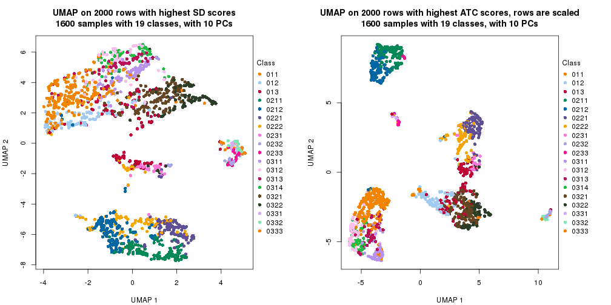</p>

</div>
<div id='tab-dimension-reduction-by-depth-13'>
<pre><code class="r">par(mfrow = c(1, 2))
dimension_reduction(res_rh, merge_node = merge_node_param(min_n_signatures = 439),
    method = &quot;UMAP&quot;, top_value_method = &quot;SD&quot;, top_n = 2000, scale_rows = FALSE)
dimension_reduction(res_rh, merge_node = merge_node_param(min_n_signatures = 439),
    method = &quot;UMAP&quot;, top_value_method = &quot;ATC&quot;, top_n = 2000, scale_rows = TRUE)
</code></pre>

<p></p>

</div>
<div id='tab-dimension-reduction-by-depth-14'>
<pre><code class="r">par(mfrow = c(1, 2))
dimension_reduction(res_rh, merge_node = merge_node_param(min_n_signatures = 446),
    method = &quot;UMAP&quot;, top_value_method = &quot;SD&quot;, top_n = 2000, scale_rows = FALSE)
dimension_reduction(res_rh, merge_node = merge_node_param(min_n_signatures = 446),
    method = &quot;UMAP&quot;, top_value_method = &quot;ATC&quot;, top_n = 2000, scale_rows = TRUE)
</code></pre>

<p></p>

</div>
<div id='tab-dimension-reduction-by-depth-15'>
<pre><code class="r">par(mfrow = c(1, 2))
dimension_reduction(res_rh, merge_node = merge_node_param(min_n_signatures = 689),
    method = &quot;UMAP&quot;, top_value_method = &quot;SD&quot;, top_n = 2000, scale_rows = FALSE)
dimension_reduction(res_rh, merge_node = merge_node_param(min_n_signatures = 689),
    method = &quot;UMAP&quot;, top_value_method = &quot;ATC&quot;, top_n = 2000, scale_rows = TRUE)
</code></pre>

<p></p>

</div>
<div id='tab-dimension-reduction-by-depth-16'>
<pre><code class="r">par(mfrow = c(1, 2))
dimension_reduction(res_rh, merge_node = merge_node_param(min_n_signatures = 996),
    method = &quot;UMAP&quot;, top_value_method = &quot;SD&quot;, top_n = 2000, scale_rows = FALSE)
dimension_reduction(res_rh, merge_node = merge_node_param(min_n_signatures = 996),
    method = &quot;UMAP&quot;, top_value_method = &quot;ATC&quot;, top_n = 2000, scale_rows = TRUE)
</code></pre>

<p></p>

</div>
<div id='tab-dimension-reduction-by-depth-17'>
<pre><code class="r">par(mfrow = c(1, 2))
dimension_reduction(res_rh, merge_node = merge_node_param(min_n_signatures = 1273),
    method = &quot;UMAP&quot;, top_value_method = &quot;SD&quot;, top_n = 2000, scale_rows = FALSE)
dimension_reduction(res_rh, merge_node = merge_node_param(min_n_signatures = 1273),
    method = &quot;UMAP&quot;, top_value_method = &quot;ATC&quot;, top_n = 2000, scale_rows = TRUE)
</code></pre>

<p></p>

</div>
<div id='tab-dimension-reduction-by-depth-18'>
<pre><code class="r">par(mfrow = c(1, 2))
dimension_reduction(res_rh, merge_node = merge_node_param(min_n_signatures = 1289),
    method = &quot;UMAP&quot;, top_value_method = &quot;SD&quot;, top_n = 2000, scale_rows = FALSE)
dimension_reduction(res_rh, merge_node = merge_node_param(min_n_signatures = 1289),
    method = &quot;UMAP&quot;, top_value_method = &quot;ATC&quot;, top_n = 2000, scale_rows = TRUE)
</code></pre>

<p></p>

</div>
<div id='tab-dimension-reduction-by-depth-19'>
<pre><code class="r">par(mfrow = c(1, 2))
dimension_reduction(res_rh, merge_node = merge_node_param(min_n_signatures = 1503),
    method = &quot;UMAP&quot;, top_value_method = &quot;SD&quot;, top_n = 2000, scale_rows = FALSE)
dimension_reduction(res_rh, merge_node = merge_node_param(min_n_signatures = 1503),
    method = &quot;UMAP&quot;, top_value_method = &quot;ATC&quot;, top_n = 2000, scale_rows = TRUE)
</code></pre>

<p></p>

</div>
<div id='tab-dimension-reduction-by-depth-20'>
<pre><code class="r">par(mfrow = c(1, 2))
dimension_reduction(res_rh, merge_node = merge_node_param(min_n_signatures = 2253),
    method = &quot;UMAP&quot;, top_value_method = &quot;SD&quot;, top_n = 2000, scale_rows = FALSE)
dimension_reduction(res_rh, merge_node = merge_node_param(min_n_signatures = 2253),
    method = &quot;UMAP&quot;, top_value_method = &quot;ATC&quot;, top_n = 2000, scale_rows = TRUE)
</code></pre>

<p></p>

</div>
<div id='tab-dimension-reduction-by-depth-21'>
<pre><code class="r">par(mfrow = c(1, 2))
dimension_reduction(res_rh, merge_node = merge_node_param(min_n_signatures = 2397),
    method = &quot;UMAP&quot;, top_value_method = &quot;SD&quot;, top_n = 2000, scale_rows = FALSE)
dimension_reduction(res_rh, merge_node = merge_node_param(min_n_signatures = 2397),
    method = &quot;UMAP&quot;, top_value_method = &quot;ATC&quot;, top_n = 2000, scale_rows = TRUE)
</code></pre>

<p></p>

</div>
</div>


### Signature heatmap

Signatures on the heatmap are the union of all signatures found on every node
on the hierarchy. The number of k-means on rows are automatically selected by the function.


<script>
$( function() {
	$( '#tabs-get-signatures-from-hierarchical-partition' ).tabs();
} );
</script>
<div id='tabs-get-signatures-from-hierarchical-partition'>
<ul>
<li><a href='#tab-get-signatures-from-hierarchical-partition-1'>n_signatures ≥ 87</a></li>
<li><a href='#tab-get-signatures-from-hierarchical-partition-2'>n_signatures ≥ 108</a></li>
<li><a href='#tab-get-signatures-from-hierarchical-partition-3'>n_signatures ≥ 114</a></li>
<li><a href='#tab-get-signatures-from-hierarchical-partition-4'>n_signatures ≥ 139</a></li>
<li><a href='#tab-get-signatures-from-hierarchical-partition-5'>n_signatures ≥ 155</a></li>
<li><a href='#tab-get-signatures-from-hierarchical-partition-6'>n_signatures ≥ 174</a></li>
<li><a href='#tab-get-signatures-from-hierarchical-partition-7'>n_signatures ≥ 248</a></li>
<li><a href='#tab-get-signatures-from-hierarchical-partition-8'>n_signatures ≥ 268</a></li>
<li><a href='#tab-get-signatures-from-hierarchical-partition-9'>n_signatures ≥ 277</a></li>
<li><a href='#tab-get-signatures-from-hierarchical-partition-10'>n_signatures ≥ 287</a></li>
<li><a href='#tab-get-signatures-from-hierarchical-partition-11'>n_signatures ≥ 306</a></li>
<li><a href='#tab-get-signatures-from-hierarchical-partition-12'>n_signatures ≥ 397</a></li>
<li><a href='#tab-get-signatures-from-hierarchical-partition-13'>n_signatures ≥ 439</a></li>
<li><a href='#tab-get-signatures-from-hierarchical-partition-14'>n_signatures ≥ 446</a></li>
<li><a href='#tab-get-signatures-from-hierarchical-partition-15'>n_signatures ≥ 689</a></li>
<li><a href='#tab-get-signatures-from-hierarchical-partition-16'>n_signatures ≥ 996</a></li>
<li><a href='#tab-get-signatures-from-hierarchical-partition-17'>n_signatures ≥ 1273</a></li>
<li><a href='#tab-get-signatures-from-hierarchical-partition-18'>n_signatures ≥ 1289</a></li>
<li><a href='#tab-get-signatures-from-hierarchical-partition-19'>n_signatures ≥ 1503</a></li>
<li><a href='#tab-get-signatures-from-hierarchical-partition-20'>n_signatures ≥ 2253</a></li>
<li><a href='#tab-get-signatures-from-hierarchical-partition-21'>n_signatures ≥ 2397</a></li>
</ul>
<div id='tab-get-signatures-from-hierarchical-partition-1'>
<pre><code class="r">get_signatures(res_rh, merge_node = merge_node_param(min_n_signatures = 87))
</code></pre>

<p></p>

</div>
<div id='tab-get-signatures-from-hierarchical-partition-2'>
<pre><code class="r">get_signatures(res_rh, merge_node = merge_node_param(min_n_signatures = 108))
</code></pre>

<p></p>

</div>
<div id='tab-get-signatures-from-hierarchical-partition-3'>
<pre><code class="r">get_signatures(res_rh, merge_node = merge_node_param(min_n_signatures = 114))
</code></pre>

<p></p>

</div>
<div id='tab-get-signatures-from-hierarchical-partition-4'>
<pre><code class="r">get_signatures(res_rh, merge_node = merge_node_param(min_n_signatures = 139))
</code></pre>

<p></p>

</div>
<div id='tab-get-signatures-from-hierarchical-partition-5'>
<pre><code class="r">get_signatures(res_rh, merge_node = merge_node_param(min_n_signatures = 155))
</code></pre>

<p></p>

</div>
<div id='tab-get-signatures-from-hierarchical-partition-6'>
<pre><code class="r">get_signatures(res_rh, merge_node = merge_node_param(min_n_signatures = 174))
</code></pre>

<p></p>

</div>
<div id='tab-get-signatures-from-hierarchical-partition-7'>
<pre><code class="r">get_signatures(res_rh, merge_node = merge_node_param(min_n_signatures = 248))
</code></pre>

<p>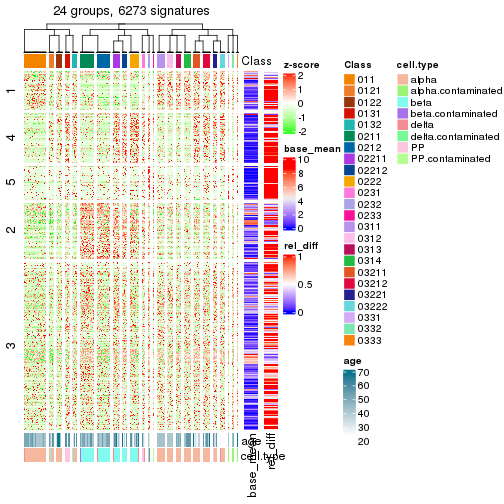</p>

</div>
<div id='tab-get-signatures-from-hierarchical-partition-8'>
<pre><code class="r">get_signatures(res_rh, merge_node = merge_node_param(min_n_signatures = 268))
</code></pre>

<p></p>

</div>
<div id='tab-get-signatures-from-hierarchical-partition-9'>
<pre><code class="r">get_signatures(res_rh, merge_node = merge_node_param(min_n_signatures = 277))
</code></pre>

<p></p>

</div>
<div id='tab-get-signatures-from-hierarchical-partition-10'>
<pre><code class="r">get_signatures(res_rh, merge_node = merge_node_param(min_n_signatures = 287))
</code></pre>

<p></p>

</div>
<div id='tab-get-signatures-from-hierarchical-partition-11'>
<pre><code class="r">get_signatures(res_rh, merge_node = merge_node_param(min_n_signatures = 306))
</code></pre>

<p></p>

</div>
<div id='tab-get-signatures-from-hierarchical-partition-12'>
<pre><code class="r">get_signatures(res_rh, merge_node = merge_node_param(min_n_signatures = 397))
</code></pre>

<p></p>

</div>
<div id='tab-get-signatures-from-hierarchical-partition-13'>
<pre><code class="r">get_signatures(res_rh, merge_node = merge_node_param(min_n_signatures = 439))
</code></pre>

<p></p>

</div>
<div id='tab-get-signatures-from-hierarchical-partition-14'>
<pre><code class="r">get_signatures(res_rh, merge_node = merge_node_param(min_n_signatures = 446))
</code></pre>

<p></p>

</div>
<div id='tab-get-signatures-from-hierarchical-partition-15'>
<pre><code class="r">get_signatures(res_rh, merge_node = merge_node_param(min_n_signatures = 689))
</code></pre>

<p></p>

</div>
<div id='tab-get-signatures-from-hierarchical-partition-16'>
<pre><code class="r">get_signatures(res_rh, merge_node = merge_node_param(min_n_signatures = 996))
</code></pre>

<p></p>

</div>
<div id='tab-get-signatures-from-hierarchical-partition-17'>
<pre><code class="r">get_signatures(res_rh, merge_node = merge_node_param(min_n_signatures = 1273))
</code></pre>

<p></p>

</div>
<div id='tab-get-signatures-from-hierarchical-partition-18'>
<pre><code class="r">get_signatures(res_rh, merge_node = merge_node_param(min_n_signatures = 1289))
</code></pre>

<p></p>

</div>
<div id='tab-get-signatures-from-hierarchical-partition-19'>
<pre><code class="r">get_signatures(res_rh, merge_node = merge_node_param(min_n_signatures = 1503))
</code></pre>

<p></p>

</div>
<div id='tab-get-signatures-from-hierarchical-partition-20'>
<pre><code class="r">get_signatures(res_rh, merge_node = merge_node_param(min_n_signatures = 2253))
</code></pre>

<pre><code>#&gt; Error in names(x) &lt;- value: &#39;names&#39; attribute [1] must be the same length as the vector [0]
</code></pre>

</div>
<div id='tab-get-signatures-from-hierarchical-partition-21'>
<pre><code class="r">get_signatures(res_rh, merge_node = merge_node_param(min_n_signatures = 2397))
</code></pre>

<pre><code>#&gt; Error in names(x) &lt;- value: &#39;names&#39; attribute [1] must be the same length as the vector [0]
</code></pre>

</div>
</div>


Compare signatures from different nodes:


```r
compare_signatures(res_rh, verbose = FALSE)
```

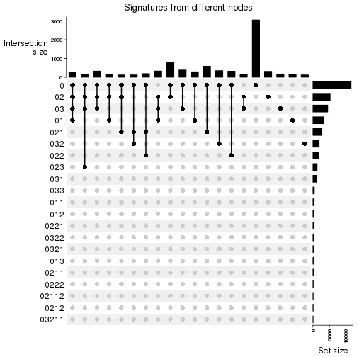

If there are too many signatures, `top_signatures = ...` can be set to only show the 
signatures with the highest FDRs. Note it only works on every node and the final signatures
are the union of all signatures of all nodes.


```r
# code only for demonstration
# e.g. to show the top 500 most significant rows on each node.
tb = get_signature(res_rh, top_signatures = 500)
```


### Test to known annotations

Test correlation between subgroups and known annotations. If the known
annotation is numeric, one-way ANOVA test is applied, and if the known
annotation is discrete, chi-squared contingency table test is applied.


<script>
$( function() {
	$( '#tabs-test-to-known-factors-from-hierarchical-partition' ).tabs();
} );
</script>
<div id='tabs-test-to-known-factors-from-hierarchical-partition'>
<ul>
<li><a href='#tab-test-to-known-factors-from-hierarchical-partition-1'>n_signatures ≥ 87</a></li>
<li><a href='#tab-test-to-known-factors-from-hierarchical-partition-2'>n_signatures ≥ 108</a></li>
<li><a href='#tab-test-to-known-factors-from-hierarchical-partition-3'>n_signatures ≥ 114</a></li>
<li><a href='#tab-test-to-known-factors-from-hierarchical-partition-4'>n_signatures ≥ 139</a></li>
<li><a href='#tab-test-to-known-factors-from-hierarchical-partition-5'>n_signatures ≥ 155</a></li>
<li><a href='#tab-test-to-known-factors-from-hierarchical-partition-6'>n_signatures ≥ 174</a></li>
<li><a href='#tab-test-to-known-factors-from-hierarchical-partition-7'>n_signatures ≥ 248</a></li>
<li><a href='#tab-test-to-known-factors-from-hierarchical-partition-8'>n_signatures ≥ 268</a></li>
<li><a href='#tab-test-to-known-factors-from-hierarchical-partition-9'>n_signatures ≥ 277</a></li>
<li><a href='#tab-test-to-known-factors-from-hierarchical-partition-10'>n_signatures ≥ 287</a></li>
<li><a href='#tab-test-to-known-factors-from-hierarchical-partition-11'>n_signatures ≥ 306</a></li>
<li><a href='#tab-test-to-known-factors-from-hierarchical-partition-12'>n_signatures ≥ 397</a></li>
<li><a href='#tab-test-to-known-factors-from-hierarchical-partition-13'>n_signatures ≥ 439</a></li>
<li><a href='#tab-test-to-known-factors-from-hierarchical-partition-14'>n_signatures ≥ 446</a></li>
<li><a href='#tab-test-to-known-factors-from-hierarchical-partition-15'>n_signatures ≥ 689</a></li>
<li><a href='#tab-test-to-known-factors-from-hierarchical-partition-16'>n_signatures ≥ 996</a></li>
<li><a href='#tab-test-to-known-factors-from-hierarchical-partition-17'>n_signatures ≥ 1273</a></li>
<li><a href='#tab-test-to-known-factors-from-hierarchical-partition-18'>n_signatures ≥ 1289</a></li>
<li><a href='#tab-test-to-known-factors-from-hierarchical-partition-19'>n_signatures ≥ 1503</a></li>
<li><a href='#tab-test-to-known-factors-from-hierarchical-partition-20'>n_signatures ≥ 2253</a></li>
<li><a href='#tab-test-to-known-factors-from-hierarchical-partition-21'>n_signatures ≥ 2397</a></li>
</ul>
<div id='tab-test-to-known-factors-from-hierarchical-partition-1'>
<pre><code class="r">test_to_known_factors(res_rh, merge_node = merge_node_param(min_n_signatures = 87))
</code></pre>

<pre><code>#&gt;       age cell.type
#&gt; class NaN         0
</code></pre>

</div>
<div id='tab-test-to-known-factors-from-hierarchical-partition-2'>
<pre><code class="r">test_to_known_factors(res_rh, merge_node = merge_node_param(min_n_signatures = 108))
</code></pre>

<pre><code>#&gt;       age cell.type
#&gt; class NaN         0
</code></pre>

</div>
<div id='tab-test-to-known-factors-from-hierarchical-partition-3'>
<pre><code class="r">test_to_known_factors(res_rh, merge_node = merge_node_param(min_n_signatures = 114))
</code></pre>

<pre><code>#&gt;       age cell.type
#&gt; class NaN         0
</code></pre>

</div>
<div id='tab-test-to-known-factors-from-hierarchical-partition-4'>
<pre><code class="r">test_to_known_factors(res_rh, merge_node = merge_node_param(min_n_signatures = 139))
</code></pre>

<pre><code>#&gt;       age cell.type
#&gt; class NaN         0
</code></pre>

</div>
<div id='tab-test-to-known-factors-from-hierarchical-partition-5'>
<pre><code class="r">test_to_known_factors(res_rh, merge_node = merge_node_param(min_n_signatures = 155))
</code></pre>

<pre><code>#&gt;       age cell.type
#&gt; class NaN         0
</code></pre>

</div>
<div id='tab-test-to-known-factors-from-hierarchical-partition-6'>
<pre><code class="r">test_to_known_factors(res_rh, merge_node = merge_node_param(min_n_signatures = 174))
</code></pre>

<pre><code>#&gt;       age cell.type
#&gt; class NaN         0
</code></pre>

</div>
<div id='tab-test-to-known-factors-from-hierarchical-partition-7'>
<pre><code class="r">test_to_known_factors(res_rh, merge_node = merge_node_param(min_n_signatures = 248))
</code></pre>

<pre><code>#&gt;       age cell.type
#&gt; class NaN         0
</code></pre>

</div>
<div id='tab-test-to-known-factors-from-hierarchical-partition-8'>
<pre><code class="r">test_to_known_factors(res_rh, merge_node = merge_node_param(min_n_signatures = 268))
</code></pre>

<pre><code>#&gt;       age cell.type
#&gt; class NaN         0
</code></pre>

</div>
<div id='tab-test-to-known-factors-from-hierarchical-partition-9'>
<pre><code class="r">test_to_known_factors(res_rh, merge_node = merge_node_param(min_n_signatures = 277))
</code></pre>

<pre><code>#&gt;       age cell.type
#&gt; class NaN         0
</code></pre>

</div>
<div id='tab-test-to-known-factors-from-hierarchical-partition-10'>
<pre><code class="r">test_to_known_factors(res_rh, merge_node = merge_node_param(min_n_signatures = 287))
</code></pre>

<pre><code>#&gt;       age cell.type
#&gt; class NaN         0
</code></pre>

</div>
<div id='tab-test-to-known-factors-from-hierarchical-partition-11'>
<pre><code class="r">test_to_known_factors(res_rh, merge_node = merge_node_param(min_n_signatures = 306))
</code></pre>

<pre><code>#&gt;       age cell.type
#&gt; class NaN         0
</code></pre>

</div>
<div id='tab-test-to-known-factors-from-hierarchical-partition-12'>
<pre><code class="r">test_to_known_factors(res_rh, merge_node = merge_node_param(min_n_signatures = 397))
</code></pre>

<pre><code>#&gt;       age cell.type
#&gt; class NaN         0
</code></pre>

</div>
<div id='tab-test-to-known-factors-from-hierarchical-partition-13'>
<pre><code class="r">test_to_known_factors(res_rh, merge_node = merge_node_param(min_n_signatures = 439))
</code></pre>

<pre><code>#&gt;       age cell.type
#&gt; class NaN         0
</code></pre>

</div>
<div id='tab-test-to-known-factors-from-hierarchical-partition-14'>
<pre><code class="r">test_to_known_factors(res_rh, merge_node = merge_node_param(min_n_signatures = 446))
</code></pre>

<pre><code>#&gt;       age cell.type
#&gt; class NaN         0
</code></pre>

</div>
<div id='tab-test-to-known-factors-from-hierarchical-partition-15'>
<pre><code class="r">test_to_known_factors(res_rh, merge_node = merge_node_param(min_n_signatures = 689))
</code></pre>

<pre><code>#&gt;       age cell.type
#&gt; class NaN         0
</code></pre>

</div>
<div id='tab-test-to-known-factors-from-hierarchical-partition-16'>
<pre><code class="r">test_to_known_factors(res_rh, merge_node = merge_node_param(min_n_signatures = 996))
</code></pre>

<pre><code>#&gt;       age cell.type
#&gt; class NaN         0
</code></pre>

</div>
<div id='tab-test-to-known-factors-from-hierarchical-partition-17'>
<pre><code class="r">test_to_known_factors(res_rh, merge_node = merge_node_param(min_n_signatures = 1273))
</code></pre>

<pre><code>#&gt;            age cell.type
#&gt; class 3.21e-19         0
</code></pre>

</div>
<div id='tab-test-to-known-factors-from-hierarchical-partition-18'>
<pre><code class="r">test_to_known_factors(res_rh, merge_node = merge_node_param(min_n_signatures = 1289))
</code></pre>

<pre><code>#&gt;            age cell.type
#&gt; class 2.64e-17         0
</code></pre>

</div>
<div id='tab-test-to-known-factors-from-hierarchical-partition-19'>
<pre><code class="r">test_to_known_factors(res_rh, merge_node = merge_node_param(min_n_signatures = 1503))
</code></pre>

<pre><code>#&gt;            age cell.type
#&gt; class 2.56e-21         0
</code></pre>

</div>
<div id='tab-test-to-known-factors-from-hierarchical-partition-20'>
<pre><code class="r">test_to_known_factors(res_rh, merge_node = merge_node_param(min_n_signatures = 2253))
</code></pre>

<pre><code>#&gt;       age cell.type
#&gt; class  NA        NA
</code></pre>

</div>
<div id='tab-test-to-known-factors-from-hierarchical-partition-21'>
<pre><code class="r">test_to_known_factors(res_rh, merge_node = merge_node_param(min_n_signatures = 2397))
</code></pre>

<pre><code>#&gt;       age cell.type
#&gt; class  NA        NA
</code></pre>

</div>
</div>


## Results for each node


---------------------------------------------------


### Node0


Child nodes: 
                [Node01](#Node01)
        ,
                [Node02](#Node02)
        ,
                [Node03](#Node03)
        .


The object with results only for a single top-value method and a single partitioning method 
can be extracted as:

```r
res = res_rh["0"]
```

A summary of `res` and all the functions that can be applied to it:

```r
res
```

```
#> A 'DownSamplingConsensusPartition' object with k = 2, 3, 4.
#>   On a matrix with 15527 rows and 500 columns, randomly sampled from 1600 columns.
#>   Top rows (1475) are extracted by 'ATC' method.
#>   Subgroups are detected by 'skmeans' method.
#>   Performed in total 150 partitions by row resampling.
#>   Best k for subgroups seems to be 4.
#> 
#> Following methods can be applied to this 'DownSamplingConsensusPartition' object:
#>  [1] "cola_report"             "collect_classes"         "collect_plots"          
#>  [4] "collect_stats"           "colnames"                "compare_partitions"     
#>  [7] "compare_signatures"      "consensus_heatmap"       "dimension_reduction"    
#> [10] "functional_enrichment"   "get_anno_col"            "get_anno"               
#> [13] "get_classes"             "get_consensus"           "get_matrix"             
#> [16] "get_membership"          "get_param"               "get_signatures"         
#> [19] "get_stats"               "is_best_k"               "is_stable_k"            
#> [22] "membership_heatmap"      "ncol"                    "nrow"                   
#> [25] "plot_ecdf"               "predict_classes"         "rownames"               
#> [28] "select_partition_number" "show"                    "suggest_best_k"         
#> [31] "test_to_known_factors"   "top_rows_heatmap"
```

`collect_plots()` function collects all the plots made from `res` for all `k` (number of subgroups)
into one single page to provide an easy and fast comparison between different `k`.

```r
collect_plots(res)
```


The plots are:

- The first row: a plot of the eCDF (empirical cumulative distribution
  function) curves of the consensus matrix for each `k` and the heatmap of
  predicted classes for each `k`.
- The second row: heatmaps of the consensus matrix for each `k`.
- The third row: heatmaps of the membership matrix for each `k`.
- The fouth row: heatmaps of the signatures for each `k`.

All the plots in panels can be made by individual functions and they are
plotted later in this section.

`select_partition_number()` produces several plots showing different
statistics for choosing "optimized" `k`. There are following statistics:

- eCDF curves of the consensus matrix for each `k`;
- 1-PAC. [The PAC score](https://en.wikipedia.org/wiki/Consensus_clustering#Over-interpretation_potential_of_consensus_clustering)
  measures the proportion of the ambiguous subgrouping.
- Mean silhouette score.
- Concordance. The mean probability of fiting the consensus subgroup labels in all
  partitions.
- Area increased. Denote $A_k$ as the area under the eCDF curve for current
  `k`, the area increased is defined as $A_k - A_{k-1}$.
- Rand index. The percent of pairs of samples that are both in a same cluster
  or both are not in a same cluster in the partition of k and k-1.
- Jaccard index. The ratio of pairs of samples are both in a same cluster in
  the partition of k and k-1 and the pairs of samples are both in a same
  cluster in the partition k or k-1.

The detailed explanations of these statistics can be found in [the _cola_
vignette](https://jokergoo.github.io/cola_vignettes/cola.html#toc_13).

Generally speaking, higher 1-PAC score, higher mean silhouette score or higher
concordance corresponds to better partition. Rand index and Jaccard index
measure how similar the current partition is compared to partition with `k-1`.
If they are too similar, we won't accept `k` is better than `k-1`.

```r
select_partition_number(res)
```


The numeric values for all these statistics can be obtained by `get_stats()`.

```r
get_stats(res)
```

```
#>   k 1-PAC mean_silhouette concordance area_increased  Rand Jaccard
#> 2 2 1.000           0.989       0.995          0.483 0.519   0.519
#> 3 3 1.000           0.978       0.991          0.381 0.774   0.581
#> 4 4 0.931           0.927       0.960          0.109 0.860   0.620
```

`suggest_best_k()` suggests the best $k$ based on these statistics. The rules are as follows:

- All $k$ with Jaccard index larger than 0.95 are removed because increasing
  $k$ does not provide enough extra information. If all $k$ are removed, it is
  marked as no subgroup is detected.
- For all $k$ with 1-PAC score larger than 0.9, the maximal $k$ is taken as
  the best $k$, and other $k$ are marked as optional $k$.
- If it does not fit the second rule. The $k$ with the maximal vote of the
  highest 1-PAC score, highest mean silhouette, and highest concordance is
  taken as the best $k$.

```r
suggest_best_k(res)
```

```
#> [1] 4
#> attr(,"optional")
#> [1] 2 3
```

There is also optional best $k$ = 2 3 that is worth to check.

Following is the table of the partitions (You need to click the **show/hide
code output** link to see it). The membership matrix (columns with name `p*`)
is inferred by
[`clue::cl_consensus()`](https://www.rdocumentation.org/link/cl_consensus?package=clue)
function with the `SE` method. Basically the value in the membership matrix
represents the probability to belong to a certain group. The finall subgroup
label for an item is determined with the group with highest probability it
belongs to.

In `get_classes()` function, the entropy is calculated from the membership
matrix and the silhouette score is calculated from the consensus matrix.


<script>
$( function() {
	$( '#tabs-node-0-get-classes' ).tabs();
} );
</script>
<div id='tabs-node-0-get-classes'>
<ul>
<li><a href='#tab-node-0-get-classes-1'>k = 2</a></li>
<li><a href='#tab-node-0-get-classes-2'>k = 3</a></li>
<li><a href='#tab-node-0-get-classes-3'>k = 4</a></li>
</ul>

<div id='tab-node-0-get-classes-1'>
<p><a id='tab-node-0-get-classes-1-a' style='color:#0366d6' href='#'>show/hide code output</a></p>
<pre><code class="r">get_classes(res, k = 2)
</code></pre>

<pre><code>#&gt;             class     p
#&gt; Sample_1        2 1.000
#&gt; Sample_2        2 0.000
#&gt; Sample_3        2 0.000
#&gt; Sample_4        2 0.000
#&gt; Sample_5        2 0.000
#&gt; Sample_6        2 0.000
#&gt; Sample_7        2 0.000
#&gt; Sample_8        2 0.000
#&gt; Sample_9        2 0.000
#&gt; Sample_10       2 0.000
#&gt; Sample_11       2 0.000
#&gt; Sample_12       2 0.000
#&gt; Sample_13       2 0.000
#&gt; Sample_14       2 0.000
#&gt; Sample_15       2 0.000
#&gt; Sample_16       2 0.000
#&gt; Sample_17       2 0.000
#&gt; Sample_18       2 0.000
#&gt; Sample_19       2 0.747
#&gt; Sample_20       2 0.000
#&gt; Sample_21       2 0.000
#&gt; Sample_22       2 0.000
#&gt; Sample_23       2 0.000
#&gt; Sample_24       2 0.000
#&gt; Sample_25       2 0.000
#&gt; Sample_26       2 0.000
#&gt; Sample_27       2 0.000
#&gt; Sample_28       2 0.000
#&gt; Sample_29       2 0.000
#&gt; Sample_30       2 0.000
#&gt; Sample_31       2 0.000
#&gt; Sample_32       2 0.000
#&gt; Sample_33       2 0.000
#&gt; Sample_34       2 0.000
#&gt; Sample_35       2 0.000
#&gt; Sample_36       2 0.000
#&gt; Sample_37       2 0.000
#&gt; Sample_38       2 0.000
#&gt; Sample_39       2 0.000
#&gt; Sample_40       2 0.000
#&gt; Sample_41       2 0.000
#&gt; Sample_42       2 0.000
#&gt; Sample_43       2 0.000
#&gt; Sample_44       2 0.000
#&gt; Sample_45       2 0.000
#&gt; Sample_46       2 0.000
#&gt; Sample_47       2 0.000
#&gt; Sample_48       2 0.000
#&gt; Sample_49       2 0.000
#&gt; Sample_50       2 0.000
#&gt; Sample_51       2 0.000
#&gt; Sample_52       2 0.000
#&gt; Sample_53       2 0.000
#&gt; Sample_54       2 0.000
#&gt; Sample_55       2 0.000
#&gt; Sample_56       2 0.000
#&gt; Sample_57       2 0.000
#&gt; Sample_58       2 0.000
#&gt; Sample_59       2 0.000
#&gt; Sample_60       2 0.000
#&gt; Sample_61       2 0.000
#&gt; Sample_62       2 0.000
#&gt; Sample_63       2 0.000
#&gt; Sample_64       2 0.000
#&gt; Sample_65       2 0.000
#&gt; Sample_66       2 0.000
#&gt; Sample_67       2 0.000
#&gt; Sample_68       2 0.000
#&gt; Sample_69       2 0.000
#&gt; Sample_70       2 0.000
#&gt; Sample_71       2 0.000
#&gt; Sample_72       2 0.000
#&gt; Sample_73       2 0.000
#&gt; Sample_74       2 0.000
#&gt; Sample_75       2 0.000
#&gt; Sample_76       2 0.000
#&gt; Sample_77       2 0.000
#&gt; Sample_78       2 0.000
#&gt; Sample_79       2 0.000
#&gt; Sample_80       2 0.000
#&gt; Sample_81       2 0.000
#&gt; Sample_82       2 0.000
#&gt; Sample_83       2 0.000
#&gt; Sample_84       2 0.000
#&gt; Sample_85       2 0.000
#&gt; Sample_86       2 0.000
#&gt; Sample_87       2 0.000
#&gt; Sample_88       2 0.000
#&gt; Sample_89       2 0.000
#&gt; Sample_90       2 0.000
#&gt; Sample_91       2 0.000
#&gt; Sample_92       2 0.000
#&gt; Sample_93       2 0.000
#&gt; Sample_94       2 0.000
#&gt; Sample_95       2 0.000
#&gt; Sample_96       2 0.000
#&gt; Sample_97       2 0.000
#&gt; Sample_98       2 0.000
#&gt; Sample_99       2 0.000
#&gt; Sample_100      2 0.000
#&gt; Sample_101      2 0.000
#&gt; Sample_102      2 0.000
#&gt; Sample_103      2 0.000
#&gt; Sample_104      2 0.000
#&gt; Sample_105      2 0.000
#&gt; Sample_106      2 0.000
#&gt; Sample_107      2 0.000
#&gt; Sample_108      2 0.000
#&gt; Sample_109      2 0.000
#&gt; Sample_110      2 0.000
#&gt; Sample_111      2 0.498
#&gt; Sample_112      2 0.000
#&gt; Sample_113      2 0.000
#&gt; Sample_114      2 0.000
#&gt; Sample_115      2 0.000
#&gt; Sample_116      2 1.000
#&gt; Sample_117      2 0.000
#&gt; Sample_118      2 0.000
#&gt; Sample_119      2 0.000
#&gt; Sample_120      2 0.000
#&gt; Sample_121      2 1.000
#&gt; Sample_122      2 0.000
#&gt; Sample_123      2 0.000
#&gt; Sample_124      2 0.000
#&gt; Sample_125      2 0.000
#&gt; Sample_126      2 0.000
#&gt; Sample_127      2 0.000
#&gt; Sample_128      2 0.000
#&gt; Sample_129      2 0.000
#&gt; Sample_130      2 0.000
#&gt; Sample_131      2 0.000
#&gt; Sample_132      2 0.000
#&gt; Sample_133      2 0.000
#&gt; Sample_134      2 0.000
#&gt; Sample_135      2 0.000
#&gt; Sample_136      2 0.000
#&gt; Sample_137      2 0.000
#&gt; Sample_138      2 0.000
#&gt; Sample_139      2 0.000
#&gt; Sample_140      2 0.000
#&gt; Sample_141      2 0.000
#&gt; Sample_142      2 0.000
#&gt; Sample_143      2 0.000
#&gt; Sample_144      2 0.000
#&gt; Sample_145      2 0.000
#&gt; Sample_146      2 0.498
#&gt; Sample_147      2 0.000
#&gt; Sample_148      2 0.000
#&gt; Sample_149      2 0.000
#&gt; Sample_150      2 0.000
#&gt; Sample_151      2 0.000
#&gt; Sample_152      2 0.000
#&gt; Sample_153      2 0.000
#&gt; Sample_154      2 0.000
#&gt; Sample_155      2 0.000
#&gt; Sample_156      2 0.000
#&gt; Sample_157      2 0.000
#&gt; Sample_158      2 0.000
#&gt; Sample_159      2 0.000
#&gt; Sample_160      2 0.000
#&gt; Sample_161      2 0.000
#&gt; Sample_162      2 0.000
#&gt; Sample_163      2 0.000
#&gt; Sample_164      2 0.000
#&gt; Sample_165      2 0.000
#&gt; Sample_166      2 0.000
#&gt; Sample_167      2 0.000
#&gt; Sample_168      2 0.000
#&gt; Sample_169      2 0.000
#&gt; Sample_170      2 0.000
#&gt; Sample_171      2 0.000
#&gt; Sample_172      2 0.000
#&gt; Sample_173      2 0.000
#&gt; Sample_174      2 0.000
#&gt; Sample_175      2 0.000
#&gt; Sample_176      2 0.000
#&gt; Sample_177      2 0.000
#&gt; Sample_178      2 0.000
#&gt; Sample_179      2 0.000
#&gt; Sample_180      2 0.000
#&gt; Sample_181      2 0.000
#&gt; Sample_182      2 0.000
#&gt; Sample_183      2 0.000
#&gt; Sample_184      2 0.000
#&gt; Sample_185      2 0.000
#&gt; Sample_186      2 0.000
#&gt; Sample_187      2 0.000
#&gt; Sample_188      2 0.000
#&gt; Sample_189      2 0.000
#&gt; Sample_190      2 0.000
#&gt; Sample_191      2 0.000
#&gt; Sample_192      2 0.000
#&gt; Sample_193      2 0.000
#&gt; Sample_194      2 0.000
#&gt; Sample_195      2 0.000
#&gt; Sample_196      2 0.000
#&gt; Sample_197      2 0.000
#&gt; Sample_198      2 0.000
#&gt; Sample_199      2 0.000
#&gt; Sample_200      2 0.000
#&gt; Sample_201      2 0.000
#&gt; Sample_202      2 0.000
#&gt; Sample_203      2 0.000
#&gt; Sample_204      2 0.000
#&gt; Sample_205      2 0.000
#&gt; Sample_206      2 0.000
#&gt; Sample_207      2 0.000
#&gt; Sample_208      1 0.000
#&gt; Sample_209      1 0.000
#&gt; Sample_210      1 0.000
#&gt; Sample_211      1 0.000
#&gt; Sample_212      1 0.000
#&gt; Sample_213      1 0.000
#&gt; Sample_214      1 0.000
#&gt; Sample_215      1 0.000
#&gt; Sample_216      1 0.000
#&gt; Sample_217      1 0.000
#&gt; Sample_218      1 0.000
#&gt; Sample_219      1 0.000
#&gt; Sample_220      1 0.000
#&gt; Sample_221      1 0.000
#&gt; Sample_222      1 0.000
#&gt; Sample_223      1 0.000
#&gt; Sample_224      1 0.000
#&gt; Sample_225      1 0.000
#&gt; Sample_226      1 0.000
#&gt; Sample_227      1 0.000
#&gt; Sample_228      1 0.000
#&gt; Sample_229      1 0.000
#&gt; Sample_230      1 0.000
#&gt; Sample_231      1 0.000
#&gt; Sample_232      1 0.000
#&gt; Sample_233      1 0.000
#&gt; Sample_234      1 0.000
#&gt; Sample_235      1 0.000
#&gt; Sample_236      1 0.000
#&gt; Sample_237      1 0.000
#&gt; Sample_238      1 0.000
#&gt; Sample_239      1 0.000
#&gt; Sample_240      1 0.000
#&gt; Sample_241      1 0.000
#&gt; Sample_242      1 0.000
#&gt; Sample_243      1 0.000
#&gt; Sample_244      1 0.000
#&gt; Sample_245      1 0.000
#&gt; Sample_246      1 0.000
#&gt; Sample_247      1 0.000
#&gt; Sample_248      1 0.000
#&gt; Sample_249      1 0.000
#&gt; Sample_250      1 0.000
#&gt; Sample_251      1 0.000
#&gt; Sample_252      1 0.000
#&gt; Sample_253      1 0.000
#&gt; Sample_254      1 0.000
#&gt; Sample_255      1 0.000
#&gt; Sample_256      1 0.000
#&gt; Sample_257      1 0.000
#&gt; Sample_258      1 0.000
#&gt; Sample_259      1 0.000
#&gt; Sample_260      1 0.000
#&gt; Sample_261      1 0.000
#&gt; Sample_262      1 0.000
#&gt; Sample_263      1 0.000
#&gt; Sample_264      1 0.000
#&gt; Sample_265      1 0.000
#&gt; Sample_266      1 0.000
#&gt; Sample_267      1 0.000
#&gt; Sample_268      1 0.000
#&gt; Sample_269      1 0.000
#&gt; Sample_270      1 0.000
#&gt; Sample_271      1 0.249
#&gt; Sample_272      1 0.000
#&gt; Sample_273      1 0.000
#&gt; Sample_274      1 0.000
#&gt; Sample_275      1 0.000
#&gt; Sample_276      1 0.000
#&gt; Sample_277      1 0.000
#&gt; Sample_278      1 0.000
#&gt; Sample_279      1 0.000
#&gt; Sample_280      1 0.000
#&gt; Sample_281      1 0.000
#&gt; Sample_282      1 0.000
#&gt; Sample_283      1 0.000
#&gt; Sample_284      1 0.000
#&gt; Sample_285      1 0.000
#&gt; Sample_286      1 0.000
#&gt; Sample_287      1 0.000
#&gt; Sample_288      1 0.000
#&gt; Sample_289      1 0.000
#&gt; Sample_290      1 0.000
#&gt; Sample_291      1 0.000
#&gt; Sample_292      1 0.000
#&gt; Sample_293      1 0.000
#&gt; Sample_294      1 0.000
#&gt; Sample_295      1 0.000
#&gt; Sample_296      1 0.000
#&gt; Sample_297      1 0.000
#&gt; Sample_298      1 0.000
#&gt; Sample_299      1 0.000
#&gt; Sample_300      1 0.000
#&gt; Sample_301      1 0.000
#&gt; Sample_302      1 0.000
#&gt; Sample_303      1 0.000
#&gt; Sample_304      1 0.000
#&gt; Sample_305      1 0.000
#&gt; Sample_306      1 0.000
#&gt; Sample_307      1 0.000
#&gt; Sample_308      1 0.000
#&gt; Sample_309      1 0.000
#&gt; Sample_310      1 0.000
#&gt; Sample_311      1 0.000
#&gt; Sample_312      1 0.000
#&gt; Sample_313      1 0.000
#&gt; Sample_314      1 0.000
#&gt; Sample_315      1 0.000
#&gt; Sample_316      1 0.000
#&gt; Sample_317      1 0.000
#&gt; Sample_318      1 0.000
#&gt; Sample_319      1 0.000
#&gt; Sample_320      1 0.000
#&gt; Sample_321      1 0.000
#&gt; Sample_322      1 0.000
#&gt; Sample_323      1 0.000
#&gt; Sample_324      1 0.000
#&gt; Sample_325      1 0.000
#&gt; Sample_326      1 0.000
#&gt; Sample_327      1 0.000
#&gt; Sample_328      1 0.000
#&gt; Sample_329      1 0.000
#&gt; Sample_330      1 0.000
#&gt; Sample_331      2 0.751
#&gt; Sample_332      1 0.000
#&gt; Sample_333      1 0.000
#&gt; Sample_334      1 0.000
#&gt; Sample_335      1 0.000
#&gt; Sample_336      1 0.000
#&gt; Sample_337      1 0.000
#&gt; Sample_338      1 0.000
#&gt; Sample_339      1 0.000
#&gt; Sample_340      1 0.000
#&gt; Sample_341      1 0.000
#&gt; Sample_342      1 0.000
#&gt; Sample_343      1 0.000
#&gt; Sample_344      1 0.000
#&gt; Sample_345      1 0.000
#&gt; Sample_346      1 0.000
#&gt; Sample_347      1 0.000
#&gt; Sample_348      1 0.000
#&gt; Sample_349      1 0.000
#&gt; Sample_350      1 0.000
#&gt; Sample_351      1 0.000
#&gt; Sample_352      1 0.000
#&gt; Sample_353      1 0.000
#&gt; Sample_354      1 0.000
#&gt; Sample_355      1 0.000
#&gt; Sample_356      1 0.000
#&gt; Sample_357      1 0.000
#&gt; Sample_358      1 0.000
#&gt; Sample_359      1 0.000
#&gt; Sample_360      1 0.000
#&gt; Sample_361      1 0.000
#&gt; Sample_362      1 0.000
#&gt; Sample_363      1 0.000
#&gt; Sample_364      1 0.000
#&gt; Sample_365      1 0.000
#&gt; Sample_366      1 0.000
#&gt; Sample_367      1 0.000
#&gt; Sample_368      1 0.000
#&gt; Sample_369      1 0.000
#&gt; Sample_370      1 0.000
#&gt; Sample_371      1 0.000
#&gt; Sample_372      1 0.000
#&gt; Sample_373      1 0.000
#&gt; Sample_374      1 0.000
#&gt; Sample_375      1 0.000
#&gt; Sample_376      1 0.000
#&gt; Sample_377      1 0.000
#&gt; Sample_378      1 0.000
#&gt; Sample_379      1 0.000
#&gt; Sample_380      1 0.000
#&gt; Sample_381      1 0.000
#&gt; Sample_382      1 0.000
#&gt; Sample_383      1 0.000
#&gt; Sample_384      1 0.000
#&gt; Sample_385      1 0.000
#&gt; Sample_386      1 0.000
#&gt; Sample_387      1 0.000
#&gt; Sample_388      1 0.000
#&gt; Sample_389      1 0.000
#&gt; Sample_390      1 0.000
#&gt; Sample_391      1 0.000
#&gt; Sample_392      1 0.000
#&gt; Sample_393      1 0.000
#&gt; Sample_394      1 0.000
#&gt; Sample_395      1 0.000
#&gt; Sample_396      1 0.000
#&gt; Sample_397      1 0.000
#&gt; Sample_398      1 0.000
#&gt; Sample_399      1 0.000
#&gt; Sample_400      1 0.000
#&gt; Sample_401      1 0.000
#&gt; Sample_402      1 0.000
#&gt; Sample_403      1 0.000
#&gt; Sample_404      1 0.000
#&gt; Sample_405      1 0.000
#&gt; Sample_406      1 0.000
#&gt; Sample_407      1 0.000
#&gt; Sample_408      1 0.000
#&gt; Sample_409      1 0.000
#&gt; Sample_410      1 0.000
#&gt; Sample_411      1 0.000
#&gt; Sample_412      1 0.000
#&gt; Sample_413      1 0.000
#&gt; Sample_414      1 0.000
#&gt; Sample_415      1 0.000
#&gt; Sample_416      1 0.000
#&gt; Sample_417      1 0.000
#&gt; Sample_418      1 0.000
#&gt; Sample_419      1 0.000
#&gt; Sample_420      1 0.000
#&gt; Sample_421      1 0.000
#&gt; Sample_422      1 0.000
#&gt; Sample_423      1 0.000
#&gt; Sample_424      1 0.000
#&gt; Sample_425      1 0.000
#&gt; Sample_426      1 0.000
#&gt; Sample_427      1 0.000
#&gt; Sample_428      1 0.000
#&gt; Sample_429      1 0.000
#&gt; Sample_430      1 0.000
#&gt; Sample_431      1 0.000
#&gt; Sample_432      1 0.000
#&gt; Sample_433      1 0.000
#&gt; Sample_434      1 0.000
#&gt; Sample_435      1 0.000
#&gt; Sample_436      2 0.747
#&gt; Sample_437      1 0.000
#&gt; Sample_438      1 0.000
#&gt; Sample_439      1 0.000
#&gt; Sample_440      1 0.000
#&gt; Sample_441      1 0.000
#&gt; Sample_442      1 0.000
#&gt; Sample_443      1 0.000
#&gt; Sample_444      1 0.000
#&gt; Sample_445      1 0.000
#&gt; Sample_446      1 0.000
#&gt; Sample_447      1 0.000
#&gt; Sample_448      1 0.000
#&gt; Sample_449      1 0.000
#&gt; Sample_450      1 0.000
#&gt; Sample_451      1 0.000
#&gt; Sample_452      1 0.000
#&gt; Sample_453      1 0.000
#&gt; Sample_454      1 0.000
#&gt; Sample_455      1 0.000
#&gt; Sample_456      1 0.000
#&gt; Sample_457      1 0.000
#&gt; Sample_458      1 0.000
#&gt; Sample_459      1 0.000
#&gt; Sample_460      1 0.000
#&gt; Sample_461      1 0.000
#&gt; Sample_462      1 0.000
#&gt; Sample_463      1 0.000
#&gt; Sample_464      1 0.000
#&gt; Sample_465      1 0.000
#&gt; Sample_466      1 0.000
#&gt; Sample_467      1 0.000
#&gt; Sample_468      1 0.000
#&gt; Sample_469      1 0.000
#&gt; Sample_470      1 0.000
#&gt; Sample_471      1 0.000
#&gt; Sample_472      1 0.000
#&gt; Sample_473      1 0.000
#&gt; Sample_474      1 0.000
#&gt; Sample_475      1 0.000
#&gt; Sample_476      1 0.000
#&gt; Sample_477      1 0.000
#&gt; Sample_478      1 0.000
#&gt; Sample_479      1 0.000
#&gt; Sample_480      1 0.000
#&gt; Sample_481      1 0.000
#&gt; Sample_482      1 0.000
#&gt; Sample_483      1 0.000
#&gt; Sample_484      1 0.000
#&gt; Sample_485      1 0.000
#&gt; Sample_486      1 0.000
#&gt; Sample_487      1 0.000
#&gt; Sample_488      1 0.000
#&gt; Sample_489      1 0.000
#&gt; Sample_490      1 0.000
#&gt; Sample_491      1 0.000
#&gt; Sample_492      1 0.000
#&gt; Sample_493      1 0.000
#&gt; Sample_494      1 0.000
#&gt; Sample_495      1 0.000
#&gt; Sample_496      1 0.000
#&gt; Sample_497      1 0.000
#&gt; Sample_498      1 0.000
#&gt; Sample_499      1 0.000
#&gt; Sample_500      1 0.000
#&gt; Sample_501      1 0.000
#&gt; Sample_502      1 0.000
#&gt; Sample_503      1 0.000
#&gt; Sample_504      1 0.000
#&gt; Sample_505      1 0.000
#&gt; Sample_506      1 0.000
#&gt; Sample_507      1 0.000
#&gt; Sample_508      1 0.000
#&gt; Sample_509      1 0.000
#&gt; Sample_510      1 0.000
#&gt; Sample_511      1 0.000
#&gt; Sample_512      1 0.000
#&gt; Sample_513      1 0.000
#&gt; Sample_514      1 0.000
#&gt; Sample_515      1 0.000
#&gt; Sample_516      2 0.502
#&gt; Sample_517      1 0.000
#&gt; Sample_518      1 0.000
#&gt; Sample_519      1 0.000
#&gt; Sample_520      1 0.000
#&gt; Sample_521      1 0.000
#&gt; Sample_522      1 0.000
#&gt; Sample_523      1 0.000
#&gt; Sample_524      1 0.000
#&gt; Sample_525      1 0.000
#&gt; Sample_526      1 0.000
#&gt; Sample_527      1 0.000
#&gt; Sample_528      1 0.000
#&gt; Sample_529      1 1.000
#&gt; Sample_530      1 0.000
#&gt; Sample_531      1 0.000
#&gt; Sample_532      1 0.000
#&gt; Sample_533      1 0.000
#&gt; Sample_534      1 0.000
#&gt; Sample_535      1 0.000
#&gt; Sample_536      1 0.000
#&gt; Sample_537      1 0.000
#&gt; Sample_538      1 0.000
#&gt; Sample_539      1 0.000
#&gt; Sample_540      1 0.000
#&gt; Sample_541      1 0.000
#&gt; Sample_542      1 0.000
#&gt; Sample_543      1 0.000
#&gt; Sample_544      1 0.000
#&gt; Sample_545      1 0.000
#&gt; Sample_546      1 0.000
#&gt; Sample_547      1 0.000
#&gt; Sample_548      1 0.000
#&gt; Sample_549      1 0.000
#&gt; Sample_550      1 0.000
#&gt; Sample_551      1 0.000
#&gt; Sample_552      1 0.000
#&gt; Sample_553      1 0.000
#&gt; Sample_554      1 0.000
#&gt; Sample_555      1 0.000
#&gt; Sample_556      1 0.000
#&gt; Sample_557      1 0.000
#&gt; Sample_558      1 0.000
#&gt; Sample_559      1 0.000
#&gt; Sample_560      1 0.000
#&gt; Sample_561      1 0.000
#&gt; Sample_562      1 0.000
#&gt; Sample_563      1 0.000
#&gt; Sample_564      1 0.000
#&gt; Sample_565      1 0.000
#&gt; Sample_566      1 0.000
#&gt; Sample_567      1 0.000
#&gt; Sample_568      1 0.000
#&gt; Sample_569      1 0.000
#&gt; Sample_570      1 0.000
#&gt; Sample_571      1 0.000
#&gt; Sample_572      1 0.000
#&gt; Sample_573      1 0.000
#&gt; Sample_574      1 0.000
#&gt; Sample_575      1 0.000
#&gt; Sample_576      1 0.000
#&gt; Sample_577      1 0.000
#&gt; Sample_578      1 0.000
#&gt; Sample_579      1 0.000
#&gt; Sample_580      1 0.000
#&gt; Sample_581      1 0.000
#&gt; Sample_582      1 0.000
#&gt; Sample_583      1 0.000
#&gt; Sample_584      1 0.000
#&gt; Sample_585      1 0.498
#&gt; Sample_586      2 0.000
#&gt; Sample_587      2 0.000
#&gt; Sample_588      2 0.000
#&gt; Sample_589      1 0.000
#&gt; Sample_590      1 1.000
#&gt; Sample_591      2 0.000
#&gt; Sample_592      2 0.000
#&gt; Sample_593      2 0.000
#&gt; Sample_594      2 0.000
#&gt; Sample_595      2 1.000
#&gt; Sample_596      2 1.000
#&gt; Sample_597      2 1.000
#&gt; Sample_598      2 0.249
#&gt; Sample_599      2 0.000
#&gt; Sample_600      2 0.000
#&gt; Sample_601      2 0.000
#&gt; Sample_602      2 0.000
#&gt; Sample_603      2 0.000
#&gt; Sample_604      2 0.000
#&gt; Sample_605      2 0.000
#&gt; Sample_606      2 0.000
#&gt; Sample_607      2 0.000
#&gt; Sample_608      2 0.498
#&gt; Sample_609      2 0.000
#&gt; Sample_610      2 0.249
#&gt; Sample_611      2 0.000
#&gt; Sample_612      2 0.249
#&gt; Sample_613      1 1.000
#&gt; Sample_614      2 0.751
#&gt; Sample_615      1 0.249
#&gt; Sample_616      1 1.000
#&gt; Sample_617      2 1.000
#&gt; Sample_618      1 0.751
#&gt; Sample_619      1 0.751
#&gt; Sample_620      1 0.498
#&gt; Sample_621      2 0.249
#&gt; Sample_622      1 1.000
#&gt; Sample_623      1 1.000
#&gt; Sample_624      1 0.502
#&gt; Sample_625      2 0.249
#&gt; Sample_626      2 1.000
#&gt; Sample_627      2 0.000
#&gt; Sample_628      2 1.000
#&gt; Sample_629      2 0.000
#&gt; Sample_630      1 0.498
#&gt; Sample_631      2 0.000
#&gt; Sample_632      1 0.747
#&gt; Sample_633      1 0.249
#&gt; Sample_634      2 0.751
#&gt; Sample_635      1 1.000
#&gt; Sample_636      1 1.000
#&gt; Sample_637      1 0.000
#&gt; Sample_638      2 1.000
#&gt; Sample_639      1 0.000
#&gt; Sample_640      2 0.000
#&gt; Sample_641      1 1.000
#&gt; Sample_642      2 0.249
#&gt; Sample_643      1 1.000
#&gt; Sample_644      1 0.249
#&gt; Sample_645      2 0.000
#&gt; Sample_646      2 0.751
#&gt; Sample_647      2 1.000
#&gt; Sample_648      2 0.000
#&gt; Sample_649      2 0.000
#&gt; Sample_650      2 0.000
#&gt; Sample_651      2 0.000
#&gt; Sample_652      2 0.000
#&gt; Sample_653      2 0.000
#&gt; Sample_654      2 0.000
#&gt; Sample_655      2 0.000
#&gt; Sample_656      2 0.000
#&gt; Sample_657      2 0.000
#&gt; Sample_658      2 0.000
#&gt; Sample_659      2 0.000
#&gt; Sample_660      2 0.000
#&gt; Sample_661      2 0.000
#&gt; Sample_662      2 0.000
#&gt; Sample_663      2 0.000
#&gt; Sample_664      2 0.000
#&gt; Sample_665      2 0.000
#&gt; Sample_666      2 0.000
#&gt; Sample_667      2 0.000
#&gt; Sample_668      2 0.000
#&gt; Sample_669      2 0.000
#&gt; Sample_670      2 0.000
#&gt; Sample_671      2 0.000
#&gt; Sample_672      2 0.000
#&gt; Sample_673      2 0.000
#&gt; Sample_674      2 0.000
#&gt; Sample_675      2 0.000
#&gt; Sample_676      2 0.000
#&gt; Sample_677      2 0.000
#&gt; Sample_678      2 0.000
#&gt; Sample_679      2 0.000
#&gt; Sample_680      2 0.000
#&gt; Sample_681      2 0.000
#&gt; Sample_682      2 0.000
#&gt; Sample_683      2 0.000
#&gt; Sample_684      2 0.000
#&gt; Sample_685      2 0.502
#&gt; Sample_686      2 0.249
#&gt; Sample_687      2 1.000
#&gt; Sample_688      2 0.000
#&gt; Sample_689      2 0.747
#&gt; Sample_690      2 0.000
#&gt; Sample_691      2 0.000
#&gt; Sample_692      2 0.249
#&gt; Sample_693      2 0.000
#&gt; Sample_694      2 0.000
#&gt; Sample_695      2 0.000
#&gt; Sample_696      2 0.000
#&gt; Sample_697      2 0.000
#&gt; Sample_698      2 0.000
#&gt; Sample_699      2 0.000
#&gt; Sample_700      2 0.000
#&gt; Sample_701      2 0.000
#&gt; Sample_702      2 0.000
#&gt; Sample_703      2 0.000
#&gt; Sample_704      2 0.000
#&gt; Sample_705      2 0.000
#&gt; Sample_706      2 0.000
#&gt; Sample_707      2 0.000
#&gt; Sample_708      2 0.000
#&gt; Sample_709      2 0.000
#&gt; Sample_710      2 0.000
#&gt; Sample_711      2 0.000
#&gt; Sample_712      2 0.000
#&gt; Sample_713      2 0.000
#&gt; Sample_714      2 0.000
#&gt; Sample_715      2 0.000
#&gt; Sample_716      2 0.000
#&gt; Sample_717      2 0.000
#&gt; Sample_718      2 0.000
#&gt; Sample_719      2 0.000
#&gt; Sample_720      2 0.000
#&gt; Sample_721      2 0.000
#&gt; Sample_722      2 0.000
#&gt; Sample_723      2 0.000
#&gt; Sample_724      2 0.000
#&gt; Sample_725      2 0.000
#&gt; Sample_726      2 0.000
#&gt; Sample_727      2 0.000
#&gt; Sample_728      2 0.000
#&gt; Sample_729      2 0.000
#&gt; Sample_730      2 0.000
#&gt; Sample_731      2 0.000
#&gt; Sample_732      2 0.000
#&gt; Sample_733      2 0.000
#&gt; Sample_734      2 0.000
#&gt; Sample_735      2 0.000
#&gt; Sample_736      2 0.000
#&gt; Sample_737      2 1.000
#&gt; Sample_738      2 0.000
#&gt; Sample_739      2 0.000
#&gt; Sample_740      2 0.000
#&gt; Sample_741      2 0.000
#&gt; Sample_742      2 0.000
#&gt; Sample_743      2 0.000
#&gt; Sample_744      2 0.000
#&gt; Sample_745      2 0.000
#&gt; Sample_746      2 0.000
#&gt; Sample_747      2 0.000
#&gt; Sample_748      2 0.000
#&gt; Sample_749      2 0.000
#&gt; Sample_750      2 0.000
#&gt; Sample_751      2 0.000
#&gt; Sample_752      2 0.000
#&gt; Sample_753      2 0.000
#&gt; Sample_754      2 0.000
#&gt; Sample_755      2 0.000
#&gt; Sample_756      2 0.000
#&gt; Sample_757      2 0.000
#&gt; Sample_758      2 0.000
#&gt; Sample_759      2 0.000
#&gt; Sample_760      2 0.000
#&gt; Sample_761      2 0.000
#&gt; Sample_762      2 0.000
#&gt; Sample_763      2 0.000
#&gt; Sample_764      2 0.000
#&gt; Sample_765      2 0.000
#&gt; Sample_766      2 0.000
#&gt; Sample_767      2 0.000
#&gt; Sample_768      2 0.000
#&gt; Sample_769      2 0.000
#&gt; Sample_770      2 0.000
#&gt; Sample_771      2 0.000
#&gt; Sample_772      2 0.000
#&gt; Sample_773      2 0.000
#&gt; Sample_774      2 0.000
#&gt; Sample_775      2 0.000
#&gt; Sample_776      2 0.000
#&gt; Sample_777      2 0.000
#&gt; Sample_778      2 0.000
#&gt; Sample_779      2 0.000
#&gt; Sample_780      2 0.000
#&gt; Sample_781      2 0.000
#&gt; Sample_782      2 0.000
#&gt; Sample_783      2 0.000
#&gt; Sample_784      2 0.000
#&gt; Sample_785      2 0.000
#&gt; Sample_786      2 0.000
#&gt; Sample_787      2 0.000
#&gt; Sample_788      2 0.000
#&gt; Sample_789      2 0.000
#&gt; Sample_790      2 0.000
#&gt; Sample_791      2 0.000
#&gt; Sample_792      2 0.000
#&gt; Sample_793      2 0.000
#&gt; Sample_794      2 0.000
#&gt; Sample_795      2 0.000
#&gt; Sample_796      2 0.000
#&gt; Sample_797      2 0.000
#&gt; Sample_798      2 0.000
#&gt; Sample_799      2 0.000
#&gt; Sample_800      2 0.000
#&gt; Sample_801      2 0.000
#&gt; Sample_802      2 0.000
#&gt; Sample_803      2 0.000
#&gt; Sample_804      2 0.000
#&gt; Sample_805      2 0.000
#&gt; Sample_806      2 0.000
#&gt; Sample_807      2 0.000
#&gt; Sample_808      2 0.000
#&gt; Sample_809      2 0.000
#&gt; Sample_810      2 0.000
#&gt; Sample_811      2 0.000
#&gt; Sample_812      2 0.000
#&gt; Sample_813      2 0.000
#&gt; Sample_814      2 0.000
#&gt; Sample_815      2 0.000
#&gt; Sample_816      2 0.000
#&gt; Sample_817      2 0.000
#&gt; Sample_818      2 0.000
#&gt; Sample_819      2 0.000
#&gt; Sample_820      2 0.000
#&gt; Sample_821      2 0.000
#&gt; Sample_822      2 0.000
#&gt; Sample_823      2 0.000
#&gt; Sample_824      2 0.000
#&gt; Sample_825      2 0.000
#&gt; Sample_826      2 0.000
#&gt; Sample_827      2 0.000
#&gt; Sample_828      2 0.000
#&gt; Sample_829      2 0.000
#&gt; Sample_830      2 0.000
#&gt; Sample_831      2 0.000
#&gt; Sample_832      2 0.000
#&gt; Sample_833      2 0.000
#&gt; Sample_834      2 0.000
#&gt; Sample_835      2 0.000
#&gt; Sample_836      2 0.000
#&gt; Sample_837      2 0.000
#&gt; Sample_838      2 0.000
#&gt; Sample_839      2 0.000
#&gt; Sample_840      2 0.000
#&gt; Sample_841      2 0.000
#&gt; Sample_842      2 0.000
#&gt; Sample_843      2 0.000
#&gt; Sample_844      2 0.000
#&gt; Sample_845      2 0.000
#&gt; Sample_846      2 0.000
#&gt; Sample_847      2 0.000
#&gt; Sample_848      2 1.000
#&gt; Sample_849      2 0.000
#&gt; Sample_850      2 0.000
#&gt; Sample_851      2 0.000
#&gt; Sample_852      2 0.000
#&gt; Sample_853      2 0.000
#&gt; Sample_854      2 0.000
#&gt; Sample_855      2 0.000
#&gt; Sample_856      2 0.000
#&gt; Sample_857      2 0.000
#&gt; Sample_858      2 0.000
#&gt; Sample_859      2 0.000
#&gt; Sample_860      2 0.000
#&gt; Sample_861      2 0.000
#&gt; Sample_862      2 0.000
#&gt; Sample_863      2 0.000
#&gt; Sample_864      2 0.000
#&gt; Sample_865      2 0.000
#&gt; Sample_866      2 0.000
#&gt; Sample_867      2 0.000
#&gt; Sample_868      2 0.000
#&gt; Sample_869      2 0.000
#&gt; Sample_870      2 0.000
#&gt; Sample_871      2 0.000
#&gt; Sample_872      2 0.000
#&gt; Sample_873      2 0.000
#&gt; Sample_874      2 0.000
#&gt; Sample_875      2 0.000
#&gt; Sample_876      2 0.000
#&gt; Sample_877      2 0.000
#&gt; Sample_878      2 0.000
#&gt; Sample_879      2 0.000
#&gt; Sample_880      2 0.000
#&gt; Sample_881      2 0.000
#&gt; Sample_882      2 0.000
#&gt; Sample_883      2 0.000
#&gt; Sample_884      2 0.000
#&gt; Sample_885      2 0.000
#&gt; Sample_886      2 0.000
#&gt; Sample_887      2 0.000
#&gt; Sample_888      2 0.000
#&gt; Sample_889      2 0.000
#&gt; Sample_890      2 0.000
#&gt; Sample_891      2 0.000
#&gt; Sample_892      2 0.000
#&gt; Sample_893      2 0.000
#&gt; Sample_894      2 0.000
#&gt; Sample_895      2 0.000
#&gt; Sample_896      2 0.000
#&gt; Sample_897      2 0.000
#&gt; Sample_898      2 0.000
#&gt; Sample_899      2 0.000
#&gt; Sample_900      2 0.000
#&gt; Sample_901      2 0.000
#&gt; Sample_902      2 0.000
#&gt; Sample_903      2 0.000
#&gt; Sample_904      2 0.000
#&gt; Sample_905      2 0.000
#&gt; Sample_906      2 0.000
#&gt; Sample_907      2 0.000
#&gt; Sample_908      2 0.000
#&gt; Sample_909      2 0.000
#&gt; Sample_910      2 0.000
#&gt; Sample_911      2 0.000
#&gt; Sample_912      2 0.000
#&gt; Sample_913      2 0.000
#&gt; Sample_914      2 0.000
#&gt; Sample_915      2 0.000
#&gt; Sample_916      2 0.000
#&gt; Sample_917      2 0.000
#&gt; Sample_918      2 0.000
#&gt; Sample_919      2 0.000
#&gt; Sample_920      2 0.000
#&gt; Sample_921      2 0.000
#&gt; Sample_922      2 0.000
#&gt; Sample_923      2 0.000
#&gt; Sample_924      2 0.000
#&gt; Sample_925      2 0.000
#&gt; Sample_926      2 0.000
#&gt; Sample_927      2 0.000
#&gt; Sample_928      2 0.000
#&gt; Sample_929      2 0.000
#&gt; Sample_930      2 0.000
#&gt; Sample_931      2 0.000
#&gt; Sample_932      2 0.000
#&gt; Sample_933      2 0.000
#&gt; Sample_934      2 0.000
#&gt; Sample_935      2 0.000
#&gt; Sample_936      2 0.000
#&gt; Sample_937      2 0.000
#&gt; Sample_938      2 0.000
#&gt; Sample_939      2 0.000
#&gt; Sample_940      2 0.000
#&gt; Sample_941      2 0.000
#&gt; Sample_942      2 0.000
#&gt; Sample_943      2 0.000
#&gt; Sample_944      2 0.000
#&gt; Sample_945      2 0.000
#&gt; Sample_946      2 0.000
#&gt; Sample_947      2 0.000
#&gt; Sample_948      1 0.000
#&gt; Sample_949      1 0.000
#&gt; Sample_950      1 0.000
#&gt; Sample_951      1 0.000
#&gt; Sample_952      1 0.000
#&gt; Sample_953      1 0.000
#&gt; Sample_954      1 0.000
#&gt; Sample_955      1 0.000
#&gt; Sample_956      1 0.000
#&gt; Sample_957      1 0.000
#&gt; Sample_958      1 0.000
#&gt; Sample_959      1 0.000
#&gt; Sample_960      1 0.000
#&gt; Sample_961      1 0.000
#&gt; Sample_962      1 0.000
#&gt; Sample_963      1 0.000
#&gt; Sample_964      1 0.000
#&gt; Sample_965      1 0.000
#&gt; Sample_966      1 0.000
#&gt; Sample_967      1 0.000
#&gt; Sample_968      1 0.000
#&gt; Sample_969      1 0.000
#&gt; Sample_970      1 0.000
#&gt; Sample_971      1 0.000
#&gt; Sample_972      1 0.000
#&gt; Sample_973      1 0.000
#&gt; Sample_974      1 0.000
#&gt; Sample_975      1 0.000
#&gt; Sample_976      1 0.000
#&gt; Sample_977      1 0.000
#&gt; Sample_978      1 0.000
#&gt; Sample_979      1 0.000
#&gt; Sample_980      1 0.000
#&gt; Sample_981      1 0.000
#&gt; Sample_982      1 0.000
#&gt; Sample_983      1 0.000
#&gt; Sample_984      1 0.000
#&gt; Sample_985      1 0.000
#&gt; Sample_986      1 0.000
#&gt; Sample_987      1 0.000
#&gt; Sample_988      1 0.000
#&gt; Sample_989      1 0.000
#&gt; Sample_990      1 0.000
#&gt; Sample_991      1 0.000
#&gt; Sample_992      1 0.000
#&gt; Sample_993      1 0.000
#&gt; Sample_994      1 0.000
#&gt; Sample_995      1 0.000
#&gt; Sample_996      1 0.000
#&gt; Sample_997      1 0.000
#&gt; Sample_998      1 0.000
#&gt; Sample_999      1 0.253
#&gt; Sample_1000     1 0.000
#&gt; Sample_1001     1 0.000
#&gt; Sample_1002     1 0.000
#&gt; Sample_1003     1 0.000
#&gt; Sample_1004     2 1.000
#&gt; Sample_1005     1 0.000
#&gt; Sample_1006     1 0.000
#&gt; Sample_1007     1 0.000
#&gt; Sample_1008     1 0.000
#&gt; Sample_1009     1 0.000
#&gt; Sample_1010     1 0.249
#&gt; Sample_1011     1 0.000
#&gt; Sample_1012     1 0.000
#&gt; Sample_1013     1 0.000
#&gt; Sample_1014     1 0.000
#&gt; Sample_1015     1 0.000
#&gt; Sample_1016     1 0.000
#&gt; Sample_1017     1 0.000
#&gt; Sample_1018     1 0.000
#&gt; Sample_1019     1 0.000
#&gt; Sample_1020     1 0.000
#&gt; Sample_1021     1 0.000
#&gt; Sample_1022     1 0.000
#&gt; Sample_1023     1 0.000
#&gt; Sample_1024     1 0.000
#&gt; Sample_1025     1 0.000
#&gt; Sample_1026     1 0.000
#&gt; Sample_1027     1 0.000
#&gt; Sample_1028     1 0.000
#&gt; Sample_1029     1 0.000
#&gt; Sample_1030     1 0.000
#&gt; Sample_1031     1 1.000
#&gt; Sample_1032     1 0.000
#&gt; Sample_1033     1 0.000
#&gt; Sample_1034     1 0.000
#&gt; Sample_1035     1 0.000
#&gt; Sample_1036     1 0.000
#&gt; Sample_1037     1 0.000
#&gt; Sample_1038     1 0.000
#&gt; Sample_1039     1 0.000
#&gt; Sample_1040     1 0.000
#&gt; Sample_1041     1 0.000
#&gt; Sample_1042     1 0.000
#&gt; Sample_1043     1 0.000
#&gt; Sample_1044     1 0.000
#&gt; Sample_1045     1 0.000
#&gt; Sample_1046     1 0.000
#&gt; Sample_1047     1 0.000
#&gt; Sample_1048     2 1.000
#&gt; Sample_1049     1 0.000
#&gt; Sample_1050     1 0.000
#&gt; Sample_1051     1 0.000
#&gt; Sample_1052     1 0.000
#&gt; Sample_1053     1 0.000
#&gt; Sample_1054     1 0.000
#&gt; Sample_1055     1 0.000
#&gt; Sample_1056     1 0.000
#&gt; Sample_1057     1 0.000
#&gt; Sample_1058     1 0.000
#&gt; Sample_1059     1 0.000
#&gt; Sample_1060     1 0.000
#&gt; Sample_1061     1 0.000
#&gt; Sample_1062     1 0.000
#&gt; Sample_1063     1 0.000
#&gt; Sample_1064     1 0.000
#&gt; Sample_1065     1 0.000
#&gt; Sample_1066     1 0.000
#&gt; Sample_1067     1 0.000
#&gt; Sample_1068     1 0.000
#&gt; Sample_1069     1 0.000
#&gt; Sample_1070     1 0.000
#&gt; Sample_1071     1 0.000
#&gt; Sample_1072     1 0.000
#&gt; Sample_1073     1 0.000
#&gt; Sample_1074     1 0.000
#&gt; Sample_1075     1 0.000
#&gt; Sample_1076     1 0.000
#&gt; Sample_1077     1 0.000
#&gt; Sample_1078     1 0.000
#&gt; Sample_1079     1 0.000
#&gt; Sample_1080     1 0.000
#&gt; Sample_1081     1 0.000
#&gt; Sample_1082     1 0.000
#&gt; Sample_1083     1 0.000
#&gt; Sample_1084     1 0.000
#&gt; Sample_1085     1 0.000
#&gt; Sample_1086     2 0.751
#&gt; Sample_1087     1 0.000
#&gt; Sample_1088     1 0.000
#&gt; Sample_1089     1 0.000
#&gt; Sample_1090     1 0.000
#&gt; Sample_1091     1 0.000
#&gt; Sample_1092     1 0.000
#&gt; Sample_1093     1 0.000
#&gt; Sample_1094     1 0.000
#&gt; Sample_1095     1 0.000
#&gt; Sample_1096     1 0.000
#&gt; Sample_1097     1 0.000
#&gt; Sample_1098     1 0.000
#&gt; Sample_1099     1 0.000
#&gt; Sample_1100     1 0.000
#&gt; Sample_1101     1 0.000
#&gt; Sample_1102     1 0.000
#&gt; Sample_1103     1 0.000
#&gt; Sample_1104     1 0.000
#&gt; Sample_1105     1 0.000
#&gt; Sample_1106     1 0.000
#&gt; Sample_1107     1 0.000
#&gt; Sample_1108     1 0.000
#&gt; Sample_1109     1 0.000
#&gt; Sample_1110     1 0.000
#&gt; Sample_1111     1 0.000
#&gt; Sample_1112     1 0.000
#&gt; Sample_1113     1 0.000
#&gt; Sample_1114     1 0.000
#&gt; Sample_1115     1 0.000
#&gt; Sample_1116     1 0.000
#&gt; Sample_1117     1 0.000
#&gt; Sample_1118     1 0.000
#&gt; Sample_1119     1 0.000
#&gt; Sample_1120     1 1.000
#&gt; Sample_1121     1 0.000
#&gt; Sample_1122     1 0.000
#&gt; Sample_1123     1 0.000
#&gt; Sample_1124     1 0.000
#&gt; Sample_1125     1 0.000
#&gt; Sample_1126     1 0.000
#&gt; Sample_1127     1 0.000
#&gt; Sample_1128     1 0.000
#&gt; Sample_1129     1 0.000
#&gt; Sample_1130     1 0.000
#&gt; Sample_1131     1 0.000
#&gt; Sample_1132     1 0.000
#&gt; Sample_1133     1 0.000
#&gt; Sample_1134     1 0.498
#&gt; Sample_1135     1 0.000
#&gt; Sample_1136     1 0.000
#&gt; Sample_1137     1 1.000
#&gt; Sample_1138     1 0.000
#&gt; Sample_1139     1 0.000
#&gt; Sample_1140     1 1.000
#&gt; Sample_1141     1 0.000
#&gt; Sample_1142     1 0.000
#&gt; Sample_1143     1 0.000
#&gt; Sample_1144     1 0.000
#&gt; Sample_1145     1 0.000
#&gt; Sample_1146     1 0.000
#&gt; Sample_1147     1 0.000
#&gt; Sample_1148     1 0.000
#&gt; Sample_1149     1 0.000
#&gt; Sample_1150     1 0.000
#&gt; Sample_1151     1 0.000
#&gt; Sample_1152     1 0.000
#&gt; Sample_1153     1 0.000
#&gt; Sample_1154     1 0.000
#&gt; Sample_1155     1 0.000
#&gt; Sample_1156     1 0.000
#&gt; Sample_1157     1 0.000
#&gt; Sample_1158     1 0.000
#&gt; Sample_1159     1 0.000
#&gt; Sample_1160     1 0.000
#&gt; Sample_1161     1 0.000
#&gt; Sample_1162     1 0.000
#&gt; Sample_1163     1 0.000
#&gt; Sample_1164     1 0.000
#&gt; Sample_1165     1 0.000
#&gt; Sample_1166     1 0.000
#&gt; Sample_1167     1 0.000
#&gt; Sample_1168     1 0.000
#&gt; Sample_1169     1 0.000
#&gt; Sample_1170     1 0.000
#&gt; Sample_1171     1 0.000
#&gt; Sample_1172     1 0.000
#&gt; Sample_1173     1 0.000
#&gt; Sample_1174     1 0.000
#&gt; Sample_1175     1 0.000
#&gt; Sample_1176     1 0.000
#&gt; Sample_1177     1 0.000
#&gt; Sample_1178     1 0.000
#&gt; Sample_1179     1 0.000
#&gt; Sample_1180     1 0.000
#&gt; Sample_1181     1 0.000
#&gt; Sample_1182     1 0.000
#&gt; Sample_1183     1 0.249
#&gt; Sample_1184     1 0.000
#&gt; Sample_1185     1 0.000
#&gt; Sample_1186     1 0.000
#&gt; Sample_1187     1 0.000
#&gt; Sample_1188     1 0.000
#&gt; Sample_1189     1 0.000
#&gt; Sample_1190     1 0.000
#&gt; Sample_1191     1 0.000
#&gt; Sample_1192     1 0.000
#&gt; Sample_1193     1 0.000
#&gt; Sample_1194     1 0.000
#&gt; Sample_1195     1 0.000
#&gt; Sample_1196     1 0.000
#&gt; Sample_1197     1 0.000
#&gt; Sample_1198     1 0.000
#&gt; Sample_1199     1 0.000
#&gt; Sample_1200     1 0.000
#&gt; Sample_1201     1 0.000
#&gt; Sample_1202     1 0.000
#&gt; Sample_1203     1 0.000
#&gt; Sample_1204     1 0.000
#&gt; Sample_1205     1 0.000
#&gt; Sample_1206     1 0.000
#&gt; Sample_1207     1 0.000
#&gt; Sample_1208     1 0.000
#&gt; Sample_1209     1 0.000
#&gt; Sample_1210     1 0.000
#&gt; Sample_1211     1 0.000
#&gt; Sample_1212     1 0.000
#&gt; Sample_1213     1 0.000
#&gt; Sample_1214     1 0.000
#&gt; Sample_1215     1 0.000
#&gt; Sample_1216     1 0.000
#&gt; Sample_1217     1 0.000
#&gt; Sample_1218     1 0.000
#&gt; Sample_1219     1 0.000
#&gt; Sample_1220     1 0.000
#&gt; Sample_1221     1 0.000
#&gt; Sample_1222     1 0.000
#&gt; Sample_1223     1 0.000
#&gt; Sample_1224     1 0.000
#&gt; Sample_1225     1 0.000
#&gt; Sample_1226     1 0.000
#&gt; Sample_1227     1 0.000
#&gt; Sample_1228     1 0.000
#&gt; Sample_1229     1 0.000
#&gt; Sample_1230     1 0.000
#&gt; Sample_1231     1 0.000
#&gt; Sample_1232     1 0.000
#&gt; Sample_1233     1 0.000
#&gt; Sample_1234     1 0.000
#&gt; Sample_1235     1 0.000
#&gt; Sample_1236     1 0.000
#&gt; Sample_1237     1 0.000
#&gt; Sample_1238     1 0.000
#&gt; Sample_1239     1 0.000
#&gt; Sample_1240     1 0.000
#&gt; Sample_1241     1 0.000
#&gt; Sample_1242     1 0.000
#&gt; Sample_1243     1 0.000
#&gt; Sample_1244     1 0.000
#&gt; Sample_1245     1 0.000
#&gt; Sample_1246     1 0.000
#&gt; Sample_1247     1 0.000
#&gt; Sample_1248     1 0.000
#&gt; Sample_1249     1 0.000
#&gt; Sample_1250     1 0.000
#&gt; Sample_1251     1 0.000
#&gt; Sample_1252     1 0.000
#&gt; Sample_1253     1 0.000
#&gt; Sample_1254     1 0.000
#&gt; Sample_1255     1 1.000
#&gt; Sample_1256     1 0.000
#&gt; Sample_1257     1 0.000
#&gt; Sample_1258     1 0.000
#&gt; Sample_1259     1 0.000
#&gt; Sample_1260     1 0.000
#&gt; Sample_1261     1 0.000
#&gt; Sample_1262     1 0.000
#&gt; Sample_1263     1 0.000
#&gt; Sample_1264     1 0.000
#&gt; Sample_1265     1 0.000
#&gt; Sample_1266     1 0.000
#&gt; Sample_1267     1 0.000
#&gt; Sample_1268     1 0.000
#&gt; Sample_1269     1 0.000
#&gt; Sample_1270     1 0.000
#&gt; Sample_1271     1 0.000
#&gt; Sample_1272     1 0.000
#&gt; Sample_1273     1 0.000
#&gt; Sample_1274     1 0.000
#&gt; Sample_1275     1 0.000
#&gt; Sample_1276     1 0.000
#&gt; Sample_1277     1 0.000
#&gt; Sample_1278     1 0.000
#&gt; Sample_1279     1 0.000
#&gt; Sample_1280     1 0.000
#&gt; Sample_1281     1 0.000
#&gt; Sample_1282     1 0.000
#&gt; Sample_1283     1 0.000
#&gt; Sample_1284     1 0.000
#&gt; Sample_1285     1 0.000
#&gt; Sample_1286     1 0.000
#&gt; Sample_1287     1 0.000
#&gt; Sample_1288     1 0.000
#&gt; Sample_1289     1 0.000
#&gt; Sample_1290     1 0.000
#&gt; Sample_1291     1 0.000
#&gt; Sample_1292     1 0.000
#&gt; Sample_1293     1 0.000
#&gt; Sample_1294     1 0.000
#&gt; Sample_1295     1 0.000
#&gt; Sample_1296     1 0.000
#&gt; Sample_1297     1 0.000
#&gt; Sample_1298     1 0.000
#&gt; Sample_1299     1 0.000
#&gt; Sample_1300     1 0.000
#&gt; Sample_1301     1 0.000
#&gt; Sample_1302     1 0.000
#&gt; Sample_1303     1 0.000
#&gt; Sample_1304     1 0.000
#&gt; Sample_1305     1 0.000
#&gt; Sample_1306     1 0.751
#&gt; Sample_1307     1 0.000
#&gt; Sample_1308     1 0.000
#&gt; Sample_1309     1 0.000
#&gt; Sample_1310     1 0.249
#&gt; Sample_1311     1 0.000
#&gt; Sample_1312     1 0.000
#&gt; Sample_1313     1 0.000
#&gt; Sample_1314     1 0.000
#&gt; Sample_1315     1 0.000
#&gt; Sample_1316     1 0.000
#&gt; Sample_1317     1 0.000
#&gt; Sample_1318     1 0.000
#&gt; Sample_1319     1 0.000
#&gt; Sample_1320     1 0.000
#&gt; Sample_1321     1 0.000
#&gt; Sample_1322     1 0.000
#&gt; Sample_1323     1 0.000
#&gt; Sample_1324     1 0.000
#&gt; Sample_1325     1 0.000
#&gt; Sample_1326     1 0.000
#&gt; Sample_1327     1 0.000
#&gt; Sample_1328     1 0.000
#&gt; Sample_1329     1 0.000
#&gt; Sample_1330     1 0.000
#&gt; Sample_1331     1 0.000
#&gt; Sample_1332     1 0.000
#&gt; Sample_1333     1 0.000
#&gt; Sample_1334     1 0.000
#&gt; Sample_1335     1 0.000
#&gt; Sample_1336     1 0.000
#&gt; Sample_1337     1 0.000
#&gt; Sample_1338     1 0.000
#&gt; Sample_1339     1 0.000
#&gt; Sample_1340     1 0.000
#&gt; Sample_1341     1 0.000
#&gt; Sample_1342     1 0.000
#&gt; Sample_1343     1 0.000
#&gt; Sample_1344     1 0.000
#&gt; Sample_1345     1 0.000
#&gt; Sample_1346     1 0.000
#&gt; Sample_1347     1 0.000
#&gt; Sample_1348     1 0.000
#&gt; Sample_1349     1 0.000
#&gt; Sample_1350     1 0.000
#&gt; Sample_1351     1 0.000
#&gt; Sample_1352     1 0.000
#&gt; Sample_1353     1 0.000
#&gt; Sample_1354     1 0.000
#&gt; Sample_1355     1 0.000
#&gt; Sample_1356     1 0.000
#&gt; Sample_1357     1 0.000
#&gt; Sample_1358     1 0.000
#&gt; Sample_1359     1 0.000
#&gt; Sample_1360     1 0.000
#&gt; Sample_1361     1 0.000
#&gt; Sample_1362     1 0.000
#&gt; Sample_1363     1 0.000
#&gt; Sample_1364     1 0.000
#&gt; Sample_1365     1 0.000
#&gt; Sample_1366     1 0.000
#&gt; Sample_1367     1 0.000
#&gt; Sample_1368     1 0.000
#&gt; Sample_1369     1 0.000
#&gt; Sample_1370     1 0.000
#&gt; Sample_1371     1 0.000
#&gt; Sample_1372     1 0.000
#&gt; Sample_1373     1 0.000
#&gt; Sample_1374     1 0.000
#&gt; Sample_1375     1 0.000
#&gt; Sample_1376     2 1.000
#&gt; Sample_1377     1 0.000
#&gt; Sample_1378     1 0.000
#&gt; Sample_1379     1 0.000
#&gt; Sample_1380     1 0.000
#&gt; Sample_1381     1 0.000
#&gt; Sample_1382     1 0.000
#&gt; Sample_1383     1 0.000
#&gt; Sample_1384     1 0.000
#&gt; Sample_1385     1 0.000
#&gt; Sample_1386     1 0.000
#&gt; Sample_1387     1 0.000
#&gt; Sample_1388     1 0.000
#&gt; Sample_1389     1 0.000
#&gt; Sample_1390     1 0.000
#&gt; Sample_1391     1 0.000
#&gt; Sample_1392     1 0.000
#&gt; Sample_1393     1 0.000
#&gt; Sample_1394     1 0.000
#&gt; Sample_1395     1 0.000
#&gt; Sample_1396     1 0.000
#&gt; Sample_1397     1 0.000
#&gt; Sample_1398     1 0.000
#&gt; Sample_1399     1 0.000
#&gt; Sample_1400     1 0.000
#&gt; Sample_1401     1 0.000
#&gt; Sample_1402     1 0.000
#&gt; Sample_1403     1 0.000
#&gt; Sample_1404     1 0.000
#&gt; Sample_1405     1 0.000
#&gt; Sample_1406     1 0.000
#&gt; Sample_1407     1 0.000
#&gt; Sample_1408     1 0.000
#&gt; Sample_1409     1 0.000
#&gt; Sample_1410     1 0.000
#&gt; Sample_1411     1 0.000
#&gt; Sample_1412     1 0.000
#&gt; Sample_1413     1 0.000
#&gt; Sample_1414     1 0.000
#&gt; Sample_1415     1 0.000
#&gt; Sample_1416     1 0.000
#&gt; Sample_1417     1 0.000
#&gt; Sample_1418     1 0.000
#&gt; Sample_1419     1 0.000
#&gt; Sample_1420     1 0.000
#&gt; Sample_1421     1 0.000
#&gt; Sample_1422     1 0.000
#&gt; Sample_1423     1 0.000
#&gt; Sample_1424     1 0.000
#&gt; Sample_1425     1 0.000
#&gt; Sample_1426     1 0.000
#&gt; Sample_1427     1 0.000
#&gt; Sample_1428     1 0.000
#&gt; Sample_1429     1 0.000
#&gt; Sample_1430     1 0.000
#&gt; Sample_1431     1 0.000
#&gt; Sample_1432     1 0.000
#&gt; Sample_1433     1 0.000
#&gt; Sample_1434     1 0.000
#&gt; Sample_1435     1 0.000
#&gt; Sample_1436     1 0.000
#&gt; Sample_1437     1 0.000
#&gt; Sample_1438     1 0.000
#&gt; Sample_1439     1 0.000
#&gt; Sample_1440     1 0.000
#&gt; Sample_1441     1 0.000
#&gt; Sample_1442     1 0.000
#&gt; Sample_1443     1 0.000
#&gt; Sample_1444     1 0.000
#&gt; Sample_1445     1 0.000
#&gt; Sample_1446     1 0.000
#&gt; Sample_1447     1 0.000
#&gt; Sample_1448     1 0.000
#&gt; Sample_1449     1 0.000
#&gt; Sample_1450     1 0.000
#&gt; Sample_1451     1 0.000
#&gt; Sample_1452     1 0.000
#&gt; Sample_1453     1 0.000
#&gt; Sample_1454     1 0.000
#&gt; Sample_1455     1 0.000
#&gt; Sample_1456     1 0.000
#&gt; Sample_1457     1 0.000
#&gt; Sample_1458     1 0.000
#&gt; Sample_1459     1 0.000
#&gt; Sample_1460     1 0.498
#&gt; Sample_1461     1 0.000
#&gt; Sample_1462     1 0.000
#&gt; Sample_1463     1 0.000
#&gt; Sample_1464     1 0.000
#&gt; Sample_1465     1 0.000
#&gt; Sample_1466     1 0.000
#&gt; Sample_1467     1 0.000
#&gt; Sample_1468     1 0.000
#&gt; Sample_1469     1 0.000
#&gt; Sample_1470     1 0.000
#&gt; Sample_1471     1 0.000
#&gt; Sample_1472     1 0.000
#&gt; Sample_1473     1 0.000
#&gt; Sample_1474     1 0.000
#&gt; Sample_1475     1 0.000
#&gt; Sample_1476     1 0.000
#&gt; Sample_1477     1 0.000
#&gt; Sample_1478     1 0.000
#&gt; Sample_1479     1 0.000
#&gt; Sample_1480     1 0.000
#&gt; Sample_1481     1 0.000
#&gt; Sample_1482     1 0.000
#&gt; Sample_1483     1 0.000
#&gt; Sample_1484     1 0.000
#&gt; Sample_1485     1 0.000
#&gt; Sample_1486     1 0.000
#&gt; Sample_1487     1 0.000
#&gt; Sample_1488     1 0.000
#&gt; Sample_1489     1 0.000
#&gt; Sample_1490     1 0.000
#&gt; Sample_1491     1 0.000
#&gt; Sample_1492     1 0.000
#&gt; Sample_1493     1 0.000
#&gt; Sample_1494     1 0.000
#&gt; Sample_1495     1 0.000
#&gt; Sample_1496     1 0.000
#&gt; Sample_1497     1 0.000
#&gt; Sample_1498     1 0.000
#&gt; Sample_1499     1 0.000
#&gt; Sample_1500     1 0.000
#&gt; Sample_1501     1 0.000
#&gt; Sample_1502     1 0.000
#&gt; Sample_1503     1 0.000
#&gt; Sample_1504     1 0.000
#&gt; Sample_1505     1 0.000
#&gt; Sample_1506     1 0.000
#&gt; Sample_1507     1 0.000
#&gt; Sample_1508     1 0.000
#&gt; Sample_1509     1 0.000
#&gt; Sample_1510     1 0.000
#&gt; Sample_1511     1 0.000
#&gt; Sample_1512     1 0.000
#&gt; Sample_1513     1 0.000
#&gt; Sample_1514     1 0.000
#&gt; Sample_1515     1 0.000
#&gt; Sample_1516     1 0.000
#&gt; Sample_1517     2 0.000
#&gt; Sample_1518     2 0.000
#&gt; Sample_1519     2 0.000
#&gt; Sample_1520     2 0.000
#&gt; Sample_1521     2 0.000
#&gt; Sample_1522     2 0.747
#&gt; Sample_1523     1 1.000
#&gt; Sample_1524     2 0.000
#&gt; Sample_1525     1 1.000
#&gt; Sample_1526     1 1.000
#&gt; Sample_1527     2 0.751
#&gt; Sample_1528     2 0.000
#&gt; Sample_1529     2 0.000
#&gt; Sample_1530     2 0.000
#&gt; Sample_1531     2 0.000
#&gt; Sample_1532     2 0.000
#&gt; Sample_1533     2 0.000
#&gt; Sample_1534     2 0.000
#&gt; Sample_1535     2 0.747
#&gt; Sample_1536     2 0.249
#&gt; Sample_1537     2 0.000
#&gt; Sample_1538     2 0.000
#&gt; Sample_1539     2 0.751
#&gt; Sample_1540     2 1.000
#&gt; Sample_1541     1 0.747
#&gt; Sample_1542     2 1.000
#&gt; Sample_1543     2 0.000
#&gt; Sample_1544     2 1.000
#&gt; Sample_1545     1 1.000
#&gt; Sample_1546     2 0.000
#&gt; Sample_1547     1 0.000
#&gt; Sample_1548     2 0.000
#&gt; Sample_1549     1 0.751
#&gt; Sample_1550     2 0.000
#&gt; Sample_1551     2 0.751
#&gt; Sample_1552     2 0.249
#&gt; Sample_1553     1 0.000
#&gt; Sample_1554     2 1.000
#&gt; Sample_1555     2 0.000
#&gt; Sample_1556     1 0.000
#&gt; Sample_1557     1 0.000
#&gt; Sample_1558     1 0.249
#&gt; Sample_1559     2 0.747
#&gt; Sample_1560     1 0.000
#&gt; Sample_1561     2 0.747
#&gt; Sample_1562     1 1.000
#&gt; Sample_1563     1 1.000
#&gt; Sample_1564     1 0.747
#&gt; Sample_1565     1 0.000
#&gt; Sample_1566     1 0.253
#&gt; Sample_1567     1 0.000
#&gt; Sample_1568     1 0.000
#&gt; Sample_1569     1 0.751
#&gt; Sample_1570     2 0.000
#&gt; Sample_1571     1 1.000
#&gt; Sample_1572     1 1.000
#&gt; Sample_1573     1 0.000
#&gt; Sample_1574     2 0.249
#&gt; Sample_1575     2 0.000
#&gt; Sample_1576     2 1.000
#&gt; Sample_1577     1 0.253
#&gt; Sample_1578     1 0.502
#&gt; Sample_1579     1 0.000
#&gt; Sample_1580     1 0.751
#&gt; Sample_1581     1 0.498
#&gt; Sample_1582     2 0.249
#&gt; Sample_1583     1 0.000
#&gt; Sample_1584     1 0.498
#&gt; Sample_1585     2 0.747
#&gt; Sample_1586     2 0.000
#&gt; Sample_1587     2 0.502
#&gt; Sample_1588     2 1.000
#&gt; Sample_1589     2 0.000
#&gt; Sample_1590     1 1.000
#&gt; Sample_1591     1 1.000
#&gt; Sample_1592     2 0.000
#&gt; Sample_1593     2 0.000
#&gt; Sample_1594     2 0.249
#&gt; Sample_1595     2 0.000
#&gt; Sample_1596     2 0.000
#&gt; Sample_1597     1 0.000
#&gt; Sample_1598     1 0.000
#&gt; Sample_1599     2 0.000
#&gt; Sample_1600     1 0.502
</code></pre>

<script>
$('#tab-node-0-get-classes-1-a').parent().next().next().hide();
$('#tab-node-0-get-classes-1-a').click(function(){
  $('#tab-node-0-get-classes-1-a').parent().next().next().toggle();
  return(false);
});
</script>
</div>

<div id='tab-node-0-get-classes-2'>
<p><a id='tab-node-0-get-classes-2-a' style='color:#0366d6' href='#'>show/hide code output</a></p>
<pre><code class="r">get_classes(res, k = 3)
</code></pre>

<pre><code>#&gt;             class     p
#&gt; Sample_1        1 0.000
#&gt; Sample_2        2 0.000
#&gt; Sample_3        2 0.000
#&gt; Sample_4        2 0.000
#&gt; Sample_5        2 0.000
#&gt; Sample_6        2 0.000
#&gt; Sample_7        2 0.000
#&gt; Sample_8        2 0.000
#&gt; Sample_9        2 0.000
#&gt; Sample_10       2 0.000
#&gt; Sample_11       2 0.000
#&gt; Sample_12       2 0.000
#&gt; Sample_13       2 0.000
#&gt; Sample_14       2 0.000
#&gt; Sample_15       2 0.000
#&gt; Sample_16       2 0.000
#&gt; Sample_17       2 0.000
#&gt; Sample_18       2 0.000
#&gt; Sample_19       2 0.000
#&gt; Sample_20       2 0.000
#&gt; Sample_21       2 0.000
#&gt; Sample_22       2 0.000
#&gt; Sample_23       2 0.000
#&gt; Sample_24       2 0.000
#&gt; Sample_25       2 0.000
#&gt; Sample_26       2 0.000
#&gt; Sample_27       2 0.000
#&gt; Sample_28       2 0.000
#&gt; Sample_29       2 0.000
#&gt; Sample_30       2 0.000
#&gt; Sample_31       2 0.000
#&gt; Sample_32       2 0.000
#&gt; Sample_33       2 0.000
#&gt; Sample_34       2 0.000
#&gt; Sample_35       2 0.000
#&gt; Sample_36       2 0.000
#&gt; Sample_37       2 0.000
#&gt; Sample_38       2 0.000
#&gt; Sample_39       2 0.000
#&gt; Sample_40       2 0.000
#&gt; Sample_41       2 0.000
#&gt; Sample_42       2 0.000
#&gt; Sample_43       2 0.000
#&gt; Sample_44       2 0.000
#&gt; Sample_45       2 0.000
#&gt; Sample_46       2 0.000
#&gt; Sample_47       2 0.000
#&gt; Sample_48       2 0.000
#&gt; Sample_49       2 0.000
#&gt; Sample_50       2 0.000
#&gt; Sample_51       2 0.000
#&gt; Sample_52       2 0.000
#&gt; Sample_53       2 0.000
#&gt; Sample_54       2 0.000
#&gt; Sample_55       2 0.000
#&gt; Sample_56       2 0.000
#&gt; Sample_57       2 0.000
#&gt; Sample_58       2 0.000
#&gt; Sample_59       2 0.000
#&gt; Sample_60       2 0.000
#&gt; Sample_61       2 0.000
#&gt; Sample_62       2 0.000
#&gt; Sample_63       2 0.000
#&gt; Sample_64       2 0.000
#&gt; Sample_65       2 0.000
#&gt; Sample_66       2 0.000
#&gt; Sample_67       2 0.000
#&gt; Sample_68       2 0.000
#&gt; Sample_69       2 0.000
#&gt; Sample_70       2 0.000
#&gt; Sample_71       2 0.000
#&gt; Sample_72       2 0.000
#&gt; Sample_73       2 0.000
#&gt; Sample_74       2 0.000
#&gt; Sample_75       2 0.000
#&gt; Sample_76       2 0.000
#&gt; Sample_77       2 0.000
#&gt; Sample_78       2 0.000
#&gt; Sample_79       2 0.000
#&gt; Sample_80       2 0.000
#&gt; Sample_81       2 0.000
#&gt; Sample_82       2 0.000
#&gt; Sample_83       2 0.000
#&gt; Sample_84       2 0.000
#&gt; Sample_85       2 0.000
#&gt; Sample_86       2 0.000
#&gt; Sample_87       2 0.000
#&gt; Sample_88       2 0.000
#&gt; Sample_89       2 0.000
#&gt; Sample_90       2 0.000
#&gt; Sample_91       2 0.000
#&gt; Sample_92       2 0.000
#&gt; Sample_93       2 0.000
#&gt; Sample_94       2 0.000
#&gt; Sample_95       2 0.000
#&gt; Sample_96       2 0.000
#&gt; Sample_97       2 0.000
#&gt; Sample_98       2 0.000
#&gt; Sample_99       2 0.000
#&gt; Sample_100      2 0.000
#&gt; Sample_101      2 0.000
#&gt; Sample_102      2 0.000
#&gt; Sample_103      2 0.000
#&gt; Sample_104      2 0.000
#&gt; Sample_105      2 0.000
#&gt; Sample_106      2 0.000
#&gt; Sample_107      2 0.000
#&gt; Sample_108      2 0.000
#&gt; Sample_109      2 0.000
#&gt; Sample_110      2 0.000
#&gt; Sample_111      2 1.000
#&gt; Sample_112      2 0.000
#&gt; Sample_113      2 0.000
#&gt; Sample_114      2 0.000
#&gt; Sample_115      2 0.000
#&gt; Sample_116      2 0.000
#&gt; Sample_117      2 0.000
#&gt; Sample_118      2 0.000
#&gt; Sample_119      2 0.000
#&gt; Sample_120      2 0.000
#&gt; Sample_121      1 1.000
#&gt; Sample_122      2 0.000
#&gt; Sample_123      2 0.000
#&gt; Sample_124      2 0.000
#&gt; Sample_125      2 0.000
#&gt; Sample_126      2 0.000
#&gt; Sample_127      2 0.000
#&gt; Sample_128      2 0.000
#&gt; Sample_129      2 0.000
#&gt; Sample_130      2 0.000
#&gt; Sample_131      2 0.000
#&gt; Sample_132      2 0.000
#&gt; Sample_133      2 0.000
#&gt; Sample_134      2 0.000
#&gt; Sample_135      2 0.000
#&gt; Sample_136      2 0.000
#&gt; Sample_137      2 0.000
#&gt; Sample_138      2 0.000
#&gt; Sample_139      2 0.000
#&gt; Sample_140      2 0.000
#&gt; Sample_141      2 0.000
#&gt; Sample_142      2 0.000
#&gt; Sample_143      2 0.000
#&gt; Sample_144      2 0.000
#&gt; Sample_145      2 0.000
#&gt; Sample_146      2 0.000
#&gt; Sample_147      2 0.000
#&gt; Sample_148      2 0.000
#&gt; Sample_149      2 0.000
#&gt; Sample_150      2 0.000
#&gt; Sample_151      2 0.000
#&gt; Sample_152      2 0.000
#&gt; Sample_153      2 0.000
#&gt; Sample_154      2 0.000
#&gt; Sample_155      2 0.000
#&gt; Sample_156      2 0.000
#&gt; Sample_157      2 0.000
#&gt; Sample_158      2 0.000
#&gt; Sample_159      2 0.000
#&gt; Sample_160      2 0.000
#&gt; Sample_161      2 0.000
#&gt; Sample_162      2 0.000
#&gt; Sample_163      2 0.000
#&gt; Sample_164      2 0.000
#&gt; Sample_165      2 0.000
#&gt; Sample_166      2 0.000
#&gt; Sample_167      2 0.000
#&gt; Sample_168      2 0.000
#&gt; Sample_169      2 0.000
#&gt; Sample_170      2 0.000
#&gt; Sample_171      2 0.000
#&gt; Sample_172      2 0.000
#&gt; Sample_173      2 0.000
#&gt; Sample_174      2 0.000
#&gt; Sample_175      2 0.000
#&gt; Sample_176      2 0.000
#&gt; Sample_177      2 0.000
#&gt; Sample_178      2 0.000
#&gt; Sample_179      2 0.000
#&gt; Sample_180      2 0.000
#&gt; Sample_181      2 0.000
#&gt; Sample_182      2 0.000
#&gt; Sample_183      2 0.000
#&gt; Sample_184      2 0.000
#&gt; Sample_185      2 0.000
#&gt; Sample_186      2 0.000
#&gt; Sample_187      2 0.000
#&gt; Sample_188      2 0.000
#&gt; Sample_189      2 0.000
#&gt; Sample_190      2 0.000
#&gt; Sample_191      2 0.000
#&gt; Sample_192      2 0.000
#&gt; Sample_193      2 0.000
#&gt; Sample_194      2 0.000
#&gt; Sample_195      2 0.000
#&gt; Sample_196      2 0.000
#&gt; Sample_197      2 0.000
#&gt; Sample_198      2 0.000
#&gt; Sample_199      2 0.000
#&gt; Sample_200      2 0.000
#&gt; Sample_201      2 0.000
#&gt; Sample_202      2 0.000
#&gt; Sample_203      2 0.000
#&gt; Sample_204      2 0.000
#&gt; Sample_205      2 0.000
#&gt; Sample_206      2 0.000
#&gt; Sample_207      2 0.000
#&gt; Sample_208      3 0.000
#&gt; Sample_209      3 0.000
#&gt; Sample_210      3 0.000
#&gt; Sample_211      3 0.000
#&gt; Sample_212      3 0.000
#&gt; Sample_213      3 0.000
#&gt; Sample_214      1 0.249
#&gt; Sample_215      1 1.000
#&gt; Sample_216      3 1.000
#&gt; Sample_217      1 0.000
#&gt; Sample_218      3 0.000
#&gt; Sample_219      3 0.502
#&gt; Sample_220      3 0.000
#&gt; Sample_221      3 0.000
#&gt; Sample_222      3 0.000
#&gt; Sample_223      3 0.000
#&gt; Sample_224      1 1.000
#&gt; Sample_225      3 0.000
#&gt; Sample_226      1 0.502
#&gt; Sample_227      3 0.000
#&gt; Sample_228      3 0.000
#&gt; Sample_229      3 0.000
#&gt; Sample_230      3 0.000
#&gt; Sample_231      3 0.000
#&gt; Sample_232      3 0.000
#&gt; Sample_233      3 0.000
#&gt; Sample_234      3 0.000
#&gt; Sample_235      3 0.000
#&gt; Sample_236      1 1.000
#&gt; Sample_237      3 1.000
#&gt; Sample_238      3 0.000
#&gt; Sample_239      3 0.000
#&gt; Sample_240      3 0.000
#&gt; Sample_241      1 1.000
#&gt; Sample_242      3 0.000
#&gt; Sample_243      3 0.000
#&gt; Sample_244      3 0.000
#&gt; Sample_245      3 0.000
#&gt; Sample_246      3 0.000
#&gt; Sample_247      3 0.000
#&gt; Sample_248      3 0.000
#&gt; Sample_249      3 0.751
#&gt; Sample_250      3 0.000
#&gt; Sample_251      3 0.000
#&gt; Sample_252      3 0.000
#&gt; Sample_253      3 0.000
#&gt; Sample_254      3 0.000
#&gt; Sample_255      3 0.000
#&gt; Sample_256      3 0.000
#&gt; Sample_257      3 0.000
#&gt; Sample_258      1 1.000
#&gt; Sample_259      3 0.000
#&gt; Sample_260      3 0.000
#&gt; Sample_261      3 0.000
#&gt; Sample_262      3 0.000
#&gt; Sample_263      3 0.000
#&gt; Sample_264      1 1.000
#&gt; Sample_265      1 1.000
#&gt; Sample_266      3 0.000
#&gt; Sample_267      3 0.000
#&gt; Sample_268      3 0.000
#&gt; Sample_269      3 0.000
#&gt; Sample_270      3 0.000
#&gt; Sample_271      3 0.000
#&gt; Sample_272      1 1.000
#&gt; Sample_273      3 0.249
#&gt; Sample_274      3 1.000
#&gt; Sample_275      1 1.000
#&gt; Sample_276      1 1.000
#&gt; Sample_277      3 1.000
#&gt; Sample_278      3 0.000
#&gt; Sample_279      3 0.000
#&gt; Sample_280      3 0.000
#&gt; Sample_281      3 0.000
#&gt; Sample_282      3 0.000
#&gt; Sample_283      3 0.000
#&gt; Sample_284      3 0.000
#&gt; Sample_285      3 0.000
#&gt; Sample_286      3 0.000
#&gt; Sample_287      1 1.000
#&gt; Sample_288      3 0.000
#&gt; Sample_289      3 0.000
#&gt; Sample_290      3 0.751
#&gt; Sample_291      3 0.000
#&gt; Sample_292      3 0.000
#&gt; Sample_293      3 0.000
#&gt; Sample_294      3 0.000
#&gt; Sample_295      3 0.000
#&gt; Sample_296      3 0.000
#&gt; Sample_297      3 0.000
#&gt; Sample_298      3 0.000
#&gt; Sample_299      3 0.000
#&gt; Sample_300      3 0.000
#&gt; Sample_301      3 0.000
#&gt; Sample_302      1 1.000
#&gt; Sample_303      1 0.253
#&gt; Sample_304      1 0.000
#&gt; Sample_305      1 0.502
#&gt; Sample_306      3 0.000
#&gt; Sample_307      3 0.502
#&gt; Sample_308      1 0.249
#&gt; Sample_309      1 0.498
#&gt; Sample_310      1 0.000
#&gt; Sample_311      1 0.747
#&gt; Sample_312      1 0.000
#&gt; Sample_313      1 1.000
#&gt; Sample_314      1 1.000
#&gt; Sample_315      3 0.000
#&gt; Sample_316      1 0.000
#&gt; Sample_317      3 0.000
#&gt; Sample_318      1 0.000
#&gt; Sample_319      1 0.000
#&gt; Sample_320      1 0.000
#&gt; Sample_321      1 0.000
#&gt; Sample_322      3 1.000
#&gt; Sample_323      1 0.000
#&gt; Sample_324      1 1.000
#&gt; Sample_325      1 1.000
#&gt; Sample_326      1 0.249
#&gt; Sample_327      1 0.249
#&gt; Sample_328      1 0.253
#&gt; Sample_329      1 0.000
#&gt; Sample_330      1 0.000
#&gt; Sample_331      3 0.000
#&gt; Sample_332      3 0.000
#&gt; Sample_333      3 0.000
#&gt; Sample_334      3 0.000
#&gt; Sample_335      3 0.000
#&gt; Sample_336      3 0.000
#&gt; Sample_337      3 0.000
#&gt; Sample_338      3 0.747
#&gt; Sample_339      3 0.000
#&gt; Sample_340      3 0.000
#&gt; Sample_341      3 0.000
#&gt; Sample_342      3 0.000
#&gt; Sample_343      3 0.000
#&gt; Sample_344      3 0.000
#&gt; Sample_345      3 0.000
#&gt; Sample_346      3 0.253
#&gt; Sample_347      3 0.000
#&gt; Sample_348      3 0.000
#&gt; Sample_349      3 0.502
#&gt; Sample_350      1 1.000
#&gt; Sample_351      1 0.751
#&gt; Sample_352      1 0.751
#&gt; Sample_353      3 0.000
#&gt; Sample_354      3 0.000
#&gt; Sample_355      1 0.751
#&gt; Sample_356      3 0.000
#&gt; Sample_357      3 0.000
#&gt; Sample_358      1 0.000
#&gt; Sample_359      3 0.000
#&gt; Sample_360      1 1.000
#&gt; Sample_361      3 0.000
#&gt; Sample_362      1 1.000
#&gt; Sample_363      3 0.000
#&gt; Sample_364      3 1.000
#&gt; Sample_365      1 0.498
#&gt; Sample_366      3 0.000
#&gt; Sample_367      3 0.000
#&gt; Sample_368      1 1.000
#&gt; Sample_369      1 1.000
#&gt; Sample_370      3 0.751
#&gt; Sample_371      3 0.000
#&gt; Sample_372      1 0.000
#&gt; Sample_373      1 0.751
#&gt; Sample_374      3 0.253
#&gt; Sample_375      3 0.000
#&gt; Sample_376      3 0.000
#&gt; Sample_377      1 1.000
#&gt; Sample_378      3 0.000
#&gt; Sample_379      3 1.000
#&gt; Sample_380      3 0.000
#&gt; Sample_381      1 0.000
#&gt; Sample_382      3 0.000
#&gt; Sample_383      3 0.000
#&gt; Sample_384      3 0.000
#&gt; Sample_385      1 0.751
#&gt; Sample_386      1 0.000
#&gt; Sample_387      3 1.000
#&gt; Sample_388      3 0.000
#&gt; Sample_389      1 1.000
#&gt; Sample_390      1 0.000
#&gt; Sample_391      3 0.000
#&gt; Sample_392      3 0.000
#&gt; Sample_393      1 0.000
#&gt; Sample_394      1 0.751
#&gt; Sample_395      1 1.000
#&gt; Sample_396      1 1.000
#&gt; Sample_397      1 1.000
#&gt; Sample_398      1 1.000
#&gt; Sample_399      3 0.000
#&gt; Sample_400      3 0.249
#&gt; Sample_401      3 0.751
#&gt; Sample_402      3 0.000
#&gt; Sample_403      1 1.000
#&gt; Sample_404      1 0.000
#&gt; Sample_405      1 0.249
#&gt; Sample_406      3 0.751
#&gt; Sample_407      3 0.000
#&gt; Sample_408      1 0.502
#&gt; Sample_409      1 0.000
#&gt; Sample_410      3 1.000
#&gt; Sample_411      3 1.000
#&gt; Sample_412      1 0.498
#&gt; Sample_413      3 0.000
#&gt; Sample_414      3 1.000
#&gt; Sample_415      3 0.000
#&gt; Sample_416      1 0.000
#&gt; Sample_417      3 0.000
#&gt; Sample_418      3 0.000
#&gt; Sample_419      3 1.000
#&gt; Sample_420      3 0.000
#&gt; Sample_421      1 1.000
#&gt; Sample_422      3 0.000
#&gt; Sample_423      3 0.000
#&gt; Sample_424      1 0.751
#&gt; Sample_425      1 1.000
#&gt; Sample_426      3 0.000
#&gt; Sample_427      1 1.000
#&gt; Sample_428      1 1.000
#&gt; Sample_429      3 0.000
#&gt; Sample_430      1 1.000
#&gt; Sample_431      1 1.000
#&gt; Sample_432      1 0.000
#&gt; Sample_433      1 1.000
#&gt; Sample_434      1 0.000
#&gt; Sample_435      3 0.000
#&gt; Sample_436      3 0.000
#&gt; Sample_437      3 0.000
#&gt; Sample_438      1 1.000
#&gt; Sample_439      1 0.000
#&gt; Sample_440      1 0.751
#&gt; Sample_441      3 0.000
#&gt; Sample_442      1 0.249
#&gt; Sample_443      1 0.249
#&gt; Sample_444      3 1.000
#&gt; Sample_445      1 0.000
#&gt; Sample_446      1 0.747
#&gt; Sample_447      3 0.000
#&gt; Sample_448      1 0.000
#&gt; Sample_449      3 0.000
#&gt; Sample_450      3 1.000
#&gt; Sample_451      1 0.000
#&gt; Sample_452      1 0.000
#&gt; Sample_453      3 1.000
#&gt; Sample_454      3 0.000
#&gt; Sample_455      1 0.751
#&gt; Sample_456      1 0.253
#&gt; Sample_457      1 0.751
#&gt; Sample_458      3 0.000
#&gt; Sample_459      1 0.000
#&gt; Sample_460      3 0.000
#&gt; Sample_461      1 0.000
#&gt; Sample_462      3 0.000
#&gt; Sample_463      1 1.000
#&gt; Sample_464      1 0.000
#&gt; Sample_465      1 0.000
#&gt; Sample_466      1 0.000
#&gt; Sample_467      3 0.751
#&gt; Sample_468      1 0.000
#&gt; Sample_469      1 0.000
#&gt; Sample_470      3 0.502
#&gt; Sample_471      3 0.000
#&gt; Sample_472      1 0.000
#&gt; Sample_473      3 0.000
#&gt; Sample_474      1 0.000
#&gt; Sample_475      1 0.000
#&gt; Sample_476      1 1.000
#&gt; Sample_477      1 0.000
#&gt; Sample_478      3 0.000
#&gt; Sample_479      1 1.000
#&gt; Sample_480      3 0.751
#&gt; Sample_481      3 1.000
#&gt; Sample_482      3 0.000
#&gt; Sample_483      3 0.751
#&gt; Sample_484      3 0.000
#&gt; Sample_485      3 0.000
#&gt; Sample_486      1 0.249
#&gt; Sample_487      1 1.000
#&gt; Sample_488      3 0.000
#&gt; Sample_489      3 0.000
#&gt; Sample_490      1 1.000
#&gt; Sample_491      3 0.000
#&gt; Sample_492      3 0.000
#&gt; Sample_493      3 1.000
#&gt; Sample_494      3 0.000
#&gt; Sample_495      1 1.000
#&gt; Sample_496      3 0.000
#&gt; Sample_497      3 0.000
#&gt; Sample_498      3 0.000
#&gt; Sample_499      1 1.000
#&gt; Sample_500      1 0.000
#&gt; Sample_501      3 0.000
#&gt; Sample_502      3 0.000
#&gt; Sample_503      3 0.000
#&gt; Sample_504      3 0.000
#&gt; Sample_505      1 0.751
#&gt; Sample_506      1 0.498
#&gt; Sample_507      1 0.000
#&gt; Sample_508      3 0.751
#&gt; Sample_509      3 0.000
#&gt; Sample_510      3 0.253
#&gt; Sample_511      1 0.000
#&gt; Sample_512      3 0.000
#&gt; Sample_513      1 0.000
#&gt; Sample_514      3 0.000
#&gt; Sample_515      1 0.249
#&gt; Sample_516      2 1.000
#&gt; Sample_517      1 0.751
#&gt; Sample_518      3 1.000
#&gt; Sample_519      3 0.000
#&gt; Sample_520      1 0.498
#&gt; Sample_521      1 1.000
#&gt; Sample_522      3 0.000
#&gt; Sample_523      3 0.751
#&gt; Sample_524      3 0.000
#&gt; Sample_525      3 0.502
#&gt; Sample_526      3 1.000
#&gt; Sample_527      1 0.000
#&gt; Sample_528      3 1.000
#&gt; Sample_529      3 0.000
#&gt; Sample_530      1 0.000
#&gt; Sample_531      3 0.000
#&gt; Sample_532      1 0.498
#&gt; Sample_533      1 1.000
#&gt; Sample_534      3 0.000
#&gt; Sample_535      1 1.000
#&gt; Sample_536      1 0.751
#&gt; Sample_537      1 0.751
#&gt; Sample_538      3 0.000
#&gt; Sample_539      1 0.747
#&gt; Sample_540      3 0.000
#&gt; Sample_541      3 0.000
#&gt; Sample_542      1 0.249
#&gt; Sample_543      1 0.747
#&gt; Sample_544      1 0.249
#&gt; Sample_545      3 0.000
#&gt; Sample_546      1 1.000
#&gt; Sample_547      1 1.000
#&gt; Sample_548      3 0.253
#&gt; Sample_549      3 0.000
#&gt; Sample_550      3 0.498
#&gt; Sample_551      3 0.000
#&gt; Sample_552      3 0.000
#&gt; Sample_553      3 0.000
#&gt; Sample_554      3 0.000
#&gt; Sample_555      3 0.000
#&gt; Sample_556      3 1.000
#&gt; Sample_557      1 0.249
#&gt; Sample_558      1 0.502
#&gt; Sample_559      1 0.249
#&gt; Sample_560      3 0.000
#&gt; Sample_561      3 0.253
#&gt; Sample_562      3 0.498
#&gt; Sample_563      3 0.000
#&gt; Sample_564      3 0.000
#&gt; Sample_565      1 0.751
#&gt; Sample_566      1 0.000
#&gt; Sample_567      1 0.249
#&gt; Sample_568      3 0.000
#&gt; Sample_569      1 0.000
#&gt; Sample_570      3 0.000
#&gt; Sample_571      3 0.000
#&gt; Sample_572      1 0.000
#&gt; Sample_573      1 0.000
#&gt; Sample_574      3 0.000
#&gt; Sample_575      3 0.751
#&gt; Sample_576      3 0.000
#&gt; Sample_577      1 0.249
#&gt; Sample_578      3 0.000
#&gt; Sample_579      3 0.000
#&gt; Sample_580      3 0.000
#&gt; Sample_581      3 0.000
#&gt; Sample_582      3 0.000
#&gt; Sample_583      3 0.249
#&gt; Sample_584      3 0.000
#&gt; Sample_585      3 0.000
#&gt; Sample_586      2 0.000
#&gt; Sample_587      2 0.000
#&gt; Sample_588      2 0.000
#&gt; Sample_589      3 0.000
#&gt; Sample_590      1 0.000
#&gt; Sample_591      2 0.000
#&gt; Sample_592      2 0.000
#&gt; Sample_593      2 0.000
#&gt; Sample_594      2 0.000
#&gt; Sample_595      2 0.000
#&gt; Sample_596      2 0.253
#&gt; Sample_597      2 0.249
#&gt; Sample_598      2 0.000
#&gt; Sample_599      2 0.000
#&gt; Sample_600      2 0.000
#&gt; Sample_601      2 0.000
#&gt; Sample_602      2 0.000
#&gt; Sample_603      2 0.000
#&gt; Sample_604      2 0.000
#&gt; Sample_605      2 0.000
#&gt; Sample_606      2 0.000
#&gt; Sample_607      2 0.000
#&gt; Sample_608      2 0.000
#&gt; Sample_609      2 0.000
#&gt; Sample_610      2 0.000
#&gt; Sample_611      2 0.000
#&gt; Sample_612      2 1.000
#&gt; Sample_613      3 0.000
#&gt; Sample_614      1 1.000
#&gt; Sample_615      3 0.000
#&gt; Sample_616      1 0.000
#&gt; Sample_617      1 0.498
#&gt; Sample_618      1 0.000
#&gt; Sample_619      1 0.000
#&gt; Sample_620      1 1.000
#&gt; Sample_621      2 0.000
#&gt; Sample_622      1 0.253
#&gt; Sample_623      3 0.498
#&gt; Sample_624      3 0.000
#&gt; Sample_625      2 0.000
#&gt; Sample_626      1 1.000
#&gt; Sample_627      2 0.000
#&gt; Sample_628      2 0.502
#&gt; Sample_629      2 0.000
#&gt; Sample_630      1 0.000
#&gt; Sample_631      2 0.000
#&gt; Sample_632      1 0.498
#&gt; Sample_633      1 0.000
#&gt; Sample_634      1 0.000
#&gt; Sample_635      1 0.249
#&gt; Sample_636      1 0.000
#&gt; Sample_637      1 0.000
#&gt; Sample_638      2 0.249
#&gt; Sample_639      1 0.000
#&gt; Sample_640      2 0.000
#&gt; Sample_641      1 0.000
#&gt; Sample_642      2 0.000
#&gt; Sample_643      1 0.000
#&gt; Sample_644      3 0.000
#&gt; Sample_645      2 0.249
#&gt; Sample_646      1 0.751
#&gt; Sample_647      1 0.502
#&gt; Sample_648      2 0.751
#&gt; Sample_649      2 0.751
#&gt; Sample_650      2 0.000
#&gt; Sample_651      2 0.000
#&gt; Sample_652      2 0.000
#&gt; Sample_653      2 0.000
#&gt; Sample_654      2 0.000
#&gt; Sample_655      2 0.000
#&gt; Sample_656      2 0.000
#&gt; Sample_657      2 0.000
#&gt; Sample_658      2 0.000
#&gt; Sample_659      2 0.000
#&gt; Sample_660      2 0.000
#&gt; Sample_661      2 0.000
#&gt; Sample_662      2 0.000
#&gt; Sample_663      2 0.000
#&gt; Sample_664      2 0.000
#&gt; Sample_665      2 0.000
#&gt; Sample_666      2 0.000
#&gt; Sample_667      2 0.000
#&gt; Sample_668      2 0.000
#&gt; Sample_669      2 0.000
#&gt; Sample_670      2 0.000
#&gt; Sample_671      2 0.000
#&gt; Sample_672      2 0.000
#&gt; Sample_673      2 0.000
#&gt; Sample_674      2 0.000
#&gt; Sample_675      2 0.000
#&gt; Sample_676      2 0.000
#&gt; Sample_677      2 0.000
#&gt; Sample_678      2 0.000
#&gt; Sample_679      2 0.000
#&gt; Sample_680      2 0.000
#&gt; Sample_681      2 0.000
#&gt; Sample_682      2 0.000
#&gt; Sample_683      2 0.502
#&gt; Sample_684      2 0.000
#&gt; Sample_685      1 1.000
#&gt; Sample_686      2 1.000
#&gt; Sample_687      1 1.000
#&gt; Sample_688      2 0.000
#&gt; Sample_689      2 1.000
#&gt; Sample_690      2 0.000
#&gt; Sample_691      2 0.000
#&gt; Sample_692      1 1.000
#&gt; Sample_693      2 0.000
#&gt; Sample_694      2 0.498
#&gt; Sample_695      2 0.000
#&gt; Sample_696      2 0.000
#&gt; Sample_697      2 0.000
#&gt; Sample_698      2 0.000
#&gt; Sample_699      2 0.000
#&gt; Sample_700      2 0.000
#&gt; Sample_701      2 0.000
#&gt; Sample_702      2 0.000
#&gt; Sample_703      2 0.000
#&gt; Sample_704      2 0.000
#&gt; Sample_705      2 0.000
#&gt; Sample_706      2 0.000
#&gt; Sample_707      2 0.000
#&gt; Sample_708      2 0.000
#&gt; Sample_709      2 0.000
#&gt; Sample_710      2 0.000
#&gt; Sample_711      2 0.000
#&gt; Sample_712      2 0.000
#&gt; Sample_713      2 0.000
#&gt; Sample_714      2 0.000
#&gt; Sample_715      2 0.000
#&gt; Sample_716      2 0.000
#&gt; Sample_717      2 0.000
#&gt; Sample_718      2 0.000
#&gt; Sample_719      2 0.000
#&gt; Sample_720      2 0.498
#&gt; Sample_721      2 0.000
#&gt; Sample_722      2 0.000
#&gt; Sample_723      2 0.000
#&gt; Sample_724      2 0.000
#&gt; Sample_725      2 0.000
#&gt; Sample_726      2 0.000
#&gt; Sample_727      2 0.000
#&gt; Sample_728      2 0.000
#&gt; Sample_729      2 0.000
#&gt; Sample_730      2 0.000
#&gt; Sample_731      2 0.000
#&gt; Sample_732      2 0.000
#&gt; Sample_733      2 0.000
#&gt; Sample_734      2 0.000
#&gt; Sample_735      2 0.000
#&gt; Sample_736      2 0.000
#&gt; Sample_737      1 1.000
#&gt; Sample_738      2 0.000
#&gt; Sample_739      2 0.000
#&gt; Sample_740      2 0.000
#&gt; Sample_741      2 0.000
#&gt; Sample_742      2 0.000
#&gt; Sample_743      2 0.000
#&gt; Sample_744      2 0.000
#&gt; Sample_745      2 0.000
#&gt; Sample_746      2 0.000
#&gt; Sample_747      2 0.000
#&gt; Sample_748      2 0.000
#&gt; Sample_749      2 0.000
#&gt; Sample_750      2 0.000
#&gt; Sample_751      2 0.000
#&gt; Sample_752      2 0.000
#&gt; Sample_753      2 0.000
#&gt; Sample_754      2 0.000
#&gt; Sample_755      2 0.000
#&gt; Sample_756      2 0.000
#&gt; Sample_757      2 0.000
#&gt; Sample_758      2 0.000
#&gt; Sample_759      2 0.000
#&gt; Sample_760      2 0.000
#&gt; Sample_761      2 0.000
#&gt; Sample_762      2 0.000
#&gt; Sample_763      2 0.000
#&gt; Sample_764      2 0.000
#&gt; Sample_765      2 0.000
#&gt; Sample_766      2 0.000
#&gt; Sample_767      2 0.000
#&gt; Sample_768      2 0.000
#&gt; Sample_769      2 0.000
#&gt; Sample_770      2 0.000
#&gt; Sample_771      2 0.000
#&gt; Sample_772      2 0.000
#&gt; Sample_773      2 0.000
#&gt; Sample_774      2 0.000
#&gt; Sample_775      2 0.000
#&gt; Sample_776      2 0.000
#&gt; Sample_777      2 0.000
#&gt; Sample_778      2 0.000
#&gt; Sample_779      2 0.000
#&gt; Sample_780      2 0.000
#&gt; Sample_781      2 0.000
#&gt; Sample_782      2 0.000
#&gt; Sample_783      2 0.000
#&gt; Sample_784      2 0.000
#&gt; Sample_785      2 0.000
#&gt; Sample_786      2 0.000
#&gt; Sample_787      2 0.000
#&gt; Sample_788      2 0.000
#&gt; Sample_789      2 0.000
#&gt; Sample_790      2 0.000
#&gt; Sample_791      2 0.000
#&gt; Sample_792      2 0.000
#&gt; Sample_793      2 0.000
#&gt; Sample_794      2 0.000
#&gt; Sample_795      2 0.000
#&gt; Sample_796      2 0.000
#&gt; Sample_797      2 0.000
#&gt; Sample_798      2 0.000
#&gt; Sample_799      2 0.000
#&gt; Sample_800      2 0.000
#&gt; Sample_801      2 0.000
#&gt; Sample_802      2 0.000
#&gt; Sample_803      2 0.000
#&gt; Sample_804      2 0.000
#&gt; Sample_805      2 0.000
#&gt; Sample_806      2 0.000
#&gt; Sample_807      2 0.000
#&gt; Sample_808      2 0.000
#&gt; Sample_809      2 0.000
#&gt; Sample_810      2 0.000
#&gt; Sample_811      2 0.000
#&gt; Sample_812      2 0.000
#&gt; Sample_813      2 0.000
#&gt; Sample_814      2 0.000
#&gt; Sample_815      2 0.000
#&gt; Sample_816      2 0.000
#&gt; Sample_817      2 0.000
#&gt; Sample_818      2 0.000
#&gt; Sample_819      2 0.000
#&gt; Sample_820      2 0.000
#&gt; Sample_821      2 0.000
#&gt; Sample_822      2 0.000
#&gt; Sample_823      2 0.000
#&gt; Sample_824      2 0.000
#&gt; Sample_825      2 0.000
#&gt; Sample_826      2 0.000
#&gt; Sample_827      2 0.000
#&gt; Sample_828      2 0.000
#&gt; Sample_829      2 0.000
#&gt; Sample_830      2 0.000
#&gt; Sample_831      2 0.000
#&gt; Sample_832      2 0.000
#&gt; Sample_833      2 0.000
#&gt; Sample_834      2 0.000
#&gt; Sample_835      2 0.000
#&gt; Sample_836      2 0.000
#&gt; Sample_837      2 0.000
#&gt; Sample_838      2 0.000
#&gt; Sample_839      2 0.000
#&gt; Sample_840      2 0.000
#&gt; Sample_841      2 0.000
#&gt; Sample_842      2 0.000
#&gt; Sample_843      2 0.000
#&gt; Sample_844      2 0.000
#&gt; Sample_845      2 0.000
#&gt; Sample_846      2 0.000
#&gt; Sample_847      2 0.000
#&gt; Sample_848      2 0.000
#&gt; Sample_849      2 0.000
#&gt; Sample_850      2 0.000
#&gt; Sample_851      2 0.000
#&gt; Sample_852      2 0.000
#&gt; Sample_853      2 0.000
#&gt; Sample_854      2 0.000
#&gt; Sample_855      2 0.000
#&gt; Sample_856      2 0.000
#&gt; Sample_857      2 0.000
#&gt; Sample_858      2 0.000
#&gt; Sample_859      2 0.000
#&gt; Sample_860      2 0.000
#&gt; Sample_861      2 0.000
#&gt; Sample_862      2 0.000
#&gt; Sample_863      2 0.000
#&gt; Sample_864      2 0.000
#&gt; Sample_865      2 0.000
#&gt; Sample_866      2 0.000
#&gt; Sample_867      2 0.000
#&gt; Sample_868      2 0.000
#&gt; Sample_869      2 0.000
#&gt; Sample_870      2 0.000
#&gt; Sample_871      2 0.000
#&gt; Sample_872      2 0.000
#&gt; Sample_873      2 0.000
#&gt; Sample_874      2 0.000
#&gt; Sample_875      2 0.000
#&gt; Sample_876      2 0.000
#&gt; Sample_877      2 0.000
#&gt; Sample_878      2 0.000
#&gt; Sample_879      2 0.000
#&gt; Sample_880      2 0.000
#&gt; Sample_881      2 0.000
#&gt; Sample_882      2 0.000
#&gt; Sample_883      2 0.000
#&gt; Sample_884      2 0.000
#&gt; Sample_885      2 0.000
#&gt; Sample_886      2 0.000
#&gt; Sample_887      2 0.000
#&gt; Sample_888      2 0.000
#&gt; Sample_889      2 0.000
#&gt; Sample_890      2 0.000
#&gt; Sample_891      2 0.000
#&gt; Sample_892      2 0.000
#&gt; Sample_893      2 0.000
#&gt; Sample_894      2 0.000
#&gt; Sample_895      2 0.000
#&gt; Sample_896      2 0.000
#&gt; Sample_897      2 0.000
#&gt; Sample_898      2 0.000
#&gt; Sample_899      2 0.000
#&gt; Sample_900      2 0.000
#&gt; Sample_901      2 0.000
#&gt; Sample_902      2 0.000
#&gt; Sample_903      2 0.000
#&gt; Sample_904      2 0.000
#&gt; Sample_905      2 0.000
#&gt; Sample_906      2 0.000
#&gt; Sample_907      2 0.000
#&gt; Sample_908      2 0.000
#&gt; Sample_909      2 0.000
#&gt; Sample_910      2 0.000
#&gt; Sample_911      2 0.000
#&gt; Sample_912      2 0.000
#&gt; Sample_913      2 0.000
#&gt; Sample_914      2 0.000
#&gt; Sample_915      2 0.000
#&gt; Sample_916      2 0.000
#&gt; Sample_917      2 0.000
#&gt; Sample_918      2 0.000
#&gt; Sample_919      2 0.000
#&gt; Sample_920      2 0.000
#&gt; Sample_921      2 0.000
#&gt; Sample_922      2 0.000
#&gt; Sample_923      2 0.000
#&gt; Sample_924      2 0.000
#&gt; Sample_925      2 0.000
#&gt; Sample_926      2 0.000
#&gt; Sample_927      2 0.000
#&gt; Sample_928      2 0.000
#&gt; Sample_929      2 0.000
#&gt; Sample_930      2 0.000
#&gt; Sample_931      2 0.000
#&gt; Sample_932      2 0.000
#&gt; Sample_933      2 0.000
#&gt; Sample_934      2 0.000
#&gt; Sample_935      2 0.000
#&gt; Sample_936      2 0.000
#&gt; Sample_937      2 0.000
#&gt; Sample_938      2 0.000
#&gt; Sample_939      2 0.000
#&gt; Sample_940      2 0.000
#&gt; Sample_941      2 0.000
#&gt; Sample_942      2 0.000
#&gt; Sample_943      2 0.000
#&gt; Sample_944      2 0.000
#&gt; Sample_945      2 0.000
#&gt; Sample_946      2 0.000
#&gt; Sample_947      2 0.000
#&gt; Sample_948      3 0.000
#&gt; Sample_949      3 0.000
#&gt; Sample_950      1 1.000
#&gt; Sample_951      3 0.000
#&gt; Sample_952      3 0.000
#&gt; Sample_953      3 0.000
#&gt; Sample_954      3 0.000
#&gt; Sample_955      3 0.000
#&gt; Sample_956      3 0.000
#&gt; Sample_957      3 0.000
#&gt; Sample_958      3 0.000
#&gt; Sample_959      3 0.000
#&gt; Sample_960      3 0.000
#&gt; Sample_961      3 0.000
#&gt; Sample_962      1 1.000
#&gt; Sample_963      3 0.000
#&gt; Sample_964      3 0.000
#&gt; Sample_965      3 0.000
#&gt; Sample_966      3 1.000
#&gt; Sample_967      3 0.000
#&gt; Sample_968      1 1.000
#&gt; Sample_969      3 0.000
#&gt; Sample_970      3 1.000
#&gt; Sample_971      3 0.000
#&gt; Sample_972      3 0.000
#&gt; Sample_973      3 0.000
#&gt; Sample_974      3 0.000
#&gt; Sample_975      3 0.751
#&gt; Sample_976      1 0.253
#&gt; Sample_977      1 0.498
#&gt; Sample_978      1 0.000
#&gt; Sample_979      3 0.000
#&gt; Sample_980      1 0.000
#&gt; Sample_981      1 0.000
#&gt; Sample_982      1 0.000
#&gt; Sample_983      1 0.000
#&gt; Sample_984      3 0.000
#&gt; Sample_985      1 0.000
#&gt; Sample_986      1 0.000
#&gt; Sample_987      1 0.000
#&gt; Sample_988      1 0.000
#&gt; Sample_989      1 0.000
#&gt; Sample_990      1 0.000
#&gt; Sample_991      1 0.000
#&gt; Sample_992      1 0.000
#&gt; Sample_993      1 0.000
#&gt; Sample_994      1 0.000
#&gt; Sample_995      3 0.000
#&gt; Sample_996      1 1.000
#&gt; Sample_997      3 0.000
#&gt; Sample_998      3 1.000
#&gt; Sample_999      1 1.000
#&gt; Sample_1000     3 0.000
#&gt; Sample_1001     3 0.000
#&gt; Sample_1002     3 0.751
#&gt; Sample_1003     3 0.000
#&gt; Sample_1004     3 0.000
#&gt; Sample_1005     3 0.000
#&gt; Sample_1006     3 1.000
#&gt; Sample_1007     1 1.000
#&gt; Sample_1008     1 1.000
#&gt; Sample_1009     1 1.000
#&gt; Sample_1010     1 1.000
#&gt; Sample_1011     3 0.000
#&gt; Sample_1012     3 0.751
#&gt; Sample_1013     3 1.000
#&gt; Sample_1014     1 0.000
#&gt; Sample_1015     1 0.000
#&gt; Sample_1016     1 0.000
#&gt; Sample_1017     1 0.000
#&gt; Sample_1018     1 0.000
#&gt; Sample_1019     1 0.000
#&gt; Sample_1020     1 0.000
#&gt; Sample_1021     1 0.000
#&gt; Sample_1022     1 0.000
#&gt; Sample_1023     1 0.000
#&gt; Sample_1024     1 0.000
#&gt; Sample_1025     1 0.000
#&gt; Sample_1026     1 0.000
#&gt; Sample_1027     1 0.249
#&gt; Sample_1028     1 0.000
#&gt; Sample_1029     3 0.000
#&gt; Sample_1030     1 0.747
#&gt; Sample_1031     3 0.000
#&gt; Sample_1032     3 0.000
#&gt; Sample_1033     3 0.000
#&gt; Sample_1034     1 1.000
#&gt; Sample_1035     3 0.000
#&gt; Sample_1036     1 1.000
#&gt; Sample_1037     3 0.000
#&gt; Sample_1038     3 1.000
#&gt; Sample_1039     1 1.000
#&gt; Sample_1040     3 0.751
#&gt; Sample_1041     1 1.000
#&gt; Sample_1042     1 0.249
#&gt; Sample_1043     3 0.000
#&gt; Sample_1044     3 0.000
#&gt; Sample_1045     3 0.000
#&gt; Sample_1046     1 0.249
#&gt; Sample_1047     3 0.000
#&gt; Sample_1048     3 1.000
#&gt; Sample_1049     1 1.000
#&gt; Sample_1050     1 0.000
#&gt; Sample_1051     3 1.000
#&gt; Sample_1052     1 0.000
#&gt; Sample_1053     3 0.000
#&gt; Sample_1054     3 0.000
#&gt; Sample_1055     3 0.000
#&gt; Sample_1056     1 1.000
#&gt; Sample_1057     3 0.000
#&gt; Sample_1058     1 0.000
#&gt; Sample_1059     1 1.000
#&gt; Sample_1060     3 0.000
#&gt; Sample_1061     3 0.000
#&gt; Sample_1062     1 1.000
#&gt; Sample_1063     3 0.000
#&gt; Sample_1064     3 0.000
#&gt; Sample_1065     3 0.249
#&gt; Sample_1066     1 1.000
#&gt; Sample_1067     3 0.000
#&gt; Sample_1068     3 0.000
#&gt; Sample_1069     3 0.000
#&gt; Sample_1070     1 0.000
#&gt; Sample_1071     3 0.000
#&gt; Sample_1072     3 0.000
#&gt; Sample_1073     1 0.000
#&gt; Sample_1074     3 0.000
#&gt; Sample_1075     1 1.000
#&gt; Sample_1076     1 0.000
#&gt; Sample_1077     3 0.751
#&gt; Sample_1078     3 1.000
#&gt; Sample_1079     3 0.249
#&gt; Sample_1080     1 1.000
#&gt; Sample_1081     3 0.000
#&gt; Sample_1082     3 0.000
#&gt; Sample_1083     1 1.000
#&gt; Sample_1084     3 0.000
#&gt; Sample_1085     3 0.000
#&gt; Sample_1086     3 0.000
#&gt; Sample_1087     1 0.000
#&gt; Sample_1088     3 0.000
#&gt; Sample_1089     3 0.000
#&gt; Sample_1090     1 0.747
#&gt; Sample_1091     1 1.000
#&gt; Sample_1092     3 0.000
#&gt; Sample_1093     1 1.000
#&gt; Sample_1094     3 0.000
#&gt; Sample_1095     3 1.000
#&gt; Sample_1096     3 0.000
#&gt; Sample_1097     1 1.000
#&gt; Sample_1098     3 0.000
#&gt; Sample_1099     3 0.000
#&gt; Sample_1100     1 1.000
#&gt; Sample_1101     3 1.000
#&gt; Sample_1102     1 0.000
#&gt; Sample_1103     1 0.249
#&gt; Sample_1104     1 0.000
#&gt; Sample_1105     1 0.000
#&gt; Sample_1106     3 0.747
#&gt; Sample_1107     3 0.000
#&gt; Sample_1108     1 0.249
#&gt; Sample_1109     3 0.000
#&gt; Sample_1110     1 1.000
#&gt; Sample_1111     3 0.000
#&gt; Sample_1112     1 0.502
#&gt; Sample_1113     1 0.747
#&gt; Sample_1114     1 1.000
#&gt; Sample_1115     3 0.000
#&gt; Sample_1116     1 1.000
#&gt; Sample_1117     3 1.000
#&gt; Sample_1118     1 0.000
#&gt; Sample_1119     1 1.000
#&gt; Sample_1120     3 0.000
#&gt; Sample_1121     1 0.000
#&gt; Sample_1122     3 0.000
#&gt; Sample_1123     3 0.747
#&gt; Sample_1124     3 0.000
#&gt; Sample_1125     3 0.000
#&gt; Sample_1126     3 0.000
#&gt; Sample_1127     3 0.000
#&gt; Sample_1128     3 0.000
#&gt; Sample_1129     1 1.000
#&gt; Sample_1130     1 0.000
#&gt; Sample_1131     1 0.000
#&gt; Sample_1132     3 0.249
#&gt; Sample_1133     1 0.000
#&gt; Sample_1134     3 0.000
#&gt; Sample_1135     1 0.249
#&gt; Sample_1136     1 0.000
#&gt; Sample_1137     1 1.000
#&gt; Sample_1138     1 0.751
#&gt; Sample_1139     3 0.000
#&gt; Sample_1140     3 0.000
#&gt; Sample_1141     3 0.000
#&gt; Sample_1142     1 1.000
#&gt; Sample_1143     1 1.000
#&gt; Sample_1144     1 0.502
#&gt; Sample_1145     3 0.000
#&gt; Sample_1146     1 0.751
#&gt; Sample_1147     1 0.498
#&gt; Sample_1148     1 1.000
#&gt; Sample_1149     1 1.000
#&gt; Sample_1150     3 0.000
#&gt; Sample_1151     1 0.000
#&gt; Sample_1152     3 0.751
#&gt; Sample_1153     1 1.000
#&gt; Sample_1154     1 0.249
#&gt; Sample_1155     1 1.000
#&gt; Sample_1156     3 0.000
#&gt; Sample_1157     3 0.751
#&gt; Sample_1158     1 0.000
#&gt; Sample_1159     1 0.751
#&gt; Sample_1160     1 0.249
#&gt; Sample_1161     3 0.000
#&gt; Sample_1162     1 1.000
#&gt; Sample_1163     3 1.000
#&gt; Sample_1164     3 0.000
#&gt; Sample_1165     1 1.000
#&gt; Sample_1166     1 0.000
#&gt; Sample_1167     1 0.747
#&gt; Sample_1168     1 0.000
#&gt; Sample_1169     3 0.000
#&gt; Sample_1170     3 0.000
#&gt; Sample_1171     1 0.502
#&gt; Sample_1172     1 0.000
#&gt; Sample_1173     1 0.000
#&gt; Sample_1174     1 0.000
#&gt; Sample_1175     3 0.000
#&gt; Sample_1176     1 0.253
#&gt; Sample_1177     1 1.000
#&gt; Sample_1178     1 0.000
#&gt; Sample_1179     1 0.000
#&gt; Sample_1180     3 0.000
#&gt; Sample_1181     1 0.249
#&gt; Sample_1182     1 1.000
#&gt; Sample_1183     3 0.000
#&gt; Sample_1184     3 0.000
#&gt; Sample_1185     1 1.000
#&gt; Sample_1186     1 1.000
#&gt; Sample_1187     1 1.000
#&gt; Sample_1188     1 0.000
#&gt; Sample_1189     3 0.000
#&gt; Sample_1190     3 0.000
#&gt; Sample_1191     3 0.000
#&gt; Sample_1192     1 0.751
#&gt; Sample_1193     3 0.000
#&gt; Sample_1194     3 0.000
#&gt; Sample_1195     3 0.000
#&gt; Sample_1196     3 0.000
#&gt; Sample_1197     3 0.000
#&gt; Sample_1198     3 0.000
#&gt; Sample_1199     3 0.000
#&gt; Sample_1200     3 0.000
#&gt; Sample_1201     3 0.000
#&gt; Sample_1202     3 0.249
#&gt; Sample_1203     3 0.000
#&gt; Sample_1204     3 0.000
#&gt; Sample_1205     3 0.000
#&gt; Sample_1206     3 0.751
#&gt; Sample_1207     3 0.000
#&gt; Sample_1208     1 1.000
#&gt; Sample_1209     3 1.000
#&gt; Sample_1210     3 0.000
#&gt; Sample_1211     3 0.000
#&gt; Sample_1212     3 0.000
#&gt; Sample_1213     3 0.000
#&gt; Sample_1214     3 0.000
#&gt; Sample_1215     3 0.000
#&gt; Sample_1216     1 0.747
#&gt; Sample_1217     1 1.000
#&gt; Sample_1218     1 0.000
#&gt; Sample_1219     3 0.000
#&gt; Sample_1220     3 0.000
#&gt; Sample_1221     3 0.000
#&gt; Sample_1222     1 1.000
#&gt; Sample_1223     3 0.000
#&gt; Sample_1224     3 0.000
#&gt; Sample_1225     1 1.000
#&gt; Sample_1226     3 0.000
#&gt; Sample_1227     1 0.249
#&gt; Sample_1228     1 1.000
#&gt; Sample_1229     1 0.000
#&gt; Sample_1230     3 0.000
#&gt; Sample_1231     3 0.000
#&gt; Sample_1232     3 1.000
#&gt; Sample_1233     3 0.000
#&gt; Sample_1234     1 1.000
#&gt; Sample_1235     3 0.000
#&gt; Sample_1236     1 0.249
#&gt; Sample_1237     3 0.000
#&gt; Sample_1238     3 0.000
#&gt; Sample_1239     1 1.000
#&gt; Sample_1240     1 0.747
#&gt; Sample_1241     1 1.000
#&gt; Sample_1242     1 0.747
#&gt; Sample_1243     3 0.000
#&gt; Sample_1244     3 0.000
#&gt; Sample_1245     3 1.000
#&gt; Sample_1246     3 0.000
#&gt; Sample_1247     3 0.000
#&gt; Sample_1248     3 0.000
#&gt; Sample_1249     1 0.751
#&gt; Sample_1250     3 1.000
#&gt; Sample_1251     3 0.751
#&gt; Sample_1252     3 0.000
#&gt; Sample_1253     3 0.000
#&gt; Sample_1254     1 0.502
#&gt; Sample_1255     3 0.000
#&gt; Sample_1256     3 0.000
#&gt; Sample_1257     3 0.000
#&gt; Sample_1258     3 0.000
#&gt; Sample_1259     3 0.000
#&gt; Sample_1260     3 0.000
#&gt; Sample_1261     3 0.000
#&gt; Sample_1262     3 0.000
#&gt; Sample_1263     3 0.000
#&gt; Sample_1264     1 1.000
#&gt; Sample_1265     3 0.000
#&gt; Sample_1266     1 0.000
#&gt; Sample_1267     1 0.000
#&gt; Sample_1268     3 1.000
#&gt; Sample_1269     3 1.000
#&gt; Sample_1270     3 0.000
#&gt; Sample_1271     3 0.000
#&gt; Sample_1272     1 1.000
#&gt; Sample_1273     3 0.000
#&gt; Sample_1274     3 0.000
#&gt; Sample_1275     3 1.000
#&gt; Sample_1276     3 0.000
#&gt; Sample_1277     3 0.000
#&gt; Sample_1278     3 0.000
#&gt; Sample_1279     1 0.751
#&gt; Sample_1280     1 1.000
#&gt; Sample_1281     3 0.000
#&gt; Sample_1282     3 0.000
#&gt; Sample_1283     1 1.000
#&gt; Sample_1284     3 0.000
#&gt; Sample_1285     1 1.000
#&gt; Sample_1286     3 1.000
#&gt; Sample_1287     3 0.000
#&gt; Sample_1288     3 0.000
#&gt; Sample_1289     3 0.000
#&gt; Sample_1290     3 1.000
#&gt; Sample_1291     3 0.000
#&gt; Sample_1292     3 0.000
#&gt; Sample_1293     3 0.751
#&gt; Sample_1294     3 0.000
#&gt; Sample_1295     3 0.000
#&gt; Sample_1296     3 0.000
#&gt; Sample_1297     3 0.000
#&gt; Sample_1298     3 0.000
#&gt; Sample_1299     1 1.000
#&gt; Sample_1300     3 0.000
#&gt; Sample_1301     3 0.000
#&gt; Sample_1302     3 0.000
#&gt; Sample_1303     3 0.000
#&gt; Sample_1304     3 0.751
#&gt; Sample_1305     3 0.000
#&gt; Sample_1306     3 0.000
#&gt; Sample_1307     1 1.000
#&gt; Sample_1308     1 0.000
#&gt; Sample_1309     1 1.000
#&gt; Sample_1310     3 0.000
#&gt; Sample_1311     3 0.000
#&gt; Sample_1312     3 0.000
#&gt; Sample_1313     1 1.000
#&gt; Sample_1314     3 0.000
#&gt; Sample_1315     3 0.000
#&gt; Sample_1316     3 0.000
#&gt; Sample_1317     1 0.498
#&gt; Sample_1318     3 0.000
#&gt; Sample_1319     3 0.000
#&gt; Sample_1320     1 0.000
#&gt; Sample_1321     3 0.000
#&gt; Sample_1322     3 1.000
#&gt; Sample_1323     3 0.000
#&gt; Sample_1324     3 0.000
#&gt; Sample_1325     3 0.000
#&gt; Sample_1326     3 0.000
#&gt; Sample_1327     3 1.000
#&gt; Sample_1328     3 1.000
#&gt; Sample_1329     3 0.249
#&gt; Sample_1330     3 0.000
#&gt; Sample_1331     3 0.000
#&gt; Sample_1332     3 0.000
#&gt; Sample_1333     3 0.000
#&gt; Sample_1334     3 0.000
#&gt; Sample_1335     1 1.000
#&gt; Sample_1336     1 0.249
#&gt; Sample_1337     3 0.000
#&gt; Sample_1338     1 0.000
#&gt; Sample_1339     3 0.000
#&gt; Sample_1340     3 0.000
#&gt; Sample_1341     3 0.000
#&gt; Sample_1342     1 0.751
#&gt; Sample_1343     1 0.751
#&gt; Sample_1344     3 0.000
#&gt; Sample_1345     3 0.000
#&gt; Sample_1346     3 0.000
#&gt; Sample_1347     3 1.000
#&gt; Sample_1348     1 0.249
#&gt; Sample_1349     3 0.000
#&gt; Sample_1350     1 0.751
#&gt; Sample_1351     3 0.000
#&gt; Sample_1352     1 0.000
#&gt; Sample_1353     3 0.502
#&gt; Sample_1354     1 1.000
#&gt; Sample_1355     3 0.000
#&gt; Sample_1356     3 0.253
#&gt; Sample_1357     1 1.000
#&gt; Sample_1358     1 0.000
#&gt; Sample_1359     3 0.000
#&gt; Sample_1360     1 1.000
#&gt; Sample_1361     3 0.000
#&gt; Sample_1362     3 0.000
#&gt; Sample_1363     3 0.000
#&gt; Sample_1364     1 0.000
#&gt; Sample_1365     3 0.000
#&gt; Sample_1366     3 0.000
#&gt; Sample_1367     1 1.000
#&gt; Sample_1368     3 0.000
#&gt; Sample_1369     3 0.000
#&gt; Sample_1370     3 0.249
#&gt; Sample_1371     1 1.000
#&gt; Sample_1372     3 0.000
#&gt; Sample_1373     1 1.000
#&gt; Sample_1374     1 1.000
#&gt; Sample_1375     1 1.000
#&gt; Sample_1376     3 0.000
#&gt; Sample_1377     3 0.000
#&gt; Sample_1378     3 0.000
#&gt; Sample_1379     3 0.000
#&gt; Sample_1380     3 0.000
#&gt; Sample_1381     3 0.000
#&gt; Sample_1382     1 1.000
#&gt; Sample_1383     3 0.000
#&gt; Sample_1384     3 0.000
#&gt; Sample_1385     3 0.249
#&gt; Sample_1386     1 0.249
#&gt; Sample_1387     3 0.000
#&gt; Sample_1388     1 1.000
#&gt; Sample_1389     3 0.000
#&gt; Sample_1390     3 0.000
#&gt; Sample_1391     3 0.000
#&gt; Sample_1392     3 0.000
#&gt; Sample_1393     3 0.000
#&gt; Sample_1394     3 0.000
#&gt; Sample_1395     3 0.000
#&gt; Sample_1396     3 0.502
#&gt; Sample_1397     3 0.000
#&gt; Sample_1398     1 1.000
#&gt; Sample_1399     1 1.000
#&gt; Sample_1400     3 0.000
#&gt; Sample_1401     3 0.000
#&gt; Sample_1402     1 0.000
#&gt; Sample_1403     3 0.000
#&gt; Sample_1404     3 0.249
#&gt; Sample_1405     3 0.000
#&gt; Sample_1406     1 1.000
#&gt; Sample_1407     3 1.000
#&gt; Sample_1408     1 1.000
#&gt; Sample_1409     1 0.000
#&gt; Sample_1410     3 0.000
#&gt; Sample_1411     3 0.000
#&gt; Sample_1412     3 0.000
#&gt; Sample_1413     3 0.000
#&gt; Sample_1414     3 0.000
#&gt; Sample_1415     3 0.000
#&gt; Sample_1416     3 0.000
#&gt; Sample_1417     3 0.000
#&gt; Sample_1418     3 0.000
#&gt; Sample_1419     1 1.000
#&gt; Sample_1420     3 0.000
#&gt; Sample_1421     3 0.000
#&gt; Sample_1422     3 0.000
#&gt; Sample_1423     1 1.000
#&gt; Sample_1424     3 0.000
#&gt; Sample_1425     1 0.747
#&gt; Sample_1426     1 0.249
#&gt; Sample_1427     1 1.000
#&gt; Sample_1428     3 0.000
#&gt; Sample_1429     1 0.000
#&gt; Sample_1430     1 1.000
#&gt; Sample_1431     1 0.000
#&gt; Sample_1432     1 0.000
#&gt; Sample_1433     1 0.249
#&gt; Sample_1434     1 0.000
#&gt; Sample_1435     1 1.000
#&gt; Sample_1436     1 0.000
#&gt; Sample_1437     1 0.751
#&gt; Sample_1438     1 0.747
#&gt; Sample_1439     1 0.000
#&gt; Sample_1440     1 0.498
#&gt; Sample_1441     1 0.751
#&gt; Sample_1442     3 1.000
#&gt; Sample_1443     3 1.000
#&gt; Sample_1444     1 1.000
#&gt; Sample_1445     1 1.000
#&gt; Sample_1446     3 0.751
#&gt; Sample_1447     3 1.000
#&gt; Sample_1448     1 0.000
#&gt; Sample_1449     1 0.000
#&gt; Sample_1450     1 0.000
#&gt; Sample_1451     1 1.000
#&gt; Sample_1452     1 0.000
#&gt; Sample_1453     1 1.000
#&gt; Sample_1454     1 0.000
#&gt; Sample_1455     1 0.000
#&gt; Sample_1456     3 1.000
#&gt; Sample_1457     3 1.000
#&gt; Sample_1458     1 1.000
#&gt; Sample_1459     1 1.000
#&gt; Sample_1460     3 0.249
#&gt; Sample_1461     3 0.000
#&gt; Sample_1462     1 0.751
#&gt; Sample_1463     3 0.000
#&gt; Sample_1464     3 0.000
#&gt; Sample_1465     1 0.000
#&gt; Sample_1466     1 0.000
#&gt; Sample_1467     1 0.000
#&gt; Sample_1468     3 1.000
#&gt; Sample_1469     1 1.000
#&gt; Sample_1470     1 0.498
#&gt; Sample_1471     1 1.000
#&gt; Sample_1472     1 0.502
#&gt; Sample_1473     1 1.000
#&gt; Sample_1474     1 0.000
#&gt; Sample_1475     1 0.751
#&gt; Sample_1476     1 0.000
#&gt; Sample_1477     1 1.000
#&gt; Sample_1478     1 0.000
#&gt; Sample_1479     1 1.000
#&gt; Sample_1480     3 0.000
#&gt; Sample_1481     1 1.000
#&gt; Sample_1482     1 0.000
#&gt; Sample_1483     1 1.000
#&gt; Sample_1484     1 0.249
#&gt; Sample_1485     3 0.253
#&gt; Sample_1486     3 0.000
#&gt; Sample_1487     1 1.000
#&gt; Sample_1488     3 0.000
#&gt; Sample_1489     1 0.000
#&gt; Sample_1490     1 1.000
#&gt; Sample_1491     1 1.000
#&gt; Sample_1492     1 1.000
#&gt; Sample_1493     1 0.249
#&gt; Sample_1494     3 0.000
#&gt; Sample_1495     1 1.000
#&gt; Sample_1496     1 0.751
#&gt; Sample_1497     1 0.498
#&gt; Sample_1498     1 0.000
#&gt; Sample_1499     1 0.249
#&gt; Sample_1500     1 0.000
#&gt; Sample_1501     1 0.249
#&gt; Sample_1502     3 0.000
#&gt; Sample_1503     3 0.000
#&gt; Sample_1504     3 0.000
#&gt; Sample_1505     3 0.000
#&gt; Sample_1506     3 0.000
#&gt; Sample_1507     3 1.000
#&gt; Sample_1508     3 0.000
#&gt; Sample_1509     1 1.000
#&gt; Sample_1510     1 0.747
#&gt; Sample_1511     3 0.000
#&gt; Sample_1512     3 0.000
#&gt; Sample_1513     3 0.000
#&gt; Sample_1514     1 0.249
#&gt; Sample_1515     3 0.000
#&gt; Sample_1516     1 0.000
#&gt; Sample_1517     2 0.000
#&gt; Sample_1518     2 0.000
#&gt; Sample_1519     2 0.000
#&gt; Sample_1520     2 0.000
#&gt; Sample_1521     2 0.000
#&gt; Sample_1522     1 1.000
#&gt; Sample_1523     1 1.000
#&gt; Sample_1524     2 0.000
#&gt; Sample_1525     1 0.000
#&gt; Sample_1526     1 0.000
#&gt; Sample_1527     2 0.000
#&gt; Sample_1528     2 0.000
#&gt; Sample_1529     2 0.000
#&gt; Sample_1530     2 0.000
#&gt; Sample_1531     2 0.000
#&gt; Sample_1532     2 0.000
#&gt; Sample_1533     2 0.000
#&gt; Sample_1534     2 0.000
#&gt; Sample_1535     2 1.000
#&gt; Sample_1536     2 0.000
#&gt; Sample_1537     2 0.000
#&gt; Sample_1538     2 0.000
#&gt; Sample_1539     2 0.751
#&gt; Sample_1540     1 1.000
#&gt; Sample_1541     1 0.000
#&gt; Sample_1542     2 1.000
#&gt; Sample_1543     2 0.000
#&gt; Sample_1544     1 0.000
#&gt; Sample_1545     1 1.000
#&gt; Sample_1546     2 0.000
#&gt; Sample_1547     1 0.498
#&gt; Sample_1548     2 0.000
#&gt; Sample_1549     3 0.000
#&gt; Sample_1550     2 0.000
#&gt; Sample_1551     2 1.000
#&gt; Sample_1552     2 0.751
#&gt; Sample_1553     3 0.747
#&gt; Sample_1554     2 0.000
#&gt; Sample_1555     2 0.000
#&gt; Sample_1556     1 0.000
#&gt; Sample_1557     1 0.249
#&gt; Sample_1558     1 1.000
#&gt; Sample_1559     2 1.000
#&gt; Sample_1560     1 0.498
#&gt; Sample_1561     2 0.502
#&gt; Sample_1562     1 0.000
#&gt; Sample_1563     1 0.000
#&gt; Sample_1564     1 0.249
#&gt; Sample_1565     1 0.000
#&gt; Sample_1566     1 0.000
#&gt; Sample_1567     1 0.000
#&gt; Sample_1568     1 0.000
#&gt; Sample_1569     3 1.000
#&gt; Sample_1570     2 0.000
#&gt; Sample_1571     1 0.249
#&gt; Sample_1572     1 0.000
#&gt; Sample_1573     1 0.000
#&gt; Sample_1574     2 0.000
#&gt; Sample_1575     2 0.000
#&gt; Sample_1576     1 0.751
#&gt; Sample_1577     1 0.000
#&gt; Sample_1578     1 0.000
#&gt; Sample_1579     1 0.000
#&gt; Sample_1580     1 0.000
#&gt; Sample_1581     3 0.249
#&gt; Sample_1582     2 0.502
#&gt; Sample_1583     1 0.253
#&gt; Sample_1584     1 0.498
#&gt; Sample_1585     2 0.000
#&gt; Sample_1586     2 0.000
#&gt; Sample_1587     2 0.000
#&gt; Sample_1588     2 1.000
#&gt; Sample_1589     2 0.000
#&gt; Sample_1590     1 0.000
#&gt; Sample_1591     1 0.502
#&gt; Sample_1592     2 0.000
#&gt; Sample_1593     2 0.000
#&gt; Sample_1594     2 0.253
#&gt; Sample_1595     2 1.000
#&gt; Sample_1596     2 0.000
#&gt; Sample_1597     3 0.000
#&gt; Sample_1598     3 0.249
#&gt; Sample_1599     2 0.000
#&gt; Sample_1600     1 0.000
</code></pre>

<script>
$('#tab-node-0-get-classes-2-a').parent().next().next().hide();
$('#tab-node-0-get-classes-2-a').click(function(){
  $('#tab-node-0-get-classes-2-a').parent().next().next().toggle();
  return(false);
});
</script>
</div>

<div id='tab-node-0-get-classes-3'>
<p><a id='tab-node-0-get-classes-3-a' style='color:#0366d6' href='#'>show/hide code output</a></p>
<pre><code class="r">get_classes(res, k = 4)
</code></pre>

<pre><code>#&gt;             class     p
#&gt; Sample_1        1 0.000
#&gt; Sample_2        2 0.000
#&gt; Sample_3        2 0.000
#&gt; Sample_4        2 0.000
#&gt; Sample_5        2 0.000
#&gt; Sample_6        2 0.000
#&gt; Sample_7        2 0.000
#&gt; Sample_8        2 0.000
#&gt; Sample_9        2 0.000
#&gt; Sample_10       2 0.000
#&gt; Sample_11       2 0.000
#&gt; Sample_12       2 0.000
#&gt; Sample_13       2 0.000
#&gt; Sample_14       2 0.000
#&gt; Sample_15       2 0.000
#&gt; Sample_16       2 0.000
#&gt; Sample_17       2 0.000
#&gt; Sample_18       2 0.000
#&gt; Sample_19       2 0.000
#&gt; Sample_20       2 0.000
#&gt; Sample_21       2 0.000
#&gt; Sample_22       2 0.000
#&gt; Sample_23       2 0.000
#&gt; Sample_24       2 0.000
#&gt; Sample_25       2 0.000
#&gt; Sample_26       2 0.000
#&gt; Sample_27       2 0.000
#&gt; Sample_28       2 0.000
#&gt; Sample_29       2 0.000
#&gt; Sample_30       2 0.000
#&gt; Sample_31       2 0.000
#&gt; Sample_32       2 0.000
#&gt; Sample_33       2 0.000
#&gt; Sample_34       2 0.000
#&gt; Sample_35       2 0.000
#&gt; Sample_36       2 0.000
#&gt; Sample_37       2 0.000
#&gt; Sample_38       2 0.000
#&gt; Sample_39       2 0.000
#&gt; Sample_40       2 0.000
#&gt; Sample_41       2 0.000
#&gt; Sample_42       2 0.000
#&gt; Sample_43       2 0.000
#&gt; Sample_44       2 0.000
#&gt; Sample_45       2 0.000
#&gt; Sample_46       2 0.000
#&gt; Sample_47       2 0.000
#&gt; Sample_48       2 0.000
#&gt; Sample_49       2 0.000
#&gt; Sample_50       2 0.000
#&gt; Sample_51       2 0.000
#&gt; Sample_52       2 0.000
#&gt; Sample_53       2 0.000
#&gt; Sample_54       2 0.000
#&gt; Sample_55       2 0.000
#&gt; Sample_56       2 0.000
#&gt; Sample_57       2 0.000
#&gt; Sample_58       2 0.000
#&gt; Sample_59       2 0.000
#&gt; Sample_60       2 0.000
#&gt; Sample_61       2 0.000
#&gt; Sample_62       2 0.000
#&gt; Sample_63       2 0.000
#&gt; Sample_64       2 0.000
#&gt; Sample_65       2 0.000
#&gt; Sample_66       2 0.000
#&gt; Sample_67       2 0.000
#&gt; Sample_68       2 0.000
#&gt; Sample_69       2 0.000
#&gt; Sample_70       2 0.000
#&gt; Sample_71       2 0.000
#&gt; Sample_72       2 0.000
#&gt; Sample_73       2 0.000
#&gt; Sample_74       2 0.000
#&gt; Sample_75       2 0.000
#&gt; Sample_76       2 0.000
#&gt; Sample_77       2 0.000
#&gt; Sample_78       2 0.000
#&gt; Sample_79       2 0.000
#&gt; Sample_80       2 0.000
#&gt; Sample_81       2 0.000
#&gt; Sample_82       2 0.000
#&gt; Sample_83       2 0.000
#&gt; Sample_84       2 0.000
#&gt; Sample_85       2 0.000
#&gt; Sample_86       2 0.000
#&gt; Sample_87       2 0.000
#&gt; Sample_88       2 0.000
#&gt; Sample_89       2 0.000
#&gt; Sample_90       2 0.000
#&gt; Sample_91       2 0.000
#&gt; Sample_92       2 0.000
#&gt; Sample_93       2 0.000
#&gt; Sample_94       2 0.000
#&gt; Sample_95       2 0.000
#&gt; Sample_96       2 0.000
#&gt; Sample_97       2 0.000
#&gt; Sample_98       2 0.000
#&gt; Sample_99       2 0.000
#&gt; Sample_100      2 0.000
#&gt; Sample_101      2 0.000
#&gt; Sample_102      2 0.000
#&gt; Sample_103      2 0.000
#&gt; Sample_104      2 0.000
#&gt; Sample_105      2 0.000
#&gt; Sample_106      2 0.000
#&gt; Sample_107      2 0.000
#&gt; Sample_108      2 0.000
#&gt; Sample_109      2 0.000
#&gt; Sample_110      2 0.000
#&gt; Sample_111      1 1.000
#&gt; Sample_112      2 0.000
#&gt; Sample_113      2 0.000
#&gt; Sample_114      2 0.000
#&gt; Sample_115      2 0.000
#&gt; Sample_116      2 0.249
#&gt; Sample_117      2 0.000
#&gt; Sample_118      2 0.000
#&gt; Sample_119      2 0.000
#&gt; Sample_120      2 0.000
#&gt; Sample_121      1 1.000
#&gt; Sample_122      2 0.000
#&gt; Sample_123      2 0.000
#&gt; Sample_124      2 0.000
#&gt; Sample_125      2 0.000
#&gt; Sample_126      2 0.000
#&gt; Sample_127      2 0.000
#&gt; Sample_128      2 0.000
#&gt; Sample_129      2 0.000
#&gt; Sample_130      2 0.000
#&gt; Sample_131      2 0.000
#&gt; Sample_132      2 0.000
#&gt; Sample_133      2 0.000
#&gt; Sample_134      2 0.000
#&gt; Sample_135      2 0.000
#&gt; Sample_136      2 0.000
#&gt; Sample_137      2 0.000
#&gt; Sample_138      2 0.000
#&gt; Sample_139      2 0.000
#&gt; Sample_140      2 0.000
#&gt; Sample_141      2 0.000
#&gt; Sample_142      2 0.000
#&gt; Sample_143      2 0.000
#&gt; Sample_144      2 0.000
#&gt; Sample_145      2 0.000
#&gt; Sample_146      2 0.000
#&gt; Sample_147      2 0.000
#&gt; Sample_148      2 0.000
#&gt; Sample_149      2 0.000
#&gt; Sample_150      2 0.000
#&gt; Sample_151      2 0.000
#&gt; Sample_152      2 0.000
#&gt; Sample_153      2 0.000
#&gt; Sample_154      2 0.000
#&gt; Sample_155      2 0.000
#&gt; Sample_156      2 0.000
#&gt; Sample_157      2 0.000
#&gt; Sample_158      2 0.000
#&gt; Sample_159      2 0.000
#&gt; Sample_160      2 0.000
#&gt; Sample_161      2 0.000
#&gt; Sample_162      2 0.000
#&gt; Sample_163      2 0.000
#&gt; Sample_164      2 0.000
#&gt; Sample_165      2 0.000
#&gt; Sample_166      2 0.000
#&gt; Sample_167      2 0.000
#&gt; Sample_168      2 0.000
#&gt; Sample_169      2 0.000
#&gt; Sample_170      2 0.000
#&gt; Sample_171      2 0.000
#&gt; Sample_172      2 0.000
#&gt; Sample_173      2 0.000
#&gt; Sample_174      2 0.000
#&gt; Sample_175      2 0.000
#&gt; Sample_176      2 0.000
#&gt; Sample_177      2 0.000
#&gt; Sample_178      2 0.000
#&gt; Sample_179      2 0.000
#&gt; Sample_180      2 0.000
#&gt; Sample_181      2 0.000
#&gt; Sample_182      2 0.000
#&gt; Sample_183      2 0.000
#&gt; Sample_184      2 0.000
#&gt; Sample_185      2 0.000
#&gt; Sample_186      2 0.000
#&gt; Sample_187      2 0.000
#&gt; Sample_188      2 0.000
#&gt; Sample_189      2 0.000
#&gt; Sample_190      2 0.000
#&gt; Sample_191      2 0.000
#&gt; Sample_192      2 0.000
#&gt; Sample_193      2 0.000
#&gt; Sample_194      2 0.000
#&gt; Sample_195      2 0.000
#&gt; Sample_196      2 0.000
#&gt; Sample_197      2 0.000
#&gt; Sample_198      2 0.000
#&gt; Sample_199      2 0.000
#&gt; Sample_200      2 0.000
#&gt; Sample_201      2 0.000
#&gt; Sample_202      2 0.000
#&gt; Sample_203      2 0.000
#&gt; Sample_204      2 0.000
#&gt; Sample_205      2 0.000
#&gt; Sample_206      2 0.000
#&gt; Sample_207      2 0.000
#&gt; Sample_208      4 0.000
#&gt; Sample_209      4 0.000
#&gt; Sample_210      4 0.000
#&gt; Sample_211      4 0.000
#&gt; Sample_212      4 0.000
#&gt; Sample_213      4 0.000
#&gt; Sample_214      4 0.000
#&gt; Sample_215      4 0.000
#&gt; Sample_216      4 0.000
#&gt; Sample_217      4 0.000
#&gt; Sample_218      4 0.000
#&gt; Sample_219      4 0.249
#&gt; Sample_220      4 0.000
#&gt; Sample_221      4 0.000
#&gt; Sample_222      4 0.000
#&gt; Sample_223      4 0.000
#&gt; Sample_224      1 1.000
#&gt; Sample_225      4 0.000
#&gt; Sample_226      4 0.498
#&gt; Sample_227      4 0.000
#&gt; Sample_228      4 0.000
#&gt; Sample_229      4 0.000
#&gt; Sample_230      4 0.000
#&gt; Sample_231      4 0.000
#&gt; Sample_232      4 0.000
#&gt; Sample_233      4 0.000
#&gt; Sample_234      4 0.000
#&gt; Sample_235      4 0.000
#&gt; Sample_236      4 0.000
#&gt; Sample_237      4 0.000
#&gt; Sample_238      4 0.000
#&gt; Sample_239      4 0.000
#&gt; Sample_240      4 0.000
#&gt; Sample_241      4 1.000
#&gt; Sample_242      4 0.000
#&gt; Sample_243      4 0.000
#&gt; Sample_244      4 0.000
#&gt; Sample_245      4 0.000
#&gt; Sample_246      4 0.000
#&gt; Sample_247      4 0.000
#&gt; Sample_248      4 0.000
#&gt; Sample_249      4 0.000
#&gt; Sample_250      4 0.000
#&gt; Sample_251      4 0.000
#&gt; Sample_252      4 0.000
#&gt; Sample_253      4 0.000
#&gt; Sample_254      4 0.000
#&gt; Sample_255      4 0.000
#&gt; Sample_256      4 0.000
#&gt; Sample_257      4 0.000
#&gt; Sample_258      1 1.000
#&gt; Sample_259      4 0.000
#&gt; Sample_260      4 0.000
#&gt; Sample_261      4 0.000
#&gt; Sample_262      4 0.000
#&gt; Sample_263      4 0.000
#&gt; Sample_264      4 0.000
#&gt; Sample_265      1 1.000
#&gt; Sample_266      4 0.000
#&gt; Sample_267      4 0.000
#&gt; Sample_268      4 0.000
#&gt; Sample_269      4 0.000
#&gt; Sample_270      4 0.000
#&gt; Sample_271      4 0.000
#&gt; Sample_272      4 0.502
#&gt; Sample_273      4 0.000
#&gt; Sample_274      4 0.000
#&gt; Sample_275      4 1.000
#&gt; Sample_276      1 1.000
#&gt; Sample_277      4 0.000
#&gt; Sample_278      4 0.000
#&gt; Sample_279      4 0.000
#&gt; Sample_280      4 0.000
#&gt; Sample_281      4 0.000
#&gt; Sample_282      4 0.000
#&gt; Sample_283      4 0.000
#&gt; Sample_284      4 0.000
#&gt; Sample_285      4 0.000
#&gt; Sample_286      4 0.000
#&gt; Sample_287      4 1.000
#&gt; Sample_288      4 0.000
#&gt; Sample_289      4 0.000
#&gt; Sample_290      4 0.000
#&gt; Sample_291      4 0.000
#&gt; Sample_292      4 0.000
#&gt; Sample_293      4 0.000
#&gt; Sample_294      4 0.000
#&gt; Sample_295      4 0.000
#&gt; Sample_296      4 0.000
#&gt; Sample_297      4 0.000
#&gt; Sample_298      4 0.000
#&gt; Sample_299      4 0.000
#&gt; Sample_300      4 0.000
#&gt; Sample_301      4 0.000
#&gt; Sample_302      1 0.249
#&gt; Sample_303      1 1.000
#&gt; Sample_304      1 1.000
#&gt; Sample_305      4 1.000
#&gt; Sample_306      4 0.000
#&gt; Sample_307      4 0.000
#&gt; Sample_308      1 0.000
#&gt; Sample_309      1 1.000
#&gt; Sample_310      1 0.502
#&gt; Sample_311      4 0.000
#&gt; Sample_312      1 0.249
#&gt; Sample_313      1 1.000
#&gt; Sample_314      1 1.000
#&gt; Sample_315      4 0.000
#&gt; Sample_316      1 0.502
#&gt; Sample_317      4 0.000
#&gt; Sample_318      1 0.751
#&gt; Sample_319      1 0.000
#&gt; Sample_320      1 0.000
#&gt; Sample_321      1 0.000
#&gt; Sample_322      4 0.000
#&gt; Sample_323      1 1.000
#&gt; Sample_324      4 1.000
#&gt; Sample_325      1 1.000
#&gt; Sample_326      1 0.000
#&gt; Sample_327      1 0.751
#&gt; Sample_328      1 0.502
#&gt; Sample_329      1 0.000
#&gt; Sample_330      1 0.000
#&gt; Sample_331      4 0.000
#&gt; Sample_332      4 0.000
#&gt; Sample_333      4 0.000
#&gt; Sample_334      4 0.000
#&gt; Sample_335      4 0.000
#&gt; Sample_336      4 0.000
#&gt; Sample_337      4 0.000
#&gt; Sample_338      4 0.253
#&gt; Sample_339      4 0.000
#&gt; Sample_340      4 0.000
#&gt; Sample_341      4 0.000
#&gt; Sample_342      4 0.000
#&gt; Sample_343      4 0.000
#&gt; Sample_344      4 0.498
#&gt; Sample_345      4 0.000
#&gt; Sample_346      4 0.000
#&gt; Sample_347      4 0.000
#&gt; Sample_348      4 0.000
#&gt; Sample_349      4 0.000
#&gt; Sample_350      4 0.751
#&gt; Sample_351      1 1.000
#&gt; Sample_352      4 1.000
#&gt; Sample_353      4 0.000
#&gt; Sample_354      4 0.000
#&gt; Sample_355      4 0.000
#&gt; Sample_356      4 0.000
#&gt; Sample_357      4 0.000
#&gt; Sample_358      1 0.751
#&gt; Sample_359      4 0.000
#&gt; Sample_360      4 0.000
#&gt; Sample_361      4 0.000
#&gt; Sample_362      4 0.000
#&gt; Sample_363      4 0.000
#&gt; Sample_364      4 0.000
#&gt; Sample_365      4 0.000
#&gt; Sample_366      4 0.000
#&gt; Sample_367      4 0.000
#&gt; Sample_368      4 0.000
#&gt; Sample_369      4 0.751
#&gt; Sample_370      4 0.000
#&gt; Sample_371      4 0.000
#&gt; Sample_372      4 0.000
#&gt; Sample_373      4 0.000
#&gt; Sample_374      4 0.000
#&gt; Sample_375      4 0.000
#&gt; Sample_376      4 0.000
#&gt; Sample_377      1 1.000
#&gt; Sample_378      4 0.000
#&gt; Sample_379      4 0.000
#&gt; Sample_380      4 0.000
#&gt; Sample_381      4 0.253
#&gt; Sample_382      4 0.000
#&gt; Sample_383      4 0.000
#&gt; Sample_384      4 0.000
#&gt; Sample_385      4 1.000
#&gt; Sample_386      1 0.249
#&gt; Sample_387      4 0.000
#&gt; Sample_388      4 0.000
#&gt; Sample_389      4 0.751
#&gt; Sample_390      1 0.502
#&gt; Sample_391      4 0.000
#&gt; Sample_392      4 0.000
#&gt; Sample_393      1 0.000
#&gt; Sample_394      4 0.000
#&gt; Sample_395      4 0.498
#&gt; Sample_396      4 1.000
#&gt; Sample_397      4 1.000
#&gt; Sample_398      4 0.000
#&gt; Sample_399      4 0.000
#&gt; Sample_400      4 0.000
#&gt; Sample_401      4 0.000
#&gt; Sample_402      4 0.000
#&gt; Sample_403      4 0.000
#&gt; Sample_404      4 0.000
#&gt; Sample_405      4 1.000
#&gt; Sample_406      4 0.000
#&gt; Sample_407      4 0.000
#&gt; Sample_408      4 0.751
#&gt; Sample_409      1 0.000
#&gt; Sample_410      4 0.000
#&gt; Sample_411      4 0.751
#&gt; Sample_412      1 0.000
#&gt; Sample_413      4 0.000
#&gt; Sample_414      4 0.000
#&gt; Sample_415      4 0.000
#&gt; Sample_416      1 0.249
#&gt; Sample_417      4 0.000
#&gt; Sample_418      4 0.000
#&gt; Sample_419      4 0.000
#&gt; Sample_420      4 0.000
#&gt; Sample_421      1 1.000
#&gt; Sample_422      4 0.000
#&gt; Sample_423      4 0.000
#&gt; Sample_424      4 1.000
#&gt; Sample_425      1 0.498
#&gt; Sample_426      4 0.000
#&gt; Sample_427      1 1.000
#&gt; Sample_428      1 1.000
#&gt; Sample_429      4 0.000
#&gt; Sample_430      4 0.747
#&gt; Sample_431      4 1.000
#&gt; Sample_432      1 1.000
#&gt; Sample_433      4 0.249
#&gt; Sample_434      1 0.249
#&gt; Sample_435      4 0.000
#&gt; Sample_436      4 0.000
#&gt; Sample_437      4 0.000
#&gt; Sample_438      4 0.000
#&gt; Sample_439      1 0.249
#&gt; Sample_440      1 0.751
#&gt; Sample_441      4 0.000
#&gt; Sample_442      1 0.751
#&gt; Sample_443      1 1.000
#&gt; Sample_444      4 0.751
#&gt; Sample_445      1 0.249
#&gt; Sample_446      4 0.000
#&gt; Sample_447      4 0.000
#&gt; Sample_448      1 0.000
#&gt; Sample_449      4 0.000
#&gt; Sample_450      4 0.498
#&gt; Sample_451      1 0.498
#&gt; Sample_452      1 0.000
#&gt; Sample_453      4 0.000
#&gt; Sample_454      4 0.000
#&gt; Sample_455      4 0.000
#&gt; Sample_456      1 0.000
#&gt; Sample_457      4 0.000
#&gt; Sample_458      4 0.000
#&gt; Sample_459      1 1.000
#&gt; Sample_460      4 0.000
#&gt; Sample_461      1 1.000
#&gt; Sample_462      4 0.000
#&gt; Sample_463      4 1.000
#&gt; Sample_464      1 0.000
#&gt; Sample_465      1 0.000
#&gt; Sample_466      1 0.000
#&gt; Sample_467      4 0.000
#&gt; Sample_468      1 1.000
#&gt; Sample_469      1 1.000
#&gt; Sample_470      4 0.000
#&gt; Sample_471      4 0.000
#&gt; Sample_472      1 0.498
#&gt; Sample_473      4 0.000
#&gt; Sample_474      1 1.000
#&gt; Sample_475      1 0.000
#&gt; Sample_476      4 0.249
#&gt; Sample_477      1 0.751
#&gt; Sample_478      3 0.000
#&gt; Sample_479      3 1.000
#&gt; Sample_480      3 0.498
#&gt; Sample_481      3 0.249
#&gt; Sample_482      3 0.000
#&gt; Sample_483      3 0.000
#&gt; Sample_484      3 0.000
#&gt; Sample_485      3 0.000
#&gt; Sample_486      1 1.000
#&gt; Sample_487      3 1.000
#&gt; Sample_488      3 0.502
#&gt; Sample_489      3 0.000
#&gt; Sample_490      3 1.000
#&gt; Sample_491      3 0.000
#&gt; Sample_492      3 0.000
#&gt; Sample_493      3 1.000
#&gt; Sample_494      3 0.000
#&gt; Sample_495      3 1.000
#&gt; Sample_496      3 0.000
#&gt; Sample_497      3 0.751
#&gt; Sample_498      3 0.000
#&gt; Sample_499      3 1.000
#&gt; Sample_500      3 1.000
#&gt; Sample_501      3 0.000
#&gt; Sample_502      3 0.000
#&gt; Sample_503      3 0.000
#&gt; Sample_504      3 1.000
#&gt; Sample_505      1 1.000
#&gt; Sample_506      3 0.502
#&gt; Sample_507      1 1.000
#&gt; Sample_508      3 1.000
#&gt; Sample_509      3 0.000
#&gt; Sample_510      3 0.253
#&gt; Sample_511      1 1.000
#&gt; Sample_512      3 0.000
#&gt; Sample_513      1 1.000
#&gt; Sample_514      3 0.000
#&gt; Sample_515      3 1.000
#&gt; Sample_516      3 0.000
#&gt; Sample_517      1 1.000
#&gt; Sample_518      3 1.000
#&gt; Sample_519      3 0.000
#&gt; Sample_520      3 1.000
#&gt; Sample_521      3 1.000
#&gt; Sample_522      3 0.000
#&gt; Sample_523      3 0.000
#&gt; Sample_524      3 0.000
#&gt; Sample_525      3 0.000
#&gt; Sample_526      3 0.000
#&gt; Sample_527      1 1.000
#&gt; Sample_528      3 0.751
#&gt; Sample_529      3 0.000
#&gt; Sample_530      1 0.249
#&gt; Sample_531      3 0.000
#&gt; Sample_532      1 1.000
#&gt; Sample_533      3 1.000
#&gt; Sample_534      3 0.000
#&gt; Sample_535      3 1.000
#&gt; Sample_536      1 1.000
#&gt; Sample_537      3 1.000
#&gt; Sample_538      3 0.502
#&gt; Sample_539      3 1.000
#&gt; Sample_540      3 0.000
#&gt; Sample_541      3 0.000
#&gt; Sample_542      1 1.000
#&gt; Sample_543      1 1.000
#&gt; Sample_544      3 1.000
#&gt; Sample_545      3 0.000
#&gt; Sample_546      1 1.000
#&gt; Sample_547      3 1.000
#&gt; Sample_548      3 0.000
#&gt; Sample_549      3 0.000
#&gt; Sample_550      3 0.000
#&gt; Sample_551      3 0.249
#&gt; Sample_552      3 0.000
#&gt; Sample_553      3 0.000
#&gt; Sample_554      3 0.000
#&gt; Sample_555      3 0.751
#&gt; Sample_556      3 0.253
#&gt; Sample_557      1 1.000
#&gt; Sample_558      1 1.000
#&gt; Sample_559      1 1.000
#&gt; Sample_560      3 0.000
#&gt; Sample_561      3 0.000
#&gt; Sample_562      3 0.000
#&gt; Sample_563      3 0.000
#&gt; Sample_564      3 0.253
#&gt; Sample_565      3 0.747
#&gt; Sample_566      1 1.000
#&gt; Sample_567      3 1.000
#&gt; Sample_568      3 0.000
#&gt; Sample_569      1 0.751
#&gt; Sample_570      4 0.000
#&gt; Sample_571      4 0.000
#&gt; Sample_572      4 0.000
#&gt; Sample_573      1 0.000
#&gt; Sample_574      4 0.000
#&gt; Sample_575      4 0.000
#&gt; Sample_576      4 0.000
#&gt; Sample_577      4 1.000
#&gt; Sample_578      4 0.000
#&gt; Sample_579      4 0.000
#&gt; Sample_580      4 0.000
#&gt; Sample_581      4 0.000
#&gt; Sample_582      4 0.000
#&gt; Sample_583      4 0.000
#&gt; Sample_584      4 0.000
#&gt; Sample_585      4 0.000
#&gt; Sample_586      2 0.000
#&gt; Sample_587      2 0.000
#&gt; Sample_588      2 0.000
#&gt; Sample_589      4 0.000
#&gt; Sample_590      1 0.498
#&gt; Sample_591      2 0.000
#&gt; Sample_592      2 0.000
#&gt; Sample_593      2 0.000
#&gt; Sample_594      4 0.000
#&gt; Sample_595      2 1.000
#&gt; Sample_596      2 1.000
#&gt; Sample_597      4 0.000
#&gt; Sample_598      2 0.000
#&gt; Sample_599      2 0.000
#&gt; Sample_600      2 0.000
#&gt; Sample_601      2 0.000
#&gt; Sample_602      2 0.000
#&gt; Sample_603      2 0.000
#&gt; Sample_604      2 0.498
#&gt; Sample_605      2 0.000
#&gt; Sample_606      2 0.000
#&gt; Sample_607      2 0.000
#&gt; Sample_608      2 0.498
#&gt; Sample_609      2 0.000
#&gt; Sample_610      4 1.000
#&gt; Sample_611      2 0.000
#&gt; Sample_612      1 1.000
#&gt; Sample_613      4 0.000
#&gt; Sample_614      4 0.000
#&gt; Sample_615      4 0.000
#&gt; Sample_616      1 1.000
#&gt; Sample_617      4 0.000
#&gt; Sample_618      1 0.747
#&gt; Sample_619      4 1.000
#&gt; Sample_620      4 0.000
#&gt; Sample_621      4 0.000
#&gt; Sample_622      4 0.000
#&gt; Sample_623      4 0.000
#&gt; Sample_624      4 0.000
#&gt; Sample_625      4 0.253
#&gt; Sample_626      4 0.000
#&gt; Sample_627      4 0.000
#&gt; Sample_628      4 0.000
#&gt; Sample_629      4 0.000
#&gt; Sample_630      1 0.751
#&gt; Sample_631      4 0.000
#&gt; Sample_632      4 0.000
#&gt; Sample_633      4 0.000
#&gt; Sample_634      4 0.000
#&gt; Sample_635      4 0.000
#&gt; Sample_636      4 0.000
#&gt; Sample_637      4 0.000
#&gt; Sample_638      4 0.000
#&gt; Sample_639      1 1.000
#&gt; Sample_640      4 0.000
#&gt; Sample_641      4 0.000
#&gt; Sample_642      4 0.000
#&gt; Sample_643      1 1.000
#&gt; Sample_644      4 0.000
#&gt; Sample_645      4 0.249
#&gt; Sample_646      4 0.000
#&gt; Sample_647      4 0.000
#&gt; Sample_648      4 0.000
#&gt; Sample_649      4 0.000
#&gt; Sample_650      4 0.253
#&gt; Sample_651      2 0.751
#&gt; Sample_652      2 0.000
#&gt; Sample_653      2 0.000
#&gt; Sample_654      2 0.000
#&gt; Sample_655      2 0.000
#&gt; Sample_656      2 0.000
#&gt; Sample_657      2 0.000
#&gt; Sample_658      2 0.000
#&gt; Sample_659      2 0.000
#&gt; Sample_660      2 0.000
#&gt; Sample_661      2 0.000
#&gt; Sample_662      2 0.000
#&gt; Sample_663      2 0.000
#&gt; Sample_664      2 0.000
#&gt; Sample_665      2 0.000
#&gt; Sample_666      2 0.000
#&gt; Sample_667      2 0.000
#&gt; Sample_668      2 0.000
#&gt; Sample_669      2 0.000
#&gt; Sample_670      2 0.000
#&gt; Sample_671      2 0.000
#&gt; Sample_672      2 0.000
#&gt; Sample_673      2 0.000
#&gt; Sample_674      2 0.000
#&gt; Sample_675      2 0.000
#&gt; Sample_676      2 0.000
#&gt; Sample_677      2 0.000
#&gt; Sample_678      2 0.000
#&gt; Sample_679      2 0.000
#&gt; Sample_680      2 0.000
#&gt; Sample_681      2 0.000
#&gt; Sample_682      2 0.000
#&gt; Sample_683      2 0.249
#&gt; Sample_684      2 0.000
#&gt; Sample_685      2 1.000
#&gt; Sample_686      2 1.000
#&gt; Sample_687      1 0.498
#&gt; Sample_688      2 0.000
#&gt; Sample_689      2 0.000
#&gt; Sample_690      2 0.000
#&gt; Sample_691      2 0.000
#&gt; Sample_692      2 1.000
#&gt; Sample_693      2 0.000
#&gt; Sample_694      2 0.000
#&gt; Sample_695      2 0.000
#&gt; Sample_696      2 0.000
#&gt; Sample_697      2 0.000
#&gt; Sample_698      2 0.000
#&gt; Sample_699      2 0.000
#&gt; Sample_700      2 0.000
#&gt; Sample_701      2 0.000
#&gt; Sample_702      2 0.000
#&gt; Sample_703      2 1.000
#&gt; Sample_704      2 0.000
#&gt; Sample_705      2 0.000
#&gt; Sample_706      2 0.000
#&gt; Sample_707      2 0.000
#&gt; Sample_708      2 0.000
#&gt; Sample_709      2 0.000
#&gt; Sample_710      2 0.000
#&gt; Sample_711      2 0.000
#&gt; Sample_712      2 0.000
#&gt; Sample_713      2 0.000
#&gt; Sample_714      2 0.000
#&gt; Sample_715      2 0.000
#&gt; Sample_716      2 0.000
#&gt; Sample_717      2 0.000
#&gt; Sample_718      2 0.000
#&gt; Sample_719      2 0.000
#&gt; Sample_720      3 1.000
#&gt; Sample_721      2 0.000
#&gt; Sample_722      2 0.000
#&gt; Sample_723      2 0.000
#&gt; Sample_724      2 0.000
#&gt; Sample_725      2 0.000
#&gt; Sample_726      2 0.000
#&gt; Sample_727      2 0.000
#&gt; Sample_728      2 0.000
#&gt; Sample_729      2 0.000
#&gt; Sample_730      2 0.000
#&gt; Sample_731      2 0.000
#&gt; Sample_732      2 0.000
#&gt; Sample_733      2 0.000
#&gt; Sample_734      2 0.000
#&gt; Sample_735      2 0.000
#&gt; Sample_736      2 0.000
#&gt; Sample_737      1 1.000
#&gt; Sample_738      2 0.000
#&gt; Sample_739      2 0.000
#&gt; Sample_740      2 0.000
#&gt; Sample_741      2 0.000
#&gt; Sample_742      2 0.000
#&gt; Sample_743      2 0.000
#&gt; Sample_744      2 0.000
#&gt; Sample_745      2 0.000
#&gt; Sample_746      2 0.000
#&gt; Sample_747      2 0.000
#&gt; Sample_748      2 0.000
#&gt; Sample_749      2 0.000
#&gt; Sample_750      2 0.000
#&gt; Sample_751      2 0.000
#&gt; Sample_752      2 0.000
#&gt; Sample_753      2 0.000
#&gt; Sample_754      2 0.000
#&gt; Sample_755      2 0.000
#&gt; Sample_756      2 0.000
#&gt; Sample_757      2 0.000
#&gt; Sample_758      2 0.000
#&gt; Sample_759      2 0.000
#&gt; Sample_760      2 0.000
#&gt; Sample_761      2 0.000
#&gt; Sample_762      2 0.000
#&gt; Sample_763      2 0.000
#&gt; Sample_764      2 0.000
#&gt; Sample_765      2 0.000
#&gt; Sample_766      2 0.000
#&gt; Sample_767      2 0.000
#&gt; Sample_768      2 0.000
#&gt; Sample_769      2 0.000
#&gt; Sample_770      2 0.000
#&gt; Sample_771      2 0.000
#&gt; Sample_772      2 0.000
#&gt; Sample_773      2 0.000
#&gt; Sample_774      2 0.000
#&gt; Sample_775      2 0.000
#&gt; Sample_776      2 0.000
#&gt; Sample_777      2 0.000
#&gt; Sample_778      2 0.000
#&gt; Sample_779      2 0.000
#&gt; Sample_780      2 0.000
#&gt; Sample_781      2 0.000
#&gt; Sample_782      2 0.000
#&gt; Sample_783      2 0.000
#&gt; Sample_784      2 0.000
#&gt; Sample_785      2 0.000
#&gt; Sample_786      2 0.000
#&gt; Sample_787      2 0.000
#&gt; Sample_788      2 0.000
#&gt; Sample_789      2 0.000
#&gt; Sample_790      2 0.000
#&gt; Sample_791      2 0.000
#&gt; Sample_792      2 0.000
#&gt; Sample_793      2 0.000
#&gt; Sample_794      2 0.000
#&gt; Sample_795      2 0.000
#&gt; Sample_796      2 0.000
#&gt; Sample_797      2 0.000
#&gt; Sample_798      2 0.000
#&gt; Sample_799      2 0.000
#&gt; Sample_800      2 0.000
#&gt; Sample_801      2 0.000
#&gt; Sample_802      2 0.000
#&gt; Sample_803      2 0.000
#&gt; Sample_804      2 0.000
#&gt; Sample_805      2 0.000
#&gt; Sample_806      2 0.000
#&gt; Sample_807      2 0.000
#&gt; Sample_808      2 0.000
#&gt; Sample_809      2 0.000
#&gt; Sample_810      2 0.000
#&gt; Sample_811      2 0.000
#&gt; Sample_812      2 0.000
#&gt; Sample_813      2 0.000
#&gt; Sample_814      2 0.000
#&gt; Sample_815      2 0.000
#&gt; Sample_816      2 0.000
#&gt; Sample_817      2 0.000
#&gt; Sample_818      2 0.000
#&gt; Sample_819      2 0.000
#&gt; Sample_820      2 0.000
#&gt; Sample_821      2 0.000
#&gt; Sample_822      2 0.000
#&gt; Sample_823      2 0.000
#&gt; Sample_824      2 0.000
#&gt; Sample_825      2 0.000
#&gt; Sample_826      2 0.000
#&gt; Sample_827      2 0.000
#&gt; Sample_828      2 0.000
#&gt; Sample_829      2 0.000
#&gt; Sample_830      2 0.000
#&gt; Sample_831      2 0.000
#&gt; Sample_832      2 0.000
#&gt; Sample_833      2 0.000
#&gt; Sample_834      2 0.000
#&gt; Sample_835      2 0.000
#&gt; Sample_836      2 0.000
#&gt; Sample_837      2 0.000
#&gt; Sample_838      2 0.000
#&gt; Sample_839      2 0.000
#&gt; Sample_840      2 0.000
#&gt; Sample_841      2 0.000
#&gt; Sample_842      2 0.000
#&gt; Sample_843      2 0.000
#&gt; Sample_844      2 0.000
#&gt; Sample_845      2 0.000
#&gt; Sample_846      2 0.000
#&gt; Sample_847      2 0.000
#&gt; Sample_848      2 0.000
#&gt; Sample_849      2 0.000
#&gt; Sample_850      2 0.000
#&gt; Sample_851      2 0.000
#&gt; Sample_852      2 0.000
#&gt; Sample_853      2 0.000
#&gt; Sample_854      2 0.000
#&gt; Sample_855      2 0.000
#&gt; Sample_856      2 0.000
#&gt; Sample_857      2 0.000
#&gt; Sample_858      2 0.000
#&gt; Sample_859      2 0.000
#&gt; Sample_860      2 0.000
#&gt; Sample_861      2 0.000
#&gt; Sample_862      2 0.000
#&gt; Sample_863      2 0.000
#&gt; Sample_864      2 0.000
#&gt; Sample_865      2 0.000
#&gt; Sample_866      2 0.000
#&gt; Sample_867      2 0.000
#&gt; Sample_868      2 0.000
#&gt; Sample_869      2 0.000
#&gt; Sample_870      2 0.000
#&gt; Sample_871      2 0.000
#&gt; Sample_872      2 0.000
#&gt; Sample_873      2 0.000
#&gt; Sample_874      2 0.000
#&gt; Sample_875      2 0.000
#&gt; Sample_876      2 0.000
#&gt; Sample_877      2 0.000
#&gt; Sample_878      2 0.000
#&gt; Sample_879      2 0.000
#&gt; Sample_880      2 0.000
#&gt; Sample_881      2 0.000
#&gt; Sample_882      2 0.000
#&gt; Sample_883      2 0.000
#&gt; Sample_884      2 0.000
#&gt; Sample_885      2 0.000
#&gt; Sample_886      2 0.000
#&gt; Sample_887      2 0.000
#&gt; Sample_888      2 0.000
#&gt; Sample_889      2 0.000
#&gt; Sample_890      2 0.000
#&gt; Sample_891      2 0.000
#&gt; Sample_892      2 0.000
#&gt; Sample_893      2 0.000
#&gt; Sample_894      2 0.000
#&gt; Sample_895      2 0.000
#&gt; Sample_896      2 0.000
#&gt; Sample_897      2 0.000
#&gt; Sample_898      2 0.000
#&gt; Sample_899      2 0.000
#&gt; Sample_900      2 0.000
#&gt; Sample_901      2 0.000
#&gt; Sample_902      2 0.000
#&gt; Sample_903      2 0.000
#&gt; Sample_904      2 0.000
#&gt; Sample_905      2 0.000
#&gt; Sample_906      2 0.000
#&gt; Sample_907      2 0.000
#&gt; Sample_908      2 0.000
#&gt; Sample_909      2 0.000
#&gt; Sample_910      2 0.000
#&gt; Sample_911      2 0.000
#&gt; Sample_912      2 0.000
#&gt; Sample_913      2 0.000
#&gt; Sample_914      2 0.000
#&gt; Sample_915      2 0.000
#&gt; Sample_916      2 0.000
#&gt; Sample_917      2 0.000
#&gt; Sample_918      2 0.000
#&gt; Sample_919      2 0.000
#&gt; Sample_920      2 0.000
#&gt; Sample_921      2 0.000
#&gt; Sample_922      2 0.000
#&gt; Sample_923      2 0.000
#&gt; Sample_924      2 0.000
#&gt; Sample_925      2 0.000
#&gt; Sample_926      2 0.000
#&gt; Sample_927      2 0.000
#&gt; Sample_928      2 0.000
#&gt; Sample_929      2 0.000
#&gt; Sample_930      2 0.000
#&gt; Sample_931      2 0.000
#&gt; Sample_932      2 0.000
#&gt; Sample_933      2 0.000
#&gt; Sample_934      2 0.000
#&gt; Sample_935      2 0.000
#&gt; Sample_936      2 0.000
#&gt; Sample_937      2 0.000
#&gt; Sample_938      2 0.000
#&gt; Sample_939      2 0.000
#&gt; Sample_940      2 0.000
#&gt; Sample_941      2 0.000
#&gt; Sample_942      2 0.000
#&gt; Sample_943      2 0.000
#&gt; Sample_944      2 0.000
#&gt; Sample_945      2 0.000
#&gt; Sample_946      2 0.000
#&gt; Sample_947      2 0.000
#&gt; Sample_948      4 0.000
#&gt; Sample_949      4 0.000
#&gt; Sample_950      4 0.000
#&gt; Sample_951      4 0.000
#&gt; Sample_952      4 0.000
#&gt; Sample_953      4 0.000
#&gt; Sample_954      4 0.000
#&gt; Sample_955      4 0.000
#&gt; Sample_956      4 0.000
#&gt; Sample_957      4 0.000
#&gt; Sample_958      4 0.000
#&gt; Sample_959      4 0.000
#&gt; Sample_960      4 0.000
#&gt; Sample_961      4 0.000
#&gt; Sample_962      4 0.498
#&gt; Sample_963      4 0.000
#&gt; Sample_964      4 0.000
#&gt; Sample_965      4 0.000
#&gt; Sample_966      4 0.000
#&gt; Sample_967      4 0.000
#&gt; Sample_968      4 1.000
#&gt; Sample_969      4 0.000
#&gt; Sample_970      4 1.000
#&gt; Sample_971      4 0.000
#&gt; Sample_972      4 0.000
#&gt; Sample_973      4 0.000
#&gt; Sample_974      4 0.000
#&gt; Sample_975      4 0.000
#&gt; Sample_976      4 0.751
#&gt; Sample_977      4 0.000
#&gt; Sample_978      1 0.751
#&gt; Sample_979      4 0.000
#&gt; Sample_980      4 0.000
#&gt; Sample_981      4 0.000
#&gt; Sample_982      1 0.000
#&gt; Sample_983      4 0.000
#&gt; Sample_984      4 0.000
#&gt; Sample_985      1 0.249
#&gt; Sample_986      4 0.000
#&gt; Sample_987      4 0.747
#&gt; Sample_988      1 0.000
#&gt; Sample_989      1 0.000
#&gt; Sample_990      1 0.000
#&gt; Sample_991      1 0.000
#&gt; Sample_992      1 0.498
#&gt; Sample_993      1 0.000
#&gt; Sample_994      1 0.000
#&gt; Sample_995      4 0.000
#&gt; Sample_996      1 1.000
#&gt; Sample_997      4 0.000
#&gt; Sample_998      4 0.751
#&gt; Sample_999      4 0.000
#&gt; Sample_1000     4 0.000
#&gt; Sample_1001     4 0.000
#&gt; Sample_1002     4 0.000
#&gt; Sample_1003     4 0.000
#&gt; Sample_1004     4 0.000
#&gt; Sample_1005     4 0.000
#&gt; Sample_1006     4 0.000
#&gt; Sample_1007     4 0.000
#&gt; Sample_1008     4 1.000
#&gt; Sample_1009     4 1.000
#&gt; Sample_1010     4 0.000
#&gt; Sample_1011     4 0.000
#&gt; Sample_1012     4 0.000
#&gt; Sample_1013     4 0.000
#&gt; Sample_1014     1 0.000
#&gt; Sample_1015     1 0.000
#&gt; Sample_1016     1 0.000
#&gt; Sample_1017     1 0.000
#&gt; Sample_1018     1 0.000
#&gt; Sample_1019     1 0.000
#&gt; Sample_1020     1 0.000
#&gt; Sample_1021     1 0.000
#&gt; Sample_1022     1 0.000
#&gt; Sample_1023     1 0.000
#&gt; Sample_1024     1 0.000
#&gt; Sample_1025     1 0.000
#&gt; Sample_1026     1 0.000
#&gt; Sample_1027     1 1.000
#&gt; Sample_1028     1 1.000
#&gt; Sample_1029     3 0.000
#&gt; Sample_1030     1 1.000
#&gt; Sample_1031     3 0.000
#&gt; Sample_1032     3 0.000
#&gt; Sample_1033     3 0.000
#&gt; Sample_1034     1 1.000
#&gt; Sample_1035     3 0.000
#&gt; Sample_1036     3 0.000
#&gt; Sample_1037     3 0.000
#&gt; Sample_1038     3 0.502
#&gt; Sample_1039     1 1.000
#&gt; Sample_1040     3 0.751
#&gt; Sample_1041     3 1.000
#&gt; Sample_1042     1 1.000
#&gt; Sample_1043     3 0.000
#&gt; Sample_1044     3 0.000
#&gt; Sample_1045     3 0.000
#&gt; Sample_1046     1 1.000
#&gt; Sample_1047     3 0.000
#&gt; Sample_1048     3 1.000
#&gt; Sample_1049     3 1.000
#&gt; Sample_1050     1 0.253
#&gt; Sample_1051     3 1.000
#&gt; Sample_1052     1 1.000
#&gt; Sample_1053     4 0.000
#&gt; Sample_1054     4 0.000
#&gt; Sample_1055     4 0.000
#&gt; Sample_1056     1 1.000
#&gt; Sample_1057     4 0.000
#&gt; Sample_1058     1 0.000
#&gt; Sample_1059     4 1.000
#&gt; Sample_1060     4 0.000
#&gt; Sample_1061     4 0.000
#&gt; Sample_1062     4 0.000
#&gt; Sample_1063     3 0.000
#&gt; Sample_1064     3 0.000
#&gt; Sample_1065     3 0.000
#&gt; Sample_1066     1 1.000
#&gt; Sample_1067     3 0.000
#&gt; Sample_1068     3 0.000
#&gt; Sample_1069     3 0.000
#&gt; Sample_1070     1 0.502
#&gt; Sample_1071     3 0.000
#&gt; Sample_1072     3 0.000
#&gt; Sample_1073     1 1.000
#&gt; Sample_1074     3 0.000
#&gt; Sample_1075     3 1.000
#&gt; Sample_1076     1 1.000
#&gt; Sample_1077     3 0.000
#&gt; Sample_1078     3 1.000
#&gt; Sample_1079     3 0.253
#&gt; Sample_1080     3 0.751
#&gt; Sample_1081     3 0.000
#&gt; Sample_1082     3 0.000
#&gt; Sample_1083     3 1.000
#&gt; Sample_1084     3 0.000
#&gt; Sample_1085     3 0.000
#&gt; Sample_1086     3 0.000
#&gt; Sample_1087     1 0.751
#&gt; Sample_1088     3 0.000
#&gt; Sample_1089     3 0.000
#&gt; Sample_1090     1 1.000
#&gt; Sample_1091     1 1.000
#&gt; Sample_1092     3 0.000
#&gt; Sample_1093     3 0.502
#&gt; Sample_1094     3 0.000
#&gt; Sample_1095     3 0.249
#&gt; Sample_1096     3 0.000
#&gt; Sample_1097     3 1.000
#&gt; Sample_1098     3 0.000
#&gt; Sample_1099     3 0.000
#&gt; Sample_1100     3 1.000
#&gt; Sample_1101     3 1.000
#&gt; Sample_1102     1 0.253
#&gt; Sample_1103     1 1.000
#&gt; Sample_1104     1 0.751
#&gt; Sample_1105     1 1.000
#&gt; Sample_1106     3 0.253
#&gt; Sample_1107     3 0.000
#&gt; Sample_1108     1 1.000
#&gt; Sample_1109     3 0.000
#&gt; Sample_1110     1 1.000
#&gt; Sample_1111     3 0.000
#&gt; Sample_1112     1 1.000
#&gt; Sample_1113     1 1.000
#&gt; Sample_1114     3 1.000
#&gt; Sample_1115     3 0.000
#&gt; Sample_1116     3 1.000
#&gt; Sample_1117     3 1.000
#&gt; Sample_1118     1 0.751
#&gt; Sample_1119     3 1.000
#&gt; Sample_1120     3 0.000
#&gt; Sample_1121     1 1.000
#&gt; Sample_1122     3 0.000
#&gt; Sample_1123     3 1.000
#&gt; Sample_1124     3 0.000
#&gt; Sample_1125     3 0.000
#&gt; Sample_1126     3 0.000
#&gt; Sample_1127     3 0.502
#&gt; Sample_1128     3 0.000
#&gt; Sample_1129     1 1.000
#&gt; Sample_1130     1 0.498
#&gt; Sample_1131     1 1.000
#&gt; Sample_1132     3 0.249
#&gt; Sample_1133     1 0.751
#&gt; Sample_1134     3 0.000
#&gt; Sample_1135     1 1.000
#&gt; Sample_1136     1 0.000
#&gt; Sample_1137     1 1.000
#&gt; Sample_1138     1 1.000
#&gt; Sample_1139     3 0.000
#&gt; Sample_1140     3 0.000
#&gt; Sample_1141     3 0.249
#&gt; Sample_1142     3 1.000
#&gt; Sample_1143     3 1.000
#&gt; Sample_1144     1 1.000
#&gt; Sample_1145     3 0.000
#&gt; Sample_1146     1 1.000
#&gt; Sample_1147     1 1.000
#&gt; Sample_1148     3 1.000
#&gt; Sample_1149     1 1.000
#&gt; Sample_1150     3 0.000
#&gt; Sample_1151     1 1.000
#&gt; Sample_1152     3 1.000
#&gt; Sample_1153     3 1.000
#&gt; Sample_1154     1 0.751
#&gt; Sample_1155     3 1.000
#&gt; Sample_1156     3 0.000
#&gt; Sample_1157     3 0.751
#&gt; Sample_1158     1 1.000
#&gt; Sample_1159     1 1.000
#&gt; Sample_1160     3 0.000
#&gt; Sample_1161     3 0.000
#&gt; Sample_1162     1 1.000
#&gt; Sample_1163     3 0.751
#&gt; Sample_1164     3 0.000
#&gt; Sample_1165     1 1.000
#&gt; Sample_1166     1 1.000
#&gt; Sample_1167     3 1.000
#&gt; Sample_1168     1 1.000
#&gt; Sample_1169     3 0.000
#&gt; Sample_1170     3 0.000
#&gt; Sample_1171     1 1.000
#&gt; Sample_1172     1 0.000
#&gt; Sample_1173     1 0.502
#&gt; Sample_1174     1 0.502
#&gt; Sample_1175     3 0.000
#&gt; Sample_1176     1 1.000
#&gt; Sample_1177     1 1.000
#&gt; Sample_1178     1 1.000
#&gt; Sample_1179     1 1.000
#&gt; Sample_1180     3 0.751
#&gt; Sample_1181     1 1.000
#&gt; Sample_1182     3 1.000
#&gt; Sample_1183     3 0.000
#&gt; Sample_1184     3 0.000
#&gt; Sample_1185     1 1.000
#&gt; Sample_1186     1 1.000
#&gt; Sample_1187     3 1.000
#&gt; Sample_1188     1 1.000
#&gt; Sample_1189     4 0.000
#&gt; Sample_1190     4 0.000
#&gt; Sample_1191     4 0.000
#&gt; Sample_1192     4 1.000
#&gt; Sample_1193     4 0.000
#&gt; Sample_1194     4 0.000
#&gt; Sample_1195     4 0.000
#&gt; Sample_1196     4 0.000
#&gt; Sample_1197     4 0.000
#&gt; Sample_1198     4 0.000
#&gt; Sample_1199     4 0.000
#&gt; Sample_1200     4 0.000
#&gt; Sample_1201     4 0.000
#&gt; Sample_1202     4 0.000
#&gt; Sample_1203     4 0.000
#&gt; Sample_1204     4 0.000
#&gt; Sample_1205     4 0.000
#&gt; Sample_1206     4 0.751
#&gt; Sample_1207     4 0.000
#&gt; Sample_1208     4 0.000
#&gt; Sample_1209     4 0.000
#&gt; Sample_1210     4 0.000
#&gt; Sample_1211     4 0.000
#&gt; Sample_1212     4 0.000
#&gt; Sample_1213     4 0.000
#&gt; Sample_1214     4 0.000
#&gt; Sample_1215     4 0.000
#&gt; Sample_1216     4 0.253
#&gt; Sample_1217     4 0.000
#&gt; Sample_1218     4 1.000
#&gt; Sample_1219     4 0.000
#&gt; Sample_1220     4 0.000
#&gt; Sample_1221     4 0.000
#&gt; Sample_1222     3 1.000
#&gt; Sample_1223     3 0.000
#&gt; Sample_1224     3 0.000
#&gt; Sample_1225     3 0.751
#&gt; Sample_1226     3 0.000
#&gt; Sample_1227     3 1.000
#&gt; Sample_1228     3 0.000
#&gt; Sample_1229     1 1.000
#&gt; Sample_1230     3 0.000
#&gt; Sample_1231     3 0.000
#&gt; Sample_1232     3 0.000
#&gt; Sample_1233     3 0.000
#&gt; Sample_1234     3 0.000
#&gt; Sample_1235     3 0.000
#&gt; Sample_1236     3 1.000
#&gt; Sample_1237     3 0.000
#&gt; Sample_1238     3 0.000
#&gt; Sample_1239     3 1.000
#&gt; Sample_1240     1 1.000
#&gt; Sample_1241     3 1.000
#&gt; Sample_1242     1 1.000
#&gt; Sample_1243     3 0.000
#&gt; Sample_1244     3 0.000
#&gt; Sample_1245     3 0.253
#&gt; Sample_1246     3 0.000
#&gt; Sample_1247     3 0.000
#&gt; Sample_1248     3 0.000
#&gt; Sample_1249     3 1.000
#&gt; Sample_1250     3 0.000
#&gt; Sample_1251     3 0.000
#&gt; Sample_1252     3 0.000
#&gt; Sample_1253     3 0.000
#&gt; Sample_1254     3 1.000
#&gt; Sample_1255     3 0.000
#&gt; Sample_1256     3 0.000
#&gt; Sample_1257     3 0.000
#&gt; Sample_1258     3 0.000
#&gt; Sample_1259     3 0.000
#&gt; Sample_1260     3 0.502
#&gt; Sample_1261     3 0.000
#&gt; Sample_1262     3 0.000
#&gt; Sample_1263     3 0.000
#&gt; Sample_1264     3 0.249
#&gt; Sample_1265     3 0.000
#&gt; Sample_1266     1 1.000
#&gt; Sample_1267     1 1.000
#&gt; Sample_1268     3 0.000
#&gt; Sample_1269     3 0.000
#&gt; Sample_1270     3 0.249
#&gt; Sample_1271     3 0.000
#&gt; Sample_1272     3 0.502
#&gt; Sample_1273     3 0.000
#&gt; Sample_1274     3 0.000
#&gt; Sample_1275     3 0.000
#&gt; Sample_1276     3 0.000
#&gt; Sample_1277     3 0.000
#&gt; Sample_1278     3 0.000
#&gt; Sample_1279     3 1.000
#&gt; Sample_1280     1 1.000
#&gt; Sample_1281     3 0.000
#&gt; Sample_1282     3 0.000
#&gt; Sample_1283     3 0.498
#&gt; Sample_1284     3 0.000
#&gt; Sample_1285     3 0.502
#&gt; Sample_1286     3 0.000
#&gt; Sample_1287     3 0.000
#&gt; Sample_1288     3 0.000
#&gt; Sample_1289     3 0.000
#&gt; Sample_1290     3 0.751
#&gt; Sample_1291     3 0.000
#&gt; Sample_1292     3 0.000
#&gt; Sample_1293     3 0.000
#&gt; Sample_1294     3 0.000
#&gt; Sample_1295     3 0.000
#&gt; Sample_1296     3 0.000
#&gt; Sample_1297     3 0.000
#&gt; Sample_1298     3 0.000
#&gt; Sample_1299     3 1.000
#&gt; Sample_1300     3 0.000
#&gt; Sample_1301     3 0.000
#&gt; Sample_1302     3 0.000
#&gt; Sample_1303     3 0.000
#&gt; Sample_1304     3 0.000
#&gt; Sample_1305     3 0.000
#&gt; Sample_1306     3 0.000
#&gt; Sample_1307     3 1.000
#&gt; Sample_1308     1 1.000
#&gt; Sample_1309     3 1.000
#&gt; Sample_1310     3 0.000
#&gt; Sample_1311     3 0.000
#&gt; Sample_1312     3 0.000
#&gt; Sample_1313     1 1.000
#&gt; Sample_1314     3 0.000
#&gt; Sample_1315     3 0.000
#&gt; Sample_1316     3 0.000
#&gt; Sample_1317     3 1.000
#&gt; Sample_1318     3 0.000
#&gt; Sample_1319     3 0.000
#&gt; Sample_1320     1 1.000
#&gt; Sample_1321     3 0.000
#&gt; Sample_1322     3 0.000
#&gt; Sample_1323     3 0.000
#&gt; Sample_1324     3 0.000
#&gt; Sample_1325     3 0.000
#&gt; Sample_1326     3 0.000
#&gt; Sample_1327     3 0.000
#&gt; Sample_1328     3 1.000
#&gt; Sample_1329     3 0.000
#&gt; Sample_1330     3 0.000
#&gt; Sample_1331     3 0.000
#&gt; Sample_1332     3 0.000
#&gt; Sample_1333     3 0.000
#&gt; Sample_1334     3 0.000
#&gt; Sample_1335     3 1.000
#&gt; Sample_1336     3 1.000
#&gt; Sample_1337     3 0.000
#&gt; Sample_1338     1 1.000
#&gt; Sample_1339     3 0.000
#&gt; Sample_1340     3 0.000
#&gt; Sample_1341     3 0.249
#&gt; Sample_1342     1 1.000
#&gt; Sample_1343     3 0.502
#&gt; Sample_1344     3 0.000
#&gt; Sample_1345     3 0.000
#&gt; Sample_1346     3 0.000
#&gt; Sample_1347     3 1.000
#&gt; Sample_1348     1 1.000
#&gt; Sample_1349     3 0.000
#&gt; Sample_1350     3 1.000
#&gt; Sample_1351     3 0.502
#&gt; Sample_1352     3 1.000
#&gt; Sample_1353     3 1.000
#&gt; Sample_1354     3 1.000
#&gt; Sample_1355     3 0.000
#&gt; Sample_1356     3 0.000
#&gt; Sample_1357     3 0.502
#&gt; Sample_1358     1 0.502
#&gt; Sample_1359     3 0.000
#&gt; Sample_1360     3 0.253
#&gt; Sample_1361     3 0.000
#&gt; Sample_1362     3 0.000
#&gt; Sample_1363     3 0.000
#&gt; Sample_1364     1 0.000
#&gt; Sample_1365     3 0.000
#&gt; Sample_1366     3 0.000
#&gt; Sample_1367     3 1.000
#&gt; Sample_1368     3 0.000
#&gt; Sample_1369     3 0.000
#&gt; Sample_1370     3 0.000
#&gt; Sample_1371     3 1.000
#&gt; Sample_1372     3 0.000
#&gt; Sample_1373     1 1.000
#&gt; Sample_1374     3 1.000
#&gt; Sample_1375     3 1.000
#&gt; Sample_1376     3 0.249
#&gt; Sample_1377     3 0.000
#&gt; Sample_1378     3 0.000
#&gt; Sample_1379     3 0.000
#&gt; Sample_1380     3 0.249
#&gt; Sample_1381     3 0.000
#&gt; Sample_1382     3 1.000
#&gt; Sample_1383     3 0.000
#&gt; Sample_1384     3 0.000
#&gt; Sample_1385     3 0.502
#&gt; Sample_1386     1 1.000
#&gt; Sample_1387     3 0.000
#&gt; Sample_1388     3 1.000
#&gt; Sample_1389     3 0.000
#&gt; Sample_1390     3 0.000
#&gt; Sample_1391     3 0.000
#&gt; Sample_1392     3 0.000
#&gt; Sample_1393     3 0.000
#&gt; Sample_1394     3 0.000
#&gt; Sample_1395     3 0.000
#&gt; Sample_1396     3 0.502
#&gt; Sample_1397     3 0.000
#&gt; Sample_1398     3 1.000
#&gt; Sample_1399     1 1.000
#&gt; Sample_1400     3 0.000
#&gt; Sample_1401     3 0.000
#&gt; Sample_1402     1 1.000
#&gt; Sample_1403     3 0.000
#&gt; Sample_1404     3 0.000
#&gt; Sample_1405     3 0.000
#&gt; Sample_1406     3 1.000
#&gt; Sample_1407     3 0.249
#&gt; Sample_1408     3 1.000
#&gt; Sample_1409     1 0.502
#&gt; Sample_1410     3 0.751
#&gt; Sample_1411     3 0.000
#&gt; Sample_1412     3 0.000
#&gt; Sample_1413     3 0.000
#&gt; Sample_1414     3 0.000
#&gt; Sample_1415     3 0.000
#&gt; Sample_1416     3 0.000
#&gt; Sample_1417     3 0.000
#&gt; Sample_1418     3 0.253
#&gt; Sample_1419     3 1.000
#&gt; Sample_1420     3 0.000
#&gt; Sample_1421     3 0.000
#&gt; Sample_1422     3 0.000
#&gt; Sample_1423     3 1.000
#&gt; Sample_1424     3 0.000
#&gt; Sample_1425     1 1.000
#&gt; Sample_1426     1 1.000
#&gt; Sample_1427     3 1.000
#&gt; Sample_1428     3 0.000
#&gt; Sample_1429     1 0.000
#&gt; Sample_1430     3 0.253
#&gt; Sample_1431     1 1.000
#&gt; Sample_1432     1 0.502
#&gt; Sample_1433     1 1.000
#&gt; Sample_1434     1 0.000
#&gt; Sample_1435     1 1.000
#&gt; Sample_1436     1 1.000
#&gt; Sample_1437     1 1.000
#&gt; Sample_1438     3 1.000
#&gt; Sample_1439     1 0.000
#&gt; Sample_1440     1 1.000
#&gt; Sample_1441     3 1.000
#&gt; Sample_1442     3 0.751
#&gt; Sample_1443     3 0.253
#&gt; Sample_1444     1 1.000
#&gt; Sample_1445     3 1.000
#&gt; Sample_1446     3 1.000
#&gt; Sample_1447     3 0.498
#&gt; Sample_1448     1 0.751
#&gt; Sample_1449     1 0.751
#&gt; Sample_1450     1 1.000
#&gt; Sample_1451     1 1.000
#&gt; Sample_1452     1 0.000
#&gt; Sample_1453     3 1.000
#&gt; Sample_1454     1 0.000
#&gt; Sample_1455     1 1.000
#&gt; Sample_1456     3 1.000
#&gt; Sample_1457     3 1.000
#&gt; Sample_1458     3 0.249
#&gt; Sample_1459     3 1.000
#&gt; Sample_1460     3 1.000
#&gt; Sample_1461     3 0.000
#&gt; Sample_1462     1 1.000
#&gt; Sample_1463     3 0.249
#&gt; Sample_1464     3 0.000
#&gt; Sample_1465     1 1.000
#&gt; Sample_1466     1 0.498
#&gt; Sample_1467     1 0.751
#&gt; Sample_1468     3 0.253
#&gt; Sample_1469     3 1.000
#&gt; Sample_1470     3 0.000
#&gt; Sample_1471     3 1.000
#&gt; Sample_1472     3 1.000
#&gt; Sample_1473     1 1.000
#&gt; Sample_1474     1 1.000
#&gt; Sample_1475     3 1.000
#&gt; Sample_1476     1 1.000
#&gt; Sample_1477     3 1.000
#&gt; Sample_1478     1 1.000
#&gt; Sample_1479     1 1.000
#&gt; Sample_1480     3 0.000
#&gt; Sample_1481     3 1.000
#&gt; Sample_1482     1 0.751
#&gt; Sample_1483     1 1.000
#&gt; Sample_1484     1 1.000
#&gt; Sample_1485     3 0.253
#&gt; Sample_1486     3 0.000
#&gt; Sample_1487     1 1.000
#&gt; Sample_1488     3 0.000
#&gt; Sample_1489     1 0.000
#&gt; Sample_1490     1 1.000
#&gt; Sample_1491     1 1.000
#&gt; Sample_1492     3 1.000
#&gt; Sample_1493     1 1.000
#&gt; Sample_1494     3 0.498
#&gt; Sample_1495     3 1.000
#&gt; Sample_1496     3 1.000
#&gt; Sample_1497     1 1.000
#&gt; Sample_1498     1 0.502
#&gt; Sample_1499     1 1.000
#&gt; Sample_1500     1 1.000
#&gt; Sample_1501     1 1.000
#&gt; Sample_1502     3 0.000
#&gt; Sample_1503     3 0.000
#&gt; Sample_1504     3 0.000
#&gt; Sample_1505     3 0.000
#&gt; Sample_1506     3 0.000
#&gt; Sample_1507     3 1.000
#&gt; Sample_1508     3 1.000
#&gt; Sample_1509     1 1.000
#&gt; Sample_1510     1 1.000
#&gt; Sample_1511     3 0.000
#&gt; Sample_1512     3 0.000
#&gt; Sample_1513     3 0.000
#&gt; Sample_1514     3 1.000
#&gt; Sample_1515     3 0.000
#&gt; Sample_1516     1 1.000
#&gt; Sample_1517     2 0.000
#&gt; Sample_1518     2 0.000
#&gt; Sample_1519     2 0.000
#&gt; Sample_1520     2 0.000
#&gt; Sample_1521     2 1.000
#&gt; Sample_1522     4 0.000
#&gt; Sample_1523     4 0.000
#&gt; Sample_1524     4 0.000
#&gt; Sample_1525     1 0.000
#&gt; Sample_1526     1 0.000
#&gt; Sample_1527     2 1.000
#&gt; Sample_1528     2 0.000
#&gt; Sample_1529     2 0.751
#&gt; Sample_1530     2 0.000
#&gt; Sample_1531     2 0.000
#&gt; Sample_1532     2 0.000
#&gt; Sample_1533     2 0.000
#&gt; Sample_1534     2 0.253
#&gt; Sample_1535     4 0.000
#&gt; Sample_1536     2 0.000
#&gt; Sample_1537     2 0.000
#&gt; Sample_1538     2 0.000
#&gt; Sample_1539     2 1.000
#&gt; Sample_1540     1 0.502
#&gt; Sample_1541     1 0.498
#&gt; Sample_1542     2 0.751
#&gt; Sample_1543     2 0.000
#&gt; Sample_1544     1 0.000
#&gt; Sample_1545     1 1.000
#&gt; Sample_1546     2 0.000
#&gt; Sample_1547     4 0.000
#&gt; Sample_1548     4 0.000
#&gt; Sample_1549     4 0.000
#&gt; Sample_1550     4 0.000
#&gt; Sample_1551     4 0.000
#&gt; Sample_1552     4 0.000
#&gt; Sample_1553     4 0.000
#&gt; Sample_1554     4 0.000
#&gt; Sample_1555     4 0.000
#&gt; Sample_1556     4 0.000
#&gt; Sample_1557     4 0.000
#&gt; Sample_1558     4 0.000
#&gt; Sample_1559     4 0.000
#&gt; Sample_1560     4 0.000
#&gt; Sample_1561     4 0.000
#&gt; Sample_1562     1 0.000
#&gt; Sample_1563     1 0.000
#&gt; Sample_1564     4 0.000
#&gt; Sample_1565     1 1.000
#&gt; Sample_1566     1 0.747
#&gt; Sample_1567     1 0.000
#&gt; Sample_1568     4 1.000
#&gt; Sample_1569     3 0.751
#&gt; Sample_1570     2 0.502
#&gt; Sample_1571     4 0.000
#&gt; Sample_1572     4 1.000
#&gt; Sample_1573     4 0.751
#&gt; Sample_1574     4 0.000
#&gt; Sample_1575     4 0.000
#&gt; Sample_1576     4 0.000
#&gt; Sample_1577     1 0.253
#&gt; Sample_1578     4 0.000
#&gt; Sample_1579     4 0.000
#&gt; Sample_1580     4 0.000
#&gt; Sample_1581     4 0.000
#&gt; Sample_1582     4 0.000
#&gt; Sample_1583     4 0.000
#&gt; Sample_1584     4 0.000
#&gt; Sample_1585     4 0.000
#&gt; Sample_1586     4 0.000
#&gt; Sample_1587     4 0.000
#&gt; Sample_1588     4 0.000
#&gt; Sample_1589     4 0.000
#&gt; Sample_1590     4 1.000
#&gt; Sample_1591     4 0.000
#&gt; Sample_1592     4 0.751
#&gt; Sample_1593     4 0.000
#&gt; Sample_1594     4 0.000
#&gt; Sample_1595     4 0.000
#&gt; Sample_1596     2 0.000
#&gt; Sample_1597     4 0.000
#&gt; Sample_1598     3 0.000
#&gt; Sample_1599     2 0.000
#&gt; Sample_1600     1 0.249
</code></pre>

<script>
$('#tab-node-0-get-classes-3-a').parent().next().next().hide();
$('#tab-node-0-get-classes-3-a').click(function(){
  $('#tab-node-0-get-classes-3-a').parent().next().next().toggle();
  return(false);
});
</script>
</div>
</div>

Heatmaps for the consensus matrix. It visualizes the probability of two
samples to be in a same group.


<script>
$( function() {
	$( '#tabs-node-0-consensus-heatmap' ).tabs();
} );
</script>
<div id='tabs-node-0-consensus-heatmap'>
<ul>
<li><a href='#tab-node-0-consensus-heatmap-1'>k = 2</a></li>
<li><a href='#tab-node-0-consensus-heatmap-2'>k = 3</a></li>
<li><a href='#tab-node-0-consensus-heatmap-3'>k = 4</a></li>
</ul>
<div id='tab-node-0-consensus-heatmap-1'>
<pre><code class="r">consensus_heatmap(res, k = 2)
</code></pre>

<p></p>

</div>
<div id='tab-node-0-consensus-heatmap-2'>
<pre><code class="r">consensus_heatmap(res, k = 3)
</code></pre>

<p></p>

</div>
<div id='tab-node-0-consensus-heatmap-3'>
<pre><code class="r">consensus_heatmap(res, k = 4)
</code></pre>

<p></p>

</div>
</div>

Heatmaps for the membership of samples in all partitions to see how consistent they are:


<script>
$( function() {
	$( '#tabs-node-0-membership-heatmap' ).tabs();
} );
</script>
<div id='tabs-node-0-membership-heatmap'>
<ul>
<li><a href='#tab-node-0-membership-heatmap-1'>k = 2</a></li>
<li><a href='#tab-node-0-membership-heatmap-2'>k = 3</a></li>
<li><a href='#tab-node-0-membership-heatmap-3'>k = 4</a></li>
</ul>
<div id='tab-node-0-membership-heatmap-1'>
<pre><code class="r">membership_heatmap(res, k = 2)
</code></pre>

<p></p>

</div>
<div id='tab-node-0-membership-heatmap-2'>
<pre><code class="r">membership_heatmap(res, k = 3)
</code></pre>

<p></p>

</div>
<div id='tab-node-0-membership-heatmap-3'>
<pre><code class="r">membership_heatmap(res, k = 4)
</code></pre>

<p></p>

</div>
</div>

As soon as the classes for columns are determined, the signatures
that are significantly different between subgroups can be looked for. 
Following are the heatmaps for signatures.


Signature heatmaps where rows are scaled:


<script>
$( function() {
	$( '#tabs-node-0-get-signatures' ).tabs();
} );
</script>
<div id='tabs-node-0-get-signatures'>
<ul>
<li><a href='#tab-node-0-get-signatures-1'>k = 2</a></li>
<li><a href='#tab-node-0-get-signatures-2'>k = 3</a></li>
<li><a href='#tab-node-0-get-signatures-3'>k = 4</a></li>
</ul>
<div id='tab-node-0-get-signatures-1'>
<pre><code class="r">get_signatures(res, k = 2)
</code></pre>

<p></p>

</div>
<div id='tab-node-0-get-signatures-2'>
<pre><code class="r">get_signatures(res, k = 3)
</code></pre>

<p></p>

</div>
<div id='tab-node-0-get-signatures-3'>
<pre><code class="r">get_signatures(res, k = 4)
</code></pre>

<p></p>

</div>
</div>


Signature heatmaps where rows are not scaled:


<script>
$( function() {
	$( '#tabs-node-0-get-signatures-no-scale' ).tabs();
} );
</script>
<div id='tabs-node-0-get-signatures-no-scale'>
<ul>
<li><a href='#tab-node-0-get-signatures-no-scale-1'>k = 2</a></li>
<li><a href='#tab-node-0-get-signatures-no-scale-2'>k = 3</a></li>
<li><a href='#tab-node-0-get-signatures-no-scale-3'>k = 4</a></li>
</ul>
<div id='tab-node-0-get-signatures-no-scale-1'>
<pre><code class="r">get_signatures(res, k = 2, scale_rows = FALSE)
</code></pre>

<p></p>

</div>
<div id='tab-node-0-get-signatures-no-scale-2'>
<pre><code class="r">get_signatures(res, k = 3, scale_rows = FALSE)
</code></pre>

<p></p>

</div>
<div id='tab-node-0-get-signatures-no-scale-3'>
<pre><code class="r">get_signatures(res, k = 4, scale_rows = FALSE)
</code></pre>

<p></p>

</div>
</div>


Compare the overlap of signatures from different k:

```r
compare_signatures(res)
```


`get_signature()` returns a data frame invisibly. To get the list of signatures, the function
call should be assigned to a variable explicitly. In following code, if `plot` argument is set
to `FALSE`, no heatmap is plotted while only the differential analysis is performed.

```r
# code only for demonstration
tb = get_signature(res, k = ..., plot = FALSE)
```

An example of the output of `tb` is:

```
#>   which_row         fdr    mean_1    mean_2 scaled_mean_1 scaled_mean_2 km
#> 1        38 0.042760348  8.373488  9.131774    -0.5533452     0.5164555  1
#> 2        40 0.018707592  7.106213  8.469186    -0.6173731     0.5762149  1
#> 3        55 0.019134737 10.221463 11.207825    -0.6159697     0.5749050  1
#> 4        59 0.006059896  5.921854  7.869574    -0.6899429     0.6439467  1
#> 5        60 0.018055526  8.928898 10.211722    -0.6204761     0.5791110  1
#> 6        98 0.009384629 15.714769 14.887706     0.6635654    -0.6193277  2
...
```

The columns in `tb` are:

1. `which_row`: row indices corresponding to the input matrix.
2. `fdr`: FDR for the differential test. 
3. `mean_x`: The mean value in group x.
4. `scaled_mean_x`: The mean value in group x after rows are scaled.
5. `km`: Row groups if k-means clustering is applied to rows (which is done by automatically selecting number of clusters).

If there are too many signatures, `top_signatures = ...` can be set to only show the 
signatures with the highest FDRs:

```r
# code only for demonstration
# e.g. to show the top 500 most significant rows
tb = get_signature(res, k = ..., top_signatures = 500)
```

If the signatures are defined as these which are uniquely high in current group, `diff_method` argument
can be set to `"uniquely_high_in_one_group"`:

```r
# code only for demonstration
tb = get_signature(res, k = ..., diff_method = "uniquely_high_in_one_group")
```


UMAP plot which shows how samples are separated.


<script>
$( function() {
	$( '#tabs-node-0-dimension-reduction' ).tabs();
} );
</script>
<div id='tabs-node-0-dimension-reduction'>
<ul>
<li><a href='#tab-node-0-dimension-reduction-1'>k = 2</a></li>
<li><a href='#tab-node-0-dimension-reduction-2'>k = 3</a></li>
<li><a href='#tab-node-0-dimension-reduction-3'>k = 4</a></li>
</ul>
<div id='tab-node-0-dimension-reduction-1'>
<pre><code class="r">dimension_reduction(res, k = 2, method = &quot;UMAP&quot;)
</code></pre>

<p></p>

</div>
<div id='tab-node-0-dimension-reduction-2'>
<pre><code class="r">dimension_reduction(res, k = 3, method = &quot;UMAP&quot;)
</code></pre>

<p></p>

</div>
<div id='tab-node-0-dimension-reduction-3'>
<pre><code class="r">dimension_reduction(res, k = 4, method = &quot;UMAP&quot;)
</code></pre>

<p></p>

</div>
</div>


Following heatmap shows how subgroups are split when increasing `k`:

```r
collect_classes(res)
```


Test correlation between subgroups and known annotations. If the known
annotation is numeric, one-way ANOVA test is applied, and if the known
annotation is discrete, chi-squared contingency table test is applied.

```r
test_to_known_factors(res)
```

```
#>             n_sample age(p-value) cell.type(p-value) k
#> ATC:skmeans     1487     3.25e-01          4.41e-309 2
#> ATC:skmeans     1179     1.00e-07          5.38e-243 3
#> ATC:skmeans     1176     9.06e-14          3.32e-251 4
```


If matrix rows can be associated to genes, consider to use `functional_enrichment(res,
...)` to perform function enrichment for the signature genes. See [this vignette](https://jokergoo.github.io/cola_vignettes/functional_enrichment.html) for more detailed explanations.


 

---------------------------------------------------


### Node01


Parent node: [Node0](#Node0).
Child nodes: 
                [Node011](#Node011)
        ,
                [Node012](#Node012)
        ,
                [Node013](#Node013)
        ,
                [Node021](#Node021)
        ,
                [Node022](#Node022)
        ,
                [Node023](#Node023)
        ,
                [Node031](#Node031)
        ,
                [Node032](#Node032)
        ,
                [Node033](#Node033)
        .


The object with results only for a single top-value method and a single partitioning method 
can be extracted as:

```r
res = res_rh["01"]
```

A summary of `res` and all the functions that can be applied to it:

```r
res
```

```
#> A 'ConsensusPartition' object with k = 2, 3, 4.
#>   On a matrix with 14749 rows and 452 columns.
#>   Top rows (885) are extracted by 'ATC' method.
#>   Subgroups are detected by 'skmeans' method.
#>   Performed in total 150 partitions by row resampling.
#>   Best k for subgroups seems to be 3.
#> 
#> Following methods can be applied to this 'ConsensusPartition' object:
#>  [1] "cola_report"             "collect_classes"         "collect_plots"          
#>  [4] "collect_stats"           "colnames"                "compare_partitions"     
#>  [7] "compare_signatures"      "consensus_heatmap"       "dimension_reduction"    
#> [10] "functional_enrichment"   "get_anno_col"            "get_anno"               
#> [13] "get_classes"             "get_consensus"           "get_matrix"             
#> [16] "get_membership"          "get_param"               "get_signatures"         
#> [19] "get_stats"               "is_best_k"               "is_stable_k"            
#> [22] "membership_heatmap"      "ncol"                    "nrow"                   
#> [25] "plot_ecdf"               "predict_classes"         "rownames"               
#> [28] "select_partition_number" "show"                    "suggest_best_k"         
#> [31] "test_to_known_factors"   "top_rows_heatmap"
```

`collect_plots()` function collects all the plots made from `res` for all `k` (number of subgroups)
into one single page to provide an easy and fast comparison between different `k`.

```r
collect_plots(res)
```


The plots are:

- The first row: a plot of the eCDF (empirical cumulative distribution
  function) curves of the consensus matrix for each `k` and the heatmap of
  predicted classes for each `k`.
- The second row: heatmaps of the consensus matrix for each `k`.
- The third row: heatmaps of the membership matrix for each `k`.
- The fouth row: heatmaps of the signatures for each `k`.

All the plots in panels can be made by individual functions and they are
plotted later in this section.

`select_partition_number()` produces several plots showing different
statistics for choosing "optimized" `k`. There are following statistics:

- eCDF curves of the consensus matrix for each `k`;
- 1-PAC. [The PAC score](https://en.wikipedia.org/wiki/Consensus_clustering#Over-interpretation_potential_of_consensus_clustering)
  measures the proportion of the ambiguous subgrouping.
- Mean silhouette score.
- Concordance. The mean probability of fiting the consensus subgroup labels in all
  partitions.
- Area increased. Denote $A_k$ as the area under the eCDF curve for current
  `k`, the area increased is defined as $A_k - A_{k-1}$.
- Rand index. The percent of pairs of samples that are both in a same cluster
  or both are not in a same cluster in the partition of k and k-1.
- Jaccard index. The ratio of pairs of samples are both in a same cluster in
  the partition of k and k-1 and the pairs of samples are both in a same
  cluster in the partition k or k-1.

The detailed explanations of these statistics can be found in [the _cola_
vignette](https://jokergoo.github.io/cola_vignettes/cola.html#toc_13).

Generally speaking, higher 1-PAC score, higher mean silhouette score or higher
concordance corresponds to better partition. Rand index and Jaccard index
measure how similar the current partition is compared to partition with `k-1`.
If they are too similar, we won't accept `k` is better than `k-1`.

```r
select_partition_number(res)
```


The numeric values for all these statistics can be obtained by `get_stats()`.

```r
get_stats(res)
```

```
#>   k 1-PAC mean_silhouette concordance area_increased  Rand Jaccard
#> 2 2 1.000           0.996       0.998          0.499 0.501   0.501
#> 3 3 1.000           0.971       0.986          0.225 0.878   0.760
#> 4 4 0.702           0.832       0.882          0.197 0.855   0.632
```

`suggest_best_k()` suggests the best $k$ based on these statistics. The rules are as follows:

- All $k$ with Jaccard index larger than 0.95 are removed because increasing
  $k$ does not provide enough extra information. If all $k$ are removed, it is
  marked as no subgroup is detected.
- For all $k$ with 1-PAC score larger than 0.9, the maximal $k$ is taken as
  the best $k$, and other $k$ are marked as optional $k$.
- If it does not fit the second rule. The $k$ with the maximal vote of the
  highest 1-PAC score, highest mean silhouette, and highest concordance is
  taken as the best $k$.

```r
suggest_best_k(res)
```

```
#> [1] 3
#> attr(,"optional")
#> [1] 2
```

There is also optional best $k$ = 2 that is worth to check.

Following is the table of the partitions (You need to click the **show/hide
code output** link to see it). The membership matrix (columns with name `p*`)
is inferred by
[`clue::cl_consensus()`](https://www.rdocumentation.org/link/cl_consensus?package=clue)
function with the `SE` method. Basically the value in the membership matrix
represents the probability to belong to a certain group. The finall subgroup
label for an item is determined with the group with highest probability it
belongs to.

In `get_classes()` function, the entropy is calculated from the membership
matrix and the silhouette score is calculated from the consensus matrix.


<script>
$( function() {
	$( '#tabs-node-01-get-classes' ).tabs();
} );
</script>
<div id='tabs-node-01-get-classes'>
<ul>
<li><a href='#tab-node-01-get-classes-1'>k = 2</a></li>
<li><a href='#tab-node-01-get-classes-2'>k = 3</a></li>
<li><a href='#tab-node-01-get-classes-3'>k = 4</a></li>
</ul>

<div id='tab-node-01-get-classes-1'>
<p><a id='tab-node-01-get-classes-1-a' style='color:#0366d6' href='#'>show/hide code output</a></p>
<pre><code class="r">cbind(get_classes(res, k = 2), get_membership(res, k = 2))
</code></pre>

<pre><code>#&gt;             class entropy silhouette   p1   p2
#&gt; Sample_1        2   0.000      0.998 0.00 1.00
#&gt; Sample_121      2   0.000      0.998 0.00 1.00
#&gt; Sample_214      2   0.000      0.998 0.00 1.00
#&gt; Sample_215      2   0.000      0.998 0.00 1.00
#&gt; Sample_217      2   0.000      0.998 0.00 1.00
#&gt; Sample_224      2   0.000      0.998 0.00 1.00
#&gt; Sample_226      2   0.000      0.998 0.00 1.00
#&gt; Sample_236      2   0.000      0.998 0.00 1.00
#&gt; Sample_241      2   0.000      0.998 0.00 1.00
#&gt; Sample_258      2   0.000      0.998 0.00 1.00
#&gt; Sample_264      2   0.000      0.998 0.00 1.00
#&gt; Sample_265      2   0.000      0.998 0.00 1.00
#&gt; Sample_272      2   0.000      0.998 0.00 1.00
#&gt; Sample_275      2   0.000      0.998 0.00 1.00
#&gt; Sample_276      2   0.000      0.998 0.00 1.00
#&gt; Sample_287      2   0.000      0.998 0.00 1.00
#&gt; Sample_302      1   0.680      0.780 0.82 0.18
#&gt; Sample_303      2   0.000      0.998 0.00 1.00
#&gt; Sample_304      2   0.000      0.998 0.00 1.00
#&gt; Sample_305      2   0.000      0.998 0.00 1.00
#&gt; Sample_308      2   0.000      0.998 0.00 1.00
#&gt; Sample_309      2   0.000      0.998 0.00 1.00
#&gt; Sample_310      2   0.000      0.998 0.00 1.00
#&gt; Sample_311      2   0.000      0.998 0.00 1.00
#&gt; Sample_312      2   0.000      0.998 0.00 1.00
#&gt; Sample_313      2   0.000      0.998 0.00 1.00
#&gt; Sample_314      2   0.000      0.998 0.00 1.00
#&gt; Sample_316      2   0.000      0.998 0.00 1.00
#&gt; Sample_318      2   0.000      0.998 0.00 1.00
#&gt; Sample_319      2   0.000      0.998 0.00 1.00
#&gt; Sample_320      2   0.000      0.998 0.00 1.00
#&gt; Sample_321      2   0.000      0.998 0.00 1.00
#&gt; Sample_323      2   0.000      0.998 0.00 1.00
#&gt; Sample_324      2   0.000      0.998 0.00 1.00
#&gt; Sample_325      2   0.000      0.998 0.00 1.00
#&gt; Sample_326      2   0.000      0.998 0.00 1.00
#&gt; Sample_327      2   0.000      0.998 0.00 1.00
#&gt; Sample_328      2   0.000      0.998 0.00 1.00
#&gt; Sample_329      2   0.000      0.998 0.00 1.00
#&gt; Sample_330      2   0.000      0.998 0.00 1.00
#&gt; Sample_350      2   0.000      0.998 0.00 1.00
#&gt; Sample_351      2   0.000      0.998 0.00 1.00
#&gt; Sample_352      2   0.000      0.998 0.00 1.00
#&gt; Sample_355      2   0.000      0.998 0.00 1.00
#&gt; Sample_358      2   0.000      0.998 0.00 1.00
#&gt; Sample_360      2   0.000      0.998 0.00 1.00
#&gt; Sample_362      2   0.000      0.998 0.00 1.00
#&gt; Sample_365      2   0.000      0.998 0.00 1.00
#&gt; Sample_368      2   0.000      0.998 0.00 1.00
#&gt; Sample_369      2   0.000      0.998 0.00 1.00
#&gt; Sample_372      2   0.000      0.998 0.00 1.00
#&gt; Sample_373      2   0.000      0.998 0.00 1.00
#&gt; Sample_377      2   0.000      0.998 0.00 1.00
#&gt; Sample_381      2   0.000      0.998 0.00 1.00
#&gt; Sample_385      2   0.000      0.998 0.00 1.00
#&gt; Sample_386      2   0.000      0.998 0.00 1.00
#&gt; Sample_389      2   0.000      0.998 0.00 1.00
#&gt; Sample_390      2   0.000      0.998 0.00 1.00
#&gt; Sample_393      2   0.000      0.998 0.00 1.00
#&gt; Sample_394      2   0.000      0.998 0.00 1.00
#&gt; Sample_395      2   0.000      0.998 0.00 1.00
#&gt; Sample_396      2   0.000      0.998 0.00 1.00
#&gt; Sample_397      2   0.000      0.998 0.00 1.00
#&gt; Sample_398      2   0.000      0.998 0.00 1.00
#&gt; Sample_403      2   0.000      0.998 0.00 1.00
#&gt; Sample_404      2   0.000      0.998 0.00 1.00
#&gt; Sample_405      2   0.000      0.998 0.00 1.00
#&gt; Sample_408      2   0.000      0.998 0.00 1.00
#&gt; Sample_409      2   0.000      0.998 0.00 1.00
#&gt; Sample_412      2   0.000      0.998 0.00 1.00
#&gt; Sample_416      2   0.000      0.998 0.00 1.00
#&gt; Sample_421      2   0.000      0.998 0.00 1.00
#&gt; Sample_424      2   0.000      0.998 0.00 1.00
#&gt; Sample_425      2   0.000      0.998 0.00 1.00
#&gt; Sample_427      2   0.000      0.998 0.00 1.00
#&gt; Sample_428      2   0.000      0.998 0.00 1.00
#&gt; Sample_430      2   0.000      0.998 0.00 1.00
#&gt; Sample_431      2   0.000      0.998 0.00 1.00
#&gt; Sample_432      2   0.000      0.998 0.00 1.00
#&gt; Sample_433      2   0.000      0.998 0.00 1.00
#&gt; Sample_434      2   0.000      0.998 0.00 1.00
#&gt; Sample_438      2   0.000      0.998 0.00 1.00
#&gt; Sample_439      2   0.000      0.998 0.00 1.00
#&gt; Sample_440      2   0.000      0.998 0.00 1.00
#&gt; Sample_442      2   0.000      0.998 0.00 1.00
#&gt; Sample_443      2   0.000      0.998 0.00 1.00
#&gt; Sample_445      2   0.000      0.998 0.00 1.00
#&gt; Sample_446      2   0.000      0.998 0.00 1.00
#&gt; Sample_448      2   0.000      0.998 0.00 1.00
#&gt; Sample_451      2   0.000      0.998 0.00 1.00
#&gt; Sample_452      2   0.000      0.998 0.00 1.00
#&gt; Sample_455      2   0.000      0.998 0.00 1.00
#&gt; Sample_456      2   0.000      0.998 0.00 1.00
#&gt; Sample_457      2   0.000      0.998 0.00 1.00
#&gt; Sample_459      2   0.000      0.998 0.00 1.00
#&gt; Sample_461      2   0.000      0.998 0.00 1.00
#&gt; Sample_463      2   0.000      0.998 0.00 1.00
#&gt; Sample_464      2   0.000      0.998 0.00 1.00
#&gt; Sample_465      2   0.000      0.998 0.00 1.00
#&gt; Sample_466      2   0.000      0.998 0.00 1.00
#&gt; Sample_468      2   0.000      0.998 0.00 1.00
#&gt; Sample_469      2   0.000      0.998 0.00 1.00
#&gt; Sample_472      2   0.000      0.998 0.00 1.00
#&gt; Sample_474      2   0.000      0.998 0.00 1.00
#&gt; Sample_475      2   0.000      0.998 0.00 1.00
#&gt; Sample_476      2   0.000      0.998 0.00 1.00
#&gt; Sample_477      2   0.000      0.998 0.00 1.00
#&gt; Sample_479      1   0.000      0.998 1.00 0.00
#&gt; Sample_486      1   0.000      0.998 1.00 0.00
#&gt; Sample_487      1   0.000      0.998 1.00 0.00
#&gt; Sample_490      1   0.000      0.998 1.00 0.00
#&gt; Sample_495      1   0.000      0.998 1.00 0.00
#&gt; Sample_499      1   0.000      0.998 1.00 0.00
#&gt; Sample_500      1   0.000      0.998 1.00 0.00
#&gt; Sample_505      1   0.000      0.998 1.00 0.00
#&gt; Sample_506      1   0.000      0.998 1.00 0.00
#&gt; Sample_507      1   0.000      0.998 1.00 0.00
#&gt; Sample_511      1   0.000      0.998 1.00 0.00
#&gt; Sample_513      1   0.000      0.998 1.00 0.00
#&gt; Sample_515      1   0.000      0.998 1.00 0.00
#&gt; Sample_517      1   0.000      0.998 1.00 0.00
#&gt; Sample_520      1   0.000      0.998 1.00 0.00
#&gt; Sample_521      1   0.000      0.998 1.00 0.00
#&gt; Sample_527      1   0.000      0.998 1.00 0.00
#&gt; Sample_530      1   0.000      0.998 1.00 0.00
#&gt; Sample_532      1   0.000      0.998 1.00 0.00
#&gt; Sample_533      1   0.000      0.998 1.00 0.00
#&gt; Sample_535      1   0.000      0.998 1.00 0.00
#&gt; Sample_536      1   0.000      0.998 1.00 0.00
#&gt; Sample_537      1   0.000      0.998 1.00 0.00
#&gt; Sample_539      1   0.000      0.998 1.00 0.00
#&gt; Sample_542      1   0.000      0.998 1.00 0.00
#&gt; Sample_543      1   0.000      0.998 1.00 0.00
#&gt; Sample_544      1   0.000      0.998 1.00 0.00
#&gt; Sample_546      1   0.000      0.998 1.00 0.00
#&gt; Sample_547      1   0.000      0.998 1.00 0.00
#&gt; Sample_557      1   0.000      0.998 1.00 0.00
#&gt; Sample_558      1   0.000      0.998 1.00 0.00
#&gt; Sample_559      1   0.000      0.998 1.00 0.00
#&gt; Sample_565      1   0.000      0.998 1.00 0.00
#&gt; Sample_566      1   0.000      0.998 1.00 0.00
#&gt; Sample_567      1   0.000      0.998 1.00 0.00
#&gt; Sample_569      1   0.000      0.998 1.00 0.00
#&gt; Sample_572      2   0.000      0.998 0.00 1.00
#&gt; Sample_573      2   0.141      0.978 0.02 0.98
#&gt; Sample_577      2   0.000      0.998 0.00 1.00
#&gt; Sample_590      2   0.000      0.998 0.00 1.00
#&gt; Sample_614      2   0.000      0.998 0.00 1.00
#&gt; Sample_616      2   0.000      0.998 0.00 1.00
#&gt; Sample_617      2   0.000      0.998 0.00 1.00
#&gt; Sample_618      2   0.000      0.998 0.00 1.00
#&gt; Sample_619      2   0.000      0.998 0.00 1.00
#&gt; Sample_620      2   0.000      0.998 0.00 1.00
#&gt; Sample_622      2   0.000      0.998 0.00 1.00
#&gt; Sample_626      2   0.000      0.998 0.00 1.00
#&gt; Sample_630      2   0.000      0.998 0.00 1.00
#&gt; Sample_632      2   0.000      0.998 0.00 1.00
#&gt; Sample_633      2   0.000      0.998 0.00 1.00
#&gt; Sample_634      2   0.000      0.998 0.00 1.00
#&gt; Sample_635      2   0.000      0.998 0.00 1.00
#&gt; Sample_636      2   0.000      0.998 0.00 1.00
#&gt; Sample_637      2   0.000      0.998 0.00 1.00
#&gt; Sample_639      2   0.000      0.998 0.00 1.00
#&gt; Sample_641      2   0.000      0.998 0.00 1.00
#&gt; Sample_643      2   0.000      0.998 0.00 1.00
#&gt; Sample_646      2   0.000      0.998 0.00 1.00
#&gt; Sample_647      2   0.000      0.998 0.00 1.00
#&gt; Sample_685      2   0.000      0.998 0.00 1.00
#&gt; Sample_687      2   0.000      0.998 0.00 1.00
#&gt; Sample_692      2   0.000      0.998 0.00 1.00
#&gt; Sample_737      1   0.795      0.684 0.76 0.24
#&gt; Sample_950      2   0.000      0.998 0.00 1.00
#&gt; Sample_962      2   0.000      0.998 0.00 1.00
#&gt; Sample_968      2   0.000      0.998 0.00 1.00
#&gt; Sample_976      2   0.000      0.998 0.00 1.00
#&gt; Sample_977      2   0.000      0.998 0.00 1.00
#&gt; Sample_978      2   0.000      0.998 0.00 1.00
#&gt; Sample_980      2   0.000      0.998 0.00 1.00
#&gt; Sample_981      2   0.000      0.998 0.00 1.00
#&gt; Sample_982      2   0.000      0.998 0.00 1.00
#&gt; Sample_983      2   0.000      0.998 0.00 1.00
#&gt; Sample_985      2   0.000      0.998 0.00 1.00
#&gt; Sample_986      2   0.000      0.998 0.00 1.00
#&gt; Sample_987      2   0.000      0.998 0.00 1.00
#&gt; Sample_988      2   0.000      0.998 0.00 1.00
#&gt; Sample_989      2   0.000      0.998 0.00 1.00
#&gt; Sample_990      2   0.000      0.998 0.00 1.00
#&gt; Sample_991      2   0.000      0.998 0.00 1.00
#&gt; Sample_992      2   0.000      0.998 0.00 1.00
#&gt; Sample_993      2   0.000      0.998 0.00 1.00
#&gt; Sample_994      2   0.000      0.998 0.00 1.00
#&gt; Sample_996      2   0.000      0.998 0.00 1.00
#&gt; Sample_999      2   0.000      0.998 0.00 1.00
#&gt; Sample_1007     2   0.000      0.998 0.00 1.00
#&gt; Sample_1008     2   0.000      0.998 0.00 1.00
#&gt; Sample_1009     2   0.000      0.998 0.00 1.00
#&gt; Sample_1010     2   0.000      0.998 0.00 1.00
#&gt; Sample_1014     2   0.000      0.998 0.00 1.00
#&gt; Sample_1015     2   0.000      0.998 0.00 1.00
#&gt; Sample_1016     2   0.000      0.998 0.00 1.00
#&gt; Sample_1017     2   0.000      0.998 0.00 1.00
#&gt; Sample_1018     2   0.000      0.998 0.00 1.00
#&gt; Sample_1019     2   0.000      0.998 0.00 1.00
#&gt; Sample_1020     2   0.000      0.998 0.00 1.00
#&gt; Sample_1021     2   0.000      0.998 0.00 1.00
#&gt; Sample_1022     1   0.000      0.998 1.00 0.00
#&gt; Sample_1023     2   0.529      0.863 0.12 0.88
#&gt; Sample_1024     2   0.000      0.998 0.00 1.00
#&gt; Sample_1025     2   0.000      0.998 0.00 1.00
#&gt; Sample_1026     2   0.000      0.998 0.00 1.00
#&gt; Sample_1027     1   0.000      0.998 1.00 0.00
#&gt; Sample_1028     1   0.000      0.998 1.00 0.00
#&gt; Sample_1030     1   0.000      0.998 1.00 0.00
#&gt; Sample_1034     1   0.000      0.998 1.00 0.00
#&gt; Sample_1036     1   0.000      0.998 1.00 0.00
#&gt; Sample_1039     1   0.000      0.998 1.00 0.00
#&gt; Sample_1041     1   0.000      0.998 1.00 0.00
#&gt; Sample_1042     1   0.000      0.998 1.00 0.00
#&gt; Sample_1046     1   0.000      0.998 1.00 0.00
#&gt; Sample_1049     1   0.000      0.998 1.00 0.00
#&gt; Sample_1050     1   0.000      0.998 1.00 0.00
#&gt; Sample_1052     1   0.000      0.998 1.00 0.00
#&gt; Sample_1056     2   0.000      0.998 0.00 1.00
#&gt; Sample_1058     2   0.000      0.998 0.00 1.00
#&gt; Sample_1059     2   0.000      0.998 0.00 1.00
#&gt; Sample_1062     2   0.000      0.998 0.00 1.00
#&gt; Sample_1066     1   0.000      0.998 1.00 0.00
#&gt; Sample_1070     1   0.000      0.998 1.00 0.00
#&gt; Sample_1073     1   0.000      0.998 1.00 0.00
#&gt; Sample_1075     1   0.000      0.998 1.00 0.00
#&gt; Sample_1076     1   0.000      0.998 1.00 0.00
#&gt; Sample_1080     1   0.000      0.998 1.00 0.00
#&gt; Sample_1083     1   0.000      0.998 1.00 0.00
#&gt; Sample_1087     1   0.000      0.998 1.00 0.00
#&gt; Sample_1090     1   0.000      0.998 1.00 0.00
#&gt; Sample_1091     1   0.000      0.998 1.00 0.00
#&gt; Sample_1093     1   0.000      0.998 1.00 0.00
#&gt; Sample_1097     1   0.000      0.998 1.00 0.00
#&gt; Sample_1100     1   0.000      0.998 1.00 0.00
#&gt; Sample_1102     1   0.000      0.998 1.00 0.00
#&gt; Sample_1103     1   0.000      0.998 1.00 0.00
#&gt; Sample_1104     1   0.000      0.998 1.00 0.00
#&gt; Sample_1105     1   0.000      0.998 1.00 0.00
#&gt; Sample_1108     1   0.000      0.998 1.00 0.00
#&gt; Sample_1110     1   0.000      0.998 1.00 0.00
#&gt; Sample_1112     1   0.000      0.998 1.00 0.00
#&gt; Sample_1113     1   0.000      0.998 1.00 0.00
#&gt; Sample_1114     1   0.000      0.998 1.00 0.00
#&gt; Sample_1116     1   0.000      0.998 1.00 0.00
#&gt; Sample_1118     1   0.000      0.998 1.00 0.00
#&gt; Sample_1119     1   0.000      0.998 1.00 0.00
#&gt; Sample_1121     1   0.000      0.998 1.00 0.00
#&gt; Sample_1129     1   0.000      0.998 1.00 0.00
#&gt; Sample_1130     1   0.000      0.998 1.00 0.00
#&gt; Sample_1131     1   0.000      0.998 1.00 0.00
#&gt; Sample_1133     1   0.000      0.998 1.00 0.00
#&gt; Sample_1135     1   0.000      0.998 1.00 0.00
#&gt; Sample_1136     1   0.000      0.998 1.00 0.00
#&gt; Sample_1137     1   0.000      0.998 1.00 0.00
#&gt; Sample_1138     1   0.000      0.998 1.00 0.00
#&gt; Sample_1142     1   0.000      0.998 1.00 0.00
#&gt; Sample_1143     1   0.000      0.998 1.00 0.00
#&gt; Sample_1144     1   0.000      0.998 1.00 0.00
#&gt; Sample_1146     1   0.000      0.998 1.00 0.00
#&gt; Sample_1147     1   0.000      0.998 1.00 0.00
#&gt; Sample_1148     1   0.000      0.998 1.00 0.00
#&gt; Sample_1149     1   0.000      0.998 1.00 0.00
#&gt; Sample_1151     1   0.000      0.998 1.00 0.00
#&gt; Sample_1153     1   0.000      0.998 1.00 0.00
#&gt; Sample_1154     1   0.000      0.998 1.00 0.00
#&gt; Sample_1155     1   0.000      0.998 1.00 0.00
#&gt; Sample_1158     1   0.000      0.998 1.00 0.00
#&gt; Sample_1159     1   0.000      0.998 1.00 0.00
#&gt; Sample_1160     1   0.000      0.998 1.00 0.00
#&gt; Sample_1162     1   0.000      0.998 1.00 0.00
#&gt; Sample_1165     1   0.000      0.998 1.00 0.00
#&gt; Sample_1166     1   0.000      0.998 1.00 0.00
#&gt; Sample_1167     1   0.000      0.998 1.00 0.00
#&gt; Sample_1168     1   0.000      0.998 1.00 0.00
#&gt; Sample_1171     1   0.000      0.998 1.00 0.00
#&gt; Sample_1172     1   0.000      0.998 1.00 0.00
#&gt; Sample_1173     1   0.000      0.998 1.00 0.00
#&gt; Sample_1174     1   0.000      0.998 1.00 0.00
#&gt; Sample_1176     1   0.000      0.998 1.00 0.00
#&gt; Sample_1177     1   0.000      0.998 1.00 0.00
#&gt; Sample_1178     1   0.000      0.998 1.00 0.00
#&gt; Sample_1179     1   0.000      0.998 1.00 0.00
#&gt; Sample_1181     1   0.000      0.998 1.00 0.00
#&gt; Sample_1182     1   0.000      0.998 1.00 0.00
#&gt; Sample_1185     1   0.000      0.998 1.00 0.00
#&gt; Sample_1186     1   0.000      0.998 1.00 0.00
#&gt; Sample_1187     1   0.000      0.998 1.00 0.00
#&gt; Sample_1188     1   0.000      0.998 1.00 0.00
#&gt; Sample_1192     2   0.000      0.998 0.00 1.00
#&gt; Sample_1208     2   0.000      0.998 0.00 1.00
#&gt; Sample_1216     2   0.000      0.998 0.00 1.00
#&gt; Sample_1217     2   0.000      0.998 0.00 1.00
#&gt; Sample_1218     2   0.000      0.998 0.00 1.00
#&gt; Sample_1222     1   0.000      0.998 1.00 0.00
#&gt; Sample_1225     1   0.000      0.998 1.00 0.00
#&gt; Sample_1227     1   0.000      0.998 1.00 0.00
#&gt; Sample_1228     1   0.000      0.998 1.00 0.00
#&gt; Sample_1229     1   0.000      0.998 1.00 0.00
#&gt; Sample_1234     1   0.000      0.998 1.00 0.00
#&gt; Sample_1236     1   0.000      0.998 1.00 0.00
#&gt; Sample_1239     1   0.000      0.998 1.00 0.00
#&gt; Sample_1240     1   0.000      0.998 1.00 0.00
#&gt; Sample_1241     1   0.000      0.998 1.00 0.00
#&gt; Sample_1242     1   0.000      0.998 1.00 0.00
#&gt; Sample_1249     1   0.000      0.998 1.00 0.00
#&gt; Sample_1254     1   0.000      0.998 1.00 0.00
#&gt; Sample_1264     1   0.000      0.998 1.00 0.00
#&gt; Sample_1266     1   0.000      0.998 1.00 0.00
#&gt; Sample_1267     1   0.000      0.998 1.00 0.00
#&gt; Sample_1272     1   0.000      0.998 1.00 0.00
#&gt; Sample_1279     1   0.000      0.998 1.00 0.00
#&gt; Sample_1280     1   0.000      0.998 1.00 0.00
#&gt; Sample_1283     1   0.000      0.998 1.00 0.00
#&gt; Sample_1285     1   0.000      0.998 1.00 0.00
#&gt; Sample_1299     1   0.000      0.998 1.00 0.00
#&gt; Sample_1307     1   0.000      0.998 1.00 0.00
#&gt; Sample_1308     1   0.000      0.998 1.00 0.00
#&gt; Sample_1309     1   0.000      0.998 1.00 0.00
#&gt; Sample_1313     1   0.000      0.998 1.00 0.00
#&gt; Sample_1317     1   0.000      0.998 1.00 0.00
#&gt; Sample_1320     1   0.000      0.998 1.00 0.00
#&gt; Sample_1335     1   0.000      0.998 1.00 0.00
#&gt; Sample_1336     1   0.000      0.998 1.00 0.00
#&gt; Sample_1338     1   0.000      0.998 1.00 0.00
#&gt; Sample_1342     1   0.000      0.998 1.00 0.00
#&gt; Sample_1343     1   0.000      0.998 1.00 0.00
#&gt; Sample_1348     1   0.000      0.998 1.00 0.00
#&gt; Sample_1350     1   0.000      0.998 1.00 0.00
#&gt; Sample_1352     1   0.000      0.998 1.00 0.00
#&gt; Sample_1354     1   0.000      0.998 1.00 0.00
#&gt; Sample_1357     1   0.000      0.998 1.00 0.00
#&gt; Sample_1358     1   0.000      0.998 1.00 0.00
#&gt; Sample_1360     1   0.000      0.998 1.00 0.00
#&gt; Sample_1364     1   0.000      0.998 1.00 0.00
#&gt; Sample_1367     1   0.000      0.998 1.00 0.00
#&gt; Sample_1371     1   0.000      0.998 1.00 0.00
#&gt; Sample_1373     1   0.000      0.998 1.00 0.00
#&gt; Sample_1374     1   0.000      0.998 1.00 0.00
#&gt; Sample_1375     1   0.000      0.998 1.00 0.00
#&gt; Sample_1382     1   0.000      0.998 1.00 0.00
#&gt; Sample_1386     1   0.000      0.998 1.00 0.00
#&gt; Sample_1388     1   0.000      0.998 1.00 0.00
#&gt; Sample_1398     1   0.000      0.998 1.00 0.00
#&gt; Sample_1399     1   0.000      0.998 1.00 0.00
#&gt; Sample_1402     1   0.000      0.998 1.00 0.00
#&gt; Sample_1406     1   0.000      0.998 1.00 0.00
#&gt; Sample_1408     1   0.000      0.998 1.00 0.00
#&gt; Sample_1409     1   0.000      0.998 1.00 0.00
#&gt; Sample_1419     1   0.000      0.998 1.00 0.00
#&gt; Sample_1423     1   0.000      0.998 1.00 0.00
#&gt; Sample_1425     1   0.000      0.998 1.00 0.00
#&gt; Sample_1426     1   0.000      0.998 1.00 0.00
#&gt; Sample_1427     1   0.000      0.998 1.00 0.00
#&gt; Sample_1429     1   0.000      0.998 1.00 0.00
#&gt; Sample_1430     1   0.000      0.998 1.00 0.00
#&gt; Sample_1431     1   0.000      0.998 1.00 0.00
#&gt; Sample_1432     1   0.000      0.998 1.00 0.00
#&gt; Sample_1433     1   0.000      0.998 1.00 0.00
#&gt; Sample_1434     1   0.000      0.998 1.00 0.00
#&gt; Sample_1435     1   0.000      0.998 1.00 0.00
#&gt; Sample_1436     1   0.000      0.998 1.00 0.00
#&gt; Sample_1437     1   0.000      0.998 1.00 0.00
#&gt; Sample_1438     1   0.000      0.998 1.00 0.00
#&gt; Sample_1439     1   0.000      0.998 1.00 0.00
#&gt; Sample_1440     1   0.000      0.998 1.00 0.00
#&gt; Sample_1441     1   0.000      0.998 1.00 0.00
#&gt; Sample_1444     1   0.000      0.998 1.00 0.00
#&gt; Sample_1445     1   0.000      0.998 1.00 0.00
#&gt; Sample_1448     1   0.000      0.998 1.00 0.00
#&gt; Sample_1449     1   0.000      0.998 1.00 0.00
#&gt; Sample_1450     1   0.000      0.998 1.00 0.00
#&gt; Sample_1451     1   0.000      0.998 1.00 0.00
#&gt; Sample_1452     1   0.000      0.998 1.00 0.00
#&gt; Sample_1453     1   0.000      0.998 1.00 0.00
#&gt; Sample_1454     1   0.000      0.998 1.00 0.00
#&gt; Sample_1455     1   0.000      0.998 1.00 0.00
#&gt; Sample_1458     1   0.000      0.998 1.00 0.00
#&gt; Sample_1459     1   0.000      0.998 1.00 0.00
#&gt; Sample_1462     1   0.000      0.998 1.00 0.00
#&gt; Sample_1465     1   0.000      0.998 1.00 0.00
#&gt; Sample_1466     1   0.000      0.998 1.00 0.00
#&gt; Sample_1467     1   0.000      0.998 1.00 0.00
#&gt; Sample_1469     1   0.000      0.998 1.00 0.00
#&gt; Sample_1470     1   0.000      0.998 1.00 0.00
#&gt; Sample_1471     1   0.000      0.998 1.00 0.00
#&gt; Sample_1472     1   0.000      0.998 1.00 0.00
#&gt; Sample_1473     1   0.000      0.998 1.00 0.00
#&gt; Sample_1474     1   0.000      0.998 1.00 0.00
#&gt; Sample_1475     1   0.000      0.998 1.00 0.00
#&gt; Sample_1476     1   0.000      0.998 1.00 0.00
#&gt; Sample_1477     1   0.000      0.998 1.00 0.00
#&gt; Sample_1478     1   0.000      0.998 1.00 0.00
#&gt; Sample_1479     1   0.000      0.998 1.00 0.00
#&gt; Sample_1481     1   0.000      0.998 1.00 0.00
#&gt; Sample_1482     1   0.000      0.998 1.00 0.00
#&gt; Sample_1483     1   0.000      0.998 1.00 0.00
#&gt; Sample_1484     1   0.000      0.998 1.00 0.00
#&gt; Sample_1487     1   0.000      0.998 1.00 0.00
#&gt; Sample_1489     1   0.000      0.998 1.00 0.00
#&gt; Sample_1490     1   0.000      0.998 1.00 0.00
#&gt; Sample_1491     1   0.000      0.998 1.00 0.00
#&gt; Sample_1492     1   0.000      0.998 1.00 0.00
#&gt; Sample_1493     1   0.000      0.998 1.00 0.00
#&gt; Sample_1495     1   0.000      0.998 1.00 0.00
#&gt; Sample_1496     1   0.000      0.998 1.00 0.00
#&gt; Sample_1497     1   0.000      0.998 1.00 0.00
#&gt; Sample_1498     1   0.000      0.998 1.00 0.00
#&gt; Sample_1499     1   0.000      0.998 1.00 0.00
#&gt; Sample_1500     1   0.000      0.998 1.00 0.00
#&gt; Sample_1501     1   0.000      0.998 1.00 0.00
#&gt; Sample_1509     1   0.000      0.998 1.00 0.00
#&gt; Sample_1510     1   0.000      0.998 1.00 0.00
#&gt; Sample_1514     1   0.000      0.998 1.00 0.00
#&gt; Sample_1516     1   0.000      0.998 1.00 0.00
#&gt; Sample_1522     2   0.000      0.998 0.00 1.00
#&gt; Sample_1523     2   0.000      0.998 0.00 1.00
#&gt; Sample_1525     2   0.000      0.998 0.00 1.00
#&gt; Sample_1526     2   0.000      0.998 0.00 1.00
#&gt; Sample_1540     2   0.827      0.648 0.26 0.74
#&gt; Sample_1541     1   0.000      0.998 1.00 0.00
#&gt; Sample_1544     2   0.000      0.998 0.00 1.00
#&gt; Sample_1545     1   0.000      0.998 1.00 0.00
#&gt; Sample_1547     2   0.000      0.998 0.00 1.00
#&gt; Sample_1556     2   0.000      0.998 0.00 1.00
#&gt; Sample_1557     2   0.000      0.998 0.00 1.00
#&gt; Sample_1558     2   0.000      0.998 0.00 1.00
#&gt; Sample_1560     2   0.000      0.998 0.00 1.00
#&gt; Sample_1562     2   0.000      0.998 0.00 1.00
#&gt; Sample_1563     2   0.000      0.998 0.00 1.00
#&gt; Sample_1564     2   0.000      0.998 0.00 1.00
#&gt; Sample_1565     2   0.000      0.998 0.00 1.00
#&gt; Sample_1566     2   0.000      0.998 0.00 1.00
#&gt; Sample_1567     2   0.000      0.998 0.00 1.00
#&gt; Sample_1568     2   0.000      0.998 0.00 1.00
#&gt; Sample_1571     2   0.000      0.998 0.00 1.00
#&gt; Sample_1572     2   0.000      0.998 0.00 1.00
#&gt; Sample_1573     2   0.000      0.998 0.00 1.00
#&gt; Sample_1576     2   0.000      0.998 0.00 1.00
#&gt; Sample_1577     2   0.000      0.998 0.00 1.00
#&gt; Sample_1578     2   0.000      0.998 0.00 1.00
#&gt; Sample_1579     2   0.000      0.998 0.00 1.00
#&gt; Sample_1580     2   0.000      0.998 0.00 1.00
#&gt; Sample_1583     2   0.000      0.998 0.00 1.00
#&gt; Sample_1584     2   0.000      0.998 0.00 1.00
#&gt; Sample_1590     2   0.000      0.998 0.00 1.00
#&gt; Sample_1591     2   0.000      0.998 0.00 1.00
#&gt; Sample_1600     1   0.000      0.998 1.00 0.00
</code></pre>

<script>
$('#tab-node-01-get-classes-1-a').parent().next().next().hide();
$('#tab-node-01-get-classes-1-a').click(function(){
  $('#tab-node-01-get-classes-1-a').parent().next().next().toggle();
  return(false);
});
</script>
</div>

<div id='tab-node-01-get-classes-2'>
<p><a id='tab-node-01-get-classes-2-a' style='color:#0366d6' href='#'>show/hide code output</a></p>
<pre><code class="r">cbind(get_classes(res, k = 3), get_membership(res, k = 3))
</code></pre>

<pre><code>#&gt;             class entropy silhouette   p1   p2   p3
#&gt; Sample_1        3  0.0000     0.9655 0.00 0.00 1.00
#&gt; Sample_121      2  0.0892     0.9604 0.00 0.98 0.02
#&gt; Sample_214      3  0.0892     0.9628 0.00 0.02 0.98
#&gt; Sample_215      3  0.0892     0.9628 0.00 0.02 0.98
#&gt; Sample_217      3  0.0892     0.9628 0.00 0.02 0.98
#&gt; Sample_224      3  0.0000     0.9655 0.00 0.00 1.00
#&gt; Sample_226      3  0.0892     0.9628 0.00 0.02 0.98
#&gt; Sample_236      3  0.1529     0.9514 0.00 0.04 0.96
#&gt; Sample_241      3  0.0892     0.9628 0.00 0.02 0.98
#&gt; Sample_258      3  0.6244     0.2522 0.00 0.44 0.56
#&gt; Sample_264      3  0.1529     0.9514 0.00 0.04 0.96
#&gt; Sample_265      2  0.0000     0.9736 0.00 1.00 0.00
#&gt; Sample_272      2  0.0892     0.9614 0.00 0.98 0.02
#&gt; Sample_275      2  0.0892     0.9614 0.00 0.98 0.02
#&gt; Sample_276      3  0.1529     0.9514 0.00 0.04 0.96
#&gt; Sample_287      3  0.1529     0.9514 0.00 0.04 0.96
#&gt; Sample_302      2  0.3686     0.7938 0.14 0.86 0.00
#&gt; Sample_303      2  0.0000     0.9736 0.00 1.00 0.00
#&gt; Sample_304      2  0.0000     0.9736 0.00 1.00 0.00
#&gt; Sample_305      2  0.0000     0.9736 0.00 1.00 0.00
#&gt; Sample_308      2  0.0000     0.9736 0.00 1.00 0.00
#&gt; Sample_309      2  0.0000     0.9736 0.00 1.00 0.00
#&gt; Sample_310      2  0.0000     0.9736 0.00 1.00 0.00
#&gt; Sample_311      2  0.0000     0.9736 0.00 1.00 0.00
#&gt; Sample_312      2  0.0000     0.9736 0.00 1.00 0.00
#&gt; Sample_313      2  0.0000     0.9736 0.00 1.00 0.00
#&gt; Sample_314      2  0.0000     0.9736 0.00 1.00 0.00
#&gt; Sample_316      2  0.0000     0.9736 0.00 1.00 0.00
#&gt; Sample_318      2  0.0000     0.9736 0.00 1.00 0.00
#&gt; Sample_319      2  0.0000     0.9736 0.00 1.00 0.00
#&gt; Sample_320      2  0.0000     0.9736 0.00 1.00 0.00
#&gt; Sample_321      2  0.0000     0.9736 0.00 1.00 0.00
#&gt; Sample_323      2  0.0000     0.9736 0.00 1.00 0.00
#&gt; Sample_324      2  0.0000     0.9736 0.00 1.00 0.00
#&gt; Sample_325      2  0.4796     0.7143 0.00 0.78 0.22
#&gt; Sample_326      2  0.0000     0.9736 0.00 1.00 0.00
#&gt; Sample_327      2  0.0000     0.9736 0.00 1.00 0.00
#&gt; Sample_328      2  0.0000     0.9736 0.00 1.00 0.00
#&gt; Sample_329      2  0.0000     0.9736 0.00 1.00 0.00
#&gt; Sample_330      2  0.0000     0.9736 0.00 1.00 0.00
#&gt; Sample_350      3  0.0892     0.9628 0.00 0.02 0.98
#&gt; Sample_351      2  0.0000     0.9736 0.00 1.00 0.00
#&gt; Sample_352      3  0.0892     0.9628 0.00 0.02 0.98
#&gt; Sample_355      2  0.4555     0.7530 0.00 0.80 0.20
#&gt; Sample_358      2  0.0892     0.9614 0.00 0.98 0.02
#&gt; Sample_360      2  0.0892     0.9614 0.00 0.98 0.02
#&gt; Sample_362      2  0.4002     0.8111 0.00 0.84 0.16
#&gt; Sample_365      3  0.0892     0.9628 0.00 0.02 0.98
#&gt; Sample_368      2  0.0892     0.9614 0.00 0.98 0.02
#&gt; Sample_369      2  0.2959     0.8846 0.00 0.90 0.10
#&gt; Sample_372      3  0.6302     0.0941 0.00 0.48 0.52
#&gt; Sample_373      3  0.1529     0.9514 0.00 0.04 0.96
#&gt; Sample_377      2  0.0000     0.9736 0.00 1.00 0.00
#&gt; Sample_381      2  0.0000     0.9736 0.00 1.00 0.00
#&gt; Sample_385      2  0.0000     0.9736 0.00 1.00 0.00
#&gt; Sample_386      2  0.0000     0.9736 0.00 1.00 0.00
#&gt; Sample_389      3  0.0892     0.9628 0.00 0.02 0.98
#&gt; Sample_390      3  0.1529     0.9514 0.00 0.04 0.96
#&gt; Sample_393      2  0.0000     0.9736 0.00 1.00 0.00
#&gt; Sample_394      3  0.0892     0.9628 0.00 0.02 0.98
#&gt; Sample_395      2  0.5948     0.4331 0.00 0.64 0.36
#&gt; Sample_396      3  0.1529     0.9514 0.00 0.04 0.96
#&gt; Sample_397      2  0.2537     0.9054 0.00 0.92 0.08
#&gt; Sample_398      2  0.0000     0.9736 0.00 1.00 0.00
#&gt; Sample_403      3  0.4796     0.7406 0.00 0.22 0.78
#&gt; Sample_404      3  0.0892     0.9628 0.00 0.02 0.98
#&gt; Sample_405      3  0.0892     0.9628 0.00 0.02 0.98
#&gt; Sample_408      3  0.1529     0.9514 0.00 0.04 0.96
#&gt; Sample_409      2  0.0000     0.9736 0.00 1.00 0.00
#&gt; Sample_412      2  0.0000     0.9736 0.00 1.00 0.00
#&gt; Sample_416      2  0.0000     0.9736 0.00 1.00 0.00
#&gt; Sample_421      2  0.0000     0.9736 0.00 1.00 0.00
#&gt; Sample_424      2  0.0000     0.9736 0.00 1.00 0.00
#&gt; Sample_425      2  0.0000     0.9736 0.00 1.00 0.00
#&gt; Sample_427      2  0.0000     0.9736 0.00 1.00 0.00
#&gt; Sample_428      2  0.0000     0.9736 0.00 1.00 0.00
#&gt; Sample_430      3  0.0892     0.9628 0.00 0.02 0.98
#&gt; Sample_431      2  0.0892     0.9612 0.00 0.98 0.02
#&gt; Sample_432      2  0.0000     0.9736 0.00 1.00 0.00
#&gt; Sample_433      3  0.0892     0.9628 0.00 0.02 0.98
#&gt; Sample_434      2  0.0000     0.9736 0.00 1.00 0.00
#&gt; Sample_438      3  0.0892     0.9628 0.00 0.02 0.98
#&gt; Sample_439      2  0.0000     0.9736 0.00 1.00 0.00
#&gt; Sample_440      2  0.0000     0.9736 0.00 1.00 0.00
#&gt; Sample_442      2  0.1529     0.9455 0.00 0.96 0.04
#&gt; Sample_443      3  0.2537     0.9158 0.00 0.08 0.92
#&gt; Sample_445      2  0.0000     0.9736 0.00 1.00 0.00
#&gt; Sample_446      2  0.1529     0.9452 0.00 0.96 0.04
#&gt; Sample_448      3  0.5016     0.7128 0.00 0.24 0.76
#&gt; Sample_451      2  0.0000     0.9736 0.00 1.00 0.00
#&gt; Sample_452      2  0.0000     0.9736 0.00 1.00 0.00
#&gt; Sample_455      3  0.4291     0.8007 0.00 0.18 0.82
#&gt; Sample_456      2  0.0000     0.9736 0.00 1.00 0.00
#&gt; Sample_457      3  0.0892     0.9628 0.00 0.02 0.98
#&gt; Sample_459      2  0.0000     0.9736 0.00 1.00 0.00
#&gt; Sample_461      2  0.0000     0.9736 0.00 1.00 0.00
#&gt; Sample_463      3  0.5016     0.7136 0.00 0.24 0.76
#&gt; Sample_464      2  0.0000     0.9736 0.00 1.00 0.00
#&gt; Sample_465      2  0.0000     0.9736 0.00 1.00 0.00
#&gt; Sample_466      2  0.0000     0.9736 0.00 1.00 0.00
#&gt; Sample_468      2  0.0892     0.9612 0.00 0.98 0.02
#&gt; Sample_469      2  0.0000     0.9736 0.00 1.00 0.00
#&gt; Sample_472      2  0.0000     0.9736 0.00 1.00 0.00
#&gt; Sample_474      2  0.0000     0.9736 0.00 1.00 0.00
#&gt; Sample_475      2  0.0000     0.9736 0.00 1.00 0.00
#&gt; Sample_476      3  0.1529     0.9514 0.00 0.04 0.96
#&gt; Sample_477      3  0.1529     0.9514 0.00 0.04 0.96
#&gt; Sample_479      1  0.0000     0.9997 1.00 0.00 0.00
#&gt; Sample_486      1  0.0000     0.9997 1.00 0.00 0.00
#&gt; Sample_487      1  0.0000     0.9997 1.00 0.00 0.00
#&gt; Sample_490      1  0.0000     0.9997 1.00 0.00 0.00
#&gt; Sample_495      1  0.0000     0.9997 1.00 0.00 0.00
#&gt; Sample_499      1  0.0000     0.9997 1.00 0.00 0.00
#&gt; Sample_500      1  0.0000     0.9997 1.00 0.00 0.00
#&gt; Sample_505      1  0.0000     0.9997 1.00 0.00 0.00
#&gt; Sample_506      1  0.0000     0.9997 1.00 0.00 0.00
#&gt; Sample_507      1  0.0000     0.9997 1.00 0.00 0.00
#&gt; Sample_511      1  0.0000     0.9997 1.00 0.00 0.00
#&gt; Sample_513      1  0.0000     0.9997 1.00 0.00 0.00
#&gt; Sample_515      1  0.0000     0.9997 1.00 0.00 0.00
#&gt; Sample_517      1  0.0000     0.9997 1.00 0.00 0.00
#&gt; Sample_520      1  0.0000     0.9997 1.00 0.00 0.00
#&gt; Sample_521      1  0.0000     0.9997 1.00 0.00 0.00
#&gt; Sample_527      1  0.0000     0.9997 1.00 0.00 0.00
#&gt; Sample_530      1  0.0000     0.9997 1.00 0.00 0.00
#&gt; Sample_532      1  0.0000     0.9997 1.00 0.00 0.00
#&gt; Sample_533      1  0.0000     0.9997 1.00 0.00 0.00
#&gt; Sample_535      1  0.0000     0.9997 1.00 0.00 0.00
#&gt; Sample_536      1  0.0000     0.9997 1.00 0.00 0.00
#&gt; Sample_537      1  0.0000     0.9997 1.00 0.00 0.00
#&gt; Sample_539      1  0.0000     0.9997 1.00 0.00 0.00
#&gt; Sample_542      1  0.0000     0.9997 1.00 0.00 0.00
#&gt; Sample_543      1  0.0000     0.9997 1.00 0.00 0.00
#&gt; Sample_544      1  0.0000     0.9997 1.00 0.00 0.00
#&gt; Sample_546      1  0.0000     0.9997 1.00 0.00 0.00
#&gt; Sample_547      1  0.0000     0.9997 1.00 0.00 0.00
#&gt; Sample_557      1  0.0000     0.9997 1.00 0.00 0.00
#&gt; Sample_558      1  0.0000     0.9997 1.00 0.00 0.00
#&gt; Sample_559      1  0.0000     0.9997 1.00 0.00 0.00
#&gt; Sample_565      1  0.0000     0.9997 1.00 0.00 0.00
#&gt; Sample_566      1  0.0000     0.9997 1.00 0.00 0.00
#&gt; Sample_567      1  0.0000     0.9997 1.00 0.00 0.00
#&gt; Sample_569      1  0.0000     0.9997 1.00 0.00 0.00
#&gt; Sample_572      3  0.0892     0.9628 0.00 0.02 0.98
#&gt; Sample_573      2  0.0000     0.9736 0.00 1.00 0.00
#&gt; Sample_577      2  0.0000     0.9736 0.00 1.00 0.00
#&gt; Sample_590      3  0.0000     0.9655 0.00 0.00 1.00
#&gt; Sample_614      3  0.0000     0.9655 0.00 0.00 1.00
#&gt; Sample_616      3  0.0000     0.9655 0.00 0.00 1.00
#&gt; Sample_617      3  0.0000     0.9655 0.00 0.00 1.00
#&gt; Sample_618      2  0.0892     0.9604 0.00 0.98 0.02
#&gt; Sample_619      3  0.0000     0.9655 0.00 0.00 1.00
#&gt; Sample_620      3  0.0000     0.9655 0.00 0.00 1.00
#&gt; Sample_622      3  0.0000     0.9655 0.00 0.00 1.00
#&gt; Sample_626      3  0.0000     0.9655 0.00 0.00 1.00
#&gt; Sample_630      3  0.0000     0.9655 0.00 0.00 1.00
#&gt; Sample_632      3  0.0000     0.9655 0.00 0.00 1.00
#&gt; Sample_633      3  0.0000     0.9655 0.00 0.00 1.00
#&gt; Sample_634      3  0.0000     0.9655 0.00 0.00 1.00
#&gt; Sample_635      3  0.0000     0.9655 0.00 0.00 1.00
#&gt; Sample_636      3  0.0000     0.9655 0.00 0.00 1.00
#&gt; Sample_637      3  0.0000     0.9655 0.00 0.00 1.00
#&gt; Sample_639      3  0.0000     0.9655 0.00 0.00 1.00
#&gt; Sample_641      3  0.0000     0.9655 0.00 0.00 1.00
#&gt; Sample_643      3  0.0000     0.9655 0.00 0.00 1.00
#&gt; Sample_646      3  0.0000     0.9655 0.00 0.00 1.00
#&gt; Sample_647      3  0.0000     0.9655 0.00 0.00 1.00
#&gt; Sample_685      2  0.0892     0.9604 0.00 0.98 0.02
#&gt; Sample_687      2  0.0892     0.9604 0.00 0.98 0.02
#&gt; Sample_692      2  0.0892     0.9604 0.00 0.98 0.02
#&gt; Sample_737      2  0.3832     0.8404 0.10 0.88 0.02
#&gt; Sample_950      3  0.0892     0.9628 0.00 0.02 0.98
#&gt; Sample_962      2  0.0000     0.9736 0.00 1.00 0.00
#&gt; Sample_968      2  0.0000     0.9736 0.00 1.00 0.00
#&gt; Sample_976      3  0.0892     0.9628 0.00 0.02 0.98
#&gt; Sample_977      3  0.0892     0.9628 0.00 0.02 0.98
#&gt; Sample_978      2  0.1529     0.9453 0.00 0.96 0.04
#&gt; Sample_980      3  0.0892     0.9628 0.00 0.02 0.98
#&gt; Sample_981      3  0.4796     0.7411 0.00 0.22 0.78
#&gt; Sample_982      2  0.0000     0.9736 0.00 1.00 0.00
#&gt; Sample_983      2  0.0892     0.9611 0.00 0.98 0.02
#&gt; Sample_985      2  0.1529     0.9453 0.00 0.96 0.04
#&gt; Sample_986      3  0.0000     0.9655 0.00 0.00 1.00
#&gt; Sample_987      2  0.0000     0.9736 0.00 1.00 0.00
#&gt; Sample_988      2  0.0000     0.9736 0.00 1.00 0.00
#&gt; Sample_989      2  0.0000     0.9736 0.00 1.00 0.00
#&gt; Sample_990      2  0.6302     0.0223 0.00 0.52 0.48
#&gt; Sample_991      2  0.0000     0.9736 0.00 1.00 0.00
#&gt; Sample_992      2  0.0000     0.9736 0.00 1.00 0.00
#&gt; Sample_993      2  0.0000     0.9736 0.00 1.00 0.00
#&gt; Sample_994      2  0.0000     0.9736 0.00 1.00 0.00
#&gt; Sample_996      3  0.0892     0.9628 0.00 0.02 0.98
#&gt; Sample_999      3  0.0000     0.9655 0.00 0.00 1.00
#&gt; Sample_1007     2  0.2959     0.8854 0.00 0.90 0.10
#&gt; Sample_1008     3  0.0892     0.9628 0.00 0.02 0.98
#&gt; Sample_1009     3  0.2066     0.9350 0.00 0.06 0.94
#&gt; Sample_1010     3  0.0000     0.9655 0.00 0.00 1.00
#&gt; Sample_1014     2  0.0000     0.9736 0.00 1.00 0.00
#&gt; Sample_1015     2  0.0000     0.9736 0.00 1.00 0.00
#&gt; Sample_1016     2  0.0000     0.9736 0.00 1.00 0.00
#&gt; Sample_1017     2  0.0000     0.9736 0.00 1.00 0.00
#&gt; Sample_1018     2  0.0000     0.9736 0.00 1.00 0.00
#&gt; Sample_1019     2  0.0000     0.9736 0.00 1.00 0.00
#&gt; Sample_1020     2  0.0000     0.9736 0.00 1.00 0.00
#&gt; Sample_1021     2  0.0000     0.9736 0.00 1.00 0.00
#&gt; Sample_1022     2  0.0892     0.9524 0.02 0.98 0.00
#&gt; Sample_1023     2  0.0000     0.9736 0.00 1.00 0.00
#&gt; Sample_1024     2  0.0000     0.9736 0.00 1.00 0.00
#&gt; Sample_1025     2  0.0000     0.9736 0.00 1.00 0.00
#&gt; Sample_1026     2  0.0000     0.9736 0.00 1.00 0.00
#&gt; Sample_1027     1  0.0000     0.9997 1.00 0.00 0.00
#&gt; Sample_1028     1  0.0000     0.9997 1.00 0.00 0.00
#&gt; Sample_1030     1  0.0000     0.9997 1.00 0.00 0.00
#&gt; Sample_1034     1  0.0000     0.9997 1.00 0.00 0.00
#&gt; Sample_1036     1  0.0000     0.9997 1.00 0.00 0.00
#&gt; Sample_1039     1  0.0000     0.9997 1.00 0.00 0.00
#&gt; Sample_1041     1  0.0000     0.9997 1.00 0.00 0.00
#&gt; Sample_1042     1  0.0000     0.9997 1.00 0.00 0.00
#&gt; Sample_1046     1  0.0000     0.9997 1.00 0.00 0.00
#&gt; Sample_1049     1  0.0000     0.9997 1.00 0.00 0.00
#&gt; Sample_1050     1  0.0000     0.9997 1.00 0.00 0.00
#&gt; Sample_1052     1  0.0000     0.9997 1.00 0.00 0.00
#&gt; Sample_1056     3  0.0892     0.9628 0.00 0.02 0.98
#&gt; Sample_1058     2  0.4291     0.7780 0.00 0.82 0.18
#&gt; Sample_1059     3  0.1529     0.9514 0.00 0.04 0.96
#&gt; Sample_1062     3  0.0892     0.9628 0.00 0.02 0.98
#&gt; Sample_1066     1  0.0000     0.9997 1.00 0.00 0.00
#&gt; Sample_1070     1  0.0000     0.9997 1.00 0.00 0.00
#&gt; Sample_1073     1  0.0000     0.9997 1.00 0.00 0.00
#&gt; Sample_1075     1  0.0000     0.9997 1.00 0.00 0.00
#&gt; Sample_1076     1  0.0000     0.9997 1.00 0.00 0.00
#&gt; Sample_1080     1  0.0000     0.9997 1.00 0.00 0.00
#&gt; Sample_1083     1  0.0000     0.9997 1.00 0.00 0.00
#&gt; Sample_1087     1  0.0000     0.9997 1.00 0.00 0.00
#&gt; Sample_1090     1  0.0000     0.9997 1.00 0.00 0.00
#&gt; Sample_1091     1  0.0000     0.9997 1.00 0.00 0.00
#&gt; Sample_1093     1  0.0000     0.9997 1.00 0.00 0.00
#&gt; Sample_1097     1  0.0000     0.9997 1.00 0.00 0.00
#&gt; Sample_1100     1  0.0000     0.9997 1.00 0.00 0.00
#&gt; Sample_1102     1  0.0000     0.9997 1.00 0.00 0.00
#&gt; Sample_1103     1  0.0000     0.9997 1.00 0.00 0.00
#&gt; Sample_1104     1  0.0000     0.9997 1.00 0.00 0.00
#&gt; Sample_1105     1  0.0000     0.9997 1.00 0.00 0.00
#&gt; Sample_1108     1  0.0000     0.9997 1.00 0.00 0.00
#&gt; Sample_1110     1  0.0000     0.9997 1.00 0.00 0.00
#&gt; Sample_1112     1  0.0000     0.9997 1.00 0.00 0.00
#&gt; Sample_1113     1  0.0000     0.9997 1.00 0.00 0.00
#&gt; Sample_1114     1  0.0000     0.9997 1.00 0.00 0.00
#&gt; Sample_1116     1  0.0000     0.9997 1.00 0.00 0.00
#&gt; Sample_1118     1  0.0000     0.9997 1.00 0.00 0.00
#&gt; Sample_1119     1  0.0000     0.9997 1.00 0.00 0.00
#&gt; Sample_1121     1  0.0000     0.9997 1.00 0.00 0.00
#&gt; Sample_1129     1  0.0000     0.9997 1.00 0.00 0.00
#&gt; Sample_1130     1  0.0000     0.9997 1.00 0.00 0.00
#&gt; Sample_1131     1  0.0000     0.9997 1.00 0.00 0.00
#&gt; Sample_1133     1  0.0000     0.9997 1.00 0.00 0.00
#&gt; Sample_1135     1  0.0000     0.9997 1.00 0.00 0.00
#&gt; Sample_1136     1  0.0000     0.9997 1.00 0.00 0.00
#&gt; Sample_1137     1  0.0892     0.9805 0.98 0.00 0.02
#&gt; Sample_1138     1  0.0000     0.9997 1.00 0.00 0.00
#&gt; Sample_1142     1  0.0000     0.9997 1.00 0.00 0.00
#&gt; Sample_1143     1  0.0000     0.9997 1.00 0.00 0.00
#&gt; Sample_1144     1  0.0000     0.9997 1.00 0.00 0.00
#&gt; Sample_1146     1  0.0000     0.9997 1.00 0.00 0.00
#&gt; Sample_1147     1  0.0000     0.9997 1.00 0.00 0.00
#&gt; Sample_1148     1  0.0000     0.9997 1.00 0.00 0.00
#&gt; Sample_1149     1  0.0000     0.9997 1.00 0.00 0.00
#&gt; Sample_1151     1  0.0000     0.9997 1.00 0.00 0.00
#&gt; Sample_1153     1  0.0000     0.9997 1.00 0.00 0.00
#&gt; Sample_1154     1  0.0000     0.9997 1.00 0.00 0.00
#&gt; Sample_1155     1  0.0000     0.9997 1.00 0.00 0.00
#&gt; Sample_1158     1  0.0000     0.9997 1.00 0.00 0.00
#&gt; Sample_1159     1  0.0000     0.9997 1.00 0.00 0.00
#&gt; Sample_1160     1  0.0000     0.9997 1.00 0.00 0.00
#&gt; Sample_1162     1  0.0000     0.9997 1.00 0.00 0.00
#&gt; Sample_1165     1  0.0000     0.9997 1.00 0.00 0.00
#&gt; Sample_1166     1  0.0000     0.9997 1.00 0.00 0.00
#&gt; Sample_1167     1  0.0000     0.9997 1.00 0.00 0.00
#&gt; Sample_1168     1  0.0000     0.9997 1.00 0.00 0.00
#&gt; Sample_1171     1  0.0000     0.9997 1.00 0.00 0.00
#&gt; Sample_1172     1  0.0000     0.9997 1.00 0.00 0.00
#&gt; Sample_1173     1  0.0000     0.9997 1.00 0.00 0.00
#&gt; Sample_1174     1  0.0000     0.9997 1.00 0.00 0.00
#&gt; Sample_1176     1  0.0000     0.9997 1.00 0.00 0.00
#&gt; Sample_1177     1  0.0000     0.9997 1.00 0.00 0.00
#&gt; Sample_1178     1  0.0000     0.9997 1.00 0.00 0.00
#&gt; Sample_1179     1  0.0000     0.9997 1.00 0.00 0.00
#&gt; Sample_1181     1  0.0000     0.9997 1.00 0.00 0.00
#&gt; Sample_1182     1  0.0000     0.9997 1.00 0.00 0.00
#&gt; Sample_1185     1  0.0000     0.9997 1.00 0.00 0.00
#&gt; Sample_1186     1  0.0000     0.9997 1.00 0.00 0.00
#&gt; Sample_1187     1  0.0000     0.9997 1.00 0.00 0.00
#&gt; Sample_1188     1  0.0000     0.9997 1.00 0.00 0.00
#&gt; Sample_1192     2  0.1529     0.9457 0.00 0.96 0.04
#&gt; Sample_1208     3  0.1529     0.9514 0.00 0.04 0.96
#&gt; Sample_1216     2  0.1529     0.9452 0.00 0.96 0.04
#&gt; Sample_1217     3  0.0892     0.9628 0.00 0.02 0.98
#&gt; Sample_1218     3  0.5016     0.7120 0.00 0.24 0.76
#&gt; Sample_1222     1  0.0000     0.9997 1.00 0.00 0.00
#&gt; Sample_1225     1  0.0000     0.9997 1.00 0.00 0.00
#&gt; Sample_1227     1  0.0000     0.9997 1.00 0.00 0.00
#&gt; Sample_1228     1  0.0000     0.9997 1.00 0.00 0.00
#&gt; Sample_1229     1  0.0000     0.9997 1.00 0.00 0.00
#&gt; Sample_1234     1  0.0000     0.9997 1.00 0.00 0.00
#&gt; Sample_1236     1  0.0000     0.9997 1.00 0.00 0.00
#&gt; Sample_1239     1  0.0000     0.9997 1.00 0.00 0.00
#&gt; Sample_1240     1  0.0000     0.9997 1.00 0.00 0.00
#&gt; Sample_1241     1  0.0000     0.9997 1.00 0.00 0.00
#&gt; Sample_1242     1  0.0000     0.9997 1.00 0.00 0.00
#&gt; Sample_1249     1  0.0000     0.9997 1.00 0.00 0.00
#&gt; Sample_1254     1  0.0000     0.9997 1.00 0.00 0.00
#&gt; Sample_1264     1  0.0000     0.9997 1.00 0.00 0.00
#&gt; Sample_1266     1  0.0000     0.9997 1.00 0.00 0.00
#&gt; Sample_1267     1  0.0000     0.9997 1.00 0.00 0.00
#&gt; Sample_1272     1  0.0000     0.9997 1.00 0.00 0.00
#&gt; Sample_1279     1  0.0000     0.9997 1.00 0.00 0.00
#&gt; Sample_1280     1  0.0000     0.9997 1.00 0.00 0.00
#&gt; Sample_1283     1  0.0000     0.9997 1.00 0.00 0.00
#&gt; Sample_1285     1  0.0000     0.9997 1.00 0.00 0.00
#&gt; Sample_1299     1  0.0000     0.9997 1.00 0.00 0.00
#&gt; Sample_1307     1  0.0000     0.9997 1.00 0.00 0.00
#&gt; Sample_1308     1  0.0000     0.9997 1.00 0.00 0.00
#&gt; Sample_1309     1  0.0000     0.9997 1.00 0.00 0.00
#&gt; Sample_1313     1  0.0000     0.9997 1.00 0.00 0.00
#&gt; Sample_1317     1  0.0000     0.9997 1.00 0.00 0.00
#&gt; Sample_1320     1  0.0000     0.9997 1.00 0.00 0.00
#&gt; Sample_1335     1  0.0000     0.9997 1.00 0.00 0.00
#&gt; Sample_1336     1  0.0000     0.9997 1.00 0.00 0.00
#&gt; Sample_1338     1  0.0000     0.9997 1.00 0.00 0.00
#&gt; Sample_1342     1  0.0000     0.9997 1.00 0.00 0.00
#&gt; Sample_1343     1  0.0000     0.9997 1.00 0.00 0.00
#&gt; Sample_1348     1  0.0000     0.9997 1.00 0.00 0.00
#&gt; Sample_1350     1  0.0000     0.9997 1.00 0.00 0.00
#&gt; Sample_1352     1  0.0000     0.9997 1.00 0.00 0.00
#&gt; Sample_1354     1  0.0000     0.9997 1.00 0.00 0.00
#&gt; Sample_1357     1  0.0000     0.9997 1.00 0.00 0.00
#&gt; Sample_1358     1  0.0000     0.9997 1.00 0.00 0.00
#&gt; Sample_1360     1  0.0000     0.9997 1.00 0.00 0.00
#&gt; Sample_1364     1  0.0000     0.9997 1.00 0.00 0.00
#&gt; Sample_1367     1  0.0000     0.9997 1.00 0.00 0.00
#&gt; Sample_1371     1  0.0000     0.9997 1.00 0.00 0.00
#&gt; Sample_1373     1  0.0000     0.9997 1.00 0.00 0.00
#&gt; Sample_1374     1  0.0000     0.9997 1.00 0.00 0.00
#&gt; Sample_1375     1  0.0000     0.9997 1.00 0.00 0.00
#&gt; Sample_1382     1  0.0000     0.9997 1.00 0.00 0.00
#&gt; Sample_1386     1  0.0000     0.9997 1.00 0.00 0.00
#&gt; Sample_1388     1  0.0000     0.9997 1.00 0.00 0.00
#&gt; Sample_1398     1  0.0000     0.9997 1.00 0.00 0.00
#&gt; Sample_1399     1  0.0000     0.9997 1.00 0.00 0.00
#&gt; Sample_1402     1  0.0000     0.9997 1.00 0.00 0.00
#&gt; Sample_1406     1  0.0000     0.9997 1.00 0.00 0.00
#&gt; Sample_1408     1  0.0000     0.9997 1.00 0.00 0.00
#&gt; Sample_1409     1  0.0000     0.9997 1.00 0.00 0.00
#&gt; Sample_1419     1  0.0000     0.9997 1.00 0.00 0.00
#&gt; Sample_1423     1  0.0000     0.9997 1.00 0.00 0.00
#&gt; Sample_1425     1  0.0000     0.9997 1.00 0.00 0.00
#&gt; Sample_1426     1  0.0000     0.9997 1.00 0.00 0.00
#&gt; Sample_1427     1  0.0000     0.9997 1.00 0.00 0.00
#&gt; Sample_1429     1  0.0000     0.9997 1.00 0.00 0.00
#&gt; Sample_1430     1  0.0000     0.9997 1.00 0.00 0.00
#&gt; Sample_1431     1  0.0000     0.9997 1.00 0.00 0.00
#&gt; Sample_1432     1  0.0000     0.9997 1.00 0.00 0.00
#&gt; Sample_1433     1  0.0000     0.9997 1.00 0.00 0.00
#&gt; Sample_1434     1  0.0000     0.9997 1.00 0.00 0.00
#&gt; Sample_1435     1  0.0000     0.9997 1.00 0.00 0.00
#&gt; Sample_1436     1  0.0000     0.9997 1.00 0.00 0.00
#&gt; Sample_1437     1  0.0000     0.9997 1.00 0.00 0.00
#&gt; Sample_1438     1  0.0000     0.9997 1.00 0.00 0.00
#&gt; Sample_1439     1  0.0000     0.9997 1.00 0.00 0.00
#&gt; Sample_1440     1  0.0000     0.9997 1.00 0.00 0.00
#&gt; Sample_1441     1  0.0000     0.9997 1.00 0.00 0.00
#&gt; Sample_1444     1  0.0000     0.9997 1.00 0.00 0.00
#&gt; Sample_1445     1  0.0000     0.9997 1.00 0.00 0.00
#&gt; Sample_1448     1  0.0000     0.9997 1.00 0.00 0.00
#&gt; Sample_1449     1  0.0000     0.9997 1.00 0.00 0.00
#&gt; Sample_1450     1  0.0000     0.9997 1.00 0.00 0.00
#&gt; Sample_1451     1  0.0000     0.9997 1.00 0.00 0.00
#&gt; Sample_1452     1  0.0000     0.9997 1.00 0.00 0.00
#&gt; Sample_1453     1  0.0000     0.9997 1.00 0.00 0.00
#&gt; Sample_1454     1  0.0000     0.9997 1.00 0.00 0.00
#&gt; Sample_1455     1  0.0000     0.9997 1.00 0.00 0.00
#&gt; Sample_1458     1  0.0000     0.9997 1.00 0.00 0.00
#&gt; Sample_1459     1  0.0000     0.9997 1.00 0.00 0.00
#&gt; Sample_1462     1  0.0000     0.9997 1.00 0.00 0.00
#&gt; Sample_1465     1  0.0000     0.9997 1.00 0.00 0.00
#&gt; Sample_1466     1  0.0000     0.9997 1.00 0.00 0.00
#&gt; Sample_1467     1  0.0000     0.9997 1.00 0.00 0.00
#&gt; Sample_1469     1  0.0000     0.9997 1.00 0.00 0.00
#&gt; Sample_1470     1  0.0000     0.9997 1.00 0.00 0.00
#&gt; Sample_1471     1  0.0000     0.9997 1.00 0.00 0.00
#&gt; Sample_1472     1  0.0000     0.9997 1.00 0.00 0.00
#&gt; Sample_1473     1  0.0000     0.9997 1.00 0.00 0.00
#&gt; Sample_1474     1  0.0000     0.9997 1.00 0.00 0.00
#&gt; Sample_1475     1  0.0000     0.9997 1.00 0.00 0.00
#&gt; Sample_1476     1  0.0000     0.9997 1.00 0.00 0.00
#&gt; Sample_1477     1  0.0000     0.9997 1.00 0.00 0.00
#&gt; Sample_1478     1  0.0000     0.9997 1.00 0.00 0.00
#&gt; Sample_1479     1  0.0000     0.9997 1.00 0.00 0.00
#&gt; Sample_1481     1  0.0000     0.9997 1.00 0.00 0.00
#&gt; Sample_1482     1  0.0000     0.9997 1.00 0.00 0.00
#&gt; Sample_1483     1  0.0000     0.9997 1.00 0.00 0.00
#&gt; Sample_1484     1  0.0000     0.9997 1.00 0.00 0.00
#&gt; Sample_1487     1  0.0000     0.9997 1.00 0.00 0.00
#&gt; Sample_1489     1  0.0000     0.9997 1.00 0.00 0.00
#&gt; Sample_1490     1  0.0000     0.9997 1.00 0.00 0.00
#&gt; Sample_1491     1  0.0000     0.9997 1.00 0.00 0.00
#&gt; Sample_1492     1  0.0000     0.9997 1.00 0.00 0.00
#&gt; Sample_1493     1  0.0000     0.9997 1.00 0.00 0.00
#&gt; Sample_1495     1  0.0000     0.9997 1.00 0.00 0.00
#&gt; Sample_1496     1  0.0000     0.9997 1.00 0.00 0.00
#&gt; Sample_1497     1  0.0000     0.9997 1.00 0.00 0.00
#&gt; Sample_1498     1  0.0000     0.9997 1.00 0.00 0.00
#&gt; Sample_1499     1  0.0000     0.9997 1.00 0.00 0.00
#&gt; Sample_1500     1  0.0000     0.9997 1.00 0.00 0.00
#&gt; Sample_1501     1  0.0000     0.9997 1.00 0.00 0.00
#&gt; Sample_1509     1  0.0000     0.9997 1.00 0.00 0.00
#&gt; Sample_1510     1  0.0000     0.9997 1.00 0.00 0.00
#&gt; Sample_1514     1  0.0000     0.9997 1.00 0.00 0.00
#&gt; Sample_1516     1  0.0000     0.9997 1.00 0.00 0.00
#&gt; Sample_1522     3  0.0000     0.9655 0.00 0.00 1.00
#&gt; Sample_1523     3  0.0000     0.9655 0.00 0.00 1.00
#&gt; Sample_1525     2  0.0892     0.9604 0.00 0.98 0.02
#&gt; Sample_1526     2  0.0892     0.9604 0.00 0.98 0.02
#&gt; Sample_1540     3  0.0892     0.9472 0.02 0.00 0.98
#&gt; Sample_1541     1  0.0000     0.9997 1.00 0.00 0.00
#&gt; Sample_1544     3  0.0000     0.9655 0.00 0.00 1.00
#&gt; Sample_1545     1  0.2066     0.9388 0.94 0.00 0.06
#&gt; Sample_1547     3  0.0000     0.9655 0.00 0.00 1.00
#&gt; Sample_1556     3  0.0000     0.9655 0.00 0.00 1.00
#&gt; Sample_1557     3  0.0000     0.9655 0.00 0.00 1.00
#&gt; Sample_1558     3  0.0000     0.9655 0.00 0.00 1.00
#&gt; Sample_1560     3  0.0000     0.9655 0.00 0.00 1.00
#&gt; Sample_1562     2  0.1529     0.9465 0.00 0.96 0.04
#&gt; Sample_1563     3  0.0000     0.9655 0.00 0.00 1.00
#&gt; Sample_1564     3  0.0000     0.9655 0.00 0.00 1.00
#&gt; Sample_1565     3  0.0000     0.9655 0.00 0.00 1.00
#&gt; Sample_1566     3  0.0000     0.9655 0.00 0.00 1.00
#&gt; Sample_1567     3  0.0000     0.9655 0.00 0.00 1.00
#&gt; Sample_1568     3  0.0000     0.9655 0.00 0.00 1.00
#&gt; Sample_1571     3  0.0000     0.9655 0.00 0.00 1.00
#&gt; Sample_1572     3  0.0000     0.9655 0.00 0.00 1.00
#&gt; Sample_1573     3  0.0000     0.9655 0.00 0.00 1.00
#&gt; Sample_1576     3  0.0000     0.9655 0.00 0.00 1.00
#&gt; Sample_1577     3  0.0000     0.9655 0.00 0.00 1.00
#&gt; Sample_1578     3  0.0000     0.9655 0.00 0.00 1.00
#&gt; Sample_1579     3  0.0000     0.9655 0.00 0.00 1.00
#&gt; Sample_1580     3  0.0000     0.9655 0.00 0.00 1.00
#&gt; Sample_1583     3  0.0000     0.9655 0.00 0.00 1.00
#&gt; Sample_1584     3  0.0000     0.9655 0.00 0.00 1.00
#&gt; Sample_1590     3  0.0000     0.9655 0.00 0.00 1.00
#&gt; Sample_1591     3  0.0000     0.9655 0.00 0.00 1.00
#&gt; Sample_1600     3  0.0000     0.9655 0.00 0.00 1.00
</code></pre>

<script>
$('#tab-node-01-get-classes-2-a').parent().next().next().hide();
$('#tab-node-01-get-classes-2-a').click(function(){
  $('#tab-node-01-get-classes-2-a').parent().next().next().toggle();
  return(false);
});
</script>
</div>

<div id='tab-node-01-get-classes-3'>
<p><a id='tab-node-01-get-classes-3-a' style='color:#0366d6' href='#'>show/hide code output</a></p>
<pre><code class="r">cbind(get_classes(res, k = 4), get_membership(res, k = 4))
</code></pre>

<pre><code>#&gt;             class entropy silhouette   p1   p2   p3   p4
#&gt; Sample_1        3  0.0000     0.8612 0.00 0.00 1.00 0.00
#&gt; Sample_121      2  0.5151     0.8090 0.00 0.76 0.10 0.14
#&gt; Sample_214      3  0.3975     0.8182 0.00 0.24 0.76 0.00
#&gt; Sample_215      3  0.3975     0.8182 0.00 0.24 0.76 0.00
#&gt; Sample_217      3  0.3975     0.8182 0.00 0.24 0.76 0.00
#&gt; Sample_224      3  0.2011     0.8509 0.00 0.08 0.92 0.00
#&gt; Sample_226      3  0.3975     0.8182 0.00 0.24 0.76 0.00
#&gt; Sample_236      3  0.3975     0.8182 0.00 0.24 0.76 0.00
#&gt; Sample_241      3  0.3975     0.8182 0.00 0.24 0.76 0.00
#&gt; Sample_258      2  0.4624     0.2830 0.00 0.66 0.34 0.00
#&gt; Sample_264      3  0.3975     0.8182 0.00 0.24 0.76 0.00
#&gt; Sample_265      2  0.2011     0.8929 0.00 0.92 0.00 0.08
#&gt; Sample_272      2  0.2011     0.8157 0.00 0.92 0.08 0.00
#&gt; Sample_275      2  0.0707     0.8669 0.00 0.98 0.02 0.00
#&gt; Sample_276      3  0.4522     0.7306 0.00 0.32 0.68 0.00
#&gt; Sample_287      3  0.4277     0.7811 0.00 0.28 0.72 0.00
#&gt; Sample_302      2  0.4790     0.3795 0.00 0.62 0.00 0.38
#&gt; Sample_303      2  0.1637     0.8914 0.00 0.94 0.00 0.06
#&gt; Sample_304      2  0.0707     0.8844 0.00 0.98 0.00 0.02
#&gt; Sample_305      2  0.0000     0.8776 0.00 1.00 0.00 0.00
#&gt; Sample_308      2  0.2921     0.8857 0.00 0.86 0.00 0.14
#&gt; Sample_309      2  0.2345     0.8925 0.00 0.90 0.00 0.10
#&gt; Sample_310      2  0.0000     0.8776 0.00 1.00 0.00 0.00
#&gt; Sample_311      2  0.1211     0.8889 0.00 0.96 0.00 0.04
#&gt; Sample_312      2  0.0000     0.8776 0.00 1.00 0.00 0.00
#&gt; Sample_313      2  0.1211     0.8889 0.00 0.96 0.00 0.04
#&gt; Sample_314      2  0.0000     0.8776 0.00 1.00 0.00 0.00
#&gt; Sample_316      2  0.2921     0.8857 0.00 0.86 0.00 0.14
#&gt; Sample_318      2  0.2647     0.8902 0.00 0.88 0.00 0.12
#&gt; Sample_319      2  0.1637     0.8914 0.00 0.94 0.00 0.06
#&gt; Sample_320      2  0.2345     0.8927 0.00 0.90 0.00 0.10
#&gt; Sample_321      2  0.2647     0.8902 0.00 0.88 0.00 0.12
#&gt; Sample_323      2  0.0707     0.8844 0.00 0.98 0.00 0.02
#&gt; Sample_324      2  0.0000     0.8776 0.00 1.00 0.00 0.00
#&gt; Sample_325      2  0.2345     0.7967 0.00 0.90 0.10 0.00
#&gt; Sample_326      2  0.2921     0.8857 0.00 0.86 0.00 0.14
#&gt; Sample_327      2  0.2011     0.8929 0.00 0.92 0.00 0.08
#&gt; Sample_328      2  0.0707     0.8844 0.00 0.98 0.00 0.02
#&gt; Sample_329      2  0.2345     0.8925 0.00 0.90 0.00 0.10
#&gt; Sample_330      2  0.0707     0.8844 0.00 0.98 0.00 0.02
#&gt; Sample_350      3  0.3975     0.8182 0.00 0.24 0.76 0.00
#&gt; Sample_351      2  0.0707     0.8844 0.00 0.98 0.00 0.02
#&gt; Sample_352      3  0.3975     0.8182 0.00 0.24 0.76 0.00
#&gt; Sample_355      2  0.3801     0.6029 0.00 0.78 0.22 0.00
#&gt; Sample_358      2  0.2345     0.7922 0.00 0.90 0.10 0.00
#&gt; Sample_360      2  0.1637     0.8367 0.00 0.94 0.06 0.00
#&gt; Sample_362      2  0.3610     0.6394 0.00 0.80 0.20 0.00
#&gt; Sample_365      3  0.3801     0.8249 0.00 0.22 0.78 0.00
#&gt; Sample_368      2  0.1637     0.8362 0.00 0.94 0.06 0.00
#&gt; Sample_369      2  0.3172     0.7093 0.00 0.84 0.16 0.00
#&gt; Sample_372      2  0.4907    -0.0401 0.00 0.58 0.42 0.00
#&gt; Sample_373      3  0.4277     0.7811 0.00 0.28 0.72 0.00
#&gt; Sample_377      2  0.0000     0.8776 0.00 1.00 0.00 0.00
#&gt; Sample_381      2  0.0000     0.8776 0.00 1.00 0.00 0.00
#&gt; Sample_385      2  0.2921     0.8857 0.00 0.86 0.00 0.14
#&gt; Sample_386      2  0.2647     0.8902 0.00 0.88 0.00 0.12
#&gt; Sample_389      3  0.3975     0.8182 0.00 0.24 0.76 0.00
#&gt; Sample_390      3  0.4406     0.7577 0.00 0.30 0.70 0.00
#&gt; Sample_393      2  0.2647     0.8902 0.00 0.88 0.00 0.12
#&gt; Sample_394      3  0.3975     0.8182 0.00 0.24 0.76 0.00
#&gt; Sample_395      2  0.4277     0.4612 0.00 0.72 0.28 0.00
#&gt; Sample_396      3  0.4406     0.7572 0.00 0.30 0.70 0.00
#&gt; Sample_397      2  0.2647     0.7704 0.00 0.88 0.12 0.00
#&gt; Sample_398      2  0.0000     0.8776 0.00 1.00 0.00 0.00
#&gt; Sample_403      3  0.4948     0.4949 0.00 0.44 0.56 0.00
#&gt; Sample_404      3  0.3610     0.8299 0.00 0.20 0.80 0.00
#&gt; Sample_405      3  0.3975     0.8182 0.00 0.24 0.76 0.00
#&gt; Sample_408      3  0.4134     0.8018 0.00 0.26 0.74 0.00
#&gt; Sample_409      2  0.2011     0.8931 0.00 0.92 0.00 0.08
#&gt; Sample_412      2  0.0000     0.8776 0.00 1.00 0.00 0.00
#&gt; Sample_416      2  0.2011     0.8935 0.00 0.92 0.00 0.08
#&gt; Sample_421      2  0.0000     0.8776 0.00 1.00 0.00 0.00
#&gt; Sample_424      2  0.0000     0.8776 0.00 1.00 0.00 0.00
#&gt; Sample_425      2  0.0000     0.8776 0.00 1.00 0.00 0.00
#&gt; Sample_427      2  0.0000     0.8776 0.00 1.00 0.00 0.00
#&gt; Sample_428      2  0.0000     0.8776 0.00 1.00 0.00 0.00
#&gt; Sample_430      3  0.3975     0.8182 0.00 0.24 0.76 0.00
#&gt; Sample_431      2  0.0000     0.8776 0.00 1.00 0.00 0.00
#&gt; Sample_432      2  0.2647     0.8902 0.00 0.88 0.00 0.12
#&gt; Sample_433      3  0.3975     0.8182 0.00 0.24 0.76 0.00
#&gt; Sample_434      2  0.2921     0.8857 0.00 0.86 0.00 0.14
#&gt; Sample_438      3  0.3975     0.8182 0.00 0.24 0.76 0.00
#&gt; Sample_439      2  0.2921     0.8857 0.00 0.86 0.00 0.14
#&gt; Sample_440      2  0.2921     0.8857 0.00 0.86 0.00 0.14
#&gt; Sample_442      2  0.1211     0.8539 0.00 0.96 0.04 0.00
#&gt; Sample_443      3  0.4406     0.7485 0.00 0.30 0.70 0.00
#&gt; Sample_445      2  0.2647     0.8901 0.00 0.88 0.00 0.12
#&gt; Sample_446      2  0.1211     0.8539 0.00 0.96 0.04 0.00
#&gt; Sample_448      3  0.6617     0.4785 0.00 0.28 0.60 0.12
#&gt; Sample_451      2  0.0000     0.8776 0.00 1.00 0.00 0.00
#&gt; Sample_452      2  0.2921     0.8857 0.00 0.86 0.00 0.14
#&gt; Sample_455      3  0.4855     0.5963 0.00 0.40 0.60 0.00
#&gt; Sample_456      2  0.2921     0.8857 0.00 0.86 0.00 0.14
#&gt; Sample_457      3  0.3975     0.8182 0.00 0.24 0.76 0.00
#&gt; Sample_459      2  0.0707     0.8673 0.00 0.98 0.02 0.00
#&gt; Sample_461      2  0.2345     0.8926 0.00 0.90 0.00 0.10
#&gt; Sample_463      3  0.4977     0.4577 0.00 0.46 0.54 0.00
#&gt; Sample_464      2  0.2647     0.8902 0.00 0.88 0.00 0.12
#&gt; Sample_465      2  0.2921     0.8857 0.00 0.86 0.00 0.14
#&gt; Sample_466      2  0.2921     0.8857 0.00 0.86 0.00 0.14
#&gt; Sample_468      2  0.4491     0.8609 0.00 0.80 0.06 0.14
#&gt; Sample_469      2  0.0000     0.8776 0.00 1.00 0.00 0.00
#&gt; Sample_472      2  0.2011     0.8929 0.00 0.92 0.00 0.08
#&gt; Sample_474      2  0.0707     0.8848 0.00 0.98 0.00 0.02
#&gt; Sample_475      2  0.2921     0.8857 0.00 0.86 0.00 0.14
#&gt; Sample_476      3  0.4134     0.8007 0.00 0.26 0.74 0.00
#&gt; Sample_477      3  0.4277     0.7807 0.00 0.28 0.72 0.00
#&gt; Sample_479      1  0.1637     0.8726 0.94 0.00 0.00 0.06
#&gt; Sample_486      1  0.4522     0.4168 0.68 0.00 0.00 0.32
#&gt; Sample_487      4  0.2921     0.9404 0.14 0.00 0.00 0.86
#&gt; Sample_490      4  0.2921     0.9404 0.14 0.00 0.00 0.86
#&gt; Sample_495      4  0.2921     0.9404 0.14 0.00 0.00 0.86
#&gt; Sample_499      1  0.0000     0.9137 1.00 0.00 0.00 0.00
#&gt; Sample_500      4  0.3801     0.8773 0.22 0.00 0.00 0.78
#&gt; Sample_505      1  0.0000     0.9137 1.00 0.00 0.00 0.00
#&gt; Sample_506      4  0.2921     0.9404 0.14 0.00 0.00 0.86
#&gt; Sample_507      1  0.0707     0.9022 0.98 0.00 0.00 0.02
#&gt; Sample_511      1  0.0000     0.9137 1.00 0.00 0.00 0.00
#&gt; Sample_513      4  0.2921     0.9404 0.14 0.00 0.00 0.86
#&gt; Sample_515      4  0.2921     0.9404 0.14 0.00 0.00 0.86
#&gt; Sample_517      4  0.2921     0.9404 0.14 0.00 0.00 0.86
#&gt; Sample_520      4  0.2921     0.9404 0.14 0.00 0.00 0.86
#&gt; Sample_521      4  0.2921     0.9404 0.14 0.00 0.00 0.86
#&gt; Sample_527      4  0.2921     0.9404 0.14 0.00 0.00 0.86
#&gt; Sample_530      4  0.2921     0.9404 0.14 0.00 0.00 0.86
#&gt; Sample_532      1  0.0000     0.9137 1.00 0.00 0.00 0.00
#&gt; Sample_533      4  0.2921     0.9404 0.14 0.00 0.00 0.86
#&gt; Sample_535      4  0.2921     0.9404 0.14 0.00 0.00 0.86
#&gt; Sample_536      4  0.4994     0.3517 0.48 0.00 0.00 0.52
#&gt; Sample_537      4  0.2921     0.9404 0.14 0.00 0.00 0.86
#&gt; Sample_539      4  0.2921     0.9404 0.14 0.00 0.00 0.86
#&gt; Sample_542      4  0.2921     0.9404 0.14 0.00 0.00 0.86
#&gt; Sample_543      4  0.4406     0.7802 0.30 0.00 0.00 0.70
#&gt; Sample_544      4  0.2921     0.9404 0.14 0.00 0.00 0.86
#&gt; Sample_546      4  0.3400     0.9133 0.18 0.00 0.00 0.82
#&gt; Sample_547      4  0.2921     0.9404 0.14 0.00 0.00 0.86
#&gt; Sample_557      4  0.2921     0.9404 0.14 0.00 0.00 0.86
#&gt; Sample_558      4  0.4907     0.5344 0.42 0.00 0.00 0.58
#&gt; Sample_559      4  0.4713     0.6721 0.36 0.00 0.00 0.64
#&gt; Sample_565      4  0.2921     0.9404 0.14 0.00 0.00 0.86
#&gt; Sample_566      4  0.2921     0.9404 0.14 0.00 0.00 0.86
#&gt; Sample_567      4  0.2921     0.9404 0.14 0.00 0.00 0.86
#&gt; Sample_569      1  0.0000     0.9137 1.00 0.00 0.00 0.00
#&gt; Sample_572      3  0.3975     0.8182 0.00 0.24 0.76 0.00
#&gt; Sample_573      2  0.4841     0.8169 0.08 0.78 0.00 0.14
#&gt; Sample_577      2  0.1211     0.8892 0.00 0.96 0.00 0.04
#&gt; Sample_590      3  0.0000     0.8612 0.00 0.00 1.00 0.00
#&gt; Sample_614      3  0.0000     0.8612 0.00 0.00 1.00 0.00
#&gt; Sample_616      3  0.0000     0.8612 0.00 0.00 1.00 0.00
#&gt; Sample_617      3  0.0000     0.8612 0.00 0.00 1.00 0.00
#&gt; Sample_618      2  0.5151     0.8090 0.00 0.76 0.10 0.14
#&gt; Sample_619      3  0.0000     0.8612 0.00 0.00 1.00 0.00
#&gt; Sample_620      3  0.0000     0.8612 0.00 0.00 1.00 0.00
#&gt; Sample_622      3  0.0000     0.8612 0.00 0.00 1.00 0.00
#&gt; Sample_626      3  0.0000     0.8612 0.00 0.00 1.00 0.00
#&gt; Sample_630      3  0.0000     0.8612 0.00 0.00 1.00 0.00
#&gt; Sample_632      3  0.0000     0.8612 0.00 0.00 1.00 0.00
#&gt; Sample_633      3  0.0000     0.8612 0.00 0.00 1.00 0.00
#&gt; Sample_634      3  0.0000     0.8612 0.00 0.00 1.00 0.00
#&gt; Sample_635      3  0.0000     0.8612 0.00 0.00 1.00 0.00
#&gt; Sample_636      3  0.0000     0.8612 0.00 0.00 1.00 0.00
#&gt; Sample_637      3  0.0000     0.8612 0.00 0.00 1.00 0.00
#&gt; Sample_639      3  0.0000     0.8612 0.00 0.00 1.00 0.00
#&gt; Sample_641      3  0.0000     0.8612 0.00 0.00 1.00 0.00
#&gt; Sample_643      3  0.0000     0.8612 0.00 0.00 1.00 0.00
#&gt; Sample_646      3  0.0000     0.8612 0.00 0.00 1.00 0.00
#&gt; Sample_647      3  0.0000     0.8612 0.00 0.00 1.00 0.00
#&gt; Sample_685      2  0.5151     0.8090 0.00 0.76 0.10 0.14
#&gt; Sample_687      2  0.5151     0.8090 0.00 0.76 0.10 0.14
#&gt; Sample_692      2  0.5151     0.8090 0.00 0.76 0.10 0.14
#&gt; Sample_737      1  0.5637     0.6656 0.76 0.06 0.04 0.14
#&gt; Sample_950      3  0.4277     0.7814 0.00 0.28 0.72 0.00
#&gt; Sample_962      2  0.0000     0.8776 0.00 1.00 0.00 0.00
#&gt; Sample_968      2  0.1211     0.8893 0.00 0.96 0.00 0.04
#&gt; Sample_976      3  0.3975     0.8182 0.00 0.24 0.76 0.00
#&gt; Sample_977      3  0.3975     0.8182 0.00 0.24 0.76 0.00
#&gt; Sample_978      2  0.2011     0.8178 0.00 0.92 0.08 0.00
#&gt; Sample_980      3  0.3975     0.8182 0.00 0.24 0.76 0.00
#&gt; Sample_981      3  0.4790     0.6322 0.00 0.38 0.62 0.00
#&gt; Sample_982      2  0.2921     0.8857 0.00 0.86 0.00 0.14
#&gt; Sample_983      2  0.1637     0.8377 0.00 0.94 0.06 0.00
#&gt; Sample_985      2  0.1637     0.8383 0.00 0.94 0.06 0.00
#&gt; Sample_986      3  0.0000     0.8612 0.00 0.00 1.00 0.00
#&gt; Sample_987      2  0.2011     0.8934 0.00 0.92 0.00 0.08
#&gt; Sample_988      2  0.2921     0.8857 0.00 0.86 0.00 0.14
#&gt; Sample_989      2  0.1211     0.8889 0.00 0.96 0.00 0.04
#&gt; Sample_990      2  0.5860     0.1516 0.00 0.58 0.38 0.04
#&gt; Sample_991      2  0.2921     0.8857 0.00 0.86 0.00 0.14
#&gt; Sample_992      2  0.2345     0.8927 0.00 0.90 0.00 0.10
#&gt; Sample_993      2  0.2921     0.8857 0.00 0.86 0.00 0.14
#&gt; Sample_994      2  0.2921     0.8857 0.00 0.86 0.00 0.14
#&gt; Sample_996      3  0.3801     0.8249 0.00 0.22 0.78 0.00
#&gt; Sample_999      3  0.0000     0.8612 0.00 0.00 1.00 0.00
#&gt; Sample_1007     2  0.3400     0.6775 0.00 0.82 0.18 0.00
#&gt; Sample_1008     3  0.3975     0.8182 0.00 0.24 0.76 0.00
#&gt; Sample_1009     3  0.4134     0.8007 0.00 0.26 0.74 0.00
#&gt; Sample_1010     3  0.2921     0.8421 0.00 0.14 0.86 0.00
#&gt; Sample_1014     2  0.2921     0.8857 0.00 0.86 0.00 0.14
#&gt; Sample_1015     2  0.2921     0.8857 0.00 0.86 0.00 0.14
#&gt; Sample_1016     2  0.2921     0.8857 0.00 0.86 0.00 0.14
#&gt; Sample_1017     2  0.2921     0.8857 0.00 0.86 0.00 0.14
#&gt; Sample_1018     2  0.2921     0.8857 0.00 0.86 0.00 0.14
#&gt; Sample_1019     2  0.2921     0.8857 0.00 0.86 0.00 0.14
#&gt; Sample_1020     2  0.2921     0.8857 0.00 0.86 0.00 0.14
#&gt; Sample_1021     2  0.4088     0.8614 0.00 0.82 0.04 0.14
#&gt; Sample_1022     1  0.7206    -0.1064 0.46 0.40 0.00 0.14
#&gt; Sample_1023     2  0.5151     0.7943 0.10 0.76 0.00 0.14
#&gt; Sample_1024     2  0.2921     0.8857 0.00 0.86 0.00 0.14
#&gt; Sample_1025     2  0.2921     0.8857 0.00 0.86 0.00 0.14
#&gt; Sample_1026     2  0.2921     0.8857 0.00 0.86 0.00 0.14
#&gt; Sample_1027     1  0.0000     0.9137 1.00 0.00 0.00 0.00
#&gt; Sample_1028     1  0.0000     0.9137 1.00 0.00 0.00 0.00
#&gt; Sample_1030     1  0.0000     0.9137 1.00 0.00 0.00 0.00
#&gt; Sample_1034     1  0.0000     0.9137 1.00 0.00 0.00 0.00
#&gt; Sample_1036     1  0.4977    -0.1327 0.54 0.00 0.00 0.46
#&gt; Sample_1039     1  0.0000     0.9137 1.00 0.00 0.00 0.00
#&gt; Sample_1041     4  0.3975     0.8581 0.24 0.00 0.00 0.76
#&gt; Sample_1042     1  0.0000     0.9137 1.00 0.00 0.00 0.00
#&gt; Sample_1046     1  0.0000     0.9137 1.00 0.00 0.00 0.00
#&gt; Sample_1049     1  0.0000     0.9137 1.00 0.00 0.00 0.00
#&gt; Sample_1050     1  0.0000     0.9137 1.00 0.00 0.00 0.00
#&gt; Sample_1052     1  0.0000     0.9137 1.00 0.00 0.00 0.00
#&gt; Sample_1056     3  0.3801     0.8249 0.00 0.22 0.78 0.00
#&gt; Sample_1058     2  0.5175     0.8196 0.00 0.76 0.12 0.12
#&gt; Sample_1059     3  0.3975     0.8182 0.00 0.24 0.76 0.00
#&gt; Sample_1062     3  0.3975     0.8182 0.00 0.24 0.76 0.00
#&gt; Sample_1066     1  0.0707     0.9029 0.98 0.00 0.00 0.02
#&gt; Sample_1070     1  0.0000     0.9137 1.00 0.00 0.00 0.00
#&gt; Sample_1073     1  0.0000     0.9137 1.00 0.00 0.00 0.00
#&gt; Sample_1075     1  0.0000     0.9137 1.00 0.00 0.00 0.00
#&gt; Sample_1076     1  0.0000     0.9137 1.00 0.00 0.00 0.00
#&gt; Sample_1080     1  0.2921     0.7828 0.86 0.00 0.00 0.14
#&gt; Sample_1083     1  0.0000     0.9137 1.00 0.00 0.00 0.00
#&gt; Sample_1087     1  0.0000     0.9137 1.00 0.00 0.00 0.00
#&gt; Sample_1090     1  0.4713     0.3005 0.64 0.00 0.00 0.36
#&gt; Sample_1091     4  0.2921     0.9404 0.14 0.00 0.00 0.86
#&gt; Sample_1093     1  0.0000     0.9137 1.00 0.00 0.00 0.00
#&gt; Sample_1097     1  0.0000     0.9137 1.00 0.00 0.00 0.00
#&gt; Sample_1100     4  0.2921     0.9404 0.14 0.00 0.00 0.86
#&gt; Sample_1102     1  0.0000     0.9137 1.00 0.00 0.00 0.00
#&gt; Sample_1103     4  0.2921     0.9404 0.14 0.00 0.00 0.86
#&gt; Sample_1104     1  0.0707     0.9023 0.98 0.00 0.00 0.02
#&gt; Sample_1105     1  0.0000     0.9137 1.00 0.00 0.00 0.00
#&gt; Sample_1108     4  0.3172     0.9263 0.16 0.00 0.00 0.84
#&gt; Sample_1110     4  0.3801     0.8790 0.22 0.00 0.00 0.78
#&gt; Sample_1112     1  0.1211     0.8884 0.96 0.00 0.00 0.04
#&gt; Sample_1113     1  0.1211     0.8888 0.96 0.00 0.00 0.04
#&gt; Sample_1114     1  0.0000     0.9137 1.00 0.00 0.00 0.00
#&gt; Sample_1116     1  0.0000     0.9137 1.00 0.00 0.00 0.00
#&gt; Sample_1118     1  0.4277     0.5351 0.72 0.00 0.00 0.28
#&gt; Sample_1119     4  0.3610     0.8978 0.20 0.00 0.00 0.80
#&gt; Sample_1121     1  0.0707     0.9028 0.98 0.00 0.00 0.02
#&gt; Sample_1129     1  0.0000     0.9137 1.00 0.00 0.00 0.00
#&gt; Sample_1130     1  0.0000     0.9137 1.00 0.00 0.00 0.00
#&gt; Sample_1131     1  0.3172     0.7540 0.84 0.00 0.00 0.16
#&gt; Sample_1133     1  0.4522     0.4197 0.68 0.00 0.00 0.32
#&gt; Sample_1135     4  0.3610     0.8959 0.20 0.00 0.00 0.80
#&gt; Sample_1136     1  0.0000     0.9137 1.00 0.00 0.00 0.00
#&gt; Sample_1137     1  0.2921     0.7756 0.86 0.00 0.14 0.00
#&gt; Sample_1138     1  0.0000     0.9137 1.00 0.00 0.00 0.00
#&gt; Sample_1142     4  0.2921     0.9404 0.14 0.00 0.00 0.86
#&gt; Sample_1143     1  0.0000     0.9137 1.00 0.00 0.00 0.00
#&gt; Sample_1144     1  0.3801     0.6556 0.78 0.00 0.00 0.22
#&gt; Sample_1146     4  0.3975     0.8544 0.24 0.00 0.00 0.76
#&gt; Sample_1147     4  0.2921     0.9404 0.14 0.00 0.00 0.86
#&gt; Sample_1148     1  0.2011     0.8520 0.92 0.00 0.00 0.08
#&gt; Sample_1149     1  0.0000     0.9137 1.00 0.00 0.00 0.00
#&gt; Sample_1151     1  0.0000     0.9137 1.00 0.00 0.00 0.00
#&gt; Sample_1153     1  0.2647     0.8101 0.88 0.00 0.00 0.12
#&gt; Sample_1154     1  0.0000     0.9137 1.00 0.00 0.00 0.00
#&gt; Sample_1155     1  0.3610     0.6902 0.80 0.00 0.00 0.20
#&gt; Sample_1158     1  0.0000     0.9137 1.00 0.00 0.00 0.00
#&gt; Sample_1159     1  0.4948    -0.0408 0.56 0.00 0.00 0.44
#&gt; Sample_1160     4  0.2921     0.9404 0.14 0.00 0.00 0.86
#&gt; Sample_1162     1  0.0707     0.9025 0.98 0.00 0.00 0.02
#&gt; Sample_1165     1  0.2345     0.8328 0.90 0.00 0.00 0.10
#&gt; Sample_1166     1  0.0000     0.9137 1.00 0.00 0.00 0.00
#&gt; Sample_1167     4  0.3400     0.9144 0.18 0.00 0.00 0.82
#&gt; Sample_1168     1  0.0000     0.9137 1.00 0.00 0.00 0.00
#&gt; Sample_1171     1  0.0000     0.9137 1.00 0.00 0.00 0.00
#&gt; Sample_1172     1  0.1211     0.8743 0.96 0.00 0.00 0.04
#&gt; Sample_1173     1  0.4277     0.5291 0.72 0.00 0.00 0.28
#&gt; Sample_1174     1  0.4134     0.5744 0.74 0.00 0.00 0.26
#&gt; Sample_1176     4  0.4134     0.8352 0.26 0.00 0.00 0.74
#&gt; Sample_1177     1  0.0000     0.9137 1.00 0.00 0.00 0.00
#&gt; Sample_1178     1  0.0000     0.9137 1.00 0.00 0.00 0.00
#&gt; Sample_1179     4  0.2921     0.9404 0.14 0.00 0.00 0.86
#&gt; Sample_1181     1  0.0000     0.9137 1.00 0.00 0.00 0.00
#&gt; Sample_1182     1  0.0000     0.9137 1.00 0.00 0.00 0.00
#&gt; Sample_1185     1  0.0000     0.9137 1.00 0.00 0.00 0.00
#&gt; Sample_1186     1  0.0707     0.9026 0.98 0.00 0.00 0.02
#&gt; Sample_1187     1  0.0000     0.9137 1.00 0.00 0.00 0.00
#&gt; Sample_1188     1  0.0000     0.9137 1.00 0.00 0.00 0.00
#&gt; Sample_1192     2  0.2921     0.7412 0.00 0.86 0.14 0.00
#&gt; Sample_1208     3  0.3975     0.8182 0.00 0.24 0.76 0.00
#&gt; Sample_1216     2  0.1211     0.8539 0.00 0.96 0.04 0.00
#&gt; Sample_1217     3  0.3975     0.8182 0.00 0.24 0.76 0.00
#&gt; Sample_1218     3  0.4790     0.6303 0.00 0.38 0.62 0.00
#&gt; Sample_1222     1  0.4907     0.0641 0.58 0.00 0.00 0.42
#&gt; Sample_1225     4  0.2921     0.9404 0.14 0.00 0.00 0.86
#&gt; Sample_1227     4  0.2921     0.9404 0.14 0.00 0.00 0.86
#&gt; Sample_1228     4  0.2921     0.9404 0.14 0.00 0.00 0.86
#&gt; Sample_1229     1  0.0707     0.8955 0.98 0.00 0.00 0.02
#&gt; Sample_1234     4  0.2921     0.9404 0.14 0.00 0.00 0.86
#&gt; Sample_1236     1  0.4855     0.1428 0.60 0.00 0.00 0.40
#&gt; Sample_1239     1  0.4406     0.4813 0.70 0.00 0.00 0.30
#&gt; Sample_1240     1  0.0000     0.9137 1.00 0.00 0.00 0.00
#&gt; Sample_1241     4  0.2921     0.9404 0.14 0.00 0.00 0.86
#&gt; Sample_1242     1  0.4994    -0.2104 0.52 0.00 0.00 0.48
#&gt; Sample_1249     4  0.2921     0.9404 0.14 0.00 0.00 0.86
#&gt; Sample_1254     4  0.4907     0.5344 0.42 0.00 0.00 0.58
#&gt; Sample_1264     4  0.2921     0.9404 0.14 0.00 0.00 0.86
#&gt; Sample_1266     1  0.0000     0.9137 1.00 0.00 0.00 0.00
#&gt; Sample_1267     1  0.0000     0.9137 1.00 0.00 0.00 0.00
#&gt; Sample_1272     4  0.2921     0.9404 0.14 0.00 0.00 0.86
#&gt; Sample_1279     1  0.0000     0.9137 1.00 0.00 0.00 0.00
#&gt; Sample_1280     1  0.2011     0.8543 0.92 0.00 0.00 0.08
#&gt; Sample_1283     4  0.2921     0.9404 0.14 0.00 0.00 0.86
#&gt; Sample_1285     4  0.2921     0.9404 0.14 0.00 0.00 0.86
#&gt; Sample_1299     1  0.0000     0.9137 1.00 0.00 0.00 0.00
#&gt; Sample_1307     4  0.3610     0.8977 0.20 0.00 0.00 0.80
#&gt; Sample_1308     1  0.0707     0.9026 0.98 0.00 0.00 0.02
#&gt; Sample_1309     4  0.2921     0.9404 0.14 0.00 0.00 0.86
#&gt; Sample_1313     4  0.4134     0.8321 0.26 0.00 0.00 0.74
#&gt; Sample_1317     4  0.2921     0.9404 0.14 0.00 0.00 0.86
#&gt; Sample_1320     4  0.2921     0.9404 0.14 0.00 0.00 0.86
#&gt; Sample_1335     1  0.2921     0.7835 0.86 0.00 0.00 0.14
#&gt; Sample_1336     4  0.2921     0.9404 0.14 0.00 0.00 0.86
#&gt; Sample_1338     4  0.2921     0.9404 0.14 0.00 0.00 0.86
#&gt; Sample_1342     4  0.2921     0.9404 0.14 0.00 0.00 0.86
#&gt; Sample_1343     4  0.2921     0.9404 0.14 0.00 0.00 0.86
#&gt; Sample_1348     4  0.2921     0.9404 0.14 0.00 0.00 0.86
#&gt; Sample_1350     4  0.3172     0.9277 0.16 0.00 0.00 0.84
#&gt; Sample_1352     4  0.2921     0.9404 0.14 0.00 0.00 0.86
#&gt; Sample_1354     4  0.2921     0.9404 0.14 0.00 0.00 0.86
#&gt; Sample_1357     4  0.2921     0.9404 0.14 0.00 0.00 0.86
#&gt; Sample_1358     4  0.2921     0.9404 0.14 0.00 0.00 0.86
#&gt; Sample_1360     4  0.2921     0.9404 0.14 0.00 0.00 0.86
#&gt; Sample_1364     4  0.2921     0.9404 0.14 0.00 0.00 0.86
#&gt; Sample_1367     1  0.4994    -0.2059 0.52 0.00 0.00 0.48
#&gt; Sample_1371     4  0.2921     0.9404 0.14 0.00 0.00 0.86
#&gt; Sample_1373     4  0.2921     0.9404 0.14 0.00 0.00 0.86
#&gt; Sample_1374     4  0.2921     0.9404 0.14 0.00 0.00 0.86
#&gt; Sample_1375     4  0.2921     0.9404 0.14 0.00 0.00 0.86
#&gt; Sample_1382     4  0.2921     0.9404 0.14 0.00 0.00 0.86
#&gt; Sample_1386     1  0.0000     0.9137 1.00 0.00 0.00 0.00
#&gt; Sample_1388     4  0.4277     0.8081 0.28 0.00 0.00 0.72
#&gt; Sample_1398     1  0.0000     0.9137 1.00 0.00 0.00 0.00
#&gt; Sample_1399     4  0.4994     0.3622 0.48 0.00 0.00 0.52
#&gt; Sample_1402     4  0.2921     0.9404 0.14 0.00 0.00 0.86
#&gt; Sample_1406     1  0.1211     0.8889 0.96 0.00 0.00 0.04
#&gt; Sample_1408     4  0.2921     0.9404 0.14 0.00 0.00 0.86
#&gt; Sample_1409     1  0.0000     0.9137 1.00 0.00 0.00 0.00
#&gt; Sample_1419     1  0.4977    -0.1230 0.54 0.00 0.00 0.46
#&gt; Sample_1423     1  0.0000     0.9137 1.00 0.00 0.00 0.00
#&gt; Sample_1425     1  0.0000     0.9137 1.00 0.00 0.00 0.00
#&gt; Sample_1426     4  0.2921     0.9404 0.14 0.00 0.00 0.86
#&gt; Sample_1427     1  0.2647     0.8088 0.88 0.00 0.00 0.12
#&gt; Sample_1429     1  0.0000     0.9137 1.00 0.00 0.00 0.00
#&gt; Sample_1430     1  0.0707     0.9027 0.98 0.00 0.00 0.02
#&gt; Sample_1431     1  0.2647     0.8120 0.88 0.00 0.00 0.12
#&gt; Sample_1432     1  0.0000     0.9137 1.00 0.00 0.00 0.00
#&gt; Sample_1433     1  0.0000     0.9137 1.00 0.00 0.00 0.00
#&gt; Sample_1434     1  0.0000     0.9137 1.00 0.00 0.00 0.00
#&gt; Sample_1435     1  0.0000     0.9137 1.00 0.00 0.00 0.00
#&gt; Sample_1436     1  0.0707     0.9025 0.98 0.00 0.00 0.02
#&gt; Sample_1437     1  0.0000     0.9137 1.00 0.00 0.00 0.00
#&gt; Sample_1438     4  0.2921     0.9404 0.14 0.00 0.00 0.86
#&gt; Sample_1439     1  0.0000     0.9137 1.00 0.00 0.00 0.00
#&gt; Sample_1440     4  0.4277     0.8063 0.28 0.00 0.00 0.72
#&gt; Sample_1441     1  0.0707     0.9027 0.98 0.00 0.00 0.02
#&gt; Sample_1444     1  0.0000     0.9137 1.00 0.00 0.00 0.00
#&gt; Sample_1445     1  0.0707     0.9027 0.98 0.00 0.00 0.02
#&gt; Sample_1448     1  0.0000     0.9137 1.00 0.00 0.00 0.00
#&gt; Sample_1449     1  0.0000     0.9137 1.00 0.00 0.00 0.00
#&gt; Sample_1450     1  0.0000     0.9137 1.00 0.00 0.00 0.00
#&gt; Sample_1451     1  0.0000     0.9137 1.00 0.00 0.00 0.00
#&gt; Sample_1452     1  0.0000     0.9137 1.00 0.00 0.00 0.00
#&gt; Sample_1453     4  0.4855     0.5845 0.40 0.00 0.00 0.60
#&gt; Sample_1454     1  0.0000     0.9137 1.00 0.00 0.00 0.00
#&gt; Sample_1455     1  0.0000     0.9137 1.00 0.00 0.00 0.00
#&gt; Sample_1458     1  0.0707     0.9027 0.98 0.00 0.00 0.02
#&gt; Sample_1459     1  0.4977    -0.1502 0.54 0.00 0.00 0.46
#&gt; Sample_1462     1  0.2647     0.8079 0.88 0.00 0.00 0.12
#&gt; Sample_1465     4  0.2921     0.9404 0.14 0.00 0.00 0.86
#&gt; Sample_1466     4  0.2921     0.9404 0.14 0.00 0.00 0.86
#&gt; Sample_1467     1  0.0000     0.9137 1.00 0.00 0.00 0.00
#&gt; Sample_1469     4  0.4977     0.4258 0.46 0.00 0.00 0.54
#&gt; Sample_1470     4  0.3172     0.9277 0.16 0.00 0.00 0.84
#&gt; Sample_1471     4  0.3400     0.9145 0.18 0.00 0.00 0.82
#&gt; Sample_1472     4  0.2921     0.9404 0.14 0.00 0.00 0.86
#&gt; Sample_1473     4  0.3801     0.8792 0.22 0.00 0.00 0.78
#&gt; Sample_1474     1  0.0000     0.9137 1.00 0.00 0.00 0.00
#&gt; Sample_1475     4  0.4277     0.8068 0.28 0.00 0.00 0.72
#&gt; Sample_1476     1  0.1211     0.8896 0.96 0.00 0.00 0.04
#&gt; Sample_1477     4  0.2921     0.9404 0.14 0.00 0.00 0.86
#&gt; Sample_1478     4  0.4855     0.5834 0.40 0.00 0.00 0.60
#&gt; Sample_1479     1  0.0000     0.9137 1.00 0.00 0.00 0.00
#&gt; Sample_1481     4  0.3172     0.9276 0.16 0.00 0.00 0.84
#&gt; Sample_1482     1  0.0000     0.9137 1.00 0.00 0.00 0.00
#&gt; Sample_1483     1  0.0707     0.9028 0.98 0.00 0.00 0.02
#&gt; Sample_1484     4  0.3610     0.8973 0.20 0.00 0.00 0.80
#&gt; Sample_1487     1  0.0000     0.9137 1.00 0.00 0.00 0.00
#&gt; Sample_1489     1  0.1211     0.8882 0.96 0.00 0.00 0.04
#&gt; Sample_1490     4  0.4977     0.4305 0.46 0.00 0.00 0.54
#&gt; Sample_1491     1  0.1211     0.8889 0.96 0.00 0.00 0.04
#&gt; Sample_1492     1  0.3400     0.7275 0.82 0.00 0.00 0.18
#&gt; Sample_1493     1  0.0000     0.9137 1.00 0.00 0.00 0.00
#&gt; Sample_1495     4  0.2921     0.9404 0.14 0.00 0.00 0.86
#&gt; Sample_1496     1  0.1637     0.8716 0.94 0.00 0.00 0.06
#&gt; Sample_1497     4  0.4624     0.7135 0.34 0.00 0.00 0.66
#&gt; Sample_1498     1  0.0000     0.9137 1.00 0.00 0.00 0.00
#&gt; Sample_1499     1  0.0000     0.9137 1.00 0.00 0.00 0.00
#&gt; Sample_1500     4  0.4406     0.7771 0.30 0.00 0.00 0.70
#&gt; Sample_1501     1  0.1637     0.8734 0.94 0.00 0.00 0.06
#&gt; Sample_1509     1  0.0707     0.9027 0.98 0.00 0.00 0.02
#&gt; Sample_1510     1  0.0000     0.9137 1.00 0.00 0.00 0.00
#&gt; Sample_1514     4  0.3172     0.9273 0.16 0.00 0.00 0.84
#&gt; Sample_1516     1  0.0000     0.9137 1.00 0.00 0.00 0.00
#&gt; Sample_1522     3  0.0000     0.8612 0.00 0.00 1.00 0.00
#&gt; Sample_1523     3  0.0000     0.8612 0.00 0.00 1.00 0.00
#&gt; Sample_1525     2  0.5151     0.8090 0.00 0.76 0.10 0.14
#&gt; Sample_1526     2  0.5151     0.8090 0.00 0.76 0.10 0.14
#&gt; Sample_1540     3  0.2011     0.7965 0.08 0.00 0.92 0.00
#&gt; Sample_1541     1  0.2345     0.8043 0.90 0.00 0.00 0.10
#&gt; Sample_1544     3  0.0000     0.8612 0.00 0.00 1.00 0.00
#&gt; Sample_1545     1  0.4553     0.6892 0.78 0.00 0.18 0.04
#&gt; Sample_1547     3  0.0000     0.8612 0.00 0.00 1.00 0.00
#&gt; Sample_1556     3  0.0000     0.8612 0.00 0.00 1.00 0.00
#&gt; Sample_1557     3  0.0000     0.8612 0.00 0.00 1.00 0.00
#&gt; Sample_1558     3  0.0000     0.8612 0.00 0.00 1.00 0.00
#&gt; Sample_1560     3  0.0000     0.8612 0.00 0.00 1.00 0.00
#&gt; Sample_1562     2  0.5428     0.7959 0.00 0.74 0.12 0.14
#&gt; Sample_1563     3  0.0000     0.8612 0.00 0.00 1.00 0.00
#&gt; Sample_1564     3  0.0000     0.8612 0.00 0.00 1.00 0.00
#&gt; Sample_1565     3  0.0000     0.8612 0.00 0.00 1.00 0.00
#&gt; Sample_1566     3  0.0000     0.8612 0.00 0.00 1.00 0.00
#&gt; Sample_1567     3  0.0000     0.8612 0.00 0.00 1.00 0.00
#&gt; Sample_1568     3  0.0000     0.8612 0.00 0.00 1.00 0.00
#&gt; Sample_1571     3  0.0000     0.8612 0.00 0.00 1.00 0.00
#&gt; Sample_1572     3  0.0000     0.8612 0.00 0.00 1.00 0.00
#&gt; Sample_1573     3  0.0000     0.8612 0.00 0.00 1.00 0.00
#&gt; Sample_1576     3  0.0000     0.8612 0.00 0.00 1.00 0.00
#&gt; Sample_1577     3  0.0000     0.8612 0.00 0.00 1.00 0.00
#&gt; Sample_1578     3  0.0000     0.8612 0.00 0.00 1.00 0.00
#&gt; Sample_1579     3  0.0000     0.8612 0.00 0.00 1.00 0.00
#&gt; Sample_1580     3  0.0000     0.8612 0.00 0.00 1.00 0.00
#&gt; Sample_1583     3  0.0000     0.8612 0.00 0.00 1.00 0.00
#&gt; Sample_1584     3  0.0000     0.8612 0.00 0.00 1.00 0.00
#&gt; Sample_1590     3  0.0000     0.8612 0.00 0.00 1.00 0.00
#&gt; Sample_1591     3  0.0000     0.8612 0.00 0.00 1.00 0.00
#&gt; Sample_1600     3  0.4790     0.3166 0.00 0.00 0.62 0.38
</code></pre>

<script>
$('#tab-node-01-get-classes-3-a').parent().next().next().hide();
$('#tab-node-01-get-classes-3-a').click(function(){
  $('#tab-node-01-get-classes-3-a').parent().next().next().toggle();
  return(false);
});
</script>
</div>
</div>

Heatmaps for the consensus matrix. It visualizes the probability of two
samples to be in a same group.


<script>
$( function() {
	$( '#tabs-node-01-consensus-heatmap' ).tabs();
} );
</script>
<div id='tabs-node-01-consensus-heatmap'>
<ul>
<li><a href='#tab-node-01-consensus-heatmap-1'>k = 2</a></li>
<li><a href='#tab-node-01-consensus-heatmap-2'>k = 3</a></li>
<li><a href='#tab-node-01-consensus-heatmap-3'>k = 4</a></li>
</ul>
<div id='tab-node-01-consensus-heatmap-1'>
<pre><code class="r">consensus_heatmap(res, k = 2)
</code></pre>

<p></p>

</div>
<div id='tab-node-01-consensus-heatmap-2'>
<pre><code class="r">consensus_heatmap(res, k = 3)
</code></pre>

<p></p>

</div>
<div id='tab-node-01-consensus-heatmap-3'>
<pre><code class="r">consensus_heatmap(res, k = 4)
</code></pre>

<p></p>

</div>
</div>

Heatmaps for the membership of samples in all partitions to see how consistent they are:


<script>
$( function() {
	$( '#tabs-node-01-membership-heatmap' ).tabs();
} );
</script>
<div id='tabs-node-01-membership-heatmap'>
<ul>
<li><a href='#tab-node-01-membership-heatmap-1'>k = 2</a></li>
<li><a href='#tab-node-01-membership-heatmap-2'>k = 3</a></li>
<li><a href='#tab-node-01-membership-heatmap-3'>k = 4</a></li>
</ul>
<div id='tab-node-01-membership-heatmap-1'>
<pre><code class="r">membership_heatmap(res, k = 2)
</code></pre>

<p></p>

</div>
<div id='tab-node-01-membership-heatmap-2'>
<pre><code class="r">membership_heatmap(res, k = 3)
</code></pre>

<p></p>

</div>
<div id='tab-node-01-membership-heatmap-3'>
<pre><code class="r">membership_heatmap(res, k = 4)
</code></pre>

<p></p>

</div>
</div>

As soon as the classes for columns are determined, the signatures
that are significantly different between subgroups can be looked for. 
Following are the heatmaps for signatures.


Signature heatmaps where rows are scaled:


<script>
$( function() {
	$( '#tabs-node-01-get-signatures' ).tabs();
} );
</script>
<div id='tabs-node-01-get-signatures'>
<ul>
<li><a href='#tab-node-01-get-signatures-1'>k = 2</a></li>
<li><a href='#tab-node-01-get-signatures-2'>k = 3</a></li>
<li><a href='#tab-node-01-get-signatures-3'>k = 4</a></li>
</ul>
<div id='tab-node-01-get-signatures-1'>
<pre><code class="r">get_signatures(res, k = 2)
</code></pre>

<p></p>

</div>
<div id='tab-node-01-get-signatures-2'>
<pre><code class="r">get_signatures(res, k = 3)
</code></pre>

<p></p>

</div>
<div id='tab-node-01-get-signatures-3'>
<pre><code class="r">get_signatures(res, k = 4)
</code></pre>

<p></p>

</div>
</div>


Signature heatmaps where rows are not scaled:


<script>
$( function() {
	$( '#tabs-node-01-get-signatures-no-scale' ).tabs();
} );
</script>
<div id='tabs-node-01-get-signatures-no-scale'>
<ul>
<li><a href='#tab-node-01-get-signatures-no-scale-1'>k = 2</a></li>
<li><a href='#tab-node-01-get-signatures-no-scale-2'>k = 3</a></li>
<li><a href='#tab-node-01-get-signatures-no-scale-3'>k = 4</a></li>
</ul>
<div id='tab-node-01-get-signatures-no-scale-1'>
<pre><code class="r">get_signatures(res, k = 2, scale_rows = FALSE)
</code></pre>

<p></p>

</div>
<div id='tab-node-01-get-signatures-no-scale-2'>
<pre><code class="r">get_signatures(res, k = 3, scale_rows = FALSE)
</code></pre>

<p></p>

</div>
<div id='tab-node-01-get-signatures-no-scale-3'>
<pre><code class="r">get_signatures(res, k = 4, scale_rows = FALSE)
</code></pre>

<p></p>

</div>
</div>


Compare the overlap of signatures from different k:

```r
compare_signatures(res)
```


`get_signature()` returns a data frame invisibly. To get the list of signatures, the function
call should be assigned to a variable explicitly. In following code, if `plot` argument is set
to `FALSE`, no heatmap is plotted while only the differential analysis is performed.

```r
# code only for demonstration
tb = get_signature(res, k = ..., plot = FALSE)
```

An example of the output of `tb` is:

```
#>   which_row         fdr    mean_1    mean_2 scaled_mean_1 scaled_mean_2 km
#> 1        38 0.042760348  8.373488  9.131774    -0.5533452     0.5164555  1
#> 2        40 0.018707592  7.106213  8.469186    -0.6173731     0.5762149  1
#> 3        55 0.019134737 10.221463 11.207825    -0.6159697     0.5749050  1
#> 4        59 0.006059896  5.921854  7.869574    -0.6899429     0.6439467  1
#> 5        60 0.018055526  8.928898 10.211722    -0.6204761     0.5791110  1
#> 6        98 0.009384629 15.714769 14.887706     0.6635654    -0.6193277  2
...
```

The columns in `tb` are:

1. `which_row`: row indices corresponding to the input matrix.
2. `fdr`: FDR for the differential test. 
3. `mean_x`: The mean value in group x.
4. `scaled_mean_x`: The mean value in group x after rows are scaled.
5. `km`: Row groups if k-means clustering is applied to rows (which is done by automatically selecting number of clusters).

If there are too many signatures, `top_signatures = ...` can be set to only show the 
signatures with the highest FDRs:

```r
# code only for demonstration
# e.g. to show the top 500 most significant rows
tb = get_signature(res, k = ..., top_signatures = 500)
```

If the signatures are defined as these which are uniquely high in current group, `diff_method` argument
can be set to `"uniquely_high_in_one_group"`:

```r
# code only for demonstration
tb = get_signature(res, k = ..., diff_method = "uniquely_high_in_one_group")
```


UMAP plot which shows how samples are separated.


<script>
$( function() {
	$( '#tabs-node-01-dimension-reduction' ).tabs();
} );
</script>
<div id='tabs-node-01-dimension-reduction'>
<ul>
<li><a href='#tab-node-01-dimension-reduction-1'>k = 2</a></li>
<li><a href='#tab-node-01-dimension-reduction-2'>k = 3</a></li>
<li><a href='#tab-node-01-dimension-reduction-3'>k = 4</a></li>
</ul>
<div id='tab-node-01-dimension-reduction-1'>
<pre><code class="r">dimension_reduction(res, k = 2, method = &quot;UMAP&quot;)
</code></pre>

<p></p>

</div>
<div id='tab-node-01-dimension-reduction-2'>
<pre><code class="r">dimension_reduction(res, k = 3, method = &quot;UMAP&quot;)
</code></pre>

<p></p>

</div>
<div id='tab-node-01-dimension-reduction-3'>
<pre><code class="r">dimension_reduction(res, k = 4, method = &quot;UMAP&quot;)
</code></pre>

<p></p>

</div>
</div>


Following heatmap shows how subgroups are split when increasing `k`:

```r
collect_classes(res)
```


Test correlation between subgroups and known annotations. If the known
annotation is numeric, one-way ANOVA test is applied, and if the known
annotation is discrete, chi-squared contingency table test is applied.

```r
test_to_known_factors(res)
```

```
#>             n_sample age(p-value) cell.type(p-value) k
#> ATC:skmeans      452       0.1290           9.07e-12 2
#> ATC:skmeans      448       0.0371           5.07e-32 3
#> ATC:skmeans      426       0.0131           1.18e-26 4
```


If matrix rows can be associated to genes, consider to use `functional_enrichment(res,
...)` to perform function enrichment for the signature genes. See [this vignette](https://jokergoo.github.io/cola_vignettes/functional_enrichment.html) for more detailed explanations.


 

---------------------------------------------------


### Node011


Parent node: [Node01](#Node01).
Child nodes: 
                Node0111-leaf
        ,
                Node0112-leaf
        ,
                Node0121-leaf
        ,
                Node0122-leaf
        ,
                Node0131-leaf
        ,
                Node0132-leaf
        ,
                [Node0211](#Node0211)
        ,
                [Node0212](#Node0212)
        ,
                [Node0221](#Node0221)
        ,
                [Node0222](#Node0222)
        ,
                Node0231-leaf
        ,
                Node0232-leaf
        ,
                Node0233-leaf
        ,
                Node0311-leaf
        ,
                Node0312-leaf
        ,
                Node0313-leaf
        ,
                Node0314-leaf
        ,
                [Node0321](#Node0321)
        ,
                [Node0322](#Node0322)
        ,
                Node0331-leaf
        ,
                Node0332-leaf
        ,
                Node0333-leaf
        .


The object with results only for a single top-value method and a single partitioning method 
can be extracted as:

```r
res = res_rh["011"]
```

A summary of `res` and all the functions that can be applied to it:

```r
res
```

```
#> A 'ConsensusPartition' object with k = 2, 3, 4.
#>   On a matrix with 14725 rows and 238 columns.
#>   Top rows (663) are extracted by 'ATC' method.
#>   Subgroups are detected by 'skmeans' method.
#>   Performed in total 150 partitions by row resampling.
#>   Best k for subgroups seems to be 2.
#> 
#> Following methods can be applied to this 'ConsensusPartition' object:
#>  [1] "cola_report"             "collect_classes"         "collect_plots"          
#>  [4] "collect_stats"           "colnames"                "compare_partitions"     
#>  [7] "compare_signatures"      "consensus_heatmap"       "dimension_reduction"    
#> [10] "functional_enrichment"   "get_anno_col"            "get_anno"               
#> [13] "get_classes"             "get_consensus"           "get_matrix"             
#> [16] "get_membership"          "get_param"               "get_signatures"         
#> [19] "get_stats"               "is_best_k"               "is_stable_k"            
#> [22] "membership_heatmap"      "ncol"                    "nrow"                   
#> [25] "plot_ecdf"               "predict_classes"         "rownames"               
#> [28] "select_partition_number" "show"                    "suggest_best_k"         
#> [31] "test_to_known_factors"   "top_rows_heatmap"
```

`collect_plots()` function collects all the plots made from `res` for all `k` (number of subgroups)
into one single page to provide an easy and fast comparison between different `k`.

```r
collect_plots(res)
```


The plots are:

- The first row: a plot of the eCDF (empirical cumulative distribution
  function) curves of the consensus matrix for each `k` and the heatmap of
  predicted classes for each `k`.
- The second row: heatmaps of the consensus matrix for each `k`.
- The third row: heatmaps of the membership matrix for each `k`.
- The fouth row: heatmaps of the signatures for each `k`.

All the plots in panels can be made by individual functions and they are
plotted later in this section.

`select_partition_number()` produces several plots showing different
statistics for choosing "optimized" `k`. There are following statistics:

- eCDF curves of the consensus matrix for each `k`;
- 1-PAC. [The PAC score](https://en.wikipedia.org/wiki/Consensus_clustering#Over-interpretation_potential_of_consensus_clustering)
  measures the proportion of the ambiguous subgrouping.
- Mean silhouette score.
- Concordance. The mean probability of fiting the consensus subgroup labels in all
  partitions.
- Area increased. Denote $A_k$ as the area under the eCDF curve for current
  `k`, the area increased is defined as $A_k - A_{k-1}$.
- Rand index. The percent of pairs of samples that are both in a same cluster
  or both are not in a same cluster in the partition of k and k-1.
- Jaccard index. The ratio of pairs of samples are both in a same cluster in
  the partition of k and k-1 and the pairs of samples are both in a same
  cluster in the partition k or k-1.

The detailed explanations of these statistics can be found in [the _cola_
vignette](https://jokergoo.github.io/cola_vignettes/cola.html#toc_13).

Generally speaking, higher 1-PAC score, higher mean silhouette score or higher
concordance corresponds to better partition. Rand index and Jaccard index
measure how similar the current partition is compared to partition with `k-1`.
If they are too similar, we won't accept `k` is better than `k-1`.

```r
select_partition_number(res)
```


The numeric values for all these statistics can be obtained by `get_stats()`.

```r
get_stats(res)
```

```
#>   k 1-PAC mean_silhouette concordance area_increased  Rand Jaccard
#> 2 2 0.838           0.916       0.964          0.500 0.500   0.500
#> 3 3 0.747           0.833       0.916          0.331 0.741   0.526
#> 4 4 0.575           0.644       0.811          0.122 0.837   0.565
```

`suggest_best_k()` suggests the best $k$ based on these statistics. The rules are as follows:

- All $k$ with Jaccard index larger than 0.95 are removed because increasing
  $k$ does not provide enough extra information. If all $k$ are removed, it is
  marked as no subgroup is detected.
- For all $k$ with 1-PAC score larger than 0.9, the maximal $k$ is taken as
  the best $k$, and other $k$ are marked as optional $k$.
- If it does not fit the second rule. The $k$ with the maximal vote of the
  highest 1-PAC score, highest mean silhouette, and highest concordance is
  taken as the best $k$.

```r
suggest_best_k(res)
```

```
#> [1] 2
```


Following is the table of the partitions (You need to click the **show/hide
code output** link to see it). The membership matrix (columns with name `p*`)
is inferred by
[`clue::cl_consensus()`](https://www.rdocumentation.org/link/cl_consensus?package=clue)
function with the `SE` method. Basically the value in the membership matrix
represents the probability to belong to a certain group. The finall subgroup
label for an item is determined with the group with highest probability it
belongs to.

In `get_classes()` function, the entropy is calculated from the membership
matrix and the silhouette score is calculated from the consensus matrix.


<script>
$( function() {
	$( '#tabs-node-011-get-classes' ).tabs();
} );
</script>
<div id='tabs-node-011-get-classes'>
<ul>
<li><a href='#tab-node-011-get-classes-1'>k = 2</a></li>
<li><a href='#tab-node-011-get-classes-2'>k = 3</a></li>
<li><a href='#tab-node-011-get-classes-3'>k = 4</a></li>
</ul>

<div id='tab-node-011-get-classes-1'>
<p><a id='tab-node-011-get-classes-1-a' style='color:#0366d6' href='#'>show/hide code output</a></p>
<pre><code class="r">cbind(get_classes(res, k = 2), get_membership(res, k = 2))
</code></pre>

<pre><code>#&gt;             class entropy silhouette   p1   p2
#&gt; Sample_479      1   0.999      0.054 0.52 0.48
#&gt; Sample_486      2   0.529      0.854 0.12 0.88
#&gt; Sample_487      2   0.000      0.956 0.00 1.00
#&gt; Sample_490      2   0.000      0.956 0.00 1.00
#&gt; Sample_495      2   0.000      0.956 0.00 1.00
#&gt; Sample_499      1   0.141      0.951 0.98 0.02
#&gt; Sample_500      1   0.327      0.915 0.94 0.06
#&gt; Sample_505      1   0.000      0.968 1.00 0.00
#&gt; Sample_506      2   0.000      0.956 0.00 1.00
#&gt; Sample_507      1   0.000      0.968 1.00 0.00
#&gt; Sample_511      1   0.000      0.968 1.00 0.00
#&gt; Sample_513      2   0.000      0.956 0.00 1.00
#&gt; Sample_515      2   0.000      0.956 0.00 1.00
#&gt; Sample_517      2   0.000      0.956 0.00 1.00
#&gt; Sample_520      2   0.000      0.956 0.00 1.00
#&gt; Sample_521      2   0.000      0.956 0.00 1.00
#&gt; Sample_527      2   0.000      0.956 0.00 1.00
#&gt; Sample_530      2   0.242      0.928 0.04 0.96
#&gt; Sample_532      1   0.469      0.872 0.90 0.10
#&gt; Sample_533      2   0.000      0.956 0.00 1.00
#&gt; Sample_535      2   0.000      0.956 0.00 1.00
#&gt; Sample_536      1   0.529      0.850 0.88 0.12
#&gt; Sample_537      2   0.000      0.956 0.00 1.00
#&gt; Sample_539      2   0.000      0.956 0.00 1.00
#&gt; Sample_542      2   0.000      0.956 0.00 1.00
#&gt; Sample_543      2   0.000      0.956 0.00 1.00
#&gt; Sample_544      2   0.000      0.956 0.00 1.00
#&gt; Sample_546      2   0.000      0.956 0.00 1.00
#&gt; Sample_547      2   0.000      0.956 0.00 1.00
#&gt; Sample_557      2   0.000      0.956 0.00 1.00
#&gt; Sample_558      2   0.760      0.729 0.22 0.78
#&gt; Sample_559      2   0.634      0.810 0.16 0.84
#&gt; Sample_565      2   0.000      0.956 0.00 1.00
#&gt; Sample_566      2   0.000      0.956 0.00 1.00
#&gt; Sample_567      2   0.000      0.956 0.00 1.00
#&gt; Sample_569      1   0.000      0.968 1.00 0.00
#&gt; Sample_1027     1   0.000      0.968 1.00 0.00
#&gt; Sample_1028     1   0.000      0.968 1.00 0.00
#&gt; Sample_1030     1   0.971      0.326 0.60 0.40
#&gt; Sample_1034     1   0.000      0.968 1.00 0.00
#&gt; Sample_1036     1   0.634      0.801 0.84 0.16
#&gt; Sample_1039     1   0.000      0.968 1.00 0.00
#&gt; Sample_1041     2   0.242      0.928 0.04 0.96
#&gt; Sample_1042     1   0.000      0.968 1.00 0.00
#&gt; Sample_1046     1   0.000      0.968 1.00 0.00
#&gt; Sample_1049     1   0.000      0.968 1.00 0.00
#&gt; Sample_1050     1   0.000      0.968 1.00 0.00
#&gt; Sample_1052     1   0.000      0.968 1.00 0.00
#&gt; Sample_1066     1   0.000      0.968 1.00 0.00
#&gt; Sample_1070     1   0.000      0.968 1.00 0.00
#&gt; Sample_1073     1   0.000      0.968 1.00 0.00
#&gt; Sample_1075     1   0.000      0.968 1.00 0.00
#&gt; Sample_1076     1   0.000      0.968 1.00 0.00
#&gt; Sample_1080     2   0.000      0.956 0.00 1.00
#&gt; Sample_1083     1   0.000      0.968 1.00 0.00
#&gt; Sample_1087     1   0.000      0.968 1.00 0.00
#&gt; Sample_1090     1   0.000      0.968 1.00 0.00
#&gt; Sample_1091     1   0.827      0.644 0.74 0.26
#&gt; Sample_1093     1   0.000      0.968 1.00 0.00
#&gt; Sample_1097     1   0.855      0.609 0.72 0.28
#&gt; Sample_1100     2   0.000      0.956 0.00 1.00
#&gt; Sample_1102     1   0.000      0.968 1.00 0.00
#&gt; Sample_1103     2   0.000      0.956 0.00 1.00
#&gt; Sample_1104     1   0.141      0.951 0.98 0.02
#&gt; Sample_1105     1   0.000      0.968 1.00 0.00
#&gt; Sample_1108     2   0.584      0.833 0.14 0.86
#&gt; Sample_1110     1   0.000      0.968 1.00 0.00
#&gt; Sample_1112     1   0.000      0.968 1.00 0.00
#&gt; Sample_1113     1   0.000      0.968 1.00 0.00
#&gt; Sample_1114     1   0.000      0.968 1.00 0.00
#&gt; Sample_1116     1   0.000      0.968 1.00 0.00
#&gt; Sample_1118     1   0.000      0.968 1.00 0.00
#&gt; Sample_1119     2   0.995      0.176 0.46 0.54
#&gt; Sample_1121     1   0.000      0.968 1.00 0.00
#&gt; Sample_1129     1   0.000      0.968 1.00 0.00
#&gt; Sample_1130     1   0.000      0.968 1.00 0.00
#&gt; Sample_1131     1   0.000      0.968 1.00 0.00
#&gt; Sample_1133     1   0.141      0.951 0.98 0.02
#&gt; Sample_1135     2   0.000      0.956 0.00 1.00
#&gt; Sample_1136     1   0.000      0.968 1.00 0.00
#&gt; Sample_1137     1   0.000      0.968 1.00 0.00
#&gt; Sample_1138     1   0.000      0.968 1.00 0.00
#&gt; Sample_1142     2   0.925      0.509 0.34 0.66
#&gt; Sample_1143     1   0.000      0.968 1.00 0.00
#&gt; Sample_1144     1   0.000      0.968 1.00 0.00
#&gt; Sample_1146     2   0.971      0.360 0.40 0.60
#&gt; Sample_1147     2   0.000      0.956 0.00 1.00
#&gt; Sample_1148     1   0.000      0.968 1.00 0.00
#&gt; Sample_1149     1   0.000      0.968 1.00 0.00
#&gt; Sample_1151     1   0.000      0.968 1.00 0.00
#&gt; Sample_1153     1   0.141      0.951 0.98 0.02
#&gt; Sample_1154     1   0.000      0.968 1.00 0.00
#&gt; Sample_1155     1   0.000      0.968 1.00 0.00
#&gt; Sample_1158     1   0.000      0.968 1.00 0.00
#&gt; Sample_1159     2   0.990      0.243 0.44 0.56
#&gt; Sample_1160     2   0.000      0.956 0.00 1.00
#&gt; Sample_1162     1   0.000      0.968 1.00 0.00
#&gt; Sample_1165     2   0.000      0.956 0.00 1.00
#&gt; Sample_1166     1   0.000      0.968 1.00 0.00
#&gt; Sample_1167     2   0.584      0.833 0.14 0.86
#&gt; Sample_1168     1   0.000      0.968 1.00 0.00
#&gt; Sample_1171     1   0.000      0.968 1.00 0.00
#&gt; Sample_1172     1   0.000      0.968 1.00 0.00
#&gt; Sample_1173     1   0.000      0.968 1.00 0.00
#&gt; Sample_1174     1   0.000      0.968 1.00 0.00
#&gt; Sample_1176     1   0.943      0.434 0.64 0.36
#&gt; Sample_1177     1   0.000      0.968 1.00 0.00
#&gt; Sample_1178     1   0.000      0.968 1.00 0.00
#&gt; Sample_1179     2   0.000      0.956 0.00 1.00
#&gt; Sample_1181     1   0.000      0.968 1.00 0.00
#&gt; Sample_1182     1   0.000      0.968 1.00 0.00
#&gt; Sample_1185     1   0.000      0.968 1.00 0.00
#&gt; Sample_1186     1   0.000      0.968 1.00 0.00
#&gt; Sample_1187     1   0.000      0.968 1.00 0.00
#&gt; Sample_1188     1   0.000      0.968 1.00 0.00
#&gt; Sample_1222     1   0.795      0.684 0.76 0.24
#&gt; Sample_1225     2   0.000      0.956 0.00 1.00
#&gt; Sample_1227     2   0.000      0.956 0.00 1.00
#&gt; Sample_1228     2   0.000      0.956 0.00 1.00
#&gt; Sample_1229     1   0.000      0.968 1.00 0.00
#&gt; Sample_1234     2   0.000      0.956 0.00 1.00
#&gt; Sample_1236     2   0.000      0.956 0.00 1.00
#&gt; Sample_1239     2   0.855      0.626 0.28 0.72
#&gt; Sample_1240     1   0.000      0.968 1.00 0.00
#&gt; Sample_1241     2   0.000      0.956 0.00 1.00
#&gt; Sample_1242     2   0.000      0.956 0.00 1.00
#&gt; Sample_1249     2   0.000      0.956 0.00 1.00
#&gt; Sample_1254     1   0.000      0.968 1.00 0.00
#&gt; Sample_1264     2   0.000      0.956 0.00 1.00
#&gt; Sample_1266     1   0.000      0.968 1.00 0.00
#&gt; Sample_1267     1   0.000      0.968 1.00 0.00
#&gt; Sample_1272     2   0.000      0.956 0.00 1.00
#&gt; Sample_1279     1   0.000      0.968 1.00 0.00
#&gt; Sample_1280     1   0.141      0.951 0.98 0.02
#&gt; Sample_1283     2   0.000      0.956 0.00 1.00
#&gt; Sample_1285     2   0.000      0.956 0.00 1.00
#&gt; Sample_1299     1   0.000      0.968 1.00 0.00
#&gt; Sample_1307     1   0.000      0.968 1.00 0.00
#&gt; Sample_1308     1   0.680      0.775 0.82 0.18
#&gt; Sample_1309     2   0.000      0.956 0.00 1.00
#&gt; Sample_1313     2   0.242      0.927 0.04 0.96
#&gt; Sample_1317     2   0.000      0.956 0.00 1.00
#&gt; Sample_1320     2   0.000      0.956 0.00 1.00
#&gt; Sample_1335     1   0.943      0.438 0.64 0.36
#&gt; Sample_1336     2   0.000      0.956 0.00 1.00
#&gt; Sample_1338     2   0.000      0.956 0.00 1.00
#&gt; Sample_1342     2   0.000      0.956 0.00 1.00
#&gt; Sample_1343     2   0.000      0.956 0.00 1.00
#&gt; Sample_1348     2   0.000      0.956 0.00 1.00
#&gt; Sample_1350     2   0.000      0.956 0.00 1.00
#&gt; Sample_1352     2   0.000      0.956 0.00 1.00
#&gt; Sample_1354     2   0.000      0.956 0.00 1.00
#&gt; Sample_1357     2   0.000      0.956 0.00 1.00
#&gt; Sample_1358     2   0.000      0.956 0.00 1.00
#&gt; Sample_1360     2   0.000      0.956 0.00 1.00
#&gt; Sample_1364     2   0.000      0.956 0.00 1.00
#&gt; Sample_1367     1   0.000      0.968 1.00 0.00
#&gt; Sample_1371     2   0.000      0.956 0.00 1.00
#&gt; Sample_1373     2   0.000      0.956 0.00 1.00
#&gt; Sample_1374     2   0.000      0.956 0.00 1.00
#&gt; Sample_1375     2   0.000      0.956 0.00 1.00
#&gt; Sample_1382     2   0.000      0.956 0.00 1.00
#&gt; Sample_1386     1   0.000      0.968 1.00 0.00
#&gt; Sample_1388     2   0.000      0.956 0.00 1.00
#&gt; Sample_1398     1   0.000      0.968 1.00 0.00
#&gt; Sample_1399     2   0.000      0.956 0.00 1.00
#&gt; Sample_1402     2   0.000      0.956 0.00 1.00
#&gt; Sample_1406     1   0.000      0.968 1.00 0.00
#&gt; Sample_1408     2   0.000      0.956 0.00 1.00
#&gt; Sample_1409     1   0.000      0.968 1.00 0.00
#&gt; Sample_1419     2   0.000      0.956 0.00 1.00
#&gt; Sample_1423     1   0.000      0.968 1.00 0.00
#&gt; Sample_1425     1   0.000      0.968 1.00 0.00
#&gt; Sample_1426     2   0.000      0.956 0.00 1.00
#&gt; Sample_1427     2   0.529      0.857 0.12 0.88
#&gt; Sample_1429     1   0.000      0.968 1.00 0.00
#&gt; Sample_1430     1   0.000      0.968 1.00 0.00
#&gt; Sample_1431     1   0.795      0.683 0.76 0.24
#&gt; Sample_1432     1   0.000      0.968 1.00 0.00
#&gt; Sample_1433     1   0.000      0.968 1.00 0.00
#&gt; Sample_1434     1   0.000      0.968 1.00 0.00
#&gt; Sample_1435     1   0.000      0.968 1.00 0.00
#&gt; Sample_1436     2   0.584      0.833 0.14 0.86
#&gt; Sample_1437     1   0.000      0.968 1.00 0.00
#&gt; Sample_1438     2   0.000      0.956 0.00 1.00
#&gt; Sample_1439     1   0.000      0.968 1.00 0.00
#&gt; Sample_1440     2   0.000      0.956 0.00 1.00
#&gt; Sample_1441     1   0.242      0.934 0.96 0.04
#&gt; Sample_1444     1   0.000      0.968 1.00 0.00
#&gt; Sample_1445     1   0.000      0.968 1.00 0.00
#&gt; Sample_1448     1   0.000      0.968 1.00 0.00
#&gt; Sample_1449     1   0.000      0.968 1.00 0.00
#&gt; Sample_1450     1   0.000      0.968 1.00 0.00
#&gt; Sample_1451     1   0.000      0.968 1.00 0.00
#&gt; Sample_1452     1   0.000      0.968 1.00 0.00
#&gt; Sample_1453     2   0.000      0.956 0.00 1.00
#&gt; Sample_1454     1   0.000      0.968 1.00 0.00
#&gt; Sample_1455     1   0.000      0.968 1.00 0.00
#&gt; Sample_1458     2   0.000      0.956 0.00 1.00
#&gt; Sample_1459     2   0.000      0.956 0.00 1.00
#&gt; Sample_1462     1   0.000      0.968 1.00 0.00
#&gt; Sample_1465     2   0.000      0.956 0.00 1.00
#&gt; Sample_1466     2   0.000      0.956 0.00 1.00
#&gt; Sample_1467     1   0.000      0.968 1.00 0.00
#&gt; Sample_1469     2   0.469      0.876 0.10 0.90
#&gt; Sample_1470     2   0.000      0.956 0.00 1.00
#&gt; Sample_1471     2   0.000      0.956 0.00 1.00
#&gt; Sample_1472     2   0.000      0.956 0.00 1.00
#&gt; Sample_1473     2   0.402      0.894 0.08 0.92
#&gt; Sample_1474     1   0.000      0.968 1.00 0.00
#&gt; Sample_1475     2   0.000      0.956 0.00 1.00
#&gt; Sample_1476     2   0.943      0.465 0.36 0.64
#&gt; Sample_1477     2   0.000      0.956 0.00 1.00
#&gt; Sample_1478     2   0.722      0.759 0.20 0.80
#&gt; Sample_1479     1   0.000      0.968 1.00 0.00
#&gt; Sample_1481     2   0.000      0.956 0.00 1.00
#&gt; Sample_1482     1   0.000      0.968 1.00 0.00
#&gt; Sample_1483     2   0.971      0.361 0.40 0.60
#&gt; Sample_1484     2   0.000      0.956 0.00 1.00
#&gt; Sample_1487     1   0.000      0.968 1.00 0.00
#&gt; Sample_1489     1   0.981      0.262 0.58 0.42
#&gt; Sample_1490     2   0.000      0.956 0.00 1.00
#&gt; Sample_1491     2   0.000      0.956 0.00 1.00
#&gt; Sample_1492     2   0.141      0.942 0.02 0.98
#&gt; Sample_1493     1   0.000      0.968 1.00 0.00
#&gt; Sample_1495     2   0.000      0.956 0.00 1.00
#&gt; Sample_1496     2   0.634      0.814 0.16 0.84
#&gt; Sample_1497     2   0.000      0.956 0.00 1.00
#&gt; Sample_1498     1   0.000      0.968 1.00 0.00
#&gt; Sample_1499     1   0.000      0.968 1.00 0.00
#&gt; Sample_1500     2   0.242      0.928 0.04 0.96
#&gt; Sample_1501     2   0.795      0.698 0.24 0.76
#&gt; Sample_1509     1   0.000      0.968 1.00 0.00
#&gt; Sample_1510     1   0.000      0.968 1.00 0.00
#&gt; Sample_1514     2   0.000      0.956 0.00 1.00
#&gt; Sample_1516     1   0.000      0.968 1.00 0.00
#&gt; Sample_1541     1   0.000      0.968 1.00 0.00
#&gt; Sample_1545     1   0.000      0.968 1.00 0.00
</code></pre>

<script>
$('#tab-node-011-get-classes-1-a').parent().next().next().hide();
$('#tab-node-011-get-classes-1-a').click(function(){
  $('#tab-node-011-get-classes-1-a').parent().next().next().toggle();
  return(false);
});
</script>
</div>

<div id='tab-node-011-get-classes-2'>
<p><a id='tab-node-011-get-classes-2-a' style='color:#0366d6' href='#'>show/hide code output</a></p>
<pre><code class="r">cbind(get_classes(res, k = 3), get_membership(res, k = 3))
</code></pre>

<pre><code>#&gt;             class entropy silhouette   p1   p2   p3
#&gt; Sample_479      3  0.2066     0.8307 0.00 0.06 0.94
#&gt; Sample_486      2  0.7091     0.4890 0.04 0.64 0.32
#&gt; Sample_487      2  0.0000     0.9217 0.00 1.00 0.00
#&gt; Sample_490      2  0.0000     0.9217 0.00 1.00 0.00
#&gt; Sample_495      2  0.2537     0.8672 0.08 0.92 0.00
#&gt; Sample_499      3  0.5643     0.7295 0.22 0.02 0.76
#&gt; Sample_500      1  0.2414     0.9203 0.94 0.02 0.04
#&gt; Sample_505      1  0.1529     0.9327 0.96 0.00 0.04
#&gt; Sample_506      2  0.0000     0.9217 0.00 1.00 0.00
#&gt; Sample_507      1  0.5835     0.3859 0.66 0.00 0.34
#&gt; Sample_511      3  0.5706     0.5997 0.32 0.00 0.68
#&gt; Sample_513      2  0.0000     0.9217 0.00 1.00 0.00
#&gt; Sample_515      2  0.0000     0.9217 0.00 1.00 0.00
#&gt; Sample_517      2  0.0000     0.9217 0.00 1.00 0.00
#&gt; Sample_520      2  0.0000     0.9217 0.00 1.00 0.00
#&gt; Sample_521      2  0.0000     0.9217 0.00 1.00 0.00
#&gt; Sample_527      2  0.0000     0.9217 0.00 1.00 0.00
#&gt; Sample_530      2  0.6126     0.3303 0.40 0.60 0.00
#&gt; Sample_532      3  0.0892     0.8603 0.02 0.00 0.98
#&gt; Sample_533      2  0.0000     0.9217 0.00 1.00 0.00
#&gt; Sample_535      2  0.0000     0.9217 0.00 1.00 0.00
#&gt; Sample_536      3  0.6126     0.4693 0.40 0.00 0.60
#&gt; Sample_537      2  0.0000     0.9217 0.00 1.00 0.00
#&gt; Sample_539      2  0.0000     0.9217 0.00 1.00 0.00
#&gt; Sample_542      2  0.0000     0.9217 0.00 1.00 0.00
#&gt; Sample_543      2  0.0892     0.9122 0.02 0.98 0.00
#&gt; Sample_544      2  0.0000     0.9217 0.00 1.00 0.00
#&gt; Sample_546      2  0.1529     0.8994 0.04 0.96 0.00
#&gt; Sample_547      2  0.0000     0.9217 0.00 1.00 0.00
#&gt; Sample_557      2  0.0000     0.9217 0.00 1.00 0.00
#&gt; Sample_558      1  0.1529     0.9270 0.96 0.04 0.00
#&gt; Sample_559      1  0.5016     0.6909 0.76 0.24 0.00
#&gt; Sample_565      2  0.0000     0.9217 0.00 1.00 0.00
#&gt; Sample_566      2  0.0000     0.9217 0.00 1.00 0.00
#&gt; Sample_567      2  0.0000     0.9217 0.00 1.00 0.00
#&gt; Sample_569      3  0.4555     0.7493 0.20 0.00 0.80
#&gt; Sample_1027     1  0.0892     0.9415 0.98 0.00 0.02
#&gt; Sample_1028     1  0.3686     0.8191 0.86 0.00 0.14
#&gt; Sample_1030     1  0.6443     0.6239 0.72 0.04 0.24
#&gt; Sample_1034     1  0.2066     0.9162 0.94 0.00 0.06
#&gt; Sample_1036     1  0.0000     0.9456 1.00 0.00 0.00
#&gt; Sample_1039     1  0.0892     0.9418 0.98 0.00 0.02
#&gt; Sample_1041     1  0.2066     0.9102 0.94 0.06 0.00
#&gt; Sample_1042     1  0.2537     0.8961 0.92 0.00 0.08
#&gt; Sample_1046     1  0.1529     0.9326 0.96 0.00 0.04
#&gt; Sample_1049     1  0.1529     0.9293 0.96 0.00 0.04
#&gt; Sample_1050     3  0.6192     0.3979 0.42 0.00 0.58
#&gt; Sample_1052     1  0.1529     0.9326 0.96 0.00 0.04
#&gt; Sample_1066     1  0.2066     0.9214 0.94 0.00 0.06
#&gt; Sample_1070     3  0.6309     0.1623 0.50 0.00 0.50
#&gt; Sample_1073     1  0.0892     0.9412 0.98 0.00 0.02
#&gt; Sample_1075     1  0.0892     0.9418 0.98 0.00 0.02
#&gt; Sample_1076     1  0.0000     0.9456 1.00 0.00 0.00
#&gt; Sample_1080     2  0.0892     0.9119 0.02 0.98 0.00
#&gt; Sample_1083     1  0.1529     0.9326 0.96 0.00 0.04
#&gt; Sample_1087     3  0.6280     0.2944 0.46 0.00 0.54
#&gt; Sample_1090     1  0.0000     0.9456 1.00 0.00 0.00
#&gt; Sample_1091     1  0.0892     0.9390 0.98 0.02 0.00
#&gt; Sample_1093     1  0.0000     0.9456 1.00 0.00 0.00
#&gt; Sample_1097     1  0.2537     0.8923 0.92 0.08 0.00
#&gt; Sample_1100     2  0.2066     0.8840 0.06 0.94 0.00
#&gt; Sample_1102     1  0.0892     0.9418 0.98 0.00 0.02
#&gt; Sample_1103     2  0.5560     0.5705 0.30 0.70 0.00
#&gt; Sample_1104     1  0.0892     0.9390 0.98 0.02 0.00
#&gt; Sample_1105     1  0.0892     0.9412 0.98 0.00 0.02
#&gt; Sample_1108     1  0.3686     0.8269 0.86 0.14 0.00
#&gt; Sample_1110     1  0.0892     0.9390 0.98 0.02 0.00
#&gt; Sample_1112     1  0.1529     0.9318 0.96 0.00 0.04
#&gt; Sample_1113     1  0.0000     0.9456 1.00 0.00 0.00
#&gt; Sample_1114     3  0.6309     0.1640 0.50 0.00 0.50
#&gt; Sample_1116     1  0.1529     0.9326 0.96 0.00 0.04
#&gt; Sample_1118     1  0.0892     0.9398 0.98 0.00 0.02
#&gt; Sample_1119     1  0.3042     0.8968 0.92 0.04 0.04
#&gt; Sample_1121     1  0.0000     0.9456 1.00 0.00 0.00
#&gt; Sample_1129     1  0.0000     0.9456 1.00 0.00 0.00
#&gt; Sample_1130     1  0.1529     0.9326 0.96 0.00 0.04
#&gt; Sample_1131     1  0.0000     0.9456 1.00 0.00 0.00
#&gt; Sample_1133     1  0.0892     0.9390 0.98 0.02 0.00
#&gt; Sample_1135     2  0.5016     0.6715 0.24 0.76 0.00
#&gt; Sample_1136     1  0.1529     0.9326 0.96 0.00 0.04
#&gt; Sample_1137     3  0.6280     0.3001 0.46 0.00 0.54
#&gt; Sample_1138     1  0.0892     0.9418 0.98 0.00 0.02
#&gt; Sample_1142     1  0.1529     0.9260 0.96 0.04 0.00
#&gt; Sample_1143     1  0.0000     0.9456 1.00 0.00 0.00
#&gt; Sample_1144     1  0.0892     0.9390 0.98 0.02 0.00
#&gt; Sample_1146     1  0.2066     0.9102 0.94 0.06 0.00
#&gt; Sample_1147     1  0.4002     0.7989 0.84 0.16 0.00
#&gt; Sample_1148     1  0.0000     0.9456 1.00 0.00 0.00
#&gt; Sample_1149     1  0.0892     0.9418 0.98 0.00 0.02
#&gt; Sample_1151     1  0.0000     0.9456 1.00 0.00 0.00
#&gt; Sample_1153     1  0.1529     0.9292 0.96 0.00 0.04
#&gt; Sample_1154     1  0.0000     0.9456 1.00 0.00 0.00
#&gt; Sample_1155     1  0.0000     0.9456 1.00 0.00 0.00
#&gt; Sample_1158     1  0.0892     0.9390 0.98 0.02 0.00
#&gt; Sample_1159     1  0.0892     0.9390 0.98 0.02 0.00
#&gt; Sample_1160     2  0.5948     0.4378 0.36 0.64 0.00
#&gt; Sample_1162     1  0.0000     0.9456 1.00 0.00 0.00
#&gt; Sample_1165     2  0.6302     0.0806 0.48 0.52 0.00
#&gt; Sample_1166     1  0.0892     0.9418 0.98 0.00 0.02
#&gt; Sample_1167     1  0.2066     0.9102 0.94 0.06 0.00
#&gt; Sample_1168     1  0.0000     0.9456 1.00 0.00 0.00
#&gt; Sample_1171     1  0.0000     0.9456 1.00 0.00 0.00
#&gt; Sample_1172     3  0.6302     0.2339 0.48 0.00 0.52
#&gt; Sample_1173     1  0.0000     0.9456 1.00 0.00 0.00
#&gt; Sample_1174     1  0.0000     0.9456 1.00 0.00 0.00
#&gt; Sample_1176     1  0.1529     0.9260 0.96 0.04 0.00
#&gt; Sample_1177     1  0.0000     0.9456 1.00 0.00 0.00
#&gt; Sample_1178     1  0.1529     0.9326 0.96 0.00 0.04
#&gt; Sample_1179     2  0.0000     0.9217 0.00 1.00 0.00
#&gt; Sample_1181     1  0.0892     0.9418 0.98 0.00 0.02
#&gt; Sample_1182     1  0.1529     0.9326 0.96 0.00 0.04
#&gt; Sample_1185     1  0.0000     0.9456 1.00 0.00 0.00
#&gt; Sample_1186     1  0.0000     0.9456 1.00 0.00 0.00
#&gt; Sample_1187     1  0.2066     0.9142 0.94 0.00 0.06
#&gt; Sample_1188     1  0.0892     0.9390 0.98 0.02 0.00
#&gt; Sample_1222     3  0.5334     0.7962 0.06 0.12 0.82
#&gt; Sample_1225     2  0.2066     0.9001 0.00 0.94 0.06
#&gt; Sample_1227     2  0.0000     0.9217 0.00 1.00 0.00
#&gt; Sample_1228     2  0.2959     0.8725 0.00 0.90 0.10
#&gt; Sample_1229     3  0.4291     0.7682 0.18 0.00 0.82
#&gt; Sample_1234     2  0.0892     0.9168 0.00 0.98 0.02
#&gt; Sample_1236     2  0.0000     0.9217 0.00 1.00 0.00
#&gt; Sample_1239     3  0.5016     0.6216 0.00 0.24 0.76
#&gt; Sample_1240     3  0.2959     0.8320 0.10 0.00 0.90
#&gt; Sample_1241     2  0.0892     0.9168 0.00 0.98 0.02
#&gt; Sample_1242     2  0.0000     0.9217 0.00 1.00 0.00
#&gt; Sample_1249     2  0.0892     0.9168 0.00 0.98 0.02
#&gt; Sample_1254     3  0.6244     0.3507 0.44 0.00 0.56
#&gt; Sample_1264     2  0.0892     0.9168 0.00 0.98 0.02
#&gt; Sample_1266     3  0.1529     0.8586 0.04 0.00 0.96
#&gt; Sample_1267     3  0.0892     0.8603 0.02 0.00 0.98
#&gt; Sample_1272     2  0.0892     0.9168 0.00 0.98 0.02
#&gt; Sample_1279     3  0.1529     0.8586 0.04 0.00 0.96
#&gt; Sample_1280     3  0.0892     0.8545 0.00 0.02 0.98
#&gt; Sample_1283     2  0.0000     0.9217 0.00 1.00 0.00
#&gt; Sample_1285     2  0.0892     0.9168 0.00 0.98 0.02
#&gt; Sample_1299     3  0.1529     0.8586 0.04 0.00 0.96
#&gt; Sample_1307     3  0.0000     0.8568 0.00 0.00 1.00
#&gt; Sample_1308     3  0.0000     0.8568 0.00 0.00 1.00
#&gt; Sample_1309     2  0.0892     0.9168 0.00 0.98 0.02
#&gt; Sample_1313     2  0.5216     0.6880 0.00 0.74 0.26
#&gt; Sample_1317     2  0.0000     0.9217 0.00 1.00 0.00
#&gt; Sample_1320     2  0.0000     0.9217 0.00 1.00 0.00
#&gt; Sample_1335     3  0.2537     0.8173 0.00 0.08 0.92
#&gt; Sample_1336     2  0.0000     0.9217 0.00 1.00 0.00
#&gt; Sample_1338     2  0.0000     0.9217 0.00 1.00 0.00
#&gt; Sample_1342     2  0.2414     0.9049 0.02 0.94 0.04
#&gt; Sample_1343     2  0.1529     0.9088 0.00 0.96 0.04
#&gt; Sample_1348     2  0.1529     0.9088 0.00 0.96 0.04
#&gt; Sample_1350     2  0.1529     0.9088 0.00 0.96 0.04
#&gt; Sample_1352     2  0.0000     0.9217 0.00 1.00 0.00
#&gt; Sample_1354     2  0.2066     0.8858 0.06 0.94 0.00
#&gt; Sample_1357     2  0.0000     0.9217 0.00 1.00 0.00
#&gt; Sample_1358     2  0.0000     0.9217 0.00 1.00 0.00
#&gt; Sample_1360     2  0.0000     0.9217 0.00 1.00 0.00
#&gt; Sample_1364     2  0.0000     0.9217 0.00 1.00 0.00
#&gt; Sample_1367     3  0.2537     0.8432 0.08 0.00 0.92
#&gt; Sample_1371     2  0.0000     0.9217 0.00 1.00 0.00
#&gt; Sample_1373     2  0.0000     0.9217 0.00 1.00 0.00
#&gt; Sample_1374     2  0.0000     0.9217 0.00 1.00 0.00
#&gt; Sample_1375     2  0.0000     0.9217 0.00 1.00 0.00
#&gt; Sample_1382     2  0.0892     0.9168 0.00 0.98 0.02
#&gt; Sample_1386     3  0.0000     0.8568 0.00 0.00 1.00
#&gt; Sample_1388     2  0.4796     0.7507 0.00 0.78 0.22
#&gt; Sample_1398     3  0.1529     0.8586 0.04 0.00 0.96
#&gt; Sample_1399     3  0.5016     0.6142 0.00 0.24 0.76
#&gt; Sample_1402     2  0.2537     0.8840 0.00 0.92 0.08
#&gt; Sample_1406     3  0.0892     0.8603 0.02 0.00 0.98
#&gt; Sample_1408     2  0.1529     0.9088 0.00 0.96 0.04
#&gt; Sample_1409     3  0.0892     0.8603 0.02 0.00 0.98
#&gt; Sample_1419     2  0.5016     0.7257 0.00 0.76 0.24
#&gt; Sample_1423     3  0.0892     0.8603 0.02 0.00 0.98
#&gt; Sample_1425     3  0.1529     0.8586 0.04 0.00 0.96
#&gt; Sample_1426     2  0.0000     0.9217 0.00 1.00 0.00
#&gt; Sample_1427     3  0.2066     0.8274 0.00 0.06 0.94
#&gt; Sample_1429     3  0.0892     0.8603 0.02 0.00 0.98
#&gt; Sample_1430     3  0.0000     0.8568 0.00 0.00 1.00
#&gt; Sample_1431     3  0.0892     0.8520 0.02 0.00 0.98
#&gt; Sample_1432     3  0.2066     0.8527 0.06 0.00 0.94
#&gt; Sample_1433     3  0.0000     0.8568 0.00 0.00 1.00
#&gt; Sample_1434     3  0.2066     0.8527 0.06 0.00 0.94
#&gt; Sample_1435     3  0.0892     0.8603 0.02 0.00 0.98
#&gt; Sample_1436     3  0.1529     0.8415 0.00 0.04 0.96
#&gt; Sample_1437     3  0.0000     0.8568 0.00 0.00 1.00
#&gt; Sample_1438     2  0.0000     0.9217 0.00 1.00 0.00
#&gt; Sample_1439     3  0.2066     0.8527 0.06 0.00 0.94
#&gt; Sample_1440     2  0.5706     0.5980 0.00 0.68 0.32
#&gt; Sample_1441     3  0.0000     0.8568 0.00 0.00 1.00
#&gt; Sample_1444     3  0.0000     0.8568 0.00 0.00 1.00
#&gt; Sample_1445     3  0.0000     0.8568 0.00 0.00 1.00
#&gt; Sample_1448     3  0.3686     0.8034 0.14 0.00 0.86
#&gt; Sample_1449     3  0.5948     0.5277 0.36 0.00 0.64
#&gt; Sample_1450     3  0.4555     0.7493 0.20 0.00 0.80
#&gt; Sample_1451     3  0.1529     0.8586 0.04 0.00 0.96
#&gt; Sample_1452     3  0.2066     0.8527 0.06 0.00 0.94
#&gt; Sample_1453     2  0.4291     0.7961 0.00 0.82 0.18
#&gt; Sample_1454     3  0.1529     0.8586 0.04 0.00 0.96
#&gt; Sample_1455     3  0.1529     0.8586 0.04 0.00 0.96
#&gt; Sample_1458     2  0.5835     0.5578 0.00 0.66 0.34
#&gt; Sample_1459     2  0.0892     0.9168 0.00 0.98 0.02
#&gt; Sample_1462     1  0.4002     0.7953 0.84 0.00 0.16
#&gt; Sample_1465     2  0.0000     0.9217 0.00 1.00 0.00
#&gt; Sample_1466     2  0.0000     0.9217 0.00 1.00 0.00
#&gt; Sample_1467     1  0.4555     0.7192 0.80 0.00 0.20
#&gt; Sample_1469     3  0.3340     0.7729 0.00 0.12 0.88
#&gt; Sample_1470     2  0.1529     0.9088 0.00 0.96 0.04
#&gt; Sample_1471     2  0.2066     0.8997 0.00 0.94 0.06
#&gt; Sample_1472     2  0.2537     0.8858 0.00 0.92 0.08
#&gt; Sample_1473     2  0.8576     0.5080 0.16 0.60 0.24
#&gt; Sample_1474     3  0.2537     0.8438 0.08 0.00 0.92
#&gt; Sample_1475     2  0.7948     0.4982 0.08 0.60 0.32
#&gt; Sample_1476     3  0.6922     0.6337 0.08 0.20 0.72
#&gt; Sample_1477     2  0.0892     0.9168 0.00 0.98 0.02
#&gt; Sample_1478     3  0.8953     0.4665 0.18 0.26 0.56
#&gt; Sample_1479     3  0.0892     0.8603 0.02 0.00 0.98
#&gt; Sample_1481     2  0.3686     0.8364 0.00 0.86 0.14
#&gt; Sample_1482     3  0.1529     0.8586 0.04 0.00 0.96
#&gt; Sample_1483     3  0.4796     0.6454 0.00 0.22 0.78
#&gt; Sample_1484     2  0.0000     0.9217 0.00 1.00 0.00
#&gt; Sample_1487     3  0.0892     0.8603 0.02 0.00 0.98
#&gt; Sample_1489     3  0.7901     0.2980 0.40 0.06 0.54
#&gt; Sample_1490     2  0.4291     0.7990 0.00 0.82 0.18
#&gt; Sample_1491     2  0.4796     0.7516 0.00 0.78 0.22
#&gt; Sample_1492     2  0.6302     0.2019 0.00 0.52 0.48
#&gt; Sample_1493     3  0.0000     0.8568 0.00 0.00 1.00
#&gt; Sample_1495     2  0.1529     0.9088 0.00 0.96 0.04
#&gt; Sample_1496     3  0.4555     0.6770 0.00 0.20 0.80
#&gt; Sample_1497     2  0.2537     0.8881 0.00 0.92 0.08
#&gt; Sample_1498     3  0.0000     0.8568 0.00 0.00 1.00
#&gt; Sample_1499     3  0.0000     0.8568 0.00 0.00 1.00
#&gt; Sample_1500     3  0.4796     0.6442 0.00 0.22 0.78
#&gt; Sample_1501     3  0.0892     0.8500 0.00 0.02 0.98
#&gt; Sample_1509     3  0.0000     0.8568 0.00 0.00 1.00
#&gt; Sample_1510     3  0.0892     0.8603 0.02 0.00 0.98
#&gt; Sample_1514     2  0.3340     0.8542 0.00 0.88 0.12
#&gt; Sample_1516     3  0.2066     0.8527 0.06 0.00 0.94
#&gt; Sample_1541     3  0.3686     0.8031 0.14 0.00 0.86
#&gt; Sample_1545     3  0.6192     0.4059 0.42 0.00 0.58
</code></pre>

<script>
$('#tab-node-011-get-classes-2-a').parent().next().next().hide();
$('#tab-node-011-get-classes-2-a').click(function(){
  $('#tab-node-011-get-classes-2-a').parent().next().next().toggle();
  return(false);
});
</script>
</div>

<div id='tab-node-011-get-classes-3'>
<p><a id='tab-node-011-get-classes-3-a' style='color:#0366d6' href='#'>show/hide code output</a></p>
<pre><code class="r">cbind(get_classes(res, k = 4), get_membership(res, k = 4))
</code></pre>

<pre><code>#&gt;             class entropy silhouette   p1   p2   p3   p4
#&gt; Sample_479      2  0.4406    0.48028 0.00 0.70 0.30 0.00
#&gt; Sample_486      2  0.5327    0.58650 0.00 0.72 0.06 0.22
#&gt; Sample_487      2  0.4790    0.47674 0.00 0.62 0.00 0.38
#&gt; Sample_490      4  0.4948   -0.11072 0.00 0.44 0.00 0.56
#&gt; Sample_495      2  0.5106    0.58502 0.04 0.72 0.00 0.24
#&gt; Sample_499      2  0.6720    0.28440 0.12 0.58 0.30 0.00
#&gt; Sample_500      2  0.8102    0.21429 0.34 0.48 0.14 0.04
#&gt; Sample_505      1  0.6299    0.44508 0.60 0.32 0.08 0.00
#&gt; Sample_506      2  0.4907    0.42203 0.00 0.58 0.00 0.42
#&gt; Sample_507      2  0.7805    0.08029 0.30 0.42 0.28 0.00
#&gt; Sample_511      3  0.5962    0.63896 0.26 0.08 0.66 0.00
#&gt; Sample_513      2  0.4406    0.55648 0.00 0.70 0.00 0.30
#&gt; Sample_515      2  0.3975    0.59469 0.00 0.76 0.00 0.24
#&gt; Sample_517      2  0.4134    0.58304 0.00 0.74 0.00 0.26
#&gt; Sample_520      2  0.4134    0.58440 0.00 0.74 0.00 0.26
#&gt; Sample_521      2  0.3610    0.61021 0.00 0.80 0.00 0.20
#&gt; Sample_527      2  0.3801    0.60327 0.00 0.78 0.00 0.22
#&gt; Sample_530      2  0.5383    0.59562 0.10 0.74 0.00 0.16
#&gt; Sample_532      2  0.5606    0.06171 0.02 0.50 0.48 0.00
#&gt; Sample_533      2  0.4277    0.57107 0.00 0.72 0.00 0.28
#&gt; Sample_535      2  0.4406    0.55448 0.00 0.70 0.00 0.30
#&gt; Sample_536      2  0.5744    0.58604 0.08 0.74 0.16 0.02
#&gt; Sample_537      2  0.4907    0.42203 0.00 0.58 0.00 0.42
#&gt; Sample_539      2  0.4907    0.42203 0.00 0.58 0.00 0.42
#&gt; Sample_542      2  0.4624    0.52147 0.00 0.66 0.00 0.34
#&gt; Sample_543      2  0.2011    0.62920 0.00 0.92 0.00 0.08
#&gt; Sample_544      2  0.4907    0.42136 0.00 0.58 0.00 0.42
#&gt; Sample_546      2  0.3606    0.62531 0.02 0.84 0.00 0.14
#&gt; Sample_547      2  0.4713    0.49991 0.00 0.64 0.00 0.36
#&gt; Sample_557      2  0.4713    0.50195 0.00 0.64 0.00 0.36
#&gt; Sample_558      2  0.4948    0.15336 0.44 0.56 0.00 0.00
#&gt; Sample_559      2  0.5006    0.58396 0.16 0.78 0.02 0.04
#&gt; Sample_565      2  0.4907    0.42203 0.00 0.58 0.00 0.42
#&gt; Sample_566      2  0.4713    0.49991 0.00 0.64 0.00 0.36
#&gt; Sample_567      2  0.4977    0.34605 0.00 0.54 0.00 0.46
#&gt; Sample_569      3  0.3400    0.77072 0.18 0.00 0.82 0.00
#&gt; Sample_1027     1  0.1411    0.86286 0.96 0.02 0.02 0.00
#&gt; Sample_1028     1  0.4406    0.57477 0.70 0.00 0.30 0.00
#&gt; Sample_1030     1  0.7049    0.59084 0.68 0.10 0.12 0.10
#&gt; Sample_1034     1  0.3801    0.71373 0.78 0.00 0.22 0.00
#&gt; Sample_1036     1  0.1211    0.86039 0.96 0.00 0.04 0.00
#&gt; Sample_1039     1  0.0707    0.86445 0.98 0.00 0.02 0.00
#&gt; Sample_1041     1  0.4332    0.71715 0.80 0.16 0.00 0.04
#&gt; Sample_1042     1  0.4624    0.48710 0.66 0.00 0.34 0.00
#&gt; Sample_1046     1  0.3400    0.76207 0.82 0.00 0.18 0.00
#&gt; Sample_1049     1  0.2011    0.84355 0.92 0.00 0.08 0.00
#&gt; Sample_1050     3  0.3975    0.70395 0.24 0.00 0.76 0.00
#&gt; Sample_1052     1  0.3400    0.76409 0.82 0.00 0.18 0.00
#&gt; Sample_1066     1  0.1637    0.86035 0.94 0.00 0.06 0.00
#&gt; Sample_1070     3  0.4994    0.12489 0.48 0.00 0.52 0.00
#&gt; Sample_1073     1  0.1211    0.86039 0.96 0.00 0.04 0.00
#&gt; Sample_1075     1  0.1637    0.85387 0.94 0.00 0.06 0.00
#&gt; Sample_1076     1  0.0000    0.86430 1.00 0.00 0.00 0.00
#&gt; Sample_1080     4  0.6212   -0.04927 0.06 0.38 0.00 0.56
#&gt; Sample_1083     1  0.3801    0.71673 0.78 0.00 0.22 0.00
#&gt; Sample_1087     3  0.4522    0.57761 0.32 0.00 0.68 0.00
#&gt; Sample_1090     1  0.0707    0.86151 0.98 0.02 0.00 0.00
#&gt; Sample_1091     1  0.2345    0.81817 0.90 0.10 0.00 0.00
#&gt; Sample_1093     1  0.0000    0.86430 1.00 0.00 0.00 0.00
#&gt; Sample_1097     1  0.3611    0.79768 0.86 0.06 0.00 0.08
#&gt; Sample_1100     2  0.6554    0.38701 0.08 0.52 0.00 0.40
#&gt; Sample_1102     1  0.2921    0.80364 0.86 0.00 0.14 0.00
#&gt; Sample_1103     2  0.7748    0.34424 0.28 0.44 0.00 0.28
#&gt; Sample_1104     1  0.1211    0.85547 0.96 0.04 0.00 0.00
#&gt; Sample_1105     1  0.2345    0.83373 0.90 0.00 0.10 0.00
#&gt; Sample_1108     1  0.4797    0.60904 0.72 0.02 0.00 0.26
#&gt; Sample_1110     1  0.1211    0.85704 0.96 0.04 0.00 0.00
#&gt; Sample_1112     1  0.2647    0.81368 0.88 0.00 0.12 0.00
#&gt; Sample_1113     1  0.0707    0.86419 0.98 0.00 0.02 0.00
#&gt; Sample_1114     3  0.4522    0.57836 0.32 0.00 0.68 0.00
#&gt; Sample_1116     1  0.2011    0.84459 0.92 0.00 0.08 0.00
#&gt; Sample_1118     1  0.2647    0.82378 0.88 0.00 0.12 0.00
#&gt; Sample_1119     1  0.3037    0.81973 0.88 0.10 0.02 0.00
#&gt; Sample_1121     1  0.2011    0.84195 0.92 0.00 0.08 0.00
#&gt; Sample_1129     1  0.0000    0.86430 1.00 0.00 0.00 0.00
#&gt; Sample_1130     1  0.3975    0.68581 0.76 0.00 0.24 0.00
#&gt; Sample_1131     1  0.0000    0.86430 1.00 0.00 0.00 0.00
#&gt; Sample_1133     1  0.1637    0.84513 0.94 0.06 0.00 0.00
#&gt; Sample_1135     4  0.7121    0.05272 0.16 0.30 0.00 0.54
#&gt; Sample_1136     1  0.4406    0.57881 0.70 0.00 0.30 0.00
#&gt; Sample_1137     3  0.4797    0.67763 0.26 0.02 0.72 0.00
#&gt; Sample_1138     1  0.0707    0.86419 0.98 0.00 0.02 0.00
#&gt; Sample_1142     1  0.2921    0.77974 0.86 0.14 0.00 0.00
#&gt; Sample_1143     1  0.0000    0.86430 1.00 0.00 0.00 0.00
#&gt; Sample_1144     1  0.1211    0.85547 0.96 0.04 0.00 0.00
#&gt; Sample_1146     1  0.3606    0.76024 0.84 0.14 0.00 0.02
#&gt; Sample_1147     1  0.5147    0.63198 0.74 0.20 0.00 0.06
#&gt; Sample_1148     1  0.0000    0.86430 1.00 0.00 0.00 0.00
#&gt; Sample_1149     1  0.3801    0.71582 0.78 0.00 0.22 0.00
#&gt; Sample_1151     1  0.1211    0.86180 0.96 0.00 0.04 0.00
#&gt; Sample_1153     1  0.3525    0.79592 0.86 0.10 0.04 0.00
#&gt; Sample_1154     1  0.1211    0.86039 0.96 0.00 0.04 0.00
#&gt; Sample_1155     1  0.0000    0.86430 1.00 0.00 0.00 0.00
#&gt; Sample_1158     1  0.0707    0.86326 0.98 0.02 0.00 0.00
#&gt; Sample_1159     1  0.2647    0.79958 0.88 0.12 0.00 0.00
#&gt; Sample_1160     2  0.7427    0.40411 0.30 0.50 0.00 0.20
#&gt; Sample_1162     1  0.1211    0.85547 0.96 0.04 0.00 0.00
#&gt; Sample_1165     1  0.6586    0.08813 0.50 0.42 0.00 0.08
#&gt; Sample_1166     1  0.0707    0.86445 0.98 0.00 0.02 0.00
#&gt; Sample_1167     1  0.3335    0.78308 0.86 0.12 0.00 0.02
#&gt; Sample_1168     1  0.1211    0.86013 0.96 0.00 0.04 0.00
#&gt; Sample_1171     1  0.0000    0.86430 1.00 0.00 0.00 0.00
#&gt; Sample_1172     3  0.3801    0.72956 0.22 0.00 0.78 0.00
#&gt; Sample_1173     1  0.0000    0.86430 1.00 0.00 0.00 0.00
#&gt; Sample_1174     1  0.0000    0.86430 1.00 0.00 0.00 0.00
#&gt; Sample_1176     1  0.2921    0.77974 0.86 0.14 0.00 0.00
#&gt; Sample_1177     1  0.1211    0.85547 0.96 0.04 0.00 0.00
#&gt; Sample_1178     1  0.3172    0.78445 0.84 0.00 0.16 0.00
#&gt; Sample_1179     2  0.5860    0.45460 0.04 0.58 0.00 0.38
#&gt; Sample_1181     1  0.2011    0.84455 0.92 0.00 0.08 0.00
#&gt; Sample_1182     1  0.3172    0.78307 0.84 0.00 0.16 0.00
#&gt; Sample_1185     1  0.1637    0.85387 0.94 0.00 0.06 0.00
#&gt; Sample_1186     1  0.0707    0.86151 0.98 0.02 0.00 0.00
#&gt; Sample_1187     1  0.2335    0.84160 0.92 0.06 0.02 0.00
#&gt; Sample_1188     1  0.1211    0.85547 0.96 0.04 0.00 0.00
#&gt; Sample_1222     4  0.3610    0.62573 0.00 0.00 0.20 0.80
#&gt; Sample_1225     4  0.0707    0.79034 0.00 0.02 0.00 0.98
#&gt; Sample_1227     4  0.0000    0.79028 0.00 0.00 0.00 1.00
#&gt; Sample_1228     4  0.1411    0.77956 0.00 0.02 0.02 0.96
#&gt; Sample_1229     3  0.3172    0.78407 0.16 0.00 0.84 0.00
#&gt; Sample_1234     4  0.0000    0.79028 0.00 0.00 0.00 1.00
#&gt; Sample_1236     4  0.0000    0.79028 0.00 0.00 0.00 1.00
#&gt; Sample_1239     4  0.5147    0.58196 0.00 0.06 0.20 0.74
#&gt; Sample_1240     3  0.2921    0.79778 0.14 0.00 0.86 0.00
#&gt; Sample_1241     4  0.0707    0.79034 0.00 0.02 0.00 0.98
#&gt; Sample_1242     4  0.0000    0.79028 0.00 0.00 0.00 1.00
#&gt; Sample_1249     4  0.0707    0.79034 0.00 0.02 0.00 0.98
#&gt; Sample_1254     3  0.7198    0.46192 0.18 0.00 0.54 0.28
#&gt; Sample_1264     4  0.0707    0.79034 0.00 0.02 0.00 0.98
#&gt; Sample_1266     3  0.2647    0.80602 0.12 0.00 0.88 0.00
#&gt; Sample_1267     3  0.4079    0.70408 0.02 0.00 0.80 0.18
#&gt; Sample_1272     4  0.0000    0.79028 0.00 0.00 0.00 1.00
#&gt; Sample_1279     3  0.2830    0.80404 0.06 0.00 0.90 0.04
#&gt; Sample_1280     3  0.4755    0.68278 0.04 0.00 0.76 0.20
#&gt; Sample_1283     4  0.0000    0.79028 0.00 0.00 0.00 1.00
#&gt; Sample_1285     4  0.0707    0.79034 0.00 0.02 0.00 0.98
#&gt; Sample_1299     3  0.2011    0.81212 0.08 0.00 0.92 0.00
#&gt; Sample_1307     4  0.5987    0.07785 0.00 0.04 0.44 0.52
#&gt; Sample_1308     4  0.6336    0.00309 0.00 0.06 0.46 0.48
#&gt; Sample_1309     4  0.0707    0.79034 0.00 0.02 0.00 0.98
#&gt; Sample_1313     4  0.1211    0.78247 0.00 0.04 0.00 0.96
#&gt; Sample_1317     4  0.1637    0.74770 0.00 0.06 0.00 0.94
#&gt; Sample_1320     4  0.1211    0.76733 0.00 0.04 0.00 0.96
#&gt; Sample_1335     4  0.6586    0.13757 0.00 0.08 0.42 0.50
#&gt; Sample_1336     4  0.0000    0.79028 0.00 0.00 0.00 1.00
#&gt; Sample_1338     4  0.2011    0.72670 0.00 0.08 0.00 0.92
#&gt; Sample_1342     4  0.1913    0.76017 0.04 0.02 0.00 0.94
#&gt; Sample_1343     4  0.1211    0.78223 0.00 0.04 0.00 0.96
#&gt; Sample_1348     4  0.0707    0.79034 0.00 0.02 0.00 0.98
#&gt; Sample_1350     4  0.1211    0.78189 0.00 0.04 0.00 0.96
#&gt; Sample_1352     4  0.0000    0.79028 0.00 0.00 0.00 1.00
#&gt; Sample_1354     4  0.1913    0.77186 0.04 0.02 0.00 0.94
#&gt; Sample_1357     4  0.0707    0.78185 0.02 0.00 0.00 0.98
#&gt; Sample_1358     4  0.0000    0.79028 0.00 0.00 0.00 1.00
#&gt; Sample_1360     4  0.0000    0.79028 0.00 0.00 0.00 1.00
#&gt; Sample_1364     4  0.1211    0.76733 0.00 0.04 0.00 0.96
#&gt; Sample_1367     3  0.4977    0.14840 0.00 0.00 0.54 0.46
#&gt; Sample_1371     4  0.0707    0.78008 0.00 0.02 0.00 0.98
#&gt; Sample_1373     4  0.0000    0.79028 0.00 0.00 0.00 1.00
#&gt; Sample_1374     4  0.1211    0.76703 0.00 0.04 0.00 0.96
#&gt; Sample_1375     4  0.0000    0.79028 0.00 0.00 0.00 1.00
#&gt; Sample_1382     4  0.1211    0.78247 0.00 0.04 0.00 0.96
#&gt; Sample_1386     3  0.2345    0.72305 0.00 0.10 0.90 0.00
#&gt; Sample_1388     2  0.7121    0.20131 0.00 0.54 0.16 0.30
#&gt; Sample_1398     3  0.1637    0.81091 0.06 0.00 0.94 0.00
#&gt; Sample_1399     4  0.7738    0.19618 0.00 0.30 0.26 0.44
#&gt; Sample_1402     4  0.4731    0.63229 0.00 0.16 0.06 0.78
#&gt; Sample_1406     3  0.1637    0.81091 0.06 0.00 0.94 0.00
#&gt; Sample_1408     4  0.3335    0.71108 0.00 0.12 0.02 0.86
#&gt; Sample_1409     3  0.1211    0.80564 0.04 0.00 0.96 0.00
#&gt; Sample_1419     4  0.6808    0.32619 0.00 0.32 0.12 0.56
#&gt; Sample_1423     3  0.2830    0.80146 0.06 0.04 0.90 0.00
#&gt; Sample_1425     3  0.1211    0.80564 0.04 0.00 0.96 0.00
#&gt; Sample_1426     4  0.3335    0.71803 0.00 0.12 0.02 0.86
#&gt; Sample_1427     3  0.6477    0.36331 0.00 0.30 0.60 0.10
#&gt; Sample_1429     3  0.1211    0.80564 0.04 0.00 0.96 0.00
#&gt; Sample_1430     3  0.3037    0.71174 0.00 0.10 0.88 0.02
#&gt; Sample_1431     3  0.6966    0.45275 0.02 0.18 0.64 0.16
#&gt; Sample_1432     3  0.2011    0.81204 0.08 0.00 0.92 0.00
#&gt; Sample_1433     3  0.1211    0.76513 0.00 0.04 0.96 0.00
#&gt; Sample_1434     3  0.2647    0.80602 0.12 0.00 0.88 0.00
#&gt; Sample_1435     3  0.1913    0.79980 0.04 0.02 0.94 0.00
#&gt; Sample_1436     3  0.6976    0.33786 0.00 0.24 0.58 0.18
#&gt; Sample_1437     3  0.1211    0.76513 0.00 0.04 0.96 0.00
#&gt; Sample_1438     2  0.6323    0.16755 0.00 0.50 0.06 0.44
#&gt; Sample_1439     3  0.2647    0.80602 0.12 0.00 0.88 0.00
#&gt; Sample_1440     4  0.7365    0.12770 0.00 0.40 0.16 0.44
#&gt; Sample_1441     3  0.3975    0.57862 0.00 0.24 0.76 0.00
#&gt; Sample_1444     3  0.2011    0.73772 0.00 0.08 0.92 0.00
#&gt; Sample_1445     3  0.1637    0.75235 0.00 0.06 0.94 0.00
#&gt; Sample_1448     3  0.3172    0.78407 0.16 0.00 0.84 0.00
#&gt; Sample_1449     3  0.3400    0.77072 0.18 0.00 0.82 0.00
#&gt; Sample_1450     3  0.3400    0.77072 0.18 0.00 0.82 0.00
#&gt; Sample_1451     3  0.2830    0.78281 0.04 0.06 0.90 0.00
#&gt; Sample_1452     3  0.2647    0.80602 0.12 0.00 0.88 0.00
#&gt; Sample_1453     4  0.6805    0.22736 0.00 0.40 0.10 0.50
#&gt; Sample_1454     3  0.2345    0.80979 0.10 0.00 0.90 0.00
#&gt; Sample_1455     3  0.1637    0.81113 0.06 0.00 0.94 0.00
#&gt; Sample_1458     4  0.7344    0.16523 0.00 0.38 0.16 0.46
#&gt; Sample_1459     2  0.5661    0.49677 0.00 0.70 0.08 0.22
#&gt; Sample_1462     1  0.6933    0.32927 0.56 0.14 0.30 0.00
#&gt; Sample_1465     2  0.3400    0.61056 0.00 0.82 0.00 0.18
#&gt; Sample_1466     2  0.3821    0.62961 0.00 0.84 0.04 0.12
#&gt; Sample_1467     1  0.4406    0.57261 0.70 0.00 0.30 0.00
#&gt; Sample_1469     2  0.3975    0.53503 0.00 0.76 0.24 0.00
#&gt; Sample_1470     2  0.2706    0.61760 0.00 0.90 0.08 0.02
#&gt; Sample_1471     2  0.3335    0.59386 0.00 0.86 0.12 0.02
#&gt; Sample_1472     2  0.3335    0.60685 0.00 0.86 0.12 0.02
#&gt; Sample_1473     2  0.5637    0.57659 0.04 0.76 0.14 0.06
#&gt; Sample_1474     3  0.2921    0.79778 0.14 0.00 0.86 0.00
#&gt; Sample_1475     2  0.4332    0.58110 0.04 0.80 0.16 0.00
#&gt; Sample_1476     2  0.5062    0.44509 0.00 0.68 0.30 0.02
#&gt; Sample_1477     2  0.5915    0.37975 0.00 0.56 0.04 0.40
#&gt; Sample_1478     2  0.9470    0.22434 0.18 0.38 0.30 0.14
#&gt; Sample_1479     3  0.3400    0.65249 0.00 0.18 0.82 0.00
#&gt; Sample_1481     2  0.2647    0.60070 0.00 0.88 0.12 0.00
#&gt; Sample_1482     3  0.1637    0.81091 0.06 0.00 0.94 0.00
#&gt; Sample_1483     2  0.3975    0.53941 0.00 0.76 0.24 0.00
#&gt; Sample_1484     2  0.1913    0.62150 0.00 0.94 0.04 0.02
#&gt; Sample_1487     3  0.2830    0.78307 0.04 0.06 0.90 0.00
#&gt; Sample_1489     2  0.5327    0.52889 0.06 0.72 0.22 0.00
#&gt; Sample_1490     2  0.2345    0.60735 0.00 0.90 0.10 0.00
#&gt; Sample_1491     2  0.2647    0.60070 0.00 0.88 0.12 0.00
#&gt; Sample_1492     2  0.4755    0.55053 0.00 0.76 0.20 0.04
#&gt; Sample_1493     3  0.5062    0.47968 0.02 0.30 0.68 0.00
#&gt; Sample_1495     2  0.4894    0.56874 0.00 0.78 0.10 0.12
#&gt; Sample_1496     2  0.6611    0.01608 0.02 0.48 0.46 0.04
#&gt; Sample_1497     2  0.3335    0.60893 0.00 0.86 0.12 0.02
#&gt; Sample_1498     3  0.4713    0.38668 0.00 0.36 0.64 0.00
#&gt; Sample_1499     3  0.4713    0.38462 0.00 0.36 0.64 0.00
#&gt; Sample_1500     2  0.4797    0.50376 0.00 0.72 0.26 0.02
#&gt; Sample_1501     2  0.4277    0.48516 0.00 0.72 0.28 0.00
#&gt; Sample_1509     3  0.1211    0.76513 0.00 0.04 0.96 0.00
#&gt; Sample_1510     3  0.1211    0.80564 0.04 0.00 0.96 0.00
#&gt; Sample_1514     4  0.7220    0.09954 0.00 0.42 0.14 0.44
#&gt; Sample_1516     3  0.2011    0.81200 0.08 0.00 0.92 0.00
#&gt; Sample_1541     3  0.2921    0.79778 0.14 0.00 0.86 0.00
#&gt; Sample_1545     3  0.4797    0.67763 0.26 0.02 0.72 0.00
</code></pre>

<script>
$('#tab-node-011-get-classes-3-a').parent().next().next().hide();
$('#tab-node-011-get-classes-3-a').click(function(){
  $('#tab-node-011-get-classes-3-a').parent().next().next().toggle();
  return(false);
});
</script>
</div>
</div>

Heatmaps for the consensus matrix. It visualizes the probability of two
samples to be in a same group.


<script>
$( function() {
	$( '#tabs-node-011-consensus-heatmap' ).tabs();
} );
</script>
<div id='tabs-node-011-consensus-heatmap'>
<ul>
<li><a href='#tab-node-011-consensus-heatmap-1'>k = 2</a></li>
<li><a href='#tab-node-011-consensus-heatmap-2'>k = 3</a></li>
<li><a href='#tab-node-011-consensus-heatmap-3'>k = 4</a></li>
</ul>
<div id='tab-node-011-consensus-heatmap-1'>
<pre><code class="r">consensus_heatmap(res, k = 2)
</code></pre>

<p></p>

</div>
<div id='tab-node-011-consensus-heatmap-2'>
<pre><code class="r">consensus_heatmap(res, k = 3)
</code></pre>

<p></p>

</div>
<div id='tab-node-011-consensus-heatmap-3'>
<pre><code class="r">consensus_heatmap(res, k = 4)
</code></pre>

<p>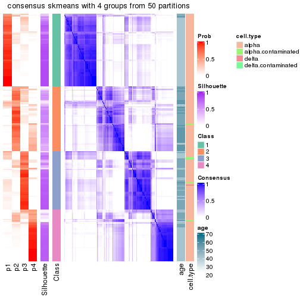</p>

</div>
</div>

Heatmaps for the membership of samples in all partitions to see how consistent they are:


<script>
$( function() {
	$( '#tabs-node-011-membership-heatmap' ).tabs();
} );
</script>
<div id='tabs-node-011-membership-heatmap'>
<ul>
<li><a href='#tab-node-011-membership-heatmap-1'>k = 2</a></li>
<li><a href='#tab-node-011-membership-heatmap-2'>k = 3</a></li>
<li><a href='#tab-node-011-membership-heatmap-3'>k = 4</a></li>
</ul>
<div id='tab-node-011-membership-heatmap-1'>
<pre><code class="r">membership_heatmap(res, k = 2)
</code></pre>

<p></p>

</div>
<div id='tab-node-011-membership-heatmap-2'>
<pre><code class="r">membership_heatmap(res, k = 3)
</code></pre>

<p></p>

</div>
<div id='tab-node-011-membership-heatmap-3'>
<pre><code class="r">membership_heatmap(res, k = 4)
</code></pre>

<p></p>

</div>
</div>

As soon as the classes for columns are determined, the signatures
that are significantly different between subgroups can be looked for. 
Following are the heatmaps for signatures.


Signature heatmaps where rows are scaled:


<script>
$( function() {
	$( '#tabs-node-011-get-signatures' ).tabs();
} );
</script>
<div id='tabs-node-011-get-signatures'>
<ul>
<li><a href='#tab-node-011-get-signatures-1'>k = 2</a></li>
<li><a href='#tab-node-011-get-signatures-2'>k = 3</a></li>
<li><a href='#tab-node-011-get-signatures-3'>k = 4</a></li>
</ul>
<div id='tab-node-011-get-signatures-1'>
<pre><code class="r">get_signatures(res, k = 2)
</code></pre>

<p></p>

</div>
<div id='tab-node-011-get-signatures-2'>
<pre><code class="r">get_signatures(res, k = 3)
</code></pre>

<p></p>

</div>
<div id='tab-node-011-get-signatures-3'>
<pre><code class="r">get_signatures(res, k = 4)
</code></pre>

<p></p>

</div>
</div>


Signature heatmaps where rows are not scaled:


<script>
$( function() {
	$( '#tabs-node-011-get-signatures-no-scale' ).tabs();
} );
</script>
<div id='tabs-node-011-get-signatures-no-scale'>
<ul>
<li><a href='#tab-node-011-get-signatures-no-scale-1'>k = 2</a></li>
<li><a href='#tab-node-011-get-signatures-no-scale-2'>k = 3</a></li>
<li><a href='#tab-node-011-get-signatures-no-scale-3'>k = 4</a></li>
</ul>
<div id='tab-node-011-get-signatures-no-scale-1'>
<pre><code class="r">get_signatures(res, k = 2, scale_rows = FALSE)
</code></pre>

<p></p>

</div>
<div id='tab-node-011-get-signatures-no-scale-2'>
<pre><code class="r">get_signatures(res, k = 3, scale_rows = FALSE)
</code></pre>

<p></p>

</div>
<div id='tab-node-011-get-signatures-no-scale-3'>
<pre><code class="r">get_signatures(res, k = 4, scale_rows = FALSE)
</code></pre>

<p></p>

</div>
</div>


Compare the overlap of signatures from different k:

```r
compare_signatures(res)
```


`get_signature()` returns a data frame invisibly. To get the list of signatures, the function
call should be assigned to a variable explicitly. In following code, if `plot` argument is set
to `FALSE`, no heatmap is plotted while only the differential analysis is performed.

```r
# code only for demonstration
tb = get_signature(res, k = ..., plot = FALSE)
```

An example of the output of `tb` is:

```
#>   which_row         fdr    mean_1    mean_2 scaled_mean_1 scaled_mean_2 km
#> 1        38 0.042760348  8.373488  9.131774    -0.5533452     0.5164555  1
#> 2        40 0.018707592  7.106213  8.469186    -0.6173731     0.5762149  1
#> 3        55 0.019134737 10.221463 11.207825    -0.6159697     0.5749050  1
#> 4        59 0.006059896  5.921854  7.869574    -0.6899429     0.6439467  1
#> 5        60 0.018055526  8.928898 10.211722    -0.6204761     0.5791110  1
#> 6        98 0.009384629 15.714769 14.887706     0.6635654    -0.6193277  2
...
```

The columns in `tb` are:

1. `which_row`: row indices corresponding to the input matrix.
2. `fdr`: FDR for the differential test. 
3. `mean_x`: The mean value in group x.
4. `scaled_mean_x`: The mean value in group x after rows are scaled.
5. `km`: Row groups if k-means clustering is applied to rows (which is done by automatically selecting number of clusters).

If there are too many signatures, `top_signatures = ...` can be set to only show the 
signatures with the highest FDRs:

```r
# code only for demonstration
# e.g. to show the top 500 most significant rows
tb = get_signature(res, k = ..., top_signatures = 500)
```

If the signatures are defined as these which are uniquely high in current group, `diff_method` argument
can be set to `"uniquely_high_in_one_group"`:

```r
# code only for demonstration
tb = get_signature(res, k = ..., diff_method = "uniquely_high_in_one_group")
```


UMAP plot which shows how samples are separated.


<script>
$( function() {
	$( '#tabs-node-011-dimension-reduction' ).tabs();
} );
</script>
<div id='tabs-node-011-dimension-reduction'>
<ul>
<li><a href='#tab-node-011-dimension-reduction-1'>k = 2</a></li>
<li><a href='#tab-node-011-dimension-reduction-2'>k = 3</a></li>
<li><a href='#tab-node-011-dimension-reduction-3'>k = 4</a></li>
</ul>
<div id='tab-node-011-dimension-reduction-1'>
<pre><code class="r">dimension_reduction(res, k = 2, method = &quot;UMAP&quot;)
</code></pre>

<p></p>

</div>
<div id='tab-node-011-dimension-reduction-2'>
<pre><code class="r">dimension_reduction(res, k = 3, method = &quot;UMAP&quot;)
</code></pre>

<p></p>

</div>
<div id='tab-node-011-dimension-reduction-3'>
<pre><code class="r">dimension_reduction(res, k = 4, method = &quot;UMAP&quot;)
</code></pre>

<p></p>

</div>
</div>


Following heatmap shows how subgroups are split when increasing `k`:

```r
collect_classes(res)
```


Test correlation between subgroups and known annotations. If the known
annotation is numeric, one-way ANOVA test is applied, and if the known
annotation is discrete, chi-squared contingency table test is applied.

```r
test_to_known_factors(res)
```

```
#>             n_sample age(p-value) cell.type(p-value) k
#> ATC:skmeans      228     1.26e-04              0.616 2
#> ATC:skmeans      220     2.83e-21              0.387 3
#> ATC:skmeans      186     4.10e-40              0.208 4
```


If matrix rows can be associated to genes, consider to use `functional_enrichment(res,
...)` to perform function enrichment for the signature genes. See [this vignette](https://jokergoo.github.io/cola_vignettes/functional_enrichment.html) for more detailed explanations.


 

---------------------------------------------------


### Node012


Parent node: [Node01](#Node01).
Child nodes: 
                Node0111-leaf
        ,
                Node0112-leaf
        ,
                Node0121-leaf
        ,
                Node0122-leaf
        ,
                Node0131-leaf
        ,
                Node0132-leaf
        ,
                [Node0211](#Node0211)
        ,
                [Node0212](#Node0212)
        ,
                [Node0221](#Node0221)
        ,
                [Node0222](#Node0222)
        ,
                Node0231-leaf
        ,
                Node0232-leaf
        ,
                Node0233-leaf
        ,
                Node0311-leaf
        ,
                Node0312-leaf
        ,
                Node0313-leaf
        ,
                Node0314-leaf
        ,
                [Node0321](#Node0321)
        ,
                [Node0322](#Node0322)
        ,
                Node0331-leaf
        ,
                Node0332-leaf
        ,
                Node0333-leaf
        .


The object with results only for a single top-value method and a single partitioning method 
can be extracted as:

```r
res = res_rh["012"]
```

A summary of `res` and all the functions that can be applied to it:

```r
res
```

```
#> A 'ConsensusPartition' object with k = 2, 3, 4.
#>   On a matrix with 14725 rows and 113 columns.
#>   Top rows (655) are extracted by 'ATC' method.
#>   Subgroups are detected by 'skmeans' method.
#>   Performed in total 150 partitions by row resampling.
#>   Best k for subgroups seems to be 2.
#> 
#> Following methods can be applied to this 'ConsensusPartition' object:
#>  [1] "cola_report"             "collect_classes"         "collect_plots"          
#>  [4] "collect_stats"           "colnames"                "compare_partitions"     
#>  [7] "compare_signatures"      "consensus_heatmap"       "dimension_reduction"    
#> [10] "functional_enrichment"   "get_anno_col"            "get_anno"               
#> [13] "get_classes"             "get_consensus"           "get_matrix"             
#> [16] "get_membership"          "get_param"               "get_signatures"         
#> [19] "get_stats"               "is_best_k"               "is_stable_k"            
#> [22] "membership_heatmap"      "ncol"                    "nrow"                   
#> [25] "plot_ecdf"               "predict_classes"         "rownames"               
#> [28] "select_partition_number" "show"                    "suggest_best_k"         
#> [31] "test_to_known_factors"   "top_rows_heatmap"
```

`collect_plots()` function collects all the plots made from `res` for all `k` (number of subgroups)
into one single page to provide an easy and fast comparison between different `k`.

```r
collect_plots(res)
```


The plots are:

- The first row: a plot of the eCDF (empirical cumulative distribution
  function) curves of the consensus matrix for each `k` and the heatmap of
  predicted classes for each `k`.
- The second row: heatmaps of the consensus matrix for each `k`.
- The third row: heatmaps of the membership matrix for each `k`.
- The fouth row: heatmaps of the signatures for each `k`.

All the plots in panels can be made by individual functions and they are
plotted later in this section.

`select_partition_number()` produces several plots showing different
statistics for choosing "optimized" `k`. There are following statistics:

- eCDF curves of the consensus matrix for each `k`;
- 1-PAC. [The PAC score](https://en.wikipedia.org/wiki/Consensus_clustering#Over-interpretation_potential_of_consensus_clustering)
  measures the proportion of the ambiguous subgrouping.
- Mean silhouette score.
- Concordance. The mean probability of fiting the consensus subgroup labels in all
  partitions.
- Area increased. Denote $A_k$ as the area under the eCDF curve for current
  `k`, the area increased is defined as $A_k - A_{k-1}$.
- Rand index. The percent of pairs of samples that are both in a same cluster
  or both are not in a same cluster in the partition of k and k-1.
- Jaccard index. The ratio of pairs of samples are both in a same cluster in
  the partition of k and k-1 and the pairs of samples are both in a same
  cluster in the partition k or k-1.

The detailed explanations of these statistics can be found in [the _cola_
vignette](https://jokergoo.github.io/cola_vignettes/cola.html#toc_13).

Generally speaking, higher 1-PAC score, higher mean silhouette score or higher
concordance corresponds to better partition. Rand index and Jaccard index
measure how similar the current partition is compared to partition with `k-1`.
If they are too similar, we won't accept `k` is better than `k-1`.

```r
select_partition_number(res)
```


The numeric values for all these statistics can be obtained by `get_stats()`.

```r
get_stats(res)
```

```
#>   k 1-PAC mean_silhouette concordance area_increased  Rand Jaccard
#> 2 2 1.000           0.968       0.987          0.500 0.502   0.502
#> 3 3 0.638           0.762       0.875          0.278 0.835   0.681
#> 4 4 0.558           0.664       0.792          0.122 0.883   0.710
```

`suggest_best_k()` suggests the best $k$ based on these statistics. The rules are as follows:

- All $k$ with Jaccard index larger than 0.95 are removed because increasing
  $k$ does not provide enough extra information. If all $k$ are removed, it is
  marked as no subgroup is detected.
- For all $k$ with 1-PAC score larger than 0.9, the maximal $k$ is taken as
  the best $k$, and other $k$ are marked as optional $k$.
- If it does not fit the second rule. The $k$ with the maximal vote of the
  highest 1-PAC score, highest mean silhouette, and highest concordance is
  taken as the best $k$.

```r
suggest_best_k(res)
```

```
#> [1] 2
```


Following is the table of the partitions (You need to click the **show/hide
code output** link to see it). The membership matrix (columns with name `p*`)
is inferred by
[`clue::cl_consensus()`](https://www.rdocumentation.org/link/cl_consensus?package=clue)
function with the `SE` method. Basically the value in the membership matrix
represents the probability to belong to a certain group. The finall subgroup
label for an item is determined with the group with highest probability it
belongs to.

In `get_classes()` function, the entropy is calculated from the membership
matrix and the silhouette score is calculated from the consensus matrix.


<script>
$( function() {
	$( '#tabs-node-012-get-classes' ).tabs();
} );
</script>
<div id='tabs-node-012-get-classes'>
<ul>
<li><a href='#tab-node-012-get-classes-1'>k = 2</a></li>
<li><a href='#tab-node-012-get-classes-2'>k = 3</a></li>
<li><a href='#tab-node-012-get-classes-3'>k = 4</a></li>
</ul>

<div id='tab-node-012-get-classes-1'>
<p><a id='tab-node-012-get-classes-1-a' style='color:#0366d6' href='#'>show/hide code output</a></p>
<pre><code class="r">cbind(get_classes(res, k = 2), get_membership(res, k = 2))
</code></pre>

<pre><code>#&gt;             class entropy silhouette   p1   p2
#&gt; Sample_121      1   0.000      0.992 1.00 0.00
#&gt; Sample_265      2   0.904      0.533 0.32 0.68
#&gt; Sample_272      2   0.000      0.982 0.00 1.00
#&gt; Sample_275      2   0.000      0.982 0.00 1.00
#&gt; Sample_302      2   0.000      0.982 0.00 1.00
#&gt; Sample_303      2   0.000      0.982 0.00 1.00
#&gt; Sample_304      2   0.000      0.982 0.00 1.00
#&gt; Sample_305      2   0.000      0.982 0.00 1.00
#&gt; Sample_308      2   0.000      0.982 0.00 1.00
#&gt; Sample_309      2   0.000      0.982 0.00 1.00
#&gt; Sample_310      2   0.000      0.982 0.00 1.00
#&gt; Sample_311      2   0.000      0.982 0.00 1.00
#&gt; Sample_312      2   0.000      0.982 0.00 1.00
#&gt; Sample_313      2   0.000      0.982 0.00 1.00
#&gt; Sample_314      2   0.000      0.982 0.00 1.00
#&gt; Sample_316      2   0.000      0.982 0.00 1.00
#&gt; Sample_318      2   0.000      0.982 0.00 1.00
#&gt; Sample_319      2   0.000      0.982 0.00 1.00
#&gt; Sample_320      2   0.000      0.982 0.00 1.00
#&gt; Sample_321      1   0.000      0.992 1.00 0.00
#&gt; Sample_323      2   0.000      0.982 0.00 1.00
#&gt; Sample_324      2   0.000      0.982 0.00 1.00
#&gt; Sample_325      2   0.000      0.982 0.00 1.00
#&gt; Sample_326      1   0.000      0.992 1.00 0.00
#&gt; Sample_327      2   0.000      0.982 0.00 1.00
#&gt; Sample_328      2   0.000      0.982 0.00 1.00
#&gt; Sample_329      1   0.000      0.992 1.00 0.00
#&gt; Sample_330      2   0.000      0.982 0.00 1.00
#&gt; Sample_351      2   0.000      0.982 0.00 1.00
#&gt; Sample_355      2   0.000      0.982 0.00 1.00
#&gt; Sample_358      2   0.141      0.963 0.02 0.98
#&gt; Sample_360      2   0.000      0.982 0.00 1.00
#&gt; Sample_362      2   0.000      0.982 0.00 1.00
#&gt; Sample_368      2   0.000      0.982 0.00 1.00
#&gt; Sample_369      2   0.000      0.982 0.00 1.00
#&gt; Sample_377      2   0.000      0.982 0.00 1.00
#&gt; Sample_381      2   0.000      0.982 0.00 1.00
#&gt; Sample_385      1   0.000      0.992 1.00 0.00
#&gt; Sample_386      1   0.000      0.992 1.00 0.00
#&gt; Sample_393      2   0.000      0.982 0.00 1.00
#&gt; Sample_395      2   0.000      0.982 0.00 1.00
#&gt; Sample_397      2   0.000      0.982 0.00 1.00
#&gt; Sample_398      2   0.000      0.982 0.00 1.00
#&gt; Sample_409      2   0.000      0.982 0.00 1.00
#&gt; Sample_412      2   0.000      0.982 0.00 1.00
#&gt; Sample_416      2   0.000      0.982 0.00 1.00
#&gt; Sample_421      2   0.000      0.982 0.00 1.00
#&gt; Sample_424      2   0.000      0.982 0.00 1.00
#&gt; Sample_425      2   0.000      0.982 0.00 1.00
#&gt; Sample_427      2   0.000      0.982 0.00 1.00
#&gt; Sample_428      2   0.000      0.982 0.00 1.00
#&gt; Sample_431      2   0.000      0.982 0.00 1.00
#&gt; Sample_432      1   0.000      0.992 1.00 0.00
#&gt; Sample_434      1   0.000      0.992 1.00 0.00
#&gt; Sample_439      1   0.000      0.992 1.00 0.00
#&gt; Sample_440      2   0.000      0.982 0.00 1.00
#&gt; Sample_442      2   0.000      0.982 0.00 1.00
#&gt; Sample_445      1   0.000      0.992 1.00 0.00
#&gt; Sample_446      2   0.000      0.982 0.00 1.00
#&gt; Sample_451      2   0.000      0.982 0.00 1.00
#&gt; Sample_452      1   0.000      0.992 1.00 0.00
#&gt; Sample_456      1   0.402      0.914 0.92 0.08
#&gt; Sample_459      2   0.000      0.982 0.00 1.00
#&gt; Sample_461      1   0.141      0.975 0.98 0.02
#&gt; Sample_464      1   0.000      0.992 1.00 0.00
#&gt; Sample_465      1   0.000      0.992 1.00 0.00
#&gt; Sample_466      1   0.000      0.992 1.00 0.00
#&gt; Sample_468      1   0.000      0.992 1.00 0.00
#&gt; Sample_469      2   0.000      0.982 0.00 1.00
#&gt; Sample_472      1   0.327      0.936 0.94 0.06
#&gt; Sample_474      1   0.584      0.839 0.86 0.14
#&gt; Sample_475      1   0.000      0.992 1.00 0.00
#&gt; Sample_573      1   0.000      0.992 1.00 0.00
#&gt; Sample_577      2   0.000      0.982 0.00 1.00
#&gt; Sample_618      1   0.000      0.992 1.00 0.00
#&gt; Sample_685      1   0.000      0.992 1.00 0.00
#&gt; Sample_687      1   0.000      0.992 1.00 0.00
#&gt; Sample_692      1   0.000      0.992 1.00 0.00
#&gt; Sample_737      1   0.000      0.992 1.00 0.00
#&gt; Sample_962      2   0.000      0.982 0.00 1.00
#&gt; Sample_968      2   0.000      0.982 0.00 1.00
#&gt; Sample_978      2   0.000      0.982 0.00 1.00
#&gt; Sample_982      1   0.000      0.992 1.00 0.00
#&gt; Sample_983      2   0.000      0.982 0.00 1.00
#&gt; Sample_985      2   0.000      0.982 0.00 1.00
#&gt; Sample_987      2   0.904      0.535 0.32 0.68
#&gt; Sample_988      1   0.000      0.992 1.00 0.00
#&gt; Sample_989      1   0.327      0.937 0.94 0.06
#&gt; Sample_990      1   0.000      0.992 1.00 0.00
#&gt; Sample_991      1   0.000      0.992 1.00 0.00
#&gt; Sample_992      1   0.000      0.992 1.00 0.00
#&gt; Sample_993      1   0.000      0.992 1.00 0.00
#&gt; Sample_994      2   0.995      0.161 0.46 0.54
#&gt; Sample_1007     2   0.000      0.982 0.00 1.00
#&gt; Sample_1014     1   0.000      0.992 1.00 0.00
#&gt; Sample_1015     1   0.000      0.992 1.00 0.00
#&gt; Sample_1016     1   0.000      0.992 1.00 0.00
#&gt; Sample_1017     1   0.000      0.992 1.00 0.00
#&gt; Sample_1018     1   0.000      0.992 1.00 0.00
#&gt; Sample_1019     1   0.000      0.992 1.00 0.00
#&gt; Sample_1020     1   0.000      0.992 1.00 0.00
#&gt; Sample_1021     1   0.000      0.992 1.00 0.00
#&gt; Sample_1022     1   0.000      0.992 1.00 0.00
#&gt; Sample_1023     1   0.000      0.992 1.00 0.00
#&gt; Sample_1024     1   0.000      0.992 1.00 0.00
#&gt; Sample_1025     1   0.000      0.992 1.00 0.00
#&gt; Sample_1026     1   0.000      0.992 1.00 0.00
#&gt; Sample_1058     1   0.000      0.992 1.00 0.00
#&gt; Sample_1192     2   0.000      0.982 0.00 1.00
#&gt; Sample_1216     2   0.000      0.982 0.00 1.00
#&gt; Sample_1525     1   0.000      0.992 1.00 0.00
#&gt; Sample_1526     1   0.000      0.992 1.00 0.00
#&gt; Sample_1562     1   0.000      0.992 1.00 0.00
</code></pre>

<script>
$('#tab-node-012-get-classes-1-a').parent().next().next().hide();
$('#tab-node-012-get-classes-1-a').click(function(){
  $('#tab-node-012-get-classes-1-a').parent().next().next().toggle();
  return(false);
});
</script>
</div>

<div id='tab-node-012-get-classes-2'>
<p><a id='tab-node-012-get-classes-2-a' style='color:#0366d6' href='#'>show/hide code output</a></p>
<pre><code class="r">cbind(get_classes(res, k = 3), get_membership(res, k = 3))
</code></pre>

<pre><code>#&gt;             class entropy silhouette   p1   p2   p3
#&gt; Sample_121      1  0.0000     0.8870 1.00 0.00 0.00
#&gt; Sample_265      3  0.9602     0.2123 0.20 0.40 0.40
#&gt; Sample_272      2  0.1529     0.8983 0.00 0.96 0.04
#&gt; Sample_275      2  0.1529     0.9003 0.00 0.96 0.04
#&gt; Sample_302      2  0.2066     0.8959 0.00 0.94 0.06
#&gt; Sample_303      2  0.0000     0.8988 0.00 1.00 0.00
#&gt; Sample_304      2  0.2066     0.8959 0.00 0.94 0.06
#&gt; Sample_305      2  0.2066     0.8959 0.00 0.94 0.06
#&gt; Sample_308      2  0.1529     0.9003 0.00 0.96 0.04
#&gt; Sample_309      2  0.0892     0.8960 0.00 0.98 0.02
#&gt; Sample_310      2  0.2066     0.8959 0.00 0.94 0.06
#&gt; Sample_311      2  0.0000     0.8988 0.00 1.00 0.00
#&gt; Sample_312      2  0.3686     0.8332 0.00 0.86 0.14
#&gt; Sample_313      2  0.2537     0.8917 0.00 0.92 0.08
#&gt; Sample_314      2  0.2537     0.8919 0.00 0.92 0.08
#&gt; Sample_316      2  0.2959     0.8729 0.00 0.90 0.10
#&gt; Sample_318      2  0.1529     0.8866 0.00 0.96 0.04
#&gt; Sample_319      2  0.0892     0.8960 0.00 0.98 0.02
#&gt; Sample_320      2  0.0000     0.8988 0.00 1.00 0.00
#&gt; Sample_321      1  0.4551     0.7819 0.84 0.02 0.14
#&gt; Sample_323      2  0.0892     0.8960 0.00 0.98 0.02
#&gt; Sample_324      2  0.2537     0.8919 0.00 0.92 0.08
#&gt; Sample_325      2  0.2959     0.8828 0.00 0.90 0.10
#&gt; Sample_326      1  0.3340     0.8155 0.88 0.00 0.12
#&gt; Sample_327      2  0.4002     0.7688 0.00 0.84 0.16
#&gt; Sample_328      2  0.1529     0.8860 0.00 0.96 0.04
#&gt; Sample_329      1  0.0892     0.8782 0.98 0.00 0.02
#&gt; Sample_330      2  0.2537     0.8919 0.00 0.92 0.08
#&gt; Sample_351      2  0.3340     0.8707 0.00 0.88 0.12
#&gt; Sample_355      2  0.0892     0.8960 0.00 0.98 0.02
#&gt; Sample_358      2  0.5334     0.7437 0.06 0.82 0.12
#&gt; Sample_360      2  0.2066     0.8731 0.00 0.94 0.06
#&gt; Sample_362      2  0.0000     0.8988 0.00 1.00 0.00
#&gt; Sample_368      2  0.1529     0.8864 0.00 0.96 0.04
#&gt; Sample_369      2  0.0892     0.8960 0.00 0.98 0.02
#&gt; Sample_377      2  0.3686     0.8561 0.00 0.86 0.14
#&gt; Sample_381      2  0.3686     0.8561 0.00 0.86 0.14
#&gt; Sample_385      1  0.6407     0.6923 0.76 0.08 0.16
#&gt; Sample_386      1  0.6495     0.6730 0.74 0.06 0.20
#&gt; Sample_393      2  0.0892     0.8960 0.00 0.98 0.02
#&gt; Sample_395      2  0.5216     0.7128 0.00 0.74 0.26
#&gt; Sample_397      2  0.6302     0.0536 0.00 0.52 0.48
#&gt; Sample_398      2  0.0892     0.8960 0.00 0.98 0.02
#&gt; Sample_409      2  0.3340     0.8909 0.00 0.88 0.12
#&gt; Sample_412      2  0.2537     0.8919 0.00 0.92 0.08
#&gt; Sample_416      2  0.3686     0.8575 0.00 0.86 0.14
#&gt; Sample_421      2  0.2066     0.8959 0.00 0.94 0.06
#&gt; Sample_424      2  0.3686     0.8561 0.00 0.86 0.14
#&gt; Sample_425      2  0.4002     0.8370 0.00 0.84 0.16
#&gt; Sample_427      2  0.2959     0.8828 0.00 0.90 0.10
#&gt; Sample_428      2  0.3340     0.8707 0.00 0.88 0.12
#&gt; Sample_431      3  0.5948     0.4130 0.00 0.36 0.64
#&gt; Sample_432      1  0.4002     0.7889 0.84 0.00 0.16
#&gt; Sample_434      1  0.0000     0.8870 1.00 0.00 0.00
#&gt; Sample_439      1  0.0892     0.8783 0.98 0.00 0.02
#&gt; Sample_440      3  0.6309    -0.0291 0.00 0.50 0.50
#&gt; Sample_442      3  0.5948     0.4081 0.00 0.36 0.64
#&gt; Sample_445      1  0.5147     0.7423 0.80 0.02 0.18
#&gt; Sample_446      3  0.4555     0.6536 0.00 0.20 0.80
#&gt; Sample_451      3  0.2537     0.6858 0.00 0.08 0.92
#&gt; Sample_452      1  0.0000     0.8870 1.00 0.00 0.00
#&gt; Sample_456      3  0.7555     0.0954 0.44 0.04 0.52
#&gt; Sample_459      3  0.0000     0.6761 0.00 0.00 1.00
#&gt; Sample_461      3  0.3340     0.6208 0.12 0.00 0.88
#&gt; Sample_464      1  0.5016     0.7108 0.76 0.00 0.24
#&gt; Sample_465      1  0.6309     0.1616 0.50 0.00 0.50
#&gt; Sample_466      1  0.0000     0.8870 1.00 0.00 0.00
#&gt; Sample_468      1  0.6045     0.4202 0.62 0.00 0.38
#&gt; Sample_469      2  0.6126     0.4447 0.00 0.60 0.40
#&gt; Sample_472      1  0.7553     0.5054 0.62 0.06 0.32
#&gt; Sample_474      3  0.9110    -0.0171 0.42 0.14 0.44
#&gt; Sample_475      1  0.0000     0.8870 1.00 0.00 0.00
#&gt; Sample_573      1  0.0000     0.8870 1.00 0.00 0.00
#&gt; Sample_577      2  0.4291     0.8168 0.00 0.82 0.18
#&gt; Sample_618      1  0.0000     0.8870 1.00 0.00 0.00
#&gt; Sample_685      1  0.0000     0.8870 1.00 0.00 0.00
#&gt; Sample_687      1  0.0000     0.8870 1.00 0.00 0.00
#&gt; Sample_692      1  0.0000     0.8870 1.00 0.00 0.00
#&gt; Sample_737      1  0.0000     0.8870 1.00 0.00 0.00
#&gt; Sample_962      2  0.0892     0.8960 0.00 0.98 0.02
#&gt; Sample_968      2  0.4002     0.7692 0.00 0.84 0.16
#&gt; Sample_978      3  0.4291     0.6707 0.00 0.18 0.82
#&gt; Sample_982      1  0.0892     0.8771 0.98 0.00 0.02
#&gt; Sample_983      3  0.4291     0.6707 0.00 0.18 0.82
#&gt; Sample_985      3  0.4555     0.6660 0.00 0.20 0.80
#&gt; Sample_987      3  0.0892     0.6804 0.02 0.00 0.98
#&gt; Sample_988      1  0.1529     0.8649 0.96 0.00 0.04
#&gt; Sample_989      3  0.6803     0.5589 0.28 0.04 0.68
#&gt; Sample_990      3  0.5560     0.5326 0.30 0.00 0.70
#&gt; Sample_991      1  0.0000     0.8870 1.00 0.00 0.00
#&gt; Sample_992      1  0.2066     0.8495 0.94 0.00 0.06
#&gt; Sample_993      1  0.1529     0.8646 0.96 0.00 0.04
#&gt; Sample_994      3  0.5416     0.6985 0.08 0.10 0.82
#&gt; Sample_1007     2  0.0892     0.8960 0.00 0.98 0.02
#&gt; Sample_1014     1  0.4002     0.7433 0.84 0.00 0.16
#&gt; Sample_1015     1  0.1529     0.8660 0.96 0.00 0.04
#&gt; Sample_1016     1  0.6302    -0.0428 0.52 0.00 0.48
#&gt; Sample_1017     3  0.5706     0.4998 0.32 0.00 0.68
#&gt; Sample_1018     3  0.5560     0.5326 0.30 0.00 0.70
#&gt; Sample_1019     1  0.5560     0.5060 0.70 0.00 0.30
#&gt; Sample_1020     1  0.0000     0.8870 1.00 0.00 0.00
#&gt; Sample_1021     3  0.5016     0.5956 0.24 0.00 0.76
#&gt; Sample_1022     1  0.0000     0.8870 1.00 0.00 0.00
#&gt; Sample_1023     1  0.0000     0.8870 1.00 0.00 0.00
#&gt; Sample_1024     1  0.0000     0.8870 1.00 0.00 0.00
#&gt; Sample_1025     1  0.0000     0.8870 1.00 0.00 0.00
#&gt; Sample_1026     1  0.0000     0.8870 1.00 0.00 0.00
#&gt; Sample_1058     1  0.4291     0.7720 0.82 0.00 0.18
#&gt; Sample_1192     2  0.0892     0.8960 0.00 0.98 0.02
#&gt; Sample_1216     2  0.2537     0.8919 0.00 0.92 0.08
#&gt; Sample_1525     1  0.0000     0.8870 1.00 0.00 0.00
#&gt; Sample_1526     1  0.0000     0.8870 1.00 0.00 0.00
#&gt; Sample_1562     1  0.0000     0.8870 1.00 0.00 0.00
</code></pre>

<script>
$('#tab-node-012-get-classes-2-a').parent().next().next().hide();
$('#tab-node-012-get-classes-2-a').click(function(){
  $('#tab-node-012-get-classes-2-a').parent().next().next().toggle();
  return(false);
});
</script>
</div>

<div id='tab-node-012-get-classes-3'>
<p><a id='tab-node-012-get-classes-3-a' style='color:#0366d6' href='#'>show/hide code output</a></p>
<pre><code class="r">cbind(get_classes(res, k = 4), get_membership(res, k = 4))
</code></pre>

<pre><code>#&gt;             class entropy silhouette   p1   p2   p3   p4
#&gt; Sample_121      1  0.0000    0.90487 1.00 0.00 0.00 0.00
#&gt; Sample_265      4  0.4011    0.53902 0.04 0.06 0.04 0.86
#&gt; Sample_272      2  0.2345    0.76141 0.00 0.90 0.10 0.00
#&gt; Sample_275      2  0.4088    0.73271 0.00 0.82 0.04 0.14
#&gt; Sample_302      2  0.3037    0.76002 0.00 0.88 0.10 0.02
#&gt; Sample_303      2  0.3198    0.75721 0.00 0.88 0.04 0.08
#&gt; Sample_304      2  0.2921    0.75267 0.00 0.86 0.14 0.00
#&gt; Sample_305      2  0.2647    0.75777 0.00 0.88 0.12 0.00
#&gt; Sample_308      2  0.4292    0.75035 0.00 0.82 0.08 0.10
#&gt; Sample_309      2  0.3335    0.72795 0.00 0.86 0.02 0.12
#&gt; Sample_310      2  0.3606    0.75535 0.00 0.84 0.14 0.02
#&gt; Sample_311      2  0.3611    0.75492 0.00 0.86 0.06 0.08
#&gt; Sample_312      2  0.5489    0.60073 0.00 0.70 0.06 0.24
#&gt; Sample_313      2  0.5147    0.71385 0.00 0.74 0.20 0.06
#&gt; Sample_314      2  0.3975    0.71720 0.00 0.76 0.24 0.00
#&gt; Sample_316      2  0.2830    0.75961 0.00 0.90 0.06 0.04
#&gt; Sample_318      2  0.4284    0.71694 0.00 0.78 0.02 0.20
#&gt; Sample_319      2  0.3400    0.71111 0.00 0.82 0.00 0.18
#&gt; Sample_320      2  0.4332    0.70228 0.00 0.80 0.04 0.16
#&gt; Sample_321      1  0.7774    0.00104 0.52 0.06 0.08 0.34
#&gt; Sample_323      2  0.2647    0.73519 0.00 0.88 0.00 0.12
#&gt; Sample_324      2  0.4797    0.69806 0.00 0.72 0.26 0.02
#&gt; Sample_325      2  0.4134    0.70858 0.00 0.74 0.26 0.00
#&gt; Sample_326      1  0.3801    0.64407 0.78 0.00 0.00 0.22
#&gt; Sample_327      2  0.5106    0.64901 0.00 0.72 0.04 0.24
#&gt; Sample_328      2  0.4491    0.72985 0.00 0.80 0.06 0.14
#&gt; Sample_329      1  0.2647    0.79824 0.88 0.00 0.00 0.12
#&gt; Sample_330      2  0.3606    0.75589 0.00 0.84 0.14 0.02
#&gt; Sample_351      2  0.5256    0.69874 0.00 0.70 0.26 0.04
#&gt; Sample_355      2  0.4755    0.68004 0.00 0.76 0.04 0.20
#&gt; Sample_358      2  0.6425    0.46509 0.02 0.58 0.04 0.36
#&gt; Sample_360      2  0.4939    0.66661 0.00 0.74 0.04 0.22
#&gt; Sample_362      2  0.4731    0.71326 0.00 0.78 0.06 0.16
#&gt; Sample_368      2  0.4939    0.67769 0.00 0.74 0.04 0.22
#&gt; Sample_369      2  0.4949    0.70509 0.00 0.76 0.06 0.18
#&gt; Sample_377      2  0.5392    0.67362 0.00 0.68 0.28 0.04
#&gt; Sample_381      2  0.5256    0.71948 0.00 0.70 0.26 0.04
#&gt; Sample_385      4  0.5913    0.56138 0.34 0.02 0.02 0.62
#&gt; Sample_386      4  0.2647    0.62384 0.12 0.00 0.00 0.88
#&gt; Sample_393      2  0.4553    0.69329 0.00 0.78 0.04 0.18
#&gt; Sample_395      4  0.5594    0.38984 0.00 0.18 0.10 0.72
#&gt; Sample_397      2  0.6005    0.42258 0.00 0.50 0.46 0.04
#&gt; Sample_398      2  0.3821    0.75437 0.00 0.84 0.04 0.12
#&gt; Sample_409      2  0.6286    0.69252 0.00 0.66 0.14 0.20
#&gt; Sample_412      2  0.4284    0.74213 0.00 0.78 0.20 0.02
#&gt; Sample_416      2  0.6201    0.65129 0.00 0.62 0.30 0.08
#&gt; Sample_421      2  0.5106    0.71020 0.00 0.72 0.24 0.04
#&gt; Sample_424      2  0.4936    0.68641 0.00 0.70 0.28 0.02
#&gt; Sample_425      2  0.4797    0.69806 0.00 0.72 0.26 0.02
#&gt; Sample_427      2  0.4797    0.69806 0.00 0.72 0.26 0.02
#&gt; Sample_428      2  0.5820    0.70882 0.00 0.68 0.24 0.08
#&gt; Sample_431      2  0.7021    0.41847 0.00 0.48 0.40 0.12
#&gt; Sample_432      4  0.4790    0.51554 0.38 0.00 0.00 0.62
#&gt; Sample_434      1  0.1211    0.87730 0.96 0.00 0.00 0.04
#&gt; Sample_439      1  0.4277    0.48594 0.72 0.00 0.00 0.28
#&gt; Sample_440      2  0.6382    0.56187 0.00 0.58 0.34 0.08
#&gt; Sample_442      2  0.7344    0.40196 0.00 0.46 0.38 0.16
#&gt; Sample_445      4  0.4406    0.60484 0.30 0.00 0.00 0.70
#&gt; Sample_446      3  0.5784    0.37242 0.00 0.20 0.70 0.10
#&gt; Sample_451      3  0.5860    0.26078 0.00 0.04 0.58 0.38
#&gt; Sample_452      1  0.0707    0.89055 0.98 0.00 0.00 0.02
#&gt; Sample_456      4  0.8758    0.21159 0.28 0.04 0.30 0.38
#&gt; Sample_459      4  0.5915    0.14766 0.00 0.04 0.40 0.56
#&gt; Sample_461      4  0.6350    0.33070 0.04 0.02 0.34 0.60
#&gt; Sample_464      4  0.4977    0.34696 0.46 0.00 0.00 0.54
#&gt; Sample_465      4  0.6104    0.57700 0.18 0.00 0.14 0.68
#&gt; Sample_466      1  0.0000    0.90487 1.00 0.00 0.00 0.00
#&gt; Sample_468      4  0.6510    0.47808 0.38 0.00 0.08 0.54
#&gt; Sample_469      4  0.6686    0.31774 0.00 0.18 0.20 0.62
#&gt; Sample_472      4  0.3335    0.62364 0.12 0.00 0.02 0.86
#&gt; Sample_474      4  0.4011    0.58713 0.06 0.04 0.04 0.86
#&gt; Sample_475      1  0.0000    0.90487 1.00 0.00 0.00 0.00
#&gt; Sample_573      1  0.0000    0.90487 1.00 0.00 0.00 0.00
#&gt; Sample_577      2  0.5793    0.62211 0.00 0.60 0.36 0.04
#&gt; Sample_618      1  0.0000    0.90487 1.00 0.00 0.00 0.00
#&gt; Sample_685      1  0.0000    0.90487 1.00 0.00 0.00 0.00
#&gt; Sample_687      1  0.0000    0.90487 1.00 0.00 0.00 0.00
#&gt; Sample_692      1  0.0000    0.90487 1.00 0.00 0.00 0.00
#&gt; Sample_737      1  0.0000    0.90487 1.00 0.00 0.00 0.00
#&gt; Sample_962      2  0.2706    0.75788 0.00 0.90 0.02 0.08
#&gt; Sample_968      2  0.6005    0.33441 0.00 0.50 0.04 0.46
#&gt; Sample_978      3  0.2335    0.57680 0.00 0.06 0.92 0.02
#&gt; Sample_982      1  0.0000    0.90487 1.00 0.00 0.00 0.00
#&gt; Sample_983      3  0.1211    0.59755 0.00 0.04 0.96 0.00
#&gt; Sample_985      3  0.3935    0.57579 0.00 0.10 0.84 0.06
#&gt; Sample_987      3  0.5355    0.25855 0.00 0.02 0.62 0.36
#&gt; Sample_988      1  0.2345    0.83015 0.90 0.00 0.10 0.00
#&gt; Sample_989      3  0.6463    0.56670 0.18 0.06 0.70 0.06
#&gt; Sample_990      3  0.4472    0.58608 0.22 0.00 0.76 0.02
#&gt; Sample_991      1  0.0000    0.90487 1.00 0.00 0.00 0.00
#&gt; Sample_992      1  0.2345    0.82726 0.90 0.00 0.10 0.00
#&gt; Sample_993      1  0.2647    0.80914 0.88 0.00 0.12 0.00
#&gt; Sample_994      3  0.1211    0.59755 0.00 0.04 0.96 0.00
#&gt; Sample_1007     2  0.3821    0.72304 0.00 0.84 0.04 0.12
#&gt; Sample_1014     1  0.2345    0.82703 0.90 0.00 0.10 0.00
#&gt; Sample_1015     1  0.2706    0.83577 0.90 0.00 0.02 0.08
#&gt; Sample_1016     3  0.5606    0.11821 0.48 0.00 0.50 0.02
#&gt; Sample_1017     3  0.4406    0.49737 0.30 0.00 0.70 0.00
#&gt; Sample_1018     3  0.3975    0.57965 0.24 0.00 0.76 0.00
#&gt; Sample_1019     1  0.4790    0.31140 0.62 0.00 0.38 0.00
#&gt; Sample_1020     1  0.0000    0.90487 1.00 0.00 0.00 0.00
#&gt; Sample_1021     3  0.3801    0.59621 0.22 0.00 0.78 0.00
#&gt; Sample_1022     1  0.0000    0.90487 1.00 0.00 0.00 0.00
#&gt; Sample_1023     1  0.0000    0.90487 1.00 0.00 0.00 0.00
#&gt; Sample_1024     1  0.0000    0.90487 1.00 0.00 0.00 0.00
#&gt; Sample_1025     1  0.0000    0.90487 1.00 0.00 0.00 0.00
#&gt; Sample_1026     1  0.0000    0.90487 1.00 0.00 0.00 0.00
#&gt; Sample_1058     1  0.6089    0.33971 0.64 0.00 0.08 0.28
#&gt; Sample_1192     2  0.4553    0.68913 0.00 0.78 0.04 0.18
#&gt; Sample_1216     2  0.3801    0.72912 0.00 0.78 0.22 0.00
#&gt; Sample_1525     1  0.0000    0.90487 1.00 0.00 0.00 0.00
#&gt; Sample_1526     1  0.0000    0.90487 1.00 0.00 0.00 0.00
#&gt; Sample_1562     1  0.0000    0.90487 1.00 0.00 0.00 0.00
</code></pre>

<script>
$('#tab-node-012-get-classes-3-a').parent().next().next().hide();
$('#tab-node-012-get-classes-3-a').click(function(){
  $('#tab-node-012-get-classes-3-a').parent().next().next().toggle();
  return(false);
});
</script>
</div>
</div>

Heatmaps for the consensus matrix. It visualizes the probability of two
samples to be in a same group.


<script>
$( function() {
	$( '#tabs-node-012-consensus-heatmap' ).tabs();
} );
</script>
<div id='tabs-node-012-consensus-heatmap'>
<ul>
<li><a href='#tab-node-012-consensus-heatmap-1'>k = 2</a></li>
<li><a href='#tab-node-012-consensus-heatmap-2'>k = 3</a></li>
<li><a href='#tab-node-012-consensus-heatmap-3'>k = 4</a></li>
</ul>
<div id='tab-node-012-consensus-heatmap-1'>
<pre><code class="r">consensus_heatmap(res, k = 2)
</code></pre>

<p></p>

</div>
<div id='tab-node-012-consensus-heatmap-2'>
<pre><code class="r">consensus_heatmap(res, k = 3)
</code></pre>

<p></p>

</div>
<div id='tab-node-012-consensus-heatmap-3'>
<pre><code class="r">consensus_heatmap(res, k = 4)
</code></pre>

<p></p>

</div>
</div>

Heatmaps for the membership of samples in all partitions to see how consistent they are:


<script>
$( function() {
	$( '#tabs-node-012-membership-heatmap' ).tabs();
} );
</script>
<div id='tabs-node-012-membership-heatmap'>
<ul>
<li><a href='#tab-node-012-membership-heatmap-1'>k = 2</a></li>
<li><a href='#tab-node-012-membership-heatmap-2'>k = 3</a></li>
<li><a href='#tab-node-012-membership-heatmap-3'>k = 4</a></li>
</ul>
<div id='tab-node-012-membership-heatmap-1'>
<pre><code class="r">membership_heatmap(res, k = 2)
</code></pre>

<p></p>

</div>
<div id='tab-node-012-membership-heatmap-2'>
<pre><code class="r">membership_heatmap(res, k = 3)
</code></pre>

<p></p>

</div>
<div id='tab-node-012-membership-heatmap-3'>
<pre><code class="r">membership_heatmap(res, k = 4)
</code></pre>

<p></p>

</div>
</div>

As soon as the classes for columns are determined, the signatures
that are significantly different between subgroups can be looked for. 
Following are the heatmaps for signatures.


Signature heatmaps where rows are scaled:


<script>
$( function() {
	$( '#tabs-node-012-get-signatures' ).tabs();
} );
</script>
<div id='tabs-node-012-get-signatures'>
<ul>
<li><a href='#tab-node-012-get-signatures-1'>k = 2</a></li>
<li><a href='#tab-node-012-get-signatures-2'>k = 3</a></li>
<li><a href='#tab-node-012-get-signatures-3'>k = 4</a></li>
</ul>
<div id='tab-node-012-get-signatures-1'>
<pre><code class="r">get_signatures(res, k = 2)
</code></pre>

<p></p>

</div>
<div id='tab-node-012-get-signatures-2'>
<pre><code class="r">get_signatures(res, k = 3)
</code></pre>

<p></p>

</div>
<div id='tab-node-012-get-signatures-3'>
<pre><code class="r">get_signatures(res, k = 4)
</code></pre>

<p></p>

</div>
</div>


Signature heatmaps where rows are not scaled:


<script>
$( function() {
	$( '#tabs-node-012-get-signatures-no-scale' ).tabs();
} );
</script>
<div id='tabs-node-012-get-signatures-no-scale'>
<ul>
<li><a href='#tab-node-012-get-signatures-no-scale-1'>k = 2</a></li>
<li><a href='#tab-node-012-get-signatures-no-scale-2'>k = 3</a></li>
<li><a href='#tab-node-012-get-signatures-no-scale-3'>k = 4</a></li>
</ul>
<div id='tab-node-012-get-signatures-no-scale-1'>
<pre><code class="r">get_signatures(res, k = 2, scale_rows = FALSE)
</code></pre>

<p></p>

</div>
<div id='tab-node-012-get-signatures-no-scale-2'>
<pre><code class="r">get_signatures(res, k = 3, scale_rows = FALSE)
</code></pre>

<p></p>

</div>
<div id='tab-node-012-get-signatures-no-scale-3'>
<pre><code class="r">get_signatures(res, k = 4, scale_rows = FALSE)
</code></pre>

<p></p>

</div>
</div>


Compare the overlap of signatures from different k:

```r
compare_signatures(res)
```


`get_signature()` returns a data frame invisibly. To get the list of signatures, the function
call should be assigned to a variable explicitly. In following code, if `plot` argument is set
to `FALSE`, no heatmap is plotted while only the differential analysis is performed.

```r
# code only for demonstration
tb = get_signature(res, k = ..., plot = FALSE)
```

An example of the output of `tb` is:

```
#>   which_row         fdr    mean_1    mean_2 scaled_mean_1 scaled_mean_2 km
#> 1        38 0.042760348  8.373488  9.131774    -0.5533452     0.5164555  1
#> 2        40 0.018707592  7.106213  8.469186    -0.6173731     0.5762149  1
#> 3        55 0.019134737 10.221463 11.207825    -0.6159697     0.5749050  1
#> 4        59 0.006059896  5.921854  7.869574    -0.6899429     0.6439467  1
#> 5        60 0.018055526  8.928898 10.211722    -0.6204761     0.5791110  1
#> 6        98 0.009384629 15.714769 14.887706     0.6635654    -0.6193277  2
...
```

The columns in `tb` are:

1. `which_row`: row indices corresponding to the input matrix.
2. `fdr`: FDR for the differential test. 
3. `mean_x`: The mean value in group x.
4. `scaled_mean_x`: The mean value in group x after rows are scaled.
5. `km`: Row groups if k-means clustering is applied to rows (which is done by automatically selecting number of clusters).

If there are too many signatures, `top_signatures = ...` can be set to only show the 
signatures with the highest FDRs:

```r
# code only for demonstration
# e.g. to show the top 500 most significant rows
tb = get_signature(res, k = ..., top_signatures = 500)
```

If the signatures are defined as these which are uniquely high in current group, `diff_method` argument
can be set to `"uniquely_high_in_one_group"`:

```r
# code only for demonstration
tb = get_signature(res, k = ..., diff_method = "uniquely_high_in_one_group")
```


UMAP plot which shows how samples are separated.


<script>
$( function() {
	$( '#tabs-node-012-dimension-reduction' ).tabs();
} );
</script>
<div id='tabs-node-012-dimension-reduction'>
<ul>
<li><a href='#tab-node-012-dimension-reduction-1'>k = 2</a></li>
<li><a href='#tab-node-012-dimension-reduction-2'>k = 3</a></li>
<li><a href='#tab-node-012-dimension-reduction-3'>k = 4</a></li>
</ul>
<div id='tab-node-012-dimension-reduction-1'>
<pre><code class="r">dimension_reduction(res, k = 2, method = &quot;UMAP&quot;)
</code></pre>

<p>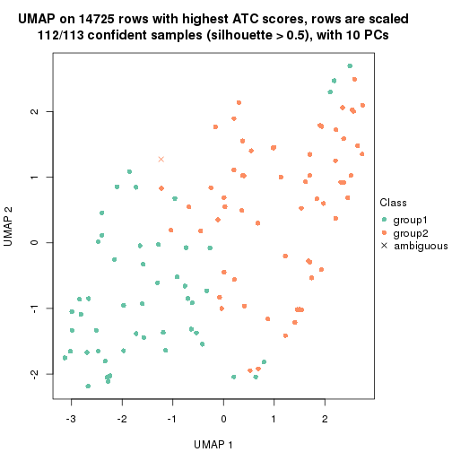</p>

</div>
<div id='tab-node-012-dimension-reduction-2'>
<pre><code class="r">dimension_reduction(res, k = 3, method = &quot;UMAP&quot;)
</code></pre>

<p></p>

</div>
<div id='tab-node-012-dimension-reduction-3'>
<pre><code class="r">dimension_reduction(res, k = 4, method = &quot;UMAP&quot;)
</code></pre>

<p></p>

</div>
</div>


Following heatmap shows how subgroups are split when increasing `k`:

```r
collect_classes(res)
```


Test correlation between subgroups and known annotations. If the known
annotation is numeric, one-way ANOVA test is applied, and if the known
annotation is discrete, chi-squared contingency table test is applied.

```r
test_to_known_factors(res)
```

```
#>             n_sample age(p-value) cell.type(p-value) k
#> ATC:skmeans      112        0.681            0.00445 2
#> ATC:skmeans      101        0.617            0.01430 3
#> ATC:skmeans       92          NaN            0.00133 4
```


If matrix rows can be associated to genes, consider to use `functional_enrichment(res,
...)` to perform function enrichment for the signature genes. See [this vignette](https://jokergoo.github.io/cola_vignettes/functional_enrichment.html) for more detailed explanations.


 

---------------------------------------------------


### Node013


Parent node: [Node01](#Node01).
Child nodes: 
                Node0111-leaf
        ,
                Node0112-leaf
        ,
                Node0121-leaf
        ,
                Node0122-leaf
        ,
                Node0131-leaf
        ,
                Node0132-leaf
        ,
                [Node0211](#Node0211)
        ,
                [Node0212](#Node0212)
        ,
                [Node0221](#Node0221)
        ,
                [Node0222](#Node0222)
        ,
                Node0231-leaf
        ,
                Node0232-leaf
        ,
                Node0233-leaf
        ,
                Node0311-leaf
        ,
                Node0312-leaf
        ,
                Node0313-leaf
        ,
                Node0314-leaf
        ,
                [Node0321](#Node0321)
        ,
                [Node0322](#Node0322)
        ,
                Node0331-leaf
        ,
                Node0332-leaf
        ,
                Node0333-leaf
        .


The object with results only for a single top-value method and a single partitioning method 
can be extracted as:

```r
res = res_rh["013"]
```

A summary of `res` and all the functions that can be applied to it:

```r
res
```

```
#> A 'ConsensusPartition' object with k = 2, 3, 4.
#>   On a matrix with 14739 rows and 101 columns.
#>   Top rows (697) are extracted by 'ATC' method.
#>   Subgroups are detected by 'skmeans' method.
#>   Performed in total 150 partitions by row resampling.
#>   Best k for subgroups seems to be 2.
#> 
#> Following methods can be applied to this 'ConsensusPartition' object:
#>  [1] "cola_report"             "collect_classes"         "collect_plots"          
#>  [4] "collect_stats"           "colnames"                "compare_partitions"     
#>  [7] "compare_signatures"      "consensus_heatmap"       "dimension_reduction"    
#> [10] "functional_enrichment"   "get_anno_col"            "get_anno"               
#> [13] "get_classes"             "get_consensus"           "get_matrix"             
#> [16] "get_membership"          "get_param"               "get_signatures"         
#> [19] "get_stats"               "is_best_k"               "is_stable_k"            
#> [22] "membership_heatmap"      "ncol"                    "nrow"                   
#> [25] "plot_ecdf"               "predict_classes"         "rownames"               
#> [28] "select_partition_number" "show"                    "suggest_best_k"         
#> [31] "test_to_known_factors"   "top_rows_heatmap"
```

`collect_plots()` function collects all the plots made from `res` for all `k` (number of subgroups)
into one single page to provide an easy and fast comparison between different `k`.

```r
collect_plots(res)
```


The plots are:

- The first row: a plot of the eCDF (empirical cumulative distribution
  function) curves of the consensus matrix for each `k` and the heatmap of
  predicted classes for each `k`.
- The second row: heatmaps of the consensus matrix for each `k`.
- The third row: heatmaps of the membership matrix for each `k`.
- The fouth row: heatmaps of the signatures for each `k`.

All the plots in panels can be made by individual functions and they are
plotted later in this section.

`select_partition_number()` produces several plots showing different
statistics for choosing "optimized" `k`. There are following statistics:

- eCDF curves of the consensus matrix for each `k`;
- 1-PAC. [The PAC score](https://en.wikipedia.org/wiki/Consensus_clustering#Over-interpretation_potential_of_consensus_clustering)
  measures the proportion of the ambiguous subgrouping.
- Mean silhouette score.
- Concordance. The mean probability of fiting the consensus subgroup labels in all
  partitions.
- Area increased. Denote $A_k$ as the area under the eCDF curve for current
  `k`, the area increased is defined as $A_k - A_{k-1}$.
- Rand index. The percent of pairs of samples that are both in a same cluster
  or both are not in a same cluster in the partition of k and k-1.
- Jaccard index. The ratio of pairs of samples are both in a same cluster in
  the partition of k and k-1 and the pairs of samples are both in a same
  cluster in the partition k or k-1.

The detailed explanations of these statistics can be found in [the _cola_
vignette](https://jokergoo.github.io/cola_vignettes/cola.html#toc_13).

Generally speaking, higher 1-PAC score, higher mean silhouette score or higher
concordance corresponds to better partition. Rand index and Jaccard index
measure how similar the current partition is compared to partition with `k-1`.
If they are too similar, we won't accept `k` is better than `k-1`.

```r
select_partition_number(res)
```


The numeric values for all these statistics can be obtained by `get_stats()`.

```r
get_stats(res)
```

```
#>   k 1-PAC mean_silhouette concordance area_increased  Rand Jaccard
#> 2 2 1.000           1.000       1.000          0.503 0.497   0.497
#> 3 3 0.801           0.886       0.922          0.291 0.842   0.685
#> 4 4 0.786           0.801       0.910          0.142 0.887   0.686
```

`suggest_best_k()` suggests the best $k$ based on these statistics. The rules are as follows:

- All $k$ with Jaccard index larger than 0.95 are removed because increasing
  $k$ does not provide enough extra information. If all $k$ are removed, it is
  marked as no subgroup is detected.
- For all $k$ with 1-PAC score larger than 0.9, the maximal $k$ is taken as
  the best $k$, and other $k$ are marked as optional $k$.
- If it does not fit the second rule. The $k$ with the maximal vote of the
  highest 1-PAC score, highest mean silhouette, and highest concordance is
  taken as the best $k$.

```r
suggest_best_k(res)
```

```
#> [1] 2
```


Following is the table of the partitions (You need to click the **show/hide
code output** link to see it). The membership matrix (columns with name `p*`)
is inferred by
[`clue::cl_consensus()`](https://www.rdocumentation.org/link/cl_consensus?package=clue)
function with the `SE` method. Basically the value in the membership matrix
represents the probability to belong to a certain group. The finall subgroup
label for an item is determined with the group with highest probability it
belongs to.

In `get_classes()` function, the entropy is calculated from the membership
matrix and the silhouette score is calculated from the consensus matrix.


<script>
$( function() {
	$( '#tabs-node-013-get-classes' ).tabs();
} );
</script>
<div id='tabs-node-013-get-classes'>
<ul>
<li><a href='#tab-node-013-get-classes-1'>k = 2</a></li>
<li><a href='#tab-node-013-get-classes-2'>k = 3</a></li>
<li><a href='#tab-node-013-get-classes-3'>k = 4</a></li>
</ul>

<div id='tab-node-013-get-classes-1'>
<p><a id='tab-node-013-get-classes-1-a' style='color:#0366d6' href='#'>show/hide code output</a></p>
<pre><code class="r">cbind(get_classes(res, k = 2), get_membership(res, k = 2))
</code></pre>

<pre><code>#&gt;             class entropy silhouette p1 p2
#&gt; Sample_1        2       0          1  0  1
#&gt; Sample_214      2       0          1  0  1
#&gt; Sample_215      2       0          1  0  1
#&gt; Sample_217      2       0          1  0  1
#&gt; Sample_224      2       0          1  0  1
#&gt; Sample_226      2       0          1  0  1
#&gt; Sample_236      2       0          1  0  1
#&gt; Sample_241      2       0          1  0  1
#&gt; Sample_258      2       0          1  0  1
#&gt; Sample_264      2       0          1  0  1
#&gt; Sample_276      2       0          1  0  1
#&gt; Sample_287      2       0          1  0  1
#&gt; Sample_350      2       0          1  0  1
#&gt; Sample_352      2       0          1  0  1
#&gt; Sample_365      2       0          1  0  1
#&gt; Sample_372      2       0          1  0  1
#&gt; Sample_373      2       0          1  0  1
#&gt; Sample_389      2       0          1  0  1
#&gt; Sample_390      2       0          1  0  1
#&gt; Sample_394      2       0          1  0  1
#&gt; Sample_396      2       0          1  0  1
#&gt; Sample_403      2       0          1  0  1
#&gt; Sample_404      2       0          1  0  1
#&gt; Sample_405      2       0          1  0  1
#&gt; Sample_408      2       0          1  0  1
#&gt; Sample_430      2       0          1  0  1
#&gt; Sample_433      2       0          1  0  1
#&gt; Sample_438      2       0          1  0  1
#&gt; Sample_443      2       0          1  0  1
#&gt; Sample_448      2       0          1  0  1
#&gt; Sample_455      2       0          1  0  1
#&gt; Sample_457      2       0          1  0  1
#&gt; Sample_463      2       0          1  0  1
#&gt; Sample_476      2       0          1  0  1
#&gt; Sample_477      2       0          1  0  1
#&gt; Sample_572      2       0          1  0  1
#&gt; Sample_590      1       0          1  1  0
#&gt; Sample_614      1       0          1  1  0
#&gt; Sample_616      1       0          1  1  0
#&gt; Sample_617      1       0          1  1  0
#&gt; Sample_619      1       0          1  1  0
#&gt; Sample_620      1       0          1  1  0
#&gt; Sample_622      1       0          1  1  0
#&gt; Sample_626      1       0          1  1  0
#&gt; Sample_630      1       0          1  1  0
#&gt; Sample_632      1       0          1  1  0
#&gt; Sample_633      1       0          1  1  0
#&gt; Sample_634      1       0          1  1  0
#&gt; Sample_635      1       0          1  1  0
#&gt; Sample_636      1       0          1  1  0
#&gt; Sample_637      1       0          1  1  0
#&gt; Sample_639      1       0          1  1  0
#&gt; Sample_641      1       0          1  1  0
#&gt; Sample_643      1       0          1  1  0
#&gt; Sample_646      1       0          1  1  0
#&gt; Sample_647      1       0          1  1  0
#&gt; Sample_950      2       0          1  0  1
#&gt; Sample_976      2       0          1  0  1
#&gt; Sample_977      2       0          1  0  1
#&gt; Sample_980      2       0          1  0  1
#&gt; Sample_981      2       0          1  0  1
#&gt; Sample_986      2       0          1  0  1
#&gt; Sample_996      2       0          1  0  1
#&gt; Sample_999      2       0          1  0  1
#&gt; Sample_1008     2       0          1  0  1
#&gt; Sample_1009     2       0          1  0  1
#&gt; Sample_1010     2       0          1  0  1
#&gt; Sample_1056     2       0          1  0  1
#&gt; Sample_1059     2       0          1  0  1
#&gt; Sample_1062     2       0          1  0  1
#&gt; Sample_1208     2       0          1  0  1
#&gt; Sample_1217     2       0          1  0  1
#&gt; Sample_1218     2       0          1  0  1
#&gt; Sample_1522     1       0          1  1  0
#&gt; Sample_1523     2       0          1  0  1
#&gt; Sample_1540     1       0          1  1  0
#&gt; Sample_1544     1       0          1  1  0
#&gt; Sample_1547     1       0          1  1  0
#&gt; Sample_1556     1       0          1  1  0
#&gt; Sample_1557     1       0          1  1  0
#&gt; Sample_1558     1       0          1  1  0
#&gt; Sample_1560     1       0          1  1  0
#&gt; Sample_1563     1       0          1  1  0
#&gt; Sample_1564     1       0          1  1  0
#&gt; Sample_1565     1       0          1  1  0
#&gt; Sample_1566     1       0          1  1  0
#&gt; Sample_1567     1       0          1  1  0
#&gt; Sample_1568     1       0          1  1  0
#&gt; Sample_1571     1       0          1  1  0
#&gt; Sample_1572     1       0          1  1  0
#&gt; Sample_1573     1       0          1  1  0
#&gt; Sample_1576     1       0          1  1  0
#&gt; Sample_1577     1       0          1  1  0
#&gt; Sample_1578     1       0          1  1  0
#&gt; Sample_1579     1       0          1  1  0
#&gt; Sample_1580     1       0          1  1  0
#&gt; Sample_1583     1       0          1  1  0
#&gt; Sample_1584     1       0          1  1  0
#&gt; Sample_1590     1       0          1  1  0
#&gt; Sample_1591     1       0          1  1  0
#&gt; Sample_1600     1       0          1  1  0
</code></pre>

<script>
$('#tab-node-013-get-classes-1-a').parent().next().next().hide();
$('#tab-node-013-get-classes-1-a').click(function(){
  $('#tab-node-013-get-classes-1-a').parent().next().next().toggle();
  return(false);
});
</script>
</div>

<div id='tab-node-013-get-classes-2'>
<p><a id='tab-node-013-get-classes-2-a' style='color:#0366d6' href='#'>show/hide code output</a></p>
<pre><code class="r">cbind(get_classes(res, k = 3), get_membership(res, k = 3))
</code></pre>

<pre><code>#&gt;             class entropy silhouette   p1   p2   p3
#&gt; Sample_1        3  0.3340     0.8887 0.00 0.12 0.88
#&gt; Sample_214      3  0.2537     0.8871 0.00 0.08 0.92
#&gt; Sample_215      3  0.6126     0.5585 0.00 0.40 0.60
#&gt; Sample_217      3  0.2066     0.8756 0.00 0.06 0.94
#&gt; Sample_224      3  0.3340     0.8887 0.00 0.12 0.88
#&gt; Sample_226      3  0.2959     0.8958 0.00 0.10 0.90
#&gt; Sample_236      3  0.2959     0.8958 0.00 0.10 0.90
#&gt; Sample_241      3  0.3340     0.8877 0.00 0.12 0.88
#&gt; Sample_258      3  0.3686     0.8781 0.00 0.14 0.86
#&gt; Sample_264      3  0.2959     0.8958 0.00 0.10 0.90
#&gt; Sample_276      3  0.5948     0.6363 0.00 0.36 0.64
#&gt; Sample_287      2  0.6126     0.0686 0.00 0.60 0.40
#&gt; Sample_350      2  0.0000     0.9658 0.00 1.00 0.00
#&gt; Sample_352      2  0.0000     0.9658 0.00 1.00 0.00
#&gt; Sample_365      3  0.2066     0.8177 0.06 0.00 0.94
#&gt; Sample_372      3  0.2414     0.8585 0.02 0.04 0.94
#&gt; Sample_373      3  0.5397     0.7498 0.00 0.28 0.72
#&gt; Sample_389      2  0.2537     0.8890 0.00 0.92 0.08
#&gt; Sample_390      2  0.1529     0.9319 0.00 0.96 0.04
#&gt; Sample_394      3  0.6192     0.4993 0.00 0.42 0.58
#&gt; Sample_396      2  0.0000     0.9658 0.00 1.00 0.00
#&gt; Sample_403      3  0.6045     0.5865 0.00 0.38 0.62
#&gt; Sample_404      2  0.0000     0.9658 0.00 1.00 0.00
#&gt; Sample_405      2  0.0000     0.9658 0.00 1.00 0.00
#&gt; Sample_408      2  0.0000     0.9658 0.00 1.00 0.00
#&gt; Sample_430      2  0.0000     0.9658 0.00 1.00 0.00
#&gt; Sample_433      2  0.0000     0.9658 0.00 1.00 0.00
#&gt; Sample_438      2  0.0000     0.9658 0.00 1.00 0.00
#&gt; Sample_443      2  0.0892     0.9503 0.00 0.98 0.02
#&gt; Sample_448      2  0.0000     0.9658 0.00 1.00 0.00
#&gt; Sample_455      2  0.0000     0.9658 0.00 1.00 0.00
#&gt; Sample_457      2  0.0000     0.9658 0.00 1.00 0.00
#&gt; Sample_463      2  0.0000     0.9658 0.00 1.00 0.00
#&gt; Sample_476      2  0.0000     0.9658 0.00 1.00 0.00
#&gt; Sample_477      2  0.0000     0.9658 0.00 1.00 0.00
#&gt; Sample_572      2  0.1529     0.9371 0.00 0.96 0.04
#&gt; Sample_590      1  0.2066     0.9359 0.94 0.00 0.06
#&gt; Sample_614      1  0.0000     0.9449 1.00 0.00 0.00
#&gt; Sample_616      1  0.2066     0.9360 0.94 0.00 0.06
#&gt; Sample_617      1  0.2066     0.9287 0.94 0.00 0.06
#&gt; Sample_619      1  0.1529     0.9463 0.96 0.00 0.04
#&gt; Sample_620      1  0.0892     0.9470 0.98 0.00 0.02
#&gt; Sample_622      1  0.1529     0.9349 0.96 0.00 0.04
#&gt; Sample_626      1  0.0892     0.9469 0.98 0.00 0.02
#&gt; Sample_630      1  0.2066     0.9287 0.94 0.00 0.06
#&gt; Sample_632      1  0.7948     0.2329 0.52 0.42 0.06
#&gt; Sample_633      1  0.2066     0.9287 0.94 0.00 0.06
#&gt; Sample_634      1  0.2066     0.9287 0.94 0.00 0.06
#&gt; Sample_635      1  0.2066     0.9287 0.94 0.00 0.06
#&gt; Sample_636      1  0.1529     0.9463 0.96 0.00 0.04
#&gt; Sample_637      1  0.7979     0.1674 0.50 0.44 0.06
#&gt; Sample_639      1  0.2066     0.9287 0.94 0.00 0.06
#&gt; Sample_641      1  0.2066     0.9287 0.94 0.00 0.06
#&gt; Sample_643      1  0.2066     0.9457 0.94 0.00 0.06
#&gt; Sample_646      1  0.3572     0.9018 0.90 0.04 0.06
#&gt; Sample_647      1  0.0892     0.9469 0.98 0.00 0.02
#&gt; Sample_950      2  0.1529     0.9320 0.00 0.96 0.04
#&gt; Sample_976      2  0.0000     0.9658 0.00 1.00 0.00
#&gt; Sample_977      2  0.0000     0.9658 0.00 1.00 0.00
#&gt; Sample_980      2  0.0000     0.9658 0.00 1.00 0.00
#&gt; Sample_981      2  0.0000     0.9658 0.00 1.00 0.00
#&gt; Sample_986      2  0.2947     0.8702 0.02 0.92 0.06
#&gt; Sample_996      3  0.2959     0.8958 0.00 0.10 0.90
#&gt; Sample_999      3  0.2959     0.8958 0.00 0.10 0.90
#&gt; Sample_1008     3  0.2959     0.8958 0.00 0.10 0.90
#&gt; Sample_1009     3  0.2959     0.8958 0.00 0.10 0.90
#&gt; Sample_1010     3  0.2959     0.8958 0.00 0.10 0.90
#&gt; Sample_1056     3  0.2959     0.8958 0.00 0.10 0.90
#&gt; Sample_1059     3  0.2959     0.8958 0.00 0.10 0.90
#&gt; Sample_1062     3  0.2066     0.8756 0.00 0.06 0.94
#&gt; Sample_1208     2  0.1529     0.9371 0.00 0.96 0.04
#&gt; Sample_1217     2  0.0000     0.9658 0.00 1.00 0.00
#&gt; Sample_1218     3  0.6244     0.4686 0.00 0.44 0.56
#&gt; Sample_1522     3  0.3686     0.7436 0.14 0.00 0.86
#&gt; Sample_1523     3  0.2947     0.8751 0.02 0.06 0.92
#&gt; Sample_1540     1  0.1529     0.9463 0.96 0.00 0.04
#&gt; Sample_1544     1  0.1529     0.9463 0.96 0.00 0.04
#&gt; Sample_1547     1  0.2066     0.9287 0.94 0.00 0.06
#&gt; Sample_1556     1  0.2066     0.9287 0.94 0.00 0.06
#&gt; Sample_1557     1  0.0892     0.9409 0.98 0.00 0.02
#&gt; Sample_1558     1  0.2066     0.9287 0.94 0.00 0.06
#&gt; Sample_1560     1  0.1529     0.9463 0.96 0.00 0.04
#&gt; Sample_1563     1  0.1529     0.9463 0.96 0.00 0.04
#&gt; Sample_1564     1  0.0892     0.9470 0.98 0.00 0.02
#&gt; Sample_1565     1  0.1529     0.9463 0.96 0.00 0.04
#&gt; Sample_1566     1  0.0892     0.9470 0.98 0.00 0.02
#&gt; Sample_1567     1  0.0000     0.9449 1.00 0.00 0.00
#&gt; Sample_1568     1  0.0892     0.9470 0.98 0.00 0.02
#&gt; Sample_1571     1  0.1529     0.9463 0.96 0.00 0.04
#&gt; Sample_1572     1  0.1529     0.9463 0.96 0.00 0.04
#&gt; Sample_1573     1  0.1529     0.9463 0.96 0.00 0.04
#&gt; Sample_1576     1  0.1529     0.9463 0.96 0.00 0.04
#&gt; Sample_1577     1  0.1529     0.9463 0.96 0.00 0.04
#&gt; Sample_1578     1  0.1529     0.9463 0.96 0.00 0.04
#&gt; Sample_1579     1  0.1529     0.9463 0.96 0.00 0.04
#&gt; Sample_1580     1  0.1529     0.9463 0.96 0.00 0.04
#&gt; Sample_1583     1  0.0000     0.9449 1.00 0.00 0.00
#&gt; Sample_1584     1  0.2066     0.9287 0.94 0.00 0.06
#&gt; Sample_1590     1  0.1529     0.9463 0.96 0.00 0.04
#&gt; Sample_1591     1  0.0892     0.9470 0.98 0.00 0.02
#&gt; Sample_1600     1  0.2066     0.9391 0.94 0.00 0.06
</code></pre>

<script>
$('#tab-node-013-get-classes-2-a').parent().next().next().hide();
$('#tab-node-013-get-classes-2-a').click(function(){
  $('#tab-node-013-get-classes-2-a').parent().next().next().toggle();
  return(false);
});
</script>
</div>

<div id='tab-node-013-get-classes-3'>
<p><a id='tab-node-013-get-classes-3-a' style='color:#0366d6' href='#'>show/hide code output</a></p>
<pre><code class="r">cbind(get_classes(res, k = 4), get_membership(res, k = 4))
</code></pre>

<pre><code>#&gt;             class entropy silhouette   p1   p2   p3   p4
#&gt; Sample_1        3  0.2011     0.8501 0.00 0.08 0.92 0.00
#&gt; Sample_214      3  0.1411     0.8654 0.00 0.02 0.96 0.02
#&gt; Sample_215      3  0.4977     0.1882 0.00 0.46 0.54 0.00
#&gt; Sample_217      3  0.3106     0.8426 0.04 0.04 0.90 0.02
#&gt; Sample_224      3  0.2011     0.8501 0.00 0.08 0.92 0.00
#&gt; Sample_226      3  0.0707     0.8737 0.00 0.02 0.98 0.00
#&gt; Sample_236      3  0.1211     0.8684 0.00 0.04 0.96 0.00
#&gt; Sample_241      3  0.1637     0.8637 0.00 0.06 0.94 0.00
#&gt; Sample_258      3  0.1637     0.8608 0.00 0.06 0.94 0.00
#&gt; Sample_264      3  0.0707     0.8737 0.00 0.02 0.98 0.00
#&gt; Sample_276      2  0.4994    -0.0269 0.00 0.52 0.48 0.00
#&gt; Sample_287      2  0.3610     0.7315 0.00 0.80 0.20 0.00
#&gt; Sample_350      2  0.0707     0.9174 0.00 0.98 0.02 0.00
#&gt; Sample_352      2  0.0707     0.9174 0.00 0.98 0.02 0.00
#&gt; Sample_365      3  0.3030     0.8328 0.06 0.02 0.90 0.02
#&gt; Sample_372      3  0.1411     0.8654 0.00 0.02 0.96 0.02
#&gt; Sample_373      3  0.5271     0.5059 0.00 0.34 0.64 0.02
#&gt; Sample_389      2  0.3335     0.8276 0.00 0.86 0.12 0.02
#&gt; Sample_390      2  0.3037     0.8581 0.00 0.88 0.10 0.02
#&gt; Sample_394      3  0.5428     0.3668 0.00 0.38 0.60 0.02
#&gt; Sample_396      2  0.1211     0.9099 0.00 0.96 0.04 0.00
#&gt; Sample_403      3  0.4948     0.2626 0.00 0.44 0.56 0.00
#&gt; Sample_404      2  0.1411     0.9150 0.00 0.96 0.02 0.02
#&gt; Sample_405      2  0.0707     0.9112 0.00 0.98 0.00 0.02
#&gt; Sample_408      2  0.0707     0.9174 0.00 0.98 0.02 0.00
#&gt; Sample_430      2  0.0707     0.9174 0.00 0.98 0.02 0.00
#&gt; Sample_433      2  0.0707     0.9174 0.00 0.98 0.02 0.00
#&gt; Sample_438      2  0.0707     0.9174 0.00 0.98 0.02 0.00
#&gt; Sample_443      2  0.1211     0.9016 0.00 0.96 0.04 0.00
#&gt; Sample_448      2  0.0707     0.9110 0.00 0.98 0.02 0.00
#&gt; Sample_455      2  0.0707     0.9174 0.00 0.98 0.02 0.00
#&gt; Sample_457      2  0.0707     0.9110 0.00 0.98 0.02 0.00
#&gt; Sample_463      2  0.0707     0.9174 0.00 0.98 0.02 0.00
#&gt; Sample_476      2  0.0707     0.9174 0.00 0.98 0.02 0.00
#&gt; Sample_477      2  0.0707     0.9110 0.00 0.98 0.02 0.00
#&gt; Sample_572      2  0.2335     0.8825 0.00 0.92 0.06 0.02
#&gt; Sample_590      1  0.0000     0.9103 1.00 0.00 0.00 0.00
#&gt; Sample_614      1  0.2647     0.8340 0.88 0.00 0.00 0.12
#&gt; Sample_616      1  0.0000     0.9103 1.00 0.00 0.00 0.00
#&gt; Sample_617      4  0.0707     0.8783 0.02 0.00 0.00 0.98
#&gt; Sample_619      1  0.0000     0.9103 1.00 0.00 0.00 0.00
#&gt; Sample_620      1  0.3801     0.7132 0.78 0.00 0.00 0.22
#&gt; Sample_622      1  0.4855     0.2940 0.60 0.00 0.00 0.40
#&gt; Sample_626      1  0.3400     0.7669 0.82 0.00 0.00 0.18
#&gt; Sample_630      4  0.4948     0.2417 0.44 0.00 0.00 0.56
#&gt; Sample_632      4  0.0707     0.8659 0.00 0.02 0.00 0.98
#&gt; Sample_633      4  0.0707     0.8783 0.02 0.00 0.00 0.98
#&gt; Sample_634      4  0.0707     0.8783 0.02 0.00 0.00 0.98
#&gt; Sample_635      4  0.0707     0.8783 0.02 0.00 0.00 0.98
#&gt; Sample_636      1  0.0000     0.9103 1.00 0.00 0.00 0.00
#&gt; Sample_637      4  0.0707     0.8659 0.00 0.02 0.00 0.98
#&gt; Sample_639      4  0.2011     0.8477 0.08 0.00 0.00 0.92
#&gt; Sample_641      4  0.1211     0.8701 0.04 0.00 0.00 0.96
#&gt; Sample_643      1  0.3610     0.7426 0.80 0.00 0.00 0.20
#&gt; Sample_646      4  0.0707     0.8659 0.00 0.02 0.00 0.98
#&gt; Sample_647      1  0.3975     0.6795 0.76 0.00 0.00 0.24
#&gt; Sample_950      2  0.3037     0.8544 0.00 0.88 0.10 0.02
#&gt; Sample_976      2  0.0707     0.9174 0.00 0.98 0.02 0.00
#&gt; Sample_977      2  0.0707     0.9112 0.00 0.98 0.00 0.02
#&gt; Sample_980      2  0.0707     0.9174 0.00 0.98 0.02 0.00
#&gt; Sample_981      2  0.0000     0.9141 0.00 1.00 0.00 0.00
#&gt; Sample_986      2  0.2921     0.8149 0.00 0.86 0.00 0.14
#&gt; Sample_996      3  0.0000     0.8756 0.00 0.00 1.00 0.00
#&gt; Sample_999      3  0.0000     0.8756 0.00 0.00 1.00 0.00
#&gt; Sample_1008     3  0.0000     0.8756 0.00 0.00 1.00 0.00
#&gt; Sample_1009     3  0.0000     0.8756 0.00 0.00 1.00 0.00
#&gt; Sample_1010     3  0.0000     0.8756 0.00 0.00 1.00 0.00
#&gt; Sample_1056     3  0.0000     0.8756 0.00 0.00 1.00 0.00
#&gt; Sample_1059     3  0.1211     0.8696 0.00 0.04 0.96 0.00
#&gt; Sample_1062     3  0.0707     0.8687 0.00 0.02 0.98 0.00
#&gt; Sample_1208     2  0.3037     0.8552 0.00 0.88 0.10 0.02
#&gt; Sample_1217     2  0.0707     0.9112 0.00 0.98 0.00 0.02
#&gt; Sample_1218     2  0.5535     0.1664 0.00 0.56 0.42 0.02
#&gt; Sample_1522     3  0.5271     0.4358 0.34 0.00 0.64 0.02
#&gt; Sample_1523     3  0.0000     0.8756 0.00 0.00 1.00 0.00
#&gt; Sample_1540     1  0.0000     0.9103 1.00 0.00 0.00 0.00
#&gt; Sample_1544     1  0.3801     0.7089 0.78 0.00 0.00 0.22
#&gt; Sample_1547     4  0.0707     0.8783 0.02 0.00 0.00 0.98
#&gt; Sample_1556     4  0.0707     0.8783 0.02 0.00 0.00 0.98
#&gt; Sample_1557     1  0.4977     0.0894 0.54 0.00 0.00 0.46
#&gt; Sample_1558     4  0.2921     0.7985 0.14 0.00 0.00 0.86
#&gt; Sample_1560     1  0.0000     0.9103 1.00 0.00 0.00 0.00
#&gt; Sample_1563     1  0.0000     0.9103 1.00 0.00 0.00 0.00
#&gt; Sample_1564     1  0.0707     0.8997 0.98 0.00 0.00 0.02
#&gt; Sample_1565     1  0.0000     0.9103 1.00 0.00 0.00 0.00
#&gt; Sample_1566     1  0.0000     0.9103 1.00 0.00 0.00 0.00
#&gt; Sample_1567     1  0.3172     0.7805 0.84 0.00 0.00 0.16
#&gt; Sample_1568     1  0.0000     0.9103 1.00 0.00 0.00 0.00
#&gt; Sample_1571     1  0.0000     0.9103 1.00 0.00 0.00 0.00
#&gt; Sample_1572     1  0.0000     0.9103 1.00 0.00 0.00 0.00
#&gt; Sample_1573     1  0.0000     0.9103 1.00 0.00 0.00 0.00
#&gt; Sample_1576     1  0.0000     0.9103 1.00 0.00 0.00 0.00
#&gt; Sample_1577     1  0.0000     0.9103 1.00 0.00 0.00 0.00
#&gt; Sample_1578     1  0.0000     0.9103 1.00 0.00 0.00 0.00
#&gt; Sample_1579     1  0.0000     0.9103 1.00 0.00 0.00 0.00
#&gt; Sample_1580     1  0.0000     0.9103 1.00 0.00 0.00 0.00
#&gt; Sample_1583     1  0.2345     0.8471 0.90 0.00 0.00 0.10
#&gt; Sample_1584     4  0.4624     0.4964 0.34 0.00 0.00 0.66
#&gt; Sample_1590     1  0.0000     0.9103 1.00 0.00 0.00 0.00
#&gt; Sample_1591     1  0.0707     0.8996 0.98 0.00 0.00 0.02
#&gt; Sample_1600     4  0.5000     0.0234 0.50 0.00 0.00 0.50
</code></pre>

<script>
$('#tab-node-013-get-classes-3-a').parent().next().next().hide();
$('#tab-node-013-get-classes-3-a').click(function(){
  $('#tab-node-013-get-classes-3-a').parent().next().next().toggle();
  return(false);
});
</script>
</div>
</div>

Heatmaps for the consensus matrix. It visualizes the probability of two
samples to be in a same group.


<script>
$( function() {
	$( '#tabs-node-013-consensus-heatmap' ).tabs();
} );
</script>
<div id='tabs-node-013-consensus-heatmap'>
<ul>
<li><a href='#tab-node-013-consensus-heatmap-1'>k = 2</a></li>
<li><a href='#tab-node-013-consensus-heatmap-2'>k = 3</a></li>
<li><a href='#tab-node-013-consensus-heatmap-3'>k = 4</a></li>
</ul>
<div id='tab-node-013-consensus-heatmap-1'>
<pre><code class="r">consensus_heatmap(res, k = 2)
</code></pre>

<p></p>

</div>
<div id='tab-node-013-consensus-heatmap-2'>
<pre><code class="r">consensus_heatmap(res, k = 3)
</code></pre>

<p>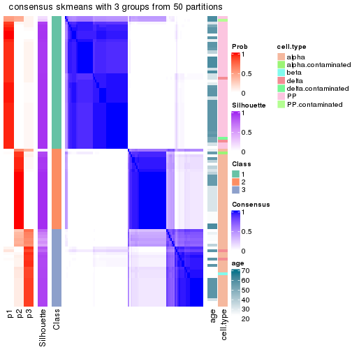</p>

</div>
<div id='tab-node-013-consensus-heatmap-3'>
<pre><code class="r">consensus_heatmap(res, k = 4)
</code></pre>

<p></p>

</div>
</div>

Heatmaps for the membership of samples in all partitions to see how consistent they are:


<script>
$( function() {
	$( '#tabs-node-013-membership-heatmap' ).tabs();
} );
</script>
<div id='tabs-node-013-membership-heatmap'>
<ul>
<li><a href='#tab-node-013-membership-heatmap-1'>k = 2</a></li>
<li><a href='#tab-node-013-membership-heatmap-2'>k = 3</a></li>
<li><a href='#tab-node-013-membership-heatmap-3'>k = 4</a></li>
</ul>
<div id='tab-node-013-membership-heatmap-1'>
<pre><code class="r">membership_heatmap(res, k = 2)
</code></pre>

<p></p>

</div>
<div id='tab-node-013-membership-heatmap-2'>
<pre><code class="r">membership_heatmap(res, k = 3)
</code></pre>

<p></p>

</div>
<div id='tab-node-013-membership-heatmap-3'>
<pre><code class="r">membership_heatmap(res, k = 4)
</code></pre>

<p></p>

</div>
</div>

As soon as the classes for columns are determined, the signatures
that are significantly different between subgroups can be looked for. 
Following are the heatmaps for signatures.


Signature heatmaps where rows are scaled:


<script>
$( function() {
	$( '#tabs-node-013-get-signatures' ).tabs();
} );
</script>
<div id='tabs-node-013-get-signatures'>
<ul>
<li><a href='#tab-node-013-get-signatures-1'>k = 2</a></li>
<li><a href='#tab-node-013-get-signatures-2'>k = 3</a></li>
<li><a href='#tab-node-013-get-signatures-3'>k = 4</a></li>
</ul>
<div id='tab-node-013-get-signatures-1'>
<pre><code class="r">get_signatures(res, k = 2)
</code></pre>

<p></p>

</div>
<div id='tab-node-013-get-signatures-2'>
<pre><code class="r">get_signatures(res, k = 3)
</code></pre>

<p></p>

</div>
<div id='tab-node-013-get-signatures-3'>
<pre><code class="r">get_signatures(res, k = 4)
</code></pre>

<p></p>

</div>
</div>


Signature heatmaps where rows are not scaled:


<script>
$( function() {
	$( '#tabs-node-013-get-signatures-no-scale' ).tabs();
} );
</script>
<div id='tabs-node-013-get-signatures-no-scale'>
<ul>
<li><a href='#tab-node-013-get-signatures-no-scale-1'>k = 2</a></li>
<li><a href='#tab-node-013-get-signatures-no-scale-2'>k = 3</a></li>
<li><a href='#tab-node-013-get-signatures-no-scale-3'>k = 4</a></li>
</ul>
<div id='tab-node-013-get-signatures-no-scale-1'>
<pre><code class="r">get_signatures(res, k = 2, scale_rows = FALSE)
</code></pre>

<p></p>

</div>
<div id='tab-node-013-get-signatures-no-scale-2'>
<pre><code class="r">get_signatures(res, k = 3, scale_rows = FALSE)
</code></pre>

<p></p>

</div>
<div id='tab-node-013-get-signatures-no-scale-3'>
<pre><code class="r">get_signatures(res, k = 4, scale_rows = FALSE)
</code></pre>

<p></p>

</div>
</div>


Compare the overlap of signatures from different k:

```r
compare_signatures(res)
```


`get_signature()` returns a data frame invisibly. To get the list of signatures, the function
call should be assigned to a variable explicitly. In following code, if `plot` argument is set
to `FALSE`, no heatmap is plotted while only the differential analysis is performed.

```r
# code only for demonstration
tb = get_signature(res, k = ..., plot = FALSE)
```

An example of the output of `tb` is:

```
#>   which_row         fdr    mean_1    mean_2 scaled_mean_1 scaled_mean_2 km
#> 1        38 0.042760348  8.373488  9.131774    -0.5533452     0.5164555  1
#> 2        40 0.018707592  7.106213  8.469186    -0.6173731     0.5762149  1
#> 3        55 0.019134737 10.221463 11.207825    -0.6159697     0.5749050  1
#> 4        59 0.006059896  5.921854  7.869574    -0.6899429     0.6439467  1
#> 5        60 0.018055526  8.928898 10.211722    -0.6204761     0.5791110  1
#> 6        98 0.009384629 15.714769 14.887706     0.6635654    -0.6193277  2
...
```

The columns in `tb` are:

1. `which_row`: row indices corresponding to the input matrix.
2. `fdr`: FDR for the differential test. 
3. `mean_x`: The mean value in group x.
4. `scaled_mean_x`: The mean value in group x after rows are scaled.
5. `km`: Row groups if k-means clustering is applied to rows (which is done by automatically selecting number of clusters).

If there are too many signatures, `top_signatures = ...` can be set to only show the 
signatures with the highest FDRs:

```r
# code only for demonstration
# e.g. to show the top 500 most significant rows
tb = get_signature(res, k = ..., top_signatures = 500)
```

If the signatures are defined as these which are uniquely high in current group, `diff_method` argument
can be set to `"uniquely_high_in_one_group"`:

```r
# code only for demonstration
tb = get_signature(res, k = ..., diff_method = "uniquely_high_in_one_group")
```


UMAP plot which shows how samples are separated.


<script>
$( function() {
	$( '#tabs-node-013-dimension-reduction' ).tabs();
} );
</script>
<div id='tabs-node-013-dimension-reduction'>
<ul>
<li><a href='#tab-node-013-dimension-reduction-1'>k = 2</a></li>
<li><a href='#tab-node-013-dimension-reduction-2'>k = 3</a></li>
<li><a href='#tab-node-013-dimension-reduction-3'>k = 4</a></li>
</ul>
<div id='tab-node-013-dimension-reduction-1'>
<pre><code class="r">dimension_reduction(res, k = 2, method = &quot;UMAP&quot;)
</code></pre>

<p></p>

</div>
<div id='tab-node-013-dimension-reduction-2'>
<pre><code class="r">dimension_reduction(res, k = 3, method = &quot;UMAP&quot;)
</code></pre>

<p></p>

</div>
<div id='tab-node-013-dimension-reduction-3'>
<pre><code class="r">dimension_reduction(res, k = 4, method = &quot;UMAP&quot;)
</code></pre>

<p></p>

</div>
</div>


Following heatmap shows how subgroups are split when increasing `k`:

```r
collect_classes(res)
```

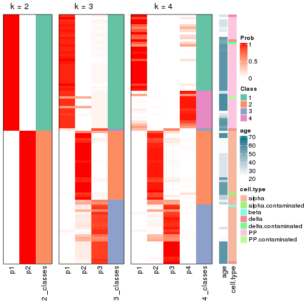


Test correlation between subgroups and known annotations. If the known
annotation is numeric, one-way ANOVA test is applied, and if the known
annotation is discrete, chi-squared contingency table test is applied.

```r
test_to_known_factors(res)
```

```
#>             n_sample age(p-value) cell.type(p-value) k
#> ATC:skmeans      101     1.02e-05           6.60e-19 2
#> ATC:skmeans       96     1.19e-03           1.47e-16 3
#> ATC:skmeans       90     5.42e-03           2.77e-13 4
```


If matrix rows can be associated to genes, consider to use `functional_enrichment(res,
...)` to perform function enrichment for the signature genes. See [this vignette](https://jokergoo.github.io/cola_vignettes/functional_enrichment.html) for more detailed explanations.


 

---------------------------------------------------


### Node02


Parent node: [Node0](#Node0).
Child nodes: 
                [Node011](#Node011)
        ,
                [Node012](#Node012)
        ,
                [Node013](#Node013)
        ,
                [Node021](#Node021)
        ,
                [Node022](#Node022)
        ,
                [Node023](#Node023)
        ,
                [Node031](#Node031)
        ,
                [Node032](#Node032)
        ,
                [Node033](#Node033)
        .


The object with results only for a single top-value method and a single partitioning method 
can be extracted as:

```r
res = res_rh["02"]
```

A summary of `res` and all the functions that can be applied to it:

```r
res
```

```
#> A 'DownSamplingConsensusPartition' object with k = 2, 3, 4.
#>   On a matrix with 15527 rows and 500 columns, randomly sampled from 582 columns.
#>   Top rows (1475) are extracted by 'ATC' method.
#>   Subgroups are detected by 'skmeans' method.
#>   Performed in total 150 partitions by row resampling.
#>   Best k for subgroups seems to be 3.
#> 
#> Following methods can be applied to this 'DownSamplingConsensusPartition' object:
#>  [1] "cola_report"             "collect_classes"         "collect_plots"          
#>  [4] "collect_stats"           "colnames"                "compare_partitions"     
#>  [7] "compare_signatures"      "consensus_heatmap"       "dimension_reduction"    
#> [10] "functional_enrichment"   "get_anno_col"            "get_anno"               
#> [13] "get_classes"             "get_consensus"           "get_matrix"             
#> [16] "get_membership"          "get_param"               "get_signatures"         
#> [19] "get_stats"               "is_best_k"               "is_stable_k"            
#> [22] "membership_heatmap"      "ncol"                    "nrow"                   
#> [25] "plot_ecdf"               "predict_classes"         "rownames"               
#> [28] "select_partition_number" "show"                    "suggest_best_k"         
#> [31] "test_to_known_factors"   "top_rows_heatmap"
```

`collect_plots()` function collects all the plots made from `res` for all `k` (number of subgroups)
into one single page to provide an easy and fast comparison between different `k`.

```r
collect_plots(res)
```


The plots are:

- The first row: a plot of the eCDF (empirical cumulative distribution
  function) curves of the consensus matrix for each `k` and the heatmap of
  predicted classes for each `k`.
- The second row: heatmaps of the consensus matrix for each `k`.
- The third row: heatmaps of the membership matrix for each `k`.
- The fouth row: heatmaps of the signatures for each `k`.

All the plots in panels can be made by individual functions and they are
plotted later in this section.

`select_partition_number()` produces several plots showing different
statistics for choosing "optimized" `k`. There are following statistics:

- eCDF curves of the consensus matrix for each `k`;
- 1-PAC. [The PAC score](https://en.wikipedia.org/wiki/Consensus_clustering#Over-interpretation_potential_of_consensus_clustering)
  measures the proportion of the ambiguous subgrouping.
- Mean silhouette score.
- Concordance. The mean probability of fiting the consensus subgroup labels in all
  partitions.
- Area increased. Denote $A_k$ as the area under the eCDF curve for current
  `k`, the area increased is defined as $A_k - A_{k-1}$.
- Rand index. The percent of pairs of samples that are both in a same cluster
  or both are not in a same cluster in the partition of k and k-1.
- Jaccard index. The ratio of pairs of samples are both in a same cluster in
  the partition of k and k-1 and the pairs of samples are both in a same
  cluster in the partition k or k-1.

The detailed explanations of these statistics can be found in [the _cola_
vignette](https://jokergoo.github.io/cola_vignettes/cola.html#toc_13).

Generally speaking, higher 1-PAC score, higher mean silhouette score or higher
concordance corresponds to better partition. Rand index and Jaccard index
measure how similar the current partition is compared to partition with `k-1`.
If they are too similar, we won't accept `k` is better than `k-1`.

```r
select_partition_number(res)
```


The numeric values for all these statistics can be obtained by `get_stats()`.

```r
get_stats(res)
```

```
#>   k 1-PAC mean_silhouette concordance area_increased  Rand Jaccard
#> 2 2 1.000           0.993       0.997          0.500 0.500   0.500
#> 3 3 1.000           0.985       0.994          0.224 0.874   0.751
#> 4 4 0.819           0.883       0.896          0.167 0.868   0.663
```

`suggest_best_k()` suggests the best $k$ based on these statistics. The rules are as follows:

- All $k$ with Jaccard index larger than 0.95 are removed because increasing
  $k$ does not provide enough extra information. If all $k$ are removed, it is
  marked as no subgroup is detected.
- For all $k$ with 1-PAC score larger than 0.9, the maximal $k$ is taken as
  the best $k$, and other $k$ are marked as optional $k$.
- If it does not fit the second rule. The $k$ with the maximal vote of the
  highest 1-PAC score, highest mean silhouette, and highest concordance is
  taken as the best $k$.

```r
suggest_best_k(res)
```

```
#> [1] 3
#> attr(,"optional")
#> [1] 2
```

There is also optional best $k$ = 2 that is worth to check.

Following is the table of the partitions (You need to click the **show/hide
code output** link to see it). The membership matrix (columns with name `p*`)
is inferred by
[`clue::cl_consensus()`](https://www.rdocumentation.org/link/cl_consensus?package=clue)
function with the `SE` method. Basically the value in the membership matrix
represents the probability to belong to a certain group. The finall subgroup
label for an item is determined with the group with highest probability it
belongs to.

In `get_classes()` function, the entropy is calculated from the membership
matrix and the silhouette score is calculated from the consensus matrix.


<script>
$( function() {
	$( '#tabs-node-02-get-classes' ).tabs();
} );
</script>
<div id='tabs-node-02-get-classes'>
<ul>
<li><a href='#tab-node-02-get-classes-1'>k = 2</a></li>
<li><a href='#tab-node-02-get-classes-2'>k = 3</a></li>
<li><a href='#tab-node-02-get-classes-3'>k = 4</a></li>
</ul>

<div id='tab-node-02-get-classes-1'>
<p><a id='tab-node-02-get-classes-1-a' style='color:#0366d6' href='#'>show/hide code output</a></p>
<pre><code class="r">get_classes(res, k = 2)
</code></pre>

<pre><code>#&gt;             class     p
#&gt; Sample_2        2 0.000
#&gt; Sample_3        2 0.000
#&gt; Sample_4        2 0.000
#&gt; Sample_5        2 0.000
#&gt; Sample_6        2 0.000
#&gt; Sample_7        2 0.000
#&gt; Sample_8        2 0.000
#&gt; Sample_9        2 0.000
#&gt; Sample_10       2 0.000
#&gt; Sample_11       2 0.000
#&gt; Sample_12       2 0.000
#&gt; Sample_13       2 0.000
#&gt; Sample_14       2 0.000
#&gt; Sample_15       2 0.000
#&gt; Sample_16       2 0.000
#&gt; Sample_17       2 0.000
#&gt; Sample_18       2 0.000
#&gt; Sample_19       2 0.000
#&gt; Sample_20       2 0.000
#&gt; Sample_21       2 0.000
#&gt; Sample_22       2 0.000
#&gt; Sample_23       2 0.000
#&gt; Sample_24       2 0.000
#&gt; Sample_25       2 0.000
#&gt; Sample_26       2 0.000
#&gt; Sample_27       2 0.000
#&gt; Sample_28       2 0.000
#&gt; Sample_29       2 0.000
#&gt; Sample_30       2 0.000
#&gt; Sample_31       2 0.000
#&gt; Sample_32       2 0.000
#&gt; Sample_33       2 0.000
#&gt; Sample_34       2 0.000
#&gt; Sample_35       2 0.000
#&gt; Sample_36       2 0.000
#&gt; Sample_37       2 0.000
#&gt; Sample_38       2 0.000
#&gt; Sample_39       2 0.000
#&gt; Sample_40       2 0.000
#&gt; Sample_41       2 0.000
#&gt; Sample_42       2 0.000
#&gt; Sample_43       2 0.000
#&gt; Sample_44       2 0.000
#&gt; Sample_45       2 0.000
#&gt; Sample_46       2 0.000
#&gt; Sample_47       2 0.000
#&gt; Sample_48       2 0.000
#&gt; Sample_49       2 0.000
#&gt; Sample_50       2 0.000
#&gt; Sample_51       2 0.000
#&gt; Sample_52       2 0.000
#&gt; Sample_53       2 0.000
#&gt; Sample_54       2 0.000
#&gt; Sample_55       2 0.000
#&gt; Sample_56       2 0.000
#&gt; Sample_57       2 0.000
#&gt; Sample_58       2 0.000
#&gt; Sample_59       2 0.000
#&gt; Sample_60       2 0.000
#&gt; Sample_61       2 0.000
#&gt; Sample_62       2 0.000
#&gt; Sample_63       2 0.000
#&gt; Sample_64       2 0.000
#&gt; Sample_65       2 0.000
#&gt; Sample_66       2 0.000
#&gt; Sample_67       2 0.000
#&gt; Sample_68       2 0.000
#&gt; Sample_69       2 0.000
#&gt; Sample_70       2 0.000
#&gt; Sample_71       2 0.000
#&gt; Sample_72       1 1.000
#&gt; Sample_73       2 0.000
#&gt; Sample_74       2 0.000
#&gt; Sample_75       2 0.000
#&gt; Sample_76       2 0.000
#&gt; Sample_77       2 0.000
#&gt; Sample_78       2 0.000
#&gt; Sample_79       2 0.000
#&gt; Sample_80       2 0.000
#&gt; Sample_81       2 0.000
#&gt; Sample_82       2 0.000
#&gt; Sample_83       2 0.000
#&gt; Sample_84       2 0.000
#&gt; Sample_85       2 0.000
#&gt; Sample_86       2 0.000
#&gt; Sample_87       2 0.000
#&gt; Sample_88       2 0.000
#&gt; Sample_89       2 0.000
#&gt; Sample_90       2 0.000
#&gt; Sample_91       2 0.000
#&gt; Sample_92       2 0.000
#&gt; Sample_93       2 0.000
#&gt; Sample_94       2 0.000
#&gt; Sample_95       2 0.000
#&gt; Sample_96       2 0.000
#&gt; Sample_97       2 0.000
#&gt; Sample_98       2 0.000
#&gt; Sample_99       2 0.000
#&gt; Sample_100      2 0.000
#&gt; Sample_101      2 0.000
#&gt; Sample_102      2 0.000
#&gt; Sample_103      2 0.000
#&gt; Sample_104      2 0.000
#&gt; Sample_105      2 0.000
#&gt; Sample_106      2 0.000
#&gt; Sample_107      2 0.000
#&gt; Sample_108      2 0.000
#&gt; Sample_109      2 0.000
#&gt; Sample_110      2 0.000
#&gt; Sample_111      1 0.751
#&gt; Sample_112      2 0.000
#&gt; Sample_113      2 0.000
#&gt; Sample_114      2 0.000
#&gt; Sample_115      2 0.000
#&gt; Sample_116      2 0.000
#&gt; Sample_117      2 0.000
#&gt; Sample_118      2 0.000
#&gt; Sample_119      2 0.000
#&gt; Sample_120      2 0.000
#&gt; Sample_122      2 0.000
#&gt; Sample_123      2 0.000
#&gt; Sample_124      2 0.000
#&gt; Sample_125      2 0.000
#&gt; Sample_126      2 0.000
#&gt; Sample_127      2 0.000
#&gt; Sample_128      2 0.000
#&gt; Sample_129      2 0.000
#&gt; Sample_130      2 0.000
#&gt; Sample_131      2 0.000
#&gt; Sample_132      2 0.000
#&gt; Sample_133      2 0.000
#&gt; Sample_134      2 0.000
#&gt; Sample_135      2 0.000
#&gt; Sample_136      2 0.000
#&gt; Sample_137      2 0.000
#&gt; Sample_138      2 0.000
#&gt; Sample_139      2 0.000
#&gt; Sample_140      2 0.000
#&gt; Sample_141      2 0.000
#&gt; Sample_142      2 0.000
#&gt; Sample_143      2 0.000
#&gt; Sample_144      2 0.000
#&gt; Sample_145      2 0.000
#&gt; Sample_146      2 0.000
#&gt; Sample_147      1 0.000
#&gt; Sample_148      1 0.000
#&gt; Sample_149      1 0.000
#&gt; Sample_150      1 0.000
#&gt; Sample_151      1 0.000
#&gt; Sample_152      1 0.000
#&gt; Sample_153      1 0.000
#&gt; Sample_154      1 0.000
#&gt; Sample_155      1 0.000
#&gt; Sample_156      1 0.000
#&gt; Sample_157      1 0.000
#&gt; Sample_158      1 0.000
#&gt; Sample_159      1 0.000
#&gt; Sample_160      1 0.000
#&gt; Sample_161      1 0.000
#&gt; Sample_162      1 0.000
#&gt; Sample_163      1 0.000
#&gt; Sample_164      1 0.000
#&gt; Sample_165      1 0.000
#&gt; Sample_166      1 0.000
#&gt; Sample_167      1 0.000
#&gt; Sample_168      1 0.000
#&gt; Sample_169      1 0.000
#&gt; Sample_170      1 0.000
#&gt; Sample_171      1 0.000
#&gt; Sample_172      1 0.000
#&gt; Sample_173      1 0.000
#&gt; Sample_174      1 0.000
#&gt; Sample_175      1 0.000
#&gt; Sample_176      1 0.000
#&gt; Sample_177      1 0.000
#&gt; Sample_178      1 0.000
#&gt; Sample_179      1 0.000
#&gt; Sample_180      1 0.000
#&gt; Sample_181      1 0.000
#&gt; Sample_182      1 0.000
#&gt; Sample_183      1 0.000
#&gt; Sample_184      1 0.000
#&gt; Sample_185      1 0.000
#&gt; Sample_186      1 0.000
#&gt; Sample_187      1 0.000
#&gt; Sample_188      1 0.000
#&gt; Sample_189      1 0.000
#&gt; Sample_190      1 0.000
#&gt; Sample_191      1 0.000
#&gt; Sample_192      1 0.000
#&gt; Sample_193      1 0.000
#&gt; Sample_194      1 0.000
#&gt; Sample_195      1 0.000
#&gt; Sample_196      1 0.000
#&gt; Sample_197      2 0.000
#&gt; Sample_198      2 0.000
#&gt; Sample_199      2 0.000
#&gt; Sample_200      2 0.000
#&gt; Sample_201      2 0.000
#&gt; Sample_202      2 0.000
#&gt; Sample_203      2 0.000
#&gt; Sample_204      2 0.000
#&gt; Sample_205      2 0.000
#&gt; Sample_206      2 0.000
#&gt; Sample_207      2 0.000
#&gt; Sample_516      1 0.000
#&gt; Sample_586      2 0.000
#&gt; Sample_587      2 0.000
#&gt; Sample_588      2 0.000
#&gt; Sample_591      2 0.000
#&gt; Sample_592      2 0.000
#&gt; Sample_593      2 0.000
#&gt; Sample_594      2 0.000
#&gt; Sample_595      1 1.000
#&gt; Sample_596      2 0.000
#&gt; Sample_597      2 0.000
#&gt; Sample_598      2 0.000
#&gt; Sample_599      2 0.000
#&gt; Sample_600      2 0.000
#&gt; Sample_601      2 0.000
#&gt; Sample_602      2 0.000
#&gt; Sample_603      2 0.000
#&gt; Sample_604      2 0.000
#&gt; Sample_605      2 0.000
#&gt; Sample_606      2 0.000
#&gt; Sample_607      2 0.000
#&gt; Sample_608      2 0.000
#&gt; Sample_609      2 0.000
#&gt; Sample_610      2 0.000
#&gt; Sample_611      1 0.000
#&gt; Sample_612      1 0.000
#&gt; Sample_621      2 0.000
#&gt; Sample_625      2 0.000
#&gt; Sample_627      2 0.000
#&gt; Sample_628      2 0.000
#&gt; Sample_629      2 0.000
#&gt; Sample_631      2 0.000
#&gt; Sample_638      2 0.000
#&gt; Sample_640      2 0.000
#&gt; Sample_642      2 0.000
#&gt; Sample_645      2 0.000
#&gt; Sample_648      2 0.000
#&gt; Sample_649      2 0.000
#&gt; Sample_650      2 0.000
#&gt; Sample_651      2 0.000
#&gt; Sample_652      2 0.000
#&gt; Sample_653      2 0.000
#&gt; Sample_654      2 0.000
#&gt; Sample_655      2 0.000
#&gt; Sample_656      2 0.000
#&gt; Sample_657      2 0.000
#&gt; Sample_658      2 0.000
#&gt; Sample_659      2 0.000
#&gt; Sample_660      2 0.000
#&gt; Sample_661      2 0.000
#&gt; Sample_662      2 0.000
#&gt; Sample_663      2 0.000
#&gt; Sample_664      2 0.000
#&gt; Sample_665      2 0.000
#&gt; Sample_666      2 0.000
#&gt; Sample_667      2 0.000
#&gt; Sample_668      2 0.000
#&gt; Sample_669      2 0.000
#&gt; Sample_670      2 0.000
#&gt; Sample_671      2 0.000
#&gt; Sample_672      2 0.000
#&gt; Sample_673      2 0.000
#&gt; Sample_674      2 0.000
#&gt; Sample_675      2 0.000
#&gt; Sample_676      2 0.000
#&gt; Sample_677      2 0.000
#&gt; Sample_678      2 0.000
#&gt; Sample_679      2 0.000
#&gt; Sample_680      2 0.000
#&gt; Sample_681      2 0.000
#&gt; Sample_682      2 0.000
#&gt; Sample_683      2 0.000
#&gt; Sample_684      2 0.000
#&gt; Sample_686      1 1.000
#&gt; Sample_688      1 1.000
#&gt; Sample_689      2 0.000
#&gt; Sample_690      2 0.751
#&gt; Sample_691      2 0.000
#&gt; Sample_693      2 0.000
#&gt; Sample_694      2 0.000
#&gt; Sample_695      1 0.000
#&gt; Sample_696      1 0.000
#&gt; Sample_697      1 0.000
#&gt; Sample_698      1 0.000
#&gt; Sample_699      1 0.000
#&gt; Sample_700      1 0.000
#&gt; Sample_701      1 0.000
#&gt; Sample_702      1 0.000
#&gt; Sample_703      1 0.000
#&gt; Sample_704      2 0.000
#&gt; Sample_705      2 0.000
#&gt; Sample_706      1 0.000
#&gt; Sample_707      1 0.000
#&gt; Sample_708      1 0.000
#&gt; Sample_709      1 0.000
#&gt; Sample_710      1 0.000
#&gt; Sample_711      1 0.000
#&gt; Sample_712      1 0.000
#&gt; Sample_713      1 0.000
#&gt; Sample_714      1 0.000
#&gt; Sample_715      1 0.000
#&gt; Sample_716      1 0.000
#&gt; Sample_717      1 0.000
#&gt; Sample_718      1 0.000
#&gt; Sample_719      1 0.000
#&gt; Sample_720      1 0.000
#&gt; Sample_721      1 0.000
#&gt; Sample_722      1 0.000
#&gt; Sample_723      1 0.000
#&gt; Sample_724      1 0.000
#&gt; Sample_725      1 0.000
#&gt; Sample_726      1 0.000
#&gt; Sample_727      1 0.000
#&gt; Sample_728      1 0.000
#&gt; Sample_729      1 0.000
#&gt; Sample_730      1 0.000
#&gt; Sample_731      1 0.000
#&gt; Sample_732      1 0.000
#&gt; Sample_733      1 0.000
#&gt; Sample_734      1 0.000
#&gt; Sample_735      1 0.000
#&gt; Sample_736      1 0.000
#&gt; Sample_738      1 0.000
#&gt; Sample_739      1 0.000
#&gt; Sample_740      1 0.000
#&gt; Sample_741      1 0.000
#&gt; Sample_742      1 0.000
#&gt; Sample_743      1 0.000
#&gt; Sample_744      1 0.000
#&gt; Sample_745      1 0.000
#&gt; Sample_746      1 0.000
#&gt; Sample_747      1 0.000
#&gt; Sample_748      1 0.000
#&gt; Sample_749      1 0.000
#&gt; Sample_750      1 0.000
#&gt; Sample_751      1 0.000
#&gt; Sample_752      1 0.000
#&gt; Sample_753      1 0.000
#&gt; Sample_754      1 0.000
#&gt; Sample_755      1 0.000
#&gt; Sample_756      1 0.000
#&gt; Sample_757      1 0.000
#&gt; Sample_758      1 0.000
#&gt; Sample_759      1 0.000
#&gt; Sample_760      1 0.000
#&gt; Sample_761      1 0.000
#&gt; Sample_762      1 0.000
#&gt; Sample_763      1 0.000
#&gt; Sample_764      1 0.000
#&gt; Sample_765      1 0.000
#&gt; Sample_766      1 0.000
#&gt; Sample_767      1 0.000
#&gt; Sample_768      1 0.000
#&gt; Sample_769      1 0.000
#&gt; Sample_770      1 0.000
#&gt; Sample_771      1 0.000
#&gt; Sample_772      1 0.000
#&gt; Sample_773      1 0.000
#&gt; Sample_774      1 0.000
#&gt; Sample_775      1 0.000
#&gt; Sample_776      1 0.000
#&gt; Sample_777      1 0.000
#&gt; Sample_778      1 0.000
#&gt; Sample_779      1 0.000
#&gt; Sample_780      1 0.000
#&gt; Sample_781      1 0.000
#&gt; Sample_782      1 0.000
#&gt; Sample_783      1 0.000
#&gt; Sample_784      1 0.000
#&gt; Sample_785      1 0.000
#&gt; Sample_786      1 0.000
#&gt; Sample_787      1 0.000
#&gt; Sample_788      1 0.000
#&gt; Sample_789      1 0.000
#&gt; Sample_790      1 0.000
#&gt; Sample_791      1 0.000
#&gt; Sample_792      1 0.000
#&gt; Sample_793      1 0.000
#&gt; Sample_794      1 0.000
#&gt; Sample_795      1 0.000
#&gt; Sample_796      1 0.000
#&gt; Sample_797      1 0.000
#&gt; Sample_798      1 0.000
#&gt; Sample_799      1 0.000
#&gt; Sample_800      1 0.000
#&gt; Sample_801      1 0.000
#&gt; Sample_802      1 0.000
#&gt; Sample_803      1 0.000
#&gt; Sample_804      1 0.000
#&gt; Sample_805      1 0.000
#&gt; Sample_806      1 0.000
#&gt; Sample_807      1 0.000
#&gt; Sample_808      1 0.000
#&gt; Sample_809      1 0.000
#&gt; Sample_810      1 0.000
#&gt; Sample_811      1 0.000
#&gt; Sample_812      1 0.000
#&gt; Sample_813      1 0.000
#&gt; Sample_814      1 0.000
#&gt; Sample_815      1 0.000
#&gt; Sample_816      1 0.000
#&gt; Sample_817      1 0.000
#&gt; Sample_818      1 0.000
#&gt; Sample_819      1 0.000
#&gt; Sample_820      1 0.000
#&gt; Sample_821      1 0.000
#&gt; Sample_822      1 0.000
#&gt; Sample_823      1 0.000
#&gt; Sample_824      1 0.000
#&gt; Sample_825      1 0.000
#&gt; Sample_826      1 0.000
#&gt; Sample_827      1 0.000
#&gt; Sample_828      1 0.000
#&gt; Sample_829      1 0.000
#&gt; Sample_830      1 0.000
#&gt; Sample_831      1 0.000
#&gt; Sample_832      1 0.000
#&gt; Sample_833      1 0.000
#&gt; Sample_834      1 0.000
#&gt; Sample_835      1 0.000
#&gt; Sample_836      1 0.000
#&gt; Sample_837      1 0.000
#&gt; Sample_838      1 0.000
#&gt; Sample_839      1 0.000
#&gt; Sample_840      1 0.000
#&gt; Sample_841      2 0.000
#&gt; Sample_842      2 0.000
#&gt; Sample_843      2 0.000
#&gt; Sample_844      2 0.000
#&gt; Sample_845      2 0.000
#&gt; Sample_846      2 0.000
#&gt; Sample_847      2 0.000
#&gt; Sample_848      2 0.000
#&gt; Sample_849      2 0.000
#&gt; Sample_850      2 0.000
#&gt; Sample_851      2 0.000
#&gt; Sample_852      2 0.000
#&gt; Sample_853      2 0.000
#&gt; Sample_854      2 0.000
#&gt; Sample_855      1 0.000
#&gt; Sample_856      1 0.000
#&gt; Sample_857      1 0.000
#&gt; Sample_858      1 0.000
#&gt; Sample_859      1 0.000
#&gt; Sample_860      1 0.000
#&gt; Sample_861      1 0.000
#&gt; Sample_862      1 0.000
#&gt; Sample_863      1 0.000
#&gt; Sample_864      1 0.000
#&gt; Sample_865      1 0.000
#&gt; Sample_866      1 0.000
#&gt; Sample_867      1 0.000
#&gt; Sample_868      1 0.000
#&gt; Sample_869      1 0.000
#&gt; Sample_870      1 0.000
#&gt; Sample_871      1 0.000
#&gt; Sample_872      1 0.000
#&gt; Sample_873      1 0.000
#&gt; Sample_874      1 0.000
#&gt; Sample_875      1 0.000
#&gt; Sample_876      1 0.000
#&gt; Sample_877      1 0.000
#&gt; Sample_878      1 0.000
#&gt; Sample_879      1 0.000
#&gt; Sample_880      1 0.000
#&gt; Sample_881      1 0.000
#&gt; Sample_882      1 0.000
#&gt; Sample_883      1 0.000
#&gt; Sample_884      1 0.000
#&gt; Sample_885      1 0.000
#&gt; Sample_886      1 0.000
#&gt; Sample_887      1 0.000
#&gt; Sample_888      1 0.000
#&gt; Sample_889      1 0.000
#&gt; Sample_890      1 0.000
#&gt; Sample_891      1 0.000
#&gt; Sample_892      1 0.000
#&gt; Sample_893      1 0.000
#&gt; Sample_894      1 0.000
#&gt; Sample_895      1 0.000
#&gt; Sample_896      1 0.000
#&gt; Sample_897      1 0.000
#&gt; Sample_898      1 0.000
#&gt; Sample_899      1 0.000
#&gt; Sample_900      1 0.000
#&gt; Sample_901      1 0.000
#&gt; Sample_902      1 0.000
#&gt; Sample_903      1 0.000
#&gt; Sample_904      1 0.000
#&gt; Sample_905      1 0.000
#&gt; Sample_906      1 0.000
#&gt; Sample_907      1 0.000
#&gt; Sample_908      1 0.000
#&gt; Sample_909      1 0.000
#&gt; Sample_910      1 0.000
#&gt; Sample_911      1 0.000
#&gt; Sample_912      1 0.000
#&gt; Sample_913      1 0.000
#&gt; Sample_914      1 0.000
#&gt; Sample_915      1 0.000
#&gt; Sample_916      1 0.000
#&gt; Sample_917      1 0.000
#&gt; Sample_918      1 0.000
#&gt; Sample_919      1 0.000
#&gt; Sample_920      1 0.000
#&gt; Sample_921      1 0.000
#&gt; Sample_922      1 0.000
#&gt; Sample_923      1 0.000
#&gt; Sample_924      1 0.000
#&gt; Sample_925      1 0.000
#&gt; Sample_926      1 0.000
#&gt; Sample_927      1 0.000
#&gt; Sample_928      1 0.000
#&gt; Sample_929      1 0.000
#&gt; Sample_930      1 0.000
#&gt; Sample_931      1 0.000
#&gt; Sample_932      1 0.000
#&gt; Sample_933      1 0.000
#&gt; Sample_934      1 0.000
#&gt; Sample_935      1 0.000
#&gt; Sample_936      1 0.000
#&gt; Sample_937      1 0.000
#&gt; Sample_938      1 0.000
#&gt; Sample_939      1 0.000
#&gt; Sample_940      1 0.000
#&gt; Sample_941      1 0.000
#&gt; Sample_942      1 0.000
#&gt; Sample_943      1 0.000
#&gt; Sample_944      1 0.000
#&gt; Sample_945      1 0.000
#&gt; Sample_946      1 0.000
#&gt; Sample_947      1 0.000
#&gt; Sample_1517     2 0.000
#&gt; Sample_1518     2 0.000
#&gt; Sample_1519     2 0.000
#&gt; Sample_1520     2 0.000
#&gt; Sample_1521     2 0.000
#&gt; Sample_1524     2 0.000
#&gt; Sample_1527     1 0.000
#&gt; Sample_1528     1 0.000
#&gt; Sample_1529     1 0.000
#&gt; Sample_1530     1 0.000
#&gt; Sample_1531     1 0.000
#&gt; Sample_1532     1 0.000
#&gt; Sample_1533     1 0.000
#&gt; Sample_1534     1 0.000
#&gt; Sample_1535     2 0.000
#&gt; Sample_1536     2 0.000
#&gt; Sample_1537     2 0.000
#&gt; Sample_1538     1 0.000
#&gt; Sample_1539     1 0.000
#&gt; Sample_1542     1 0.000
#&gt; Sample_1543     1 0.000
#&gt; Sample_1546     1 0.000
#&gt; Sample_1548     2 0.000
#&gt; Sample_1550     2 0.000
#&gt; Sample_1551     2 0.000
#&gt; Sample_1552     2 0.000
#&gt; Sample_1554     2 0.000
#&gt; Sample_1555     2 0.000
#&gt; Sample_1559     2 0.000
#&gt; Sample_1561     2 0.000
#&gt; Sample_1570     1 0.000
#&gt; Sample_1574     2 0.000
#&gt; Sample_1575     2 0.000
#&gt; Sample_1582     2 0.000
#&gt; Sample_1585     2 0.000
#&gt; Sample_1586     2 0.000
#&gt; Sample_1587     2 0.000
#&gt; Sample_1588     2 0.000
#&gt; Sample_1589     2 0.000
#&gt; Sample_1592     2 0.000
#&gt; Sample_1593     2 0.000
#&gt; Sample_1594     2 0.000
#&gt; Sample_1595     2 0.000
#&gt; Sample_1596     2 0.000
#&gt; Sample_1599     1 0.000
</code></pre>

<script>
$('#tab-node-02-get-classes-1-a').parent().next().next().hide();
$('#tab-node-02-get-classes-1-a').click(function(){
  $('#tab-node-02-get-classes-1-a').parent().next().next().toggle();
  return(false);
});
</script>
</div>

<div id='tab-node-02-get-classes-2'>
<p><a id='tab-node-02-get-classes-2-a' style='color:#0366d6' href='#'>show/hide code output</a></p>
<pre><code class="r">get_classes(res, k = 3)
</code></pre>

<pre><code>#&gt;             class     p
#&gt; Sample_2        2 0.000
#&gt; Sample_3        2 0.000
#&gt; Sample_4        2 0.000
#&gt; Sample_5        2 0.000
#&gt; Sample_6        2 0.000
#&gt; Sample_7        2 0.000
#&gt; Sample_8        2 0.000
#&gt; Sample_9        2 0.000
#&gt; Sample_10       2 0.000
#&gt; Sample_11       2 0.000
#&gt; Sample_12       2 0.000
#&gt; Sample_13       2 0.000
#&gt; Sample_14       2 0.000
#&gt; Sample_15       2 0.000
#&gt; Sample_16       2 0.000
#&gt; Sample_17       2 0.000
#&gt; Sample_18       2 0.000
#&gt; Sample_19       2 0.000
#&gt; Sample_20       2 0.000
#&gt; Sample_21       2 0.000
#&gt; Sample_22       2 0.000
#&gt; Sample_23       2 0.000
#&gt; Sample_24       2 0.000
#&gt; Sample_25       2 0.000
#&gt; Sample_26       2 0.000
#&gt; Sample_27       2 0.000
#&gt; Sample_28       2 0.000
#&gt; Sample_29       2 0.000
#&gt; Sample_30       2 0.000
#&gt; Sample_31       3 0.000
#&gt; Sample_32       2 0.000
#&gt; Sample_33       2 0.000
#&gt; Sample_34       2 0.000
#&gt; Sample_35       2 0.000
#&gt; Sample_36       2 0.000
#&gt; Sample_37       2 0.000
#&gt; Sample_38       2 0.000
#&gt; Sample_39       2 0.000
#&gt; Sample_40       2 0.000
#&gt; Sample_41       2 0.000
#&gt; Sample_42       2 0.000
#&gt; Sample_43       3 0.000
#&gt; Sample_44       2 0.000
#&gt; Sample_45       2 0.000
#&gt; Sample_46       2 0.000
#&gt; Sample_47       2 0.000
#&gt; Sample_48       2 0.000
#&gt; Sample_49       2 0.000
#&gt; Sample_50       2 0.000
#&gt; Sample_51       2 0.000
#&gt; Sample_52       2 0.000
#&gt; Sample_53       2 0.000
#&gt; Sample_54       2 0.000
#&gt; Sample_55       2 0.000
#&gt; Sample_56       2 0.000
#&gt; Sample_57       2 0.000
#&gt; Sample_58       2 0.000
#&gt; Sample_59       2 0.000
#&gt; Sample_60       2 0.000
#&gt; Sample_61       2 0.000
#&gt; Sample_62       2 0.000
#&gt; Sample_63       2 0.747
#&gt; Sample_64       2 0.000
#&gt; Sample_65       2 0.000
#&gt; Sample_66       2 0.000
#&gt; Sample_67       2 0.000
#&gt; Sample_68       2 0.000
#&gt; Sample_69       2 0.000
#&gt; Sample_70       2 0.253
#&gt; Sample_71       2 0.000
#&gt; Sample_72       1 1.000
#&gt; Sample_73       3 0.000
#&gt; Sample_74       2 0.000
#&gt; Sample_75       2 0.000
#&gt; Sample_76       2 0.000
#&gt; Sample_77       2 0.000
#&gt; Sample_78       2 0.000
#&gt; Sample_79       2 0.000
#&gt; Sample_80       2 0.000
#&gt; Sample_81       2 0.000
#&gt; Sample_82       2 0.000
#&gt; Sample_83       2 0.000
#&gt; Sample_84       2 0.000
#&gt; Sample_85       2 0.000
#&gt; Sample_86       2 0.000
#&gt; Sample_87       2 0.000
#&gt; Sample_88       2 0.000
#&gt; Sample_89       2 0.000
#&gt; Sample_90       2 0.000
#&gt; Sample_91       2 0.000
#&gt; Sample_92       2 0.000
#&gt; Sample_93       2 0.000
#&gt; Sample_94       3 0.000
#&gt; Sample_95       2 0.000
#&gt; Sample_96       2 0.000
#&gt; Sample_97       2 0.000
#&gt; Sample_98       2 0.000
#&gt; Sample_99       2 0.000
#&gt; Sample_100      2 0.000
#&gt; Sample_101      2 0.000
#&gt; Sample_102      2 0.000
#&gt; Sample_103      2 0.000
#&gt; Sample_104      2 0.000
#&gt; Sample_105      2 0.000
#&gt; Sample_106      2 0.000
#&gt; Sample_107      2 0.000
#&gt; Sample_108      2 0.000
#&gt; Sample_109      2 0.000
#&gt; Sample_110      2 0.000
#&gt; Sample_111      1 0.751
#&gt; Sample_112      2 0.000
#&gt; Sample_113      2 0.000
#&gt; Sample_114      3 0.000
#&gt; Sample_115      2 0.000
#&gt; Sample_116      2 0.000
#&gt; Sample_117      2 0.000
#&gt; Sample_118      3 0.000
#&gt; Sample_119      2 0.000
#&gt; Sample_120      2 0.000
#&gt; Sample_122      2 0.000
#&gt; Sample_123      3 0.000
#&gt; Sample_124      2 0.000
#&gt; Sample_125      2 0.000
#&gt; Sample_126      2 0.000
#&gt; Sample_127      2 0.000
#&gt; Sample_128      2 0.000
#&gt; Sample_129      2 0.000
#&gt; Sample_130      2 0.000
#&gt; Sample_131      2 0.000
#&gt; Sample_132      2 0.000
#&gt; Sample_133      2 0.000
#&gt; Sample_134      2 0.000
#&gt; Sample_135      2 0.000
#&gt; Sample_136      2 0.000
#&gt; Sample_137      2 0.000
#&gt; Sample_138      2 0.000
#&gt; Sample_139      2 0.000
#&gt; Sample_140      2 0.000
#&gt; Sample_141      2 0.000
#&gt; Sample_142      2 0.000
#&gt; Sample_143      2 0.000
#&gt; Sample_144      3 0.000
#&gt; Sample_145      2 0.000
#&gt; Sample_146      2 0.000
#&gt; Sample_147      1 0.000
#&gt; Sample_148      1 0.000
#&gt; Sample_149      1 0.000
#&gt; Sample_150      1 0.000
#&gt; Sample_151      1 0.000
#&gt; Sample_152      1 0.000
#&gt; Sample_153      1 0.000
#&gt; Sample_154      1 0.000
#&gt; Sample_155      1 0.000
#&gt; Sample_156      1 0.000
#&gt; Sample_157      1 0.000
#&gt; Sample_158      1 0.000
#&gt; Sample_159      1 0.000
#&gt; Sample_160      1 0.000
#&gt; Sample_161      1 0.000
#&gt; Sample_162      1 0.000
#&gt; Sample_163      1 0.000
#&gt; Sample_164      1 0.000
#&gt; Sample_165      1 0.000
#&gt; Sample_166      1 0.000
#&gt; Sample_167      1 0.000
#&gt; Sample_168      1 0.000
#&gt; Sample_169      1 0.000
#&gt; Sample_170      1 0.000
#&gt; Sample_171      3 0.000
#&gt; Sample_172      1 0.000
#&gt; Sample_173      3 0.000
#&gt; Sample_174      1 0.000
#&gt; Sample_175      1 0.000
#&gt; Sample_176      1 0.000
#&gt; Sample_177      1 0.000
#&gt; Sample_178      1 0.000
#&gt; Sample_179      1 0.000
#&gt; Sample_180      1 0.000
#&gt; Sample_181      1 0.000
#&gt; Sample_182      1 0.000
#&gt; Sample_183      1 0.000
#&gt; Sample_184      1 0.000
#&gt; Sample_185      1 0.000
#&gt; Sample_186      1 0.000
#&gt; Sample_187      1 0.000
#&gt; Sample_188      1 0.000
#&gt; Sample_189      1 0.000
#&gt; Sample_190      1 0.000
#&gt; Sample_191      1 0.000
#&gt; Sample_192      1 0.000
#&gt; Sample_193      1 0.000
#&gt; Sample_194      1 0.000
#&gt; Sample_195      1 0.000
#&gt; Sample_196      1 0.000
#&gt; Sample_197      2 0.000
#&gt; Sample_198      2 0.000
#&gt; Sample_199      2 0.000
#&gt; Sample_200      2 0.000
#&gt; Sample_201      2 0.000
#&gt; Sample_202      2 0.000
#&gt; Sample_203      2 0.000
#&gt; Sample_204      3 0.000
#&gt; Sample_205      2 0.000
#&gt; Sample_206      2 0.000
#&gt; Sample_207      2 0.000
#&gt; Sample_516      1 1.000
#&gt; Sample_586      2 0.000
#&gt; Sample_587      2 1.000
#&gt; Sample_588      3 1.000
#&gt; Sample_591      2 1.000
#&gt; Sample_592      3 0.751
#&gt; Sample_593      2 0.000
#&gt; Sample_594      3 0.249
#&gt; Sample_595      3 0.751
#&gt; Sample_596      2 0.000
#&gt; Sample_597      3 0.249
#&gt; Sample_598      2 0.249
#&gt; Sample_599      3 1.000
#&gt; Sample_600      3 0.498
#&gt; Sample_601      2 0.000
#&gt; Sample_602      3 1.000
#&gt; Sample_603      2 0.000
#&gt; Sample_604      2 0.000
#&gt; Sample_605      2 0.000
#&gt; Sample_606      2 0.000
#&gt; Sample_607      2 0.747
#&gt; Sample_608      2 0.000
#&gt; Sample_609      2 0.253
#&gt; Sample_610      2 0.751
#&gt; Sample_611      1 0.000
#&gt; Sample_612      1 0.000
#&gt; Sample_621      3 0.000
#&gt; Sample_625      3 0.000
#&gt; Sample_627      3 0.249
#&gt; Sample_628      3 0.000
#&gt; Sample_629      3 0.000
#&gt; Sample_631      3 0.000
#&gt; Sample_638      3 0.000
#&gt; Sample_640      3 0.000
#&gt; Sample_642      3 0.000
#&gt; Sample_645      3 0.000
#&gt; Sample_648      3 0.000
#&gt; Sample_649      3 0.000
#&gt; Sample_650      3 0.000
#&gt; Sample_651      2 0.000
#&gt; Sample_652      2 0.000
#&gt; Sample_653      2 0.000
#&gt; Sample_654      2 0.000
#&gt; Sample_655      2 0.000
#&gt; Sample_656      2 0.000
#&gt; Sample_657      2 0.000
#&gt; Sample_658      2 0.000
#&gt; Sample_659      2 0.000
#&gt; Sample_660      2 0.000
#&gt; Sample_661      2 0.000
#&gt; Sample_662      2 0.000
#&gt; Sample_663      2 0.000
#&gt; Sample_664      2 0.000
#&gt; Sample_665      3 0.000
#&gt; Sample_666      2 0.000
#&gt; Sample_667      3 0.000
#&gt; Sample_668      2 0.253
#&gt; Sample_669      2 0.000
#&gt; Sample_670      2 0.000
#&gt; Sample_671      2 0.000
#&gt; Sample_672      2 0.000
#&gt; Sample_673      2 0.000
#&gt; Sample_674      2 0.000
#&gt; Sample_675      2 0.000
#&gt; Sample_676      2 0.000
#&gt; Sample_677      2 0.000
#&gt; Sample_678      2 0.000
#&gt; Sample_679      2 0.000
#&gt; Sample_680      2 0.000
#&gt; Sample_681      3 0.000
#&gt; Sample_682      2 0.000
#&gt; Sample_683      2 0.000
#&gt; Sample_684      2 0.498
#&gt; Sample_686      1 0.751
#&gt; Sample_688      1 1.000
#&gt; Sample_689      2 0.000
#&gt; Sample_690      1 1.000
#&gt; Sample_691      2 0.000
#&gt; Sample_693      2 0.000
#&gt; Sample_694      2 0.249
#&gt; Sample_695      1 0.000
#&gt; Sample_696      1 0.000
#&gt; Sample_697      1 0.000
#&gt; Sample_698      1 0.000
#&gt; Sample_699      1 0.000
#&gt; Sample_700      1 0.000
#&gt; Sample_701      1 0.000
#&gt; Sample_702      1 0.000
#&gt; Sample_703      1 0.000
#&gt; Sample_704      2 0.000
#&gt; Sample_705      2 0.000
#&gt; Sample_706      1 0.000
#&gt; Sample_707      1 0.000
#&gt; Sample_708      1 0.000
#&gt; Sample_709      1 0.000
#&gt; Sample_710      3 0.000
#&gt; Sample_711      1 0.000
#&gt; Sample_712      1 0.000
#&gt; Sample_713      1 0.000
#&gt; Sample_714      1 0.000
#&gt; Sample_715      1 0.000
#&gt; Sample_716      1 0.000
#&gt; Sample_717      1 0.000
#&gt; Sample_718      1 0.000
#&gt; Sample_719      1 0.000
#&gt; Sample_720      3 0.000
#&gt; Sample_721      1 0.000
#&gt; Sample_722      1 0.000
#&gt; Sample_723      1 0.000
#&gt; Sample_724      1 0.000
#&gt; Sample_725      1 0.000
#&gt; Sample_726      1 0.000
#&gt; Sample_727      1 0.000
#&gt; Sample_728      1 0.000
#&gt; Sample_729      1 0.000
#&gt; Sample_730      1 0.000
#&gt; Sample_731      3 0.000
#&gt; Sample_732      1 0.000
#&gt; Sample_733      1 0.000
#&gt; Sample_734      1 0.000
#&gt; Sample_735      3 0.000
#&gt; Sample_736      1 0.000
#&gt; Sample_738      3 0.000
#&gt; Sample_739      1 0.000
#&gt; Sample_740      1 0.000
#&gt; Sample_741      1 0.000
#&gt; Sample_742      1 0.000
#&gt; Sample_743      1 0.000
#&gt; Sample_744      1 0.000
#&gt; Sample_745      1 0.000
#&gt; Sample_746      1 0.000
#&gt; Sample_747      1 0.000
#&gt; Sample_748      1 0.000
#&gt; Sample_749      1 0.000
#&gt; Sample_750      1 0.000
#&gt; Sample_751      1 0.000
#&gt; Sample_752      1 0.000
#&gt; Sample_753      1 0.000
#&gt; Sample_754      1 0.000
#&gt; Sample_755      1 0.000
#&gt; Sample_756      1 0.000
#&gt; Sample_757      1 0.000
#&gt; Sample_758      1 0.000
#&gt; Sample_759      1 0.000
#&gt; Sample_760      1 0.000
#&gt; Sample_761      1 0.000
#&gt; Sample_762      1 0.000
#&gt; Sample_763      1 0.000
#&gt; Sample_764      1 0.000
#&gt; Sample_765      1 0.000
#&gt; Sample_766      1 0.000
#&gt; Sample_767      1 0.000
#&gt; Sample_768      3 0.000
#&gt; Sample_769      1 0.000
#&gt; Sample_770      1 0.000
#&gt; Sample_771      1 0.000
#&gt; Sample_772      1 0.000
#&gt; Sample_773      1 0.000
#&gt; Sample_774      1 0.000
#&gt; Sample_775      1 0.000
#&gt; Sample_776      1 0.000
#&gt; Sample_777      1 0.000
#&gt; Sample_778      1 0.000
#&gt; Sample_779      1 0.000
#&gt; Sample_780      1 0.000
#&gt; Sample_781      1 0.000
#&gt; Sample_782      1 0.000
#&gt; Sample_783      1 0.000
#&gt; Sample_784      1 0.000
#&gt; Sample_785      1 0.000
#&gt; Sample_786      1 0.000
#&gt; Sample_787      1 0.000
#&gt; Sample_788      1 0.000
#&gt; Sample_789      1 0.000
#&gt; Sample_790      1 0.000
#&gt; Sample_791      1 0.000
#&gt; Sample_792      1 0.000
#&gt; Sample_793      1 0.000
#&gt; Sample_794      1 0.000
#&gt; Sample_795      1 0.000
#&gt; Sample_796      1 0.000
#&gt; Sample_797      1 0.000
#&gt; Sample_798      1 0.000
#&gt; Sample_799      1 0.000
#&gt; Sample_800      1 0.000
#&gt; Sample_801      1 0.000
#&gt; Sample_802      1 0.000
#&gt; Sample_803      1 0.000
#&gt; Sample_804      1 0.000
#&gt; Sample_805      1 0.000
#&gt; Sample_806      1 0.000
#&gt; Sample_807      1 0.000
#&gt; Sample_808      1 0.000
#&gt; Sample_809      1 0.000
#&gt; Sample_810      1 0.000
#&gt; Sample_811      1 0.000
#&gt; Sample_812      1 0.000
#&gt; Sample_813      1 0.000
#&gt; Sample_814      1 0.000
#&gt; Sample_815      1 0.000
#&gt; Sample_816      1 0.000
#&gt; Sample_817      1 0.000
#&gt; Sample_818      1 0.000
#&gt; Sample_819      1 0.000
#&gt; Sample_820      3 0.000
#&gt; Sample_821      1 0.000
#&gt; Sample_822      1 0.000
#&gt; Sample_823      1 0.000
#&gt; Sample_824      1 0.000
#&gt; Sample_825      1 0.000
#&gt; Sample_826      1 0.000
#&gt; Sample_827      1 0.000
#&gt; Sample_828      1 0.000
#&gt; Sample_829      1 0.000
#&gt; Sample_830      1 0.000
#&gt; Sample_831      1 0.000
#&gt; Sample_832      1 0.000
#&gt; Sample_833      1 0.000
#&gt; Sample_834      1 0.000
#&gt; Sample_835      1 0.000
#&gt; Sample_836      3 0.000
#&gt; Sample_837      1 0.000
#&gt; Sample_838      1 0.000
#&gt; Sample_839      1 0.000
#&gt; Sample_840      1 0.000
#&gt; Sample_841      2 0.000
#&gt; Sample_842      2 0.000
#&gt; Sample_843      2 0.000
#&gt; Sample_844      2 0.000
#&gt; Sample_845      2 0.000
#&gt; Sample_846      2 0.000
#&gt; Sample_847      2 0.000
#&gt; Sample_848      2 0.000
#&gt; Sample_849      2 0.000
#&gt; Sample_850      2 0.000
#&gt; Sample_851      2 0.000
#&gt; Sample_852      2 0.000
#&gt; Sample_853      2 0.000
#&gt; Sample_854      2 0.000
#&gt; Sample_855      1 0.000
#&gt; Sample_856      1 0.000
#&gt; Sample_857      1 0.000
#&gt; Sample_858      1 0.000
#&gt; Sample_859      3 1.000
#&gt; Sample_860      1 0.000
#&gt; Sample_861      1 0.000
#&gt; Sample_862      1 0.000
#&gt; Sample_863      1 0.000
#&gt; Sample_864      1 0.000
#&gt; Sample_865      3 0.000
#&gt; Sample_866      1 0.000
#&gt; Sample_867      1 0.000
#&gt; Sample_868      1 0.000
#&gt; Sample_869      1 0.000
#&gt; Sample_870      1 0.000
#&gt; Sample_871      1 0.000
#&gt; Sample_872      1 0.000
#&gt; Sample_873      1 0.000
#&gt; Sample_874      1 0.000
#&gt; Sample_875      1 0.000
#&gt; Sample_876      1 0.000
#&gt; Sample_877      1 0.000
#&gt; Sample_878      1 0.000
#&gt; Sample_879      1 0.000
#&gt; Sample_880      1 0.000
#&gt; Sample_881      1 0.000
#&gt; Sample_882      3 0.000
#&gt; Sample_883      1 0.000
#&gt; Sample_884      1 0.000
#&gt; Sample_885      1 0.000
#&gt; Sample_886      1 0.000
#&gt; Sample_887      1 0.000
#&gt; Sample_888      1 0.000
#&gt; Sample_889      1 0.000
#&gt; Sample_890      1 0.000
#&gt; Sample_891      1 0.000
#&gt; Sample_892      1 0.000
#&gt; Sample_893      1 0.000
#&gt; Sample_894      3 0.000
#&gt; Sample_895      1 0.000
#&gt; Sample_896      1 0.000
#&gt; Sample_897      1 0.000
#&gt; Sample_898      1 0.000
#&gt; Sample_899      1 0.000
#&gt; Sample_900      3 0.000
#&gt; Sample_901      1 0.000
#&gt; Sample_902      1 0.000
#&gt; Sample_903      1 0.000
#&gt; Sample_904      1 0.000
#&gt; Sample_905      1 0.000
#&gt; Sample_906      1 0.000
#&gt; Sample_907      1 0.000
#&gt; Sample_908      1 0.000
#&gt; Sample_909      1 0.000
#&gt; Sample_910      1 0.000
#&gt; Sample_911      1 0.000
#&gt; Sample_912      1 0.000
#&gt; Sample_913      1 0.000
#&gt; Sample_914      1 0.000
#&gt; Sample_915      1 0.000
#&gt; Sample_916      1 0.000
#&gt; Sample_917      1 0.000
#&gt; Sample_918      1 0.000
#&gt; Sample_919      1 0.000
#&gt; Sample_920      1 0.000
#&gt; Sample_921      1 0.000
#&gt; Sample_922      1 0.000
#&gt; Sample_923      1 0.000
#&gt; Sample_924      1 0.000
#&gt; Sample_925      1 0.000
#&gt; Sample_926      1 0.000
#&gt; Sample_927      1 0.000
#&gt; Sample_928      1 0.000
#&gt; Sample_929      1 0.000
#&gt; Sample_930      1 0.000
#&gt; Sample_931      1 0.000
#&gt; Sample_932      1 0.000
#&gt; Sample_933      1 0.000
#&gt; Sample_934      1 0.000
#&gt; Sample_935      1 0.000
#&gt; Sample_936      1 0.000
#&gt; Sample_937      1 0.000
#&gt; Sample_938      1 0.000
#&gt; Sample_939      1 0.000
#&gt; Sample_940      1 0.000
#&gt; Sample_941      1 0.000
#&gt; Sample_942      1 0.000
#&gt; Sample_943      1 0.000
#&gt; Sample_944      1 0.000
#&gt; Sample_945      1 0.000
#&gt; Sample_946      1 0.000
#&gt; Sample_947      1 0.000
#&gt; Sample_1517     2 0.498
#&gt; Sample_1518     2 0.000
#&gt; Sample_1519     2 0.000
#&gt; Sample_1520     3 0.000
#&gt; Sample_1521     3 0.000
#&gt; Sample_1524     3 0.000
#&gt; Sample_1527     1 0.000
#&gt; Sample_1528     1 0.000
#&gt; Sample_1529     1 0.751
#&gt; Sample_1530     3 0.000
#&gt; Sample_1531     3 0.000
#&gt; Sample_1532     3 0.000
#&gt; Sample_1533     1 0.751
#&gt; Sample_1534     1 0.000
#&gt; Sample_1535     2 0.000
#&gt; Sample_1536     2 0.000
#&gt; Sample_1537     2 0.000
#&gt; Sample_1538     1 0.000
#&gt; Sample_1539     1 0.000
#&gt; Sample_1542     1 0.000
#&gt; Sample_1543     3 0.000
#&gt; Sample_1546     1 0.747
#&gt; Sample_1548     3 0.000
#&gt; Sample_1550     3 0.000
#&gt; Sample_1551     3 0.000
#&gt; Sample_1552     3 0.000
#&gt; Sample_1554     2 0.249
#&gt; Sample_1555     3 0.498
#&gt; Sample_1559     3 0.000
#&gt; Sample_1561     3 0.253
#&gt; Sample_1570     1 1.000
#&gt; Sample_1574     3 0.000
#&gt; Sample_1575     3 0.000
#&gt; Sample_1582     3 0.000
#&gt; Sample_1585     3 0.000
#&gt; Sample_1586     3 0.000
#&gt; Sample_1587     3 0.000
#&gt; Sample_1588     2 0.502
#&gt; Sample_1589     3 0.000
#&gt; Sample_1592     3 0.000
#&gt; Sample_1593     3 0.000
#&gt; Sample_1594     3 0.000
#&gt; Sample_1595     3 0.000
#&gt; Sample_1596     3 0.000
#&gt; Sample_1599     3 0.000
</code></pre>

<script>
$('#tab-node-02-get-classes-2-a').parent().next().next().hide();
$('#tab-node-02-get-classes-2-a').click(function(){
  $('#tab-node-02-get-classes-2-a').parent().next().next().toggle();
  return(false);
});
</script>
</div>

<div id='tab-node-02-get-classes-3'>
<p><a id='tab-node-02-get-classes-3-a' style='color:#0366d6' href='#'>show/hide code output</a></p>
<pre><code class="r">get_classes(res, k = 4)
</code></pre>

<pre><code>#&gt;             class     p
#&gt; Sample_2        2 0.000
#&gt; Sample_3        2 0.000
#&gt; Sample_4        2 0.000
#&gt; Sample_5        2 0.000
#&gt; Sample_6        2 0.000
#&gt; Sample_7        2 0.000
#&gt; Sample_8        2 0.000
#&gt; Sample_9        2 0.000
#&gt; Sample_10       2 0.000
#&gt; Sample_11       2 0.000
#&gt; Sample_12       2 0.000
#&gt; Sample_13       2 0.000
#&gt; Sample_14       2 0.000
#&gt; Sample_15       2 0.000
#&gt; Sample_16       2 0.000
#&gt; Sample_17       2 0.000
#&gt; Sample_18       2 0.000
#&gt; Sample_19       2 0.000
#&gt; Sample_20       2 0.000
#&gt; Sample_21       2 0.000
#&gt; Sample_22       2 0.000
#&gt; Sample_23       2 0.000
#&gt; Sample_24       2 0.000
#&gt; Sample_25       2 0.000
#&gt; Sample_26       2 0.000
#&gt; Sample_27       2 0.000
#&gt; Sample_28       2 0.000
#&gt; Sample_29       2 0.000
#&gt; Sample_30       2 0.000
#&gt; Sample_31       3 0.000
#&gt; Sample_32       2 0.000
#&gt; Sample_33       2 0.000
#&gt; Sample_34       2 0.000
#&gt; Sample_35       2 0.000
#&gt; Sample_36       2 0.000
#&gt; Sample_37       2 0.000
#&gt; Sample_38       2 0.000
#&gt; Sample_39       2 0.000
#&gt; Sample_40       2 0.000
#&gt; Sample_41       2 0.000
#&gt; Sample_42       2 0.000
#&gt; Sample_43       3 0.000
#&gt; Sample_44       2 0.000
#&gt; Sample_45       2 0.000
#&gt; Sample_46       2 0.000
#&gt; Sample_47       2 0.000
#&gt; Sample_48       2 0.000
#&gt; Sample_49       2 0.000
#&gt; Sample_50       2 0.000
#&gt; Sample_51       2 0.000
#&gt; Sample_52       2 0.000
#&gt; Sample_53       2 0.000
#&gt; Sample_54       2 0.000
#&gt; Sample_55       2 0.000
#&gt; Sample_56       2 0.000
#&gt; Sample_57       2 0.000
#&gt; Sample_58       2 0.000
#&gt; Sample_59       2 0.000
#&gt; Sample_60       2 0.000
#&gt; Sample_61       2 0.000
#&gt; Sample_62       2 0.000
#&gt; Sample_63       2 0.000
#&gt; Sample_64       2 0.000
#&gt; Sample_65       2 0.000
#&gt; Sample_66       2 0.000
#&gt; Sample_67       2 0.000
#&gt; Sample_68       2 0.000
#&gt; Sample_69       2 0.000
#&gt; Sample_70       2 0.747
#&gt; Sample_71       2 0.000
#&gt; Sample_72       2 1.000
#&gt; Sample_73       3 0.000
#&gt; Sample_74       2 0.000
#&gt; Sample_75       2 0.000
#&gt; Sample_76       2 0.000
#&gt; Sample_77       2 0.000
#&gt; Sample_78       2 0.000
#&gt; Sample_79       2 0.000
#&gt; Sample_80       2 0.000
#&gt; Sample_81       2 0.000
#&gt; Sample_82       2 0.000
#&gt; Sample_83       2 0.000
#&gt; Sample_84       2 0.000
#&gt; Sample_85       2 0.000
#&gt; Sample_86       2 0.000
#&gt; Sample_87       2 0.000
#&gt; Sample_88       2 0.000
#&gt; Sample_89       2 0.000
#&gt; Sample_90       2 0.000
#&gt; Sample_91       2 0.000
#&gt; Sample_92       2 0.000
#&gt; Sample_93       2 0.000
#&gt; Sample_94       3 0.000
#&gt; Sample_95       2 0.000
#&gt; Sample_96       2 0.000
#&gt; Sample_97       2 0.000
#&gt; Sample_98       2 0.000
#&gt; Sample_99       2 0.000
#&gt; Sample_100      2 0.000
#&gt; Sample_101      2 0.000
#&gt; Sample_102      2 0.000
#&gt; Sample_103      2 0.000
#&gt; Sample_104      2 0.000
#&gt; Sample_105      2 0.000
#&gt; Sample_106      2 0.000
#&gt; Sample_107      2 0.000
#&gt; Sample_108      2 0.000
#&gt; Sample_109      2 0.000
#&gt; Sample_110      2 0.000
#&gt; Sample_111      1 0.000
#&gt; Sample_112      2 0.000
#&gt; Sample_113      2 0.000
#&gt; Sample_114      3 0.000
#&gt; Sample_115      2 0.000
#&gt; Sample_116      2 0.000
#&gt; Sample_117      2 0.000
#&gt; Sample_118      3 0.000
#&gt; Sample_119      2 0.000
#&gt; Sample_120      2 0.000
#&gt; Sample_122      2 0.000
#&gt; Sample_123      3 0.000
#&gt; Sample_124      2 0.000
#&gt; Sample_125      2 0.000
#&gt; Sample_126      2 0.000
#&gt; Sample_127      2 0.000
#&gt; Sample_128      2 0.000
#&gt; Sample_129      2 0.000
#&gt; Sample_130      2 0.000
#&gt; Sample_131      2 0.000
#&gt; Sample_132      2 0.000
#&gt; Sample_133      2 0.000
#&gt; Sample_134      2 0.000
#&gt; Sample_135      2 0.000
#&gt; Sample_136      2 0.000
#&gt; Sample_137      2 0.000
#&gt; Sample_138      2 0.000
#&gt; Sample_139      2 0.000
#&gt; Sample_140      2 0.000
#&gt; Sample_141      2 0.000
#&gt; Sample_142      2 0.000
#&gt; Sample_143      2 0.000
#&gt; Sample_144      3 0.000
#&gt; Sample_145      2 0.000
#&gt; Sample_146      2 0.000
#&gt; Sample_147      1 1.000
#&gt; Sample_148      4 0.000
#&gt; Sample_149      1 1.000
#&gt; Sample_150      1 0.000
#&gt; Sample_151      1 1.000
#&gt; Sample_152      4 0.502
#&gt; Sample_153      1 1.000
#&gt; Sample_154      4 1.000
#&gt; Sample_155      4 1.000
#&gt; Sample_156      4 1.000
#&gt; Sample_157      4 1.000
#&gt; Sample_158      1 1.000
#&gt; Sample_159      1 1.000
#&gt; Sample_160      4 0.751
#&gt; Sample_161      1 1.000
#&gt; Sample_162      1 0.751
#&gt; Sample_163      1 0.751
#&gt; Sample_164      1 1.000
#&gt; Sample_165      1 0.751
#&gt; Sample_166      4 1.000
#&gt; Sample_167      4 0.751
#&gt; Sample_168      4 0.751
#&gt; Sample_169      1 1.000
#&gt; Sample_170      4 0.502
#&gt; Sample_171      3 0.000
#&gt; Sample_172      1 1.000
#&gt; Sample_173      3 0.000
#&gt; Sample_174      1 0.502
#&gt; Sample_175      4 1.000
#&gt; Sample_176      4 0.000
#&gt; Sample_177      1 1.000
#&gt; Sample_178      1 0.751
#&gt; Sample_179      1 1.000
#&gt; Sample_180      1 0.751
#&gt; Sample_181      1 1.000
#&gt; Sample_182      4 0.751
#&gt; Sample_183      4 1.000
#&gt; Sample_184      4 1.000
#&gt; Sample_185      4 0.498
#&gt; Sample_186      4 0.751
#&gt; Sample_187      4 0.000
#&gt; Sample_188      1 1.000
#&gt; Sample_189      1 0.253
#&gt; Sample_190      4 0.000
#&gt; Sample_191      1 1.000
#&gt; Sample_192      4 1.000
#&gt; Sample_193      4 0.000
#&gt; Sample_194      1 1.000
#&gt; Sample_195      1 1.000
#&gt; Sample_196      4 0.498
#&gt; Sample_197      2 0.000
#&gt; Sample_198      2 0.000
#&gt; Sample_199      2 0.000
#&gt; Sample_200      2 0.000
#&gt; Sample_201      2 0.000
#&gt; Sample_202      2 0.000
#&gt; Sample_203      2 0.000
#&gt; Sample_204      3 0.000
#&gt; Sample_205      2 0.000
#&gt; Sample_206      2 0.000
#&gt; Sample_207      2 0.000
#&gt; Sample_516      4 0.747
#&gt; Sample_586      2 0.000
#&gt; Sample_587      2 0.747
#&gt; Sample_588      3 1.000
#&gt; Sample_591      2 1.000
#&gt; Sample_592      3 0.751
#&gt; Sample_593      2 0.000
#&gt; Sample_594      3 0.253
#&gt; Sample_595      3 0.000
#&gt; Sample_596      2 0.000
#&gt; Sample_597      3 0.249
#&gt; Sample_598      2 0.000
#&gt; Sample_599      2 0.751
#&gt; Sample_600      3 0.502
#&gt; Sample_601      2 0.000
#&gt; Sample_602      3 1.000
#&gt; Sample_603      2 0.000
#&gt; Sample_604      2 0.000
#&gt; Sample_605      2 0.498
#&gt; Sample_606      2 0.000
#&gt; Sample_607      2 0.751
#&gt; Sample_608      2 0.000
#&gt; Sample_609      2 0.000
#&gt; Sample_610      2 0.751
#&gt; Sample_611      1 0.751
#&gt; Sample_612      1 0.000
#&gt; Sample_621      3 0.249
#&gt; Sample_625      3 0.000
#&gt; Sample_627      3 0.253
#&gt; Sample_628      3 0.000
#&gt; Sample_629      3 0.000
#&gt; Sample_631      3 0.000
#&gt; Sample_638      3 0.000
#&gt; Sample_640      3 0.000
#&gt; Sample_642      3 0.000
#&gt; Sample_645      3 0.000
#&gt; Sample_648      3 0.000
#&gt; Sample_649      3 0.000
#&gt; Sample_650      3 0.000
#&gt; Sample_651      2 0.249
#&gt; Sample_652      2 0.000
#&gt; Sample_653      2 0.000
#&gt; Sample_654      2 0.000
#&gt; Sample_655      2 0.000
#&gt; Sample_656      2 0.000
#&gt; Sample_657      2 0.000
#&gt; Sample_658      2 0.000
#&gt; Sample_659      2 0.000
#&gt; Sample_660      2 0.000
#&gt; Sample_661      2 0.000
#&gt; Sample_662      2 0.000
#&gt; Sample_663      2 0.000
#&gt; Sample_664      2 0.000
#&gt; Sample_665      3 0.000
#&gt; Sample_666      2 0.000
#&gt; Sample_667      3 0.000
#&gt; Sample_668      2 0.502
#&gt; Sample_669      2 0.000
#&gt; Sample_670      2 0.000
#&gt; Sample_671      2 0.000
#&gt; Sample_672      2 0.000
#&gt; Sample_673      2 0.000
#&gt; Sample_674      2 0.000
#&gt; Sample_675      2 0.000
#&gt; Sample_676      2 0.000
#&gt; Sample_677      2 0.000
#&gt; Sample_678      2 0.000
#&gt; Sample_679      2 0.000
#&gt; Sample_680      2 0.000
#&gt; Sample_681      3 0.000
#&gt; Sample_682      2 0.000
#&gt; Sample_683      2 0.000
#&gt; Sample_684      2 0.000
#&gt; Sample_686      1 0.000
#&gt; Sample_688      1 0.000
#&gt; Sample_689      2 0.000
#&gt; Sample_690      1 0.000
#&gt; Sample_691      2 0.000
#&gt; Sample_693      2 0.000
#&gt; Sample_694      2 0.000
#&gt; Sample_695      1 1.000
#&gt; Sample_696      4 1.000
#&gt; Sample_697      4 0.253
#&gt; Sample_698      4 1.000
#&gt; Sample_699      4 1.000
#&gt; Sample_700      4 0.000
#&gt; Sample_701      1 1.000
#&gt; Sample_702      4 0.498
#&gt; Sample_703      1 0.751
#&gt; Sample_704      2 0.000
#&gt; Sample_705      2 0.000
#&gt; Sample_706      4 0.000
#&gt; Sample_707      4 0.000
#&gt; Sample_708      4 0.751
#&gt; Sample_709      4 0.249
#&gt; Sample_710      3 0.000
#&gt; Sample_711      4 1.000
#&gt; Sample_712      4 1.000
#&gt; Sample_713      4 0.751
#&gt; Sample_714      1 0.751
#&gt; Sample_715      4 1.000
#&gt; Sample_716      1 0.747
#&gt; Sample_717      4 0.000
#&gt; Sample_718      4 1.000
#&gt; Sample_719      4 0.751
#&gt; Sample_720      3 0.000
#&gt; Sample_721      4 1.000
#&gt; Sample_722      4 0.000
#&gt; Sample_723      4 0.751
#&gt; Sample_724      4 0.498
#&gt; Sample_725      4 1.000
#&gt; Sample_726      4 0.000
#&gt; Sample_727      4 0.000
#&gt; Sample_728      4 0.751
#&gt; Sample_729      4 0.000
#&gt; Sample_730      4 0.253
#&gt; Sample_731      3 0.000
#&gt; Sample_732      4 0.249
#&gt; Sample_733      4 0.000
#&gt; Sample_734      4 0.751
#&gt; Sample_735      3 0.000
#&gt; Sample_736      4 0.751
#&gt; Sample_738      3 0.000
#&gt; Sample_739      4 0.000
#&gt; Sample_740      4 1.000
#&gt; Sample_741      4 0.000
#&gt; Sample_742      4 0.751
#&gt; Sample_743      4 0.000
#&gt; Sample_744      4 0.000
#&gt; Sample_745      1 1.000
#&gt; Sample_746      4 0.751
#&gt; Sample_747      4 0.253
#&gt; Sample_748      1 1.000
#&gt; Sample_749      4 0.751
#&gt; Sample_750      4 0.502
#&gt; Sample_751      4 0.000
#&gt; Sample_752      1 1.000
#&gt; Sample_753      1 1.000
#&gt; Sample_754      4 0.751
#&gt; Sample_755      4 0.502
#&gt; Sample_756      4 0.000
#&gt; Sample_757      4 0.747
#&gt; Sample_758      4 0.000
#&gt; Sample_759      1 1.000
#&gt; Sample_760      4 0.000
#&gt; Sample_761      4 0.747
#&gt; Sample_762      4 0.498
#&gt; Sample_763      4 0.000
#&gt; Sample_764      4 0.000
#&gt; Sample_765      4 1.000
#&gt; Sample_766      4 1.000
#&gt; Sample_767      4 0.249
#&gt; Sample_768      3 0.000
#&gt; Sample_769      4 1.000
#&gt; Sample_770      4 0.000
#&gt; Sample_771      4 0.747
#&gt; Sample_772      1 0.253
#&gt; Sample_773      4 0.498
#&gt; Sample_774      4 0.000
#&gt; Sample_775      1 1.000
#&gt; Sample_776      4 0.249
#&gt; Sample_777      1 0.249
#&gt; Sample_778      4 1.000
#&gt; Sample_779      1 0.751
#&gt; Sample_780      1 1.000
#&gt; Sample_781      4 0.751
#&gt; Sample_782      4 1.000
#&gt; Sample_783      1 0.502
#&gt; Sample_784      1 0.000
#&gt; Sample_785      1 1.000
#&gt; Sample_786      1 1.000
#&gt; Sample_787      4 1.000
#&gt; Sample_788      1 1.000
#&gt; Sample_789      1 1.000
#&gt; Sample_790      4 0.498
#&gt; Sample_791      4 0.747
#&gt; Sample_792      4 0.751
#&gt; Sample_793      1 1.000
#&gt; Sample_794      4 0.751
#&gt; Sample_795      4 0.000
#&gt; Sample_796      4 1.000
#&gt; Sample_797      1 1.000
#&gt; Sample_798      1 0.249
#&gt; Sample_799      1 0.502
#&gt; Sample_800      4 0.751
#&gt; Sample_801      4 0.498
#&gt; Sample_802      4 1.000
#&gt; Sample_803      4 0.000
#&gt; Sample_804      1 1.000
#&gt; Sample_805      4 0.498
#&gt; Sample_806      4 0.751
#&gt; Sample_807      4 1.000
#&gt; Sample_808      4 1.000
#&gt; Sample_809      4 0.751
#&gt; Sample_810      1 1.000
#&gt; Sample_811      4 1.000
#&gt; Sample_812      4 0.751
#&gt; Sample_813      1 1.000
#&gt; Sample_814      4 1.000
#&gt; Sample_815      4 0.000
#&gt; Sample_816      4 0.000
#&gt; Sample_817      1 1.000
#&gt; Sample_818      4 1.000
#&gt; Sample_819      1 1.000
#&gt; Sample_820      3 0.000
#&gt; Sample_821      1 1.000
#&gt; Sample_822      4 0.253
#&gt; Sample_823      1 1.000
#&gt; Sample_824      1 0.751
#&gt; Sample_825      1 0.751
#&gt; Sample_826      1 1.000
#&gt; Sample_827      1 1.000
#&gt; Sample_828      4 0.000
#&gt; Sample_829      4 1.000
#&gt; Sample_830      4 1.000
#&gt; Sample_831      4 1.000
#&gt; Sample_832      1 0.751
#&gt; Sample_833      4 1.000
#&gt; Sample_834      1 1.000
#&gt; Sample_835      1 0.502
#&gt; Sample_836      3 0.000
#&gt; Sample_837      4 0.751
#&gt; Sample_838      1 1.000
#&gt; Sample_839      1 1.000
#&gt; Sample_840      4 1.000
#&gt; Sample_841      2 0.000
#&gt; Sample_842      2 0.000
#&gt; Sample_843      2 0.000
#&gt; Sample_844      2 0.000
#&gt; Sample_845      2 0.000
#&gt; Sample_846      2 0.000
#&gt; Sample_847      2 0.253
#&gt; Sample_848      2 0.000
#&gt; Sample_849      2 0.000
#&gt; Sample_850      2 0.000
#&gt; Sample_851      2 0.000
#&gt; Sample_852      2 0.000
#&gt; Sample_853      2 0.000
#&gt; Sample_854      2 0.000
#&gt; Sample_855      1 1.000
#&gt; Sample_856      1 0.498
#&gt; Sample_857      1 0.000
#&gt; Sample_858      4 1.000
#&gt; Sample_859      3 0.751
#&gt; Sample_860      1 0.751
#&gt; Sample_861      1 0.751
#&gt; Sample_862      1 1.000
#&gt; Sample_863      1 0.747
#&gt; Sample_864      1 1.000
#&gt; Sample_865      3 0.000
#&gt; Sample_866      4 0.751
#&gt; Sample_867      1 1.000
#&gt; Sample_868      1 1.000
#&gt; Sample_869      1 1.000
#&gt; Sample_870      1 0.747
#&gt; Sample_871      1 1.000
#&gt; Sample_872      1 0.751
#&gt; Sample_873      1 0.751
#&gt; Sample_874      4 0.498
#&gt; Sample_875      4 1.000
#&gt; Sample_876      1 1.000
#&gt; Sample_877      4 1.000
#&gt; Sample_878      4 0.751
#&gt; Sample_879      4 0.751
#&gt; Sample_880      4 0.000
#&gt; Sample_881      1 1.000
#&gt; Sample_882      3 0.000
#&gt; Sample_883      4 1.000
#&gt; Sample_884      4 0.751
#&gt; Sample_885      1 0.502
#&gt; Sample_886      4 1.000
#&gt; Sample_887      4 0.249
#&gt; Sample_888      4 0.751
#&gt; Sample_889      1 1.000
#&gt; Sample_890      4 1.000
#&gt; Sample_891      1 1.000
#&gt; Sample_892      4 1.000
#&gt; Sample_893      1 1.000
#&gt; Sample_894      3 0.000
#&gt; Sample_895      1 1.000
#&gt; Sample_896      4 0.253
#&gt; Sample_897      1 0.502
#&gt; Sample_898      1 0.000
#&gt; Sample_899      1 0.751
#&gt; Sample_900      3 0.000
#&gt; Sample_901      4 1.000
#&gt; Sample_902      1 1.000
#&gt; Sample_903      1 0.751
#&gt; Sample_904      4 0.249
#&gt; Sample_905      4 0.502
#&gt; Sample_906      1 1.000
#&gt; Sample_907      1 1.000
#&gt; Sample_908      1 1.000
#&gt; Sample_909      1 0.502
#&gt; Sample_910      4 0.253
#&gt; Sample_911      1 0.498
#&gt; Sample_912      1 1.000
#&gt; Sample_913      1 0.000
#&gt; Sample_914      1 0.000
#&gt; Sample_915      1 1.000
#&gt; Sample_916      4 1.000
#&gt; Sample_917      1 0.249
#&gt; Sample_918      1 0.000
#&gt; Sample_919      1 0.498
#&gt; Sample_920      1 0.000
#&gt; Sample_921      1 1.000
#&gt; Sample_922      1 0.000
#&gt; Sample_923      4 1.000
#&gt; Sample_924      1 0.000
#&gt; Sample_925      1 1.000
#&gt; Sample_926      4 1.000
#&gt; Sample_927      4 1.000
#&gt; Sample_928      4 0.249
#&gt; Sample_929      1 0.000
#&gt; Sample_930      4 1.000
#&gt; Sample_931      4 1.000
#&gt; Sample_932      1 0.000
#&gt; Sample_933      1 0.249
#&gt; Sample_934      1 0.751
#&gt; Sample_935      1 0.747
#&gt; Sample_936      1 0.751
#&gt; Sample_937      1 0.502
#&gt; Sample_938      1 0.000
#&gt; Sample_939      1 1.000
#&gt; Sample_940      1 1.000
#&gt; Sample_941      1 0.000
#&gt; Sample_942      1 0.000
#&gt; Sample_943      1 0.253
#&gt; Sample_944      1 1.000
#&gt; Sample_945      1 1.000
#&gt; Sample_946      4 0.751
#&gt; Sample_947      4 1.000
#&gt; Sample_1517     2 0.747
#&gt; Sample_1518     2 0.000
#&gt; Sample_1519     2 1.000
#&gt; Sample_1520     3 0.000
#&gt; Sample_1521     3 0.000
#&gt; Sample_1524     3 0.000
#&gt; Sample_1527     1 0.000
#&gt; Sample_1528     1 0.498
#&gt; Sample_1529     1 1.000
#&gt; Sample_1530     3 0.000
#&gt; Sample_1531     3 0.000
#&gt; Sample_1532     3 0.000
#&gt; Sample_1533     4 1.000
#&gt; Sample_1534     1 0.498
#&gt; Sample_1535     2 0.000
#&gt; Sample_1536     2 0.249
#&gt; Sample_1537     2 0.000
#&gt; Sample_1538     1 0.751
#&gt; Sample_1539     1 0.000
#&gt; Sample_1542     1 0.249
#&gt; Sample_1543     3 0.000
#&gt; Sample_1546     1 0.751
#&gt; Sample_1548     3 0.000
#&gt; Sample_1550     3 0.000
#&gt; Sample_1551     3 0.000
#&gt; Sample_1552     3 0.000
#&gt; Sample_1554     2 0.751
#&gt; Sample_1555     3 0.000
#&gt; Sample_1559     3 0.000
#&gt; Sample_1561     3 0.000
#&gt; Sample_1570     4 1.000
#&gt; Sample_1574     3 0.000
#&gt; Sample_1575     3 0.000
#&gt; Sample_1582     3 0.000
#&gt; Sample_1585     3 0.253
#&gt; Sample_1586     3 0.000
#&gt; Sample_1587     3 0.000
#&gt; Sample_1588     2 0.000
#&gt; Sample_1589     3 0.000
#&gt; Sample_1592     3 0.000
#&gt; Sample_1593     3 0.000
#&gt; Sample_1594     3 0.000
#&gt; Sample_1595     3 0.000
#&gt; Sample_1596     3 0.000
#&gt; Sample_1599     3 0.000
</code></pre>

<script>
$('#tab-node-02-get-classes-3-a').parent().next().next().hide();
$('#tab-node-02-get-classes-3-a').click(function(){
  $('#tab-node-02-get-classes-3-a').parent().next().next().toggle();
  return(false);
});
</script>
</div>
</div>

Heatmaps for the consensus matrix. It visualizes the probability of two
samples to be in a same group.


<script>
$( function() {
	$( '#tabs-node-02-consensus-heatmap' ).tabs();
} );
</script>
<div id='tabs-node-02-consensus-heatmap'>
<ul>
<li><a href='#tab-node-02-consensus-heatmap-1'>k = 2</a></li>
<li><a href='#tab-node-02-consensus-heatmap-2'>k = 3</a></li>
<li><a href='#tab-node-02-consensus-heatmap-3'>k = 4</a></li>
</ul>
<div id='tab-node-02-consensus-heatmap-1'>
<pre><code class="r">consensus_heatmap(res, k = 2)
</code></pre>

<p></p>

</div>
<div id='tab-node-02-consensus-heatmap-2'>
<pre><code class="r">consensus_heatmap(res, k = 3)
</code></pre>

<p></p>

</div>
<div id='tab-node-02-consensus-heatmap-3'>
<pre><code class="r">consensus_heatmap(res, k = 4)
</code></pre>

<p></p>

</div>
</div>

Heatmaps for the membership of samples in all partitions to see how consistent they are:


<script>
$( function() {
	$( '#tabs-node-02-membership-heatmap' ).tabs();
} );
</script>
<div id='tabs-node-02-membership-heatmap'>
<ul>
<li><a href='#tab-node-02-membership-heatmap-1'>k = 2</a></li>
<li><a href='#tab-node-02-membership-heatmap-2'>k = 3</a></li>
<li><a href='#tab-node-02-membership-heatmap-3'>k = 4</a></li>
</ul>
<div id='tab-node-02-membership-heatmap-1'>
<pre><code class="r">membership_heatmap(res, k = 2)
</code></pre>

<p></p>

</div>
<div id='tab-node-02-membership-heatmap-2'>
<pre><code class="r">membership_heatmap(res, k = 3)
</code></pre>

<p></p>

</div>
<div id='tab-node-02-membership-heatmap-3'>
<pre><code class="r">membership_heatmap(res, k = 4)
</code></pre>

<p></p>

</div>
</div>

As soon as the classes for columns are determined, the signatures
that are significantly different between subgroups can be looked for. 
Following are the heatmaps for signatures.


Signature heatmaps where rows are scaled:


<script>
$( function() {
	$( '#tabs-node-02-get-signatures' ).tabs();
} );
</script>
<div id='tabs-node-02-get-signatures'>
<ul>
<li><a href='#tab-node-02-get-signatures-1'>k = 2</a></li>
<li><a href='#tab-node-02-get-signatures-2'>k = 3</a></li>
<li><a href='#tab-node-02-get-signatures-3'>k = 4</a></li>
</ul>
<div id='tab-node-02-get-signatures-1'>
<pre><code class="r">get_signatures(res, k = 2)
</code></pre>

<p></p>

</div>
<div id='tab-node-02-get-signatures-2'>
<pre><code class="r">get_signatures(res, k = 3)
</code></pre>

<p></p>

</div>
<div id='tab-node-02-get-signatures-3'>
<pre><code class="r">get_signatures(res, k = 4)
</code></pre>

<p></p>

</div>
</div>


Signature heatmaps where rows are not scaled:


<script>
$( function() {
	$( '#tabs-node-02-get-signatures-no-scale' ).tabs();
} );
</script>
<div id='tabs-node-02-get-signatures-no-scale'>
<ul>
<li><a href='#tab-node-02-get-signatures-no-scale-1'>k = 2</a></li>
<li><a href='#tab-node-02-get-signatures-no-scale-2'>k = 3</a></li>
<li><a href='#tab-node-02-get-signatures-no-scale-3'>k = 4</a></li>
</ul>
<div id='tab-node-02-get-signatures-no-scale-1'>
<pre><code class="r">get_signatures(res, k = 2, scale_rows = FALSE)
</code></pre>

<p></p>

</div>
<div id='tab-node-02-get-signatures-no-scale-2'>
<pre><code class="r">get_signatures(res, k = 3, scale_rows = FALSE)
</code></pre>

<p></p>

</div>
<div id='tab-node-02-get-signatures-no-scale-3'>
<pre><code class="r">get_signatures(res, k = 4, scale_rows = FALSE)
</code></pre>

<p></p>

</div>
</div>


Compare the overlap of signatures from different k:

```r
compare_signatures(res)
```


`get_signature()` returns a data frame invisibly. To get the list of signatures, the function
call should be assigned to a variable explicitly. In following code, if `plot` argument is set
to `FALSE`, no heatmap is plotted while only the differential analysis is performed.

```r
# code only for demonstration
tb = get_signature(res, k = ..., plot = FALSE)
```

An example of the output of `tb` is:

```
#>   which_row         fdr    mean_1    mean_2 scaled_mean_1 scaled_mean_2 km
#> 1        38 0.042760348  8.373488  9.131774    -0.5533452     0.5164555  1
#> 2        40 0.018707592  7.106213  8.469186    -0.6173731     0.5762149  1
#> 3        55 0.019134737 10.221463 11.207825    -0.6159697     0.5749050  1
#> 4        59 0.006059896  5.921854  7.869574    -0.6899429     0.6439467  1
#> 5        60 0.018055526  8.928898 10.211722    -0.6204761     0.5791110  1
#> 6        98 0.009384629 15.714769 14.887706     0.6635654    -0.6193277  2
...
```

The columns in `tb` are:

1. `which_row`: row indices corresponding to the input matrix.
2. `fdr`: FDR for the differential test. 
3. `mean_x`: The mean value in group x.
4. `scaled_mean_x`: The mean value in group x after rows are scaled.
5. `km`: Row groups if k-means clustering is applied to rows (which is done by automatically selecting number of clusters).

If there are too many signatures, `top_signatures = ...` can be set to only show the 
signatures with the highest FDRs:

```r
# code only for demonstration
# e.g. to show the top 500 most significant rows
tb = get_signature(res, k = ..., top_signatures = 500)
```

If the signatures are defined as these which are uniquely high in current group, `diff_method` argument
can be set to `"uniquely_high_in_one_group"`:

```r
# code only for demonstration
tb = get_signature(res, k = ..., diff_method = "uniquely_high_in_one_group")
```


UMAP plot which shows how samples are separated.


<script>
$( function() {
	$( '#tabs-node-02-dimension-reduction' ).tabs();
} );
</script>
<div id='tabs-node-02-dimension-reduction'>
<ul>
<li><a href='#tab-node-02-dimension-reduction-1'>k = 2</a></li>
<li><a href='#tab-node-02-dimension-reduction-2'>k = 3</a></li>
<li><a href='#tab-node-02-dimension-reduction-3'>k = 4</a></li>
</ul>
<div id='tab-node-02-dimension-reduction-1'>
<pre><code class="r">dimension_reduction(res, k = 2, method = &quot;UMAP&quot;)
</code></pre>

<p></p>

</div>
<div id='tab-node-02-dimension-reduction-2'>
<pre><code class="r">dimension_reduction(res, k = 3, method = &quot;UMAP&quot;)
</code></pre>

<p></p>

</div>
<div id='tab-node-02-dimension-reduction-3'>
<pre><code class="r">dimension_reduction(res, k = 4, method = &quot;UMAP&quot;)
</code></pre>

<p></p>

</div>
</div>


Following heatmap shows how subgroups are split when increasing `k`:

```r
collect_classes(res)
```


Test correlation between subgroups and known annotations. If the known
annotation is numeric, one-way ANOVA test is applied, and if the known
annotation is discrete, chi-squared contingency table test is applied.

```r
test_to_known_factors(res)
```

```
#>             n_sample age(p-value) cell.type(p-value) k
#> ATC:skmeans      576     4.84e-07           5.19e-09 2
#> ATC:skmeans      546     5.10e-08          1.01e-102 3
#> ATC:skmeans      323     1.97e-09           4.64e-57 4
```


If matrix rows can be associated to genes, consider to use `functional_enrichment(res,
...)` to perform function enrichment for the signature genes. See [this vignette](https://jokergoo.github.io/cola_vignettes/functional_enrichment.html) for more detailed explanations.


 

---------------------------------------------------


### Node021


Parent node: [Node02](#Node02).
Child nodes: 
                Node0111-leaf
        ,
                Node0112-leaf
        ,
                Node0121-leaf
        ,
                Node0122-leaf
        ,
                Node0131-leaf
        ,
                Node0132-leaf
        ,
                [Node0211](#Node0211)
        ,
                [Node0212](#Node0212)
        ,
                [Node0221](#Node0221)
        ,
                [Node0222](#Node0222)
        ,
                Node0231-leaf
        ,
                Node0232-leaf
        ,
                Node0233-leaf
        ,
                Node0311-leaf
        ,
                Node0312-leaf
        ,
                Node0313-leaf
        ,
                Node0314-leaf
        ,
                [Node0321](#Node0321)
        ,
                [Node0322](#Node0322)
        ,
                Node0331-leaf
        ,
                Node0332-leaf
        ,
                Node0333-leaf
        .


The object with results only for a single top-value method and a single partitioning method 
can be extracted as:

```r
res = res_rh["021"]
```

A summary of `res` and all the functions that can be applied to it:

```r
res
```

```
#> A 'ConsensusPartition' object with k = 2, 3, 4.
#>   On a matrix with 14740 rows and 289 columns.
#>   Top rows (1000) are extracted by 'ATC' method.
#>   Subgroups are detected by 'skmeans' method.
#>   Performed in total 150 partitions by row resampling.
#>   Best k for subgroups seems to be 2.
#> 
#> Following methods can be applied to this 'ConsensusPartition' object:
#>  [1] "cola_report"             "collect_classes"         "collect_plots"          
#>  [4] "collect_stats"           "colnames"                "compare_partitions"     
#>  [7] "compare_signatures"      "consensus_heatmap"       "dimension_reduction"    
#> [10] "functional_enrichment"   "get_anno_col"            "get_anno"               
#> [13] "get_classes"             "get_consensus"           "get_matrix"             
#> [16] "get_membership"          "get_param"               "get_signatures"         
#> [19] "get_stats"               "is_best_k"               "is_stable_k"            
#> [22] "membership_heatmap"      "ncol"                    "nrow"                   
#> [25] "plot_ecdf"               "predict_classes"         "rownames"               
#> [28] "select_partition_number" "show"                    "suggest_best_k"         
#> [31] "test_to_known_factors"   "top_rows_heatmap"
```

`collect_plots()` function collects all the plots made from `res` for all `k` (number of subgroups)
into one single page to provide an easy and fast comparison between different `k`.

```r
collect_plots(res)
```


The plots are:

- The first row: a plot of the eCDF (empirical cumulative distribution
  function) curves of the consensus matrix for each `k` and the heatmap of
  predicted classes for each `k`.
- The second row: heatmaps of the consensus matrix for each `k`.
- The third row: heatmaps of the membership matrix for each `k`.
- The fouth row: heatmaps of the signatures for each `k`.

All the plots in panels can be made by individual functions and they are
plotted later in this section.

`select_partition_number()` produces several plots showing different
statistics for choosing "optimized" `k`. There are following statistics:

- eCDF curves of the consensus matrix for each `k`;
- 1-PAC. [The PAC score](https://en.wikipedia.org/wiki/Consensus_clustering#Over-interpretation_potential_of_consensus_clustering)
  measures the proportion of the ambiguous subgrouping.
- Mean silhouette score.
- Concordance. The mean probability of fiting the consensus subgroup labels in all
  partitions.
- Area increased. Denote $A_k$ as the area under the eCDF curve for current
  `k`, the area increased is defined as $A_k - A_{k-1}$.
- Rand index. The percent of pairs of samples that are both in a same cluster
  or both are not in a same cluster in the partition of k and k-1.
- Jaccard index. The ratio of pairs of samples are both in a same cluster in
  the partition of k and k-1 and the pairs of samples are both in a same
  cluster in the partition k or k-1.

The detailed explanations of these statistics can be found in [the _cola_
vignette](https://jokergoo.github.io/cola_vignettes/cola.html#toc_13).

Generally speaking, higher 1-PAC score, higher mean silhouette score or higher
concordance corresponds to better partition. Rand index and Jaccard index
measure how similar the current partition is compared to partition with `k-1`.
If they are too similar, we won't accept `k` is better than `k-1`.

```r
select_partition_number(res)
```

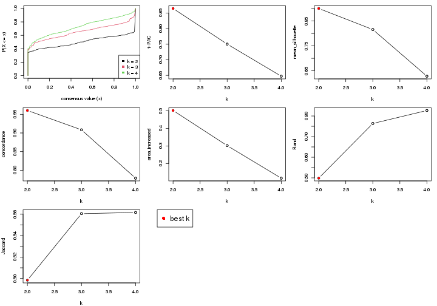

The numeric values for all these statistics can be obtained by `get_stats()`.

```r
get_stats(res)
```

```
#>   k 1-PAC mean_silhouette concordance area_increased  Rand Jaccard
#> 2 2 0.865           0.900       0.960          0.502 0.498   0.498
#> 3 3 0.750           0.816       0.908          0.302 0.764   0.561
#> 4 4 0.647           0.628       0.779          0.116 0.827   0.562
```

`suggest_best_k()` suggests the best $k$ based on these statistics. The rules are as follows:

- All $k$ with Jaccard index larger than 0.95 are removed because increasing
  $k$ does not provide enough extra information. If all $k$ are removed, it is
  marked as no subgroup is detected.
- For all $k$ with 1-PAC score larger than 0.9, the maximal $k$ is taken as
  the best $k$, and other $k$ are marked as optional $k$.
- If it does not fit the second rule. The $k$ with the maximal vote of the
  highest 1-PAC score, highest mean silhouette, and highest concordance is
  taken as the best $k$.

```r
suggest_best_k(res)
```

```
#> [1] 2
```


Following is the table of the partitions (You need to click the **show/hide
code output** link to see it). The membership matrix (columns with name `p*`)
is inferred by
[`clue::cl_consensus()`](https://www.rdocumentation.org/link/cl_consensus?package=clue)
function with the `SE` method. Basically the value in the membership matrix
represents the probability to belong to a certain group. The finall subgroup
label for an item is determined with the group with highest probability it
belongs to.

In `get_classes()` function, the entropy is calculated from the membership
matrix and the silhouette score is calculated from the consensus matrix.


<script>
$( function() {
	$( '#tabs-node-021-get-classes' ).tabs();
} );
</script>
<div id='tabs-node-021-get-classes'>
<ul>
<li><a href='#tab-node-021-get-classes-1'>k = 2</a></li>
<li><a href='#tab-node-021-get-classes-2'>k = 3</a></li>
<li><a href='#tab-node-021-get-classes-3'>k = 4</a></li>
</ul>

<div id='tab-node-021-get-classes-1'>
<p><a id='tab-node-021-get-classes-1-a' style='color:#0366d6' href='#'>show/hide code output</a></p>
<pre><code class="r">cbind(get_classes(res, k = 2), get_membership(res, k = 2))
</code></pre>

<pre><code>#&gt;             class entropy silhouette   p1   p2
#&gt; Sample_72       1   0.000     0.9582 1.00 0.00
#&gt; Sample_111      2   0.000     0.9578 0.00 1.00
#&gt; Sample_147      1   0.000     0.9582 1.00 0.00
#&gt; Sample_148      1   0.000     0.9582 1.00 0.00
#&gt; Sample_149      1   0.000     0.9582 1.00 0.00
#&gt; Sample_150      1   0.000     0.9582 1.00 0.00
#&gt; Sample_151      2   0.000     0.9578 0.00 1.00
#&gt; Sample_152      1   0.000     0.9582 1.00 0.00
#&gt; Sample_153      1   0.000     0.9582 1.00 0.00
#&gt; Sample_154      1   0.000     0.9582 1.00 0.00
#&gt; Sample_155      1   0.000     0.9582 1.00 0.00
#&gt; Sample_156      1   0.000     0.9582 1.00 0.00
#&gt; Sample_157      1   0.000     0.9582 1.00 0.00
#&gt; Sample_158      1   0.000     0.9582 1.00 0.00
#&gt; Sample_159      2   0.000     0.9578 0.00 1.00
#&gt; Sample_160      1   0.000     0.9582 1.00 0.00
#&gt; Sample_161      2   0.000     0.9578 0.00 1.00
#&gt; Sample_162      2   0.000     0.9578 0.00 1.00
#&gt; Sample_163      2   0.000     0.9578 0.00 1.00
#&gt; Sample_164      2   0.000     0.9578 0.00 1.00
#&gt; Sample_165      2   0.000     0.9578 0.00 1.00
#&gt; Sample_166      2   0.000     0.9578 0.00 1.00
#&gt; Sample_167      1   0.000     0.9582 1.00 0.00
#&gt; Sample_168      1   0.000     0.9582 1.00 0.00
#&gt; Sample_169      2   0.000     0.9578 0.00 1.00
#&gt; Sample_170      1   0.000     0.9582 1.00 0.00
#&gt; Sample_172      2   0.402     0.8897 0.08 0.92
#&gt; Sample_174      2   0.000     0.9578 0.00 1.00
#&gt; Sample_175      1   0.000     0.9582 1.00 0.00
#&gt; Sample_176      1   0.000     0.9582 1.00 0.00
#&gt; Sample_177      2   0.000     0.9578 0.00 1.00
#&gt; Sample_178      1   0.000     0.9582 1.00 0.00
#&gt; Sample_179      2   0.000     0.9578 0.00 1.00
#&gt; Sample_180      2   0.000     0.9578 0.00 1.00
#&gt; Sample_181      1   0.000     0.9582 1.00 0.00
#&gt; Sample_182      1   0.000     0.9582 1.00 0.00
#&gt; Sample_183      1   0.000     0.9582 1.00 0.00
#&gt; Sample_184      1   0.000     0.9582 1.00 0.00
#&gt; Sample_185      1   0.000     0.9582 1.00 0.00
#&gt; Sample_186      1   0.000     0.9582 1.00 0.00
#&gt; Sample_187      1   0.971     0.3368 0.60 0.40
#&gt; Sample_188      2   0.000     0.9578 0.00 1.00
#&gt; Sample_189      2   0.000     0.9578 0.00 1.00
#&gt; Sample_190      1   0.000     0.9582 1.00 0.00
#&gt; Sample_191      2   0.855     0.6144 0.28 0.72
#&gt; Sample_192      2   0.995     0.1556 0.46 0.54
#&gt; Sample_193      1   0.000     0.9582 1.00 0.00
#&gt; Sample_194      1   0.990     0.2116 0.56 0.44
#&gt; Sample_195      1   0.327     0.9050 0.94 0.06
#&gt; Sample_196      1   0.327     0.9046 0.94 0.06
#&gt; Sample_516      1   0.000     0.9582 1.00 0.00
#&gt; Sample_611      2   0.000     0.9578 0.00 1.00
#&gt; Sample_612      2   0.000     0.9578 0.00 1.00
#&gt; Sample_686      2   0.000     0.9578 0.00 1.00
#&gt; Sample_688      2   0.000     0.9578 0.00 1.00
#&gt; Sample_690      2   0.000     0.9578 0.00 1.00
#&gt; Sample_695      2   0.000     0.9578 0.00 1.00
#&gt; Sample_696      1   0.000     0.9582 1.00 0.00
#&gt; Sample_697      1   0.990     0.2112 0.56 0.44
#&gt; Sample_698      2   0.000     0.9578 0.00 1.00
#&gt; Sample_699      2   0.000     0.9578 0.00 1.00
#&gt; Sample_700      1   0.000     0.9582 1.00 0.00
#&gt; Sample_701      2   0.402     0.8894 0.08 0.92
#&gt; Sample_702      1   0.000     0.9582 1.00 0.00
#&gt; Sample_703      2   0.000     0.9578 0.00 1.00
#&gt; Sample_706      1   0.000     0.9582 1.00 0.00
#&gt; Sample_707      1   0.000     0.9582 1.00 0.00
#&gt; Sample_708      1   0.000     0.9582 1.00 0.00
#&gt; Sample_709      1   0.000     0.9582 1.00 0.00
#&gt; Sample_711      2   0.000     0.9578 0.00 1.00
#&gt; Sample_712      1   0.000     0.9582 1.00 0.00
#&gt; Sample_713      1   0.000     0.9582 1.00 0.00
#&gt; Sample_714      2   0.000     0.9578 0.00 1.00
#&gt; Sample_715      2   0.000     0.9578 0.00 1.00
#&gt; Sample_716      2   0.000     0.9578 0.00 1.00
#&gt; Sample_717      1   0.000     0.9582 1.00 0.00
#&gt; Sample_718      1   0.000     0.9582 1.00 0.00
#&gt; Sample_719      1   0.000     0.9582 1.00 0.00
#&gt; Sample_721      1   0.000     0.9582 1.00 0.00
#&gt; Sample_722      1   0.000     0.9582 1.00 0.00
#&gt; Sample_723      2   0.000     0.9578 0.00 1.00
#&gt; Sample_724      1   0.722     0.7381 0.80 0.20
#&gt; Sample_725      2   0.469     0.8705 0.10 0.90
#&gt; Sample_726      1   0.000     0.9582 1.00 0.00
#&gt; Sample_727      1   0.000     0.9582 1.00 0.00
#&gt; Sample_728      2   0.000     0.9578 0.00 1.00
#&gt; Sample_729      1   0.000     0.9582 1.00 0.00
#&gt; Sample_730      1   0.000     0.9582 1.00 0.00
#&gt; Sample_732      1   0.000     0.9582 1.00 0.00
#&gt; Sample_733      1   0.000     0.9582 1.00 0.00
#&gt; Sample_734      1   0.000     0.9582 1.00 0.00
#&gt; Sample_736      1   0.000     0.9582 1.00 0.00
#&gt; Sample_739      1   0.000     0.9582 1.00 0.00
#&gt; Sample_740      2   0.000     0.9578 0.00 1.00
#&gt; Sample_741      1   0.000     0.9582 1.00 0.00
#&gt; Sample_742      2   0.995     0.1540 0.46 0.54
#&gt; Sample_743      1   0.000     0.9582 1.00 0.00
#&gt; Sample_744      1   0.000     0.9582 1.00 0.00
#&gt; Sample_745      2   0.990     0.2232 0.44 0.56
#&gt; Sample_746      1   0.000     0.9582 1.00 0.00
#&gt; Sample_747      1   0.000     0.9582 1.00 0.00
#&gt; Sample_748      2   0.141     0.9423 0.02 0.98
#&gt; Sample_749      1   0.000     0.9582 1.00 0.00
#&gt; Sample_750      1   0.000     0.9582 1.00 0.00
#&gt; Sample_751      1   0.000     0.9582 1.00 0.00
#&gt; Sample_752      1   0.000     0.9582 1.00 0.00
#&gt; Sample_753      2   0.000     0.9578 0.00 1.00
#&gt; Sample_754      2   0.000     0.9578 0.00 1.00
#&gt; Sample_755      1   0.000     0.9582 1.00 0.00
#&gt; Sample_756      1   0.000     0.9582 1.00 0.00
#&gt; Sample_757      1   0.827     0.6420 0.74 0.26
#&gt; Sample_758      1   0.000     0.9582 1.00 0.00
#&gt; Sample_759      2   0.000     0.9578 0.00 1.00
#&gt; Sample_760      1   0.000     0.9582 1.00 0.00
#&gt; Sample_761      1   0.000     0.9582 1.00 0.00
#&gt; Sample_762      1   0.000     0.9582 1.00 0.00
#&gt; Sample_763      1   0.000     0.9582 1.00 0.00
#&gt; Sample_764      1   0.000     0.9582 1.00 0.00
#&gt; Sample_765      1   0.000     0.9582 1.00 0.00
#&gt; Sample_766      2   0.327     0.9083 0.06 0.94
#&gt; Sample_767      1   0.680     0.7683 0.82 0.18
#&gt; Sample_769      2   0.000     0.9578 0.00 1.00
#&gt; Sample_770      1   0.000     0.9582 1.00 0.00
#&gt; Sample_771      1   0.000     0.9582 1.00 0.00
#&gt; Sample_772      2   0.000     0.9578 0.00 1.00
#&gt; Sample_773      1   0.000     0.9582 1.00 0.00
#&gt; Sample_774      1   0.000     0.9582 1.00 0.00
#&gt; Sample_775      2   0.000     0.9578 0.00 1.00
#&gt; Sample_776      1   0.000     0.9582 1.00 0.00
#&gt; Sample_777      2   0.000     0.9578 0.00 1.00
#&gt; Sample_778      2   0.000     0.9578 0.00 1.00
#&gt; Sample_779      2   0.000     0.9578 0.00 1.00
#&gt; Sample_780      2   0.000     0.9578 0.00 1.00
#&gt; Sample_781      1   0.000     0.9582 1.00 0.00
#&gt; Sample_782      2   0.000     0.9578 0.00 1.00
#&gt; Sample_783      2   0.000     0.9578 0.00 1.00
#&gt; Sample_784      2   0.000     0.9578 0.00 1.00
#&gt; Sample_785      2   0.000     0.9578 0.00 1.00
#&gt; Sample_786      2   0.327     0.9074 0.06 0.94
#&gt; Sample_787      1   0.000     0.9582 1.00 0.00
#&gt; Sample_788      2   0.680     0.7746 0.18 0.82
#&gt; Sample_789      2   0.469     0.8688 0.10 0.90
#&gt; Sample_790      1   0.000     0.9582 1.00 0.00
#&gt; Sample_791      1   0.000     0.9582 1.00 0.00
#&gt; Sample_792      1   0.000     0.9582 1.00 0.00
#&gt; Sample_793      2   0.000     0.9578 0.00 1.00
#&gt; Sample_794      1   0.000     0.9582 1.00 0.00
#&gt; Sample_795      1   0.000     0.9582 1.00 0.00
#&gt; Sample_796      1   0.000     0.9582 1.00 0.00
#&gt; Sample_797      2   0.000     0.9578 0.00 1.00
#&gt; Sample_798      2   0.000     0.9578 0.00 1.00
#&gt; Sample_799      2   0.881     0.5760 0.30 0.70
#&gt; Sample_800      1   0.000     0.9582 1.00 0.00
#&gt; Sample_801      1   0.000     0.9582 1.00 0.00
#&gt; Sample_802      2   0.000     0.9578 0.00 1.00
#&gt; Sample_803      1   0.000     0.9582 1.00 0.00
#&gt; Sample_804      2   0.000     0.9578 0.00 1.00
#&gt; Sample_805      1   0.469     0.8636 0.90 0.10
#&gt; Sample_806      1   0.000     0.9582 1.00 0.00
#&gt; Sample_807      1   0.000     0.9582 1.00 0.00
#&gt; Sample_808      1   0.000     0.9582 1.00 0.00
#&gt; Sample_809      1   0.000     0.9582 1.00 0.00
#&gt; Sample_810      2   0.000     0.9578 0.00 1.00
#&gt; Sample_811      1   0.000     0.9582 1.00 0.00
#&gt; Sample_812      1   0.000     0.9582 1.00 0.00
#&gt; Sample_813      1   0.000     0.9582 1.00 0.00
#&gt; Sample_814      1   0.000     0.9582 1.00 0.00
#&gt; Sample_815      1   0.000     0.9582 1.00 0.00
#&gt; Sample_816      1   0.000     0.9582 1.00 0.00
#&gt; Sample_817      2   0.000     0.9578 0.00 1.00
#&gt; Sample_818      1   0.000     0.9582 1.00 0.00
#&gt; Sample_819      2   0.000     0.9578 0.00 1.00
#&gt; Sample_821      2   0.000     0.9578 0.00 1.00
#&gt; Sample_822      1   0.000     0.9582 1.00 0.00
#&gt; Sample_823      2   0.000     0.9578 0.00 1.00
#&gt; Sample_824      2   0.000     0.9578 0.00 1.00
#&gt; Sample_825      2   0.000     0.9578 0.00 1.00
#&gt; Sample_826      2   0.000     0.9578 0.00 1.00
#&gt; Sample_827      2   0.141     0.9423 0.02 0.98
#&gt; Sample_828      1   0.000     0.9582 1.00 0.00
#&gt; Sample_829      2   0.242     0.9262 0.04 0.96
#&gt; Sample_830      2   0.402     0.8897 0.08 0.92
#&gt; Sample_831      1   0.981     0.2753 0.58 0.42
#&gt; Sample_832      1   0.000     0.9582 1.00 0.00
#&gt; Sample_833      1   0.000     0.9582 1.00 0.00
#&gt; Sample_834      2   0.000     0.9578 0.00 1.00
#&gt; Sample_835      2   0.000     0.9578 0.00 1.00
#&gt; Sample_837      1   0.000     0.9582 1.00 0.00
#&gt; Sample_838      1   0.000     0.9582 1.00 0.00
#&gt; Sample_839      2   0.000     0.9578 0.00 1.00
#&gt; Sample_840      1   0.999     0.0675 0.52 0.48
#&gt; Sample_855      2   0.000     0.9578 0.00 1.00
#&gt; Sample_856      2   0.000     0.9578 0.00 1.00
#&gt; Sample_857      2   0.000     0.9578 0.00 1.00
#&gt; Sample_858      1   0.000     0.9582 1.00 0.00
#&gt; Sample_860      2   0.000     0.9578 0.00 1.00
#&gt; Sample_861      2   0.000     0.9578 0.00 1.00
#&gt; Sample_862      2   0.634     0.7975 0.16 0.84
#&gt; Sample_863      2   0.000     0.9578 0.00 1.00
#&gt; Sample_864      1   0.000     0.9582 1.00 0.00
#&gt; Sample_866      2   0.855     0.6136 0.28 0.72
#&gt; Sample_867      2   0.141     0.9423 0.02 0.98
#&gt; Sample_868      1   0.925     0.4874 0.66 0.34
#&gt; Sample_869      2   0.000     0.9578 0.00 1.00
#&gt; Sample_870      2   0.141     0.9423 0.02 0.98
#&gt; Sample_871      2   0.000     0.9578 0.00 1.00
#&gt; Sample_872      2   0.000     0.9578 0.00 1.00
#&gt; Sample_873      2   0.000     0.9578 0.00 1.00
#&gt; Sample_874      1   0.000     0.9582 1.00 0.00
#&gt; Sample_875      1   0.000     0.9582 1.00 0.00
#&gt; Sample_876      2   0.000     0.9578 0.00 1.00
#&gt; Sample_877      1   0.000     0.9582 1.00 0.00
#&gt; Sample_878      1   0.000     0.9582 1.00 0.00
#&gt; Sample_879      1   0.827     0.6443 0.74 0.26
#&gt; Sample_880      1   0.000     0.9582 1.00 0.00
#&gt; Sample_881      2   0.000     0.9578 0.00 1.00
#&gt; Sample_883      1   0.141     0.9412 0.98 0.02
#&gt; Sample_884      1   0.141     0.9412 0.98 0.02
#&gt; Sample_885      2   0.000     0.9578 0.00 1.00
#&gt; Sample_886      1   0.000     0.9582 1.00 0.00
#&gt; Sample_887      1   0.000     0.9582 1.00 0.00
#&gt; Sample_888      1   0.634     0.7919 0.84 0.16
#&gt; Sample_889      2   0.000     0.9578 0.00 1.00
#&gt; Sample_890      2   0.000     0.9578 0.00 1.00
#&gt; Sample_891      2   0.000     0.9578 0.00 1.00
#&gt; Sample_892      2   0.000     0.9578 0.00 1.00
#&gt; Sample_893      2   0.000     0.9578 0.00 1.00
#&gt; Sample_895      2   0.881     0.5750 0.30 0.70
#&gt; Sample_896      1   0.971     0.3367 0.60 0.40
#&gt; Sample_897      2   0.000     0.9578 0.00 1.00
#&gt; Sample_898      2   0.000     0.9578 0.00 1.00
#&gt; Sample_899      1   0.971     0.3392 0.60 0.40
#&gt; Sample_901      1   0.000     0.9582 1.00 0.00
#&gt; Sample_902      2   0.000     0.9578 0.00 1.00
#&gt; Sample_903      2   0.000     0.9578 0.00 1.00
#&gt; Sample_904      1   0.000     0.9582 1.00 0.00
#&gt; Sample_905      1   0.000     0.9582 1.00 0.00
#&gt; Sample_906      2   0.000     0.9578 0.00 1.00
#&gt; Sample_907      2   0.000     0.9578 0.00 1.00
#&gt; Sample_908      2   0.000     0.9578 0.00 1.00
#&gt; Sample_909      2   0.000     0.9578 0.00 1.00
#&gt; Sample_910      1   0.000     0.9582 1.00 0.00
#&gt; Sample_911      2   0.000     0.9578 0.00 1.00
#&gt; Sample_912      1   0.995     0.1522 0.54 0.46
#&gt; Sample_913      2   0.000     0.9578 0.00 1.00
#&gt; Sample_914      2   0.000     0.9578 0.00 1.00
#&gt; Sample_915      2   0.000     0.9578 0.00 1.00
#&gt; Sample_916      1   0.000     0.9582 1.00 0.00
#&gt; Sample_917      2   0.000     0.9578 0.00 1.00
#&gt; Sample_918      2   0.000     0.9578 0.00 1.00
#&gt; Sample_919      2   0.000     0.9578 0.00 1.00
#&gt; Sample_920      2   0.925     0.4905 0.34 0.66
#&gt; Sample_921      1   0.000     0.9582 1.00 0.00
#&gt; Sample_922      2   0.000     0.9578 0.00 1.00
#&gt; Sample_923      1   0.584     0.8187 0.86 0.14
#&gt; Sample_924      2   0.000     0.9578 0.00 1.00
#&gt; Sample_925      2   0.000     0.9578 0.00 1.00
#&gt; Sample_926      1   0.999     0.0748 0.52 0.48
#&gt; Sample_927      1   0.000     0.9582 1.00 0.00
#&gt; Sample_928      1   0.000     0.9582 1.00 0.00
#&gt; Sample_929      2   0.958     0.3943 0.38 0.62
#&gt; Sample_930      1   0.000     0.9582 1.00 0.00
#&gt; Sample_931      1   0.000     0.9582 1.00 0.00
#&gt; Sample_932      2   0.971     0.3397 0.40 0.60
#&gt; Sample_933      2   0.000     0.9578 0.00 1.00
#&gt; Sample_934      2   0.584     0.8224 0.14 0.86
#&gt; Sample_935      2   0.000     0.9578 0.00 1.00
#&gt; Sample_936      2   0.000     0.9578 0.00 1.00
#&gt; Sample_937      2   0.000     0.9578 0.00 1.00
#&gt; Sample_938      2   0.000     0.9578 0.00 1.00
#&gt; Sample_939      2   0.000     0.9578 0.00 1.00
#&gt; Sample_940      2   0.000     0.9578 0.00 1.00
#&gt; Sample_941      2   0.000     0.9578 0.00 1.00
#&gt; Sample_942      2   0.000     0.9578 0.00 1.00
#&gt; Sample_943      2   0.000     0.9578 0.00 1.00
#&gt; Sample_944      2   0.999     0.0739 0.48 0.52
#&gt; Sample_945      1   0.000     0.9582 1.00 0.00
#&gt; Sample_946      1   0.000     0.9582 1.00 0.00
#&gt; Sample_947      1   0.000     0.9582 1.00 0.00
#&gt; Sample_1527     2   0.000     0.9578 0.00 1.00
#&gt; Sample_1528     2   0.000     0.9578 0.00 1.00
#&gt; Sample_1529     2   0.000     0.9578 0.00 1.00
#&gt; Sample_1533     1   0.000     0.9582 1.00 0.00
#&gt; Sample_1534     2   0.000     0.9578 0.00 1.00
#&gt; Sample_1538     2   0.000     0.9578 0.00 1.00
#&gt; Sample_1539     2   0.000     0.9578 0.00 1.00
#&gt; Sample_1542     2   0.000     0.9578 0.00 1.00
#&gt; Sample_1546     1   0.402     0.8854 0.92 0.08
#&gt; Sample_1570     2   0.958     0.4005 0.38 0.62
</code></pre>

<script>
$('#tab-node-021-get-classes-1-a').parent().next().next().hide();
$('#tab-node-021-get-classes-1-a').click(function(){
  $('#tab-node-021-get-classes-1-a').parent().next().next().toggle();
  return(false);
});
</script>
</div>

<div id='tab-node-021-get-classes-2'>
<p><a id='tab-node-021-get-classes-2-a' style='color:#0366d6' href='#'>show/hide code output</a></p>
<pre><code class="r">cbind(get_classes(res, k = 3), get_membership(res, k = 3))
</code></pre>

<pre><code>#&gt;             class entropy silhouette   p1   p2   p3
#&gt; Sample_72       3  0.5948     0.6218 0.36 0.00 0.64
#&gt; Sample_111      2  0.0892     0.9251 0.00 0.98 0.02
#&gt; Sample_147      3  0.6045     0.5970 0.38 0.00 0.62
#&gt; Sample_148      1  0.6045     0.1248 0.62 0.00 0.38
#&gt; Sample_149      3  0.2066     0.8074 0.06 0.00 0.94
#&gt; Sample_150      3  0.1529     0.8090 0.04 0.00 0.96
#&gt; Sample_151      2  0.0000     0.9281 0.00 1.00 0.00
#&gt; Sample_152      3  0.5706     0.6634 0.32 0.00 0.68
#&gt; Sample_153      3  0.6192     0.5192 0.42 0.00 0.58
#&gt; Sample_154      3  0.6045     0.5970 0.38 0.00 0.62
#&gt; Sample_155      3  0.4796     0.7412 0.22 0.00 0.78
#&gt; Sample_156      3  0.6045     0.5970 0.38 0.00 0.62
#&gt; Sample_157      3  0.5835     0.6435 0.34 0.00 0.66
#&gt; Sample_158      3  0.6045     0.5970 0.38 0.00 0.62
#&gt; Sample_159      2  0.1529     0.9061 0.00 0.96 0.04
#&gt; Sample_160      3  0.6045     0.5970 0.38 0.00 0.62
#&gt; Sample_161      2  0.0000     0.9281 0.00 1.00 0.00
#&gt; Sample_162      2  0.0000     0.9281 0.00 1.00 0.00
#&gt; Sample_163      2  0.2066     0.9129 0.00 0.94 0.06
#&gt; Sample_164      2  0.0892     0.9186 0.00 0.98 0.02
#&gt; Sample_165      2  0.0000     0.9281 0.00 1.00 0.00
#&gt; Sample_166      2  0.0000     0.9281 0.00 1.00 0.00
#&gt; Sample_167      3  0.6045     0.5970 0.38 0.00 0.62
#&gt; Sample_168      3  0.6045     0.5970 0.38 0.00 0.62
#&gt; Sample_169      2  0.4796     0.7095 0.00 0.78 0.22
#&gt; Sample_170      3  0.6045     0.5970 0.38 0.00 0.62
#&gt; Sample_172      3  0.7760     0.4586 0.06 0.36 0.58
#&gt; Sample_174      2  0.0892     0.9251 0.00 0.98 0.02
#&gt; Sample_175      3  0.6244     0.4777 0.44 0.00 0.56
#&gt; Sample_176      1  0.6126     0.0454 0.60 0.00 0.40
#&gt; Sample_177      2  0.0892     0.9251 0.00 0.98 0.02
#&gt; Sample_178      3  0.5216     0.7140 0.26 0.00 0.74
#&gt; Sample_179      2  0.2537     0.9011 0.00 0.92 0.08
#&gt; Sample_180      2  0.0000     0.9281 0.00 1.00 0.00
#&gt; Sample_181      3  0.6045     0.5970 0.38 0.00 0.62
#&gt; Sample_182      1  0.6280    -0.2036 0.54 0.00 0.46
#&gt; Sample_183      3  0.5835     0.6444 0.34 0.00 0.66
#&gt; Sample_184      3  0.6045     0.5970 0.38 0.00 0.62
#&gt; Sample_185      3  0.6045     0.5970 0.38 0.00 0.62
#&gt; Sample_186      3  0.6045     0.5970 0.38 0.00 0.62
#&gt; Sample_187      3  0.1529     0.8110 0.04 0.00 0.96
#&gt; Sample_188      2  0.0000     0.9281 0.00 1.00 0.00
#&gt; Sample_189      2  0.0000     0.9281 0.00 1.00 0.00
#&gt; Sample_190      3  0.6192     0.5221 0.42 0.00 0.58
#&gt; Sample_191      3  0.7633     0.6757 0.12 0.20 0.68
#&gt; Sample_192      3  0.8733     0.5784 0.16 0.26 0.58
#&gt; Sample_193      3  0.5948     0.6211 0.36 0.00 0.64
#&gt; Sample_194      3  0.7760     0.5481 0.36 0.06 0.58
#&gt; Sample_195      3  0.2947     0.8073 0.06 0.02 0.92
#&gt; Sample_196      3  0.6849     0.5730 0.38 0.02 0.60
#&gt; Sample_516      3  0.5835     0.6440 0.34 0.00 0.66
#&gt; Sample_611      2  0.0892     0.9251 0.00 0.98 0.02
#&gt; Sample_612      2  0.0000     0.9281 0.00 1.00 0.00
#&gt; Sample_686      2  0.0000     0.9281 0.00 1.00 0.00
#&gt; Sample_688      2  0.0000     0.9281 0.00 1.00 0.00
#&gt; Sample_690      2  0.0000     0.9281 0.00 1.00 0.00
#&gt; Sample_695      2  0.2959     0.8499 0.10 0.90 0.00
#&gt; Sample_696      1  0.0892     0.9107 0.98 0.00 0.02
#&gt; Sample_697      1  0.5016     0.6540 0.76 0.24 0.00
#&gt; Sample_698      2  0.0000     0.9281 0.00 1.00 0.00
#&gt; Sample_699      2  0.0000     0.9281 0.00 1.00 0.00
#&gt; Sample_700      1  0.0000     0.9285 1.00 0.00 0.00
#&gt; Sample_701      2  0.5835     0.4747 0.34 0.66 0.00
#&gt; Sample_702      1  0.0000     0.9285 1.00 0.00 0.00
#&gt; Sample_703      2  0.0000     0.9281 0.00 1.00 0.00
#&gt; Sample_706      1  0.0000     0.9285 1.00 0.00 0.00
#&gt; Sample_707      1  0.0000     0.9285 1.00 0.00 0.00
#&gt; Sample_708      1  0.0000     0.9285 1.00 0.00 0.00
#&gt; Sample_709      1  0.3340     0.8057 0.88 0.00 0.12
#&gt; Sample_711      2  0.0000     0.9281 0.00 1.00 0.00
#&gt; Sample_712      1  0.0000     0.9285 1.00 0.00 0.00
#&gt; Sample_713      1  0.0000     0.9285 1.00 0.00 0.00
#&gt; Sample_714      2  0.0000     0.9281 0.00 1.00 0.00
#&gt; Sample_715      2  0.0000     0.9281 0.00 1.00 0.00
#&gt; Sample_716      2  0.0000     0.9281 0.00 1.00 0.00
#&gt; Sample_717      1  0.0000     0.9285 1.00 0.00 0.00
#&gt; Sample_718      1  0.0000     0.9285 1.00 0.00 0.00
#&gt; Sample_719      1  0.0892     0.9118 0.98 0.02 0.00
#&gt; Sample_721      1  0.0000     0.9285 1.00 0.00 0.00
#&gt; Sample_722      1  0.0000     0.9285 1.00 0.00 0.00
#&gt; Sample_723      2  0.0000     0.9281 0.00 1.00 0.00
#&gt; Sample_724      1  0.2537     0.8540 0.92 0.08 0.00
#&gt; Sample_725      2  0.5216     0.6385 0.26 0.74 0.00
#&gt; Sample_726      1  0.0000     0.9285 1.00 0.00 0.00
#&gt; Sample_727      1  0.0000     0.9285 1.00 0.00 0.00
#&gt; Sample_728      2  0.0000     0.9281 0.00 1.00 0.00
#&gt; Sample_729      1  0.0000     0.9285 1.00 0.00 0.00
#&gt; Sample_730      1  0.0000     0.9285 1.00 0.00 0.00
#&gt; Sample_732      1  0.0000     0.9285 1.00 0.00 0.00
#&gt; Sample_733      1  0.0000     0.9285 1.00 0.00 0.00
#&gt; Sample_734      1  0.0892     0.9120 0.98 0.02 0.00
#&gt; Sample_736      1  0.0000     0.9285 1.00 0.00 0.00
#&gt; Sample_739      1  0.0000     0.9285 1.00 0.00 0.00
#&gt; Sample_740      2  0.2959     0.8497 0.10 0.90 0.00
#&gt; Sample_741      1  0.0000     0.9285 1.00 0.00 0.00
#&gt; Sample_742      1  0.5948     0.4407 0.64 0.36 0.00
#&gt; Sample_743      1  0.0000     0.9285 1.00 0.00 0.00
#&gt; Sample_744      1  0.0000     0.9285 1.00 0.00 0.00
#&gt; Sample_745      1  0.8587     0.2348 0.50 0.40 0.10
#&gt; Sample_746      1  0.0000     0.9285 1.00 0.00 0.00
#&gt; Sample_747      1  0.0000     0.9285 1.00 0.00 0.00
#&gt; Sample_748      2  0.5948     0.4298 0.36 0.64 0.00
#&gt; Sample_749      1  0.0000     0.9285 1.00 0.00 0.00
#&gt; Sample_750      1  0.0000     0.9285 1.00 0.00 0.00
#&gt; Sample_751      1  0.0000     0.9285 1.00 0.00 0.00
#&gt; Sample_752      1  0.0000     0.9285 1.00 0.00 0.00
#&gt; Sample_753      2  0.0000     0.9281 0.00 1.00 0.00
#&gt; Sample_754      2  0.0000     0.9281 0.00 1.00 0.00
#&gt; Sample_755      1  0.0000     0.9285 1.00 0.00 0.00
#&gt; Sample_756      1  0.0000     0.9285 1.00 0.00 0.00
#&gt; Sample_757      1  0.2066     0.8739 0.94 0.06 0.00
#&gt; Sample_758      1  0.0000     0.9285 1.00 0.00 0.00
#&gt; Sample_759      2  0.0000     0.9281 0.00 1.00 0.00
#&gt; Sample_760      1  0.0000     0.9285 1.00 0.00 0.00
#&gt; Sample_761      1  0.0000     0.9285 1.00 0.00 0.00
#&gt; Sample_762      1  0.0000     0.9285 1.00 0.00 0.00
#&gt; Sample_763      1  0.0000     0.9285 1.00 0.00 0.00
#&gt; Sample_764      1  0.0000     0.9285 1.00 0.00 0.00
#&gt; Sample_765      1  0.0000     0.9285 1.00 0.00 0.00
#&gt; Sample_766      2  0.5216     0.6383 0.26 0.74 0.00
#&gt; Sample_767      1  0.3572     0.8461 0.90 0.06 0.04
#&gt; Sample_769      2  0.0000     0.9281 0.00 1.00 0.00
#&gt; Sample_770      1  0.0000     0.9285 1.00 0.00 0.00
#&gt; Sample_771      1  0.2066     0.8739 0.94 0.06 0.00
#&gt; Sample_772      2  0.0000     0.9281 0.00 1.00 0.00
#&gt; Sample_773      1  0.0000     0.9285 1.00 0.00 0.00
#&gt; Sample_774      1  0.0000     0.9285 1.00 0.00 0.00
#&gt; Sample_775      2  0.0000     0.9281 0.00 1.00 0.00
#&gt; Sample_776      1  0.0000     0.9285 1.00 0.00 0.00
#&gt; Sample_777      2  0.0000     0.9281 0.00 1.00 0.00
#&gt; Sample_778      2  0.0000     0.9281 0.00 1.00 0.00
#&gt; Sample_779      2  0.0000     0.9281 0.00 1.00 0.00
#&gt; Sample_780      2  0.0000     0.9281 0.00 1.00 0.00
#&gt; Sample_781      1  0.0000     0.9285 1.00 0.00 0.00
#&gt; Sample_782      2  0.0000     0.9281 0.00 1.00 0.00
#&gt; Sample_783      2  0.0000     0.9281 0.00 1.00 0.00
#&gt; Sample_784      2  0.0000     0.9281 0.00 1.00 0.00
#&gt; Sample_785      2  0.0000     0.9281 0.00 1.00 0.00
#&gt; Sample_786      1  0.6244     0.2227 0.56 0.44 0.00
#&gt; Sample_787      1  0.0000     0.9285 1.00 0.00 0.00
#&gt; Sample_788      2  0.6192     0.2689 0.42 0.58 0.00
#&gt; Sample_789      1  0.6302     0.0858 0.52 0.48 0.00
#&gt; Sample_790      1  0.0000     0.9285 1.00 0.00 0.00
#&gt; Sample_791      1  0.0000     0.9285 1.00 0.00 0.00
#&gt; Sample_792      1  0.2066     0.8637 0.94 0.00 0.06
#&gt; Sample_793      2  0.0000     0.9281 0.00 1.00 0.00
#&gt; Sample_794      1  0.0000     0.9285 1.00 0.00 0.00
#&gt; Sample_795      1  0.0000     0.9285 1.00 0.00 0.00
#&gt; Sample_796      1  0.0000     0.9285 1.00 0.00 0.00
#&gt; Sample_797      2  0.0000     0.9281 0.00 1.00 0.00
#&gt; Sample_798      2  0.3340     0.8283 0.12 0.88 0.00
#&gt; Sample_799      1  0.4002     0.7610 0.84 0.16 0.00
#&gt; Sample_800      1  0.0000     0.9285 1.00 0.00 0.00
#&gt; Sample_801      1  0.0000     0.9285 1.00 0.00 0.00
#&gt; Sample_802      2  0.3415     0.8831 0.02 0.90 0.08
#&gt; Sample_803      1  0.0000     0.9285 1.00 0.00 0.00
#&gt; Sample_804      2  0.0892     0.9173 0.02 0.98 0.00
#&gt; Sample_805      1  0.0892     0.9117 0.98 0.02 0.00
#&gt; Sample_806      1  0.0000     0.9285 1.00 0.00 0.00
#&gt; Sample_807      1  0.0000     0.9285 1.00 0.00 0.00
#&gt; Sample_808      1  0.0000     0.9285 1.00 0.00 0.00
#&gt; Sample_809      1  0.0000     0.9285 1.00 0.00 0.00
#&gt; Sample_810      2  0.0000     0.9281 0.00 1.00 0.00
#&gt; Sample_811      1  0.0000     0.9285 1.00 0.00 0.00
#&gt; Sample_812      1  0.0000     0.9285 1.00 0.00 0.00
#&gt; Sample_813      1  0.0000     0.9285 1.00 0.00 0.00
#&gt; Sample_814      1  0.1529     0.8937 0.96 0.04 0.00
#&gt; Sample_815      1  0.0000     0.9285 1.00 0.00 0.00
#&gt; Sample_816      1  0.0000     0.9285 1.00 0.00 0.00
#&gt; Sample_817      2  0.0000     0.9281 0.00 1.00 0.00
#&gt; Sample_818      1  0.0000     0.9285 1.00 0.00 0.00
#&gt; Sample_819      2  0.6280     0.1342 0.46 0.54 0.00
#&gt; Sample_821      2  0.0000     0.9281 0.00 1.00 0.00
#&gt; Sample_822      1  0.0000     0.9285 1.00 0.00 0.00
#&gt; Sample_823      2  0.0000     0.9281 0.00 1.00 0.00
#&gt; Sample_824      2  0.0000     0.9281 0.00 1.00 0.00
#&gt; Sample_825      2  0.0000     0.9281 0.00 1.00 0.00
#&gt; Sample_826      2  0.0000     0.9281 0.00 1.00 0.00
#&gt; Sample_827      2  0.6244     0.2028 0.44 0.56 0.00
#&gt; Sample_828      1  0.0000     0.9285 1.00 0.00 0.00
#&gt; Sample_829      2  0.7586    -0.0235 0.48 0.48 0.04
#&gt; Sample_830      1  0.5835     0.4880 0.66 0.34 0.00
#&gt; Sample_831      1  0.3686     0.7834 0.86 0.14 0.00
#&gt; Sample_832      1  0.0892     0.9118 0.98 0.02 0.00
#&gt; Sample_833      1  0.0000     0.9285 1.00 0.00 0.00
#&gt; Sample_834      2  0.0000     0.9281 0.00 1.00 0.00
#&gt; Sample_835      2  0.0000     0.9281 0.00 1.00 0.00
#&gt; Sample_837      1  0.0000     0.9285 1.00 0.00 0.00
#&gt; Sample_838      1  0.0000     0.9285 1.00 0.00 0.00
#&gt; Sample_839      2  0.0000     0.9281 0.00 1.00 0.00
#&gt; Sample_840      1  0.2537     0.8545 0.92 0.08 0.00
#&gt; Sample_855      2  0.0000     0.9281 0.00 1.00 0.00
#&gt; Sample_856      2  0.3686     0.8529 0.00 0.86 0.14
#&gt; Sample_857      2  0.5560     0.6491 0.00 0.70 0.30
#&gt; Sample_858      1  0.4002     0.7245 0.84 0.00 0.16
#&gt; Sample_860      2  0.2066     0.9129 0.00 0.94 0.06
#&gt; Sample_861      3  0.6302    -0.1365 0.00 0.48 0.52
#&gt; Sample_862      3  0.0000     0.8081 0.00 0.00 1.00
#&gt; Sample_863      2  0.2066     0.9129 0.00 0.94 0.06
#&gt; Sample_864      3  0.1529     0.8095 0.04 0.00 0.96
#&gt; Sample_866      3  0.4551     0.6969 0.02 0.14 0.84
#&gt; Sample_867      3  0.3686     0.7029 0.00 0.14 0.86
#&gt; Sample_868      3  0.0000     0.8081 0.00 0.00 1.00
#&gt; Sample_869      2  0.6126     0.4647 0.00 0.60 0.40
#&gt; Sample_870      3  0.2959     0.7521 0.00 0.10 0.90
#&gt; Sample_871      2  0.4796     0.7627 0.00 0.78 0.22
#&gt; Sample_872      2  0.2066     0.9129 0.00 0.94 0.06
#&gt; Sample_873      2  0.2066     0.9129 0.00 0.94 0.06
#&gt; Sample_874      3  0.2959     0.7978 0.10 0.00 0.90
#&gt; Sample_875      3  0.0000     0.8081 0.00 0.00 1.00
#&gt; Sample_876      2  0.1529     0.9200 0.00 0.96 0.04
#&gt; Sample_877      3  0.0000     0.8081 0.00 0.00 1.00
#&gt; Sample_878      3  0.4555     0.7541 0.20 0.00 0.80
#&gt; Sample_879      3  0.0000     0.8081 0.00 0.00 1.00
#&gt; Sample_880      3  0.0000     0.8081 0.00 0.00 1.00
#&gt; Sample_881      3  0.5835     0.3268 0.00 0.34 0.66
#&gt; Sample_883      3  0.0000     0.8081 0.00 0.00 1.00
#&gt; Sample_884      3  0.0000     0.8081 0.00 0.00 1.00
#&gt; Sample_885      2  0.0000     0.9281 0.00 1.00 0.00
#&gt; Sample_886      3  0.2959     0.7993 0.10 0.00 0.90
#&gt; Sample_887      3  0.2066     0.8074 0.06 0.00 0.94
#&gt; Sample_888      3  0.0000     0.8081 0.00 0.00 1.00
#&gt; Sample_889      2  0.2959     0.8853 0.00 0.90 0.10
#&gt; Sample_890      2  0.4291     0.8105 0.00 0.82 0.18
#&gt; Sample_891      2  0.2066     0.9129 0.00 0.94 0.06
#&gt; Sample_892      2  0.2066     0.9129 0.00 0.94 0.06
#&gt; Sample_893      2  0.2066     0.9129 0.00 0.94 0.06
#&gt; Sample_895      3  0.0000     0.8081 0.00 0.00 1.00
#&gt; Sample_896      3  0.0000     0.8081 0.00 0.00 1.00
#&gt; Sample_897      2  0.2066     0.9129 0.00 0.94 0.06
#&gt; Sample_898      3  0.4002     0.6855 0.00 0.16 0.84
#&gt; Sample_899      3  0.0000     0.8081 0.00 0.00 1.00
#&gt; Sample_901      3  0.0000     0.8081 0.00 0.00 1.00
#&gt; Sample_902      2  0.2066     0.9129 0.00 0.94 0.06
#&gt; Sample_903      2  0.4002     0.8312 0.00 0.84 0.16
#&gt; Sample_904      3  0.2066     0.8074 0.06 0.00 0.94
#&gt; Sample_905      3  0.2066     0.8093 0.06 0.00 0.94
#&gt; Sample_906      3  0.3686     0.7032 0.00 0.14 0.86
#&gt; Sample_907      2  0.2066     0.9129 0.00 0.94 0.06
#&gt; Sample_908      2  0.2066     0.9129 0.00 0.94 0.06
#&gt; Sample_909      2  0.2066     0.9129 0.00 0.94 0.06
#&gt; Sample_910      3  0.2066     0.8074 0.06 0.00 0.94
#&gt; Sample_911      2  0.2066     0.9129 0.00 0.94 0.06
#&gt; Sample_912      3  0.0000     0.8081 0.00 0.00 1.00
#&gt; Sample_913      2  0.2066     0.9129 0.00 0.94 0.06
#&gt; Sample_914      2  0.2066     0.9129 0.00 0.94 0.06
#&gt; Sample_915      2  0.2066     0.9129 0.00 0.94 0.06
#&gt; Sample_916      3  0.0000     0.8081 0.00 0.00 1.00
#&gt; Sample_917      2  0.2066     0.9129 0.00 0.94 0.06
#&gt; Sample_918      2  0.2066     0.9129 0.00 0.94 0.06
#&gt; Sample_919      2  0.2066     0.9129 0.00 0.94 0.06
#&gt; Sample_920      3  0.0000     0.8081 0.00 0.00 1.00
#&gt; Sample_921      3  0.2537     0.8033 0.08 0.00 0.92
#&gt; Sample_922      2  0.0892     0.9251 0.00 0.98 0.02
#&gt; Sample_923      3  0.0000     0.8081 0.00 0.00 1.00
#&gt; Sample_924      2  0.2066     0.9129 0.00 0.94 0.06
#&gt; Sample_925      2  0.5216     0.7092 0.00 0.74 0.26
#&gt; Sample_926      3  0.0000     0.8081 0.00 0.00 1.00
#&gt; Sample_927      3  0.4555     0.7519 0.20 0.00 0.80
#&gt; Sample_928      3  0.5397     0.6992 0.28 0.00 0.72
#&gt; Sample_929      3  0.0000     0.8081 0.00 0.00 1.00
#&gt; Sample_930      3  0.1529     0.8095 0.04 0.00 0.96
#&gt; Sample_931      3  0.2066     0.8074 0.06 0.00 0.94
#&gt; Sample_932      3  0.0000     0.8081 0.00 0.00 1.00
#&gt; Sample_933      2  0.4555     0.7866 0.00 0.80 0.20
#&gt; Sample_934      3  0.0000     0.8081 0.00 0.00 1.00
#&gt; Sample_935      2  0.2066     0.9129 0.00 0.94 0.06
#&gt; Sample_936      2  0.2537     0.9006 0.00 0.92 0.08
#&gt; Sample_937      2  0.2066     0.9129 0.00 0.94 0.06
#&gt; Sample_938      2  0.2066     0.9129 0.00 0.94 0.06
#&gt; Sample_939      2  0.5397     0.6800 0.00 0.72 0.28
#&gt; Sample_940      2  0.1529     0.9199 0.00 0.96 0.04
#&gt; Sample_941      2  0.0000     0.9281 0.00 1.00 0.00
#&gt; Sample_942      2  0.1529     0.9199 0.00 0.96 0.04
#&gt; Sample_943      2  0.1529     0.9199 0.00 0.96 0.04
#&gt; Sample_944      3  0.0000     0.8081 0.00 0.00 1.00
#&gt; Sample_945      3  0.2066     0.8074 0.06 0.00 0.94
#&gt; Sample_946      3  0.0892     0.8091 0.02 0.00 0.98
#&gt; Sample_947      3  0.2066     0.8074 0.06 0.00 0.94
#&gt; Sample_1527     2  0.0892     0.9251 0.00 0.98 0.02
#&gt; Sample_1528     2  0.0000     0.9281 0.00 1.00 0.00
#&gt; Sample_1529     2  0.0000     0.9281 0.00 1.00 0.00
#&gt; Sample_1533     1  0.0000     0.9285 1.00 0.00 0.00
#&gt; Sample_1534     2  0.0000     0.9281 0.00 1.00 0.00
#&gt; Sample_1538     2  0.0000     0.9281 0.00 1.00 0.00
#&gt; Sample_1539     2  0.0892     0.9251 0.00 0.98 0.02
#&gt; Sample_1542     2  0.0892     0.9251 0.00 0.98 0.02
#&gt; Sample_1546     3  0.0000     0.8081 0.00 0.00 1.00
#&gt; Sample_1570     1  0.4555     0.7039 0.80 0.20 0.00
</code></pre>

<script>
$('#tab-node-021-get-classes-2-a').parent().next().next().hide();
$('#tab-node-021-get-classes-2-a').click(function(){
  $('#tab-node-021-get-classes-2-a').parent().next().next().toggle();
  return(false);
});
</script>
</div>

<div id='tab-node-021-get-classes-3'>
<p><a id='tab-node-021-get-classes-3-a' style='color:#0366d6' href='#'>show/hide code output</a></p>
<pre><code class="r">cbind(get_classes(res, k = 4), get_membership(res, k = 4))
</code></pre>

<pre><code>#&gt;             class entropy silhouette   p1   p2   p3   p4
#&gt; Sample_72       1  0.6766    0.43223 0.52 0.00 0.10 0.38
#&gt; Sample_111      2  0.0000    0.85369 0.00 1.00 0.00 0.00
#&gt; Sample_147      1  0.6554    0.42898 0.52 0.00 0.08 0.40
#&gt; Sample_148      1  0.6011    0.36904 0.48 0.00 0.04 0.48
#&gt; Sample_149      3  0.6089    0.58730 0.08 0.00 0.64 0.28
#&gt; Sample_150      3  0.7867    0.38499 0.16 0.02 0.48 0.34
#&gt; Sample_151      2  0.4624    0.48945 0.00 0.66 0.00 0.34
#&gt; Sample_152      1  0.6766    0.43246 0.52 0.00 0.10 0.38
#&gt; Sample_153      4  0.5987   -0.33981 0.44 0.00 0.04 0.52
#&gt; Sample_154      1  0.6510    0.44878 0.54 0.00 0.08 0.38
#&gt; Sample_155      1  0.7206    0.36844 0.46 0.00 0.14 0.40
#&gt; Sample_156      1  0.6510    0.44878 0.54 0.00 0.08 0.38
#&gt; Sample_157      1  0.6766    0.43163 0.52 0.00 0.10 0.38
#&gt; Sample_158      1  0.6510    0.44878 0.54 0.00 0.08 0.38
#&gt; Sample_159      4  0.4790   -0.00595 0.00 0.38 0.00 0.62
#&gt; Sample_160      1  0.6554    0.42898 0.52 0.00 0.08 0.40
#&gt; Sample_161      2  0.4855    0.39546 0.00 0.60 0.00 0.40
#&gt; Sample_162      2  0.3400    0.70717 0.00 0.82 0.00 0.18
#&gt; Sample_163      2  0.0707    0.85038 0.00 0.98 0.02 0.00
#&gt; Sample_164      2  0.4907    0.39606 0.00 0.58 0.00 0.42
#&gt; Sample_165      2  0.0000    0.85369 0.00 1.00 0.00 0.00
#&gt; Sample_166      2  0.3801    0.71324 0.00 0.78 0.00 0.22
#&gt; Sample_167      1  0.5860    0.47019 0.58 0.00 0.04 0.38
#&gt; Sample_168      1  0.6212    0.45953 0.56 0.00 0.06 0.38
#&gt; Sample_169      2  0.5487    0.34344 0.02 0.58 0.00 0.40
#&gt; Sample_170      1  0.6510    0.44878 0.54 0.00 0.08 0.38
#&gt; Sample_172      4  0.8581   -0.06268 0.08 0.40 0.12 0.40
#&gt; Sample_174      2  0.4624    0.47328 0.00 0.66 0.00 0.34
#&gt; Sample_175      1  0.6262    0.44301 0.54 0.00 0.06 0.40
#&gt; Sample_176      1  0.4642    0.57067 0.74 0.00 0.02 0.24
#&gt; Sample_177      2  0.0707    0.85038 0.00 0.98 0.02 0.00
#&gt; Sample_178      1  0.7021    0.39105 0.48 0.00 0.12 0.40
#&gt; Sample_179      2  0.1913    0.83530 0.00 0.94 0.02 0.04
#&gt; Sample_180      2  0.0000    0.85369 0.00 1.00 0.00 0.00
#&gt; Sample_181      1  0.6510    0.44878 0.54 0.00 0.08 0.38
#&gt; Sample_182      1  0.5957    0.43921 0.54 0.00 0.04 0.42
#&gt; Sample_183      4  0.6831   -0.33359 0.42 0.00 0.10 0.48
#&gt; Sample_184      1  0.6510    0.44878 0.54 0.00 0.08 0.38
#&gt; Sample_185      1  0.6766    0.43163 0.52 0.00 0.10 0.38
#&gt; Sample_186      1  0.6510    0.44878 0.54 0.00 0.08 0.38
#&gt; Sample_187      3  0.8186    0.31273 0.14 0.04 0.42 0.40
#&gt; Sample_188      2  0.2647    0.81057 0.00 0.88 0.00 0.12
#&gt; Sample_189      2  0.0000    0.85369 0.00 1.00 0.00 0.00
#&gt; Sample_190      1  0.5860    0.47019 0.58 0.00 0.04 0.38
#&gt; Sample_191      4  0.6708    0.23523 0.04 0.18 0.10 0.68
#&gt; Sample_192      4  0.6336    0.24585 0.14 0.14 0.02 0.70
#&gt; Sample_193      1  0.6510    0.44878 0.54 0.00 0.08 0.38
#&gt; Sample_194      4  0.0707    0.42596 0.02 0.00 0.00 0.98
#&gt; Sample_195      4  0.8829   -0.22640 0.20 0.06 0.34 0.40
#&gt; Sample_196      4  0.2335    0.37999 0.02 0.00 0.06 0.92
#&gt; Sample_516      1  0.6554    0.43153 0.52 0.00 0.08 0.40
#&gt; Sample_611      2  0.0000    0.85369 0.00 1.00 0.00 0.00
#&gt; Sample_612      2  0.0000    0.85369 0.00 1.00 0.00 0.00
#&gt; Sample_686      2  0.0000    0.85369 0.00 1.00 0.00 0.00
#&gt; Sample_688      2  0.0000    0.85369 0.00 1.00 0.00 0.00
#&gt; Sample_690      2  0.0000    0.85369 0.00 1.00 0.00 0.00
#&gt; Sample_695      4  0.5355    0.31147 0.02 0.36 0.00 0.62
#&gt; Sample_696      1  0.0000    0.73255 1.00 0.00 0.00 0.00
#&gt; Sample_697      4  0.6150    0.54880 0.36 0.06 0.00 0.58
#&gt; Sample_698      2  0.4907    0.30587 0.00 0.58 0.00 0.42
#&gt; Sample_699      2  0.4522    0.54276 0.00 0.68 0.00 0.32
#&gt; Sample_700      1  0.0000    0.73255 1.00 0.00 0.00 0.00
#&gt; Sample_701      4  0.7004    0.58053 0.20 0.22 0.00 0.58
#&gt; Sample_702      1  0.0000    0.73255 1.00 0.00 0.00 0.00
#&gt; Sample_703      2  0.0707    0.84950 0.00 0.98 0.00 0.02
#&gt; Sample_706      1  0.4624    0.11268 0.66 0.00 0.00 0.34
#&gt; Sample_707      1  0.0000    0.73255 1.00 0.00 0.00 0.00
#&gt; Sample_708      4  0.4994    0.39933 0.48 0.00 0.00 0.52
#&gt; Sample_709      1  0.7285   -0.11594 0.52 0.00 0.18 0.30
#&gt; Sample_711      2  0.2345    0.81668 0.00 0.90 0.00 0.10
#&gt; Sample_712      1  0.0000    0.73255 1.00 0.00 0.00 0.00
#&gt; Sample_713      1  0.4855   -0.04261 0.60 0.00 0.00 0.40
#&gt; Sample_714      2  0.1637    0.83665 0.00 0.94 0.00 0.06
#&gt; Sample_715      2  0.0000    0.85369 0.00 1.00 0.00 0.00
#&gt; Sample_716      2  0.2647    0.80345 0.00 0.88 0.00 0.12
#&gt; Sample_717      1  0.1637    0.67334 0.94 0.00 0.00 0.06
#&gt; Sample_718      1  0.0000    0.73255 1.00 0.00 0.00 0.00
#&gt; Sample_719      4  0.4948    0.46797 0.44 0.00 0.00 0.56
#&gt; Sample_721      4  0.4977    0.43097 0.46 0.00 0.00 0.54
#&gt; Sample_722      1  0.0000    0.73255 1.00 0.00 0.00 0.00
#&gt; Sample_723      2  0.4624    0.50350 0.00 0.66 0.00 0.34
#&gt; Sample_724      4  0.5428    0.53647 0.38 0.02 0.00 0.60
#&gt; Sample_725      4  0.6805    0.11235 0.10 0.40 0.00 0.50
#&gt; Sample_726      1  0.0000    0.73255 1.00 0.00 0.00 0.00
#&gt; Sample_727      1  0.0000    0.73255 1.00 0.00 0.00 0.00
#&gt; Sample_728      2  0.3400    0.75036 0.00 0.82 0.00 0.18
#&gt; Sample_729      1  0.0000    0.73255 1.00 0.00 0.00 0.00
#&gt; Sample_730      1  0.4855   -0.10416 0.60 0.00 0.00 0.40
#&gt; Sample_732      1  0.0000    0.73255 1.00 0.00 0.00 0.00
#&gt; Sample_733      1  0.3400    0.50504 0.82 0.00 0.00 0.18
#&gt; Sample_734      4  0.4907    0.49407 0.42 0.00 0.00 0.58
#&gt; Sample_736      1  0.4277    0.28773 0.72 0.00 0.00 0.28
#&gt; Sample_739      1  0.2647    0.60135 0.88 0.00 0.00 0.12
#&gt; Sample_740      4  0.5606   -0.03115 0.02 0.48 0.00 0.50
#&gt; Sample_741      1  0.0000    0.73255 1.00 0.00 0.00 0.00
#&gt; Sample_742      1  0.7610   -0.42720 0.40 0.20 0.00 0.40
#&gt; Sample_743      1  0.0000    0.73255 1.00 0.00 0.00 0.00
#&gt; Sample_744      1  0.4406    0.23614 0.70 0.00 0.00 0.30
#&gt; Sample_745      4  0.4827    0.49136 0.06 0.06 0.06 0.82
#&gt; Sample_746      1  0.0000    0.73255 1.00 0.00 0.00 0.00
#&gt; Sample_747      1  0.0000    0.73255 1.00 0.00 0.00 0.00
#&gt; Sample_748      4  0.6714    0.36238 0.10 0.36 0.00 0.54
#&gt; Sample_749      1  0.0000    0.73255 1.00 0.00 0.00 0.00
#&gt; Sample_750      1  0.0000    0.73255 1.00 0.00 0.00 0.00
#&gt; Sample_751      1  0.0000    0.73255 1.00 0.00 0.00 0.00
#&gt; Sample_752      1  0.2011    0.64910 0.92 0.00 0.00 0.08
#&gt; Sample_753      2  0.3801    0.70040 0.00 0.78 0.00 0.22
#&gt; Sample_754      2  0.3975    0.67581 0.00 0.76 0.00 0.24
#&gt; Sample_755      1  0.0000    0.73255 1.00 0.00 0.00 0.00
#&gt; Sample_756      4  0.4977    0.43456 0.46 0.00 0.00 0.54
#&gt; Sample_757      4  0.4790    0.53082 0.38 0.00 0.00 0.62
#&gt; Sample_758      1  0.0000    0.73255 1.00 0.00 0.00 0.00
#&gt; Sample_759      2  0.0000    0.85369 0.00 1.00 0.00 0.00
#&gt; Sample_760      1  0.0000    0.73255 1.00 0.00 0.00 0.00
#&gt; Sample_761      1  0.0000    0.73255 1.00 0.00 0.00 0.00
#&gt; Sample_762      1  0.5000   -0.36411 0.50 0.00 0.00 0.50
#&gt; Sample_763      1  0.0000    0.73255 1.00 0.00 0.00 0.00
#&gt; Sample_764      1  0.1637    0.67556 0.94 0.00 0.00 0.06
#&gt; Sample_765      1  0.0000    0.73255 1.00 0.00 0.00 0.00
#&gt; Sample_766      4  0.7232    0.54587 0.14 0.24 0.02 0.60
#&gt; Sample_767      4  0.5915    0.49381 0.40 0.00 0.04 0.56
#&gt; Sample_769      2  0.4406    0.57822 0.00 0.70 0.00 0.30
#&gt; Sample_770      1  0.0000    0.73255 1.00 0.00 0.00 0.00
#&gt; Sample_771      4  0.4855    0.51268 0.40 0.00 0.00 0.60
#&gt; Sample_772      2  0.2647    0.80345 0.00 0.88 0.00 0.12
#&gt; Sample_773      4  0.4977    0.43456 0.46 0.00 0.00 0.54
#&gt; Sample_774      1  0.0000    0.73255 1.00 0.00 0.00 0.00
#&gt; Sample_775      2  0.2647    0.80345 0.00 0.88 0.00 0.12
#&gt; Sample_776      1  0.0000    0.73255 1.00 0.00 0.00 0.00
#&gt; Sample_777      2  0.0707    0.84974 0.00 0.98 0.00 0.02
#&gt; Sample_778      2  0.2647    0.80345 0.00 0.88 0.00 0.12
#&gt; Sample_779      2  0.2345    0.81927 0.00 0.90 0.00 0.10
#&gt; Sample_780      2  0.0000    0.85369 0.00 1.00 0.00 0.00
#&gt; Sample_781      1  0.0000    0.73255 1.00 0.00 0.00 0.00
#&gt; Sample_782      2  0.2647    0.80345 0.00 0.88 0.00 0.12
#&gt; Sample_783      2  0.0707    0.84974 0.00 0.98 0.00 0.02
#&gt; Sample_784      2  0.1211    0.84342 0.00 0.96 0.00 0.04
#&gt; Sample_785      2  0.4522    0.55518 0.00 0.68 0.00 0.32
#&gt; Sample_786      4  0.6656    0.57331 0.16 0.22 0.00 0.62
#&gt; Sample_787      1  0.0000    0.73255 1.00 0.00 0.00 0.00
#&gt; Sample_788      2  0.7456    0.01508 0.18 0.46 0.00 0.36
#&gt; Sample_789      4  0.4731    0.55008 0.06 0.16 0.00 0.78
#&gt; Sample_790      1  0.0000    0.73255 1.00 0.00 0.00 0.00
#&gt; Sample_791      1  0.4134    0.32886 0.74 0.00 0.00 0.26
#&gt; Sample_792      1  0.1211    0.70655 0.96 0.00 0.04 0.00
#&gt; Sample_793      2  0.4624    0.50820 0.00 0.66 0.00 0.34
#&gt; Sample_794      1  0.0000    0.73255 1.00 0.00 0.00 0.00
#&gt; Sample_795      1  0.0000    0.73255 1.00 0.00 0.00 0.00
#&gt; Sample_796      4  0.4907    0.49487 0.42 0.00 0.00 0.58
#&gt; Sample_797      2  0.2345    0.81668 0.00 0.90 0.00 0.10
#&gt; Sample_798      4  0.5535    0.17244 0.02 0.42 0.00 0.56
#&gt; Sample_799      4  0.5713    0.55938 0.34 0.04 0.00 0.62
#&gt; Sample_800      1  0.0000    0.73255 1.00 0.00 0.00 0.00
#&gt; Sample_801      1  0.0707    0.71457 0.98 0.00 0.00 0.02
#&gt; Sample_802      2  0.5327    0.65498 0.00 0.72 0.22 0.06
#&gt; Sample_803      1  0.0000    0.73255 1.00 0.00 0.00 0.00
#&gt; Sample_804      4  0.4907    0.17882 0.00 0.42 0.00 0.58
#&gt; Sample_805      4  0.5428    0.53535 0.38 0.02 0.00 0.60
#&gt; Sample_806      1  0.0000    0.73255 1.00 0.00 0.00 0.00
#&gt; Sample_807      1  0.0000    0.73255 1.00 0.00 0.00 0.00
#&gt; Sample_808      1  0.0000    0.73255 1.00 0.00 0.00 0.00
#&gt; Sample_809      1  0.0000    0.73255 1.00 0.00 0.00 0.00
#&gt; Sample_810      2  0.2647    0.80345 0.00 0.88 0.00 0.12
#&gt; Sample_811      1  0.0000    0.73255 1.00 0.00 0.00 0.00
#&gt; Sample_812      1  0.0000    0.73255 1.00 0.00 0.00 0.00
#&gt; Sample_813      1  0.0707    0.72237 0.98 0.00 0.00 0.02
#&gt; Sample_814      4  0.4790    0.53082 0.38 0.00 0.00 0.62
#&gt; Sample_815      1  0.0000    0.73255 1.00 0.00 0.00 0.00
#&gt; Sample_816      1  0.0000    0.73255 1.00 0.00 0.00 0.00
#&gt; Sample_817      2  0.2011    0.82755 0.00 0.92 0.00 0.08
#&gt; Sample_818      4  0.4907    0.49027 0.42 0.00 0.00 0.58
#&gt; Sample_819      4  0.6594    0.54666 0.14 0.24 0.00 0.62
#&gt; Sample_821      4  0.4994   -0.01193 0.00 0.48 0.00 0.52
#&gt; Sample_822      1  0.5000   -0.36041 0.50 0.00 0.00 0.50
#&gt; Sample_823      2  0.2921    0.79046 0.00 0.86 0.00 0.14
#&gt; Sample_824      2  0.0000    0.85369 0.00 1.00 0.00 0.00
#&gt; Sample_825      2  0.4406    0.59727 0.00 0.70 0.00 0.30
#&gt; Sample_826      2  0.4948    0.25479 0.00 0.56 0.00 0.44
#&gt; Sample_827      4  0.6921    0.53078 0.16 0.26 0.00 0.58
#&gt; Sample_828      1  0.0000    0.73255 1.00 0.00 0.00 0.00
#&gt; Sample_829      4  0.7770    0.57690 0.22 0.22 0.02 0.54
#&gt; Sample_830      4  0.6370    0.58033 0.28 0.10 0.00 0.62
#&gt; Sample_831      4  0.5355    0.52852 0.36 0.00 0.02 0.62
#&gt; Sample_832      4  0.4907    0.49407 0.42 0.00 0.00 0.58
#&gt; Sample_833      1  0.0000    0.73255 1.00 0.00 0.00 0.00
#&gt; Sample_834      2  0.2345    0.81640 0.00 0.90 0.00 0.10
#&gt; Sample_835      2  0.2345    0.81690 0.00 0.90 0.00 0.10
#&gt; Sample_837      1  0.0000    0.73255 1.00 0.00 0.00 0.00
#&gt; Sample_838      1  0.3172    0.53149 0.84 0.00 0.00 0.16
#&gt; Sample_839      2  0.4948    0.24935 0.00 0.56 0.00 0.44
#&gt; Sample_840      4  0.5619    0.56359 0.32 0.04 0.00 0.64
#&gt; Sample_855      2  0.4079    0.75956 0.00 0.80 0.02 0.18
#&gt; Sample_856      2  0.3801    0.69514 0.00 0.78 0.22 0.00
#&gt; Sample_857      3  0.4406    0.55335 0.00 0.30 0.70 0.00
#&gt; Sample_858      1  0.3525    0.64558 0.86 0.00 0.10 0.04
#&gt; Sample_860      2  0.1211    0.84586 0.00 0.96 0.04 0.00
#&gt; Sample_861      3  0.4277    0.59407 0.00 0.28 0.72 0.00
#&gt; Sample_862      3  0.1211    0.83917 0.00 0.04 0.96 0.00
#&gt; Sample_863      2  0.1637    0.83857 0.00 0.94 0.06 0.00
#&gt; Sample_864      3  0.1913    0.83547 0.04 0.00 0.94 0.02
#&gt; Sample_866      3  0.1211    0.83994 0.00 0.04 0.96 0.00
#&gt; Sample_867      3  0.1211    0.83917 0.00 0.04 0.96 0.00
#&gt; Sample_868      3  0.0000    0.86104 0.00 0.00 1.00 0.00
#&gt; Sample_869      3  0.3400    0.72087 0.00 0.18 0.82 0.00
#&gt; Sample_870      3  0.4088    0.75714 0.00 0.14 0.82 0.04
#&gt; Sample_871      2  0.4277    0.61030 0.00 0.72 0.28 0.00
#&gt; Sample_872      2  0.1211    0.84586 0.00 0.96 0.04 0.00
#&gt; Sample_873      2  0.1211    0.84586 0.00 0.96 0.04 0.00
#&gt; Sample_874      3  0.6262    0.24448 0.40 0.00 0.54 0.06
#&gt; Sample_875      3  0.0000    0.86104 0.00 0.00 1.00 0.00
#&gt; Sample_876      2  0.0000    0.85369 0.00 1.00 0.00 0.00
#&gt; Sample_877      3  0.0000    0.86104 0.00 0.00 1.00 0.00
#&gt; Sample_878      3  0.5512    0.51954 0.30 0.00 0.66 0.04
#&gt; Sample_879      3  0.0000    0.86104 0.00 0.00 1.00 0.00
#&gt; Sample_880      3  0.0000    0.86104 0.00 0.00 1.00 0.00
#&gt; Sample_881      3  0.3172    0.74894 0.00 0.16 0.84 0.00
#&gt; Sample_883      3  0.0000    0.86104 0.00 0.00 1.00 0.00
#&gt; Sample_884      3  0.0000    0.86104 0.00 0.00 1.00 0.00
#&gt; Sample_885      2  0.0000    0.85369 0.00 1.00 0.00 0.00
#&gt; Sample_886      3  0.4553    0.74322 0.04 0.00 0.78 0.18
#&gt; Sample_887      3  0.2335    0.82430 0.06 0.00 0.92 0.02
#&gt; Sample_888      3  0.0000    0.86104 0.00 0.00 1.00 0.00
#&gt; Sample_889      2  0.2647    0.79433 0.00 0.88 0.12 0.00
#&gt; Sample_890      2  0.6941    0.28988 0.00 0.52 0.36 0.12
#&gt; Sample_891      2  0.1211    0.84586 0.00 0.96 0.04 0.00
#&gt; Sample_892      2  0.1211    0.84586 0.00 0.96 0.04 0.00
#&gt; Sample_893      2  0.1211    0.84586 0.00 0.96 0.04 0.00
#&gt; Sample_895      3  0.0000    0.86104 0.00 0.00 1.00 0.00
#&gt; Sample_896      3  0.0000    0.86104 0.00 0.00 1.00 0.00
#&gt; Sample_897      2  0.2011    0.82348 0.00 0.92 0.08 0.00
#&gt; Sample_898      3  0.4332    0.73489 0.00 0.16 0.80 0.04
#&gt; Sample_899      3  0.0000    0.86104 0.00 0.00 1.00 0.00
#&gt; Sample_901      3  0.0000    0.86104 0.00 0.00 1.00 0.00
#&gt; Sample_902      2  0.1211    0.84586 0.00 0.96 0.04 0.00
#&gt; Sample_903      2  0.3801    0.68879 0.00 0.78 0.22 0.00
#&gt; Sample_904      3  0.2345    0.80595 0.10 0.00 0.90 0.00
#&gt; Sample_905      3  0.4949    0.69436 0.18 0.00 0.76 0.06
#&gt; Sample_906      3  0.1637    0.82411 0.00 0.06 0.94 0.00
#&gt; Sample_907      2  0.1211    0.84586 0.00 0.96 0.04 0.00
#&gt; Sample_908      2  0.1211    0.84586 0.00 0.96 0.04 0.00
#&gt; Sample_909      2  0.2647    0.78935 0.00 0.88 0.12 0.00
#&gt; Sample_910      3  0.2921    0.77181 0.14 0.00 0.86 0.00
#&gt; Sample_911      2  0.1211    0.84586 0.00 0.96 0.04 0.00
#&gt; Sample_912      3  0.0000    0.86104 0.00 0.00 1.00 0.00
#&gt; Sample_913      2  0.1211    0.84586 0.00 0.96 0.04 0.00
#&gt; Sample_914      2  0.0707    0.85038 0.00 0.98 0.02 0.00
#&gt; Sample_915      2  0.0000    0.85369 0.00 1.00 0.00 0.00
#&gt; Sample_916      3  0.0000    0.86104 0.00 0.00 1.00 0.00
#&gt; Sample_917      2  0.1211    0.84586 0.00 0.96 0.04 0.00
#&gt; Sample_918      2  0.0000    0.85369 0.00 1.00 0.00 0.00
#&gt; Sample_919      2  0.1211    0.84586 0.00 0.96 0.04 0.00
#&gt; Sample_920      3  0.0000    0.86104 0.00 0.00 1.00 0.00
#&gt; Sample_921      3  0.5489    0.64380 0.06 0.00 0.70 0.24
#&gt; Sample_922      2  0.0000    0.85369 0.00 1.00 0.00 0.00
#&gt; Sample_923      3  0.0000    0.86104 0.00 0.00 1.00 0.00
#&gt; Sample_924      2  0.1211    0.84586 0.00 0.96 0.04 0.00
#&gt; Sample_925      2  0.4977    0.17520 0.00 0.54 0.46 0.00
#&gt; Sample_926      3  0.0000    0.86104 0.00 0.00 1.00 0.00
#&gt; Sample_927      3  0.5355    0.40852 0.36 0.00 0.62 0.02
#&gt; Sample_928      1  0.7499    0.03095 0.42 0.00 0.40 0.18
#&gt; Sample_929      3  0.1211    0.84695 0.00 0.00 0.96 0.04
#&gt; Sample_930      3  0.0707    0.85280 0.00 0.00 0.98 0.02
#&gt; Sample_931      3  0.3853    0.74220 0.16 0.00 0.82 0.02
#&gt; Sample_932      3  0.1211    0.83917 0.00 0.04 0.96 0.00
#&gt; Sample_933      2  0.4406    0.58396 0.00 0.70 0.30 0.00
#&gt; Sample_934      3  0.0000    0.86104 0.00 0.00 1.00 0.00
#&gt; Sample_935      2  0.1211    0.84586 0.00 0.96 0.04 0.00
#&gt; Sample_936      2  0.1637    0.83575 0.00 0.94 0.06 0.00
#&gt; Sample_937      2  0.1211    0.84586 0.00 0.96 0.04 0.00
#&gt; Sample_938      2  0.0707    0.85038 0.00 0.98 0.02 0.00
#&gt; Sample_939      3  0.4855    0.31533 0.00 0.40 0.60 0.00
#&gt; Sample_940      2  0.0000    0.85369 0.00 1.00 0.00 0.00
#&gt; Sample_941      2  0.0000    0.85369 0.00 1.00 0.00 0.00
#&gt; Sample_942      2  0.0000    0.85369 0.00 1.00 0.00 0.00
#&gt; Sample_943      2  0.0000    0.85369 0.00 1.00 0.00 0.00
#&gt; Sample_944      3  0.0000    0.86104 0.00 0.00 1.00 0.00
#&gt; Sample_945      3  0.1411    0.84455 0.02 0.00 0.96 0.02
#&gt; Sample_946      3  0.0000    0.86104 0.00 0.00 1.00 0.00
#&gt; Sample_947      3  0.2706    0.81186 0.08 0.00 0.90 0.02
#&gt; Sample_1527     2  0.0000    0.85369 0.00 1.00 0.00 0.00
#&gt; Sample_1528     2  0.2011    0.82790 0.00 0.92 0.00 0.08
#&gt; Sample_1529     2  0.0000    0.85369 0.00 1.00 0.00 0.00
#&gt; Sample_1533     1  0.0000    0.73255 1.00 0.00 0.00 0.00
#&gt; Sample_1534     2  0.2647    0.80345 0.00 0.88 0.00 0.12
#&gt; Sample_1538     2  0.2647    0.80519 0.00 0.88 0.00 0.12
#&gt; Sample_1539     2  0.0000    0.85369 0.00 1.00 0.00 0.00
#&gt; Sample_1542     2  0.0000    0.85369 0.00 1.00 0.00 0.00
#&gt; Sample_1546     3  0.0000    0.86104 0.00 0.00 1.00 0.00
#&gt; Sample_1570     4  0.6074    0.55948 0.34 0.06 0.00 0.60
</code></pre>

<script>
$('#tab-node-021-get-classes-3-a').parent().next().next().hide();
$('#tab-node-021-get-classes-3-a').click(function(){
  $('#tab-node-021-get-classes-3-a').parent().next().next().toggle();
  return(false);
});
</script>
</div>
</div>

Heatmaps for the consensus matrix. It visualizes the probability of two
samples to be in a same group.


<script>
$( function() {
	$( '#tabs-node-021-consensus-heatmap' ).tabs();
} );
</script>
<div id='tabs-node-021-consensus-heatmap'>
<ul>
<li><a href='#tab-node-021-consensus-heatmap-1'>k = 2</a></li>
<li><a href='#tab-node-021-consensus-heatmap-2'>k = 3</a></li>
<li><a href='#tab-node-021-consensus-heatmap-3'>k = 4</a></li>
</ul>
<div id='tab-node-021-consensus-heatmap-1'>
<pre><code class="r">consensus_heatmap(res, k = 2)
</code></pre>

<p></p>

</div>
<div id='tab-node-021-consensus-heatmap-2'>
<pre><code class="r">consensus_heatmap(res, k = 3)
</code></pre>

<p></p>

</div>
<div id='tab-node-021-consensus-heatmap-3'>
<pre><code class="r">consensus_heatmap(res, k = 4)
</code></pre>

<p></p>

</div>
</div>

Heatmaps for the membership of samples in all partitions to see how consistent they are:


<script>
$( function() {
	$( '#tabs-node-021-membership-heatmap' ).tabs();
} );
</script>
<div id='tabs-node-021-membership-heatmap'>
<ul>
<li><a href='#tab-node-021-membership-heatmap-1'>k = 2</a></li>
<li><a href='#tab-node-021-membership-heatmap-2'>k = 3</a></li>
<li><a href='#tab-node-021-membership-heatmap-3'>k = 4</a></li>
</ul>
<div id='tab-node-021-membership-heatmap-1'>
<pre><code class="r">membership_heatmap(res, k = 2)
</code></pre>

<p></p>

</div>
<div id='tab-node-021-membership-heatmap-2'>
<pre><code class="r">membership_heatmap(res, k = 3)
</code></pre>

<p></p>

</div>
<div id='tab-node-021-membership-heatmap-3'>
<pre><code class="r">membership_heatmap(res, k = 4)
</code></pre>

<p></p>

</div>
</div>

As soon as the classes for columns are determined, the signatures
that are significantly different between subgroups can be looked for. 
Following are the heatmaps for signatures.


Signature heatmaps where rows are scaled:


<script>
$( function() {
	$( '#tabs-node-021-get-signatures' ).tabs();
} );
</script>
<div id='tabs-node-021-get-signatures'>
<ul>
<li><a href='#tab-node-021-get-signatures-1'>k = 2</a></li>
<li><a href='#tab-node-021-get-signatures-2'>k = 3</a></li>
<li><a href='#tab-node-021-get-signatures-3'>k = 4</a></li>
</ul>
<div id='tab-node-021-get-signatures-1'>
<pre><code class="r">get_signatures(res, k = 2)
</code></pre>

<p></p>

</div>
<div id='tab-node-021-get-signatures-2'>
<pre><code class="r">get_signatures(res, k = 3)
</code></pre>

<p></p>

</div>
<div id='tab-node-021-get-signatures-3'>
<pre><code class="r">get_signatures(res, k = 4)
</code></pre>

<p></p>

</div>
</div>


Signature heatmaps where rows are not scaled:


<script>
$( function() {
	$( '#tabs-node-021-get-signatures-no-scale' ).tabs();
} );
</script>
<div id='tabs-node-021-get-signatures-no-scale'>
<ul>
<li><a href='#tab-node-021-get-signatures-no-scale-1'>k = 2</a></li>
<li><a href='#tab-node-021-get-signatures-no-scale-2'>k = 3</a></li>
<li><a href='#tab-node-021-get-signatures-no-scale-3'>k = 4</a></li>
</ul>
<div id='tab-node-021-get-signatures-no-scale-1'>
<pre><code class="r">get_signatures(res, k = 2, scale_rows = FALSE)
</code></pre>

<p></p>

</div>
<div id='tab-node-021-get-signatures-no-scale-2'>
<pre><code class="r">get_signatures(res, k = 3, scale_rows = FALSE)
</code></pre>

<p></p>

</div>
<div id='tab-node-021-get-signatures-no-scale-3'>
<pre><code class="r">get_signatures(res, k = 4, scale_rows = FALSE)
</code></pre>

<p>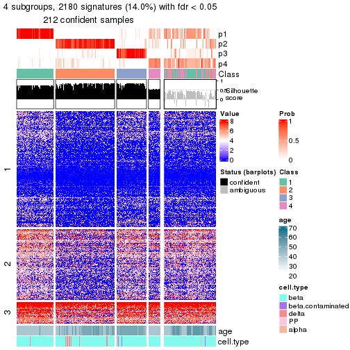</p>

</div>
</div>


Compare the overlap of signatures from different k:

```r
compare_signatures(res)
```


`get_signature()` returns a data frame invisibly. To get the list of signatures, the function
call should be assigned to a variable explicitly. In following code, if `plot` argument is set
to `FALSE`, no heatmap is plotted while only the differential analysis is performed.

```r
# code only for demonstration
tb = get_signature(res, k = ..., plot = FALSE)
```

An example of the output of `tb` is:

```
#>   which_row         fdr    mean_1    mean_2 scaled_mean_1 scaled_mean_2 km
#> 1        38 0.042760348  8.373488  9.131774    -0.5533452     0.5164555  1
#> 2        40 0.018707592  7.106213  8.469186    -0.6173731     0.5762149  1
#> 3        55 0.019134737 10.221463 11.207825    -0.6159697     0.5749050  1
#> 4        59 0.006059896  5.921854  7.869574    -0.6899429     0.6439467  1
#> 5        60 0.018055526  8.928898 10.211722    -0.6204761     0.5791110  1
#> 6        98 0.009384629 15.714769 14.887706     0.6635654    -0.6193277  2
...
```

The columns in `tb` are:

1. `which_row`: row indices corresponding to the input matrix.
2. `fdr`: FDR for the differential test. 
3. `mean_x`: The mean value in group x.
4. `scaled_mean_x`: The mean value in group x after rows are scaled.
5. `km`: Row groups if k-means clustering is applied to rows (which is done by automatically selecting number of clusters).

If there are too many signatures, `top_signatures = ...` can be set to only show the 
signatures with the highest FDRs:

```r
# code only for demonstration
# e.g. to show the top 500 most significant rows
tb = get_signature(res, k = ..., top_signatures = 500)
```

If the signatures are defined as these which are uniquely high in current group, `diff_method` argument
can be set to `"uniquely_high_in_one_group"`:

```r
# code only for demonstration
tb = get_signature(res, k = ..., diff_method = "uniquely_high_in_one_group")
```


UMAP plot which shows how samples are separated.


<script>
$( function() {
	$( '#tabs-node-021-dimension-reduction' ).tabs();
} );
</script>
<div id='tabs-node-021-dimension-reduction'>
<ul>
<li><a href='#tab-node-021-dimension-reduction-1'>k = 2</a></li>
<li><a href='#tab-node-021-dimension-reduction-2'>k = 3</a></li>
<li><a href='#tab-node-021-dimension-reduction-3'>k = 4</a></li>
</ul>
<div id='tab-node-021-dimension-reduction-1'>
<pre><code class="r">dimension_reduction(res, k = 2, method = &quot;UMAP&quot;)
</code></pre>

<p></p>

</div>
<div id='tab-node-021-dimension-reduction-2'>
<pre><code class="r">dimension_reduction(res, k = 3, method = &quot;UMAP&quot;)
</code></pre>

<p></p>

</div>
<div id='tab-node-021-dimension-reduction-3'>
<pre><code class="r">dimension_reduction(res, k = 4, method = &quot;UMAP&quot;)
</code></pre>

<p>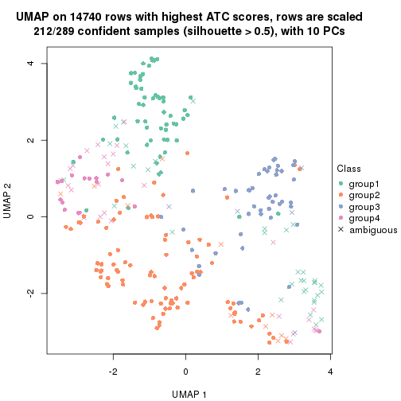</p>

</div>
</div>


Following heatmap shows how subgroups are split when increasing `k`:

```r
collect_classes(res)
```


Test correlation between subgroups and known annotations. If the known
annotation is numeric, one-way ANOVA test is applied, and if the known
annotation is discrete, chi-squared contingency table test is applied.

```r
test_to_known_factors(res)
```

```
#>             n_sample age(p-value) cell.type(p-value) k
#> ATC:skmeans      271     2.10e-01             0.1113 2
#> ATC:skmeans      270     7.39e-48             0.0520 3
#> ATC:skmeans      212          NaN             0.0028 4
```


If matrix rows can be associated to genes, consider to use `functional_enrichment(res,
...)` to perform function enrichment for the signature genes. See [this vignette](https://jokergoo.github.io/cola_vignettes/functional_enrichment.html) for more detailed explanations.


 

---------------------------------------------------


### Node0211


Parent node: [Node021](#Node021).
Child nodes: 
                Node02111-leaf
        ,
                [Node02112](#Node02112)
        ,
                Node02121-leaf
        ,
                Node02122-leaf
        ,
                Node02211-leaf
        ,
                Node02212-leaf
        ,
                Node02221-leaf
        ,
                Node02222-leaf
        ,
                [Node03211](#Node03211)
        ,
                Node03212-leaf
        ,
                Node03221-leaf
        ,
                Node03222-leaf
        .


The object with results only for a single top-value method and a single partitioning method 
can be extracted as:

```r
res = res_rh["0211"]
```

A summary of `res` and all the functions that can be applied to it:

```r
res
```

```
#> A 'ConsensusPartition' object with k = 2, 3, 4.
#>   On a matrix with 14696 rows and 147 columns.
#>   Top rows (582) are extracted by 'ATC' method.
#>   Subgroups are detected by 'skmeans' method.
#>   Performed in total 150 partitions by row resampling.
#>   Best k for subgroups seems to be 4.
#> 
#> Following methods can be applied to this 'ConsensusPartition' object:
#>  [1] "cola_report"             "collect_classes"         "collect_plots"          
#>  [4] "collect_stats"           "colnames"                "compare_partitions"     
#>  [7] "compare_signatures"      "consensus_heatmap"       "dimension_reduction"    
#> [10] "functional_enrichment"   "get_anno_col"            "get_anno"               
#> [13] "get_classes"             "get_consensus"           "get_matrix"             
#> [16] "get_membership"          "get_param"               "get_signatures"         
#> [19] "get_stats"               "is_best_k"               "is_stable_k"            
#> [22] "membership_heatmap"      "ncol"                    "nrow"                   
#> [25] "plot_ecdf"               "predict_classes"         "rownames"               
#> [28] "select_partition_number" "show"                    "suggest_best_k"         
#> [31] "test_to_known_factors"   "top_rows_heatmap"
```

`collect_plots()` function collects all the plots made from `res` for all `k` (number of subgroups)
into one single page to provide an easy and fast comparison between different `k`.

```r
collect_plots(res)
```


The plots are:

- The first row: a plot of the eCDF (empirical cumulative distribution
  function) curves of the consensus matrix for each `k` and the heatmap of
  predicted classes for each `k`.
- The second row: heatmaps of the consensus matrix for each `k`.
- The third row: heatmaps of the membership matrix for each `k`.
- The fouth row: heatmaps of the signatures for each `k`.

All the plots in panels can be made by individual functions and they are
plotted later in this section.

`select_partition_number()` produces several plots showing different
statistics for choosing "optimized" `k`. There are following statistics:

- eCDF curves of the consensus matrix for each `k`;
- 1-PAC. [The PAC score](https://en.wikipedia.org/wiki/Consensus_clustering#Over-interpretation_potential_of_consensus_clustering)
  measures the proportion of the ambiguous subgrouping.
- Mean silhouette score.
- Concordance. The mean probability of fiting the consensus subgroup labels in all
  partitions.
- Area increased. Denote $A_k$ as the area under the eCDF curve for current
  `k`, the area increased is defined as $A_k - A_{k-1}$.
- Rand index. The percent of pairs of samples that are both in a same cluster
  or both are not in a same cluster in the partition of k and k-1.
- Jaccard index. The ratio of pairs of samples are both in a same cluster in
  the partition of k and k-1 and the pairs of samples are both in a same
  cluster in the partition k or k-1.

The detailed explanations of these statistics can be found in [the _cola_
vignette](https://jokergoo.github.io/cola_vignettes/cola.html#toc_13).

Generally speaking, higher 1-PAC score, higher mean silhouette score or higher
concordance corresponds to better partition. Rand index and Jaccard index
measure how similar the current partition is compared to partition with `k-1`.
If they are too similar, we won't accept `k` is better than `k-1`.

```r
select_partition_number(res)
```

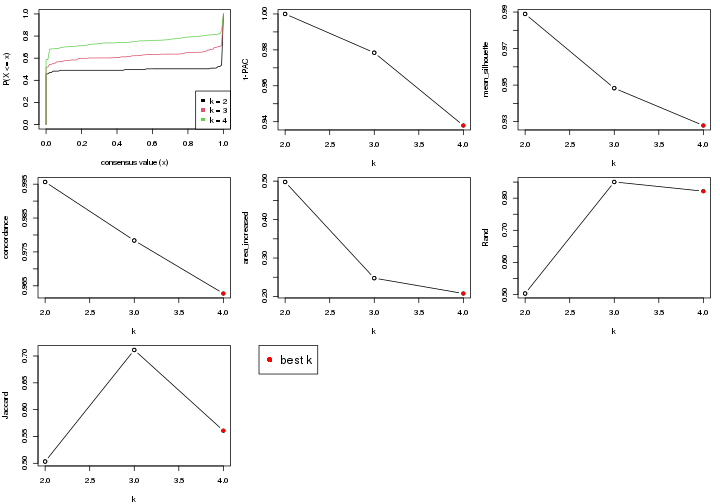

The numeric values for all these statistics can be obtained by `get_stats()`.

```r
get_stats(res)
```

```
#>   k 1-PAC mean_silhouette concordance area_increased  Rand Jaccard
#> 2 2 1.000           0.989       0.996          0.498 0.503   0.503
#> 3 3 0.978           0.948       0.978          0.248 0.850   0.711
#> 4 4 0.938           0.928       0.963          0.208 0.822   0.561
```

`suggest_best_k()` suggests the best $k$ based on these statistics. The rules are as follows:

- All $k$ with Jaccard index larger than 0.95 are removed because increasing
  $k$ does not provide enough extra information. If all $k$ are removed, it is
  marked as no subgroup is detected.
- For all $k$ with 1-PAC score larger than 0.9, the maximal $k$ is taken as
  the best $k$, and other $k$ are marked as optional $k$.
- If it does not fit the second rule. The $k$ with the maximal vote of the
  highest 1-PAC score, highest mean silhouette, and highest concordance is
  taken as the best $k$.

```r
suggest_best_k(res)
```

```
#> [1] 4
#> attr(,"optional")
#> [1] 2 3
```

There is also optional best $k$ = 2 3 that is worth to check.

Following is the table of the partitions (You need to click the **show/hide
code output** link to see it). The membership matrix (columns with name `p*`)
is inferred by
[`clue::cl_consensus()`](https://www.rdocumentation.org/link/cl_consensus?package=clue)
function with the `SE` method. Basically the value in the membership matrix
represents the probability to belong to a certain group. The finall subgroup
label for an item is determined with the group with highest probability it
belongs to.

In `get_classes()` function, the entropy is calculated from the membership
matrix and the silhouette score is calculated from the consensus matrix.


<script>
$( function() {
	$( '#tabs-node-0211-get-classes' ).tabs();
} );
</script>
<div id='tabs-node-0211-get-classes'>
<ul>
<li><a href='#tab-node-0211-get-classes-1'>k = 2</a></li>
<li><a href='#tab-node-0211-get-classes-2'>k = 3</a></li>
<li><a href='#tab-node-0211-get-classes-3'>k = 4</a></li>
</ul>

<div id='tab-node-0211-get-classes-1'>
<p><a id='tab-node-0211-get-classes-1-a' style='color:#0366d6' href='#'>show/hide code output</a></p>
<pre><code class="r">cbind(get_classes(res, k = 2), get_membership(res, k = 2))
</code></pre>

<pre><code>#&gt;             class entropy silhouette   p1   p2
#&gt; Sample_72       2   0.000      0.998 0.00 1.00
#&gt; Sample_147      2   0.000      0.998 0.00 1.00
#&gt; Sample_148      2   0.000      0.998 0.00 1.00
#&gt; Sample_149      2   0.000      0.998 0.00 1.00
#&gt; Sample_150      2   0.000      0.998 0.00 1.00
#&gt; Sample_152      2   0.000      0.998 0.00 1.00
#&gt; Sample_153      2   0.000      0.998 0.00 1.00
#&gt; Sample_154      2   0.000      0.998 0.00 1.00
#&gt; Sample_155      2   0.000      0.998 0.00 1.00
#&gt; Sample_156      2   0.000      0.998 0.00 1.00
#&gt; Sample_157      2   0.000      0.998 0.00 1.00
#&gt; Sample_158      2   0.000      0.998 0.00 1.00
#&gt; Sample_160      2   0.000      0.998 0.00 1.00
#&gt; Sample_167      2   0.000      0.998 0.00 1.00
#&gt; Sample_168      2   0.000      0.998 0.00 1.00
#&gt; Sample_170      2   0.000      0.998 0.00 1.00
#&gt; Sample_175      2   0.000      0.998 0.00 1.00
#&gt; Sample_176      2   0.000      0.998 0.00 1.00
#&gt; Sample_178      2   0.000      0.998 0.00 1.00
#&gt; Sample_181      2   0.000      0.998 0.00 1.00
#&gt; Sample_182      2   0.000      0.998 0.00 1.00
#&gt; Sample_183      2   0.000      0.998 0.00 1.00
#&gt; Sample_184      2   0.000      0.998 0.00 1.00
#&gt; Sample_185      2   0.000      0.998 0.00 1.00
#&gt; Sample_186      2   0.000      0.998 0.00 1.00
#&gt; Sample_187      2   0.000      0.998 0.00 1.00
#&gt; Sample_190      2   0.000      0.998 0.00 1.00
#&gt; Sample_193      2   0.000      0.998 0.00 1.00
#&gt; Sample_194      2   0.000      0.998 0.00 1.00
#&gt; Sample_195      2   0.000      0.998 0.00 1.00
#&gt; Sample_196      2   0.141      0.979 0.02 0.98
#&gt; Sample_516      2   0.000      0.998 0.00 1.00
#&gt; Sample_696      1   0.000      0.993 1.00 0.00
#&gt; Sample_697      1   0.000      0.993 1.00 0.00
#&gt; Sample_700      1   0.000      0.993 1.00 0.00
#&gt; Sample_702      1   0.000      0.993 1.00 0.00
#&gt; Sample_706      1   0.000      0.993 1.00 0.00
#&gt; Sample_707      1   0.000      0.993 1.00 0.00
#&gt; Sample_708      1   0.000      0.993 1.00 0.00
#&gt; Sample_709      1   0.000      0.993 1.00 0.00
#&gt; Sample_712      1   0.000      0.993 1.00 0.00
#&gt; Sample_713      1   0.000      0.993 1.00 0.00
#&gt; Sample_717      1   0.000      0.993 1.00 0.00
#&gt; Sample_718      1   0.000      0.993 1.00 0.00
#&gt; Sample_719      1   0.000      0.993 1.00 0.00
#&gt; Sample_721      1   0.000      0.993 1.00 0.00
#&gt; Sample_722      1   0.141      0.974 0.98 0.02
#&gt; Sample_724      1   0.000      0.993 1.00 0.00
#&gt; Sample_726      1   0.000      0.993 1.00 0.00
#&gt; Sample_727      1   0.000      0.993 1.00 0.00
#&gt; Sample_729      1   0.990      0.219 0.56 0.44
#&gt; Sample_730      1   0.000      0.993 1.00 0.00
#&gt; Sample_732      1   0.000      0.993 1.00 0.00
#&gt; Sample_733      1   0.000      0.993 1.00 0.00
#&gt; Sample_734      1   0.000      0.993 1.00 0.00
#&gt; Sample_736      1   0.000      0.993 1.00 0.00
#&gt; Sample_739      1   0.000      0.993 1.00 0.00
#&gt; Sample_741      1   0.000      0.993 1.00 0.00
#&gt; Sample_743      1   0.000      0.993 1.00 0.00
#&gt; Sample_744      1   0.000      0.993 1.00 0.00
#&gt; Sample_746      1   0.000      0.993 1.00 0.00
#&gt; Sample_747      1   0.000      0.993 1.00 0.00
#&gt; Sample_749      1   0.000      0.993 1.00 0.00
#&gt; Sample_750      1   0.000      0.993 1.00 0.00
#&gt; Sample_751      1   0.000      0.993 1.00 0.00
#&gt; Sample_752      1   0.000      0.993 1.00 0.00
#&gt; Sample_755      1   0.000      0.993 1.00 0.00
#&gt; Sample_756      1   0.000      0.993 1.00 0.00
#&gt; Sample_757      1   0.000      0.993 1.00 0.00
#&gt; Sample_758      1   0.000      0.993 1.00 0.00
#&gt; Sample_760      1   0.000      0.993 1.00 0.00
#&gt; Sample_761      1   0.000      0.993 1.00 0.00
#&gt; Sample_762      1   0.000      0.993 1.00 0.00
#&gt; Sample_763      1   0.000      0.993 1.00 0.00
#&gt; Sample_764      1   0.000      0.993 1.00 0.00
#&gt; Sample_765      1   0.000      0.993 1.00 0.00
#&gt; Sample_767      1   0.000      0.993 1.00 0.00
#&gt; Sample_770      1   0.000      0.993 1.00 0.00
#&gt; Sample_771      1   0.000      0.993 1.00 0.00
#&gt; Sample_773      1   0.000      0.993 1.00 0.00
#&gt; Sample_774      1   0.000      0.993 1.00 0.00
#&gt; Sample_776      1   0.000      0.993 1.00 0.00
#&gt; Sample_781      1   0.000      0.993 1.00 0.00
#&gt; Sample_787      1   0.000      0.993 1.00 0.00
#&gt; Sample_790      1   0.000      0.993 1.00 0.00
#&gt; Sample_791      1   0.000      0.993 1.00 0.00
#&gt; Sample_792      1   0.242      0.954 0.96 0.04
#&gt; Sample_794      1   0.000      0.993 1.00 0.00
#&gt; Sample_795      1   0.000      0.993 1.00 0.00
#&gt; Sample_796      1   0.000      0.993 1.00 0.00
#&gt; Sample_800      1   0.000      0.993 1.00 0.00
#&gt; Sample_801      1   0.000      0.993 1.00 0.00
#&gt; Sample_803      1   0.000      0.993 1.00 0.00
#&gt; Sample_805      1   0.000      0.993 1.00 0.00
#&gt; Sample_806      1   0.000      0.993 1.00 0.00
#&gt; Sample_807      1   0.000      0.993 1.00 0.00
#&gt; Sample_808      1   0.000      0.993 1.00 0.00
#&gt; Sample_809      1   0.000      0.993 1.00 0.00
#&gt; Sample_811      1   0.242      0.954 0.96 0.04
#&gt; Sample_812      1   0.000      0.993 1.00 0.00
#&gt; Sample_813      1   0.000      0.993 1.00 0.00
#&gt; Sample_814      1   0.000      0.993 1.00 0.00
#&gt; Sample_815      1   0.000      0.993 1.00 0.00
#&gt; Sample_816      1   0.000      0.993 1.00 0.00
#&gt; Sample_818      1   0.000      0.993 1.00 0.00
#&gt; Sample_822      1   0.000      0.993 1.00 0.00
#&gt; Sample_828      1   0.000      0.993 1.00 0.00
#&gt; Sample_831      1   0.000      0.993 1.00 0.00
#&gt; Sample_832      1   0.000      0.993 1.00 0.00
#&gt; Sample_833      1   0.000      0.993 1.00 0.00
#&gt; Sample_837      1   0.000      0.993 1.00 0.00
#&gt; Sample_838      1   0.000      0.993 1.00 0.00
#&gt; Sample_840      1   0.000      0.993 1.00 0.00
#&gt; Sample_858      2   0.000      0.998 0.00 1.00
#&gt; Sample_864      2   0.000      0.998 0.00 1.00
#&gt; Sample_868      2   0.000      0.998 0.00 1.00
#&gt; Sample_874      2   0.000      0.998 0.00 1.00
#&gt; Sample_875      2   0.000      0.998 0.00 1.00
#&gt; Sample_877      2   0.000      0.998 0.00 1.00
#&gt; Sample_878      2   0.000      0.998 0.00 1.00
#&gt; Sample_879      2   0.000      0.998 0.00 1.00
#&gt; Sample_880      2   0.000      0.998 0.00 1.00
#&gt; Sample_883      2   0.000      0.998 0.00 1.00
#&gt; Sample_884      2   0.000      0.998 0.00 1.00
#&gt; Sample_886      2   0.000      0.998 0.00 1.00
#&gt; Sample_887      2   0.000      0.998 0.00 1.00
#&gt; Sample_888      2   0.000      0.998 0.00 1.00
#&gt; Sample_896      2   0.000      0.998 0.00 1.00
#&gt; Sample_899      2   0.000      0.998 0.00 1.00
#&gt; Sample_901      2   0.000      0.998 0.00 1.00
#&gt; Sample_904      2   0.000      0.998 0.00 1.00
#&gt; Sample_905      2   0.000      0.998 0.00 1.00
#&gt; Sample_910      2   0.000      0.998 0.00 1.00
#&gt; Sample_912      2   0.000      0.998 0.00 1.00
#&gt; Sample_916      2   0.000      0.998 0.00 1.00
#&gt; Sample_921      2   0.402      0.913 0.08 0.92
#&gt; Sample_923      2   0.000      0.998 0.00 1.00
#&gt; Sample_926      2   0.000      0.998 0.00 1.00
#&gt; Sample_927      2   0.000      0.998 0.00 1.00
#&gt; Sample_928      2   0.000      0.998 0.00 1.00
#&gt; Sample_930      2   0.000      0.998 0.00 1.00
#&gt; Sample_931      2   0.000      0.998 0.00 1.00
#&gt; Sample_945      2   0.000      0.998 0.00 1.00
#&gt; Sample_946      2   0.000      0.998 0.00 1.00
#&gt; Sample_947      2   0.000      0.998 0.00 1.00
#&gt; Sample_1533     1   0.000      0.993 1.00 0.00
#&gt; Sample_1546     2   0.000      0.998 0.00 1.00
</code></pre>

<script>
$('#tab-node-0211-get-classes-1-a').parent().next().next().hide();
$('#tab-node-0211-get-classes-1-a').click(function(){
  $('#tab-node-0211-get-classes-1-a').parent().next().next().toggle();
  return(false);
});
</script>
</div>

<div id='tab-node-0211-get-classes-2'>
<p><a id='tab-node-0211-get-classes-2-a' style='color:#0366d6' href='#'>show/hide code output</a></p>
<pre><code class="r">cbind(get_classes(res, k = 3), get_membership(res, k = 3))
</code></pre>

<pre><code>#&gt;             class entropy silhouette   p1   p2   p3
#&gt; Sample_72       2  0.0000      0.973 0.00 1.00 0.00
#&gt; Sample_147      2  0.0000      0.973 0.00 1.00 0.00
#&gt; Sample_148      2  0.0000      0.973 0.00 1.00 0.00
#&gt; Sample_149      2  0.0892      0.954 0.00 0.98 0.02
#&gt; Sample_150      2  0.0000      0.973 0.00 1.00 0.00
#&gt; Sample_152      2  0.0000      0.973 0.00 1.00 0.00
#&gt; Sample_153      2  0.0000      0.973 0.00 1.00 0.00
#&gt; Sample_154      2  0.0000      0.973 0.00 1.00 0.00
#&gt; Sample_155      2  0.0000      0.973 0.00 1.00 0.00
#&gt; Sample_156      2  0.0000      0.973 0.00 1.00 0.00
#&gt; Sample_157      2  0.0000      0.973 0.00 1.00 0.00
#&gt; Sample_158      2  0.0000      0.973 0.00 1.00 0.00
#&gt; Sample_160      2  0.0000      0.973 0.00 1.00 0.00
#&gt; Sample_167      2  0.0000      0.973 0.00 1.00 0.00
#&gt; Sample_168      2  0.0000      0.973 0.00 1.00 0.00
#&gt; Sample_170      2  0.0000      0.973 0.00 1.00 0.00
#&gt; Sample_175      2  0.0000      0.973 0.00 1.00 0.00
#&gt; Sample_176      2  0.0000      0.973 0.00 1.00 0.00
#&gt; Sample_178      2  0.0000      0.973 0.00 1.00 0.00
#&gt; Sample_181      2  0.0000      0.973 0.00 1.00 0.00
#&gt; Sample_182      2  0.0000      0.973 0.00 1.00 0.00
#&gt; Sample_183      2  0.0000      0.973 0.00 1.00 0.00
#&gt; Sample_184      2  0.0000      0.973 0.00 1.00 0.00
#&gt; Sample_185      2  0.0000      0.973 0.00 1.00 0.00
#&gt; Sample_186      2  0.0000      0.973 0.00 1.00 0.00
#&gt; Sample_187      2  0.0000      0.973 0.00 1.00 0.00
#&gt; Sample_190      2  0.0000      0.973 0.00 1.00 0.00
#&gt; Sample_193      2  0.0000      0.973 0.00 1.00 0.00
#&gt; Sample_194      2  0.0000      0.973 0.00 1.00 0.00
#&gt; Sample_195      2  0.0000      0.973 0.00 1.00 0.00
#&gt; Sample_196      2  0.0000      0.973 0.00 1.00 0.00
#&gt; Sample_516      2  0.0000      0.973 0.00 1.00 0.00
#&gt; Sample_696      3  0.0892      0.968 0.02 0.00 0.98
#&gt; Sample_697      1  0.0000      0.973 1.00 0.00 0.00
#&gt; Sample_700      1  0.6280      0.178 0.54 0.00 0.46
#&gt; Sample_702      1  0.0000      0.973 1.00 0.00 0.00
#&gt; Sample_706      1  0.0000      0.973 1.00 0.00 0.00
#&gt; Sample_707      1  0.2959      0.882 0.90 0.00 0.10
#&gt; Sample_708      1  0.0000      0.973 1.00 0.00 0.00
#&gt; Sample_709      1  0.5016      0.691 0.76 0.00 0.24
#&gt; Sample_712      1  0.0000      0.973 1.00 0.00 0.00
#&gt; Sample_713      1  0.0000      0.973 1.00 0.00 0.00
#&gt; Sample_717      1  0.0000      0.973 1.00 0.00 0.00
#&gt; Sample_718      1  0.0000      0.973 1.00 0.00 0.00
#&gt; Sample_719      1  0.0000      0.973 1.00 0.00 0.00
#&gt; Sample_721      1  0.0000      0.973 1.00 0.00 0.00
#&gt; Sample_722      3  0.0000      0.989 0.00 0.00 1.00
#&gt; Sample_724      1  0.0000      0.973 1.00 0.00 0.00
#&gt; Sample_726      1  0.0000      0.973 1.00 0.00 0.00
#&gt; Sample_727      1  0.0000      0.973 1.00 0.00 0.00
#&gt; Sample_729      3  0.2414      0.934 0.04 0.02 0.94
#&gt; Sample_730      1  0.0000      0.973 1.00 0.00 0.00
#&gt; Sample_732      1  0.0000      0.973 1.00 0.00 0.00
#&gt; Sample_733      1  0.0000      0.973 1.00 0.00 0.00
#&gt; Sample_734      1  0.0000      0.973 1.00 0.00 0.00
#&gt; Sample_736      1  0.0000      0.973 1.00 0.00 0.00
#&gt; Sample_739      1  0.0000      0.973 1.00 0.00 0.00
#&gt; Sample_741      1  0.0000      0.973 1.00 0.00 0.00
#&gt; Sample_743      1  0.0000      0.973 1.00 0.00 0.00
#&gt; Sample_744      1  0.0000      0.973 1.00 0.00 0.00
#&gt; Sample_746      1  0.0000      0.973 1.00 0.00 0.00
#&gt; Sample_747      1  0.0000      0.973 1.00 0.00 0.00
#&gt; Sample_749      1  0.0000      0.973 1.00 0.00 0.00
#&gt; Sample_750      1  0.2066      0.922 0.94 0.00 0.06
#&gt; Sample_751      1  0.0000      0.973 1.00 0.00 0.00
#&gt; Sample_752      1  0.0000      0.973 1.00 0.00 0.00
#&gt; Sample_755      1  0.0000      0.973 1.00 0.00 0.00
#&gt; Sample_756      1  0.0000      0.973 1.00 0.00 0.00
#&gt; Sample_757      1  0.0000      0.973 1.00 0.00 0.00
#&gt; Sample_758      1  0.0000      0.973 1.00 0.00 0.00
#&gt; Sample_760      1  0.0000      0.973 1.00 0.00 0.00
#&gt; Sample_761      1  0.0000      0.973 1.00 0.00 0.00
#&gt; Sample_762      1  0.0000      0.973 1.00 0.00 0.00
#&gt; Sample_763      1  0.0000      0.973 1.00 0.00 0.00
#&gt; Sample_764      1  0.0000      0.973 1.00 0.00 0.00
#&gt; Sample_765      1  0.0000      0.973 1.00 0.00 0.00
#&gt; Sample_767      1  0.0000      0.973 1.00 0.00 0.00
#&gt; Sample_770      3  0.2066      0.919 0.06 0.00 0.94
#&gt; Sample_771      1  0.0000      0.973 1.00 0.00 0.00
#&gt; Sample_773      1  0.0000      0.973 1.00 0.00 0.00
#&gt; Sample_774      1  0.0000      0.973 1.00 0.00 0.00
#&gt; Sample_776      1  0.0000      0.973 1.00 0.00 0.00
#&gt; Sample_781      1  0.0000      0.973 1.00 0.00 0.00
#&gt; Sample_787      1  0.1529      0.940 0.96 0.04 0.00
#&gt; Sample_790      1  0.0000      0.973 1.00 0.00 0.00
#&gt; Sample_791      1  0.0000      0.973 1.00 0.00 0.00
#&gt; Sample_792      1  0.9059      0.134 0.48 0.14 0.38
#&gt; Sample_794      1  0.0000      0.973 1.00 0.00 0.00
#&gt; Sample_795      1  0.0000      0.973 1.00 0.00 0.00
#&gt; Sample_796      1  0.0000      0.973 1.00 0.00 0.00
#&gt; Sample_800      1  0.2066      0.922 0.94 0.06 0.00
#&gt; Sample_801      1  0.0000      0.973 1.00 0.00 0.00
#&gt; Sample_803      1  0.0000      0.973 1.00 0.00 0.00
#&gt; Sample_805      1  0.0000      0.973 1.00 0.00 0.00
#&gt; Sample_806      1  0.2959      0.882 0.90 0.10 0.00
#&gt; Sample_807      1  0.0000      0.973 1.00 0.00 0.00
#&gt; Sample_808      1  0.0000      0.973 1.00 0.00 0.00
#&gt; Sample_809      1  0.0000      0.973 1.00 0.00 0.00
#&gt; Sample_811      2  0.6984      0.229 0.42 0.56 0.02
#&gt; Sample_812      1  0.0892      0.957 0.98 0.02 0.00
#&gt; Sample_813      1  0.2537      0.903 0.92 0.08 0.00
#&gt; Sample_814      1  0.0000      0.973 1.00 0.00 0.00
#&gt; Sample_815      1  0.0000      0.973 1.00 0.00 0.00
#&gt; Sample_816      1  0.0000      0.973 1.00 0.00 0.00
#&gt; Sample_818      1  0.0000      0.973 1.00 0.00 0.00
#&gt; Sample_822      1  0.0000      0.973 1.00 0.00 0.00
#&gt; Sample_828      1  0.0000      0.973 1.00 0.00 0.00
#&gt; Sample_831      1  0.0000      0.973 1.00 0.00 0.00
#&gt; Sample_832      1  0.0000      0.973 1.00 0.00 0.00
#&gt; Sample_833      1  0.5406      0.732 0.78 0.20 0.02
#&gt; Sample_837      1  0.0000      0.973 1.00 0.00 0.00
#&gt; Sample_838      1  0.0000      0.973 1.00 0.00 0.00
#&gt; Sample_840      1  0.0000      0.973 1.00 0.00 0.00
#&gt; Sample_858      3  0.0892      0.972 0.00 0.02 0.98
#&gt; Sample_864      3  0.0000      0.989 0.00 0.00 1.00
#&gt; Sample_868      3  0.0000      0.989 0.00 0.00 1.00
#&gt; Sample_874      3  0.0000      0.989 0.00 0.00 1.00
#&gt; Sample_875      3  0.0000      0.989 0.00 0.00 1.00
#&gt; Sample_877      3  0.0000      0.989 0.00 0.00 1.00
#&gt; Sample_878      3  0.0000      0.989 0.00 0.00 1.00
#&gt; Sample_879      3  0.0000      0.989 0.00 0.00 1.00
#&gt; Sample_880      3  0.0000      0.989 0.00 0.00 1.00
#&gt; Sample_883      3  0.0000      0.989 0.00 0.00 1.00
#&gt; Sample_884      3  0.0000      0.989 0.00 0.00 1.00
#&gt; Sample_886      3  0.4291      0.778 0.00 0.18 0.82
#&gt; Sample_887      3  0.0000      0.989 0.00 0.00 1.00
#&gt; Sample_888      3  0.0000      0.989 0.00 0.00 1.00
#&gt; Sample_896      3  0.0000      0.989 0.00 0.00 1.00
#&gt; Sample_899      3  0.0000      0.989 0.00 0.00 1.00
#&gt; Sample_901      3  0.0000      0.989 0.00 0.00 1.00
#&gt; Sample_904      3  0.0000      0.989 0.00 0.00 1.00
#&gt; Sample_905      3  0.0000      0.989 0.00 0.00 1.00
#&gt; Sample_910      3  0.0000      0.989 0.00 0.00 1.00
#&gt; Sample_912      3  0.0000      0.989 0.00 0.00 1.00
#&gt; Sample_916      3  0.0000      0.989 0.00 0.00 1.00
#&gt; Sample_921      2  0.8219      0.559 0.18 0.64 0.18
#&gt; Sample_923      3  0.0000      0.989 0.00 0.00 1.00
#&gt; Sample_926      3  0.0000      0.989 0.00 0.00 1.00
#&gt; Sample_927      3  0.0000      0.989 0.00 0.00 1.00
#&gt; Sample_928      3  0.0000      0.989 0.00 0.00 1.00
#&gt; Sample_930      3  0.0000      0.989 0.00 0.00 1.00
#&gt; Sample_931      3  0.0000      0.989 0.00 0.00 1.00
#&gt; Sample_945      3  0.0000      0.989 0.00 0.00 1.00
#&gt; Sample_946      3  0.0000      0.989 0.00 0.00 1.00
#&gt; Sample_947      3  0.0000      0.989 0.00 0.00 1.00
#&gt; Sample_1533     1  0.3340      0.858 0.88 0.12 0.00
#&gt; Sample_1546     3  0.0000      0.989 0.00 0.00 1.00
</code></pre>

<script>
$('#tab-node-0211-get-classes-2-a').parent().next().next().hide();
$('#tab-node-0211-get-classes-2-a').click(function(){
  $('#tab-node-0211-get-classes-2-a').parent().next().next().toggle();
  return(false);
});
</script>
</div>

<div id='tab-node-0211-get-classes-3'>
<p><a id='tab-node-0211-get-classes-3-a' style='color:#0366d6' href='#'>show/hide code output</a></p>
<pre><code class="r">cbind(get_classes(res, k = 4), get_membership(res, k = 4))
</code></pre>

<pre><code>#&gt;             class entropy silhouette   p1   p2   p3   p4
#&gt; Sample_72       2  0.0707    0.99680 0.00 0.98 0.02 0.00
#&gt; Sample_147      2  0.0707    0.99680 0.00 0.98 0.02 0.00
#&gt; Sample_148      2  0.0707    0.97668 0.00 0.98 0.00 0.02
#&gt; Sample_149      2  0.0707    0.99680 0.00 0.98 0.02 0.00
#&gt; Sample_150      2  0.0707    0.99680 0.00 0.98 0.02 0.00
#&gt; Sample_152      2  0.0707    0.99680 0.00 0.98 0.02 0.00
#&gt; Sample_153      2  0.0707    0.99680 0.00 0.98 0.02 0.00
#&gt; Sample_154      2  0.0707    0.99680 0.00 0.98 0.02 0.00
#&gt; Sample_155      2  0.0707    0.99680 0.00 0.98 0.02 0.00
#&gt; Sample_156      2  0.0707    0.99680 0.00 0.98 0.02 0.00
#&gt; Sample_157      2  0.0707    0.99680 0.00 0.98 0.02 0.00
#&gt; Sample_158      2  0.0707    0.99680 0.00 0.98 0.02 0.00
#&gt; Sample_160      2  0.0707    0.99680 0.00 0.98 0.02 0.00
#&gt; Sample_167      2  0.0707    0.99680 0.00 0.98 0.02 0.00
#&gt; Sample_168      2  0.0707    0.99680 0.00 0.98 0.02 0.00
#&gt; Sample_170      2  0.0707    0.99680 0.00 0.98 0.02 0.00
#&gt; Sample_175      2  0.0707    0.99680 0.00 0.98 0.02 0.00
#&gt; Sample_176      2  0.0707    0.97642 0.02 0.98 0.00 0.00
#&gt; Sample_178      2  0.0707    0.99680 0.00 0.98 0.02 0.00
#&gt; Sample_181      2  0.0707    0.99680 0.00 0.98 0.02 0.00
#&gt; Sample_182      2  0.0707    0.99680 0.00 0.98 0.02 0.00
#&gt; Sample_183      2  0.0707    0.99680 0.00 0.98 0.02 0.00
#&gt; Sample_184      2  0.0707    0.99680 0.00 0.98 0.02 0.00
#&gt; Sample_185      2  0.0707    0.99680 0.00 0.98 0.02 0.00
#&gt; Sample_186      2  0.0707    0.99680 0.00 0.98 0.02 0.00
#&gt; Sample_187      2  0.0707    0.99680 0.00 0.98 0.02 0.00
#&gt; Sample_190      2  0.0707    0.99680 0.00 0.98 0.02 0.00
#&gt; Sample_193      2  0.0707    0.99680 0.00 0.98 0.02 0.00
#&gt; Sample_194      2  0.0707    0.97668 0.00 0.98 0.00 0.02
#&gt; Sample_195      2  0.0707    0.99680 0.00 0.98 0.02 0.00
#&gt; Sample_196      2  0.0707    0.97668 0.00 0.98 0.00 0.02
#&gt; Sample_516      2  0.0707    0.99680 0.00 0.98 0.02 0.00
#&gt; Sample_696      1  0.3975    0.67865 0.76 0.00 0.24 0.00
#&gt; Sample_697      4  0.0000    0.96654 0.00 0.00 0.00 1.00
#&gt; Sample_700      1  0.0000    0.92156 1.00 0.00 0.00 0.00
#&gt; Sample_702      1  0.0707    0.91982 0.98 0.02 0.00 0.00
#&gt; Sample_706      4  0.4284    0.70629 0.20 0.02 0.00 0.78
#&gt; Sample_707      1  0.0000    0.92156 1.00 0.00 0.00 0.00
#&gt; Sample_708      4  0.0000    0.96654 0.00 0.00 0.00 1.00
#&gt; Sample_709      4  0.0000    0.96654 0.00 0.00 0.00 1.00
#&gt; Sample_712      1  0.5173    0.55512 0.66 0.02 0.00 0.32
#&gt; Sample_713      4  0.0000    0.96654 0.00 0.00 0.00 1.00
#&gt; Sample_717      1  0.2706    0.87582 0.90 0.02 0.00 0.08
#&gt; Sample_718      1  0.5606    0.12126 0.50 0.02 0.00 0.48
#&gt; Sample_719      4  0.0000    0.96654 0.00 0.00 0.00 1.00
#&gt; Sample_721      4  0.0000    0.96654 0.00 0.00 0.00 1.00
#&gt; Sample_722      1  0.3801    0.70620 0.78 0.00 0.22 0.00
#&gt; Sample_724      4  0.0000    0.96654 0.00 0.00 0.00 1.00
#&gt; Sample_726      4  0.0707    0.94982 0.02 0.00 0.00 0.98
#&gt; Sample_727      1  0.0000    0.92156 1.00 0.00 0.00 0.00
#&gt; Sample_729      1  0.0000    0.92156 1.00 0.00 0.00 0.00
#&gt; Sample_730      4  0.0000    0.96654 0.00 0.00 0.00 1.00
#&gt; Sample_732      1  0.0000    0.92156 1.00 0.00 0.00 0.00
#&gt; Sample_733      4  0.0000    0.96654 0.00 0.00 0.00 1.00
#&gt; Sample_734      4  0.0000    0.96654 0.00 0.00 0.00 1.00
#&gt; Sample_736      4  0.0000    0.96654 0.00 0.00 0.00 1.00
#&gt; Sample_739      4  0.0000    0.96654 0.00 0.00 0.00 1.00
#&gt; Sample_741      1  0.3975    0.69766 0.76 0.00 0.00 0.24
#&gt; Sample_743      1  0.0000    0.92156 1.00 0.00 0.00 0.00
#&gt; Sample_744      4  0.0000    0.96654 0.00 0.00 0.00 1.00
#&gt; Sample_746      1  0.4406    0.60357 0.70 0.00 0.00 0.30
#&gt; Sample_747      1  0.4079    0.77521 0.80 0.02 0.00 0.18
#&gt; Sample_749      1  0.0000    0.92156 1.00 0.00 0.00 0.00
#&gt; Sample_750      1  0.3037    0.85848 0.88 0.02 0.00 0.10
#&gt; Sample_751      1  0.0000    0.92156 1.00 0.00 0.00 0.00
#&gt; Sample_752      4  0.0000    0.96654 0.00 0.00 0.00 1.00
#&gt; Sample_755      1  0.1411    0.91307 0.96 0.02 0.00 0.02
#&gt; Sample_756      4  0.0000    0.96654 0.00 0.00 0.00 1.00
#&gt; Sample_757      4  0.0000    0.96654 0.00 0.00 0.00 1.00
#&gt; Sample_758      1  0.0000    0.92156 1.00 0.00 0.00 0.00
#&gt; Sample_760      1  0.0000    0.92156 1.00 0.00 0.00 0.00
#&gt; Sample_761      4  0.4994    0.00715 0.48 0.00 0.00 0.52
#&gt; Sample_762      4  0.0000    0.96654 0.00 0.00 0.00 1.00
#&gt; Sample_763      1  0.2011    0.87617 0.92 0.00 0.00 0.08
#&gt; Sample_764      4  0.0000    0.96654 0.00 0.00 0.00 1.00
#&gt; Sample_765      1  0.0707    0.91982 0.98 0.02 0.00 0.00
#&gt; Sample_767      4  0.0000    0.96654 0.00 0.00 0.00 1.00
#&gt; Sample_770      1  0.0000    0.92156 1.00 0.00 0.00 0.00
#&gt; Sample_771      4  0.0000    0.96654 0.00 0.00 0.00 1.00
#&gt; Sample_773      4  0.0000    0.96654 0.00 0.00 0.00 1.00
#&gt; Sample_774      1  0.5487    0.38013 0.58 0.02 0.00 0.40
#&gt; Sample_776      4  0.4406    0.54663 0.30 0.00 0.00 0.70
#&gt; Sample_781      1  0.0707    0.91982 0.98 0.02 0.00 0.00
#&gt; Sample_787      1  0.0707    0.91982 0.98 0.02 0.00 0.00
#&gt; Sample_790      1  0.0000    0.92156 1.00 0.00 0.00 0.00
#&gt; Sample_791      4  0.0000    0.96654 0.00 0.00 0.00 1.00
#&gt; Sample_792      1  0.0707    0.91982 0.98 0.02 0.00 0.00
#&gt; Sample_794      4  0.0000    0.96654 0.00 0.00 0.00 1.00
#&gt; Sample_795      4  0.0000    0.96654 0.00 0.00 0.00 1.00
#&gt; Sample_796      4  0.0000    0.96654 0.00 0.00 0.00 1.00
#&gt; Sample_800      1  0.0707    0.91982 0.98 0.02 0.00 0.00
#&gt; Sample_801      4  0.0000    0.96654 0.00 0.00 0.00 1.00
#&gt; Sample_803      1  0.0000    0.92156 1.00 0.00 0.00 0.00
#&gt; Sample_805      4  0.0000    0.96654 0.00 0.00 0.00 1.00
#&gt; Sample_806      1  0.0707    0.91982 0.98 0.02 0.00 0.00
#&gt; Sample_807      1  0.0707    0.91982 0.98 0.02 0.00 0.00
#&gt; Sample_808      1  0.0000    0.92156 1.00 0.00 0.00 0.00
#&gt; Sample_809      1  0.0000    0.92156 1.00 0.00 0.00 0.00
#&gt; Sample_811      1  0.0707    0.91982 0.98 0.02 0.00 0.00
#&gt; Sample_812      1  0.0000    0.92156 1.00 0.00 0.00 0.00
#&gt; Sample_813      1  0.0707    0.91982 0.98 0.02 0.00 0.00
#&gt; Sample_814      4  0.0000    0.96654 0.00 0.00 0.00 1.00
#&gt; Sample_815      1  0.0707    0.91982 0.98 0.02 0.00 0.00
#&gt; Sample_816      1  0.2345    0.85959 0.90 0.00 0.00 0.10
#&gt; Sample_818      4  0.0000    0.96654 0.00 0.00 0.00 1.00
#&gt; Sample_822      4  0.3335    0.82435 0.12 0.02 0.00 0.86
#&gt; Sample_828      1  0.0000    0.92156 1.00 0.00 0.00 0.00
#&gt; Sample_831      4  0.0000    0.96654 0.00 0.00 0.00 1.00
#&gt; Sample_832      4  0.0000    0.96654 0.00 0.00 0.00 1.00
#&gt; Sample_833      1  0.0707    0.91982 0.98 0.02 0.00 0.00
#&gt; Sample_837      1  0.4797    0.66351 0.72 0.02 0.00 0.26
#&gt; Sample_838      1  0.1913    0.90143 0.94 0.02 0.00 0.04
#&gt; Sample_840      4  0.0000    0.96654 0.00 0.00 0.00 1.00
#&gt; Sample_858      3  0.3172    0.80881 0.00 0.00 0.84 0.16
#&gt; Sample_864      3  0.0000    0.99322 0.00 0.00 1.00 0.00
#&gt; Sample_868      3  0.0000    0.99322 0.00 0.00 1.00 0.00
#&gt; Sample_874      3  0.0000    0.99322 0.00 0.00 1.00 0.00
#&gt; Sample_875      3  0.0000    0.99322 0.00 0.00 1.00 0.00
#&gt; Sample_877      3  0.0000    0.99322 0.00 0.00 1.00 0.00
#&gt; Sample_878      3  0.0000    0.99322 0.00 0.00 1.00 0.00
#&gt; Sample_879      3  0.0000    0.99322 0.00 0.00 1.00 0.00
#&gt; Sample_880      3  0.0000    0.99322 0.00 0.00 1.00 0.00
#&gt; Sample_883      3  0.0000    0.99322 0.00 0.00 1.00 0.00
#&gt; Sample_884      3  0.0000    0.99322 0.00 0.00 1.00 0.00
#&gt; Sample_886      3  0.1211    0.95345 0.00 0.04 0.96 0.00
#&gt; Sample_887      3  0.0000    0.99322 0.00 0.00 1.00 0.00
#&gt; Sample_888      3  0.0000    0.99322 0.00 0.00 1.00 0.00
#&gt; Sample_896      3  0.0000    0.99322 0.00 0.00 1.00 0.00
#&gt; Sample_899      3  0.0000    0.99322 0.00 0.00 1.00 0.00
#&gt; Sample_901      3  0.0000    0.99322 0.00 0.00 1.00 0.00
#&gt; Sample_904      3  0.0000    0.99322 0.00 0.00 1.00 0.00
#&gt; Sample_905      3  0.0000    0.99322 0.00 0.00 1.00 0.00
#&gt; Sample_910      3  0.0000    0.99322 0.00 0.00 1.00 0.00
#&gt; Sample_912      3  0.0000    0.99322 0.00 0.00 1.00 0.00
#&gt; Sample_916      3  0.0000    0.99322 0.00 0.00 1.00 0.00
#&gt; Sample_921      4  0.0000    0.96654 0.00 0.00 0.00 1.00
#&gt; Sample_923      3  0.0000    0.99322 0.00 0.00 1.00 0.00
#&gt; Sample_926      3  0.0000    0.99322 0.00 0.00 1.00 0.00
#&gt; Sample_927      3  0.0000    0.99322 0.00 0.00 1.00 0.00
#&gt; Sample_928      3  0.0000    0.99322 0.00 0.00 1.00 0.00
#&gt; Sample_930      3  0.0000    0.99322 0.00 0.00 1.00 0.00
#&gt; Sample_931      3  0.0000    0.99322 0.00 0.00 1.00 0.00
#&gt; Sample_945      3  0.0000    0.99322 0.00 0.00 1.00 0.00
#&gt; Sample_946      3  0.0000    0.99322 0.00 0.00 1.00 0.00
#&gt; Sample_947      3  0.0000    0.99322 0.00 0.00 1.00 0.00
#&gt; Sample_1533     1  0.0000    0.92156 1.00 0.00 0.00 0.00
#&gt; Sample_1546     3  0.0000    0.99322 0.00 0.00 1.00 0.00
</code></pre>

<script>
$('#tab-node-0211-get-classes-3-a').parent().next().next().hide();
$('#tab-node-0211-get-classes-3-a').click(function(){
  $('#tab-node-0211-get-classes-3-a').parent().next().next().toggle();
  return(false);
});
</script>
</div>
</div>

Heatmaps for the consensus matrix. It visualizes the probability of two
samples to be in a same group.


<script>
$( function() {
	$( '#tabs-node-0211-consensus-heatmap' ).tabs();
} );
</script>
<div id='tabs-node-0211-consensus-heatmap'>
<ul>
<li><a href='#tab-node-0211-consensus-heatmap-1'>k = 2</a></li>
<li><a href='#tab-node-0211-consensus-heatmap-2'>k = 3</a></li>
<li><a href='#tab-node-0211-consensus-heatmap-3'>k = 4</a></li>
</ul>
<div id='tab-node-0211-consensus-heatmap-1'>
<pre><code class="r">consensus_heatmap(res, k = 2)
</code></pre>

<p></p>

</div>
<div id='tab-node-0211-consensus-heatmap-2'>
<pre><code class="r">consensus_heatmap(res, k = 3)
</code></pre>

<p></p>

</div>
<div id='tab-node-0211-consensus-heatmap-3'>
<pre><code class="r">consensus_heatmap(res, k = 4)
</code></pre>

<p></p>

</div>
</div>

Heatmaps for the membership of samples in all partitions to see how consistent they are:


<script>
$( function() {
	$( '#tabs-node-0211-membership-heatmap' ).tabs();
} );
</script>
<div id='tabs-node-0211-membership-heatmap'>
<ul>
<li><a href='#tab-node-0211-membership-heatmap-1'>k = 2</a></li>
<li><a href='#tab-node-0211-membership-heatmap-2'>k = 3</a></li>
<li><a href='#tab-node-0211-membership-heatmap-3'>k = 4</a></li>
</ul>
<div id='tab-node-0211-membership-heatmap-1'>
<pre><code class="r">membership_heatmap(res, k = 2)
</code></pre>

<p></p>

</div>
<div id='tab-node-0211-membership-heatmap-2'>
<pre><code class="r">membership_heatmap(res, k = 3)
</code></pre>

<p></p>

</div>
<div id='tab-node-0211-membership-heatmap-3'>
<pre><code class="r">membership_heatmap(res, k = 4)
</code></pre>

<p></p>

</div>
</div>

As soon as the classes for columns are determined, the signatures
that are significantly different between subgroups can be looked for. 
Following are the heatmaps for signatures.


Signature heatmaps where rows are scaled:


<script>
$( function() {
	$( '#tabs-node-0211-get-signatures' ).tabs();
} );
</script>
<div id='tabs-node-0211-get-signatures'>
<ul>
<li><a href='#tab-node-0211-get-signatures-1'>k = 2</a></li>
<li><a href='#tab-node-0211-get-signatures-2'>k = 3</a></li>
<li><a href='#tab-node-0211-get-signatures-3'>k = 4</a></li>
</ul>
<div id='tab-node-0211-get-signatures-1'>
<pre><code class="r">get_signatures(res, k = 2)
</code></pre>

<p></p>

</div>
<div id='tab-node-0211-get-signatures-2'>
<pre><code class="r">get_signatures(res, k = 3)
</code></pre>

<p></p>

</div>
<div id='tab-node-0211-get-signatures-3'>
<pre><code class="r">get_signatures(res, k = 4)
</code></pre>

<p></p>

</div>
</div>


Signature heatmaps where rows are not scaled:


<script>
$( function() {
	$( '#tabs-node-0211-get-signatures-no-scale' ).tabs();
} );
</script>
<div id='tabs-node-0211-get-signatures-no-scale'>
<ul>
<li><a href='#tab-node-0211-get-signatures-no-scale-1'>k = 2</a></li>
<li><a href='#tab-node-0211-get-signatures-no-scale-2'>k = 3</a></li>
<li><a href='#tab-node-0211-get-signatures-no-scale-3'>k = 4</a></li>
</ul>
<div id='tab-node-0211-get-signatures-no-scale-1'>
<pre><code class="r">get_signatures(res, k = 2, scale_rows = FALSE)
</code></pre>

<p></p>

</div>
<div id='tab-node-0211-get-signatures-no-scale-2'>
<pre><code class="r">get_signatures(res, k = 3, scale_rows = FALSE)
</code></pre>

<p></p>

</div>
<div id='tab-node-0211-get-signatures-no-scale-3'>
<pre><code class="r">get_signatures(res, k = 4, scale_rows = FALSE)
</code></pre>

<p></p>

</div>
</div>


Compare the overlap of signatures from different k:

```r
compare_signatures(res)
```


`get_signature()` returns a data frame invisibly. To get the list of signatures, the function
call should be assigned to a variable explicitly. In following code, if `plot` argument is set
to `FALSE`, no heatmap is plotted while only the differential analysis is performed.

```r
# code only for demonstration
tb = get_signature(res, k = ..., plot = FALSE)
```

An example of the output of `tb` is:

```
#>   which_row         fdr    mean_1    mean_2 scaled_mean_1 scaled_mean_2 km
#> 1        38 0.042760348  8.373488  9.131774    -0.5533452     0.5164555  1
#> 2        40 0.018707592  7.106213  8.469186    -0.6173731     0.5762149  1
#> 3        55 0.019134737 10.221463 11.207825    -0.6159697     0.5749050  1
#> 4        59 0.006059896  5.921854  7.869574    -0.6899429     0.6439467  1
#> 5        60 0.018055526  8.928898 10.211722    -0.6204761     0.5791110  1
#> 6        98 0.009384629 15.714769 14.887706     0.6635654    -0.6193277  2
...
```

The columns in `tb` are:

1. `which_row`: row indices corresponding to the input matrix.
2. `fdr`: FDR for the differential test. 
3. `mean_x`: The mean value in group x.
4. `scaled_mean_x`: The mean value in group x after rows are scaled.
5. `km`: Row groups if k-means clustering is applied to rows (which is done by automatically selecting number of clusters).

If there are too many signatures, `top_signatures = ...` can be set to only show the 
signatures with the highest FDRs:

```r
# code only for demonstration
# e.g. to show the top 500 most significant rows
tb = get_signature(res, k = ..., top_signatures = 500)
```

If the signatures are defined as these which are uniquely high in current group, `diff_method` argument
can be set to `"uniquely_high_in_one_group"`:

```r
# code only for demonstration
tb = get_signature(res, k = ..., diff_method = "uniquely_high_in_one_group")
```


UMAP plot which shows how samples are separated.


<script>
$( function() {
	$( '#tabs-node-0211-dimension-reduction' ).tabs();
} );
</script>
<div id='tabs-node-0211-dimension-reduction'>
<ul>
<li><a href='#tab-node-0211-dimension-reduction-1'>k = 2</a></li>
<li><a href='#tab-node-0211-dimension-reduction-2'>k = 3</a></li>
<li><a href='#tab-node-0211-dimension-reduction-3'>k = 4</a></li>
</ul>
<div id='tab-node-0211-dimension-reduction-1'>
<pre><code class="r">dimension_reduction(res, k = 2, method = &quot;UMAP&quot;)
</code></pre>

<p></p>

</div>
<div id='tab-node-0211-dimension-reduction-2'>
<pre><code class="r">dimension_reduction(res, k = 3, method = &quot;UMAP&quot;)
</code></pre>

<p></p>

</div>
<div id='tab-node-0211-dimension-reduction-3'>
<pre><code class="r">dimension_reduction(res, k = 4, method = &quot;UMAP&quot;)
</code></pre>

<p></p>

</div>
</div>


Following heatmap shows how subgroups are split when increasing `k`:

```r
collect_classes(res)
```


Test correlation between subgroups and known annotations. If the known
annotation is numeric, one-way ANOVA test is applied, and if the known
annotation is discrete, chi-squared contingency table test is applied.

```r
test_to_known_factors(res)
```

```
#>             n_sample age(p-value) cell.type(p-value) k
#> ATC:skmeans      146          NaN              0.726 2
#> ATC:skmeans      144          NaN              0.505 3
#> ATC:skmeans      144          NaN              0.569 4
```


If matrix rows can be associated to genes, consider to use `functional_enrichment(res,
...)` to perform function enrichment for the signature genes. See [this vignette](https://jokergoo.github.io/cola_vignettes/functional_enrichment.html) for more detailed explanations.


 

---------------------------------------------------


### Node02112


Parent node: [Node0211](#Node0211).
Child nodes: 
                Node021121-leaf
        ,
                Node021122-leaf
        ,
                Node032111-leaf
        ,
                Node032112-leaf
        .


The object with results only for a single top-value method and a single partitioning method 
can be extracted as:

```r
res = res_rh["02112"]
```

A summary of `res` and all the functions that can be applied to it:

```r
res
```

```
#> A 'ConsensusPartition' object with k = 2, 3, 4.
#>   On a matrix with 14549 rows and 65 columns.
#>   Top rows (502) are extracted by 'ATC' method.
#>   Subgroups are detected by 'skmeans' method.
#>   Performed in total 150 partitions by row resampling.
#>   Best k for subgroups seems to be 2.
#> 
#> Following methods can be applied to this 'ConsensusPartition' object:
#>  [1] "cola_report"             "collect_classes"         "collect_plots"          
#>  [4] "collect_stats"           "colnames"                "compare_partitions"     
#>  [7] "compare_signatures"      "consensus_heatmap"       "dimension_reduction"    
#> [10] "functional_enrichment"   "get_anno_col"            "get_anno"               
#> [13] "get_classes"             "get_consensus"           "get_matrix"             
#> [16] "get_membership"          "get_param"               "get_signatures"         
#> [19] "get_stats"               "is_best_k"               "is_stable_k"            
#> [22] "membership_heatmap"      "ncol"                    "nrow"                   
#> [25] "plot_ecdf"               "predict_classes"         "rownames"               
#> [28] "select_partition_number" "show"                    "suggest_best_k"         
#> [31] "test_to_known_factors"   "top_rows_heatmap"
```

`collect_plots()` function collects all the plots made from `res` for all `k` (number of subgroups)
into one single page to provide an easy and fast comparison between different `k`.

```r
collect_plots(res)
```


The plots are:

- The first row: a plot of the eCDF (empirical cumulative distribution
  function) curves of the consensus matrix for each `k` and the heatmap of
  predicted classes for each `k`.
- The second row: heatmaps of the consensus matrix for each `k`.
- The third row: heatmaps of the membership matrix for each `k`.
- The fouth row: heatmaps of the signatures for each `k`.

All the plots in panels can be made by individual functions and they are
plotted later in this section.

`select_partition_number()` produces several plots showing different
statistics for choosing "optimized" `k`. There are following statistics:

- eCDF curves of the consensus matrix for each `k`;
- 1-PAC. [The PAC score](https://en.wikipedia.org/wiki/Consensus_clustering#Over-interpretation_potential_of_consensus_clustering)
  measures the proportion of the ambiguous subgrouping.
- Mean silhouette score.
- Concordance. The mean probability of fiting the consensus subgroup labels in all
  partitions.
- Area increased. Denote $A_k$ as the area under the eCDF curve for current
  `k`, the area increased is defined as $A_k - A_{k-1}$.
- Rand index. The percent of pairs of samples that are both in a same cluster
  or both are not in a same cluster in the partition of k and k-1.
- Jaccard index. The ratio of pairs of samples are both in a same cluster in
  the partition of k and k-1 and the pairs of samples are both in a same
  cluster in the partition k or k-1.

The detailed explanations of these statistics can be found in [the _cola_
vignette](https://jokergoo.github.io/cola_vignettes/cola.html#toc_13).

Generally speaking, higher 1-PAC score, higher mean silhouette score or higher
concordance corresponds to better partition. Rand index and Jaccard index
measure how similar the current partition is compared to partition with `k-1`.
If they are too similar, we won't accept `k` is better than `k-1`.

```r
select_partition_number(res)
```


The numeric values for all these statistics can be obtained by `get_stats()`.

```r
get_stats(res)
```

```
#>   k 1-PAC mean_silhouette concordance area_increased  Rand Jaccard
#> 2 2 1.000           0.976       0.990          0.508 0.492   0.492
#> 3 3 0.854           0.883       0.935          0.192 0.899   0.797
#> 4 4 0.584           0.654       0.809          0.139 0.984   0.959
```

`suggest_best_k()` suggests the best $k$ based on these statistics. The rules are as follows:

- All $k$ with Jaccard index larger than 0.95 are removed because increasing
  $k$ does not provide enough extra information. If all $k$ are removed, it is
  marked as no subgroup is detected.
- For all $k$ with 1-PAC score larger than 0.9, the maximal $k$ is taken as
  the best $k$, and other $k$ are marked as optional $k$.
- If it does not fit the second rule. The $k$ with the maximal vote of the
  highest 1-PAC score, highest mean silhouette, and highest concordance is
  taken as the best $k$.

```r
suggest_best_k(res)
```

```
#> [1] 2
```


Following is the table of the partitions (You need to click the **show/hide
code output** link to see it). The membership matrix (columns with name `p*`)
is inferred by
[`clue::cl_consensus()`](https://www.rdocumentation.org/link/cl_consensus?package=clue)
function with the `SE` method. Basically the value in the membership matrix
represents the probability to belong to a certain group. The finall subgroup
label for an item is determined with the group with highest probability it
belongs to.

In `get_classes()` function, the entropy is calculated from the membership
matrix and the silhouette score is calculated from the consensus matrix.


<script>
$( function() {
	$( '#tabs-node-02112-get-classes' ).tabs();
} );
</script>
<div id='tabs-node-02112-get-classes'>
<ul>
<li><a href='#tab-node-02112-get-classes-1'>k = 2</a></li>
<li><a href='#tab-node-02112-get-classes-2'>k = 3</a></li>
<li><a href='#tab-node-02112-get-classes-3'>k = 4</a></li>
</ul>

<div id='tab-node-02112-get-classes-1'>
<p><a id='tab-node-02112-get-classes-1-a' style='color:#0366d6' href='#'>show/hide code output</a></p>
<pre><code class="r">cbind(get_classes(res, k = 2), get_membership(res, k = 2))
</code></pre>

<pre><code>#&gt;             class entropy silhouette   p1   p2
#&gt; Sample_72       1   0.000      1.000 1.00 0.00
#&gt; Sample_147      1   0.000      1.000 1.00 0.00
#&gt; Sample_148      1   0.000      1.000 1.00 0.00
#&gt; Sample_149      1   0.000      1.000 1.00 0.00
#&gt; Sample_150      1   0.000      1.000 1.00 0.00
#&gt; Sample_152      1   0.000      1.000 1.00 0.00
#&gt; Sample_153      1   0.000      1.000 1.00 0.00
#&gt; Sample_154      1   0.000      1.000 1.00 0.00
#&gt; Sample_155      1   0.000      1.000 1.00 0.00
#&gt; Sample_156      1   0.000      1.000 1.00 0.00
#&gt; Sample_157      1   0.000      1.000 1.00 0.00
#&gt; Sample_158      1   0.000      1.000 1.00 0.00
#&gt; Sample_160      1   0.000      1.000 1.00 0.00
#&gt; Sample_167      1   0.000      1.000 1.00 0.00
#&gt; Sample_168      1   0.000      1.000 1.00 0.00
#&gt; Sample_170      1   0.000      1.000 1.00 0.00
#&gt; Sample_175      1   0.000      1.000 1.00 0.00
#&gt; Sample_176      1   0.000      1.000 1.00 0.00
#&gt; Sample_178      1   0.000      1.000 1.00 0.00
#&gt; Sample_181      1   0.000      1.000 1.00 0.00
#&gt; Sample_182      1   0.000      1.000 1.00 0.00
#&gt; Sample_183      1   0.000      1.000 1.00 0.00
#&gt; Sample_184      1   0.000      1.000 1.00 0.00
#&gt; Sample_185      1   0.000      1.000 1.00 0.00
#&gt; Sample_186      1   0.000      1.000 1.00 0.00
#&gt; Sample_187      1   0.000      1.000 1.00 0.00
#&gt; Sample_190      1   0.000      1.000 1.00 0.00
#&gt; Sample_193      1   0.000      1.000 1.00 0.00
#&gt; Sample_194      1   0.000      1.000 1.00 0.00
#&gt; Sample_195      1   0.000      1.000 1.00 0.00
#&gt; Sample_196      1   0.000      1.000 1.00 0.00
#&gt; Sample_516      1   0.000      1.000 1.00 0.00
#&gt; Sample_858      2   0.000      0.980 0.00 1.00
#&gt; Sample_864      2   0.000      0.980 0.00 1.00
#&gt; Sample_868      2   0.000      0.980 0.00 1.00
#&gt; Sample_874      2   0.000      0.980 0.00 1.00
#&gt; Sample_875      2   0.000      0.980 0.00 1.00
#&gt; Sample_877      2   0.000      0.980 0.00 1.00
#&gt; Sample_878      2   0.000      0.980 0.00 1.00
#&gt; Sample_879      2   0.000      0.980 0.00 1.00
#&gt; Sample_880      2   0.000      0.980 0.00 1.00
#&gt; Sample_883      2   0.000      0.980 0.00 1.00
#&gt; Sample_884      2   0.000      0.980 0.00 1.00
#&gt; Sample_886      2   0.855      0.619 0.28 0.72
#&gt; Sample_887      2   0.000      0.980 0.00 1.00
#&gt; Sample_888      2   0.000      0.980 0.00 1.00
#&gt; Sample_896      2   0.000      0.980 0.00 1.00
#&gt; Sample_899      2   0.000      0.980 0.00 1.00
#&gt; Sample_901      2   0.000      0.980 0.00 1.00
#&gt; Sample_904      2   0.000      0.980 0.00 1.00
#&gt; Sample_905      2   0.000      0.980 0.00 1.00
#&gt; Sample_910      2   0.000      0.980 0.00 1.00
#&gt; Sample_912      2   0.000      0.980 0.00 1.00
#&gt; Sample_916      2   0.000      0.980 0.00 1.00
#&gt; Sample_921      2   0.943      0.450 0.36 0.64
#&gt; Sample_923      2   0.000      0.980 0.00 1.00
#&gt; Sample_926      2   0.000      0.980 0.00 1.00
#&gt; Sample_927      2   0.000      0.980 0.00 1.00
#&gt; Sample_928      2   0.000      0.980 0.00 1.00
#&gt; Sample_930      2   0.000      0.980 0.00 1.00
#&gt; Sample_931      2   0.000      0.980 0.00 1.00
#&gt; Sample_945      2   0.000      0.980 0.00 1.00
#&gt; Sample_946      2   0.000      0.980 0.00 1.00
#&gt; Sample_947      2   0.000      0.980 0.00 1.00
#&gt; Sample_1546     2   0.000      0.980 0.00 1.00
</code></pre>

<script>
$('#tab-node-02112-get-classes-1-a').parent().next().next().hide();
$('#tab-node-02112-get-classes-1-a').click(function(){
  $('#tab-node-02112-get-classes-1-a').parent().next().next().toggle();
  return(false);
});
</script>
</div>

<div id='tab-node-02112-get-classes-2'>
<p><a id='tab-node-02112-get-classes-2-a' style='color:#0366d6' href='#'>show/hide code output</a></p>
<pre><code class="r">cbind(get_classes(res, k = 3), get_membership(res, k = 3))
</code></pre>

<pre><code>#&gt;             class entropy silhouette   p1   p2   p3
#&gt; Sample_72       1  0.2959      0.882 0.90 0.00 0.10
#&gt; Sample_147      1  0.0892      0.940 0.98 0.00 0.02
#&gt; Sample_148      1  0.1529      0.930 0.96 0.00 0.04
#&gt; Sample_149      1  0.3686      0.830 0.86 0.00 0.14
#&gt; Sample_150      1  0.6280      0.155 0.54 0.00 0.46
#&gt; Sample_152      1  0.0000      0.942 1.00 0.00 0.00
#&gt; Sample_153      1  0.0892      0.940 0.98 0.00 0.02
#&gt; Sample_154      1  0.0892      0.940 0.98 0.00 0.02
#&gt; Sample_155      1  0.1529      0.940 0.96 0.00 0.04
#&gt; Sample_156      1  0.0892      0.940 0.98 0.00 0.02
#&gt; Sample_157      1  0.1529      0.940 0.96 0.00 0.04
#&gt; Sample_158      1  0.0892      0.940 0.98 0.00 0.02
#&gt; Sample_160      1  0.0000      0.942 1.00 0.00 0.00
#&gt; Sample_167      1  0.0892      0.940 0.98 0.00 0.02
#&gt; Sample_168      1  0.0000      0.942 1.00 0.00 0.00
#&gt; Sample_170      1  0.0892      0.940 0.98 0.00 0.02
#&gt; Sample_175      1  0.0892      0.940 0.98 0.00 0.02
#&gt; Sample_176      3  0.4002      0.707 0.16 0.00 0.84
#&gt; Sample_178      1  0.0892      0.940 0.98 0.00 0.02
#&gt; Sample_181      1  0.0892      0.940 0.98 0.00 0.02
#&gt; Sample_182      1  0.2066      0.916 0.94 0.00 0.06
#&gt; Sample_183      1  0.0892      0.940 0.98 0.00 0.02
#&gt; Sample_184      1  0.0892      0.940 0.98 0.00 0.02
#&gt; Sample_185      1  0.0000      0.942 1.00 0.00 0.00
#&gt; Sample_186      1  0.0892      0.940 0.98 0.00 0.02
#&gt; Sample_187      1  0.6045      0.391 0.62 0.00 0.38
#&gt; Sample_190      1  0.0892      0.940 0.98 0.00 0.02
#&gt; Sample_193      1  0.0892      0.940 0.98 0.00 0.02
#&gt; Sample_194      1  0.1529      0.930 0.96 0.00 0.04
#&gt; Sample_195      1  0.0000      0.942 1.00 0.00 0.00
#&gt; Sample_196      1  0.0892      0.940 0.98 0.00 0.02
#&gt; Sample_516      3  0.3686      0.719 0.14 0.00 0.86
#&gt; Sample_858      3  0.6126      0.343 0.00 0.40 0.60
#&gt; Sample_864      2  0.1529      0.946 0.00 0.96 0.04
#&gt; Sample_868      2  0.0000      0.960 0.00 1.00 0.00
#&gt; Sample_874      3  0.3340      0.754 0.00 0.12 0.88
#&gt; Sample_875      2  0.1529      0.945 0.00 0.96 0.04
#&gt; Sample_877      2  0.0892      0.956 0.00 0.98 0.02
#&gt; Sample_878      2  0.3340      0.872 0.00 0.88 0.12
#&gt; Sample_879      2  0.0892      0.956 0.00 0.98 0.02
#&gt; Sample_880      2  0.4002      0.814 0.00 0.84 0.16
#&gt; Sample_883      2  0.0000      0.960 0.00 1.00 0.00
#&gt; Sample_884      2  0.0892      0.956 0.00 0.98 0.02
#&gt; Sample_886      3  0.4097      0.769 0.06 0.06 0.88
#&gt; Sample_887      2  0.0892      0.956 0.00 0.98 0.02
#&gt; Sample_888      2  0.0000      0.960 0.00 1.00 0.00
#&gt; Sample_896      2  0.0000      0.960 0.00 1.00 0.00
#&gt; Sample_899      2  0.0000      0.960 0.00 1.00 0.00
#&gt; Sample_901      2  0.0000      0.960 0.00 1.00 0.00
#&gt; Sample_904      2  0.1529      0.945 0.00 0.96 0.04
#&gt; Sample_905      2  0.2959      0.892 0.00 0.90 0.10
#&gt; Sample_910      2  0.0000      0.960 0.00 1.00 0.00
#&gt; Sample_912      2  0.1529      0.945 0.00 0.96 0.04
#&gt; Sample_916      2  0.0892      0.956 0.00 0.98 0.02
#&gt; Sample_921      3  0.9930      0.326 0.28 0.34 0.38
#&gt; Sample_923      2  0.2537      0.915 0.00 0.92 0.08
#&gt; Sample_926      2  0.1529      0.945 0.00 0.96 0.04
#&gt; Sample_927      2  0.0000      0.960 0.00 1.00 0.00
#&gt; Sample_928      2  0.1529      0.945 0.00 0.96 0.04
#&gt; Sample_930      2  0.0892      0.954 0.00 0.98 0.02
#&gt; Sample_931      2  0.1529      0.945 0.00 0.96 0.04
#&gt; Sample_945      2  0.2959      0.895 0.00 0.90 0.10
#&gt; Sample_946      2  0.0000      0.960 0.00 1.00 0.00
#&gt; Sample_947      2  0.0000      0.960 0.00 1.00 0.00
#&gt; Sample_1546     3  0.3340      0.752 0.00 0.12 0.88
</code></pre>

<script>
$('#tab-node-02112-get-classes-2-a').parent().next().next().hide();
$('#tab-node-02112-get-classes-2-a').click(function(){
  $('#tab-node-02112-get-classes-2-a').parent().next().next().toggle();
  return(false);
});
</script>
</div>

<div id='tab-node-02112-get-classes-3'>
<p><a id='tab-node-02112-get-classes-3-a' style='color:#0366d6' href='#'>show/hide code output</a></p>
<pre><code class="r">cbind(get_classes(res, k = 4), get_membership(res, k = 4))
</code></pre>

<pre><code>#&gt;             class entropy silhouette   p1   p2   p3   p4
#&gt; Sample_72       1  0.6453     0.6024 0.56 0.00 0.08 0.36
#&gt; Sample_147      1  0.4491     0.8293 0.80 0.00 0.06 0.14
#&gt; Sample_148      1  0.5486     0.7816 0.72 0.00 0.08 0.20
#&gt; Sample_149      1  0.4949     0.7269 0.76 0.00 0.06 0.18
#&gt; Sample_150      1  0.6212     0.4019 0.56 0.00 0.38 0.06
#&gt; Sample_152      1  0.3853     0.8195 0.82 0.00 0.02 0.16
#&gt; Sample_153      1  0.4332     0.8240 0.80 0.00 0.04 0.16
#&gt; Sample_154      1  0.1913     0.8300 0.94 0.00 0.02 0.04
#&gt; Sample_155      1  0.1913     0.8446 0.94 0.00 0.02 0.04
#&gt; Sample_156      1  0.3037     0.8294 0.88 0.00 0.02 0.10
#&gt; Sample_157      1  0.2706     0.8309 0.90 0.00 0.02 0.08
#&gt; Sample_158      1  0.1913     0.8300 0.94 0.00 0.02 0.04
#&gt; Sample_160      1  0.1913     0.8477 0.94 0.00 0.04 0.02
#&gt; Sample_167      1  0.1411     0.8379 0.96 0.00 0.02 0.02
#&gt; Sample_168      1  0.1913     0.8404 0.94 0.00 0.02 0.04
#&gt; Sample_170      1  0.3247     0.8454 0.88 0.00 0.06 0.06
#&gt; Sample_175      1  0.4227     0.8265 0.82 0.00 0.06 0.12
#&gt; Sample_176      3  0.1211     0.6811 0.04 0.00 0.96 0.00
#&gt; Sample_178      1  0.1211     0.8350 0.96 0.00 0.00 0.04
#&gt; Sample_181      1  0.3525     0.7941 0.86 0.00 0.04 0.10
#&gt; Sample_182      1  0.5291     0.7916 0.74 0.00 0.08 0.18
#&gt; Sample_183      1  0.4491     0.8198 0.80 0.00 0.06 0.14
#&gt; Sample_184      1  0.3611     0.8193 0.86 0.00 0.06 0.08
#&gt; Sample_185      1  0.2335     0.8486 0.92 0.00 0.02 0.06
#&gt; Sample_186      1  0.2706     0.8287 0.90 0.00 0.02 0.08
#&gt; Sample_187      1  0.6881     0.2953 0.54 0.00 0.34 0.12
#&gt; Sample_190      1  0.4949     0.8051 0.76 0.00 0.06 0.18
#&gt; Sample_193      1  0.3172     0.8238 0.84 0.00 0.00 0.16
#&gt; Sample_194      1  0.5291     0.7916 0.74 0.00 0.08 0.18
#&gt; Sample_195      1  0.1913     0.8485 0.94 0.00 0.04 0.02
#&gt; Sample_196      1  0.4731     0.8123 0.78 0.00 0.06 0.16
#&gt; Sample_516      3  0.1211     0.6806 0.04 0.00 0.96 0.00
#&gt; Sample_858      3  0.7583     0.2050 0.00 0.28 0.48 0.24
#&gt; Sample_864      2  0.5636     0.4506 0.00 0.68 0.06 0.26
#&gt; Sample_868      2  0.2647     0.7311 0.00 0.88 0.00 0.12
#&gt; Sample_874      3  0.3037     0.6898 0.00 0.10 0.88 0.02
#&gt; Sample_875      2  0.2345     0.7367 0.00 0.90 0.00 0.10
#&gt; Sample_877      2  0.2011     0.7457 0.00 0.92 0.00 0.08
#&gt; Sample_878      2  0.5767     0.4598 0.00 0.66 0.06 0.28
#&gt; Sample_879      2  0.1211     0.7425 0.00 0.96 0.00 0.04
#&gt; Sample_880      2  0.5428     0.5270 0.00 0.74 0.14 0.12
#&gt; Sample_883      2  0.1637     0.7436 0.00 0.94 0.00 0.06
#&gt; Sample_884      2  0.2345     0.7333 0.00 0.90 0.00 0.10
#&gt; Sample_886      3  0.8629     0.1865 0.06 0.16 0.40 0.38
#&gt; Sample_887      2  0.4841     0.6451 0.00 0.78 0.08 0.14
#&gt; Sample_888      2  0.1211     0.7427 0.00 0.96 0.00 0.04
#&gt; Sample_896      2  0.2011     0.7345 0.00 0.92 0.00 0.08
#&gt; Sample_899      2  0.0707     0.7445 0.00 0.98 0.00 0.02
#&gt; Sample_901      2  0.2011     0.7433 0.00 0.92 0.00 0.08
#&gt; Sample_904      2  0.2345     0.7269 0.00 0.90 0.00 0.10
#&gt; Sample_905      2  0.6941     0.0803 0.00 0.52 0.12 0.36
#&gt; Sample_910      2  0.3172     0.7108 0.00 0.84 0.00 0.16
#&gt; Sample_912      2  0.4134     0.6501 0.00 0.74 0.00 0.26
#&gt; Sample_916      2  0.1211     0.7449 0.00 0.96 0.00 0.04
#&gt; Sample_921      4  0.5132    -0.1275 0.08 0.04 0.08 0.80
#&gt; Sample_923      2  0.4624     0.4428 0.00 0.66 0.00 0.34
#&gt; Sample_926      2  0.4406     0.5242 0.00 0.70 0.00 0.30
#&gt; Sample_927      2  0.3400     0.6887 0.00 0.82 0.00 0.18
#&gt; Sample_928      4  0.5000    -0.4208 0.00 0.50 0.00 0.50
#&gt; Sample_930      2  0.4855     0.2665 0.00 0.60 0.00 0.40
#&gt; Sample_931      2  0.4642     0.5851 0.00 0.74 0.02 0.24
#&gt; Sample_945      2  0.6586     0.1053 0.00 0.50 0.08 0.42
#&gt; Sample_946      2  0.0707     0.7425 0.00 0.98 0.00 0.02
#&gt; Sample_947      2  0.3400     0.6879 0.00 0.82 0.00 0.18
#&gt; Sample_1546     3  0.3525     0.6950 0.00 0.10 0.86 0.04
</code></pre>

<script>
$('#tab-node-02112-get-classes-3-a').parent().next().next().hide();
$('#tab-node-02112-get-classes-3-a').click(function(){
  $('#tab-node-02112-get-classes-3-a').parent().next().next().toggle();
  return(false);
});
</script>
</div>
</div>

Heatmaps for the consensus matrix. It visualizes the probability of two
samples to be in a same group.


<script>
$( function() {
	$( '#tabs-node-02112-consensus-heatmap' ).tabs();
} );
</script>
<div id='tabs-node-02112-consensus-heatmap'>
<ul>
<li><a href='#tab-node-02112-consensus-heatmap-1'>k = 2</a></li>
<li><a href='#tab-node-02112-consensus-heatmap-2'>k = 3</a></li>
<li><a href='#tab-node-02112-consensus-heatmap-3'>k = 4</a></li>
</ul>
<div id='tab-node-02112-consensus-heatmap-1'>
<pre><code class="r">consensus_heatmap(res, k = 2)
</code></pre>

<p></p>

</div>
<div id='tab-node-02112-consensus-heatmap-2'>
<pre><code class="r">consensus_heatmap(res, k = 3)
</code></pre>

<p>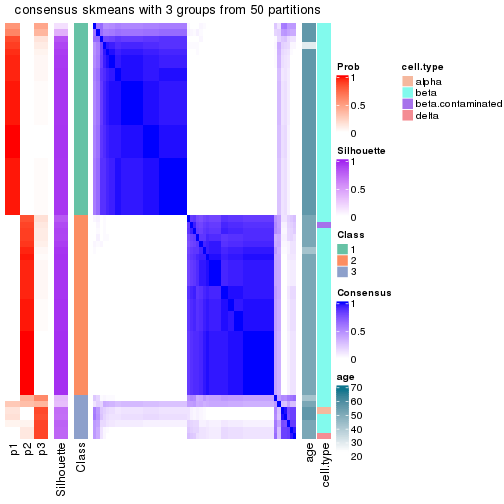</p>

</div>
<div id='tab-node-02112-consensus-heatmap-3'>
<pre><code class="r">consensus_heatmap(res, k = 4)
</code></pre>

<p></p>

</div>
</div>

Heatmaps for the membership of samples in all partitions to see how consistent they are:


<script>
$( function() {
	$( '#tabs-node-02112-membership-heatmap' ).tabs();
} );
</script>
<div id='tabs-node-02112-membership-heatmap'>
<ul>
<li><a href='#tab-node-02112-membership-heatmap-1'>k = 2</a></li>
<li><a href='#tab-node-02112-membership-heatmap-2'>k = 3</a></li>
<li><a href='#tab-node-02112-membership-heatmap-3'>k = 4</a></li>
</ul>
<div id='tab-node-02112-membership-heatmap-1'>
<pre><code class="r">membership_heatmap(res, k = 2)
</code></pre>

<p></p>

</div>
<div id='tab-node-02112-membership-heatmap-2'>
<pre><code class="r">membership_heatmap(res, k = 3)
</code></pre>

<p></p>

</div>
<div id='tab-node-02112-membership-heatmap-3'>
<pre><code class="r">membership_heatmap(res, k = 4)
</code></pre>

<p></p>

</div>
</div>

As soon as the classes for columns are determined, the signatures
that are significantly different between subgroups can be looked for. 
Following are the heatmaps for signatures.


Signature heatmaps where rows are scaled:


<script>
$( function() {
	$( '#tabs-node-02112-get-signatures' ).tabs();
} );
</script>
<div id='tabs-node-02112-get-signatures'>
<ul>
<li><a href='#tab-node-02112-get-signatures-1'>k = 2</a></li>
<li><a href='#tab-node-02112-get-signatures-2'>k = 3</a></li>
<li><a href='#tab-node-02112-get-signatures-3'>k = 4</a></li>
</ul>
<div id='tab-node-02112-get-signatures-1'>
<pre><code class="r">get_signatures(res, k = 2)
</code></pre>

<p></p>

</div>
<div id='tab-node-02112-get-signatures-2'>
<pre><code class="r">get_signatures(res, k = 3)
</code></pre>

<p></p>

</div>
<div id='tab-node-02112-get-signatures-3'>
<pre><code class="r">get_signatures(res, k = 4)
</code></pre>

<p></p>

</div>
</div>


Signature heatmaps where rows are not scaled:


<script>
$( function() {
	$( '#tabs-node-02112-get-signatures-no-scale' ).tabs();
} );
</script>
<div id='tabs-node-02112-get-signatures-no-scale'>
<ul>
<li><a href='#tab-node-02112-get-signatures-no-scale-1'>k = 2</a></li>
<li><a href='#tab-node-02112-get-signatures-no-scale-2'>k = 3</a></li>
<li><a href='#tab-node-02112-get-signatures-no-scale-3'>k = 4</a></li>
</ul>
<div id='tab-node-02112-get-signatures-no-scale-1'>
<pre><code class="r">get_signatures(res, k = 2, scale_rows = FALSE)
</code></pre>

<p></p>

</div>
<div id='tab-node-02112-get-signatures-no-scale-2'>
<pre><code class="r">get_signatures(res, k = 3, scale_rows = FALSE)
</code></pre>

<p></p>

</div>
<div id='tab-node-02112-get-signatures-no-scale-3'>
<pre><code class="r">get_signatures(res, k = 4, scale_rows = FALSE)
</code></pre>

<p>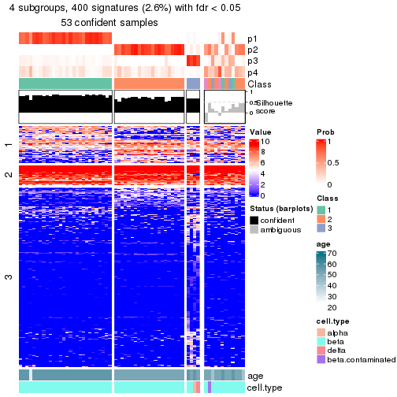</p>

</div>
</div>


Compare the overlap of signatures from different k:

```r
compare_signatures(res)
```


`get_signature()` returns a data frame invisibly. To get the list of signatures, the function
call should be assigned to a variable explicitly. In following code, if `plot` argument is set
to `FALSE`, no heatmap is plotted while only the differential analysis is performed.

```r
# code only for demonstration
tb = get_signature(res, k = ..., plot = FALSE)
```

An example of the output of `tb` is:

```
#>   which_row         fdr    mean_1    mean_2 scaled_mean_1 scaled_mean_2 km
#> 1        38 0.042760348  8.373488  9.131774    -0.5533452     0.5164555  1
#> 2        40 0.018707592  7.106213  8.469186    -0.6173731     0.5762149  1
#> 3        55 0.019134737 10.221463 11.207825    -0.6159697     0.5749050  1
#> 4        59 0.006059896  5.921854  7.869574    -0.6899429     0.6439467  1
#> 5        60 0.018055526  8.928898 10.211722    -0.6204761     0.5791110  1
#> 6        98 0.009384629 15.714769 14.887706     0.6635654    -0.6193277  2
...
```

The columns in `tb` are:

1. `which_row`: row indices corresponding to the input matrix.
2. `fdr`: FDR for the differential test. 
3. `mean_x`: The mean value in group x.
4. `scaled_mean_x`: The mean value in group x after rows are scaled.
5. `km`: Row groups if k-means clustering is applied to rows (which is done by automatically selecting number of clusters).

If there are too many signatures, `top_signatures = ...` can be set to only show the 
signatures with the highest FDRs:

```r
# code only for demonstration
# e.g. to show the top 500 most significant rows
tb = get_signature(res, k = ..., top_signatures = 500)
```

If the signatures are defined as these which are uniquely high in current group, `diff_method` argument
can be set to `"uniquely_high_in_one_group"`:

```r
# code only for demonstration
tb = get_signature(res, k = ..., diff_method = "uniquely_high_in_one_group")
```


UMAP plot which shows how samples are separated.


<script>
$( function() {
	$( '#tabs-node-02112-dimension-reduction' ).tabs();
} );
</script>
<div id='tabs-node-02112-dimension-reduction'>
<ul>
<li><a href='#tab-node-02112-dimension-reduction-1'>k = 2</a></li>
<li><a href='#tab-node-02112-dimension-reduction-2'>k = 3</a></li>
<li><a href='#tab-node-02112-dimension-reduction-3'>k = 4</a></li>
</ul>
<div id='tab-node-02112-dimension-reduction-1'>
<pre><code class="r">dimension_reduction(res, k = 2, method = &quot;UMAP&quot;)
</code></pre>

<p></p>

</div>
<div id='tab-node-02112-dimension-reduction-2'>
<pre><code class="r">dimension_reduction(res, k = 3, method = &quot;UMAP&quot;)
</code></pre>

<p></p>

</div>
<div id='tab-node-02112-dimension-reduction-3'>
<pre><code class="r">dimension_reduction(res, k = 4, method = &quot;UMAP&quot;)
</code></pre>

<p></p>

</div>
</div>


Following heatmap shows how subgroups are split when increasing `k`:

```r
collect_classes(res)
```


Test correlation between subgroups and known annotations. If the known
annotation is numeric, one-way ANOVA test is applied, and if the known
annotation is discrete, chi-squared contingency table test is applied.

```r
test_to_known_factors(res)
```

```
#>             n_sample age(p-value) cell.type(p-value) k
#> ATC:skmeans       64     7.66e-06           3.89e-01 2
#> ATC:skmeans       61     4.09e-03           4.59e-04 3
#> ATC:skmeans       53          NaN           4.06e-05 4
```


If matrix rows can be associated to genes, consider to use `functional_enrichment(res,
...)` to perform function enrichment for the signature genes. See [this vignette](https://jokergoo.github.io/cola_vignettes/functional_enrichment.html) for more detailed explanations.


 

---------------------------------------------------


### Node0212


Parent node: [Node021](#Node021).
Child nodes: 
                Node02111-leaf
        ,
                [Node02112](#Node02112)
        ,
                Node02121-leaf
        ,
                Node02122-leaf
        ,
                Node02211-leaf
        ,
                Node02212-leaf
        ,
                Node02221-leaf
        ,
                Node02222-leaf
        ,
                [Node03211](#Node03211)
        ,
                Node03212-leaf
        ,
                Node03221-leaf
        ,
                Node03222-leaf
        .


The object with results only for a single top-value method and a single partitioning method 
can be extracted as:

```r
res = res_rh["0212"]
```

A summary of `res` and all the functions that can be applied to it:

```r
res
```

```
#> A 'ConsensusPartition' object with k = 2, 3, 4.
#>   On a matrix with 14692 rows and 142 columns.
#>   Top rows (492) are extracted by 'ATC' method.
#>   Subgroups are detected by 'skmeans' method.
#>   Performed in total 150 partitions by row resampling.
#>   Best k for subgroups seems to be 2.
#> 
#> Following methods can be applied to this 'ConsensusPartition' object:
#>  [1] "cola_report"             "collect_classes"         "collect_plots"          
#>  [4] "collect_stats"           "colnames"                "compare_partitions"     
#>  [7] "compare_signatures"      "consensus_heatmap"       "dimension_reduction"    
#> [10] "functional_enrichment"   "get_anno_col"            "get_anno"               
#> [13] "get_classes"             "get_consensus"           "get_matrix"             
#> [16] "get_membership"          "get_param"               "get_signatures"         
#> [19] "get_stats"               "is_best_k"               "is_stable_k"            
#> [22] "membership_heatmap"      "ncol"                    "nrow"                   
#> [25] "plot_ecdf"               "predict_classes"         "rownames"               
#> [28] "select_partition_number" "show"                    "suggest_best_k"         
#> [31] "test_to_known_factors"   "top_rows_heatmap"
```

`collect_plots()` function collects all the plots made from `res` for all `k` (number of subgroups)
into one single page to provide an easy and fast comparison between different `k`.

```r
collect_plots(res)
```


The plots are:

- The first row: a plot of the eCDF (empirical cumulative distribution
  function) curves of the consensus matrix for each `k` and the heatmap of
  predicted classes for each `k`.
- The second row: heatmaps of the consensus matrix for each `k`.
- The third row: heatmaps of the membership matrix for each `k`.
- The fouth row: heatmaps of the signatures for each `k`.

All the plots in panels can be made by individual functions and they are
plotted later in this section.

`select_partition_number()` produces several plots showing different
statistics for choosing "optimized" `k`. There are following statistics:

- eCDF curves of the consensus matrix for each `k`;
- 1-PAC. [The PAC score](https://en.wikipedia.org/wiki/Consensus_clustering#Over-interpretation_potential_of_consensus_clustering)
  measures the proportion of the ambiguous subgrouping.
- Mean silhouette score.
- Concordance. The mean probability of fiting the consensus subgroup labels in all
  partitions.
- Area increased. Denote $A_k$ as the area under the eCDF curve for current
  `k`, the area increased is defined as $A_k - A_{k-1}$.
- Rand index. The percent of pairs of samples that are both in a same cluster
  or both are not in a same cluster in the partition of k and k-1.
- Jaccard index. The ratio of pairs of samples are both in a same cluster in
  the partition of k and k-1 and the pairs of samples are both in a same
  cluster in the partition k or k-1.

The detailed explanations of these statistics can be found in [the _cola_
vignette](https://jokergoo.github.io/cola_vignettes/cola.html#toc_13).

Generally speaking, higher 1-PAC score, higher mean silhouette score or higher
concordance corresponds to better partition. Rand index and Jaccard index
measure how similar the current partition is compared to partition with `k-1`.
If they are too similar, we won't accept `k` is better than `k-1`.

```r
select_partition_number(res)
```


The numeric values for all these statistics can be obtained by `get_stats()`.

```r
get_stats(res)
```

```
#>   k 1-PAC mean_silhouette concordance area_increased  Rand Jaccard
#> 2 2 0.984           0.957       0.982          0.498 0.505   0.505
#> 3 3 0.653           0.756       0.891          0.321 0.797   0.618
#> 4 4 0.720           0.747       0.871          0.112 0.865   0.647
```

`suggest_best_k()` suggests the best $k$ based on these statistics. The rules are as follows:

- All $k$ with Jaccard index larger than 0.95 are removed because increasing
  $k$ does not provide enough extra information. If all $k$ are removed, it is
  marked as no subgroup is detected.
- For all $k$ with 1-PAC score larger than 0.9, the maximal $k$ is taken as
  the best $k$, and other $k$ are marked as optional $k$.
- If it does not fit the second rule. The $k$ with the maximal vote of the
  highest 1-PAC score, highest mean silhouette, and highest concordance is
  taken as the best $k$.

```r
suggest_best_k(res)
```

```
#> [1] 2
```


Following is the table of the partitions (You need to click the **show/hide
code output** link to see it). The membership matrix (columns with name `p*`)
is inferred by
[`clue::cl_consensus()`](https://www.rdocumentation.org/link/cl_consensus?package=clue)
function with the `SE` method. Basically the value in the membership matrix
represents the probability to belong to a certain group. The finall subgroup
label for an item is determined with the group with highest probability it
belongs to.

In `get_classes()` function, the entropy is calculated from the membership
matrix and the silhouette score is calculated from the consensus matrix.


<script>
$( function() {
	$( '#tabs-node-0212-get-classes' ).tabs();
} );
</script>
<div id='tabs-node-0212-get-classes'>
<ul>
<li><a href='#tab-node-0212-get-classes-1'>k = 2</a></li>
<li><a href='#tab-node-0212-get-classes-2'>k = 3</a></li>
<li><a href='#tab-node-0212-get-classes-3'>k = 4</a></li>
</ul>

<div id='tab-node-0212-get-classes-1'>
<p><a id='tab-node-0212-get-classes-1-a' style='color:#0366d6' href='#'>show/hide code output</a></p>
<pre><code class="r">cbind(get_classes(res, k = 2), get_membership(res, k = 2))
</code></pre>

<pre><code>#&gt;             class entropy silhouette   p1   p2
#&gt; Sample_111      2   0.990      0.182 0.44 0.56
#&gt; Sample_151      1   0.141      0.961 0.98 0.02
#&gt; Sample_159      1   0.000      0.977 1.00 0.00
#&gt; Sample_161      1   0.000      0.977 1.00 0.00
#&gt; Sample_162      1   0.000      0.977 1.00 0.00
#&gt; Sample_163      2   0.000      0.987 0.00 1.00
#&gt; Sample_164      1   0.000      0.977 1.00 0.00
#&gt; Sample_165      1   0.000      0.977 1.00 0.00
#&gt; Sample_166      1   0.000      0.977 1.00 0.00
#&gt; Sample_169      1   0.242      0.943 0.96 0.04
#&gt; Sample_172      1   0.000      0.977 1.00 0.00
#&gt; Sample_174      1   0.722      0.758 0.80 0.20
#&gt; Sample_177      2   0.000      0.987 0.00 1.00
#&gt; Sample_179      2   0.000      0.987 0.00 1.00
#&gt; Sample_180      1   0.000      0.977 1.00 0.00
#&gt; Sample_188      1   0.000      0.977 1.00 0.00
#&gt; Sample_189      1   0.000      0.977 1.00 0.00
#&gt; Sample_191      1   0.000      0.977 1.00 0.00
#&gt; Sample_192      1   0.000      0.977 1.00 0.00
#&gt; Sample_611      1   0.000      0.977 1.00 0.00
#&gt; Sample_612      1   0.000      0.977 1.00 0.00
#&gt; Sample_686      1   0.722      0.758 0.80 0.20
#&gt; Sample_688      2   0.000      0.987 0.00 1.00
#&gt; Sample_690      2   0.000      0.987 0.00 1.00
#&gt; Sample_695      1   0.000      0.977 1.00 0.00
#&gt; Sample_698      1   0.000      0.977 1.00 0.00
#&gt; Sample_699      1   0.000      0.977 1.00 0.00
#&gt; Sample_701      1   0.000      0.977 1.00 0.00
#&gt; Sample_703      1   0.000      0.977 1.00 0.00
#&gt; Sample_711      1   0.000      0.977 1.00 0.00
#&gt; Sample_714      1   0.000      0.977 1.00 0.00
#&gt; Sample_715      1   0.000      0.977 1.00 0.00
#&gt; Sample_716      1   0.000      0.977 1.00 0.00
#&gt; Sample_723      1   0.000      0.977 1.00 0.00
#&gt; Sample_725      1   0.000      0.977 1.00 0.00
#&gt; Sample_728      1   0.000      0.977 1.00 0.00
#&gt; Sample_740      1   0.000      0.977 1.00 0.00
#&gt; Sample_742      1   0.402      0.904 0.92 0.08
#&gt; Sample_745      1   0.000      0.977 1.00 0.00
#&gt; Sample_748      1   0.000      0.977 1.00 0.00
#&gt; Sample_753      1   0.000      0.977 1.00 0.00
#&gt; Sample_754      1   0.000      0.977 1.00 0.00
#&gt; Sample_759      1   0.000      0.977 1.00 0.00
#&gt; Sample_766      1   0.000      0.977 1.00 0.00
#&gt; Sample_769      1   0.000      0.977 1.00 0.00
#&gt; Sample_772      1   0.000      0.977 1.00 0.00
#&gt; Sample_775      1   0.000      0.977 1.00 0.00
#&gt; Sample_777      1   0.000      0.977 1.00 0.00
#&gt; Sample_778      1   0.000      0.977 1.00 0.00
#&gt; Sample_779      1   0.000      0.977 1.00 0.00
#&gt; Sample_780      1   0.000      0.977 1.00 0.00
#&gt; Sample_782      1   0.000      0.977 1.00 0.00
#&gt; Sample_783      1   0.000      0.977 1.00 0.00
#&gt; Sample_784      1   0.000      0.977 1.00 0.00
#&gt; Sample_785      1   0.000      0.977 1.00 0.00
#&gt; Sample_786      1   0.000      0.977 1.00 0.00
#&gt; Sample_788      1   0.141      0.961 0.98 0.02
#&gt; Sample_789      1   0.000      0.977 1.00 0.00
#&gt; Sample_793      1   0.000      0.977 1.00 0.00
#&gt; Sample_797      1   0.000      0.977 1.00 0.00
#&gt; Sample_798      1   0.000      0.977 1.00 0.00
#&gt; Sample_799      1   0.000      0.977 1.00 0.00
#&gt; Sample_802      2   0.327      0.928 0.06 0.94
#&gt; Sample_804      1   0.000      0.977 1.00 0.00
#&gt; Sample_810      1   0.000      0.977 1.00 0.00
#&gt; Sample_817      1   0.000      0.977 1.00 0.00
#&gt; Sample_819      1   0.000      0.977 1.00 0.00
#&gt; Sample_821      1   0.000      0.977 1.00 0.00
#&gt; Sample_823      1   0.000      0.977 1.00 0.00
#&gt; Sample_824      1   0.943      0.455 0.64 0.36
#&gt; Sample_825      1   0.000      0.977 1.00 0.00
#&gt; Sample_826      1   0.000      0.977 1.00 0.00
#&gt; Sample_827      1   0.000      0.977 1.00 0.00
#&gt; Sample_829      1   0.971      0.342 0.60 0.40
#&gt; Sample_830      1   0.000      0.977 1.00 0.00
#&gt; Sample_834      1   0.000      0.977 1.00 0.00
#&gt; Sample_835      1   0.000      0.977 1.00 0.00
#&gt; Sample_839      1   0.000      0.977 1.00 0.00
#&gt; Sample_855      2   0.584      0.834 0.14 0.86
#&gt; Sample_856      2   0.141      0.968 0.02 0.98
#&gt; Sample_857      2   0.000      0.987 0.00 1.00
#&gt; Sample_860      2   0.000      0.987 0.00 1.00
#&gt; Sample_861      2   0.000      0.987 0.00 1.00
#&gt; Sample_862      2   0.000      0.987 0.00 1.00
#&gt; Sample_863      2   0.000      0.987 0.00 1.00
#&gt; Sample_866      2   0.000      0.987 0.00 1.00
#&gt; Sample_867      2   0.000      0.987 0.00 1.00
#&gt; Sample_869      2   0.000      0.987 0.00 1.00
#&gt; Sample_870      2   0.000      0.987 0.00 1.00
#&gt; Sample_871      2   0.000      0.987 0.00 1.00
#&gt; Sample_872      2   0.000      0.987 0.00 1.00
#&gt; Sample_873      2   0.000      0.987 0.00 1.00
#&gt; Sample_876      1   0.795      0.692 0.76 0.24
#&gt; Sample_881      2   0.000      0.987 0.00 1.00
#&gt; Sample_885      2   0.000      0.987 0.00 1.00
#&gt; Sample_889      2   0.000      0.987 0.00 1.00
#&gt; Sample_890      2   0.000      0.987 0.00 1.00
#&gt; Sample_891      2   0.000      0.987 0.00 1.00
#&gt; Sample_892      2   0.000      0.987 0.00 1.00
#&gt; Sample_893      2   0.469      0.883 0.10 0.90
#&gt; Sample_895      2   0.000      0.987 0.00 1.00
#&gt; Sample_897      2   0.000      0.987 0.00 1.00
#&gt; Sample_898      2   0.000      0.987 0.00 1.00
#&gt; Sample_902      2   0.000      0.987 0.00 1.00
#&gt; Sample_903      2   0.000      0.987 0.00 1.00
#&gt; Sample_906      2   0.000      0.987 0.00 1.00
#&gt; Sample_907      2   0.000      0.987 0.00 1.00
#&gt; Sample_908      2   0.000      0.987 0.00 1.00
#&gt; Sample_909      2   0.000      0.987 0.00 1.00
#&gt; Sample_911      2   0.000      0.987 0.00 1.00
#&gt; Sample_913      2   0.000      0.987 0.00 1.00
#&gt; Sample_914      2   0.000      0.987 0.00 1.00
#&gt; Sample_915      2   0.000      0.987 0.00 1.00
#&gt; Sample_917      2   0.000      0.987 0.00 1.00
#&gt; Sample_918      2   0.000      0.987 0.00 1.00
#&gt; Sample_919      2   0.000      0.987 0.00 1.00
#&gt; Sample_920      2   0.000      0.987 0.00 1.00
#&gt; Sample_922      2   0.000      0.987 0.00 1.00
#&gt; Sample_924      2   0.000      0.987 0.00 1.00
#&gt; Sample_925      2   0.000      0.987 0.00 1.00
#&gt; Sample_929      2   0.000      0.987 0.00 1.00
#&gt; Sample_932      2   0.000      0.987 0.00 1.00
#&gt; Sample_933      2   0.000      0.987 0.00 1.00
#&gt; Sample_934      2   0.000      0.987 0.00 1.00
#&gt; Sample_935      2   0.000      0.987 0.00 1.00
#&gt; Sample_936      2   0.000      0.987 0.00 1.00
#&gt; Sample_937      2   0.000      0.987 0.00 1.00
#&gt; Sample_938      2   0.000      0.987 0.00 1.00
#&gt; Sample_939      2   0.000      0.987 0.00 1.00
#&gt; Sample_940      2   0.000      0.987 0.00 1.00
#&gt; Sample_941      2   0.000      0.987 0.00 1.00
#&gt; Sample_942      2   0.000      0.987 0.00 1.00
#&gt; Sample_943      2   0.000      0.987 0.00 1.00
#&gt; Sample_944      2   0.000      0.987 0.00 1.00
#&gt; Sample_1527     1   0.141      0.961 0.98 0.02
#&gt; Sample_1528     1   0.000      0.977 1.00 0.00
#&gt; Sample_1529     1   0.000      0.977 1.00 0.00
#&gt; Sample_1534     1   0.000      0.977 1.00 0.00
#&gt; Sample_1538     1   0.000      0.977 1.00 0.00
#&gt; Sample_1539     1   0.242      0.944 0.96 0.04
#&gt; Sample_1542     1   0.680      0.786 0.82 0.18
#&gt; Sample_1570     1   0.000      0.977 1.00 0.00
</code></pre>

<script>
$('#tab-node-0212-get-classes-1-a').parent().next().next().hide();
$('#tab-node-0212-get-classes-1-a').click(function(){
  $('#tab-node-0212-get-classes-1-a').parent().next().next().toggle();
  return(false);
});
</script>
</div>

<div id='tab-node-0212-get-classes-2'>
<p><a id='tab-node-0212-get-classes-2-a' style='color:#0366d6' href='#'>show/hide code output</a></p>
<pre><code class="r">cbind(get_classes(res, k = 3), get_membership(res, k = 3))
</code></pre>

<pre><code>#&gt;             class entropy silhouette   p1   p2   p3
#&gt; Sample_111      3  0.0000      0.795 0.00 0.00 1.00
#&gt; Sample_151      1  0.6758      0.503 0.62 0.02 0.36
#&gt; Sample_159      1  0.5948      0.529 0.64 0.00 0.36
#&gt; Sample_161      1  0.5948      0.529 0.64 0.00 0.36
#&gt; Sample_162      1  0.6045      0.499 0.62 0.00 0.38
#&gt; Sample_163      2  0.6126      0.311 0.00 0.60 0.40
#&gt; Sample_164      1  0.5948      0.529 0.64 0.00 0.36
#&gt; Sample_165      1  0.5216      0.649 0.74 0.00 0.26
#&gt; Sample_166      3  0.2537      0.754 0.08 0.00 0.92
#&gt; Sample_169      1  0.6244      0.370 0.56 0.00 0.44
#&gt; Sample_172      3  0.2959      0.734 0.10 0.00 0.90
#&gt; Sample_174      3  0.4291      0.644 0.18 0.00 0.82
#&gt; Sample_177      2  0.6053      0.581 0.02 0.72 0.26
#&gt; Sample_179      3  0.5835      0.440 0.00 0.34 0.66
#&gt; Sample_180      1  0.5948      0.529 0.64 0.00 0.36
#&gt; Sample_188      1  0.5948      0.529 0.64 0.00 0.36
#&gt; Sample_189      1  0.2959      0.791 0.90 0.00 0.10
#&gt; Sample_191      1  0.5948      0.529 0.64 0.00 0.36
#&gt; Sample_192      1  0.5948      0.529 0.64 0.00 0.36
#&gt; Sample_611      3  0.0000      0.795 0.00 0.00 1.00
#&gt; Sample_612      3  0.0000      0.795 0.00 0.00 1.00
#&gt; Sample_686      1  0.2537      0.788 0.92 0.08 0.00
#&gt; Sample_688      3  0.6126      0.377 0.00 0.40 0.60
#&gt; Sample_690      3  0.5397      0.612 0.00 0.28 0.72
#&gt; Sample_695      1  0.0892      0.839 0.98 0.00 0.02
#&gt; Sample_698      1  0.0000      0.850 1.00 0.00 0.00
#&gt; Sample_699      1  0.0000      0.850 1.00 0.00 0.00
#&gt; Sample_701      1  0.0000      0.850 1.00 0.00 0.00
#&gt; Sample_703      3  0.0000      0.795 0.00 0.00 1.00
#&gt; Sample_711      1  0.0000      0.850 1.00 0.00 0.00
#&gt; Sample_714      1  0.0000      0.850 1.00 0.00 0.00
#&gt; Sample_715      1  0.5706      0.504 0.68 0.00 0.32
#&gt; Sample_716      1  0.0000      0.850 1.00 0.00 0.00
#&gt; Sample_723      1  0.4555      0.663 0.80 0.00 0.20
#&gt; Sample_725      3  0.6045      0.391 0.38 0.00 0.62
#&gt; Sample_728      1  0.0000      0.850 1.00 0.00 0.00
#&gt; Sample_740      3  0.4796      0.670 0.22 0.00 0.78
#&gt; Sample_742      3  0.5016      0.641 0.24 0.00 0.76
#&gt; Sample_745      1  0.0892      0.839 0.98 0.00 0.02
#&gt; Sample_748      1  0.0000      0.850 1.00 0.00 0.00
#&gt; Sample_753      1  0.6309     -0.117 0.50 0.00 0.50
#&gt; Sample_754      1  0.0000      0.850 1.00 0.00 0.00
#&gt; Sample_759      1  0.0000      0.850 1.00 0.00 0.00
#&gt; Sample_766      1  0.0000      0.850 1.00 0.00 0.00
#&gt; Sample_769      1  0.0000      0.850 1.00 0.00 0.00
#&gt; Sample_772      1  0.0000      0.850 1.00 0.00 0.00
#&gt; Sample_775      1  0.0000      0.850 1.00 0.00 0.00
#&gt; Sample_777      3  0.5216      0.620 0.26 0.00 0.74
#&gt; Sample_778      1  0.0000      0.850 1.00 0.00 0.00
#&gt; Sample_779      3  0.5397      0.590 0.28 0.00 0.72
#&gt; Sample_780      1  0.0000      0.850 1.00 0.00 0.00
#&gt; Sample_782      1  0.0000      0.850 1.00 0.00 0.00
#&gt; Sample_783      1  0.5016      0.629 0.76 0.00 0.24
#&gt; Sample_784      1  0.2959      0.792 0.90 0.00 0.10
#&gt; Sample_785      1  0.0892      0.840 0.98 0.00 0.02
#&gt; Sample_786      1  0.0000      0.850 1.00 0.00 0.00
#&gt; Sample_788      3  0.5216      0.580 0.26 0.00 0.74
#&gt; Sample_789      1  0.0000      0.850 1.00 0.00 0.00
#&gt; Sample_793      1  0.0000      0.850 1.00 0.00 0.00
#&gt; Sample_797      1  0.0000      0.850 1.00 0.00 0.00
#&gt; Sample_798      1  0.4291      0.730 0.82 0.00 0.18
#&gt; Sample_799      1  0.0000      0.850 1.00 0.00 0.00
#&gt; Sample_802      2  0.6927      0.552 0.24 0.70 0.06
#&gt; Sample_804      1  0.0000      0.850 1.00 0.00 0.00
#&gt; Sample_810      1  0.0000      0.850 1.00 0.00 0.00
#&gt; Sample_817      1  0.0000      0.850 1.00 0.00 0.00
#&gt; Sample_819      1  0.0000      0.850 1.00 0.00 0.00
#&gt; Sample_821      1  0.0000      0.850 1.00 0.00 0.00
#&gt; Sample_823      1  0.0000      0.850 1.00 0.00 0.00
#&gt; Sample_824      1  0.5216      0.557 0.74 0.26 0.00
#&gt; Sample_825      1  0.0000      0.850 1.00 0.00 0.00
#&gt; Sample_826      1  0.1529      0.826 0.96 0.00 0.04
#&gt; Sample_827      1  0.0000      0.850 1.00 0.00 0.00
#&gt; Sample_829      1  0.4002      0.702 0.84 0.16 0.00
#&gt; Sample_830      1  0.0000      0.850 1.00 0.00 0.00
#&gt; Sample_834      1  0.0000      0.850 1.00 0.00 0.00
#&gt; Sample_835      1  0.0000      0.850 1.00 0.00 0.00
#&gt; Sample_839      1  0.6192      0.176 0.58 0.00 0.42
#&gt; Sample_855      1  0.9940     -0.246 0.36 0.28 0.36
#&gt; Sample_856      2  0.6651      0.432 0.02 0.64 0.34
#&gt; Sample_857      2  0.3686      0.806 0.00 0.86 0.14
#&gt; Sample_860      2  0.3415      0.859 0.02 0.90 0.08
#&gt; Sample_861      2  0.3686      0.808 0.00 0.86 0.14
#&gt; Sample_862      3  0.5216      0.628 0.00 0.26 0.74
#&gt; Sample_863      3  0.6244      0.261 0.00 0.44 0.56
#&gt; Sample_866      3  0.5016      0.653 0.00 0.24 0.76
#&gt; Sample_867      3  0.5948      0.456 0.00 0.36 0.64
#&gt; Sample_869      2  0.0000      0.933 0.00 1.00 0.00
#&gt; Sample_870      2  0.4002      0.789 0.00 0.84 0.16
#&gt; Sample_871      2  0.0000      0.933 0.00 1.00 0.00
#&gt; Sample_872      2  0.0000      0.933 0.00 1.00 0.00
#&gt; Sample_873      2  0.0000      0.933 0.00 1.00 0.00
#&gt; Sample_876      1  0.8399      0.474 0.62 0.22 0.16
#&gt; Sample_881      2  0.2959      0.851 0.00 0.90 0.10
#&gt; Sample_885      2  0.0892      0.915 0.02 0.98 0.00
#&gt; Sample_889      2  0.0000      0.933 0.00 1.00 0.00
#&gt; Sample_890      2  0.6633      0.562 0.04 0.70 0.26
#&gt; Sample_891      2  0.0000      0.933 0.00 1.00 0.00
#&gt; Sample_892      2  0.0000      0.933 0.00 1.00 0.00
#&gt; Sample_893      2  0.8215      0.191 0.08 0.54 0.38
#&gt; Sample_895      2  0.0000      0.933 0.00 1.00 0.00
#&gt; Sample_897      2  0.0000      0.933 0.00 1.00 0.00
#&gt; Sample_898      2  0.0892      0.919 0.00 0.98 0.02
#&gt; Sample_902      2  0.0000      0.933 0.00 1.00 0.00
#&gt; Sample_903      2  0.0000      0.933 0.00 1.00 0.00
#&gt; Sample_906      2  0.0000      0.933 0.00 1.00 0.00
#&gt; Sample_907      2  0.0000      0.933 0.00 1.00 0.00
#&gt; Sample_908      2  0.0000      0.933 0.00 1.00 0.00
#&gt; Sample_909      3  0.1529      0.792 0.00 0.04 0.96
#&gt; Sample_911      2  0.0000      0.933 0.00 1.00 0.00
#&gt; Sample_913      2  0.0000      0.933 0.00 1.00 0.00
#&gt; Sample_914      2  0.0000      0.933 0.00 1.00 0.00
#&gt; Sample_915      2  0.0000      0.933 0.00 1.00 0.00
#&gt; Sample_917      2  0.0000      0.933 0.00 1.00 0.00
#&gt; Sample_918      2  0.0000      0.933 0.00 1.00 0.00
#&gt; Sample_919      2  0.0000      0.933 0.00 1.00 0.00
#&gt; Sample_920      2  0.0000      0.933 0.00 1.00 0.00
#&gt; Sample_922      2  0.0000      0.933 0.00 1.00 0.00
#&gt; Sample_924      2  0.0000      0.933 0.00 1.00 0.00
#&gt; Sample_925      2  0.0000      0.933 0.00 1.00 0.00
#&gt; Sample_929      3  0.5016      0.658 0.00 0.24 0.76
#&gt; Sample_932      2  0.3686      0.801 0.00 0.86 0.14
#&gt; Sample_933      2  0.0000      0.933 0.00 1.00 0.00
#&gt; Sample_934      2  0.0000      0.933 0.00 1.00 0.00
#&gt; Sample_935      2  0.0000      0.933 0.00 1.00 0.00
#&gt; Sample_936      2  0.0892      0.919 0.00 0.98 0.02
#&gt; Sample_937      2  0.0000      0.933 0.00 1.00 0.00
#&gt; Sample_938      2  0.0000      0.933 0.00 1.00 0.00
#&gt; Sample_939      2  0.0000      0.933 0.00 1.00 0.00
#&gt; Sample_940      2  0.0000      0.933 0.00 1.00 0.00
#&gt; Sample_941      2  0.0000      0.933 0.00 1.00 0.00
#&gt; Sample_942      2  0.0000      0.933 0.00 1.00 0.00
#&gt; Sample_943      2  0.0000      0.933 0.00 1.00 0.00
#&gt; Sample_944      2  0.0000      0.933 0.00 1.00 0.00
#&gt; Sample_1527     3  0.0000      0.795 0.00 0.00 1.00
#&gt; Sample_1528     3  0.2066      0.779 0.06 0.00 0.94
#&gt; Sample_1529     3  0.0000      0.795 0.00 0.00 1.00
#&gt; Sample_1534     3  0.5216      0.612 0.26 0.00 0.74
#&gt; Sample_1538     3  0.0000      0.795 0.00 0.00 1.00
#&gt; Sample_1539     3  0.0000      0.795 0.00 0.00 1.00
#&gt; Sample_1542     3  0.0000      0.795 0.00 0.00 1.00
#&gt; Sample_1570     3  0.0000      0.795 0.00 0.00 1.00
</code></pre>

<script>
$('#tab-node-0212-get-classes-2-a').parent().next().next().hide();
$('#tab-node-0212-get-classes-2-a').click(function(){
  $('#tab-node-0212-get-classes-2-a').parent().next().next().toggle();
  return(false);
});
</script>
</div>

<div id='tab-node-0212-get-classes-3'>
<p><a id='tab-node-0212-get-classes-3-a' style='color:#0366d6' href='#'>show/hide code output</a></p>
<pre><code class="r">cbind(get_classes(res, k = 4), get_membership(res, k = 4))
</code></pre>

<pre><code>#&gt;             class entropy silhouette   p1   p2   p3   p4
#&gt; Sample_111      3  0.1637     0.7302 0.00 0.00 0.94 0.06
#&gt; Sample_151      4  0.2335     0.8359 0.06 0.00 0.02 0.92
#&gt; Sample_159      4  0.2011     0.8326 0.08 0.00 0.00 0.92
#&gt; Sample_161      4  0.2011     0.8326 0.08 0.00 0.00 0.92
#&gt; Sample_162      4  0.2335     0.8359 0.06 0.00 0.02 0.92
#&gt; Sample_163      4  0.3525     0.7580 0.00 0.04 0.10 0.86
#&gt; Sample_164      4  0.2011     0.8326 0.08 0.00 0.00 0.92
#&gt; Sample_165      4  0.2345     0.8160 0.10 0.00 0.00 0.90
#&gt; Sample_166      4  0.4907     0.1574 0.00 0.00 0.42 0.58
#&gt; Sample_169      4  0.2411     0.8265 0.04 0.00 0.04 0.92
#&gt; Sample_172      4  0.0000     0.7813 0.00 0.00 0.00 1.00
#&gt; Sample_174      4  0.2011     0.7923 0.00 0.00 0.08 0.92
#&gt; Sample_177      4  0.3400     0.6900 0.00 0.18 0.00 0.82
#&gt; Sample_179      4  0.2011     0.7923 0.00 0.00 0.08 0.92
#&gt; Sample_180      4  0.1211     0.8213 0.04 0.00 0.00 0.96
#&gt; Sample_188      4  0.2011     0.8326 0.08 0.00 0.00 0.92
#&gt; Sample_189      4  0.4406     0.5772 0.30 0.00 0.00 0.70
#&gt; Sample_191      4  0.2335     0.8359 0.06 0.00 0.02 0.92
#&gt; Sample_192      4  0.1637     0.8315 0.06 0.00 0.00 0.94
#&gt; Sample_611      3  0.4134     0.7008 0.00 0.00 0.74 0.26
#&gt; Sample_612      3  0.3975     0.7113 0.00 0.00 0.76 0.24
#&gt; Sample_686      1  0.4079     0.7320 0.80 0.18 0.00 0.02
#&gt; Sample_688      3  0.2011     0.6776 0.00 0.08 0.92 0.00
#&gt; Sample_690      3  0.2411     0.6932 0.00 0.04 0.92 0.04
#&gt; Sample_695      1  0.0000     0.9055 1.00 0.00 0.00 0.00
#&gt; Sample_698      1  0.0000     0.9055 1.00 0.00 0.00 0.00
#&gt; Sample_699      1  0.0000     0.9055 1.00 0.00 0.00 0.00
#&gt; Sample_701      1  0.0000     0.9055 1.00 0.00 0.00 0.00
#&gt; Sample_703      3  0.4277     0.6842 0.00 0.00 0.72 0.28
#&gt; Sample_711      1  0.0000     0.9055 1.00 0.00 0.00 0.00
#&gt; Sample_714      1  0.1211     0.8787 0.96 0.04 0.00 0.00
#&gt; Sample_715      1  0.6370     0.5071 0.62 0.00 0.10 0.28
#&gt; Sample_716      1  0.0000     0.9055 1.00 0.00 0.00 0.00
#&gt; Sample_723      1  0.1637     0.8676 0.94 0.00 0.00 0.06
#&gt; Sample_725      1  0.7653     0.0766 0.46 0.00 0.24 0.30
#&gt; Sample_728      1  0.0000     0.9055 1.00 0.00 0.00 0.00
#&gt; Sample_740      3  0.6976     0.4703 0.24 0.00 0.58 0.18
#&gt; Sample_742      3  0.4292     0.7046 0.10 0.00 0.82 0.08
#&gt; Sample_745      1  0.3198     0.8343 0.88 0.00 0.04 0.08
#&gt; Sample_748      1  0.0000     0.9055 1.00 0.00 0.00 0.00
#&gt; Sample_753      1  0.4731     0.7093 0.78 0.00 0.16 0.06
#&gt; Sample_754      1  0.0000     0.9055 1.00 0.00 0.00 0.00
#&gt; Sample_759      1  0.1211     0.8801 0.96 0.04 0.00 0.00
#&gt; Sample_766      1  0.0000     0.9055 1.00 0.00 0.00 0.00
#&gt; Sample_769      1  0.0000     0.9055 1.00 0.00 0.00 0.00
#&gt; Sample_772      1  0.0000     0.9055 1.00 0.00 0.00 0.00
#&gt; Sample_775      1  0.0000     0.9055 1.00 0.00 0.00 0.00
#&gt; Sample_777      1  0.7179     0.0308 0.48 0.00 0.38 0.14
#&gt; Sample_778      1  0.0000     0.9055 1.00 0.00 0.00 0.00
#&gt; Sample_779      3  0.7738     0.3415 0.26 0.00 0.44 0.30
#&gt; Sample_780      1  0.0000     0.9055 1.00 0.00 0.00 0.00
#&gt; Sample_782      1  0.0000     0.9055 1.00 0.00 0.00 0.00
#&gt; Sample_783      1  0.5784     0.5928 0.70 0.00 0.20 0.10
#&gt; Sample_784      1  0.2647     0.8348 0.88 0.00 0.00 0.12
#&gt; Sample_785      1  0.2921     0.7927 0.86 0.00 0.00 0.14
#&gt; Sample_786      1  0.0000     0.9055 1.00 0.00 0.00 0.00
#&gt; Sample_788      3  0.6831     0.0534 0.10 0.00 0.48 0.42
#&gt; Sample_789      1  0.0000     0.9055 1.00 0.00 0.00 0.00
#&gt; Sample_793      1  0.0000     0.9055 1.00 0.00 0.00 0.00
#&gt; Sample_797      1  0.0000     0.9055 1.00 0.00 0.00 0.00
#&gt; Sample_798      1  0.4277     0.6028 0.72 0.00 0.00 0.28
#&gt; Sample_799      1  0.0000     0.9055 1.00 0.00 0.00 0.00
#&gt; Sample_802      1  0.8453    -0.1472 0.36 0.30 0.32 0.02
#&gt; Sample_804      1  0.0000     0.9055 1.00 0.00 0.00 0.00
#&gt; Sample_810      1  0.0707     0.8943 0.98 0.00 0.00 0.02
#&gt; Sample_817      1  0.0000     0.9055 1.00 0.00 0.00 0.00
#&gt; Sample_819      1  0.0000     0.9055 1.00 0.00 0.00 0.00
#&gt; Sample_821      1  0.0000     0.9055 1.00 0.00 0.00 0.00
#&gt; Sample_823      1  0.0000     0.9055 1.00 0.00 0.00 0.00
#&gt; Sample_824      1  0.3400     0.7406 0.82 0.18 0.00 0.00
#&gt; Sample_825      1  0.1211     0.8811 0.96 0.00 0.00 0.04
#&gt; Sample_826      1  0.0000     0.9055 1.00 0.00 0.00 0.00
#&gt; Sample_827      1  0.0707     0.8947 0.98 0.00 0.02 0.00
#&gt; Sample_829      1  0.2011     0.8461 0.92 0.08 0.00 0.00
#&gt; Sample_830      1  0.0000     0.9055 1.00 0.00 0.00 0.00
#&gt; Sample_834      1  0.0000     0.9055 1.00 0.00 0.00 0.00
#&gt; Sample_835      1  0.0000     0.9055 1.00 0.00 0.00 0.00
#&gt; Sample_839      1  0.5883     0.4542 0.64 0.00 0.30 0.06
#&gt; Sample_855      3  0.9078     0.1925 0.34 0.20 0.38 0.08
#&gt; Sample_856      2  0.7499     0.1672 0.00 0.42 0.40 0.18
#&gt; Sample_857      2  0.3400     0.7882 0.00 0.82 0.18 0.00
#&gt; Sample_860      2  0.7577     0.5267 0.04 0.60 0.16 0.20
#&gt; Sample_861      2  0.4907     0.5112 0.00 0.58 0.42 0.00
#&gt; Sample_862      3  0.0000     0.7261 0.00 0.00 1.00 0.00
#&gt; Sample_863      3  0.2921     0.6217 0.00 0.14 0.86 0.00
#&gt; Sample_866      3  0.0000     0.7261 0.00 0.00 1.00 0.00
#&gt; Sample_867      3  0.0000     0.7261 0.00 0.00 1.00 0.00
#&gt; Sample_869      2  0.1637     0.8605 0.00 0.94 0.06 0.00
#&gt; Sample_870      2  0.7040     0.2896 0.00 0.46 0.42 0.12
#&gt; Sample_871      2  0.0707     0.8732 0.00 0.98 0.02 0.00
#&gt; Sample_872      2  0.0000     0.8786 0.00 1.00 0.00 0.00
#&gt; Sample_873      2  0.0000     0.8786 0.00 1.00 0.00 0.00
#&gt; Sample_876      4  0.7674     0.3794 0.28 0.26 0.00 0.46
#&gt; Sample_881      2  0.4713     0.6162 0.00 0.64 0.36 0.00
#&gt; Sample_885      2  0.0707     0.8639 0.02 0.98 0.00 0.00
#&gt; Sample_889      2  0.0000     0.8786 0.00 1.00 0.00 0.00
#&gt; Sample_890      3  0.7329    -0.0691 0.04 0.44 0.46 0.06
#&gt; Sample_891      2  0.0000     0.8786 0.00 1.00 0.00 0.00
#&gt; Sample_892      2  0.0000     0.8786 0.00 1.00 0.00 0.00
#&gt; Sample_893      4  0.8293     0.1845 0.02 0.24 0.32 0.42
#&gt; Sample_895      2  0.4134     0.7289 0.00 0.74 0.26 0.00
#&gt; Sample_897      2  0.3400     0.7925 0.00 0.82 0.18 0.00
#&gt; Sample_898      2  0.5271     0.6202 0.00 0.64 0.34 0.02
#&gt; Sample_902      2  0.0000     0.8786 0.00 1.00 0.00 0.00
#&gt; Sample_903      2  0.0000     0.8786 0.00 1.00 0.00 0.00
#&gt; Sample_906      2  0.1211     0.8672 0.00 0.96 0.04 0.00
#&gt; Sample_907      2  0.0000     0.8786 0.00 1.00 0.00 0.00
#&gt; Sample_908      2  0.0000     0.8786 0.00 1.00 0.00 0.00
#&gt; Sample_909      3  0.0000     0.7261 0.00 0.00 1.00 0.00
#&gt; Sample_911      2  0.0000     0.8786 0.00 1.00 0.00 0.00
#&gt; Sample_913      2  0.0000     0.8786 0.00 1.00 0.00 0.00
#&gt; Sample_914      2  0.0000     0.8786 0.00 1.00 0.00 0.00
#&gt; Sample_915      2  0.0000     0.8786 0.00 1.00 0.00 0.00
#&gt; Sample_917      2  0.0000     0.8786 0.00 1.00 0.00 0.00
#&gt; Sample_918      2  0.0000     0.8786 0.00 1.00 0.00 0.00
#&gt; Sample_919      2  0.0000     0.8786 0.00 1.00 0.00 0.00
#&gt; Sample_920      2  0.4406     0.6884 0.00 0.70 0.30 0.00
#&gt; Sample_922      2  0.0000     0.8786 0.00 1.00 0.00 0.00
#&gt; Sample_924      2  0.0000     0.8786 0.00 1.00 0.00 0.00
#&gt; Sample_925      2  0.3172     0.8057 0.00 0.84 0.16 0.00
#&gt; Sample_929      3  0.0000     0.7261 0.00 0.00 1.00 0.00
#&gt; Sample_932      2  0.4948     0.4685 0.00 0.56 0.44 0.00
#&gt; Sample_933      2  0.1211     0.8678 0.00 0.96 0.04 0.00
#&gt; Sample_934      2  0.3975     0.7461 0.00 0.76 0.24 0.00
#&gt; Sample_935      2  0.0707     0.8732 0.00 0.98 0.02 0.00
#&gt; Sample_936      2  0.4790     0.5817 0.00 0.62 0.38 0.00
#&gt; Sample_937      2  0.0000     0.8786 0.00 1.00 0.00 0.00
#&gt; Sample_938      2  0.0000     0.8786 0.00 1.00 0.00 0.00
#&gt; Sample_939      2  0.4277     0.7103 0.00 0.72 0.28 0.00
#&gt; Sample_940      2  0.0000     0.8786 0.00 1.00 0.00 0.00
#&gt; Sample_941      2  0.0000     0.8786 0.00 1.00 0.00 0.00
#&gt; Sample_942      2  0.0000     0.8786 0.00 1.00 0.00 0.00
#&gt; Sample_943      2  0.2921     0.7733 0.00 0.86 0.00 0.14
#&gt; Sample_944      2  0.1637     0.8590 0.00 0.94 0.06 0.00
#&gt; Sample_1527     3  0.3610     0.7273 0.00 0.00 0.80 0.20
#&gt; Sample_1528     3  0.5327     0.6903 0.06 0.00 0.72 0.22
#&gt; Sample_1529     3  0.4134     0.7008 0.00 0.00 0.74 0.26
#&gt; Sample_1534     3  0.6049     0.6460 0.12 0.00 0.68 0.20
#&gt; Sample_1538     3  0.4134     0.7008 0.00 0.00 0.74 0.26
#&gt; Sample_1539     3  0.4134     0.7008 0.00 0.00 0.74 0.26
#&gt; Sample_1542     3  0.4134     0.7008 0.00 0.00 0.74 0.26
#&gt; Sample_1570     3  0.3400     0.7307 0.00 0.00 0.82 0.18
</code></pre>

<script>
$('#tab-node-0212-get-classes-3-a').parent().next().next().hide();
$('#tab-node-0212-get-classes-3-a').click(function(){
  $('#tab-node-0212-get-classes-3-a').parent().next().next().toggle();
  return(false);
});
</script>
</div>
</div>

Heatmaps for the consensus matrix. It visualizes the probability of two
samples to be in a same group.


<script>
$( function() {
	$( '#tabs-node-0212-consensus-heatmap' ).tabs();
} );
</script>
<div id='tabs-node-0212-consensus-heatmap'>
<ul>
<li><a href='#tab-node-0212-consensus-heatmap-1'>k = 2</a></li>
<li><a href='#tab-node-0212-consensus-heatmap-2'>k = 3</a></li>
<li><a href='#tab-node-0212-consensus-heatmap-3'>k = 4</a></li>
</ul>
<div id='tab-node-0212-consensus-heatmap-1'>
<pre><code class="r">consensus_heatmap(res, k = 2)
</code></pre>

<p></p>

</div>
<div id='tab-node-0212-consensus-heatmap-2'>
<pre><code class="r">consensus_heatmap(res, k = 3)
</code></pre>

<p>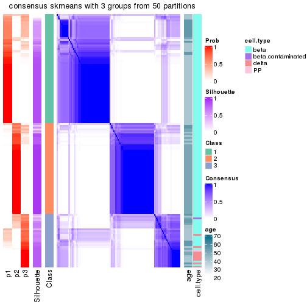</p>

</div>
<div id='tab-node-0212-consensus-heatmap-3'>
<pre><code class="r">consensus_heatmap(res, k = 4)
</code></pre>

<p></p>

</div>
</div>

Heatmaps for the membership of samples in all partitions to see how consistent they are:


<script>
$( function() {
	$( '#tabs-node-0212-membership-heatmap' ).tabs();
} );
</script>
<div id='tabs-node-0212-membership-heatmap'>
<ul>
<li><a href='#tab-node-0212-membership-heatmap-1'>k = 2</a></li>
<li><a href='#tab-node-0212-membership-heatmap-2'>k = 3</a></li>
<li><a href='#tab-node-0212-membership-heatmap-3'>k = 4</a></li>
</ul>
<div id='tab-node-0212-membership-heatmap-1'>
<pre><code class="r">membership_heatmap(res, k = 2)
</code></pre>

<p></p>

</div>
<div id='tab-node-0212-membership-heatmap-2'>
<pre><code class="r">membership_heatmap(res, k = 3)
</code></pre>

<p></p>

</div>
<div id='tab-node-0212-membership-heatmap-3'>
<pre><code class="r">membership_heatmap(res, k = 4)
</code></pre>

<p></p>

</div>
</div>

As soon as the classes for columns are determined, the signatures
that are significantly different between subgroups can be looked for. 
Following are the heatmaps for signatures.


Signature heatmaps where rows are scaled:


<script>
$( function() {
	$( '#tabs-node-0212-get-signatures' ).tabs();
} );
</script>
<div id='tabs-node-0212-get-signatures'>
<ul>
<li><a href='#tab-node-0212-get-signatures-1'>k = 2</a></li>
<li><a href='#tab-node-0212-get-signatures-2'>k = 3</a></li>
<li><a href='#tab-node-0212-get-signatures-3'>k = 4</a></li>
</ul>
<div id='tab-node-0212-get-signatures-1'>
<pre><code class="r">get_signatures(res, k = 2)
</code></pre>

<p></p>

</div>
<div id='tab-node-0212-get-signatures-2'>
<pre><code class="r">get_signatures(res, k = 3)
</code></pre>

<p></p>

</div>
<div id='tab-node-0212-get-signatures-3'>
<pre><code class="r">get_signatures(res, k = 4)
</code></pre>

<p></p>

</div>
</div>


Signature heatmaps where rows are not scaled:


<script>
$( function() {
	$( '#tabs-node-0212-get-signatures-no-scale' ).tabs();
} );
</script>
<div id='tabs-node-0212-get-signatures-no-scale'>
<ul>
<li><a href='#tab-node-0212-get-signatures-no-scale-1'>k = 2</a></li>
<li><a href='#tab-node-0212-get-signatures-no-scale-2'>k = 3</a></li>
<li><a href='#tab-node-0212-get-signatures-no-scale-3'>k = 4</a></li>
</ul>
<div id='tab-node-0212-get-signatures-no-scale-1'>
<pre><code class="r">get_signatures(res, k = 2, scale_rows = FALSE)
</code></pre>

<p></p>

</div>
<div id='tab-node-0212-get-signatures-no-scale-2'>
<pre><code class="r">get_signatures(res, k = 3, scale_rows = FALSE)
</code></pre>

<p></p>

</div>
<div id='tab-node-0212-get-signatures-no-scale-3'>
<pre><code class="r">get_signatures(res, k = 4, scale_rows = FALSE)
</code></pre>

<p></p>

</div>
</div>


Compare the overlap of signatures from different k:

```r
compare_signatures(res)
```


`get_signature()` returns a data frame invisibly. To get the list of signatures, the function
call should be assigned to a variable explicitly. In following code, if `plot` argument is set
to `FALSE`, no heatmap is plotted while only the differential analysis is performed.

```r
# code only for demonstration
tb = get_signature(res, k = ..., plot = FALSE)
```

An example of the output of `tb` is:

```
#>   which_row         fdr    mean_1    mean_2 scaled_mean_1 scaled_mean_2 km
#> 1        38 0.042760348  8.373488  9.131774    -0.5533452     0.5164555  1
#> 2        40 0.018707592  7.106213  8.469186    -0.6173731     0.5762149  1
#> 3        55 0.019134737 10.221463 11.207825    -0.6159697     0.5749050  1
#> 4        59 0.006059896  5.921854  7.869574    -0.6899429     0.6439467  1
#> 5        60 0.018055526  8.928898 10.211722    -0.6204761     0.5791110  1
#> 6        98 0.009384629 15.714769 14.887706     0.6635654    -0.6193277  2
...
```

The columns in `tb` are:

1. `which_row`: row indices corresponding to the input matrix.
2. `fdr`: FDR for the differential test. 
3. `mean_x`: The mean value in group x.
4. `scaled_mean_x`: The mean value in group x after rows are scaled.
5. `km`: Row groups if k-means clustering is applied to rows (which is done by automatically selecting number of clusters).

If there are too many signatures, `top_signatures = ...` can be set to only show the 
signatures with the highest FDRs:

```r
# code only for demonstration
# e.g. to show the top 500 most significant rows
tb = get_signature(res, k = ..., top_signatures = 500)
```

If the signatures are defined as these which are uniquely high in current group, `diff_method` argument
can be set to `"uniquely_high_in_one_group"`:

```r
# code only for demonstration
tb = get_signature(res, k = ..., diff_method = "uniquely_high_in_one_group")
```


UMAP plot which shows how samples are separated.


<script>
$( function() {
	$( '#tabs-node-0212-dimension-reduction' ).tabs();
} );
</script>
<div id='tabs-node-0212-dimension-reduction'>
<ul>
<li><a href='#tab-node-0212-dimension-reduction-1'>k = 2</a></li>
<li><a href='#tab-node-0212-dimension-reduction-2'>k = 3</a></li>
<li><a href='#tab-node-0212-dimension-reduction-3'>k = 4</a></li>
</ul>
<div id='tab-node-0212-dimension-reduction-1'>
<pre><code class="r">dimension_reduction(res, k = 2, method = &quot;UMAP&quot;)
</code></pre>

<p></p>

</div>
<div id='tab-node-0212-dimension-reduction-2'>
<pre><code class="r">dimension_reduction(res, k = 3, method = &quot;UMAP&quot;)
</code></pre>

<p></p>

</div>
<div id='tab-node-0212-dimension-reduction-3'>
<pre><code class="r">dimension_reduction(res, k = 4, method = &quot;UMAP&quot;)
</code></pre>

<p></p>

</div>
</div>


Following heatmap shows how subgroups are split when increasing `k`:

```r
collect_classes(res)
```


Test correlation between subgroups and known annotations. If the known
annotation is numeric, one-way ANOVA test is applied, and if the known
annotation is discrete, chi-squared contingency table test is applied.

```r
test_to_known_factors(res)
```

```
#>             n_sample age(p-value) cell.type(p-value) k
#> ATC:skmeans      139     1.88e-08           2.27e-02 2
#> ATC:skmeans      128     9.59e-09           4.61e-09 3
#> ATC:skmeans      127          NaN           9.44e-10 4
```


If matrix rows can be associated to genes, consider to use `functional_enrichment(res,
...)` to perform function enrichment for the signature genes. See [this vignette](https://jokergoo.github.io/cola_vignettes/functional_enrichment.html) for more detailed explanations.


 

---------------------------------------------------


### Node022


Parent node: [Node02](#Node02).
Child nodes: 
                Node0111-leaf
        ,
                Node0112-leaf
        ,
                Node0121-leaf
        ,
                Node0122-leaf
        ,
                Node0131-leaf
        ,
                Node0132-leaf
        ,
                [Node0211](#Node0211)
        ,
                [Node0212](#Node0212)
        ,
                [Node0221](#Node0221)
        ,
                [Node0222](#Node0222)
        ,
                Node0231-leaf
        ,
                Node0232-leaf
        ,
                Node0233-leaf
        ,
                Node0311-leaf
        ,
                Node0312-leaf
        ,
                Node0313-leaf
        ,
                Node0314-leaf
        ,
                [Node0321](#Node0321)
        ,
                [Node0322](#Node0322)
        ,
                Node0331-leaf
        ,
                Node0332-leaf
        ,
                Node0333-leaf
        .


The object with results only for a single top-value method and a single partitioning method 
can be extracted as:

```r
res = res_rh["022"]
```

A summary of `res` and all the functions that can be applied to it:

```r
res
```

```
#> A 'ConsensusPartition' object with k = 2, 3, 4.
#>   On a matrix with 14744 rows and 218 columns.
#>   Top rows (1407) are extracted by 'ATC' method.
#>   Subgroups are detected by 'skmeans' method.
#>   Performed in total 150 partitions by row resampling.
#>   Best k for subgroups seems to be 2.
#> 
#> Following methods can be applied to this 'ConsensusPartition' object:
#>  [1] "cola_report"             "collect_classes"         "collect_plots"          
#>  [4] "collect_stats"           "colnames"                "compare_partitions"     
#>  [7] "compare_signatures"      "consensus_heatmap"       "dimension_reduction"    
#> [10] "functional_enrichment"   "get_anno_col"            "get_anno"               
#> [13] "get_classes"             "get_consensus"           "get_matrix"             
#> [16] "get_membership"          "get_param"               "get_signatures"         
#> [19] "get_stats"               "is_best_k"               "is_stable_k"            
#> [22] "membership_heatmap"      "ncol"                    "nrow"                   
#> [25] "plot_ecdf"               "predict_classes"         "rownames"               
#> [28] "select_partition_number" "show"                    "suggest_best_k"         
#> [31] "test_to_known_factors"   "top_rows_heatmap"
```

`collect_plots()` function collects all the plots made from `res` for all `k` (number of subgroups)
into one single page to provide an easy and fast comparison between different `k`.

```r
collect_plots(res)
```


The plots are:

- The first row: a plot of the eCDF (empirical cumulative distribution
  function) curves of the consensus matrix for each `k` and the heatmap of
  predicted classes for each `k`.
- The second row: heatmaps of the consensus matrix for each `k`.
- The third row: heatmaps of the membership matrix for each `k`.
- The fouth row: heatmaps of the signatures for each `k`.

All the plots in panels can be made by individual functions and they are
plotted later in this section.

`select_partition_number()` produces several plots showing different
statistics for choosing "optimized" `k`. There are following statistics:

- eCDF curves of the consensus matrix for each `k`;
- 1-PAC. [The PAC score](https://en.wikipedia.org/wiki/Consensus_clustering#Over-interpretation_potential_of_consensus_clustering)
  measures the proportion of the ambiguous subgrouping.
- Mean silhouette score.
- Concordance. The mean probability of fiting the consensus subgroup labels in all
  partitions.
- Area increased. Denote $A_k$ as the area under the eCDF curve for current
  `k`, the area increased is defined as $A_k - A_{k-1}$.
- Rand index. The percent of pairs of samples that are both in a same cluster
  or both are not in a same cluster in the partition of k and k-1.
- Jaccard index. The ratio of pairs of samples are both in a same cluster in
  the partition of k and k-1 and the pairs of samples are both in a same
  cluster in the partition k or k-1.

The detailed explanations of these statistics can be found in [the _cola_
vignette](https://jokergoo.github.io/cola_vignettes/cola.html#toc_13).

Generally speaking, higher 1-PAC score, higher mean silhouette score or higher
concordance corresponds to better partition. Rand index and Jaccard index
measure how similar the current partition is compared to partition with `k-1`.
If they are too similar, we won't accept `k` is better than `k-1`.

```r
select_partition_number(res)
```


The numeric values for all these statistics can be obtained by `get_stats()`.

```r
get_stats(res)
```

```
#>   k 1-PAC mean_silhouette concordance area_increased  Rand Jaccard
#> 2 2 0.971           0.957       0.982          0.500 0.501   0.501
#> 3 3 0.701           0.827       0.901          0.313 0.782   0.589
#> 4 4 0.534           0.558       0.779          0.121 0.864   0.632
```

`suggest_best_k()` suggests the best $k$ based on these statistics. The rules are as follows:

- All $k$ with Jaccard index larger than 0.95 are removed because increasing
  $k$ does not provide enough extra information. If all $k$ are removed, it is
  marked as no subgroup is detected.
- For all $k$ with 1-PAC score larger than 0.9, the maximal $k$ is taken as
  the best $k$, and other $k$ are marked as optional $k$.
- If it does not fit the second rule. The $k$ with the maximal vote of the
  highest 1-PAC score, highest mean silhouette, and highest concordance is
  taken as the best $k$.

```r
suggest_best_k(res)
```

```
#> [1] 2
```


Following is the table of the partitions (You need to click the **show/hide
code output** link to see it). The membership matrix (columns with name `p*`)
is inferred by
[`clue::cl_consensus()`](https://www.rdocumentation.org/link/cl_consensus?package=clue)
function with the `SE` method. Basically the value in the membership matrix
represents the probability to belong to a certain group. The finall subgroup
label for an item is determined with the group with highest probability it
belongs to.

In `get_classes()` function, the entropy is calculated from the membership
matrix and the silhouette score is calculated from the consensus matrix.


<script>
$( function() {
	$( '#tabs-node-022-get-classes' ).tabs();
} );
</script>
<div id='tabs-node-022-get-classes'>
<ul>
<li><a href='#tab-node-022-get-classes-1'>k = 2</a></li>
<li><a href='#tab-node-022-get-classes-2'>k = 3</a></li>
<li><a href='#tab-node-022-get-classes-3'>k = 4</a></li>
</ul>

<div id='tab-node-022-get-classes-1'>
<p><a id='tab-node-022-get-classes-1-a' style='color:#0366d6' href='#'>show/hide code output</a></p>
<pre><code class="r">cbind(get_classes(res, k = 2), get_membership(res, k = 2))
</code></pre>

<pre><code>#&gt;             class entropy silhouette   p1   p2
#&gt; Sample_2        1   0.141     0.9637 0.98 0.02
#&gt; Sample_3        1   0.000     0.9815 1.00 0.00
#&gt; Sample_4        2   0.904     0.5337 0.32 0.68
#&gt; Sample_5        1   0.000     0.9815 1.00 0.00
#&gt; Sample_6        1   0.000     0.9815 1.00 0.00
#&gt; Sample_7        1   0.000     0.9815 1.00 0.00
#&gt; Sample_8        2   0.000     0.9824 0.00 1.00
#&gt; Sample_9        1   0.000     0.9815 1.00 0.00
#&gt; Sample_10       1   0.000     0.9815 1.00 0.00
#&gt; Sample_11       1   0.000     0.9815 1.00 0.00
#&gt; Sample_12       1   0.000     0.9815 1.00 0.00
#&gt; Sample_13       1   0.000     0.9815 1.00 0.00
#&gt; Sample_14       1   0.000     0.9815 1.00 0.00
#&gt; Sample_15       1   0.000     0.9815 1.00 0.00
#&gt; Sample_16       1   0.000     0.9815 1.00 0.00
#&gt; Sample_17       2   0.000     0.9824 0.00 1.00
#&gt; Sample_18       2   0.000     0.9824 0.00 1.00
#&gt; Sample_19       2   0.000     0.9824 0.00 1.00
#&gt; Sample_20       2   0.000     0.9824 0.00 1.00
#&gt; Sample_21       2   0.000     0.9824 0.00 1.00
#&gt; Sample_22       2   0.000     0.9824 0.00 1.00
#&gt; Sample_23       2   0.000     0.9824 0.00 1.00
#&gt; Sample_24       1   0.141     0.9637 0.98 0.02
#&gt; Sample_25       2   0.000     0.9824 0.00 1.00
#&gt; Sample_26       1   0.999     0.0722 0.52 0.48
#&gt; Sample_27       2   0.000     0.9824 0.00 1.00
#&gt; Sample_28       2   0.000     0.9824 0.00 1.00
#&gt; Sample_29       1   0.000     0.9815 1.00 0.00
#&gt; Sample_30       2   0.000     0.9824 0.00 1.00
#&gt; Sample_32       1   0.000     0.9815 1.00 0.00
#&gt; Sample_33       1   0.000     0.9815 1.00 0.00
#&gt; Sample_34       1   0.000     0.9815 1.00 0.00
#&gt; Sample_35       1   0.000     0.9815 1.00 0.00
#&gt; Sample_36       1   0.000     0.9815 1.00 0.00
#&gt; Sample_37       1   0.000     0.9815 1.00 0.00
#&gt; Sample_38       1   0.000     0.9815 1.00 0.00
#&gt; Sample_39       1   0.000     0.9815 1.00 0.00
#&gt; Sample_40       1   0.000     0.9815 1.00 0.00
#&gt; Sample_41       1   0.000     0.9815 1.00 0.00
#&gt; Sample_42       1   0.000     0.9815 1.00 0.00
#&gt; Sample_44       1   0.000     0.9815 1.00 0.00
#&gt; Sample_45       1   0.000     0.9815 1.00 0.00
#&gt; Sample_46       1   0.000     0.9815 1.00 0.00
#&gt; Sample_47       1   0.000     0.9815 1.00 0.00
#&gt; Sample_48       1   0.000     0.9815 1.00 0.00
#&gt; Sample_49       1   0.000     0.9815 1.00 0.00
#&gt; Sample_50       1   0.000     0.9815 1.00 0.00
#&gt; Sample_51       1   0.000     0.9815 1.00 0.00
#&gt; Sample_52       1   0.000     0.9815 1.00 0.00
#&gt; Sample_53       2   0.000     0.9824 0.00 1.00
#&gt; Sample_54       2   0.000     0.9824 0.00 1.00
#&gt; Sample_55       1   0.000     0.9815 1.00 0.00
#&gt; Sample_56       1   0.000     0.9815 1.00 0.00
#&gt; Sample_57       1   0.000     0.9815 1.00 0.00
#&gt; Sample_58       1   0.000     0.9815 1.00 0.00
#&gt; Sample_59       1   0.000     0.9815 1.00 0.00
#&gt; Sample_60       1   0.000     0.9815 1.00 0.00
#&gt; Sample_61       2   0.000     0.9824 0.00 1.00
#&gt; Sample_62       1   0.000     0.9815 1.00 0.00
#&gt; Sample_63       1   0.000     0.9815 1.00 0.00
#&gt; Sample_64       1   0.000     0.9815 1.00 0.00
#&gt; Sample_65       1   0.000     0.9815 1.00 0.00
#&gt; Sample_66       1   0.000     0.9815 1.00 0.00
#&gt; Sample_67       2   0.000     0.9824 0.00 1.00
#&gt; Sample_68       1   0.000     0.9815 1.00 0.00
#&gt; Sample_69       1   0.000     0.9815 1.00 0.00
#&gt; Sample_70       2   0.995     0.1434 0.46 0.54
#&gt; Sample_71       2   0.000     0.9824 0.00 1.00
#&gt; Sample_74       1   0.000     0.9815 1.00 0.00
#&gt; Sample_75       2   0.000     0.9824 0.00 1.00
#&gt; Sample_76       1   0.000     0.9815 1.00 0.00
#&gt; Sample_77       2   0.000     0.9824 0.00 1.00
#&gt; Sample_78       1   0.000     0.9815 1.00 0.00
#&gt; Sample_79       2   0.000     0.9824 0.00 1.00
#&gt; Sample_80       2   0.000     0.9824 0.00 1.00
#&gt; Sample_81       1   0.141     0.9637 0.98 0.02
#&gt; Sample_82       2   0.000     0.9824 0.00 1.00
#&gt; Sample_83       1   0.760     0.7185 0.78 0.22
#&gt; Sample_84       1   0.680     0.7796 0.82 0.18
#&gt; Sample_85       2   0.827     0.6479 0.26 0.74
#&gt; Sample_86       1   0.000     0.9815 1.00 0.00
#&gt; Sample_87       2   0.000     0.9824 0.00 1.00
#&gt; Sample_88       2   0.529     0.8606 0.12 0.88
#&gt; Sample_89       2   0.000     0.9824 0.00 1.00
#&gt; Sample_90       2   0.000     0.9824 0.00 1.00
#&gt; Sample_91       2   0.000     0.9824 0.00 1.00
#&gt; Sample_92       2   0.000     0.9824 0.00 1.00
#&gt; Sample_93       2   0.584     0.8363 0.14 0.86
#&gt; Sample_95       2   0.327     0.9266 0.06 0.94
#&gt; Sample_96       1   0.000     0.9815 1.00 0.00
#&gt; Sample_97       1   0.881     0.5741 0.70 0.30
#&gt; Sample_98       1   0.000     0.9815 1.00 0.00
#&gt; Sample_99       1   0.000     0.9815 1.00 0.00
#&gt; Sample_100      2   0.000     0.9824 0.00 1.00
#&gt; Sample_101      2   0.000     0.9824 0.00 1.00
#&gt; Sample_102      1   0.995     0.1475 0.54 0.46
#&gt; Sample_103      2   0.000     0.9824 0.00 1.00
#&gt; Sample_104      2   0.000     0.9824 0.00 1.00
#&gt; Sample_105      1   0.000     0.9815 1.00 0.00
#&gt; Sample_106      1   0.000     0.9815 1.00 0.00
#&gt; Sample_107      2   0.000     0.9824 0.00 1.00
#&gt; Sample_108      1   0.000     0.9815 1.00 0.00
#&gt; Sample_109      1   0.000     0.9815 1.00 0.00
#&gt; Sample_110      2   0.000     0.9824 0.00 1.00
#&gt; Sample_112      2   0.000     0.9824 0.00 1.00
#&gt; Sample_113      2   0.000     0.9824 0.00 1.00
#&gt; Sample_115      2   0.000     0.9824 0.00 1.00
#&gt; Sample_116      2   0.000     0.9824 0.00 1.00
#&gt; Sample_117      2   0.000     0.9824 0.00 1.00
#&gt; Sample_119      2   0.000     0.9824 0.00 1.00
#&gt; Sample_120      1   0.000     0.9815 1.00 0.00
#&gt; Sample_122      2   0.000     0.9824 0.00 1.00
#&gt; Sample_124      1   0.000     0.9815 1.00 0.00
#&gt; Sample_125      1   0.000     0.9815 1.00 0.00
#&gt; Sample_126      2   0.000     0.9824 0.00 1.00
#&gt; Sample_127      1   0.000     0.9815 1.00 0.00
#&gt; Sample_128      2   0.000     0.9824 0.00 1.00
#&gt; Sample_129      1   0.000     0.9815 1.00 0.00
#&gt; Sample_130      2   0.000     0.9824 0.00 1.00
#&gt; Sample_131      2   0.000     0.9824 0.00 1.00
#&gt; Sample_132      1   0.000     0.9815 1.00 0.00
#&gt; Sample_133      2   0.000     0.9824 0.00 1.00
#&gt; Sample_134      1   0.680     0.7779 0.82 0.18
#&gt; Sample_135      2   0.000     0.9824 0.00 1.00
#&gt; Sample_136      1   0.000     0.9815 1.00 0.00
#&gt; Sample_137      1   0.000     0.9815 1.00 0.00
#&gt; Sample_138      1   0.000     0.9815 1.00 0.00
#&gt; Sample_139      2   0.000     0.9824 0.00 1.00
#&gt; Sample_140      1   0.000     0.9815 1.00 0.00
#&gt; Sample_141      1   0.000     0.9815 1.00 0.00
#&gt; Sample_142      2   0.000     0.9824 0.00 1.00
#&gt; Sample_143      2   0.000     0.9824 0.00 1.00
#&gt; Sample_145      2   0.000     0.9824 0.00 1.00
#&gt; Sample_146      2   0.000     0.9824 0.00 1.00
#&gt; Sample_197      1   0.000     0.9815 1.00 0.00
#&gt; Sample_198      1   0.000     0.9815 1.00 0.00
#&gt; Sample_199      1   0.000     0.9815 1.00 0.00
#&gt; Sample_200      1   0.000     0.9815 1.00 0.00
#&gt; Sample_201      1   0.000     0.9815 1.00 0.00
#&gt; Sample_202      1   0.000     0.9815 1.00 0.00
#&gt; Sample_203      1   0.000     0.9815 1.00 0.00
#&gt; Sample_205      1   0.000     0.9815 1.00 0.00
#&gt; Sample_206      1   0.000     0.9815 1.00 0.00
#&gt; Sample_207      1   0.000     0.9815 1.00 0.00
#&gt; Sample_586      1   0.000     0.9815 1.00 0.00
#&gt; Sample_587      1   0.000     0.9815 1.00 0.00
#&gt; Sample_591      1   0.000     0.9815 1.00 0.00
#&gt; Sample_593      1   0.000     0.9815 1.00 0.00
#&gt; Sample_596      2   0.000     0.9824 0.00 1.00
#&gt; Sample_598      2   0.000     0.9824 0.00 1.00
#&gt; Sample_601      2   0.000     0.9824 0.00 1.00
#&gt; Sample_603      2   0.000     0.9824 0.00 1.00
#&gt; Sample_604      2   0.000     0.9824 0.00 1.00
#&gt; Sample_605      2   0.000     0.9824 0.00 1.00
#&gt; Sample_606      2   0.000     0.9824 0.00 1.00
#&gt; Sample_607      1   0.000     0.9815 1.00 0.00
#&gt; Sample_608      2   0.000     0.9824 0.00 1.00
#&gt; Sample_609      2   0.000     0.9824 0.00 1.00
#&gt; Sample_610      2   0.000     0.9824 0.00 1.00
#&gt; Sample_651      1   0.000     0.9815 1.00 0.00
#&gt; Sample_652      1   0.000     0.9815 1.00 0.00
#&gt; Sample_653      1   0.327     0.9242 0.94 0.06
#&gt; Sample_654      1   0.000     0.9815 1.00 0.00
#&gt; Sample_655      1   0.000     0.9815 1.00 0.00
#&gt; Sample_656      1   0.000     0.9815 1.00 0.00
#&gt; Sample_657      2   0.000     0.9824 0.00 1.00
#&gt; Sample_658      1   0.000     0.9815 1.00 0.00
#&gt; Sample_659      1   0.000     0.9815 1.00 0.00
#&gt; Sample_660      2   0.000     0.9824 0.00 1.00
#&gt; Sample_661      1   0.000     0.9815 1.00 0.00
#&gt; Sample_662      2   0.000     0.9824 0.00 1.00
#&gt; Sample_663      2   0.000     0.9824 0.00 1.00
#&gt; Sample_664      1   0.000     0.9815 1.00 0.00
#&gt; Sample_666      2   0.000     0.9824 0.00 1.00
#&gt; Sample_668      2   0.000     0.9824 0.00 1.00
#&gt; Sample_669      2   0.000     0.9824 0.00 1.00
#&gt; Sample_670      2   0.634     0.8098 0.16 0.84
#&gt; Sample_671      1   0.000     0.9815 1.00 0.00
#&gt; Sample_672      2   0.000     0.9824 0.00 1.00
#&gt; Sample_673      2   0.000     0.9824 0.00 1.00
#&gt; Sample_674      2   0.000     0.9824 0.00 1.00
#&gt; Sample_675      2   0.000     0.9824 0.00 1.00
#&gt; Sample_676      2   0.000     0.9824 0.00 1.00
#&gt; Sample_677      1   0.634     0.8066 0.84 0.16
#&gt; Sample_678      1   0.000     0.9815 1.00 0.00
#&gt; Sample_679      1   0.000     0.9815 1.00 0.00
#&gt; Sample_680      2   0.000     0.9824 0.00 1.00
#&gt; Sample_682      2   0.000     0.9824 0.00 1.00
#&gt; Sample_683      2   0.000     0.9824 0.00 1.00
#&gt; Sample_684      2   0.000     0.9824 0.00 1.00
#&gt; Sample_689      2   0.000     0.9824 0.00 1.00
#&gt; Sample_691      2   0.000     0.9824 0.00 1.00
#&gt; Sample_693      2   0.000     0.9824 0.00 1.00
#&gt; Sample_694      2   0.000     0.9824 0.00 1.00
#&gt; Sample_704      1   0.000     0.9815 1.00 0.00
#&gt; Sample_705      2   0.469     0.8845 0.10 0.90
#&gt; Sample_841      2   0.000     0.9824 0.00 1.00
#&gt; Sample_842      1   0.000     0.9815 1.00 0.00
#&gt; Sample_843      1   0.141     0.9637 0.98 0.02
#&gt; Sample_844      1   0.000     0.9815 1.00 0.00
#&gt; Sample_845      1   0.000     0.9815 1.00 0.00
#&gt; Sample_846      1   0.000     0.9815 1.00 0.00
#&gt; Sample_847      2   0.402     0.9057 0.08 0.92
#&gt; Sample_848      2   0.000     0.9824 0.00 1.00
#&gt; Sample_849      2   0.000     0.9824 0.00 1.00
#&gt; Sample_850      1   0.000     0.9815 1.00 0.00
#&gt; Sample_851      1   0.000     0.9815 1.00 0.00
#&gt; Sample_852      2   0.000     0.9824 0.00 1.00
#&gt; Sample_853      1   0.000     0.9815 1.00 0.00
#&gt; Sample_854      1   0.000     0.9815 1.00 0.00
#&gt; Sample_1517     2   0.000     0.9824 0.00 1.00
#&gt; Sample_1518     2   0.000     0.9824 0.00 1.00
#&gt; Sample_1519     1   0.000     0.9815 1.00 0.00
#&gt; Sample_1535     2   0.000     0.9824 0.00 1.00
#&gt; Sample_1536     2   0.000     0.9824 0.00 1.00
#&gt; Sample_1537     1   0.000     0.9815 1.00 0.00
#&gt; Sample_1554     2   0.000     0.9824 0.00 1.00
#&gt; Sample_1588     2   0.000     0.9824 0.00 1.00
</code></pre>

<script>
$('#tab-node-022-get-classes-1-a').parent().next().next().hide();
$('#tab-node-022-get-classes-1-a').click(function(){
  $('#tab-node-022-get-classes-1-a').parent().next().next().toggle();
  return(false);
});
</script>
</div>

<div id='tab-node-022-get-classes-2'>
<p><a id='tab-node-022-get-classes-2-a' style='color:#0366d6' href='#'>show/hide code output</a></p>
<pre><code class="r">cbind(get_classes(res, k = 3), get_membership(res, k = 3))
</code></pre>

<pre><code>#&gt;             class entropy silhouette   p1   p2   p3
#&gt; Sample_2        1  0.6956     0.5077 0.66 0.04 0.30
#&gt; Sample_3        1  0.0000     0.8835 1.00 0.00 0.00
#&gt; Sample_4        1  0.7633     0.5899 0.68 0.20 0.12
#&gt; Sample_5        1  0.3686     0.8264 0.86 0.00 0.14
#&gt; Sample_6        1  0.2066     0.8545 0.94 0.00 0.06
#&gt; Sample_7        1  0.1529     0.8660 0.96 0.00 0.04
#&gt; Sample_8        2  0.0000     0.9546 0.00 1.00 0.00
#&gt; Sample_9        1  0.1529     0.8660 0.96 0.00 0.04
#&gt; Sample_10       1  0.2537     0.8418 0.92 0.00 0.08
#&gt; Sample_11       1  0.1529     0.8660 0.96 0.00 0.04
#&gt; Sample_12       1  0.2959     0.8287 0.90 0.00 0.10
#&gt; Sample_13       1  0.3340     0.8093 0.88 0.00 0.12
#&gt; Sample_14       3  0.5706     0.6379 0.32 0.00 0.68
#&gt; Sample_15       1  0.2959     0.8290 0.90 0.00 0.10
#&gt; Sample_16       1  0.0000     0.8835 1.00 0.00 0.00
#&gt; Sample_17       2  0.0000     0.9546 0.00 1.00 0.00
#&gt; Sample_18       2  0.0892     0.9503 0.00 0.98 0.02
#&gt; Sample_19       2  0.0892     0.9503 0.00 0.98 0.02
#&gt; Sample_20       2  0.0892     0.9503 0.00 0.98 0.02
#&gt; Sample_21       2  0.1529     0.9521 0.00 0.96 0.04
#&gt; Sample_22       2  0.1781     0.9432 0.02 0.96 0.02
#&gt; Sample_23       2  0.0892     0.9535 0.00 0.98 0.02
#&gt; Sample_24       1  0.2947     0.8579 0.92 0.02 0.06
#&gt; Sample_25       2  0.0000     0.9546 0.00 1.00 0.00
#&gt; Sample_26       1  0.9147     0.3407 0.54 0.20 0.26
#&gt; Sample_27       2  0.1529     0.9427 0.00 0.96 0.04
#&gt; Sample_28       2  0.1529     0.9427 0.00 0.96 0.04
#&gt; Sample_29       1  0.0000     0.8835 1.00 0.00 0.00
#&gt; Sample_30       2  0.1529     0.9427 0.00 0.96 0.04
#&gt; Sample_32       1  0.0000     0.8835 1.00 0.00 0.00
#&gt; Sample_33       1  0.0000     0.8835 1.00 0.00 0.00
#&gt; Sample_34       1  0.0000     0.8835 1.00 0.00 0.00
#&gt; Sample_35       1  0.0000     0.8835 1.00 0.00 0.00
#&gt; Sample_36       1  0.0000     0.8835 1.00 0.00 0.00
#&gt; Sample_37       1  0.0000     0.8835 1.00 0.00 0.00
#&gt; Sample_38       1  0.0000     0.8835 1.00 0.00 0.00
#&gt; Sample_39       1  0.0000     0.8835 1.00 0.00 0.00
#&gt; Sample_40       1  0.0000     0.8835 1.00 0.00 0.00
#&gt; Sample_41       1  0.0000     0.8835 1.00 0.00 0.00
#&gt; Sample_42       1  0.0000     0.8835 1.00 0.00 0.00
#&gt; Sample_44       1  0.0000     0.8835 1.00 0.00 0.00
#&gt; Sample_45       1  0.0000     0.8835 1.00 0.00 0.00
#&gt; Sample_46       1  0.0000     0.8835 1.00 0.00 0.00
#&gt; Sample_47       1  0.0000     0.8835 1.00 0.00 0.00
#&gt; Sample_48       1  0.0000     0.8835 1.00 0.00 0.00
#&gt; Sample_49       1  0.0000     0.8835 1.00 0.00 0.00
#&gt; Sample_50       1  0.0892     0.8743 0.98 0.00 0.02
#&gt; Sample_51       1  0.0000     0.8835 1.00 0.00 0.00
#&gt; Sample_52       1  0.0000     0.8835 1.00 0.00 0.00
#&gt; Sample_53       2  0.0000     0.9546 0.00 1.00 0.00
#&gt; Sample_54       3  0.5706     0.5157 0.00 0.32 0.68
#&gt; Sample_55       1  0.4555     0.6936 0.80 0.00 0.20
#&gt; Sample_56       1  0.3340     0.8099 0.88 0.00 0.12
#&gt; Sample_57       1  0.5397     0.5613 0.72 0.00 0.28
#&gt; Sample_58       1  0.5216     0.6083 0.74 0.00 0.26
#&gt; Sample_59       1  0.0000     0.8835 1.00 0.00 0.00
#&gt; Sample_60       3  0.4555     0.7865 0.20 0.00 0.80
#&gt; Sample_61       3  0.6192     0.2751 0.00 0.42 0.58
#&gt; Sample_62       3  0.4291     0.8056 0.18 0.00 0.82
#&gt; Sample_63       3  0.2537     0.8475 0.08 0.00 0.92
#&gt; Sample_64       3  0.2959     0.8470 0.10 0.00 0.90
#&gt; Sample_65       3  0.4291     0.8037 0.18 0.00 0.82
#&gt; Sample_66       3  0.2537     0.8475 0.08 0.00 0.92
#&gt; Sample_67       2  0.0000     0.9546 0.00 1.00 0.00
#&gt; Sample_68       3  0.6045     0.5315 0.38 0.00 0.62
#&gt; Sample_69       3  0.4555     0.7898 0.20 0.00 0.80
#&gt; Sample_70       3  0.9773     0.2658 0.34 0.24 0.42
#&gt; Sample_71       2  0.3340     0.8717 0.00 0.88 0.12
#&gt; Sample_74       3  0.6280     0.3106 0.46 0.00 0.54
#&gt; Sample_75       2  0.0892     0.9535 0.00 0.98 0.02
#&gt; Sample_76       1  0.1529     0.8664 0.96 0.00 0.04
#&gt; Sample_77       2  0.3686     0.8492 0.00 0.86 0.14
#&gt; Sample_78       3  0.2537     0.8475 0.08 0.00 0.92
#&gt; Sample_79       2  0.0892     0.9535 0.00 0.98 0.02
#&gt; Sample_80       2  0.0892     0.9535 0.00 0.98 0.02
#&gt; Sample_81       3  0.3832     0.8340 0.10 0.02 0.88
#&gt; Sample_82       2  0.2959     0.8955 0.00 0.90 0.10
#&gt; Sample_83       3  0.2947     0.8162 0.02 0.06 0.92
#&gt; Sample_84       3  0.0000     0.8059 0.00 0.00 1.00
#&gt; Sample_85       3  0.8483     0.4777 0.14 0.26 0.60
#&gt; Sample_86       1  0.0000     0.8835 1.00 0.00 0.00
#&gt; Sample_87       2  0.0892     0.9503 0.00 0.98 0.02
#&gt; Sample_88       1  0.7277     0.5263 0.66 0.28 0.06
#&gt; Sample_89       2  0.3572     0.9038 0.04 0.90 0.06
#&gt; Sample_90       2  0.0892     0.9503 0.00 0.98 0.02
#&gt; Sample_91       2  0.0892     0.9503 0.00 0.98 0.02
#&gt; Sample_92       2  0.0892     0.9503 0.00 0.98 0.02
#&gt; Sample_93       1  0.7665     0.4340 0.60 0.34 0.06
#&gt; Sample_95       3  0.2959     0.7744 0.00 0.10 0.90
#&gt; Sample_96       3  0.3340     0.8418 0.12 0.00 0.88
#&gt; Sample_97       3  0.3572     0.8220 0.06 0.04 0.90
#&gt; Sample_98       3  0.2959     0.8470 0.10 0.00 0.90
#&gt; Sample_99       3  0.2959     0.8470 0.10 0.00 0.90
#&gt; Sample_100      2  0.0000     0.9546 0.00 1.00 0.00
#&gt; Sample_101      2  0.1781     0.9431 0.02 0.96 0.02
#&gt; Sample_102      1  0.9008     0.2965 0.50 0.36 0.14
#&gt; Sample_103      2  0.2066     0.9332 0.00 0.94 0.06
#&gt; Sample_104      2  0.6192     0.2862 0.00 0.58 0.42
#&gt; Sample_105      3  0.6244     0.4017 0.44 0.00 0.56
#&gt; Sample_106      3  0.2959     0.8470 0.10 0.00 0.90
#&gt; Sample_107      2  0.3686     0.8462 0.00 0.86 0.14
#&gt; Sample_108      1  0.1529     0.8654 0.96 0.00 0.04
#&gt; Sample_109      3  0.2959     0.8470 0.10 0.00 0.90
#&gt; Sample_110      2  0.0892     0.9535 0.00 0.98 0.02
#&gt; Sample_112      2  0.0000     0.9546 0.00 1.00 0.00
#&gt; Sample_113      2  0.1529     0.9435 0.00 0.96 0.04
#&gt; Sample_115      2  0.0892     0.9535 0.00 0.98 0.02
#&gt; Sample_116      2  0.0000     0.9546 0.00 1.00 0.00
#&gt; Sample_117      2  0.0892     0.9535 0.00 0.98 0.02
#&gt; Sample_119      3  0.3686     0.7623 0.00 0.14 0.86
#&gt; Sample_120      3  0.2959     0.8470 0.10 0.00 0.90
#&gt; Sample_122      2  0.0892     0.9535 0.00 0.98 0.02
#&gt; Sample_124      3  0.3415     0.8474 0.08 0.02 0.90
#&gt; Sample_125      3  0.4555     0.7968 0.20 0.00 0.80
#&gt; Sample_126      2  0.3340     0.8746 0.00 0.88 0.12
#&gt; Sample_127      3  0.3415     0.8474 0.08 0.02 0.90
#&gt; Sample_128      2  0.0000     0.9546 0.00 1.00 0.00
#&gt; Sample_129      3  0.2537     0.8475 0.08 0.00 0.92
#&gt; Sample_130      2  0.0000     0.9546 0.00 1.00 0.00
#&gt; Sample_131      2  0.0000     0.9546 0.00 1.00 0.00
#&gt; Sample_132      3  0.2959     0.8470 0.10 0.00 0.90
#&gt; Sample_133      2  0.0000     0.9546 0.00 1.00 0.00
#&gt; Sample_134      3  0.3042     0.8298 0.04 0.04 0.92
#&gt; Sample_135      2  0.0892     0.9535 0.00 0.98 0.02
#&gt; Sample_136      3  0.6192     0.4591 0.42 0.00 0.58
#&gt; Sample_137      3  0.2959     0.8470 0.10 0.00 0.90
#&gt; Sample_138      3  0.3686     0.8317 0.14 0.00 0.86
#&gt; Sample_139      2  0.0892     0.9535 0.00 0.98 0.02
#&gt; Sample_140      3  0.2959     0.8470 0.10 0.00 0.90
#&gt; Sample_141      3  0.2537     0.8475 0.08 0.00 0.92
#&gt; Sample_142      2  0.1529     0.9436 0.00 0.96 0.04
#&gt; Sample_143      2  0.0892     0.9535 0.00 0.98 0.02
#&gt; Sample_145      2  0.2537     0.9129 0.00 0.92 0.08
#&gt; Sample_146      2  0.0000     0.9546 0.00 1.00 0.00
#&gt; Sample_197      3  0.6280     0.3615 0.46 0.00 0.54
#&gt; Sample_198      3  0.3415     0.8474 0.08 0.02 0.90
#&gt; Sample_199      1  0.2947     0.8361 0.92 0.02 0.06
#&gt; Sample_200      1  0.0000     0.8835 1.00 0.00 0.00
#&gt; Sample_201      1  0.0000     0.8835 1.00 0.00 0.00
#&gt; Sample_202      1  0.0000     0.8835 1.00 0.00 0.00
#&gt; Sample_203      1  0.0000     0.8835 1.00 0.00 0.00
#&gt; Sample_205      1  0.0000     0.8835 1.00 0.00 0.00
#&gt; Sample_206      1  0.0000     0.8835 1.00 0.00 0.00
#&gt; Sample_207      1  0.0000     0.8835 1.00 0.00 0.00
#&gt; Sample_586      1  0.2066     0.8501 0.94 0.00 0.06
#&gt; Sample_587      1  0.3686     0.8266 0.86 0.00 0.14
#&gt; Sample_591      1  0.6309     0.0399 0.50 0.00 0.50
#&gt; Sample_593      1  0.2537     0.8359 0.92 0.00 0.08
#&gt; Sample_596      2  0.2537     0.9224 0.00 0.92 0.08
#&gt; Sample_598      2  0.1529     0.9421 0.00 0.96 0.04
#&gt; Sample_601      2  0.2537     0.9224 0.00 0.92 0.08
#&gt; Sample_603      2  0.2537     0.9224 0.00 0.92 0.08
#&gt; Sample_604      2  0.2537     0.9224 0.00 0.92 0.08
#&gt; Sample_605      2  0.2537     0.9224 0.00 0.92 0.08
#&gt; Sample_606      2  0.2537     0.9224 0.00 0.92 0.08
#&gt; Sample_607      3  0.5147     0.6989 0.18 0.02 0.80
#&gt; Sample_608      2  0.1529     0.9421 0.00 0.96 0.04
#&gt; Sample_609      2  0.0000     0.9546 0.00 1.00 0.00
#&gt; Sample_610      2  0.0000     0.9546 0.00 1.00 0.00
#&gt; Sample_651      1  0.3415     0.8206 0.90 0.02 0.08
#&gt; Sample_652      3  0.2066     0.8415 0.06 0.00 0.94
#&gt; Sample_653      3  0.2947     0.8403 0.06 0.02 0.92
#&gt; Sample_654      1  0.0000     0.8835 1.00 0.00 0.00
#&gt; Sample_655      3  0.4555     0.7881 0.20 0.00 0.80
#&gt; Sample_656      3  0.2959     0.8470 0.10 0.00 0.90
#&gt; Sample_657      2  0.0000     0.9546 0.00 1.00 0.00
#&gt; Sample_658      1  0.4002     0.7516 0.84 0.00 0.16
#&gt; Sample_659      3  0.6045     0.5195 0.38 0.00 0.62
#&gt; Sample_660      2  0.0000     0.9546 0.00 1.00 0.00
#&gt; Sample_661      1  0.6302    -0.1461 0.52 0.00 0.48
#&gt; Sample_662      2  0.0892     0.9535 0.00 0.98 0.02
#&gt; Sample_663      2  0.0892     0.9535 0.00 0.98 0.02
#&gt; Sample_664      3  0.2959     0.8470 0.10 0.00 0.90
#&gt; Sample_666      3  0.4002     0.7447 0.00 0.16 0.84
#&gt; Sample_668      2  0.0892     0.9535 0.00 0.98 0.02
#&gt; Sample_669      2  0.0892     0.9535 0.00 0.98 0.02
#&gt; Sample_670      3  0.3042     0.8273 0.04 0.04 0.92
#&gt; Sample_671      3  0.2537     0.8475 0.08 0.00 0.92
#&gt; Sample_672      2  0.0892     0.9535 0.00 0.98 0.02
#&gt; Sample_673      2  0.0892     0.9535 0.00 0.98 0.02
#&gt; Sample_674      2  0.0892     0.9535 0.00 0.98 0.02
#&gt; Sample_675      2  0.0892     0.9535 0.00 0.98 0.02
#&gt; Sample_676      2  0.5397     0.5986 0.00 0.72 0.28
#&gt; Sample_677      1  0.4035     0.8073 0.88 0.04 0.08
#&gt; Sample_678      1  0.0892     0.8743 0.98 0.00 0.02
#&gt; Sample_679      1  0.2066     0.8524 0.94 0.00 0.06
#&gt; Sample_680      2  0.0892     0.9535 0.00 0.98 0.02
#&gt; Sample_682      2  0.0892     0.9535 0.00 0.98 0.02
#&gt; Sample_683      2  0.0892     0.9535 0.00 0.98 0.02
#&gt; Sample_684      2  0.0892     0.9535 0.00 0.98 0.02
#&gt; Sample_689      2  0.0892     0.9535 0.00 0.98 0.02
#&gt; Sample_691      2  0.0892     0.9535 0.00 0.98 0.02
#&gt; Sample_693      2  0.0892     0.9535 0.00 0.98 0.02
#&gt; Sample_694      2  0.0892     0.9535 0.00 0.98 0.02
#&gt; Sample_704      3  0.5948     0.5608 0.36 0.00 0.64
#&gt; Sample_705      2  0.8733     0.4575 0.16 0.58 0.26
#&gt; Sample_841      2  0.2066     0.9327 0.00 0.94 0.06
#&gt; Sample_842      1  0.0000     0.8835 1.00 0.00 0.00
#&gt; Sample_843      1  0.3415     0.8206 0.90 0.02 0.08
#&gt; Sample_844      1  0.3686     0.7870 0.86 0.00 0.14
#&gt; Sample_845      1  0.4002     0.7647 0.84 0.00 0.16
#&gt; Sample_846      3  0.5706     0.6436 0.32 0.00 0.68
#&gt; Sample_847      3  0.2066     0.8064 0.00 0.06 0.94
#&gt; Sample_848      2  0.0000     0.9546 0.00 1.00 0.00
#&gt; Sample_849      3  0.5216     0.6234 0.00 0.26 0.74
#&gt; Sample_850      1  0.6192     0.1250 0.58 0.00 0.42
#&gt; Sample_851      3  0.2537     0.8475 0.08 0.00 0.92
#&gt; Sample_852      2  0.0892     0.9503 0.00 0.98 0.02
#&gt; Sample_853      1  0.1529     0.8668 0.96 0.00 0.04
#&gt; Sample_854      1  0.5016     0.6500 0.76 0.00 0.24
#&gt; Sample_1517     2  0.2537     0.9224 0.00 0.92 0.08
#&gt; Sample_1518     2  0.2537     0.9224 0.00 0.92 0.08
#&gt; Sample_1519     1  0.5147     0.7793 0.80 0.02 0.18
#&gt; Sample_1535     2  0.2537     0.9224 0.00 0.92 0.08
#&gt; Sample_1536     2  0.2537     0.9224 0.00 0.92 0.08
#&gt; Sample_1537     1  0.3340     0.8317 0.88 0.00 0.12
#&gt; Sample_1554     2  0.2537     0.9224 0.00 0.92 0.08
#&gt; Sample_1588     2  0.0000     0.9546 0.00 1.00 0.00
</code></pre>

<script>
$('#tab-node-022-get-classes-2-a').parent().next().next().hide();
$('#tab-node-022-get-classes-2-a').click(function(){
  $('#tab-node-022-get-classes-2-a').parent().next().next().toggle();
  return(false);
});
</script>
</div>

<div id='tab-node-022-get-classes-3'>
<p><a id='tab-node-022-get-classes-3-a' style='color:#0366d6' href='#'>show/hide code output</a></p>
<pre><code class="r">cbind(get_classes(res, k = 4), get_membership(res, k = 4))
</code></pre>

<pre><code>#&gt;             class entropy silhouette   p1   p2   p3   p4
#&gt; Sample_2        1  0.7896   -0.04505 0.46 0.08 0.40 0.06
#&gt; Sample_3        1  0.0707    0.78038 0.98 0.00 0.02 0.00
#&gt; Sample_4        1  0.9159   -0.08801 0.36 0.22 0.08 0.34
#&gt; Sample_5        1  0.7346    0.43703 0.52 0.00 0.20 0.28
#&gt; Sample_6        1  0.3198    0.73541 0.88 0.00 0.08 0.04
#&gt; Sample_7        1  0.4227    0.69794 0.82 0.00 0.12 0.06
#&gt; Sample_8        2  0.3172    0.66134 0.00 0.84 0.00 0.16
#&gt; Sample_9        1  0.3821    0.70711 0.84 0.00 0.12 0.04
#&gt; Sample_10       1  0.5147    0.61838 0.74 0.00 0.20 0.06
#&gt; Sample_11       1  0.4227    0.69794 0.82 0.00 0.12 0.06
#&gt; Sample_12       1  0.4731    0.66538 0.78 0.00 0.16 0.06
#&gt; Sample_13       1  0.5256    0.54168 0.70 0.00 0.26 0.04
#&gt; Sample_14       3  0.5883    0.57257 0.30 0.00 0.64 0.06
#&gt; Sample_15       1  0.5767    0.48505 0.66 0.00 0.28 0.06
#&gt; Sample_16       1  0.2335    0.77083 0.92 0.00 0.02 0.06
#&gt; Sample_17       2  0.4994   -0.03142 0.00 0.52 0.00 0.48
#&gt; Sample_18       4  0.4994    0.10252 0.00 0.48 0.00 0.52
#&gt; Sample_19       2  0.4948    0.08748 0.00 0.56 0.00 0.44
#&gt; Sample_20       2  0.4907    0.15655 0.00 0.58 0.00 0.42
#&gt; Sample_21       2  0.4406    0.46586 0.00 0.70 0.00 0.30
#&gt; Sample_22       4  0.5594    0.16987 0.00 0.46 0.02 0.52
#&gt; Sample_23       2  0.0000    0.74657 0.00 1.00 0.00 0.00
#&gt; Sample_24       1  0.8033    0.37520 0.48 0.02 0.20 0.30
#&gt; Sample_25       2  0.4790    0.27361 0.00 0.62 0.00 0.38
#&gt; Sample_26       1  0.9874   -0.16291 0.30 0.28 0.18 0.24
#&gt; Sample_27       4  0.5512    0.46252 0.00 0.30 0.04 0.66
#&gt; Sample_28       4  0.5487    0.33643 0.00 0.40 0.02 0.58
#&gt; Sample_29       1  0.0000    0.78619 1.00 0.00 0.00 0.00
#&gt; Sample_30       4  0.5535    0.28984 0.00 0.42 0.02 0.56
#&gt; Sample_32       1  0.0000    0.78619 1.00 0.00 0.00 0.00
#&gt; Sample_33       1  0.0000    0.78619 1.00 0.00 0.00 0.00
#&gt; Sample_34       1  0.0000    0.78619 1.00 0.00 0.00 0.00
#&gt; Sample_35       1  0.0000    0.78619 1.00 0.00 0.00 0.00
#&gt; Sample_36       1  0.0000    0.78619 1.00 0.00 0.00 0.00
#&gt; Sample_37       1  0.0000    0.78619 1.00 0.00 0.00 0.00
#&gt; Sample_38       1  0.0000    0.78619 1.00 0.00 0.00 0.00
#&gt; Sample_39       1  0.0000    0.78619 1.00 0.00 0.00 0.00
#&gt; Sample_40       1  0.0000    0.78619 1.00 0.00 0.00 0.00
#&gt; Sample_41       1  0.0000    0.78619 1.00 0.00 0.00 0.00
#&gt; Sample_42       1  0.0000    0.78619 1.00 0.00 0.00 0.00
#&gt; Sample_44       1  0.0000    0.78619 1.00 0.00 0.00 0.00
#&gt; Sample_45       1  0.0000    0.78619 1.00 0.00 0.00 0.00
#&gt; Sample_46       1  0.0000    0.78619 1.00 0.00 0.00 0.00
#&gt; Sample_47       1  0.0000    0.78619 1.00 0.00 0.00 0.00
#&gt; Sample_48       1  0.0000    0.78619 1.00 0.00 0.00 0.00
#&gt; Sample_49       1  0.1637    0.76777 0.94 0.00 0.00 0.06
#&gt; Sample_50       1  0.2335    0.76263 0.92 0.00 0.02 0.06
#&gt; Sample_51       1  0.0000    0.78619 1.00 0.00 0.00 0.00
#&gt; Sample_52       1  0.0000    0.78619 1.00 0.00 0.00 0.00
#&gt; Sample_53       2  0.2345    0.70472 0.00 0.90 0.00 0.10
#&gt; Sample_54       2  0.4936    0.43613 0.00 0.70 0.28 0.02
#&gt; Sample_55       1  0.3400    0.67351 0.82 0.00 0.18 0.00
#&gt; Sample_56       1  0.5106    0.58026 0.72 0.00 0.24 0.04
#&gt; Sample_57       1  0.5860    0.27413 0.58 0.00 0.38 0.04
#&gt; Sample_58       1  0.5793    0.32928 0.60 0.00 0.36 0.04
#&gt; Sample_59       1  0.2411    0.77400 0.92 0.00 0.04 0.04
#&gt; Sample_60       3  0.4755    0.69608 0.20 0.00 0.76 0.04
#&gt; Sample_61       2  0.5062    0.39597 0.00 0.68 0.30 0.02
#&gt; Sample_62       3  0.4939    0.67618 0.22 0.00 0.74 0.04
#&gt; Sample_63       3  0.4292    0.75690 0.10 0.00 0.82 0.08
#&gt; Sample_64       3  0.3525    0.75770 0.10 0.00 0.86 0.04
#&gt; Sample_65       3  0.5512    0.56478 0.30 0.00 0.66 0.04
#&gt; Sample_66       3  0.3611    0.76464 0.06 0.00 0.86 0.08
#&gt; Sample_67       2  0.4134    0.50157 0.00 0.74 0.00 0.26
#&gt; Sample_68       3  0.5987    0.23912 0.44 0.00 0.52 0.04
#&gt; Sample_69       3  0.5512    0.58582 0.30 0.00 0.66 0.04
#&gt; Sample_70       4  0.9032    0.16926 0.12 0.14 0.30 0.44
#&gt; Sample_71       2  0.4581    0.60466 0.00 0.80 0.12 0.08
#&gt; Sample_74       1  0.5915    0.20897 0.56 0.00 0.40 0.04
#&gt; Sample_75       2  0.1637    0.72670 0.00 0.94 0.00 0.06
#&gt; Sample_76       1  0.5256    0.53725 0.70 0.00 0.26 0.04
#&gt; Sample_77       2  0.2345    0.69480 0.00 0.90 0.10 0.00
#&gt; Sample_78       3  0.1913    0.75952 0.04 0.00 0.94 0.02
#&gt; Sample_79       2  0.1637    0.72597 0.00 0.94 0.00 0.06
#&gt; Sample_80       2  0.2411    0.72329 0.00 0.92 0.04 0.04
#&gt; Sample_81       3  0.3398    0.72769 0.08 0.02 0.88 0.02
#&gt; Sample_82       2  0.2335    0.70118 0.00 0.92 0.06 0.02
#&gt; Sample_83       3  0.3525    0.70121 0.00 0.10 0.86 0.04
#&gt; Sample_84       3  0.7359    0.35002 0.04 0.08 0.56 0.32
#&gt; Sample_85       4  0.9530    0.28735 0.12 0.28 0.24 0.36
#&gt; Sample_86       1  0.2706    0.74959 0.90 0.00 0.02 0.08
#&gt; Sample_87       4  0.5487    0.31933 0.00 0.40 0.02 0.58
#&gt; Sample_88       4  0.7198    0.40211 0.32 0.10 0.02 0.56
#&gt; Sample_89       4  0.6316    0.53897 0.12 0.16 0.02 0.70
#&gt; Sample_90       4  0.5000    0.06902 0.00 0.50 0.00 0.50
#&gt; Sample_91       4  0.5487    0.30556 0.00 0.40 0.02 0.58
#&gt; Sample_92       4  0.4948    0.23136 0.00 0.44 0.00 0.56
#&gt; Sample_93       4  0.6595    0.50115 0.24 0.06 0.04 0.66
#&gt; Sample_95       3  0.5428    0.27085 0.00 0.38 0.60 0.02
#&gt; Sample_96       3  0.2345    0.76261 0.10 0.00 0.90 0.00
#&gt; Sample_97       3  0.6147    0.59744 0.10 0.06 0.74 0.10
#&gt; Sample_98       3  0.2647    0.75937 0.12 0.00 0.88 0.00
#&gt; Sample_99       3  0.2706    0.76593 0.08 0.00 0.90 0.02
#&gt; Sample_100      2  0.4522    0.37960 0.00 0.68 0.00 0.32
#&gt; Sample_101      2  0.5993    0.20106 0.02 0.60 0.02 0.36
#&gt; Sample_102      4  0.7053    0.48935 0.22 0.04 0.10 0.64
#&gt; Sample_103      4  0.5355    0.36022 0.00 0.36 0.02 0.62
#&gt; Sample_104      2  0.6617    0.34156 0.00 0.60 0.28 0.12
#&gt; Sample_105      3  0.5487    0.40102 0.40 0.00 0.58 0.02
#&gt; Sample_106      3  0.3037    0.76172 0.10 0.00 0.88 0.02
#&gt; Sample_107      2  0.4755    0.58392 0.00 0.76 0.04 0.20
#&gt; Sample_108      1  0.4088    0.70266 0.82 0.00 0.14 0.04
#&gt; Sample_109      3  0.2011    0.76386 0.08 0.00 0.92 0.00
#&gt; Sample_110      2  0.0707    0.73856 0.00 0.98 0.00 0.02
#&gt; Sample_112      2  0.1637    0.72456 0.00 0.94 0.00 0.06
#&gt; Sample_113      2  0.2335    0.70498 0.00 0.92 0.06 0.02
#&gt; Sample_115      2  0.1913    0.73268 0.00 0.94 0.02 0.04
#&gt; Sample_116      2  0.4790    0.23282 0.00 0.62 0.00 0.38
#&gt; Sample_117      2  0.0707    0.73856 0.00 0.98 0.00 0.02
#&gt; Sample_119      3  0.5594    0.09752 0.00 0.46 0.52 0.02
#&gt; Sample_120      3  0.2830    0.76438 0.06 0.00 0.90 0.04
#&gt; Sample_122      2  0.0707    0.73856 0.00 0.98 0.00 0.02
#&gt; Sample_124      3  0.5637    0.70374 0.14 0.06 0.76 0.04
#&gt; Sample_125      3  0.3606    0.75218 0.14 0.00 0.84 0.02
#&gt; Sample_126      4  0.7581    0.25037 0.00 0.36 0.20 0.44
#&gt; Sample_127      3  0.1913    0.75952 0.04 0.00 0.94 0.02
#&gt; Sample_128      2  0.5355    0.30114 0.00 0.62 0.02 0.36
#&gt; Sample_129      3  0.1913    0.75952 0.04 0.00 0.94 0.02
#&gt; Sample_130      2  0.5327    0.56792 0.00 0.72 0.06 0.22
#&gt; Sample_131      2  0.5570    0.09169 0.00 0.54 0.02 0.44
#&gt; Sample_132      3  0.2830    0.76583 0.06 0.00 0.90 0.04
#&gt; Sample_133      2  0.3610    0.59363 0.00 0.80 0.00 0.20
#&gt; Sample_134      3  0.3725    0.70642 0.02 0.10 0.86 0.02
#&gt; Sample_135      2  0.0000    0.74657 0.00 1.00 0.00 0.00
#&gt; Sample_136      3  0.5355    0.49084 0.36 0.00 0.62 0.02
#&gt; Sample_137      3  0.3400    0.73294 0.18 0.00 0.82 0.00
#&gt; Sample_138      3  0.4472    0.69861 0.22 0.00 0.76 0.02
#&gt; Sample_139      2  0.0707    0.74072 0.00 0.98 0.00 0.02
#&gt; Sample_140      3  0.1211    0.76073 0.04 0.00 0.96 0.00
#&gt; Sample_141      3  0.3398    0.73043 0.02 0.08 0.88 0.02
#&gt; Sample_142      2  0.0707    0.73955 0.00 0.98 0.02 0.00
#&gt; Sample_143      2  0.0000    0.74657 0.00 1.00 0.00 0.00
#&gt; Sample_145      2  0.1411    0.72868 0.00 0.96 0.02 0.02
#&gt; Sample_146      2  0.4624    0.33748 0.00 0.66 0.00 0.34
#&gt; Sample_197      3  0.5606    0.11304 0.48 0.00 0.50 0.02
#&gt; Sample_198      3  0.2611    0.75345 0.02 0.02 0.92 0.04
#&gt; Sample_199      1  0.5860    0.31261 0.58 0.00 0.04 0.38
#&gt; Sample_200      1  0.3611    0.72532 0.86 0.00 0.06 0.08
#&gt; Sample_201      1  0.1913    0.76657 0.94 0.00 0.02 0.04
#&gt; Sample_202      1  0.0707    0.78179 0.98 0.00 0.00 0.02
#&gt; Sample_203      1  0.0707    0.78179 0.98 0.00 0.00 0.02
#&gt; Sample_205      1  0.0000    0.78619 1.00 0.00 0.00 0.00
#&gt; Sample_206      1  0.1411    0.77424 0.96 0.00 0.02 0.02
#&gt; Sample_207      1  0.0707    0.78038 0.98 0.00 0.02 0.00
#&gt; Sample_586      1  0.5860    0.40349 0.58 0.00 0.04 0.38
#&gt; Sample_587      1  0.6554    0.34337 0.52 0.00 0.08 0.40
#&gt; Sample_591      1  0.7832    0.11206 0.38 0.00 0.26 0.36
#&gt; Sample_593      1  0.4797    0.57708 0.72 0.00 0.02 0.26
#&gt; Sample_596      4  0.4797    0.52997 0.00 0.26 0.02 0.72
#&gt; Sample_598      2  0.5355    0.22447 0.00 0.62 0.02 0.36
#&gt; Sample_601      4  0.4284    0.56232 0.00 0.20 0.02 0.78
#&gt; Sample_603      4  0.4284    0.56645 0.00 0.20 0.02 0.78
#&gt; Sample_604      4  0.3335    0.57496 0.00 0.12 0.02 0.86
#&gt; Sample_605      4  0.4472    0.55197 0.00 0.22 0.02 0.76
#&gt; Sample_606      4  0.4642    0.54316 0.00 0.24 0.02 0.74
#&gt; Sample_607      3  0.7372    0.24575 0.16 0.00 0.42 0.42
#&gt; Sample_608      2  0.4713    0.34774 0.00 0.64 0.00 0.36
#&gt; Sample_609      2  0.2647    0.69423 0.00 0.88 0.00 0.12
#&gt; Sample_610      2  0.2647    0.69283 0.00 0.88 0.00 0.12
#&gt; Sample_651      4  0.5428    0.14469 0.38 0.00 0.02 0.60
#&gt; Sample_652      3  0.3935    0.74595 0.06 0.00 0.84 0.10
#&gt; Sample_653      3  0.1913    0.76066 0.04 0.02 0.94 0.00
#&gt; Sample_654      1  0.1913    0.76845 0.94 0.00 0.02 0.04
#&gt; Sample_655      3  0.5327    0.65024 0.22 0.00 0.72 0.06
#&gt; Sample_656      3  0.2011    0.76490 0.08 0.00 0.92 0.00
#&gt; Sample_657      2  0.4936    0.45638 0.00 0.70 0.02 0.28
#&gt; Sample_658      1  0.4936    0.51793 0.70 0.00 0.28 0.02
#&gt; Sample_659      3  0.5860    0.41275 0.38 0.00 0.58 0.04
#&gt; Sample_660      2  0.3801    0.58291 0.00 0.78 0.00 0.22
#&gt; Sample_661      3  0.5428    0.37620 0.38 0.00 0.60 0.02
#&gt; Sample_662      2  0.0000    0.74657 0.00 1.00 0.00 0.00
#&gt; Sample_663      2  0.0000    0.74657 0.00 1.00 0.00 0.00
#&gt; Sample_664      3  0.3335    0.75623 0.12 0.00 0.86 0.02
#&gt; Sample_666      2  0.4994    0.00179 0.00 0.52 0.48 0.00
#&gt; Sample_668      2  0.0707    0.73906 0.00 0.98 0.00 0.02
#&gt; Sample_669      2  0.0000    0.74657 0.00 1.00 0.00 0.00
#&gt; Sample_670      3  0.5913    0.44002 0.02 0.34 0.62 0.02
#&gt; Sample_671      3  0.3037    0.76339 0.10 0.00 0.88 0.02
#&gt; Sample_672      2  0.0000    0.74657 0.00 1.00 0.00 0.00
#&gt; Sample_673      2  0.0000    0.74657 0.00 1.00 0.00 0.00
#&gt; Sample_674      2  0.0000    0.74657 0.00 1.00 0.00 0.00
#&gt; Sample_675      2  0.0000    0.74657 0.00 1.00 0.00 0.00
#&gt; Sample_676      2  0.7581   -0.04548 0.00 0.44 0.20 0.36
#&gt; Sample_677      4  0.6212    0.21041 0.38 0.00 0.06 0.56
#&gt; Sample_678      1  0.3935    0.71404 0.84 0.00 0.06 0.10
#&gt; Sample_679      1  0.4284    0.64316 0.78 0.00 0.20 0.02
#&gt; Sample_680      2  0.0000    0.74657 0.00 1.00 0.00 0.00
#&gt; Sample_682      2  0.0000    0.74657 0.00 1.00 0.00 0.00
#&gt; Sample_683      2  0.0000    0.74657 0.00 1.00 0.00 0.00
#&gt; Sample_684      2  0.0000    0.74657 0.00 1.00 0.00 0.00
#&gt; Sample_689      2  0.0000    0.74657 0.00 1.00 0.00 0.00
#&gt; Sample_691      2  0.0000    0.74657 0.00 1.00 0.00 0.00
#&gt; Sample_693      2  0.0000    0.74657 0.00 1.00 0.00 0.00
#&gt; Sample_694      2  0.0000    0.74657 0.00 1.00 0.00 0.00
#&gt; Sample_704      3  0.5256    0.59830 0.26 0.00 0.70 0.04
#&gt; Sample_705      4  0.8204    0.44833 0.06 0.24 0.16 0.54
#&gt; Sample_841      4  0.4522    0.44424 0.00 0.32 0.00 0.68
#&gt; Sample_842      1  0.1411    0.77550 0.96 0.00 0.02 0.02
#&gt; Sample_843      1  0.5713    0.38224 0.62 0.00 0.04 0.34
#&gt; Sample_844      1  0.5106    0.58051 0.72 0.00 0.24 0.04
#&gt; Sample_845      1  0.5392    0.50621 0.68 0.00 0.28 0.04
#&gt; Sample_846      3  0.5713    0.50183 0.34 0.00 0.62 0.04
#&gt; Sample_847      3  0.6881    0.27948 0.00 0.34 0.54 0.12
#&gt; Sample_848      2  0.4790    0.23282 0.00 0.62 0.00 0.38
#&gt; Sample_849      2  0.5606    0.01898 0.00 0.50 0.48 0.02
#&gt; Sample_850      3  0.5957    0.27822 0.42 0.00 0.54 0.04
#&gt; Sample_851      3  0.1913    0.76308 0.04 0.00 0.94 0.02
#&gt; Sample_852      4  0.4713    0.39249 0.00 0.36 0.00 0.64
#&gt; Sample_853      1  0.3335    0.72184 0.86 0.00 0.12 0.02
#&gt; Sample_854      1  0.6005    0.04115 0.50 0.00 0.46 0.04
#&gt; Sample_1517     4  0.4284    0.56081 0.00 0.20 0.02 0.78
#&gt; Sample_1518     4  0.4617    0.56881 0.06 0.10 0.02 0.82
#&gt; Sample_1519     4  0.6933    0.12663 0.30 0.00 0.14 0.56
#&gt; Sample_1535     4  0.4472    0.55745 0.00 0.22 0.02 0.76
#&gt; Sample_1536     4  0.4642    0.54316 0.00 0.24 0.02 0.74
#&gt; Sample_1537     4  0.7261    0.07954 0.34 0.00 0.16 0.50
#&gt; Sample_1554     4  0.4472    0.55745 0.00 0.22 0.02 0.76
#&gt; Sample_1588     2  0.3610    0.59568 0.00 0.80 0.00 0.20
</code></pre>

<script>
$('#tab-node-022-get-classes-3-a').parent().next().next().hide();
$('#tab-node-022-get-classes-3-a').click(function(){
  $('#tab-node-022-get-classes-3-a').parent().next().next().toggle();
  return(false);
});
</script>
</div>
</div>

Heatmaps for the consensus matrix. It visualizes the probability of two
samples to be in a same group.


<script>
$( function() {
	$( '#tabs-node-022-consensus-heatmap' ).tabs();
} );
</script>
<div id='tabs-node-022-consensus-heatmap'>
<ul>
<li><a href='#tab-node-022-consensus-heatmap-1'>k = 2</a></li>
<li><a href='#tab-node-022-consensus-heatmap-2'>k = 3</a></li>
<li><a href='#tab-node-022-consensus-heatmap-3'>k = 4</a></li>
</ul>
<div id='tab-node-022-consensus-heatmap-1'>
<pre><code class="r">consensus_heatmap(res, k = 2)
</code></pre>

<p></p>

</div>
<div id='tab-node-022-consensus-heatmap-2'>
<pre><code class="r">consensus_heatmap(res, k = 3)
</code></pre>

<p>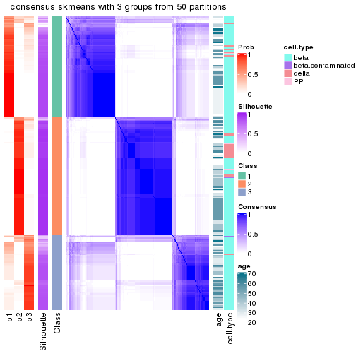</p>

</div>
<div id='tab-node-022-consensus-heatmap-3'>
<pre><code class="r">consensus_heatmap(res, k = 4)
</code></pre>

<p></p>

</div>
</div>

Heatmaps for the membership of samples in all partitions to see how consistent they are:


<script>
$( function() {
	$( '#tabs-node-022-membership-heatmap' ).tabs();
} );
</script>
<div id='tabs-node-022-membership-heatmap'>
<ul>
<li><a href='#tab-node-022-membership-heatmap-1'>k = 2</a></li>
<li><a href='#tab-node-022-membership-heatmap-2'>k = 3</a></li>
<li><a href='#tab-node-022-membership-heatmap-3'>k = 4</a></li>
</ul>
<div id='tab-node-022-membership-heatmap-1'>
<pre><code class="r">membership_heatmap(res, k = 2)
</code></pre>

<p></p>

</div>
<div id='tab-node-022-membership-heatmap-2'>
<pre><code class="r">membership_heatmap(res, k = 3)
</code></pre>

<p></p>

</div>
<div id='tab-node-022-membership-heatmap-3'>
<pre><code class="r">membership_heatmap(res, k = 4)
</code></pre>

<p></p>

</div>
</div>

As soon as the classes for columns are determined, the signatures
that are significantly different between subgroups can be looked for. 
Following are the heatmaps for signatures.


Signature heatmaps where rows are scaled:


<script>
$( function() {
	$( '#tabs-node-022-get-signatures' ).tabs();
} );
</script>
<div id='tabs-node-022-get-signatures'>
<ul>
<li><a href='#tab-node-022-get-signatures-1'>k = 2</a></li>
<li><a href='#tab-node-022-get-signatures-2'>k = 3</a></li>
<li><a href='#tab-node-022-get-signatures-3'>k = 4</a></li>
</ul>
<div id='tab-node-022-get-signatures-1'>
<pre><code class="r">get_signatures(res, k = 2)
</code></pre>

<p></p>

</div>
<div id='tab-node-022-get-signatures-2'>
<pre><code class="r">get_signatures(res, k = 3)
</code></pre>

<p></p>

</div>
<div id='tab-node-022-get-signatures-3'>
<pre><code class="r">get_signatures(res, k = 4)
</code></pre>

<p></p>

</div>
</div>


Signature heatmaps where rows are not scaled:


<script>
$( function() {
	$( '#tabs-node-022-get-signatures-no-scale' ).tabs();
} );
</script>
<div id='tabs-node-022-get-signatures-no-scale'>
<ul>
<li><a href='#tab-node-022-get-signatures-no-scale-1'>k = 2</a></li>
<li><a href='#tab-node-022-get-signatures-no-scale-2'>k = 3</a></li>
<li><a href='#tab-node-022-get-signatures-no-scale-3'>k = 4</a></li>
</ul>
<div id='tab-node-022-get-signatures-no-scale-1'>
<pre><code class="r">get_signatures(res, k = 2, scale_rows = FALSE)
</code></pre>

<p></p>

</div>
<div id='tab-node-022-get-signatures-no-scale-2'>
<pre><code class="r">get_signatures(res, k = 3, scale_rows = FALSE)
</code></pre>

<p></p>

</div>
<div id='tab-node-022-get-signatures-no-scale-3'>
<pre><code class="r">get_signatures(res, k = 4, scale_rows = FALSE)
</code></pre>

<p></p>

</div>
</div>


Compare the overlap of signatures from different k:

```r
compare_signatures(res)
```


`get_signature()` returns a data frame invisibly. To get the list of signatures, the function
call should be assigned to a variable explicitly. In following code, if `plot` argument is set
to `FALSE`, no heatmap is plotted while only the differential analysis is performed.

```r
# code only for demonstration
tb = get_signature(res, k = ..., plot = FALSE)
```

An example of the output of `tb` is:

```
#>   which_row         fdr    mean_1    mean_2 scaled_mean_1 scaled_mean_2 km
#> 1        38 0.042760348  8.373488  9.131774    -0.5533452     0.5164555  1
#> 2        40 0.018707592  7.106213  8.469186    -0.6173731     0.5762149  1
#> 3        55 0.019134737 10.221463 11.207825    -0.6159697     0.5749050  1
#> 4        59 0.006059896  5.921854  7.869574    -0.6899429     0.6439467  1
#> 5        60 0.018055526  8.928898 10.211722    -0.6204761     0.5791110  1
#> 6        98 0.009384629 15.714769 14.887706     0.6635654    -0.6193277  2
...
```

The columns in `tb` are:

1. `which_row`: row indices corresponding to the input matrix.
2. `fdr`: FDR for the differential test. 
3. `mean_x`: The mean value in group x.
4. `scaled_mean_x`: The mean value in group x after rows are scaled.
5. `km`: Row groups if k-means clustering is applied to rows (which is done by automatically selecting number of clusters).

If there are too many signatures, `top_signatures = ...` can be set to only show the 
signatures with the highest FDRs:

```r
# code only for demonstration
# e.g. to show the top 500 most significant rows
tb = get_signature(res, k = ..., top_signatures = 500)
```

If the signatures are defined as these which are uniquely high in current group, `diff_method` argument
can be set to `"uniquely_high_in_one_group"`:

```r
# code only for demonstration
tb = get_signature(res, k = ..., diff_method = "uniquely_high_in_one_group")
```


UMAP plot which shows how samples are separated.


<script>
$( function() {
	$( '#tabs-node-022-dimension-reduction' ).tabs();
} );
</script>
<div id='tabs-node-022-dimension-reduction'>
<ul>
<li><a href='#tab-node-022-dimension-reduction-1'>k = 2</a></li>
<li><a href='#tab-node-022-dimension-reduction-2'>k = 3</a></li>
<li><a href='#tab-node-022-dimension-reduction-3'>k = 4</a></li>
</ul>
<div id='tab-node-022-dimension-reduction-1'>
<pre><code class="r">dimension_reduction(res, k = 2, method = &quot;UMAP&quot;)
</code></pre>

<p></p>

</div>
<div id='tab-node-022-dimension-reduction-2'>
<pre><code class="r">dimension_reduction(res, k = 3, method = &quot;UMAP&quot;)
</code></pre>

<p></p>

</div>
<div id='tab-node-022-dimension-reduction-3'>
<pre><code class="r">dimension_reduction(res, k = 4, method = &quot;UMAP&quot;)
</code></pre>

<p></p>

</div>
</div>


Following heatmap shows how subgroups are split when increasing `k`:

```r
collect_classes(res)
```


Test correlation between subgroups and known annotations. If the known
annotation is numeric, one-way ANOVA test is applied, and if the known
annotation is discrete, chi-squared contingency table test is applied.

```r
test_to_known_factors(res)
```

```
#>             n_sample age(p-value) cell.type(p-value) k
#> ATC:skmeans      215       0.0916           1.16e-01 2
#> ATC:skmeans      203       0.0389           8.55e-02 3
#> ATC:skmeans      147       0.0105           3.92e-17 4
```


If matrix rows can be associated to genes, consider to use `functional_enrichment(res,
...)` to perform function enrichment for the signature genes. See [this vignette](https://jokergoo.github.io/cola_vignettes/functional_enrichment.html) for more detailed explanations.


 

---------------------------------------------------


### Node0221


Parent node: [Node022](#Node022).
Child nodes: 
                Node02111-leaf
        ,
                [Node02112](#Node02112)
        ,
                Node02121-leaf
        ,
                Node02122-leaf
        ,
                Node02211-leaf
        ,
                Node02212-leaf
        ,
                Node02221-leaf
        ,
                Node02222-leaf
        ,
                [Node03211](#Node03211)
        ,
                Node03212-leaf
        ,
                Node03221-leaf
        ,
                Node03222-leaf
        .


The object with results only for a single top-value method and a single partitioning method 
can be extracted as:

```r
res = res_rh["0221"]
```

A summary of `res` and all the functions that can be applied to it:

```r
res
```

```
#> A 'ConsensusPartition' object with k = 2, 3, 4.
#>   On a matrix with 14727 rows and 118 columns.
#>   Top rows (1005) are extracted by 'ATC' method.
#>   Subgroups are detected by 'skmeans' method.
#>   Performed in total 150 partitions by row resampling.
#>   Best k for subgroups seems to be 2.
#> 
#> Following methods can be applied to this 'ConsensusPartition' object:
#>  [1] "cola_report"             "collect_classes"         "collect_plots"          
#>  [4] "collect_stats"           "colnames"                "compare_partitions"     
#>  [7] "compare_signatures"      "consensus_heatmap"       "dimension_reduction"    
#> [10] "functional_enrichment"   "get_anno_col"            "get_anno"               
#> [13] "get_classes"             "get_consensus"           "get_matrix"             
#> [16] "get_membership"          "get_param"               "get_signatures"         
#> [19] "get_stats"               "is_best_k"               "is_stable_k"            
#> [22] "membership_heatmap"      "ncol"                    "nrow"                   
#> [25] "plot_ecdf"               "predict_classes"         "rownames"               
#> [28] "select_partition_number" "show"                    "suggest_best_k"         
#> [31] "test_to_known_factors"   "top_rows_heatmap"
```

`collect_plots()` function collects all the plots made from `res` for all `k` (number of subgroups)
into one single page to provide an easy and fast comparison between different `k`.

```r
collect_plots(res)
```


The plots are:

- The first row: a plot of the eCDF (empirical cumulative distribution
  function) curves of the consensus matrix for each `k` and the heatmap of
  predicted classes for each `k`.
- The second row: heatmaps of the consensus matrix for each `k`.
- The third row: heatmaps of the membership matrix for each `k`.
- The fouth row: heatmaps of the signatures for each `k`.

All the plots in panels can be made by individual functions and they are
plotted later in this section.

`select_partition_number()` produces several plots showing different
statistics for choosing "optimized" `k`. There are following statistics:

- eCDF curves of the consensus matrix for each `k`;
- 1-PAC. [The PAC score](https://en.wikipedia.org/wiki/Consensus_clustering#Over-interpretation_potential_of_consensus_clustering)
  measures the proportion of the ambiguous subgrouping.
- Mean silhouette score.
- Concordance. The mean probability of fiting the consensus subgroup labels in all
  partitions.
- Area increased. Denote $A_k$ as the area under the eCDF curve for current
  `k`, the area increased is defined as $A_k - A_{k-1}$.
- Rand index. The percent of pairs of samples that are both in a same cluster
  or both are not in a same cluster in the partition of k and k-1.
- Jaccard index. The ratio of pairs of samples are both in a same cluster in
  the partition of k and k-1 and the pairs of samples are both in a same
  cluster in the partition k or k-1.

The detailed explanations of these statistics can be found in [the _cola_
vignette](https://jokergoo.github.io/cola_vignettes/cola.html#toc_13).

Generally speaking, higher 1-PAC score, higher mean silhouette score or higher
concordance corresponds to better partition. Rand index and Jaccard index
measure how similar the current partition is compared to partition with `k-1`.
If they are too similar, we won't accept `k` is better than `k-1`.

```r
select_partition_number(res)
```


The numeric values for all these statistics can be obtained by `get_stats()`.

```r
get_stats(res)
```

```
#>   k 1-PAC mean_silhouette concordance area_increased  Rand Jaccard
#> 2 2 0.895           0.942       0.975          0.488 0.520   0.520
#> 3 3 0.472           0.635       0.809          0.363 0.759   0.557
#> 4 4 0.518           0.426       0.618          0.111 0.782   0.459
```

`suggest_best_k()` suggests the best $k$ based on these statistics. The rules are as follows:

- All $k$ with Jaccard index larger than 0.95 are removed because increasing
  $k$ does not provide enough extra information. If all $k$ are removed, it is
  marked as no subgroup is detected.
- For all $k$ with 1-PAC score larger than 0.9, the maximal $k$ is taken as
  the best $k$, and other $k$ are marked as optional $k$.
- If it does not fit the second rule. The $k$ with the maximal vote of the
  highest 1-PAC score, highest mean silhouette, and highest concordance is
  taken as the best $k$.

```r
suggest_best_k(res)
```

```
#> [1] 2
```


Following is the table of the partitions (You need to click the **show/hide
code output** link to see it). The membership matrix (columns with name `p*`)
is inferred by
[`clue::cl_consensus()`](https://www.rdocumentation.org/link/cl_consensus?package=clue)
function with the `SE` method. Basically the value in the membership matrix
represents the probability to belong to a certain group. The finall subgroup
label for an item is determined with the group with highest probability it
belongs to.

In `get_classes()` function, the entropy is calculated from the membership
matrix and the silhouette score is calculated from the consensus matrix.


<script>
$( function() {
	$( '#tabs-node-0221-get-classes' ).tabs();
} );
</script>
<div id='tabs-node-0221-get-classes'>
<ul>
<li><a href='#tab-node-0221-get-classes-1'>k = 2</a></li>
<li><a href='#tab-node-0221-get-classes-2'>k = 3</a></li>
<li><a href='#tab-node-0221-get-classes-3'>k = 4</a></li>
</ul>

<div id='tab-node-0221-get-classes-1'>
<p><a id='tab-node-0221-get-classes-1-a' style='color:#0366d6' href='#'>show/hide code output</a></p>
<pre><code class="r">cbind(get_classes(res, k = 2), get_membership(res, k = 2))
</code></pre>

<pre><code>#&gt;             class entropy silhouette   p1   p2
#&gt; Sample_2        1   0.000      0.962 1.00 0.00
#&gt; Sample_3        2   0.000      0.993 0.00 1.00
#&gt; Sample_5        1   0.529      0.857 0.88 0.12
#&gt; Sample_6        1   0.000      0.962 1.00 0.00
#&gt; Sample_7        1   0.584      0.834 0.86 0.14
#&gt; Sample_9        2   0.000      0.993 0.00 1.00
#&gt; Sample_10       1   0.000      0.962 1.00 0.00
#&gt; Sample_11       2   0.000      0.993 0.00 1.00
#&gt; Sample_12       1   0.000      0.962 1.00 0.00
#&gt; Sample_13       1   0.000      0.962 1.00 0.00
#&gt; Sample_14       1   0.000      0.962 1.00 0.00
#&gt; Sample_15       1   0.000      0.962 1.00 0.00
#&gt; Sample_16       2   0.000      0.993 0.00 1.00
#&gt; Sample_24       1   0.000      0.962 1.00 0.00
#&gt; Sample_26       1   0.584      0.833 0.86 0.14
#&gt; Sample_29       2   0.000      0.993 0.00 1.00
#&gt; Sample_32       2   0.000      0.993 0.00 1.00
#&gt; Sample_33       2   0.000      0.993 0.00 1.00
#&gt; Sample_34       2   0.000      0.993 0.00 1.00
#&gt; Sample_35       2   0.000      0.993 0.00 1.00
#&gt; Sample_36       2   0.000      0.993 0.00 1.00
#&gt; Sample_37       2   0.000      0.993 0.00 1.00
#&gt; Sample_38       2   0.000      0.993 0.00 1.00
#&gt; Sample_39       2   0.000      0.993 0.00 1.00
#&gt; Sample_40       2   0.000      0.993 0.00 1.00
#&gt; Sample_41       2   0.000      0.993 0.00 1.00
#&gt; Sample_42       2   0.000      0.993 0.00 1.00
#&gt; Sample_44       2   0.000      0.993 0.00 1.00
#&gt; Sample_45       2   0.000      0.993 0.00 1.00
#&gt; Sample_46       2   0.000      0.993 0.00 1.00
#&gt; Sample_47       2   0.000      0.993 0.00 1.00
#&gt; Sample_48       2   0.000      0.993 0.00 1.00
#&gt; Sample_49       2   0.000      0.993 0.00 1.00
#&gt; Sample_50       2   0.000      0.993 0.00 1.00
#&gt; Sample_51       2   0.000      0.993 0.00 1.00
#&gt; Sample_52       2   0.000      0.993 0.00 1.00
#&gt; Sample_55       2   0.000      0.993 0.00 1.00
#&gt; Sample_56       1   0.242      0.931 0.96 0.04
#&gt; Sample_57       1   0.000      0.962 1.00 0.00
#&gt; Sample_58       1   0.000      0.962 1.00 0.00
#&gt; Sample_59       2   0.000      0.993 0.00 1.00
#&gt; Sample_60       1   0.000      0.962 1.00 0.00
#&gt; Sample_62       1   0.000      0.962 1.00 0.00
#&gt; Sample_63       1   0.000      0.962 1.00 0.00
#&gt; Sample_64       1   0.000      0.962 1.00 0.00
#&gt; Sample_65       1   0.000      0.962 1.00 0.00
#&gt; Sample_66       1   0.000      0.962 1.00 0.00
#&gt; Sample_68       1   0.000      0.962 1.00 0.00
#&gt; Sample_69       1   0.000      0.962 1.00 0.00
#&gt; Sample_74       1   0.000      0.962 1.00 0.00
#&gt; Sample_76       1   0.999      0.115 0.52 0.48
#&gt; Sample_78       1   0.000      0.962 1.00 0.00
#&gt; Sample_81       1   0.000      0.962 1.00 0.00
#&gt; Sample_83       1   0.000      0.962 1.00 0.00
#&gt; Sample_84       1   0.000      0.962 1.00 0.00
#&gt; Sample_86       2   0.000      0.993 0.00 1.00
#&gt; Sample_96       1   0.000      0.962 1.00 0.00
#&gt; Sample_97       1   0.000      0.962 1.00 0.00
#&gt; Sample_98       1   0.000      0.962 1.00 0.00
#&gt; Sample_99       1   0.000      0.962 1.00 0.00
#&gt; Sample_102      2   0.402      0.910 0.08 0.92
#&gt; Sample_105      1   0.141      0.947 0.98 0.02
#&gt; Sample_106      1   0.000      0.962 1.00 0.00
#&gt; Sample_108      1   0.981      0.311 0.58 0.42
#&gt; Sample_109      1   0.000      0.962 1.00 0.00
#&gt; Sample_120      1   0.000      0.962 1.00 0.00
#&gt; Sample_124      1   0.000      0.962 1.00 0.00
#&gt; Sample_125      1   0.000      0.962 1.00 0.00
#&gt; Sample_127      1   0.000      0.962 1.00 0.00
#&gt; Sample_129      1   0.000      0.962 1.00 0.00
#&gt; Sample_132      1   0.000      0.962 1.00 0.00
#&gt; Sample_134      1   0.000      0.962 1.00 0.00
#&gt; Sample_136      1   0.000      0.962 1.00 0.00
#&gt; Sample_137      1   0.000      0.962 1.00 0.00
#&gt; Sample_138      1   0.000      0.962 1.00 0.00
#&gt; Sample_140      1   0.000      0.962 1.00 0.00
#&gt; Sample_141      1   0.000      0.962 1.00 0.00
#&gt; Sample_197      1   0.881      0.592 0.70 0.30
#&gt; Sample_198      1   0.000      0.962 1.00 0.00
#&gt; Sample_199      2   0.000      0.993 0.00 1.00
#&gt; Sample_200      2   0.000      0.993 0.00 1.00
#&gt; Sample_201      2   0.000      0.993 0.00 1.00
#&gt; Sample_202      2   0.000      0.993 0.00 1.00
#&gt; Sample_203      2   0.000      0.993 0.00 1.00
#&gt; Sample_205      2   0.000      0.993 0.00 1.00
#&gt; Sample_206      2   0.000      0.993 0.00 1.00
#&gt; Sample_207      2   0.000      0.993 0.00 1.00
#&gt; Sample_586      2   0.000      0.993 0.00 1.00
#&gt; Sample_587      1   0.000      0.962 1.00 0.00
#&gt; Sample_591      1   0.000      0.962 1.00 0.00
#&gt; Sample_593      2   0.000      0.993 0.00 1.00
#&gt; Sample_607      1   0.000      0.962 1.00 0.00
#&gt; Sample_651      2   0.000      0.993 0.00 1.00
#&gt; Sample_652      1   0.000      0.962 1.00 0.00
#&gt; Sample_653      1   0.000      0.962 1.00 0.00
#&gt; Sample_654      2   0.469      0.886 0.10 0.90
#&gt; Sample_655      1   0.000      0.962 1.00 0.00
#&gt; Sample_656      1   0.000      0.962 1.00 0.00
#&gt; Sample_658      2   0.469      0.887 0.10 0.90
#&gt; Sample_659      1   0.000      0.962 1.00 0.00
#&gt; Sample_661      1   0.000      0.962 1.00 0.00
#&gt; Sample_664      1   0.000      0.962 1.00 0.00
#&gt; Sample_671      1   0.000      0.962 1.00 0.00
#&gt; Sample_677      2   0.000      0.993 0.00 1.00
#&gt; Sample_678      2   0.000      0.993 0.00 1.00
#&gt; Sample_679      1   0.795      0.696 0.76 0.24
#&gt; Sample_704      1   0.000      0.962 1.00 0.00
#&gt; Sample_842      2   0.000      0.993 0.00 1.00
#&gt; Sample_843      2   0.000      0.993 0.00 1.00
#&gt; Sample_844      1   0.000      0.962 1.00 0.00
#&gt; Sample_845      1   0.000      0.962 1.00 0.00
#&gt; Sample_846      1   0.000      0.962 1.00 0.00
#&gt; Sample_850      1   0.634      0.810 0.84 0.16
#&gt; Sample_851      1   0.000      0.962 1.00 0.00
#&gt; Sample_853      1   0.242      0.932 0.96 0.04
#&gt; Sample_854      1   0.990      0.255 0.56 0.44
#&gt; Sample_1519     1   0.000      0.962 1.00 0.00
#&gt; Sample_1537     1   0.469      0.877 0.90 0.10
</code></pre>

<script>
$('#tab-node-0221-get-classes-1-a').parent().next().next().hide();
$('#tab-node-0221-get-classes-1-a').click(function(){
  $('#tab-node-0221-get-classes-1-a').parent().next().next().toggle();
  return(false);
});
</script>
</div>

<div id='tab-node-0221-get-classes-2'>
<p><a id='tab-node-0221-get-classes-2-a' style='color:#0366d6' href='#'>show/hide code output</a></p>
<pre><code class="r">cbind(get_classes(res, k = 3), get_membership(res, k = 3))
</code></pre>

<pre><code>#&gt;             class entropy silhouette   p1   p2   p3
#&gt; Sample_2        3  0.5706      0.527 0.32 0.00 0.68
#&gt; Sample_3        2  0.3042      0.874 0.04 0.92 0.04
#&gt; Sample_5        1  0.3340      0.664 0.88 0.12 0.00
#&gt; Sample_6        1  0.5835      0.265 0.66 0.00 0.34
#&gt; Sample_7        3  0.5948      0.416 0.36 0.00 0.64
#&gt; Sample_9        3  0.8472      0.118 0.10 0.36 0.54
#&gt; Sample_10       3  0.5560      0.522 0.30 0.00 0.70
#&gt; Sample_11       3  0.8853      0.363 0.32 0.14 0.54
#&gt; Sample_12       3  0.5706      0.499 0.32 0.00 0.68
#&gt; Sample_13       3  0.5835      0.446 0.34 0.00 0.66
#&gt; Sample_14       3  0.5216      0.636 0.26 0.00 0.74
#&gt; Sample_15       3  0.4796      0.617 0.22 0.00 0.78
#&gt; Sample_16       2  0.5667      0.791 0.14 0.80 0.06
#&gt; Sample_24       1  0.2066      0.710 0.94 0.00 0.06
#&gt; Sample_26       1  0.2537      0.699 0.92 0.08 0.00
#&gt; Sample_29       2  0.2959      0.868 0.00 0.90 0.10
#&gt; Sample_32       2  0.2959      0.868 0.00 0.90 0.10
#&gt; Sample_33       2  0.2959      0.868 0.00 0.90 0.10
#&gt; Sample_34       2  0.6309      0.219 0.00 0.50 0.50
#&gt; Sample_35       2  0.2959      0.868 0.00 0.90 0.10
#&gt; Sample_36       2  0.2959      0.868 0.00 0.90 0.10
#&gt; Sample_37       2  0.2959      0.868 0.00 0.90 0.10
#&gt; Sample_38       2  0.2959      0.868 0.00 0.90 0.10
#&gt; Sample_39       2  0.2959      0.868 0.00 0.90 0.10
#&gt; Sample_40       2  0.2959      0.868 0.00 0.90 0.10
#&gt; Sample_41       2  0.2959      0.868 0.00 0.90 0.10
#&gt; Sample_42       2  0.2959      0.868 0.00 0.90 0.10
#&gt; Sample_44       2  0.2959      0.868 0.00 0.90 0.10
#&gt; Sample_45       2  0.2959      0.868 0.00 0.90 0.10
#&gt; Sample_46       2  0.1781      0.880 0.02 0.96 0.02
#&gt; Sample_47       2  0.1781      0.880 0.02 0.96 0.02
#&gt; Sample_48       2  0.0892      0.879 0.02 0.98 0.00
#&gt; Sample_49       2  0.1529      0.875 0.04 0.96 0.00
#&gt; Sample_50       2  0.0892      0.879 0.02 0.98 0.00
#&gt; Sample_51       2  0.0892      0.879 0.02 0.98 0.00
#&gt; Sample_52       2  0.0892      0.879 0.02 0.98 0.00
#&gt; Sample_55       2  0.6192      0.340 0.00 0.58 0.42
#&gt; Sample_56       1  0.2959      0.679 0.90 0.10 0.00
#&gt; Sample_57       1  0.2947      0.706 0.92 0.06 0.02
#&gt; Sample_58       1  0.2947      0.706 0.92 0.06 0.02
#&gt; Sample_59       2  0.6126      0.376 0.40 0.60 0.00
#&gt; Sample_60       1  0.1529      0.719 0.96 0.00 0.04
#&gt; Sample_62       1  0.1529      0.719 0.96 0.00 0.04
#&gt; Sample_63       1  0.1529      0.719 0.96 0.00 0.04
#&gt; Sample_64       1  0.1529      0.719 0.96 0.00 0.04
#&gt; Sample_65       1  0.1529      0.719 0.96 0.00 0.04
#&gt; Sample_66       1  0.1529      0.719 0.96 0.00 0.04
#&gt; Sample_68       1  0.1529      0.719 0.96 0.00 0.04
#&gt; Sample_69       1  0.1529      0.719 0.96 0.00 0.04
#&gt; Sample_74       3  0.6126      0.478 0.40 0.00 0.60
#&gt; Sample_76       1  0.2959      0.679 0.90 0.10 0.00
#&gt; Sample_78       3  0.6302     -0.101 0.48 0.00 0.52
#&gt; Sample_81       1  0.6803      0.573 0.68 0.04 0.28
#&gt; Sample_83       1  0.4002      0.688 0.84 0.00 0.16
#&gt; Sample_84       3  0.5216      0.527 0.26 0.00 0.74
#&gt; Sample_86       2  0.0892      0.880 0.02 0.98 0.00
#&gt; Sample_96       1  0.6984      0.303 0.56 0.02 0.42
#&gt; Sample_97       3  0.5948      0.315 0.36 0.00 0.64
#&gt; Sample_98       3  0.4002      0.645 0.16 0.00 0.84
#&gt; Sample_99       1  0.6302      0.195 0.52 0.00 0.48
#&gt; Sample_102      1  0.4291      0.630 0.82 0.18 0.00
#&gt; Sample_105      1  0.7995      0.239 0.48 0.06 0.46
#&gt; Sample_106      1  0.6192      0.368 0.58 0.00 0.42
#&gt; Sample_108      1  0.8483      0.553 0.60 0.14 0.26
#&gt; Sample_109      3  0.4291      0.629 0.18 0.00 0.82
#&gt; Sample_120      3  0.5948      0.315 0.36 0.00 0.64
#&gt; Sample_124      3  0.4555      0.609 0.20 0.00 0.80
#&gt; Sample_125      3  0.7578     -0.134 0.46 0.04 0.50
#&gt; Sample_127      1  0.5560      0.582 0.70 0.00 0.30
#&gt; Sample_129      3  0.6309     -0.173 0.50 0.00 0.50
#&gt; Sample_132      1  0.5216      0.624 0.74 0.00 0.26
#&gt; Sample_134      1  0.6045      0.458 0.62 0.00 0.38
#&gt; Sample_136      3  0.3415      0.670 0.08 0.02 0.90
#&gt; Sample_137      3  0.2959      0.673 0.10 0.00 0.90
#&gt; Sample_138      3  0.2959      0.673 0.10 0.00 0.90
#&gt; Sample_140      3  0.2959      0.673 0.10 0.00 0.90
#&gt; Sample_141      3  0.3686      0.657 0.14 0.00 0.86
#&gt; Sample_197      3  0.7975      0.441 0.18 0.16 0.66
#&gt; Sample_198      1  0.5706      0.556 0.68 0.00 0.32
#&gt; Sample_199      2  0.1529      0.875 0.04 0.96 0.00
#&gt; Sample_200      2  0.3686      0.798 0.14 0.86 0.00
#&gt; Sample_201      2  0.1529      0.875 0.04 0.96 0.00
#&gt; Sample_202      2  0.1529      0.875 0.04 0.96 0.00
#&gt; Sample_203      2  0.1529      0.875 0.04 0.96 0.00
#&gt; Sample_205      2  0.0892      0.880 0.02 0.98 0.00
#&gt; Sample_206      2  0.1529      0.875 0.04 0.96 0.00
#&gt; Sample_207      2  0.1529      0.875 0.04 0.96 0.00
#&gt; Sample_586      3  0.7277      0.359 0.06 0.28 0.66
#&gt; Sample_587      3  0.2537      0.653 0.08 0.00 0.92
#&gt; Sample_591      3  0.2066      0.657 0.06 0.00 0.94
#&gt; Sample_593      2  0.2959      0.868 0.00 0.90 0.10
#&gt; Sample_607      3  0.4291      0.670 0.18 0.00 0.82
#&gt; Sample_651      2  0.1529      0.879 0.00 0.96 0.04
#&gt; Sample_652      1  0.1529      0.724 0.96 0.00 0.04
#&gt; Sample_653      1  0.5397      0.605 0.72 0.00 0.28
#&gt; Sample_654      1  0.4002      0.651 0.84 0.16 0.00
#&gt; Sample_655      1  0.1529      0.719 0.96 0.00 0.04
#&gt; Sample_656      1  0.5706      0.558 0.68 0.00 0.32
#&gt; Sample_658      2  0.9912     -0.115 0.30 0.40 0.30
#&gt; Sample_659      1  0.4796      0.655 0.78 0.00 0.22
#&gt; Sample_661      1  0.4966      0.691 0.84 0.10 0.06
#&gt; Sample_664      3  0.2959      0.673 0.10 0.00 0.90
#&gt; Sample_671      3  0.2959      0.673 0.10 0.00 0.90
#&gt; Sample_677      2  0.4555      0.720 0.20 0.80 0.00
#&gt; Sample_678      2  0.3686      0.796 0.14 0.86 0.00
#&gt; Sample_679      3  0.4556      0.640 0.06 0.08 0.86
#&gt; Sample_704      1  0.6495      0.677 0.74 0.06 0.20
#&gt; Sample_842      2  0.0892      0.880 0.02 0.98 0.00
#&gt; Sample_843      2  0.1781      0.881 0.02 0.96 0.02
#&gt; Sample_844      1  0.3832      0.687 0.88 0.10 0.02
#&gt; Sample_845      3  0.3340      0.669 0.12 0.00 0.88
#&gt; Sample_846      1  0.4035      0.717 0.88 0.04 0.08
#&gt; Sample_850      1  0.4966      0.691 0.84 0.10 0.06
#&gt; Sample_851      1  0.5835      0.526 0.66 0.00 0.34
#&gt; Sample_853      3  0.6651      0.397 0.34 0.02 0.64
#&gt; Sample_854      1  0.9192      0.451 0.52 0.18 0.30
#&gt; Sample_1519     3  0.4555      0.662 0.20 0.00 0.80
#&gt; Sample_1537     1  0.7948      0.134 0.52 0.06 0.42
</code></pre>

<script>
$('#tab-node-0221-get-classes-2-a').parent().next().next().hide();
$('#tab-node-0221-get-classes-2-a').click(function(){
  $('#tab-node-0221-get-classes-2-a').parent().next().next().toggle();
  return(false);
});
</script>
</div>

<div id='tab-node-0221-get-classes-3'>
<p><a id='tab-node-0221-get-classes-3-a' style='color:#0366d6' href='#'>show/hide code output</a></p>
<pre><code class="r">cbind(get_classes(res, k = 4), get_membership(res, k = 4))
</code></pre>

<pre><code>#&gt;             class entropy silhouette   p1   p2   p3   p4
#&gt; Sample_2        3  0.8365   0.005649 0.32 0.26 0.40 0.02
#&gt; Sample_3        2  0.6714   0.267131 0.00 0.54 0.10 0.36
#&gt; Sample_5        1  0.4977  -0.029317 0.54 0.46 0.00 0.00
#&gt; Sample_6        1  0.7707   0.082883 0.44 0.24 0.32 0.00
#&gt; Sample_7        3  0.9260  -0.014345 0.32 0.26 0.34 0.08
#&gt; Sample_9        4  0.9036   0.059706 0.06 0.26 0.34 0.34
#&gt; Sample_10       3  0.9243   0.009775 0.30 0.26 0.36 0.08
#&gt; Sample_11       3  0.9816   0.043584 0.20 0.26 0.34 0.20
#&gt; Sample_12       3  0.8738   0.000343 0.32 0.26 0.38 0.04
#&gt; Sample_13       1  0.8754  -0.008571 0.36 0.26 0.34 0.04
#&gt; Sample_14       3  0.8268   0.045587 0.28 0.26 0.44 0.02
#&gt; Sample_15       3  0.8705   0.018531 0.30 0.26 0.40 0.04
#&gt; Sample_16       2  0.6611   0.288941 0.04 0.48 0.02 0.46
#&gt; Sample_24       1  0.6723   0.287056 0.60 0.14 0.26 0.00
#&gt; Sample_26       1  0.5392   0.426356 0.68 0.28 0.04 0.00
#&gt; Sample_29       4  0.0000   0.808489 0.00 0.00 0.00 1.00
#&gt; Sample_32       4  0.0000   0.808489 0.00 0.00 0.00 1.00
#&gt; Sample_33       4  0.0000   0.808489 0.00 0.00 0.00 1.00
#&gt; Sample_34       4  0.2921   0.668804 0.00 0.14 0.00 0.86
#&gt; Sample_35       4  0.0000   0.808489 0.00 0.00 0.00 1.00
#&gt; Sample_36       4  0.0707   0.792892 0.00 0.02 0.00 0.98
#&gt; Sample_37       4  0.0000   0.808489 0.00 0.00 0.00 1.00
#&gt; Sample_38       4  0.0000   0.808489 0.00 0.00 0.00 1.00
#&gt; Sample_39       4  0.0000   0.808489 0.00 0.00 0.00 1.00
#&gt; Sample_40       4  0.1211   0.770864 0.00 0.04 0.00 0.96
#&gt; Sample_41       4  0.0000   0.808489 0.00 0.00 0.00 1.00
#&gt; Sample_42       4  0.0000   0.808489 0.00 0.00 0.00 1.00
#&gt; Sample_44       4  0.0000   0.808489 0.00 0.00 0.00 1.00
#&gt; Sample_45       4  0.0707   0.792892 0.00 0.02 0.00 0.98
#&gt; Sample_46       4  0.4948  -0.169461 0.00 0.44 0.00 0.56
#&gt; Sample_47       4  0.4790   0.050094 0.00 0.38 0.00 0.62
#&gt; Sample_48       2  0.4713   0.633714 0.00 0.64 0.00 0.36
#&gt; Sample_49       2  0.4277   0.709704 0.00 0.72 0.00 0.28
#&gt; Sample_50       2  0.4790   0.601025 0.00 0.62 0.00 0.38
#&gt; Sample_51       2  0.4713   0.632237 0.00 0.64 0.00 0.36
#&gt; Sample_52       2  0.4713   0.633714 0.00 0.64 0.00 0.36
#&gt; Sample_55       4  0.6574   0.142382 0.02 0.04 0.42 0.52
#&gt; Sample_56       1  0.4994  -0.100851 0.52 0.48 0.00 0.00
#&gt; Sample_57       1  0.2345   0.584414 0.90 0.10 0.00 0.00
#&gt; Sample_58       1  0.3853   0.542161 0.82 0.16 0.02 0.00
#&gt; Sample_59       2  0.4134   0.590079 0.26 0.74 0.00 0.00
#&gt; Sample_60       1  0.0707   0.603457 0.98 0.00 0.02 0.00
#&gt; Sample_62       1  0.0000   0.615118 1.00 0.00 0.00 0.00
#&gt; Sample_63       1  0.0000   0.615118 1.00 0.00 0.00 0.00
#&gt; Sample_64       1  0.0000   0.615118 1.00 0.00 0.00 0.00
#&gt; Sample_65       1  0.0000   0.615118 1.00 0.00 0.00 0.00
#&gt; Sample_66       1  0.0000   0.615118 1.00 0.00 0.00 0.00
#&gt; Sample_68       1  0.0000   0.615118 1.00 0.00 0.00 0.00
#&gt; Sample_69       1  0.0000   0.615118 1.00 0.00 0.00 0.00
#&gt; Sample_74       1  0.5291   0.348457 0.74 0.08 0.18 0.00
#&gt; Sample_76       2  0.4624   0.507384 0.34 0.66 0.00 0.00
#&gt; Sample_78       3  0.4713   0.422302 0.36 0.00 0.64 0.00
#&gt; Sample_81       3  0.6262   0.317338 0.40 0.06 0.54 0.00
#&gt; Sample_83       1  0.2921   0.487229 0.86 0.00 0.14 0.00
#&gt; Sample_84       3  0.4855   0.393513 0.40 0.00 0.60 0.00
#&gt; Sample_86       2  0.4624   0.658677 0.00 0.66 0.00 0.34
#&gt; Sample_96       3  0.6089   0.428598 0.28 0.08 0.64 0.00
#&gt; Sample_97       3  0.4522   0.451082 0.32 0.00 0.68 0.00
#&gt; Sample_98       3  0.4522   0.451082 0.32 0.00 0.68 0.00
#&gt; Sample_99       3  0.4790   0.402730 0.38 0.00 0.62 0.00
#&gt; Sample_102      2  0.4134   0.590079 0.26 0.74 0.00 0.00
#&gt; Sample_105      3  0.6656   0.377245 0.22 0.16 0.62 0.00
#&gt; Sample_106      3  0.4855   0.386920 0.40 0.00 0.60 0.00
#&gt; Sample_108      2  0.6201   0.438140 0.08 0.62 0.30 0.00
#&gt; Sample_109      3  0.4855   0.389921 0.40 0.00 0.60 0.00
#&gt; Sample_120      3  0.4855   0.394203 0.40 0.00 0.60 0.00
#&gt; Sample_124      3  0.4406   0.457135 0.30 0.00 0.70 0.00
#&gt; Sample_125      3  0.5619   0.434221 0.32 0.04 0.64 0.00
#&gt; Sample_127      1  0.5000  -0.268381 0.50 0.00 0.50 0.00
#&gt; Sample_129      3  0.4907   0.367105 0.42 0.00 0.58 0.00
#&gt; Sample_132      1  0.4624   0.141970 0.66 0.00 0.34 0.00
#&gt; Sample_134      1  0.4907  -0.108824 0.58 0.00 0.42 0.00
#&gt; Sample_136      3  0.4088   0.422744 0.14 0.00 0.82 0.04
#&gt; Sample_137      3  0.4277   0.459989 0.28 0.00 0.72 0.00
#&gt; Sample_138      3  0.4522   0.451082 0.32 0.00 0.68 0.00
#&gt; Sample_140      3  0.4277   0.459989 0.28 0.00 0.72 0.00
#&gt; Sample_141      3  0.4522   0.451082 0.32 0.00 0.68 0.00
#&gt; Sample_197      3  0.4713   0.187614 0.00 0.36 0.64 0.00
#&gt; Sample_198      3  0.4994   0.255179 0.48 0.00 0.52 0.00
#&gt; Sample_199      2  0.4134   0.717571 0.00 0.74 0.00 0.26
#&gt; Sample_200      2  0.4642   0.720898 0.02 0.74 0.00 0.24
#&gt; Sample_201      2  0.4277   0.708375 0.00 0.72 0.00 0.28
#&gt; Sample_202      2  0.4134   0.717571 0.00 0.74 0.00 0.26
#&gt; Sample_203      2  0.4134   0.717571 0.00 0.74 0.00 0.26
#&gt; Sample_205      2  0.4134   0.717571 0.00 0.74 0.00 0.26
#&gt; Sample_206      2  0.5147   0.718487 0.06 0.74 0.00 0.20
#&gt; Sample_207      2  0.4277   0.708645 0.00 0.72 0.00 0.28
#&gt; Sample_586      3  0.8389  -0.124713 0.02 0.26 0.38 0.34
#&gt; Sample_587      3  0.8991   0.101665 0.18 0.26 0.46 0.10
#&gt; Sample_591      3  0.9194   0.111567 0.12 0.26 0.44 0.18
#&gt; Sample_593      4  0.0000   0.808489 0.00 0.00 0.00 1.00
#&gt; Sample_607      3  0.6471   0.198496 0.08 0.24 0.66 0.02
#&gt; Sample_651      4  0.4855  -0.062097 0.00 0.40 0.00 0.60
#&gt; Sample_652      1  0.0707   0.611882 0.98 0.02 0.00 0.00
#&gt; Sample_653      1  0.3801   0.385137 0.78 0.00 0.22 0.00
#&gt; Sample_654      2  0.4277   0.569513 0.28 0.72 0.00 0.00
#&gt; Sample_655      1  0.0707   0.608092 0.98 0.00 0.02 0.00
#&gt; Sample_656      3  0.4994   0.259771 0.48 0.00 0.52 0.00
#&gt; Sample_658      2  0.6767   0.559299 0.04 0.66 0.22 0.08
#&gt; Sample_659      1  0.4790   0.040812 0.62 0.00 0.38 0.00
#&gt; Sample_661      2  0.4994   0.135088 0.48 0.52 0.00 0.00
#&gt; Sample_664      3  0.4277   0.460007 0.28 0.00 0.72 0.00
#&gt; Sample_671      3  0.4277   0.460007 0.28 0.00 0.72 0.00
#&gt; Sample_677      2  0.5147   0.718502 0.06 0.74 0.00 0.20
#&gt; Sample_678      2  0.5224   0.715722 0.04 0.76 0.02 0.18
#&gt; Sample_679      3  0.6463   0.425755 0.18 0.06 0.70 0.06
#&gt; Sample_704      1  0.7285   0.370406 0.52 0.30 0.18 0.00
#&gt; Sample_842      2  0.4948   0.511629 0.00 0.56 0.00 0.44
#&gt; Sample_843      2  0.4907   0.548089 0.00 0.58 0.00 0.42
#&gt; Sample_844      1  0.5428   0.240672 0.60 0.38 0.02 0.00
#&gt; Sample_845      3  0.6840   0.154556 0.18 0.22 0.60 0.00
#&gt; Sample_846      1  0.5486   0.497698 0.72 0.20 0.08 0.00
#&gt; Sample_850      2  0.4713   0.438061 0.36 0.64 0.00 0.00
#&gt; Sample_851      3  0.4994   0.275836 0.48 0.00 0.52 0.00
#&gt; Sample_853      3  0.6755   0.391666 0.18 0.14 0.66 0.02
#&gt; Sample_854      2  0.6510   0.325406 0.08 0.54 0.38 0.00
#&gt; Sample_1519     3  0.7664   0.153629 0.14 0.24 0.58 0.04
#&gt; Sample_1537     3  0.7537   0.125107 0.10 0.30 0.56 0.04
</code></pre>

<script>
$('#tab-node-0221-get-classes-3-a').parent().next().next().hide();
$('#tab-node-0221-get-classes-3-a').click(function(){
  $('#tab-node-0221-get-classes-3-a').parent().next().next().toggle();
  return(false);
});
</script>
</div>
</div>

Heatmaps for the consensus matrix. It visualizes the probability of two
samples to be in a same group.


<script>
$( function() {
	$( '#tabs-node-0221-consensus-heatmap' ).tabs();
} );
</script>
<div id='tabs-node-0221-consensus-heatmap'>
<ul>
<li><a href='#tab-node-0221-consensus-heatmap-1'>k = 2</a></li>
<li><a href='#tab-node-0221-consensus-heatmap-2'>k = 3</a></li>
<li><a href='#tab-node-0221-consensus-heatmap-3'>k = 4</a></li>
</ul>
<div id='tab-node-0221-consensus-heatmap-1'>
<pre><code class="r">consensus_heatmap(res, k = 2)
</code></pre>

<p></p>

</div>
<div id='tab-node-0221-consensus-heatmap-2'>
<pre><code class="r">consensus_heatmap(res, k = 3)
</code></pre>

<p></p>

</div>
<div id='tab-node-0221-consensus-heatmap-3'>
<pre><code class="r">consensus_heatmap(res, k = 4)
</code></pre>

<p></p>

</div>
</div>

Heatmaps for the membership of samples in all partitions to see how consistent they are:


<script>
$( function() {
	$( '#tabs-node-0221-membership-heatmap' ).tabs();
} );
</script>
<div id='tabs-node-0221-membership-heatmap'>
<ul>
<li><a href='#tab-node-0221-membership-heatmap-1'>k = 2</a></li>
<li><a href='#tab-node-0221-membership-heatmap-2'>k = 3</a></li>
<li><a href='#tab-node-0221-membership-heatmap-3'>k = 4</a></li>
</ul>
<div id='tab-node-0221-membership-heatmap-1'>
<pre><code class="r">membership_heatmap(res, k = 2)
</code></pre>

<p></p>

</div>
<div id='tab-node-0221-membership-heatmap-2'>
<pre><code class="r">membership_heatmap(res, k = 3)
</code></pre>

<p></p>

</div>
<div id='tab-node-0221-membership-heatmap-3'>
<pre><code class="r">membership_heatmap(res, k = 4)
</code></pre>

<p></p>

</div>
</div>

As soon as the classes for columns are determined, the signatures
that are significantly different between subgroups can be looked for. 
Following are the heatmaps for signatures.


Signature heatmaps where rows are scaled:


<script>
$( function() {
	$( '#tabs-node-0221-get-signatures' ).tabs();
} );
</script>
<div id='tabs-node-0221-get-signatures'>
<ul>
<li><a href='#tab-node-0221-get-signatures-1'>k = 2</a></li>
<li><a href='#tab-node-0221-get-signatures-2'>k = 3</a></li>
<li><a href='#tab-node-0221-get-signatures-3'>k = 4</a></li>
</ul>
<div id='tab-node-0221-get-signatures-1'>
<pre><code class="r">get_signatures(res, k = 2)
</code></pre>

<p></p>

</div>
<div id='tab-node-0221-get-signatures-2'>
<pre><code class="r">get_signatures(res, k = 3)
</code></pre>

<p></p>

</div>
<div id='tab-node-0221-get-signatures-3'>
<pre><code class="r">get_signatures(res, k = 4)
</code></pre>

<p>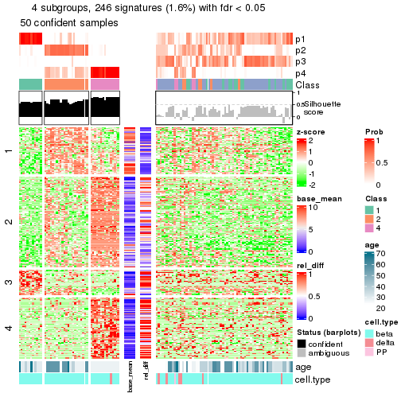</p>

</div>
</div>


Signature heatmaps where rows are not scaled:


<script>
$( function() {
	$( '#tabs-node-0221-get-signatures-no-scale' ).tabs();
} );
</script>
<div id='tabs-node-0221-get-signatures-no-scale'>
<ul>
<li><a href='#tab-node-0221-get-signatures-no-scale-1'>k = 2</a></li>
<li><a href='#tab-node-0221-get-signatures-no-scale-2'>k = 3</a></li>
<li><a href='#tab-node-0221-get-signatures-no-scale-3'>k = 4</a></li>
</ul>
<div id='tab-node-0221-get-signatures-no-scale-1'>
<pre><code class="r">get_signatures(res, k = 2, scale_rows = FALSE)
</code></pre>

<p></p>

</div>
<div id='tab-node-0221-get-signatures-no-scale-2'>
<pre><code class="r">get_signatures(res, k = 3, scale_rows = FALSE)
</code></pre>

<p></p>

</div>
<div id='tab-node-0221-get-signatures-no-scale-3'>
<pre><code class="r">get_signatures(res, k = 4, scale_rows = FALSE)
</code></pre>

<p></p>

</div>
</div>


Compare the overlap of signatures from different k:

```r
compare_signatures(res)
```


`get_signature()` returns a data frame invisibly. To get the list of signatures, the function
call should be assigned to a variable explicitly. In following code, if `plot` argument is set
to `FALSE`, no heatmap is plotted while only the differential analysis is performed.

```r
# code only for demonstration
tb = get_signature(res, k = ..., plot = FALSE)
```

An example of the output of `tb` is:

```
#>   which_row         fdr    mean_1    mean_2 scaled_mean_1 scaled_mean_2 km
#> 1        38 0.042760348  8.373488  9.131774    -0.5533452     0.5164555  1
#> 2        40 0.018707592  7.106213  8.469186    -0.6173731     0.5762149  1
#> 3        55 0.019134737 10.221463 11.207825    -0.6159697     0.5749050  1
#> 4        59 0.006059896  5.921854  7.869574    -0.6899429     0.6439467  1
#> 5        60 0.018055526  8.928898 10.211722    -0.6204761     0.5791110  1
#> 6        98 0.009384629 15.714769 14.887706     0.6635654    -0.6193277  2
...
```

The columns in `tb` are:

1. `which_row`: row indices corresponding to the input matrix.
2. `fdr`: FDR for the differential test. 
3. `mean_x`: The mean value in group x.
4. `scaled_mean_x`: The mean value in group x after rows are scaled.
5. `km`: Row groups if k-means clustering is applied to rows (which is done by automatically selecting number of clusters).

If there are too many signatures, `top_signatures = ...` can be set to only show the 
signatures with the highest FDRs:

```r
# code only for demonstration
# e.g. to show the top 500 most significant rows
tb = get_signature(res, k = ..., top_signatures = 500)
```

If the signatures are defined as these which are uniquely high in current group, `diff_method` argument
can be set to `"uniquely_high_in_one_group"`:

```r
# code only for demonstration
tb = get_signature(res, k = ..., diff_method = "uniquely_high_in_one_group")
```


UMAP plot which shows how samples are separated.


<script>
$( function() {
	$( '#tabs-node-0221-dimension-reduction' ).tabs();
} );
</script>
<div id='tabs-node-0221-dimension-reduction'>
<ul>
<li><a href='#tab-node-0221-dimension-reduction-1'>k = 2</a></li>
<li><a href='#tab-node-0221-dimension-reduction-2'>k = 3</a></li>
<li><a href='#tab-node-0221-dimension-reduction-3'>k = 4</a></li>
</ul>
<div id='tab-node-0221-dimension-reduction-1'>
<pre><code class="r">dimension_reduction(res, k = 2, method = &quot;UMAP&quot;)
</code></pre>

<p></p>

</div>
<div id='tab-node-0221-dimension-reduction-2'>
<pre><code class="r">dimension_reduction(res, k = 3, method = &quot;UMAP&quot;)
</code></pre>

<p></p>

</div>
<div id='tab-node-0221-dimension-reduction-3'>
<pre><code class="r">dimension_reduction(res, k = 4, method = &quot;UMAP&quot;)
</code></pre>

<p></p>

</div>
</div>


Following heatmap shows how subgroups are split when increasing `k`:

```r
collect_classes(res)
```

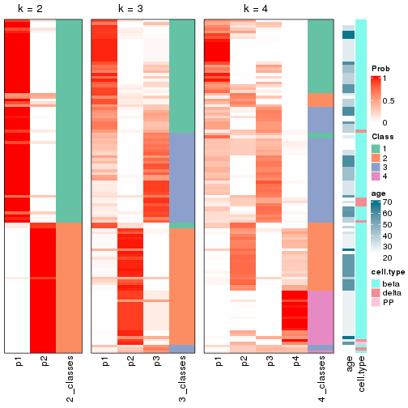


Test correlation between subgroups and known annotations. If the known
annotation is numeric, one-way ANOVA test is applied, and if the known
annotation is discrete, chi-squared contingency table test is applied.

```r
test_to_known_factors(res)
```

```
#>             n_sample age(p-value) cell.type(p-value) k
#> ATC:skmeans      115        0.267             0.3901 2
#> ATC:skmeans       92        0.682             0.0213 3
#> ATC:skmeans       50          NaN             0.3041 4
```


If matrix rows can be associated to genes, consider to use `functional_enrichment(res,
...)` to perform function enrichment for the signature genes. See [this vignette](https://jokergoo.github.io/cola_vignettes/functional_enrichment.html) for more detailed explanations.


 

---------------------------------------------------


### Node0222


Parent node: [Node022](#Node022).
Child nodes: 
                Node02111-leaf
        ,
                [Node02112](#Node02112)
        ,
                Node02121-leaf
        ,
                Node02122-leaf
        ,
                Node02211-leaf
        ,
                Node02212-leaf
        ,
                Node02221-leaf
        ,
                Node02222-leaf
        ,
                [Node03211](#Node03211)
        ,
                Node03212-leaf
        ,
                Node03221-leaf
        ,
                Node03222-leaf
        .


The object with results only for a single top-value method and a single partitioning method 
can be extracted as:

```r
res = res_rh["0222"]
```

A summary of `res` and all the functions that can be applied to it:

```r
res
```

```
#> A 'ConsensusPartition' object with k = 2, 3, 4.
#>   On a matrix with 14719 rows and 100 columns.
#>   Top rows (527) are extracted by 'ATC' method.
#>   Subgroups are detected by 'skmeans' method.
#>   Performed in total 150 partitions by row resampling.
#>   Best k for subgroups seems to be 3.
#> 
#> Following methods can be applied to this 'ConsensusPartition' object:
#>  [1] "cola_report"             "collect_classes"         "collect_plots"          
#>  [4] "collect_stats"           "colnames"                "compare_partitions"     
#>  [7] "compare_signatures"      "consensus_heatmap"       "dimension_reduction"    
#> [10] "functional_enrichment"   "get_anno_col"            "get_anno"               
#> [13] "get_classes"             "get_consensus"           "get_matrix"             
#> [16] "get_membership"          "get_param"               "get_signatures"         
#> [19] "get_stats"               "is_best_k"               "is_stable_k"            
#> [22] "membership_heatmap"      "ncol"                    "nrow"                   
#> [25] "plot_ecdf"               "predict_classes"         "rownames"               
#> [28] "select_partition_number" "show"                    "suggest_best_k"         
#> [31] "test_to_known_factors"   "top_rows_heatmap"
```

`collect_plots()` function collects all the plots made from `res` for all `k` (number of subgroups)
into one single page to provide an easy and fast comparison between different `k`.

```r
collect_plots(res)
```


The plots are:

- The first row: a plot of the eCDF (empirical cumulative distribution
  function) curves of the consensus matrix for each `k` and the heatmap of
  predicted classes for each `k`.
- The second row: heatmaps of the consensus matrix for each `k`.
- The third row: heatmaps of the membership matrix for each `k`.
- The fouth row: heatmaps of the signatures for each `k`.

All the plots in panels can be made by individual functions and they are
plotted later in this section.

`select_partition_number()` produces several plots showing different
statistics for choosing "optimized" `k`. There are following statistics:

- eCDF curves of the consensus matrix for each `k`;
- 1-PAC. [The PAC score](https://en.wikipedia.org/wiki/Consensus_clustering#Over-interpretation_potential_of_consensus_clustering)
  measures the proportion of the ambiguous subgrouping.
- Mean silhouette score.
- Concordance. The mean probability of fiting the consensus subgroup labels in all
  partitions.
- Area increased. Denote $A_k$ as the area under the eCDF curve for current
  `k`, the area increased is defined as $A_k - A_{k-1}$.
- Rand index. The percent of pairs of samples that are both in a same cluster
  or both are not in a same cluster in the partition of k and k-1.
- Jaccard index. The ratio of pairs of samples are both in a same cluster in
  the partition of k and k-1 and the pairs of samples are both in a same
  cluster in the partition k or k-1.

The detailed explanations of these statistics can be found in [the _cola_
vignette](https://jokergoo.github.io/cola_vignettes/cola.html#toc_13).

Generally speaking, higher 1-PAC score, higher mean silhouette score or higher
concordance corresponds to better partition. Rand index and Jaccard index
measure how similar the current partition is compared to partition with `k-1`.
If they are too similar, we won't accept `k` is better than `k-1`.

```r
select_partition_number(res)
```


The numeric values for all these statistics can be obtained by `get_stats()`.

```r
get_stats(res)
```

```
#>   k 1-PAC mean_silhouette concordance area_increased  Rand Jaccard
#> 2 2 0.817           0.920       0.964          0.504 0.496   0.496
#> 3 3 0.914           0.909       0.958          0.267 0.775   0.584
#> 4 4 0.785           0.855       0.922          0.168 0.808   0.523
```

`suggest_best_k()` suggests the best $k$ based on these statistics. The rules are as follows:

- All $k$ with Jaccard index larger than 0.95 are removed because increasing
  $k$ does not provide enough extra information. If all $k$ are removed, it is
  marked as no subgroup is detected.
- For all $k$ with 1-PAC score larger than 0.9, the maximal $k$ is taken as
  the best $k$, and other $k$ are marked as optional $k$.
- If it does not fit the second rule. The $k$ with the maximal vote of the
  highest 1-PAC score, highest mean silhouette, and highest concordance is
  taken as the best $k$.

```r
suggest_best_k(res)
```

```
#> [1] 3
```


Following is the table of the partitions (You need to click the **show/hide
code output** link to see it). The membership matrix (columns with name `p*`)
is inferred by
[`clue::cl_consensus()`](https://www.rdocumentation.org/link/cl_consensus?package=clue)
function with the `SE` method. Basically the value in the membership matrix
represents the probability to belong to a certain group. The finall subgroup
label for an item is determined with the group with highest probability it
belongs to.

In `get_classes()` function, the entropy is calculated from the membership
matrix and the silhouette score is calculated from the consensus matrix.


<script>
$( function() {
	$( '#tabs-node-0222-get-classes' ).tabs();
} );
</script>
<div id='tabs-node-0222-get-classes'>
<ul>
<li><a href='#tab-node-0222-get-classes-1'>k = 2</a></li>
<li><a href='#tab-node-0222-get-classes-2'>k = 3</a></li>
<li><a href='#tab-node-0222-get-classes-3'>k = 4</a></li>
</ul>

<div id='tab-node-0222-get-classes-1'>
<p><a id='tab-node-0222-get-classes-1-a' style='color:#0366d6' href='#'>show/hide code output</a></p>
<pre><code class="r">cbind(get_classes(res, k = 2), get_membership(res, k = 2))
</code></pre>

<pre><code>#&gt;             class entropy silhouette   p1   p2
#&gt; Sample_4        2   0.827      0.652 0.26 0.74
#&gt; Sample_8        2   0.469      0.876 0.10 0.90
#&gt; Sample_17       2   0.000      0.956 0.00 1.00
#&gt; Sample_18       2   0.881      0.577 0.30 0.70
#&gt; Sample_19       2   0.000      0.956 0.00 1.00
#&gt; Sample_20       1   0.881      0.594 0.70 0.30
#&gt; Sample_21       1   0.827      0.667 0.74 0.26
#&gt; Sample_22       2   0.855      0.616 0.28 0.72
#&gt; Sample_23       1   0.000      0.967 1.00 0.00
#&gt; Sample_25       1   0.680      0.786 0.82 0.18
#&gt; Sample_27       2   0.000      0.956 0.00 1.00
#&gt; Sample_28       2   0.000      0.956 0.00 1.00
#&gt; Sample_30       2   0.000      0.956 0.00 1.00
#&gt; Sample_53       2   0.141      0.942 0.02 0.98
#&gt; Sample_54       1   0.000      0.967 1.00 0.00
#&gt; Sample_61       1   0.000      0.967 1.00 0.00
#&gt; Sample_67       2   0.000      0.956 0.00 1.00
#&gt; Sample_70       2   0.000      0.956 0.00 1.00
#&gt; Sample_71       2   0.402      0.894 0.08 0.92
#&gt; Sample_75       1   0.529      0.857 0.88 0.12
#&gt; Sample_77       1   0.000      0.967 1.00 0.00
#&gt; Sample_79       1   0.000      0.967 1.00 0.00
#&gt; Sample_80       1   0.000      0.967 1.00 0.00
#&gt; Sample_82       1   0.000      0.967 1.00 0.00
#&gt; Sample_85       2   0.000      0.956 0.00 1.00
#&gt; Sample_87       2   0.000      0.956 0.00 1.00
#&gt; Sample_88       2   0.000      0.956 0.00 1.00
#&gt; Sample_89       2   0.000      0.956 0.00 1.00
#&gt; Sample_90       2   0.000      0.956 0.00 1.00
#&gt; Sample_91       2   0.000      0.956 0.00 1.00
#&gt; Sample_92       2   0.000      0.956 0.00 1.00
#&gt; Sample_93       2   0.000      0.956 0.00 1.00
#&gt; Sample_95       1   0.000      0.967 1.00 0.00
#&gt; Sample_100      2   0.000      0.956 0.00 1.00
#&gt; Sample_101      1   0.827      0.673 0.74 0.26
#&gt; Sample_103      2   0.000      0.956 0.00 1.00
#&gt; Sample_104      1   0.000      0.967 1.00 0.00
#&gt; Sample_107      1   0.242      0.934 0.96 0.04
#&gt; Sample_110      1   0.000      0.967 1.00 0.00
#&gt; Sample_112      1   0.402      0.899 0.92 0.08
#&gt; Sample_113      1   0.000      0.967 1.00 0.00
#&gt; Sample_115      1   0.000      0.967 1.00 0.00
#&gt; Sample_116      2   0.000      0.956 0.00 1.00
#&gt; Sample_117      1   0.000      0.967 1.00 0.00
#&gt; Sample_119      1   0.000      0.967 1.00 0.00
#&gt; Sample_122      1   0.000      0.967 1.00 0.00
#&gt; Sample_126      2   0.000      0.956 0.00 1.00
#&gt; Sample_128      2   0.000      0.956 0.00 1.00
#&gt; Sample_130      2   0.904      0.542 0.32 0.68
#&gt; Sample_131      2   0.000      0.956 0.00 1.00
#&gt; Sample_133      2   0.242      0.929 0.04 0.96
#&gt; Sample_135      1   0.000      0.967 1.00 0.00
#&gt; Sample_139      1   0.000      0.967 1.00 0.00
#&gt; Sample_142      1   0.000      0.967 1.00 0.00
#&gt; Sample_143      1   0.000      0.967 1.00 0.00
#&gt; Sample_145      1   0.000      0.967 1.00 0.00
#&gt; Sample_146      2   0.000      0.956 0.00 1.00
#&gt; Sample_596      2   0.000      0.956 0.00 1.00
#&gt; Sample_598      2   0.943      0.473 0.36 0.64
#&gt; Sample_601      2   0.000      0.956 0.00 1.00
#&gt; Sample_603      2   0.000      0.956 0.00 1.00
#&gt; Sample_604      2   0.000      0.956 0.00 1.00
#&gt; Sample_605      2   0.000      0.956 0.00 1.00
#&gt; Sample_606      2   0.000      0.956 0.00 1.00
#&gt; Sample_608      2   0.469      0.875 0.10 0.90
#&gt; Sample_609      2   0.327      0.912 0.06 0.94
#&gt; Sample_610      2   0.722      0.757 0.20 0.80
#&gt; Sample_657      2   0.000      0.956 0.00 1.00
#&gt; Sample_660      1   0.827      0.673 0.74 0.26
#&gt; Sample_662      1   0.000      0.967 1.00 0.00
#&gt; Sample_663      1   0.000      0.967 1.00 0.00
#&gt; Sample_666      1   0.000      0.967 1.00 0.00
#&gt; Sample_668      1   0.000      0.967 1.00 0.00
#&gt; Sample_669      1   0.000      0.967 1.00 0.00
#&gt; Sample_670      1   0.000      0.967 1.00 0.00
#&gt; Sample_672      1   0.000      0.967 1.00 0.00
#&gt; Sample_673      1   0.000      0.967 1.00 0.00
#&gt; Sample_674      1   0.000      0.967 1.00 0.00
#&gt; Sample_675      1   0.000      0.967 1.00 0.00
#&gt; Sample_676      2   0.141      0.942 0.02 0.98
#&gt; Sample_680      1   0.000      0.967 1.00 0.00
#&gt; Sample_682      1   0.000      0.967 1.00 0.00
#&gt; Sample_683      1   0.000      0.967 1.00 0.00
#&gt; Sample_684      1   0.000      0.967 1.00 0.00
#&gt; Sample_689      1   0.000      0.967 1.00 0.00
#&gt; Sample_691      1   0.000      0.967 1.00 0.00
#&gt; Sample_693      1   0.000      0.967 1.00 0.00
#&gt; Sample_694      1   0.000      0.967 1.00 0.00
#&gt; Sample_705      2   0.000      0.956 0.00 1.00
#&gt; Sample_841      2   0.000      0.956 0.00 1.00
#&gt; Sample_847      1   0.000      0.967 1.00 0.00
#&gt; Sample_848      2   0.000      0.956 0.00 1.00
#&gt; Sample_849      1   0.000      0.967 1.00 0.00
#&gt; Sample_852      2   0.000      0.956 0.00 1.00
#&gt; Sample_1517     2   0.000      0.956 0.00 1.00
#&gt; Sample_1518     2   0.000      0.956 0.00 1.00
#&gt; Sample_1535     2   0.000      0.956 0.00 1.00
#&gt; Sample_1536     2   0.000      0.956 0.00 1.00
#&gt; Sample_1554     2   0.000      0.956 0.00 1.00
#&gt; Sample_1588     2   0.000      0.956 0.00 1.00
</code></pre>

<script>
$('#tab-node-0222-get-classes-1-a').parent().next().next().hide();
$('#tab-node-0222-get-classes-1-a').click(function(){
  $('#tab-node-0222-get-classes-1-a').parent().next().next().toggle();
  return(false);
});
</script>
</div>

<div id='tab-node-0222-get-classes-2'>
<p><a id='tab-node-0222-get-classes-2-a' style='color:#0366d6' href='#'>show/hide code output</a></p>
<pre><code class="r">cbind(get_classes(res, k = 3), get_membership(res, k = 3))
</code></pre>

<pre><code>#&gt;             class entropy silhouette   p1   p2   p3
#&gt; Sample_4        2  0.0000     0.9671 0.00 1.00 0.00
#&gt; Sample_8        2  0.0000     0.9671 0.00 1.00 0.00
#&gt; Sample_17       2  0.0892     0.9726 0.00 0.98 0.02
#&gt; Sample_18       2  0.0000     0.9671 0.00 1.00 0.00
#&gt; Sample_19       2  0.0892     0.9726 0.00 0.98 0.02
#&gt; Sample_20       2  0.2066     0.9211 0.06 0.94 0.00
#&gt; Sample_21       2  0.0000     0.9671 0.00 1.00 0.00
#&gt; Sample_22       2  0.0000     0.9671 0.00 1.00 0.00
#&gt; Sample_23       1  0.1529     0.9026 0.96 0.04 0.00
#&gt; Sample_25       2  0.2066     0.9227 0.06 0.94 0.00
#&gt; Sample_27       2  0.0892     0.9726 0.00 0.98 0.02
#&gt; Sample_28       2  0.0892     0.9726 0.00 0.98 0.02
#&gt; Sample_30       2  0.0892     0.9726 0.00 0.98 0.02
#&gt; Sample_53       2  0.0892     0.9726 0.00 0.98 0.02
#&gt; Sample_54       1  0.0892     0.9108 0.98 0.02 0.00
#&gt; Sample_61       1  0.4291     0.7695 0.82 0.18 0.00
#&gt; Sample_67       2  0.0892     0.9726 0.00 0.98 0.02
#&gt; Sample_70       2  0.0892     0.9726 0.00 0.98 0.02
#&gt; Sample_71       2  0.0892     0.9726 0.00 0.98 0.02
#&gt; Sample_75       1  0.6302     0.1621 0.52 0.48 0.00
#&gt; Sample_77       1  0.0000     0.9189 1.00 0.00 0.00
#&gt; Sample_79       1  0.2414     0.8857 0.94 0.02 0.04
#&gt; Sample_80       1  0.1529     0.9027 0.96 0.04 0.00
#&gt; Sample_82       1  0.0000     0.9189 1.00 0.00 0.00
#&gt; Sample_85       3  0.1529     0.9542 0.00 0.04 0.96
#&gt; Sample_87       2  0.0892     0.9726 0.00 0.98 0.02
#&gt; Sample_88       2  0.0892     0.9726 0.00 0.98 0.02
#&gt; Sample_89       2  0.0892     0.9726 0.00 0.98 0.02
#&gt; Sample_90       2  0.0892     0.9726 0.00 0.98 0.02
#&gt; Sample_91       2  0.0892     0.9726 0.00 0.98 0.02
#&gt; Sample_92       2  0.0892     0.9726 0.00 0.98 0.02
#&gt; Sample_93       2  0.0892     0.9726 0.00 0.98 0.02
#&gt; Sample_95       1  0.2066     0.8833 0.94 0.06 0.00
#&gt; Sample_100      2  0.0892     0.9726 0.00 0.98 0.02
#&gt; Sample_101      2  0.4291     0.7592 0.18 0.82 0.00
#&gt; Sample_103      2  0.0000     0.9671 0.00 1.00 0.00
#&gt; Sample_104      1  0.6309     0.0964 0.50 0.50 0.00
#&gt; Sample_107      2  0.2066     0.9209 0.06 0.94 0.00
#&gt; Sample_110      1  0.0892     0.9108 0.98 0.02 0.00
#&gt; Sample_112      1  0.6280     0.2374 0.54 0.46 0.00
#&gt; Sample_113      1  0.6280     0.2429 0.54 0.46 0.00
#&gt; Sample_115      1  0.2066     0.8889 0.94 0.06 0.00
#&gt; Sample_116      2  0.0892     0.9726 0.00 0.98 0.02
#&gt; Sample_117      1  0.2959     0.8571 0.90 0.10 0.00
#&gt; Sample_119      1  0.0892     0.9108 0.98 0.02 0.00
#&gt; Sample_122      1  0.3340     0.8388 0.88 0.12 0.00
#&gt; Sample_126      2  0.0892     0.9598 0.00 0.98 0.02
#&gt; Sample_128      2  0.2537     0.9257 0.00 0.92 0.08
#&gt; Sample_130      2  0.4862     0.7753 0.16 0.82 0.02
#&gt; Sample_131      2  0.0000     0.9671 0.00 1.00 0.00
#&gt; Sample_133      2  0.0000     0.9671 0.00 1.00 0.00
#&gt; Sample_135      1  0.0000     0.9189 1.00 0.00 0.00
#&gt; Sample_139      1  0.0892     0.9092 0.98 0.02 0.00
#&gt; Sample_142      1  0.0000     0.9189 1.00 0.00 0.00
#&gt; Sample_143      1  0.0000     0.9189 1.00 0.00 0.00
#&gt; Sample_145      1  0.0000     0.9189 1.00 0.00 0.00
#&gt; Sample_146      2  0.0892     0.9726 0.00 0.98 0.02
#&gt; Sample_596      3  0.0000     0.9919 0.00 0.00 1.00
#&gt; Sample_598      3  0.0892     0.9762 0.02 0.00 0.98
#&gt; Sample_601      3  0.0000     0.9919 0.00 0.00 1.00
#&gt; Sample_603      3  0.0000     0.9919 0.00 0.00 1.00
#&gt; Sample_604      3  0.0000     0.9919 0.00 0.00 1.00
#&gt; Sample_605      3  0.0000     0.9919 0.00 0.00 1.00
#&gt; Sample_606      3  0.0000     0.9919 0.00 0.00 1.00
#&gt; Sample_608      3  0.0892     0.9764 0.00 0.02 0.98
#&gt; Sample_609      3  0.0892     0.9764 0.00 0.02 0.98
#&gt; Sample_610      3  0.0000     0.9919 0.00 0.00 1.00
#&gt; Sample_657      2  0.0892     0.9726 0.00 0.98 0.02
#&gt; Sample_660      2  0.0892     0.9558 0.02 0.98 0.00
#&gt; Sample_662      1  0.0000     0.9189 1.00 0.00 0.00
#&gt; Sample_663      1  0.0000     0.9189 1.00 0.00 0.00
#&gt; Sample_666      1  0.0000     0.9189 1.00 0.00 0.00
#&gt; Sample_668      1  0.5016     0.6514 0.76 0.00 0.24
#&gt; Sample_669      1  0.0000     0.9189 1.00 0.00 0.00
#&gt; Sample_670      1  0.0000     0.9189 1.00 0.00 0.00
#&gt; Sample_672      1  0.0000     0.9189 1.00 0.00 0.00
#&gt; Sample_673      1  0.0000     0.9189 1.00 0.00 0.00
#&gt; Sample_674      1  0.0000     0.9189 1.00 0.00 0.00
#&gt; Sample_675      1  0.0000     0.9189 1.00 0.00 0.00
#&gt; Sample_676      2  0.0000     0.9671 0.00 1.00 0.00
#&gt; Sample_680      1  0.0000     0.9189 1.00 0.00 0.00
#&gt; Sample_682      1  0.0000     0.9189 1.00 0.00 0.00
#&gt; Sample_683      1  0.0000     0.9189 1.00 0.00 0.00
#&gt; Sample_684      1  0.0000     0.9189 1.00 0.00 0.00
#&gt; Sample_689      1  0.0000     0.9189 1.00 0.00 0.00
#&gt; Sample_691      1  0.0000     0.9189 1.00 0.00 0.00
#&gt; Sample_693      1  0.0000     0.9189 1.00 0.00 0.00
#&gt; Sample_694      1  0.0000     0.9189 1.00 0.00 0.00
#&gt; Sample_705      2  0.2959     0.9047 0.00 0.90 0.10
#&gt; Sample_841      2  0.0892     0.9726 0.00 0.98 0.02
#&gt; Sample_847      3  0.0892     0.9762 0.02 0.00 0.98
#&gt; Sample_848      2  0.0892     0.9726 0.00 0.98 0.02
#&gt; Sample_849      1  0.0000     0.9189 1.00 0.00 0.00
#&gt; Sample_852      2  0.0000     0.9671 0.00 1.00 0.00
#&gt; Sample_1517     3  0.0000     0.9919 0.00 0.00 1.00
#&gt; Sample_1518     3  0.0000     0.9919 0.00 0.00 1.00
#&gt; Sample_1535     3  0.0000     0.9919 0.00 0.00 1.00
#&gt; Sample_1536     3  0.0000     0.9919 0.00 0.00 1.00
#&gt; Sample_1554     3  0.0000     0.9919 0.00 0.00 1.00
#&gt; Sample_1588     3  0.0000     0.9919 0.00 0.00 1.00
</code></pre>

<script>
$('#tab-node-0222-get-classes-2-a').parent().next().next().hide();
$('#tab-node-0222-get-classes-2-a').click(function(){
  $('#tab-node-0222-get-classes-2-a').parent().next().next().toggle();
  return(false);
});
</script>
</div>

<div id='tab-node-0222-get-classes-3'>
<p><a id='tab-node-0222-get-classes-3-a' style='color:#0366d6' href='#'>show/hide code output</a></p>
<pre><code class="r">cbind(get_classes(res, k = 4), get_membership(res, k = 4))
</code></pre>

<pre><code>#&gt;             class entropy silhouette   p1   p2   p3   p4
#&gt; Sample_4        4  0.0707      0.821 0.00 0.02 0.00 0.98
#&gt; Sample_8        2  0.0707      0.935 0.00 0.98 0.00 0.02
#&gt; Sample_17       2  0.1637      0.915 0.00 0.94 0.00 0.06
#&gt; Sample_18       4  0.0707      0.821 0.00 0.02 0.00 0.98
#&gt; Sample_19       2  0.3400      0.798 0.00 0.82 0.00 0.18
#&gt; Sample_20       4  0.0707      0.821 0.00 0.02 0.00 0.98
#&gt; Sample_21       4  0.1211      0.813 0.00 0.04 0.00 0.96
#&gt; Sample_22       4  0.0707      0.821 0.00 0.02 0.00 0.98
#&gt; Sample_23       4  0.3975      0.680 0.24 0.00 0.00 0.76
#&gt; Sample_25       4  0.0707      0.821 0.00 0.02 0.00 0.98
#&gt; Sample_27       2  0.0707      0.935 0.00 0.98 0.00 0.02
#&gt; Sample_28       2  0.0000      0.933 0.00 1.00 0.00 0.00
#&gt; Sample_30       2  0.2345      0.881 0.00 0.90 0.00 0.10
#&gt; Sample_53       2  0.0707      0.922 0.00 0.98 0.00 0.02
#&gt; Sample_54       4  0.4790      0.440 0.38 0.00 0.00 0.62
#&gt; Sample_61       4  0.5106      0.650 0.24 0.04 0.00 0.72
#&gt; Sample_67       2  0.0000      0.933 0.00 1.00 0.00 0.00
#&gt; Sample_70       2  0.2011      0.902 0.00 0.92 0.00 0.08
#&gt; Sample_71       2  0.1211      0.915 0.00 0.96 0.00 0.04
#&gt; Sample_75       4  0.2706      0.802 0.08 0.02 0.00 0.90
#&gt; Sample_77       1  0.0000      0.950 1.00 0.00 0.00 0.00
#&gt; Sample_79       1  0.4211      0.811 0.84 0.02 0.04 0.10
#&gt; Sample_80       4  0.1211      0.814 0.04 0.00 0.00 0.96
#&gt; Sample_82       1  0.0000      0.950 1.00 0.00 0.00 0.00
#&gt; Sample_85       3  0.4797      0.622 0.00 0.26 0.72 0.02
#&gt; Sample_87       2  0.0707      0.935 0.00 0.98 0.00 0.02
#&gt; Sample_88       2  0.0707      0.935 0.00 0.98 0.00 0.02
#&gt; Sample_89       2  0.0707      0.935 0.00 0.98 0.00 0.02
#&gt; Sample_90       2  0.0707      0.935 0.00 0.98 0.00 0.02
#&gt; Sample_91       2  0.0707      0.935 0.00 0.98 0.00 0.02
#&gt; Sample_92       2  0.0707      0.935 0.00 0.98 0.00 0.02
#&gt; Sample_93       2  0.0707      0.935 0.00 0.98 0.00 0.02
#&gt; Sample_95       1  0.6286      0.498 0.66 0.14 0.00 0.20
#&gt; Sample_100      2  0.3400      0.778 0.00 0.82 0.00 0.18
#&gt; Sample_101      4  0.6510      0.347 0.08 0.38 0.00 0.54
#&gt; Sample_103      4  0.0707      0.821 0.00 0.02 0.00 0.98
#&gt; Sample_104      4  0.7497      0.458 0.26 0.24 0.00 0.50
#&gt; Sample_107      4  0.0707      0.821 0.00 0.02 0.00 0.98
#&gt; Sample_110      4  0.5606      0.201 0.48 0.02 0.00 0.50
#&gt; Sample_112      2  0.6049      0.576 0.20 0.68 0.00 0.12
#&gt; Sample_113      4  0.5986      0.532 0.06 0.32 0.00 0.62
#&gt; Sample_115      4  0.3606      0.766 0.14 0.02 0.00 0.84
#&gt; Sample_116      2  0.0000      0.933 0.00 1.00 0.00 0.00
#&gt; Sample_117      4  0.6216      0.662 0.22 0.12 0.00 0.66
#&gt; Sample_119      4  0.2011      0.801 0.08 0.00 0.00 0.92
#&gt; Sample_122      4  0.6720      0.554 0.30 0.12 0.00 0.58
#&gt; Sample_126      4  0.0707      0.812 0.00 0.02 0.00 0.98
#&gt; Sample_128      2  0.2335      0.885 0.00 0.92 0.06 0.02
#&gt; Sample_130      4  0.5355      0.477 0.02 0.36 0.00 0.62
#&gt; Sample_131      4  0.2921      0.753 0.00 0.14 0.00 0.86
#&gt; Sample_133      2  0.0707      0.922 0.00 0.98 0.00 0.02
#&gt; Sample_135      1  0.0000      0.950 1.00 0.00 0.00 0.00
#&gt; Sample_139      1  0.3037      0.835 0.88 0.10 0.00 0.02
#&gt; Sample_142      1  0.0707      0.935 0.98 0.00 0.00 0.02
#&gt; Sample_143      1  0.0000      0.950 1.00 0.00 0.00 0.00
#&gt; Sample_145      1  0.1637      0.899 0.94 0.00 0.00 0.06
#&gt; Sample_146      2  0.0000      0.933 0.00 1.00 0.00 0.00
#&gt; Sample_596      3  0.0000      0.982 0.00 0.00 1.00 0.00
#&gt; Sample_598      3  0.0000      0.982 0.00 0.00 1.00 0.00
#&gt; Sample_601      3  0.0000      0.982 0.00 0.00 1.00 0.00
#&gt; Sample_603      3  0.0000      0.982 0.00 0.00 1.00 0.00
#&gt; Sample_604      3  0.0000      0.982 0.00 0.00 1.00 0.00
#&gt; Sample_605      3  0.0000      0.982 0.00 0.00 1.00 0.00
#&gt; Sample_606      3  0.0000      0.982 0.00 0.00 1.00 0.00
#&gt; Sample_608      3  0.0000      0.982 0.00 0.00 1.00 0.00
#&gt; Sample_609      3  0.0000      0.982 0.00 0.00 1.00 0.00
#&gt; Sample_610      3  0.0000      0.982 0.00 0.00 1.00 0.00
#&gt; Sample_657      2  0.0000      0.933 0.00 1.00 0.00 0.00
#&gt; Sample_660      2  0.3037      0.852 0.02 0.88 0.00 0.10
#&gt; Sample_662      1  0.0000      0.950 1.00 0.00 0.00 0.00
#&gt; Sample_663      1  0.0000      0.950 1.00 0.00 0.00 0.00
#&gt; Sample_666      1  0.2011      0.883 0.92 0.00 0.00 0.08
#&gt; Sample_668      1  0.1637      0.901 0.94 0.00 0.06 0.00
#&gt; Sample_669      1  0.0000      0.950 1.00 0.00 0.00 0.00
#&gt; Sample_670      1  0.3610      0.738 0.80 0.00 0.00 0.20
#&gt; Sample_672      1  0.0000      0.950 1.00 0.00 0.00 0.00
#&gt; Sample_673      1  0.0000      0.950 1.00 0.00 0.00 0.00
#&gt; Sample_674      1  0.0000      0.950 1.00 0.00 0.00 0.00
#&gt; Sample_675      1  0.0000      0.950 1.00 0.00 0.00 0.00
#&gt; Sample_676      4  0.0707      0.821 0.00 0.02 0.00 0.98
#&gt; Sample_680      1  0.0000      0.950 1.00 0.00 0.00 0.00
#&gt; Sample_682      1  0.0000      0.950 1.00 0.00 0.00 0.00
#&gt; Sample_683      1  0.0000      0.950 1.00 0.00 0.00 0.00
#&gt; Sample_684      1  0.0000      0.950 1.00 0.00 0.00 0.00
#&gt; Sample_689      1  0.0000      0.950 1.00 0.00 0.00 0.00
#&gt; Sample_691      1  0.0000      0.950 1.00 0.00 0.00 0.00
#&gt; Sample_693      1  0.0000      0.950 1.00 0.00 0.00 0.00
#&gt; Sample_694      1  0.0000      0.950 1.00 0.00 0.00 0.00
#&gt; Sample_705      2  0.5327      0.627 0.00 0.72 0.06 0.22
#&gt; Sample_841      2  0.0707      0.935 0.00 0.98 0.00 0.02
#&gt; Sample_847      3  0.0000      0.982 0.00 0.00 1.00 0.00
#&gt; Sample_848      2  0.0000      0.933 0.00 1.00 0.00 0.00
#&gt; Sample_849      1  0.3172      0.796 0.84 0.00 0.00 0.16
#&gt; Sample_852      4  0.0707      0.821 0.00 0.02 0.00 0.98
#&gt; Sample_1517     3  0.0000      0.982 0.00 0.00 1.00 0.00
#&gt; Sample_1518     3  0.0000      0.982 0.00 0.00 1.00 0.00
#&gt; Sample_1535     3  0.0000      0.982 0.00 0.00 1.00 0.00
#&gt; Sample_1536     3  0.0000      0.982 0.00 0.00 1.00 0.00
#&gt; Sample_1554     3  0.0000      0.982 0.00 0.00 1.00 0.00
#&gt; Sample_1588     3  0.0000      0.982 0.00 0.00 1.00 0.00
</code></pre>

<script>
$('#tab-node-0222-get-classes-3-a').parent().next().next().hide();
$('#tab-node-0222-get-classes-3-a').click(function(){
  $('#tab-node-0222-get-classes-3-a').parent().next().next().toggle();
  return(false);
});
</script>
</div>
</div>

Heatmaps for the consensus matrix. It visualizes the probability of two
samples to be in a same group.


<script>
$( function() {
	$( '#tabs-node-0222-consensus-heatmap' ).tabs();
} );
</script>
<div id='tabs-node-0222-consensus-heatmap'>
<ul>
<li><a href='#tab-node-0222-consensus-heatmap-1'>k = 2</a></li>
<li><a href='#tab-node-0222-consensus-heatmap-2'>k = 3</a></li>
<li><a href='#tab-node-0222-consensus-heatmap-3'>k = 4</a></li>
</ul>
<div id='tab-node-0222-consensus-heatmap-1'>
<pre><code class="r">consensus_heatmap(res, k = 2)
</code></pre>

<p></p>

</div>
<div id='tab-node-0222-consensus-heatmap-2'>
<pre><code class="r">consensus_heatmap(res, k = 3)
</code></pre>

<p></p>

</div>
<div id='tab-node-0222-consensus-heatmap-3'>
<pre><code class="r">consensus_heatmap(res, k = 4)
</code></pre>

<p></p>

</div>
</div>

Heatmaps for the membership of samples in all partitions to see how consistent they are:


<script>
$( function() {
	$( '#tabs-node-0222-membership-heatmap' ).tabs();
} );
</script>
<div id='tabs-node-0222-membership-heatmap'>
<ul>
<li><a href='#tab-node-0222-membership-heatmap-1'>k = 2</a></li>
<li><a href='#tab-node-0222-membership-heatmap-2'>k = 3</a></li>
<li><a href='#tab-node-0222-membership-heatmap-3'>k = 4</a></li>
</ul>
<div id='tab-node-0222-membership-heatmap-1'>
<pre><code class="r">membership_heatmap(res, k = 2)
</code></pre>

<p></p>

</div>
<div id='tab-node-0222-membership-heatmap-2'>
<pre><code class="r">membership_heatmap(res, k = 3)
</code></pre>

<p></p>

</div>
<div id='tab-node-0222-membership-heatmap-3'>
<pre><code class="r">membership_heatmap(res, k = 4)
</code></pre>

<p></p>

</div>
</div>

As soon as the classes for columns are determined, the signatures
that are significantly different between subgroups can be looked for. 
Following are the heatmaps for signatures.


Signature heatmaps where rows are scaled:


<script>
$( function() {
	$( '#tabs-node-0222-get-signatures' ).tabs();
} );
</script>
<div id='tabs-node-0222-get-signatures'>
<ul>
<li><a href='#tab-node-0222-get-signatures-1'>k = 2</a></li>
<li><a href='#tab-node-0222-get-signatures-2'>k = 3</a></li>
<li><a href='#tab-node-0222-get-signatures-3'>k = 4</a></li>
</ul>
<div id='tab-node-0222-get-signatures-1'>
<pre><code class="r">get_signatures(res, k = 2)
</code></pre>

<p></p>

</div>
<div id='tab-node-0222-get-signatures-2'>
<pre><code class="r">get_signatures(res, k = 3)
</code></pre>

<p></p>

</div>
<div id='tab-node-0222-get-signatures-3'>
<pre><code class="r">get_signatures(res, k = 4)
</code></pre>

<p></p>

</div>
</div>


Signature heatmaps where rows are not scaled:


<script>
$( function() {
	$( '#tabs-node-0222-get-signatures-no-scale' ).tabs();
} );
</script>
<div id='tabs-node-0222-get-signatures-no-scale'>
<ul>
<li><a href='#tab-node-0222-get-signatures-no-scale-1'>k = 2</a></li>
<li><a href='#tab-node-0222-get-signatures-no-scale-2'>k = 3</a></li>
<li><a href='#tab-node-0222-get-signatures-no-scale-3'>k = 4</a></li>
</ul>
<div id='tab-node-0222-get-signatures-no-scale-1'>
<pre><code class="r">get_signatures(res, k = 2, scale_rows = FALSE)
</code></pre>

<p></p>

</div>
<div id='tab-node-0222-get-signatures-no-scale-2'>
<pre><code class="r">get_signatures(res, k = 3, scale_rows = FALSE)
</code></pre>

<p></p>

</div>
<div id='tab-node-0222-get-signatures-no-scale-3'>
<pre><code class="r">get_signatures(res, k = 4, scale_rows = FALSE)
</code></pre>

<p></p>

</div>
</div>


Compare the overlap of signatures from different k:

```r
compare_signatures(res)
```


`get_signature()` returns a data frame invisibly. To get the list of signatures, the function
call should be assigned to a variable explicitly. In following code, if `plot` argument is set
to `FALSE`, no heatmap is plotted while only the differential analysis is performed.

```r
# code only for demonstration
tb = get_signature(res, k = ..., plot = FALSE)
```

An example of the output of `tb` is:

```
#>   which_row         fdr    mean_1    mean_2 scaled_mean_1 scaled_mean_2 km
#> 1        38 0.042760348  8.373488  9.131774    -0.5533452     0.5164555  1
#> 2        40 0.018707592  7.106213  8.469186    -0.6173731     0.5762149  1
#> 3        55 0.019134737 10.221463 11.207825    -0.6159697     0.5749050  1
#> 4        59 0.006059896  5.921854  7.869574    -0.6899429     0.6439467  1
#> 5        60 0.018055526  8.928898 10.211722    -0.6204761     0.5791110  1
#> 6        98 0.009384629 15.714769 14.887706     0.6635654    -0.6193277  2
...
```

The columns in `tb` are:

1. `which_row`: row indices corresponding to the input matrix.
2. `fdr`: FDR for the differential test. 
3. `mean_x`: The mean value in group x.
4. `scaled_mean_x`: The mean value in group x after rows are scaled.
5. `km`: Row groups if k-means clustering is applied to rows (which is done by automatically selecting number of clusters).

If there are too many signatures, `top_signatures = ...` can be set to only show the 
signatures with the highest FDRs:

```r
# code only for demonstration
# e.g. to show the top 500 most significant rows
tb = get_signature(res, k = ..., top_signatures = 500)
```

If the signatures are defined as these which are uniquely high in current group, `diff_method` argument
can be set to `"uniquely_high_in_one_group"`:

```r
# code only for demonstration
tb = get_signature(res, k = ..., diff_method = "uniquely_high_in_one_group")
```


UMAP plot which shows how samples are separated.


<script>
$( function() {
	$( '#tabs-node-0222-dimension-reduction' ).tabs();
} );
</script>
<div id='tabs-node-0222-dimension-reduction'>
<ul>
<li><a href='#tab-node-0222-dimension-reduction-1'>k = 2</a></li>
<li><a href='#tab-node-0222-dimension-reduction-2'>k = 3</a></li>
<li><a href='#tab-node-0222-dimension-reduction-3'>k = 4</a></li>
</ul>
<div id='tab-node-0222-dimension-reduction-1'>
<pre><code class="r">dimension_reduction(res, k = 2, method = &quot;UMAP&quot;)
</code></pre>

<p>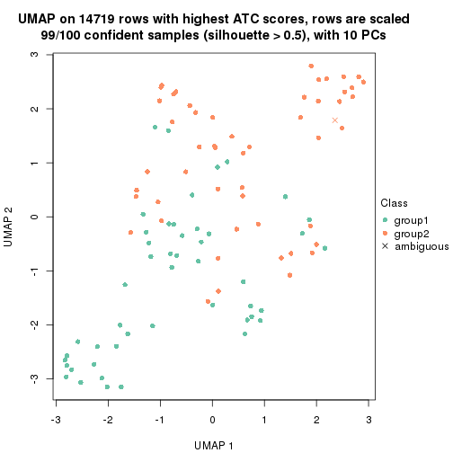</p>

</div>
<div id='tab-node-0222-dimension-reduction-2'>
<pre><code class="r">dimension_reduction(res, k = 3, method = &quot;UMAP&quot;)
</code></pre>

<p></p>

</div>
<div id='tab-node-0222-dimension-reduction-3'>
<pre><code class="r">dimension_reduction(res, k = 4, method = &quot;UMAP&quot;)
</code></pre>

<p></p>

</div>
</div>


Following heatmap shows how subgroups are split when increasing `k`:

```r
collect_classes(res)
```


Test correlation between subgroups and known annotations. If the known
annotation is numeric, one-way ANOVA test is applied, and if the known
annotation is discrete, chi-squared contingency table test is applied.

```r
test_to_known_factors(res)
```

```
#>             n_sample age(p-value) cell.type(p-value) k
#> ATC:skmeans       99     1.34e-03           2.35e-04 2
#> ATC:skmeans       96     1.45e-05           2.62e-16 3
#> ATC:skmeans       94     1.51e-05           1.14e-14 4
```


If matrix rows can be associated to genes, consider to use `functional_enrichment(res,
...)` to perform function enrichment for the signature genes. See [this vignette](https://jokergoo.github.io/cola_vignettes/functional_enrichment.html) for more detailed explanations.


 

---------------------------------------------------


### Node023


Parent node: [Node02](#Node02).
Child nodes: 
                Node0111-leaf
        ,
                Node0112-leaf
        ,
                Node0121-leaf
        ,
                Node0122-leaf
        ,
                Node0131-leaf
        ,
                Node0132-leaf
        ,
                [Node0211](#Node0211)
        ,
                [Node0212](#Node0212)
        ,
                [Node0221](#Node0221)
        ,
                [Node0222](#Node0222)
        ,
                Node0231-leaf
        ,
                Node0232-leaf
        ,
                Node0233-leaf
        ,
                Node0311-leaf
        ,
                Node0312-leaf
        ,
                Node0313-leaf
        ,
                Node0314-leaf
        ,
                [Node0321](#Node0321)
        ,
                [Node0322](#Node0322)
        ,
                Node0331-leaf
        ,
                Node0332-leaf
        ,
                Node0333-leaf
        .


The object with results only for a single top-value method and a single partitioning method 
can be extracted as:

```r
res = res_rh["023"]
```

A summary of `res` and all the functions that can be applied to it:

```r
res
```

```
#> A 'ConsensusPartition' object with k = 2, 3, 4.
#>   On a matrix with 14735 rows and 75 columns.
#>   Top rows (1474) are extracted by 'ATC' method.
#>   Subgroups are detected by 'skmeans' method.
#>   Performed in total 150 partitions by row resampling.
#>   Best k for subgroups seems to be 3.
#> 
#> Following methods can be applied to this 'ConsensusPartition' object:
#>  [1] "cola_report"             "collect_classes"         "collect_plots"          
#>  [4] "collect_stats"           "colnames"                "compare_partitions"     
#>  [7] "compare_signatures"      "consensus_heatmap"       "dimension_reduction"    
#> [10] "functional_enrichment"   "get_anno_col"            "get_anno"               
#> [13] "get_classes"             "get_consensus"           "get_matrix"             
#> [16] "get_membership"          "get_param"               "get_signatures"         
#> [19] "get_stats"               "is_best_k"               "is_stable_k"            
#> [22] "membership_heatmap"      "ncol"                    "nrow"                   
#> [25] "plot_ecdf"               "predict_classes"         "rownames"               
#> [28] "select_partition_number" "show"                    "suggest_best_k"         
#> [31] "test_to_known_factors"   "top_rows_heatmap"
```

`collect_plots()` function collects all the plots made from `res` for all `k` (number of subgroups)
into one single page to provide an easy and fast comparison between different `k`.

```r
collect_plots(res)
```


The plots are:

- The first row: a plot of the eCDF (empirical cumulative distribution
  function) curves of the consensus matrix for each `k` and the heatmap of
  predicted classes for each `k`.
- The second row: heatmaps of the consensus matrix for each `k`.
- The third row: heatmaps of the membership matrix for each `k`.
- The fouth row: heatmaps of the signatures for each `k`.

All the plots in panels can be made by individual functions and they are
plotted later in this section.

`select_partition_number()` produces several plots showing different
statistics for choosing "optimized" `k`. There are following statistics:

- eCDF curves of the consensus matrix for each `k`;
- 1-PAC. [The PAC score](https://en.wikipedia.org/wiki/Consensus_clustering#Over-interpretation_potential_of_consensus_clustering)
  measures the proportion of the ambiguous subgrouping.
- Mean silhouette score.
- Concordance. The mean probability of fiting the consensus subgroup labels in all
  partitions.
- Area increased. Denote $A_k$ as the area under the eCDF curve for current
  `k`, the area increased is defined as $A_k - A_{k-1}$.
- Rand index. The percent of pairs of samples that are both in a same cluster
  or both are not in a same cluster in the partition of k and k-1.
- Jaccard index. The ratio of pairs of samples are both in a same cluster in
  the partition of k and k-1 and the pairs of samples are both in a same
  cluster in the partition k or k-1.

The detailed explanations of these statistics can be found in [the _cola_
vignette](https://jokergoo.github.io/cola_vignettes/cola.html#toc_13).

Generally speaking, higher 1-PAC score, higher mean silhouette score or higher
concordance corresponds to better partition. Rand index and Jaccard index
measure how similar the current partition is compared to partition with `k-1`.
If they are too similar, we won't accept `k` is better than `k-1`.

```r
select_partition_number(res)
```


The numeric values for all these statistics can be obtained by `get_stats()`.

```r
get_stats(res)
```

```
#>   k 1-PAC mean_silhouette concordance area_increased  Rand Jaccard
#> 2 2 1.000           0.997       0.999         0.5048 0.495   0.495
#> 3 3 1.000           1.000       1.000         0.2914 0.837   0.676
#> 4 4 0.873           0.898       0.929         0.0909 0.939   0.826
```

`suggest_best_k()` suggests the best $k$ based on these statistics. The rules are as follows:

- All $k$ with Jaccard index larger than 0.95 are removed because increasing
  $k$ does not provide enough extra information. If all $k$ are removed, it is
  marked as no subgroup is detected.
- For all $k$ with 1-PAC score larger than 0.9, the maximal $k$ is taken as
  the best $k$, and other $k$ are marked as optional $k$.
- If it does not fit the second rule. The $k$ with the maximal vote of the
  highest 1-PAC score, highest mean silhouette, and highest concordance is
  taken as the best $k$.

```r
suggest_best_k(res)
```

```
#> [1] 3
#> attr(,"optional")
#> [1] 2
```

There is also optional best $k$ = 2 that is worth to check.

Following is the table of the partitions (You need to click the **show/hide
code output** link to see it). The membership matrix (columns with name `p*`)
is inferred by
[`clue::cl_consensus()`](https://www.rdocumentation.org/link/cl_consensus?package=clue)
function with the `SE` method. Basically the value in the membership matrix
represents the probability to belong to a certain group. The finall subgroup
label for an item is determined with the group with highest probability it
belongs to.

In `get_classes()` function, the entropy is calculated from the membership
matrix and the silhouette score is calculated from the consensus matrix.


<script>
$( function() {
	$( '#tabs-node-023-get-classes' ).tabs();
} );
</script>
<div id='tabs-node-023-get-classes'>
<ul>
<li><a href='#tab-node-023-get-classes-1'>k = 2</a></li>
<li><a href='#tab-node-023-get-classes-2'>k = 3</a></li>
<li><a href='#tab-node-023-get-classes-3'>k = 4</a></li>
</ul>

<div id='tab-node-023-get-classes-1'>
<p><a id='tab-node-023-get-classes-1-a' style='color:#0366d6' href='#'>show/hide code output</a></p>
<pre><code class="r">cbind(get_classes(res, k = 2), get_membership(res, k = 2))
</code></pre>

<pre><code>#&gt;             class entropy silhouette  p1  p2
#&gt; Sample_31       2   0.000      1.000 0.0 1.0
#&gt; Sample_43       2   0.000      1.000 0.0 1.0
#&gt; Sample_73       2   0.000      1.000 0.0 1.0
#&gt; Sample_94       2   0.000      1.000 0.0 1.0
#&gt; Sample_114      2   0.000      1.000 0.0 1.0
#&gt; Sample_118      2   0.000      1.000 0.0 1.0
#&gt; Sample_123      2   0.000      1.000 0.0 1.0
#&gt; Sample_144      2   0.000      1.000 0.0 1.0
#&gt; Sample_171      2   0.000      1.000 0.0 1.0
#&gt; Sample_173      2   0.000      1.000 0.0 1.0
#&gt; Sample_204      2   0.000      1.000 0.0 1.0
#&gt; Sample_588      1   0.000      0.997 1.0 0.0
#&gt; Sample_592      1   0.000      0.997 1.0 0.0
#&gt; Sample_594      1   0.000      0.997 1.0 0.0
#&gt; Sample_595      1   0.000      0.997 1.0 0.0
#&gt; Sample_597      1   0.000      0.997 1.0 0.0
#&gt; Sample_599      1   0.000      0.997 1.0 0.0
#&gt; Sample_600      1   0.000      0.997 1.0 0.0
#&gt; Sample_602      1   0.000      0.997 1.0 0.0
#&gt; Sample_621      1   0.000      0.997 1.0 0.0
#&gt; Sample_625      1   0.000      0.997 1.0 0.0
#&gt; Sample_627      1   0.000      0.997 1.0 0.0
#&gt; Sample_628      1   0.000      0.997 1.0 0.0
#&gt; Sample_629      1   0.000      0.997 1.0 0.0
#&gt; Sample_631      1   0.000      0.997 1.0 0.0
#&gt; Sample_638      1   0.000      0.997 1.0 0.0
#&gt; Sample_640      1   0.469      0.889 0.9 0.1
#&gt; Sample_642      2   0.000      1.000 0.0 1.0
#&gt; Sample_645      2   0.000      1.000 0.0 1.0
#&gt; Sample_648      2   0.000      1.000 0.0 1.0
#&gt; Sample_649      2   0.000      1.000 0.0 1.0
#&gt; Sample_650      1   0.000      0.997 1.0 0.0
#&gt; Sample_665      2   0.000      1.000 0.0 1.0
#&gt; Sample_667      2   0.000      1.000 0.0 1.0
#&gt; Sample_681      2   0.000      1.000 0.0 1.0
#&gt; Sample_710      2   0.000      1.000 0.0 1.0
#&gt; Sample_720      2   0.000      1.000 0.0 1.0
#&gt; Sample_731      2   0.000      1.000 0.0 1.0
#&gt; Sample_735      2   0.000      1.000 0.0 1.0
#&gt; Sample_738      2   0.000      1.000 0.0 1.0
#&gt; Sample_768      2   0.000      1.000 0.0 1.0
#&gt; Sample_820      2   0.000      1.000 0.0 1.0
#&gt; Sample_836      2   0.000      1.000 0.0 1.0
#&gt; Sample_859      2   0.000      1.000 0.0 1.0
#&gt; Sample_865      2   0.000      1.000 0.0 1.0
#&gt; Sample_882      2   0.000      1.000 0.0 1.0
#&gt; Sample_894      2   0.000      1.000 0.0 1.0
#&gt; Sample_900      2   0.000      1.000 0.0 1.0
#&gt; Sample_1520     2   0.000      1.000 0.0 1.0
#&gt; Sample_1521     2   0.000      1.000 0.0 1.0
#&gt; Sample_1524     2   0.000      1.000 0.0 1.0
#&gt; Sample_1530     2   0.000      1.000 0.0 1.0
#&gt; Sample_1531     2   0.000      1.000 0.0 1.0
#&gt; Sample_1532     2   0.000      1.000 0.0 1.0
#&gt; Sample_1543     2   0.000      1.000 0.0 1.0
#&gt; Sample_1548     1   0.000      0.997 1.0 0.0
#&gt; Sample_1550     1   0.000      0.997 1.0 0.0
#&gt; Sample_1551     1   0.000      0.997 1.0 0.0
#&gt; Sample_1552     1   0.000      0.997 1.0 0.0
#&gt; Sample_1555     1   0.000      0.997 1.0 0.0
#&gt; Sample_1559     1   0.000      0.997 1.0 0.0
#&gt; Sample_1561     1   0.000      0.997 1.0 0.0
#&gt; Sample_1574     1   0.000      0.997 1.0 0.0
#&gt; Sample_1575     1   0.000      0.997 1.0 0.0
#&gt; Sample_1582     1   0.000      0.997 1.0 0.0
#&gt; Sample_1585     1   0.000      0.997 1.0 0.0
#&gt; Sample_1586     1   0.000      0.997 1.0 0.0
#&gt; Sample_1587     1   0.000      0.997 1.0 0.0
#&gt; Sample_1589     1   0.000      0.997 1.0 0.0
#&gt; Sample_1592     1   0.000      0.997 1.0 0.0
#&gt; Sample_1593     1   0.000      0.997 1.0 0.0
#&gt; Sample_1594     1   0.000      0.997 1.0 0.0
#&gt; Sample_1595     1   0.000      0.997 1.0 0.0
#&gt; Sample_1596     2   0.000      1.000 0.0 1.0
#&gt; Sample_1599     2   0.000      1.000 0.0 1.0
</code></pre>

<script>
$('#tab-node-023-get-classes-1-a').parent().next().next().hide();
$('#tab-node-023-get-classes-1-a').click(function(){
  $('#tab-node-023-get-classes-1-a').parent().next().next().toggle();
  return(false);
});
</script>
</div>

<div id='tab-node-023-get-classes-2'>
<p><a id='tab-node-023-get-classes-2-a' style='color:#0366d6' href='#'>show/hide code output</a></p>
<pre><code class="r">cbind(get_classes(res, k = 3), get_membership(res, k = 3))
</code></pre>

<pre><code>#&gt;             class entropy silhouette p1 p2 p3
#&gt; Sample_31       3       0          1  0  0  1
#&gt; Sample_43       3       0          1  0  0  1
#&gt; Sample_73       3       0          1  0  0  1
#&gt; Sample_94       2       0          1  0  1  0
#&gt; Sample_114      2       0          1  0  1  0
#&gt; Sample_118      2       0          1  0  1  0
#&gt; Sample_123      2       0          1  0  1  0
#&gt; Sample_144      2       0          1  0  1  0
#&gt; Sample_171      2       0          1  0  1  0
#&gt; Sample_173      3       0          1  0  0  1
#&gt; Sample_204      3       0          1  0  0  1
#&gt; Sample_588      1       0          1  1  0  0
#&gt; Sample_592      1       0          1  1  0  0
#&gt; Sample_594      1       0          1  1  0  0
#&gt; Sample_595      1       0          1  1  0  0
#&gt; Sample_597      1       0          1  1  0  0
#&gt; Sample_599      1       0          1  1  0  0
#&gt; Sample_600      1       0          1  1  0  0
#&gt; Sample_602      1       0          1  1  0  0
#&gt; Sample_621      1       0          1  1  0  0
#&gt; Sample_625      1       0          1  1  0  0
#&gt; Sample_627      1       0          1  1  0  0
#&gt; Sample_628      1       0          1  1  0  0
#&gt; Sample_629      1       0          1  1  0  0
#&gt; Sample_631      1       0          1  1  0  0
#&gt; Sample_638      1       0          1  1  0  0
#&gt; Sample_640      2       0          1  0  1  0
#&gt; Sample_642      3       0          1  0  0  1
#&gt; Sample_645      2       0          1  0  1  0
#&gt; Sample_648      2       0          1  0  1  0
#&gt; Sample_649      2       0          1  0  1  0
#&gt; Sample_650      1       0          1  1  0  0
#&gt; Sample_665      2       0          1  0  1  0
#&gt; Sample_667      2       0          1  0  1  0
#&gt; Sample_681      2       0          1  0  1  0
#&gt; Sample_710      2       0          1  0  1  0
#&gt; Sample_720      2       0          1  0  1  0
#&gt; Sample_731      3       0          1  0  0  1
#&gt; Sample_735      3       0          1  0  0  1
#&gt; Sample_738      2       0          1  0  1  0
#&gt; Sample_768      2       0          1  0  1  0
#&gt; Sample_820      3       0          1  0  0  1
#&gt; Sample_836      3       0          1  0  0  1
#&gt; Sample_859      2       0          1  0  1  0
#&gt; Sample_865      3       0          1  0  0  1
#&gt; Sample_882      3       0          1  0  0  1
#&gt; Sample_894      2       0          1  0  1  0
#&gt; Sample_900      3       0          1  0  0  1
#&gt; Sample_1520     3       0          1  0  0  1
#&gt; Sample_1521     2       0          1  0  1  0
#&gt; Sample_1524     3       0          1  0  0  1
#&gt; Sample_1530     3       0          1  0  0  1
#&gt; Sample_1531     2       0          1  0  1  0
#&gt; Sample_1532     2       0          1  0  1  0
#&gt; Sample_1543     3       0          1  0  0  1
#&gt; Sample_1548     1       0          1  1  0  0
#&gt; Sample_1550     1       0          1  1  0  0
#&gt; Sample_1551     1       0          1  1  0  0
#&gt; Sample_1552     1       0          1  1  0  0
#&gt; Sample_1555     1       0          1  1  0  0
#&gt; Sample_1559     1       0          1  1  0  0
#&gt; Sample_1561     1       0          1  1  0  0
#&gt; Sample_1574     1       0          1  1  0  0
#&gt; Sample_1575     1       0          1  1  0  0
#&gt; Sample_1582     1       0          1  1  0  0
#&gt; Sample_1585     1       0          1  1  0  0
#&gt; Sample_1586     1       0          1  1  0  0
#&gt; Sample_1587     1       0          1  1  0  0
#&gt; Sample_1589     1       0          1  1  0  0
#&gt; Sample_1592     1       0          1  1  0  0
#&gt; Sample_1593     1       0          1  1  0  0
#&gt; Sample_1594     1       0          1  1  0  0
#&gt; Sample_1595     1       0          1  1  0  0
#&gt; Sample_1596     2       0          1  0  1  0
#&gt; Sample_1599     3       0          1  0  0  1
</code></pre>

<script>
$('#tab-node-023-get-classes-2-a').parent().next().next().hide();
$('#tab-node-023-get-classes-2-a').click(function(){
  $('#tab-node-023-get-classes-2-a').parent().next().next().toggle();
  return(false);
});
</script>
</div>

<div id='tab-node-023-get-classes-3'>
<p><a id='tab-node-023-get-classes-3-a' style='color:#0366d6' href='#'>show/hide code output</a></p>
<pre><code class="r">cbind(get_classes(res, k = 4), get_membership(res, k = 4))
</code></pre>

<pre><code>#&gt;             class entropy silhouette   p1   p2   p3   p4
#&gt; Sample_31       3  0.0000      0.967 0.00 0.00 1.00 0.00
#&gt; Sample_43       3  0.0000      0.967 0.00 0.00 1.00 0.00
#&gt; Sample_73       3  0.2921      0.904 0.00 0.00 0.86 0.14
#&gt; Sample_94       2  0.2345      0.938 0.00 0.90 0.00 0.10
#&gt; Sample_114      2  0.1637      0.946 0.00 0.94 0.00 0.06
#&gt; Sample_118      2  0.2345      0.938 0.00 0.90 0.00 0.10
#&gt; Sample_123      2  0.2011      0.943 0.00 0.92 0.00 0.08
#&gt; Sample_144      2  0.0707      0.945 0.00 0.98 0.00 0.02
#&gt; Sample_171      2  0.1211      0.939 0.00 0.96 0.00 0.04
#&gt; Sample_173      3  0.0707      0.964 0.00 0.00 0.98 0.02
#&gt; Sample_204      3  0.0000      0.967 0.00 0.00 1.00 0.00
#&gt; Sample_588      1  0.4977     -0.485 0.54 0.00 0.00 0.46
#&gt; Sample_592      4  0.4713      0.914 0.36 0.00 0.00 0.64
#&gt; Sample_594      4  0.4406      0.945 0.30 0.00 0.00 0.70
#&gt; Sample_595      4  0.4277      0.925 0.28 0.00 0.00 0.72
#&gt; Sample_597      4  0.4624      0.932 0.34 0.00 0.00 0.66
#&gt; Sample_599      4  0.4406      0.945 0.30 0.00 0.00 0.70
#&gt; Sample_600      1  0.4994     -0.558 0.52 0.00 0.00 0.48
#&gt; Sample_602      4  0.4713      0.908 0.36 0.00 0.00 0.64
#&gt; Sample_621      1  0.0707      0.920 0.98 0.00 0.00 0.02
#&gt; Sample_625      1  0.0000      0.937 1.00 0.00 0.00 0.00
#&gt; Sample_627      1  0.0000      0.937 1.00 0.00 0.00 0.00
#&gt; Sample_628      1  0.0000      0.937 1.00 0.00 0.00 0.00
#&gt; Sample_629      1  0.0000      0.937 1.00 0.00 0.00 0.00
#&gt; Sample_631      1  0.0707      0.918 0.98 0.00 0.00 0.02
#&gt; Sample_638      1  0.0000      0.937 1.00 0.00 0.00 0.00
#&gt; Sample_640      2  0.4581      0.863 0.08 0.80 0.00 0.12
#&gt; Sample_642      3  0.0000      0.967 0.00 0.00 1.00 0.00
#&gt; Sample_645      2  0.2011      0.943 0.00 0.92 0.00 0.08
#&gt; Sample_648      2  0.1637      0.946 0.00 0.94 0.00 0.06
#&gt; Sample_649      2  0.2011      0.943 0.00 0.92 0.00 0.08
#&gt; Sample_650      1  0.0000      0.937 1.00 0.00 0.00 0.00
#&gt; Sample_665      2  0.2345      0.938 0.00 0.90 0.00 0.10
#&gt; Sample_667      2  0.2345      0.938 0.00 0.90 0.00 0.10
#&gt; Sample_681      2  0.0000      0.943 0.00 1.00 0.00 0.00
#&gt; Sample_710      2  0.1211      0.939 0.00 0.96 0.00 0.04
#&gt; Sample_720      2  0.1211      0.939 0.00 0.96 0.00 0.04
#&gt; Sample_731      3  0.3172      0.892 0.00 0.00 0.84 0.16
#&gt; Sample_735      3  0.0707      0.964 0.00 0.00 0.98 0.02
#&gt; Sample_738      2  0.1211      0.939 0.00 0.96 0.00 0.04
#&gt; Sample_768      2  0.1211      0.939 0.00 0.96 0.00 0.04
#&gt; Sample_820      3  0.0707      0.964 0.00 0.00 0.98 0.02
#&gt; Sample_836      3  0.0707      0.964 0.00 0.00 0.98 0.02
#&gt; Sample_859      2  0.2345      0.903 0.00 0.90 0.00 0.10
#&gt; Sample_865      3  0.3172      0.892 0.00 0.00 0.84 0.16
#&gt; Sample_882      3  0.3172      0.892 0.00 0.00 0.84 0.16
#&gt; Sample_894      2  0.1211      0.939 0.00 0.96 0.00 0.04
#&gt; Sample_900      3  0.0000      0.967 0.00 0.00 1.00 0.00
#&gt; Sample_1520     3  0.0000      0.967 0.00 0.00 1.00 0.00
#&gt; Sample_1521     2  0.2011      0.943 0.00 0.92 0.00 0.08
#&gt; Sample_1524     3  0.0000      0.967 0.00 0.00 1.00 0.00
#&gt; Sample_1530     3  0.0000      0.967 0.00 0.00 1.00 0.00
#&gt; Sample_1531     2  0.1211      0.939 0.00 0.96 0.00 0.04
#&gt; Sample_1532     2  0.1211      0.939 0.00 0.96 0.00 0.04
#&gt; Sample_1543     3  0.0000      0.967 0.00 0.00 1.00 0.00
#&gt; Sample_1548     1  0.0000      0.937 1.00 0.00 0.00 0.00
#&gt; Sample_1550     1  0.0000      0.937 1.00 0.00 0.00 0.00
#&gt; Sample_1551     1  0.1637      0.870 0.94 0.00 0.00 0.06
#&gt; Sample_1552     1  0.0000      0.937 1.00 0.00 0.00 0.00
#&gt; Sample_1555     1  0.0707      0.918 0.98 0.00 0.00 0.02
#&gt; Sample_1559     1  0.0707      0.920 0.98 0.00 0.00 0.02
#&gt; Sample_1561     1  0.1211      0.898 0.96 0.00 0.00 0.04
#&gt; Sample_1574     1  0.0000      0.937 1.00 0.00 0.00 0.00
#&gt; Sample_1575     1  0.0000      0.937 1.00 0.00 0.00 0.00
#&gt; Sample_1582     1  0.0000      0.937 1.00 0.00 0.00 0.00
#&gt; Sample_1585     1  0.0000      0.937 1.00 0.00 0.00 0.00
#&gt; Sample_1586     1  0.0000      0.937 1.00 0.00 0.00 0.00
#&gt; Sample_1587     1  0.0707      0.920 0.98 0.00 0.00 0.02
#&gt; Sample_1589     1  0.0000      0.937 1.00 0.00 0.00 0.00
#&gt; Sample_1592     1  0.0000      0.937 1.00 0.00 0.00 0.00
#&gt; Sample_1593     1  0.0000      0.937 1.00 0.00 0.00 0.00
#&gt; Sample_1594     1  0.0000      0.937 1.00 0.00 0.00 0.00
#&gt; Sample_1595     1  0.0000      0.937 1.00 0.00 0.00 0.00
#&gt; Sample_1596     2  0.2647      0.940 0.00 0.88 0.00 0.12
#&gt; Sample_1599     3  0.0000      0.967 0.00 0.00 1.00 0.00
</code></pre>

<script>
$('#tab-node-023-get-classes-3-a').parent().next().next().hide();
$('#tab-node-023-get-classes-3-a').click(function(){
  $('#tab-node-023-get-classes-3-a').parent().next().next().toggle();
  return(false);
});
</script>
</div>
</div>

Heatmaps for the consensus matrix. It visualizes the probability of two
samples to be in a same group.


<script>
$( function() {
	$( '#tabs-node-023-consensus-heatmap' ).tabs();
} );
</script>
<div id='tabs-node-023-consensus-heatmap'>
<ul>
<li><a href='#tab-node-023-consensus-heatmap-1'>k = 2</a></li>
<li><a href='#tab-node-023-consensus-heatmap-2'>k = 3</a></li>
<li><a href='#tab-node-023-consensus-heatmap-3'>k = 4</a></li>
</ul>
<div id='tab-node-023-consensus-heatmap-1'>
<pre><code class="r">consensus_heatmap(res, k = 2)
</code></pre>

<p></p>

</div>
<div id='tab-node-023-consensus-heatmap-2'>
<pre><code class="r">consensus_heatmap(res, k = 3)
</code></pre>

<p></p>

</div>
<div id='tab-node-023-consensus-heatmap-3'>
<pre><code class="r">consensus_heatmap(res, k = 4)
</code></pre>

<p></p>

</div>
</div>

Heatmaps for the membership of samples in all partitions to see how consistent they are:


<script>
$( function() {
	$( '#tabs-node-023-membership-heatmap' ).tabs();
} );
</script>
<div id='tabs-node-023-membership-heatmap'>
<ul>
<li><a href='#tab-node-023-membership-heatmap-1'>k = 2</a></li>
<li><a href='#tab-node-023-membership-heatmap-2'>k = 3</a></li>
<li><a href='#tab-node-023-membership-heatmap-3'>k = 4</a></li>
</ul>
<div id='tab-node-023-membership-heatmap-1'>
<pre><code class="r">membership_heatmap(res, k = 2)
</code></pre>

<p></p>

</div>
<div id='tab-node-023-membership-heatmap-2'>
<pre><code class="r">membership_heatmap(res, k = 3)
</code></pre>

<p></p>

</div>
<div id='tab-node-023-membership-heatmap-3'>
<pre><code class="r">membership_heatmap(res, k = 4)
</code></pre>

<p></p>

</div>
</div>

As soon as the classes for columns are determined, the signatures
that are significantly different between subgroups can be looked for. 
Following are the heatmaps for signatures.


Signature heatmaps where rows are scaled:


<script>
$( function() {
	$( '#tabs-node-023-get-signatures' ).tabs();
} );
</script>
<div id='tabs-node-023-get-signatures'>
<ul>
<li><a href='#tab-node-023-get-signatures-1'>k = 2</a></li>
<li><a href='#tab-node-023-get-signatures-2'>k = 3</a></li>
<li><a href='#tab-node-023-get-signatures-3'>k = 4</a></li>
</ul>
<div id='tab-node-023-get-signatures-1'>
<pre><code class="r">get_signatures(res, k = 2)
</code></pre>

<p></p>

</div>
<div id='tab-node-023-get-signatures-2'>
<pre><code class="r">get_signatures(res, k = 3)
</code></pre>

<p></p>

</div>
<div id='tab-node-023-get-signatures-3'>
<pre><code class="r">get_signatures(res, k = 4)
</code></pre>

<p></p>

</div>
</div>


Signature heatmaps where rows are not scaled:


<script>
$( function() {
	$( '#tabs-node-023-get-signatures-no-scale' ).tabs();
} );
</script>
<div id='tabs-node-023-get-signatures-no-scale'>
<ul>
<li><a href='#tab-node-023-get-signatures-no-scale-1'>k = 2</a></li>
<li><a href='#tab-node-023-get-signatures-no-scale-2'>k = 3</a></li>
<li><a href='#tab-node-023-get-signatures-no-scale-3'>k = 4</a></li>
</ul>
<div id='tab-node-023-get-signatures-no-scale-1'>
<pre><code class="r">get_signatures(res, k = 2, scale_rows = FALSE)
</code></pre>

<p></p>

</div>
<div id='tab-node-023-get-signatures-no-scale-2'>
<pre><code class="r">get_signatures(res, k = 3, scale_rows = FALSE)
</code></pre>

<p></p>

</div>
<div id='tab-node-023-get-signatures-no-scale-3'>
<pre><code class="r">get_signatures(res, k = 4, scale_rows = FALSE)
</code></pre>

<p></p>

</div>
</div>


Compare the overlap of signatures from different k:

```r
compare_signatures(res)
```


`get_signature()` returns a data frame invisibly. To get the list of signatures, the function
call should be assigned to a variable explicitly. In following code, if `plot` argument is set
to `FALSE`, no heatmap is plotted while only the differential analysis is performed.

```r
# code only for demonstration
tb = get_signature(res, k = ..., plot = FALSE)
```

An example of the output of `tb` is:

```
#>   which_row         fdr    mean_1    mean_2 scaled_mean_1 scaled_mean_2 km
#> 1        38 0.042760348  8.373488  9.131774    -0.5533452     0.5164555  1
#> 2        40 0.018707592  7.106213  8.469186    -0.6173731     0.5762149  1
#> 3        55 0.019134737 10.221463 11.207825    -0.6159697     0.5749050  1
#> 4        59 0.006059896  5.921854  7.869574    -0.6899429     0.6439467  1
#> 5        60 0.018055526  8.928898 10.211722    -0.6204761     0.5791110  1
#> 6        98 0.009384629 15.714769 14.887706     0.6635654    -0.6193277  2
...
```

The columns in `tb` are:

1. `which_row`: row indices corresponding to the input matrix.
2. `fdr`: FDR for the differential test. 
3. `mean_x`: The mean value in group x.
4. `scaled_mean_x`: The mean value in group x after rows are scaled.
5. `km`: Row groups if k-means clustering is applied to rows (which is done by automatically selecting number of clusters).

If there are too many signatures, `top_signatures = ...` can be set to only show the 
signatures with the highest FDRs:

```r
# code only for demonstration
# e.g. to show the top 500 most significant rows
tb = get_signature(res, k = ..., top_signatures = 500)
```

If the signatures are defined as these which are uniquely high in current group, `diff_method` argument
can be set to `"uniquely_high_in_one_group"`:

```r
# code only for demonstration
tb = get_signature(res, k = ..., diff_method = "uniquely_high_in_one_group")
```


UMAP plot which shows how samples are separated.


<script>
$( function() {
	$( '#tabs-node-023-dimension-reduction' ).tabs();
} );
</script>
<div id='tabs-node-023-dimension-reduction'>
<ul>
<li><a href='#tab-node-023-dimension-reduction-1'>k = 2</a></li>
<li><a href='#tab-node-023-dimension-reduction-2'>k = 3</a></li>
<li><a href='#tab-node-023-dimension-reduction-3'>k = 4</a></li>
</ul>
<div id='tab-node-023-dimension-reduction-1'>
<pre><code class="r">dimension_reduction(res, k = 2, method = &quot;UMAP&quot;)
</code></pre>

<p></p>

</div>
<div id='tab-node-023-dimension-reduction-2'>
<pre><code class="r">dimension_reduction(res, k = 3, method = &quot;UMAP&quot;)
</code></pre>

<p></p>

</div>
<div id='tab-node-023-dimension-reduction-3'>
<pre><code class="r">dimension_reduction(res, k = 4, method = &quot;UMAP&quot;)
</code></pre>

<p></p>

</div>
</div>


Following heatmap shows how subgroups are split when increasing `k`:

```r
collect_classes(res)
```


Test correlation between subgroups and known annotations. If the known
annotation is numeric, one-way ANOVA test is applied, and if the known
annotation is discrete, chi-squared contingency table test is applied.

```r
test_to_known_factors(res)
```

```
#>             n_sample age(p-value) cell.type(p-value) k
#> ATC:skmeans       75        0.544           4.86e-14 2
#> ATC:skmeans       75        0.251           9.17e-13 3
#> ATC:skmeans       73        0.257           2.94e-24 4
```


If matrix rows can be associated to genes, consider to use `functional_enrichment(res,
...)` to perform function enrichment for the signature genes. See [this vignette](https://jokergoo.github.io/cola_vignettes/functional_enrichment.html) for more detailed explanations.


 

---------------------------------------------------


### Node03


Parent node: [Node0](#Node0).
Child nodes: 
                [Node011](#Node011)
        ,
                [Node012](#Node012)
        ,
                [Node013](#Node013)
        ,
                [Node021](#Node021)
        ,
                [Node022](#Node022)
        ,
                [Node023](#Node023)
        ,
                [Node031](#Node031)
        ,
                [Node032](#Node032)
        ,
                [Node033](#Node033)
        .


The object with results only for a single top-value method and a single partitioning method 
can be extracted as:

```r
res = res_rh["03"]
```

A summary of `res` and all the functions that can be applied to it:

```r
res
```

```
#> A 'DownSamplingConsensusPartition' object with k = 2, 3, 4.
#>   On a matrix with 15527 rows and 500 columns, randomly sampled from 566 columns.
#>   Top rows (1241) are extracted by 'ATC' method.
#>   Subgroups are detected by 'skmeans' method.
#>   Performed in total 150 partitions by row resampling.
#>   Best k for subgroups seems to be 4.
#> 
#> Following methods can be applied to this 'DownSamplingConsensusPartition' object:
#>  [1] "cola_report"             "collect_classes"         "collect_plots"          
#>  [4] "collect_stats"           "colnames"                "compare_partitions"     
#>  [7] "compare_signatures"      "consensus_heatmap"       "dimension_reduction"    
#> [10] "functional_enrichment"   "get_anno_col"            "get_anno"               
#> [13] "get_classes"             "get_consensus"           "get_matrix"             
#> [16] "get_membership"          "get_param"               "get_signatures"         
#> [19] "get_stats"               "is_best_k"               "is_stable_k"            
#> [22] "membership_heatmap"      "ncol"                    "nrow"                   
#> [25] "plot_ecdf"               "predict_classes"         "rownames"               
#> [28] "select_partition_number" "show"                    "suggest_best_k"         
#> [31] "test_to_known_factors"   "top_rows_heatmap"
```

`collect_plots()` function collects all the plots made from `res` for all `k` (number of subgroups)
into one single page to provide an easy and fast comparison between different `k`.

```r
collect_plots(res)
```


The plots are:

- The first row: a plot of the eCDF (empirical cumulative distribution
  function) curves of the consensus matrix for each `k` and the heatmap of
  predicted classes for each `k`.
- The second row: heatmaps of the consensus matrix for each `k`.
- The third row: heatmaps of the membership matrix for each `k`.
- The fouth row: heatmaps of the signatures for each `k`.

All the plots in panels can be made by individual functions and they are
plotted later in this section.

`select_partition_number()` produces several plots showing different
statistics for choosing "optimized" `k`. There are following statistics:

- eCDF curves of the consensus matrix for each `k`;
- 1-PAC. [The PAC score](https://en.wikipedia.org/wiki/Consensus_clustering#Over-interpretation_potential_of_consensus_clustering)
  measures the proportion of the ambiguous subgrouping.
- Mean silhouette score.
- Concordance. The mean probability of fiting the consensus subgroup labels in all
  partitions.
- Area increased. Denote $A_k$ as the area under the eCDF curve for current
  `k`, the area increased is defined as $A_k - A_{k-1}$.
- Rand index. The percent of pairs of samples that are both in a same cluster
  or both are not in a same cluster in the partition of k and k-1.
- Jaccard index. The ratio of pairs of samples are both in a same cluster in
  the partition of k and k-1 and the pairs of samples are both in a same
  cluster in the partition k or k-1.

The detailed explanations of these statistics can be found in [the _cola_
vignette](https://jokergoo.github.io/cola_vignettes/cola.html#toc_13).

Generally speaking, higher 1-PAC score, higher mean silhouette score or higher
concordance corresponds to better partition. Rand index and Jaccard index
measure how similar the current partition is compared to partition with `k-1`.
If they are too similar, we won't accept `k` is better than `k-1`.

```r
select_partition_number(res)
```


The numeric values for all these statistics can be obtained by `get_stats()`.

```r
get_stats(res)
```

```
#>   k 1-PAC mean_silhouette concordance area_increased  Rand Jaccard
#> 2 2 1.000           0.997       0.999          0.498 0.503   0.503
#> 3 3 1.000           0.996       0.998          0.167 0.909   0.820
#> 4 4 0.955           0.938       0.972          0.153 0.905   0.775
```

`suggest_best_k()` suggests the best $k$ based on these statistics. The rules are as follows:

- All $k$ with Jaccard index larger than 0.95 are removed because increasing
  $k$ does not provide enough extra information. If all $k$ are removed, it is
  marked as no subgroup is detected.
- For all $k$ with 1-PAC score larger than 0.9, the maximal $k$ is taken as
  the best $k$, and other $k$ are marked as optional $k$.
- If it does not fit the second rule. The $k$ with the maximal vote of the
  highest 1-PAC score, highest mean silhouette, and highest concordance is
  taken as the best $k$.

```r
suggest_best_k(res)
```

```
#> [1] 4
#> attr(,"optional")
#> [1] 2 3
```

There is also optional best $k$ = 2 3 that is worth to check.

Following is the table of the partitions (You need to click the **show/hide
code output** link to see it). The membership matrix (columns with name `p*`)
is inferred by
[`clue::cl_consensus()`](https://www.rdocumentation.org/link/cl_consensus?package=clue)
function with the `SE` method. Basically the value in the membership matrix
represents the probability to belong to a certain group. The finall subgroup
label for an item is determined with the group with highest probability it
belongs to.

In `get_classes()` function, the entropy is calculated from the membership
matrix and the silhouette score is calculated from the consensus matrix.


<script>
$( function() {
	$( '#tabs-node-03-get-classes' ).tabs();
} );
</script>
<div id='tabs-node-03-get-classes'>
<ul>
<li><a href='#tab-node-03-get-classes-1'>k = 2</a></li>
<li><a href='#tab-node-03-get-classes-2'>k = 3</a></li>
<li><a href='#tab-node-03-get-classes-3'>k = 4</a></li>
</ul>

<div id='tab-node-03-get-classes-1'>
<p><a id='tab-node-03-get-classes-1-a' style='color:#0366d6' href='#'>show/hide code output</a></p>
<pre><code class="r">get_classes(res, k = 2)
</code></pre>

<pre><code>#&gt;             class     p
#&gt; Sample_208      2 0.000
#&gt; Sample_209      2 0.000
#&gt; Sample_210      2 0.000
#&gt; Sample_211      2 0.000
#&gt; Sample_212      2 0.000
#&gt; Sample_213      2 0.000
#&gt; Sample_216      2 0.000
#&gt; Sample_218      2 0.000
#&gt; Sample_219      2 0.000
#&gt; Sample_220      2 0.000
#&gt; Sample_221      2 0.000
#&gt; Sample_222      2 0.000
#&gt; Sample_223      2 0.000
#&gt; Sample_225      2 0.000
#&gt; Sample_227      2 0.000
#&gt; Sample_228      2 0.000
#&gt; Sample_229      2 0.000
#&gt; Sample_230      2 0.000
#&gt; Sample_231      2 0.000
#&gt; Sample_232      2 0.000
#&gt; Sample_233      2 0.000
#&gt; Sample_234      2 0.000
#&gt; Sample_235      2 0.000
#&gt; Sample_237      2 0.000
#&gt; Sample_238      2 0.000
#&gt; Sample_239      2 0.000
#&gt; Sample_240      2 0.000
#&gt; Sample_242      2 0.000
#&gt; Sample_243      2 0.000
#&gt; Sample_244      2 0.000
#&gt; Sample_245      2 0.000
#&gt; Sample_246      2 0.000
#&gt; Sample_247      2 0.000
#&gt; Sample_248      2 0.000
#&gt; Sample_249      2 0.000
#&gt; Sample_250      2 0.000
#&gt; Sample_251      2 0.000
#&gt; Sample_252      2 0.000
#&gt; Sample_253      2 0.000
#&gt; Sample_254      2 0.000
#&gt; Sample_255      2 0.000
#&gt; Sample_256      2 0.000
#&gt; Sample_257      2 0.000
#&gt; Sample_259      2 0.000
#&gt; Sample_260      2 0.000
#&gt; Sample_261      2 0.000
#&gt; Sample_262      2 0.000
#&gt; Sample_263      2 0.000
#&gt; Sample_266      2 0.000
#&gt; Sample_267      2 0.000
#&gt; Sample_268      2 0.000
#&gt; Sample_269      2 0.000
#&gt; Sample_270      2 0.000
#&gt; Sample_271      2 0.000
#&gt; Sample_273      2 0.000
#&gt; Sample_274      2 0.000
#&gt; Sample_277      2 0.000
#&gt; Sample_278      2 0.000
#&gt; Sample_279      2 0.000
#&gt; Sample_280      2 0.000
#&gt; Sample_281      2 0.000
#&gt; Sample_282      2 0.000
#&gt; Sample_283      2 0.000
#&gt; Sample_284      2 0.000
#&gt; Sample_285      2 0.000
#&gt; Sample_286      2 0.000
#&gt; Sample_288      2 0.000
#&gt; Sample_289      2 0.000
#&gt; Sample_290      2 0.000
#&gt; Sample_291      2 0.000
#&gt; Sample_292      2 0.000
#&gt; Sample_293      2 0.000
#&gt; Sample_294      2 0.000
#&gt; Sample_295      2 0.000
#&gt; Sample_296      2 0.000
#&gt; Sample_297      2 0.000
#&gt; Sample_298      2 0.000
#&gt; Sample_299      2 0.000
#&gt; Sample_300      2 0.000
#&gt; Sample_301      2 0.000
#&gt; Sample_306      2 0.000
#&gt; Sample_307      2 0.000
#&gt; Sample_315      2 0.000
#&gt; Sample_317      2 0.000
#&gt; Sample_322      2 0.000
#&gt; Sample_331      2 0.000
#&gt; Sample_332      2 0.000
#&gt; Sample_333      2 0.000
#&gt; Sample_334      2 0.000
#&gt; Sample_335      2 0.000
#&gt; Sample_336      2 0.000
#&gt; Sample_337      2 0.000
#&gt; Sample_338      2 0.000
#&gt; Sample_339      2 0.000
#&gt; Sample_340      2 0.000
#&gt; Sample_341      2 0.000
#&gt; Sample_342      2 0.000
#&gt; Sample_343      2 0.000
#&gt; Sample_344      2 1.000
#&gt; Sample_345      2 0.000
#&gt; Sample_346      2 0.000
#&gt; Sample_347      2 0.000
#&gt; Sample_348      2 0.000
#&gt; Sample_349      2 0.000
#&gt; Sample_353      2 0.000
#&gt; Sample_354      2 0.000
#&gt; Sample_356      2 0.000
#&gt; Sample_357      2 0.000
#&gt; Sample_359      2 0.000
#&gt; Sample_361      2 0.000
#&gt; Sample_363      2 0.000
#&gt; Sample_364      2 0.000
#&gt; Sample_366      2 0.000
#&gt; Sample_367      2 0.000
#&gt; Sample_370      2 0.000
#&gt; Sample_371      2 0.000
#&gt; Sample_374      2 0.000
#&gt; Sample_375      2 0.000
#&gt; Sample_376      2 0.000
#&gt; Sample_378      2 0.000
#&gt; Sample_379      2 0.000
#&gt; Sample_380      2 0.000
#&gt; Sample_382      2 0.000
#&gt; Sample_383      2 0.000
#&gt; Sample_384      2 0.000
#&gt; Sample_387      2 0.000
#&gt; Sample_388      2 0.000
#&gt; Sample_391      2 0.000
#&gt; Sample_392      2 0.000
#&gt; Sample_399      2 0.000
#&gt; Sample_400      2 0.000
#&gt; Sample_401      2 0.000
#&gt; Sample_402      2 0.000
#&gt; Sample_406      2 0.000
#&gt; Sample_407      2 0.000
#&gt; Sample_410      2 0.000
#&gt; Sample_411      2 0.000
#&gt; Sample_413      2 0.000
#&gt; Sample_414      2 0.000
#&gt; Sample_415      2 0.000
#&gt; Sample_417      2 0.000
#&gt; Sample_418      2 0.000
#&gt; Sample_419      2 0.000
#&gt; Sample_420      2 0.000
#&gt; Sample_422      2 0.000
#&gt; Sample_423      2 0.000
#&gt; Sample_426      2 0.000
#&gt; Sample_429      2 0.000
#&gt; Sample_435      2 0.000
#&gt; Sample_436      2 0.000
#&gt; Sample_437      2 0.000
#&gt; Sample_441      2 0.000
#&gt; Sample_444      2 0.000
#&gt; Sample_447      2 0.000
#&gt; Sample_449      2 0.000
#&gt; Sample_450      2 0.000
#&gt; Sample_453      2 0.000
#&gt; Sample_454      2 0.000
#&gt; Sample_458      2 0.000
#&gt; Sample_460      2 0.000
#&gt; Sample_462      2 0.000
#&gt; Sample_467      2 0.000
#&gt; Sample_470      2 0.000
#&gt; Sample_471      2 0.000
#&gt; Sample_473      2 0.000
#&gt; Sample_478      1 0.000
#&gt; Sample_480      1 0.000
#&gt; Sample_481      1 0.000
#&gt; Sample_482      1 0.000
#&gt; Sample_483      1 0.000
#&gt; Sample_484      1 0.000
#&gt; Sample_485      1 0.000
#&gt; Sample_488      1 0.000
#&gt; Sample_489      1 0.000
#&gt; Sample_491      1 0.000
#&gt; Sample_492      1 0.000
#&gt; Sample_493      1 0.000
#&gt; Sample_494      1 0.000
#&gt; Sample_496      1 0.000
#&gt; Sample_497      1 0.000
#&gt; Sample_498      1 0.000
#&gt; Sample_501      1 0.000
#&gt; Sample_502      1 0.000
#&gt; Sample_503      1 0.000
#&gt; Sample_504      1 0.000
#&gt; Sample_508      1 0.000
#&gt; Sample_509      1 0.000
#&gt; Sample_510      1 0.000
#&gt; Sample_512      1 0.000
#&gt; Sample_514      1 0.000
#&gt; Sample_518      1 0.000
#&gt; Sample_519      1 0.000
#&gt; Sample_522      1 0.000
#&gt; Sample_523      1 0.000
#&gt; Sample_524      1 0.000
#&gt; Sample_525      1 0.000
#&gt; Sample_526      1 0.000
#&gt; Sample_528      1 0.000
#&gt; Sample_529      1 0.000
#&gt; Sample_531      1 0.000
#&gt; Sample_534      1 0.000
#&gt; Sample_538      1 0.249
#&gt; Sample_540      1 0.000
#&gt; Sample_541      1 0.000
#&gt; Sample_545      1 0.000
#&gt; Sample_548      1 0.000
#&gt; Sample_549      1 0.000
#&gt; Sample_550      1 0.000
#&gt; Sample_551      1 0.000
#&gt; Sample_552      1 0.000
#&gt; Sample_553      1 0.000
#&gt; Sample_554      1 0.000
#&gt; Sample_555      1 0.000
#&gt; Sample_556      1 0.000
#&gt; Sample_560      1 0.000
#&gt; Sample_561      1 0.000
#&gt; Sample_562      1 0.000
#&gt; Sample_563      1 0.000
#&gt; Sample_564      1 0.000
#&gt; Sample_568      1 0.000
#&gt; Sample_570      2 0.000
#&gt; Sample_571      2 0.000
#&gt; Sample_574      2 0.000
#&gt; Sample_575      2 0.000
#&gt; Sample_576      2 0.000
#&gt; Sample_578      2 0.000
#&gt; Sample_579      2 0.000
#&gt; Sample_580      2 0.000
#&gt; Sample_581      2 0.000
#&gt; Sample_582      2 0.000
#&gt; Sample_583      2 0.000
#&gt; Sample_584      2 0.000
#&gt; Sample_585      2 0.000
#&gt; Sample_589      2 0.000
#&gt; Sample_613      2 0.000
#&gt; Sample_615      2 0.000
#&gt; Sample_623      2 0.000
#&gt; Sample_624      2 0.000
#&gt; Sample_644      2 0.000
#&gt; Sample_948      2 0.000
#&gt; Sample_949      2 0.000
#&gt; Sample_951      2 0.000
#&gt; Sample_952      2 0.000
#&gt; Sample_953      2 0.000
#&gt; Sample_954      2 0.000
#&gt; Sample_955      2 0.000
#&gt; Sample_956      2 0.000
#&gt; Sample_957      2 0.000
#&gt; Sample_958      2 0.000
#&gt; Sample_959      2 0.000
#&gt; Sample_960      2 0.000
#&gt; Sample_961      2 0.000
#&gt; Sample_963      2 0.000
#&gt; Sample_964      2 0.000
#&gt; Sample_965      2 0.000
#&gt; Sample_966      2 0.000
#&gt; Sample_967      2 0.000
#&gt; Sample_969      2 0.000
#&gt; Sample_970      1 1.000
#&gt; Sample_971      2 0.000
#&gt; Sample_972      2 0.000
#&gt; Sample_973      2 0.000
#&gt; Sample_974      2 0.000
#&gt; Sample_975      2 0.000
#&gt; Sample_979      2 0.000
#&gt; Sample_984      2 0.000
#&gt; Sample_995      2 0.000
#&gt; Sample_997      2 0.000
#&gt; Sample_998      2 0.000
#&gt; Sample_1000     2 0.000
#&gt; Sample_1001     2 0.000
#&gt; Sample_1002     2 0.000
#&gt; Sample_1003     2 0.000
#&gt; Sample_1004     2 0.000
#&gt; Sample_1005     2 0.000
#&gt; Sample_1006     2 0.000
#&gt; Sample_1011     2 0.000
#&gt; Sample_1012     2 0.000
#&gt; Sample_1013     2 0.000
#&gt; Sample_1029     1 0.000
#&gt; Sample_1031     1 0.000
#&gt; Sample_1032     1 0.000
#&gt; Sample_1033     1 0.000
#&gt; Sample_1035     1 0.000
#&gt; Sample_1037     1 0.000
#&gt; Sample_1038     1 0.000
#&gt; Sample_1040     1 0.000
#&gt; Sample_1043     1 0.000
#&gt; Sample_1044     1 0.000
#&gt; Sample_1045     1 0.000
#&gt; Sample_1047     1 0.000
#&gt; Sample_1048     1 0.000
#&gt; Sample_1051     1 0.000
#&gt; Sample_1053     2 0.000
#&gt; Sample_1054     2 0.000
#&gt; Sample_1055     2 0.000
#&gt; Sample_1057     2 0.000
#&gt; Sample_1060     2 0.000
#&gt; Sample_1061     2 0.000
#&gt; Sample_1063     1 0.000
#&gt; Sample_1064     1 0.000
#&gt; Sample_1065     1 0.000
#&gt; Sample_1067     1 0.000
#&gt; Sample_1068     1 0.000
#&gt; Sample_1069     1 0.000
#&gt; Sample_1071     1 0.000
#&gt; Sample_1072     1 0.000
#&gt; Sample_1074     1 0.000
#&gt; Sample_1077     1 0.000
#&gt; Sample_1078     1 0.000
#&gt; Sample_1079     1 0.000
#&gt; Sample_1081     1 0.000
#&gt; Sample_1082     1 0.000
#&gt; Sample_1084     1 0.000
#&gt; Sample_1085     1 0.000
#&gt; Sample_1086     1 0.000
#&gt; Sample_1088     1 0.000
#&gt; Sample_1089     1 0.000
#&gt; Sample_1092     1 0.000
#&gt; Sample_1094     1 0.000
#&gt; Sample_1095     1 0.000
#&gt; Sample_1096     1 0.000
#&gt; Sample_1098     1 0.000
#&gt; Sample_1099     1 0.000
#&gt; Sample_1101     1 0.000
#&gt; Sample_1106     1 0.000
#&gt; Sample_1107     1 0.000
#&gt; Sample_1109     1 0.000
#&gt; Sample_1111     1 0.000
#&gt; Sample_1115     1 0.000
#&gt; Sample_1117     1 0.000
#&gt; Sample_1120     1 0.000
#&gt; Sample_1122     1 0.000
#&gt; Sample_1123     1 0.000
#&gt; Sample_1124     1 0.000
#&gt; Sample_1125     1 0.000
#&gt; Sample_1126     1 0.000
#&gt; Sample_1127     1 0.000
#&gt; Sample_1128     1 0.000
#&gt; Sample_1132     1 0.000
#&gt; Sample_1134     1 0.000
#&gt; Sample_1139     1 0.000
#&gt; Sample_1140     1 0.000
#&gt; Sample_1141     1 0.000
#&gt; Sample_1145     1 0.000
#&gt; Sample_1150     1 0.000
#&gt; Sample_1152     1 0.000
#&gt; Sample_1156     1 0.000
#&gt; Sample_1157     1 0.000
#&gt; Sample_1161     1 0.000
#&gt; Sample_1163     1 0.000
#&gt; Sample_1164     1 0.000
#&gt; Sample_1169     1 0.000
#&gt; Sample_1170     1 0.000
#&gt; Sample_1175     1 0.000
#&gt; Sample_1180     1 0.000
#&gt; Sample_1183     1 0.000
#&gt; Sample_1184     1 0.000
#&gt; Sample_1189     2 0.000
#&gt; Sample_1190     2 0.000
#&gt; Sample_1191     2 0.000
#&gt; Sample_1193     2 0.000
#&gt; Sample_1194     2 0.000
#&gt; Sample_1195     2 0.000
#&gt; Sample_1196     2 0.000
#&gt; Sample_1197     2 0.000
#&gt; Sample_1198     2 0.000
#&gt; Sample_1199     2 0.000
#&gt; Sample_1200     2 0.000
#&gt; Sample_1201     2 0.000
#&gt; Sample_1202     2 0.000
#&gt; Sample_1203     2 0.000
#&gt; Sample_1204     2 0.000
#&gt; Sample_1205     2 0.000
#&gt; Sample_1206     2 0.000
#&gt; Sample_1207     2 0.000
#&gt; Sample_1209     2 0.000
#&gt; Sample_1210     2 0.000
#&gt; Sample_1211     2 0.000
#&gt; Sample_1212     2 0.000
#&gt; Sample_1213     2 0.000
#&gt; Sample_1214     2 0.000
#&gt; Sample_1215     2 0.000
#&gt; Sample_1219     2 0.000
#&gt; Sample_1220     2 0.000
#&gt; Sample_1221     2 0.000
#&gt; Sample_1223     1 0.000
#&gt; Sample_1224     1 0.000
#&gt; Sample_1226     1 0.000
#&gt; Sample_1230     1 0.000
#&gt; Sample_1231     1 0.000
#&gt; Sample_1232     1 0.000
#&gt; Sample_1233     1 0.000
#&gt; Sample_1235     1 0.000
#&gt; Sample_1237     1 0.000
#&gt; Sample_1238     1 0.000
#&gt; Sample_1243     1 0.000
#&gt; Sample_1244     1 0.000
#&gt; Sample_1245     1 0.000
#&gt; Sample_1246     1 0.000
#&gt; Sample_1247     1 0.000
#&gt; Sample_1248     1 0.000
#&gt; Sample_1250     1 0.000
#&gt; Sample_1251     1 0.000
#&gt; Sample_1252     1 0.000
#&gt; Sample_1253     1 0.000
#&gt; Sample_1255     1 0.000
#&gt; Sample_1256     1 0.000
#&gt; Sample_1257     1 0.000
#&gt; Sample_1258     1 0.000
#&gt; Sample_1259     1 0.000
#&gt; Sample_1260     1 0.000
#&gt; Sample_1261     1 0.000
#&gt; Sample_1262     1 0.000
#&gt; Sample_1263     1 0.000
#&gt; Sample_1265     1 0.000
#&gt; Sample_1268     1 0.000
#&gt; Sample_1269     1 0.000
#&gt; Sample_1270     1 0.000
#&gt; Sample_1271     1 0.000
#&gt; Sample_1273     1 0.000
#&gt; Sample_1274     1 0.000
#&gt; Sample_1275     1 0.000
#&gt; Sample_1276     1 0.000
#&gt; Sample_1277     1 0.000
#&gt; Sample_1278     1 0.000
#&gt; Sample_1281     1 0.000
#&gt; Sample_1282     1 0.000
#&gt; Sample_1284     1 0.000
#&gt; Sample_1286     1 0.000
#&gt; Sample_1287     1 0.000
#&gt; Sample_1288     1 0.000
#&gt; Sample_1289     1 0.000
#&gt; Sample_1290     1 0.000
#&gt; Sample_1291     1 0.000
#&gt; Sample_1292     1 0.000
#&gt; Sample_1293     1 0.000
#&gt; Sample_1294     1 0.000
#&gt; Sample_1295     1 0.000
#&gt; Sample_1296     1 0.000
#&gt; Sample_1297     1 0.000
#&gt; Sample_1298     1 0.000
#&gt; Sample_1300     1 0.000
#&gt; Sample_1301     1 0.000
#&gt; Sample_1302     1 0.000
#&gt; Sample_1303     1 0.000
#&gt; Sample_1304     1 0.000
#&gt; Sample_1305     1 0.000
#&gt; Sample_1306     1 0.000
#&gt; Sample_1310     1 0.000
#&gt; Sample_1311     1 0.000
#&gt; Sample_1312     1 0.000
#&gt; Sample_1314     1 0.000
#&gt; Sample_1315     1 0.000
#&gt; Sample_1316     1 0.000
#&gt; Sample_1318     1 0.000
#&gt; Sample_1319     1 0.000
#&gt; Sample_1321     1 0.000
#&gt; Sample_1322     1 0.000
#&gt; Sample_1323     1 0.000
#&gt; Sample_1324     1 0.000
#&gt; Sample_1325     1 0.000
#&gt; Sample_1326     1 0.000
#&gt; Sample_1327     1 0.000
#&gt; Sample_1328     1 0.000
#&gt; Sample_1329     1 0.000
#&gt; Sample_1330     1 0.000
#&gt; Sample_1331     1 0.000
#&gt; Sample_1332     1 0.000
#&gt; Sample_1333     1 0.000
#&gt; Sample_1334     1 0.000
#&gt; Sample_1337     1 0.000
#&gt; Sample_1339     1 0.000
#&gt; Sample_1340     1 0.000
#&gt; Sample_1341     1 0.000
#&gt; Sample_1344     1 0.000
#&gt; Sample_1345     1 0.000
#&gt; Sample_1346     1 0.000
#&gt; Sample_1347     1 0.000
#&gt; Sample_1349     1 0.000
#&gt; Sample_1351     1 0.000
#&gt; Sample_1353     1 0.000
#&gt; Sample_1355     1 0.000
#&gt; Sample_1356     1 0.000
#&gt; Sample_1359     1 0.000
#&gt; Sample_1361     1 0.000
#&gt; Sample_1362     1 0.000
#&gt; Sample_1363     1 0.000
#&gt; Sample_1365     1 0.000
#&gt; Sample_1366     1 0.000
#&gt; Sample_1368     1 0.000
#&gt; Sample_1369     1 0.000
#&gt; Sample_1370     1 0.000
#&gt; Sample_1372     1 0.000
#&gt; Sample_1376     1 0.000
#&gt; Sample_1377     1 0.000
#&gt; Sample_1378     1 0.000
#&gt; Sample_1379     1 0.000
#&gt; Sample_1380     1 0.000
#&gt; Sample_1381     1 0.000
#&gt; Sample_1383     1 0.000
#&gt; Sample_1384     1 0.000
#&gt; Sample_1385     1 0.000
#&gt; Sample_1387     1 0.000
#&gt; Sample_1389     1 0.000
#&gt; Sample_1390     1 0.000
#&gt; Sample_1391     1 0.000
#&gt; Sample_1392     1 0.000
#&gt; Sample_1393     1 0.000
#&gt; Sample_1394     1 0.000
#&gt; Sample_1395     1 0.000
#&gt; Sample_1396     1 0.000
#&gt; Sample_1397     1 0.000
#&gt; Sample_1400     1 0.000
#&gt; Sample_1401     1 0.000
#&gt; Sample_1403     1 0.000
#&gt; Sample_1404     1 0.000
#&gt; Sample_1405     1 0.000
#&gt; Sample_1407     1 0.000
#&gt; Sample_1410     1 0.000
#&gt; Sample_1411     1 0.000
#&gt; Sample_1412     1 0.000
#&gt; Sample_1413     1 0.000
#&gt; Sample_1414     1 0.000
#&gt; Sample_1415     1 0.000
#&gt; Sample_1416     1 0.000
#&gt; Sample_1417     1 0.000
#&gt; Sample_1418     1 0.000
#&gt; Sample_1420     1 0.000
#&gt; Sample_1421     1 0.000
#&gt; Sample_1422     1 0.000
#&gt; Sample_1424     1 0.000
#&gt; Sample_1428     1 0.000
#&gt; Sample_1442     1 0.000
#&gt; Sample_1443     1 0.000
#&gt; Sample_1446     1 0.000
#&gt; Sample_1447     1 0.000
#&gt; Sample_1456     1 0.000
#&gt; Sample_1457     1 0.000
#&gt; Sample_1460     1 0.000
#&gt; Sample_1461     1 0.000
#&gt; Sample_1463     1 0.000
#&gt; Sample_1464     1 0.000
#&gt; Sample_1468     1 0.000
#&gt; Sample_1480     1 0.000
#&gt; Sample_1485     1 0.000
#&gt; Sample_1486     1 0.000
#&gt; Sample_1488     1 0.000
#&gt; Sample_1494     1 0.000
#&gt; Sample_1502     1 0.000
#&gt; Sample_1503     1 0.000
#&gt; Sample_1504     1 0.000
#&gt; Sample_1505     1 0.000
#&gt; Sample_1506     1 0.000
#&gt; Sample_1507     1 0.249
#&gt; Sample_1508     1 0.000
#&gt; Sample_1511     1 0.000
#&gt; Sample_1512     1 0.000
#&gt; Sample_1513     1 0.000
#&gt; Sample_1515     1 0.000
#&gt; Sample_1549     2 0.000
#&gt; Sample_1553     2 0.000
#&gt; Sample_1569     1 0.000
#&gt; Sample_1581     2 0.000
#&gt; Sample_1597     2 0.000
#&gt; Sample_1598     1 0.000
</code></pre>

<script>
$('#tab-node-03-get-classes-1-a').parent().next().next().hide();
$('#tab-node-03-get-classes-1-a').click(function(){
  $('#tab-node-03-get-classes-1-a').parent().next().next().toggle();
  return(false);
});
</script>
</div>

<div id='tab-node-03-get-classes-2'>
<p><a id='tab-node-03-get-classes-2-a' style='color:#0366d6' href='#'>show/hide code output</a></p>
<pre><code class="r">get_classes(res, k = 3)
</code></pre>

<pre><code>#&gt;             class     p
#&gt; Sample_208      2 0.000
#&gt; Sample_209      2 0.000
#&gt; Sample_210      2 0.249
#&gt; Sample_211      2 0.000
#&gt; Sample_212      2 0.000
#&gt; Sample_213      2 0.000
#&gt; Sample_216      2 0.000
#&gt; Sample_218      2 0.000
#&gt; Sample_219      2 0.000
#&gt; Sample_220      2 0.000
#&gt; Sample_221      2 0.000
#&gt; Sample_222      2 0.000
#&gt; Sample_223      2 0.000
#&gt; Sample_225      2 0.000
#&gt; Sample_227      2 0.000
#&gt; Sample_228      2 0.000
#&gt; Sample_229      2 0.000
#&gt; Sample_230      2 0.000
#&gt; Sample_231      2 0.000
#&gt; Sample_232      2 0.000
#&gt; Sample_233      3 0.000
#&gt; Sample_234      2 0.000
#&gt; Sample_235      2 0.000
#&gt; Sample_237      2 0.000
#&gt; Sample_238      2 0.000
#&gt; Sample_239      2 0.000
#&gt; Sample_240      2 0.000
#&gt; Sample_242      2 0.000
#&gt; Sample_243      2 0.000
#&gt; Sample_244      2 0.000
#&gt; Sample_245      2 0.000
#&gt; Sample_246      2 0.000
#&gt; Sample_247      2 0.000
#&gt; Sample_248      2 0.000
#&gt; Sample_249      2 0.000
#&gt; Sample_250      2 0.000
#&gt; Sample_251      2 0.000
#&gt; Sample_252      2 0.000
#&gt; Sample_253      2 0.000
#&gt; Sample_254      3 0.000
#&gt; Sample_255      2 0.000
#&gt; Sample_256      2 0.000
#&gt; Sample_257      2 0.000
#&gt; Sample_259      2 0.000
#&gt; Sample_260      2 0.000
#&gt; Sample_261      2 0.000
#&gt; Sample_262      2 0.000
#&gt; Sample_263      2 0.000
#&gt; Sample_266      2 0.000
#&gt; Sample_267      2 0.000
#&gt; Sample_268      2 0.000
#&gt; Sample_269      2 0.000
#&gt; Sample_270      2 0.000
#&gt; Sample_271      3 0.000
#&gt; Sample_273      2 0.000
#&gt; Sample_274      2 0.000
#&gt; Sample_277      2 0.000
#&gt; Sample_278      3 0.000
#&gt; Sample_279      2 0.000
#&gt; Sample_280      2 0.000
#&gt; Sample_281      2 0.000
#&gt; Sample_282      2 0.000
#&gt; Sample_283      2 0.000
#&gt; Sample_284      2 0.000
#&gt; Sample_285      2 0.000
#&gt; Sample_286      2 0.000
#&gt; Sample_288      3 0.498
#&gt; Sample_289      3 0.000
#&gt; Sample_290      2 0.000
#&gt; Sample_291      2 0.000
#&gt; Sample_292      2 0.000
#&gt; Sample_293      2 0.000
#&gt; Sample_294      2 0.000
#&gt; Sample_295      2 0.000
#&gt; Sample_296      2 0.000
#&gt; Sample_297      2 0.000
#&gt; Sample_298      2 0.000
#&gt; Sample_299      2 0.000
#&gt; Sample_300      2 0.000
#&gt; Sample_301      2 0.000
#&gt; Sample_306      2 0.751
#&gt; Sample_307      2 0.000
#&gt; Sample_315      2 0.000
#&gt; Sample_317      2 0.000
#&gt; Sample_322      2 0.000
#&gt; Sample_331      3 0.000
#&gt; Sample_332      2 0.000
#&gt; Sample_333      2 0.000
#&gt; Sample_334      2 0.000
#&gt; Sample_335      2 0.000
#&gt; Sample_336      2 0.000
#&gt; Sample_337      2 0.000
#&gt; Sample_338      2 0.000
#&gt; Sample_339      3 1.000
#&gt; Sample_340      2 0.000
#&gt; Sample_341      2 0.000
#&gt; Sample_342      2 0.000
#&gt; Sample_343      2 0.000
#&gt; Sample_344      2 1.000
#&gt; Sample_345      2 0.000
#&gt; Sample_346      2 0.000
#&gt; Sample_347      2 0.000
#&gt; Sample_348      2 0.000
#&gt; Sample_349      2 0.000
#&gt; Sample_353      2 0.000
#&gt; Sample_354      2 0.000
#&gt; Sample_356      2 0.000
#&gt; Sample_357      2 0.000
#&gt; Sample_359      2 0.751
#&gt; Sample_361      2 0.000
#&gt; Sample_363      2 0.000
#&gt; Sample_364      2 0.000
#&gt; Sample_366      2 0.000
#&gt; Sample_367      2 0.000
#&gt; Sample_370      2 0.000
#&gt; Sample_371      3 0.751
#&gt; Sample_374      2 0.000
#&gt; Sample_375      2 0.000
#&gt; Sample_376      2 0.000
#&gt; Sample_378      2 0.000
#&gt; Sample_379      2 0.000
#&gt; Sample_380      2 0.000
#&gt; Sample_382      2 0.000
#&gt; Sample_383      2 0.000
#&gt; Sample_384      2 0.000
#&gt; Sample_387      2 0.000
#&gt; Sample_388      2 0.000
#&gt; Sample_391      2 0.000
#&gt; Sample_392      2 0.000
#&gt; Sample_399      2 0.000
#&gt; Sample_400      2 0.000
#&gt; Sample_401      2 0.000
#&gt; Sample_402      2 0.000
#&gt; Sample_406      2 0.000
#&gt; Sample_407      2 0.000
#&gt; Sample_410      2 0.000
#&gt; Sample_411      2 0.000
#&gt; Sample_413      2 0.000
#&gt; Sample_414      2 0.000
#&gt; Sample_415      3 0.000
#&gt; Sample_417      2 0.000
#&gt; Sample_418      2 0.000
#&gt; Sample_419      2 0.000
#&gt; Sample_420      3 0.000
#&gt; Sample_422      3 0.000
#&gt; Sample_423      2 0.000
#&gt; Sample_426      2 0.000
#&gt; Sample_429      2 0.249
#&gt; Sample_435      2 0.000
#&gt; Sample_436      3 0.000
#&gt; Sample_437      3 0.000
#&gt; Sample_441      2 0.000
#&gt; Sample_444      2 0.000
#&gt; Sample_447      2 0.000
#&gt; Sample_449      2 0.000
#&gt; Sample_450      2 0.000
#&gt; Sample_453      2 0.000
#&gt; Sample_454      2 0.000
#&gt; Sample_458      2 0.000
#&gt; Sample_460      2 0.000
#&gt; Sample_462      2 0.000
#&gt; Sample_467      2 0.000
#&gt; Sample_470      2 0.000
#&gt; Sample_471      2 0.000
#&gt; Sample_473      2 0.000
#&gt; Sample_478      1 0.000
#&gt; Sample_480      1 0.000
#&gt; Sample_481      1 0.000
#&gt; Sample_482      1 0.000
#&gt; Sample_483      1 0.000
#&gt; Sample_484      1 0.000
#&gt; Sample_485      1 0.000
#&gt; Sample_488      3 0.000
#&gt; Sample_489      1 0.000
#&gt; Sample_491      1 0.000
#&gt; Sample_492      1 0.000
#&gt; Sample_493      1 0.000
#&gt; Sample_494      1 0.000
#&gt; Sample_496      1 0.000
#&gt; Sample_497      1 0.000
#&gt; Sample_498      1 0.000
#&gt; Sample_501      1 0.000
#&gt; Sample_502      1 0.000
#&gt; Sample_503      1 0.000
#&gt; Sample_504      1 0.000
#&gt; Sample_508      1 0.000
#&gt; Sample_509      1 0.000
#&gt; Sample_510      1 0.000
#&gt; Sample_512      3 0.000
#&gt; Sample_514      1 0.000
#&gt; Sample_518      1 0.000
#&gt; Sample_519      1 0.000
#&gt; Sample_522      1 0.000
#&gt; Sample_523      1 0.000
#&gt; Sample_524      1 0.000
#&gt; Sample_525      1 0.000
#&gt; Sample_526      1 0.000
#&gt; Sample_528      1 0.000
#&gt; Sample_529      3 0.000
#&gt; Sample_531      3 0.000
#&gt; Sample_534      1 0.000
#&gt; Sample_538      1 0.000
#&gt; Sample_540      1 0.000
#&gt; Sample_541      1 0.000
#&gt; Sample_545      3 0.000
#&gt; Sample_548      1 0.000
#&gt; Sample_549      1 0.000
#&gt; Sample_550      1 0.000
#&gt; Sample_551      1 0.000
#&gt; Sample_552      1 0.000
#&gt; Sample_553      3 0.000
#&gt; Sample_554      1 0.000
#&gt; Sample_555      1 0.000
#&gt; Sample_556      1 0.000
#&gt; Sample_560      1 0.000
#&gt; Sample_561      1 0.000
#&gt; Sample_562      1 0.000
#&gt; Sample_563      1 0.000
#&gt; Sample_564      1 0.000
#&gt; Sample_568      1 0.000
#&gt; Sample_570      2 0.000
#&gt; Sample_571      2 0.000
#&gt; Sample_574      3 0.249
#&gt; Sample_575      2 0.000
#&gt; Sample_576      2 0.000
#&gt; Sample_578      2 0.000
#&gt; Sample_579      2 0.000
#&gt; Sample_580      2 0.000
#&gt; Sample_581      2 0.000
#&gt; Sample_582      2 0.000
#&gt; Sample_583      2 0.000
#&gt; Sample_584      2 0.000
#&gt; Sample_585      2 0.000
#&gt; Sample_589      2 0.000
#&gt; Sample_613      2 0.000
#&gt; Sample_615      2 0.000
#&gt; Sample_623      2 0.000
#&gt; Sample_624      2 0.000
#&gt; Sample_644      2 0.000
#&gt; Sample_948      2 0.000
#&gt; Sample_949      2 0.000
#&gt; Sample_951      2 0.000
#&gt; Sample_952      2 0.000
#&gt; Sample_953      2 0.000
#&gt; Sample_954      2 0.000
#&gt; Sample_955      2 0.000
#&gt; Sample_956      2 0.000
#&gt; Sample_957      2 0.000
#&gt; Sample_958      2 0.000
#&gt; Sample_959      2 0.000
#&gt; Sample_960      2 0.000
#&gt; Sample_961      2 0.000
#&gt; Sample_963      2 0.000
#&gt; Sample_964      2 0.000
#&gt; Sample_965      2 0.000
#&gt; Sample_966      2 0.000
#&gt; Sample_967      2 0.000
#&gt; Sample_969      2 0.000
#&gt; Sample_970      2 1.000
#&gt; Sample_971      2 0.000
#&gt; Sample_972      2 0.000
#&gt; Sample_973      2 0.000
#&gt; Sample_974      2 0.000
#&gt; Sample_975      3 0.000
#&gt; Sample_979      2 0.000
#&gt; Sample_984      2 0.000
#&gt; Sample_995      2 0.000
#&gt; Sample_997      2 0.000
#&gt; Sample_998      2 0.000
#&gt; Sample_1000     2 0.000
#&gt; Sample_1001     2 0.000
#&gt; Sample_1002     2 0.000
#&gt; Sample_1003     2 0.000
#&gt; Sample_1004     3 0.000
#&gt; Sample_1005     2 0.000
#&gt; Sample_1006     2 0.000
#&gt; Sample_1011     2 0.000
#&gt; Sample_1012     2 0.000
#&gt; Sample_1013     2 0.000
#&gt; Sample_1029     1 0.000
#&gt; Sample_1031     3 0.000
#&gt; Sample_1032     1 0.000
#&gt; Sample_1033     1 0.000
#&gt; Sample_1035     1 0.000
#&gt; Sample_1037     1 0.000
#&gt; Sample_1038     1 0.000
#&gt; Sample_1040     1 0.000
#&gt; Sample_1043     1 0.000
#&gt; Sample_1044     1 0.000
#&gt; Sample_1045     3 0.000
#&gt; Sample_1047     1 0.000
#&gt; Sample_1048     3 0.000
#&gt; Sample_1051     1 0.000
#&gt; Sample_1053     2 0.000
#&gt; Sample_1054     2 0.000
#&gt; Sample_1055     2 0.000
#&gt; Sample_1057     2 0.000
#&gt; Sample_1060     2 0.000
#&gt; Sample_1061     2 0.000
#&gt; Sample_1063     1 0.000
#&gt; Sample_1064     1 0.000
#&gt; Sample_1065     1 0.000
#&gt; Sample_1067     1 0.000
#&gt; Sample_1068     1 0.000
#&gt; Sample_1069     1 0.000
#&gt; Sample_1071     1 0.000
#&gt; Sample_1072     1 0.000
#&gt; Sample_1074     1 0.000
#&gt; Sample_1077     1 0.000
#&gt; Sample_1078     1 0.000
#&gt; Sample_1079     1 0.000
#&gt; Sample_1081     1 0.000
#&gt; Sample_1082     1 0.000
#&gt; Sample_1084     1 0.000
#&gt; Sample_1085     1 0.000
#&gt; Sample_1086     3 0.000
#&gt; Sample_1088     3 0.000
#&gt; Sample_1089     3 0.000
#&gt; Sample_1092     1 0.000
#&gt; Sample_1094     1 0.000
#&gt; Sample_1095     1 0.000
#&gt; Sample_1096     1 0.000
#&gt; Sample_1098     1 0.000
#&gt; Sample_1099     1 0.000
#&gt; Sample_1101     1 0.000
#&gt; Sample_1106     1 0.000
#&gt; Sample_1107     1 0.000
#&gt; Sample_1109     1 0.000
#&gt; Sample_1111     1 0.000
#&gt; Sample_1115     1 0.000
#&gt; Sample_1117     1 0.000
#&gt; Sample_1120     3 0.000
#&gt; Sample_1122     3 0.249
#&gt; Sample_1123     1 0.000
#&gt; Sample_1124     1 0.000
#&gt; Sample_1125     1 0.000
#&gt; Sample_1126     1 0.000
#&gt; Sample_1127     1 0.000
#&gt; Sample_1128     1 0.000
#&gt; Sample_1132     3 0.000
#&gt; Sample_1134     3 0.000
#&gt; Sample_1139     1 0.000
#&gt; Sample_1140     3 0.000
#&gt; Sample_1141     1 0.000
#&gt; Sample_1145     1 0.000
#&gt; Sample_1150     1 0.000
#&gt; Sample_1152     1 0.000
#&gt; Sample_1156     1 0.000
#&gt; Sample_1157     1 0.000
#&gt; Sample_1161     1 0.000
#&gt; Sample_1163     1 0.000
#&gt; Sample_1164     1 0.000
#&gt; Sample_1169     1 0.000
#&gt; Sample_1170     1 0.000
#&gt; Sample_1175     1 0.000
#&gt; Sample_1180     1 0.000
#&gt; Sample_1183     3 0.000
#&gt; Sample_1184     3 0.000
#&gt; Sample_1189     2 0.000
#&gt; Sample_1190     2 0.000
#&gt; Sample_1191     2 0.000
#&gt; Sample_1193     2 0.000
#&gt; Sample_1194     2 0.000
#&gt; Sample_1195     2 0.000
#&gt; Sample_1196     2 0.000
#&gt; Sample_1197     2 0.000
#&gt; Sample_1198     2 0.000
#&gt; Sample_1199     2 0.000
#&gt; Sample_1200     2 0.000
#&gt; Sample_1201     2 0.000
#&gt; Sample_1202     2 0.000
#&gt; Sample_1203     2 0.000
#&gt; Sample_1204     2 0.000
#&gt; Sample_1205     2 0.000
#&gt; Sample_1206     2 0.000
#&gt; Sample_1207     2 0.000
#&gt; Sample_1209     2 0.000
#&gt; Sample_1210     2 0.000
#&gt; Sample_1211     2 0.000
#&gt; Sample_1212     2 0.000
#&gt; Sample_1213     2 0.000
#&gt; Sample_1214     2 0.000
#&gt; Sample_1215     2 0.000
#&gt; Sample_1219     2 0.000
#&gt; Sample_1220     2 0.000
#&gt; Sample_1221     2 0.000
#&gt; Sample_1223     1 0.000
#&gt; Sample_1224     1 0.000
#&gt; Sample_1226     1 0.000
#&gt; Sample_1230     1 0.000
#&gt; Sample_1231     1 0.000
#&gt; Sample_1232     1 0.000
#&gt; Sample_1233     1 0.000
#&gt; Sample_1235     1 0.000
#&gt; Sample_1237     1 0.000
#&gt; Sample_1238     1 0.000
#&gt; Sample_1243     1 0.000
#&gt; Sample_1244     1 0.000
#&gt; Sample_1245     1 0.000
#&gt; Sample_1246     1 0.000
#&gt; Sample_1247     1 0.000
#&gt; Sample_1248     1 0.000
#&gt; Sample_1250     1 0.000
#&gt; Sample_1251     1 0.000
#&gt; Sample_1252     1 0.000
#&gt; Sample_1253     1 0.000
#&gt; Sample_1255     3 0.000
#&gt; Sample_1256     1 0.000
#&gt; Sample_1257     1 0.000
#&gt; Sample_1258     1 0.000
#&gt; Sample_1259     1 0.000
#&gt; Sample_1260     1 0.000
#&gt; Sample_1261     1 0.000
#&gt; Sample_1262     1 0.000
#&gt; Sample_1263     1 0.000
#&gt; Sample_1265     1 0.000
#&gt; Sample_1268     3 0.000
#&gt; Sample_1269     1 0.000
#&gt; Sample_1270     1 0.000
#&gt; Sample_1271     1 0.000
#&gt; Sample_1273     1 0.000
#&gt; Sample_1274     1 0.000
#&gt; Sample_1275     1 0.000
#&gt; Sample_1276     1 0.000
#&gt; Sample_1277     1 0.000
#&gt; Sample_1278     1 0.000
#&gt; Sample_1281     1 0.000
#&gt; Sample_1282     1 0.000
#&gt; Sample_1284     1 0.000
#&gt; Sample_1286     1 0.000
#&gt; Sample_1287     1 0.000
#&gt; Sample_1288     1 0.000
#&gt; Sample_1289     1 0.000
#&gt; Sample_1290     1 0.000
#&gt; Sample_1291     1 0.000
#&gt; Sample_1292     1 0.000
#&gt; Sample_1293     1 0.000
#&gt; Sample_1294     1 0.000
#&gt; Sample_1295     1 0.000
#&gt; Sample_1296     3 0.000
#&gt; Sample_1297     1 0.000
#&gt; Sample_1298     1 0.000
#&gt; Sample_1300     1 0.000
#&gt; Sample_1301     1 0.000
#&gt; Sample_1302     1 0.000
#&gt; Sample_1303     1 0.000
#&gt; Sample_1304     1 0.000
#&gt; Sample_1305     1 0.000
#&gt; Sample_1306     3 0.000
#&gt; Sample_1310     3 0.000
#&gt; Sample_1311     1 0.000
#&gt; Sample_1312     1 0.000
#&gt; Sample_1314     1 0.000
#&gt; Sample_1315     1 0.000
#&gt; Sample_1316     1 0.000
#&gt; Sample_1318     1 0.000
#&gt; Sample_1319     1 0.000
#&gt; Sample_1321     1 0.000
#&gt; Sample_1322     1 0.000
#&gt; Sample_1323     1 0.000
#&gt; Sample_1324     1 0.000
#&gt; Sample_1325     1 0.000
#&gt; Sample_1326     1 0.000
#&gt; Sample_1327     1 0.000
#&gt; Sample_1328     1 0.000
#&gt; Sample_1329     1 0.000
#&gt; Sample_1330     1 0.000
#&gt; Sample_1331     1 0.000
#&gt; Sample_1332     1 0.000
#&gt; Sample_1333     1 0.000
#&gt; Sample_1334     1 0.000
#&gt; Sample_1337     3 0.000
#&gt; Sample_1339     3 0.000
#&gt; Sample_1340     1 0.000
#&gt; Sample_1341     1 0.000
#&gt; Sample_1344     1 0.000
#&gt; Sample_1345     3 0.000
#&gt; Sample_1346     1 0.000
#&gt; Sample_1347     1 0.000
#&gt; Sample_1349     1 0.000
#&gt; Sample_1351     1 0.000
#&gt; Sample_1353     1 0.000
#&gt; Sample_1355     1 0.000
#&gt; Sample_1356     1 0.000
#&gt; Sample_1359     1 0.000
#&gt; Sample_1361     1 0.000
#&gt; Sample_1362     1 0.000
#&gt; Sample_1363     1 0.000
#&gt; Sample_1365     1 0.000
#&gt; Sample_1366     1 0.000
#&gt; Sample_1368     1 0.000
#&gt; Sample_1369     1 0.000
#&gt; Sample_1370     1 0.000
#&gt; Sample_1372     1 0.000
#&gt; Sample_1376     3 0.000
#&gt; Sample_1377     1 0.000
#&gt; Sample_1378     1 0.000
#&gt; Sample_1379     1 0.000
#&gt; Sample_1380     1 0.000
#&gt; Sample_1381     1 0.000
#&gt; Sample_1383     1 0.000
#&gt; Sample_1384     1 0.000
#&gt; Sample_1385     1 0.000
#&gt; Sample_1387     1 0.000
#&gt; Sample_1389     1 0.000
#&gt; Sample_1390     1 0.000
#&gt; Sample_1391     1 0.000
#&gt; Sample_1392     1 0.000
#&gt; Sample_1393     1 0.000
#&gt; Sample_1394     1 0.000
#&gt; Sample_1395     1 0.000
#&gt; Sample_1396     1 0.000
#&gt; Sample_1397     1 0.000
#&gt; Sample_1400     3 0.000
#&gt; Sample_1401     1 0.000
#&gt; Sample_1403     1 0.000
#&gt; Sample_1404     1 0.000
#&gt; Sample_1405     1 0.000
#&gt; Sample_1407     1 0.000
#&gt; Sample_1410     1 0.000
#&gt; Sample_1411     1 0.000
#&gt; Sample_1412     1 0.000
#&gt; Sample_1413     3 0.000
#&gt; Sample_1414     1 0.000
#&gt; Sample_1415     1 0.000
#&gt; Sample_1416     3 0.000
#&gt; Sample_1417     1 0.000
#&gt; Sample_1418     1 0.000
#&gt; Sample_1420     1 0.000
#&gt; Sample_1421     1 0.000
#&gt; Sample_1422     1 0.000
#&gt; Sample_1424     1 0.000
#&gt; Sample_1428     1 0.000
#&gt; Sample_1442     1 0.000
#&gt; Sample_1443     1 0.000
#&gt; Sample_1446     1 0.000
#&gt; Sample_1447     1 0.000
#&gt; Sample_1456     1 0.000
#&gt; Sample_1457     1 0.000
#&gt; Sample_1460     3 0.000
#&gt; Sample_1461     1 0.000
#&gt; Sample_1463     1 0.000
#&gt; Sample_1464     1 0.000
#&gt; Sample_1468     1 0.000
#&gt; Sample_1480     1 0.000
#&gt; Sample_1485     1 0.000
#&gt; Sample_1486     3 0.000
#&gt; Sample_1488     1 0.000
#&gt; Sample_1494     3 0.000
#&gt; Sample_1502     1 0.000
#&gt; Sample_1503     1 0.000
#&gt; Sample_1504     3 0.000
#&gt; Sample_1505     3 0.000
#&gt; Sample_1506     1 0.000
#&gt; Sample_1507     1 0.000
#&gt; Sample_1508     1 0.000
#&gt; Sample_1511     1 0.000
#&gt; Sample_1512     1 0.249
#&gt; Sample_1513     1 0.000
#&gt; Sample_1515     1 0.000
#&gt; Sample_1549     2 0.000
#&gt; Sample_1553     2 0.000
#&gt; Sample_1569     1 0.000
#&gt; Sample_1581     2 0.000
#&gt; Sample_1597     2 0.000
#&gt; Sample_1598     1 0.000
</code></pre>

<script>
$('#tab-node-03-get-classes-2-a').parent().next().next().hide();
$('#tab-node-03-get-classes-2-a').click(function(){
  $('#tab-node-03-get-classes-2-a').parent().next().next().toggle();
  return(false);
});
</script>
</div>

<div id='tab-node-03-get-classes-3'>
<p><a id='tab-node-03-get-classes-3-a' style='color:#0366d6' href='#'>show/hide code output</a></p>
<pre><code class="r">get_classes(res, k = 4)
</code></pre>

<pre><code>#&gt;             class     p
#&gt; Sample_208      2 0.000
#&gt; Sample_209      2 0.000
#&gt; Sample_210      2 0.000
#&gt; Sample_211      2 0.000
#&gt; Sample_212      2 0.000
#&gt; Sample_213      2 0.000
#&gt; Sample_216      2 0.000
#&gt; Sample_218      2 0.000
#&gt; Sample_219      2 0.000
#&gt; Sample_220      2 0.000
#&gt; Sample_221      2 0.000
#&gt; Sample_222      2 0.000
#&gt; Sample_223      2 0.000
#&gt; Sample_225      2 0.000
#&gt; Sample_227      2 0.000
#&gt; Sample_228      2 0.000
#&gt; Sample_229      2 0.000
#&gt; Sample_230      2 0.000
#&gt; Sample_231      2 0.000
#&gt; Sample_232      2 0.000
#&gt; Sample_233      3 0.000
#&gt; Sample_234      2 0.000
#&gt; Sample_235      2 0.000
#&gt; Sample_237      2 0.000
#&gt; Sample_238      2 0.000
#&gt; Sample_239      2 0.000
#&gt; Sample_240      2 0.000
#&gt; Sample_242      2 0.000
#&gt; Sample_243      2 0.000
#&gt; Sample_244      2 0.000
#&gt; Sample_245      2 0.000
#&gt; Sample_246      2 0.000
#&gt; Sample_247      2 0.000
#&gt; Sample_248      2 0.000
#&gt; Sample_249      2 0.000
#&gt; Sample_250      2 0.000
#&gt; Sample_251      2 0.000
#&gt; Sample_252      2 0.000
#&gt; Sample_253      2 0.000
#&gt; Sample_254      3 0.000
#&gt; Sample_255      2 0.000
#&gt; Sample_256      2 0.000
#&gt; Sample_257      2 0.000
#&gt; Sample_259      2 0.000
#&gt; Sample_260      2 0.000
#&gt; Sample_261      2 0.000
#&gt; Sample_262      2 0.000
#&gt; Sample_263      2 0.000
#&gt; Sample_266      2 0.000
#&gt; Sample_267      2 0.000
#&gt; Sample_268      4 0.249
#&gt; Sample_269      4 0.000
#&gt; Sample_270      4 1.000
#&gt; Sample_271      3 0.000
#&gt; Sample_273      4 0.751
#&gt; Sample_274      4 0.000
#&gt; Sample_277      2 0.000
#&gt; Sample_278      3 0.000
#&gt; Sample_279      2 0.000
#&gt; Sample_280      2 0.000
#&gt; Sample_281      2 0.000
#&gt; Sample_282      2 0.000
#&gt; Sample_283      2 0.000
#&gt; Sample_284      2 0.000
#&gt; Sample_285      2 0.000
#&gt; Sample_286      2 0.000
#&gt; Sample_288      2 0.000
#&gt; Sample_289      3 0.000
#&gt; Sample_290      2 0.000
#&gt; Sample_291      2 0.000
#&gt; Sample_292      2 0.000
#&gt; Sample_293      2 0.000
#&gt; Sample_294      2 0.000
#&gt; Sample_295      2 0.000
#&gt; Sample_296      2 0.000
#&gt; Sample_297      2 0.000
#&gt; Sample_298      2 0.000
#&gt; Sample_299      2 0.249
#&gt; Sample_300      2 0.000
#&gt; Sample_301      2 0.000
#&gt; Sample_306      4 0.249
#&gt; Sample_307      4 0.000
#&gt; Sample_315      4 0.000
#&gt; Sample_317      4 0.000
#&gt; Sample_322      4 0.000
#&gt; Sample_331      3 0.000
#&gt; Sample_332      2 0.747
#&gt; Sample_333      4 0.747
#&gt; Sample_334      2 1.000
#&gt; Sample_335      2 1.000
#&gt; Sample_336      2 1.000
#&gt; Sample_337      2 0.000
#&gt; Sample_338      4 0.751
#&gt; Sample_339      2 0.000
#&gt; Sample_340      4 0.000
#&gt; Sample_341      4 0.000
#&gt; Sample_342      4 0.000
#&gt; Sample_343      4 0.502
#&gt; Sample_344      4 1.000
#&gt; Sample_345      4 0.000
#&gt; Sample_346      4 1.000
#&gt; Sample_347      4 0.000
#&gt; Sample_348      4 0.000
#&gt; Sample_349      4 0.000
#&gt; Sample_353      4 0.000
#&gt; Sample_354      2 0.000
#&gt; Sample_356      2 0.000
#&gt; Sample_357      2 0.253
#&gt; Sample_359      2 0.000
#&gt; Sample_361      2 0.751
#&gt; Sample_363      2 0.249
#&gt; Sample_364      2 0.249
#&gt; Sample_366      2 0.000
#&gt; Sample_367      2 0.000
#&gt; Sample_370      2 0.249
#&gt; Sample_371      3 0.000
#&gt; Sample_374      2 0.253
#&gt; Sample_375      4 0.000
#&gt; Sample_376      4 0.000
#&gt; Sample_378      4 0.000
#&gt; Sample_379      4 0.000
#&gt; Sample_380      4 0.000
#&gt; Sample_382      4 0.000
#&gt; Sample_383      4 0.249
#&gt; Sample_384      4 0.000
#&gt; Sample_387      4 0.000
#&gt; Sample_388      4 0.751
#&gt; Sample_391      4 0.000
#&gt; Sample_392      4 0.000
#&gt; Sample_399      4 0.000
#&gt; Sample_400      4 0.000
#&gt; Sample_401      4 0.000
#&gt; Sample_402      4 0.000
#&gt; Sample_406      4 0.000
#&gt; Sample_407      4 0.000
#&gt; Sample_410      4 0.249
#&gt; Sample_411      4 0.000
#&gt; Sample_413      4 0.000
#&gt; Sample_414      4 0.000
#&gt; Sample_415      3 0.000
#&gt; Sample_417      4 0.000
#&gt; Sample_418      4 0.000
#&gt; Sample_419      4 0.000
#&gt; Sample_420      3 0.000
#&gt; Sample_422      3 0.000
#&gt; Sample_423      4 0.000
#&gt; Sample_426      4 0.000
#&gt; Sample_429      4 0.000
#&gt; Sample_435      4 0.000
#&gt; Sample_436      3 0.000
#&gt; Sample_437      3 0.000
#&gt; Sample_441      4 0.000
#&gt; Sample_444      4 0.000
#&gt; Sample_447      4 0.000
#&gt; Sample_449      4 0.000
#&gt; Sample_450      4 0.000
#&gt; Sample_453      4 0.000
#&gt; Sample_454      4 0.000
#&gt; Sample_458      4 0.000
#&gt; Sample_460      4 0.000
#&gt; Sample_462      4 0.000
#&gt; Sample_467      4 0.000
#&gt; Sample_470      4 0.000
#&gt; Sample_471      4 0.000
#&gt; Sample_473      4 0.000
#&gt; Sample_478      1 0.000
#&gt; Sample_480      1 0.000
#&gt; Sample_481      1 0.000
#&gt; Sample_482      1 0.000
#&gt; Sample_483      1 0.000
#&gt; Sample_484      1 0.000
#&gt; Sample_485      1 0.000
#&gt; Sample_488      3 0.000
#&gt; Sample_489      1 0.000
#&gt; Sample_491      1 0.000
#&gt; Sample_492      1 0.000
#&gt; Sample_493      1 0.000
#&gt; Sample_494      1 0.000
#&gt; Sample_496      1 0.000
#&gt; Sample_497      1 0.000
#&gt; Sample_498      1 0.000
#&gt; Sample_501      1 0.000
#&gt; Sample_502      1 0.000
#&gt; Sample_503      1 0.000
#&gt; Sample_504      1 0.000
#&gt; Sample_508      1 0.000
#&gt; Sample_509      1 0.000
#&gt; Sample_510      1 0.000
#&gt; Sample_512      3 0.000
#&gt; Sample_514      1 0.000
#&gt; Sample_518      1 0.000
#&gt; Sample_519      1 0.000
#&gt; Sample_522      1 0.000
#&gt; Sample_523      1 0.000
#&gt; Sample_524      1 0.000
#&gt; Sample_525      1 0.000
#&gt; Sample_526      1 0.000
#&gt; Sample_528      1 0.000
#&gt; Sample_529      3 0.000
#&gt; Sample_531      3 0.000
#&gt; Sample_534      1 0.000
#&gt; Sample_538      1 0.000
#&gt; Sample_540      1 0.000
#&gt; Sample_541      1 0.000
#&gt; Sample_545      3 0.000
#&gt; Sample_548      1 0.000
#&gt; Sample_549      1 0.000
#&gt; Sample_550      1 0.000
#&gt; Sample_551      1 0.000
#&gt; Sample_552      1 0.000
#&gt; Sample_553      3 0.000
#&gt; Sample_554      1 0.000
#&gt; Sample_555      1 0.000
#&gt; Sample_556      1 0.000
#&gt; Sample_560      1 0.000
#&gt; Sample_561      1 0.000
#&gt; Sample_562      1 0.000
#&gt; Sample_563      1 0.000
#&gt; Sample_564      1 0.000
#&gt; Sample_568      1 0.000
#&gt; Sample_570      4 0.000
#&gt; Sample_571      4 0.000
#&gt; Sample_574      3 0.000
#&gt; Sample_575      4 0.000
#&gt; Sample_576      4 0.000
#&gt; Sample_578      2 0.751
#&gt; Sample_579      2 0.498
#&gt; Sample_580      2 0.000
#&gt; Sample_581      4 0.498
#&gt; Sample_582      2 0.000
#&gt; Sample_583      2 0.249
#&gt; Sample_584      2 0.751
#&gt; Sample_585      2 0.000
#&gt; Sample_589      2 0.000
#&gt; Sample_613      2 0.000
#&gt; Sample_615      2 0.000
#&gt; Sample_623      2 0.747
#&gt; Sample_624      2 0.000
#&gt; Sample_644      4 0.000
#&gt; Sample_948      4 0.000
#&gt; Sample_949      4 0.000
#&gt; Sample_951      4 0.249
#&gt; Sample_952      4 0.000
#&gt; Sample_953      4 0.000
#&gt; Sample_954      4 0.000
#&gt; Sample_955      4 0.000
#&gt; Sample_956      4 0.000
#&gt; Sample_957      4 0.751
#&gt; Sample_958      4 0.000
#&gt; Sample_959      4 0.249
#&gt; Sample_960      4 0.249
#&gt; Sample_961      4 0.502
#&gt; Sample_963      4 0.000
#&gt; Sample_964      4 0.000
#&gt; Sample_965      4 0.000
#&gt; Sample_966      4 0.000
#&gt; Sample_967      4 1.000
#&gt; Sample_969      4 0.000
#&gt; Sample_970      4 1.000
#&gt; Sample_971      4 0.498
#&gt; Sample_972      4 0.751
#&gt; Sample_973      4 0.000
#&gt; Sample_974      4 0.000
#&gt; Sample_975      3 0.000
#&gt; Sample_979      4 0.249
#&gt; Sample_984      4 0.000
#&gt; Sample_995      2 0.249
#&gt; Sample_997      2 0.751
#&gt; Sample_998      2 0.000
#&gt; Sample_1000     4 0.000
#&gt; Sample_1001     2 0.000
#&gt; Sample_1002     2 0.000
#&gt; Sample_1003     2 0.000
#&gt; Sample_1004     3 0.000
#&gt; Sample_1005     2 0.498
#&gt; Sample_1006     2 1.000
#&gt; Sample_1011     2 0.000
#&gt; Sample_1012     2 0.249
#&gt; Sample_1013     2 1.000
#&gt; Sample_1029     1 0.000
#&gt; Sample_1031     3 0.000
#&gt; Sample_1032     1 0.000
#&gt; Sample_1033     1 0.000
#&gt; Sample_1035     1 0.000
#&gt; Sample_1037     1 0.000
#&gt; Sample_1038     1 0.000
#&gt; Sample_1040     1 0.000
#&gt; Sample_1043     1 0.000
#&gt; Sample_1044     1 0.000
#&gt; Sample_1045     3 0.000
#&gt; Sample_1047     1 0.000
#&gt; Sample_1048     3 0.000
#&gt; Sample_1051     1 0.000
#&gt; Sample_1053     2 0.000
#&gt; Sample_1054     2 0.000
#&gt; Sample_1055     2 0.249
#&gt; Sample_1057     2 0.000
#&gt; Sample_1060     2 0.498
#&gt; Sample_1061     2 0.249
#&gt; Sample_1063     1 0.000
#&gt; Sample_1064     1 0.000
#&gt; Sample_1065     1 0.000
#&gt; Sample_1067     1 0.000
#&gt; Sample_1068     1 0.000
#&gt; Sample_1069     1 0.000
#&gt; Sample_1071     1 0.000
#&gt; Sample_1072     1 0.000
#&gt; Sample_1074     1 0.000
#&gt; Sample_1077     1 0.000
#&gt; Sample_1078     1 0.000
#&gt; Sample_1079     1 0.000
#&gt; Sample_1081     1 0.000
#&gt; Sample_1082     1 0.000
#&gt; Sample_1084     1 0.000
#&gt; Sample_1085     1 0.000
#&gt; Sample_1086     3 0.000
#&gt; Sample_1088     3 0.000
#&gt; Sample_1089     3 0.000
#&gt; Sample_1092     1 0.000
#&gt; Sample_1094     1 0.000
#&gt; Sample_1095     1 0.000
#&gt; Sample_1096     1 0.000
#&gt; Sample_1098     1 0.000
#&gt; Sample_1099     1 0.000
#&gt; Sample_1101     1 0.000
#&gt; Sample_1106     1 0.000
#&gt; Sample_1107     1 0.000
#&gt; Sample_1109     1 0.000
#&gt; Sample_1111     1 0.000
#&gt; Sample_1115     1 0.000
#&gt; Sample_1117     1 0.000
#&gt; Sample_1120     3 0.000
#&gt; Sample_1122     3 0.249
#&gt; Sample_1123     1 0.000
#&gt; Sample_1124     1 0.000
#&gt; Sample_1125     1 0.000
#&gt; Sample_1126     1 0.000
#&gt; Sample_1127     1 0.000
#&gt; Sample_1128     1 0.000
#&gt; Sample_1132     3 0.000
#&gt; Sample_1134     3 0.000
#&gt; Sample_1139     1 0.000
#&gt; Sample_1140     3 0.000
#&gt; Sample_1141     1 0.000
#&gt; Sample_1145     1 0.000
#&gt; Sample_1150     1 0.000
#&gt; Sample_1152     1 0.000
#&gt; Sample_1156     1 0.000
#&gt; Sample_1157     1 0.000
#&gt; Sample_1161     1 0.000
#&gt; Sample_1163     1 0.000
#&gt; Sample_1164     1 0.000
#&gt; Sample_1169     1 0.000
#&gt; Sample_1170     1 0.000
#&gt; Sample_1175     1 0.000
#&gt; Sample_1180     1 0.000
#&gt; Sample_1183     3 0.000
#&gt; Sample_1184     3 0.000
#&gt; Sample_1189     2 0.000
#&gt; Sample_1190     2 0.000
#&gt; Sample_1191     2 0.000
#&gt; Sample_1193     2 0.253
#&gt; Sample_1194     2 0.253
#&gt; Sample_1195     2 0.000
#&gt; Sample_1196     2 0.000
#&gt; Sample_1197     2 0.249
#&gt; Sample_1198     2 0.249
#&gt; Sample_1199     4 0.000
#&gt; Sample_1200     4 0.000
#&gt; Sample_1201     4 0.000
#&gt; Sample_1202     4 0.000
#&gt; Sample_1203     4 0.000
#&gt; Sample_1204     4 0.000
#&gt; Sample_1205     4 0.000
#&gt; Sample_1206     4 0.000
#&gt; Sample_1207     4 0.000
#&gt; Sample_1209     4 0.000
#&gt; Sample_1210     4 0.000
#&gt; Sample_1211     4 0.000
#&gt; Sample_1212     4 0.000
#&gt; Sample_1213     4 0.249
#&gt; Sample_1214     4 0.000
#&gt; Sample_1215     4 0.000
#&gt; Sample_1219     4 0.000
#&gt; Sample_1220     4 0.000
#&gt; Sample_1221     4 0.000
#&gt; Sample_1223     1 0.000
#&gt; Sample_1224     1 0.000
#&gt; Sample_1226     1 0.000
#&gt; Sample_1230     1 0.000
#&gt; Sample_1231     1 0.000
#&gt; Sample_1232     1 0.000
#&gt; Sample_1233     1 0.000
#&gt; Sample_1235     1 0.000
#&gt; Sample_1237     1 0.000
#&gt; Sample_1238     1 0.000
#&gt; Sample_1243     1 0.000
#&gt; Sample_1244     1 0.000
#&gt; Sample_1245     1 0.000
#&gt; Sample_1246     1 0.000
#&gt; Sample_1247     1 0.000
#&gt; Sample_1248     1 0.000
#&gt; Sample_1250     1 0.000
#&gt; Sample_1251     1 0.000
#&gt; Sample_1252     1 0.000
#&gt; Sample_1253     1 0.000
#&gt; Sample_1255     3 0.000
#&gt; Sample_1256     1 0.000
#&gt; Sample_1257     1 0.000
#&gt; Sample_1258     1 0.000
#&gt; Sample_1259     1 0.000
#&gt; Sample_1260     1 0.000
#&gt; Sample_1261     1 0.000
#&gt; Sample_1262     1 0.000
#&gt; Sample_1263     1 0.000
#&gt; Sample_1265     1 0.000
#&gt; Sample_1268     3 0.000
#&gt; Sample_1269     1 0.000
#&gt; Sample_1270     1 0.000
#&gt; Sample_1271     1 0.000
#&gt; Sample_1273     1 0.000
#&gt; Sample_1274     1 0.000
#&gt; Sample_1275     1 0.000
#&gt; Sample_1276     1 0.000
#&gt; Sample_1277     1 0.000
#&gt; Sample_1278     1 0.000
#&gt; Sample_1281     1 0.000
#&gt; Sample_1282     1 0.000
#&gt; Sample_1284     1 0.000
#&gt; Sample_1286     1 0.000
#&gt; Sample_1287     1 0.000
#&gt; Sample_1288     1 0.000
#&gt; Sample_1289     1 0.000
#&gt; Sample_1290     1 0.000
#&gt; Sample_1291     1 0.000
#&gt; Sample_1292     1 0.000
#&gt; Sample_1293     1 0.000
#&gt; Sample_1294     1 0.000
#&gt; Sample_1295     1 0.000
#&gt; Sample_1296     3 0.000
#&gt; Sample_1297     1 0.000
#&gt; Sample_1298     1 0.000
#&gt; Sample_1300     1 0.000
#&gt; Sample_1301     1 0.000
#&gt; Sample_1302     1 0.000
#&gt; Sample_1303     1 0.000
#&gt; Sample_1304     1 0.000
#&gt; Sample_1305     1 0.000
#&gt; Sample_1306     3 0.000
#&gt; Sample_1310     3 0.000
#&gt; Sample_1311     1 0.000
#&gt; Sample_1312     1 0.000
#&gt; Sample_1314     1 0.000
#&gt; Sample_1315     1 0.000
#&gt; Sample_1316     1 0.000
#&gt; Sample_1318     1 0.000
#&gt; Sample_1319     1 0.000
#&gt; Sample_1321     1 0.000
#&gt; Sample_1322     1 0.000
#&gt; Sample_1323     1 0.000
#&gt; Sample_1324     1 0.000
#&gt; Sample_1325     1 0.000
#&gt; Sample_1326     1 0.000
#&gt; Sample_1327     1 0.000
#&gt; Sample_1328     1 0.000
#&gt; Sample_1329     1 0.000
#&gt; Sample_1330     1 0.000
#&gt; Sample_1331     1 0.000
#&gt; Sample_1332     1 0.000
#&gt; Sample_1333     1 0.000
#&gt; Sample_1334     1 0.000
#&gt; Sample_1337     3 0.000
#&gt; Sample_1339     3 0.000
#&gt; Sample_1340     1 0.000
#&gt; Sample_1341     1 0.000
#&gt; Sample_1344     1 0.000
#&gt; Sample_1345     3 0.000
#&gt; Sample_1346     1 0.000
#&gt; Sample_1347     1 0.000
#&gt; Sample_1349     1 0.000
#&gt; Sample_1351     1 0.000
#&gt; Sample_1353     1 0.000
#&gt; Sample_1355     1 0.000
#&gt; Sample_1356     1 0.000
#&gt; Sample_1359     1 0.000
#&gt; Sample_1361     1 0.000
#&gt; Sample_1362     1 0.000
#&gt; Sample_1363     1 0.000
#&gt; Sample_1365     1 0.000
#&gt; Sample_1366     1 0.000
#&gt; Sample_1368     1 0.000
#&gt; Sample_1369     1 0.000
#&gt; Sample_1370     1 0.000
#&gt; Sample_1372     1 0.000
#&gt; Sample_1376     3 0.000
#&gt; Sample_1377     1 0.000
#&gt; Sample_1378     1 0.000
#&gt; Sample_1379     1 0.000
#&gt; Sample_1380     1 0.000
#&gt; Sample_1381     1 0.000
#&gt; Sample_1383     1 0.000
#&gt; Sample_1384     1 0.000
#&gt; Sample_1385     1 0.000
#&gt; Sample_1387     1 0.000
#&gt; Sample_1389     1 0.000
#&gt; Sample_1390     1 0.000
#&gt; Sample_1391     1 0.000
#&gt; Sample_1392     1 0.000
#&gt; Sample_1393     1 0.000
#&gt; Sample_1394     1 0.000
#&gt; Sample_1395     1 0.000
#&gt; Sample_1396     1 0.000
#&gt; Sample_1397     1 0.000
#&gt; Sample_1400     3 0.000
#&gt; Sample_1401     1 0.000
#&gt; Sample_1403     1 0.000
#&gt; Sample_1404     1 0.000
#&gt; Sample_1405     1 0.000
#&gt; Sample_1407     1 0.000
#&gt; Sample_1410     1 0.000
#&gt; Sample_1411     1 0.000
#&gt; Sample_1412     1 0.000
#&gt; Sample_1413     3 0.000
#&gt; Sample_1414     1 0.000
#&gt; Sample_1415     1 0.000
#&gt; Sample_1416     3 0.000
#&gt; Sample_1417     1 0.000
#&gt; Sample_1418     1 0.000
#&gt; Sample_1420     1 0.000
#&gt; Sample_1421     1 0.000
#&gt; Sample_1422     1 0.000
#&gt; Sample_1424     1 0.000
#&gt; Sample_1428     1 0.000
#&gt; Sample_1442     1 0.000
#&gt; Sample_1443     1 0.000
#&gt; Sample_1446     1 0.000
#&gt; Sample_1447     1 0.000
#&gt; Sample_1456     1 0.000
#&gt; Sample_1457     1 0.000
#&gt; Sample_1460     3 0.000
#&gt; Sample_1461     1 0.000
#&gt; Sample_1463     1 0.000
#&gt; Sample_1464     1 0.000
#&gt; Sample_1468     1 0.000
#&gt; Sample_1480     1 0.000
#&gt; Sample_1485     1 0.000
#&gt; Sample_1486     3 0.000
#&gt; Sample_1488     1 0.000
#&gt; Sample_1494     3 0.000
#&gt; Sample_1502     1 0.000
#&gt; Sample_1503     1 0.000
#&gt; Sample_1504     3 0.000
#&gt; Sample_1505     3 0.000
#&gt; Sample_1506     1 0.000
#&gt; Sample_1507     1 0.000
#&gt; Sample_1508     1 0.000
#&gt; Sample_1511     1 0.000
#&gt; Sample_1512     1 0.000
#&gt; Sample_1513     1 0.000
#&gt; Sample_1515     1 0.000
#&gt; Sample_1549     2 1.000
#&gt; Sample_1553     4 1.000
#&gt; Sample_1569     1 0.000
#&gt; Sample_1581     2 0.000
#&gt; Sample_1597     4 0.000
#&gt; Sample_1598     1 0.000
</code></pre>

<script>
$('#tab-node-03-get-classes-3-a').parent().next().next().hide();
$('#tab-node-03-get-classes-3-a').click(function(){
  $('#tab-node-03-get-classes-3-a').parent().next().next().toggle();
  return(false);
});
</script>
</div>
</div>

Heatmaps for the consensus matrix. It visualizes the probability of two
samples to be in a same group.


<script>
$( function() {
	$( '#tabs-node-03-consensus-heatmap' ).tabs();
} );
</script>
<div id='tabs-node-03-consensus-heatmap'>
<ul>
<li><a href='#tab-node-03-consensus-heatmap-1'>k = 2</a></li>
<li><a href='#tab-node-03-consensus-heatmap-2'>k = 3</a></li>
<li><a href='#tab-node-03-consensus-heatmap-3'>k = 4</a></li>
</ul>
<div id='tab-node-03-consensus-heatmap-1'>
<pre><code class="r">consensus_heatmap(res, k = 2)
</code></pre>

<p></p>

</div>
<div id='tab-node-03-consensus-heatmap-2'>
<pre><code class="r">consensus_heatmap(res, k = 3)
</code></pre>

<p></p>

</div>
<div id='tab-node-03-consensus-heatmap-3'>
<pre><code class="r">consensus_heatmap(res, k = 4)
</code></pre>

<p></p>

</div>
</div>

Heatmaps for the membership of samples in all partitions to see how consistent they are:


<script>
$( function() {
	$( '#tabs-node-03-membership-heatmap' ).tabs();
} );
</script>
<div id='tabs-node-03-membership-heatmap'>
<ul>
<li><a href='#tab-node-03-membership-heatmap-1'>k = 2</a></li>
<li><a href='#tab-node-03-membership-heatmap-2'>k = 3</a></li>
<li><a href='#tab-node-03-membership-heatmap-3'>k = 4</a></li>
</ul>
<div id='tab-node-03-membership-heatmap-1'>
<pre><code class="r">membership_heatmap(res, k = 2)
</code></pre>

<p></p>

</div>
<div id='tab-node-03-membership-heatmap-2'>
<pre><code class="r">membership_heatmap(res, k = 3)
</code></pre>

<p></p>

</div>
<div id='tab-node-03-membership-heatmap-3'>
<pre><code class="r">membership_heatmap(res, k = 4)
</code></pre>

<p></p>

</div>
</div>

As soon as the classes for columns are determined, the signatures
that are significantly different between subgroups can be looked for. 
Following are the heatmaps for signatures.


Signature heatmaps where rows are scaled:


<script>
$( function() {
	$( '#tabs-node-03-get-signatures' ).tabs();
} );
</script>
<div id='tabs-node-03-get-signatures'>
<ul>
<li><a href='#tab-node-03-get-signatures-1'>k = 2</a></li>
<li><a href='#tab-node-03-get-signatures-2'>k = 3</a></li>
<li><a href='#tab-node-03-get-signatures-3'>k = 4</a></li>
</ul>
<div id='tab-node-03-get-signatures-1'>
<pre><code class="r">get_signatures(res, k = 2)
</code></pre>

<p></p>

</div>
<div id='tab-node-03-get-signatures-2'>
<pre><code class="r">get_signatures(res, k = 3)
</code></pre>

<p></p>

</div>
<div id='tab-node-03-get-signatures-3'>
<pre><code class="r">get_signatures(res, k = 4)
</code></pre>

<p></p>

</div>
</div>


Signature heatmaps where rows are not scaled:


<script>
$( function() {
	$( '#tabs-node-03-get-signatures-no-scale' ).tabs();
} );
</script>
<div id='tabs-node-03-get-signatures-no-scale'>
<ul>
<li><a href='#tab-node-03-get-signatures-no-scale-1'>k = 2</a></li>
<li><a href='#tab-node-03-get-signatures-no-scale-2'>k = 3</a></li>
<li><a href='#tab-node-03-get-signatures-no-scale-3'>k = 4</a></li>
</ul>
<div id='tab-node-03-get-signatures-no-scale-1'>
<pre><code class="r">get_signatures(res, k = 2, scale_rows = FALSE)
</code></pre>

<p></p>

</div>
<div id='tab-node-03-get-signatures-no-scale-2'>
<pre><code class="r">get_signatures(res, k = 3, scale_rows = FALSE)
</code></pre>

<p></p>

</div>
<div id='tab-node-03-get-signatures-no-scale-3'>
<pre><code class="r">get_signatures(res, k = 4, scale_rows = FALSE)
</code></pre>

<p></p>

</div>
</div>


Compare the overlap of signatures from different k:

```r
compare_signatures(res)
```


`get_signature()` returns a data frame invisibly. To get the list of signatures, the function
call should be assigned to a variable explicitly. In following code, if `plot` argument is set
to `FALSE`, no heatmap is plotted while only the differential analysis is performed.

```r
# code only for demonstration
tb = get_signature(res, k = ..., plot = FALSE)
```

An example of the output of `tb` is:

```
#>   which_row         fdr    mean_1    mean_2 scaled_mean_1 scaled_mean_2 km
#> 1        38 0.042760348  8.373488  9.131774    -0.5533452     0.5164555  1
#> 2        40 0.018707592  7.106213  8.469186    -0.6173731     0.5762149  1
#> 3        55 0.019134737 10.221463 11.207825    -0.6159697     0.5749050  1
#> 4        59 0.006059896  5.921854  7.869574    -0.6899429     0.6439467  1
#> 5        60 0.018055526  8.928898 10.211722    -0.6204761     0.5791110  1
#> 6        98 0.009384629 15.714769 14.887706     0.6635654    -0.6193277  2
...
```

The columns in `tb` are:

1. `which_row`: row indices corresponding to the input matrix.
2. `fdr`: FDR for the differential test. 
3. `mean_x`: The mean value in group x.
4. `scaled_mean_x`: The mean value in group x after rows are scaled.
5. `km`: Row groups if k-means clustering is applied to rows (which is done by automatically selecting number of clusters).

If there are too many signatures, `top_signatures = ...` can be set to only show the 
signatures with the highest FDRs:

```r
# code only for demonstration
# e.g. to show the top 500 most significant rows
tb = get_signature(res, k = ..., top_signatures = 500)
```

If the signatures are defined as these which are uniquely high in current group, `diff_method` argument
can be set to `"uniquely_high_in_one_group"`:

```r
# code only for demonstration
tb = get_signature(res, k = ..., diff_method = "uniquely_high_in_one_group")
```


UMAP plot which shows how samples are separated.


<script>
$( function() {
	$( '#tabs-node-03-dimension-reduction' ).tabs();
} );
</script>
<div id='tabs-node-03-dimension-reduction'>
<ul>
<li><a href='#tab-node-03-dimension-reduction-1'>k = 2</a></li>
<li><a href='#tab-node-03-dimension-reduction-2'>k = 3</a></li>
<li><a href='#tab-node-03-dimension-reduction-3'>k = 4</a></li>
</ul>
<div id='tab-node-03-dimension-reduction-1'>
<pre><code class="r">dimension_reduction(res, k = 2, method = &quot;UMAP&quot;)
</code></pre>

<p></p>

</div>
<div id='tab-node-03-dimension-reduction-2'>
<pre><code class="r">dimension_reduction(res, k = 3, method = &quot;UMAP&quot;)
</code></pre>

<p>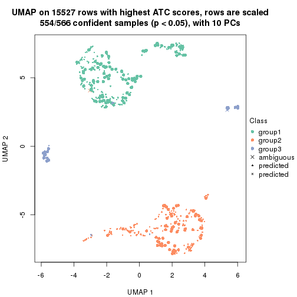</p>

</div>
<div id='tab-node-03-dimension-reduction-3'>
<pre><code class="r">dimension_reduction(res, k = 4, method = &quot;UMAP&quot;)
</code></pre>

<p></p>

</div>
</div>


Following heatmap shows how subgroups are split when increasing `k`:

```r
collect_classes(res)
```


Test correlation between subgroups and known annotations. If the known
annotation is numeric, one-way ANOVA test is applied, and if the known
annotation is discrete, chi-squared contingency table test is applied.

```r
test_to_known_factors(res)
```

```
#>             n_sample age(p-value) cell.type(p-value) k
#> ATC:skmeans      562     7.16e-18           6.54e-03 2
#> ATC:skmeans      554     4.03e-14          1.54e-115 3
#> ATC:skmeans      510     1.81e-19           4.89e-98 4
```


If matrix rows can be associated to genes, consider to use `functional_enrichment(res,
...)` to perform function enrichment for the signature genes. See [this vignette](https://jokergoo.github.io/cola_vignettes/functional_enrichment.html) for more detailed explanations.


 

---------------------------------------------------


### Node031


Parent node: [Node03](#Node03).
Child nodes: 
                Node0111-leaf
        ,
                Node0112-leaf
        ,
                Node0121-leaf
        ,
                Node0122-leaf
        ,
                Node0131-leaf
        ,
                Node0132-leaf
        ,
                [Node0211](#Node0211)
        ,
                [Node0212](#Node0212)
        ,
                [Node0221](#Node0221)
        ,
                [Node0222](#Node0222)
        ,
                Node0231-leaf
        ,
                Node0232-leaf
        ,
                Node0233-leaf
        ,
                Node0311-leaf
        ,
                Node0312-leaf
        ,
                Node0313-leaf
        ,
                Node0314-leaf
        ,
                [Node0321](#Node0321)
        ,
                [Node0322](#Node0322)
        ,
                Node0331-leaf
        ,
                Node0332-leaf
        ,
                Node0333-leaf
        .


The object with results only for a single top-value method and a single partitioning method 
can be extracted as:

```r
res = res_rh["031"]
```

A summary of `res` and all the functions that can be applied to it:

```r
res
```

```
#> A 'ConsensusPartition' object with k = 2, 3, 4.
#>   On a matrix with 14733 rows and 268 columns.
#>   Top rows (696) are extracted by 'ATC' method.
#>   Subgroups are detected by 'skmeans' method.
#>   Performed in total 150 partitions by row resampling.
#>   Best k for subgroups seems to be 4.
#> 
#> Following methods can be applied to this 'ConsensusPartition' object:
#>  [1] "cola_report"             "collect_classes"         "collect_plots"          
#>  [4] "collect_stats"           "colnames"                "compare_partitions"     
#>  [7] "compare_signatures"      "consensus_heatmap"       "dimension_reduction"    
#> [10] "functional_enrichment"   "get_anno_col"            "get_anno"               
#> [13] "get_classes"             "get_consensus"           "get_matrix"             
#> [16] "get_membership"          "get_param"               "get_signatures"         
#> [19] "get_stats"               "is_best_k"               "is_stable_k"            
#> [22] "membership_heatmap"      "ncol"                    "nrow"                   
#> [25] "plot_ecdf"               "predict_classes"         "rownames"               
#> [28] "select_partition_number" "show"                    "suggest_best_k"         
#> [31] "test_to_known_factors"   "top_rows_heatmap"
```

`collect_plots()` function collects all the plots made from `res` for all `k` (number of subgroups)
into one single page to provide an easy and fast comparison between different `k`.

```r
collect_plots(res)
```


The plots are:

- The first row: a plot of the eCDF (empirical cumulative distribution
  function) curves of the consensus matrix for each `k` and the heatmap of
  predicted classes for each `k`.
- The second row: heatmaps of the consensus matrix for each `k`.
- The third row: heatmaps of the membership matrix for each `k`.
- The fouth row: heatmaps of the signatures for each `k`.

All the plots in panels can be made by individual functions and they are
plotted later in this section.

`select_partition_number()` produces several plots showing different
statistics for choosing "optimized" `k`. There are following statistics:

- eCDF curves of the consensus matrix for each `k`;
- 1-PAC. [The PAC score](https://en.wikipedia.org/wiki/Consensus_clustering#Over-interpretation_potential_of_consensus_clustering)
  measures the proportion of the ambiguous subgrouping.
- Mean silhouette score.
- Concordance. The mean probability of fiting the consensus subgroup labels in all
  partitions.
- Area increased. Denote $A_k$ as the area under the eCDF curve for current
  `k`, the area increased is defined as $A_k - A_{k-1}$.
- Rand index. The percent of pairs of samples that are both in a same cluster
  or both are not in a same cluster in the partition of k and k-1.
- Jaccard index. The ratio of pairs of samples are both in a same cluster in
  the partition of k and k-1 and the pairs of samples are both in a same
  cluster in the partition k or k-1.

The detailed explanations of these statistics can be found in [the _cola_
vignette](https://jokergoo.github.io/cola_vignettes/cola.html#toc_13).

Generally speaking, higher 1-PAC score, higher mean silhouette score or higher
concordance corresponds to better partition. Rand index and Jaccard index
measure how similar the current partition is compared to partition with `k-1`.
If they are too similar, we won't accept `k` is better than `k-1`.

```r
select_partition_number(res)
```


The numeric values for all these statistics can be obtained by `get_stats()`.

```r
get_stats(res)
```

```
#>   k 1-PAC mean_silhouette concordance area_increased  Rand Jaccard
#> 2 2 0.794           0.869       0.946          0.496 0.498   0.498
#> 3 3 0.743           0.864       0.929          0.321 0.799   0.616
#> 4 4 0.967           0.939       0.974          0.143 0.835   0.568
```

`suggest_best_k()` suggests the best $k$ based on these statistics. The rules are as follows:

- All $k$ with Jaccard index larger than 0.95 are removed because increasing
  $k$ does not provide enough extra information. If all $k$ are removed, it is
  marked as no subgroup is detected.
- For all $k$ with 1-PAC score larger than 0.9, the maximal $k$ is taken as
  the best $k$, and other $k$ are marked as optional $k$.
- If it does not fit the second rule. The $k$ with the maximal vote of the
  highest 1-PAC score, highest mean silhouette, and highest concordance is
  taken as the best $k$.

```r
suggest_best_k(res)
```

```
#> [1] 4
```


Following is the table of the partitions (You need to click the **show/hide
code output** link to see it). The membership matrix (columns with name `p*`)
is inferred by
[`clue::cl_consensus()`](https://www.rdocumentation.org/link/cl_consensus?package=clue)
function with the `SE` method. Basically the value in the membership matrix
represents the probability to belong to a certain group. The finall subgroup
label for an item is determined with the group with highest probability it
belongs to.

In `get_classes()` function, the entropy is calculated from the membership
matrix and the silhouette score is calculated from the consensus matrix.


<script>
$( function() {
	$( '#tabs-node-031-get-classes' ).tabs();
} );
</script>
<div id='tabs-node-031-get-classes'>
<ul>
<li><a href='#tab-node-031-get-classes-1'>k = 2</a></li>
<li><a href='#tab-node-031-get-classes-2'>k = 3</a></li>
<li><a href='#tab-node-031-get-classes-3'>k = 4</a></li>
</ul>

<div id='tab-node-031-get-classes-1'>
<p><a id='tab-node-031-get-classes-1-a' style='color:#0366d6' href='#'>show/hide code output</a></p>
<pre><code class="r">cbind(get_classes(res, k = 2), get_membership(res, k = 2))
</code></pre>

<pre><code>#&gt;             class entropy silhouette   p1   p2
#&gt; Sample_478      2   0.000     0.9585 0.00 1.00
#&gt; Sample_480      2   0.000     0.9585 0.00 1.00
#&gt; Sample_481      2   0.000     0.9585 0.00 1.00
#&gt; Sample_482      2   0.000     0.9585 0.00 1.00
#&gt; Sample_483      2   0.000     0.9585 0.00 1.00
#&gt; Sample_484      2   0.000     0.9585 0.00 1.00
#&gt; Sample_485      2   0.000     0.9585 0.00 1.00
#&gt; Sample_489      2   0.000     0.9585 0.00 1.00
#&gt; Sample_491      2   0.000     0.9585 0.00 1.00
#&gt; Sample_492      2   0.000     0.9585 0.00 1.00
#&gt; Sample_493      2   0.000     0.9585 0.00 1.00
#&gt; Sample_494      2   0.000     0.9585 0.00 1.00
#&gt; Sample_496      2   0.000     0.9585 0.00 1.00
#&gt; Sample_497      2   0.000     0.9585 0.00 1.00
#&gt; Sample_498      2   0.000     0.9585 0.00 1.00
#&gt; Sample_501      2   0.000     0.9585 0.00 1.00
#&gt; Sample_502      2   0.000     0.9585 0.00 1.00
#&gt; Sample_503      2   0.000     0.9585 0.00 1.00
#&gt; Sample_504      2   0.000     0.9585 0.00 1.00
#&gt; Sample_508      2   0.000     0.9585 0.00 1.00
#&gt; Sample_509      2   0.000     0.9585 0.00 1.00
#&gt; Sample_510      2   0.000     0.9585 0.00 1.00
#&gt; Sample_514      2   0.000     0.9585 0.00 1.00
#&gt; Sample_518      2   0.000     0.9585 0.00 1.00
#&gt; Sample_519      2   0.000     0.9585 0.00 1.00
#&gt; Sample_522      2   0.000     0.9585 0.00 1.00
#&gt; Sample_523      2   0.000     0.9585 0.00 1.00
#&gt; Sample_524      2   0.000     0.9585 0.00 1.00
#&gt; Sample_525      2   0.000     0.9585 0.00 1.00
#&gt; Sample_526      2   0.000     0.9585 0.00 1.00
#&gt; Sample_528      2   0.000     0.9585 0.00 1.00
#&gt; Sample_534      2   0.000     0.9585 0.00 1.00
#&gt; Sample_538      2   0.000     0.9585 0.00 1.00
#&gt; Sample_540      2   0.000     0.9585 0.00 1.00
#&gt; Sample_541      2   0.000     0.9585 0.00 1.00
#&gt; Sample_548      2   0.000     0.9585 0.00 1.00
#&gt; Sample_549      2   0.000     0.9585 0.00 1.00
#&gt; Sample_550      2   0.000     0.9585 0.00 1.00
#&gt; Sample_551      2   0.000     0.9585 0.00 1.00
#&gt; Sample_552      2   0.000     0.9585 0.00 1.00
#&gt; Sample_554      2   0.000     0.9585 0.00 1.00
#&gt; Sample_555      2   0.000     0.9585 0.00 1.00
#&gt; Sample_556      2   0.000     0.9585 0.00 1.00
#&gt; Sample_560      2   0.000     0.9585 0.00 1.00
#&gt; Sample_561      2   0.000     0.9585 0.00 1.00
#&gt; Sample_562      2   0.000     0.9585 0.00 1.00
#&gt; Sample_563      2   0.000     0.9585 0.00 1.00
#&gt; Sample_564      2   0.000     0.9585 0.00 1.00
#&gt; Sample_568      2   0.000     0.9585 0.00 1.00
#&gt; Sample_1029     2   0.000     0.9585 0.00 1.00
#&gt; Sample_1032     2   0.000     0.9585 0.00 1.00
#&gt; Sample_1033     2   0.000     0.9585 0.00 1.00
#&gt; Sample_1035     2   0.000     0.9585 0.00 1.00
#&gt; Sample_1037     2   0.000     0.9585 0.00 1.00
#&gt; Sample_1038     2   0.141     0.9412 0.02 0.98
#&gt; Sample_1040     2   0.000     0.9585 0.00 1.00
#&gt; Sample_1043     2   0.000     0.9585 0.00 1.00
#&gt; Sample_1044     2   0.000     0.9585 0.00 1.00
#&gt; Sample_1047     2   0.000     0.9585 0.00 1.00
#&gt; Sample_1051     2   0.000     0.9585 0.00 1.00
#&gt; Sample_1063     2   0.000     0.9585 0.00 1.00
#&gt; Sample_1064     2   0.000     0.9585 0.00 1.00
#&gt; Sample_1065     2   0.000     0.9585 0.00 1.00
#&gt; Sample_1067     2   0.000     0.9585 0.00 1.00
#&gt; Sample_1068     2   0.000     0.9585 0.00 1.00
#&gt; Sample_1069     2   0.000     0.9585 0.00 1.00
#&gt; Sample_1071     2   0.000     0.9585 0.00 1.00
#&gt; Sample_1072     2   0.141     0.9412 0.02 0.98
#&gt; Sample_1074     2   0.000     0.9585 0.00 1.00
#&gt; Sample_1077     2   0.000     0.9585 0.00 1.00
#&gt; Sample_1078     2   0.000     0.9585 0.00 1.00
#&gt; Sample_1079     2   0.000     0.9585 0.00 1.00
#&gt; Sample_1081     2   0.000     0.9585 0.00 1.00
#&gt; Sample_1082     2   0.000     0.9585 0.00 1.00
#&gt; Sample_1084     2   0.000     0.9585 0.00 1.00
#&gt; Sample_1085     2   0.000     0.9585 0.00 1.00
#&gt; Sample_1092     2   0.000     0.9585 0.00 1.00
#&gt; Sample_1094     2   0.000     0.9585 0.00 1.00
#&gt; Sample_1095     2   0.000     0.9585 0.00 1.00
#&gt; Sample_1096     2   0.760     0.7003 0.22 0.78
#&gt; Sample_1098     2   0.000     0.9585 0.00 1.00
#&gt; Sample_1099     2   0.000     0.9585 0.00 1.00
#&gt; Sample_1101     2   0.000     0.9585 0.00 1.00
#&gt; Sample_1106     2   0.000     0.9585 0.00 1.00
#&gt; Sample_1107     2   0.000     0.9585 0.00 1.00
#&gt; Sample_1109     2   0.000     0.9585 0.00 1.00
#&gt; Sample_1111     2   0.141     0.9415 0.02 0.98
#&gt; Sample_1115     2   0.000     0.9585 0.00 1.00
#&gt; Sample_1117     2   0.000     0.9585 0.00 1.00
#&gt; Sample_1123     2   0.584     0.8132 0.14 0.86
#&gt; Sample_1124     2   0.000     0.9585 0.00 1.00
#&gt; Sample_1125     2   0.000     0.9585 0.00 1.00
#&gt; Sample_1126     2   0.000     0.9585 0.00 1.00
#&gt; Sample_1127     2   0.242     0.9237 0.04 0.96
#&gt; Sample_1128     2   0.000     0.9585 0.00 1.00
#&gt; Sample_1139     2   0.000     0.9585 0.00 1.00
#&gt; Sample_1141     2   0.242     0.9253 0.04 0.96
#&gt; Sample_1145     2   0.000     0.9585 0.00 1.00
#&gt; Sample_1150     2   0.000     0.9585 0.00 1.00
#&gt; Sample_1152     2   0.000     0.9585 0.00 1.00
#&gt; Sample_1156     2   0.000     0.9585 0.00 1.00
#&gt; Sample_1157     2   0.000     0.9585 0.00 1.00
#&gt; Sample_1161     2   0.000     0.9585 0.00 1.00
#&gt; Sample_1163     2   0.000     0.9585 0.00 1.00
#&gt; Sample_1164     2   0.000     0.9585 0.00 1.00
#&gt; Sample_1169     2   0.000     0.9585 0.00 1.00
#&gt; Sample_1170     2   0.000     0.9585 0.00 1.00
#&gt; Sample_1175     2   0.000     0.9585 0.00 1.00
#&gt; Sample_1180     2   0.000     0.9585 0.00 1.00
#&gt; Sample_1223     1   0.000     0.9206 1.00 0.00
#&gt; Sample_1224     1   0.000     0.9206 1.00 0.00
#&gt; Sample_1226     1   0.000     0.9206 1.00 0.00
#&gt; Sample_1230     1   0.000     0.9206 1.00 0.00
#&gt; Sample_1231     1   0.000     0.9206 1.00 0.00
#&gt; Sample_1232     1   0.000     0.9206 1.00 0.00
#&gt; Sample_1233     1   0.000     0.9206 1.00 0.00
#&gt; Sample_1235     1   0.000     0.9206 1.00 0.00
#&gt; Sample_1237     1   0.000     0.9206 1.00 0.00
#&gt; Sample_1238     1   0.000     0.9206 1.00 0.00
#&gt; Sample_1243     1   0.000     0.9206 1.00 0.00
#&gt; Sample_1244     1   0.000     0.9206 1.00 0.00
#&gt; Sample_1245     1   0.000     0.9206 1.00 0.00
#&gt; Sample_1246     1   0.000     0.9206 1.00 0.00
#&gt; Sample_1247     1   0.000     0.9206 1.00 0.00
#&gt; Sample_1248     1   0.000     0.9206 1.00 0.00
#&gt; Sample_1250     1   0.000     0.9206 1.00 0.00
#&gt; Sample_1251     1   0.000     0.9206 1.00 0.00
#&gt; Sample_1252     1   0.000     0.9206 1.00 0.00
#&gt; Sample_1253     1   0.000     0.9206 1.00 0.00
#&gt; Sample_1256     1   0.000     0.9206 1.00 0.00
#&gt; Sample_1257     1   0.000     0.9206 1.00 0.00
#&gt; Sample_1258     1   0.000     0.9206 1.00 0.00
#&gt; Sample_1259     1   0.000     0.9206 1.00 0.00
#&gt; Sample_1260     1   0.000     0.9206 1.00 0.00
#&gt; Sample_1261     1   0.000     0.9206 1.00 0.00
#&gt; Sample_1262     1   0.000     0.9206 1.00 0.00
#&gt; Sample_1263     1   0.000     0.9206 1.00 0.00
#&gt; Sample_1265     1   0.000     0.9206 1.00 0.00
#&gt; Sample_1269     1   0.000     0.9206 1.00 0.00
#&gt; Sample_1270     1   0.000     0.9206 1.00 0.00
#&gt; Sample_1271     1   0.000     0.9206 1.00 0.00
#&gt; Sample_1273     1   0.000     0.9206 1.00 0.00
#&gt; Sample_1274     1   0.000     0.9206 1.00 0.00
#&gt; Sample_1275     1   0.000     0.9206 1.00 0.00
#&gt; Sample_1276     1   0.000     0.9206 1.00 0.00
#&gt; Sample_1277     1   0.000     0.9206 1.00 0.00
#&gt; Sample_1278     1   0.000     0.9206 1.00 0.00
#&gt; Sample_1281     1   0.000     0.9206 1.00 0.00
#&gt; Sample_1282     1   0.000     0.9206 1.00 0.00
#&gt; Sample_1284     1   0.000     0.9206 1.00 0.00
#&gt; Sample_1286     1   0.000     0.9206 1.00 0.00
#&gt; Sample_1287     1   0.000     0.9206 1.00 0.00
#&gt; Sample_1288     1   0.000     0.9206 1.00 0.00
#&gt; Sample_1289     1   0.000     0.9206 1.00 0.00
#&gt; Sample_1290     1   0.000     0.9206 1.00 0.00
#&gt; Sample_1291     1   0.000     0.9206 1.00 0.00
#&gt; Sample_1292     1   0.000     0.9206 1.00 0.00
#&gt; Sample_1293     1   0.000     0.9206 1.00 0.00
#&gt; Sample_1294     1   0.000     0.9206 1.00 0.00
#&gt; Sample_1295     1   0.000     0.9206 1.00 0.00
#&gt; Sample_1297     1   0.000     0.9206 1.00 0.00
#&gt; Sample_1298     1   0.000     0.9206 1.00 0.00
#&gt; Sample_1300     1   0.000     0.9206 1.00 0.00
#&gt; Sample_1301     1   0.000     0.9206 1.00 0.00
#&gt; Sample_1302     1   0.000     0.9206 1.00 0.00
#&gt; Sample_1303     1   0.000     0.9206 1.00 0.00
#&gt; Sample_1304     1   0.000     0.9206 1.00 0.00
#&gt; Sample_1305     1   0.000     0.9206 1.00 0.00
#&gt; Sample_1311     1   0.000     0.9206 1.00 0.00
#&gt; Sample_1312     1   0.000     0.9206 1.00 0.00
#&gt; Sample_1314     1   0.000     0.9206 1.00 0.00
#&gt; Sample_1315     1   0.000     0.9206 1.00 0.00
#&gt; Sample_1316     1   0.000     0.9206 1.00 0.00
#&gt; Sample_1318     1   0.000     0.9206 1.00 0.00
#&gt; Sample_1319     1   0.000     0.9206 1.00 0.00
#&gt; Sample_1321     1   0.327     0.8810 0.94 0.06
#&gt; Sample_1322     1   0.000     0.9206 1.00 0.00
#&gt; Sample_1323     1   0.000     0.9206 1.00 0.00
#&gt; Sample_1324     1   0.000     0.9206 1.00 0.00
#&gt; Sample_1325     1   0.000     0.9206 1.00 0.00
#&gt; Sample_1326     1   0.141     0.9086 0.98 0.02
#&gt; Sample_1327     1   0.000     0.9206 1.00 0.00
#&gt; Sample_1328     1   0.584     0.8161 0.86 0.14
#&gt; Sample_1329     2   0.971     0.3102 0.40 0.60
#&gt; Sample_1330     1   0.242     0.8966 0.96 0.04
#&gt; Sample_1331     1   0.000     0.9206 1.00 0.00
#&gt; Sample_1332     1   0.000     0.9206 1.00 0.00
#&gt; Sample_1333     1   0.141     0.9092 0.98 0.02
#&gt; Sample_1334     1   0.000     0.9206 1.00 0.00
#&gt; Sample_1340     1   0.000     0.9206 1.00 0.00
#&gt; Sample_1341     1   0.141     0.9092 0.98 0.02
#&gt; Sample_1344     1   0.242     0.8965 0.96 0.04
#&gt; Sample_1346     1   0.000     0.9206 1.00 0.00
#&gt; Sample_1347     1   0.000     0.9206 1.00 0.00
#&gt; Sample_1349     1   0.327     0.8851 0.94 0.06
#&gt; Sample_1351     1   0.242     0.8966 0.96 0.04
#&gt; Sample_1353     1   0.000     0.9206 1.00 0.00
#&gt; Sample_1355     1   0.402     0.8646 0.92 0.08
#&gt; Sample_1356     1   0.000     0.9206 1.00 0.00
#&gt; Sample_1359     2   0.000     0.9585 0.00 1.00
#&gt; Sample_1361     1   0.242     0.8965 0.96 0.04
#&gt; Sample_1362     1   0.141     0.9092 0.98 0.02
#&gt; Sample_1363     1   0.000     0.9206 1.00 0.00
#&gt; Sample_1365     1   0.000     0.9206 1.00 0.00
#&gt; Sample_1366     1   0.000     0.9206 1.00 0.00
#&gt; Sample_1368     1   0.141     0.9092 0.98 0.02
#&gt; Sample_1369     1   0.000     0.9206 1.00 0.00
#&gt; Sample_1370     2   0.971     0.3111 0.40 0.60
#&gt; Sample_1372     1   0.141     0.9092 0.98 0.02
#&gt; Sample_1377     1   0.000     0.9206 1.00 0.00
#&gt; Sample_1378     1   0.000     0.9206 1.00 0.00
#&gt; Sample_1379     1   0.000     0.9206 1.00 0.00
#&gt; Sample_1380     1   0.000     0.9206 1.00 0.00
#&gt; Sample_1381     1   0.242     0.8966 0.96 0.04
#&gt; Sample_1383     1   0.943     0.5077 0.64 0.36
#&gt; Sample_1384     1   0.925     0.5445 0.66 0.34
#&gt; Sample_1385     2   1.000    -0.1235 0.50 0.50
#&gt; Sample_1387     1   0.943     0.5077 0.64 0.36
#&gt; Sample_1389     1   0.943     0.5077 0.64 0.36
#&gt; Sample_1390     1   0.943     0.5077 0.64 0.36
#&gt; Sample_1391     1   0.943     0.5077 0.64 0.36
#&gt; Sample_1392     2   0.000     0.9585 0.00 1.00
#&gt; Sample_1393     1   0.925     0.5445 0.66 0.34
#&gt; Sample_1394     1   0.680     0.7715 0.82 0.18
#&gt; Sample_1395     1   0.855     0.6419 0.72 0.28
#&gt; Sample_1396     1   0.943     0.5077 0.64 0.36
#&gt; Sample_1397     1   0.943     0.5077 0.64 0.36
#&gt; Sample_1401     1   0.529     0.8325 0.88 0.12
#&gt; Sample_1403     1   0.958     0.4638 0.62 0.38
#&gt; Sample_1404     2   0.141     0.9416 0.02 0.98
#&gt; Sample_1405     1   0.242     0.8968 0.96 0.04
#&gt; Sample_1407     1   0.943     0.5077 0.64 0.36
#&gt; Sample_1410     2   0.327     0.9017 0.06 0.94
#&gt; Sample_1411     2   1.000    -0.1147 0.50 0.50
#&gt; Sample_1412     1   0.971     0.4165 0.60 0.40
#&gt; Sample_1414     2   0.958     0.3155 0.38 0.62
#&gt; Sample_1415     2   0.990     0.1149 0.44 0.56
#&gt; Sample_1417     1   0.943     0.5077 0.64 0.36
#&gt; Sample_1418     2   0.000     0.9585 0.00 1.00
#&gt; Sample_1420     1   0.529     0.8320 0.88 0.12
#&gt; Sample_1421     1   0.981     0.3631 0.58 0.42
#&gt; Sample_1422     1   0.971     0.4160 0.60 0.40
#&gt; Sample_1424     1   0.000     0.9206 1.00 0.00
#&gt; Sample_1428     1   0.943     0.5077 0.64 0.36
#&gt; Sample_1442     2   0.141     0.9416 0.02 0.98
#&gt; Sample_1443     2   0.141     0.9416 0.02 0.98
#&gt; Sample_1446     1   0.990     0.3066 0.56 0.44
#&gt; Sample_1447     2   0.981     0.1861 0.42 0.58
#&gt; Sample_1456     2   0.000     0.9585 0.00 1.00
#&gt; Sample_1457     2   0.634     0.7760 0.16 0.84
#&gt; Sample_1461     1   0.943     0.5077 0.64 0.36
#&gt; Sample_1463     2   0.000     0.9585 0.00 1.00
#&gt; Sample_1464     2   0.000     0.9585 0.00 1.00
#&gt; Sample_1468     2   0.000     0.9585 0.00 1.00
#&gt; Sample_1480     2   0.000     0.9585 0.00 1.00
#&gt; Sample_1485     2   0.242     0.9226 0.04 0.96
#&gt; Sample_1488     2   0.402     0.8800 0.08 0.92
#&gt; Sample_1502     1   0.760     0.7244 0.78 0.22
#&gt; Sample_1503     1   0.634     0.7931 0.84 0.16
#&gt; Sample_1506     1   0.634     0.7933 0.84 0.16
#&gt; Sample_1507     2   0.999    -0.0358 0.48 0.52
#&gt; Sample_1508     1   0.958     0.4638 0.62 0.38
#&gt; Sample_1511     1   0.943     0.5077 0.64 0.36
#&gt; Sample_1512     1   0.795     0.6985 0.76 0.24
#&gt; Sample_1513     2   0.827     0.6060 0.26 0.74
#&gt; Sample_1515     2   0.855     0.5631 0.28 0.72
#&gt; Sample_1569     2   0.000     0.9585 0.00 1.00
#&gt; Sample_1598     1   0.000     0.9206 1.00 0.00
</code></pre>

<script>
$('#tab-node-031-get-classes-1-a').parent().next().next().hide();
$('#tab-node-031-get-classes-1-a').click(function(){
  $('#tab-node-031-get-classes-1-a').parent().next().next().toggle();
  return(false);
});
</script>
</div>

<div id='tab-node-031-get-classes-2'>
<p><a id='tab-node-031-get-classes-2-a' style='color:#0366d6' href='#'>show/hide code output</a></p>
<pre><code class="r">cbind(get_classes(res, k = 3), get_membership(res, k = 3))
</code></pre>

<pre><code>#&gt;             class entropy silhouette   p1   p2   p3
#&gt; Sample_478      2  0.0000      0.916 0.00 1.00 0.00
#&gt; Sample_480      2  0.0000      0.916 0.00 1.00 0.00
#&gt; Sample_481      3  0.3686      0.819 0.00 0.14 0.86
#&gt; Sample_482      2  0.0000      0.916 0.00 1.00 0.00
#&gt; Sample_483      2  0.0000      0.916 0.00 1.00 0.00
#&gt; Sample_484      2  0.4291      0.802 0.00 0.82 0.18
#&gt; Sample_485      2  0.0000      0.916 0.00 1.00 0.00
#&gt; Sample_489      2  0.0000      0.916 0.00 1.00 0.00
#&gt; Sample_491      2  0.1529      0.898 0.04 0.96 0.00
#&gt; Sample_492      2  0.0000      0.916 0.00 1.00 0.00
#&gt; Sample_493      2  0.0000      0.916 0.00 1.00 0.00
#&gt; Sample_494      2  0.0000      0.916 0.00 1.00 0.00
#&gt; Sample_496      2  0.0000      0.916 0.00 1.00 0.00
#&gt; Sample_497      2  0.0000      0.916 0.00 1.00 0.00
#&gt; Sample_498      2  0.0000      0.916 0.00 1.00 0.00
#&gt; Sample_501      2  0.0000      0.916 0.00 1.00 0.00
#&gt; Sample_502      2  0.0000      0.916 0.00 1.00 0.00
#&gt; Sample_503      2  0.0000      0.916 0.00 1.00 0.00
#&gt; Sample_504      2  0.0000      0.916 0.00 1.00 0.00
#&gt; Sample_508      2  0.0000      0.916 0.00 1.00 0.00
#&gt; Sample_509      2  0.0000      0.916 0.00 1.00 0.00
#&gt; Sample_510      2  0.0000      0.916 0.00 1.00 0.00
#&gt; Sample_514      2  0.0000      0.916 0.00 1.00 0.00
#&gt; Sample_518      2  0.0000      0.916 0.00 1.00 0.00
#&gt; Sample_519      2  0.0000      0.916 0.00 1.00 0.00
#&gt; Sample_522      2  0.0000      0.916 0.00 1.00 0.00
#&gt; Sample_523      2  0.0000      0.916 0.00 1.00 0.00
#&gt; Sample_524      2  0.0000      0.916 0.00 1.00 0.00
#&gt; Sample_525      2  0.0000      0.916 0.00 1.00 0.00
#&gt; Sample_526      2  0.0000      0.916 0.00 1.00 0.00
#&gt; Sample_528      2  0.4291      0.856 0.00 0.82 0.18
#&gt; Sample_534      2  0.0000      0.916 0.00 1.00 0.00
#&gt; Sample_538      2  0.0000      0.916 0.00 1.00 0.00
#&gt; Sample_540      2  0.0000      0.916 0.00 1.00 0.00
#&gt; Sample_541      2  0.0000      0.916 0.00 1.00 0.00
#&gt; Sample_548      2  0.0000      0.916 0.00 1.00 0.00
#&gt; Sample_549      2  0.0000      0.916 0.00 1.00 0.00
#&gt; Sample_550      2  0.0000      0.916 0.00 1.00 0.00
#&gt; Sample_551      2  0.0000      0.916 0.00 1.00 0.00
#&gt; Sample_552      2  0.0000      0.916 0.00 1.00 0.00
#&gt; Sample_554      2  0.0000      0.916 0.00 1.00 0.00
#&gt; Sample_555      2  0.0000      0.916 0.00 1.00 0.00
#&gt; Sample_556      2  0.0000      0.916 0.00 1.00 0.00
#&gt; Sample_560      2  0.0000      0.916 0.00 1.00 0.00
#&gt; Sample_561      2  0.0000      0.916 0.00 1.00 0.00
#&gt; Sample_562      2  0.0000      0.916 0.00 1.00 0.00
#&gt; Sample_563      2  0.0000      0.916 0.00 1.00 0.00
#&gt; Sample_564      2  0.0000      0.916 0.00 1.00 0.00
#&gt; Sample_568      2  0.0000      0.916 0.00 1.00 0.00
#&gt; Sample_1029     2  0.1529      0.912 0.00 0.96 0.04
#&gt; Sample_1032     2  0.3340      0.888 0.00 0.88 0.12
#&gt; Sample_1033     2  0.4291      0.856 0.00 0.82 0.18
#&gt; Sample_1035     2  0.3686      0.879 0.00 0.86 0.14
#&gt; Sample_1037     2  0.4291      0.856 0.00 0.82 0.18
#&gt; Sample_1038     2  0.4291      0.856 0.00 0.82 0.18
#&gt; Sample_1040     2  0.1529      0.912 0.00 0.96 0.04
#&gt; Sample_1043     2  0.3340      0.887 0.00 0.88 0.12
#&gt; Sample_1044     2  0.3686      0.879 0.00 0.86 0.14
#&gt; Sample_1047     2  0.4291      0.856 0.00 0.82 0.18
#&gt; Sample_1051     2  0.4291      0.856 0.00 0.82 0.18
#&gt; Sample_1063     2  0.1529      0.912 0.00 0.96 0.04
#&gt; Sample_1064     2  0.1529      0.912 0.00 0.96 0.04
#&gt; Sample_1065     2  0.4291      0.856 0.00 0.82 0.18
#&gt; Sample_1067     2  0.4291      0.856 0.00 0.82 0.18
#&gt; Sample_1068     2  0.4291      0.856 0.00 0.82 0.18
#&gt; Sample_1069     2  0.4291      0.856 0.00 0.82 0.18
#&gt; Sample_1071     2  0.4796      0.816 0.00 0.78 0.22
#&gt; Sample_1072     2  0.4291      0.856 0.00 0.82 0.18
#&gt; Sample_1074     2  0.4291      0.856 0.00 0.82 0.18
#&gt; Sample_1077     2  0.4291      0.856 0.00 0.82 0.18
#&gt; Sample_1078     2  0.4291      0.856 0.00 0.82 0.18
#&gt; Sample_1079     2  0.2066      0.907 0.00 0.94 0.06
#&gt; Sample_1081     2  0.4002      0.868 0.00 0.84 0.16
#&gt; Sample_1082     2  0.0000      0.916 0.00 1.00 0.00
#&gt; Sample_1084     2  0.0000      0.916 0.00 1.00 0.00
#&gt; Sample_1085     2  0.3686      0.879 0.00 0.86 0.14
#&gt; Sample_1092     2  0.4291      0.856 0.00 0.82 0.18
#&gt; Sample_1094     2  0.2066      0.907 0.00 0.94 0.06
#&gt; Sample_1095     2  0.3686      0.879 0.00 0.86 0.14
#&gt; Sample_1096     2  0.8437      0.617 0.20 0.62 0.18
#&gt; Sample_1098     2  0.2537      0.902 0.00 0.92 0.08
#&gt; Sample_1099     2  0.4291      0.856 0.00 0.82 0.18
#&gt; Sample_1101     2  0.2066      0.907 0.00 0.94 0.06
#&gt; Sample_1106     2  0.3686      0.879 0.00 0.86 0.14
#&gt; Sample_1107     2  0.4291      0.856 0.00 0.82 0.18
#&gt; Sample_1109     2  0.4291      0.856 0.00 0.82 0.18
#&gt; Sample_1111     2  0.5016      0.792 0.00 0.76 0.24
#&gt; Sample_1115     2  0.4291      0.856 0.00 0.82 0.18
#&gt; Sample_1117     3  0.6192      0.083 0.00 0.42 0.58
#&gt; Sample_1123     2  0.4291      0.856 0.00 0.82 0.18
#&gt; Sample_1124     2  0.4291      0.856 0.00 0.82 0.18
#&gt; Sample_1125     2  0.4291      0.856 0.00 0.82 0.18
#&gt; Sample_1126     2  0.3686      0.879 0.00 0.86 0.14
#&gt; Sample_1127     3  0.4291      0.711 0.00 0.18 0.82
#&gt; Sample_1128     2  0.4002      0.869 0.00 0.84 0.16
#&gt; Sample_1139     2  0.4002      0.869 0.00 0.84 0.16
#&gt; Sample_1141     2  0.4002      0.869 0.00 0.84 0.16
#&gt; Sample_1145     2  0.1529      0.912 0.00 0.96 0.04
#&gt; Sample_1150     2  0.3686      0.879 0.00 0.86 0.14
#&gt; Sample_1152     2  0.0892      0.914 0.00 0.98 0.02
#&gt; Sample_1156     2  0.0000      0.916 0.00 1.00 0.00
#&gt; Sample_1157     2  0.1529      0.912 0.00 0.96 0.04
#&gt; Sample_1161     2  0.0000      0.916 0.00 1.00 0.00
#&gt; Sample_1163     2  0.0892      0.914 0.00 0.98 0.02
#&gt; Sample_1164     2  0.4291      0.856 0.00 0.82 0.18
#&gt; Sample_1169     2  0.1529      0.912 0.00 0.96 0.04
#&gt; Sample_1170     2  0.0000      0.916 0.00 1.00 0.00
#&gt; Sample_1175     2  0.0000      0.916 0.00 1.00 0.00
#&gt; Sample_1180     2  0.4291      0.856 0.00 0.82 0.18
#&gt; Sample_1223     1  0.0000      0.932 1.00 0.00 0.00
#&gt; Sample_1224     1  0.0000      0.932 1.00 0.00 0.00
#&gt; Sample_1226     1  0.0000      0.932 1.00 0.00 0.00
#&gt; Sample_1230     1  0.0000      0.932 1.00 0.00 0.00
#&gt; Sample_1231     1  0.0000      0.932 1.00 0.00 0.00
#&gt; Sample_1232     1  0.0000      0.932 1.00 0.00 0.00
#&gt; Sample_1233     1  0.0000      0.932 1.00 0.00 0.00
#&gt; Sample_1235     1  0.0000      0.932 1.00 0.00 0.00
#&gt; Sample_1237     1  0.0000      0.932 1.00 0.00 0.00
#&gt; Sample_1238     1  0.0000      0.932 1.00 0.00 0.00
#&gt; Sample_1243     1  0.0000      0.932 1.00 0.00 0.00
#&gt; Sample_1244     1  0.0000      0.932 1.00 0.00 0.00
#&gt; Sample_1245     1  0.0000      0.932 1.00 0.00 0.00
#&gt; Sample_1246     1  0.0000      0.932 1.00 0.00 0.00
#&gt; Sample_1247     1  0.0000      0.932 1.00 0.00 0.00
#&gt; Sample_1248     1  0.0000      0.932 1.00 0.00 0.00
#&gt; Sample_1250     1  0.0000      0.932 1.00 0.00 0.00
#&gt; Sample_1251     1  0.0000      0.932 1.00 0.00 0.00
#&gt; Sample_1252     1  0.0000      0.932 1.00 0.00 0.00
#&gt; Sample_1253     1  0.0000      0.932 1.00 0.00 0.00
#&gt; Sample_1256     1  0.0000      0.932 1.00 0.00 0.00
#&gt; Sample_1257     1  0.0000      0.932 1.00 0.00 0.00
#&gt; Sample_1258     1  0.0000      0.932 1.00 0.00 0.00
#&gt; Sample_1259     1  0.0000      0.932 1.00 0.00 0.00
#&gt; Sample_1260     1  0.0000      0.932 1.00 0.00 0.00
#&gt; Sample_1261     1  0.0000      0.932 1.00 0.00 0.00
#&gt; Sample_1262     1  0.0000      0.932 1.00 0.00 0.00
#&gt; Sample_1263     1  0.0000      0.932 1.00 0.00 0.00
#&gt; Sample_1265     1  0.0000      0.932 1.00 0.00 0.00
#&gt; Sample_1269     1  0.0000      0.932 1.00 0.00 0.00
#&gt; Sample_1270     1  0.0000      0.932 1.00 0.00 0.00
#&gt; Sample_1271     1  0.0000      0.932 1.00 0.00 0.00
#&gt; Sample_1273     1  0.0000      0.932 1.00 0.00 0.00
#&gt; Sample_1274     1  0.0000      0.932 1.00 0.00 0.00
#&gt; Sample_1275     1  0.0000      0.932 1.00 0.00 0.00
#&gt; Sample_1276     1  0.0000      0.932 1.00 0.00 0.00
#&gt; Sample_1277     1  0.0000      0.932 1.00 0.00 0.00
#&gt; Sample_1278     1  0.0000      0.932 1.00 0.00 0.00
#&gt; Sample_1281     1  0.0000      0.932 1.00 0.00 0.00
#&gt; Sample_1282     1  0.0000      0.932 1.00 0.00 0.00
#&gt; Sample_1284     1  0.0000      0.932 1.00 0.00 0.00
#&gt; Sample_1286     1  0.0000      0.932 1.00 0.00 0.00
#&gt; Sample_1287     1  0.0000      0.932 1.00 0.00 0.00
#&gt; Sample_1288     1  0.0000      0.932 1.00 0.00 0.00
#&gt; Sample_1289     1  0.0000      0.932 1.00 0.00 0.00
#&gt; Sample_1290     1  0.0000      0.932 1.00 0.00 0.00
#&gt; Sample_1291     1  0.0000      0.932 1.00 0.00 0.00
#&gt; Sample_1292     1  0.0000      0.932 1.00 0.00 0.00
#&gt; Sample_1293     1  0.0000      0.932 1.00 0.00 0.00
#&gt; Sample_1294     1  0.0000      0.932 1.00 0.00 0.00
#&gt; Sample_1295     1  0.0000      0.932 1.00 0.00 0.00
#&gt; Sample_1297     1  0.0000      0.932 1.00 0.00 0.00
#&gt; Sample_1298     1  0.0000      0.932 1.00 0.00 0.00
#&gt; Sample_1300     1  0.0000      0.932 1.00 0.00 0.00
#&gt; Sample_1301     1  0.0000      0.932 1.00 0.00 0.00
#&gt; Sample_1302     1  0.0000      0.932 1.00 0.00 0.00
#&gt; Sample_1303     1  0.0000      0.932 1.00 0.00 0.00
#&gt; Sample_1304     1  0.0000      0.932 1.00 0.00 0.00
#&gt; Sample_1305     1  0.0000      0.932 1.00 0.00 0.00
#&gt; Sample_1311     1  0.0000      0.932 1.00 0.00 0.00
#&gt; Sample_1312     1  0.0000      0.932 1.00 0.00 0.00
#&gt; Sample_1314     3  0.6192      0.241 0.42 0.00 0.58
#&gt; Sample_1315     3  0.7310      0.359 0.36 0.04 0.60
#&gt; Sample_1316     1  0.5560      0.587 0.70 0.00 0.30
#&gt; Sample_1318     3  0.5216      0.625 0.26 0.00 0.74
#&gt; Sample_1319     1  0.4291      0.769 0.82 0.00 0.18
#&gt; Sample_1321     1  0.7975      0.613 0.66 0.18 0.16
#&gt; Sample_1322     1  0.0000      0.932 1.00 0.00 0.00
#&gt; Sample_1323     1  0.2066      0.887 0.94 0.00 0.06
#&gt; Sample_1324     1  0.5016      0.687 0.76 0.00 0.24
#&gt; Sample_1325     1  0.0000      0.932 1.00 0.00 0.00
#&gt; Sample_1326     1  0.2537      0.871 0.92 0.08 0.00
#&gt; Sample_1327     1  0.0000      0.932 1.00 0.00 0.00
#&gt; Sample_1328     3  0.4209      0.817 0.02 0.12 0.86
#&gt; Sample_1329     3  0.9003      0.489 0.20 0.24 0.56
#&gt; Sample_1330     1  0.4002      0.795 0.84 0.16 0.00
#&gt; Sample_1331     1  0.6192      0.306 0.58 0.00 0.42
#&gt; Sample_1332     1  0.7884      0.554 0.64 0.10 0.26
#&gt; Sample_1333     1  0.9083      0.331 0.52 0.16 0.32
#&gt; Sample_1334     1  0.6280      0.178 0.54 0.00 0.46
#&gt; Sample_1340     1  0.0000      0.932 1.00 0.00 0.00
#&gt; Sample_1341     1  0.7932      0.608 0.66 0.14 0.20
#&gt; Sample_1344     1  0.8733      0.468 0.58 0.16 0.26
#&gt; Sample_1346     1  0.0000      0.932 1.00 0.00 0.00
#&gt; Sample_1347     1  0.4555      0.740 0.80 0.00 0.20
#&gt; Sample_1349     3  0.8576      0.487 0.24 0.16 0.60
#&gt; Sample_1351     1  0.5970      0.753 0.78 0.16 0.06
#&gt; Sample_1353     1  0.0000      0.932 1.00 0.00 0.00
#&gt; Sample_1355     1  0.9267      0.155 0.46 0.16 0.38
#&gt; Sample_1356     3  0.8619      0.071 0.42 0.10 0.48
#&gt; Sample_1359     2  0.0892      0.906 0.00 0.98 0.02
#&gt; Sample_1361     1  0.4035      0.850 0.88 0.08 0.04
#&gt; Sample_1362     1  0.6407      0.734 0.76 0.16 0.08
#&gt; Sample_1363     1  0.3686      0.816 0.86 0.14 0.00
#&gt; Sample_1365     1  0.0000      0.932 1.00 0.00 0.00
#&gt; Sample_1366     3  0.2947      0.868 0.02 0.06 0.92
#&gt; Sample_1368     3  0.4862      0.777 0.02 0.16 0.82
#&gt; Sample_1369     1  0.0000      0.932 1.00 0.00 0.00
#&gt; Sample_1370     2  0.6244      0.103 0.44 0.56 0.00
#&gt; Sample_1372     1  0.7975      0.610 0.66 0.16 0.18
#&gt; Sample_1377     1  0.0000      0.932 1.00 0.00 0.00
#&gt; Sample_1378     1  0.5397      0.623 0.72 0.00 0.28
#&gt; Sample_1379     1  0.0892      0.917 0.98 0.02 0.00
#&gt; Sample_1380     1  0.4449      0.831 0.86 0.04 0.10
#&gt; Sample_1381     1  0.4291      0.775 0.82 0.18 0.00
#&gt; Sample_1383     3  0.0000      0.927 0.00 0.00 1.00
#&gt; Sample_1384     3  0.0000      0.927 0.00 0.00 1.00
#&gt; Sample_1385     3  0.0000      0.927 0.00 0.00 1.00
#&gt; Sample_1387     3  0.0000      0.927 0.00 0.00 1.00
#&gt; Sample_1389     3  0.0000      0.927 0.00 0.00 1.00
#&gt; Sample_1390     3  0.0000      0.927 0.00 0.00 1.00
#&gt; Sample_1391     3  0.0000      0.927 0.00 0.00 1.00
#&gt; Sample_1392     3  0.0892      0.912 0.00 0.02 0.98
#&gt; Sample_1393     3  0.0000      0.927 0.00 0.00 1.00
#&gt; Sample_1394     3  0.0000      0.927 0.00 0.00 1.00
#&gt; Sample_1395     3  0.0000      0.927 0.00 0.00 1.00
#&gt; Sample_1396     3  0.0000      0.927 0.00 0.00 1.00
#&gt; Sample_1397     3  0.0000      0.927 0.00 0.00 1.00
#&gt; Sample_1401     3  0.0000      0.927 0.00 0.00 1.00
#&gt; Sample_1403     3  0.0000      0.927 0.00 0.00 1.00
#&gt; Sample_1404     3  0.0000      0.927 0.00 0.00 1.00
#&gt; Sample_1405     3  0.0000      0.927 0.00 0.00 1.00
#&gt; Sample_1407     3  0.0000      0.927 0.00 0.00 1.00
#&gt; Sample_1410     3  0.0000      0.927 0.00 0.00 1.00
#&gt; Sample_1411     3  0.0000      0.927 0.00 0.00 1.00
#&gt; Sample_1412     3  0.0000      0.927 0.00 0.00 1.00
#&gt; Sample_1414     3  0.0000      0.927 0.00 0.00 1.00
#&gt; Sample_1415     3  0.0000      0.927 0.00 0.00 1.00
#&gt; Sample_1417     3  0.0000      0.927 0.00 0.00 1.00
#&gt; Sample_1418     3  0.0000      0.927 0.00 0.00 1.00
#&gt; Sample_1420     3  0.0000      0.927 0.00 0.00 1.00
#&gt; Sample_1421     3  0.0000      0.927 0.00 0.00 1.00
#&gt; Sample_1422     3  0.0000      0.927 0.00 0.00 1.00
#&gt; Sample_1424     3  0.6192      0.263 0.42 0.00 0.58
#&gt; Sample_1428     3  0.0000      0.927 0.00 0.00 1.00
#&gt; Sample_1442     3  0.0000      0.927 0.00 0.00 1.00
#&gt; Sample_1443     3  0.0000      0.927 0.00 0.00 1.00
#&gt; Sample_1446     3  0.0000      0.927 0.00 0.00 1.00
#&gt; Sample_1447     3  0.0000      0.927 0.00 0.00 1.00
#&gt; Sample_1456     3  0.0000      0.927 0.00 0.00 1.00
#&gt; Sample_1457     3  0.0000      0.927 0.00 0.00 1.00
#&gt; Sample_1461     3  0.0000      0.927 0.00 0.00 1.00
#&gt; Sample_1463     2  0.0000      0.916 0.00 1.00 0.00
#&gt; Sample_1464     2  0.2959      0.846 0.00 0.90 0.10
#&gt; Sample_1468     3  0.0892      0.912 0.00 0.02 0.98
#&gt; Sample_1480     3  0.4555      0.753 0.00 0.20 0.80
#&gt; Sample_1485     3  0.0000      0.927 0.00 0.00 1.00
#&gt; Sample_1488     3  0.0000      0.927 0.00 0.00 1.00
#&gt; Sample_1502     3  0.0000      0.927 0.00 0.00 1.00
#&gt; Sample_1503     3  0.0000      0.927 0.00 0.00 1.00
#&gt; Sample_1506     3  0.0000      0.927 0.00 0.00 1.00
#&gt; Sample_1507     3  0.0000      0.927 0.00 0.00 1.00
#&gt; Sample_1508     3  0.0000      0.927 0.00 0.00 1.00
#&gt; Sample_1511     3  0.0000      0.927 0.00 0.00 1.00
#&gt; Sample_1512     3  0.0000      0.927 0.00 0.00 1.00
#&gt; Sample_1513     3  0.0000      0.927 0.00 0.00 1.00
#&gt; Sample_1515     3  0.0000      0.927 0.00 0.00 1.00
#&gt; Sample_1569     2  0.4002      0.869 0.00 0.84 0.16
#&gt; Sample_1598     1  0.0000      0.932 1.00 0.00 0.00
</code></pre>

<script>
$('#tab-node-031-get-classes-2-a').parent().next().next().hide();
$('#tab-node-031-get-classes-2-a').click(function(){
  $('#tab-node-031-get-classes-2-a').parent().next().next().toggle();
  return(false);
});
</script>
</div>

<div id='tab-node-031-get-classes-3'>
<p><a id='tab-node-031-get-classes-3-a' style='color:#0366d6' href='#'>show/hide code output</a></p>
<pre><code class="r">cbind(get_classes(res, k = 4), get_membership(res, k = 4))
</code></pre>

<pre><code>#&gt;             class entropy silhouette   p1   p2   p3   p4
#&gt; Sample_478      4  0.1637      0.919 0.00 0.06 0.00 0.94
#&gt; Sample_480      4  0.0000      0.966 0.00 0.00 0.00 1.00
#&gt; Sample_481      3  0.3400      0.765 0.00 0.00 0.82 0.18
#&gt; Sample_482      4  0.0000      0.966 0.00 0.00 0.00 1.00
#&gt; Sample_483      4  0.0000      0.966 0.00 0.00 0.00 1.00
#&gt; Sample_484      4  0.2011      0.899 0.00 0.00 0.08 0.92
#&gt; Sample_485      4  0.0000      0.966 0.00 0.00 0.00 1.00
#&gt; Sample_489      4  0.0000      0.966 0.00 0.00 0.00 1.00
#&gt; Sample_491      4  0.0707      0.952 0.00 0.02 0.00 0.98
#&gt; Sample_492      4  0.0000      0.966 0.00 0.00 0.00 1.00
#&gt; Sample_493      4  0.0000      0.966 0.00 0.00 0.00 1.00
#&gt; Sample_494      4  0.0000      0.966 0.00 0.00 0.00 1.00
#&gt; Sample_496      4  0.0000      0.966 0.00 0.00 0.00 1.00
#&gt; Sample_497      4  0.0000      0.966 0.00 0.00 0.00 1.00
#&gt; Sample_498      4  0.0707      0.952 0.00 0.02 0.00 0.98
#&gt; Sample_501      4  0.2921      0.832 0.00 0.14 0.00 0.86
#&gt; Sample_502      4  0.0000      0.966 0.00 0.00 0.00 1.00
#&gt; Sample_503      4  0.0000      0.966 0.00 0.00 0.00 1.00
#&gt; Sample_504      4  0.0000      0.966 0.00 0.00 0.00 1.00
#&gt; Sample_508      4  0.0000      0.966 0.00 0.00 0.00 1.00
#&gt; Sample_509      4  0.0000      0.966 0.00 0.00 0.00 1.00
#&gt; Sample_510      4  0.0000      0.966 0.00 0.00 0.00 1.00
#&gt; Sample_514      4  0.1637      0.918 0.00 0.06 0.00 0.94
#&gt; Sample_518      4  0.0000      0.966 0.00 0.00 0.00 1.00
#&gt; Sample_519      4  0.0000      0.966 0.00 0.00 0.00 1.00
#&gt; Sample_522      4  0.0000      0.966 0.00 0.00 0.00 1.00
#&gt; Sample_523      4  0.0000      0.966 0.00 0.00 0.00 1.00
#&gt; Sample_524      4  0.0000      0.966 0.00 0.00 0.00 1.00
#&gt; Sample_525      4  0.0000      0.966 0.00 0.00 0.00 1.00
#&gt; Sample_526      4  0.0000      0.966 0.00 0.00 0.00 1.00
#&gt; Sample_528      2  0.0707      0.979 0.00 0.98 0.00 0.02
#&gt; Sample_534      4  0.0000      0.966 0.00 0.00 0.00 1.00
#&gt; Sample_538      4  0.0000      0.966 0.00 0.00 0.00 1.00
#&gt; Sample_540      4  0.0000      0.966 0.00 0.00 0.00 1.00
#&gt; Sample_541      4  0.0000      0.966 0.00 0.00 0.00 1.00
#&gt; Sample_548      4  0.0000      0.966 0.00 0.00 0.00 1.00
#&gt; Sample_549      4  0.0000      0.966 0.00 0.00 0.00 1.00
#&gt; Sample_550      4  0.0000      0.966 0.00 0.00 0.00 1.00
#&gt; Sample_551      4  0.0000      0.966 0.00 0.00 0.00 1.00
#&gt; Sample_552      4  0.0000      0.966 0.00 0.00 0.00 1.00
#&gt; Sample_554      4  0.0000      0.966 0.00 0.00 0.00 1.00
#&gt; Sample_555      4  0.0000      0.966 0.00 0.00 0.00 1.00
#&gt; Sample_556      4  0.0000      0.966 0.00 0.00 0.00 1.00
#&gt; Sample_560      4  0.0000      0.966 0.00 0.00 0.00 1.00
#&gt; Sample_561      4  0.0000      0.966 0.00 0.00 0.00 1.00
#&gt; Sample_562      4  0.0000      0.966 0.00 0.00 0.00 1.00
#&gt; Sample_563      4  0.0000      0.966 0.00 0.00 0.00 1.00
#&gt; Sample_564      4  0.0000      0.966 0.00 0.00 0.00 1.00
#&gt; Sample_568      4  0.0000      0.966 0.00 0.00 0.00 1.00
#&gt; Sample_1029     2  0.0000      0.999 0.00 1.00 0.00 0.00
#&gt; Sample_1032     2  0.0000      0.999 0.00 1.00 0.00 0.00
#&gt; Sample_1033     2  0.0000      0.999 0.00 1.00 0.00 0.00
#&gt; Sample_1035     2  0.0000      0.999 0.00 1.00 0.00 0.00
#&gt; Sample_1037     2  0.0000      0.999 0.00 1.00 0.00 0.00
#&gt; Sample_1038     2  0.0000      0.999 0.00 1.00 0.00 0.00
#&gt; Sample_1040     2  0.0000      0.999 0.00 1.00 0.00 0.00
#&gt; Sample_1043     2  0.0000      0.999 0.00 1.00 0.00 0.00
#&gt; Sample_1044     2  0.0000      0.999 0.00 1.00 0.00 0.00
#&gt; Sample_1047     2  0.0000      0.999 0.00 1.00 0.00 0.00
#&gt; Sample_1051     2  0.0000      0.999 0.00 1.00 0.00 0.00
#&gt; Sample_1063     2  0.0000      0.999 0.00 1.00 0.00 0.00
#&gt; Sample_1064     2  0.0000      0.999 0.00 1.00 0.00 0.00
#&gt; Sample_1065     2  0.0000      0.999 0.00 1.00 0.00 0.00
#&gt; Sample_1067     2  0.0000      0.999 0.00 1.00 0.00 0.00
#&gt; Sample_1068     2  0.0000      0.999 0.00 1.00 0.00 0.00
#&gt; Sample_1069     2  0.0000      0.999 0.00 1.00 0.00 0.00
#&gt; Sample_1071     2  0.0000      0.999 0.00 1.00 0.00 0.00
#&gt; Sample_1072     2  0.0000      0.999 0.00 1.00 0.00 0.00
#&gt; Sample_1074     2  0.0000      0.999 0.00 1.00 0.00 0.00
#&gt; Sample_1077     2  0.0000      0.999 0.00 1.00 0.00 0.00
#&gt; Sample_1078     2  0.0000      0.999 0.00 1.00 0.00 0.00
#&gt; Sample_1079     2  0.0000      0.999 0.00 1.00 0.00 0.00
#&gt; Sample_1081     2  0.0000      0.999 0.00 1.00 0.00 0.00
#&gt; Sample_1082     2  0.0000      0.999 0.00 1.00 0.00 0.00
#&gt; Sample_1084     2  0.0000      0.999 0.00 1.00 0.00 0.00
#&gt; Sample_1085     2  0.0000      0.999 0.00 1.00 0.00 0.00
#&gt; Sample_1092     2  0.0000      0.999 0.00 1.00 0.00 0.00
#&gt; Sample_1094     2  0.0000      0.999 0.00 1.00 0.00 0.00
#&gt; Sample_1095     2  0.0000      0.999 0.00 1.00 0.00 0.00
#&gt; Sample_1096     2  0.0000      0.999 0.00 1.00 0.00 0.00
#&gt; Sample_1098     2  0.0000      0.999 0.00 1.00 0.00 0.00
#&gt; Sample_1099     2  0.0000      0.999 0.00 1.00 0.00 0.00
#&gt; Sample_1101     2  0.0000      0.999 0.00 1.00 0.00 0.00
#&gt; Sample_1106     2  0.0000      0.999 0.00 1.00 0.00 0.00
#&gt; Sample_1107     2  0.0000      0.999 0.00 1.00 0.00 0.00
#&gt; Sample_1109     2  0.0000      0.999 0.00 1.00 0.00 0.00
#&gt; Sample_1111     2  0.0000      0.999 0.00 1.00 0.00 0.00
#&gt; Sample_1115     2  0.0000      0.999 0.00 1.00 0.00 0.00
#&gt; Sample_1117     2  0.0000      0.999 0.00 1.00 0.00 0.00
#&gt; Sample_1123     2  0.0000      0.999 0.00 1.00 0.00 0.00
#&gt; Sample_1124     2  0.0000      0.999 0.00 1.00 0.00 0.00
#&gt; Sample_1125     2  0.0000      0.999 0.00 1.00 0.00 0.00
#&gt; Sample_1126     2  0.0000      0.999 0.00 1.00 0.00 0.00
#&gt; Sample_1127     2  0.0000      0.999 0.00 1.00 0.00 0.00
#&gt; Sample_1128     2  0.0000      0.999 0.00 1.00 0.00 0.00
#&gt; Sample_1139     2  0.0000      0.999 0.00 1.00 0.00 0.00
#&gt; Sample_1141     2  0.0000      0.999 0.00 1.00 0.00 0.00
#&gt; Sample_1145     2  0.0000      0.999 0.00 1.00 0.00 0.00
#&gt; Sample_1150     2  0.0000      0.999 0.00 1.00 0.00 0.00
#&gt; Sample_1152     2  0.0000      0.999 0.00 1.00 0.00 0.00
#&gt; Sample_1156     2  0.0000      0.999 0.00 1.00 0.00 0.00
#&gt; Sample_1157     2  0.0000      0.999 0.00 1.00 0.00 0.00
#&gt; Sample_1161     2  0.0707      0.978 0.00 0.98 0.00 0.02
#&gt; Sample_1163     2  0.0000      0.999 0.00 1.00 0.00 0.00
#&gt; Sample_1164     2  0.0000      0.999 0.00 1.00 0.00 0.00
#&gt; Sample_1169     2  0.0000      0.999 0.00 1.00 0.00 0.00
#&gt; Sample_1170     2  0.0000      0.999 0.00 1.00 0.00 0.00
#&gt; Sample_1175     2  0.0000      0.999 0.00 1.00 0.00 0.00
#&gt; Sample_1180     2  0.0000      0.999 0.00 1.00 0.00 0.00
#&gt; Sample_1223     1  0.0000      0.968 1.00 0.00 0.00 0.00
#&gt; Sample_1224     1  0.0000      0.968 1.00 0.00 0.00 0.00
#&gt; Sample_1226     1  0.0000      0.968 1.00 0.00 0.00 0.00
#&gt; Sample_1230     1  0.0000      0.968 1.00 0.00 0.00 0.00
#&gt; Sample_1231     1  0.0000      0.968 1.00 0.00 0.00 0.00
#&gt; Sample_1232     1  0.0000      0.968 1.00 0.00 0.00 0.00
#&gt; Sample_1233     1  0.0000      0.968 1.00 0.00 0.00 0.00
#&gt; Sample_1235     1  0.0000      0.968 1.00 0.00 0.00 0.00
#&gt; Sample_1237     1  0.0000      0.968 1.00 0.00 0.00 0.00
#&gt; Sample_1238     1  0.0000      0.968 1.00 0.00 0.00 0.00
#&gt; Sample_1243     1  0.0000      0.968 1.00 0.00 0.00 0.00
#&gt; Sample_1244     1  0.0000      0.968 1.00 0.00 0.00 0.00
#&gt; Sample_1245     1  0.0000      0.968 1.00 0.00 0.00 0.00
#&gt; Sample_1246     1  0.0000      0.968 1.00 0.00 0.00 0.00
#&gt; Sample_1247     1  0.0000      0.968 1.00 0.00 0.00 0.00
#&gt; Sample_1248     1  0.0000      0.968 1.00 0.00 0.00 0.00
#&gt; Sample_1250     1  0.0000      0.968 1.00 0.00 0.00 0.00
#&gt; Sample_1251     1  0.0000      0.968 1.00 0.00 0.00 0.00
#&gt; Sample_1252     1  0.0000      0.968 1.00 0.00 0.00 0.00
#&gt; Sample_1253     1  0.0000      0.968 1.00 0.00 0.00 0.00
#&gt; Sample_1256     1  0.0000      0.968 1.00 0.00 0.00 0.00
#&gt; Sample_1257     1  0.0000      0.968 1.00 0.00 0.00 0.00
#&gt; Sample_1258     1  0.0000      0.968 1.00 0.00 0.00 0.00
#&gt; Sample_1259     1  0.0000      0.968 1.00 0.00 0.00 0.00
#&gt; Sample_1260     1  0.0000      0.968 1.00 0.00 0.00 0.00
#&gt; Sample_1261     1  0.0000      0.968 1.00 0.00 0.00 0.00
#&gt; Sample_1262     1  0.0000      0.968 1.00 0.00 0.00 0.00
#&gt; Sample_1263     1  0.0000      0.968 1.00 0.00 0.00 0.00
#&gt; Sample_1265     1  0.0000      0.968 1.00 0.00 0.00 0.00
#&gt; Sample_1269     1  0.0000      0.968 1.00 0.00 0.00 0.00
#&gt; Sample_1270     1  0.0000      0.968 1.00 0.00 0.00 0.00
#&gt; Sample_1271     1  0.0000      0.968 1.00 0.00 0.00 0.00
#&gt; Sample_1273     1  0.0000      0.968 1.00 0.00 0.00 0.00
#&gt; Sample_1274     1  0.0000      0.968 1.00 0.00 0.00 0.00
#&gt; Sample_1275     1  0.0000      0.968 1.00 0.00 0.00 0.00
#&gt; Sample_1276     1  0.0000      0.968 1.00 0.00 0.00 0.00
#&gt; Sample_1277     1  0.0000      0.968 1.00 0.00 0.00 0.00
#&gt; Sample_1278     1  0.0000      0.968 1.00 0.00 0.00 0.00
#&gt; Sample_1281     1  0.0000      0.968 1.00 0.00 0.00 0.00
#&gt; Sample_1282     1  0.0000      0.968 1.00 0.00 0.00 0.00
#&gt; Sample_1284     1  0.0000      0.968 1.00 0.00 0.00 0.00
#&gt; Sample_1286     1  0.0000      0.968 1.00 0.00 0.00 0.00
#&gt; Sample_1287     1  0.0000      0.968 1.00 0.00 0.00 0.00
#&gt; Sample_1288     1  0.0000      0.968 1.00 0.00 0.00 0.00
#&gt; Sample_1289     1  0.0000      0.968 1.00 0.00 0.00 0.00
#&gt; Sample_1290     1  0.0000      0.968 1.00 0.00 0.00 0.00
#&gt; Sample_1291     1  0.0000      0.968 1.00 0.00 0.00 0.00
#&gt; Sample_1292     1  0.0000      0.968 1.00 0.00 0.00 0.00
#&gt; Sample_1293     1  0.0000      0.968 1.00 0.00 0.00 0.00
#&gt; Sample_1294     1  0.0000      0.968 1.00 0.00 0.00 0.00
#&gt; Sample_1295     1  0.0000      0.968 1.00 0.00 0.00 0.00
#&gt; Sample_1297     1  0.0000      0.968 1.00 0.00 0.00 0.00
#&gt; Sample_1298     1  0.0000      0.968 1.00 0.00 0.00 0.00
#&gt; Sample_1300     1  0.0000      0.968 1.00 0.00 0.00 0.00
#&gt; Sample_1301     1  0.0000      0.968 1.00 0.00 0.00 0.00
#&gt; Sample_1302     1  0.0000      0.968 1.00 0.00 0.00 0.00
#&gt; Sample_1303     1  0.0000      0.968 1.00 0.00 0.00 0.00
#&gt; Sample_1304     1  0.0000      0.968 1.00 0.00 0.00 0.00
#&gt; Sample_1305     1  0.0000      0.968 1.00 0.00 0.00 0.00
#&gt; Sample_1311     1  0.0000      0.968 1.00 0.00 0.00 0.00
#&gt; Sample_1312     1  0.0000      0.968 1.00 0.00 0.00 0.00
#&gt; Sample_1314     3  0.3400      0.771 0.18 0.00 0.82 0.00
#&gt; Sample_1315     3  0.3606      0.812 0.02 0.00 0.84 0.14
#&gt; Sample_1316     1  0.5570      0.152 0.54 0.00 0.44 0.02
#&gt; Sample_1318     3  0.6617      0.495 0.28 0.12 0.60 0.00
#&gt; Sample_1319     1  0.6477      0.455 0.60 0.30 0.10 0.00
#&gt; Sample_1321     4  0.0000      0.966 0.00 0.00 0.00 1.00
#&gt; Sample_1322     1  0.0000      0.968 1.00 0.00 0.00 0.00
#&gt; Sample_1323     1  0.0707      0.949 0.98 0.00 0.02 0.00
#&gt; Sample_1324     1  0.7707      0.117 0.44 0.00 0.32 0.24
#&gt; Sample_1325     1  0.0000      0.968 1.00 0.00 0.00 0.00
#&gt; Sample_1326     4  0.4624      0.488 0.34 0.00 0.00 0.66
#&gt; Sample_1327     1  0.0000      0.968 1.00 0.00 0.00 0.00
#&gt; Sample_1328     3  0.3172      0.798 0.00 0.00 0.84 0.16
#&gt; Sample_1329     4  0.1411      0.940 0.02 0.00 0.02 0.96
#&gt; Sample_1330     4  0.0000      0.966 0.00 0.00 0.00 1.00
#&gt; Sample_1331     3  0.4948      0.221 0.44 0.00 0.56 0.00
#&gt; Sample_1332     4  0.5151      0.738 0.14 0.00 0.10 0.76
#&gt; Sample_1333     4  0.0000      0.966 0.00 0.00 0.00 1.00
#&gt; Sample_1334     3  0.4790      0.395 0.38 0.00 0.62 0.00
#&gt; Sample_1340     1  0.0000      0.968 1.00 0.00 0.00 0.00
#&gt; Sample_1341     4  0.1637      0.916 0.06 0.00 0.00 0.94
#&gt; Sample_1344     4  0.3247      0.873 0.06 0.00 0.06 0.88
#&gt; Sample_1346     1  0.0000      0.968 1.00 0.00 0.00 0.00
#&gt; Sample_1347     1  0.3610      0.733 0.80 0.00 0.20 0.00
#&gt; Sample_1349     4  0.2345      0.877 0.00 0.00 0.10 0.90
#&gt; Sample_1351     4  0.0000      0.966 0.00 0.00 0.00 1.00
#&gt; Sample_1353     1  0.0000      0.968 1.00 0.00 0.00 0.00
#&gt; Sample_1355     4  0.0000      0.966 0.00 0.00 0.00 1.00
#&gt; Sample_1356     4  0.5987      0.125 0.04 0.00 0.44 0.52
#&gt; Sample_1359     4  0.0000      0.966 0.00 0.00 0.00 1.00
#&gt; Sample_1361     4  0.2345      0.877 0.10 0.00 0.00 0.90
#&gt; Sample_1362     4  0.0000      0.966 0.00 0.00 0.00 1.00
#&gt; Sample_1363     4  0.4134      0.651 0.26 0.00 0.00 0.74
#&gt; Sample_1365     1  0.0000      0.968 1.00 0.00 0.00 0.00
#&gt; Sample_1366     3  0.0707      0.943 0.00 0.00 0.98 0.02
#&gt; Sample_1368     3  0.2011      0.888 0.00 0.00 0.92 0.08
#&gt; Sample_1369     1  0.0000      0.968 1.00 0.00 0.00 0.00
#&gt; Sample_1370     4  0.0707      0.952 0.00 0.02 0.00 0.98
#&gt; Sample_1372     4  0.0000      0.966 0.00 0.00 0.00 1.00
#&gt; Sample_1377     1  0.0000      0.968 1.00 0.00 0.00 0.00
#&gt; Sample_1378     1  0.7653      0.222 0.46 0.00 0.24 0.30
#&gt; Sample_1379     1  0.4292      0.797 0.82 0.00 0.10 0.08
#&gt; Sample_1380     1  0.4949      0.714 0.76 0.00 0.06 0.18
#&gt; Sample_1381     4  0.0000      0.966 0.00 0.00 0.00 1.00
#&gt; Sample_1383     3  0.0000      0.960 0.00 0.00 1.00 0.00
#&gt; Sample_1384     3  0.0000      0.960 0.00 0.00 1.00 0.00
#&gt; Sample_1385     3  0.0000      0.960 0.00 0.00 1.00 0.00
#&gt; Sample_1387     3  0.0000      0.960 0.00 0.00 1.00 0.00
#&gt; Sample_1389     3  0.0000      0.960 0.00 0.00 1.00 0.00
#&gt; Sample_1390     3  0.0000      0.960 0.00 0.00 1.00 0.00
#&gt; Sample_1391     3  0.0000      0.960 0.00 0.00 1.00 0.00
#&gt; Sample_1392     3  0.0000      0.960 0.00 0.00 1.00 0.00
#&gt; Sample_1393     3  0.0000      0.960 0.00 0.00 1.00 0.00
#&gt; Sample_1394     3  0.0000      0.960 0.00 0.00 1.00 0.00
#&gt; Sample_1395     3  0.0000      0.960 0.00 0.00 1.00 0.00
#&gt; Sample_1396     3  0.0000      0.960 0.00 0.00 1.00 0.00
#&gt; Sample_1397     3  0.0000      0.960 0.00 0.00 1.00 0.00
#&gt; Sample_1401     3  0.0000      0.960 0.00 0.00 1.00 0.00
#&gt; Sample_1403     3  0.0000      0.960 0.00 0.00 1.00 0.00
#&gt; Sample_1404     3  0.0000      0.960 0.00 0.00 1.00 0.00
#&gt; Sample_1405     3  0.0000      0.960 0.00 0.00 1.00 0.00
#&gt; Sample_1407     3  0.0000      0.960 0.00 0.00 1.00 0.00
#&gt; Sample_1410     3  0.0000      0.960 0.00 0.00 1.00 0.00
#&gt; Sample_1411     3  0.0000      0.960 0.00 0.00 1.00 0.00
#&gt; Sample_1412     3  0.0000      0.960 0.00 0.00 1.00 0.00
#&gt; Sample_1414     3  0.0000      0.960 0.00 0.00 1.00 0.00
#&gt; Sample_1415     3  0.0000      0.960 0.00 0.00 1.00 0.00
#&gt; Sample_1417     3  0.0000      0.960 0.00 0.00 1.00 0.00
#&gt; Sample_1418     3  0.0000      0.960 0.00 0.00 1.00 0.00
#&gt; Sample_1420     3  0.0000      0.960 0.00 0.00 1.00 0.00
#&gt; Sample_1421     3  0.0000      0.960 0.00 0.00 1.00 0.00
#&gt; Sample_1422     3  0.0000      0.960 0.00 0.00 1.00 0.00
#&gt; Sample_1424     3  0.3801      0.713 0.22 0.00 0.78 0.00
#&gt; Sample_1428     3  0.0000      0.960 0.00 0.00 1.00 0.00
#&gt; Sample_1442     3  0.0000      0.960 0.00 0.00 1.00 0.00
#&gt; Sample_1443     3  0.0000      0.960 0.00 0.00 1.00 0.00
#&gt; Sample_1446     3  0.0000      0.960 0.00 0.00 1.00 0.00
#&gt; Sample_1447     3  0.0000      0.960 0.00 0.00 1.00 0.00
#&gt; Sample_1456     3  0.0000      0.960 0.00 0.00 1.00 0.00
#&gt; Sample_1457     3  0.0000      0.960 0.00 0.00 1.00 0.00
#&gt; Sample_1461     3  0.0000      0.960 0.00 0.00 1.00 0.00
#&gt; Sample_1463     4  0.0000      0.966 0.00 0.00 0.00 1.00
#&gt; Sample_1464     4  0.1211      0.937 0.00 0.00 0.04 0.96
#&gt; Sample_1468     3  0.0000      0.960 0.00 0.00 1.00 0.00
#&gt; Sample_1480     4  0.0707      0.952 0.00 0.00 0.02 0.98
#&gt; Sample_1485     3  0.0000      0.960 0.00 0.00 1.00 0.00
#&gt; Sample_1488     3  0.0000      0.960 0.00 0.00 1.00 0.00
#&gt; Sample_1502     3  0.0000      0.960 0.00 0.00 1.00 0.00
#&gt; Sample_1503     3  0.0000      0.960 0.00 0.00 1.00 0.00
#&gt; Sample_1506     3  0.0000      0.960 0.00 0.00 1.00 0.00
#&gt; Sample_1507     3  0.0000      0.960 0.00 0.00 1.00 0.00
#&gt; Sample_1508     3  0.0000      0.960 0.00 0.00 1.00 0.00
#&gt; Sample_1511     3  0.0000      0.960 0.00 0.00 1.00 0.00
#&gt; Sample_1512     3  0.0000      0.960 0.00 0.00 1.00 0.00
#&gt; Sample_1513     3  0.0000      0.960 0.00 0.00 1.00 0.00
#&gt; Sample_1515     3  0.0000      0.960 0.00 0.00 1.00 0.00
#&gt; Sample_1569     2  0.0000      0.999 0.00 1.00 0.00 0.00
#&gt; Sample_1598     1  0.0000      0.968 1.00 0.00 0.00 0.00
</code></pre>

<script>
$('#tab-node-031-get-classes-3-a').parent().next().next().hide();
$('#tab-node-031-get-classes-3-a').click(function(){
  $('#tab-node-031-get-classes-3-a').parent().next().next().toggle();
  return(false);
});
</script>
</div>
</div>

Heatmaps for the consensus matrix. It visualizes the probability of two
samples to be in a same group.


<script>
$( function() {
	$( '#tabs-node-031-consensus-heatmap' ).tabs();
} );
</script>
<div id='tabs-node-031-consensus-heatmap'>
<ul>
<li><a href='#tab-node-031-consensus-heatmap-1'>k = 2</a></li>
<li><a href='#tab-node-031-consensus-heatmap-2'>k = 3</a></li>
<li><a href='#tab-node-031-consensus-heatmap-3'>k = 4</a></li>
</ul>
<div id='tab-node-031-consensus-heatmap-1'>
<pre><code class="r">consensus_heatmap(res, k = 2)
</code></pre>

<p></p>

</div>
<div id='tab-node-031-consensus-heatmap-2'>
<pre><code class="r">consensus_heatmap(res, k = 3)
</code></pre>

<p></p>

</div>
<div id='tab-node-031-consensus-heatmap-3'>
<pre><code class="r">consensus_heatmap(res, k = 4)
</code></pre>

<p>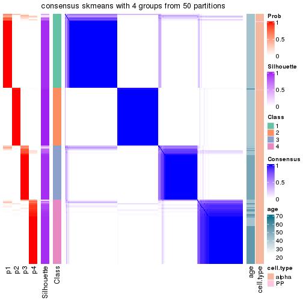</p>

</div>
</div>

Heatmaps for the membership of samples in all partitions to see how consistent they are:


<script>
$( function() {
	$( '#tabs-node-031-membership-heatmap' ).tabs();
} );
</script>
<div id='tabs-node-031-membership-heatmap'>
<ul>
<li><a href='#tab-node-031-membership-heatmap-1'>k = 2</a></li>
<li><a href='#tab-node-031-membership-heatmap-2'>k = 3</a></li>
<li><a href='#tab-node-031-membership-heatmap-3'>k = 4</a></li>
</ul>
<div id='tab-node-031-membership-heatmap-1'>
<pre><code class="r">membership_heatmap(res, k = 2)
</code></pre>

<p></p>

</div>
<div id='tab-node-031-membership-heatmap-2'>
<pre><code class="r">membership_heatmap(res, k = 3)
</code></pre>

<p></p>

</div>
<div id='tab-node-031-membership-heatmap-3'>
<pre><code class="r">membership_heatmap(res, k = 4)
</code></pre>

<p></p>

</div>
</div>

As soon as the classes for columns are determined, the signatures
that are significantly different between subgroups can be looked for. 
Following are the heatmaps for signatures.


Signature heatmaps where rows are scaled:


<script>
$( function() {
	$( '#tabs-node-031-get-signatures' ).tabs();
} );
</script>
<div id='tabs-node-031-get-signatures'>
<ul>
<li><a href='#tab-node-031-get-signatures-1'>k = 2</a></li>
<li><a href='#tab-node-031-get-signatures-2'>k = 3</a></li>
<li><a href='#tab-node-031-get-signatures-3'>k = 4</a></li>
</ul>
<div id='tab-node-031-get-signatures-1'>
<pre><code class="r">get_signatures(res, k = 2)
</code></pre>

<p></p>

</div>
<div id='tab-node-031-get-signatures-2'>
<pre><code class="r">get_signatures(res, k = 3)
</code></pre>

<p></p>

</div>
<div id='tab-node-031-get-signatures-3'>
<pre><code class="r">get_signatures(res, k = 4)
</code></pre>

<p></p>

</div>
</div>


Signature heatmaps where rows are not scaled:


<script>
$( function() {
	$( '#tabs-node-031-get-signatures-no-scale' ).tabs();
} );
</script>
<div id='tabs-node-031-get-signatures-no-scale'>
<ul>
<li><a href='#tab-node-031-get-signatures-no-scale-1'>k = 2</a></li>
<li><a href='#tab-node-031-get-signatures-no-scale-2'>k = 3</a></li>
<li><a href='#tab-node-031-get-signatures-no-scale-3'>k = 4</a></li>
</ul>
<div id='tab-node-031-get-signatures-no-scale-1'>
<pre><code class="r">get_signatures(res, k = 2, scale_rows = FALSE)
</code></pre>

<p></p>

</div>
<div id='tab-node-031-get-signatures-no-scale-2'>
<pre><code class="r">get_signatures(res, k = 3, scale_rows = FALSE)
</code></pre>

<p></p>

</div>
<div id='tab-node-031-get-signatures-no-scale-3'>
<pre><code class="r">get_signatures(res, k = 4, scale_rows = FALSE)
</code></pre>

<p></p>

</div>
</div>


Compare the overlap of signatures from different k:

```r
compare_signatures(res)
```


`get_signature()` returns a data frame invisibly. To get the list of signatures, the function
call should be assigned to a variable explicitly. In following code, if `plot` argument is set
to `FALSE`, no heatmap is plotted while only the differential analysis is performed.

```r
# code only for demonstration
tb = get_signature(res, k = ..., plot = FALSE)
```

An example of the output of `tb` is:

```
#>   which_row         fdr    mean_1    mean_2 scaled_mean_1 scaled_mean_2 km
#> 1        38 0.042760348  8.373488  9.131774    -0.5533452     0.5164555  1
#> 2        40 0.018707592  7.106213  8.469186    -0.6173731     0.5762149  1
#> 3        55 0.019134737 10.221463 11.207825    -0.6159697     0.5749050  1
#> 4        59 0.006059896  5.921854  7.869574    -0.6899429     0.6439467  1
#> 5        60 0.018055526  8.928898 10.211722    -0.6204761     0.5791110  1
#> 6        98 0.009384629 15.714769 14.887706     0.6635654    -0.6193277  2
...
```

The columns in `tb` are:

1. `which_row`: row indices corresponding to the input matrix.
2. `fdr`: FDR for the differential test. 
3. `mean_x`: The mean value in group x.
4. `scaled_mean_x`: The mean value in group x after rows are scaled.
5. `km`: Row groups if k-means clustering is applied to rows (which is done by automatically selecting number of clusters).

If there are too many signatures, `top_signatures = ...` can be set to only show the 
signatures with the highest FDRs:

```r
# code only for demonstration
# e.g. to show the top 500 most significant rows
tb = get_signature(res, k = ..., top_signatures = 500)
```

If the signatures are defined as these which are uniquely high in current group, `diff_method` argument
can be set to `"uniquely_high_in_one_group"`:

```r
# code only for demonstration
tb = get_signature(res, k = ..., diff_method = "uniquely_high_in_one_group")
```


UMAP plot which shows how samples are separated.


<script>
$( function() {
	$( '#tabs-node-031-dimension-reduction' ).tabs();
} );
</script>
<div id='tabs-node-031-dimension-reduction'>
<ul>
<li><a href='#tab-node-031-dimension-reduction-1'>k = 2</a></li>
<li><a href='#tab-node-031-dimension-reduction-2'>k = 3</a></li>
<li><a href='#tab-node-031-dimension-reduction-3'>k = 4</a></li>
</ul>
<div id='tab-node-031-dimension-reduction-1'>
<pre><code class="r">dimension_reduction(res, k = 2, method = &quot;UMAP&quot;)
</code></pre>

<p></p>

</div>
<div id='tab-node-031-dimension-reduction-2'>
<pre><code class="r">dimension_reduction(res, k = 3, method = &quot;UMAP&quot;)
</code></pre>

<p></p>

</div>
<div id='tab-node-031-dimension-reduction-3'>
<pre><code class="r">dimension_reduction(res, k = 4, method = &quot;UMAP&quot;)
</code></pre>

<p></p>

</div>
</div>


Following heatmap shows how subgroups are split when increasing `k`:

```r
collect_classes(res)
```


Test correlation between subgroups and known annotations. If the known
annotation is numeric, one-way ANOVA test is applied, and if the known
annotation is discrete, chi-squared contingency table test is applied.

```r
test_to_known_factors(res)
```

```
#>             n_sample age(p-value) cell.type(p-value) k
#> ATC:skmeans      254      3.5e-09              1.000 2
#> ATC:skmeans      255          NaN              0.748 3
#> ATC:skmeans      259          NaN              0.609 4
```


If matrix rows can be associated to genes, consider to use `functional_enrichment(res,
...)` to perform function enrichment for the signature genes. See [this vignette](https://jokergoo.github.io/cola_vignettes/functional_enrichment.html) for more detailed explanations.


 

---------------------------------------------------


### Node032


Parent node: [Node03](#Node03).
Child nodes: 
                Node0111-leaf
        ,
                Node0112-leaf
        ,
                Node0121-leaf
        ,
                Node0122-leaf
        ,
                Node0131-leaf
        ,
                Node0132-leaf
        ,
                [Node0211](#Node0211)
        ,
                [Node0212](#Node0212)
        ,
                [Node0221](#Node0221)
        ,
                [Node0222](#Node0222)
        ,
                Node0231-leaf
        ,
                Node0232-leaf
        ,
                Node0233-leaf
        ,
                Node0311-leaf
        ,
                Node0312-leaf
        ,
                Node0313-leaf
        ,
                Node0314-leaf
        ,
                [Node0321](#Node0321)
        ,
                [Node0322](#Node0322)
        ,
                Node0331-leaf
        ,
                Node0332-leaf
        ,
                Node0333-leaf
        .


The object with results only for a single top-value method and a single partitioning method 
can be extracted as:

```r
res = res_rh["032"]
```

A summary of `res` and all the functions that can be applied to it:

```r
res
```

```
#> A 'ConsensusPartition' object with k = 2, 3, 4.
#>   On a matrix with 14749 rows and 245 columns.
#>   Top rows (1215) are extracted by 'ATC' method.
#>   Subgroups are detected by 'skmeans' method.
#>   Performed in total 150 partitions by row resampling.
#>   Best k for subgroups seems to be 2.
#> 
#> Following methods can be applied to this 'ConsensusPartition' object:
#>  [1] "cola_report"             "collect_classes"         "collect_plots"          
#>  [4] "collect_stats"           "colnames"                "compare_partitions"     
#>  [7] "compare_signatures"      "consensus_heatmap"       "dimension_reduction"    
#> [10] "functional_enrichment"   "get_anno_col"            "get_anno"               
#> [13] "get_classes"             "get_consensus"           "get_matrix"             
#> [16] "get_membership"          "get_param"               "get_signatures"         
#> [19] "get_stats"               "is_best_k"               "is_stable_k"            
#> [22] "membership_heatmap"      "ncol"                    "nrow"                   
#> [25] "plot_ecdf"               "predict_classes"         "rownames"               
#> [28] "select_partition_number" "show"                    "suggest_best_k"         
#> [31] "test_to_known_factors"   "top_rows_heatmap"
```

`collect_plots()` function collects all the plots made from `res` for all `k` (number of subgroups)
into one single page to provide an easy and fast comparison between different `k`.

```r
collect_plots(res)
```


The plots are:

- The first row: a plot of the eCDF (empirical cumulative distribution
  function) curves of the consensus matrix for each `k` and the heatmap of
  predicted classes for each `k`.
- The second row: heatmaps of the consensus matrix for each `k`.
- The third row: heatmaps of the membership matrix for each `k`.
- The fouth row: heatmaps of the signatures for each `k`.

All the plots in panels can be made by individual functions and they are
plotted later in this section.

`select_partition_number()` produces several plots showing different
statistics for choosing "optimized" `k`. There are following statistics:

- eCDF curves of the consensus matrix for each `k`;
- 1-PAC. [The PAC score](https://en.wikipedia.org/wiki/Consensus_clustering#Over-interpretation_potential_of_consensus_clustering)
  measures the proportion of the ambiguous subgrouping.
- Mean silhouette score.
- Concordance. The mean probability of fiting the consensus subgroup labels in all
  partitions.
- Area increased. Denote $A_k$ as the area under the eCDF curve for current
  `k`, the area increased is defined as $A_k - A_{k-1}$.
- Rand index. The percent of pairs of samples that are both in a same cluster
  or both are not in a same cluster in the partition of k and k-1.
- Jaccard index. The ratio of pairs of samples are both in a same cluster in
  the partition of k and k-1 and the pairs of samples are both in a same
  cluster in the partition k or k-1.

The detailed explanations of these statistics can be found in [the _cola_
vignette](https://jokergoo.github.io/cola_vignettes/cola.html#toc_13).

Generally speaking, higher 1-PAC score, higher mean silhouette score or higher
concordance corresponds to better partition. Rand index and Jaccard index
measure how similar the current partition is compared to partition with `k-1`.
If they are too similar, we won't accept `k` is better than `k-1`.

```r
select_partition_number(res)
```


The numeric values for all these statistics can be obtained by `get_stats()`.

```r
get_stats(res)
```

```
#>   k 1-PAC mean_silhouette concordance area_increased  Rand Jaccard
#> 2 2 0.940           0.937       0.974          0.478 0.523   0.523
#> 3 3 0.760           0.846       0.933          0.365 0.755   0.563
#> 4 4 0.679           0.654       0.843          0.139 0.838   0.584
```

`suggest_best_k()` suggests the best $k$ based on these statistics. The rules are as follows:

- All $k$ with Jaccard index larger than 0.95 are removed because increasing
  $k$ does not provide enough extra information. If all $k$ are removed, it is
  marked as no subgroup is detected.
- For all $k$ with 1-PAC score larger than 0.9, the maximal $k$ is taken as
  the best $k$, and other $k$ are marked as optional $k$.
- If it does not fit the second rule. The $k$ with the maximal vote of the
  highest 1-PAC score, highest mean silhouette, and highest concordance is
  taken as the best $k$.

```r
suggest_best_k(res)
```

```
#> [1] 2
```


Following is the table of the partitions (You need to click the **show/hide
code output** link to see it). The membership matrix (columns with name `p*`)
is inferred by
[`clue::cl_consensus()`](https://www.rdocumentation.org/link/cl_consensus?package=clue)
function with the `SE` method. Basically the value in the membership matrix
represents the probability to belong to a certain group. The finall subgroup
label for an item is determined with the group with highest probability it
belongs to.

In `get_classes()` function, the entropy is calculated from the membership
matrix and the silhouette score is calculated from the consensus matrix.


<script>
$( function() {
	$( '#tabs-node-032-get-classes' ).tabs();
} );
</script>
<div id='tabs-node-032-get-classes'>
<ul>
<li><a href='#tab-node-032-get-classes-1'>k = 2</a></li>
<li><a href='#tab-node-032-get-classes-2'>k = 3</a></li>
<li><a href='#tab-node-032-get-classes-3'>k = 4</a></li>
</ul>

<div id='tab-node-032-get-classes-1'>
<p><a id='tab-node-032-get-classes-1-a' style='color:#0366d6' href='#'>show/hide code output</a></p>
<pre><code class="r">cbind(get_classes(res, k = 2), get_membership(res, k = 2))
</code></pre>

<pre><code>#&gt;             class entropy silhouette   p1   p2
#&gt; Sample_208      2   0.000     0.9669 0.00 1.00
#&gt; Sample_209      2   0.000     0.9669 0.00 1.00
#&gt; Sample_210      2   0.000     0.9669 0.00 1.00
#&gt; Sample_211      2   0.000     0.9669 0.00 1.00
#&gt; Sample_212      2   0.000     0.9669 0.00 1.00
#&gt; Sample_213      2   0.000     0.9669 0.00 1.00
#&gt; Sample_216      2   0.000     0.9669 0.00 1.00
#&gt; Sample_218      2   0.000     0.9669 0.00 1.00
#&gt; Sample_219      2   0.000     0.9669 0.00 1.00
#&gt; Sample_220      2   0.000     0.9669 0.00 1.00
#&gt; Sample_221      2   0.000     0.9669 0.00 1.00
#&gt; Sample_222      2   0.000     0.9669 0.00 1.00
#&gt; Sample_223      2   0.000     0.9669 0.00 1.00
#&gt; Sample_225      2   0.000     0.9669 0.00 1.00
#&gt; Sample_227      2   0.000     0.9669 0.00 1.00
#&gt; Sample_228      2   0.000     0.9669 0.00 1.00
#&gt; Sample_229      2   0.000     0.9669 0.00 1.00
#&gt; Sample_230      2   0.000     0.9669 0.00 1.00
#&gt; Sample_231      2   0.000     0.9669 0.00 1.00
#&gt; Sample_232      2   0.000     0.9669 0.00 1.00
#&gt; Sample_234      2   0.000     0.9669 0.00 1.00
#&gt; Sample_235      2   0.000     0.9669 0.00 1.00
#&gt; Sample_237      2   0.242     0.9368 0.04 0.96
#&gt; Sample_238      2   0.000     0.9669 0.00 1.00
#&gt; Sample_239      2   0.000     0.9669 0.00 1.00
#&gt; Sample_240      2   0.000     0.9669 0.00 1.00
#&gt; Sample_242      2   0.000     0.9669 0.00 1.00
#&gt; Sample_243      1   0.327     0.9206 0.94 0.06
#&gt; Sample_244      2   0.000     0.9669 0.00 1.00
#&gt; Sample_245      2   0.000     0.9669 0.00 1.00
#&gt; Sample_246      2   0.000     0.9669 0.00 1.00
#&gt; Sample_247      2   0.000     0.9669 0.00 1.00
#&gt; Sample_248      2   0.000     0.9669 0.00 1.00
#&gt; Sample_249      2   0.000     0.9669 0.00 1.00
#&gt; Sample_250      2   0.000     0.9669 0.00 1.00
#&gt; Sample_251      2   0.000     0.9669 0.00 1.00
#&gt; Sample_252      2   0.000     0.9669 0.00 1.00
#&gt; Sample_253      2   0.000     0.9669 0.00 1.00
#&gt; Sample_255      2   0.000     0.9669 0.00 1.00
#&gt; Sample_256      2   0.000     0.9669 0.00 1.00
#&gt; Sample_257      2   0.000     0.9669 0.00 1.00
#&gt; Sample_259      2   0.000     0.9669 0.00 1.00
#&gt; Sample_260      2   0.000     0.9669 0.00 1.00
#&gt; Sample_261      2   0.000     0.9669 0.00 1.00
#&gt; Sample_262      2   0.000     0.9669 0.00 1.00
#&gt; Sample_263      2   0.000     0.9669 0.00 1.00
#&gt; Sample_266      1   0.827     0.6434 0.74 0.26
#&gt; Sample_267      1   0.141     0.9585 0.98 0.02
#&gt; Sample_268      1   0.000     0.9765 1.00 0.00
#&gt; Sample_269      2   0.000     0.9669 0.00 1.00
#&gt; Sample_270      1   0.000     0.9765 1.00 0.00
#&gt; Sample_273      1   0.000     0.9765 1.00 0.00
#&gt; Sample_274      1   0.000     0.9765 1.00 0.00
#&gt; Sample_277      1   0.000     0.9765 1.00 0.00
#&gt; Sample_279      1   0.000     0.9765 1.00 0.00
#&gt; Sample_280      2   0.000     0.9669 0.00 1.00
#&gt; Sample_281      1   0.000     0.9765 1.00 0.00
#&gt; Sample_282      1   0.999     0.0516 0.52 0.48
#&gt; Sample_283      2   0.904     0.5487 0.32 0.68
#&gt; Sample_284      1   0.000     0.9765 1.00 0.00
#&gt; Sample_285      1   0.000     0.9765 1.00 0.00
#&gt; Sample_286      1   0.000     0.9765 1.00 0.00
#&gt; Sample_290      1   0.000     0.9765 1.00 0.00
#&gt; Sample_291      1   0.000     0.9765 1.00 0.00
#&gt; Sample_292      1   0.000     0.9765 1.00 0.00
#&gt; Sample_293      2   0.000     0.9669 0.00 1.00
#&gt; Sample_294      1   0.000     0.9765 1.00 0.00
#&gt; Sample_295      1   0.000     0.9765 1.00 0.00
#&gt; Sample_296      1   0.000     0.9765 1.00 0.00
#&gt; Sample_297      1   0.000     0.9765 1.00 0.00
#&gt; Sample_298      1   0.000     0.9765 1.00 0.00
#&gt; Sample_299      1   0.000     0.9765 1.00 0.00
#&gt; Sample_300      2   0.000     0.9669 0.00 1.00
#&gt; Sample_301      1   0.000     0.9765 1.00 0.00
#&gt; Sample_306      1   0.000     0.9765 1.00 0.00
#&gt; Sample_307      1   0.000     0.9765 1.00 0.00
#&gt; Sample_315      1   0.000     0.9765 1.00 0.00
#&gt; Sample_317      1   0.000     0.9765 1.00 0.00
#&gt; Sample_322      1   0.000     0.9765 1.00 0.00
#&gt; Sample_332      1   0.000     0.9765 1.00 0.00
#&gt; Sample_333      1   0.402     0.8985 0.92 0.08
#&gt; Sample_334      1   0.000     0.9765 1.00 0.00
#&gt; Sample_335      1   0.000     0.9765 1.00 0.00
#&gt; Sample_336      1   0.000     0.9765 1.00 0.00
#&gt; Sample_337      1   0.000     0.9765 1.00 0.00
#&gt; Sample_338      1   0.000     0.9765 1.00 0.00
#&gt; Sample_340      1   0.000     0.9765 1.00 0.00
#&gt; Sample_341      1   0.000     0.9765 1.00 0.00
#&gt; Sample_342      1   0.000     0.9765 1.00 0.00
#&gt; Sample_343      1   0.000     0.9765 1.00 0.00
#&gt; Sample_344      1   0.000     0.9765 1.00 0.00
#&gt; Sample_345      1   0.000     0.9765 1.00 0.00
#&gt; Sample_346      1   0.000     0.9765 1.00 0.00
#&gt; Sample_347      1   0.000     0.9765 1.00 0.00
#&gt; Sample_348      1   0.000     0.9765 1.00 0.00
#&gt; Sample_349      1   0.000     0.9765 1.00 0.00
#&gt; Sample_353      1   0.000     0.9765 1.00 0.00
#&gt; Sample_354      1   0.000     0.9765 1.00 0.00
#&gt; Sample_356      1   0.000     0.9765 1.00 0.00
#&gt; Sample_357      1   0.000     0.9765 1.00 0.00
#&gt; Sample_359      1   0.000     0.9765 1.00 0.00
#&gt; Sample_361      1   0.000     0.9765 1.00 0.00
#&gt; Sample_363      1   0.000     0.9765 1.00 0.00
#&gt; Sample_364      1   0.000     0.9765 1.00 0.00
#&gt; Sample_366      1   0.000     0.9765 1.00 0.00
#&gt; Sample_367      1   0.000     0.9765 1.00 0.00
#&gt; Sample_370      1   0.000     0.9765 1.00 0.00
#&gt; Sample_374      1   0.000     0.9765 1.00 0.00
#&gt; Sample_375      1   0.990     0.1959 0.56 0.44
#&gt; Sample_376      1   0.000     0.9765 1.00 0.00
#&gt; Sample_378      1   0.000     0.9765 1.00 0.00
#&gt; Sample_379      1   0.000     0.9765 1.00 0.00
#&gt; Sample_380      1   0.000     0.9765 1.00 0.00
#&gt; Sample_382      1   0.000     0.9765 1.00 0.00
#&gt; Sample_383      1   0.000     0.9765 1.00 0.00
#&gt; Sample_384      1   0.000     0.9765 1.00 0.00
#&gt; Sample_387      1   0.000     0.9765 1.00 0.00
#&gt; Sample_388      1   0.000     0.9765 1.00 0.00
#&gt; Sample_391      1   0.000     0.9765 1.00 0.00
#&gt; Sample_392      1   0.000     0.9765 1.00 0.00
#&gt; Sample_399      1   0.000     0.9765 1.00 0.00
#&gt; Sample_400      1   0.000     0.9765 1.00 0.00
#&gt; Sample_401      1   0.000     0.9765 1.00 0.00
#&gt; Sample_402      2   0.855     0.6382 0.28 0.72
#&gt; Sample_406      1   0.000     0.9765 1.00 0.00
#&gt; Sample_407      1   0.000     0.9765 1.00 0.00
#&gt; Sample_410      1   0.000     0.9765 1.00 0.00
#&gt; Sample_411      1   0.000     0.9765 1.00 0.00
#&gt; Sample_413      1   0.000     0.9765 1.00 0.00
#&gt; Sample_414      1   0.000     0.9765 1.00 0.00
#&gt; Sample_417      1   0.000     0.9765 1.00 0.00
#&gt; Sample_418      1   0.000     0.9765 1.00 0.00
#&gt; Sample_419      1   0.000     0.9765 1.00 0.00
#&gt; Sample_423      2   0.881     0.5914 0.30 0.70
#&gt; Sample_426      2   0.000     0.9669 0.00 1.00
#&gt; Sample_429      2   0.242     0.9382 0.04 0.96
#&gt; Sample_435      2   0.584     0.8394 0.14 0.86
#&gt; Sample_441      2   0.242     0.9382 0.04 0.96
#&gt; Sample_444      1   0.000     0.9765 1.00 0.00
#&gt; Sample_447      2   0.000     0.9669 0.00 1.00
#&gt; Sample_449      2   0.242     0.9382 0.04 0.96
#&gt; Sample_450      1   0.000     0.9765 1.00 0.00
#&gt; Sample_453      2   0.943     0.4701 0.36 0.64
#&gt; Sample_454      1   0.000     0.9765 1.00 0.00
#&gt; Sample_458      2   0.327     0.9210 0.06 0.94
#&gt; Sample_460      1   0.000     0.9765 1.00 0.00
#&gt; Sample_462      1   0.000     0.9765 1.00 0.00
#&gt; Sample_467      2   0.584     0.8395 0.14 0.86
#&gt; Sample_470      1   0.000     0.9765 1.00 0.00
#&gt; Sample_471      2   0.000     0.9669 0.00 1.00
#&gt; Sample_473      1   0.000     0.9765 1.00 0.00
#&gt; Sample_570      2   0.000     0.9669 0.00 1.00
#&gt; Sample_571      2   0.904     0.5600 0.32 0.68
#&gt; Sample_575      1   0.000     0.9765 1.00 0.00
#&gt; Sample_576      2   0.000     0.9669 0.00 1.00
#&gt; Sample_578      1   0.000     0.9765 1.00 0.00
#&gt; Sample_579      1   0.000     0.9765 1.00 0.00
#&gt; Sample_580      1   0.000     0.9765 1.00 0.00
#&gt; Sample_581      1   0.000     0.9765 1.00 0.00
#&gt; Sample_582      1   0.000     0.9765 1.00 0.00
#&gt; Sample_583      1   0.000     0.9765 1.00 0.00
#&gt; Sample_584      1   0.000     0.9765 1.00 0.00
#&gt; Sample_585      2   0.000     0.9669 0.00 1.00
#&gt; Sample_589      2   0.000     0.9669 0.00 1.00
#&gt; Sample_613      2   0.000     0.9669 0.00 1.00
#&gt; Sample_615      2   0.000     0.9669 0.00 1.00
#&gt; Sample_623      2   0.000     0.9669 0.00 1.00
#&gt; Sample_624      2   0.000     0.9669 0.00 1.00
#&gt; Sample_644      1   0.000     0.9765 1.00 0.00
#&gt; Sample_948      1   0.000     0.9765 1.00 0.00
#&gt; Sample_949      1   0.000     0.9765 1.00 0.00
#&gt; Sample_951      1   0.000     0.9765 1.00 0.00
#&gt; Sample_952      1   0.000     0.9765 1.00 0.00
#&gt; Sample_953      1   0.000     0.9765 1.00 0.00
#&gt; Sample_954      2   0.000     0.9669 0.00 1.00
#&gt; Sample_955      1   0.000     0.9765 1.00 0.00
#&gt; Sample_956      1   0.000     0.9765 1.00 0.00
#&gt; Sample_957      1   0.000     0.9765 1.00 0.00
#&gt; Sample_958      1   0.000     0.9765 1.00 0.00
#&gt; Sample_959      1   0.000     0.9765 1.00 0.00
#&gt; Sample_960      1   0.000     0.9765 1.00 0.00
#&gt; Sample_961      1   0.000     0.9765 1.00 0.00
#&gt; Sample_963      1   0.141     0.9585 0.98 0.02
#&gt; Sample_964      1   0.000     0.9765 1.00 0.00
#&gt; Sample_965      1   0.469     0.8752 0.90 0.10
#&gt; Sample_966      1   0.000     0.9765 1.00 0.00
#&gt; Sample_967      1   0.000     0.9765 1.00 0.00
#&gt; Sample_969      1   0.000     0.9765 1.00 0.00
#&gt; Sample_970      1   0.000     0.9765 1.00 0.00
#&gt; Sample_971      1   0.000     0.9765 1.00 0.00
#&gt; Sample_972      1   0.000     0.9765 1.00 0.00
#&gt; Sample_973      1   0.000     0.9765 1.00 0.00
#&gt; Sample_974      1   0.000     0.9765 1.00 0.00
#&gt; Sample_979      1   0.000     0.9765 1.00 0.00
#&gt; Sample_984      1   0.000     0.9765 1.00 0.00
#&gt; Sample_995      1   0.000     0.9765 1.00 0.00
#&gt; Sample_997      1   0.141     0.9584 0.98 0.02
#&gt; Sample_998      1   0.000     0.9765 1.00 0.00
#&gt; Sample_1000     1   0.999     0.0679 0.52 0.48
#&gt; Sample_1001     1   0.000     0.9765 1.00 0.00
#&gt; Sample_1002     1   0.000     0.9765 1.00 0.00
#&gt; Sample_1003     1   0.000     0.9765 1.00 0.00
#&gt; Sample_1005     1   0.722     0.7474 0.80 0.20
#&gt; Sample_1006     1   0.000     0.9765 1.00 0.00
#&gt; Sample_1011     1   0.000     0.9765 1.00 0.00
#&gt; Sample_1012     2   0.000     0.9669 0.00 1.00
#&gt; Sample_1013     1   0.000     0.9765 1.00 0.00
#&gt; Sample_1053     2   0.000     0.9669 0.00 1.00
#&gt; Sample_1054     1   0.943     0.4337 0.64 0.36
#&gt; Sample_1055     1   0.141     0.9585 0.98 0.02
#&gt; Sample_1057     2   0.000     0.9669 0.00 1.00
#&gt; Sample_1060     1   0.000     0.9765 1.00 0.00
#&gt; Sample_1061     2   0.000     0.9669 0.00 1.00
#&gt; Sample_1189     1   0.000     0.9765 1.00 0.00
#&gt; Sample_1190     2   0.000     0.9669 0.00 1.00
#&gt; Sample_1191     2   0.000     0.9669 0.00 1.00
#&gt; Sample_1193     2   0.000     0.9669 0.00 1.00
#&gt; Sample_1194     2   0.000     0.9669 0.00 1.00
#&gt; Sample_1195     1   0.760     0.7162 0.78 0.22
#&gt; Sample_1196     1   0.000     0.9765 1.00 0.00
#&gt; Sample_1197     2   0.904     0.5441 0.32 0.68
#&gt; Sample_1198     2   0.000     0.9669 0.00 1.00
#&gt; Sample_1199     2   0.000     0.9669 0.00 1.00
#&gt; Sample_1200     1   0.000     0.9765 1.00 0.00
#&gt; Sample_1201     1   0.584     0.8259 0.86 0.14
#&gt; Sample_1202     1   0.000     0.9765 1.00 0.00
#&gt; Sample_1203     2   0.000     0.9669 0.00 1.00
#&gt; Sample_1204     2   0.000     0.9669 0.00 1.00
#&gt; Sample_1205     2   0.760     0.7352 0.22 0.78
#&gt; Sample_1206     1   0.000     0.9765 1.00 0.00
#&gt; Sample_1207     2   0.242     0.9387 0.04 0.96
#&gt; Sample_1209     1   0.000     0.9765 1.00 0.00
#&gt; Sample_1210     2   0.000     0.9669 0.00 1.00
#&gt; Sample_1211     1   0.141     0.9585 0.98 0.02
#&gt; Sample_1212     1   0.000     0.9765 1.00 0.00
#&gt; Sample_1213     1   0.000     0.9765 1.00 0.00
#&gt; Sample_1214     2   0.242     0.9387 0.04 0.96
#&gt; Sample_1215     2   0.327     0.9219 0.06 0.94
#&gt; Sample_1219     2   0.242     0.9382 0.04 0.96
#&gt; Sample_1220     1   0.000     0.9765 1.00 0.00
#&gt; Sample_1221     2   0.795     0.7042 0.24 0.76
#&gt; Sample_1549     2   0.000     0.9669 0.00 1.00
#&gt; Sample_1553     1   0.995     0.1174 0.54 0.46
#&gt; Sample_1581     2   0.000     0.9669 0.00 1.00
#&gt; Sample_1597     2   0.000     0.9669 0.00 1.00
</code></pre>

<script>
$('#tab-node-032-get-classes-1-a').parent().next().next().hide();
$('#tab-node-032-get-classes-1-a').click(function(){
  $('#tab-node-032-get-classes-1-a').parent().next().next().toggle();
  return(false);
});
</script>
</div>

<div id='tab-node-032-get-classes-2'>
<p><a id='tab-node-032-get-classes-2-a' style='color:#0366d6' href='#'>show/hide code output</a></p>
<pre><code class="r">cbind(get_classes(res, k = 3), get_membership(res, k = 3))
</code></pre>

<pre><code>#&gt;             class entropy silhouette   p1   p2   p3
#&gt; Sample_208      2  0.0000     0.9625 0.00 1.00 0.00
#&gt; Sample_209      2  0.0000     0.9625 0.00 1.00 0.00
#&gt; Sample_210      2  0.0000     0.9625 0.00 1.00 0.00
#&gt; Sample_211      2  0.0000     0.9625 0.00 1.00 0.00
#&gt; Sample_212      2  0.0000     0.9625 0.00 1.00 0.00
#&gt; Sample_213      2  0.0000     0.9625 0.00 1.00 0.00
#&gt; Sample_216      2  0.0000     0.9625 0.00 1.00 0.00
#&gt; Sample_218      2  0.0000     0.9625 0.00 1.00 0.00
#&gt; Sample_219      2  0.0000     0.9625 0.00 1.00 0.00
#&gt; Sample_220      2  0.0000     0.9625 0.00 1.00 0.00
#&gt; Sample_221      2  0.0000     0.9625 0.00 1.00 0.00
#&gt; Sample_222      2  0.0000     0.9625 0.00 1.00 0.00
#&gt; Sample_223      2  0.0000     0.9625 0.00 1.00 0.00
#&gt; Sample_225      2  0.0000     0.9625 0.00 1.00 0.00
#&gt; Sample_227      2  0.0000     0.9625 0.00 1.00 0.00
#&gt; Sample_228      2  0.0000     0.9625 0.00 1.00 0.00
#&gt; Sample_229      2  0.0000     0.9625 0.00 1.00 0.00
#&gt; Sample_230      2  0.0000     0.9625 0.00 1.00 0.00
#&gt; Sample_231      2  0.0000     0.9625 0.00 1.00 0.00
#&gt; Sample_232      2  0.0000     0.9625 0.00 1.00 0.00
#&gt; Sample_234      2  0.0000     0.9625 0.00 1.00 0.00
#&gt; Sample_235      2  0.0000     0.9625 0.00 1.00 0.00
#&gt; Sample_237      2  0.0000     0.9625 0.00 1.00 0.00
#&gt; Sample_238      2  0.0000     0.9625 0.00 1.00 0.00
#&gt; Sample_239      2  0.0000     0.9625 0.00 1.00 0.00
#&gt; Sample_240      2  0.0000     0.9625 0.00 1.00 0.00
#&gt; Sample_242      2  0.0000     0.9625 0.00 1.00 0.00
#&gt; Sample_243      1  0.5016     0.6727 0.76 0.24 0.00
#&gt; Sample_244      2  0.0000     0.9625 0.00 1.00 0.00
#&gt; Sample_245      2  0.0000     0.9625 0.00 1.00 0.00
#&gt; Sample_246      2  0.0000     0.9625 0.00 1.00 0.00
#&gt; Sample_247      2  0.0000     0.9625 0.00 1.00 0.00
#&gt; Sample_248      2  0.0000     0.9625 0.00 1.00 0.00
#&gt; Sample_249      2  0.0000     0.9625 0.00 1.00 0.00
#&gt; Sample_250      2  0.0000     0.9625 0.00 1.00 0.00
#&gt; Sample_251      2  0.0000     0.9625 0.00 1.00 0.00
#&gt; Sample_252      2  0.0000     0.9625 0.00 1.00 0.00
#&gt; Sample_253      2  0.0000     0.9625 0.00 1.00 0.00
#&gt; Sample_255      2  0.0000     0.9625 0.00 1.00 0.00
#&gt; Sample_256      2  0.0000     0.9625 0.00 1.00 0.00
#&gt; Sample_257      2  0.0000     0.9625 0.00 1.00 0.00
#&gt; Sample_259      2  0.0000     0.9625 0.00 1.00 0.00
#&gt; Sample_260      2  0.0000     0.9625 0.00 1.00 0.00
#&gt; Sample_261      2  0.0000     0.9625 0.00 1.00 0.00
#&gt; Sample_262      2  0.0000     0.9625 0.00 1.00 0.00
#&gt; Sample_263      2  0.0000     0.9625 0.00 1.00 0.00
#&gt; Sample_266      3  0.7517     0.2332 0.42 0.04 0.54
#&gt; Sample_267      1  0.0000     0.9127 1.00 0.00 0.00
#&gt; Sample_268      1  0.0000     0.9127 1.00 0.00 0.00
#&gt; Sample_269      2  0.0000     0.9625 0.00 1.00 0.00
#&gt; Sample_270      1  0.0000     0.9127 1.00 0.00 0.00
#&gt; Sample_273      1  0.0000     0.9127 1.00 0.00 0.00
#&gt; Sample_274      1  0.0000     0.9127 1.00 0.00 0.00
#&gt; Sample_277      1  0.0000     0.9127 1.00 0.00 0.00
#&gt; Sample_279      1  0.0892     0.9018 0.98 0.00 0.02
#&gt; Sample_280      2  0.0000     0.9625 0.00 1.00 0.00
#&gt; Sample_281      1  0.0000     0.9127 1.00 0.00 0.00
#&gt; Sample_282      1  0.6229     0.5756 0.70 0.28 0.02
#&gt; Sample_283      2  0.6758     0.4160 0.36 0.62 0.02
#&gt; Sample_284      1  0.0000     0.9127 1.00 0.00 0.00
#&gt; Sample_285      1  0.0000     0.9127 1.00 0.00 0.00
#&gt; Sample_286      1  0.1529     0.8908 0.96 0.00 0.04
#&gt; Sample_290      1  0.0000     0.9127 1.00 0.00 0.00
#&gt; Sample_291      1  0.0000     0.9127 1.00 0.00 0.00
#&gt; Sample_292      1  0.0000     0.9127 1.00 0.00 0.00
#&gt; Sample_293      2  0.0000     0.9625 0.00 1.00 0.00
#&gt; Sample_294      1  0.0000     0.9127 1.00 0.00 0.00
#&gt; Sample_295      1  0.0000     0.9127 1.00 0.00 0.00
#&gt; Sample_296      1  0.0000     0.9127 1.00 0.00 0.00
#&gt; Sample_297      1  0.0000     0.9127 1.00 0.00 0.00
#&gt; Sample_298      1  0.0000     0.9127 1.00 0.00 0.00
#&gt; Sample_299      1  0.0000     0.9127 1.00 0.00 0.00
#&gt; Sample_300      2  0.0000     0.9625 0.00 1.00 0.00
#&gt; Sample_301      1  0.0000     0.9127 1.00 0.00 0.00
#&gt; Sample_306      1  0.3340     0.8359 0.88 0.00 0.12
#&gt; Sample_307      1  0.4291     0.7755 0.82 0.00 0.18
#&gt; Sample_315      3  0.0000     0.9084 0.00 0.00 1.00
#&gt; Sample_317      1  0.2959     0.8524 0.90 0.00 0.10
#&gt; Sample_322      1  0.0000     0.9127 1.00 0.00 0.00
#&gt; Sample_332      1  0.0000     0.9127 1.00 0.00 0.00
#&gt; Sample_333      1  0.3340     0.8184 0.88 0.12 0.00
#&gt; Sample_334      1  0.0000     0.9127 1.00 0.00 0.00
#&gt; Sample_335      1  0.0000     0.9127 1.00 0.00 0.00
#&gt; Sample_336      1  0.0000     0.9127 1.00 0.00 0.00
#&gt; Sample_337      1  0.0000     0.9127 1.00 0.00 0.00
#&gt; Sample_338      1  0.0000     0.9127 1.00 0.00 0.00
#&gt; Sample_340      1  0.3340     0.8387 0.88 0.00 0.12
#&gt; Sample_341      1  0.2537     0.8691 0.92 0.00 0.08
#&gt; Sample_342      1  0.3686     0.8163 0.86 0.00 0.14
#&gt; Sample_343      1  0.0000     0.9127 1.00 0.00 0.00
#&gt; Sample_344      1  0.0000     0.9127 1.00 0.00 0.00
#&gt; Sample_345      1  0.5706     0.5554 0.68 0.00 0.32
#&gt; Sample_346      1  0.0000     0.9127 1.00 0.00 0.00
#&gt; Sample_347      1  0.0000     0.9127 1.00 0.00 0.00
#&gt; Sample_348      3  0.0000     0.9084 0.00 0.00 1.00
#&gt; Sample_349      3  0.5560     0.5602 0.30 0.00 0.70
#&gt; Sample_353      3  0.5706     0.5260 0.32 0.00 0.68
#&gt; Sample_354      1  0.0000     0.9127 1.00 0.00 0.00
#&gt; Sample_356      1  0.0000     0.9127 1.00 0.00 0.00
#&gt; Sample_357      1  0.0000     0.9127 1.00 0.00 0.00
#&gt; Sample_359      1  0.0000     0.9127 1.00 0.00 0.00
#&gt; Sample_361      1  0.0000     0.9127 1.00 0.00 0.00
#&gt; Sample_363      1  0.0000     0.9127 1.00 0.00 0.00
#&gt; Sample_364      1  0.0000     0.9127 1.00 0.00 0.00
#&gt; Sample_366      1  0.0000     0.9127 1.00 0.00 0.00
#&gt; Sample_367      1  0.0000     0.9127 1.00 0.00 0.00
#&gt; Sample_370      1  0.0892     0.9027 0.98 0.00 0.02
#&gt; Sample_374      1  0.0000     0.9127 1.00 0.00 0.00
#&gt; Sample_375      3  0.0000     0.9084 0.00 0.00 1.00
#&gt; Sample_376      1  0.5216     0.6700 0.74 0.00 0.26
#&gt; Sample_378      3  0.0000     0.9084 0.00 0.00 1.00
#&gt; Sample_379      3  0.4291     0.7549 0.18 0.00 0.82
#&gt; Sample_380      1  0.4002     0.7981 0.84 0.00 0.16
#&gt; Sample_382      3  0.0000     0.9084 0.00 0.00 1.00
#&gt; Sample_383      1  0.2537     0.8685 0.92 0.00 0.08
#&gt; Sample_384      1  0.4796     0.7307 0.78 0.00 0.22
#&gt; Sample_387      3  0.2959     0.8432 0.10 0.00 0.90
#&gt; Sample_388      1  0.0000     0.9127 1.00 0.00 0.00
#&gt; Sample_391      1  0.5835     0.5179 0.66 0.00 0.34
#&gt; Sample_392      3  0.6126     0.3159 0.40 0.00 0.60
#&gt; Sample_399      3  0.6244     0.1943 0.44 0.00 0.56
#&gt; Sample_400      3  0.4002     0.7796 0.16 0.00 0.84
#&gt; Sample_401      1  0.6302     0.1116 0.52 0.00 0.48
#&gt; Sample_402      3  0.0000     0.9084 0.00 0.00 1.00
#&gt; Sample_406      1  0.4002     0.7983 0.84 0.00 0.16
#&gt; Sample_407      3  0.0000     0.9084 0.00 0.00 1.00
#&gt; Sample_410      1  0.6126     0.3755 0.60 0.00 0.40
#&gt; Sample_411      3  0.0892     0.8993 0.02 0.00 0.98
#&gt; Sample_413      1  0.4002     0.7997 0.84 0.00 0.16
#&gt; Sample_414      1  0.4002     0.7974 0.84 0.00 0.16
#&gt; Sample_417      3  0.0000     0.9084 0.00 0.00 1.00
#&gt; Sample_418      3  0.0000     0.9084 0.00 0.00 1.00
#&gt; Sample_419      1  0.4796     0.7246 0.78 0.00 0.22
#&gt; Sample_423      3  0.2947     0.8605 0.02 0.06 0.92
#&gt; Sample_426      3  0.6192     0.2618 0.00 0.42 0.58
#&gt; Sample_429      3  0.0000     0.9084 0.00 0.00 1.00
#&gt; Sample_435      3  0.0000     0.9084 0.00 0.00 1.00
#&gt; Sample_441      3  0.0000     0.9084 0.00 0.00 1.00
#&gt; Sample_444      3  0.0000     0.9084 0.00 0.00 1.00
#&gt; Sample_447      3  0.0000     0.9084 0.00 0.00 1.00
#&gt; Sample_449      3  0.0000     0.9084 0.00 0.00 1.00
#&gt; Sample_450      3  0.0000     0.9084 0.00 0.00 1.00
#&gt; Sample_453      3  0.0000     0.9084 0.00 0.00 1.00
#&gt; Sample_454      3  0.0000     0.9084 0.00 0.00 1.00
#&gt; Sample_458      3  0.0000     0.9084 0.00 0.00 1.00
#&gt; Sample_460      3  0.0000     0.9084 0.00 0.00 1.00
#&gt; Sample_462      3  0.0000     0.9084 0.00 0.00 1.00
#&gt; Sample_467      3  0.0000     0.9084 0.00 0.00 1.00
#&gt; Sample_470      3  0.0000     0.9084 0.00 0.00 1.00
#&gt; Sample_471      3  0.0000     0.9084 0.00 0.00 1.00
#&gt; Sample_473      3  0.0000     0.9084 0.00 0.00 1.00
#&gt; Sample_570      2  0.6302     0.0724 0.00 0.52 0.48
#&gt; Sample_571      3  0.0000     0.9084 0.00 0.00 1.00
#&gt; Sample_575      1  0.0000     0.9127 1.00 0.00 0.00
#&gt; Sample_576      3  0.0000     0.9084 0.00 0.00 1.00
#&gt; Sample_578      1  0.0000     0.9127 1.00 0.00 0.00
#&gt; Sample_579      1  0.0000     0.9127 1.00 0.00 0.00
#&gt; Sample_580      1  0.0000     0.9127 1.00 0.00 0.00
#&gt; Sample_581      1  0.0000     0.9127 1.00 0.00 0.00
#&gt; Sample_582      1  0.0000     0.9127 1.00 0.00 0.00
#&gt; Sample_583      1  0.0000     0.9127 1.00 0.00 0.00
#&gt; Sample_584      1  0.0000     0.9127 1.00 0.00 0.00
#&gt; Sample_585      2  0.0000     0.9625 0.00 1.00 0.00
#&gt; Sample_589      2  0.0000     0.9625 0.00 1.00 0.00
#&gt; Sample_613      2  0.0000     0.9625 0.00 1.00 0.00
#&gt; Sample_615      2  0.0000     0.9625 0.00 1.00 0.00
#&gt; Sample_623      2  0.2066     0.9052 0.00 0.94 0.06
#&gt; Sample_624      2  0.3686     0.8070 0.14 0.86 0.00
#&gt; Sample_644      1  0.0000     0.9127 1.00 0.00 0.00
#&gt; Sample_948      1  0.0000     0.9127 1.00 0.00 0.00
#&gt; Sample_949      1  0.6192     0.2925 0.58 0.00 0.42
#&gt; Sample_951      1  0.2959     0.8520 0.90 0.00 0.10
#&gt; Sample_952      3  0.5216     0.6497 0.26 0.00 0.74
#&gt; Sample_953      3  0.1529     0.8866 0.04 0.00 0.96
#&gt; Sample_954      2  0.6302     0.0807 0.00 0.52 0.48
#&gt; Sample_955      1  0.0000     0.9127 1.00 0.00 0.00
#&gt; Sample_956      3  0.0000     0.9084 0.00 0.00 1.00
#&gt; Sample_957      1  0.6045     0.3890 0.62 0.00 0.38
#&gt; Sample_958      1  0.5016     0.6926 0.76 0.00 0.24
#&gt; Sample_959      1  0.0892     0.9027 0.98 0.00 0.02
#&gt; Sample_960      1  0.6045     0.4194 0.62 0.00 0.38
#&gt; Sample_961      1  0.0000     0.9127 1.00 0.00 0.00
#&gt; Sample_963      3  0.2537     0.8613 0.08 0.00 0.92
#&gt; Sample_964      1  0.2959     0.8536 0.90 0.00 0.10
#&gt; Sample_965      3  0.1529     0.8887 0.04 0.00 0.96
#&gt; Sample_966      1  0.6045     0.4289 0.62 0.00 0.38
#&gt; Sample_967      1  0.0000     0.9127 1.00 0.00 0.00
#&gt; Sample_969      1  0.0000     0.9127 1.00 0.00 0.00
#&gt; Sample_970      1  0.0000     0.9127 1.00 0.00 0.00
#&gt; Sample_971      1  0.0000     0.9127 1.00 0.00 0.00
#&gt; Sample_972      1  0.0000     0.9127 1.00 0.00 0.00
#&gt; Sample_973      1  0.5560     0.5797 0.70 0.00 0.30
#&gt; Sample_974      1  0.2066     0.8790 0.94 0.00 0.06
#&gt; Sample_979      3  0.3340     0.8248 0.12 0.00 0.88
#&gt; Sample_984      3  0.5016     0.6722 0.24 0.00 0.76
#&gt; Sample_995      1  0.0000     0.9127 1.00 0.00 0.00
#&gt; Sample_997      1  0.3832     0.8446 0.88 0.02 0.10
#&gt; Sample_998      1  0.0000     0.9127 1.00 0.00 0.00
#&gt; Sample_1000     1  0.7517     0.2167 0.54 0.42 0.04
#&gt; Sample_1001     1  0.0000     0.9127 1.00 0.00 0.00
#&gt; Sample_1002     1  0.1529     0.8921 0.96 0.00 0.04
#&gt; Sample_1003     1  0.0000     0.9127 1.00 0.00 0.00
#&gt; Sample_1005     1  0.4291     0.7585 0.82 0.18 0.00
#&gt; Sample_1006     1  0.0000     0.9127 1.00 0.00 0.00
#&gt; Sample_1011     1  0.0000     0.9127 1.00 0.00 0.00
#&gt; Sample_1012     2  0.0000     0.9625 0.00 1.00 0.00
#&gt; Sample_1013     1  0.6045     0.4262 0.62 0.00 0.38
#&gt; Sample_1053     3  0.5706     0.5100 0.00 0.32 0.68
#&gt; Sample_1054     2  0.6244     0.1941 0.44 0.56 0.00
#&gt; Sample_1055     1  0.2537     0.8674 0.92 0.00 0.08
#&gt; Sample_1057     2  0.0000     0.9625 0.00 1.00 0.00
#&gt; Sample_1060     3  0.6302     0.0385 0.48 0.00 0.52
#&gt; Sample_1061     2  0.0000     0.9625 0.00 1.00 0.00
#&gt; Sample_1189     1  0.0000     0.9127 1.00 0.00 0.00
#&gt; Sample_1190     2  0.0000     0.9625 0.00 1.00 0.00
#&gt; Sample_1191     2  0.0000     0.9625 0.00 1.00 0.00
#&gt; Sample_1193     2  0.0892     0.9431 0.02 0.98 0.00
#&gt; Sample_1194     2  0.0000     0.9625 0.00 1.00 0.00
#&gt; Sample_1195     1  0.4291     0.7587 0.82 0.18 0.00
#&gt; Sample_1196     1  0.0000     0.9127 1.00 0.00 0.00
#&gt; Sample_1197     2  0.5706     0.5278 0.32 0.68 0.00
#&gt; Sample_1198     2  0.0000     0.9625 0.00 1.00 0.00
#&gt; Sample_1199     3  0.0000     0.9084 0.00 0.00 1.00
#&gt; Sample_1200     3  0.0000     0.9084 0.00 0.00 1.00
#&gt; Sample_1201     3  0.0000     0.9084 0.00 0.00 1.00
#&gt; Sample_1202     1  0.6126     0.3772 0.60 0.00 0.40
#&gt; Sample_1203     3  0.0000     0.9084 0.00 0.00 1.00
#&gt; Sample_1204     3  0.0000     0.9084 0.00 0.00 1.00
#&gt; Sample_1205     3  0.0000     0.9084 0.00 0.00 1.00
#&gt; Sample_1206     3  0.2537     0.8608 0.08 0.00 0.92
#&gt; Sample_1207     3  0.0000     0.9084 0.00 0.00 1.00
#&gt; Sample_1209     1  0.0000     0.9127 1.00 0.00 0.00
#&gt; Sample_1210     3  0.4291     0.7267 0.00 0.18 0.82
#&gt; Sample_1211     3  0.0000     0.9084 0.00 0.00 1.00
#&gt; Sample_1212     3  0.2959     0.8433 0.10 0.00 0.90
#&gt; Sample_1213     1  0.0000     0.9127 1.00 0.00 0.00
#&gt; Sample_1214     3  0.0000     0.9084 0.00 0.00 1.00
#&gt; Sample_1215     3  0.0000     0.9084 0.00 0.00 1.00
#&gt; Sample_1219     3  0.0000     0.9084 0.00 0.00 1.00
#&gt; Sample_1220     3  0.5216     0.6396 0.26 0.00 0.74
#&gt; Sample_1221     3  0.0000     0.9084 0.00 0.00 1.00
#&gt; Sample_1549     2  0.0892     0.9440 0.00 0.98 0.02
#&gt; Sample_1553     3  0.1529     0.8886 0.04 0.00 0.96
#&gt; Sample_1581     2  0.0000     0.9625 0.00 1.00 0.00
#&gt; Sample_1597     3  0.4291     0.7269 0.00 0.18 0.82
</code></pre>

<script>
$('#tab-node-032-get-classes-2-a').parent().next().next().hide();
$('#tab-node-032-get-classes-2-a').click(function(){
  $('#tab-node-032-get-classes-2-a').parent().next().next().toggle();
  return(false);
});
</script>
</div>

<div id='tab-node-032-get-classes-3'>
<p><a id='tab-node-032-get-classes-3-a' style='color:#0366d6' href='#'>show/hide code output</a></p>
<pre><code class="r">cbind(get_classes(res, k = 4), get_membership(res, k = 4))
</code></pre>

<pre><code>#&gt;             class entropy silhouette   p1   p2   p3   p4
#&gt; Sample_208      2  0.0000    0.97599 0.00 1.00 0.00 0.00
#&gt; Sample_209      2  0.0000    0.97599 0.00 1.00 0.00 0.00
#&gt; Sample_210      2  0.0000    0.97599 0.00 1.00 0.00 0.00
#&gt; Sample_211      2  0.0000    0.97599 0.00 1.00 0.00 0.00
#&gt; Sample_212      2  0.0000    0.97599 0.00 1.00 0.00 0.00
#&gt; Sample_213      2  0.0000    0.97599 0.00 1.00 0.00 0.00
#&gt; Sample_216      2  0.0000    0.97599 0.00 1.00 0.00 0.00
#&gt; Sample_218      2  0.0000    0.97599 0.00 1.00 0.00 0.00
#&gt; Sample_219      2  0.0000    0.97599 0.00 1.00 0.00 0.00
#&gt; Sample_220      2  0.0000    0.97599 0.00 1.00 0.00 0.00
#&gt; Sample_221      2  0.0000    0.97599 0.00 1.00 0.00 0.00
#&gt; Sample_222      2  0.0000    0.97599 0.00 1.00 0.00 0.00
#&gt; Sample_223      2  0.0707    0.95906 0.00 0.98 0.00 0.02
#&gt; Sample_225      2  0.0000    0.97599 0.00 1.00 0.00 0.00
#&gt; Sample_227      2  0.0000    0.97599 0.00 1.00 0.00 0.00
#&gt; Sample_228      2  0.0707    0.95811 0.00 0.98 0.00 0.02
#&gt; Sample_229      2  0.0000    0.97599 0.00 1.00 0.00 0.00
#&gt; Sample_230      2  0.0000    0.97599 0.00 1.00 0.00 0.00
#&gt; Sample_231      2  0.0000    0.97599 0.00 1.00 0.00 0.00
#&gt; Sample_232      2  0.0000    0.97599 0.00 1.00 0.00 0.00
#&gt; Sample_234      2  0.0000    0.97599 0.00 1.00 0.00 0.00
#&gt; Sample_235      2  0.0000    0.97599 0.00 1.00 0.00 0.00
#&gt; Sample_237      2  0.2706    0.87071 0.08 0.90 0.00 0.02
#&gt; Sample_238      2  0.0000    0.97599 0.00 1.00 0.00 0.00
#&gt; Sample_239      2  0.0000    0.97599 0.00 1.00 0.00 0.00
#&gt; Sample_240      2  0.0000    0.97599 0.00 1.00 0.00 0.00
#&gt; Sample_242      2  0.0000    0.97599 0.00 1.00 0.00 0.00
#&gt; Sample_243      4  0.6686    0.43943 0.20 0.18 0.00 0.62
#&gt; Sample_244      2  0.0000    0.97599 0.00 1.00 0.00 0.00
#&gt; Sample_245      2  0.0000    0.97599 0.00 1.00 0.00 0.00
#&gt; Sample_246      2  0.0000    0.97599 0.00 1.00 0.00 0.00
#&gt; Sample_247      2  0.0000    0.97599 0.00 1.00 0.00 0.00
#&gt; Sample_248      2  0.0000    0.97599 0.00 1.00 0.00 0.00
#&gt; Sample_249      2  0.1211    0.93592 0.04 0.96 0.00 0.00
#&gt; Sample_250      2  0.0000    0.97599 0.00 1.00 0.00 0.00
#&gt; Sample_251      2  0.0000    0.97599 0.00 1.00 0.00 0.00
#&gt; Sample_252      2  0.0000    0.97599 0.00 1.00 0.00 0.00
#&gt; Sample_253      2  0.0000    0.97599 0.00 1.00 0.00 0.00
#&gt; Sample_255      2  0.0000    0.97599 0.00 1.00 0.00 0.00
#&gt; Sample_256      2  0.0000    0.97599 0.00 1.00 0.00 0.00
#&gt; Sample_257      2  0.0000    0.97599 0.00 1.00 0.00 0.00
#&gt; Sample_259      2  0.0000    0.97599 0.00 1.00 0.00 0.00
#&gt; Sample_260      2  0.0000    0.97599 0.00 1.00 0.00 0.00
#&gt; Sample_261      2  0.0000    0.97599 0.00 1.00 0.00 0.00
#&gt; Sample_262      2  0.0000    0.97599 0.00 1.00 0.00 0.00
#&gt; Sample_263      2  0.0000    0.97599 0.00 1.00 0.00 0.00
#&gt; Sample_266      4  0.3975    0.54016 0.00 0.00 0.24 0.76
#&gt; Sample_267      4  0.2921    0.62484 0.14 0.00 0.00 0.86
#&gt; Sample_268      1  0.0707    0.65031 0.98 0.00 0.00 0.02
#&gt; Sample_269      2  0.0000    0.97599 0.00 1.00 0.00 0.00
#&gt; Sample_270      1  0.3172    0.63914 0.84 0.00 0.00 0.16
#&gt; Sample_273      1  0.1211    0.65392 0.96 0.00 0.00 0.04
#&gt; Sample_274      1  0.2011    0.65588 0.92 0.00 0.00 0.08
#&gt; Sample_277      4  0.1211    0.70635 0.04 0.00 0.00 0.96
#&gt; Sample_279      4  0.0707    0.71705 0.02 0.00 0.00 0.98
#&gt; Sample_280      2  0.0000    0.97599 0.00 1.00 0.00 0.00
#&gt; Sample_281      4  0.0707    0.71705 0.02 0.00 0.00 0.98
#&gt; Sample_282      4  0.0707    0.71705 0.02 0.00 0.00 0.98
#&gt; Sample_283      4  0.1411    0.70631 0.02 0.02 0.00 0.96
#&gt; Sample_284      4  0.0707    0.71705 0.02 0.00 0.00 0.98
#&gt; Sample_285      4  0.0707    0.71705 0.02 0.00 0.00 0.98
#&gt; Sample_286      4  0.0707    0.71705 0.02 0.00 0.00 0.98
#&gt; Sample_290      4  0.1411    0.70728 0.02 0.00 0.02 0.96
#&gt; Sample_291      4  0.0707    0.71705 0.02 0.00 0.00 0.98
#&gt; Sample_292      4  0.0707    0.71705 0.02 0.00 0.00 0.98
#&gt; Sample_293      2  0.0000    0.97599 0.00 1.00 0.00 0.00
#&gt; Sample_294      4  0.0707    0.71705 0.02 0.00 0.00 0.98
#&gt; Sample_295      4  0.0707    0.71705 0.02 0.00 0.00 0.98
#&gt; Sample_296      4  0.0707    0.71705 0.02 0.00 0.00 0.98
#&gt; Sample_297      4  0.0707    0.71705 0.02 0.00 0.00 0.98
#&gt; Sample_298      4  0.0707    0.71705 0.02 0.00 0.00 0.98
#&gt; Sample_299      4  0.1211    0.70603 0.04 0.00 0.00 0.96
#&gt; Sample_300      2  0.5619    0.48528 0.00 0.64 0.04 0.32
#&gt; Sample_301      4  0.0707    0.71705 0.02 0.00 0.00 0.98
#&gt; Sample_306      1  0.5271    0.26338 0.64 0.00 0.02 0.34
#&gt; Sample_307      1  0.1211    0.63857 0.96 0.00 0.00 0.04
#&gt; Sample_315      3  0.5106    0.63410 0.04 0.00 0.72 0.24
#&gt; Sample_317      1  0.2647    0.64779 0.88 0.00 0.00 0.12
#&gt; Sample_322      1  0.3400    0.63105 0.82 0.00 0.00 0.18
#&gt; Sample_332      1  0.4994    0.17303 0.52 0.00 0.00 0.48
#&gt; Sample_333      4  0.4907    0.09178 0.42 0.00 0.00 0.58
#&gt; Sample_334      1  0.4855    0.36360 0.60 0.00 0.00 0.40
#&gt; Sample_335      1  0.3975    0.59564 0.76 0.00 0.00 0.24
#&gt; Sample_336      1  0.4134    0.57593 0.74 0.00 0.00 0.26
#&gt; Sample_337      1  0.4790    0.40218 0.62 0.00 0.00 0.38
#&gt; Sample_338      1  0.2921    0.64701 0.86 0.00 0.00 0.14
#&gt; Sample_340      1  0.2011    0.61636 0.92 0.00 0.00 0.08
#&gt; Sample_341      4  0.5594    0.05866 0.46 0.00 0.02 0.52
#&gt; Sample_342      4  0.1411    0.70794 0.02 0.00 0.02 0.96
#&gt; Sample_343      4  0.4994   -0.12756 0.48 0.00 0.00 0.52
#&gt; Sample_344      1  0.4948    0.30065 0.56 0.00 0.00 0.44
#&gt; Sample_345      4  0.6649    0.28507 0.34 0.00 0.10 0.56
#&gt; Sample_346      1  0.4907    0.34122 0.58 0.00 0.00 0.42
#&gt; Sample_347      4  0.4790    0.19227 0.38 0.00 0.00 0.62
#&gt; Sample_348      3  0.2830    0.81956 0.04 0.00 0.90 0.06
#&gt; Sample_349      1  0.7497    0.14002 0.50 0.00 0.26 0.24
#&gt; Sample_353      1  0.7653    0.18028 0.46 0.00 0.30 0.24
#&gt; Sample_354      1  0.3610    0.62046 0.80 0.00 0.00 0.20
#&gt; Sample_356      1  0.3975    0.59370 0.76 0.00 0.00 0.24
#&gt; Sample_357      1  0.4134    0.57627 0.74 0.00 0.00 0.26
#&gt; Sample_359      1  0.2345    0.65424 0.90 0.00 0.00 0.10
#&gt; Sample_361      1  0.3400    0.63067 0.82 0.00 0.00 0.18
#&gt; Sample_363      1  0.3975    0.59370 0.76 0.00 0.00 0.24
#&gt; Sample_364      1  0.3975    0.59370 0.76 0.00 0.00 0.24
#&gt; Sample_366      1  0.3975    0.59370 0.76 0.00 0.00 0.24
#&gt; Sample_367      1  0.3975    0.59370 0.76 0.00 0.00 0.24
#&gt; Sample_370      1  0.1211    0.65392 0.96 0.00 0.00 0.04
#&gt; Sample_374      1  0.3975    0.59370 0.76 0.00 0.00 0.24
#&gt; Sample_375      3  0.1211    0.83693 0.00 0.00 0.96 0.04
#&gt; Sample_376      1  0.5327    0.42775 0.72 0.00 0.06 0.22
#&gt; Sample_378      3  0.0707    0.85812 0.02 0.00 0.98 0.00
#&gt; Sample_379      3  0.7816    0.10830 0.34 0.00 0.40 0.26
#&gt; Sample_380      1  0.5915    0.11115 0.56 0.00 0.04 0.40
#&gt; Sample_382      3  0.1411    0.85177 0.02 0.00 0.96 0.02
#&gt; Sample_383      1  0.0000    0.64565 1.00 0.00 0.00 0.00
#&gt; Sample_384      1  0.3247    0.60079 0.88 0.00 0.06 0.06
#&gt; Sample_387      1  0.4713    0.35087 0.64 0.00 0.36 0.00
#&gt; Sample_388      1  0.2921    0.65143 0.86 0.00 0.00 0.14
#&gt; Sample_391      1  0.1211    0.64400 0.96 0.00 0.04 0.00
#&gt; Sample_392      1  0.2647    0.59511 0.88 0.00 0.12 0.00
#&gt; Sample_399      1  0.4332    0.63383 0.80 0.00 0.04 0.16
#&gt; Sample_400      1  0.5355    0.27587 0.62 0.00 0.36 0.02
#&gt; Sample_401      1  0.0000    0.64565 1.00 0.00 0.00 0.00
#&gt; Sample_402      3  0.1637    0.84204 0.06 0.00 0.94 0.00
#&gt; Sample_406      1  0.2921    0.56710 0.86 0.00 0.00 0.14
#&gt; Sample_407      3  0.3172    0.77104 0.16 0.00 0.84 0.00
#&gt; Sample_410      1  0.6720    0.20920 0.58 0.00 0.12 0.30
#&gt; Sample_411      3  0.5383    0.66914 0.10 0.00 0.74 0.16
#&gt; Sample_413      4  0.6011    0.07061 0.48 0.00 0.04 0.48
#&gt; Sample_414      1  0.5606   -0.07377 0.50 0.00 0.02 0.48
#&gt; Sample_417      3  0.3198    0.80775 0.04 0.00 0.88 0.08
#&gt; Sample_418      3  0.3198    0.80755 0.04 0.00 0.88 0.08
#&gt; Sample_419      1  0.6554    0.04753 0.52 0.00 0.08 0.40
#&gt; Sample_423      4  0.6262    0.02987 0.06 0.00 0.40 0.54
#&gt; Sample_426      3  0.5355    0.43612 0.02 0.36 0.62 0.00
#&gt; Sample_429      3  0.0707    0.85812 0.02 0.00 0.98 0.00
#&gt; Sample_435      3  0.0707    0.85812 0.02 0.00 0.98 0.00
#&gt; Sample_441      3  0.0707    0.85812 0.02 0.00 0.98 0.00
#&gt; Sample_444      3  0.1637    0.84204 0.06 0.00 0.94 0.00
#&gt; Sample_447      3  0.0000    0.85408 0.00 0.00 1.00 0.00
#&gt; Sample_449      3  0.0707    0.85812 0.02 0.00 0.98 0.00
#&gt; Sample_450      3  0.1211    0.85091 0.04 0.00 0.96 0.00
#&gt; Sample_453      3  0.0707    0.85812 0.02 0.00 0.98 0.00
#&gt; Sample_454      3  0.0707    0.85812 0.02 0.00 0.98 0.00
#&gt; Sample_458      3  0.0707    0.85812 0.02 0.00 0.98 0.00
#&gt; Sample_460      3  0.0707    0.85812 0.02 0.00 0.98 0.00
#&gt; Sample_462      3  0.0707    0.85812 0.02 0.00 0.98 0.00
#&gt; Sample_467      3  0.0707    0.85812 0.02 0.00 0.98 0.00
#&gt; Sample_470      3  0.0707    0.85812 0.02 0.00 0.98 0.00
#&gt; Sample_471      3  0.0707    0.85812 0.02 0.00 0.98 0.00
#&gt; Sample_473      3  0.0707    0.85812 0.02 0.00 0.98 0.00
#&gt; Sample_570      3  0.4713    0.43528 0.00 0.36 0.64 0.00
#&gt; Sample_571      3  0.0707    0.85812 0.02 0.00 0.98 0.00
#&gt; Sample_575      1  0.0707    0.65031 0.98 0.00 0.00 0.02
#&gt; Sample_576      3  0.0000    0.85408 0.00 0.00 1.00 0.00
#&gt; Sample_578      1  0.4713    0.44009 0.64 0.00 0.00 0.36
#&gt; Sample_579      1  0.4134    0.57591 0.74 0.00 0.00 0.26
#&gt; Sample_580      4  0.3801    0.52388 0.22 0.00 0.00 0.78
#&gt; Sample_581      1  0.3975    0.59370 0.76 0.00 0.00 0.24
#&gt; Sample_582      4  0.4855    0.14895 0.40 0.00 0.00 0.60
#&gt; Sample_583      1  0.4406    0.53861 0.70 0.00 0.00 0.30
#&gt; Sample_584      1  0.4134    0.57597 0.74 0.00 0.00 0.26
#&gt; Sample_585      2  0.0000    0.97599 0.00 1.00 0.00 0.00
#&gt; Sample_589      2  0.0000    0.97599 0.00 1.00 0.00 0.00
#&gt; Sample_613      2  0.0000    0.97599 0.00 1.00 0.00 0.00
#&gt; Sample_615      2  0.0000    0.97599 0.00 1.00 0.00 0.00
#&gt; Sample_623      2  0.4797    0.61579 0.00 0.72 0.26 0.02
#&gt; Sample_624      2  0.7810    0.10066 0.32 0.50 0.02 0.16
#&gt; Sample_644      1  0.0000    0.64565 1.00 0.00 0.00 0.00
#&gt; Sample_948      1  0.2921    0.64671 0.86 0.00 0.00 0.14
#&gt; Sample_949      1  0.3525    0.64320 0.86 0.00 0.04 0.10
#&gt; Sample_951      4  0.5619    0.38473 0.32 0.00 0.04 0.64
#&gt; Sample_952      1  0.5392    0.39268 0.68 0.00 0.28 0.04
#&gt; Sample_953      3  0.4713    0.43623 0.00 0.00 0.64 0.36
#&gt; Sample_954      3  0.6510    0.30661 0.00 0.38 0.54 0.08
#&gt; Sample_955      1  0.4713    0.44126 0.64 0.00 0.00 0.36
#&gt; Sample_956      3  0.3935    0.76113 0.10 0.00 0.84 0.06
#&gt; Sample_957      1  0.7310    0.21602 0.48 0.00 0.16 0.36
#&gt; Sample_958      1  0.0707    0.63803 0.98 0.00 0.00 0.02
#&gt; Sample_959      1  0.4134    0.43930 0.74 0.00 0.00 0.26
#&gt; Sample_960      1  0.3400    0.63118 0.82 0.00 0.00 0.18
#&gt; Sample_961      4  0.4134    0.47987 0.26 0.00 0.00 0.74
#&gt; Sample_963      3  0.4977    0.22740 0.46 0.00 0.54 0.00
#&gt; Sample_964      1  0.1913    0.65312 0.94 0.00 0.02 0.04
#&gt; Sample_965      1  0.5957    0.25381 0.54 0.00 0.42 0.04
#&gt; Sample_966      1  0.1913    0.63429 0.94 0.00 0.04 0.02
#&gt; Sample_967      1  0.1211    0.65392 0.96 0.00 0.00 0.04
#&gt; Sample_969      1  0.2011    0.65739 0.92 0.00 0.00 0.08
#&gt; Sample_970      1  0.0707    0.65031 0.98 0.00 0.00 0.02
#&gt; Sample_971      1  0.4624    0.47228 0.66 0.00 0.00 0.34
#&gt; Sample_972      1  0.4790    0.40413 0.62 0.00 0.00 0.38
#&gt; Sample_973      1  0.4292    0.63225 0.82 0.00 0.10 0.08
#&gt; Sample_974      1  0.2921    0.64732 0.86 0.00 0.00 0.14
#&gt; Sample_979      3  0.7602   -0.15392 0.38 0.00 0.42 0.20
#&gt; Sample_984      1  0.6797    0.42980 0.60 0.00 0.24 0.16
#&gt; Sample_995      4  0.3172    0.58618 0.16 0.00 0.00 0.84
#&gt; Sample_997      1  0.6005   -0.04713 0.50 0.00 0.04 0.46
#&gt; Sample_998      1  0.4977    0.00501 0.54 0.00 0.00 0.46
#&gt; Sample_1000     4  0.6317    0.46675 0.22 0.08 0.02 0.68
#&gt; Sample_1001     4  0.4994    0.08726 0.48 0.00 0.00 0.52
#&gt; Sample_1002     1  0.5000   -0.09907 0.50 0.00 0.00 0.50
#&gt; Sample_1003     4  0.4977    0.05791 0.46 0.00 0.00 0.54
#&gt; Sample_1005     1  0.4088    0.57188 0.82 0.04 0.00 0.14
#&gt; Sample_1006     1  0.4907    0.17122 0.58 0.00 0.00 0.42
#&gt; Sample_1011     4  0.5000    0.06510 0.50 0.00 0.00 0.50
#&gt; Sample_1012     2  0.0000    0.97599 0.00 1.00 0.00 0.00
#&gt; Sample_1013     1  0.6554    0.04499 0.52 0.00 0.08 0.40
#&gt; Sample_1053     3  0.7577    0.52179 0.04 0.20 0.60 0.16
#&gt; Sample_1054     1  0.5956    0.37293 0.68 0.22 0.00 0.10
#&gt; Sample_1055     1  0.7005   -0.04947 0.48 0.04 0.04 0.44
#&gt; Sample_1057     2  0.0707    0.95970 0.00 0.98 0.02 0.00
#&gt; Sample_1060     1  0.6370    0.35523 0.62 0.00 0.28 0.10
#&gt; Sample_1061     2  0.0000    0.97599 0.00 1.00 0.00 0.00
#&gt; Sample_1189     1  0.4713    0.45786 0.64 0.00 0.00 0.36
#&gt; Sample_1190     2  0.0000    0.97599 0.00 1.00 0.00 0.00
#&gt; Sample_1191     2  0.0000    0.97599 0.00 1.00 0.00 0.00
#&gt; Sample_1193     2  0.1411    0.94101 0.02 0.96 0.00 0.02
#&gt; Sample_1194     2  0.0000    0.97599 0.00 1.00 0.00 0.00
#&gt; Sample_1195     4  0.6382    0.30992 0.34 0.08 0.00 0.58
#&gt; Sample_1196     1  0.1637    0.64241 0.94 0.00 0.00 0.06
#&gt; Sample_1197     4  0.8246    0.22916 0.24 0.30 0.02 0.44
#&gt; Sample_1198     2  0.0000    0.97599 0.00 1.00 0.00 0.00
#&gt; Sample_1199     3  0.0000    0.85408 0.00 0.00 1.00 0.00
#&gt; Sample_1200     3  0.1211    0.85097 0.04 0.00 0.96 0.00
#&gt; Sample_1201     3  0.0000    0.85408 0.00 0.00 1.00 0.00
#&gt; Sample_1202     1  0.2335    0.61831 0.92 0.00 0.06 0.02
#&gt; Sample_1203     3  0.0000    0.85408 0.00 0.00 1.00 0.00
#&gt; Sample_1204     3  0.0000    0.85408 0.00 0.00 1.00 0.00
#&gt; Sample_1205     3  0.3400    0.71958 0.00 0.00 0.82 0.18
#&gt; Sample_1206     3  0.7456    0.21489 0.36 0.00 0.46 0.18
#&gt; Sample_1207     3  0.0000    0.85408 0.00 0.00 1.00 0.00
#&gt; Sample_1209     1  0.3801    0.61112 0.78 0.00 0.00 0.22
#&gt; Sample_1210     3  0.2011    0.80230 0.00 0.08 0.92 0.00
#&gt; Sample_1211     3  0.0707    0.85812 0.02 0.00 0.98 0.00
#&gt; Sample_1212     3  0.5606    0.07792 0.48 0.00 0.50 0.02
#&gt; Sample_1213     1  0.2345    0.63979 0.90 0.00 0.00 0.10
#&gt; Sample_1214     3  0.0000    0.85408 0.00 0.00 1.00 0.00
#&gt; Sample_1215     3  0.0000    0.85408 0.00 0.00 1.00 0.00
#&gt; Sample_1219     3  0.0000    0.85408 0.00 0.00 1.00 0.00
#&gt; Sample_1220     1  0.6510    0.14598 0.54 0.00 0.38 0.08
#&gt; Sample_1221     3  0.0000    0.85408 0.00 0.00 1.00 0.00
#&gt; Sample_1549     2  0.2011    0.90027 0.00 0.92 0.08 0.00
#&gt; Sample_1553     3  0.4624    0.48835 0.34 0.00 0.66 0.00
#&gt; Sample_1581     2  0.0000    0.97599 0.00 1.00 0.00 0.00
#&gt; Sample_1597     3  0.1211    0.83216 0.00 0.04 0.96 0.00
</code></pre>

<script>
$('#tab-node-032-get-classes-3-a').parent().next().next().hide();
$('#tab-node-032-get-classes-3-a').click(function(){
  $('#tab-node-032-get-classes-3-a').parent().next().next().toggle();
  return(false);
});
</script>
</div>
</div>

Heatmaps for the consensus matrix. It visualizes the probability of two
samples to be in a same group.


<script>
$( function() {
	$( '#tabs-node-032-consensus-heatmap' ).tabs();
} );
</script>
<div id='tabs-node-032-consensus-heatmap'>
<ul>
<li><a href='#tab-node-032-consensus-heatmap-1'>k = 2</a></li>
<li><a href='#tab-node-032-consensus-heatmap-2'>k = 3</a></li>
<li><a href='#tab-node-032-consensus-heatmap-3'>k = 4</a></li>
</ul>
<div id='tab-node-032-consensus-heatmap-1'>
<pre><code class="r">consensus_heatmap(res, k = 2)
</code></pre>

<p></p>

</div>
<div id='tab-node-032-consensus-heatmap-2'>
<pre><code class="r">consensus_heatmap(res, k = 3)
</code></pre>

<p></p>

</div>
<div id='tab-node-032-consensus-heatmap-3'>
<pre><code class="r">consensus_heatmap(res, k = 4)
</code></pre>

<p></p>

</div>
</div>

Heatmaps for the membership of samples in all partitions to see how consistent they are:


<script>
$( function() {
	$( '#tabs-node-032-membership-heatmap' ).tabs();
} );
</script>
<div id='tabs-node-032-membership-heatmap'>
<ul>
<li><a href='#tab-node-032-membership-heatmap-1'>k = 2</a></li>
<li><a href='#tab-node-032-membership-heatmap-2'>k = 3</a></li>
<li><a href='#tab-node-032-membership-heatmap-3'>k = 4</a></li>
</ul>
<div id='tab-node-032-membership-heatmap-1'>
<pre><code class="r">membership_heatmap(res, k = 2)
</code></pre>

<p></p>

</div>
<div id='tab-node-032-membership-heatmap-2'>
<pre><code class="r">membership_heatmap(res, k = 3)
</code></pre>

<p></p>

</div>
<div id='tab-node-032-membership-heatmap-3'>
<pre><code class="r">membership_heatmap(res, k = 4)
</code></pre>

<p></p>

</div>
</div>

As soon as the classes for columns are determined, the signatures
that are significantly different between subgroups can be looked for. 
Following are the heatmaps for signatures.


Signature heatmaps where rows are scaled:


<script>
$( function() {
	$( '#tabs-node-032-get-signatures' ).tabs();
} );
</script>
<div id='tabs-node-032-get-signatures'>
<ul>
<li><a href='#tab-node-032-get-signatures-1'>k = 2</a></li>
<li><a href='#tab-node-032-get-signatures-2'>k = 3</a></li>
<li><a href='#tab-node-032-get-signatures-3'>k = 4</a></li>
</ul>
<div id='tab-node-032-get-signatures-1'>
<pre><code class="r">get_signatures(res, k = 2)
</code></pre>

<p></p>

</div>
<div id='tab-node-032-get-signatures-2'>
<pre><code class="r">get_signatures(res, k = 3)
</code></pre>

<p></p>

</div>
<div id='tab-node-032-get-signatures-3'>
<pre><code class="r">get_signatures(res, k = 4)
</code></pre>

<p></p>

</div>
</div>


Signature heatmaps where rows are not scaled:


<script>
$( function() {
	$( '#tabs-node-032-get-signatures-no-scale' ).tabs();
} );
</script>
<div id='tabs-node-032-get-signatures-no-scale'>
<ul>
<li><a href='#tab-node-032-get-signatures-no-scale-1'>k = 2</a></li>
<li><a href='#tab-node-032-get-signatures-no-scale-2'>k = 3</a></li>
<li><a href='#tab-node-032-get-signatures-no-scale-3'>k = 4</a></li>
</ul>
<div id='tab-node-032-get-signatures-no-scale-1'>
<pre><code class="r">get_signatures(res, k = 2, scale_rows = FALSE)
</code></pre>

<p></p>

</div>
<div id='tab-node-032-get-signatures-no-scale-2'>
<pre><code class="r">get_signatures(res, k = 3, scale_rows = FALSE)
</code></pre>

<p></p>

</div>
<div id='tab-node-032-get-signatures-no-scale-3'>
<pre><code class="r">get_signatures(res, k = 4, scale_rows = FALSE)
</code></pre>

<p></p>

</div>
</div>


Compare the overlap of signatures from different k:

```r
compare_signatures(res)
```


`get_signature()` returns a data frame invisibly. To get the list of signatures, the function
call should be assigned to a variable explicitly. In following code, if `plot` argument is set
to `FALSE`, no heatmap is plotted while only the differential analysis is performed.

```r
# code only for demonstration
tb = get_signature(res, k = ..., plot = FALSE)
```

An example of the output of `tb` is:

```
#>   which_row         fdr    mean_1    mean_2 scaled_mean_1 scaled_mean_2 km
#> 1        38 0.042760348  8.373488  9.131774    -0.5533452     0.5164555  1
#> 2        40 0.018707592  7.106213  8.469186    -0.6173731     0.5762149  1
#> 3        55 0.019134737 10.221463 11.207825    -0.6159697     0.5749050  1
#> 4        59 0.006059896  5.921854  7.869574    -0.6899429     0.6439467  1
#> 5        60 0.018055526  8.928898 10.211722    -0.6204761     0.5791110  1
#> 6        98 0.009384629 15.714769 14.887706     0.6635654    -0.6193277  2
...
```

The columns in `tb` are:

1. `which_row`: row indices corresponding to the input matrix.
2. `fdr`: FDR for the differential test. 
3. `mean_x`: The mean value in group x.
4. `scaled_mean_x`: The mean value in group x after rows are scaled.
5. `km`: Row groups if k-means clustering is applied to rows (which is done by automatically selecting number of clusters).

If there are too many signatures, `top_signatures = ...` can be set to only show the 
signatures with the highest FDRs:

```r
# code only for demonstration
# e.g. to show the top 500 most significant rows
tb = get_signature(res, k = ..., top_signatures = 500)
```

If the signatures are defined as these which are uniquely high in current group, `diff_method` argument
can be set to `"uniquely_high_in_one_group"`:

```r
# code only for demonstration
tb = get_signature(res, k = ..., diff_method = "uniquely_high_in_one_group")
```


UMAP plot which shows how samples are separated.


<script>
$( function() {
	$( '#tabs-node-032-dimension-reduction' ).tabs();
} );
</script>
<div id='tabs-node-032-dimension-reduction'>
<ul>
<li><a href='#tab-node-032-dimension-reduction-1'>k = 2</a></li>
<li><a href='#tab-node-032-dimension-reduction-2'>k = 3</a></li>
<li><a href='#tab-node-032-dimension-reduction-3'>k = 4</a></li>
</ul>
<div id='tab-node-032-dimension-reduction-1'>
<pre><code class="r">dimension_reduction(res, k = 2, method = &quot;UMAP&quot;)
</code></pre>

<p></p>

</div>
<div id='tab-node-032-dimension-reduction-2'>
<pre><code class="r">dimension_reduction(res, k = 3, method = &quot;UMAP&quot;)
</code></pre>

<p></p>

</div>
<div id='tab-node-032-dimension-reduction-3'>
<pre><code class="r">dimension_reduction(res, k = 4, method = &quot;UMAP&quot;)
</code></pre>

<p></p>

</div>
</div>


Following heatmap shows how subgroups are split when increasing `k`:

```r
collect_classes(res)
```


Test correlation between subgroups and known annotations. If the known
annotation is numeric, one-way ANOVA test is applied, and if the known
annotation is discrete, chi-squared contingency table test is applied.

```r
test_to_known_factors(res)
```

```
#>             n_sample age(p-value) cell.type(p-value) k
#> ATC:skmeans      239     8.05e-06            0.00464 2
#> ATC:skmeans      227     2.03e-06            0.02260 3
#> ATC:skmeans      182     2.83e-05            0.30317 4
```


If matrix rows can be associated to genes, consider to use `functional_enrichment(res,
...)` to perform function enrichment for the signature genes. See [this vignette](https://jokergoo.github.io/cola_vignettes/functional_enrichment.html) for more detailed explanations.


 

---------------------------------------------------


### Node0321


Parent node: [Node032](#Node032).
Child nodes: 
                Node02111-leaf
        ,
                [Node02112](#Node02112)
        ,
                Node02121-leaf
        ,
                Node02122-leaf
        ,
                Node02211-leaf
        ,
                Node02212-leaf
        ,
                Node02221-leaf
        ,
                Node02222-leaf
        ,
                [Node03211](#Node03211)
        ,
                Node03212-leaf
        ,
                Node03221-leaf
        ,
                Node03222-leaf
        .


The object with results only for a single top-value method and a single partitioning method 
can be extracted as:

```r
res = res_rh["0321"]
```

A summary of `res` and all the functions that can be applied to it:

```r
res
```

```
#> A 'ConsensusPartition' object with k = 2, 3, 4.
#>   On a matrix with 14747 rows and 150 columns.
#>   Top rows (901) are extracted by 'ATC' method.
#>   Subgroups are detected by 'skmeans' method.
#>   Performed in total 150 partitions by row resampling.
#>   Best k for subgroups seems to be 2.
#> 
#> Following methods can be applied to this 'ConsensusPartition' object:
#>  [1] "cola_report"             "collect_classes"         "collect_plots"          
#>  [4] "collect_stats"           "colnames"                "compare_partitions"     
#>  [7] "compare_signatures"      "consensus_heatmap"       "dimension_reduction"    
#> [10] "functional_enrichment"   "get_anno_col"            "get_anno"               
#> [13] "get_classes"             "get_consensus"           "get_matrix"             
#> [16] "get_membership"          "get_param"               "get_signatures"         
#> [19] "get_stats"               "is_best_k"               "is_stable_k"            
#> [22] "membership_heatmap"      "ncol"                    "nrow"                   
#> [25] "plot_ecdf"               "predict_classes"         "rownames"               
#> [28] "select_partition_number" "show"                    "suggest_best_k"         
#> [31] "test_to_known_factors"   "top_rows_heatmap"
```

`collect_plots()` function collects all the plots made from `res` for all `k` (number of subgroups)
into one single page to provide an easy and fast comparison between different `k`.

```r
collect_plots(res)
```


The plots are:

- The first row: a plot of the eCDF (empirical cumulative distribution
  function) curves of the consensus matrix for each `k` and the heatmap of
  predicted classes for each `k`.
- The second row: heatmaps of the consensus matrix for each `k`.
- The third row: heatmaps of the membership matrix for each `k`.
- The fouth row: heatmaps of the signatures for each `k`.

All the plots in panels can be made by individual functions and they are
plotted later in this section.

`select_partition_number()` produces several plots showing different
statistics for choosing "optimized" `k`. There are following statistics:

- eCDF curves of the consensus matrix for each `k`;
- 1-PAC. [The PAC score](https://en.wikipedia.org/wiki/Consensus_clustering#Over-interpretation_potential_of_consensus_clustering)
  measures the proportion of the ambiguous subgrouping.
- Mean silhouette score.
- Concordance. The mean probability of fiting the consensus subgroup labels in all
  partitions.
- Area increased. Denote $A_k$ as the area under the eCDF curve for current
  `k`, the area increased is defined as $A_k - A_{k-1}$.
- Rand index. The percent of pairs of samples that are both in a same cluster
  or both are not in a same cluster in the partition of k and k-1.
- Jaccard index. The ratio of pairs of samples are both in a same cluster in
  the partition of k and k-1 and the pairs of samples are both in a same
  cluster in the partition k or k-1.

The detailed explanations of these statistics can be found in [the _cola_
vignette](https://jokergoo.github.io/cola_vignettes/cola.html#toc_13).

Generally speaking, higher 1-PAC score, higher mean silhouette score or higher
concordance corresponds to better partition. Rand index and Jaccard index
measure how similar the current partition is compared to partition with `k-1`.
If they are too similar, we won't accept `k` is better than `k-1`.

```r
select_partition_number(res)
```


The numeric values for all these statistics can be obtained by `get_stats()`.

```r
get_stats(res)
```

```
#>   k 1-PAC mean_silhouette concordance area_increased  Rand Jaccard
#> 2 2 0.916           0.920       0.968          0.501 0.500   0.500
#> 3 3 0.501           0.672       0.810          0.325 0.720   0.498
#> 4 4 0.651           0.685       0.839          0.125 0.819   0.529
```

`suggest_best_k()` suggests the best $k$ based on these statistics. The rules are as follows:

- All $k$ with Jaccard index larger than 0.95 are removed because increasing
  $k$ does not provide enough extra information. If all $k$ are removed, it is
  marked as no subgroup is detected.
- For all $k$ with 1-PAC score larger than 0.9, the maximal $k$ is taken as
  the best $k$, and other $k$ are marked as optional $k$.
- If it does not fit the second rule. The $k$ with the maximal vote of the
  highest 1-PAC score, highest mean silhouette, and highest concordance is
  taken as the best $k$.

```r
suggest_best_k(res)
```

```
#> [1] 2
```


Following is the table of the partitions (You need to click the **show/hide
code output** link to see it). The membership matrix (columns with name `p*`)
is inferred by
[`clue::cl_consensus()`](https://www.rdocumentation.org/link/cl_consensus?package=clue)
function with the `SE` method. Basically the value in the membership matrix
represents the probability to belong to a certain group. The finall subgroup
label for an item is determined with the group with highest probability it
belongs to.

In `get_classes()` function, the entropy is calculated from the membership
matrix and the silhouette score is calculated from the consensus matrix.


<script>
$( function() {
	$( '#tabs-node-0321-get-classes' ).tabs();
} );
</script>
<div id='tabs-node-0321-get-classes'>
<ul>
<li><a href='#tab-node-0321-get-classes-1'>k = 2</a></li>
<li><a href='#tab-node-0321-get-classes-2'>k = 3</a></li>
<li><a href='#tab-node-0321-get-classes-3'>k = 4</a></li>
</ul>

<div id='tab-node-0321-get-classes-1'>
<p><a id='tab-node-0321-get-classes-1-a' style='color:#0366d6' href='#'>show/hide code output</a></p>
<pre><code class="r">cbind(get_classes(res, k = 2), get_membership(res, k = 2))
</code></pre>

<pre><code>#&gt;             class entropy silhouette   p1   p2
#&gt; Sample_243      2   0.760     0.7202 0.22 0.78
#&gt; Sample_266      1   0.000     0.9722 1.00 0.00
#&gt; Sample_267      1   0.000     0.9722 1.00 0.00
#&gt; Sample_268      1   0.000     0.9722 1.00 0.00
#&gt; Sample_270      1   0.000     0.9722 1.00 0.00
#&gt; Sample_273      2   0.990     0.2409 0.44 0.56
#&gt; Sample_274      1   0.000     0.9722 1.00 0.00
#&gt; Sample_277      1   0.000     0.9722 1.00 0.00
#&gt; Sample_279      1   0.000     0.9722 1.00 0.00
#&gt; Sample_281      1   0.000     0.9722 1.00 0.00
#&gt; Sample_282      1   0.000     0.9722 1.00 0.00
#&gt; Sample_284      1   0.000     0.9722 1.00 0.00
#&gt; Sample_285      1   0.000     0.9722 1.00 0.00
#&gt; Sample_286      1   0.000     0.9722 1.00 0.00
#&gt; Sample_290      1   0.141     0.9546 0.98 0.02
#&gt; Sample_291      1   0.000     0.9722 1.00 0.00
#&gt; Sample_292      1   0.000     0.9722 1.00 0.00
#&gt; Sample_294      1   0.000     0.9722 1.00 0.00
#&gt; Sample_295      1   0.000     0.9722 1.00 0.00
#&gt; Sample_296      1   0.000     0.9722 1.00 0.00
#&gt; Sample_297      1   0.000     0.9722 1.00 0.00
#&gt; Sample_298      1   0.000     0.9722 1.00 0.00
#&gt; Sample_299      1   0.000     0.9722 1.00 0.00
#&gt; Sample_301      1   0.000     0.9722 1.00 0.00
#&gt; Sample_306      2   0.000     0.9615 0.00 1.00
#&gt; Sample_307      2   0.000     0.9615 0.00 1.00
#&gt; Sample_315      2   0.000     0.9615 0.00 1.00
#&gt; Sample_317      2   0.000     0.9615 0.00 1.00
#&gt; Sample_322      1   0.000     0.9722 1.00 0.00
#&gt; Sample_332      1   0.000     0.9722 1.00 0.00
#&gt; Sample_333      1   0.000     0.9722 1.00 0.00
#&gt; Sample_334      1   0.000     0.9722 1.00 0.00
#&gt; Sample_335      1   0.000     0.9722 1.00 0.00
#&gt; Sample_336      1   0.000     0.9722 1.00 0.00
#&gt; Sample_337      1   0.000     0.9722 1.00 0.00
#&gt; Sample_338      1   0.634     0.7963 0.84 0.16
#&gt; Sample_340      2   0.000     0.9615 0.00 1.00
#&gt; Sample_341      2   0.242     0.9283 0.04 0.96
#&gt; Sample_342      1   0.000     0.9722 1.00 0.00
#&gt; Sample_343      1   0.000     0.9722 1.00 0.00
#&gt; Sample_344      2   0.000     0.9615 0.00 1.00
#&gt; Sample_345      2   0.000     0.9615 0.00 1.00
#&gt; Sample_346      2   0.000     0.9615 0.00 1.00
#&gt; Sample_347      1   0.000     0.9722 1.00 0.00
#&gt; Sample_348      2   0.000     0.9615 0.00 1.00
#&gt; Sample_349      2   0.000     0.9615 0.00 1.00
#&gt; Sample_353      1   0.990     0.1962 0.56 0.44
#&gt; Sample_354      1   0.000     0.9722 1.00 0.00
#&gt; Sample_356      1   0.000     0.9722 1.00 0.00
#&gt; Sample_357      1   0.000     0.9722 1.00 0.00
#&gt; Sample_359      1   0.000     0.9722 1.00 0.00
#&gt; Sample_361      1   0.000     0.9722 1.00 0.00
#&gt; Sample_363      1   0.000     0.9722 1.00 0.00
#&gt; Sample_364      1   0.000     0.9722 1.00 0.00
#&gt; Sample_366      1   0.000     0.9722 1.00 0.00
#&gt; Sample_367      1   0.000     0.9722 1.00 0.00
#&gt; Sample_370      2   0.141     0.9459 0.02 0.98
#&gt; Sample_374      1   0.000     0.9722 1.00 0.00
#&gt; Sample_375      2   0.402     0.8887 0.08 0.92
#&gt; Sample_376      2   0.000     0.9615 0.00 1.00
#&gt; Sample_378      2   0.000     0.9615 0.00 1.00
#&gt; Sample_379      2   0.000     0.9615 0.00 1.00
#&gt; Sample_380      2   0.000     0.9615 0.00 1.00
#&gt; Sample_382      2   0.000     0.9615 0.00 1.00
#&gt; Sample_383      2   0.000     0.9615 0.00 1.00
#&gt; Sample_384      2   0.000     0.9615 0.00 1.00
#&gt; Sample_387      2   0.000     0.9615 0.00 1.00
#&gt; Sample_388      1   0.000     0.9722 1.00 0.00
#&gt; Sample_391      2   0.000     0.9615 0.00 1.00
#&gt; Sample_392      2   0.000     0.9615 0.00 1.00
#&gt; Sample_399      2   0.141     0.9458 0.02 0.98
#&gt; Sample_400      2   0.000     0.9615 0.00 1.00
#&gt; Sample_401      2   0.000     0.9615 0.00 1.00
#&gt; Sample_406      2   0.000     0.9615 0.00 1.00
#&gt; Sample_407      2   0.000     0.9615 0.00 1.00
#&gt; Sample_410      2   0.000     0.9615 0.00 1.00
#&gt; Sample_411      2   0.000     0.9615 0.00 1.00
#&gt; Sample_413      2   0.000     0.9615 0.00 1.00
#&gt; Sample_414      2   0.000     0.9615 0.00 1.00
#&gt; Sample_417      2   0.000     0.9615 0.00 1.00
#&gt; Sample_418      2   0.000     0.9615 0.00 1.00
#&gt; Sample_419      2   0.000     0.9615 0.00 1.00
#&gt; Sample_444      2   0.000     0.9615 0.00 1.00
#&gt; Sample_450      2   0.000     0.9615 0.00 1.00
#&gt; Sample_454      2   0.000     0.9615 0.00 1.00
#&gt; Sample_460      2   0.000     0.9615 0.00 1.00
#&gt; Sample_462      2   0.000     0.9615 0.00 1.00
#&gt; Sample_470      2   0.000     0.9615 0.00 1.00
#&gt; Sample_473      2   0.000     0.9615 0.00 1.00
#&gt; Sample_575      2   0.000     0.9615 0.00 1.00
#&gt; Sample_578      1   0.000     0.9722 1.00 0.00
#&gt; Sample_579      1   0.000     0.9722 1.00 0.00
#&gt; Sample_580      1   0.000     0.9722 1.00 0.00
#&gt; Sample_581      1   0.000     0.9722 1.00 0.00
#&gt; Sample_582      1   0.000     0.9722 1.00 0.00
#&gt; Sample_583      1   0.000     0.9722 1.00 0.00
#&gt; Sample_584      1   0.000     0.9722 1.00 0.00
#&gt; Sample_644      2   0.981     0.2804 0.42 0.58
#&gt; Sample_948      2   0.795     0.6863 0.24 0.76
#&gt; Sample_949      2   0.999     0.0884 0.48 0.52
#&gt; Sample_951      1   0.000     0.9722 1.00 0.00
#&gt; Sample_952      2   0.000     0.9615 0.00 1.00
#&gt; Sample_953      1   0.000     0.9722 1.00 0.00
#&gt; Sample_955      1   0.000     0.9722 1.00 0.00
#&gt; Sample_956      2   0.000     0.9615 0.00 1.00
#&gt; Sample_957      1   0.000     0.9722 1.00 0.00
#&gt; Sample_958      2   0.000     0.9615 0.00 1.00
#&gt; Sample_959      2   0.000     0.9615 0.00 1.00
#&gt; Sample_960      2   0.000     0.9615 0.00 1.00
#&gt; Sample_961      1   0.000     0.9722 1.00 0.00
#&gt; Sample_963      2   0.000     0.9615 0.00 1.00
#&gt; Sample_964      1   0.995     0.1063 0.54 0.46
#&gt; Sample_965      2   0.000     0.9615 0.00 1.00
#&gt; Sample_966      2   0.000     0.9615 0.00 1.00
#&gt; Sample_967      1   0.000     0.9722 1.00 0.00
#&gt; Sample_969      1   0.584     0.8273 0.86 0.14
#&gt; Sample_970      2   0.141     0.9460 0.02 0.98
#&gt; Sample_971      1   0.000     0.9722 1.00 0.00
#&gt; Sample_972      1   0.000     0.9722 1.00 0.00
#&gt; Sample_973      2   0.000     0.9615 0.00 1.00
#&gt; Sample_974      1   0.000     0.9722 1.00 0.00
#&gt; Sample_979      2   0.000     0.9615 0.00 1.00
#&gt; Sample_984      2   0.000     0.9615 0.00 1.00
#&gt; Sample_995      1   0.141     0.9547 0.98 0.02
#&gt; Sample_997      2   0.000     0.9615 0.00 1.00
#&gt; Sample_998      2   0.000     0.9615 0.00 1.00
#&gt; Sample_1000     2   0.000     0.9615 0.00 1.00
#&gt; Sample_1001     2   0.141     0.9460 0.02 0.98
#&gt; Sample_1002     2   0.000     0.9615 0.00 1.00
#&gt; Sample_1003     1   0.000     0.9722 1.00 0.00
#&gt; Sample_1005     2   0.000     0.9615 0.00 1.00
#&gt; Sample_1006     1   0.827     0.6467 0.74 0.26
#&gt; Sample_1011     2   0.141     0.9460 0.02 0.98
#&gt; Sample_1013     2   0.000     0.9615 0.00 1.00
#&gt; Sample_1054     2   0.000     0.9615 0.00 1.00
#&gt; Sample_1055     1   0.795     0.6842 0.76 0.24
#&gt; Sample_1060     2   0.000     0.9615 0.00 1.00
#&gt; Sample_1189     1   0.000     0.9722 1.00 0.00
#&gt; Sample_1195     2   0.680     0.7749 0.18 0.82
#&gt; Sample_1196     2   0.971     0.3558 0.40 0.60
#&gt; Sample_1200     2   0.000     0.9615 0.00 1.00
#&gt; Sample_1201     2   0.000     0.9615 0.00 1.00
#&gt; Sample_1202     2   0.000     0.9615 0.00 1.00
#&gt; Sample_1206     2   0.000     0.9615 0.00 1.00
#&gt; Sample_1209     1   0.327     0.9162 0.94 0.06
#&gt; Sample_1211     2   0.000     0.9615 0.00 1.00
#&gt; Sample_1212     2   0.000     0.9615 0.00 1.00
#&gt; Sample_1213     2   0.958     0.4086 0.38 0.62
#&gt; Sample_1220     2   0.000     0.9615 0.00 1.00
#&gt; Sample_1553     2   0.000     0.9615 0.00 1.00
</code></pre>

<script>
$('#tab-node-0321-get-classes-1-a').parent().next().next().hide();
$('#tab-node-0321-get-classes-1-a').click(function(){
  $('#tab-node-0321-get-classes-1-a').parent().next().next().toggle();
  return(false);
});
</script>
</div>

<div id='tab-node-0321-get-classes-2'>
<p><a id='tab-node-0321-get-classes-2-a' style='color:#0366d6' href='#'>show/hide code output</a></p>
<pre><code class="r">cbind(get_classes(res, k = 3), get_membership(res, k = 3))
</code></pre>

<pre><code>#&gt;             class entropy silhouette   p1   p2   p3
#&gt; Sample_243      3  0.6793    0.72258 0.10 0.16 0.74
#&gt; Sample_266      3  0.6280    0.13617 0.46 0.00 0.54
#&gt; Sample_267      3  0.6126    0.32259 0.40 0.00 0.60
#&gt; Sample_268      1  0.6053    0.60958 0.72 0.02 0.26
#&gt; Sample_270      1  0.4796    0.60902 0.78 0.00 0.22
#&gt; Sample_273      1  0.9657    0.17986 0.46 0.24 0.30
#&gt; Sample_274      1  0.5216    0.63021 0.74 0.00 0.26
#&gt; Sample_277      1  0.2959    0.83408 0.90 0.00 0.10
#&gt; Sample_279      1  0.2959    0.83408 0.90 0.00 0.10
#&gt; Sample_281      1  0.2959    0.83408 0.90 0.00 0.10
#&gt; Sample_282      1  0.2959    0.83408 0.90 0.00 0.10
#&gt; Sample_284      1  0.2959    0.83408 0.90 0.00 0.10
#&gt; Sample_285      1  0.2959    0.83408 0.90 0.00 0.10
#&gt; Sample_286      1  0.2959    0.83408 0.90 0.00 0.10
#&gt; Sample_290      1  0.2959    0.83408 0.90 0.00 0.10
#&gt; Sample_291      1  0.2959    0.83408 0.90 0.00 0.10
#&gt; Sample_292      1  0.2959    0.83408 0.90 0.00 0.10
#&gt; Sample_294      1  0.2959    0.83408 0.90 0.00 0.10
#&gt; Sample_295      1  0.2959    0.83408 0.90 0.00 0.10
#&gt; Sample_296      1  0.2959    0.83408 0.90 0.00 0.10
#&gt; Sample_297      1  0.2959    0.83408 0.90 0.00 0.10
#&gt; Sample_298      1  0.2959    0.83408 0.90 0.00 0.10
#&gt; Sample_299      1  0.2959    0.83408 0.90 0.00 0.10
#&gt; Sample_301      1  0.2959    0.83408 0.90 0.00 0.10
#&gt; Sample_306      2  0.0892    0.76705 0.00 0.98 0.02
#&gt; Sample_307      2  0.0892    0.76705 0.00 0.98 0.02
#&gt; Sample_315      2  0.0000    0.77969 0.00 1.00 0.00
#&gt; Sample_317      3  0.5835    0.66511 0.00 0.34 0.66
#&gt; Sample_322      1  0.4291    0.63689 0.82 0.00 0.18
#&gt; Sample_332      3  0.5835    0.65943 0.34 0.00 0.66
#&gt; Sample_333      3  0.5835    0.65943 0.34 0.00 0.66
#&gt; Sample_334      3  0.5835    0.65943 0.34 0.00 0.66
#&gt; Sample_335      3  0.5706    0.66755 0.32 0.00 0.68
#&gt; Sample_336      3  0.5706    0.66755 0.32 0.00 0.68
#&gt; Sample_337      3  0.5835    0.65943 0.34 0.00 0.66
#&gt; Sample_338      3  0.4555    0.55516 0.20 0.00 0.80
#&gt; Sample_340      2  0.6302   -0.00498 0.00 0.52 0.48
#&gt; Sample_341      3  0.5835    0.66511 0.00 0.34 0.66
#&gt; Sample_342      3  0.7702    0.72290 0.14 0.18 0.68
#&gt; Sample_343      3  0.7277    0.69851 0.28 0.06 0.66
#&gt; Sample_344      3  0.5835    0.66511 0.00 0.34 0.66
#&gt; Sample_345      3  0.6192    0.55523 0.00 0.42 0.58
#&gt; Sample_346      3  0.5835    0.66511 0.00 0.34 0.66
#&gt; Sample_347      3  0.6956    0.68867 0.30 0.04 0.66
#&gt; Sample_348      2  0.0000    0.77969 0.00 1.00 0.00
#&gt; Sample_349      2  0.0000    0.77969 0.00 1.00 0.00
#&gt; Sample_353      1  0.9462   -0.06685 0.42 0.40 0.18
#&gt; Sample_354      1  0.0000    0.82788 1.00 0.00 0.00
#&gt; Sample_356      1  0.0000    0.82788 1.00 0.00 0.00
#&gt; Sample_357      1  0.0000    0.82788 1.00 0.00 0.00
#&gt; Sample_359      1  0.0000    0.82788 1.00 0.00 0.00
#&gt; Sample_361      1  0.0000    0.82788 1.00 0.00 0.00
#&gt; Sample_363      1  0.0000    0.82788 1.00 0.00 0.00
#&gt; Sample_364      1  0.0000    0.82788 1.00 0.00 0.00
#&gt; Sample_366      1  0.0000    0.82788 1.00 0.00 0.00
#&gt; Sample_367      1  0.0000    0.82788 1.00 0.00 0.00
#&gt; Sample_370      1  0.7979    0.09140 0.50 0.44 0.06
#&gt; Sample_374      1  0.0000    0.82788 1.00 0.00 0.00
#&gt; Sample_375      3  0.5835    0.66511 0.00 0.34 0.66
#&gt; Sample_376      2  0.2066    0.73536 0.00 0.94 0.06
#&gt; Sample_378      2  0.0000    0.77969 0.00 1.00 0.00
#&gt; Sample_379      2  0.0000    0.77969 0.00 1.00 0.00
#&gt; Sample_380      2  0.2066    0.73536 0.00 0.94 0.06
#&gt; Sample_382      2  0.5706    0.20395 0.00 0.68 0.32
#&gt; Sample_383      2  0.0892    0.78211 0.00 0.98 0.02
#&gt; Sample_384      2  0.0892    0.76766 0.00 0.98 0.02
#&gt; Sample_387      3  0.5835    0.66511 0.00 0.34 0.66
#&gt; Sample_388      1  0.4796    0.67312 0.78 0.00 0.22
#&gt; Sample_391      3  0.5835    0.66511 0.00 0.34 0.66
#&gt; Sample_392      2  0.2066    0.73371 0.00 0.94 0.06
#&gt; Sample_399      3  0.5948    0.64286 0.00 0.36 0.64
#&gt; Sample_400      2  0.2066    0.78424 0.00 0.94 0.06
#&gt; Sample_401      2  0.2537    0.77177 0.00 0.92 0.08
#&gt; Sample_406      2  0.4555    0.75906 0.00 0.80 0.20
#&gt; Sample_407      2  0.5216    0.38339 0.00 0.74 0.26
#&gt; Sample_410      2  0.3340    0.78270 0.00 0.88 0.12
#&gt; Sample_411      2  0.2537    0.78397 0.00 0.92 0.08
#&gt; Sample_413      2  0.5706    0.70987 0.00 0.68 0.32
#&gt; Sample_414      2  0.5560    0.71886 0.00 0.70 0.30
#&gt; Sample_417      2  0.0000    0.77969 0.00 1.00 0.00
#&gt; Sample_418      2  0.0000    0.77969 0.00 1.00 0.00
#&gt; Sample_419      2  0.3686    0.78069 0.00 0.86 0.14
#&gt; Sample_444      2  0.0000    0.77969 0.00 1.00 0.00
#&gt; Sample_450      2  0.1529    0.75200 0.00 0.96 0.04
#&gt; Sample_454      2  0.1529    0.75200 0.00 0.96 0.04
#&gt; Sample_460      2  0.0000    0.77969 0.00 1.00 0.00
#&gt; Sample_462      2  0.0000    0.77969 0.00 1.00 0.00
#&gt; Sample_470      2  0.0000    0.77969 0.00 1.00 0.00
#&gt; Sample_473      2  0.0000    0.77969 0.00 1.00 0.00
#&gt; Sample_575      2  0.4002    0.77358 0.00 0.84 0.16
#&gt; Sample_578      1  0.2537    0.75523 0.92 0.00 0.08
#&gt; Sample_579      1  0.0000    0.82788 1.00 0.00 0.00
#&gt; Sample_580      1  0.0000    0.82788 1.00 0.00 0.00
#&gt; Sample_581      1  0.0892    0.82309 0.98 0.00 0.02
#&gt; Sample_582      1  0.0000    0.82788 1.00 0.00 0.00
#&gt; Sample_583      1  0.0000    0.82788 1.00 0.00 0.00
#&gt; Sample_584      1  0.0000    0.82788 1.00 0.00 0.00
#&gt; Sample_644      2  0.9953    0.27554 0.32 0.38 0.30
#&gt; Sample_948      1  0.9912   -0.02419 0.40 0.30 0.30
#&gt; Sample_949      3  0.7277    0.69295 0.06 0.28 0.66
#&gt; Sample_951      3  0.6803    0.67825 0.28 0.04 0.68
#&gt; Sample_952      2  0.3340    0.78233 0.00 0.88 0.12
#&gt; Sample_953      3  0.7112    0.69173 0.26 0.06 0.68
#&gt; Sample_955      3  0.5835    0.65943 0.34 0.00 0.66
#&gt; Sample_956      3  0.5835    0.66511 0.00 0.34 0.66
#&gt; Sample_957      3  0.5835    0.65943 0.34 0.00 0.66
#&gt; Sample_958      3  0.5397    0.40761 0.00 0.28 0.72
#&gt; Sample_959      2  0.5835    0.69873 0.00 0.66 0.34
#&gt; Sample_960      3  0.5835    0.66511 0.00 0.34 0.66
#&gt; Sample_961      1  0.2959    0.83408 0.90 0.00 0.10
#&gt; Sample_963      3  0.6280    0.38176 0.00 0.46 0.54
#&gt; Sample_964      3  0.5147    0.68163 0.18 0.02 0.80
#&gt; Sample_965      3  0.5835    0.66511 0.00 0.34 0.66
#&gt; Sample_966      2  0.6302   -0.35848 0.00 0.52 0.48
#&gt; Sample_967      3  0.4555    0.67104 0.20 0.00 0.80
#&gt; Sample_969      3  0.5667    0.56637 0.14 0.06 0.80
#&gt; Sample_970      2  0.8472    0.53802 0.10 0.54 0.36
#&gt; Sample_971      3  0.5835    0.65943 0.34 0.00 0.66
#&gt; Sample_972      3  0.5835    0.65943 0.34 0.00 0.66
#&gt; Sample_973      3  0.6045    0.61836 0.00 0.38 0.62
#&gt; Sample_974      3  0.5706    0.66733 0.32 0.00 0.68
#&gt; Sample_979      3  0.5835    0.66511 0.00 0.34 0.66
#&gt; Sample_984      2  0.0000    0.77969 0.00 1.00 0.00
#&gt; Sample_995      1  0.9863    0.13415 0.40 0.26 0.34
#&gt; Sample_997      2  0.5835    0.69873 0.00 0.66 0.34
#&gt; Sample_998      2  0.5835    0.69873 0.00 0.66 0.34
#&gt; Sample_1000     2  0.5835    0.69873 0.00 0.66 0.34
#&gt; Sample_1001     2  0.5835    0.69873 0.00 0.66 0.34
#&gt; Sample_1002     2  0.5835    0.69873 0.00 0.66 0.34
#&gt; Sample_1003     1  0.6651    0.61073 0.64 0.02 0.34
#&gt; Sample_1005     2  0.5835    0.69873 0.00 0.66 0.34
#&gt; Sample_1006     3  0.6758   -0.28720 0.02 0.36 0.62
#&gt; Sample_1011     2  0.5835    0.69873 0.00 0.66 0.34
#&gt; Sample_1013     2  0.5706    0.70993 0.00 0.68 0.32
#&gt; Sample_1054     2  0.6956    0.69126 0.04 0.66 0.30
#&gt; Sample_1055     2  0.8683    0.58239 0.12 0.54 0.34
#&gt; Sample_1060     2  0.5835    0.69873 0.00 0.66 0.34
#&gt; Sample_1189     1  0.0892    0.83087 0.98 0.00 0.02
#&gt; Sample_1195     2  0.8054    0.63038 0.08 0.58 0.34
#&gt; Sample_1196     2  0.9773    0.39432 0.24 0.42 0.34
#&gt; Sample_1200     2  0.0000    0.77969 0.00 1.00 0.00
#&gt; Sample_1201     2  0.4291    0.55828 0.00 0.82 0.18
#&gt; Sample_1202     2  0.3686    0.77879 0.00 0.86 0.14
#&gt; Sample_1206     2  0.3686    0.77927 0.00 0.86 0.14
#&gt; Sample_1209     3  0.7515    0.71827 0.22 0.10 0.68
#&gt; Sample_1211     2  0.0000    0.77969 0.00 1.00 0.00
#&gt; Sample_1212     2  0.3686    0.77927 0.00 0.86 0.14
#&gt; Sample_1213     3  0.4449    0.60365 0.10 0.04 0.86
#&gt; Sample_1220     2  0.4291    0.76743 0.00 0.82 0.18
#&gt; Sample_1553     2  0.5216    0.73568 0.00 0.74 0.26
</code></pre>

<script>
$('#tab-node-0321-get-classes-2-a').parent().next().next().hide();
$('#tab-node-0321-get-classes-2-a').click(function(){
  $('#tab-node-0321-get-classes-2-a').parent().next().next().toggle();
  return(false);
});
</script>
</div>

<div id='tab-node-0321-get-classes-3'>
<p><a id='tab-node-0321-get-classes-3-a' style='color:#0366d6' href='#'>show/hide code output</a></p>
<pre><code class="r">cbind(get_classes(res, k = 4), get_membership(res, k = 4))
</code></pre>

<pre><code>#&gt;             class entropy silhouette   p1   p2   p3   p4
#&gt; Sample_243      3  0.6930     0.6398 0.14 0.12 0.68 0.06
#&gt; Sample_266      3  0.4713     0.3360 0.36 0.00 0.64 0.00
#&gt; Sample_267      3  0.2011     0.7296 0.08 0.00 0.92 0.00
#&gt; Sample_268      4  0.1211     0.8422 0.04 0.00 0.00 0.96
#&gt; Sample_270      3  0.7654     0.0671 0.22 0.00 0.44 0.34
#&gt; Sample_273      4  0.1637     0.8337 0.06 0.00 0.00 0.94
#&gt; Sample_274      4  0.2411     0.8219 0.04 0.00 0.04 0.92
#&gt; Sample_277      1  0.1411     0.8053 0.96 0.00 0.02 0.02
#&gt; Sample_279      1  0.1411     0.8053 0.96 0.00 0.02 0.02
#&gt; Sample_281      1  0.1411     0.8053 0.96 0.00 0.02 0.02
#&gt; Sample_282      1  0.1411     0.8053 0.96 0.00 0.02 0.02
#&gt; Sample_284      1  0.1411     0.8053 0.96 0.00 0.02 0.02
#&gt; Sample_285      1  0.1411     0.8053 0.96 0.00 0.02 0.02
#&gt; Sample_286      1  0.1411     0.8053 0.96 0.00 0.02 0.02
#&gt; Sample_290      1  0.1411     0.8053 0.96 0.00 0.02 0.02
#&gt; Sample_291      1  0.1411     0.8053 0.96 0.00 0.02 0.02
#&gt; Sample_292      1  0.1411     0.8053 0.96 0.00 0.02 0.02
#&gt; Sample_294      1  0.7550     0.5236 0.48 0.00 0.30 0.22
#&gt; Sample_295      1  0.7550     0.5236 0.48 0.00 0.30 0.22
#&gt; Sample_296      1  0.7550     0.5236 0.48 0.00 0.30 0.22
#&gt; Sample_297      1  0.7285     0.5561 0.52 0.00 0.30 0.18
#&gt; Sample_298      1  0.7550     0.5236 0.48 0.00 0.30 0.22
#&gt; Sample_299      1  0.7016     0.5596 0.54 0.00 0.32 0.14
#&gt; Sample_301      1  0.7550     0.5236 0.48 0.00 0.30 0.22
#&gt; Sample_306      2  0.0707     0.8272 0.00 0.98 0.00 0.02
#&gt; Sample_307      2  0.0707     0.8200 0.00 0.98 0.02 0.00
#&gt; Sample_315      2  0.0000     0.8290 0.00 1.00 0.00 0.00
#&gt; Sample_317      3  0.4406     0.5777 0.00 0.30 0.70 0.00
#&gt; Sample_322      1  0.6110     0.5287 0.66 0.00 0.24 0.10
#&gt; Sample_332      3  0.0000     0.7826 0.00 0.00 1.00 0.00
#&gt; Sample_333      3  0.0000     0.7826 0.00 0.00 1.00 0.00
#&gt; Sample_334      3  0.0707     0.7798 0.02 0.00 0.98 0.00
#&gt; Sample_335      3  0.1211     0.7723 0.04 0.00 0.96 0.00
#&gt; Sample_336      3  0.1913     0.7634 0.04 0.00 0.94 0.02
#&gt; Sample_337      3  0.0000     0.7826 0.00 0.00 1.00 0.00
#&gt; Sample_338      4  0.5636     0.5563 0.06 0.00 0.26 0.68
#&gt; Sample_340      2  0.8293     0.1970 0.02 0.42 0.24 0.32
#&gt; Sample_341      3  0.4522     0.5499 0.00 0.32 0.68 0.00
#&gt; Sample_342      3  0.0707     0.7833 0.00 0.02 0.98 0.00
#&gt; Sample_343      3  0.0000     0.7826 0.00 0.00 1.00 0.00
#&gt; Sample_344      3  0.4994     0.1819 0.00 0.48 0.52 0.00
#&gt; Sample_345      2  0.4522     0.4347 0.00 0.68 0.32 0.00
#&gt; Sample_346      3  0.4406     0.5829 0.00 0.30 0.70 0.00
#&gt; Sample_347      3  0.0000     0.7826 0.00 0.00 1.00 0.00
#&gt; Sample_348      2  0.0000     0.8290 0.00 1.00 0.00 0.00
#&gt; Sample_349      2  0.1211     0.8217 0.00 0.96 0.00 0.04
#&gt; Sample_353      2  0.5327     0.6037 0.22 0.72 0.06 0.00
#&gt; Sample_354      1  0.1211     0.8011 0.96 0.00 0.00 0.04
#&gt; Sample_356      1  0.1211     0.8011 0.96 0.00 0.00 0.04
#&gt; Sample_357      1  0.1211     0.8011 0.96 0.00 0.00 0.04
#&gt; Sample_359      1  0.1211     0.8011 0.96 0.00 0.00 0.04
#&gt; Sample_361      1  0.1637     0.7903 0.94 0.00 0.00 0.06
#&gt; Sample_363      1  0.1211     0.8011 0.96 0.00 0.00 0.04
#&gt; Sample_364      1  0.1211     0.8011 0.96 0.00 0.00 0.04
#&gt; Sample_366      1  0.1211     0.8011 0.96 0.00 0.00 0.04
#&gt; Sample_367      1  0.1211     0.8011 0.96 0.00 0.00 0.04
#&gt; Sample_370      1  0.5902     0.5552 0.70 0.16 0.00 0.14
#&gt; Sample_374      1  0.1211     0.8011 0.96 0.00 0.00 0.04
#&gt; Sample_375      3  0.3801     0.6789 0.00 0.22 0.78 0.00
#&gt; Sample_376      2  0.0707     0.8200 0.00 0.98 0.02 0.00
#&gt; Sample_378      2  0.0000     0.8290 0.00 1.00 0.00 0.00
#&gt; Sample_379      2  0.0707     0.8272 0.00 0.98 0.00 0.02
#&gt; Sample_380      2  0.0000     0.8290 0.00 1.00 0.00 0.00
#&gt; Sample_382      2  0.1637     0.7926 0.00 0.94 0.06 0.00
#&gt; Sample_383      2  0.1211     0.8130 0.00 0.96 0.00 0.04
#&gt; Sample_384      2  0.0707     0.8270 0.00 0.98 0.00 0.02
#&gt; Sample_387      2  0.4907     0.1435 0.00 0.58 0.42 0.00
#&gt; Sample_388      4  0.5106     0.5890 0.04 0.00 0.24 0.72
#&gt; Sample_391      2  0.6382     0.2348 0.00 0.58 0.34 0.08
#&gt; Sample_392      2  0.0000     0.8290 0.00 1.00 0.00 0.00
#&gt; Sample_399      3  0.4994     0.1932 0.00 0.48 0.52 0.00
#&gt; Sample_400      2  0.2011     0.7979 0.00 0.92 0.00 0.08
#&gt; Sample_401      2  0.3335     0.7853 0.00 0.86 0.02 0.12
#&gt; Sample_406      2  0.4277     0.6341 0.00 0.72 0.00 0.28
#&gt; Sample_407      2  0.1211     0.8064 0.00 0.96 0.04 0.00
#&gt; Sample_410      2  0.3975     0.6561 0.00 0.76 0.00 0.24
#&gt; Sample_411      2  0.2921     0.7541 0.00 0.86 0.00 0.14
#&gt; Sample_413      4  0.4855     0.2671 0.00 0.40 0.00 0.60
#&gt; Sample_414      2  0.4977     0.2028 0.00 0.54 0.00 0.46
#&gt; Sample_417      2  0.0707     0.8270 0.00 0.98 0.00 0.02
#&gt; Sample_418      2  0.0707     0.8270 0.00 0.98 0.00 0.02
#&gt; Sample_419      2  0.3975     0.6531 0.00 0.76 0.00 0.24
#&gt; Sample_444      2  0.0000     0.8290 0.00 1.00 0.00 0.00
#&gt; Sample_450      2  0.0000     0.8290 0.00 1.00 0.00 0.00
#&gt; Sample_454      2  0.0000     0.8290 0.00 1.00 0.00 0.00
#&gt; Sample_460      2  0.0000     0.8290 0.00 1.00 0.00 0.00
#&gt; Sample_462      2  0.0000     0.8290 0.00 1.00 0.00 0.00
#&gt; Sample_470      2  0.0000     0.8290 0.00 1.00 0.00 0.00
#&gt; Sample_473      2  0.0000     0.8290 0.00 1.00 0.00 0.00
#&gt; Sample_575      2  0.4713     0.5236 0.00 0.64 0.00 0.36
#&gt; Sample_578      3  0.4994    -0.2822 0.48 0.00 0.52 0.00
#&gt; Sample_579      1  0.5636     0.6576 0.68 0.00 0.26 0.06
#&gt; Sample_580      1  0.4406     0.6491 0.70 0.00 0.30 0.00
#&gt; Sample_581      1  0.4292     0.7606 0.82 0.00 0.08 0.10
#&gt; Sample_582      1  0.4624     0.6117 0.66 0.00 0.34 0.00
#&gt; Sample_583      1  0.5767     0.6619 0.66 0.00 0.28 0.06
#&gt; Sample_584      1  0.3821     0.7660 0.84 0.00 0.12 0.04
#&gt; Sample_644      4  0.2611     0.8347 0.04 0.02 0.02 0.92
#&gt; Sample_948      4  0.1637     0.8337 0.06 0.00 0.00 0.94
#&gt; Sample_949      3  0.2647     0.7596 0.00 0.12 0.88 0.00
#&gt; Sample_951      3  0.0000     0.7826 0.00 0.00 1.00 0.00
#&gt; Sample_952      2  0.4277     0.6321 0.00 0.72 0.00 0.28
#&gt; Sample_953      3  0.0000     0.7826 0.00 0.00 1.00 0.00
#&gt; Sample_955      3  0.0707     0.7837 0.00 0.02 0.98 0.00
#&gt; Sample_956      3  0.4134     0.6353 0.00 0.26 0.74 0.00
#&gt; Sample_957      3  0.0000     0.7826 0.00 0.00 1.00 0.00
#&gt; Sample_958      4  0.7359     0.3405 0.04 0.08 0.32 0.56
#&gt; Sample_959      4  0.2011     0.8464 0.00 0.08 0.00 0.92
#&gt; Sample_960      3  0.3172     0.7317 0.00 0.16 0.84 0.00
#&gt; Sample_961      1  0.7653     0.4960 0.46 0.00 0.30 0.24
#&gt; Sample_963      2  0.6843    -0.0957 0.00 0.46 0.44 0.10
#&gt; Sample_964      3  0.3106     0.7704 0.02 0.04 0.90 0.04
#&gt; Sample_965      3  0.4134     0.6353 0.00 0.26 0.74 0.00
#&gt; Sample_966      2  0.5636     0.4943 0.00 0.68 0.26 0.06
#&gt; Sample_967      3  0.3525     0.7052 0.04 0.00 0.86 0.10
#&gt; Sample_969      4  0.5957     0.2384 0.04 0.00 0.42 0.54
#&gt; Sample_970      4  0.1211     0.8422 0.04 0.00 0.00 0.96
#&gt; Sample_971      3  0.0707     0.7798 0.02 0.00 0.98 0.00
#&gt; Sample_972      3  0.0000     0.7826 0.00 0.00 1.00 0.00
#&gt; Sample_973      2  0.5957     0.0698 0.00 0.54 0.42 0.04
#&gt; Sample_974      3  0.1913     0.7628 0.02 0.00 0.94 0.04
#&gt; Sample_979      3  0.4994     0.1918 0.00 0.48 0.52 0.00
#&gt; Sample_984      2  0.0000     0.8290 0.00 1.00 0.00 0.00
#&gt; Sample_995      4  0.1913     0.8525 0.04 0.02 0.00 0.94
#&gt; Sample_997      4  0.1637     0.8611 0.00 0.06 0.00 0.94
#&gt; Sample_998      4  0.1637     0.8611 0.00 0.06 0.00 0.94
#&gt; Sample_1000     4  0.1913     0.8610 0.02 0.04 0.00 0.94
#&gt; Sample_1001     4  0.1913     0.8610 0.02 0.04 0.00 0.94
#&gt; Sample_1002     4  0.1637     0.8611 0.00 0.06 0.00 0.94
#&gt; Sample_1003     4  0.1637     0.8406 0.06 0.00 0.00 0.94
#&gt; Sample_1005     4  0.1637     0.8611 0.00 0.06 0.00 0.94
#&gt; Sample_1006     4  0.4491     0.7797 0.00 0.06 0.14 0.80
#&gt; Sample_1011     4  0.1913     0.8610 0.02 0.04 0.00 0.94
#&gt; Sample_1013     4  0.2011     0.8507 0.00 0.08 0.00 0.92
#&gt; Sample_1054     4  0.1913     0.8609 0.02 0.04 0.00 0.94
#&gt; Sample_1055     4  0.1913     0.8610 0.02 0.04 0.00 0.94
#&gt; Sample_1060     4  0.1637     0.8611 0.00 0.06 0.00 0.94
#&gt; Sample_1189     1  0.0707     0.8040 0.98 0.00 0.00 0.02
#&gt; Sample_1195     4  0.1913     0.8574 0.04 0.02 0.00 0.94
#&gt; Sample_1196     4  0.1211     0.8422 0.04 0.00 0.00 0.96
#&gt; Sample_1200     2  0.1211     0.8217 0.00 0.96 0.00 0.04
#&gt; Sample_1201     2  0.1211     0.8064 0.00 0.96 0.04 0.00
#&gt; Sample_1202     2  0.4277     0.6075 0.00 0.72 0.00 0.28
#&gt; Sample_1206     2  0.4134     0.6346 0.00 0.74 0.00 0.26
#&gt; Sample_1209     3  0.0000     0.7826 0.00 0.00 1.00 0.00
#&gt; Sample_1211     2  0.0000     0.8290 0.00 1.00 0.00 0.00
#&gt; Sample_1212     2  0.4277     0.6083 0.00 0.72 0.00 0.28
#&gt; Sample_1213     3  0.7572     0.1169 0.04 0.08 0.48 0.40
#&gt; Sample_1220     2  0.4522     0.5438 0.00 0.68 0.00 0.32
#&gt; Sample_1553     4  0.4936     0.5596 0.00 0.28 0.02 0.70
</code></pre>

<script>
$('#tab-node-0321-get-classes-3-a').parent().next().next().hide();
$('#tab-node-0321-get-classes-3-a').click(function(){
  $('#tab-node-0321-get-classes-3-a').parent().next().next().toggle();
  return(false);
});
</script>
</div>
</div>

Heatmaps for the consensus matrix. It visualizes the probability of two
samples to be in a same group.


<script>
$( function() {
	$( '#tabs-node-0321-consensus-heatmap' ).tabs();
} );
</script>
<div id='tabs-node-0321-consensus-heatmap'>
<ul>
<li><a href='#tab-node-0321-consensus-heatmap-1'>k = 2</a></li>
<li><a href='#tab-node-0321-consensus-heatmap-2'>k = 3</a></li>
<li><a href='#tab-node-0321-consensus-heatmap-3'>k = 4</a></li>
</ul>
<div id='tab-node-0321-consensus-heatmap-1'>
<pre><code class="r">consensus_heatmap(res, k = 2)
</code></pre>

<p></p>

</div>
<div id='tab-node-0321-consensus-heatmap-2'>
<pre><code class="r">consensus_heatmap(res, k = 3)
</code></pre>

<p></p>

</div>
<div id='tab-node-0321-consensus-heatmap-3'>
<pre><code class="r">consensus_heatmap(res, k = 4)
</code></pre>

<p></p>

</div>
</div>

Heatmaps for the membership of samples in all partitions to see how consistent they are:


<script>
$( function() {
	$( '#tabs-node-0321-membership-heatmap' ).tabs();
} );
</script>
<div id='tabs-node-0321-membership-heatmap'>
<ul>
<li><a href='#tab-node-0321-membership-heatmap-1'>k = 2</a></li>
<li><a href='#tab-node-0321-membership-heatmap-2'>k = 3</a></li>
<li><a href='#tab-node-0321-membership-heatmap-3'>k = 4</a></li>
</ul>
<div id='tab-node-0321-membership-heatmap-1'>
<pre><code class="r">membership_heatmap(res, k = 2)
</code></pre>

<p></p>

</div>
<div id='tab-node-0321-membership-heatmap-2'>
<pre><code class="r">membership_heatmap(res, k = 3)
</code></pre>

<p></p>

</div>
<div id='tab-node-0321-membership-heatmap-3'>
<pre><code class="r">membership_heatmap(res, k = 4)
</code></pre>

<p></p>

</div>
</div>

As soon as the classes for columns are determined, the signatures
that are significantly different between subgroups can be looked for. 
Following are the heatmaps for signatures.


Signature heatmaps where rows are scaled:


<script>
$( function() {
	$( '#tabs-node-0321-get-signatures' ).tabs();
} );
</script>
<div id='tabs-node-0321-get-signatures'>
<ul>
<li><a href='#tab-node-0321-get-signatures-1'>k = 2</a></li>
<li><a href='#tab-node-0321-get-signatures-2'>k = 3</a></li>
<li><a href='#tab-node-0321-get-signatures-3'>k = 4</a></li>
</ul>
<div id='tab-node-0321-get-signatures-1'>
<pre><code class="r">get_signatures(res, k = 2)
</code></pre>

<p></p>

</div>
<div id='tab-node-0321-get-signatures-2'>
<pre><code class="r">get_signatures(res, k = 3)
</code></pre>

<p></p>

</div>
<div id='tab-node-0321-get-signatures-3'>
<pre><code class="r">get_signatures(res, k = 4)
</code></pre>

<p></p>

</div>
</div>


Signature heatmaps where rows are not scaled:


<script>
$( function() {
	$( '#tabs-node-0321-get-signatures-no-scale' ).tabs();
} );
</script>
<div id='tabs-node-0321-get-signatures-no-scale'>
<ul>
<li><a href='#tab-node-0321-get-signatures-no-scale-1'>k = 2</a></li>
<li><a href='#tab-node-0321-get-signatures-no-scale-2'>k = 3</a></li>
<li><a href='#tab-node-0321-get-signatures-no-scale-3'>k = 4</a></li>
</ul>
<div id='tab-node-0321-get-signatures-no-scale-1'>
<pre><code class="r">get_signatures(res, k = 2, scale_rows = FALSE)
</code></pre>

<p></p>

</div>
<div id='tab-node-0321-get-signatures-no-scale-2'>
<pre><code class="r">get_signatures(res, k = 3, scale_rows = FALSE)
</code></pre>

<p></p>

</div>
<div id='tab-node-0321-get-signatures-no-scale-3'>
<pre><code class="r">get_signatures(res, k = 4, scale_rows = FALSE)
</code></pre>

<p></p>

</div>
</div>


Compare the overlap of signatures from different k:

```r
compare_signatures(res)
```


`get_signature()` returns a data frame invisibly. To get the list of signatures, the function
call should be assigned to a variable explicitly. In following code, if `plot` argument is set
to `FALSE`, no heatmap is plotted while only the differential analysis is performed.

```r
# code only for demonstration
tb = get_signature(res, k = ..., plot = FALSE)
```

An example of the output of `tb` is:

```
#>   which_row         fdr    mean_1    mean_2 scaled_mean_1 scaled_mean_2 km
#> 1        38 0.042760348  8.373488  9.131774    -0.5533452     0.5164555  1
#> 2        40 0.018707592  7.106213  8.469186    -0.6173731     0.5762149  1
#> 3        55 0.019134737 10.221463 11.207825    -0.6159697     0.5749050  1
#> 4        59 0.006059896  5.921854  7.869574    -0.6899429     0.6439467  1
#> 5        60 0.018055526  8.928898 10.211722    -0.6204761     0.5791110  1
#> 6        98 0.009384629 15.714769 14.887706     0.6635654    -0.6193277  2
...
```

The columns in `tb` are:

1. `which_row`: row indices corresponding to the input matrix.
2. `fdr`: FDR for the differential test. 
3. `mean_x`: The mean value in group x.
4. `scaled_mean_x`: The mean value in group x after rows are scaled.
5. `km`: Row groups if k-means clustering is applied to rows (which is done by automatically selecting number of clusters).

If there are too many signatures, `top_signatures = ...` can be set to only show the 
signatures with the highest FDRs:

```r
# code only for demonstration
# e.g. to show the top 500 most significant rows
tb = get_signature(res, k = ..., top_signatures = 500)
```

If the signatures are defined as these which are uniquely high in current group, `diff_method` argument
can be set to `"uniquely_high_in_one_group"`:

```r
# code only for demonstration
tb = get_signature(res, k = ..., diff_method = "uniquely_high_in_one_group")
```


UMAP plot which shows how samples are separated.


<script>
$( function() {
	$( '#tabs-node-0321-dimension-reduction' ).tabs();
} );
</script>
<div id='tabs-node-0321-dimension-reduction'>
<ul>
<li><a href='#tab-node-0321-dimension-reduction-1'>k = 2</a></li>
<li><a href='#tab-node-0321-dimension-reduction-2'>k = 3</a></li>
<li><a href='#tab-node-0321-dimension-reduction-3'>k = 4</a></li>
</ul>
<div id='tab-node-0321-dimension-reduction-1'>
<pre><code class="r">dimension_reduction(res, k = 2, method = &quot;UMAP&quot;)
</code></pre>

<p></p>

</div>
<div id='tab-node-0321-dimension-reduction-2'>
<pre><code class="r">dimension_reduction(res, k = 3, method = &quot;UMAP&quot;)
</code></pre>

<p></p>

</div>
<div id='tab-node-0321-dimension-reduction-3'>
<pre><code class="r">dimension_reduction(res, k = 4, method = &quot;UMAP&quot;)
</code></pre>

<p></p>

</div>
</div>


Following heatmap shows how subgroups are split when increasing `k`:

```r
collect_classes(res)
```


Test correlation between subgroups and known annotations. If the known
annotation is numeric, one-way ANOVA test is applied, and if the known
annotation is discrete, chi-squared contingency table test is applied.

```r
test_to_known_factors(res)
```

```
#>             n_sample age(p-value) cell.type(p-value) k
#> ATC:skmeans      143     0.129051              1.000 2
#> ATC:skmeans      134     0.000368              0.474 3
#> ATC:skmeans      131     0.000584              0.042 4
```


If matrix rows can be associated to genes, consider to use `functional_enrichment(res,
...)` to perform function enrichment for the signature genes. See [this vignette](https://jokergoo.github.io/cola_vignettes/functional_enrichment.html) for more detailed explanations.


 

---------------------------------------------------


### Node03211


Parent node: [Node0321](#Node0321).
Child nodes: 
                Node021121-leaf
        ,
                Node021122-leaf
        ,
                Node032111-leaf
        ,
                Node032112-leaf
        .


The object with results only for a single top-value method and a single partitioning method 
can be extracted as:

```r
res = res_rh["03211"]
```

A summary of `res` and all the functions that can be applied to it:

```r
res
```

```
#> A 'ConsensusPartition' object with k = 2, 3, 4.
#>   On a matrix with 14702 rows and 69 columns.
#>   Top rows (567) are extracted by 'ATC' method.
#>   Subgroups are detected by 'skmeans' method.
#>   Performed in total 150 partitions by row resampling.
#>   Best k for subgroups seems to be 3.
#> 
#> Following methods can be applied to this 'ConsensusPartition' object:
#>  [1] "cola_report"             "collect_classes"         "collect_plots"          
#>  [4] "collect_stats"           "colnames"                "compare_partitions"     
#>  [7] "compare_signatures"      "consensus_heatmap"       "dimension_reduction"    
#> [10] "functional_enrichment"   "get_anno_col"            "get_anno"               
#> [13] "get_classes"             "get_consensus"           "get_matrix"             
#> [16] "get_membership"          "get_param"               "get_signatures"         
#> [19] "get_stats"               "is_best_k"               "is_stable_k"            
#> [22] "membership_heatmap"      "ncol"                    "nrow"                   
#> [25] "plot_ecdf"               "predict_classes"         "rownames"               
#> [28] "select_partition_number" "show"                    "suggest_best_k"         
#> [31] "test_to_known_factors"   "top_rows_heatmap"
```

`collect_plots()` function collects all the plots made from `res` for all `k` (number of subgroups)
into one single page to provide an easy and fast comparison between different `k`.

```r
collect_plots(res)
```


The plots are:

- The first row: a plot of the eCDF (empirical cumulative distribution
  function) curves of the consensus matrix for each `k` and the heatmap of
  predicted classes for each `k`.
- The second row: heatmaps of the consensus matrix for each `k`.
- The third row: heatmaps of the membership matrix for each `k`.
- The fouth row: heatmaps of the signatures for each `k`.

All the plots in panels can be made by individual functions and they are
plotted later in this section.

`select_partition_number()` produces several plots showing different
statistics for choosing "optimized" `k`. There are following statistics:

- eCDF curves of the consensus matrix for each `k`;
- 1-PAC. [The PAC score](https://en.wikipedia.org/wiki/Consensus_clustering#Over-interpretation_potential_of_consensus_clustering)
  measures the proportion of the ambiguous subgrouping.
- Mean silhouette score.
- Concordance. The mean probability of fiting the consensus subgroup labels in all
  partitions.
- Area increased. Denote $A_k$ as the area under the eCDF curve for current
  `k`, the area increased is defined as $A_k - A_{k-1}$.
- Rand index. The percent of pairs of samples that are both in a same cluster
  or both are not in a same cluster in the partition of k and k-1.
- Jaccard index. The ratio of pairs of samples are both in a same cluster in
  the partition of k and k-1 and the pairs of samples are both in a same
  cluster in the partition k or k-1.

The detailed explanations of these statistics can be found in [the _cola_
vignette](https://jokergoo.github.io/cola_vignettes/cola.html#toc_13).

Generally speaking, higher 1-PAC score, higher mean silhouette score or higher
concordance corresponds to better partition. Rand index and Jaccard index
measure how similar the current partition is compared to partition with `k-1`.
If they are too similar, we won't accept `k` is better than `k-1`.

```r
select_partition_number(res)
```


The numeric values for all these statistics can be obtained by `get_stats()`.

```r
get_stats(res)
```

```
#>   k 1-PAC mean_silhouette concordance area_increased  Rand Jaccard
#> 2 2 0.851           0.909       0.961          0.484 0.511   0.511
#> 3 3 0.927           0.894       0.956          0.393 0.714   0.489
#> 4 4 0.885           0.881       0.946          0.104 0.888   0.678
```

`suggest_best_k()` suggests the best $k$ based on these statistics. The rules are as follows:

- All $k$ with Jaccard index larger than 0.95 are removed because increasing
  $k$ does not provide enough extra information. If all $k$ are removed, it is
  marked as no subgroup is detected.
- For all $k$ with 1-PAC score larger than 0.9, the maximal $k$ is taken as
  the best $k$, and other $k$ are marked as optional $k$.
- If it does not fit the second rule. The $k$ with the maximal vote of the
  highest 1-PAC score, highest mean silhouette, and highest concordance is
  taken as the best $k$.

```r
suggest_best_k(res)
```

```
#> [1] 3
```


Following is the table of the partitions (You need to click the **show/hide
code output** link to see it). The membership matrix (columns with name `p*`)
is inferred by
[`clue::cl_consensus()`](https://www.rdocumentation.org/link/cl_consensus?package=clue)
function with the `SE` method. Basically the value in the membership matrix
represents the probability to belong to a certain group. The finall subgroup
label for an item is determined with the group with highest probability it
belongs to.

In `get_classes()` function, the entropy is calculated from the membership
matrix and the silhouette score is calculated from the consensus matrix.


<script>
$( function() {
	$( '#tabs-node-03211-get-classes' ).tabs();
} );
</script>
<div id='tabs-node-03211-get-classes'>
<ul>
<li><a href='#tab-node-03211-get-classes-1'>k = 2</a></li>
<li><a href='#tab-node-03211-get-classes-2'>k = 3</a></li>
<li><a href='#tab-node-03211-get-classes-3'>k = 4</a></li>
</ul>

<div id='tab-node-03211-get-classes-1'>
<p><a id='tab-node-03211-get-classes-1-a' style='color:#0366d6' href='#'>show/hide code output</a></p>
<pre><code class="r">cbind(get_classes(res, k = 2), get_membership(res, k = 2))
</code></pre>

<pre><code>#&gt;             class entropy silhouette   p1   p2
#&gt; Sample_266      2   0.402      0.874 0.08 0.92
#&gt; Sample_267      2   0.881      0.599 0.30 0.70
#&gt; Sample_268      1   0.000      0.976 1.00 0.00
#&gt; Sample_270      1   0.000      0.976 1.00 0.00
#&gt; Sample_274      1   0.000      0.976 1.00 0.00
#&gt; Sample_277      2   0.000      0.930 0.00 1.00
#&gt; Sample_279      2   0.000      0.930 0.00 1.00
#&gt; Sample_281      2   0.000      0.930 0.00 1.00
#&gt; Sample_282      2   0.000      0.930 0.00 1.00
#&gt; Sample_284      2   0.000      0.930 0.00 1.00
#&gt; Sample_285      2   0.000      0.930 0.00 1.00
#&gt; Sample_286      2   0.000      0.930 0.00 1.00
#&gt; Sample_290      2   0.000      0.930 0.00 1.00
#&gt; Sample_291      2   0.000      0.930 0.00 1.00
#&gt; Sample_292      2   0.000      0.930 0.00 1.00
#&gt; Sample_294      2   0.000      0.930 0.00 1.00
#&gt; Sample_295      2   0.000      0.930 0.00 1.00
#&gt; Sample_296      2   0.000      0.930 0.00 1.00
#&gt; Sample_297      2   0.000      0.930 0.00 1.00
#&gt; Sample_298      2   0.000      0.930 0.00 1.00
#&gt; Sample_299      2   0.000      0.930 0.00 1.00
#&gt; Sample_301      2   0.000      0.930 0.00 1.00
#&gt; Sample_322      1   0.000      0.976 1.00 0.00
#&gt; Sample_332      1   0.000      0.976 1.00 0.00
#&gt; Sample_333      1   0.000      0.976 1.00 0.00
#&gt; Sample_334      1   0.000      0.976 1.00 0.00
#&gt; Sample_335      1   0.000      0.976 1.00 0.00
#&gt; Sample_336      1   0.000      0.976 1.00 0.00
#&gt; Sample_337      1   0.000      0.976 1.00 0.00
#&gt; Sample_338      1   0.000      0.976 1.00 0.00
#&gt; Sample_342      1   0.958      0.331 0.62 0.38
#&gt; Sample_343      1   0.529      0.848 0.88 0.12
#&gt; Sample_347      1   0.327      0.920 0.94 0.06
#&gt; Sample_353      2   0.000      0.930 0.00 1.00
#&gt; Sample_354      1   0.141      0.962 0.98 0.02
#&gt; Sample_356      1   0.000      0.976 1.00 0.00
#&gt; Sample_357      1   0.000      0.976 1.00 0.00
#&gt; Sample_359      1   0.141      0.962 0.98 0.02
#&gt; Sample_361      1   0.000      0.976 1.00 0.00
#&gt; Sample_363      1   0.000      0.976 1.00 0.00
#&gt; Sample_364      1   0.141      0.962 0.98 0.02
#&gt; Sample_366      1   0.141      0.962 0.98 0.02
#&gt; Sample_367      1   0.141      0.962 0.98 0.02
#&gt; Sample_374      1   0.000      0.976 1.00 0.00
#&gt; Sample_388      1   0.000      0.976 1.00 0.00
#&gt; Sample_578      1   0.000      0.976 1.00 0.00
#&gt; Sample_579      1   0.000      0.976 1.00 0.00
#&gt; Sample_580      2   0.469      0.857 0.10 0.90
#&gt; Sample_581      1   0.000      0.976 1.00 0.00
#&gt; Sample_582      1   0.000      0.976 1.00 0.00
#&gt; Sample_583      1   0.722      0.728 0.80 0.20
#&gt; Sample_584      1   0.000      0.976 1.00 0.00
#&gt; Sample_951      2   0.971      0.376 0.40 0.60
#&gt; Sample_953      2   0.925      0.525 0.34 0.66
#&gt; Sample_955      1   0.000      0.976 1.00 0.00
#&gt; Sample_957      1   0.000      0.976 1.00 0.00
#&gt; Sample_961      2   0.000      0.930 0.00 1.00
#&gt; Sample_964      1   0.000      0.976 1.00 0.00
#&gt; Sample_967      1   0.000      0.976 1.00 0.00
#&gt; Sample_969      1   0.000      0.976 1.00 0.00
#&gt; Sample_971      1   0.000      0.976 1.00 0.00
#&gt; Sample_972      1   0.000      0.976 1.00 0.00
#&gt; Sample_974      1   0.000      0.976 1.00 0.00
#&gt; Sample_995      2   0.000      0.930 0.00 1.00
#&gt; Sample_1003     2   0.634      0.792 0.16 0.84
#&gt; Sample_1006     1   0.000      0.976 1.00 0.00
#&gt; Sample_1055     2   0.000      0.930 0.00 1.00
#&gt; Sample_1189     2   0.981      0.315 0.42 0.58
#&gt; Sample_1209     1   0.000      0.976 1.00 0.00
</code></pre>

<script>
$('#tab-node-03211-get-classes-1-a').parent().next().next().hide();
$('#tab-node-03211-get-classes-1-a').click(function(){
  $('#tab-node-03211-get-classes-1-a').parent().next().next().toggle();
  return(false);
});
</script>
</div>

<div id='tab-node-03211-get-classes-2'>
<p><a id='tab-node-03211-get-classes-2-a' style='color:#0366d6' href='#'>show/hide code output</a></p>
<pre><code class="r">cbind(get_classes(res, k = 3), get_membership(res, k = 3))
</code></pre>

<pre><code>#&gt;             class entropy silhouette   p1   p2   p3
#&gt; Sample_266      3  0.0000     0.9791 0.00 0.00 1.00
#&gt; Sample_267      3  0.0000     0.9791 0.00 0.00 1.00
#&gt; Sample_268      1  0.0892     0.9485 0.98 0.02 0.00
#&gt; Sample_270      1  0.0892     0.9460 0.98 0.00 0.02
#&gt; Sample_274      1  0.0892     0.9485 0.98 0.02 0.00
#&gt; Sample_277      2  0.0892     0.9269 0.02 0.98 0.00
#&gt; Sample_279      2  0.0892     0.9269 0.02 0.98 0.00
#&gt; Sample_281      2  0.0892     0.9269 0.02 0.98 0.00
#&gt; Sample_282      2  0.0892     0.9269 0.02 0.98 0.00
#&gt; Sample_284      2  0.0892     0.9269 0.02 0.98 0.00
#&gt; Sample_285      2  0.0892     0.9269 0.02 0.98 0.00
#&gt; Sample_286      2  0.0892     0.9269 0.02 0.98 0.00
#&gt; Sample_290      2  0.0892     0.9269 0.02 0.98 0.00
#&gt; Sample_291      2  0.0892     0.9269 0.02 0.98 0.00
#&gt; Sample_292      2  0.0892     0.9269 0.02 0.98 0.00
#&gt; Sample_294      2  0.0000     0.9251 0.00 1.00 0.00
#&gt; Sample_295      2  0.0000     0.9251 0.00 1.00 0.00
#&gt; Sample_296      2  0.0000     0.9251 0.00 1.00 0.00
#&gt; Sample_297      2  0.0000     0.9251 0.00 1.00 0.00
#&gt; Sample_298      2  0.0000     0.9251 0.00 1.00 0.00
#&gt; Sample_299      2  0.0000     0.9251 0.00 1.00 0.00
#&gt; Sample_301      2  0.0000     0.9251 0.00 1.00 0.00
#&gt; Sample_322      1  0.0892     0.9460 0.98 0.00 0.02
#&gt; Sample_332      3  0.0000     0.9791 0.00 0.00 1.00
#&gt; Sample_333      3  0.0000     0.9791 0.00 0.00 1.00
#&gt; Sample_334      3  0.0000     0.9791 0.00 0.00 1.00
#&gt; Sample_335      3  0.0000     0.9791 0.00 0.00 1.00
#&gt; Sample_336      3  0.0000     0.9791 0.00 0.00 1.00
#&gt; Sample_337      3  0.0000     0.9791 0.00 0.00 1.00
#&gt; Sample_338      1  0.5397     0.6196 0.72 0.00 0.28
#&gt; Sample_342      3  0.0000     0.9791 0.00 0.00 1.00
#&gt; Sample_343      3  0.0000     0.9791 0.00 0.00 1.00
#&gt; Sample_347      3  0.0892     0.9610 0.00 0.02 0.98
#&gt; Sample_353      2  0.4002     0.8039 0.16 0.84 0.00
#&gt; Sample_354      1  0.0000     0.9517 1.00 0.00 0.00
#&gt; Sample_356      1  0.0000     0.9517 1.00 0.00 0.00
#&gt; Sample_357      1  0.0000     0.9517 1.00 0.00 0.00
#&gt; Sample_359      1  0.0000     0.9517 1.00 0.00 0.00
#&gt; Sample_361      1  0.0000     0.9517 1.00 0.00 0.00
#&gt; Sample_363      1  0.0000     0.9517 1.00 0.00 0.00
#&gt; Sample_364      1  0.0000     0.9517 1.00 0.00 0.00
#&gt; Sample_366      1  0.0000     0.9517 1.00 0.00 0.00
#&gt; Sample_367      1  0.0000     0.9517 1.00 0.00 0.00
#&gt; Sample_374      1  0.0000     0.9517 1.00 0.00 0.00
#&gt; Sample_388      1  0.0892     0.9485 0.98 0.02 0.00
#&gt; Sample_578      3  0.0000     0.9791 0.00 0.00 1.00
#&gt; Sample_579      1  0.0892     0.9460 0.98 0.00 0.02
#&gt; Sample_580      2  0.7979     0.0962 0.06 0.50 0.44
#&gt; Sample_581      1  0.0892     0.9485 0.98 0.02 0.00
#&gt; Sample_582      3  0.0000     0.9791 0.00 0.00 1.00
#&gt; Sample_583      1  0.0892     0.9485 0.98 0.02 0.00
#&gt; Sample_584      1  0.0892     0.9485 0.98 0.02 0.00
#&gt; Sample_951      3  0.0892     0.9610 0.00 0.02 0.98
#&gt; Sample_953      3  0.0000     0.9791 0.00 0.00 1.00
#&gt; Sample_955      3  0.0000     0.9791 0.00 0.00 1.00
#&gt; Sample_957      3  0.0000     0.9791 0.00 0.00 1.00
#&gt; Sample_961      2  0.6309    -0.0115 0.50 0.50 0.00
#&gt; Sample_964      3  0.0000     0.9791 0.00 0.00 1.00
#&gt; Sample_967      1  0.0892     0.9460 0.98 0.00 0.02
#&gt; Sample_969      1  0.0892     0.9485 0.98 0.02 0.00
#&gt; Sample_971      3  0.0000     0.9791 0.00 0.00 1.00
#&gt; Sample_972      3  0.0000     0.9791 0.00 0.00 1.00
#&gt; Sample_974      3  0.0000     0.9791 0.00 0.00 1.00
#&gt; Sample_995      2  0.0000     0.9251 0.00 1.00 0.00
#&gt; Sample_1003     1  0.2959     0.8745 0.90 0.10 0.00
#&gt; Sample_1006     3  0.5948     0.3973 0.36 0.00 0.64
#&gt; Sample_1055     2  0.4555     0.7269 0.20 0.80 0.00
#&gt; Sample_1189     1  0.0000     0.9517 1.00 0.00 0.00
#&gt; Sample_1209     1  0.6302     0.0812 0.52 0.00 0.48
</code></pre>

<script>
$('#tab-node-03211-get-classes-2-a').parent().next().next().hide();
$('#tab-node-03211-get-classes-2-a').click(function(){
  $('#tab-node-03211-get-classes-2-a').parent().next().next().toggle();
  return(false);
});
</script>
</div>

<div id='tab-node-03211-get-classes-3'>
<p><a id='tab-node-03211-get-classes-3-a' style='color:#0366d6' href='#'>show/hide code output</a></p>
<pre><code class="r">cbind(get_classes(res, k = 4), get_membership(res, k = 4))
</code></pre>

<pre><code>#&gt;             class entropy silhouette   p1   p2   p3   p4
#&gt; Sample_266      3  0.4855      0.345 0.00 0.00 0.60 0.40
#&gt; Sample_267      3  0.1637      0.882 0.00 0.00 0.94 0.06
#&gt; Sample_268      1  0.0707      0.937 0.98 0.02 0.00 0.00
#&gt; Sample_270      1  0.0707      0.937 0.98 0.02 0.00 0.00
#&gt; Sample_274      1  0.0707      0.937 0.98 0.02 0.00 0.00
#&gt; Sample_277      4  0.0000      0.982 0.00 0.00 0.00 1.00
#&gt; Sample_279      4  0.0000      0.982 0.00 0.00 0.00 1.00
#&gt; Sample_281      4  0.0000      0.982 0.00 0.00 0.00 1.00
#&gt; Sample_282      4  0.0000      0.982 0.00 0.00 0.00 1.00
#&gt; Sample_284      4  0.0000      0.982 0.00 0.00 0.00 1.00
#&gt; Sample_285      4  0.0000      0.982 0.00 0.00 0.00 1.00
#&gt; Sample_286      4  0.0000      0.982 0.00 0.00 0.00 1.00
#&gt; Sample_290      4  0.0000      0.982 0.00 0.00 0.00 1.00
#&gt; Sample_291      4  0.0000      0.982 0.00 0.00 0.00 1.00
#&gt; Sample_292      4  0.0000      0.982 0.00 0.00 0.00 1.00
#&gt; Sample_294      2  0.0707      0.931 0.00 0.98 0.00 0.02
#&gt; Sample_295      2  0.0707      0.931 0.00 0.98 0.00 0.02
#&gt; Sample_296      2  0.0707      0.931 0.00 0.98 0.00 0.02
#&gt; Sample_297      2  0.0707      0.931 0.00 0.98 0.00 0.02
#&gt; Sample_298      2  0.0707      0.931 0.00 0.98 0.00 0.02
#&gt; Sample_299      2  0.0707      0.931 0.00 0.98 0.00 0.02
#&gt; Sample_301      2  0.0707      0.931 0.00 0.98 0.00 0.02
#&gt; Sample_322      1  0.0000      0.941 1.00 0.00 0.00 0.00
#&gt; Sample_332      3  0.0000      0.924 0.00 0.00 1.00 0.00
#&gt; Sample_333      3  0.0000      0.924 0.00 0.00 1.00 0.00
#&gt; Sample_334      3  0.0000      0.924 0.00 0.00 1.00 0.00
#&gt; Sample_335      3  0.0000      0.924 0.00 0.00 1.00 0.00
#&gt; Sample_336      3  0.0000      0.924 0.00 0.00 1.00 0.00
#&gt; Sample_337      3  0.0000      0.924 0.00 0.00 1.00 0.00
#&gt; Sample_338      1  0.5535      0.253 0.56 0.02 0.42 0.00
#&gt; Sample_342      3  0.0000      0.924 0.00 0.00 1.00 0.00
#&gt; Sample_343      3  0.3172      0.798 0.00 0.16 0.84 0.00
#&gt; Sample_347      3  0.2011      0.874 0.00 0.08 0.92 0.00
#&gt; Sample_353      4  0.4581      0.794 0.08 0.12 0.00 0.80
#&gt; Sample_354      1  0.0000      0.941 1.00 0.00 0.00 0.00
#&gt; Sample_356      1  0.0000      0.941 1.00 0.00 0.00 0.00
#&gt; Sample_357      1  0.3172      0.788 0.84 0.00 0.00 0.16
#&gt; Sample_359      1  0.0000      0.941 1.00 0.00 0.00 0.00
#&gt; Sample_361      1  0.0000      0.941 1.00 0.00 0.00 0.00
#&gt; Sample_363      1  0.0000      0.941 1.00 0.00 0.00 0.00
#&gt; Sample_364      1  0.0000      0.941 1.00 0.00 0.00 0.00
#&gt; Sample_366      1  0.0000      0.941 1.00 0.00 0.00 0.00
#&gt; Sample_367      1  0.0000      0.941 1.00 0.00 0.00 0.00
#&gt; Sample_374      1  0.0000      0.941 1.00 0.00 0.00 0.00
#&gt; Sample_388      2  0.4790      0.358 0.38 0.62 0.00 0.00
#&gt; Sample_578      3  0.0707      0.912 0.02 0.00 0.98 0.00
#&gt; Sample_579      1  0.1411      0.927 0.96 0.02 0.02 0.00
#&gt; Sample_580      2  0.0707      0.917 0.00 0.98 0.02 0.00
#&gt; Sample_581      1  0.0707      0.937 0.98 0.02 0.00 0.00
#&gt; Sample_582      3  0.0000      0.924 0.00 0.00 1.00 0.00
#&gt; Sample_583      2  0.3975      0.667 0.24 0.76 0.00 0.00
#&gt; Sample_584      1  0.0707      0.937 0.98 0.02 0.00 0.00
#&gt; Sample_951      3  0.2921      0.818 0.00 0.14 0.86 0.00
#&gt; Sample_953      3  0.0000      0.924 0.00 0.00 1.00 0.00
#&gt; Sample_955      3  0.0000      0.924 0.00 0.00 1.00 0.00
#&gt; Sample_957      3  0.0000      0.924 0.00 0.00 1.00 0.00
#&gt; Sample_961      2  0.0707      0.911 0.02 0.98 0.00 0.00
#&gt; Sample_964      3  0.0000      0.924 0.00 0.00 1.00 0.00
#&gt; Sample_967      1  0.2335      0.895 0.92 0.02 0.06 0.00
#&gt; Sample_969      1  0.4731      0.746 0.78 0.16 0.06 0.00
#&gt; Sample_971      3  0.0000      0.924 0.00 0.00 1.00 0.00
#&gt; Sample_972      3  0.0000      0.924 0.00 0.00 1.00 0.00
#&gt; Sample_974      3  0.0000      0.924 0.00 0.00 1.00 0.00
#&gt; Sample_995      2  0.0707      0.931 0.00 0.98 0.00 0.02
#&gt; Sample_1003     2  0.0000      0.923 0.00 1.00 0.00 0.00
#&gt; Sample_1006     3  0.6797      0.482 0.16 0.24 0.60 0.00
#&gt; Sample_1055     2  0.0000      0.923 0.00 1.00 0.00 0.00
#&gt; Sample_1189     1  0.2335      0.886 0.92 0.06 0.00 0.02
#&gt; Sample_1209     3  0.5173      0.480 0.32 0.02 0.66 0.00
</code></pre>

<script>
$('#tab-node-03211-get-classes-3-a').parent().next().next().hide();
$('#tab-node-03211-get-classes-3-a').click(function(){
  $('#tab-node-03211-get-classes-3-a').parent().next().next().toggle();
  return(false);
});
</script>
</div>
</div>

Heatmaps for the consensus matrix. It visualizes the probability of two
samples to be in a same group.


<script>
$( function() {
	$( '#tabs-node-03211-consensus-heatmap' ).tabs();
} );
</script>
<div id='tabs-node-03211-consensus-heatmap'>
<ul>
<li><a href='#tab-node-03211-consensus-heatmap-1'>k = 2</a></li>
<li><a href='#tab-node-03211-consensus-heatmap-2'>k = 3</a></li>
<li><a href='#tab-node-03211-consensus-heatmap-3'>k = 4</a></li>
</ul>
<div id='tab-node-03211-consensus-heatmap-1'>
<pre><code class="r">consensus_heatmap(res, k = 2)
</code></pre>

<p></p>

</div>
<div id='tab-node-03211-consensus-heatmap-2'>
<pre><code class="r">consensus_heatmap(res, k = 3)
</code></pre>

<p></p>

</div>
<div id='tab-node-03211-consensus-heatmap-3'>
<pre><code class="r">consensus_heatmap(res, k = 4)
</code></pre>

<p></p>

</div>
</div>

Heatmaps for the membership of samples in all partitions to see how consistent they are:


<script>
$( function() {
	$( '#tabs-node-03211-membership-heatmap' ).tabs();
} );
</script>
<div id='tabs-node-03211-membership-heatmap'>
<ul>
<li><a href='#tab-node-03211-membership-heatmap-1'>k = 2</a></li>
<li><a href='#tab-node-03211-membership-heatmap-2'>k = 3</a></li>
<li><a href='#tab-node-03211-membership-heatmap-3'>k = 4</a></li>
</ul>
<div id='tab-node-03211-membership-heatmap-1'>
<pre><code class="r">membership_heatmap(res, k = 2)
</code></pre>

<p></p>

</div>
<div id='tab-node-03211-membership-heatmap-2'>
<pre><code class="r">membership_heatmap(res, k = 3)
</code></pre>

<p></p>

</div>
<div id='tab-node-03211-membership-heatmap-3'>
<pre><code class="r">membership_heatmap(res, k = 4)
</code></pre>

<p></p>

</div>
</div>

As soon as the classes for columns are determined, the signatures
that are significantly different between subgroups can be looked for. 
Following are the heatmaps for signatures.


Signature heatmaps where rows are scaled:


<script>
$( function() {
	$( '#tabs-node-03211-get-signatures' ).tabs();
} );
</script>
<div id='tabs-node-03211-get-signatures'>
<ul>
<li><a href='#tab-node-03211-get-signatures-1'>k = 2</a></li>
<li><a href='#tab-node-03211-get-signatures-2'>k = 3</a></li>
<li><a href='#tab-node-03211-get-signatures-3'>k = 4</a></li>
</ul>
<div id='tab-node-03211-get-signatures-1'>
<pre><code class="r">get_signatures(res, k = 2)
</code></pre>

<p></p>

</div>
<div id='tab-node-03211-get-signatures-2'>
<pre><code class="r">get_signatures(res, k = 3)
</code></pre>

<p></p>

</div>
<div id='tab-node-03211-get-signatures-3'>
<pre><code class="r">get_signatures(res, k = 4)
</code></pre>

<p></p>

</div>
</div>


Signature heatmaps where rows are not scaled:


<script>
$( function() {
	$( '#tabs-node-03211-get-signatures-no-scale' ).tabs();
} );
</script>
<div id='tabs-node-03211-get-signatures-no-scale'>
<ul>
<li><a href='#tab-node-03211-get-signatures-no-scale-1'>k = 2</a></li>
<li><a href='#tab-node-03211-get-signatures-no-scale-2'>k = 3</a></li>
<li><a href='#tab-node-03211-get-signatures-no-scale-3'>k = 4</a></li>
</ul>
<div id='tab-node-03211-get-signatures-no-scale-1'>
<pre><code class="r">get_signatures(res, k = 2, scale_rows = FALSE)
</code></pre>

<p></p>

</div>
<div id='tab-node-03211-get-signatures-no-scale-2'>
<pre><code class="r">get_signatures(res, k = 3, scale_rows = FALSE)
</code></pre>

<p></p>

</div>
<div id='tab-node-03211-get-signatures-no-scale-3'>
<pre><code class="r">get_signatures(res, k = 4, scale_rows = FALSE)
</code></pre>

<p></p>

</div>
</div>


Compare the overlap of signatures from different k:

```r
compare_signatures(res)
```


`get_signature()` returns a data frame invisibly. To get the list of signatures, the function
call should be assigned to a variable explicitly. In following code, if `plot` argument is set
to `FALSE`, no heatmap is plotted while only the differential analysis is performed.

```r
# code only for demonstration
tb = get_signature(res, k = ..., plot = FALSE)
```

An example of the output of `tb` is:

```
#>   which_row         fdr    mean_1    mean_2 scaled_mean_1 scaled_mean_2 km
#> 1        38 0.042760348  8.373488  9.131774    -0.5533452     0.5164555  1
#> 2        40 0.018707592  7.106213  8.469186    -0.6173731     0.5762149  1
#> 3        55 0.019134737 10.221463 11.207825    -0.6159697     0.5749050  1
#> 4        59 0.006059896  5.921854  7.869574    -0.6899429     0.6439467  1
#> 5        60 0.018055526  8.928898 10.211722    -0.6204761     0.5791110  1
#> 6        98 0.009384629 15.714769 14.887706     0.6635654    -0.6193277  2
...
```

The columns in `tb` are:

1. `which_row`: row indices corresponding to the input matrix.
2. `fdr`: FDR for the differential test. 
3. `mean_x`: The mean value in group x.
4. `scaled_mean_x`: The mean value in group x after rows are scaled.
5. `km`: Row groups if k-means clustering is applied to rows (which is done by automatically selecting number of clusters).

If there are too many signatures, `top_signatures = ...` can be set to only show the 
signatures with the highest FDRs:

```r
# code only for demonstration
# e.g. to show the top 500 most significant rows
tb = get_signature(res, k = ..., top_signatures = 500)
```

If the signatures are defined as these which are uniquely high in current group, `diff_method` argument
can be set to `"uniquely_high_in_one_group"`:

```r
# code only for demonstration
tb = get_signature(res, k = ..., diff_method = "uniquely_high_in_one_group")
```


UMAP plot which shows how samples are separated.


<script>
$( function() {
	$( '#tabs-node-03211-dimension-reduction' ).tabs();
} );
</script>
<div id='tabs-node-03211-dimension-reduction'>
<ul>
<li><a href='#tab-node-03211-dimension-reduction-1'>k = 2</a></li>
<li><a href='#tab-node-03211-dimension-reduction-2'>k = 3</a></li>
<li><a href='#tab-node-03211-dimension-reduction-3'>k = 4</a></li>
</ul>
<div id='tab-node-03211-dimension-reduction-1'>
<pre><code class="r">dimension_reduction(res, k = 2, method = &quot;UMAP&quot;)
</code></pre>

<p></p>

</div>
<div id='tab-node-03211-dimension-reduction-2'>
<pre><code class="r">dimension_reduction(res, k = 3, method = &quot;UMAP&quot;)
</code></pre>

<p></p>

</div>
<div id='tab-node-03211-dimension-reduction-3'>
<pre><code class="r">dimension_reduction(res, k = 4, method = &quot;UMAP&quot;)
</code></pre>

<p></p>

</div>
</div>


Following heatmap shows how subgroups are split when increasing `k`:

```r
collect_classes(res)
```


Test correlation between subgroups and known annotations. If the known
annotation is numeric, one-way ANOVA test is applied, and if the known
annotation is discrete, chi-squared contingency table test is applied.

```r
test_to_known_factors(res)
```

```
#>             n_sample age(p-value) cell.type(p-value) k
#> ATC:skmeans       66      0.05181                 NA 2
#> ATC:skmeans       65      0.00739                 NA 3
#> ATC:skmeans       64      0.00926                 NA 4
```


If matrix rows can be associated to genes, consider to use `functional_enrichment(res,
...)` to perform function enrichment for the signature genes. See [this vignette](https://jokergoo.github.io/cola_vignettes/functional_enrichment.html) for more detailed explanations.


 

---------------------------------------------------


### Node0322


Parent node: [Node032](#Node032).
Child nodes: 
                Node02111-leaf
        ,
                [Node02112](#Node02112)
        ,
                Node02121-leaf
        ,
                Node02122-leaf
        ,
                Node02211-leaf
        ,
                Node02212-leaf
        ,
                Node02221-leaf
        ,
                Node02222-leaf
        ,
                [Node03211](#Node03211)
        ,
                Node03212-leaf
        ,
                Node03221-leaf
        ,
                Node03222-leaf
        .


The object with results only for a single top-value method and a single partitioning method 
can be extracted as:

```r
res = res_rh["0322"]
```

A summary of `res` and all the functions that can be applied to it:

```r
res
```

```
#> A 'ConsensusPartition' object with k = 2, 3, 4.
#>   On a matrix with 14740 rows and 95 columns.
#>   Top rows (1093) are extracted by 'ATC' method.
#>   Subgroups are detected by 'skmeans' method.
#>   Performed in total 150 partitions by row resampling.
#>   Best k for subgroups seems to be 3.
#> 
#> Following methods can be applied to this 'ConsensusPartition' object:
#>  [1] "cola_report"             "collect_classes"         "collect_plots"          
#>  [4] "collect_stats"           "colnames"                "compare_partitions"     
#>  [7] "compare_signatures"      "consensus_heatmap"       "dimension_reduction"    
#> [10] "functional_enrichment"   "get_anno_col"            "get_anno"               
#> [13] "get_classes"             "get_consensus"           "get_matrix"             
#> [16] "get_membership"          "get_param"               "get_signatures"         
#> [19] "get_stats"               "is_best_k"               "is_stable_k"            
#> [22] "membership_heatmap"      "ncol"                    "nrow"                   
#> [25] "plot_ecdf"               "predict_classes"         "rownames"               
#> [28] "select_partition_number" "show"                    "suggest_best_k"         
#> [31] "test_to_known_factors"   "top_rows_heatmap"
```

`collect_plots()` function collects all the plots made from `res` for all `k` (number of subgroups)
into one single page to provide an easy and fast comparison between different `k`.

```r
collect_plots(res)
```


The plots are:

- The first row: a plot of the eCDF (empirical cumulative distribution
  function) curves of the consensus matrix for each `k` and the heatmap of
  predicted classes for each `k`.
- The second row: heatmaps of the consensus matrix for each `k`.
- The third row: heatmaps of the membership matrix for each `k`.
- The fouth row: heatmaps of the signatures for each `k`.

All the plots in panels can be made by individual functions and they are
plotted later in this section.

`select_partition_number()` produces several plots showing different
statistics for choosing "optimized" `k`. There are following statistics:

- eCDF curves of the consensus matrix for each `k`;
- 1-PAC. [The PAC score](https://en.wikipedia.org/wiki/Consensus_clustering#Over-interpretation_potential_of_consensus_clustering)
  measures the proportion of the ambiguous subgrouping.
- Mean silhouette score.
- Concordance. The mean probability of fiting the consensus subgroup labels in all
  partitions.
- Area increased. Denote $A_k$ as the area under the eCDF curve for current
  `k`, the area increased is defined as $A_k - A_{k-1}$.
- Rand index. The percent of pairs of samples that are both in a same cluster
  or both are not in a same cluster in the partition of k and k-1.
- Jaccard index. The ratio of pairs of samples are both in a same cluster in
  the partition of k and k-1 and the pairs of samples are both in a same
  cluster in the partition k or k-1.

The detailed explanations of these statistics can be found in [the _cola_
vignette](https://jokergoo.github.io/cola_vignettes/cola.html#toc_13).

Generally speaking, higher 1-PAC score, higher mean silhouette score or higher
concordance corresponds to better partition. Rand index and Jaccard index
measure how similar the current partition is compared to partition with `k-1`.
If they are too similar, we won't accept `k` is better than `k-1`.

```r
select_partition_number(res)
```


The numeric values for all these statistics can be obtained by `get_stats()`.

```r
get_stats(res)
```

```
#>   k 1-PAC mean_silhouette concordance area_increased  Rand Jaccard
#> 2 2 0.892           0.953       0.978          0.504 0.497   0.497
#> 3 3 0.940           0.912       0.965          0.326 0.765   0.558
#> 4 4 0.755           0.824       0.905          0.105 0.905   0.726
```

`suggest_best_k()` suggests the best $k$ based on these statistics. The rules are as follows:

- All $k$ with Jaccard index larger than 0.95 are removed because increasing
  $k$ does not provide enough extra information. If all $k$ are removed, it is
  marked as no subgroup is detected.
- For all $k$ with 1-PAC score larger than 0.9, the maximal $k$ is taken as
  the best $k$, and other $k$ are marked as optional $k$.
- If it does not fit the second rule. The $k$ with the maximal vote of the
  highest 1-PAC score, highest mean silhouette, and highest concordance is
  taken as the best $k$.

```r
suggest_best_k(res)
```

```
#> [1] 3
```


Following is the table of the partitions (You need to click the **show/hide
code output** link to see it). The membership matrix (columns with name `p*`)
is inferred by
[`clue::cl_consensus()`](https://www.rdocumentation.org/link/cl_consensus?package=clue)
function with the `SE` method. Basically the value in the membership matrix
represents the probability to belong to a certain group. The finall subgroup
label for an item is determined with the group with highest probability it
belongs to.

In `get_classes()` function, the entropy is calculated from the membership
matrix and the silhouette score is calculated from the consensus matrix.


<script>
$( function() {
	$( '#tabs-node-0322-get-classes' ).tabs();
} );
</script>
<div id='tabs-node-0322-get-classes'>
<ul>
<li><a href='#tab-node-0322-get-classes-1'>k = 2</a></li>
<li><a href='#tab-node-0322-get-classes-2'>k = 3</a></li>
<li><a href='#tab-node-0322-get-classes-3'>k = 4</a></li>
</ul>

<div id='tab-node-0322-get-classes-1'>
<p><a id='tab-node-0322-get-classes-1-a' style='color:#0366d6' href='#'>show/hide code output</a></p>
<pre><code class="r">cbind(get_classes(res, k = 2), get_membership(res, k = 2))
</code></pre>

<pre><code>#&gt;             class entropy silhouette   p1   p2
#&gt; Sample_208      2   0.000      0.968 0.00 1.00
#&gt; Sample_209      2   0.000      0.968 0.00 1.00
#&gt; Sample_210      2   0.000      0.968 0.00 1.00
#&gt; Sample_211      2   0.000      0.968 0.00 1.00
#&gt; Sample_212      2   0.000      0.968 0.00 1.00
#&gt; Sample_213      2   0.000      0.968 0.00 1.00
#&gt; Sample_216      2   0.000      0.968 0.00 1.00
#&gt; Sample_218      2   0.000      0.968 0.00 1.00
#&gt; Sample_219      2   0.584      0.837 0.14 0.86
#&gt; Sample_220      2   0.000      0.968 0.00 1.00
#&gt; Sample_221      2   0.925      0.512 0.34 0.66
#&gt; Sample_222      2   0.000      0.968 0.00 1.00
#&gt; Sample_223      2   0.529      0.859 0.12 0.88
#&gt; Sample_225      2   0.000      0.968 0.00 1.00
#&gt; Sample_227      2   0.000      0.968 0.00 1.00
#&gt; Sample_228      2   0.000      0.968 0.00 1.00
#&gt; Sample_229      2   0.000      0.968 0.00 1.00
#&gt; Sample_230      2   0.000      0.968 0.00 1.00
#&gt; Sample_231      2   0.000      0.968 0.00 1.00
#&gt; Sample_232      2   0.000      0.968 0.00 1.00
#&gt; Sample_234      2   0.000      0.968 0.00 1.00
#&gt; Sample_235      2   0.000      0.968 0.00 1.00
#&gt; Sample_237      2   0.827      0.670 0.26 0.74
#&gt; Sample_238      2   0.000      0.968 0.00 1.00
#&gt; Sample_239      2   0.000      0.968 0.00 1.00
#&gt; Sample_240      2   0.000      0.968 0.00 1.00
#&gt; Sample_242      2   0.000      0.968 0.00 1.00
#&gt; Sample_244      2   0.000      0.968 0.00 1.00
#&gt; Sample_245      2   0.000      0.968 0.00 1.00
#&gt; Sample_246      2   0.000      0.968 0.00 1.00
#&gt; Sample_247      2   0.000      0.968 0.00 1.00
#&gt; Sample_248      2   0.000      0.968 0.00 1.00
#&gt; Sample_249      2   0.000      0.968 0.00 1.00
#&gt; Sample_250      2   0.000      0.968 0.00 1.00
#&gt; Sample_251      2   0.000      0.968 0.00 1.00
#&gt; Sample_252      2   0.000      0.968 0.00 1.00
#&gt; Sample_253      2   0.000      0.968 0.00 1.00
#&gt; Sample_255      1   0.469      0.887 0.90 0.10
#&gt; Sample_256      2   0.000      0.968 0.00 1.00
#&gt; Sample_257      2   0.000      0.968 0.00 1.00
#&gt; Sample_259      2   0.000      0.968 0.00 1.00
#&gt; Sample_260      2   0.000      0.968 0.00 1.00
#&gt; Sample_261      2   0.000      0.968 0.00 1.00
#&gt; Sample_262      2   0.000      0.968 0.00 1.00
#&gt; Sample_263      2   0.000      0.968 0.00 1.00
#&gt; Sample_269      1   0.722      0.749 0.80 0.20
#&gt; Sample_280      2   0.722      0.756 0.20 0.80
#&gt; Sample_283      1   0.000      0.988 1.00 0.00
#&gt; Sample_293      2   0.827      0.668 0.26 0.74
#&gt; Sample_300      1   0.000      0.988 1.00 0.00
#&gt; Sample_402      1   0.000      0.988 1.00 0.00
#&gt; Sample_423      1   0.000      0.988 1.00 0.00
#&gt; Sample_426      1   0.000      0.988 1.00 0.00
#&gt; Sample_429      1   0.000      0.988 1.00 0.00
#&gt; Sample_435      1   0.000      0.988 1.00 0.00
#&gt; Sample_441      1   0.000      0.988 1.00 0.00
#&gt; Sample_447      1   0.000      0.988 1.00 0.00
#&gt; Sample_449      1   0.000      0.988 1.00 0.00
#&gt; Sample_453      1   0.000      0.988 1.00 0.00
#&gt; Sample_458      1   0.000      0.988 1.00 0.00
#&gt; Sample_467      1   0.000      0.988 1.00 0.00
#&gt; Sample_471      1   0.000      0.988 1.00 0.00
#&gt; Sample_570      1   0.000      0.988 1.00 0.00
#&gt; Sample_571      1   0.000      0.988 1.00 0.00
#&gt; Sample_576      1   0.000      0.988 1.00 0.00
#&gt; Sample_585      2   0.000      0.968 0.00 1.00
#&gt; Sample_589      2   0.000      0.968 0.00 1.00
#&gt; Sample_613      2   0.000      0.968 0.00 1.00
#&gt; Sample_615      2   0.000      0.968 0.00 1.00
#&gt; Sample_623      1   0.000      0.988 1.00 0.00
#&gt; Sample_624      1   0.000      0.988 1.00 0.00
#&gt; Sample_954      1   0.000      0.988 1.00 0.00
#&gt; Sample_1012     1   0.000      0.988 1.00 0.00
#&gt; Sample_1053     1   0.000      0.988 1.00 0.00
#&gt; Sample_1057     1   0.000      0.988 1.00 0.00
#&gt; Sample_1061     1   0.000      0.988 1.00 0.00
#&gt; Sample_1190     1   0.000      0.988 1.00 0.00
#&gt; Sample_1191     2   0.827      0.668 0.26 0.74
#&gt; Sample_1193     1   0.402      0.910 0.92 0.08
#&gt; Sample_1194     1   0.469      0.888 0.90 0.10
#&gt; Sample_1197     1   0.000      0.988 1.00 0.00
#&gt; Sample_1198     1   0.000      0.988 1.00 0.00
#&gt; Sample_1199     1   0.000      0.988 1.00 0.00
#&gt; Sample_1203     1   0.000      0.988 1.00 0.00
#&gt; Sample_1204     1   0.000      0.988 1.00 0.00
#&gt; Sample_1205     1   0.000      0.988 1.00 0.00
#&gt; Sample_1207     1   0.000      0.988 1.00 0.00
#&gt; Sample_1210     1   0.000      0.988 1.00 0.00
#&gt; Sample_1214     1   0.000      0.988 1.00 0.00
#&gt; Sample_1215     1   0.000      0.988 1.00 0.00
#&gt; Sample_1219     1   0.000      0.988 1.00 0.00
#&gt; Sample_1221     1   0.000      0.988 1.00 0.00
#&gt; Sample_1549     1   0.000      0.988 1.00 0.00
#&gt; Sample_1581     1   0.000      0.988 1.00 0.00
#&gt; Sample_1597     1   0.000      0.988 1.00 0.00
</code></pre>

<script>
$('#tab-node-0322-get-classes-1-a').parent().next().next().hide();
$('#tab-node-0322-get-classes-1-a').click(function(){
  $('#tab-node-0322-get-classes-1-a').parent().next().next().toggle();
  return(false);
});
</script>
</div>

<div id='tab-node-0322-get-classes-2'>
<p><a id='tab-node-0322-get-classes-2-a' style='color:#0366d6' href='#'>show/hide code output</a></p>
<pre><code class="r">cbind(get_classes(res, k = 3), get_membership(res, k = 3))
</code></pre>

<pre><code>#&gt;             class entropy silhouette   p1   p2   p3
#&gt; Sample_208      2  0.0000      0.957 0.00 1.00 0.00
#&gt; Sample_209      3  0.0000      0.956 0.00 0.00 1.00
#&gt; Sample_210      2  0.0000      0.957 0.00 1.00 0.00
#&gt; Sample_211      2  0.0000      0.957 0.00 1.00 0.00
#&gt; Sample_212      2  0.0000      0.957 0.00 1.00 0.00
#&gt; Sample_213      3  0.0000      0.956 0.00 0.00 1.00
#&gt; Sample_216      3  0.0000      0.956 0.00 0.00 1.00
#&gt; Sample_218      3  0.2066      0.902 0.00 0.06 0.94
#&gt; Sample_219      3  0.0000      0.956 0.00 0.00 1.00
#&gt; Sample_220      3  0.0000      0.956 0.00 0.00 1.00
#&gt; Sample_221      3  0.0000      0.956 0.00 0.00 1.00
#&gt; Sample_222      2  0.0000      0.957 0.00 1.00 0.00
#&gt; Sample_223      3  0.0000      0.956 0.00 0.00 1.00
#&gt; Sample_225      2  0.0000      0.957 0.00 1.00 0.00
#&gt; Sample_227      2  0.0000      0.957 0.00 1.00 0.00
#&gt; Sample_228      3  0.0000      0.956 0.00 0.00 1.00
#&gt; Sample_229      2  0.0000      0.957 0.00 1.00 0.00
#&gt; Sample_230      2  0.2066      0.907 0.00 0.94 0.06
#&gt; Sample_231      2  0.0000      0.957 0.00 1.00 0.00
#&gt; Sample_232      3  0.0000      0.956 0.00 0.00 1.00
#&gt; Sample_234      3  0.0000      0.956 0.00 0.00 1.00
#&gt; Sample_235      2  0.0000      0.957 0.00 1.00 0.00
#&gt; Sample_237      3  0.0000      0.956 0.00 0.00 1.00
#&gt; Sample_238      3  0.0000      0.956 0.00 0.00 1.00
#&gt; Sample_239      2  0.0000      0.957 0.00 1.00 0.00
#&gt; Sample_240      2  0.0000      0.957 0.00 1.00 0.00
#&gt; Sample_242      2  0.0000      0.957 0.00 1.00 0.00
#&gt; Sample_244      2  0.0000      0.957 0.00 1.00 0.00
#&gt; Sample_245      2  0.0000      0.957 0.00 1.00 0.00
#&gt; Sample_246      3  0.0000      0.956 0.00 0.00 1.00
#&gt; Sample_247      2  0.0000      0.957 0.00 1.00 0.00
#&gt; Sample_248      3  0.0000      0.956 0.00 0.00 1.00
#&gt; Sample_249      3  0.0000      0.956 0.00 0.00 1.00
#&gt; Sample_250      2  0.5835      0.494 0.00 0.66 0.34
#&gt; Sample_251      3  0.0000      0.956 0.00 0.00 1.00
#&gt; Sample_252      3  0.0000      0.956 0.00 0.00 1.00
#&gt; Sample_253      3  0.0000      0.956 0.00 0.00 1.00
#&gt; Sample_255      3  0.0892      0.942 0.02 0.00 0.98
#&gt; Sample_256      2  0.0000      0.957 0.00 1.00 0.00
#&gt; Sample_257      2  0.0000      0.957 0.00 1.00 0.00
#&gt; Sample_259      2  0.0000      0.957 0.00 1.00 0.00
#&gt; Sample_260      3  0.0000      0.956 0.00 0.00 1.00
#&gt; Sample_261      2  0.0000      0.957 0.00 1.00 0.00
#&gt; Sample_262      2  0.0000      0.957 0.00 1.00 0.00
#&gt; Sample_263      2  0.1529      0.925 0.00 0.96 0.04
#&gt; Sample_269      2  0.5397      0.604 0.28 0.72 0.00
#&gt; Sample_280      2  0.0000      0.957 0.00 1.00 0.00
#&gt; Sample_283      1  0.1529      0.936 0.96 0.00 0.04
#&gt; Sample_293      2  0.2066      0.901 0.06 0.94 0.00
#&gt; Sample_300      1  0.0000      0.971 1.00 0.00 0.00
#&gt; Sample_402      1  0.0000      0.971 1.00 0.00 0.00
#&gt; Sample_423      1  0.0000      0.971 1.00 0.00 0.00
#&gt; Sample_426      1  0.0000      0.971 1.00 0.00 0.00
#&gt; Sample_429      1  0.0000      0.971 1.00 0.00 0.00
#&gt; Sample_435      1  0.0000      0.971 1.00 0.00 0.00
#&gt; Sample_441      1  0.0000      0.971 1.00 0.00 0.00
#&gt; Sample_447      1  0.0000      0.971 1.00 0.00 0.00
#&gt; Sample_449      1  0.0000      0.971 1.00 0.00 0.00
#&gt; Sample_453      1  0.0000      0.971 1.00 0.00 0.00
#&gt; Sample_458      1  0.0000      0.971 1.00 0.00 0.00
#&gt; Sample_467      1  0.0000      0.971 1.00 0.00 0.00
#&gt; Sample_471      1  0.0000      0.971 1.00 0.00 0.00
#&gt; Sample_570      1  0.0000      0.971 1.00 0.00 0.00
#&gt; Sample_571      1  0.0000      0.971 1.00 0.00 0.00
#&gt; Sample_576      1  0.0000      0.971 1.00 0.00 0.00
#&gt; Sample_585      2  0.0000      0.957 0.00 1.00 0.00
#&gt; Sample_589      2  0.0000      0.957 0.00 1.00 0.00
#&gt; Sample_613      3  0.5948      0.416 0.00 0.36 0.64
#&gt; Sample_615      2  0.0000      0.957 0.00 1.00 0.00
#&gt; Sample_623      1  0.0000      0.971 1.00 0.00 0.00
#&gt; Sample_624      1  0.0892      0.954 0.98 0.00 0.02
#&gt; Sample_954      1  0.0000      0.971 1.00 0.00 0.00
#&gt; Sample_1012     3  0.6244      0.190 0.44 0.00 0.56
#&gt; Sample_1053     1  0.0000      0.971 1.00 0.00 0.00
#&gt; Sample_1057     1  0.0000      0.971 1.00 0.00 0.00
#&gt; Sample_1061     1  0.3686      0.823 0.86 0.00 0.14
#&gt; Sample_1190     3  0.1529      0.926 0.04 0.00 0.96
#&gt; Sample_1191     2  0.7029      0.186 0.02 0.54 0.44
#&gt; Sample_1193     3  0.0000      0.956 0.00 0.00 1.00
#&gt; Sample_1194     3  0.1529      0.926 0.04 0.00 0.96
#&gt; Sample_1197     1  0.6244      0.201 0.56 0.00 0.44
#&gt; Sample_1198     1  0.5948      0.429 0.64 0.00 0.36
#&gt; Sample_1199     1  0.0000      0.971 1.00 0.00 0.00
#&gt; Sample_1203     1  0.0000      0.971 1.00 0.00 0.00
#&gt; Sample_1204     1  0.0000      0.971 1.00 0.00 0.00
#&gt; Sample_1205     1  0.0000      0.971 1.00 0.00 0.00
#&gt; Sample_1207     1  0.0000      0.971 1.00 0.00 0.00
#&gt; Sample_1210     1  0.0000      0.971 1.00 0.00 0.00
#&gt; Sample_1214     1  0.0000      0.971 1.00 0.00 0.00
#&gt; Sample_1215     1  0.0000      0.971 1.00 0.00 0.00
#&gt; Sample_1219     1  0.0000      0.971 1.00 0.00 0.00
#&gt; Sample_1221     1  0.0000      0.971 1.00 0.00 0.00
#&gt; Sample_1549     1  0.0000      0.971 1.00 0.00 0.00
#&gt; Sample_1581     3  0.2959      0.867 0.10 0.00 0.90
#&gt; Sample_1597     1  0.0000      0.971 1.00 0.00 0.00
</code></pre>

<script>
$('#tab-node-0322-get-classes-2-a').parent().next().next().hide();
$('#tab-node-0322-get-classes-2-a').click(function(){
  $('#tab-node-0322-get-classes-2-a').parent().next().next().toggle();
  return(false);
});
</script>
</div>

<div id='tab-node-0322-get-classes-3'>
<p><a id='tab-node-0322-get-classes-3-a' style='color:#0366d6' href='#'>show/hide code output</a></p>
<pre><code class="r">cbind(get_classes(res, k = 4), get_membership(res, k = 4))
</code></pre>

<pre><code>#&gt;             class entropy silhouette   p1   p2   p3   p4
#&gt; Sample_208      2  0.0000     0.9254 0.00 1.00 0.00 0.00
#&gt; Sample_209      3  0.0000     0.8656 0.00 0.00 1.00 0.00
#&gt; Sample_210      2  0.1637     0.8940 0.00 0.94 0.00 0.06
#&gt; Sample_211      2  0.1211     0.9074 0.00 0.96 0.04 0.00
#&gt; Sample_212      2  0.1211     0.9063 0.00 0.96 0.04 0.00
#&gt; Sample_213      3  0.2345     0.8413 0.00 0.00 0.90 0.10
#&gt; Sample_216      3  0.1211     0.8632 0.00 0.00 0.96 0.04
#&gt; Sample_218      3  0.3611     0.8028 0.00 0.08 0.86 0.06
#&gt; Sample_219      3  0.3610     0.7624 0.00 0.00 0.80 0.20
#&gt; Sample_220      3  0.0707     0.8651 0.00 0.00 0.98 0.02
#&gt; Sample_221      3  0.3610     0.7781 0.00 0.00 0.80 0.20
#&gt; Sample_222      2  0.0000     0.9254 0.00 1.00 0.00 0.00
#&gt; Sample_223      3  0.1637     0.8598 0.00 0.00 0.94 0.06
#&gt; Sample_225      2  0.3335     0.8241 0.00 0.86 0.12 0.02
#&gt; Sample_227      2  0.0000     0.9254 0.00 1.00 0.00 0.00
#&gt; Sample_228      3  0.1211     0.8653 0.00 0.00 0.96 0.04
#&gt; Sample_229      2  0.0000     0.9254 0.00 1.00 0.00 0.00
#&gt; Sample_230      2  0.4522     0.5543 0.00 0.68 0.32 0.00
#&gt; Sample_231      2  0.0000     0.9254 0.00 1.00 0.00 0.00
#&gt; Sample_232      3  0.0707     0.8665 0.00 0.00 0.98 0.02
#&gt; Sample_234      3  0.0000     0.8656 0.00 0.00 1.00 0.00
#&gt; Sample_235      2  0.0000     0.9254 0.00 1.00 0.00 0.00
#&gt; Sample_237      3  0.2011     0.8554 0.00 0.00 0.92 0.08
#&gt; Sample_238      3  0.0707     0.8637 0.00 0.00 0.98 0.02
#&gt; Sample_239      2  0.0000     0.9254 0.00 1.00 0.00 0.00
#&gt; Sample_240      2  0.0000     0.9254 0.00 1.00 0.00 0.00
#&gt; Sample_242      2  0.0000     0.9254 0.00 1.00 0.00 0.00
#&gt; Sample_244      2  0.0000     0.9254 0.00 1.00 0.00 0.00
#&gt; Sample_245      2  0.1637     0.8934 0.00 0.94 0.06 0.00
#&gt; Sample_246      3  0.0000     0.8656 0.00 0.00 1.00 0.00
#&gt; Sample_247      2  0.0000     0.9254 0.00 1.00 0.00 0.00
#&gt; Sample_248      3  0.0707     0.8665 0.00 0.00 0.98 0.02
#&gt; Sample_249      3  0.1211     0.8634 0.00 0.00 0.96 0.04
#&gt; Sample_250      3  0.4977     0.1014 0.00 0.46 0.54 0.00
#&gt; Sample_251      3  0.3172     0.8134 0.00 0.00 0.84 0.16
#&gt; Sample_252      3  0.2011     0.8505 0.00 0.00 0.92 0.08
#&gt; Sample_253      3  0.0000     0.8656 0.00 0.00 1.00 0.00
#&gt; Sample_255      3  0.6049     0.5882 0.12 0.00 0.68 0.20
#&gt; Sample_256      2  0.0000     0.9254 0.00 1.00 0.00 0.00
#&gt; Sample_257      2  0.0000     0.9254 0.00 1.00 0.00 0.00
#&gt; Sample_259      2  0.0000     0.9254 0.00 1.00 0.00 0.00
#&gt; Sample_260      3  0.1211     0.8585 0.00 0.00 0.96 0.04
#&gt; Sample_261      2  0.4088     0.7801 0.00 0.82 0.14 0.04
#&gt; Sample_262      2  0.0707     0.9166 0.00 0.98 0.00 0.02
#&gt; Sample_263      2  0.2345     0.8565 0.00 0.90 0.10 0.00
#&gt; Sample_269      2  0.8363     0.0787 0.28 0.48 0.04 0.20
#&gt; Sample_280      2  0.1211     0.9065 0.00 0.96 0.00 0.04
#&gt; Sample_283      1  0.4841     0.7016 0.78 0.00 0.08 0.14
#&gt; Sample_293      2  0.5486     0.6344 0.08 0.72 0.00 0.20
#&gt; Sample_300      1  0.3610     0.7255 0.80 0.00 0.00 0.20
#&gt; Sample_402      1  0.2011     0.8817 0.92 0.00 0.00 0.08
#&gt; Sample_423      1  0.0707     0.9320 0.98 0.00 0.00 0.02
#&gt; Sample_426      1  0.0000     0.9423 1.00 0.00 0.00 0.00
#&gt; Sample_429      1  0.0707     0.9424 0.98 0.00 0.00 0.02
#&gt; Sample_435      1  0.0707     0.9424 0.98 0.00 0.00 0.02
#&gt; Sample_441      1  0.0707     0.9424 0.98 0.00 0.00 0.02
#&gt; Sample_447      1  0.0707     0.9424 0.98 0.00 0.00 0.02
#&gt; Sample_449      1  0.0707     0.9424 0.98 0.00 0.00 0.02
#&gt; Sample_453      1  0.0707     0.9424 0.98 0.00 0.00 0.02
#&gt; Sample_458      1  0.0707     0.9424 0.98 0.00 0.00 0.02
#&gt; Sample_467      1  0.0707     0.9424 0.98 0.00 0.00 0.02
#&gt; Sample_471      1  0.0707     0.9424 0.98 0.00 0.00 0.02
#&gt; Sample_570      1  0.2345     0.8651 0.90 0.00 0.00 0.10
#&gt; Sample_571      1  0.0707     0.9424 0.98 0.00 0.00 0.02
#&gt; Sample_576      1  0.0000     0.9423 1.00 0.00 0.00 0.00
#&gt; Sample_585      2  0.2647     0.8437 0.00 0.88 0.00 0.12
#&gt; Sample_589      2  0.0000     0.9254 0.00 1.00 0.00 0.00
#&gt; Sample_613      4  0.3606     0.6834 0.00 0.02 0.14 0.84
#&gt; Sample_615      2  0.0000     0.9254 0.00 1.00 0.00 0.00
#&gt; Sample_623      4  0.2647     0.7872 0.12 0.00 0.00 0.88
#&gt; Sample_624      4  0.3610     0.7674 0.20 0.00 0.00 0.80
#&gt; Sample_954      1  0.2647     0.8437 0.88 0.00 0.00 0.12
#&gt; Sample_1012     4  0.4610     0.7337 0.10 0.00 0.10 0.80
#&gt; Sample_1053     4  0.5000     0.2199 0.50 0.00 0.00 0.50
#&gt; Sample_1057     4  0.3610     0.7548 0.20 0.00 0.00 0.80
#&gt; Sample_1061     4  0.4755     0.7525 0.20 0.00 0.04 0.76
#&gt; Sample_1190     3  0.6150     0.3097 0.06 0.00 0.58 0.36
#&gt; Sample_1191     4  0.6122     0.5701 0.00 0.16 0.16 0.68
#&gt; Sample_1193     3  0.3801     0.7226 0.00 0.00 0.78 0.22
#&gt; Sample_1194     3  0.5712     0.5553 0.02 0.02 0.66 0.30
#&gt; Sample_1197     4  0.2411     0.7563 0.04 0.00 0.04 0.92
#&gt; Sample_1198     4  0.5677     0.7161 0.14 0.00 0.14 0.72
#&gt; Sample_1199     1  0.0000     0.9423 1.00 0.00 0.00 0.00
#&gt; Sample_1203     1  0.0000     0.9423 1.00 0.00 0.00 0.00
#&gt; Sample_1204     1  0.0000     0.9423 1.00 0.00 0.00 0.00
#&gt; Sample_1205     1  0.1211     0.9201 0.96 0.00 0.00 0.04
#&gt; Sample_1207     1  0.0707     0.9424 0.98 0.00 0.00 0.02
#&gt; Sample_1210     1  0.0707     0.9314 0.98 0.00 0.00 0.02
#&gt; Sample_1214     1  0.0000     0.9423 1.00 0.00 0.00 0.00
#&gt; Sample_1215     1  0.0000     0.9423 1.00 0.00 0.00 0.00
#&gt; Sample_1219     1  0.0000     0.9423 1.00 0.00 0.00 0.00
#&gt; Sample_1221     1  0.0000     0.9423 1.00 0.00 0.00 0.00
#&gt; Sample_1549     4  0.4406     0.6383 0.30 0.00 0.00 0.70
#&gt; Sample_1581     4  0.2345     0.7226 0.00 0.00 0.10 0.90
#&gt; Sample_1597     1  0.4522     0.4699 0.68 0.00 0.00 0.32
</code></pre>

<script>
$('#tab-node-0322-get-classes-3-a').parent().next().next().hide();
$('#tab-node-0322-get-classes-3-a').click(function(){
  $('#tab-node-0322-get-classes-3-a').parent().next().next().toggle();
  return(false);
});
</script>
</div>
</div>

Heatmaps for the consensus matrix. It visualizes the probability of two
samples to be in a same group.


<script>
$( function() {
	$( '#tabs-node-0322-consensus-heatmap' ).tabs();
} );
</script>
<div id='tabs-node-0322-consensus-heatmap'>
<ul>
<li><a href='#tab-node-0322-consensus-heatmap-1'>k = 2</a></li>
<li><a href='#tab-node-0322-consensus-heatmap-2'>k = 3</a></li>
<li><a href='#tab-node-0322-consensus-heatmap-3'>k = 4</a></li>
</ul>
<div id='tab-node-0322-consensus-heatmap-1'>
<pre><code class="r">consensus_heatmap(res, k = 2)
</code></pre>

<p></p>

</div>
<div id='tab-node-0322-consensus-heatmap-2'>
<pre><code class="r">consensus_heatmap(res, k = 3)
</code></pre>

<p></p>

</div>
<div id='tab-node-0322-consensus-heatmap-3'>
<pre><code class="r">consensus_heatmap(res, k = 4)
</code></pre>

<p></p>

</div>
</div>

Heatmaps for the membership of samples in all partitions to see how consistent they are:


<script>
$( function() {
	$( '#tabs-node-0322-membership-heatmap' ).tabs();
} );
</script>
<div id='tabs-node-0322-membership-heatmap'>
<ul>
<li><a href='#tab-node-0322-membership-heatmap-1'>k = 2</a></li>
<li><a href='#tab-node-0322-membership-heatmap-2'>k = 3</a></li>
<li><a href='#tab-node-0322-membership-heatmap-3'>k = 4</a></li>
</ul>
<div id='tab-node-0322-membership-heatmap-1'>
<pre><code class="r">membership_heatmap(res, k = 2)
</code></pre>

<p></p>

</div>
<div id='tab-node-0322-membership-heatmap-2'>
<pre><code class="r">membership_heatmap(res, k = 3)
</code></pre>

<p></p>

</div>
<div id='tab-node-0322-membership-heatmap-3'>
<pre><code class="r">membership_heatmap(res, k = 4)
</code></pre>

<p></p>

</div>
</div>

As soon as the classes for columns are determined, the signatures
that are significantly different between subgroups can be looked for. 
Following are the heatmaps for signatures.


Signature heatmaps where rows are scaled:


<script>
$( function() {
	$( '#tabs-node-0322-get-signatures' ).tabs();
} );
</script>
<div id='tabs-node-0322-get-signatures'>
<ul>
<li><a href='#tab-node-0322-get-signatures-1'>k = 2</a></li>
<li><a href='#tab-node-0322-get-signatures-2'>k = 3</a></li>
<li><a href='#tab-node-0322-get-signatures-3'>k = 4</a></li>
</ul>
<div id='tab-node-0322-get-signatures-1'>
<pre><code class="r">get_signatures(res, k = 2)
</code></pre>

<p></p>

</div>
<div id='tab-node-0322-get-signatures-2'>
<pre><code class="r">get_signatures(res, k = 3)
</code></pre>

<p>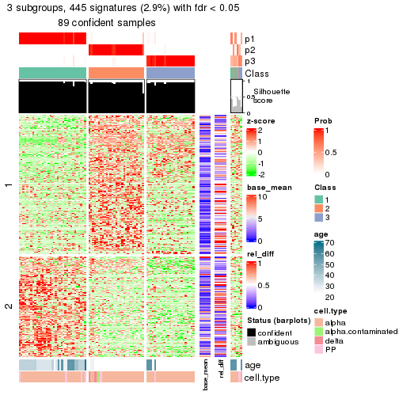</p>

</div>
<div id='tab-node-0322-get-signatures-3'>
<pre><code class="r">get_signatures(res, k = 4)
</code></pre>

<p></p>

</div>
</div>


Signature heatmaps where rows are not scaled:


<script>
$( function() {
	$( '#tabs-node-0322-get-signatures-no-scale' ).tabs();
} );
</script>
<div id='tabs-node-0322-get-signatures-no-scale'>
<ul>
<li><a href='#tab-node-0322-get-signatures-no-scale-1'>k = 2</a></li>
<li><a href='#tab-node-0322-get-signatures-no-scale-2'>k = 3</a></li>
<li><a href='#tab-node-0322-get-signatures-no-scale-3'>k = 4</a></li>
</ul>
<div id='tab-node-0322-get-signatures-no-scale-1'>
<pre><code class="r">get_signatures(res, k = 2, scale_rows = FALSE)
</code></pre>

<p>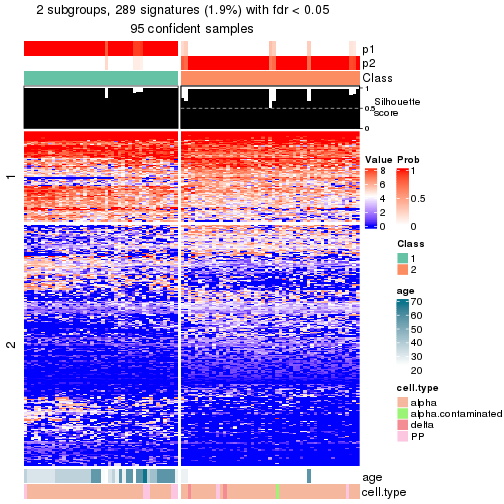</p>

</div>
<div id='tab-node-0322-get-signatures-no-scale-2'>
<pre><code class="r">get_signatures(res, k = 3, scale_rows = FALSE)
</code></pre>

<p></p>

</div>
<div id='tab-node-0322-get-signatures-no-scale-3'>
<pre><code class="r">get_signatures(res, k = 4, scale_rows = FALSE)
</code></pre>

<p></p>

</div>
</div>


Compare the overlap of signatures from different k:

```r
compare_signatures(res)
```


`get_signature()` returns a data frame invisibly. To get the list of signatures, the function
call should be assigned to a variable explicitly. In following code, if `plot` argument is set
to `FALSE`, no heatmap is plotted while only the differential analysis is performed.

```r
# code only for demonstration
tb = get_signature(res, k = ..., plot = FALSE)
```

An example of the output of `tb` is:

```
#>   which_row         fdr    mean_1    mean_2 scaled_mean_1 scaled_mean_2 km
#> 1        38 0.042760348  8.373488  9.131774    -0.5533452     0.5164555  1
#> 2        40 0.018707592  7.106213  8.469186    -0.6173731     0.5762149  1
#> 3        55 0.019134737 10.221463 11.207825    -0.6159697     0.5749050  1
#> 4        59 0.006059896  5.921854  7.869574    -0.6899429     0.6439467  1
#> 5        60 0.018055526  8.928898 10.211722    -0.6204761     0.5791110  1
#> 6        98 0.009384629 15.714769 14.887706     0.6635654    -0.6193277  2
...
```

The columns in `tb` are:

1. `which_row`: row indices corresponding to the input matrix.
2. `fdr`: FDR for the differential test. 
3. `mean_x`: The mean value in group x.
4. `scaled_mean_x`: The mean value in group x after rows are scaled.
5. `km`: Row groups if k-means clustering is applied to rows (which is done by automatically selecting number of clusters).

If there are too many signatures, `top_signatures = ...` can be set to only show the 
signatures with the highest FDRs:

```r
# code only for demonstration
# e.g. to show the top 500 most significant rows
tb = get_signature(res, k = ..., top_signatures = 500)
```

If the signatures are defined as these which are uniquely high in current group, `diff_method` argument
can be set to `"uniquely_high_in_one_group"`:

```r
# code only for demonstration
tb = get_signature(res, k = ..., diff_method = "uniquely_high_in_one_group")
```


UMAP plot which shows how samples are separated.


<script>
$( function() {
	$( '#tabs-node-0322-dimension-reduction' ).tabs();
} );
</script>
<div id='tabs-node-0322-dimension-reduction'>
<ul>
<li><a href='#tab-node-0322-dimension-reduction-1'>k = 2</a></li>
<li><a href='#tab-node-0322-dimension-reduction-2'>k = 3</a></li>
<li><a href='#tab-node-0322-dimension-reduction-3'>k = 4</a></li>
</ul>
<div id='tab-node-0322-dimension-reduction-1'>
<pre><code class="r">dimension_reduction(res, k = 2, method = &quot;UMAP&quot;)
</code></pre>

<p></p>

</div>
<div id='tab-node-0322-dimension-reduction-2'>
<pre><code class="r">dimension_reduction(res, k = 3, method = &quot;UMAP&quot;)
</code></pre>

<p></p>

</div>
<div id='tab-node-0322-dimension-reduction-3'>
<pre><code class="r">dimension_reduction(res, k = 4, method = &quot;UMAP&quot;)
</code></pre>

<p></p>

</div>
</div>


Following heatmap shows how subgroups are split when increasing `k`:

```r
collect_classes(res)
```


Test correlation between subgroups and known annotations. If the known
annotation is numeric, one-way ANOVA test is applied, and if the known
annotation is discrete, chi-squared contingency table test is applied.

```r
test_to_known_factors(res)
```

```
#>             n_sample age(p-value) cell.type(p-value) k
#> ATC:skmeans       95     9.21e-12           2.24e-01 2
#> ATC:skmeans       89     1.27e-09           2.21e-01 3
#> ATC:skmeans       90     1.67e-09           2.21e-05 4
```


If matrix rows can be associated to genes, consider to use `functional_enrichment(res,
...)` to perform function enrichment for the signature genes. See [this vignette](https://jokergoo.github.io/cola_vignettes/functional_enrichment.html) for more detailed explanations.


 

---------------------------------------------------


### Node033


Parent node: [Node03](#Node03).
Child nodes: 
                Node0111-leaf
        ,
                Node0112-leaf
        ,
                Node0121-leaf
        ,
                Node0122-leaf
        ,
                Node0131-leaf
        ,
                Node0132-leaf
        ,
                [Node0211](#Node0211)
        ,
                [Node0212](#Node0212)
        ,
                [Node0221](#Node0221)
        ,
                [Node0222](#Node0222)
        ,
                Node0231-leaf
        ,
                Node0232-leaf
        ,
                Node0233-leaf
        ,
                Node0311-leaf
        ,
                Node0312-leaf
        ,
                Node0313-leaf
        ,
                Node0314-leaf
        ,
                [Node0321](#Node0321)
        ,
                [Node0322](#Node0322)
        ,
                Node0331-leaf
        ,
                Node0332-leaf
        ,
                Node0333-leaf
        .


The object with results only for a single top-value method and a single partitioning method 
can be extracted as:

```r
res = res_rh["033"]
```

A summary of `res` and all the functions that can be applied to it:

```r
res
```

```
#> A 'ConsensusPartition' object with k = 2, 3, 4.
#>   On a matrix with 14679 rows and 53 columns.
#>   Top rows (1366) are extracted by 'ATC' method.
#>   Subgroups are detected by 'skmeans' method.
#>   Performed in total 150 partitions by row resampling.
#>   Best k for subgroups seems to be 3.
#> 
#> Following methods can be applied to this 'ConsensusPartition' object:
#>  [1] "cola_report"             "collect_classes"         "collect_plots"          
#>  [4] "collect_stats"           "colnames"                "compare_partitions"     
#>  [7] "compare_signatures"      "consensus_heatmap"       "dimension_reduction"    
#> [10] "functional_enrichment"   "get_anno_col"            "get_anno"               
#> [13] "get_classes"             "get_consensus"           "get_matrix"             
#> [16] "get_membership"          "get_param"               "get_signatures"         
#> [19] "get_stats"               "is_best_k"               "is_stable_k"            
#> [22] "membership_heatmap"      "ncol"                    "nrow"                   
#> [25] "plot_ecdf"               "predict_classes"         "rownames"               
#> [28] "select_partition_number" "show"                    "suggest_best_k"         
#> [31] "test_to_known_factors"   "top_rows_heatmap"
```

`collect_plots()` function collects all the plots made from `res` for all `k` (number of subgroups)
into one single page to provide an easy and fast comparison between different `k`.

```r
collect_plots(res)
```


The plots are:

- The first row: a plot of the eCDF (empirical cumulative distribution
  function) curves of the consensus matrix for each `k` and the heatmap of
  predicted classes for each `k`.
- The second row: heatmaps of the consensus matrix for each `k`.
- The third row: heatmaps of the membership matrix for each `k`.
- The fouth row: heatmaps of the signatures for each `k`.

All the plots in panels can be made by individual functions and they are
plotted later in this section.

`select_partition_number()` produces several plots showing different
statistics for choosing "optimized" `k`. There are following statistics:

- eCDF curves of the consensus matrix for each `k`;
- 1-PAC. [The PAC score](https://en.wikipedia.org/wiki/Consensus_clustering#Over-interpretation_potential_of_consensus_clustering)
  measures the proportion of the ambiguous subgrouping.
- Mean silhouette score.
- Concordance. The mean probability of fiting the consensus subgroup labels in all
  partitions.
- Area increased. Denote $A_k$ as the area under the eCDF curve for current
  `k`, the area increased is defined as $A_k - A_{k-1}$.
- Rand index. The percent of pairs of samples that are both in a same cluster
  or both are not in a same cluster in the partition of k and k-1.
- Jaccard index. The ratio of pairs of samples are both in a same cluster in
  the partition of k and k-1 and the pairs of samples are both in a same
  cluster in the partition k or k-1.

The detailed explanations of these statistics can be found in [the _cola_
vignette](https://jokergoo.github.io/cola_vignettes/cola.html#toc_13).

Generally speaking, higher 1-PAC score, higher mean silhouette score or higher
concordance corresponds to better partition. Rand index and Jaccard index
measure how similar the current partition is compared to partition with `k-1`.
If they are too similar, we won't accept `k` is better than `k-1`.

```r
select_partition_number(res)
```


The numeric values for all these statistics can be obtained by `get_stats()`.

```r
get_stats(res)
```

```
#>   k 1-PAC mean_silhouette concordance area_increased  Rand Jaccard
#> 2 2 1.000           1.000       1.000         0.5085 0.492   0.492
#> 3 3 1.000           0.982       0.992         0.3334 0.725   0.495
#> 4 4 0.891           0.892       0.938         0.0878 0.928   0.781
```

`suggest_best_k()` suggests the best $k$ based on these statistics. The rules are as follows:

- All $k$ with Jaccard index larger than 0.95 are removed because increasing
  $k$ does not provide enough extra information. If all $k$ are removed, it is
  marked as no subgroup is detected.
- For all $k$ with 1-PAC score larger than 0.9, the maximal $k$ is taken as
  the best $k$, and other $k$ are marked as optional $k$.
- If it does not fit the second rule. The $k$ with the maximal vote of the
  highest 1-PAC score, highest mean silhouette, and highest concordance is
  taken as the best $k$.

```r
suggest_best_k(res)
```

```
#> [1] 3
#> attr(,"optional")
#> [1] 2
```

There is also optional best $k$ = 2 that is worth to check.

Following is the table of the partitions (You need to click the **show/hide
code output** link to see it). The membership matrix (columns with name `p*`)
is inferred by
[`clue::cl_consensus()`](https://www.rdocumentation.org/link/cl_consensus?package=clue)
function with the `SE` method. Basically the value in the membership matrix
represents the probability to belong to a certain group. The finall subgroup
label for an item is determined with the group with highest probability it
belongs to.

In `get_classes()` function, the entropy is calculated from the membership
matrix and the silhouette score is calculated from the consensus matrix.


<script>
$( function() {
	$( '#tabs-node-033-get-classes' ).tabs();
} );
</script>
<div id='tabs-node-033-get-classes'>
<ul>
<li><a href='#tab-node-033-get-classes-1'>k = 2</a></li>
<li><a href='#tab-node-033-get-classes-2'>k = 3</a></li>
<li><a href='#tab-node-033-get-classes-3'>k = 4</a></li>
</ul>

<div id='tab-node-033-get-classes-1'>
<p><a id='tab-node-033-get-classes-1-a' style='color:#0366d6' href='#'>show/hide code output</a></p>
<pre><code class="r">cbind(get_classes(res, k = 2), get_membership(res, k = 2))
</code></pre>

<pre><code>#&gt;             class entropy silhouette p1 p2
#&gt; Sample_233      2       0          1  0  1
#&gt; Sample_254      1       0          1  1  0
#&gt; Sample_271      1       0          1  1  0
#&gt; Sample_278      2       0          1  0  1
#&gt; Sample_288      1       0          1  1  0
#&gt; Sample_289      2       0          1  0  1
#&gt; Sample_331      2       0          1  0  1
#&gt; Sample_339      1       0          1  1  0
#&gt; Sample_371      1       0          1  1  0
#&gt; Sample_415      2       0          1  0  1
#&gt; Sample_420      2       0          1  0  1
#&gt; Sample_422      2       0          1  0  1
#&gt; Sample_436      1       0          1  1  0
#&gt; Sample_437      2       0          1  0  1
#&gt; Sample_488      1       0          1  1  0
#&gt; Sample_512      2       0          1  0  1
#&gt; Sample_529      1       0          1  1  0
#&gt; Sample_531      2       0          1  0  1
#&gt; Sample_545      1       0          1  1  0
#&gt; Sample_553      2       0          1  0  1
#&gt; Sample_574      1       0          1  1  0
#&gt; Sample_975      1       0          1  1  0
#&gt; Sample_1004     2       0          1  0  1
#&gt; Sample_1031     2       0          1  0  1
#&gt; Sample_1045     2       0          1  0  1
#&gt; Sample_1048     1       0          1  1  0
#&gt; Sample_1086     1       0          1  1  0
#&gt; Sample_1088     1       0          1  1  0
#&gt; Sample_1089     2       0          1  0  1
#&gt; Sample_1120     2       0          1  0  1
#&gt; Sample_1122     1       0          1  1  0
#&gt; Sample_1132     2       0          1  0  1
#&gt; Sample_1134     1       0          1  1  0
#&gt; Sample_1140     1       0          1  1  0
#&gt; Sample_1183     1       0          1  1  0
#&gt; Sample_1184     1       0          1  1  0
#&gt; Sample_1255     2       0          1  0  1
#&gt; Sample_1268     2       0          1  0  1
#&gt; Sample_1296     1       0          1  1  0
#&gt; Sample_1306     2       0          1  0  1
#&gt; Sample_1310     2       0          1  0  1
#&gt; Sample_1337     2       0          1  0  1
#&gt; Sample_1339     2       0          1  0  1
#&gt; Sample_1345     2       0          1  0  1
#&gt; Sample_1376     2       0          1  0  1
#&gt; Sample_1400     1       0          1  1  0
#&gt; Sample_1413     1       0          1  1  0
#&gt; Sample_1416     2       0          1  0  1
#&gt; Sample_1460     1       0          1  1  0
#&gt; Sample_1486     1       0          1  1  0
#&gt; Sample_1494     2       0          1  0  1
#&gt; Sample_1504     2       0          1  0  1
#&gt; Sample_1505     1       0          1  1  0
</code></pre>

<script>
$('#tab-node-033-get-classes-1-a').parent().next().next().hide();
$('#tab-node-033-get-classes-1-a').click(function(){
  $('#tab-node-033-get-classes-1-a').parent().next().next().toggle();
  return(false);
});
</script>
</div>

<div id='tab-node-033-get-classes-2'>
<p><a id='tab-node-033-get-classes-2-a' style='color:#0366d6' href='#'>show/hide code output</a></p>
<pre><code class="r">cbind(get_classes(res, k = 3), get_membership(res, k = 3))
</code></pre>

<pre><code>#&gt;             class entropy silhouette   p1   p2   p3
#&gt; Sample_233      3   0.000      0.972 0.00 0.00 1.00
#&gt; Sample_254      3   0.000      0.972 0.00 0.00 1.00
#&gt; Sample_271      3   0.254      0.905 0.08 0.00 0.92
#&gt; Sample_278      3   0.000      0.972 0.00 0.00 1.00
#&gt; Sample_288      3   0.000      0.972 0.00 0.00 1.00
#&gt; Sample_289      3   0.000      0.972 0.00 0.00 1.00
#&gt; Sample_331      3   0.000      0.972 0.00 0.00 1.00
#&gt; Sample_339      3   0.000      0.972 0.00 0.00 1.00
#&gt; Sample_371      3   0.000      0.972 0.00 0.00 1.00
#&gt; Sample_415      3   0.000      0.972 0.00 0.00 1.00
#&gt; Sample_420      3   0.000      0.972 0.00 0.00 1.00
#&gt; Sample_422      3   0.000      0.972 0.00 0.00 1.00
#&gt; Sample_436      3   0.000      0.972 0.00 0.00 1.00
#&gt; Sample_437      3   0.540      0.613 0.00 0.28 0.72
#&gt; Sample_488      1   0.000      1.000 1.00 0.00 0.00
#&gt; Sample_512      2   0.000      1.000 0.00 1.00 0.00
#&gt; Sample_529      1   0.000      1.000 1.00 0.00 0.00
#&gt; Sample_531      2   0.000      1.000 0.00 1.00 0.00
#&gt; Sample_545      1   0.000      1.000 1.00 0.00 0.00
#&gt; Sample_553      2   0.000      1.000 0.00 1.00 0.00
#&gt; Sample_574      3   0.000      0.972 0.00 0.00 1.00
#&gt; Sample_975      3   0.254      0.905 0.08 0.00 0.92
#&gt; Sample_1004     3   0.000      0.972 0.00 0.00 1.00
#&gt; Sample_1031     2   0.000      1.000 0.00 1.00 0.00
#&gt; Sample_1045     2   0.000      1.000 0.00 1.00 0.00
#&gt; Sample_1048     1   0.000      1.000 1.00 0.00 0.00
#&gt; Sample_1086     1   0.000      1.000 1.00 0.00 0.00
#&gt; Sample_1088     1   0.000      1.000 1.00 0.00 0.00
#&gt; Sample_1089     2   0.000      1.000 0.00 1.00 0.00
#&gt; Sample_1120     2   0.000      1.000 0.00 1.00 0.00
#&gt; Sample_1122     1   0.000      1.000 1.00 0.00 0.00
#&gt; Sample_1132     2   0.000      1.000 0.00 1.00 0.00
#&gt; Sample_1134     1   0.000      1.000 1.00 0.00 0.00
#&gt; Sample_1140     1   0.000      1.000 1.00 0.00 0.00
#&gt; Sample_1183     1   0.000      1.000 1.00 0.00 0.00
#&gt; Sample_1184     1   0.000      1.000 1.00 0.00 0.00
#&gt; Sample_1255     2   0.000      1.000 0.00 1.00 0.00
#&gt; Sample_1268     2   0.000      1.000 0.00 1.00 0.00
#&gt; Sample_1296     1   0.000      1.000 1.00 0.00 0.00
#&gt; Sample_1306     2   0.000      1.000 0.00 1.00 0.00
#&gt; Sample_1310     2   0.000      1.000 0.00 1.00 0.00
#&gt; Sample_1337     2   0.000      1.000 0.00 1.00 0.00
#&gt; Sample_1339     2   0.000      1.000 0.00 1.00 0.00
#&gt; Sample_1345     2   0.000      1.000 0.00 1.00 0.00
#&gt; Sample_1376     2   0.000      1.000 0.00 1.00 0.00
#&gt; Sample_1400     1   0.000      1.000 1.00 0.00 0.00
#&gt; Sample_1413     1   0.000      1.000 1.00 0.00 0.00
#&gt; Sample_1416     2   0.000      1.000 0.00 1.00 0.00
#&gt; Sample_1460     1   0.000      1.000 1.00 0.00 0.00
#&gt; Sample_1486     1   0.000      1.000 1.00 0.00 0.00
#&gt; Sample_1494     2   0.000      1.000 0.00 1.00 0.00
#&gt; Sample_1504     2   0.000      1.000 0.00 1.00 0.00
#&gt; Sample_1505     1   0.000      1.000 1.00 0.00 0.00
</code></pre>

<script>
$('#tab-node-033-get-classes-2-a').parent().next().next().hide();
$('#tab-node-033-get-classes-2-a').click(function(){
  $('#tab-node-033-get-classes-2-a').parent().next().next().toggle();
  return(false);
});
</script>
</div>

<div id='tab-node-033-get-classes-3'>
<p><a id='tab-node-033-get-classes-3-a' style='color:#0366d6' href='#'>show/hide code output</a></p>
<pre><code class="r">cbind(get_classes(res, k = 4), get_membership(res, k = 4))
</code></pre>

<pre><code>#&gt;             class entropy silhouette   p1   p2   p3   p4
#&gt; Sample_233      3  0.0707      0.896 0.00 0.00 0.98 0.02
#&gt; Sample_254      4  0.3801      0.774 0.00 0.00 0.22 0.78
#&gt; Sample_271      4  0.3801      0.758 0.22 0.00 0.00 0.78
#&gt; Sample_278      3  0.2011      0.841 0.00 0.00 0.92 0.08
#&gt; Sample_288      4  0.4277      0.706 0.00 0.00 0.28 0.72
#&gt; Sample_289      3  0.1637      0.865 0.00 0.00 0.94 0.06
#&gt; Sample_331      3  0.0000      0.907 0.00 0.00 1.00 0.00
#&gt; Sample_339      4  0.3801      0.774 0.00 0.00 0.22 0.78
#&gt; Sample_371      4  0.0000      0.779 0.00 0.00 0.00 1.00
#&gt; Sample_415      3  0.0000      0.907 0.00 0.00 1.00 0.00
#&gt; Sample_420      3  0.0000      0.907 0.00 0.00 1.00 0.00
#&gt; Sample_422      3  0.0000      0.907 0.00 0.00 1.00 0.00
#&gt; Sample_436      4  0.4894      0.806 0.12 0.00 0.10 0.78
#&gt; Sample_437      3  0.0000      0.907 0.00 0.00 1.00 0.00
#&gt; Sample_488      1  0.2011      0.893 0.92 0.00 0.00 0.08
#&gt; Sample_512      2  0.0000      0.989 0.00 1.00 0.00 0.00
#&gt; Sample_529      1  0.0000      0.924 1.00 0.00 0.00 0.00
#&gt; Sample_531      2  0.0000      0.989 0.00 1.00 0.00 0.00
#&gt; Sample_545      1  0.3801      0.823 0.78 0.00 0.00 0.22
#&gt; Sample_553      2  0.0000      0.989 0.00 1.00 0.00 0.00
#&gt; Sample_574      4  0.0000      0.779 0.00 0.00 0.00 1.00
#&gt; Sample_975      4  0.3172      0.792 0.16 0.00 0.00 0.84
#&gt; Sample_1004     3  0.0000      0.907 0.00 0.00 1.00 0.00
#&gt; Sample_1031     2  0.0000      0.989 0.00 1.00 0.00 0.00
#&gt; Sample_1045     2  0.0000      0.989 0.00 1.00 0.00 0.00
#&gt; Sample_1048     1  0.0000      0.924 1.00 0.00 0.00 0.00
#&gt; Sample_1086     1  0.0000      0.924 1.00 0.00 0.00 0.00
#&gt; Sample_1088     1  0.0000      0.924 1.00 0.00 0.00 0.00
#&gt; Sample_1089     2  0.0000      0.989 0.00 1.00 0.00 0.00
#&gt; Sample_1120     2  0.0000      0.989 0.00 1.00 0.00 0.00
#&gt; Sample_1122     1  0.0000      0.924 1.00 0.00 0.00 0.00
#&gt; Sample_1132     2  0.0000      0.989 0.00 1.00 0.00 0.00
#&gt; Sample_1134     1  0.0000      0.924 1.00 0.00 0.00 0.00
#&gt; Sample_1140     1  0.0000      0.924 1.00 0.00 0.00 0.00
#&gt; Sample_1183     1  0.0000      0.924 1.00 0.00 0.00 0.00
#&gt; Sample_1184     1  0.0000      0.924 1.00 0.00 0.00 0.00
#&gt; Sample_1255     2  0.1637      0.941 0.00 0.94 0.06 0.00
#&gt; Sample_1268     2  0.0000      0.989 0.00 1.00 0.00 0.00
#&gt; Sample_1296     1  0.0000      0.924 1.00 0.00 0.00 0.00
#&gt; Sample_1306     3  0.4907      0.254 0.00 0.42 0.58 0.00
#&gt; Sample_1310     2  0.0000      0.989 0.00 1.00 0.00 0.00
#&gt; Sample_1337     2  0.0000      0.989 0.00 1.00 0.00 0.00
#&gt; Sample_1339     2  0.0000      0.989 0.00 1.00 0.00 0.00
#&gt; Sample_1345     2  0.0000      0.989 0.00 1.00 0.00 0.00
#&gt; Sample_1376     2  0.0000      0.989 0.00 1.00 0.00 0.00
#&gt; Sample_1400     1  0.3801      0.823 0.78 0.00 0.00 0.22
#&gt; Sample_1413     1  0.3801      0.823 0.78 0.00 0.00 0.22
#&gt; Sample_1416     2  0.1637      0.941 0.00 0.94 0.06 0.00
#&gt; Sample_1460     1  0.3801      0.823 0.78 0.00 0.00 0.22
#&gt; Sample_1486     1  0.0000      0.924 1.00 0.00 0.00 0.00
#&gt; Sample_1494     2  0.0000      0.989 0.00 1.00 0.00 0.00
#&gt; Sample_1504     2  0.1637      0.940 0.00 0.94 0.06 0.00
#&gt; Sample_1505     1  0.3801      0.823 0.78 0.00 0.00 0.22
</code></pre>

<script>
$('#tab-node-033-get-classes-3-a').parent().next().next().hide();
$('#tab-node-033-get-classes-3-a').click(function(){
  $('#tab-node-033-get-classes-3-a').parent().next().next().toggle();
  return(false);
});
</script>
</div>
</div>

Heatmaps for the consensus matrix. It visualizes the probability of two
samples to be in a same group.


<script>
$( function() {
	$( '#tabs-node-033-consensus-heatmap' ).tabs();
} );
</script>
<div id='tabs-node-033-consensus-heatmap'>
<ul>
<li><a href='#tab-node-033-consensus-heatmap-1'>k = 2</a></li>
<li><a href='#tab-node-033-consensus-heatmap-2'>k = 3</a></li>
<li><a href='#tab-node-033-consensus-heatmap-3'>k = 4</a></li>
</ul>
<div id='tab-node-033-consensus-heatmap-1'>
<pre><code class="r">consensus_heatmap(res, k = 2)
</code></pre>

<p></p>

</div>
<div id='tab-node-033-consensus-heatmap-2'>
<pre><code class="r">consensus_heatmap(res, k = 3)
</code></pre>

<p></p>

</div>
<div id='tab-node-033-consensus-heatmap-3'>
<pre><code class="r">consensus_heatmap(res, k = 4)
</code></pre>

<p></p>

</div>
</div>

Heatmaps for the membership of samples in all partitions to see how consistent they are:


<script>
$( function() {
	$( '#tabs-node-033-membership-heatmap' ).tabs();
} );
</script>
<div id='tabs-node-033-membership-heatmap'>
<ul>
<li><a href='#tab-node-033-membership-heatmap-1'>k = 2</a></li>
<li><a href='#tab-node-033-membership-heatmap-2'>k = 3</a></li>
<li><a href='#tab-node-033-membership-heatmap-3'>k = 4</a></li>
</ul>
<div id='tab-node-033-membership-heatmap-1'>
<pre><code class="r">membership_heatmap(res, k = 2)
</code></pre>

<p></p>

</div>
<div id='tab-node-033-membership-heatmap-2'>
<pre><code class="r">membership_heatmap(res, k = 3)
</code></pre>

<p></p>

</div>
<div id='tab-node-033-membership-heatmap-3'>
<pre><code class="r">membership_heatmap(res, k = 4)
</code></pre>

<p></p>

</div>
</div>

As soon as the classes for columns are determined, the signatures
that are significantly different between subgroups can be looked for. 
Following are the heatmaps for signatures.


Signature heatmaps where rows are scaled:


<script>
$( function() {
	$( '#tabs-node-033-get-signatures' ).tabs();
} );
</script>
<div id='tabs-node-033-get-signatures'>
<ul>
<li><a href='#tab-node-033-get-signatures-1'>k = 2</a></li>
<li><a href='#tab-node-033-get-signatures-2'>k = 3</a></li>
<li><a href='#tab-node-033-get-signatures-3'>k = 4</a></li>
</ul>
<div id='tab-node-033-get-signatures-1'>
<pre><code class="r">get_signatures(res, k = 2)
</code></pre>

<p></p>

</div>
<div id='tab-node-033-get-signatures-2'>
<pre><code class="r">get_signatures(res, k = 3)
</code></pre>

<p></p>

</div>
<div id='tab-node-033-get-signatures-3'>
<pre><code class="r">get_signatures(res, k = 4)
</code></pre>

<p></p>

</div>
</div>


Signature heatmaps where rows are not scaled:


<script>
$( function() {
	$( '#tabs-node-033-get-signatures-no-scale' ).tabs();
} );
</script>
<div id='tabs-node-033-get-signatures-no-scale'>
<ul>
<li><a href='#tab-node-033-get-signatures-no-scale-1'>k = 2</a></li>
<li><a href='#tab-node-033-get-signatures-no-scale-2'>k = 3</a></li>
<li><a href='#tab-node-033-get-signatures-no-scale-3'>k = 4</a></li>
</ul>
<div id='tab-node-033-get-signatures-no-scale-1'>
<pre><code class="r">get_signatures(res, k = 2, scale_rows = FALSE)
</code></pre>

<p></p>

</div>
<div id='tab-node-033-get-signatures-no-scale-2'>
<pre><code class="r">get_signatures(res, k = 3, scale_rows = FALSE)
</code></pre>

<p></p>

</div>
<div id='tab-node-033-get-signatures-no-scale-3'>
<pre><code class="r">get_signatures(res, k = 4, scale_rows = FALSE)
</code></pre>

<p></p>

</div>
</div>


Compare the overlap of signatures from different k:

```r
compare_signatures(res)
```


`get_signature()` returns a data frame invisibly. To get the list of signatures, the function
call should be assigned to a variable explicitly. In following code, if `plot` argument is set
to `FALSE`, no heatmap is plotted while only the differential analysis is performed.

```r
# code only for demonstration
tb = get_signature(res, k = ..., plot = FALSE)
```

An example of the output of `tb` is:

```
#>   which_row         fdr    mean_1    mean_2 scaled_mean_1 scaled_mean_2 km
#> 1        38 0.042760348  8.373488  9.131774    -0.5533452     0.5164555  1
#> 2        40 0.018707592  7.106213  8.469186    -0.6173731     0.5762149  1
#> 3        55 0.019134737 10.221463 11.207825    -0.6159697     0.5749050  1
#> 4        59 0.006059896  5.921854  7.869574    -0.6899429     0.6439467  1
#> 5        60 0.018055526  8.928898 10.211722    -0.6204761     0.5791110  1
#> 6        98 0.009384629 15.714769 14.887706     0.6635654    -0.6193277  2
...
```

The columns in `tb` are:

1. `which_row`: row indices corresponding to the input matrix.
2. `fdr`: FDR for the differential test. 
3. `mean_x`: The mean value in group x.
4. `scaled_mean_x`: The mean value in group x after rows are scaled.
5. `km`: Row groups if k-means clustering is applied to rows (which is done by automatically selecting number of clusters).

If there are too many signatures, `top_signatures = ...` can be set to only show the 
signatures with the highest FDRs:

```r
# code only for demonstration
# e.g. to show the top 500 most significant rows
tb = get_signature(res, k = ..., top_signatures = 500)
```

If the signatures are defined as these which are uniquely high in current group, `diff_method` argument
can be set to `"uniquely_high_in_one_group"`:

```r
# code only for demonstration
tb = get_signature(res, k = ..., diff_method = "uniquely_high_in_one_group")
```


UMAP plot which shows how samples are separated.


<script>
$( function() {
	$( '#tabs-node-033-dimension-reduction' ).tabs();
} );
</script>
<div id='tabs-node-033-dimension-reduction'>
<ul>
<li><a href='#tab-node-033-dimension-reduction-1'>k = 2</a></li>
<li><a href='#tab-node-033-dimension-reduction-2'>k = 3</a></li>
<li><a href='#tab-node-033-dimension-reduction-3'>k = 4</a></li>
</ul>
<div id='tab-node-033-dimension-reduction-1'>
<pre><code class="r">dimension_reduction(res, k = 2, method = &quot;UMAP&quot;)
</code></pre>

<p></p>

</div>
<div id='tab-node-033-dimension-reduction-2'>
<pre><code class="r">dimension_reduction(res, k = 3, method = &quot;UMAP&quot;)
</code></pre>

<p></p>

</div>
<div id='tab-node-033-dimension-reduction-3'>
<pre><code class="r">dimension_reduction(res, k = 4, method = &quot;UMAP&quot;)
</code></pre>

<p></p>

</div>
</div>


Following heatmap shows how subgroups are split when increasing `k`:

```r
collect_classes(res)
```


Test correlation between subgroups and known annotations. If the known
annotation is numeric, one-way ANOVA test is applied, and if the known
annotation is discrete, chi-squared contingency table test is applied.

```r
test_to_known_factors(res)
```

```
#>             n_sample age(p-value) cell.type(p-value) k
#> ATC:skmeans       53        0.935              1.000 2
#> ATC:skmeans       53        0.238              0.340 3
#> ATC:skmeans       52        0.461              0.181 4
```


If matrix rows can be associated to genes, consider to use `functional_enrichment(res,
...)` to perform function enrichment for the signature genes. See [this vignette](https://jokergoo.github.io/cola_vignettes/functional_enrichment.html) for more detailed explanations.


 

## Session info


```r
sessionInfo()
```

```
#> R version 4.1.0 (2021-05-18)
#> Platform: x86_64-pc-linux-gnu (64-bit)
#> Running under: CentOS Linux 7 (Core)
#> 
#> Matrix products: default
#> BLAS/LAPACK: /usr/lib64/libopenblas-r0.3.3.so
#> 
#> locale:
#>  [1] LC_CTYPE=en_US.UTF-8       LC_NUMERIC=C               LC_TIME=en_US.UTF-8       
#>  [4] LC_COLLATE=en_US.UTF-8     LC_MONETARY=en_US.UTF-8    LC_MESSAGES=en_US.UTF-8   
#>  [7] LC_PAPER=en_US.UTF-8       LC_NAME=C                  LC_ADDRESS=C              
#> [10] LC_TELEPHONE=C             LC_MEASUREMENT=en_US.UTF-8 LC_IDENTIFICATION=C       
#> 
#> attached base packages:
#>  [1] grid      parallel  stats4    stats     graphics  grDevices utils     datasets  methods  
#> [10] base     
#> 
#> other attached packages:
#>  [1] genefilter_1.74.0           ComplexHeatmap_2.8.0        markdown_1.1               
#>  [4] knitr_1.33                  scRNAseq_2.6.1              SingleCellExperiment_1.14.1
#>  [7] SummarizedExperiment_1.22.0 Biobase_2.52.0              GenomicRanges_1.44.0       
#> [10] GenomeInfoDb_1.28.1         IRanges_2.26.0              S4Vectors_0.30.0           
#> [13] BiocGenerics_0.38.0         MatrixGenerics_1.4.0        matrixStats_0.59.0         
#> [16] cola_1.9.4                 
#> 
#> loaded via a namespace (and not attached):
#>   [1] circlize_0.4.13               AnnotationHub_3.0.1           BiocFileCache_2.0.0          
#>   [4] lazyeval_0.2.2                polylabelr_0.2.0              splines_4.1.0                
#>   [7] Polychrome_1.3.1              BiocParallel_1.26.1           ggplot2_3.3.5                
#>  [10] digest_0.6.27                 foreach_1.5.1                 ensembldb_2.16.3             
#>  [13] htmltools_0.5.1.1             viridis_0.6.1                 fansi_0.5.0                  
#>  [16] magrittr_2.0.1                memoise_2.0.0                 cluster_2.1.2                
#>  [19] doParallel_1.0.16             Biostrings_2.60.1             annotate_1.70.0              
#>  [22] askpass_1.1                   prettyunits_1.1.1             colorspace_2.0-2             
#>  [25] blob_1.2.1                    rappdirs_0.3.3                xfun_0.24                    
#>  [28] dplyr_1.0.7                   crayon_1.4.1                  RCurl_1.98-1.3               
#>  [31] microbenchmark_1.4-7          jsonlite_1.7.2                impute_1.66.0                
#>  [34] brew_1.0-6                    survival_3.2-11               iterators_1.0.13             
#>  [37] glue_1.4.2                    polyclip_1.10-0               gtable_0.3.0                 
#>  [40] zlibbioc_1.38.0               XVector_0.32.0                GetoptLong_1.0.5             
#>  [43] DelayedArray_0.18.0           shape_1.4.6                   scales_1.1.1                 
#>  [46] data.tree_1.0.0               DBI_1.1.1                     Rcpp_1.0.7                   
#>  [49] viridisLite_0.4.0             xtable_1.8-4                  progress_1.2.2               
#>  [52] clue_0.3-59                   reticulate_1.20               bit_4.0.4                    
#>  [55] mclust_5.4.7                  umap_0.2.7.0                  httr_1.4.2                   
#>  [58] RColorBrewer_1.1-2            ellipsis_0.3.2                pkgconfig_2.0.3              
#>  [61] XML_3.99-0.6                  dbplyr_2.1.1                  utf8_1.2.1                   
#>  [64] tidyselect_1.1.1              rlang_0.4.11                  later_1.2.0                  
#>  [67] AnnotationDbi_1.54.1          munsell_0.5.0                 BiocVersion_3.13.1           
#>  [70] tools_4.1.0                   cachem_1.0.5                  generics_0.1.0               
#>  [73] RSQLite_2.2.7                 ExperimentHub_2.0.0           evaluate_0.14                
#>  [76] stringr_1.4.0                 fastmap_1.1.0                 yaml_2.2.1                   
#>  [79] bit64_4.0.5                   purrr_0.3.4                   dendextend_1.15.1            
#>  [82] KEGGREST_1.32.0               AnnotationFilter_1.16.0       mime_0.11                    
#>  [85] slam_0.1-48                   xml2_1.3.2                    biomaRt_2.48.2               
#>  [88] compiler_4.1.0                rstudioapi_0.13               filelock_1.0.2               
#>  [91] curl_4.3.2                    png_0.1-7                     interactiveDisplayBase_1.30.0
#>  [94] tibble_3.1.2                  stringi_1.7.3                 highr_0.9                    
#>  [97] GenomicFeatures_1.44.0        RSpectra_0.16-0               lattice_0.20-44              
#> [100] ProtGenerics_1.24.0           Matrix_1.3-4                  vctrs_0.3.8                  
#> [103] pillar_1.6.1                  lifecycle_1.0.0               BiocManager_1.30.16          
#> [106] eulerr_6.1.0                  GlobalOptions_0.1.2           bitops_1.0-7                 
#> [109] irlba_2.3.3                   httpuv_1.6.1                  rtracklayer_1.52.0           
#> [112] R6_2.5.0                      BiocIO_1.2.0                  promises_1.2.0.1             
#> [115] gridExtra_2.3                 codetools_0.2-18              assertthat_0.2.1             
#> [118] openssl_1.4.4                 rjson_0.2.20                  GenomicAlignments_1.28.0     
#> [121] Rsamtools_2.8.0               GenomeInfoDbData_1.2.6        hms_1.1.0                    
#> [124] skmeans_0.2-13                Cairo_1.5-12.2                scatterplot3d_0.3-41         
#> [127] shiny_1.6.0                   restfulr_0.0.13
```


